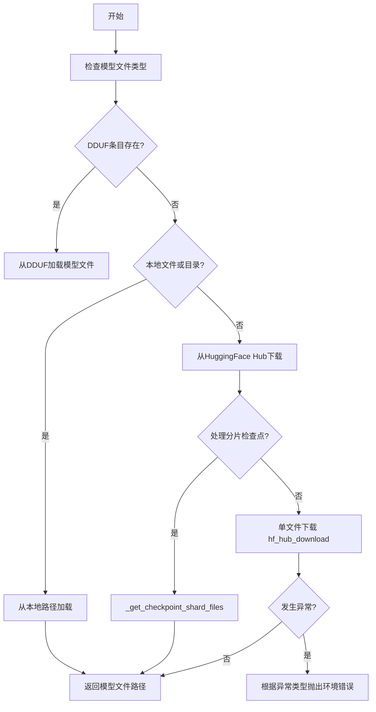
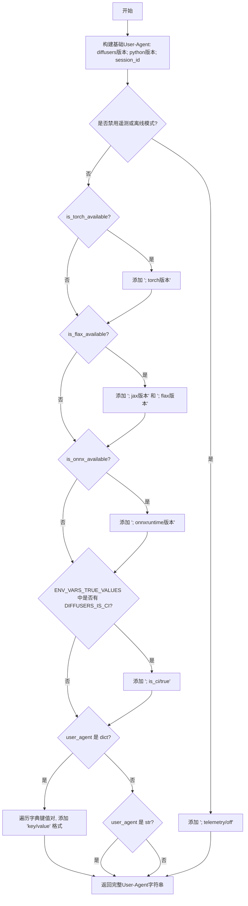
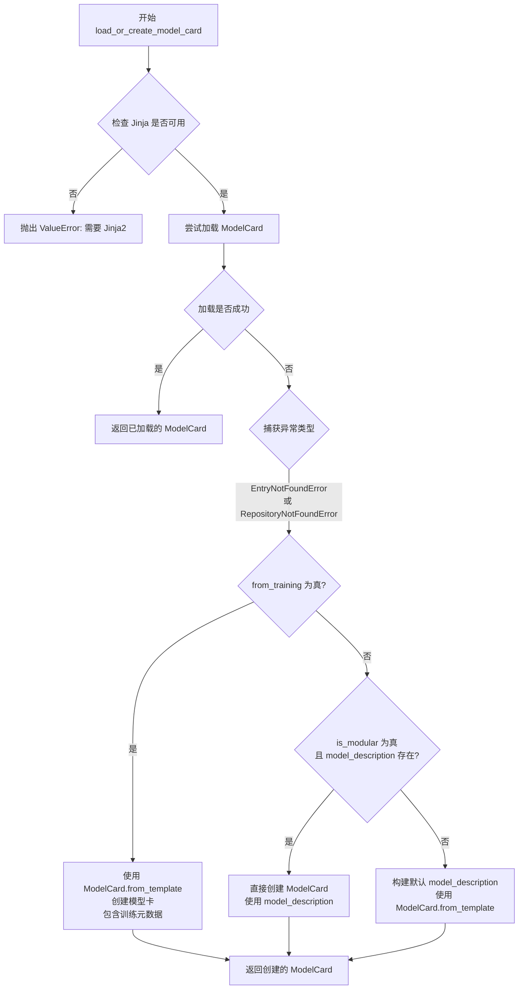
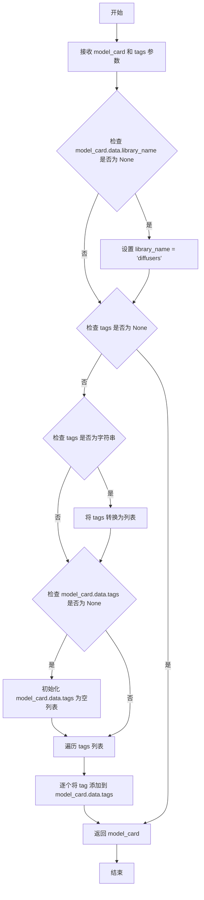
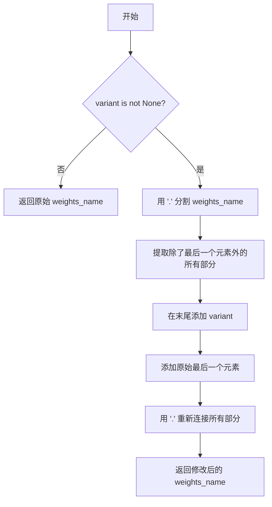
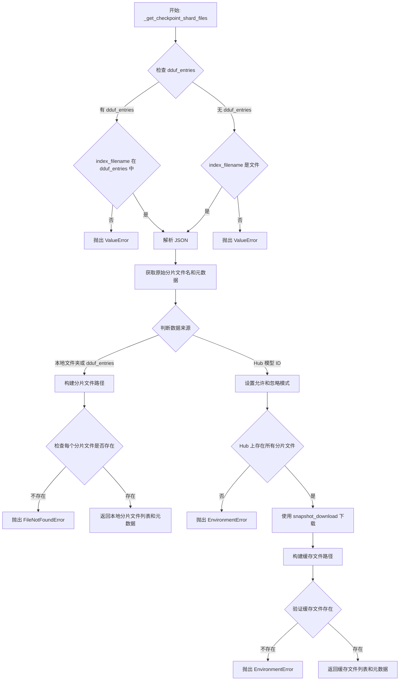
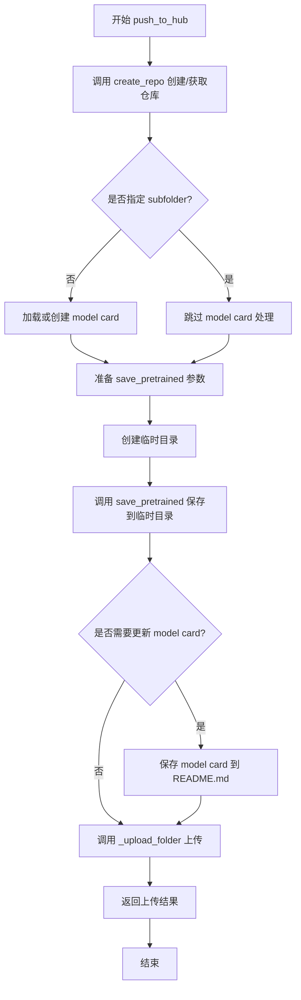

# `diffusers\src\diffusers\utils\hub_utils.py` 详细设计文档

该文件是HuggingFace diffusers库的核心工具模块，主要负责模型文件的下载、缓存、分片加载，以及模型卡片（Model Card）的创建、填充和推送到Hugging Face Hub，同时提供了模型上传的Mixin类。

## 整体流程



## 类结构

```
Global Functions
├── http_user_agent
├── load_or_create_model_card
├── populate_model_card
├── extract_commit_hash
├── _add_variant
├── _get_model_file
├── _get_checkpoint_shard_files
└── _check_legacy_sharding_variant_format
PushToHubMixin (Mixin类)
├── _upload_folder
└── push_to_hub
```

## 全局变量及字段


### `MODEL_CARD_TEMPLATE_PATH`
    
模型卡片模板文件的路径对象，用于创建和加载Hugging Face模型卡片

类型：`Path`
    


### `SESSION_ID`
    
当前会话的唯一标识符，由UUID生成，用于HTTP用户代理字符串中追踪请求会话

类型：`str`
    


    

## 全局函数及方法


### `http_user_agent`

该函数用于生成包含请求基本信息的User-Agent字符串，聚合diffusers版本、Python版本、会话ID以及可选的torch、jax、flax、onnxruntime等库的版本信息，用于HTTP请求的标识。

参数：

- `user_agent`：`dict | str | None`，可选参数，用于添加额外的用户代理信息，可以是字典（键值对形式）、字符串或None

返回值：`str`，返回格式化的User-Agent字符串

#### 流程图



#### 带注释源码

```python
def http_user_agent(user_agent: dict | str | None = None) -> str:
    """
    Formats a user-agent string with basic info about a request.
    """
    # 构建基础User-Agent字符串，包含diffusers版本、Python版本和会话ID
    ua = f"diffusers/{__version__}; python/{sys.version.split()[0]}; session_id/{SESSION_ID}"
    
    # 如果禁用了遥测或处于离线模式，直接返回并标记telemetry/off
    if HF_HUB_DISABLE_TELEMETRY or HF_HUB_OFFLINE:
        return ua + "; telemetry/off"
    
    # 如果torch可用，添加torch版本信息
    if is_torch_available():
        ua += f"; torch/{_torch_version}"
    
    # 如果flax可用，添加jax和flax版本信息
    if is_flax_available():
        ua += f"; jax/{_jax_version}"
        ua += f"; flax/{_flax_version}"
    
    # 如果onnx可用，添加onnxruntime版本信息
    if is_onnx_available():
        ua += f"; onnxruntime/{_onnxruntime_version}"
    
    # CI环境变量检查，如果处于CI环境则添加标记
    # CI will set this value to True
    if os.environ.get("DIFFUSERS_IS_CI", "").upper() in ENV_VARS_TRUE_VALUES:
        ua += "; is_ci/true"
    
    # 处理额外的用户代理信息
    # 如果是字典，遍历键值对并格式化为 "key/value" 形式
    if isinstance(user_agent, dict):
        ua += "; " + "; ".join(f"{k}/{v}" for k, v in user_agent.items())
    # 如果是字符串，直接追加
    elif isinstance(user_agent, str):
        ua += "; " + user_agent
    
    # 返回完整的User-Agent字符串
    return ua
```


### `load_or_create_model_card`

该函数用于加载或创建 Hugging Face Hub 上的模型卡（Model Card）。它首先尝试从指定的仓库或本地路径加载模型卡，如果不存在则根据不同场景（训练脚本、模块化管道等）使用模板创建新的模型卡，并支持添加训练元数据（如基础模型、提示词、许可证等）。

参数：

- `repo_id_or_path`：`str`，仓库ID（例如 "stable-diffusion-v1-5/stable-diffusion-v1-5"）或本地路径，用于查找模型卡
- `token`：`str | None`，认证令牌，默认为存储的令牌
- `is_pipeline`：`bool`，指示是否为 [`DiffusionPipeline`] 添加标签
- `from_training`：`bool`，指示模型卡是否来自训练脚本
- `model_description`：`str | None`，模型描述信息
- `base_model`：`str`，基础模型标识符，用于 DreamBooth 类训练
- `prompt`：`str | None`，训练使用的提示词
- `license`：`str | None`，输出工件的许可证
- `widget`：`list[dict] | None`，跟随图库模板的 widget 配置
- `inference`：`bool | None`，是否开启推理 widget
- `is_modular`：`bool`，指示模型卡是否为模块化管道

返回值：`ModelCard`，加载或创建的模型卡对象

#### 流程图



#### 带注释源码

```python
def load_or_create_model_card(
    repo_id_or_path: str = None,
    token: str | None = None,
    is_pipeline: bool = False,
    from_training: bool = False,
    model_description: str | None = None,
    base_model: str = None,
    prompt: str | None = None,
    license: str | None = None,
    widget: list[dict] | None = None,
    inference: bool | None = None,
    is_modular: bool = False,
) -> ModelCard:
    """
    Loads or creates a model card.

    Args:
        repo_id_or_path (`str`):
            The repo id (e.g., "stable-diffusion-v1-5/stable-diffusion-v1-5") or local path where to look for the model
            card.
        token (`str`, *optional*):
            Authentication token. Will default to the stored token. See https://huggingface.co/settings/token for more
            details.
        is_pipeline (`bool`):
            Boolean to indicate if we're adding tag to a [`DiffusionPipeline`].
        from_training: (`bool`): Boolean flag to denote if the model card is being created from a training script.
        model_description (`str`, *optional*): Model description to add to the model card. Helpful when using
            `load_or_create_model_card` from a training script.
        base_model (`str`): Base model identifier (e.g., "stabilityai/stable-diffusion-xl-base-1.0"). Useful
            for DreamBooth-like training.
        prompt (`str`, *optional*): Prompt used for training. Useful for DreamBooth-like training.
        license: (`str`, *optional*): License of the output artifact. Helpful when using
            `load_or_create_model_card` from a training script.
        widget (`list[dict]`, *optional*): Widget to accompany a gallery template.
        inference: (`bool`, optional): Whether to turn on inference widget. Helpful when using
            `load_or_create_model_card` from a training script.
        is_modular: (`bool`, optional): Boolean flag to denote if the model card is for a modular pipeline.
            When True, uses model_description as-is without additional template formatting.
    """
    # 检查 Jinja 模板引擎是否可用，模型卡渲染依赖 Jinja
    if not is_jinja_available():
        raise ValueError(
            "Modelcard rendering is based on Jinja templates."
            " Please make sure to have `jinja` installed before using `load_or_create_model_card`."
            " To install it, please run `pip install Jinja2`."
        )

    try:
        # 尝试从远程仓库加载模型卡
        model_card = ModelCard.load(repo_id_or_path, token=token)
    except (EntryNotFoundError, RepositoryNotFoundError):
        # 如果模型卡不存在，则根据场景创建新的模型卡
        if from_training:
            # 来自训练脚本：使用模板创建，包含训练元数据
            model_card = ModelCard.from_template(
                card_data=ModelCardData(  # Card metadata object that will be converted to YAML block
                    license=license,
                    library_name="diffusers",
                    inference=inference,
                    base_model=base_model,
                    instance_prompt=prompt,
                    widget=widget,
                ),
                template_path=MODEL_CARD_TEMPLATE_PATH,
                model_description=model_description,
            )
        else:
            card_data = ModelCardData()
            if is_modular and model_description is not None:
                # 模块化管道：直接使用提供的描述
                model_card = ModelCard(model_description)
                model_card.data = card_data
            else:
                # 非模块化：构建默认描述
                component = "pipeline" if is_pipeline else "model"
                if model_description is None:
                    model_description = f"This is the model card of a 🧨 diffusers {component} that has been pushed on the Hub. This model card has been automatically generated."
                model_card = ModelCard.from_template(card_data, model_description=model_description)

    return model_card
```


### `populate_model_card`

该函数用于向模型卡片（ModelCard）对象填充库名称和可选的标签信息，确保模型卡片包含正确的库名称并将传入的标签添加到模型的元数据中。

参数：

- `model_card`：`ModelCard`，需要填充的模型卡片对象
- `tags`：`str | list[str] | None`，可选参数，要添加的标签，可以是单个字符串或字符串列表

返回值：`ModelCard`，填充后的模型卡片对象

#### 流程图



#### 带注释源码

```python
def populate_model_card(model_card: ModelCard, tags: str | list[str] | None = None) -> ModelCard:
    """
    Populates the `model_card` with library name and optional tags.
    
    该函数用于填充模型卡片的库名称和可选标签。
    
    Args:
        model_card: 需要填充的 ModelCard 对象
        tags: 可选的标签，字符串或字符串列表
    
    Returns:
        填充后的 ModelCard 对象
    """
    # 如果模型卡片没有设置库名称，则默认为 "diffusers"
    if model_card.data.library_name is None:
        model_card.data.library_name = "diffusers"

    # 如果传入了标签参数
    if tags is not None:
        # 如果是单个字符串，转换为列表
        if isinstance(tags, str):
            tags = [tags]
        # 如果标签列表为空，初始化为空列表
        if model_card.data.tags is None:
            model_card.data.tags = []
        # 遍历所有标签并添加到模型卡片中
        for tag in tags:
            model_card.data.tags.append(tag)

    # 返回填充后的模型卡片
    return model_card
```


### `extract_commit_hash`

该函数用于从已解析的文件路径中提取 Hugging Face Hub 缓存文件的提交哈希值（commit hash）。

参数：

- `resolved_file`：`str | None`，已解析的文件路径（指向缓存目录中的文件）
- `commit_hash`：`str | None`，可选的预提供提交哈希值

返回值：`str | None`，返回提取到的提交哈希值，如果无法提取则返回 `None`

#### 流程图

```mermaid
flowchart TD
    A[开始] --> B{resolved_file 是否为 None 或 commit_hash 已有值?}
    B -->|是| C[直接返回 commit_hash]
    B -->|否| D[将 resolved_file 转换为 POSIX 路径字符串]
    D --> E[使用正则表达式搜索 snapshots/([^/]+)/]
    E --> F{是否匹配成功?}
    F -->|否| G[返回 None]
    F -->|是| H[提取第一个捕获组作为 commit_hash]
    H --> I{commit_hash 是否符合正则 REGEX_COMMIT_HASH?}
    I -->|是| J[返回 commit_hash]
    I -->|否| K[返回 None]
```

#### 带注释源码

```python
def extract_commit_hash(resolved_file: str | None, commit_hash: str | None = None):
    """
    Extracts the commit hash from a resolved filename toward a cache file.
    
    该函数从 Hugging Face Hub 缓存文件的路径中提取提交哈希值。
    缓存路径通常格式为: .../snapshots/{commit_hash}/{filename}
    """
    # 如果 resolved_file 为空或者已经提供了 commit_hash，则直接返回
    # 这允许调用者提前提供哈希值以避免重复解析
    if resolved_file is None or commit_hash is not None:
        return commit_hash
    
    # 将路径转换为 POSIX 格式（统一使用正斜杠）
    resolved_file = str(Path(resolved_file).as_posix())
    
    # 使用正则表达式匹配 snapshots 目录后的第一段路径（即 commit hash）
    # 匹配模式: snapshots/ 后面到第一个 / 之前的内容
    search = re.search(r"snapshots/([^/]+)/", resolved_file)
    
    # 如果没有匹配到，路径可能不是标准的缓存路径格式
    if search is None:
        return None
    
    # 提取匹配到的第一组（即 commit hash）
    commit_hash = search.groups()[0]
    
    # 验证提取的哈希值是否符合 Hugging Face 的 commit hash 格式
    # REGEX_COMMIT_HASH 通常是一个正则表达式，用于验证哈希值的格式
    # 如果不符合格式要求，返回 None
    return commit_hash if REGEX_COMMIT_HASH.match(commit_hash) else None
```


### `_add_variant`

该函数用于在模型权重文件名中插入变体（variant）名称，以便加载特定变体的权重文件（如 fp16、fp32 等）。它通过分割文件名、在扩展名前插入变体名称来实现。

参数：

- `weights_name`：`str`，原始权重文件名（如 "pytorch_model.bin"）
- `variant`：`str | None`，要插入的变体名称（如 "fp16"），如果为 None 则返回原始文件名

返回值：`str`，修改后的权重文件名（如 "pytorch_model.fp16.bin"）

#### 流程图



#### 带注释源码

```python
def _add_variant(weights_name: str, variant: str | None = None) -> str:
    """
    在权重文件名中插入变体名称。
    
    例如：
        weights_name = "pytorch_model.bin", variant = "fp16"
        结果 = "pytorch_model.fp16.bin"
    """
    # 检查是否提供了变体名称
    if variant is not None:
        # 用 "." 分割文件名得到列表
        # 例如: "pytorch_model.bin" -> ["pytorch_model", "bin"]
        splits = weights_name.split(".")
        
        # 重新组合列表：在倒数第二位插入 variant
        # ["pytorch_model", "bin"] -> ["pytorch_model", "fp16", "bin"]
        splits = splits[:-1] + [variant] + splits[-1:]
        
        # 重新用 "." 连接成字符串
        weights_name = ".".join(splits)

    # 返回（可能是修改后的）权重文件名
    return weights_name
```


### `_get_model_file`

该函数负责根据给定的模型名称或路径、权重文件名及其他配置参数，获取模型权重文件的本地路径。它支持从本地文件、目录或远程 Hugging Face Hub 下载模型文件，并处理了 DDUF（分布式上传格式）等特殊场景。

参数：

- `pretrained_model_name_or_path`：`str | Path`，模型名称（如 "stabilityai/stable-diffusion-2-1"）或本地路径
- `weights_name`：`str`，权重文件名（如 "pytorch_model.bin" 或 "model.safetensors"）
- `subfolder`：`str | None`，模型目录下的子文件夹路径
- `cache_dir`：`str | None`，缓存目录路径
- `force_download`：`bool`，是否强制重新下载
- `proxies`：`dict | None`，代理服务器配置
- `local_files_only`：`bool`，是否仅使用本地缓存文件
- `token`：`str | None`，Hugging Face Hub 认证令牌
- `user_agent`：`dict | str | None`，用户代理字符串
- `revision`：`str | None`，Git 修订版本（分支名、标签名或提交 ID）
- `commit_hash`：`str | None`，具体的提交哈希值
- `dduf_entries`：`dict[str, DDUFEntry] | None`，DDUF 归档文件条目字典

返回值：`str`，返回模型权重文件的本地路径

#### 流程图

```mermaid
flowchart TD
    A[开始 _get_model_file] --> B[将 pretrained_model_name_or_path 转为字符串]
    B --> C{dduf_entries 是否存在?}
    C -->|是| D{subfolder 是否为 None?}
    D -->|否| E[抛出 ValueError: DDUF 不支持多级子目录]
    D -->|是| F[构建 model_file 路径]
    F --> G{model_file 是否在 dduf_entries 中?}
    G -->|是| Z[返回 model_file]
    G -->|否| H[抛出 EnvironmentError: 文件不存在]
    C -->|否| I{是否为文件?}
    I -->|是| Z
    I -->|否| J{是否为目录?}
    J -->|是| K{weights_name 文件是否存在?}
    K -->|是| L[返回完整路径]
    K -->|否| M{subfolder + weights_name 是否存在?]
    M -->|是| L
    M -->|否| N[抛出 EnvironmentError: 目录中找不到文件]
    J -->|否| O[尝试从 Hugging Face Hub 下载]
    O --> P{是否为废弃的 revision 加载方式?}
    P -->|是| Q[尝试使用旧版方式下载并警告]
    Q --> R{下载是否成功?}
    R -->|是| Z
    R -->|否| S[警告并尝试正常下载]
    P -->|否| T[正常从 Hub 下载]
    T --> U{下载结果}
    U -->|成功| Z
    U -->|RepositoryNotFoundError| V[抛出 EnvironmentError: 非有效模型标识符]
    U -->|RevisionNotFoundError| W[抛出 EnvironmentError: 无效的 revision]
    U -->|EntryNotFoundError| X[抛出 EnvironmentError: 文件不存在]
    U -->|HfHubHTTPError| Y[抛出 EnvironmentError: 连接错误]
    U -->|ValueError| AA[抛出 EnvironmentError: 无法连接到 Hub]
    U -->|EnvironmentError| AB[抛出 EnvironmentError: 加载模型失败]
```

#### 带注释源码

```python
@validate_hf_hub_args
def _get_model_file(
    pretrained_model_name_or_path: str | Path,
    *,
    weights_name: str,
    subfolder: str | None = None,
    cache_dir: str | None = None,
    force_download: bool = False,
    proxies: dict | None = None,
    local_files_only: bool = False,
    token: str | None = None,
    user_agent: dict | str | None = None,
    revision: str | None = None,
    commit_hash: str | None = None,
    dduf_entries: dict[str, DDUFEntry] | None = None,
):
    # 将输入的模型名称或路径转换为字符串格式
    pretrained_model_name_or_path = str(pretrained_model_name_or_path)

    # ======== 场景1: 处理 DDUF (Distributed Diffusers Upload Format) ========
    if dduf_entries:
        # DDUF 格式仅支持单层目录结构，不允许嵌套子文件夹
        if subfolder is not None:
            raise ValueError(
                "DDUF file only allow for 1 level of directory (e.g transformer/model1/model.safetentors is not allowed). "
                "Please check the DDUF structure"
            )
        # 构建模型文件路径：如果路径为空则仅使用权重名，否则拼接路径
        model_file = (
            weights_name
            if pretrained_model_name_or_path == ""
            else "/".join([pretrained_model_name_or_path, weights_name])
        )
        # 检查文件是否存在于 DDUF 归档中
        if model_file in dduf_entries:
            return model_file
        else:
            raise EnvironmentError(f"Error no file named {weights_name} found in archive {dduf_entries.keys()}.")

    # ======== 场景2: 预训练模型路径是单个文件 ========
    elif os.path.isfile(pretrained_model_name_or_path):
        # 如果直接是文件路径，直接返回
        return pretrained_model_name_or_path

    # ======== 场景3: 预训练模型路径是目录 ========
    elif os.path.isdir(pretrained_model_name_or_path):
        # 首先检查权重文件是否直接在根目录
        if os.path.isfile(os.path.join(pretrained_model_name_or_path, weights_name)):
            # 加载 PyTorch 检查点
            model_file = os.path.join(pretrained_model_name_or_path, weights_name)
            return model_file
        # 检查子文件夹中是否存在权重文件
        elif subfolder is not None and os.path.isfile(
            os.path.join(pretrained_model_name_or_path, subfolder, weights_name)
        ):
            model_file = os.path.join(pretrained_model_name_or_path, subfolder, weights_name)
            return model_file
        else:
            raise EnvironmentError(
                f"Error no file named {weights_name} found in directory {pretrained_model_name_or_path}."
            )

    # ======== 场景4: 从 Hugging Face Hub 下载 ========
    else:
        # 1. 首先检查是否使用了废弃的 branch 加载方式
        if (
            revision in DEPRECATED_REVISION_ARGS  # 检查是否为废弃的 revision 参数
            and (weights_name == WEIGHTS_NAME or weights_name == SAFETENSORS_WEIGHTS_NAME)
            and version.parse(version.parse(__version__).base_version) >= version.parse("0.22.0")
        ):
            try:
                # 尝试通过废弃的 revision 方式下载
                model_file = hf_hub_download(
                    pretrained_model_name_or_path,
                    filename=_add_variant(weights_name, revision),
                    cache_dir=cache_dir,
                    force_download=force_download,
                    proxies=proxies,
                    local_files_only=local_files_only,
                    token=token,
                    user_agent=user_agent,
                    subfolder=subfolder,
                    revision=revision or commit_hash,
                )
                # 发出未来废弃警告
                warnings.warn(
                    f"Loading the variant {revision} from {pretrained_model_name_or_path} via `revision='{revision}'` is deprecated. Loading instead from `revision='main'` with `variant={revision}`. Loading model variants via `revision='{revision}'` will be removed in diffusers v1. Please use `variant='{revision}'` instead.",
                    FutureWarning,
                )
                return model_file
            except:  # noqa: E722
                # 如果失败，警告用户并建议使用正确的加载方式
                warnings.warn(
                    f"You are loading the variant {revision} from {pretrained_model_name_or_path} via `revision='{revision}'`. This behavior is deprecated and will be removed in diffusers v1. One should use `variant='{revision}'` instead. However, it appears that {pretrained_model_name_or_path} currently does not have a {_add_variant(weights_name, revision)} file in the 'main' branch of {pretrained_model_name_or_path}. \n The Diffusers team and community would be very grateful if you could open an issue: https://github.com/huggingface/diffusers/issues/new with the title '{pretrained_model_name_or_path} is missing {_add_variant(weights_name, revision)}' so that the correct variant file can be added.",
                    FutureWarning,
                )

        # 2. 正常的 Hub 下载流程
        try:
            model_file = hf_hub_download(
                pretrained_model_name_or_path,
                filename=weights_name,
                cache_dir=cache_dir,
                force_download=force_download,
                proxies=proxies,
                local_files_only=local_files_only,
                token=token,
                user_agent=user_agent,
                subfolder=subfolder,
                revision=revision or commit_hash,
            )
            return model_file

        # 异常处理：根据不同错误类型提供清晰的错误信息
        except RepositoryNotFoundError as e:
            raise EnvironmentError(
                f"{pretrained_model_name_or_path} is not a local folder and is not a valid model identifier "
                "listed on 'https://huggingface.co/models'\nIf this is a private repository, make sure to pass a "
                "token having permission to this repo with `token` or log in with `hf auth login`."
            ) from e
        except RevisionNotFoundError as e:
            raise EnvironmentError(
                f"{revision} is not a valid git identifier (branch name, tag name or commit id) that exists for "
                "this model name. Check the model page at "
                f"'https://huggingface.co/{pretrained_model_name_or_path}' for available revisions."
            ) from e
        except EntryNotFoundError as e:
            raise EnvironmentError(
                f"{pretrained_model_name_or_path} does not appear to have a file named {weights_name}."
            ) from e
        except HfHubHTTPError as e:
            raise EnvironmentError(
                f"There was a specific connection error when trying to load {pretrained_model_name_or_path}:\n{e}"
            ) from e
        except ValueError as e:
            raise EnvironmentError(
                f"We couldn't connect to '{HUGGINGFACE_CO_RESOLVE_ENDPOINT}' to load this model, couldn't find it"
                f" in the cached files and it looks like {pretrained_model_name_or_path} is not the path to a"
                f" directory containing a file named {weights_name} or"
                " \nCheckout your internet connection or see how to run the library in"
                " offline mode at 'https://huggingface.co/docs/diffusers/installation#offline-mode'."
            ) from e
        except EnvironmentError as e:
            raise EnvironmentError(
                f"Can't load the model for '{pretrained_model_name_or_path}'. If you were trying to load it from "
                "'https://huggingface.co/models', make sure you don't have a local directory with the same name. "
                f"Otherwise, make sure '{pretrained_model_name_or_path}' is the correct path to a directory "
                f"containing a file named {weights_name}"
            ) from e
```


### `_get_checkpoint_shard_files`

该函数用于获取分片检查点（sharded checkpoint）的所有分片文件路径及其元数据。如果 `pretrained_model_name_or_path` 是 Hugging Face Hub 上的模型 ID，则会下载并缓存所有分片；如果是本地路径，则直接从本地读取。

参数：

- `pretrained_model_name_or_path`：`str | Path`，模型标识符（Hub ID 或本地路径）
- `index_filename`：`str`，分片检查点索引文件的完整路径
- `cache_dir`：`str | None`，可选的缓存目录路径
- `proxies`：`dict | None`，可选的代理服务器配置
- `local_files_only`：`bool`，是否仅使用本地文件（默认 False）
- `token`：`str | None`，可选的 Hugging Face 认证令牌
- `user_agent`：`dict | str | None`，可选的用户代理信息
- `revision`：`str | None`，可选的 Git 修订版本（分支名、标签名或提交哈希）
- `subfolder`：`str`，模型文件在仓库中的子文件夹路径（默认空字符串）
- `dduf_entries`：`dict[str, DDUFEntry] | None`，可选的 DDUF 格式条目字典

返回值：`tuple[list[str], dict]`，返回包含分片文件路径列表和分片元数据字典的元组

#### 流程图



#### 带注释源码

```python
def _get_checkpoint_shard_files(
    pretrained_model_name_or_path,
    index_filename,
    cache_dir=None,
    proxies=None,
    local_files_only=False,
    token=None,
    user_agent=None,
    revision=None,
    subfolder="",
    dduf_entries: dict[str, DDUFEntry] | None = None,
):
    """
    For a given model:

    - download and cache all the shards of a sharded checkpoint if `pretrained_model_name_or_path` is a model ID on the
      Hub
    - returns the list of paths to all the shards, as well as some metadata.

    For the description of each arg, see [`PreTrainedModel.from_pretrained`]. `index_filename` is the full path to the
    index (downloaded and cached if `pretrained_model_name_or_path` is a model ID on the Hub).
    """
    # 验证索引文件的有效性
    # 如果使用 DDUF 格式，检查索引文件名是否在条目中
    if dduf_entries:
        if index_filename not in dduf_entries:
            raise ValueError(f"Can't find a checkpoint index ({index_filename}) in {pretrained_model_name_or_path}.")
    else:
        # 如果是普通文件方式，检查索引文件是否存在
        if not os.path.isfile(index_filename):
            raise ValueError(f"Can't find a checkpoint index ({index_filename}) in {pretrained_model_name_or_path}.")

    # 加载索引文件内容（JSON 格式）
    if dduf_entries:
        # 从 DDUF 条目中读取索引文件内容并解析为 JSON
        index = json.loads(dduf_entries[index_filename].read_text())
    else:
        # 从本地文件系统读取索引文件
        with open(index_filename, "r") as f:
            index = json.loads(f.read())

    # 从索引中提取原始分片文件名（去重并排序）
    original_shard_filenames = sorted(set(index["weight_map"].values()))
    # 获取分片元数据
    sharded_metadata = index["metadata"]
    # 将权重映射表的所有键添加到元数据中（这些是权重名称）
    sharded_metadata["all_checkpoint_keys"] = list(index["weight_map"].keys())
    # 保存权重映射表的副本
    sharded_metadata["weight_map"] = index["weight_map"].copy()
    # 构建分片文件的根路径
    shards_path = os.path.join(pretrained_model_name_or_path, subfolder)

    # 处理本地文件夹或 DDUF 条目情况
    if os.path.isdir(pretrained_model_name_or_path) or dduf_entries:
        # 为每个原始分片文件名构建完整路径
        shard_filenames = [os.path.join(shards_path, f) for f in original_shard_filenames]
        # 验证每个分片文件是否存在
        for shard_file in shard_filenames:
            if dduf_entries:
                # DDUF 格式：检查文件是否在条目中
                if shard_file not in dduf_entries:
                    raise FileNotFoundError(
                        f"{shards_path} does not appear to have a file named {shard_file} which is "
                        "required according to the checkpoint index."
                    )
            else:
                # 本地文件：检查文件是否存在于文件系统
                if not os.path.exists(shard_file):
                    raise FileNotFoundError(
                        f"{shards_path} does not appear to have a file named {shard_file} which is "
                        "required according to the checkpoint index."
                    )
        # 返回本地分片文件列表和元数据
        return shard_filenames, sharded_metadata

    # 到这里说明 pretrained_model_name_or_path 是 Hub 上的模型标识符
    # 设置允许下载的文件模式（只下载分片文件）
    allow_patterns = original_shard_filenames
    if subfolder is not None:
        # 如果指定了子文件夹，需要在模式前添加子文件夹路径
        allow_patterns = [os.path.join(subfolder, p) for p in allow_patterns]

    # 设置忽略模式（不下载 JSON 和 MD 文件）
    ignore_patterns = ["*.json", "*.md"]

    # 在实际下载前，提前检查仓库是否包含所有必需的分片文件
    # 如果本地文件模式未启用，则查询远程模型信息
    if not local_files_only:
        # 获取模型信息（包括兄弟文件列表）
        model_files_info = model_info(pretrained_model_name_or_path, revision=revision, token=token)
        # 检查每个原始分片文件是否存在于远程仓库
        for shard_file in original_shard_filenames:
            # 检查分片文件是否在任意兄弟文件的文件名中
            shard_file_present = any(shard_file in k.rfilename for k in model_files_info.siblings)
            if not shard_file_present:
                raise EnvironmentError(
                    f"{shards_path} does not appear to have a file named {shard_file} which is "
                    "required according to the checkpoint index."
                )

    try:
        # 使用 snapshot_download 从 Hub 下载所有分片文件到本地缓存
        cached_folder = snapshot_download(
            pretrained_model_name_or_path,
            cache_dir=cache_dir,
            proxies=proxies,
            local_files_only=local_files_only,
            token=token,
            revision=revision,
            allow_patterns=allow_patterns,
            ignore_patterns=ignore_patterns,
            user_agent=user_agent,
        )
        # 如果指定了子文件夹，添加到缓存文件夹路径后面
        if subfolder is not None:
            cached_folder = os.path.join(cached_folder, subfolder)

    # 捕获网络相关错误
    except HfHubHTTPError as e:
        raise EnvironmentError(
            f"We couldn't connect to '{HUGGINGFACE_CO_RESOLVE_ENDPOINT}' to load {pretrained_model_name_or_path}. You should try"
            " again after checking your internet connection."
        ) from e

    # 构建缓存文件的完整路径列表
    cached_filenames = [os.path.join(cached_folder, f) for f in original_shard_filenames]
    # 验证所有缓存文件确实存在
    for cached_file in cached_filenames:
        if not os.path.isfile(cached_file):
            raise EnvironmentError(
                f"{cached_folder} does not have a file named {cached_file} which is required according to the checkpoint index."
            )

    # 返回缓存的分片文件路径列表和分片元数据
    return cached_filenames, sharded_metadata
```


### `_check_legacy_sharding_variant_format`

该函数用于检查给定文件夹或文件名列表中是否存在符合 Transformers 遗留分片格式（`{filename}-{5位数字}-of-{5位数字}.{variant}.{扩展名}`）的文件，通常用于模型迁移时的兼容性检查。

参数：

- `folder`：`str`，可选，要检查的文件夹路径，不能与 `filenames` 同时提供
- `filenames`：`list[str]`，可选，要检查的文件名列表，不能与 `folder` 同时提供
- `variant`：`str`，可选，模型变体名称（如 "fp16"）

返回值：`bool`，如果存在匹配遗留分片格式的文件则返回 `True`，否则返回 `False`

#### 流程图

```mermaid
flowchart TD
    A[开始] --> B{filenames 和 folder 是否同时提供?}
    B -->|是| C[抛出 ValueError 异常]
    B -->|否| D{filenames 是否为空?}
    D -->|是| E[遍历 folder 获取所有文件名]
    D -->|否| F[直接使用 filenames]
    E --> G[构建正则表达式: \d{5}-of-\d{5}.{variant}.[a-z]+$]
    F --> G
    G --> H{是否有文件名匹配正则表达式?}
    H -->|是| I[返回 True]
    H -->|否| J[返回 False]
```

#### 带注释源码

```python
def _check_legacy_sharding_variant_format(folder: str = None, filenames: list[str] = None, variant: str = None):
    """
    检查是否存在符合 Transformers 遗留分片格式的文件
    
    遗留格式示例: model-00001-of-00005.fp16.safetensors
    """
    # 参数校验：filenames 和 folder 不能同时提供
    if filenames and folder:
        raise ValueError("Both `filenames` and `folder` cannot be provided.")
    
    # 如果未提供文件名列表，则从文件夹中遍历获取所有文件名
    if not filenames:
        filenames = []
        for _, _, files in os.walk(folder):
            for file in files:
                filenames.append(os.path.basename(file))
    
    # 定义 Transformers 遗留分片格式的正则表达式: 5位数字-of-5位数字
    transformers_index_format = r"\d{5}-of-\d{5}"
    # 构建完整的正则: 匹配 {basename}-{5位数字}-of-{5位数字}.{variant}.{扩展名}
    variant_file_re = re.compile(rf".*-{transformers_index_format}\.{variant}\.[a-z]+$")
    
    # 检查是否存在任何匹配的文件名
    return any(variant_file_re.match(f) is not None for f in filenames)
```


### `PushToHubMixin._upload_folder`

该方法负责将本地工作目录中的所有文件上传到 Hugging Face Hub 的指定仓库，支持自定义提交信息和 PR 创建。

参数：

- `self`：继承自 `PushToHubMixin` 的类实例（Model/Scheduler/Pipeline），用于获取类名以生成默认提交信息
- `working_dir`：`str | os.PathLike`，要上传的文件夹路径，包含所有待上传的文件
- `repo_id`：`str`，目标仓库的唯一标识符，格式如 `"username/repo_name"`
- `token`：`str | None`，用于 HTTP 认证的 Hugging Face 令牌，默认为 `None`
- `commit_message`：`str | None`，提交信息，默认为 `None`，方法内部会根据类名自动生成（如 "Upload model"、"Upload scheduler"）
- `create_pr`：`bool`，是否创建 Pull Request，默认为 `False`（直接提交）
- `subfolder`：`str | None`，仓库中的目标子文件夹路径，默认为 `None`

返回值：`Any`，返回 `huggingface_hub.upload_folder` 函数的返回值，通常是提交或 PR 的 URL/信息

#### 流程图

```mermaid
flowchart TD
    A[开始 _upload_folder] --> B{commit_message 是否为 None?}
    B -->|是| C{类名是否包含 'Model'?}
    C -->|是| D[commit_message = 'Upload model']
    C -->|否| E{类名是否包含 'Scheduler'?}
    E -->|是| F[commit_message = 'Upload scheduler']
    E -->|否| G[commit_message = 'Upload {类名}']
    B -->|否| H[使用传入的 commit_message]
    D --> I[记录日志: 上传文件到仓库]
    F --> I
    G --> I
    H --> I
    I --> J[调用 huggingface_hub.upload_folder]
    J --> K[返回上传结果]
```

#### 带注释源码

```python
def _upload_folder(
    self,
    working_dir: str | os.PathLike,
    repo_id: str,
    token: str | None = None,
    commit_message: str | None = None,
    create_pr: bool = False,
    subfolder: str | None = None,
):
    """
    Uploads all files in `working_dir` to `repo_id`.
    """
    # 如果未提供 commit_message，则根据调用对象的类名自动生成默认提交信息
    if commit_message is None:
        if "Model" in self.__class__.__name__:
            commit_message = "Upload model"
        elif "Scheduler" in self.__class__.__name__:
            commit_message = "Upload scheduler"
        else:
            commit_message = f"Upload {self.__class__.__name__}"

    # 记录上传日志
    logger.info(f"Uploading the files of {working_dir} to {repo_id}.")
    # 调用 huggingface_hub 的 upload_folder 函数执行实际上传
    return upload_folder(
        repo_id=repo_id,
        folder_path=working_dir,
        token=token,
        commit_message=commit_message,
        create_pr=create_pr,
        path_in_repo=subfolder,
    )
```


### `PushToHubMixin.push_to_hub`

该方法用于将模型、调度器或管道文件上传到 Hugging Face Hub，支持创建新仓库、生成模型卡片、处理权重序列化变体等功能。

参数：

- `self`：调用该方法的实例对象。
- `repo_id`：`str`，要推送到的仓库名称，格式为"organization/name"或本地目录路径。
- `commit_message`：`str | None`，提交时的消息，默认为"Upload {object}"。
- `private`：`bool | None`，是否创建私有仓库，默认为 None（公开）。
- `token`：`str | None`，HTTP 认证令牌。
- `create_pr`：`bool`，是否创建 Pull Request，默认为 False。
- `safe_serialization`：`bool`，是否使用 safetensors 格式保存权重，默认为 True。
- `variant`：`str | None`，如果指定，权重保存为 pytorch_model.<variant>.bin 格式。
- `subfolder`：`str | None`，上传到仓库的子文件夹路径。

返回值：`str`，返回上传操作的结果，通常是仓库 URL 或 commit hash。

#### 流程图



#### 带注释源码

```python
def push_to_hub(
    self,
    repo_id: str,
    commit_message: str | None = None,
    private: bool | None = None,
    token: str | None = None,
    create_pr: bool = False,
    safe_serialization: bool = True,
    variant: str | None = None,
    subfolder: str | None = None,
) -> str:
    """
    Upload model, scheduler, or pipeline files to the 🤗 Hugging Face Hub.

    Parameters:
        repo_id (`str`):
            The name of the repository you want to push your model, scheduler, or pipeline files to. It should
            contain your organization name when pushing to an organization. `repo_id` can also be a path to a local
            directory.
        commit_message (`str`, *optional*):
            Message to commit while pushing. Default to `"Upload {object}"`.
        private (`bool`, *optional*):
            Whether to make the repo private. If `None` (default), the repo will be public unless the
            organization's default is private. This value is ignored if the repo already exists.
        token (`str`, *optional*):
            The token to use as HTTP bearer authorization for remote files. The token generated when running `hf
            auth login` (stored in `~/.huggingface`).
        create_pr (`bool`, *optional*, defaults to `False`):
            Whether or not to create a PR with the uploaded files or directly commit.
        safe_serialization (`bool`, *optional*, defaults to `True`):
            Whether or not to convert the model weights to the `safetensors` format.
        variant (`str`, *optional*):
            If specified, weights are saved in the format `pytorch_model.<variant>.bin`.

    Examples:

    ```python
    from diffusers import UNet2DConditionModel

    unet = UNet2DConditionModel.from_pretrained("stabilityai/stable-diffusion-2", subfolder="unet")

    # Push the `unet` to your namespace with the name "my-finetuned-unet".
    unet.push_to_hub("my-finetuned-unet")

    # Push the `unet` to an organization with the name "my-finetuned-unet".
    unet.push_to_hub("your-org/my-finetuned-unet")
    ```
    """
    # Step 1: 创建或获取远程仓库，exist_ok=True 表示如果仓库已存在则不报错
    repo_id = create_repo(repo_id, private=private, token=token, exist_ok=True).repo_id

    # Step 2: 如果没有指定 subfolder，则创建或加载 model card 并填充信息
    if not subfolder:
        model_card = load_or_create_model_card(repo_id, token=token)
        model_card = populate_model_card(model_card)

    # Step 3: 准备保存参数，Scheduler 不需要 variant 参数
    save_kwargs = {"safe_serialization": safe_serialization}
    if "Scheduler" not in self.__class__.__name__:
        save_kwargs.update({"variant": variant})

    # Step 4: 使用临时目录保存模型文件
    with tempfile.TemporaryDirectory() as tmpdir:
        # 调用子类的 save_pretrained 方法保存模型到临时目录
        self.save_pretrained(tmpdir, **save_kwargs)

        # Step 5: 如果没有 subfolder，更新 model card 到 README.md
        if not subfolder:
            model_card.save(os.path.join(tmpdir, "README.md"))

        # Step 6: 调用内部方法上传文件夹到 Hugging Face Hub
        return self._upload_folder(
            tmpdir,
            repo_id,
            token=token,
            commit_message=commit_message,
            create_pr=create_pr,
            subfolder=subfolder,
        )
```

## 关键组件


### Model Card 加载与创建模块

负责从 HuggingFace Hub 加载现有模型卡片或根据模板创建新的模型卡片，支持训练场景和模块化管道的特殊处理。

### 模型文件下载与缓存模块

处理模型权重文件的下载、缓存和管理，支持从 Hub、本地目录或 DDUF 归档文件中获取模型文件，包含多种错误处理和废弃方式兼容。

### 分片检查点管理模块

管理分片模型检查点的下载、缓存和文件路径解析，支持从 Hub 批量下载分片文件并验证文件完整性。

### 传统分片格式检查模块

检查模型文件是否采用传统的 Transformers 分片格式（带数字编号的 `xxxxx-of-xxxxx` 格式），用于兼容旧版本导出的模型。

### Hub 推送混合类

提供将模型、调度器或管道推送到 HuggingFace Hub 的功能，支持私有仓库创建、PR 提交、安全序列化和变体保存。

### HTTP 用户代理格式化模块

构建包含库版本、Python 版本、会话 ID 及已安装框架（PyTorch、JAX、Flax、ONNXRuntime）信息的用户代理字符串，用于遥测和调试。

### 提交哈希提取模块

从缓存文件路径中提取 Git 提交哈希，用于版本追踪和缓存管理。

### 变体权重名称处理模块

为权重文件名添加变体后缀，支持加载不同硬件优化的模型变体（如 fp16、bnb4 等）。


## 问题及建议


### 已知问题

- **异常捕获过于宽泛**：`_get_model_file` 函数中使用 `except:  # noqa: E722` 捕获所有异常，这会隐藏真正的错误原因，导致难以调试问题。
- **类型注解不完整**：`_get_checkpoint_shard_files` 函数的参数 `pretrained_model_name_or_path`、`index_filename`、`cache_dir`、`proxies`、`local_files_only`、`token`、`user_agent`、`revision` 缺少类型注解。
- **Token 安全风险**：在错误消息中可能暴露 token 信息，且未对敏感信息进行脱敏处理。
- **代码重复**：在 `_get_checkpoint_shard_files` 中存在重复的文件存在性检查逻辑（dduf_entries 分支和 else 分支）。
- **魔法字符串和硬编码**：多处使用硬编码的字符串，如 `"Model"`、`"Scheduler"` 等类名检查，可以改为使用更灵活的继承关系检查。
- **废弃逻辑复杂**：`_get_model_file` 中的废弃逻辑包含版本比较和复杂的条件判断，可能在未来版本中成为维护负担。

### 优化建议

- 将 `except:  # noqa: E722` 改为具体捕获特定异常类型（如 `Exception`），并提供有意义的错误处理和日志记录。
- 为所有函数参数添加完整的类型注解，提高代码可读性和 IDE 支持。
- 在错误消息和日志中对敏感信息（如 token）进行脱敏处理。
- 提取重复的文件检查逻辑为独立的辅助函数，减少代码重复。
- 使用 `isinstance()` 检查或 `hasattr()` 替代字符串比较来识别类类型，提高代码健壮性。
- 简化废弃逻辑，考虑在后续版本中移除过时的分支代码，并使用 `warnings.deprecation` 替代 `warnings.warn` 以提供更好的废弃警告。

## 其它


### 设计目标与约束

**设计目标**：
- 提供统一的模型文件获取和缓存机制，支持从本地路径、Hugging Face Hub或DDUF档案加载模型权重
- 支持分片检查点（sharded checkpoint）的下载和合并
- 提供模型卡片（Model Card）的自动创建和填充功能
- 实现模型、调度器和Pipeline到Hugging Face Hub的推送功能
- 维护向后兼容性，支持传统的通过revision加载变体的方式

**设计约束**：
- 仅支持单层子目录结构（DDUF文件）
- 分片检查点必须包含有效的index文件
- 必须遵循Hugging Face Hub的API调用规范
- 离线模式下必须确保本地文件存在

### 错误处理与异常设计

**异常类型及处理策略**：
- `EnvironmentError`：当模型文件不存在、目录路径无效或网络连接失败时抛出，包含详细的错误信息和修复建议
- `ValueError`：当参数组合无效（如同时提供filenames和folder）或DDUF结构不符合要求时抛出
- `RepositoryNotFoundError`：当模型ID在Hub上不存在时抛出，提示可能需要认证或检查仓库名称
- `RevisionNotFoundError`：当指定的git标识（分支、标签或commit id）不存在时抛出
- `EntryNotFoundError`：当特定文件在仓库中不存在时抛出
- `HfHubHTTPError`：当网络连接出现特定错误时抛出
- `FileNotFoundError`：当分片检查点index或单个分片文件缺失时抛出

**降级处理**：
- 传统variant加载方式会先尝试新方式，失败后发出FutureWarning并回退到旧方式
- 捕获所有异常时使用`except:`而非常见异常类型，仅用于发出警告

### 数据流与状态机

**模型文件加载流程**：
```
输入(pretrained_model_name_or_path)
    ↓
判断是否为DDUF格式 → 是 → 从DDUF档案中查找文件
    ↓ 否
判断是否为本地文件 → 是 → 直接返回路径
    ↓ 否
判断是否为本地目录 → 是 → 在目录中查找权重文件
    ↓ 否
判断是否为Hub模型ID → 是 → 执行远程下载流程
    ↓
    ├─ 检查deprecated revision方式
    ├─ 尝试hf_hub_download
    └─ 缓存到本地
    ↓
返回文件路径
```

**分片检查点加载流程**：
```
输入(model_id, index_filename)
    ↓
加载index文件（本地或远程）
    ↓
获取weight_map和metadata
    ↓
判断数据来源
    ├─ 本地目录 → 直接返回分片路径
    └─ Hub远程 → snapshot_download下载
    ↓
验证所有分片文件存在
    ↓
返回分片文件路径列表和metadata
```

### 外部依赖与接口契约

**核心依赖**：
- `huggingface_hub`：提供ModelCard、hf_hub_download、snapshot_download、upload_folder等API
- `packaging.version`：用于版本比较
- `jinja2`：用于模型卡片模板渲染（如不可用则抛出ValueError）

**导入的工具函数**：
- `validate_hf_hub_args`：装饰器，用于验证HuggingFace Hub相关参数
- `is_torch_available()`, `is_flax_available()`, `is_onnx_available()`：检测深度学习框架可用性
- `ENV_VARS_TRUE_VALUES`：环境变量真值集合

**常量依赖**：
- `DEPRECATED_REVISION_ARGS`：已弃用的revision参数列表
- `HUGGINGFACE_CO_RESOLVE_ENDPOINT`：HuggingFace解析端点
- `SAFETENSORS_WEIGHTS_NAME`, `WEIGHTS_NAME`：权重文件名常量

### 性能考虑

**缓存机制**：
- 使用huggingface_hub的缓存系统避免重复下载
- 分片检查点使用`allow_patterns`和`ignore_patterns`减少不必要的文件传输
- 通过`local_files_only`参数支持完全离线模式

**网络优化**：
- 用户代理中包含版本信息用于遥测
- 支持代理配置（proxies参数）
- 批量下载分片文件而非逐个下载

### 安全性考虑

**认证与授权**：
- 支持通过token参数传递认证令牌
- 私有仓库需要有效的token才能访问
- 使用HTTP Bearer认证方式

**文件安全**：
- safe_serialization选项支持将权重转换为safetensors格式（更安全）
- 验证commit hash格式以防止路径遍历攻击
- 文件名通过正则表达式验证

### 兼容性设计

**版本兼容性**：
- 传统variant加载方式在0.22.0版本后被标记为deprecated
- 通过FutureWarning提示用户迁移到新方式
- 保持对旧版本索引格式的支持（transformers_index_format）

**框架兼容性**：
- 动态检测torch、jax/flax、onnxruntime可用性
- 用户代理中记录已安装的框架版本
- 支持多种权重格式（.bin, .safetensors等）

### 版本历史与迁移

**v0.22.0变更**：
- 废弃通过revision参数加载variant的方式
- 引入variant参数作为官方加载变体权重的方式

**DDUF支持**：
- 新增对DDUF（Diffusers Distributed Upload Format）格式的支持
- 允许直接加载打包在DDUF档案中的模型文件


    