# `diffusers\src\diffusers\utils\import_utils.py` 详细设计文档

Diffusers库的导入工具模块，提供延迟导入、依赖可用性检测、版本比较和错误提示功能，支持PyTorch、TensorFlow、JAX、ONNX等可选依赖的动态检测。

## 整体流程

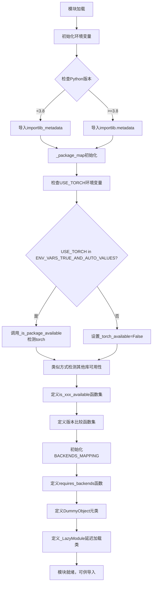

## 类结构

```
object
├── BaseException
│   └── OptionalDependencyNotAvailable
├── type (元类)
│   └── DummyObject
└── ModuleType
    └── _LazyModule
```

## 全局变量及字段


### `ENV_VARS_TRUE_VALUES`
    
环境变量中表示"真"的值集合，用于判断布尔环境变量

类型：`set`
    


### `ENV_VARS_TRUE_AND_AUTO_VALUES`
    
环境变量中表示"真"或"AUTO"的值集合，用于支持自动检测模式

类型：`set`
    


### `USE_TF`
    
控制是否使用TensorFlow的环境变量标志

类型：`str`
    


### `USE_TORCH`
    
控制是否使用PyTorch的环境变量标志

类型：`str`
    


### `USE_JAX`
    
控制是否使用JAX(Flax)的环境变量标志

类型：`str`
    


### `USE_SAFETENSORS`
    
控制是否使用SafeTensors的环境变量标志

类型：`str`
    


### `DIFFUSERS_SLOW_IMPORT`
    
是否启用慢速导入模式的标志，用于详细日志输出

类型：`bool`
    


### `STR_OPERATION_TO_FUNC`
    
版本比较操作符到比较函数的映射字典

类型：`dict`
    


### `_is_google_colab`
    
标记当前是否运行在Google Colab环境中

类型：`bool`
    


### `_package_map`
    
Python包名到发行版名称的映射缓存

类型：`dict或None`
    


### `_torch_available`
    
标记PyTorch库是否可用

类型：`bool`
    


### `_torch_version`
    
PyTorch库的版本号字符串

类型：`str`
    


### `_flax_available`
    
标记Flax库是否可用

类型：`bool`
    


### `_flax_version`
    
Flax库的版本号字符串

类型：`str`
    


### `_jax_version`
    
JAX库的版本号字符串

类型：`str`
    


### `_safetensors_available`
    
标记SafeTensors库是否可用

类型：`bool`
    


### `_safetensors_version`
    
SafeTensors库的版本号字符串

类型：`str`
    


### `_onnx_available`
    
标记ONNX Runtime是否可用

类型：`bool`
    


### `_onnxruntime_version`
    
ONNX Runtime的版本号字符串

类型：`str`
    


### `_opencv_available`
    
标记OpenCV库是否可用

类型：`bool`
    


### `_opencv_version`
    
OpenCV库的版本号字符串

类型：`str`
    


### `_bs4_available`
    
标记BeautifulSoup4库是否可用

类型：`bool`
    


### `_bs4_version`
    
BeautifulSoup4库的版本号字符串

类型：`str`
    


### `_invisible_watermark_available`
    
标记invisible-watermark库是否可用

类型：`bool`
    


### `_invisible_watermark_version`
    
invisible-watermark库的版本号字符串

类型：`str`
    


### `_torch_xla_available`
    
标记PyTorch XLA是否可用

类型：`bool`
    


### `_torch_xla_version`
    
PyTorch XLA的版本号字符串

类型：`str`
    


### `_torch_npu_available`
    
标记PyTorch NPU(华为昇腾)是否可用

类型：`bool`
    


### `_torch_npu_version`
    
PyTorch NPU的版本号字符串

类型：`str`
    


### `_torch_mlu_available`
    
标记PyTorch MLU(寒武纪)是否可用

类型：`bool`
    


### `_torch_mlu_version`
    
PyTorch MLU的版本号字符串

类型：`str`
    


### `_transformers_available`
    
标记Transformers库是否可用

类型：`bool`
    


### `_transformers_version`
    
Transformers库的版本号字符串

类型：`str`
    


### `_hf_hub_available`
    
标记Hugging Face Hub库是否可用

类型：`bool`
    


### `_hf_hub_version`
    
Hugging Face Hub库的版本号字符串

类型：`str`
    


### `_kernels_available`
    
标记Kernels库是否可用

类型：`bool`
    


### `_kernels_version`
    
Kernels库的版本号字符串

类型：`str`
    


### `_inflect_available`
    
标记inflect库是否可用

类型：`bool`
    


### `_inflect_version`
    
inflect库的版本号字符串

类型：`str`
    


### `_unidecode_available`
    
标记unidecode库是否可用

类型：`bool`
    


### `_unidecode_version`
    
unidecode库的版本号字符串

类型：`str`
    


### `_note_seq_available`
    
标记note-seq库是否可用

类型：`bool`
    


### `_note_seq_version`
    
note-seq库的版本号字符串

类型：`str`
    


### `_wandb_available`
    
标记Weights & Biases库是否可用

类型：`bool`
    


### `_wandb_version`
    
Weights & Biases库的版本号字符串

类型：`str`
    


### `_tensorboard_available`
    
标记TensorBoard是否可用

类型：`bool`
    


### `_tensorboard_version`
    
TensorBoard的版本号字符串

类型：`str`
    


### `_compel_available`
    
标记compel库是否可用

类型：`bool`
    


### `_compel_version`
    
compel库的版本号字符串

类型：`str`
    


### `_sentencepiece_available`
    
标记SentencePiece是否可用

类型：`bool`
    


### `_sentencepiece_version`
    
SentencePiece的版本号字符串

类型：`str`
    


### `_torchsde_available`
    
标记torchsde库是否可用

类型：`bool`
    


### `_torchsde_version`
    
torchsde库的版本号字符串

类型：`str`
    


### `_peft_available`
    
标记PEFT库是否可用

类型：`bool`
    


### `_peft_version`
    
PEFT库的版本号字符串

类型：`str`
    


### `_torchvision_available`
    
标记torchvision是否可用

类型：`bool`
    


### `_torchvision_version`
    
torchvision的版本号字符串

类型：`str`
    


### `_matplotlib_available`
    
标记Matplotlib是否可用

类型：`bool`
    


### `_matplotlib_version`
    
Matplotlib的版本号字符串

类型：`str`
    


### `_timm_available`
    
标记timm库是否可用

类型：`bool`
    


### `_timm_version`
    
timm库的版本号字符串

类型：`str`
    


### `_bitsandbytes_available`
    
标记bitsandbytes库是否可用

类型：`bool`
    


### `_bitsandbytes_version`
    
bitsandbytes库的版本号字符串

类型：`str`
    


### `_imageio_available`
    
标记imageio库是否可用

类型：`bool`
    


### `_imageio_version`
    
imageio库的版本号字符串

类型：`str`
    


### `_ftfy_available`
    
标记ftfy库是否可用

类型：`bool`
    


### `_ftfy_version`
    
ftfy库的版本号字符串

类型：`str`
    


### `_scipy_available`
    
标记SciPy是否可用

类型：`bool`
    


### `_scipy_version`
    
SciPy的版本号字符串

类型：`str`
    


### `_librosa_available`
    
标记librosa库是否可用

类型：`bool`
    


### `_librosa_version`
    
librosa库的版本号字符串

类型：`str`
    


### `_accelerate_available`
    
标记Accelerate库是否可用

类型：`bool`
    


### `_accelerate_version`
    
Accelerate库的版本号字符串

类型：`str`
    


### `_xformers_available`
    
标记xFormers是否可用

类型：`bool`
    


### `_xformers_version`
    
xFormers的版本号字符串

类型：`str`
    


### `_gguf_available`
    
标记gguf库是否可用

类型：`bool`
    


### `_gguf_version`
    
gguf库的版本号字符串

类型：`str`
    


### `_torchao_available`
    
标记torchao库是否可用

类型：`bool`
    


### `_torchao_version`
    
torchao库的版本号字符串

类型：`str`
    


### `_optimum_quanto_available`
    
标记optimum-quanto库是否可用

类型：`bool`
    


### `_optimum_quanto_version`
    
optimum-quanto库的版本号字符串

类型：`str`
    


### `_pytorch_retinaface_available`
    
标记pytorch_retinaface库是否可用

类型：`bool`
    


### `_pytorch_retinaface_version`
    
pytorch_retinaface库的版本号字符串

类型：`str`
    


### `_better_profanity_available`
    
标记better_profanity库是否可用

类型：`bool`
    


### `_better_profanity_version`
    
better_profanity库的版本号字符串

类型：`str`
    


### `_nltk_available`
    
标记NLTK是否可用

类型：`bool`
    


### `_nltk_version`
    
NLTK的版本号字符串

类型：`str`
    


### `_cosmos_guardrail_available`
    
标记cosmos_guardrail库是否可用

类型：`bool`
    


### `_cosmos_guardrail_version`
    
cosmos_guardrail库的版本号字符串

类型：`str`
    


### `_sageattention_available`
    
标记sageattention库是否可用

类型：`bool`
    


### `_sageattention_version`
    
sageattention库的版本号字符串

类型：`str`
    


### `_flash_attn_available`
    
标记flash-attention库是否可用

类型：`bool`
    


### `_flash_attn_version`
    
flash-attention库的版本号字符串

类型：`str`
    


### `_flash_attn_3_available`
    
标记flash-attention-3库是否可用

类型：`bool`
    


### `_flash_attn_3_version`
    
flash-attention-3库的版本号字符串

类型：`str`
    


### `_aiter_available`
    
标记aiter库是否可用

类型：`bool`
    


### `_aiter_version`
    
aiter库的版本号字符串

类型：`str`
    


### `_kornia_available`
    
标记kornia库是否可用

类型：`bool`
    


### `_kornia_version`
    
kornia库的版本号字符串

类型：`str`
    


### `_nvidia_modelopt_available`
    
标记nvidia-modelopt库是否可用

类型：`bool`
    


### `_nvidia_modelopt_version`
    
nvidia-modelopt库的版本号字符串

类型：`str`
    


### `_av_available`
    
标记PyAV库是否可用

类型：`bool`
    


### `_av_version`
    
PyAV库的版本号字符串

类型：`str`
    


### `BACKENDS_MAPPING`
    
后端名称到可用性检查函数和错误消息的有序映射字典

类型：`OrderedDict`
    


### `logger`
    
模块级别的日志记录器实例

类型：`logging.Logger`
    


### `_LazyModule._modules`
    
该lazy模块管理的子模块名称集合

类型：`set`
    


### `_LazyModule._class_to_module`
    
类名到所属模块名的映射字典

类型：`dict`
    


### `_LazyModule.__all__`
    
模块公开导出的所有名称列表

类型：`list`
    


### `_LazyModule.__file__`
    
模块文件的路径字符串

类型：`str`
    


### `_LazyModule.__spec__`
    
模块的导入规范对象

类型：`ModuleSpec或None`
    


### `_LazyModule.__path__`
    
模块搜索路径的目录列表

类型：`list`
    


### `_LazyModule._objects`
    
模块中额外对象的字典存储

类型：`dict`
    


### `_LazyModule._name`
    
lazy模块的名称标识

类型：`str`
    


### `_LazyModule._import_structure`
    
模块的导入结构定义字典

类型：`dict`
    
    

## 全局函数及方法


### `_is_package_available`

该函数用于检查指定的 Python 包是否已安装，并返回包的可用状态和版本号。它首先检查包是否存在，然后尝试获取包的版本信息，同时支持获取分发名称的选项。

参数：

- `pkg_name`：`str`，要检查的包名称
- `get_dist_name`：`bool`，是否尝试获取包的官方分发名称（默认为 False）

返回值：`tuple[bool, str]`，返回布尔值表示包是否可用，以及字符串表示包版本号

#### 流程图

```mermaid
flowchart TD
    A[开始 _is_package_available] --> B[检查 pkg_name 是否存在]
    B --> C{importlib.util.find_spec<br/>pkg_name 是否为 None}
    C -->|是| D[设置 pkg_exists = False]
    C -->|否| E[设置 pkg_exists = True]
    D --> J[返回 (False, 'N/A')]
    E --> F{_package_map 为空?}
    F -->|是| G[初始化 _package_map 并填充]
    F -->|否| H{get_dist_name 为 True<br/>且 pkg_name 在 _package_map 中?}
    G --> H
    H -->|是| I[根据 _package_map 获取分发名称]
    H -->|否| K[尝试获取包版本]
    I --> K
    K --> L{成功获取版本?}
    L -->|是| M[记录调试日志<br/>返回 (True, pkg_version)]
    L -->|否| N[捕获异常<br/>设置 pkg_exists = False]
    N --> J
```

#### 带注释源码

```python
def _is_package_available(pkg_name: str, get_dist_name: bool = False) -> tuple[bool, str]:
    """
    检查指定的 Python 包是否可用，并返回其版本信息。
    
    Args:
        pkg_name: 要检查的包名称
        get_dist_name: 是否尝试将包名称映射到其官方分发名称
    
    Returns:
        tuple[bool, str]: (包是否可用, 版本号字符串)
    """
    global _package_map
    # 使用 importlib.util.find_spec 检查包是否存在
    pkg_exists = importlib.util.find_spec(pkg_name) is not None
    pkg_version = "N/A"  # 默认版本号

    if pkg_exists:
        # 如果 _package_map 未初始化，则进行初始化
        # _package_map 用于映射包名到其分发名称
        if _package_map is None:
            _package_map = defaultdict(list)
            try:
                # Fallback for Python < 3.10
                # 遍历所有已安装的分发包，构建包名到分发名的映射
                for dist in importlib_metadata.distributions():
                    # 读取 top_level.txt 获取声明的顶级包名
                    _top_level_declared = (dist.read_text("top_level.txt") or "").split()
                    # 从文件结构推断可选的包名
                    _inferred_opt_names = {
                        f.parts[0] if len(f.parts) > 1 else inspect.getmodulename(f) 
                        for f in (dist.files or [])
                    } - {None}
                    # 过滤掉包含 "." 的包名
                    _top_level_inferred = filter(lambda name: "." not in name, _inferred_opt_names)
                    # 将包名添加到映射中
                    for pkg in _top_level_declared or _top_level_inferred:
                        _package_map[pkg].append(dist.metadata["Name"])
            except Exception as _:
                pass
        
        try:
            # 如果需要获取分发名称，且包名在映射中存在
            if get_dist_name and pkg_name in _package_map and _package_map[pkg_name]:
                # 如果存在多个分发，显示警告并使用第一个
                if len(_package_map[pkg_name]) > 1:
                    logger.warning(
                        f"Multiple distributions found for package {pkg_name}. Picked distribution: {_package_map[pkg_name][0]}"
                    )
                # 更新包名为官方分发名称
                pkg_name = _package_map[pkg_name][0]
            
            # 尝试获取包的版本号
            pkg_version = importlib_metadata.version(pkg_name)
            logger.debug(f"Successfully imported {pkg_name} version {pkg_version}")
        except (ImportError, importlib_metadata.PackageNotFoundError):
            # 如果获取版本失败，标记包为不可用
            pkg_exists = False

    # 返回包是否可用及版本信息
    return pkg_exists, pkg_version
```


### `is_torch_available`

检查 PyTorch 库是否在当前环境中可用。该函数返回一个布尔值，表示 PyTorch 是否已安装且可用，基于模块加载时对环境的检测结果。

参数：

- 该函数无参数

返回值：`bool`，返回 `_torch_available` 全局变量的值，表示 PyTorch 是否可用（`True` 表示可用，`False` 表示不可用）

#### 流程图

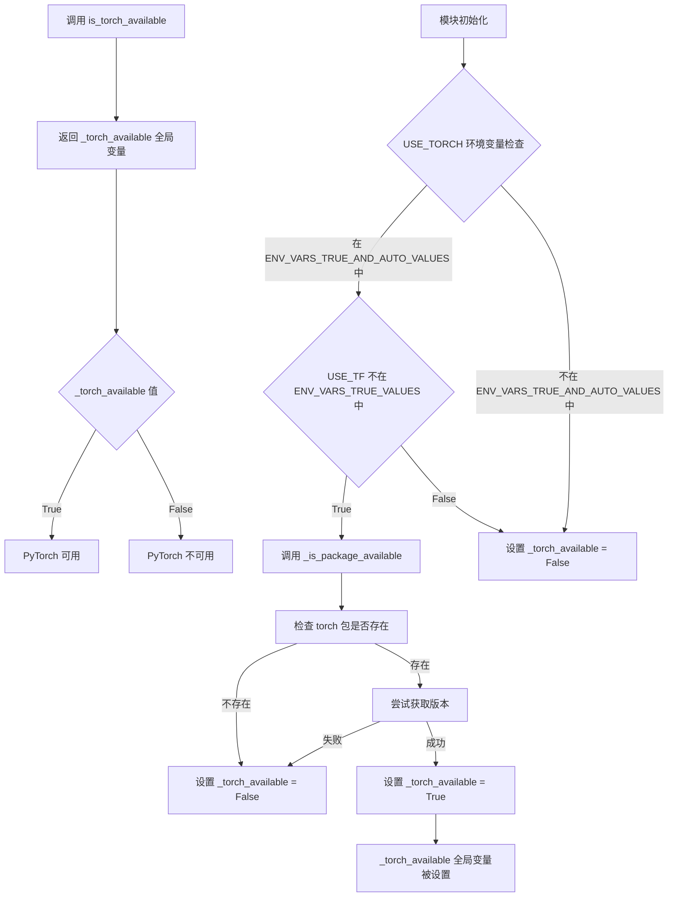

#### 带注释源码

```python
def is_torch_available():
    """
    检查 PyTorch 库是否在当前环境中可用。
    
    该函数是模块提供的公共接口，用于查询 PyTorch 是否已安装。
    实际的可检查结果在模块加载时通过 _is_package_available 函数确定，
    并存储在全局变量 _torch_available 中。
    
    Returns:
        bool: 如果 PyTorch 可用则返回 True，否则返回 False
    """
    return _torch_available
```

#### 相关全局变量信息

| 变量名称 | 类型 | 描述 |
|---------|------|------|
| `_torch_available` | `bool` | 模块级标志，记录 PyTorch 包是否可用，由模块初始化时设置 |
| `_torch_version` | `str` | PyTorch 的版本号字符串，如果不可用则为 "N/A" |
| `USE_TORCH` | `str` | 环境变量，控制是否检查 PyTorch，可值为 "AUTO", "1", "YES", "TRUE" 等 |
| `USE_TF` | `str` | 环境变量，控制是否检查 TensorFlow，如果设置则可能影响 PyTorch 检查 |


### `is_torch_xla_available`

该函数是一个轻量级的包装器函数，用于检查 PyTorch XLA（Accelerated Linear Algebra）库是否在当前环境中可用。它直接返回模块级别的布尔变量 `_torch_xla_available`，该变量在模块加载时通过 `_is_package_available` 函数检测 `torch_xla` 包是否已安装。

参数：无

返回值：`bool`，表示 torch_xla 包是否可用（True 表示可用，False 表示不可用）

#### 流程图

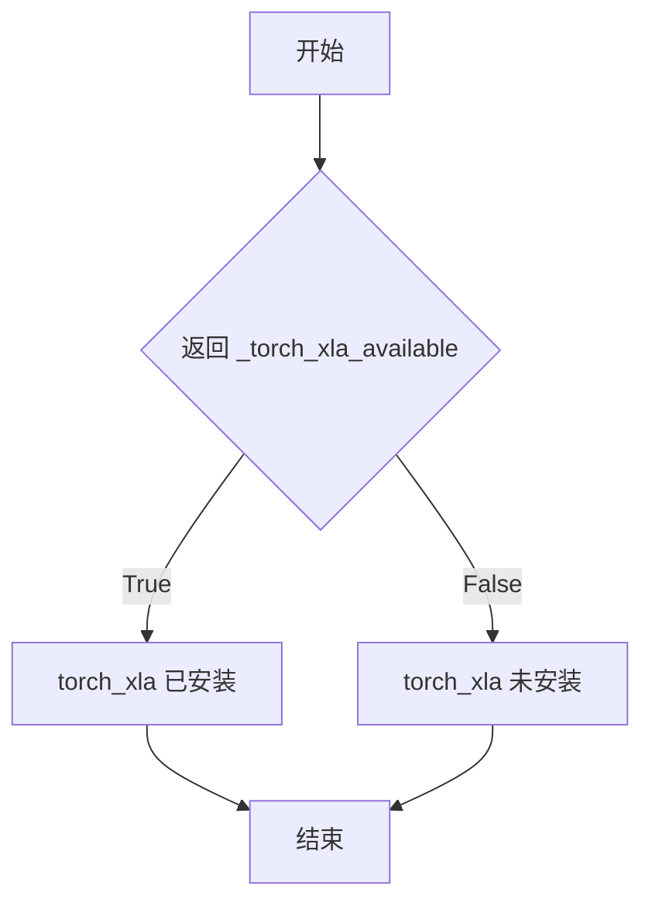

#### 带注释源码

```python
def is_torch_xla_available():
    """
    检查 PyTorch XLA 库是否可用。
    
    该函数是一个简单的包装器，直接返回模块级变量 _torch_xla_available。
    该变量在模块初始化时通过 _is_package_available('torch_xla') 检测获得。
    
    Returns:
        bool: 如果 torch_xla 包已安装并可导入则返回 True，否则返回 False。
    """
    return _torch_xla_available


# 相关全局变量定义（模块加载时执行）
_torch_xla_available, _torch_xla_version = _is_package_available("torch_xla")
# _is_package_available 是一个内部函数，用于检测指定包是否可导入
# 它返回一个元组：(是否可用 bool, 版本号 str)
```


### `is_torch_npu_available`

该函数用于检查当前环境中是否安装了华为昇腾 NPU（Neural Processing Unit）的 PyTorch 扩展库 `torch_npu`，并返回一个布尔值表示其可用性。

参数： 无

返回值：`bool`，返回 `True` 表示 `torch_npu` 包已安装且可用，返回 `False` 表示不可用。

#### 流程图

```mermaid
flowchart TD
    A[调用 is_torch_npu_available] --> B{返回全局变量 _torch_npu_available}
    B -->|True| C[返回 True: torch_npu 可用]
    B -->|False| D[返回 False: torch_npu 不可用]
    
    E[模块初始化] --> F[调用 _is_package_available<br/>参数: pkg_name='torch_npu']
    F --> G{包是否可导入?}
    G -->|是| H[获取包版本信息]
    G -->|否| I[返回 (False, 'N/A')]
    H --> J[返回 (True, version)]
    
    E -.-> K[_torch_npu_available 赋值]
    K --> B
```

#### 带注释源码

```python
def is_torch_npu_available():
    """
    检查 torch_npu 包是否可用于当前 Python 环境。
    
    该函数是一个简单的包装器，返回模块级变量 _torch_npu_available 的值。
    _torch_npu_available 在模块加载时通过 _is_package_available 函数初始化，
    用于检测华为昇腾 NPU 的 PyTorch 扩展库是否已安装。
    
    Returns:
        bool: 如果 torch_npu 包已安装且可导入则返回 True，否则返回 False。
    """
    return _torch_npu_available
```

#### 关联的内部实现细节

`is_torch_npu_available` 函数依赖于以下全局变量和函数的协同工作：

| 名称 | 类型 | 描述 |
|------|------|------|
| `_torch_npu_available` | `bool` | 模块级变量，存储 torch_npu 包的可用性状态 |
| `_torch_npu_version` | `str` | 模块级变量，存储 torch_npu 包的版本号（未使用于此函数） |
| `_is_package_available` | `function` | 内部函数，用于检测指定包是否可导入并获取版本 |

`torch_npu` 包是华为昇腾（Ascend）计算平台的 PyTorch 适配库，用于在昇腾 NPU 上运行深度学习模型。该函数是 Diffusers 库在导入时进行可选依赖检查的一部分，允许代码在运行时条件性地启用或禁用 NPU 相关的功能。


### `is_torch_mlu_available`

该函数用于检查 PyTorch MLU（华为昇腾 NPU 后端）是否在当前环境中可用。它是一个简单的封装函数，返回模块级变量 `_torch_mlu_available` 的布尔值，该变量在模块加载时通过 `_is_package_available` 函数检测 `torch_mlu` 包是否已安装。

参数： 无

返回值：`bool`，返回 `True` 表示 torch_mlu 包可用（已安装），返回 `False` 表示不可用

#### 流程图

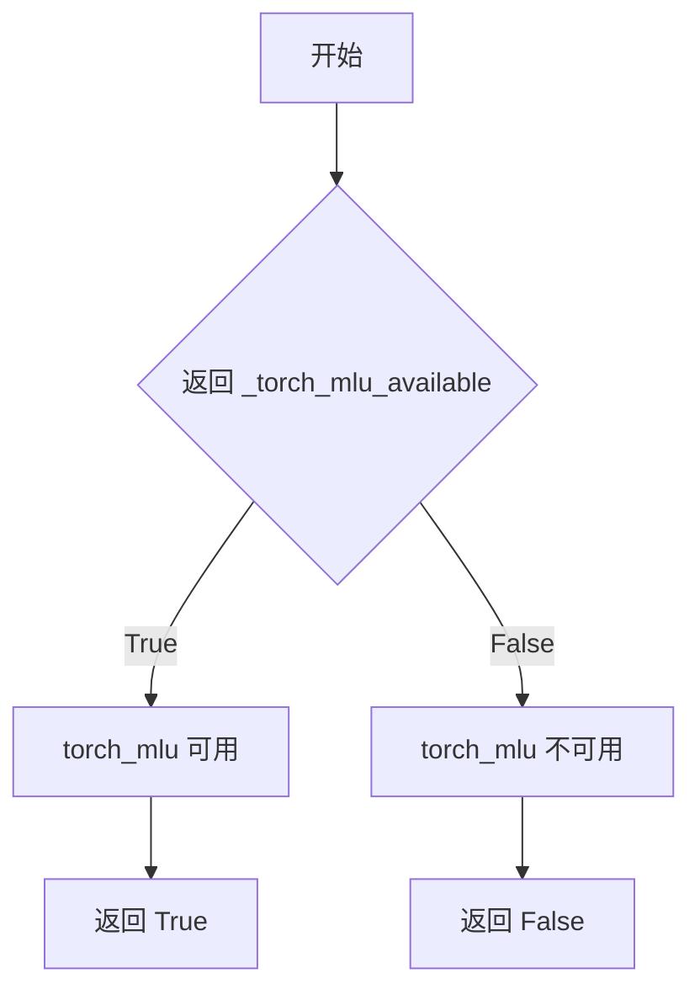

#### 带注释源码

```python
def is_torch_mlu_available():
    """
    检查 torch_mlu (华为昇腾 MLU/NPU 后端) 是否在当前环境中可用。

    该函数是一个简单的封装器，返回模块级变量 _torch_mlu_available 的值。
    _torch_mlu_available 在模块加载时通过 _is_package_available("torch_mlu") 初始化，
    用于检测 torch_mlu 包是否已安装。

    Returns:
        bool: 如果 torch_mlu 包已安装则返回 True，否则返回 False。
    """
    return _torch_mlu_available
```


### `is_flax_available`

该函数用于检查当前环境是否安装了 Flax 和 JAX 库，并返回布尔值表示其可用性。

参数：  
无参数

返回值：`bool`，返回 `_flax_available` 全局变量的值，表示 Flax 库是否可用

#### 流程图

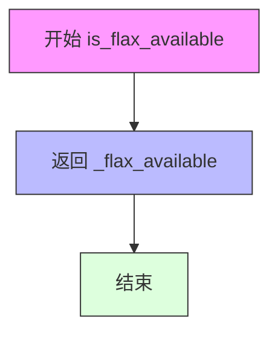

#### 带注释源码

```python
def is_flax_available():
    """
    检查 Flax 库是否可用。
    
    该函数返回模块级变量 _flax_available 的值，该变量在模块导入时通过
    检查 jax 和 flax 包是否已安装来设置。
    
    Returns:
        bool: 如果 Flax 和 JAX 都已安装则返回 True，否则返回 False
    """
    return _flax_available
```

#### 相关上下文信息

**全局变量 `_flax_available` 的设置逻辑**（在模块加载时执行）：

```python
_jax_version = "N/A"
_flax_version = "N/A"
if USE_JAX in ENV_VARS_TRUE_AND_AUTO_VALUES:
    # 仅当 USE_FLAX 环境变量设置为非 AUTO 值时才检查
    _flax_available = importlib.util.find_spec("jax") is not None and importlib.util.find_spec("flax") is not None
    if _flax_available:
        try:
            _jax_version = importlib_metadata.version("jax")
            _flax_version = importlib_metadata.version("flax")
            logger.info(f"JAX version {_jax_version}, Flax version {_flax_version} available.")
        except importlib_metadata.PackageNotFoundError:
            _flax_available = False
else:
    _flax_available = False
```

**使用场景**：  
该函数通常与 `FLAX_IMPORT_ERROR` 错误消息配合使用，在 `BACKENDS_MAPPING` 中定义，用于在用户尝试使用需要 Flax 的功能时提供友好的错误提示。


### `is_transformers_available`

该函数是一个简单的包装器函数，用于检查 `transformers` 库是否在当前环境中可用。它通过返回模块级变量 `_transformers_available` 的布尔值来指示 transformers 的可用状态，主要用于条件导入和功能降级，以确保在没有安装 transformers 库时代码不会崩溃。

参数： 无

返回值：`bool`，返回 `_transformers_available` 的值，True 表示 transformers 库已安装且可用，False 表示不可用。

#### 流程图

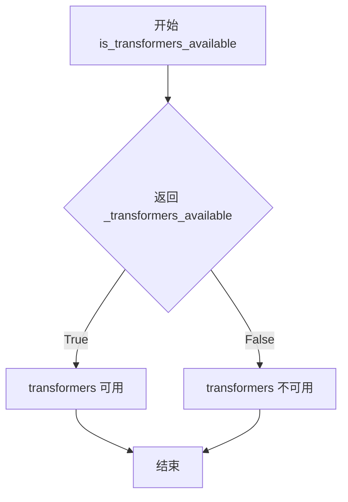

#### 带注释源码

```python
def is_transformers_available():
    """
    检查 transformers 库是否在当前环境中可用。
    
    该函数是模块级变量 _transformers_available 的简单封装，用于在代码中
    动态检查 transformers 的可用性，以便进行条件导入或功能降级。
    
    Returns:
        bool: 如果 transformers 库已安装且可用返回 True，否则返回 False。
    """
    # 直接返回模块级变量 _transformers_available 的值
    # 该变量在模块加载时通过 _is_package_available("transformers") 初始化
    return _transformers_available
```


### `is_inflect_available`

该函数用于检查 `inflect` 库是否在当前环境中可用。

参数：

- 无参数

返回值：`bool`，返回 `inflect` 库是否可用（`True` 表示可用，`False` 表示不可用）

#### 流程图

```mermaid
flowchart TD
    A[开始] --> B{返回 _inflect_available}
    B --> C[结束]
    
    subgraph "_inflect_available 的来源"
    D[_inflect_available 变量初始化] --> E{_is_package_available('inflect')}
    E -->|包存在| F[尝试获取版本信息]
    E -->|包不存在| G[设置 pkg_exists = False]
    F -->|成功| H[返回 (True, version)]
    F -->|失败| G
    end
```

#### 带注释源码

```python
def is_inflect_available():
    """
    检查 inflect 库是否在当前 Python 环境中可用。
    
    该函数是一个简单的包装器，返回模块级变量 _inflect_available 的值。
    _inflect_available 在模块加载时通过 _is_package_available("inflect") 调用初始化，
    用于检测 inflect 包是否已安装。
    
    Returns:
        bool: 如果 inflect 库可用返回 True，否则返回 False。
    """
    return _inflect_available
```

#### 相关全局变量信息

- `_inflect_available`：`bool`，在模块初始化时通过 `_is_package_available("inflect")` 调用确定，表示 `inflect` 包是否可用
- `_inflect_version`：`str`，在模块初始化时通过 `_is_package_available("inflect")` 调用确定，表示 `inflect` 包的版本号（如果可用）

#### 依赖的内部函数

`_is_package_available` 函数负责实际的包检测工作：

```python
def _is_package_available(pkg_name: str, get_dist_name: bool = False) -> tuple[bool, str]:
    """
    检查指定包是否可用并返回其版本信息。
    
    Args:
        pkg_name: 包名
        get_dist_name: 是否获取分发名称
        
    Returns:
        tuple[bool, str]: (包是否可用, 版本号)
    """
    # ... 实现细节
```


### `is_unidecode_available`

该函数是一个轻量级的依赖检查函数，用于返回全局变量 `_unidecode_available` 的值，该值在模块加载时通过 `_is_package_available("unidecode")` 调用预先检测得出，用于判断 unidecode 库是否已安装且可用。

参数： 无

返回值：`bool`，返回 unidecode 库是否可用的布尔值（True 表示可用，False 表示不可用）

#### 流程图

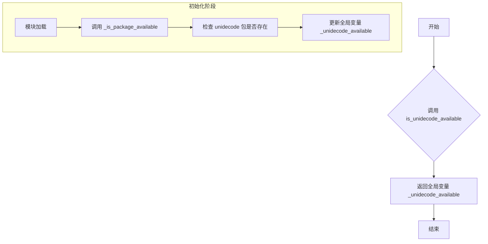

#### 带注释源码

```python
def is_unidecode_available():
    """
    检查 unidecode 库是否在当前环境中可用。
    
    该函数是一个简单的 getter 函数，返回在模块初始化阶段预先计算的全局变量 _unidecode_available 的值。
    使用预计算的方式可以避免每次调用时重复执行包查找操作，提高性能。
    
    Returns:
        bool: 如果 unidecode 库已安装且可用返回 True，否则返回 False。
    """
    return _unidecode_available
```


### `is_onnx_available`

该函数用于检查 ONNX Runtime（ONNX 运行时）库是否在当前 Python 环境中可用。它返回一个布尔值，指示 onnxruntime 或其任何变体（如 onnxruntime-gpu、onnxruntime-openvino 等）是否已安装。

参数： 无

返回值：`bool`，返回 `_onnx_available` 的值，表示 ONNX Runtime 是否可用（True 表示可用，False 表示不可用）

#### 流程图

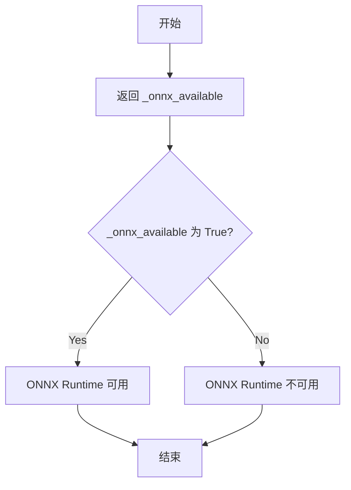

#### 带注释源码

```python
def is_onnx_available():
    """
    检查 ONNX Runtime 库是否在当前环境中可用。
    
    该函数是模块级别的简单封装，直接返回全局变量 _onnx_available 的值。
    _onnx_available 的值在模块加载时通过 importlib.util.find_spec() 和 
    importlib_metadata.version() 检查多个 ONNX Runtime 变体后确定。
    
    Returns:
        bool: 如果 onnxruntime 或其任何变体（如 onnxruntime-gpu, onnxruntime-openvino 等）
             已安装并可以成功获取版本信息，则返回 True；否则返回 False。
    """
    return _onnx_available
```


### `is_opencv_available`

该函数用于检查 OpenCV 库是否在当前环境中可用，通过检查 opencv-python、opencv-contrib-python、opencv-python-headless、opencv-contrib-python-headless 等候选包是否已安装来判断。

参数：无需参数

返回值：`bool`，返回 OpenCV 库是否可用的布尔值

#### 流程图

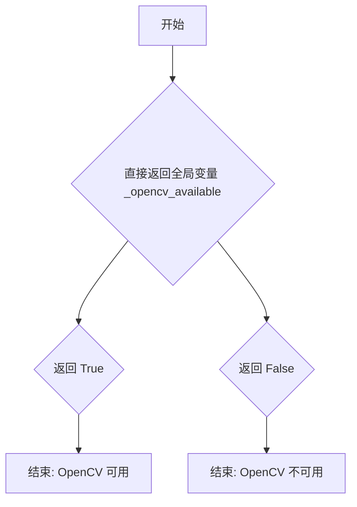

#### 带注释源码

```python
def is_opencv_available():
    """
    检查 OpenCV 库是否在当前环境中可用。
    
    该函数是一个简单的封装函数，返回模块级变量 _opencv_available 的值。
    _opencv_available 的值在模块加载时通过检测 opencv-python、opencv-contrib-python、
    opencv-python-headless、opencv-contrib-python-headless 等候选包来确定。
    
    Returns:
        bool: 如果 OpenCV 可用返回 True，否则返回 False
    """
    return _opencv_available
```

#### 相关全局变量

- `_opencv_available`：模块级布尔变量，在模块初始化时通过 `importlib_metadata.version()` 检查 opencv 相关包是否已安装并获取版本信息
- `_opencv_version`：存储检测到的 OpenCV 版本号字符串，如果未安装则为 `None`


### `is_scipy_available`

检查 scipy 库是否在当前 Python 环境中可用。该函数通过返回模块级变量 `_scipy_available` 的值来指示 scipy 的可用性，是 Diffusers 库中用于条件导入和功能启用的常见模式。

参数： 无

返回值：`bool`，返回 `True` 表示 scipy 已安装且可用，返回 `False` 表示 scipy 不可用

#### 流程图

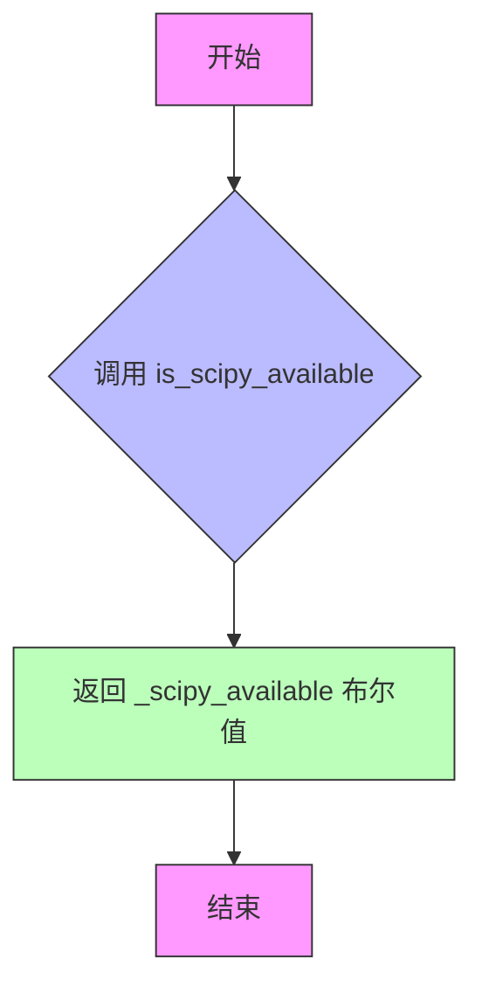

#### 带注释源码

```python
def is_scipy_available():
    """
    检查 scipy 库是否在当前环境中可用。
    
    该函数是一个简单的包装器，返回模块级变量 _scipy_available 的值。
    _scipy_available 变量在模块加载时通过 _is_package_available("scipy") 调用初始化，
    该调用会检查 scipy 包是否已安装并尝试获取其版本信息。
    
    Returns:
        bool: 如果 scipy 已安装并可用则返回 True，否则返回 False。
    """
    return _scipy_available
```


### `is_librosa_available`

检查 librosa 库是否在当前环境中可用。该函数通过返回模块级变量 `_librosa_available` 来指示 librosa 库是否已安装且可导入。

参数：無

返回值：`bool`，返回 `_librosa_available` 的布尔值，表示 librosa 库是否可用（True 表示可用，False 表示不可用）

#### 流程图

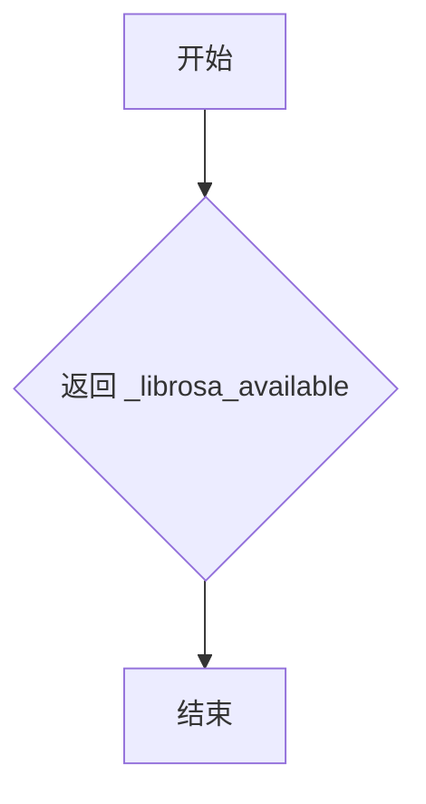

#### 带注释源码

```python
def is_librosa_available():
    """
    检查 librosa 库是否在当前环境中可用。
    
    该函数返回一个布尔值，表示 librosa 是否已安装且可以导入。
    返回值在模块加载时通过 _is_package_available("librosa") 确定。
    
    Returns:
        bool: 如果 librosa 可用则返回 True，否则返回 False
    """
    return _librosa_available
```


### `is_xformers_available`

检查 xformers 库是否在当前环境中可用，并返回对应的布尔值。

参数：

- （无参数）

返回值：`bool`，返回 xformers 库是否可用的布尔值。

#### 流程图

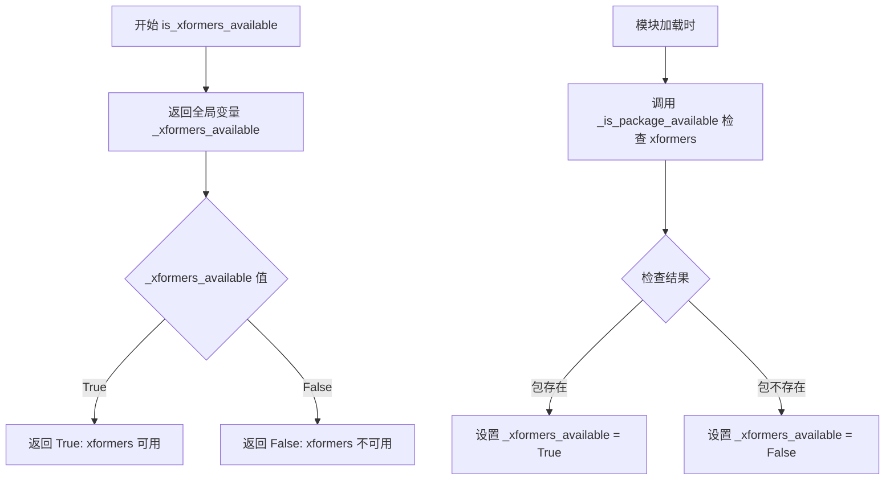

#### 带注释源码

```python
def is_xformers_available():
    """
    检查 xformers 库是否在当前 Python 环境中可用。
    
    该函数是一个简单的包装器，返回在模块加载时通过 _is_package_available() 函数
    探测到的全局变量 _xformers_available 的值。xformers 是一个用于优化 Transformer
    模型的库，常用于提升注意力机制的计算效率。
    
    Returns:
        bool: 如果 xformers 库已安装并可导入则返回 True，否则返回 False。
    """
    return _xformers_available
```


### `is_accelerate_available`

该函数用于检查 `accelerate` 库是否在当前环境中可用，并返回布尔值。

参数： 无

返回值：`bool`，表示 `accelerate` 库是否可用（`True` 表示可用，`False` 表示不可用）

#### 流程图

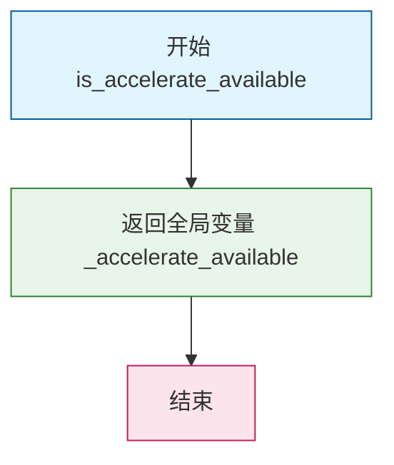

#### 带注释源码

```python
def is_accelerate_available():
    """
    检查 accelerate 库是否在当前环境中可用。
    
    该函数是一个简单的封装函数，返回全局变量 _accelerate_available 的值。
    _accelerate_available 在模块加载时通过 _is_package_available("accelerate") 函数确定，
    用于延迟检测 accelerate 库的可用性，避免不必要的导入开销。
    
    Returns:
        bool: 如果 accelerate 库可用返回 True，否则返回 False。
    """
    return _accelerate_available
```


### `is_kernels_available`

该函数用于检查 "kernels" 依赖包是否在当前环境中可用，并返回布尔值。

参数：
- 无参数

返回值：`bool`，返回 kernels 包是否可用（`True` 表示可用，`False` 表示不可用）

#### 流程图

```mermaid
flowchart TD
    A[开始 is_kernels_available] --> B[返回全局变量 _kernels_available]
    B --> C[结束]
    
    subgraph 初始化阶段
    D[_is_package_available 调用] --> E[检查 kernels 包是否可导入]
    E --> F{包是否存在?}
    F -->|是| G[获取包版本信息]
    F -->|否| H[设置 pkg_exists = False]
    G --> I[返回 (pkg_exists, pkg_version)]
    H --> I
    I --> J[_kernels_available 赋值]
    end
```

#### 带注释源码

```python
def is_kernels_available():
    """
    检查 kernels 依赖包是否在当前环境中可用。
    
    该函数是一个简单的封装器，返回模块级变量 _kernels_available 的值。
    _kernels_available 的值在模块加载时通过 _is_package_available("kernels") 确定。
    
    返回值:
        bool: 如果 kernels 包可用返回 True，否则返回 False。
    """
    return _kernels_available
```

---

**相关上下文信息：**

- **全局变量来源**：`_kernels_available` 在模块初始化时通过以下代码设置：
  ```python
  _kernels_available, _kernels_version = _is_package_available("kernels")
  ```

- **依赖函数**：`_is_package_available` 是一个内部函数，用于检查指定的 Python 包是否已安装并可导入。

- **版本信息**：对应的版本存储在 `_kernels_version` 变量中，可通过 `is_kernels_version()` 函数（如有需要）获取。


### `is_note_seq_available`

该函数用于检查 `note_seq` 库是否在当前环境中可用，通过返回模块级变量 `_note_seq_available` 的布尔值来告知调用者是否可以使用 `note_seq` 相关的功能。

**参数：** 无

**返回值：** `bool`，返回 `note_seq` 库是否可用的布尔值（`True` 表示可用，`False` 表示不可用）。

#### 流程图

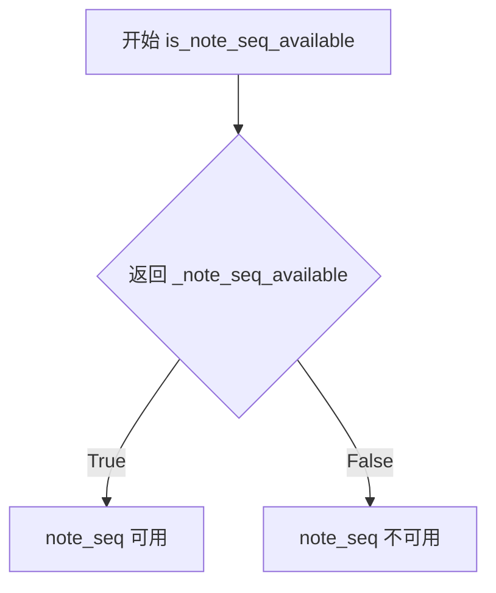

#### 带注释源码

```python
def is_note_seq_available():
    """
    检查 note_seq 库是否在当前环境中可用。
    
    该函数是模块级别的便捷封装，直接返回模块初始化时通过 
    _is_package_available('note_seq') 检测得到的结果。
    """
    return _note_seq_available
```


### `is_wandb_available`

该函数用于检查 wandb（Weights & Biases）库是否在当前环境中可用，通过返回模块级变量 `_wandb_available` 的值来判断，该变量在模块加载时通过 `_is_package_available("wandb")` 调用填充。

参数： 无

返回值：`bool`，返回 wandb 库是否可用的布尔值。如果 wandb 已安装且可导入则返回 `True`，否则返回 `False`。

#### 流程图

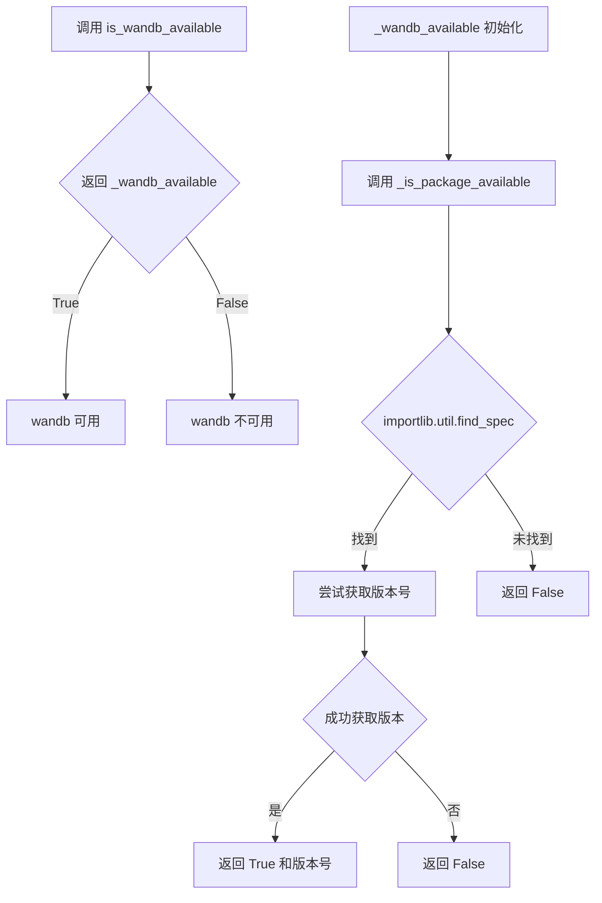

#### 带注释源码

```python
def is_wandb_available():
    """
    检查 wandb（Weights & Biases）库是否在当前 Python 环境中可用。
    
    该函数是模块提供的便捷检查函数之一，属于 Diffusers 库的依赖检查体系。
    在模块初始化时通过调用 _is_package_available("wandb") 预计算并缓存了结果。
    
    Returns:
        bool: wandb 库是否可用。True 表示已安装且可导入，False 表示未安装或无法导入。
    
    Example:
        >>> from diffusers.utils import is_wandb_available
        >>> if is_wandb_available():
        ...     import wandb
        ...     wandb.init()
    """
    # 直接返回模块级变量 _wandb_available
    # 该变量在模块加载时通过 _is_package_available("wandb") 调用设置
    return _wandb_available


# 相关的全局变量定义（在模块顶层）
_wandb_available, _wandb_version = _is_package_available("wandb")

# _is_package_available 函数定义
def _is_package_available(pkg_name: str, get_dist_name: bool = False) -> tuple[bool, str]:
    """
    检查指定包是否可用并获取其版本号的内部函数。
    
    Args:
        pkg_name: 要检查的包名
        get_dist_name: 是否尝试获取发行版名称
    
    Returns:
        tuple[bool, str]: (包是否可用, 版本号字符串)
    """
    global _package_map
    pkg_exists = importlib.util.find_spec(pkg_name) is not None
    pkg_version = "N/A"

    if pkg_exists:
        # 构建包映射缓存以优化多次查询
        if _package_map is None:
            _package_map = defaultdict(list)
            try:
                # Python < 3.10 的回退方案
                for dist in importlib_metadata.distributions():
                    _top_level_declared = (dist.read_text("top_level.txt") or "").split()
                    # 从文件结构推断顶级包名
                    _inferred_opt_names = {
                        f.parts[0] if len(f.parts) > 1 else inspect.getmodulename(f) for f in (dist.files or [])
                    } - {None}
                    _top_level_inferred = filter(lambda name: "." not in name, _inferred_opt_names)
                    for pkg in _top_level_declared or _top_level_inferred:
                        _package_map[pkg].append(dist.metadata["Name"])
            except Exception as _:
                pass
        try:
            if get_dist_name and pkg_name in _package_map and _package_map[pkg_name]:
                if len(_package_map[pkg_name]) > 1:
                    logger.warning(
                        f"Multiple distributions found for package {pkg_name}. Picked distribution: {_package_map[pkg_name][0]}"
                    )
                pkg_name = _package_map[pkg_name][0]
            pkg_version = importlib_metadata.version(pkg_name)
            logger.debug(f"Successfully imported {pkg_name} version {pkg_version}")
        except (ImportError, importlib_metadata.PackageNotFoundError):
            pkg_exists = False

    return pkg_exists, pkg_version
```


### is_tensorboard_available

该函数用于检查 TensorFlow 的 TensorBoard 可视化库是否已安装并可在当前环境中使用，通过返回模块级布尔变量 `_tensorboard_available` 来告知调用者是否可以使用 TensorBoard 相关功能。

参数： 无

返回值： `bool`，返回 TensorBoard 库是否可用的布尔值（True 表示可用，False 表示不可用）

#### 流程图

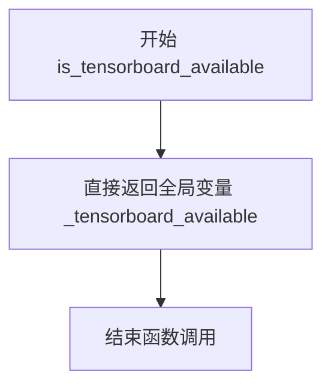

#### 带注释源码

```python
def is_tensorboard_available():
    """
    检查 TensorBoard 是否可用。
    
    该函数是一个简单的访问器函数，用于获取模块级别的 TensorBoard 可用性状态。
    实际的可用性检查在模块加载时通过 _is_package_available("tensorboard") 完成，
    并将结果存储在全局变量 _tensorboard_available 中。
    
    Returns:
        bool: 如果 TensorBoard 已安装并可用返回 True，否则返回 False
    """
    return _tensorboard_available
```

---

#### 相关上下文信息

**全局变量 `_tensorboard_available`**：
- 类型：`bool`
- 描述：在模块初始化时通过 `_is_package_available("tensorboard")` 函数检测 TensorBoard 包是否已安装，并将其可用状态存储在此变量中

**依赖的底层函数 `_is_package_available`**：
- 这是一个内部函数，用于检测指定包是否可用
- 返回元组 `(bool, str]`：第一个元素表示包是否可用，第二个元素表示包版本号


### `is_compel_available`

该函数用于检查 `compel` 可选依赖库是否已在当前 Python 环境中安装并可用，通常在代码需要使用 compel 库提供的功能时作为前置检查。

参数：无

返回值：`bool`，返回 `True` 表示 compel 库可用，返回 `False` 表示不可用。

#### 流程图

```mermaid
flowchart TD
    A[开始] --> B[直接返回全局变量 _compel_available 的值]
    B --> C{返回值}
    C -->|True| D[compel 库可用]
    C -->|False| E[compel 库不可用]
    D --> F[结束]
    E --> F
```

#### 带注释源码

```python
def is_compel_available():
    """
    检查 compel 库是否可用。
    
    该函数是一个简单的封装器，直接返回模块级变量 _compel_available 的值。
    _compel_available 的值在模块加载时通过 _is_package_available("compel") 调用确定，
    用于检测 compel 库是否已安装。
    
    Returns:
        bool: 如果 compel 库已安装并可用返回 True，否则返回 False。
    """
    return _compel_available
```


### `is_ftfy_available`

该函数用于检查 ftfy（Fix Text For You）库是否在当前环境中可用，并返回布尔值结果。

参数：无

返回值：`bool`，返回 ftfy 库是否可用的布尔值

#### 流程图

```mermaid
flowchart TD
    A[开始] --> B{返回 _ftfy_available}
    B -->|True| C[返回 True]
    B -->|False| D[返回 False]
```

#### 带注释源码

```python
def is_ftfy_available():
    """
    检查 ftfy 库是否在当前环境中可用。
    
    该函数是一个简单的封装器，返回模块级变量 _ftfy_available 的值。
    _ftfy_available 在模块初始化时通过 _is_package_available("ftfy") 调用确定。
    
    Returns:
        bool: 如果 ftfy 库可用返回 True，否则返回 False
    """
    return _ftfy_available
```


### `is_bs4_available`

检查 Beautiful Soup 4 库是否已安装在当前 Python 环境中，并返回其可用性状态。

**参数：**

- 无参数

**返回值：** `bool`，返回 `_bs4_available` 的值，如果 Beautiful Soup 4 可用则为 `True`，否则为 `False`。

#### 流程图

```mermaid
flowchart TD
    A[开始] --> B{importlib.util.find_spec<br/>"bs4" 是否存在?}
    B -->|是| C[尝试获取 beautifulsoup4 版本]
    B -->|否| D[设置 _bs4_available = False]
    C --> E{版本获取成功?}
    E -->|是| F[记录日志<br/>_bs4_available = True]
    E -->|否| G[捕获 PackageNotFoundError<br/>_bs4_available = False]
    D --> H[返回 _bs4_available]
    F --> H
    G --> H
```

#### 带注释源码

```python
def is_bs4_available():
    """
    检查 Beautiful Soup 4 (bs4) 库是否可用。

    该函数通过检查模块是否可导入来判断 bs4 是否已安装。
    如果模块存在，还会尝试获取其版本信息以确保可以正常使用。

    Returns:
        bool: 如果 bs4 库可用返回 True，否则返回 False。
    """
    # 直接返回全局变量 _bs4_available 的值
    # 该变量在模块加载时通过 importlib.util.find_spec("bs4") 检查并初始化
    return _bs4_available
```

---

**相关全局变量：**

| 名称 | 类型 | 描述 |
|------|------|------|
| `_bs4_available` | `bool` | 标记 Beautiful Soup 4 库是否可用 |
| `_bs4_version` | `str` | Beautiful Soup 4 库的版本号（如果可用） |


### `is_torchsde_available`

该函数用于检查 `torchsde`（PyTorch Stochastic Differential Equations）库是否在当前环境中可用，返回一个布尔值供其他模块在尝试导入或使用 torchsde 相关功能时进行条件判断。

参数：暂无参数。

返回值：`bool`，返回 `torchsde` 包是否可用的状态（`True` 表示可用，`False` 表示不可用）。

#### 流程图

```mermaid
flowchart TD
    A[开始 is_torchsde_available] --> B{返回 _torchsde_available}
    B --> C[结束]
```

#### 带注释源码

```python
def is_torchsde_available():
    """
    检查 torchsde 库是否可用。

    该函数是一个简单的包装器，返回模块级变量 _torchsde_available 的值。
    _torchsde_available 在模块加载时通过 _is_package_available("torchsde") 自动检测得出。

    返回值:
        bool: 如果 torchsde 包已安装且可用返回 True，否则返回 False。
    """
    return _torchsde_available
```


### `is_invisible_watermark_available`

该函数用于检查 invisible-watermark 库是否在当前环境中可用，返回一个布尔值表示该可选依赖是否已安装。

参数： 无

返回值：`bool`，返回 `_invisible_watermark_available` 的值，True 表示 invisible-watermark 库可用，False 表示不可用。

#### 流程图

```mermaid
flowchart TD
    A[开始] --> B[返回 _invisible_watermark_available 全局变量]
    B --> C[结束]
```

#### 带注释源码

```python
def is_invisible_watermark_available():
    """
    检查 invisible-watermark 库是否可用。

    该函数是一个简单的访问器函数，返回模块级变量 _invisible_watermark_available 的值。
    该全局变量在模块加载时通过 importlib.util.find_spec 检查 imwatermark 包是否安装，
    并在 try-except 块中尝试获取其版本信息。如果包未找到，则将可用性标记为 False。

    返回值:
        bool: 如果 invisible-watermark 库可用则返回 True，否则返回 False。
    """
    return _invisible_watermark_available
```


### is_peft_available

该函数用于检查PEFT（Parameter-Efficient Fine-Tuning）库是否在当前Python环境中可用。通过返回模块级变量`_peft_available`的布尔值，调用方可以判断是否可以导入和使用PEFT相关功能。

参数：
- 无

返回值：`bool`，返回PEFT库是否可用（True表示可用，False表示不可用）

#### 流程图

```mermaid
graph TD
    A[开始] --> B[返回全局变量 _peft_available]
    B --> C[结束]
```

#### 带注释源码

```python
def is_peft_available():
    """
    检查PEFT库是否在当前环境中可用。
    
    该函数是模块提供的便捷函数之一，用于在运行时动态检查
    PEFT (Parameter-Efficient Fine-Tuning) 库是否已安装可用。
    它直接返回模块加载时通过 _is_package_available("peft") 
    检查并缓存的全局变量 _peft_available 的值。
    
    Returns:
        bool: 如果PEFT库可用返回True，否则返回False。
    
    Example:
        >>> from diffusers.utils import is_peft_available
        >>> if is_peft_available():
        ...     from peft import LoraConfig
        ... else:
        ...     print("PEFT is not installed")
    """
    return _peft_available
```

---

#### 相关上下文信息

**全局变量来源：**

```python
# 模块加载时调用 _is_package_available("peft") 获取
_peft_available, _peft_version = _is_package_available("peft")
```

**`_is_package_available` 函数逻辑：**

```python
def _is_package_available(pkg_name: str, get_dist_name: bool = False) -> tuple[bool, str]:
    """内部函数，用于检查包是否存在并获取版本"""
    global _package_map
    pkg_exists = importlib.util.find_spec(pkg_name) is not None
    pkg_version = "N/A"
    
    if pkg_exists:
        # ... 尝试获取版本信息 ...
        try:
            if get_dist_name and pkg_name in _package_map and _package_map[pkg_name]:
                pkg_name = _package_map[pkg_name][0]
            pkg_version = importlib_metadata.version(pkg_name)
        except (ImportError, importlib_metadata.PackageNotFoundError):
            pkg_exists = False
    
    return pkg_exists, pkg_version
```

**BACKENDS_MAPPING中的注册：**

```python
BACKENDS_MAPPING = OrderedDict(
    [
        # ...
        ("peft", (is_peft_available, PEFT_IMPORT_ERROR)),
        # ...
    ]
)
```

**导入错误提示：**

```python
PEFT_IMPORT_ERROR = """
{0} requires the peft library but it was not found in your environment. 
You can install it with pip: `pip install peft`
"""
```


### `is_torchvision_available`

该函数是Diffusers库中的导入工具函数，用于检查PyTorch的torchvision扩展库是否在当前Python环境中可用。它通过返回模块级别的全局变量`_torchvision_available`来告知调用者torchvision是否已成功导入。

参数： 无

返回值：`bool`，返回torchvision库是否可用的布尔值

#### 流程图

```mermaid
flowchart TD
    A[调用 is_torchvision_available] --> B{返回 _torchvision_available 全局变量}
    B --> C[True: torchvision 可用]
    B --> D[False: torchvision 不可用}
    
    E[_torchvision_available 初始化] --> E1{USE_TORCH 在 ENV_VARS_TRUE_AND_AUTO_VALUES}
    E1 -->|是| E2{USE_TF 不在 ENV_VARS_TRUE_VALUES}
    E1 -->|否| E3[设置 _torchvision_available = False]
    E2 -->|是| E4[调用 _is_package_available('torchvision')]
    E2 -->|否| E3
    E4 --> E5[返回 tuple[bool, str]}
    E5 --> E6[解包赋值给 _torchvision_available]
```

#### 带注释源码

```python
def is_torchvision_available():
    """
    检查torchvision库是否在当前环境中可用。
    
    该函数是一个简单的封装器，返回模块级全局变量 _torchvision_available 的值。
    _torchvision_available 的值在模块加载时通过 _is_package_available("torchvision") 确定。
    
    Returns:
        bool: 如果torchvision库可用返回True，否则返回False
    """
    return _torchvision_available


# 模块加载时对 _torchvision_available 的初始化（在文件顶部）
_torchvision_available, _torchvision_version = _is_package_available("torchvision")

# _is_package_available 函数的实现逻辑
def _is_package_available(pkg_name: str, get_dist_name: bool = False) -> tuple[bool, str]:
    """
    检查指定包是否可用并获取其版本。
    
    Args:
        pkg_name: 要检查的包名
        get_dist_name: 是否尝试获取包的发行名称
    
    Returns:
        tuple[bool, str]: (包是否可用, 包版本字符串)
    """
    global _package_map
    # 使用 importlib.util.find_spec 检查包是否存在
    pkg_exists = importlib.util.find_spec(pkg_name) is not None
    pkg_version = "N/A"

    if pkg_exists:
        # 构建包名到发行名的映射缓存
        if _package_map is None:
            _package_map = defaultdict(list)
            # ... (构建包映射的逻辑)
        try:
            # 尝试获取包的版本
            if get_dist_name and pkg_name in _package_map and _package_map[pkg_name]:
                pkg_name = _package_map[pkg_name][0]
            pkg_version = importlib_metadata.version(pkg_name)
        except (ImportError, importlib_metadata.PackageNotFoundError):
            pkg_exists = False

    return pkg_exists, pkg_version
```


### `is_matplotlib_available`

该函数用于检查 matplotlib 库是否在当前 Python 环境中可用，并返回布尔值结果。它通过返回模块级变量 `_matplotlib_available` 来实现，该变量在模块加载时通过 `_is_package_available` 函数检测得出。

参数： 无

返回值：`bool`，返回 matplotlib 是否可用的布尔值（True 表示可用，False 表示不可用）

#### 流程图

```mermaid
flowchart TD
    A[开始] --> B[返回 _matplotlib_available]
    B --> C[结束]
```

#### 带注释源码

```python
def is_matplotlib_available():
    """
    检查 matplotlib 库是否在当前环境中可用。

    该函数是一个简单的封装器，返回模块级别的全局变量 _matplotlib_available。
    该全局变量在模块初始化时通过 _is_package_available("matplotlib") 检测得到。

    Returns:
        bool: 如果 matplotlib 已安装并可导入则返回 True，否则返回 False。
    """
    return _matplotlib_available
```


### `is_safetensors_available`

该函数用于检查当前环境中是否可用 `safetensors` 库，通过返回模块级全局变量 `_safetensors_available` 的值来判断。`safetensors` 是一个用于安全加载 PyTorch 模型张量的库。

参数： 无

返回值：`bool`，返回 `True` 表示 `safetensors` 库可用，返回 `False` 表示不可用。

#### 流程图

```mermaid
flowchart TD
    A[调用 is_safetensors_available] --> B{返回 _safetensors_available}
    
    B -->|True| C[返回 True: safetensors 可用]
    B -->|False| D[返回 False: safetensors 不可用]
    
    style C fill:#90EE90
    style D fill:#FFB6C1
```

#### 带注释源码

```python
def is_safetensors_available():
    """
    检查 safetensors 库是否在当前环境中可用。
    
    该函数是一个简单的包装器，返回模块级全局变量 _safetensors_available 的值。
    该全局变量的值在模块加载时通过 _is_package_available("safetensors") 确定，
    并受到环境变量 USE_SAFETENSORS 的影响。
    
    Returns:
        bool: 如果 safetensors 库可用返回 True，否则返回 False。
    """
    return _safetensors_available
```


### `is_bitsandbytes_available`

该函数用于检查 `bitsandbytes` 库是否在当前 Python 环境中可用，返回一个布尔值表示该库是否已安装。

参数：
- （无参数）

返回值：`bool`，返回 `bitsandbytes` 库是否可用的布尔值。

#### 流程图

```mermaid
flowchart TD
    A[开始] --> B{调用 is_bitsandbytes_available}
    B --> C[返回全局变量 _bitsandbytes_available]
    C --> D[结束]
    
    subgraph 模块初始化
    E[模块加载] --> F[调用 _is_package_available]
    F --> G{检查 bitsandbytes 是否可用}
    G -->|可用| H[_bitsandbytes_available = True]
    G -->|不可用| I[_bitsandbytes_available = False]
    end
    
    E -.->|设置| H
    E -.->|设置| I
```

#### 带注释源码

```python
def is_bitsandbytes_available():
    """
    检查 bitsandbytes 库是否在当前环境中可用。
    
    该函数返回一个布尔值，表示 bitsandbytes 包是否已安装且可被导入。
    bitsandbytes 是一个用于 8 位优化器的库，常用于大模型的量化训练。
    
    Returns:
        bool: 如果 bitsandbytes 可用返回 True，否则返回 False。
    """
    return _bitsandbytes_available
```


### `is_google_colab`

该函数用于检测当前代码是否在 Google Colab 环境中运行，通过检查 `sys.modules` 中是否存在 `google.colab` 模块或环境变量中是否存在以 `COLAB_` 开头的键来判断。

参数：无需参数

返回值：`bool`，返回是否为 Google Colab 环境的判断结果（`True` 表示在 Colab 环境中，`False` 表示不在）

#### 流程图

```mermaid
flowchart TD
    A[开始] --> B[返回 _is_google_colab 的值]
    B --> C[结束]
    
    subgraph _is_google_colab 判定
    D["检查 'google.colab' 是否在 sys.modules 中"] --> E{是否为真?}
    E -->|是| F[返回 True]
    E -->|否| G["检查是否存在以 'COLAB_' 开头的环境变量"]
    G --> H{是否存在?}
    H -->|是| F
    H -->|否| I[返回 False]
    end
```

#### 带注释源码

```python
# 全局变量：在模块加载时初始化，用于缓存 Colab 环境检测结果
# 检查方式1: sys.modules 中是否存在 'google.colab' 模块（Colab 环境中会自动导入）
# 检查方式2: os.environ 中是否存在以 'COLAB_' 开头的环境变量（Colab 会设置此类环境变量）
_is_google_colab = "google.colab" in sys.modules or any(k.startswith("COLAB_") for k in os.environ)


def is_google_colab():
    """
    检测当前代码是否在 Google Colab 环境中运行。
    
    该函数通过检查两个条件来判断运行环境：
    1. 'google.colab' 模块是否已被加载到 sys.modules 中
    2. 环境变量中是否存在以 'COLAB_' 前缀开头的键
    
    Returns:
        bool: 如果在 Google Colab 环境中运行返回 True，否则返回 False
    """
    return _is_google_colab
```

#### 关联全局变量

| 变量名称 | 类型 | 描述 |
|---------|------|------|
| `_is_google_colab` | `bool` | 模块级全局变量，在导入时通过检查 `sys.modules` 和 `os.environ` 初始化，用于缓存 Colab 环境检测结果 |


### `is_sentencepiece_available`

该函数用于检查 sentencepiece 库是否在当前环境中可用，返回一个布尔值。

参数：无

返回值：`bool`，返回 sentencepiece 库是否可用

#### 流程图

```mermaid
flowchart TD
    A[开始] --> B{返回 _sentencepiece_available}
    B -->|True| C[返回 True: sentencepiece 可用]
    B -->|False| D[返回 False: sentencepiece 不可用]
```

#### 带注释源码

```python
def is_sentencepiece_available():
    """
    检查 sentencepiece 库是否在当前环境中可用。
    
    该函数是一个简单的包装器，返回全局变量 _sentencepiece_available 的值。
    _sentencepiece_available 的值在模块加载时通过 _is_package_available("sentencepiece") 
    函数检测并缓存。
    
    Returns:
        bool: 如果 sentencepiece 库可用返回 True，否则返回 False
    """
    return _sentencepiece_available
```


### `is_imageio_available`

该函数用于检查 imageio 库是否在当前 Python 环境中可用，并返回相应的布尔值结果。

参数： 无

返回值：`bool`，返回 imageio 库是否可用的布尔值（True 表示可用，False 表示不可用）

#### 流程图

```mermaid
flowchart TD
    A[开始] --> B{返回 _imageio_available}
    B --> C[结束]
    
    subgraph 初始化流程 [imageio 初始化检查]
    D[调用 _is_package_available] --> E{包是否存在?}
    E -->|是| F[获取包版本]
    E -->|否| G[设置 pkg_exists = False]
    F --> H[返回 (pkg_exists, pkg_version)]
    G --> H
    end
    
    H --> I[_imageio_available 被赋值]
    I --> B
```

#### 带注释源码

```python
# 全局变量定义（在模块加载时执行）
_imageio_available, _imageio_version = _is_package_available("imageio")

def is_imageio_available():
    """
    检查 imageio 库是否在当前环境中可用。
    
    Returns:
        bool: 如果 imageio 库已安装且可导入则返回 True，否则返回 False。
    """
    return _imageio_available


# 内部辅助函数 _is_package_available 的实现参考：
def _is_package_available(pkg_name: str, get_dist_name: bool = False) -> tuple[bool, str]:
    """
    检查指定包是否可用并获取其版本信息的内部函数。
    
    Args:
        pkg_name: 要检查的包名称
        get_dist_name: 是否获取分发名称
        
    Returns:
        tuple[bool, str]: (包是否可用, 包版本字符串)
    """
    global _package_map
    # 使用 importlib.util.find_spec 检查包是否存在
    pkg_exists = importlib.util.find_spec(pkg_name) is not None
    pkg_version = "N/A"

    if pkg_exists:
        # 如果 _package_map 为 None，初始化包映射缓存
        if _package_map is None:
            _package_map = defaultdict(list)
            try:
                # Python < 3.10 的后备方案
                for dist in importlib_metadata.distributions():
                    _top_level_declared = (dist.read_text("top_level.txt") or "").split()
                    # 从文件结构推断顶级包名
                    _inferred_opt_names = {
                        f.parts[0] if len(f.parts) > 1 else inspect.getmodulename(f) for f in (dist.files or [])
                    } - {None}
                    _top_level_inferred = filter(lambda name: "." not in name, _inferred_opt_names)
                    for pkg in _top_level_declared or _top_level_inferred:
                        _package_map[pkg].append(dist.metadata["Name"])
            except Exception as _:
                pass
        try:
            # 如果需要获取分发名称且存在映射
            if get_dist_name and pkg_name in _package_map and _package_map[pkg_name]:
                if len(_package_map[pkg_name]) > 1:
                    logger.warning(
                        f"Multiple distributions found for package {pkg_name}. Picked distribution: {_package_map[pkg_name][0]}"
                    )
                pkg_name = _package_map[pkg_name][0]
            # 获取包版本
            pkg_version = importlib_metadata.version(pkg_name)
            logger.debug(f"Successfully imported {pkg_name} version {pkg_version}")
        except (ImportError, importlib_metadata.PackageNotFoundError):
            pkg_exists = False

    return pkg_exists, pkg_version
```


### `is_gguf_available`

检查 gguf Python 包是否在当前环境中可用。

参数：

- 无参数

返回值：`bool`，返回 gguf 包是否可用（True 表示可用，False 表示不可用）

#### 流程图

```mermaid
flowchart TD
    A[开始 is_gguf_available] --> B[返回全局变量 _gguf_available]
    B --> C[结束]
    
    subgraph 初始化阶段
    D[_is_package_available('gguf')] --> E{包是否存在?}
    E -->|是| F[获取包版本]
    E -->|否| G[设置 pkg_exists = False]
    F --> H[_gguf_available = True]
    G --> H
    end
    
    H --> I[赋值给全局变量 _gguf_available]
```

#### 带注释源码

```python
def is_gguf_available():
    """
    检查 gguf 包是否在当前环境中可用。
    
    该函数是一个简单的包装器,返回模块级变量 _gguf_available 的值。
    _gguf_available 在模块加载时通过 _is_package_available('gguf') 初始化,
    用于判断 gguf 库是否已安装。
    
    返回:
        bool: 如果 gguf 包可用返回 True,否则返回 False。
    """
    return _gguf_available  # 返回全局变量，表示 gguf 包是否已安装
```

---

### 补充信息

#### 关键组件信息

| 名称 | 描述 |
|------|------|
| `_gguf_available` | 全局布尔变量，存储 gguf 包是否可用的状态 |
| `_gguf_version` | 全局字符串变量，存储 gguf 包的版本号 |
| `_is_package_available()` | 内部函数，用于检测包是否已安装并获取版本 |

#### 潜在技术债务

1. **硬编码包名**：gguf 包名硬编码在代码中，如果包名变更需要修改多处
2. **无缓存机制**：虽然 `_is_package_available` 有一定缓存，但函数调用本身没有结果缓存

#### 设计目标与约束

- **设计目标**：提供一种统一的方式来检查可选依赖是否可用
- **约束**：该函数依赖模块级变量 `_gguf_available`，必须在模块初始化后才能正确工作

#### 外部依赖与接口契约

- **依赖**：`gguf` Python 包（通过 pip 安装）
- **接口契约**：无参数调用，返回布尔值表示包可用性


### `is_torchao_available`

该函数用于检查 torchao 库是否在当前 Python 环境中可用。它通过返回模块级全局变量 `_torchao_available` 的值来指示 torchao 库的可用性，该全局变量在模块加载时通过 `_is_package_available` 函数检测得出。

参数：

- 该函数无参数

返回值：`bool`，返回 `True` 表示 torchao 库已安装并可用，返回 `False` 表示不可用

#### 流程图

```mermaid
flowchart TD
    A[开始 is_torchao_available] --> B{返回 _torchao_available}
    B -->|True| C[torchao 可用]
    B -->|False| D[torchao 不可用]
    
    subgraph 模块加载时检测
    E[模块加载] --> F[调用 _is_package_available torchao]
    F --> G{包是否存在}
    G -->|是| H[获取版本号]
    G -->|否| I[设置 _torchao_available = False]
    H --> J[设置 _torchao_available = True]
    end
```

#### 带注释源码

```python
def is_torchao_available():
    """
    检查 torchao 库是否可用。
    
    该函数是 Diffusers 库中用于检测可选依赖项可用性的众多函数之一。
    torchao 是 PyTorch 的优化库，提供模型量化和推理加速功能。
    
    Returns:
        bool: 如果 torchao 包已安装并可导入则返回 True，否则返回 False。
    """
    # 直接返回模块级全局变量 _torchao_available 的值
    # 该变量在模块加载时通过 _is_package_available("torchao") 设置
    return _torchao_available
```


### `is_optimum_quanto_available`

检查 `optimum-quanto` 库是否在当前环境中可用，并返回布尔值。

参数：

- 无

返回值：`bool`，表示 optimum-quanto 库是否可用（True 表示可用，False 表示不可用）

#### 流程图

```mermaid
flowchart TD
    A[开始] --> B[返回 _optimum_quanto_available 的值]
    B --> C[结束]
```

#### 带注释源码

```python
def is_optimum_quanto_available():
    """
    检查 optimum-quanto 库是否在当前环境中可用。

    该函数简单地返回模块级变量 _optimum_quanto_available 的值。
    该变量在模块加载时通过 _is_package_available 函数初始化，
    用于检测 optimum-quanto 库是否已安装。

    返回值:
        bool: 如果 optimum-quanto 库可用返回 True，否则返回 False。
    """
    return _optimum_quanto_available
```


### `is_nvidia_modelopt_available`

该函数用于检测 NVIDIA ModelOpt 库是否在当前环境中可用，通过返回模块级变量 `_nvidia_modelopt_available` 的布尔值来指示库的存在状态。

**参数：** 无

**返回值：** `bool`，返回 `True` 表示 NVIDIA ModelOpt 库可用，返回 `False` 表示不可用

#### 流程图

```mermaid
flowchart TD
    A[开始] --> B{返回 _nvidia_modelopt_available}
    B -->|True| C[返回: NVIDIA ModelOpt 可用]
    B -->|False| D[返回: NVIDIA ModelOpt 不可用]
```

#### 带注释源码

```python
def is_nvidia_modelopt_available():
    """
    检查 NVIDIA ModelOpt 库是否在当前环境中可用。

    该函数是一个简单的包装器，返回模块级别的布尔变量 _nvidia_modelopt_available。
    该变量在模块加载时通过 _is_package_available("modelopt", get_dist_name=True) 调用初始化，
    用于检测名为 'modelopt' 的 Python 包是否已安装。

    返回值:
        bool: 如果 NVIDIA ModelOpt 库可用返回 True，否则返回 False。
    """
    return _nvidia_modelopt_available
```


### `is_timm_available`

该函数用于检查 PyTorch Image Models (timm) 库是否在当前环境中可用，通过返回模块级变量 `_timm_available` 的值来指示 timm 库的可用性状态。

参数： 无

返回值：`bool`，返回 `True` 表示 timm 库已安装且可用，返回 `False` 表示 timm 库未安装或不可用。

#### 流程图

```mermaid
flowchart TD
    A[开始 is_timm_available] --> B{返回 _timm_available}
    B -->|True| C[返回 True: timm 可用]
    B -->|False| D[返回 False: timm 不可用]
```

#### 带注释源码

```python
def is_timm_available():
    """
    检查 timm (PyTorch Image Models) 库是否可用。
    
    该函数是一个简单的封装器，返回模块级别的全局变量 _timm_available。
    _timm_available 的值在模块加载时通过 _is_package_available("timm") 函数确定。
    
    Returns:
        bool: 如果 timm 库已安装且可用返回 True，否则返回 False。
    """
    return _timm_available  # 返回全局变量，表示 timm 库是否可用
```


### `is_pytorch_retinaface_available`

该函数用于检查 `pytorch_retinaface` 库是否在当前环境中可用。它是一个轻量级的包装函数，直接返回模块初始化时通过 `_is_package_available` 检测到的布尔值状态。

参数：
- 该函数没有参数

返回值：`bool`，返回 `pytorch_retinaface` 包是否可用（True 表示可用，False 表示不可用）

#### 流程图

```mermaid
flowchart TD
    A[开始] --> B{调用 is_pytorch_retinaface_available}
    B --> C[返回全局变量 _pytorch_retinaface_available]
    C --> D{_pytorch_retinaface_available 的值}
    D -->|True| E[返回 True: pytorch_retinaface 可用]
    D -->|False| F[返回 False: pytorch_retinaface 不可用]
    E --> G[结束]
    F --> G
```

#### 带注释源码

```python
def is_pytorch_retinaface_available():
    """
    检查 pytorch_retinaface 库是否可用。
    
    这是一个简单的访问器函数，返回在模块加载时通过 
    _is_package_available("pytorch_retinaface") 检测并存储在全局变量 
    _pytorch_retinaface_available 中的布尔值。
    
    Returns:
        bool: 如果 pytorch_retinaface 包已安装且可用则返回 True，否则返回 False。
    """
    return _pytorch_retinaface_available


# 相关的全局变量定义（在模块顶部）
_pytorch_retinaface_available, _pytorch_retinaface_version = _is_package_available("pytorch_retinaface")
# _is_package_available 函数返回 (bool, str) 元组：
#   - 第一个值表示包是否可用
#   - 第二个值表示包的版本号
```

#### 依赖关系说明

该函数的检测逻辑依赖于 `_is_package_available` 辅助函数，该函数在模块初始化时执行以下操作：

1. 使用 `importlib.util.find_spec(pkg_name)` 检查包是否存在
2. 如果存在，尝试通过 `importlib_metadata.version(pkg_name)` 获取版本信息
3. 返回 `(pkg_exists, pkg_version)` 元组

这个函数是 Diffusers 库中众多可选依赖检查函数之一，用于在运行时安全地检查某个可选库是否可用，从而决定是否可以使用相关的功能模块。


### `is_better_profanity_available`

该函数是一个全局可用的依赖检查函数，用于判断 `better_profanity` 库在当前环境中是否已安装并可用。它是 Diffusers 框架中可选依赖管理的一部分，通过返回模块级布尔变量来提供快速的状态查询能力。

参数：无需参数

返回值：`bool`，返回 `better_profanity` 库是否可用的布尔状态（True 表示可用，False 表示不可用）

#### 流程图

```mermaid
flowchart TD
    A[开始] --> B{返回 _better_profanity_available}
    B -->|True| C[结束: better_profanity 可用]
    B -->|False| D[结束: better_profanity 不可用]
```

#### 带注释源码

```python
def is_better_profanity_available():
    """
    检查 better_profanity 库是否在当前环境中可用。
    
    该函数是 Diffusers 框架的依赖检查系统的一部分，用于在运行时不
    导入具体功能的情况下快速判断某个可选库是否已安装。这支持了框架
    的懒加载机制和可选功能的动态启用。
    
    Returns:
        bool: 如果 better_profanity 库已安装则返回 True，否则返回 False。
    """
    return _better_profanity_available
```

#### 相关上下文信息

| 名称 | 类型 | 描述 |
|------|------|------|
| `_better_profanity_available` | `bool` | 模块级全局变量，存储 better_profanity 库的可用性状态 |
| `_better_profanity_version` | `str` | 模块级全局变量，存储 better_profanity 库的版本号 |
| `_is_package_available()` | `function` | 内部函数，用于检测包是否可用并获取版本信息 |
| `BETTER_PROFANITY_IMPORT_ERROR` | `str` | 当库不可用时提示用户的错误消息模板 |
| `BACKENDS_MAPPING` | `OrderedDict` | 所有可选后端依赖的映射表，包含可用性检查函数和错误消息 |


### `is_nltk_available`

该函数是一个简单的全局函数，用于检查 NLTK（Natural Language Toolkit）库是否在当前 Python 环境中可用。它通过返回模块级变量 `_nltk_available` 的值来告知调用者 NLTK 是否已安装。

参数：此函数无参数。

返回值：`bool`，返回 NLTK 库是否可用的布尔值。如果 NLTK 已安装则返回 `True`，否则返回 `False`。

#### 流程图

```mermaid
flowchart TD
    A[开始 is_nltk_available] --> B{直接返回全局变量 _nltk_available}
    B -->|True| C[返回 True: NLTK 可用]
    B -->|False| D[返回 False: NLTK 不可用]
```

#### 带注释源码

```python
def is_nltk_available():
    """
    检查 NLTK 库是否在当前环境中可用。
    
    该函数是一个简单的访问器函数，返回模块级别的全局变量 _nltk_available 的值。
    _nltk_available 变量在模块加载时通过 _is_package_available("nltk") 调用初始化，
    用于缓存 NLTK 库的可用性检查结果，避免重复执行昂贵的包查找操作。
    
    Returns:
        bool: 如果 NLTK 库已安装并可用则返回 True，否则返回 False。
    """
    return _nltk_available
```


### `is_cosmos_guardrail_available`

该函数是一个全局工具函数，用于检查 `cosmos_guardrail` 可选依赖包是否已安装在当前Python环境中。它通过返回内部模块级变量 `_cosmos_guardrail_available` 的值来告知调用者该包是否可用，从而支持diffusers库的延迟导入机制。

参数：该函数没有参数。

返回值：`bool`，返回 `cosmos_guardrail` 包是否可用的布尔值（`True` 表示可用，`False` 表示不可用）。

#### 流程图

```mermaid
flowchart TD
    A[开始] --> B{返回 _cosmos_guardrail_available}
    B --> C[结束]
    
    style A fill:#f9f,color:#000
    style C fill:#9f9,color:#000
```

#### 带注释源码

```python
def is_cosmos_guardrail_available():
    """
    检查 cosmos_guardrail 包是否可用。
    
    cosmos_guardrail 是一个可选的依赖包，用于内容安全检查等功能。
    该函数是diffusers库延迟导入机制的一部分，允许在运行时动态检测
    该可选依赖是否已安装，从而避免强制性的硬依赖。
    
    Returns:
        bool: 如果 cosmos_guardrail 包已安装并可导入则返回 True，否则返回 False。
    """
    return _cosmos_guardrail_available
```

---

**补充说明**：

- **全局变量依赖**：该函数依赖于模块级变量 `_cosmos_guardrail_available`，该变量在模块加载时通过 `_is_package_available("cosmos_guardrail")` 调用初始化。
- **设计目的**：这是diffusers库的可选依赖检查模式之一，允许用户在没有安装特定可选依赖的情况下使用库的核心功能，同时在需要时提示用户安装缺失的依赖。
- **潜在优化空间**：可以考虑添加版本检查功能（类似其他包的 `is_xxx_version` 函数），以便在需要特定版本时进行检查。


### `is_hpu_available`

检查Intel Habanna加速处理单元(HPU)相关的依赖库是否在当前环境中可用。

参数：

- 该函数无参数

返回值：`bool`，返回HPU是否可用（两个库都存在时返回True，否则返回False）

#### 流程图

```mermaid
flowchart TD
    A[开始 is_hpu_available] --> B{检查 'habana_frameworks' 模块是否存在}
    B -->|存在| C{检查 'habana_frameworks.torch' 模块是否存在}
    B -->|不存在| D[返回 False]
    C -->|存在| E[返回 True]
    C -->|不存在| D
    D --> F[结束]
    E --> F
```

#### 带注释源码

```python
def is_hpu_available():
    """
    检查Intel Habana处理单元(HPU)加速库是否可用。
    
    该函数通过检查两个关键模块是否已安装来判断HPU支持:
    1. habana_frameworks - Habana框架的核心库
    2. habana_frameworks.torch - PyTorch与Habana的集成库
    
    使用importlib.util.find_spec进行惰性检查，不会实际导入模块，
    避免了不必要的导入开销。
    
    Returns:
        bool: 如果两个库都存在则返回True，否则返回False
    """
    # 使用all()确保两个模块都必须存在才返回True
    # importlib.util.find_spec仅检查模块规范，不执行导入
    # ("habana_frameworks", "habana_frameworks.torch")是HPU所需的两个核心模块
    return all(importlib.util.find_spec(lib) for lib in ("habana_frameworks", "habana_frameworks.torch"))
```


### `is_sageattention_available`

该函数用于检查 sageattention 库是否在当前环境中可用。它是一个简单的封装函数，返回模块级变量 `_sageattention_available` 的值，该值在模块初始化时通过 `importlib_metadata` 检查库是否已安装。

参数：
- 该函数没有参数

返回值：`bool`，返回 sageattention 库是否可用的布尔值。如果库已安装且可用，则返回 `True`；否则返回 `False`。

#### 流程图

```mermaid
flowchart TD
    A[开始] --> B{返回 _sageattention_available}
    B -->|True| C[返回 True: sageattention 可用]
    B -->|False| D[返回 False: sageattention 不可用]
    C --> E[结束]
    D --> E
```

#### 带注释源码

```python
def is_sageattention_available():
    """
    检查 sageattention 库是否在当前环境中可用。

    该函数是模块级可用性检查函数之一，用于确定是否可以导入和使用 sageattention 库。
    它直接返回模块初始化时设置的全局变量 _sageattention_available 的值。

    注意：
        - sageattention 库的可用性检查是在模块导入时通过 _is_package_available 函数完成的
        - 该函数不执行任何运行时检查，只是返回预先计算的结果

    返回值:
        bool: 如果 sageattention 库已安装且可用返回 True，否则返回 False
    """
    return _sageattention_available  # 返回模块级变量，指示 sageattention 是否可用
```


### is_flash_attn_available

该函数用于检查 flash_attn（Flash Attention）库是否在当前环境中可用。它是一个简单的封装函数，直接返回模块级变量 `_flash_attn_available` 的布尔值，该变量在模块初始化时通过 `_is_package_available` 函数检测获得。

参数：无参数

返回值：`bool`，返回 flash_attn 库是否可用。`True` 表示可用，`False` 表示不可用。

#### 流程图

```mermaid
flowchart TD
    A[调用 is_flash_attn_available] --> B{返回 _flash_attn_available}
    B -->|True| C[flash_attn 可用]
    B -->|False| D[flash_attn 不可用]
    
    E[模块初始化] --> F[调用 _is_package_available<br/>参数: pkg_name='flash_attn']
    F --> G{检查 flash_attn 包是否存在}
    G -->|是| H[获取包版本号]
    G -->|否| I[设置 pkg_exists=False]
    H --> J[返回 (True, version)]
    I --> J
    J --> K[设置模块变量<br/>_flash_attn_available = True/False]
```

#### 带注释源码

```python
def is_flash_attn_available():
    """
    检查 flash_attn 库是否在当前环境中可用。
    
    该函数是一个简单的封装，直接返回模块级变量 _flash_attn_available 的值。
    _flash_attn_available 在模块导入时通过 _is_package_available("flash_attn") 初始化，
    用于判断 flash_attn 是否已安装并可被导入。
    
    Returns:
        bool: 如果 flash_attn 库可用则返回 True，否则返回 False。
    """
    return _flash_attn_available
```

#### 相关依赖代码

```python
# 模块初始化时调用，用于检测 flash_attn 是否可用
_flash_attn_available, _flash_attn_version = _is_package_available("flash_attn")

# _is_package_available 函数的实现（用于检测包是否可用）
def _is_package_available(pkg_name: str, get_dist_name: bool = False) -> tuple[bool, str]:
    """
    检测指定的 Python 包是否可用，并返回其版本信息。
    
    Args:
        pkg_name: 要检测的包名称
        get_dist_name: 是否获取分发名称（某些情况下包名与分发名不同）
    
    Returns:
        tuple[bool, str]: (包是否可用, 包版本号)
    """
    global _package_map
    # 使用 importlib.util.find_spec 检查包是否存在
    pkg_exists = importlib.util.find_spec(pkg_name) is not None
    pkg_version = "N/A"

    if pkg_exists:
        # 尝试获取包版本
        try:
            pkg_version = importlib_metadata.version(pkg_name)
            logger.debug(f"Successfully imported {pkg_name} version {pkg_version}")
        except (ImportError, importlib_metadata.PackageNotFoundError):
            pkg_exists = False

    return pkg_exists, pkg_version
```


### `is_flash_attn_3_available`

该函数是一个全局函数，用于检查 `flash_attn_3` 可选依赖包是否在当前环境中可用。它通过返回模块级变量 `_flash_attn_3_available` 的值来告知调用者是否可以使用 Flash Attention 3 库。

参数： 无

返回值：`bool`，返回 `True` 表示 `flash_attn_3` 包已安装且可用；返回 `False` 表示该包不可用。

#### 流程图

```mermaid
flowchart TD
    A[调用 is_flash_attn_3_available] --> B{直接返回全局变量}
    B --> C[_flash_attn_3_available 值]
    C --> D{值为 True?}
    D -->|是| E[返回 True: flash_attn_3 可用]
    D -->|否| F[返回 False: flash_attn_3 不可用]
    
    G[_flash_attn_3_available 初始化] --> H[模块加载时调用 _is_package_available]
    H --> I{查找 flash_attn_3 包}
    I -->|找到| J[设置 _flash_attn_3_available = True]
    I -->|未找到| K[设置 _flash_attn_3_available = False]
```

#### 带注释源码

```python
def is_flash_attn_3_available():
    """
    检查 flash_attn_3 包是否在当前环境中可用。
    
    该函数是一个简单的访问器函数，返回模块级变量 _flash_attn_3_available 的值。
    该全局变量在模块初始化时通过 _is_package_available("flash_attn_3") 调用设置，
    用于延迟检测并缓存 flash_attn_3 包的可用性状态。
    
    Returns:
        bool: 如果 flash_attn_3 包已安装且可导入则返回 True，否则返回 False。
    """
    return _flash_attn_3_available  # 返回全局变量，指示 flash_attn_3 是否可用


# 相关全局变量定义（在模块顶部）
_flash_attn_3_available, _flash_attn_3_version = _is_package_available("flash_attn_3")
# _is_package_available 返回 (bool, str) 元组：(包是否可用, 包版本号)
```


### `is_aiter_available`

该函数用于检查 `aiter` 迭代库包是否在当前 Python 环境中可用，并返回布尔值。

参数：

- （无参数）

返回值：`bool`，返回 `aiter` 包是否可用的布尔值（True 表示可用，False 表示不可用）

#### 流程图

```mermaid
flowchart TD
    A[开始 is_aiter_available] --> B{返回 _aiter_available}
    B -->|True| C[返回 True: aiter 包可用]
    B -->|False| D[返回 False: aiter 包不可用]
```

#### 带注释源码

```python
def is_aiter_available():
    """
    检查 aiter 库是否可用。

    该函数是一个简单的包装器，返回模块级变量 _aiter_available 的值。
    _aiter_available 在模块加载时通过 _is_package_available("aiter", get_dist_name=True) 
    检查得到，用于判断 aiter 包是否已安装并可用。

    返回值:
        bool: 如果 aiter 包可用返回 True，否则返回 False。
    """
    return _aiter_available  # _aiter_available 在模块初始化时通过 _is_package_available 检查并赋值
```


### `is_kornia_available`

该函数是一个简单的包装器，用于检查 kornia 库是否在当前 Python 环境中可用，并返回一个布尔值。

参数：
- 该函数无参数

返回值：`bool`，返回 kornia 库是否可用的状态

#### 流程图

```mermaid
flowchart TD
    A[开始 is_kornia_available] --> B{返回 _kornia_available}
    B -->|True| C[返回 True: kornia 可用]
    B -->|False| D[返回 False: kornia 不可用]
    C --> E[结束]
    D --> E
```

#### 带注释源码

```python
def is_kornia_available():
    """
    检查 kornia 库是否在当前环境中可用。

    该函数是一个简单的包装器，返回模块级变量 _kornia_available 的值。
    _kornia_available 在模块加载时通过 _is_package_available("kornia") 设置，
    用于检测 kornia 包是否已安装。

    返回值:
        bool: 如果 kornia 包可用返回 True，否则返回 False。
    """
    return _kornia_available
```


### `is_av_available`

该函数用于检测 PyAV（av）库是否在当前环境中可用，返回布尔值表示该可选依赖项是否已安装。

参数：无

返回值：`bool`，返回 av 包（PyAV 库）是否可用

#### 流程图

```mermaid
flowchart TD
    A[开始] --> B[返回 _av_available 变量值]
    B --> C[结束]
    
    subgraph 初始化阶段
    D[_is_package_available 被调用检查 'av' 包] --> E[使用 importlib.util.find_spec 查找包规范]
    E --> F{找到包?}
    F -->|是| G[尝试获取包版本]
    F -->|否| H[设置 pkg_exists = False]
    G --> I{版本获取成功?}
    I -->|是| J[记录可用状态和版本]
    I -->|否| K[设置 pkg_exists = False]
    end
    
    J --> L[_av_available = True]
    H --> L
    K --> L
    L --> M[模块加载时执行并存储结果]
    M --> B
```

#### 带注释源码

```python
# 在模块加载时通过 _is_package_available 函数检查 av 包是否可用
# 并将结果存储在全局变量 _av_available 中
_av_available, _av_version = _is_package_available("av")

def is_av_available():
    """
    检查 PyAV (av) 库是否可用。
    
    该函数是一个简单的封装函数，返回模块级变量 _av_available 的值。
    _av_available 在模块初始化时通过 _is_package_available("av") 调用设置，
    用于检测 PyAV 库（用于视频处理）是否已安装在当前 Python 环境中。
    
    Returns:
        bool: 如果 PyAV (av) 包可用则返回 True，否则返回 False。
    """
    return _av_available
```


### `compare_versions`

比较库版本与指定需求版本，支持多种比较操作符（如大于、小于、等于等）。

参数：

- `library_or_version`：`str | Version`，要检查的库名称（字符串）或已解析的版本对象
- `operation`：`str`，比较操作符的字符串表示，如 `">"`、`"<="`、`"=="` 等
- `requirement_version`：`str`，用于与库版本进行比较的目标版本号

返回值：`bool`，返回比较操作的结果（True 或 False）

#### 流程图

```mermaid
flowchart TD
    A[开始: compare_versions] --> B{operation 是否在 STR_OPERATION_TO_FUNC 中?}
    B -- 否 --> C[抛出 ValueError 异常]
    B -- 是 --> D[将 operation 字符串转换为对应的比较函数]
    E{library_or_version 是否为字符串?}
    E -- 是 --> F[通过 importlib_metadata 获取库的版本号]
    E -- 否 --> G[直接使用传入的 Version 对象]
    F --> H[使用 parse 解析版本号为 Version 对象]
    G --> H
    H --> I[使用解析后的 Version 对象和 requirement_version 进行比较]
    I --> J[返回比较结果 bool 值]
```

#### 带注释源码

```python
def compare_versions(library_or_version: str | Version, operation: str, requirement_version: str):
    """
    Compares a library version to some requirement using a given operation.

    Args:
        library_or_version (`str` or `packaging.version.Version`):
            A library name or a version to check.
        operation (`str`):
            A string representation of an operator, such as `">"` or `"<="`.
        requirement_version (`str`):
            The version to compare the library version against
    """
    # 验证操作符是否有效，若无效则抛出 ValueError 异常
    if operation not in STR_OPERATION_TO_FUNC.keys():
        raise ValueError(f"`operation` must be one of {list(STR_OPERATION_TO_FUNC.keys())}, received {operation}")
    
    # 将字符串操作符（如 ">="）转换为实际的比较函数（如 operator.ge）
    operation = STR_OPERATION_TO_FUNC[operation]
    
    # 如果传入的是库名称字符串，则通过 importlib_metadata 获取该库的实际版本号
    if isinstance(library_or_version, str):
        library_or_version = parse(importlib_metadata.version(library_or_version))
    
    # 使用 packaging.version.parse 解析版本号，返回 Version 对象进行比较
    # 最后调用转换后的比较函数执行版本比较并返回布尔结果
    return operation(library_or_version, parse(requirement_version))
```


### `is_torch_version`

该函数用于将当前安装的 PyTorch 版本与给定的参考版本进行比较，支持多种比较操作符（如大于、小于、等于等），常用于条件检查以确保代码在不同 PyTorch 版本下的兼容性。

参数：

- `operation`：`str`，比较操作符，诸如 `">"`、`"<="`、`"=="`、`"!="`、`">="`、`"<"` 之一
- `version`：`str`，目标 PyTorch 版本号字符串

返回值：`bool`，如果当前 PyTorch 版本满足指定操作符与目标版本的关系则返回 `True`，否则返回 `False`

#### 流程图

```mermaid
flowchart TD
    A[开始 is_torch_version] --> B[接收 operation 和 version 参数]
    B --> C[调用 compare_versions 函数]
    C --> D{解析 _torch_version 为 Version 对象}
    D --> E[根据 operation 查找对应比较函数]
    E --> F[执行版本比较]
    F --> G{比较结果}
    G -->|True| H[返回 True]
    G -->|False| I[返回 False]
```

#### 带注释源码

```python
@cache  # 使用 LRU 缓存装饰器，避免重复计算相同参数的版本比较
def is_torch_version(operation: str, version: str):
    """
    Compares the current PyTorch version to a given reference with an operation.

    Args:
        operation (`str`):
            A string representation of an operator, such as `">"` or `"<="`
        version (`str`):
            A string version of PyTorch
    """
    # 调用 compare_versions 函数，将当前 PyTorch 版本与目标版本进行比较
    # parse(_torch_version) 将版本字符串转换为 Version 对象
    # operation 参数指定比较方式（如 ">", "<=", "==" 等）
    # version 参数是目标版本号
    return compare_versions(parse(_torch_version), operation, version)
```


### `is_torch_xla_version`

该函数用于比较当前环境中安装的 `torch_xla` 库版本与指定的参考版本，使用给定的比较操作符（如 `>`、`<=`、`==` 等）进行版本比较。如果 `torch_xla` 不可用，则返回 `False`。

参数：

- `operation`：`str`，字符串形式的操作符表示，如 `">"`、`">="`、`"=="`、`"!="`、`"<="`、`"<"` 等
- `version`：`str`，要进行比较的 `torch_xla` 版本字符串

返回值：`bool`，版本比较的结果。如果 `torch_xla` 不可用则返回 `False`，否则返回比较操作的结果

#### 流程图

```mermaid
flowchart TD
    A[开始 is_torch_xla_version] --> B{检查 torch_xla 是否可用}
    B -->|不可用| C[返回 False]
    B -->|可用| D[调用 compare_versions 函数]
    D --> E[解析 _torch_xla_version 和 version]
    E --> F[执行 operation 指定的比较操作]
    F --> G[返回比较结果]
```

#### 带注释源码

```python
@cache  # 使用 LRU 缓存装饰器，避免重复计算相同参数的结果
def is_torch_xla_version(operation: str, version: str):
    """
    比较当前安装的 torch_xla 版本与给定的参考版本。

    Args:
        operation (`str`):
            操作符的字符串表示，例如 ">" 或 "<="
        version (`str`):
            torch_xla 的版本字符串
    """
    # 检查 torch_xla 是否可用（调用全局变量 _torch_xla_available）
    # 注意：这里缺少括号，实际调用的是变量而非函数
    if not is_torch_xla_available:
        return False
    
    # 使用 compare_versions 函数比较版本
    # parse 将版本字符串转换为 Version 对象
    return compare_versions(parse(_torch_xla_version), operation, version)
```


### `is_transformers_version`

该函数用于比较当前环境中安装的 Transformers 库版本与指定版本，根据给定的操作符返回布尔比较结果。

参数：

- `operation`：`str`，操作符字符串（如 ">"、">="、"=="、"!="、`<=`、`<`）
- `version`：`str`，要比较的目标版本号字符串

返回值：`bool`，如果 Transformers 库可用则返回版本比较结果，否则返回 `False`

#### 流程图

```mermaid
flowchart TD
    A[开始 is_transformers_version] --> B{缓存检查}
    B -->|缓存未命中| C{_transformers_available?}
    B -->|缓存命中| H[返回缓存结果]
    C -->|不可用| D[返回 False]
    C -->|可用| E[解析 _transformers_version]
    E --> F[调用 compare_versions]
    F --> G[返回比较结果]
    
    style A fill:#f9f,stroke:#333
    style D fill:#ff9,stroke:#333
    style G fill:#9f9,stroke:#333
```

#### 带注释源码

```python
@cache  # 使用 LRU 缓存装饰器，避免重复计算相同参数的结果
def is_transformers_version(operation: str, version: str):
    """
    Compares the current Transformers version to a given reference with an operation.
    比较当前 Transformers 版本与给定引用版本，使用指定操作符进行比较。

    Args:
        operation (`str`):
            A string representation of an operator, such as `">"` or `"<="`
            操作符字符串表示，例如 ">" 或 "<="
        version (`str`):
            A version string
            要比较的版本号字符串
    """
    # 检查 Transformers 库是否可用（已安装）
    if not _transformers_available:
        return False  # 如果不可用，直接返回 False
    
    # 使用 compare_versions 函数比较版本
    # parse() 将版本字符串转换为 Version 对象
    # _transformers_version 是之前通过 _is_package_available 获取的版本号
    return compare_versions(parse(_transformers_version), operation, version)
```


### `is_hf_hub_version`

比较当前安装的 Hugging Face Hub 版本与指定的参考版本，使用给定的操作符进行版本比较。

参数：

- `operation`：`str`，操作符字符串（如 ">"、"<="、"==" 等）
- `version`：`str`，要比较的版本字符串

返回值：`bool`，如果 Hub 库可用则返回版本比较的结果，否则返回 `False`

#### 流程图

```mermaid
flowchart TD
    A[开始 is_hf_hub_version] --> B{_hf_hub_available 是否为 True?}
    B -->|否| C[返回 False]
    B -->|是| D[调用 compare_versions]
    D --> E[解析 _hf_hub_version 和 version]
    E --> F[执行版本比较操作]
    F --> G[返回比较结果]
    C --> H[结束]
    G --> H
```

#### 带注释源码

```python
@cache
def is_hf_hub_version(operation: str, version: str):
    """
    Compares the current Hugging Face Hub version to a given reference with an operation.

    Args:
        operation (`str`):
            A string representation of an operator, such as `">"` or `"<="`
        version (`str`):
            A version string
    """
    # 检查 Hugging Face Hub 库是否可用，如果不可用直接返回 False
    if not _hf_hub_available:
        return False
    
    # 使用 compare_versions 函数比较当前 Hub 版本与目标版本
    # parse() 将版本字符串转换为 Version 对象以便比较
    return compare_versions(parse(_hf_hub_version), operation, version)
```


### `is_accelerate_version`

该函数用于比较当前环境中安装的 Accelerate 库的版本与指定的版本要求，使用给定的操作符进行版本比较。

参数：

- `operation`：`str`，操作符字符串（如 ">"、"<="、"==" 等），表示要执行的版本比较操作
- `version`：`str`，要比较的目标版本号字符串

返回值：`bool`，如果 Accelerate 库可用且版本满足条件返回 `True`，否则返回 `False`

#### 流程图

```mermaid
flowchart TD
    A[开始 is_accelerate_version] --> B{检查 _accelerate_available 是否为 True}
    B -->|否| C[返回 False]
    B -->|是| D[调用 compare_versions 函数]
    D --> E[解析 _accelerate_version 和 version 为 Version 对象]
    E --> F[使用 operation 对应的比较函数进行比较]
    F --> G[返回比较结果]
```

#### 带注释源码

```python
@cache  # 使用 LRU 缓存装饰器，避免重复计算相同版本的比较结果
def is_accelerate_version(operation: str, version: str):
    """
    比较当前安装的 Accelerate 库版本与给定参考版本，使用指定的操作符进行比较。

    Args:
        operation (str): 操作符的字符串表示，如 ">" 或 "<="
        version (str): 要比较的版本字符串
    """
    # 如果 Accelerate 库不可用，直接返回 False
    if not _accelerate_available:
        return False
    
    # 使用 compare_versions 函数比较版本
    # 解析当前安装的 Accelerate 版本和目标版本为 Version 对象
    return compare_versions(parse(_accelerate_version), operation, version)
```


### `is_peft_version`

该函数用于比较当前安装的 PEFT 库版本与指定的参考版本，使用给定的比较操作符（如 ">"、"<=" 等）。

参数：

- `operation`：`str`，比较操作符（如 ">"、"<="、"=="、"!=" 等）
- `version`：`str`，要比较的目标版本字符串

返回值：`bool`，如果 PEFT 库可用则返回版本比较的结果，否则返回 `False`

#### 流程图

```mermaid
flowchart TD
    A[开始 is_peft_version] --> B{_peft_available 是否为 True}
    B -- 否 --> C[返回 False]
    B -- 是 --> D[调用 compare_versions 比较版本]
    D --> E[返回比较结果]
```

#### 带注释源码

```python
@cache
def is_peft_version(operation: str, version: str):
    """
    Compares the current PEFT version to a given reference with an operation.

    Args:
        operation (`str`):
            A string representation of an operator, such as `">"` or `"<="`
        version (`str`):
            A version string
    """
    # 如果 PEFT 库不可用，直接返回 False
    if not _peft_available:
        return False
    # 使用 compare_versions 函数比较版本并返回结果
    return compare_versions(parse(_peft_version), operation, version)
```


### `is_bitsandbytes_version`

比较当前 bitsandbytes 库的版本与给定的参考版本，使用指定的操作符进行版本比较。

参数：

- `operation`：`str`，操作符字符串，如 ">"、"<="、"==" 等，用于指定比较操作
- `version`：`str`，要比较的目标版本字符串

返回值：`bool`，如果 bitsandbytes 可用则返回版本比较结果，否则返回 `False`

#### 流程图

```mermaid
flowchart TD
    A[开始 is_bitsandbytes_version] --> B{_bitsandbytes_available?}
    B -->|否| C[返回 False]
    B -->|是| D[调用 compare_versions]
    D --> E[解析版本: parse(_bitsandbytes_version)]
    E --> F[执行版本比较]
    F --> G[返回比较结果]
```

#### 带注释源码

```python
@cache
def is_bitsandbytes_version(operation: str, version: str):
    """
    Args:
    Compares the current bitsandbytes version to a given reference with an operation.
        operation (`str`):
            A string representation of an operator, such as `">"` or `"<="`
        version (`str`):
            A version string
    """
    # 检查 bitsandbytes 库是否可用，如果不可用则直接返回 False
    if not _bitsandbytes_available:
        return False
    # 使用 compare_versions 函数比较当前版本与目标版本
    # 1. parse(_bitsandbytes_version): 将存储的版本字符串解析为 Version 对象
    # 2. parse(version): 将传入的目标版本字符串解析为 Version 对象
    # 3. compare_versions: 执行 operation 指定的比较操作
    return compare_versions(parse(_bitsandbytes_version), operation, version)
```


### `is_gguf_version`

该函数用于比较当前环境中 GGUF 库的版本与给定的参考版本，使用指定的操作符进行版本比较。

参数：

- `operation`：`str`，操作符字符串表示，如 `">"`、`"<="`、`"=="` 等
- `version`：`str`，要比较的版本字符串

返回值：`bool`，返回版本比较的结果（如果 GGUF 不可用则返回 `False`）

#### 流程图

```mermaid
flowchart TD
    A[开始 is_gguf_version] --> B{_gguf_available 是 False?}
    B -->|是| C[返回 False]
    B -->|否| D[调用 compare_versions]
    D --> E[parse(_gguf_version) 解析已安装版本]
    E --> F[parse(version) 解析目标版本]
    F --> G[使用 operation 指定的比较函数比较]
    G --> H[返回比较结果]
    C --> I[结束]
    H --> I
```

#### 带注释源码

```python
@cache
def is_gguf_version(operation: str, version: str):
    """
    Compares the current Accelerate version to a given reference with an operation.

    Args:
        operation (`str`):
            A string representation of an operator, such as `">"` or `"<="`
        version (`str`):
            A version string
    """
    # 检查 GGUF 库是否可用，如果不可用直接返回 False
    if not _gguf_available:
        return False
    
    # 使用 compare_versions 函数比较已安装的 GGUF 版本与目标版本
    # parse(_gguf_version): 解析已安装的 GGUF 版本号
    # operation: 比较操作符（如 ">", "<=", "==" 等）
    # parse(version): 解析传入的目标版本号
    return compare_versions(parse(_gguf_version), operation, version)
```

#### 依赖关系说明

| 依赖项 | 类型 | 描述 |
|--------|------|------|
| `_gguf_available` | 全局变量 (bool) | 标识 GGUF 库是否可用 |
| `_gguf_version` | 全局变量 (str) | 已安装的 GGUF 库版本号 |
| `compare_versions` | 全局函数 | 版本比较核心函数 |
| `parse` | 导入函数 (packaging.version) | 版本号解析函数 |
| `@cache` | 装饰器 | functools.lru_cache 装饰器，用于缓存结果 |


### `is_torchao_version`

比较当前 torchao 库的版本与给定的参考版本，使用指定的操作符进行对比。

参数：

- `operation`：`str`，操作符字符串，如 ">"、"<="、"==" 等
- `version`：`str`，要比较的版本字符串

返回值：`bool`，如果 torchao 可用则返回版本比较结果，否则返回 `False`

#### 流程图

```mermaid
flowchart TD
    A[开始 is_torchao_version] --> B{_torchao_available 为 True?}
    B -- 否 --> C[返回 False]
    B -- 是 --> D[调用 compare_versions<br/>parse(_torchao_version), operation, version]
    D --> E[返回比较结果]
    C --> F[结束]
    E --> F
```

#### 带注释源码

```python
@cache  # 使用 functools.lru_cache 装饰器缓存结果，避免重复计算
def is_torchao_version(operation: str, version: str):
    """
    Compares the current torchao version to a given reference with an operation.

    Args:
        operation (`str`):
            A string representation of an operator, such as `">"` or `"<="`
        version (`str`):
            A version string
    """
    # 检查 torchao 包是否可用，如果不可用直接返回 False
    if not _torchao_available:
        return False
    # 使用 compare_versions 函数比较版本，返回布尔结果
    # _torchao_version 是通过 _is_package_available("torchao") 获取的版本字符串
    # parse 函数来自 packaging.version，用于解析版本字符串
    return compare_versions(parse(_torchao_version), operation, version)
```

#### 相关全局变量

| 变量名 | 类型 | 描述 |
|--------|------|------|
| `_torchao_available` | `bool` | 标记 torchao 包是否可用 |
| `_torchao_version` | `str` | torchao 包的版本字符串 |
| `_is_package_available` | `function` | 用于检测包是否可用的内部函数 |
| `compare_versions` | `function` | 版本比较函数 |
| `parse` | `function` | 来自 packaging.version 的版本解析函数 |


### `is_optimum_quanto_version`

该函数用于比较当前安装的 optimum-quanto 库版本与指定版本之间的关系，支持多种比较操作符（如大于、小于、等于等）。

参数：

- `operation`：`str`，字符串形式的比较操作符，如 `">"`、`"<="`、`"=="` 等
- `version`：`str`，要比较的目标版本字符串

返回值：`bool`，如果 optimum-quanto 库可用则返回版本比较的结果，否则返回 `False`

#### 流程图

```mermaid
flowchart TD
    A[开始 is_optimum_quanto_version] --> B{_optimum_quanto_available 为 True?}
    B -->|否| C[返回 False]
    B -->|是| D[调用 compare_versions 函数]
    D --> E[解析 _optimum_quanto_version 和 version]
    E --> F[执行 operation 指定的比较操作]
    F --> G[返回比较结果]
```

#### 带注释源码

```python
@cache  # 使用 LRU 缓存装饰器，避免重复计算相同版本比较
def is_optimum_quanto_version(operation: str, version: str):
    """
    Compares the current Accelerate version to a given reference with an operation.
    注意：此处文档字符串有误，应为 'optimum-quanto version' 而非 'Accelerate version'

    Args:
        operation (`str`):
            A string representation of an operator, such as `">"` or `"<="`
        version (`str`):
            A version string
    """
    # 检查 optimum-quanto 库是否可用，如果不可用则直接返回 False
    if not _optimum_quanto_available:
        return False
    # 如果可用，则调用 compare_versions 函数进行版本比较
    return compare_versions(parse(_optimum_quanto_version), operation, version)
```


### `is_nvidia_modelopt_version`

该函数用于比较当前环境中安装的 Nvidia ModelOpt 库版本与指定的参考版本是否满足给定的版本比较操作（如大于、小于、等于等）。

参数：

- `operation`：`str`，版本比较操作符，如 `">"`、`">="`、`"=="`、`"!="`、`"<="`、`"<"`
- `version`：`str`，要比较的目标版本字符串

返回值：`bool`，如果 ModelOpt 库可用则返回版本比较的结果（True 或 False），否则返回 False

#### 流程图

```mermaid
flowchart TD
    A[开始 is_nvidia_modelopt_version] --> B{_nvidia_modelopt_available 为 True?}
    B -->|否| C[返回 False]
    B -->|是| D[调用 compare_versions 函数]
    D --> E[解析 _nvidia_modelopt_version 为 Version 对象]
    E --> F[解析 version 参数为 Version 对象]
    F --> G[执行 operation 指定的比较操作]
    G --> H[返回比较结果]
```

#### 带注释源码

```python
@cache  # 使用 LRU 缓存装饰器，避免重复计算相同版本比较
def is_nvidia_modelopt_version(operation: str, version: str):
    """
    Compares the current Nvidia ModelOpt version to a given reference with an operation.

    Args:
        operation (`str`):
            A string representation of an operator, such as `">"` or `"<="`
        version (`str`):
            A version string
    """
    # 检查 Nvidia ModelOpt 库是否可用（通过全局变量 _nvidia_modelopt_available 判断）
    if not _nvidia_modelopt_available:
        return False  # 如果不可用，直接返回 False
    
    # 如果可用，调用 compare_versions 函数进行版本比较
    # 解析已安装的 ModelOpt 版本字符串为 Version 对象
    # 执行 operation 指定的比较操作并返回结果
    return compare_versions(parse(_nvidia_modelopt_version), operation, version)
```


### `is_xformers_version`

该函数用于比较当前环境中安装的 xformers 库版本与给定的参考版本，支持多种比较操作符（如大于、小于、等于等）。

参数：

- `operation`：`str`，操作符字符串，如 `">"`、`"<="`、`"=="`、`"!="`、`">="` 或 `"<"`
- `version`：`str`，要比较的目标版本字符串

返回值：`bool`，如果 xformers 库可用则返回版本比较结果，否则返回 `False`

#### 流程图

```mermaid
flowchart TD
    A[开始 is_xformers_version] --> B{_xformers_available 是否为 False?}
    B -->|是| C[返回 False]
    B -->|否| D[调用 parse 解析 _xformers_version]
    D --> E[调用 compare_versions 进行版本比较]
    E --> F[返回比较结果]
```

#### 带注释源码

```python
@cache
def is_xformers_version(operation: str, version: str):
    """
    Compares the current xformers version to a given reference with an operation.

    Args:
        operation (`str`):
            A string representation of an operator, such as `">"` or `"<="`
        version (`str`):
            A version string
    """
    # 检查 xformers 库是否可用，如果不可用直接返回 False
    if not _xformers_available:
        return False
    # 使用 compare_versions 函数比较当前版本与目标版本
    return compare_versions(parse(_xformers_version), operation, version)
```


### `is_sageattention_version`

该函数用于将当前环境中已安装的 sageattention 库的版本与指定的版本号进行比较，支持多种比较操作符（如大于、小于、等于等）。

参数：

- `operation`：`str`，比较操作符，如 ">"、"<="、"==" 等
- `version`：`str`，要比较的目标版本号字符串

返回值：`bool`，如果 sageattention 库可用则返回版本比较结果，否则返回 False

#### 流程图

```mermaid
flowchart TD
    A[开始] --> B{检查 _sageattention_available}
    B -->|False| C[返回 False]
    B -->|True| D[调用 compare_versions 函数]
    D --> E[解析版本号: parse(_sageattention_version) 和 parse(version)]
    E --> F[执行比较操作]
    F --> G[返回比较结果]
```

#### 带注释源码

```python
@cache  # 使用 LRU 缓存装饰器，避免重复计算相同版本比较
def is_sageattention_version(operation: str, version: str):
    """
    Compares the current sageattention version to a given reference with an operation.

    Args:
        operation (`str`):
            A string representation of an operator, such as `">"` or `"<="`
        version (`str`):
            A version string
    """
    # 首先检查 sageattention 库是否可用，如果不可用则直接返回 False
    if not _sageattention_available:
        return False
    
    # 调用 compare_versions 函数进行版本比较
    # 解析当前安装的版本和目标版本，然后使用传入的操作符进行比较
    return compare_versions(parse(_sageattention_version), operation, version)
```

#### 相关全局变量

| 变量名 | 类型 | 描述 |
|--------|------|------|
| `_sageattention_available` | `bool` | 标记 sageattention 库是否已安装可用 |
| `_sageattention_version` | `str` | 存储当前安装的 sageattention 库版本号 |

#### 依赖函数

| 函数名 | 描述 |
|--------|------|
| `compare_versions` | 通用的版本比较函数，支持多种操作符 |
| `parse` | 来自 packaging 库的版本解析函数 |


### `is_flash_attn_version`

比较当前环境中安装的 flash-attention 库版本与指定版本是否满足给定的版本比较操作。

参数：

- `operation`：`str`，版本比较操作符（如 ">"、"<="、"=="、"!=" 等）
- `version`：`str`，用于比较的目标版本号字符串

返回值：`bool`，如果 flash-attention 库可用且版本满足比较条件返回 `True`，否则返回 `False`

#### 流程图

```mermaid
flowchart TD
    A[开始 is_flash_attn_version] --> B{_flash_attn_available 为真?}
    B -->|否| C[返回 False]
    B -->|是| D[调用 compare_versions 函数]
    D --> E[解析 _flash_attn_version 和 version 为 Version 对象]
    E --> F[使用 operation 对应的比较函数进行比较]
    F --> G[返回比较结果]
```

#### 带注释源码

```python
@cache  # 使用 LRU 缓存装饰器，避免重复计算相同版本的比较结果
def is_flash_attn_version(operation: str, version: str):
    """
    Compares the current flash-attention version to a given reference with an operation.

    Args:
        operation (`str`):
            A string representation of an operator, such as `">"` or `"<="`
        version (`str`):
            A version string
    """
    # 检查 flash_attn 是否可用，如果不可用直接返回 False
    if not _flash_attn_available:
        return False
    
    # 使用 compare_versions 函数比较版本，返回布尔结果
    # _flash_attn_version 是模块加载时通过 _is_package_available 获取的版本字符串
    # parse 函数将版本字符串转换为 packaging.version.Version 对象以便比较
    return compare_versions(parse(_flash_attn_version), operation, version)
```


### `is_aiter_version`

该函数用于比较当前环境中 `aiter` 库的版本与指定版本之间的大小关系，通过给定的操作符（如 `">"`、`"<="` 等）进行版本比较。

参数：

- `operation`：`str`，字符串形式表示的比较操作符，如 `">"`、`"<="`、`"=="` 等
- `version`：`str`，要比较的目标版本号字符串

返回值：`bool`，如果 `aiter` 库可用则返回版本比较的结果，否则返回 `False`

#### 流程图

```mermaid
flowchart TD
    A[开始 is_aiter_version] --> B{_aiter_available 是 False?}
    B -->|是| C[返回 False]
    B -->|否| D[调用 compare_versions<br/>parse(_aiter_version), operation, version]
    D --> E[返回比较结果]
    C --> F[结束]
    E --> F
```

#### 带注释源码

```python
@cache  # 使用 LRU 缓存装饰器，避免重复计算相同版本比较
def is_aiter_version(operation: str, version: str):
    """
    Compares the current aiter version to a given reference with an operation.

    Args:
        operation (`str`):
            A string representation of an operator, such as `">"` or `"<="`
        version (`str`):
            A version string
    """
    # 检查 aiter 库是否可用，若不可用直接返回 False
    if not _aiter_available:
        return False
    # 使用 compare_versions 函数比较版本，返回比较结果
    # parse 函数将版本字符串转换为 Version 对象以便比较
    return compare_versions(parse(_aiter_version), operation, version)
```


### `get_objects_from_module`

该函数用于从给定的模块中提取所有公开对象（排除私有/内部对象），返回一个包含对象名称及其值的字典。

参数：

- `module`：`ModuleType`，要提取对象的模块

返回值：`dict`，包含对象名称和对应值的字典

#### 流程图

```mermaid
flowchart TD
    A[开始] --> B[初始化空字典 objects]
    C[获取模块的所有属性名: dir(module)]
    C --> D{遍历每个属性名}
    D --> E{属性名是否以'_'开头?}
    E -->|是| F[跳过该属性, 继续下一个]
    E -->|否| G[获取该属性的值: getattr(module, name)]
    G --> H[将属性名和值存入objects字典]
    H --> F
    F --> D
    D --> I{遍历结束?}
    I -->|否| D
    I -->|是| J[返回objects字典]
    J --> K[结束]
```

#### 带注释源码

```python
def get_objects_from_module(module):
    """
    Returns a dict of object names and values in a module, while skipping private/internal objects

    Args:
        module (ModuleType):
            Module to extract the objects from.

    Returns:
        dict: Dictionary of object names and corresponding values
    """

    # 初始化一个空字典用于存储模块中的公开对象
    objects = {}
    
    # 遍历模块的所有属性（包括函数、类、变量等）
    for name in dir(module):
        # 跳过所有私有/内部对象（以双下划线或单下划线开头的属性）
        if name.startswith("_"):
            continue
        
        # 获取该属性对应的值
        objects[name] = getattr(module, name)

    # 返回包含所有公开对象的字典
    return objects
```


### `requires_backends`

该函数用于验证对象所需的后端依赖是否可用，如果所需的后端库未安装，则抛出 `ImportError` 并提供友好的错误提示。它还会针对特定的管道（如 VersatileDiffusion 系列、StableDiffusionDepth2ImgPipeline 等）检查 transformers 库的版本是否满足最低要求。

参数：

- `obj`：`Any`，需要检查后端依赖的对象（通常是类或模块）
- `backends`：`str | list[str] | tuple[str]`，需要的后端名称，可以是单个字符串或字符串列表/元组

返回值：`None`，无返回值（若后端不可用则抛出 `ImportError` 异常）

#### 流程图

```mermaid
flowchart TD
    A[开始 requires_backends] --> B{backends 是否为 list 或 tuple?}
    B -->|否| C[将 backends 转换为列表]
    B -->|是| D[保持原样]
    C --> E[获取对象的名称 name]
    D --> E
    E --> F[遍历 backends 获取对应的检查函数和错误消息]
    F --> G{后端可用?}
    G -->|是| H[跳过]
    G -->|否| I[将错误消息加入 failed 列表]
    H --> J{还有更多 backends?}
    J -->|是| F
    J -->|否| K{failed 列表不为空?}
    K -->|是| L[抛出 ImportError 合并的错误消息]
    K -->|否| M{对象名称在特定管道列表中?}
    M -->|否| N[结束]
    M -->|是| O{transformers 版本 < 4.25.0?}
    O -->|是| P[抛出 ImportError 要求升级 transformers]
    O -->|否| Q{对象名称在 Depth2Img/Pix2PixZero 中?}
    Q -->|否| N
    Q --> R{transformers 版本 < 4.26.0?}
    R -->|是| S[抛出 ImportError 要求升级 transformers]
    R -->|否| N
    L --> T[异常终止]
    P --> T
    S --> T
```

#### 带注释源码

```python
def requires_backends(obj, backends):
    """
    验证对象所需的后端依赖是否可用，如果不可用则抛出 ImportError。
    
    参数:
        obj: 需要检查后端依赖的对象（类或模块）
        backends: 需要的后端名称，支持单个字符串或字符串列表/元组
    """
    # 如果 backends 不是 list 或 tuple，统一转换为 list 便于后续遍历
    if not isinstance(backends, (list, tuple)):
        backends = [backends]

    # 获取对象的名称，用于错误消息中显示
    # 优先使用 __name__ 属性（如函数/类），否则使用类名
    name = obj.__name__ if hasattr(obj, "__name__") else obj.__class__.__name__
    
    # 从 BACKENDS_MAPPING 中获取每个后端对应的 (检查函数, 错误消息) 元组
    checks = (BACKENDS_MAPPING[backend] for backend in backends)
    
    # 遍历检查函数，收集不可用的后端错误消息
    # available() 返回布尔值，msg 是格式化字符串模板
    failed = [msg.format(name) for available, msg in checks if not available()]
    
    # 如果有任何后端不可用，抛出合并后的 ImportError
    if failed:
        raise ImportError("".join(failed))

    # 以下是针对特定管道的 transformers 版本检查
    # 这些管道在 transformers 版本低于特定值时无法使用
    if name in [
        "VersatileDiffusionTextToImagePipeline",
        "VersatileDiffusionPipeline",
        "VersatileDiffusionDualGuidedPipeline",
        "StableDiffusionImageVariationPipeline",
        "UnCLIPPipeline",
    ] and is_transformers_version("<", "4.25.0"):
        raise ImportError(
            f"You need to install `transformers>=4.25` in order to use {name}: \n```\n pip install"
            " --upgrade transformers \n```"
        )

    # StableDiffusionDepth2ImgPipeline 和 StableDiffusionPix2PixZeroPipeline
    # 需要 transformers >= 4.26.0
    if name in ["StableDiffusionDepth2ImgPipeline", "StableDiffusionPix2PixZeroPipeline"] and is_transformers_version(
        "<", "4.26.0"
    ):
        raise ImportError(
            f"You need to install `transformers>=4.26` in order to use {name}: \n```\n pip install"
            " --upgrade transformers \n```"
        )
```


### `DummyObject.__getattr__`

该方法是 `DummyObject` 元类的属性访问拦截器，用于在用户访问类属性时动态检查后端依赖是否满足。如果访问的属性不是私有属性（以 `_` 开头，但排除特定例外），则抛出 `ImportError` 提示用户安装所需的后端库。

参数：

- `key`：`str`，被访问的属性名称

返回值：`Any`，如果属性是私有属性（以 `_` 开头）且不是例外列表中的属性，返回 `super().__getattr__(cls, key)` 的结果；否则该方法会调用 `requires_backends` 抛出 `ImportError`，无返回值。

#### 流程图

```mermaid
flowchart TD
    A[开始: 访问属性 key] --> B{key 以 '_' 开头?}
    B -->|是| C{key 在例外列表中?}
    C -->|是| D[调用 super().__getattr__ 返回结果]
    C -->|否| E[调用 requires_backends 抛出 ImportError]
    B -->|否| E
    D --> F[结束]
    E --> F
```

#### 带注释源码

```python
def __getattr__(cls, key):
    """
    元类 DummyObject 的属性访问拦截方法。
    当用户尝试访问类的任意属性时，此方法会被调用，用于检查
    该类所需的后端依赖是否已安装。
    
    参数:
        cls: 当前的元类实例（即使用该元类定义的类）
        key (str): 被访问的属性名称
    
    返回值:
        Any: 如果是私有属性且在例外列表中，返回父类__getattr__的结果；
             否则会抛出 ImportError 异常（通过 requires_backends）。
    """
    # 检查属性名是否以 '_' 开头（私有属性）
    if key.startswith("_") and key not in ["_load_connected_pipes", "_is_onnx"]:
        # 对于私有属性（除例外情况外），调用父类的 __getattr__ 处理
        # 这允许 Python 正常处理如 __class__, __doc__ 等特殊属性
        return super().__getattr__(cls, key)
    
    # 对于非私有属性，检查所需的后端依赖是否可用
    # 如果不可用，则抛出 ImportError 并显示友好的错误信息
    requires_backends(cls, cls._backends)
```


### `_LazyModule.__init__`

初始化懒加载模块类，用于延迟导入模块中的对象，仅在对象被请求时才执行实际的导入操作。

参数：

- `name`：`str`，模块名称
- `module_file`：`str`，模块文件路径
- `import_structure`：`dict`，模块导入结构，键为子模块名，值为该子模块中暴露的对象名称列表
- `module_spec`：`ModuleSpec | None`，可选的模块规范对象
- `extra_objects`：`dict | None`，可选的额外对象字典，这些对象会直接添加到模块中而不经过延迟加载

返回值：无（`None`），`__init__` 方法不返回值

#### 流程图

```mermaid
flowchart TD
    A[开始 __init__] --> B[调用父类 ModuleType.__init__]
    B --> C[设置 self._modules = import_structure.keys 转换为集合]
    D[遍历 import_structure.items] --> E[建立 _class_to_module 映射]
    E --> F[构建 __all__ 列表用于 IDE 自动补全]
    F --> G[设置 __file__, __spec__, __path__]
    G --> H[初始化 _objects 或使用 extra_objects]
    H --> I[保存 _name 和 _import_structure]
    I --> J[结束]
```

#### 带注释源码

```
def __init__(self, name, module_file, import_structure, module_spec=None, extra_objects=None):
    # 调用父类 ModuleType 的初始化方法，设置模块基础属性
    super().__init__(name)
    
    # 将 import_structure 的键（子模块名）转换为集合存储
    # 用于快速判断某个名称是否为子模块
    self._modules = set(import_structure.keys())
    
    # 建立类名到模块名的映射关系
    # key: 类名/函数名, value: 所属子模块名
    # 用于延迟导入时定位需要导入的子模块
    self._class_to_module = {}
    for key, values in import_structure.items():
        for value in values:
            self._class_to_module[value] = key
    
    # 构建 __all__ 列表，包含所有子模块名和所有可导出对象名
    # 用于 IDE 自动补全和 from module import * 行为
    self.__all__ = list(import_structure.keys()) + list(chain(*import_structure.values()))
    
    # 设置模块文件路径和规格信息
    self.__file__ = module_file
    self.__spec__ = module_spec
    
    # 设置模块搜索路径为模块文件所在目录
    self.__path__ = [os.path.dirname(module_file)]
    
    # 初始化对象存储字典，或使用提供的额外对象
    self._objects = {} if extra_objects is None else extra_objects
    
    # 保存模块名称和导入结构供后续使用
    self._name = name
    self._import_structure = import_structure
```


### `_LazyModule.__dir__`

该方法用于返回模块的所有属性列表，主要用于IDE的自动完成功能。当用户调用`dir()`或使用自动补全时，该方法会合并父类`__dir__()`的结果和`_LazyModule`自身维护的`__all__`列表，确保所有可导入的模块和类都能被正确展示。

参数：
- 无显式参数（Python自动传入`self`）

返回值：`list`，返回包含模块所有属性的列表

#### 流程图

```mermaid
flowchart TD
    A[开始 __dir__] --> B[调用 super().__dir__ 获取基础属性列表]
    B --> C[遍历 self.__all__ 中的每个属性]
    C --> D{属性是否已存在?}
    D -->|是| F[跳过, 继续下一个属性]
    D -->|否| E[将属性添加到结果列表]
    E --> F
    F --> G{还有更多属性?}
    G -->|是| C
    G -->|否| H[返回完整属性列表]
```

#### 带注释源码

```python
def __dir__(self):
    """
    返回模块的属性列表，用于IDE自动完成。
    
    该方法覆盖了默认的__dir__行为，以确保LazyModule中所有
    可导入的子模块和类都能被IDE正确识别和自动补全。
    """
    # 调用父类的__dir__方法获取基础属性列表
    result = super().__dir__()
    
    # self.__all__包含了所有子模块和类的名称
    # 这些元素可能是子模块，也可能已经被访问过并添加到dir中
    # 因此我们只添加那些尚未出现在结果列表中的元素
    for attr in self.__all__:
        if attr not in result:
            result.append(attr)
    
    # 返回合并后的完整属性列表
    return result
```


### `_LazyModule.__getattr__`

该方法实现了一个惰性加载机制，当访问模块属性时动态导入所需子模块或类，并在首次访问后缓存结果以提高后续访问性能。

参数：

-  `name`：`str`，要访问的属性名称

返回值：`Any`，返回请求的属性值，可以是子模块、类、函数或任何其他对象

#### 流程图

```mermaid
flowchart TD
    A[开始: __getattr__(name)] --> B{name 是否在 self._objects 中?}
    B -->|是| C[返回 self._objects[name]]
    B -->|否| D{name 是否在 self._modules 中?}
    D -->|是| E[调用 _get_module(name) 获取模块]
    D -->|否| F{name 是否在 self._class_to_module 中?}
    F -->|是| G[获取对应模块: _get_module(self._class_to_module[name])]
    G --> H[从模块获取属性: getattr(module, name)]
    F -->|否| I[抛出 AttributeError]
    C --> J[setattr 缓存结果]
    E --> J
    H --> J
    J --> K[返回 value]
    I --> L[结束]
    K --> L
```

#### 带注释源码

```python
def __getattr__(self, name: str) -> Any:
    """
    惰性加载模块属性的核心方法。
    
    当访问模块中尚未加载的属性时，此方法会根据_import_structure
    动态导入所需的子模块或类，并在首次访问后缓存结果。
    
    参数:
        name (str): 要访问的属性名称
        
    返回值:
        Any: 返回请求的属性值（模块、类、函数等）
        
    异常:
        AttributeError: 当属性不存在时抛出
    """
    # 步骤1: 检查是否是预定义的额外对象（如通过extra_objects传入的自定义对象）
    if name in self._objects:
        return self._objects[name]
    
    # 步骤2: 检查是否是子模块名称
    if name in self._modules:
        # 动态导入子模块
        value = self._get_module(name)
    # 步骤3: 检查是否是类名（通过_class_to_module映射）
    elif name in self._class_to_module.keys():
        # 先获取类所在的模块
        module = self._get_module(self._class_to_module[name])
        # 再从模块中获取该类
        value = getattr(module, name)
    else:
        # 属性不存在，抛出AttributeError
        raise AttributeError(f"module {self.__name__} has no attribute {name}")

    # 步骤4: 缓存结果到模块实例，避免后续重复导入
    setattr(self, name, value)
    return value
```


### `_LazyModule._get_module`

动态导入指定模块的核心方法，用于实现懒加载机制。当访问_lazy_module中尚未加载的模块时，通过此方法进行按需导入。

参数：

- `module_name`：`str`，要导入的子模块名称（相对于当前_lazy_module的路径）

返回值：`ModuleType`，返回成功导入的模块对象

#### 流程图

```mermaid
flowchart TD
    A[开始 _get_module] --> B{尝试导入模块}
    B -->|成功| C[返回导入的模块]
    B -->|失败| D[捕获异常]
    D --> E[抛出 RuntimeError]
    C --> F[结束]
    E --> F
```

#### 带注释源码

```python
def _get_module(self, module_name: str):
    """
    根据提供的模块名动态导入子模块。
    
    该方法是LazyModule懒加载机制的核心实现部分。
    当访问属性或子模块时，如果模块尚未加载，则调用此方法进行动态导入。
    
    参数:
        module_name: str, 要导入的模块名称（相对于当前包）
    
    返回:
        ModuleType: 成功导入的Python模块对象
    
    异常:
        RuntimeError: 当模块导入失败时抛出，包含详细的错误信息
    """
    try:
        # 使用importlib动态导入模块
        # self.__name__是当前lazy模块的完整包路径
        # "." + module_name构成相对导入路径
        return importlib.import_module("." + module_name, self.__name__)
    except Exception as e:
        # 导入失败时抛出详细的运行时错误
        # 包含原始异常作为原因（from e）
        raise RuntimeError(
            f"Failed to import {self.__name__}.{module_name} because of the following error (look up to see its"
            f" traceback):\n{e}"
        ) from e
```


### `_LazyModule.__reduce__`

该方法是 Python pickle 序列化协议的一部分，用于将 `_LazyModule` 实例序列化以便持久化或传输。在反序列化时，能够根据保存的信息重新构建一个具有相同导入结构和模块名称的延迟加载模块实例。

参数：

- 该方法无显式参数（隐式接收 `self` 实例）

返回值：`tuple[type, tuple[str, str, dict]]`，返回一个元组，其中第一个元素是 `_LazyModule` 类本身，第二个元素是包含模块名称、文件路径和导入结构的三元组，用于在反序列化时重新构造对象

#### 流程图

```mermaid
flowchart TD
    A[开始 __reduce__] --> B[获取 self.__class__]
    B --> C[获取 self._name]
    C --> D[获取 self.__file__]
    D --> E[获取 self._import_structure]
    E --> F[构建元组: (class, (name, file, import_structure))]
    F --> G[返回元组]
```

#### 带注释源码

```python
def __reduce__(self):
    """
    支持 pickle 序列化的特殊方法。
    
    当需要对 _LazyModule 实例进行序列化（如保存到磁盘、通过网络传输）时，
    Python 会调用此方法。它返回一个元组，包含：
    1. 用于反序列化的可调用对象（这里是类本身）
    2. 传递给该可调用对象的参数元组
    
    这样在反序列化时，可以重新创建一个具有相同模块名、文件路径和导入结构的
    _LazyModule 实例。
    
    Returns:
        tuple: 包含 (类对象, (模块名, 文件路径, 导入结构)) 的元组
    """
    # 返回类本身和构造所需的参数
    # 反序列化时将调用: _LazyModule(name, file, import_structure)
    return (self.__class__, (self._name, self.__file__, self._import_structure))
```

## 关键组件


### _LazyModule

惰性加载模块类,实现按需导入机制,仅在对象被请求时才执行实际导入,提升库的整体加载性能。

### _is_package_available

包可用性检测函数,用于检查指定包是否已安装并获取其版本号,支持回退机制处理包分发名称与导入名称不一致的情况。

### DummyObject

元类,用于创建虚拟对象占位符,当用户尝试访问任何方法时触发后端依赖检查并抛出 ImportError。

### BACKENDS_MAPPING

后端映射字典,维护后端名称与(可用性检查函数、错误消息)的映射关系,用于统一管理可选依赖。

### compare_versions

版本比较函数,支持使用操作符(>、>=、==、!=、<=、<)比较库版本与需求版本。

### 版本检查函数族 (is_torch_version, is_torch_xla_version, is_transformers_version 等)

使用 @cache 装饰器缓存结果的版本比较函数集合,避免重复调用 importlib_metadata 获取版本信息。

### OptionalDependencyNotAvailable

可选依赖不可用时抛出的自定义异常基类,用于区分必需依赖和可选依赖的错误处理。

### 环境变量配置 (USE_TF, USE_TORCH, USE_JAX, USE_SAFETENSORS 等)

通过环境变量控制各后端的启用/禁用/自动检测策略,支持灵活的运行时配置。

### torchao 支持

PyTorch AO 量化优化库的版本检测和可用性检查函数,支持模型量化策略。

### bitsandbytes 支持

8-bit 量化库的版本检测和可用性检查函数,支持模型量化策略。

### gguf 支持

GGUF 格式(支持量化)的版本检测和可用性检查函数。

### optimum-quanto 支持

Optimum Quanto 量化库的版本检测和可用性检查函数,支持多种量化策略。

### is_hpu_available

HPU(Habana Processing Unit)可用性检查函数,检测 Intel Gaudi 加速器的支持。

### _package_map

全局包映射缓存,用于在 Python < 3.10 版本上推断顶级包名称,优化包分发名称查找性能。

### STR_OPERATION_TO_FUNC

字符串操作符到实际比较函数的映射字典,用于版本比较逻辑。


## 问题及建议


### 已知问题

-   **重复的包检测逻辑**：大量相似的 `_is_package_available` 调用模式，代码冗余，维护成本高，新增依赖需要重复编写类似代码
-   **全局可变状态风险**：全局变量 `_package_map` 在运行时被修改（`defaultdict`），可能导致不可预测的行为和测试困难
-   **过于宽泛的异常捕获**：多处使用 `except Exception` 或 `except Exception as _`，会隐藏真正的错误，降低代码可靠性
-   **版本检查函数代码重复**：`is_torch_version`、`is_transformers_version`、`is_accelerate_version` 等函数结构几乎相同，仅参数不同
-   **环境变量分散管理**：多个 `os.environ.get()` 调用分散在各处，没有统一的环境配置管理
-   **`_is_package_available` 函数职责过重**：该函数同时处理包查找、版本获取、包名映射等多种职责，违反单一职责原则
- **模块加载时的副作用**：模块顶层执行大量 I/O 操作（`importlib_metadata.version()` 调用），影响导入性能
- **重复定义变量**：`_bitsandbytes_available` 被定义了两次（第 168 行和第 186 行），后者会覆盖前者
- **`_LazyModule.__getattr__` 每次都调用 `setattr`**：即使对象已存在也会重复设置，可能导致不必要的开销

### 优化建议

-   **提取通用包检测函数**：创建装饰器或工厂函数批量生成版本检查函数，减少代码重复
-   **集中管理环境变量**：创建配置类统一管理所有环境变量读取，提供默认值和类型转换
-   **改进异常处理策略**：使用具体的异常类型（如 `PackageNotFoundError`），为每种失败情况添加日志记录
-   **优化 `_package_map` 缓存**：对包映射结果进行缓存，避免重复扫描包 distributions
-   **分离 I/O 操作**：将耗时的版本检查延迟到真正需要时执行，或使用异步加载
-   **移除重复变量定义**：检查并合并重复的 `_bitsandbytes_available` 定义
-   **重构 `_is_package_available`**：拆分为更小的函数，分别处理包查找、版本获取、包名映射
-   **优化 `_LazyModule` 缓存逻辑**：在 `__getattr__` 中先检查 `hasattr(self, name)` 再决定是否设置属性

## 其它


### 设计目标与约束

本模块的设计目标是为Diffusers库提供统一的依赖项管理机制，实现可选依赖的延迟加载和版本检查，确保库在缺少某些依赖时仍能部分可用，同时提供清晰的错误提示引导用户安装所需依赖。主要约束包括：必须兼容Python 3.8及以上版本，需支持多种可选依赖的版本比较，需保证模块加载的性能开销最小化，需在不同环境下（本地、Colab、服务器）稳定工作。

### 错误处理与异常设计

模块采用分层错误处理策略。对于依赖不可用的情况，通过`is_xxx_available()`系列函数返回布尔值表示状态，避免直接抛出异常影响程序启动。对于需要特定依赖才能使用的类或函数，使用`DummyObject`元类和`requires_backends()`函数进行延迟检查，当用户尝试访问这些对象时才抛出`ImportError`，错误信息包含安装指引。对于版本比较操作，当库不可用时返回`False`而非抛出异常。核心异常类型包括`OptionalDependencyNotAvailable`（自定义异常基类）和标准`ImportError`。全局变量`_package_map`的初始化失败会被捕获并设置为`None`，确保程序继续运行。

### 数据流与状态机

模块的数据流主要分为三个阶段。第一阶段是初始化阶段，模块导入时立即执行环境变量读取和依赖检测，填充全局可用性标志变量（`_torch_available`、`_flax_available`等）。第二阶段是查询阶段，通过`is_xxx_available()`函数供外部查询依赖状态，通过`compare_versions()`系列函数进行版本比较。第三阶段是触发阶段，当用户尝试使用需要特定依赖的对象时，`DummyObject`元类的`__getattr__`方法被触发，调用`requires_backends()`进行最终检查并抛出适当的错误信息。状态机方面，每个依赖项都有两种状态：可用（True）和不可用（False），状态在模块加载时确定，后续不动态变更。

### 外部依赖与接口契约

模块直接依赖的外部包包括：`importlib_metadata`（用于获取包版本，Python 3.8+使用标准库版本）、`packaging`（用于版本解析和比较）、`importlib`（标准库用于动态导入）。条件依赖包括：PyTorch、TensorFlow/JAX、OpenCV、ONNXRuntime、SciPy等数十个可选库，这些库通过环境变量（`USE_TF`、`USE_TORCH`、`USE_JAX`等）控制检测行为。模块提供的公开接口包括：`is_xxx_available()`函数族（30+个）、版本比较函数族（`is_torch_version()`、`is_transformers_version()`等）、`requires_backends()`函数、`DummyObject`类、`_LazyModule`类。接口契约规定：`is_xxx_available()`必须返回布尔值，版本比较函数在库不可用时返回`False`，`requires_backends()`在缺少依赖时必须抛出`ImportError`。

### 性能考虑与优化空间

性能优化措施包括：使用`@lru_cache`装饰器缓存版本比较结果，避免重复解析版本字符串；`_package_map`全局变量只在首次需要时初始化且只初始化一次；使用`importlib.util.find_spec()`进行轻量级存在性检查而非完整导入。潜在优化空间包括：可以考虑使用`__slots__`减少`DummyObject`类的内存开销；对于大量依赖检测的场景，可以考虑提供批量检测接口；版本比较函数可以增加缓存失效机制应对运行时环境变化；可以考虑使用`__getattribute__`拦截而非`__getattr__`以支持更早的错误检测。

### 安全性考虑

模块主要处理依赖检测，不涉及用户数据或敏感信息。安全考量包括：环境变量读取使用`os.environ.get()`，避免注入风险；模块不执行任意代码，只进行包元数据查询；`DummyObject`元类对`_`开头的属性提供特殊处理，防止访问内部实现细节；版本比较使用`packaging`库的解析器，避免手动解析版本字符串可能带来的安全风险。

### 兼容性设计

Python版本兼容性通过条件导入实现：`importlib_metadata`根据Python版本选择`importlib.metadata`或`importlib_metadata`包。依赖检测结果通过环境变量（`USE_TF`、`USE_TORCH`等）允许用户覆盖默认行为，提供部署灵活性。`BACKENDS_MAPPING`使用`OrderedDict`保证顺序一致性，兼容Python 3.7之前的字典顺序不确定问题。模块设计考虑了无依赖场景下的基本可用性，即使所有可选依赖都不可用，核心功能仍应正常导入。

### 可维护性与扩展性

扩展新依赖的标准化流程：在全局变量区添加检测代码，在`is_xxx_available()`函数区添加对应函数，在错误消息区添加错误模板，在`BACKENDS_MAPPING`中添加映射条目。`_LazyModule`类采用策略模式设计，便于扩展新的模块加载策略。模块内部使用统一的命名约定（`_xxx`表示私有变量，`is_xxx_available()`表示查询函数），降低维护成本。版本比较函数采用模板模式，可以通过装饰器统一添加缓存逻辑。

### 测试策略

测试应覆盖以下维度：单元测试验证各`is_xxx_available()`函数的返回值准确性；集成测试验证在真实环境中依赖检测的正确性；版本比较测试覆盖各种操作符和边界情况；错误消息测试验证错误提示的准确性和可读性；模拟测试使用`unittest.mock`模拟`importlib_metadata`行为。关键测试场景包括：Python版本差异下的行为、极端情况下`_package_map`初始化失败、环境变量设置为各种值的组合、模块序列化和反序列化（`__reduce__`方法）。

### 配置管理

模块通过环境变量进行配置，主要配置项包括：`USE_TF`、`USE_TORCH`、`USE_JAX`（USE_FLAX）、`USE_SAFETENSORS`控制是否检测对应框架，可选值为"AUTO"、""或明确布尔值；`DIFFUSERS_SLOW_IMPORT`控制是否启用慢速导入模式。环境变量在模块加载时读取一次，后续不动态重载。默认策略为"AUTO"模式，即自动检测可用依赖但不强制要求任何特定依赖，这种设计允许最小化安装运行。


    