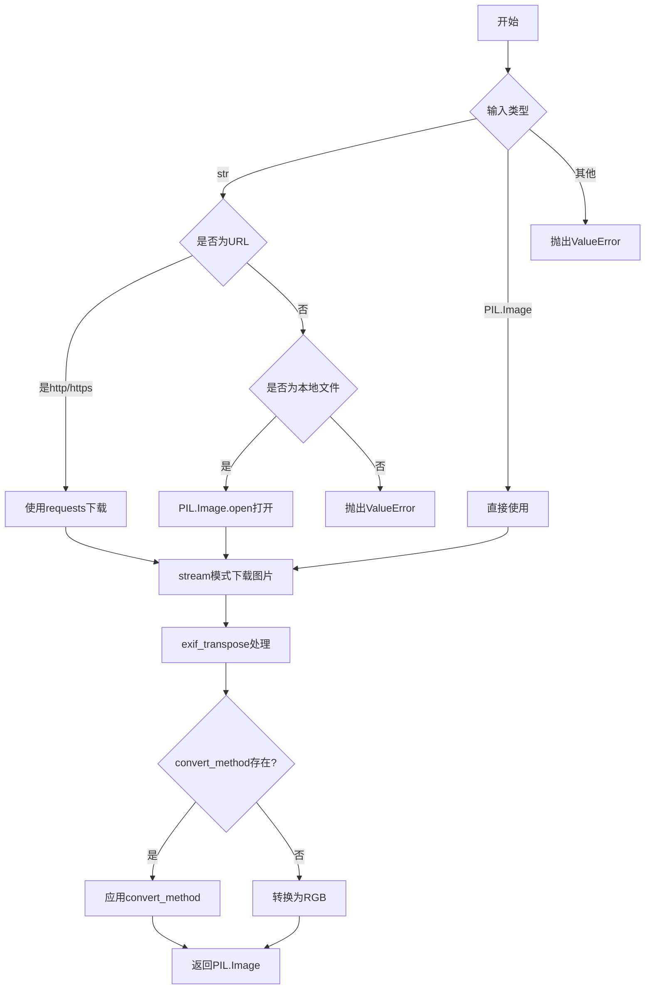
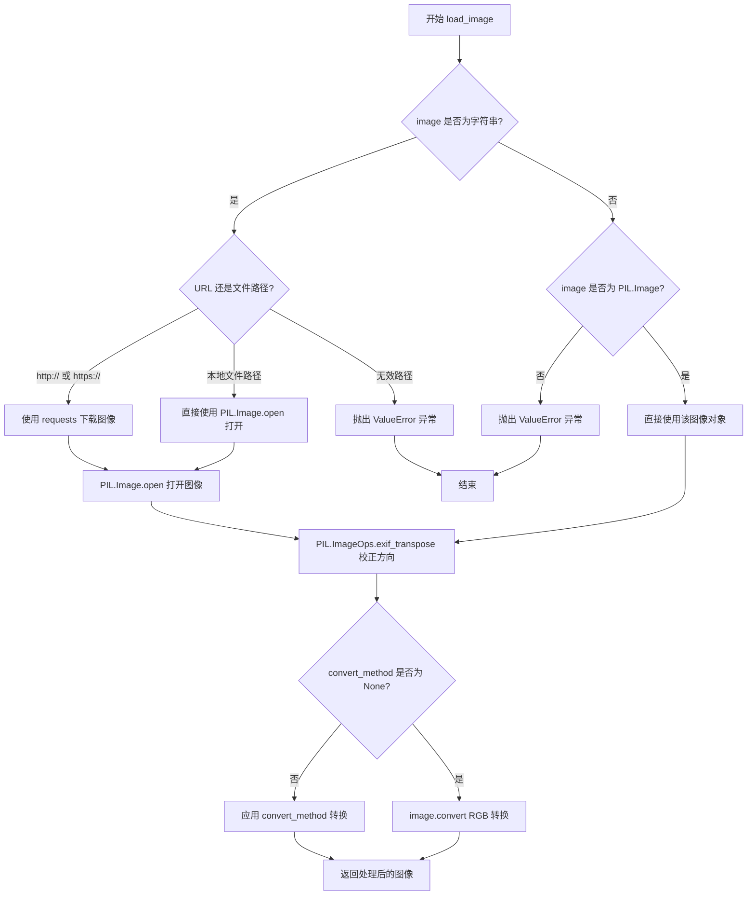
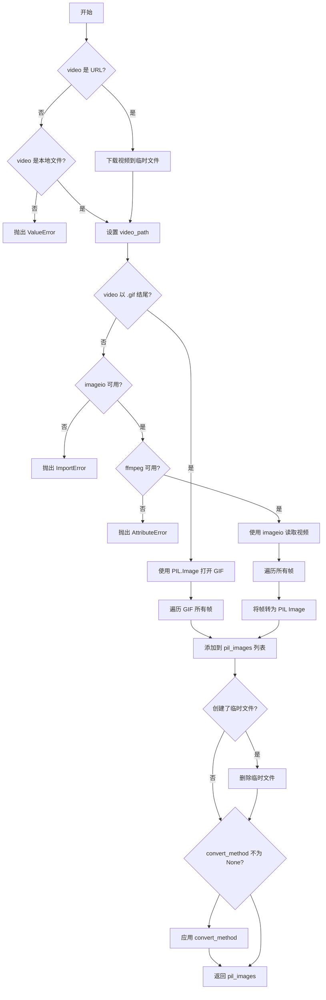
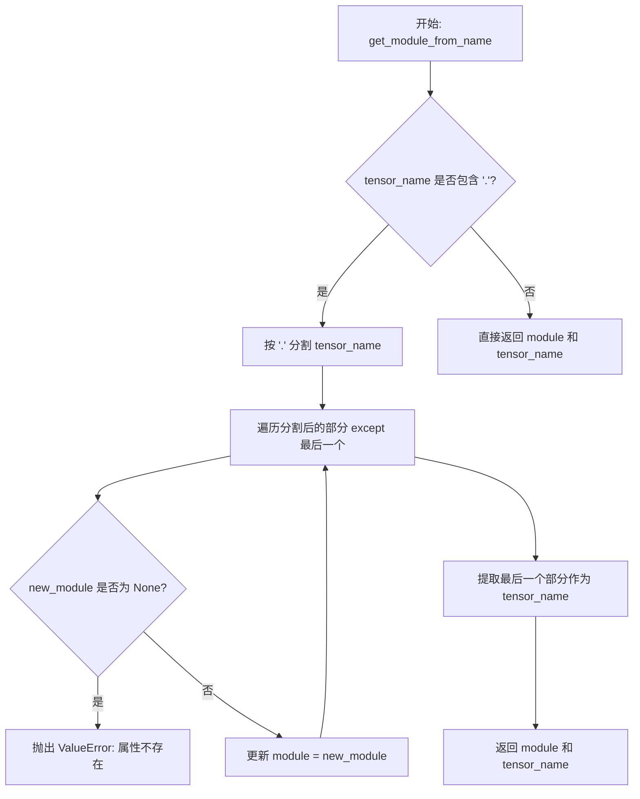

# `diffusers\src\diffusers\utils\loading_utils.py` 详细设计文档

该代码文件提供图像和视频加载的通用工具函数，支持从URL、本地路径或PIL Image对象加载图像，并将其转换为RGB格式；同时支持从视频文件或URL加载视频帧为PIL Image列表；还包含用于从模块中获取张量或子模块的辅助函数。

## 整体流程



## 类结构

```
无类定义 (纯函数模块)
Functions:
├── load_image
├── load_video
├── get_module_from_name
└── get_submodule_by_name
```

## 全局变量及字段


### `DIFFUSERS_REQUEST_TIMEOUT`
    
HTTP请求超时时间（秒），用于控制网络图像下载时的超时设置

类型：`int`
    


### `BACKENDS_MAPPING`
    
后端库映射字典，存储可选依赖库的相关信息，用于错误提示和版本检查

类型：`dict`
    


### `is_imageio_available`
    
检查imageio库是否可用的函数，返回布尔值表示库是否已安装

类型：`Callable[[], bool]`
    


    

## 全局函数及方法


### `load_image`

该函数用于将图像加载为 PIL Image 对象，支持从 URL 路径、本地文件系统或直接传入的 PIL Image 对象三种方式加载，并在加载后自动进行 EXIF 方向校正，可选地应用自定义转换方法或默认转换为 RGB 格式。

**参数：**

- `image`：`str | PIL.Image.Image`，要加载的图像，可以是 URL 链接、本地文件路径或已存在的 PIL Image 对象
- `convert_method`：`Callable[[PIL.Image.Image], PIL.Image.Image] | None`，可选的图像转换方法，当为 `None` 时图像将被转换为 "RGB" 格式

**返回值：** `PIL.Image.Image`，返回加载并转换后的 PIL 图像对象

#### 流程图



#### 带注释源码

```python
def load_image(
    image: str | PIL.Image.Image, convert_method: Callable[[PIL.Image.Image], PIL.Image.Image] | None = None
) -> PIL.Image.Image:
    """
    Loads `image` to a PIL Image.

    Args:
        image (`str` or `PIL.Image.Image`):
            The image to convert to the PIL Image format.
        convert_method (Callable[[PIL.Image.Image], PIL.Image.Image], *optional*):
            A conversion method to apply to the image after loading it. When set to `None` the image will be converted
            "RGB".

    Returns:
        `PIL.Image.Image`:
            A PIL Image.
    """
    # 判断 image 是否为字符串类型（URL 或文件路径）
    if isinstance(image, str):
        # 判断是否为 HTTP/HTTPS URL
        if image.startswith("http://") or image.startswith("https://"):
            # 通过网络请求下载图像，使用流式读取方式
            # timeout 参数来自常量 DIFFUSERS_REQUEST_TIMEOUT，控制请求超时时间
            image = PIL.Image.open(requests.get(image, stream=True, timeout=DIFFUSERS_REQUEST_TIMEOUT).raw)
        # 判断是否为本地文件路径
        elif os.path.isfile(image):
            # 直接打开本地图像文件
            image = PIL.Image.open(image)
        else:
            # 既不是有效 URL 也不是有效文件路径，抛出异常
            raise ValueError(
                f"Incorrect path or URL. URLs must start with `http://` or `https://`, and {image} is not a valid path."
            )
    # 判断 image 是否已经是 PIL Image 对象
    elif isinstance(image, PIL.Image.Image):
        # 已经是 PIL Image，直接赋值使用
        image = image
    else:
        # 格式不正确，抛出异常
        raise ValueError(
            "Incorrect format used for the image. Should be a URL linking to an image, a local path, or a PIL image."
        )

    # 使用 exif_transpose 处理图像的 EXIF 方向信息
    # 这会根据图片的 EXIF 元数据自动旋转图像到正确方向
    image = PIL.ImageOps.exif_transpose(image)

    # 如果提供了转换方法，则应用该方法
    if convert_method is not None:
        image = convert_method(image)
    else:
        # 默认将图像转换为 RGB 模式
        image = image.convert("RGB")

    # 返回处理后的 PIL Image 对象
    return image
```


### `load_video`

该函数用于将视频文件（支持本地路径或远程 URL）或 GIF 动画加载为 PIL Image 列表，支持自动下载远程视频、解析 GIF 动画帧、以及通过自定义转换方法处理图像。

#### 参数

- `video`：`str`，视频文件的路径或 URL，支持 http://、https:// 开头或本地文件路径
- `convert_method`：`Callable[[list[PIL.Image.Image]], list[PIL.Image.Image]] | None`，可选的转换方法，应用于加载后的图像列表，若为 None 则默认转换为 RGB 模式

#### 返回值

`list[PIL.Image.Image]`，返回由视频帧组成的 PIL 图像列表

#### 流程图



#### 带注释源码

```python
def load_video(
    video: str,
    convert_method: Callable[[list[PIL.Image.Image]], list[PIL.Image.Image]] | None = None,
) -> list[PIL.Image.Image]:
    """
    Loads `video` to a list of PIL Image.

    Args:
        video (`str`):
            A URL or Path to a video to convert to a list of PIL Image format.
        convert_method (Callable[[list[PIL.Image.Image]], list[PIL.Image.Image]], *optional*):
            A conversion method to apply to the video after loading it. When set to `None` the images will be converted
            to "RGB".

    Returns:
        `list[PIL.Image.Image]`:
            The video as a list of PIL images.
    """
    # 检查 video 是 URL 还是本地文件路径
    is_url = video.startswith("http://") or video.startswith("https://")
    is_file = os.path.isfile(video)
    was_tempfile_created = False

    # 验证输入路径/URL 有效性
    if not (is_url or is_file):
        raise ValueError(
            f"Incorrect path or URL. URLs must start with `http://` or `https://`, and {video} is not a valid path."
        )

    # 如果是 URL，下载视频到临时文件
    if is_url:
        # 发起 HTTP 请求获取视频内容
        response = requests.get(video, stream=True)
        # 检查 HTTP 响应状态码
        if response.status_code != 200:
            raise ValueError(f"Failed to download video. Status code: {response.status_code}")

        # 解析 URL 获取文件名
        parsed_url = urlparse(video)
        file_name = os.path.basename(unquote(parsed_url_path))

        # 确定文件后缀，默认为 .mp4
        suffix = os.path.splitext(file_name)[1] or ".mp4"
        # 创建临时文件保存下载的视频
        video_path = tempfile.NamedTemporaryFile(suffix=suffix, delete=False).name

        was_tempfile_created = True

        # 分块下载视频内容并写入临时文件
        video_data = response.iter_content(chunk_size=8192)
        with open(video_path, "wb") as f:
            for chunk in video_data:
                f.write(chunk)

        # 将 video 变量更新为本地临时文件路径
        video = video_path

    # 初始化图像列表
    pil_images = []

    # 判断是 GIF 格式还是普通视频格式
    if video.endswith(".gif"):
        # 使用 PIL 打开 GIF 动画
        gif = PIL.Image.open(video)
        try:
            # 遍历 GIF 的所有帧
            while True:
                pil_images.append(gif.copy())
                gif.seek(gif.tell() + 1)
        except EOFError:
            # 遍历结束
            pass

    else:
        # 非 GIF 格式，使用 imageio 读取视频帧
        # 检查 imageio 库是否可用
        if is_imageio_available():
            import imageio
        else:
            # 如果不可用，抛出导入错误
            raise ImportError(BACKENDS_MAPPING["imageio"][1].format("load_video"))

        # 检查 ffmpeg 是否安装
        try:
            imageio.plugins.ffmpeg.get_exe()
        except AttributeError:
            raise AttributeError(
                "`Unable to find an ffmpeg installation on your machine. Please install via `pip install imageio-ffmpeg"
            )

        # 使用 imageio 读取视频
        with imageio.get_reader(video) as reader:
            # 遍历视频的所有帧
            for frame in reader:
                # 将 numpy 数组格式的帧转换为 PIL Image 并添加到列表
                pil_images.append(PIL.Image.fromarray(frame))

    # 如果创建了临时文件，下载完成后删除
    if was_tempfile_created:
        os.remove(video_path)

    # 如果提供了转换方法，应用到图像列表
    if convert_method is not None:
        pil_images = convert_method(pil_images)

    # 返回 PIL 图像列表
    return pil_images
```


### `get_module_from_name`

该函数用于从给定的模块和完整的张量名称（如 "encoder.layer1.weight"）中解析出最终包含该张量的子模块以及张量本身的名称。

参数：

- `module`：`Any`，包含张量的父模块对象。
- `tensor_name`：`str`，完整的张量名称，支持点分隔的嵌套属性访问（如 "encoder.layer1.weight"）。

返回值：`tuple[Any, str]`，返回包含目标张量的子模块和张量名称本身的元组。

#### 流程图



#### 带注释源码

```python
# Taken from `transformers`.
def get_module_from_name(module, tensor_name: str) -> tuple[Any, str]:
    """
    根据张量名称从模块中获取子模块和张量名称。
    
    Args:
        module: 包含张量的父模块对象
        tensor_name: 完整的张量名称，支持点分隔的嵌套属性访问
    
    Returns:
        包含目标张量的子模块和张量名称的元组
    """
    # 检查 tensor_name 是否包含点号（嵌套属性访问）
    if "." in tensor_name:
        # 按点号分割字符串
        splits = tensor_name.split(".")
        # 遍历除了最后一个部分外的所有部分，逐步获取子模块
        for split in splits[:-1]:
            # 获取当前模块的子模块
            new_module = getattr(module, split)
            # 如果属性不存在，抛出异常
            if new_module is None:
                raise ValueError(f"{module} has no attribute {split}.")
            # 更新当前模块为子模块，继续下一层查找
            module = new_module
        # 最后一个部分就是实际的张量名称
        tensor_name = splits[-1]
    # 返回最终模块和张量名称
    return module, tensor_name
```


### `get_submodule_by_name`

该函数通过点分隔的路径字符串递归访问嵌套对象属性或列表元素，实现从根模块动态获取深层子模块的功能，支持属性访问和整数索引访问两种方式。

参数：

- `root_module`：任意类型，查询的根模块对象
- `module_path`：`str`，模块路径字符串，用点号分隔（如 `"encoder.layer1.weight"` 或 `"layers.0"`）

返回值：任意类型，返回路径指向的子模块对象

#### 流程图

```mermaid
flowchart TD
    A[开始] --> B[将 root_module 赋值给 current]
    B --> C[按 '.' 分割 module_path 得到 parts 列表]
    C --> D{遍历 parts 中的每个 part}
    D --> E{判断 part 是否为数字}
    E -->|是| F[将 part 转换为整数 idx]
    F --> G[current = current[idx]]
    E -->|否| H[current = getattr current, part]
    G --> I{parts 是否遍历完成}
    H --> I
    I -->|否| D
    I -->|是| J[返回 current]
    J --> K[结束]
```

#### 带注释源码

```python
def get_submodule_by_name(root_module, module_path: str):
    """
    根据给定的模块路径字符串从根模块中获取嵌套的子模块。

    Args:
        root_module: 根模块对象，可以是任意 Python 对象
        module_path: 模块路径字符串，用点号分隔，支持两种格式：
            - 属性访问：如 "encoder.layer1.weight"
            - 索引访问：如 "layers.0" 用于 nn.ModuleList 或 nn.Sequential

    Returns:
        返回路径指向的子模块对象

    Example:
        >>> import torch.nn as nn
        >>> model = nn.Sequential(nn.Linear(10, 5), nn.Linear(5, 2))
        >>> get_submodule_by_name(model, "0.weight")  # 获取第一个 Linear 层的 weight
    """
    # 初始化当前模块为根模块
    current = root_module
    
    # 将路径字符串按点号分割成多个部分
    parts = module_path.split(".")
    
    # 遍历路径的每个部分
    for part in parts:
        # 判断当前部分是否为数字索引
        if part.isdigit():
            # 数字索引：用于 nn.ModuleList 或 nn.Sequential 等支持整数索引的模块
            idx = int(part)
            current = current[idx]
        else:
            # 属性名：使用 getattr 获取对象的属性
            current = getattr(current, part)
    
    # 返回最终获取到的子模块
    return current
```

## 关键组件


### 图片加载组件 (load_image)

负责将各种来源的图片（URL链接、本地文件路径、PIL Image对象）统一转换为PIL Image格式，并支持可选的转换方法

### 视频加载组件 (load_video)

负责将视频文件（支持URL、本地路径）转换为PIL Image列表，支持GIF动图和普通视频格式，具备临时文件管理和自动清理机制

### 模块属性解析组件 (get_module_from_name)

从transformers库借鉴的模块属性获取工具，通过点分隔的字符串路径递归访问嵌套模块属性，返回最终的模块对象和属性名

### 子模块索引组件 (get_submodule_by_name)

根据模块路径字符串递归获取子模块，支持数字索引（用于nn.ModuleList或nn.Sequential）和属性名两种访问方式

### HTTP请求与文件处理组件

处理URL资源的HTTP请求下载，使用流式下载和超时控制，具备临时文件创建和自动清理的完整生命周期管理

### 图像格式转换组件

利用PIL库进行图像格式转换，包括EXIF转置（处理相机方向）和RGB格式转换，确保图像在不同场景下的一致性


## 问题及建议


### 已知问题

- **临时文件泄漏风险**：`load_video` 函数在下载视频时创建临时文件，但如果在写入过程中或 `os.remove` 之前抛出异常，临时文件将不会被清理。应使用 `try-finally` 或上下文管理器确保清理。
- **缺少超时设置**：`load_video` 中的 `requests.get(video, stream=True)` 未设置 `timeout` 参数，可能导致请求无限期等待；而 `load_image` 虽然导入了 `DIFFUSERS_REQUEST_TIMEOUT` 常量却未使用。
- **内存占用风险**：视频帧被全部加载到内存中（`pil_images.append(...)`），对于长视频可能导致内存溢出，应考虑流式处理或生成器模式。
- **缺少内容验证**：下载图片或视频后未验证内容类型是否匹配（如下载的文件实际是否为有效图片/视频），可能引发后续处理错误。
- **不完整的异常处理**：`load_video` 中 `response.raise_for_status()` 未被调用，仅检查状态码；ffmpeg 检测使用 `AttributeError` 捕获不精确。
- **导入方式不规范**：`import imageio` 在条件分支内，可能导致作用域混淆；建议统一在函数顶部导入或使用延迟导入模式。

### 优化建议

- 使用上下文管理器管理临时文件：`with tempfile.NamedTemporaryFile(suffix=suffix, delete=False) as tmp:` 并在 `finally` 块中确保删除。
- 为所有 `requests.get/post` 调用添加合理的 `timeout` 参数，可复用 `DIFFUSERS_REQUEST_TIMEOUT` 常量。
- 考虑将 `load_video` 改为生成器模式或在返回前提供分批处理能力，以支持大视频文件。
- 添加内容类型和文件扩展名校验，确保下载的数据与预期格式匹配。
- 使用 `response.raise_for_status()` 替代手动检查状态码，简化错误处理逻辑。
- 将 imageio 的导入移至函数顶部或使用 `from ... import ...` 保持导入风格一致。

## 其它


### 设计目标与约束

本模块的设计目标是为diffusers库提供统一的媒体加载接口，支持从URL、本地路径加载图像和视频，并转换为PIL Image格式供后续处理使用。设计约束包括：仅支持HTTP/HTTPS协议的URL加载；本地文件路径必须为有效文件路径；视频加载依赖imageio和ffmpeg；临时文件在使用后需及时清理以避免磁盘空间泄漏。

### 错误处理与异常设计

代码采用分层异常处理策略。输入验证阶段抛出ValueError，描述具体的无效输入类型（如非法的URL格式、非法的图像/视频格式）；网络请求失败时抛出requests库的异常；依赖缺失时抛出ImportError并提供安装提示；文件操作失败时抛出OSError。临时文件在异常情况下仍尝试删除（通过was_tempfile_created标志控制），避免资源泄漏。

### 数据流与状态机

图像加载流程：字符串输入→URL检测→HTTP请求/本地文件读取→PIL.Image.open→exif_transpose处理→convert_method或RGB转换→返回PIL.Image。视频加载流程：字符串输入→URL/文件检测→URL时下载到临时文件→根据扩展名选择GIF解析或imageio读取→帧转换为PIL.Image列表→convert_method处理→临时文件清理→返回列表。

### 外部依赖与接口契约

本模块依赖以下外部包：PIL(Pillow)用于图像处理，PIL.ImageOps用于exif转换，requests用于HTTP请求，tempfile用于临时文件管理，urllib.parse用于URL解析，imageio和imageio-ffmpeg用于视频解码。接口契约要求：load_image接受str或PIL.Image.Image，返回PIL.Image.Image；load_video接受str，返回list[PIL.Image.Image]；convert_method为可选回调函数。

### 性能考虑

URL下载采用流式处理（stream=True）并设置超时，避免大文件导致内存溢出。视频下载使用8KB块迭代写入临时文件。GIF帧提取使用迭代器模式避免一次性加载所有帧到内存。临时文件在操作完成后立即删除，防止磁盘空间占用。

### 安全性考虑

URL验证仅支持http://和https://协议，防止命令注入或本地文件访问攻击。临时文件使用NamedTemporaryFile创建，路径随机。文件删除操作在finally块外执行，确保即使发生异常也能清理资源。requests请求设置timeout参数，防止无限等待。

### 兼容性考虑

代码使用Python 3.9+的类型提示语法（如str | PIL.Image.Image）。PIL.ImageOps.exif_transpose处理不同相机的EXIF方向问题，确保图像方向正确。GIF和普通视频（mp4等）采用不同的加载策略，兼容多种视频格式。

### 测试策略建议

应覆盖以下测试场景：有效URL图像加载、有效本地路径图像加载、有效URL视频加载、有效本地路径视频加载、无效URL格式异常、无效文件路径异常、不支持的图像格式异常、imageio不可用时的ImportError、ffmpeg不可用时的AttributeError、GIF格式正确解析、视频帧顺序正确、convert_method回调正确执行、临时文件正确清理。

### 配置与参数说明

DIFFUSERS_REQUEST_TIMEOUT：全局超时配置，控制HTTP请求的最大等待时间。convert_method：可选的图像转换回调，默认为None，此时图像转换为RGB模式。imageio和ffmpeg为可选依赖，通过is_imageio_available和BACKENDS_MAPPING进行检查。

### 使用示例

图像加载：load_image("https://example.com/image.jpg") 或 load_image("/path/to/image.png") 或 load_image(pil_image_obj)。视频加载：load_video("https://example.com/video.mp4") 或 load_video("/path/to/video.gif")。自定义转换：load_image(url, convert_method=lambda img: img.resize((224, 224)))。


    