# `diffusers\src\diffusers\utils\logging.py` 详细设计文档

这是Hugging Face Diffusers项目的日志工具模块，提供统一的日志管理功能，支持分布式环境下的日志过滤（通过_RankZeroFilter）、可配置的日志级别控制、默认处理器管理、以及进度条（tqdm）的启用/禁用控制。

## 整体流程

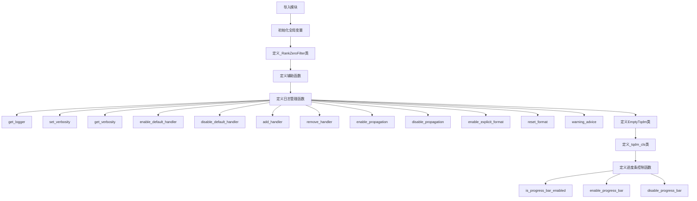

## 类结构

```
logging_utils (模块)
├── _RankZeroFilter (日志过滤器类)
├── EmptyTqdm (虚拟进度条类)
└── _tqdm_cls (进度条工厂类)
```

## 全局变量及字段


### `_lock`
    
A lock used for thread-safe configuration of the logging system

类型：`threading.Lock`
    


### `_default_handler`
    
The default stream handler for the library root logger

类型：`logging.Handler | None`
    


### `log_levels`
    
A dictionary mapping string log level names to their corresponding logging constants

类型：`dict[str, int]`
    


### `_default_log_level`
    
The default logging level (WARNING) used when no environment variable is set

类型：`int`
    


### `_tqdm_active`
    
A flag indicating whether tqdm progress bars are currently enabled

类型：`bool`
    


### `_rank_zero_filter`
    
A logging filter that allows rank-zero logs in distributed training environments

类型：`_RankZeroFilter | None`
    


### `_RankZeroFilter.filter`
    
Filters log records to allow rank-zero logs or debug-level messages from all ranks

类型：`method`
    


### `EmptyTqdm._iterator`
    
The iterator to be used for dummy tqdm iteration

类型：`Any`
    


### `_tqdm_cls._lock`
    
A lock object for thread-safe tqdm operations

类型：`Any`
    
    

## 全局函数及方法


### `_ensure_rank_zero_filter`

该函数用于确保日志记录器已添加_rank-zero过滤器，以便在分布式训练环境中仅在rank零节点上输出非DEBUG级别的日志，同时保留所有节点上的DEBUG级别日志供故障排查使用。

参数：

- `logger`：`logging.Logger`，需要添加rank-zero过滤器的日志记录器

返回值：`None`，该函数不返回任何值，仅修改日志记录器

#### 流程图

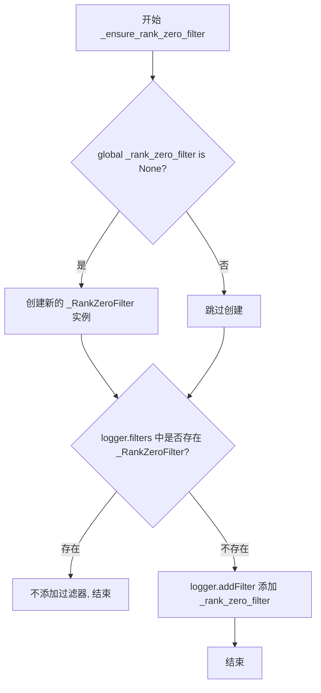

#### 带注释源码

```python
def _ensure_rank_zero_filter(logger: logging.Logger) -> None:
    """
    确保给定的日志记录器已添加 rank-zero 过滤器。
    该函数用于在分布式训练环境中控制日志输出，只有 rank 0 进程会输出非 DEBUG 级别的日志。
    """
    global _rank_zero_filter  # 引用全局变量以存储共享的过滤器实例

    # 如果全局过滤器实例尚不存在，则创建一个新的 _RankZeroFilter 实例
    if _rank_zero_filter is None:
        _rank_zero_filter = _RankZeroFilter()

    # 检查 logger 的过滤器列表中是否已经存在 _RankZeroFilter 类型的过滤器
    if not any(isinstance(f, _RankZeroFilter) for f in logger.filters):
        # 如果不存在，则将全局过滤器添加到 logger 中
        logger.addFilter(_rank_zero_filter)
```


### `_get_default_logging_level`

该函数用于获取默认的日志级别。它首先检查环境变量 `DIFFUSERS_VERBOSITY` 是否被设置为有效的日志级别选项，如果是则返回对应的日志级别值，否则回退到默认的日志级别 `_default_log_level`（WARNING 级别）。

参数：

- （无参数）

返回值：`int`，返回默认日志级别（logging.DEBUG、logging.INFO、logging.WARNING、logging.ERROR 或 logging.CRITICAL 之一）

#### 流程图

```mermaid
flowchart TD
    A[开始] --> B{获取环境变量<br/>DIFFUSERS_VERBOSITY}
    B --> C{环境变量是否设置?}
    C -->|是| D{环境变量值是否在<br/>log_levels 中?}
    C -->|否| H[返回 _default_log_level<br/>(WARNING)]
    D -->|是| E[返回对应的日志级别<br/>log_levels[env_level_str]]
    D -->|否| F[获取根日志记录器]
    F --> G[记录警告信息:<br/>Unknown option DIFFUSERS_VERBOSITY=xxx,<br/>has to be one of: debug, info...]
    G --> H
    E --> I[结束]
    H --> I
```

#### 带注释源码

```python
def _get_default_logging_level() -> int:
    """
    如果 DIFFUSERS_VERBOSITY 环境变量设置为有效选项之一，
    则将其作为新的默认级别返回。
    如果不是 - 回退到 `_default_log_level`
    """
    # 获取环境变量 DIFFUSERS_VERBOSITY 的值
    env_level_str = os.getenv("DIFFUSERS_VERBOSITY", None)
    
    # 如果环境变量已设置
    if env_level_str:
        # 检查环境变量值是否为有效的日志级别
        if env_level_str in log_levels:
            # 返回对应的日志级别整数值
            return log_levels[env_level_str]
        else:
            # 环境变量值无效，记录警告信息
            logging.getLogger().warning(
                f"Unknown option DIFFUSERS_VERBOSITY={env_level_str}, "
                f"has to be one of: {', '.join(log_levels.keys())}"
            )
    
    # 环境变量未设置或值无效，返回默认日志级别 WARNING
    return _default_log_level
```


### `_get_library_name`

该函数用于获取当前库的顶层名称，通过解析当前模块的 `__name__` 属性并提取第一个命名空间部分来确定库的根名称。

参数：此函数不接受任何参数。

返回值：`str`，返回库的顶层名称（包名），例如 `"diffusers"`。

#### 流程图

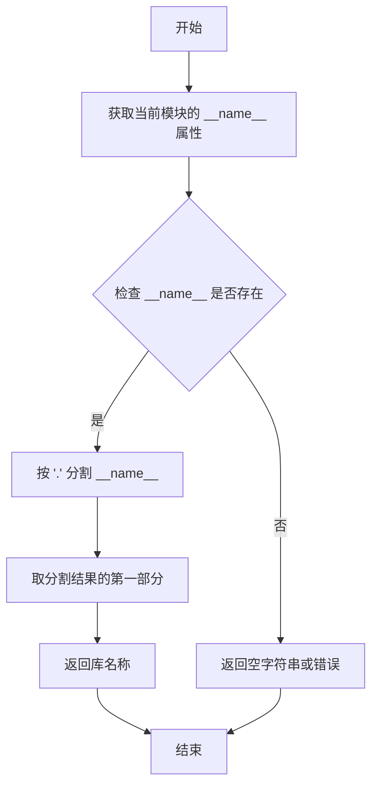

#### 带注释源码

```python
def _get_library_name() -> str:
    """
    获取当前库的顶层名称。
    
    通过解析当前模块的 __name__ 属性，提取第一个命名空间部分
    作为库的根名称。例如："diffusers.logging" -> "diffusers"
    
    Returns:
        str: 库的顶层名称（包名）
    """
    # __name__ 是 Python 的内置变量，表示当前模块的完全限定名
    # 例如：当这个文件作为 diffusers.logging 模块导入时，__name__ 为 "diffusers.logging"
    # split(".") 会将字符串按 "." 分割成列表：["diffusers", "logging"]
    # [0] 取列表的第一个元素，即顶层包名 "diffusers"
    return __name__.split(".")[0]
```


### `_get_library_root_logger`

获取库的根日志记录器，用于统一管理库的日志输出。

参数：

- （无参数）

返回值：`logging.Logger`，返回当前库的根日志记录器实例

#### 流程图

```mermaid
flowchart TD
    A[开始 _get_library_root_logger] --> B[调用 _get_library_name]
    B --> C[获取当前模块名称<br/>__name__.split('.')[0]]
    C --> D[调用 logging.getLogger<br/>参数: 库名称]
    D --> E[返回 Logger 实例]
```

#### 带注释源码

```python
def _get_library_root_logger() -> logging.Logger:
    """
    获取库的根日志记录器。
    
    该函数通过获取当前库的名称，然后调用 Python 标准库的
    logging.getLogger() 来创建一个统一的日志记录器实例。
    
    Returns:
        logging.Logger: 库的根日志记录器实例
    """
    # 调用 _get_library_name() 获取库名称（如 'diffusers'）
    # 然后使用 logging.getLogger() 获取或创建对应的日志记录器
    return logging.getLogger(_get_library_name())
```


### `_configure_library_root_logger`

该函数用于配置库的根日志记录器（library root logger），确保日志系统只初始化一次。它创建一个流处理器（StreamHandler）绑定到 `sys.stderr`，设置默认日志级别，并添加分布式训练场景下的 rank zero 过滤器，以避免非零 rank 进程产生冗余日志。

参数：该函数无参数

返回值：`None`，无返回值

#### 流程图

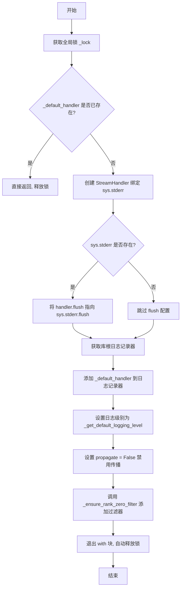

#### 带注释源码

```python
def _configure_library_root_logger() -> None:
    """
    配置库的根日志记录器。
    
    该函数确保日志系统只被初始化一次。使用线程锁防止并发初始化冲突。
    如果日志处理器已存在（已配置过），则直接返回，避免重复添加处理器。
    """
    global _default_handler  # 声明使用全局变量，默认日志处理器

    with _lock:  # 使用线程锁确保线程安全，防止并发配置
        if _default_handler:
            # 如果已经配置过库根日志记录器，则直接返回，避免重复添加 handler
            # 这确保了日志系统只会被初始化一次
            return
        
        # 创建流处理器，输出到 sys.stderr（标准错误流）
        _default_handler = logging.StreamHandler()  # Set sys.stderr as stream.

        # 只有当 sys.stderr 存在时才设置 flush 方法
        # 这是为了兼容 Windows 下的 pythonw 环境（没有 stderr）
        if sys.stderr:  # only if sys.stderr exists, e.g. when not using pythonw in windows
            _default_handler.flush = sys.stderr.flush

        # 获取库的根日志记录器（使用模块名的第一部分作为日志器名称）
        library_root_logger = _get_library_root_logger()
        
        # 将默认处理器添加到根日志记录器
        library_root_logger.addHandler(_default_handler)
        
        # 设置日志级别，从环境变量 DIFFUSERS_VERBOSITY 读取，默认为 WARNING
        library_root_logger.setLevel(_get_default_logging_level())
        
        # 禁用日志传播到父 logger，避免重复日志输出
        library_root_logger.propagate = False
        
        # 添加 rank zero 过滤器，确保分布式训练时只有 rank 0 进程输出日志
        # DEBUG 级别的日志除外，所有 rank 都可以输出用于调试
        _ensure_rank_zero_filter(library_root_logger)
```


### `_reset_library_root_logger`

该函数用于重置库根日志记录器，移除默认的日志处理器并将日志级别恢复为 NOTSET，同时释放默认处理器引用，以实现日志系统的完全重置。

参数： 无

返回值：`None`，无返回值

#### 流程图

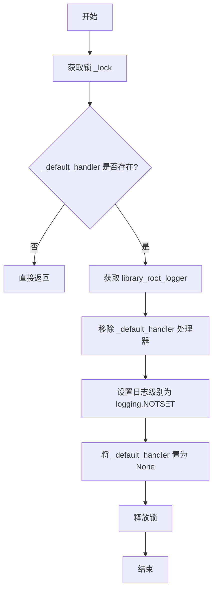

#### 带注释源码

```python
def _reset_library_root_logger() -> None:
    """
    重置库根日志记录器，移除默认处理器并恢复默认状态。
    用于清理日志配置，释放默认处理器资源。
    """
    global _default_handler  # 引用全局变量 _default_handler

    with _lock:  # 使用线程锁确保线程安全
        if not _default_handler:  # 如果默认处理器不存在
            return  # 直接返回，不执行任何操作

        # 获取库根日志记录器实例
        library_root_logger = _get_library_root_logger()
        
        # 从日志记录器中移除默认处理器
        library_root_logger.removeHandler(_default_handler)
        
        # 将日志级别设置为 NOTSET（未设置），继承父 logger 级别
        library_root_logger.setLevel(logging.NOTSET)
        
        # 释放默认处理器引用，允许垃圾回收
        _default_handler = None
```


### `get_log_levels_dict`

获取日志级别字典的函数，返回一个将日志级别名称映射到对应整数值的字典，用于配置和查询日志级别。

参数：

- （无参数）

返回值：`dict[str, int]`，返回一个字典，将日志级别名称字符串（如 "debug"、"info"、"warning"、"error"、"critical"）映射到对应的 logging 模块整数常量（如 `logging.DEBUG`、`logging.INFO` 等）。

#### 流程图

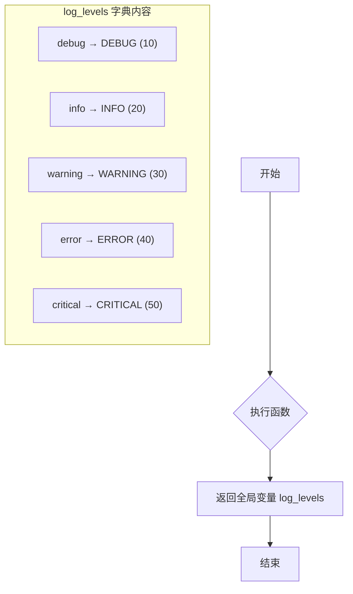

#### 带注释源码

```python
def get_log_levels_dict() -> dict[str, int]:
    """
    返回日志级别名称到整数值的映射字典。
    
    该函数提供对内部日志级别映射的访问，允许调用者获取
    支持的日志级别名称及其对应的 logging 模块常量值。
    
    Returns:
        dict[str, int]: 日志级别名称到整数值的映射字典
            - "debug": 对应 logging.DEBUG
            - "info": 对应 logging.INFO
            - "warning": 对应 logging.WARNING
            - "error": 对应 logging.ERROR
            - "critical": 对应 logging.CRITICAL
    """
    return log_levels
```


### `get_logger`

返回具有指定名称的日志记录器。如果未提供名称，则使用库名称（"diffusers"）。该函数确保根日志记录器已配置，并应用分布式训练时的 rank-zero 过滤逻辑。

参数：

- `name`：`str | None`，可选参数，默认为 `None`。日志记录器的名称。如果为 `None`，则自动获取库名称作为日志记录器名称。

返回值：`logging.Logger`，返回配置好的日志记录器实例。

#### 流程图

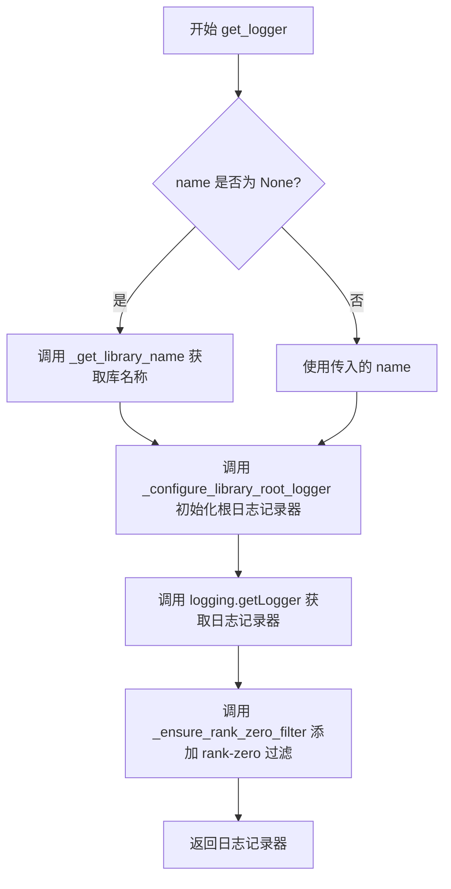

#### 带注释源码

```python
def get_logger(name: str | None = None) -> logging.Logger:
    """
    Return a logger with the specified name.

    This function is not supposed to be directly accessed unless you are writing a custom diffusers module.
    """

    # 如果未提供名称，则使用库名称（"diffusers"）作为默认日志记录器名称
    if name is None:
        name = _get_library_name()

    # 确保根日志记录器已配置（添加处理器、设置日志级别等）
    _configure_library_root_logger()
    
    # 获取或创建指定名称的 Python 日志记录器
    logger = logging.getLogger(name)
    
    # 为日志记录器添加分布式训练 rank-zero 过滤
    # 确保只有 rank 0 进程输出非 DEBUG 级别的日志
    _ensure_rank_zero_filter(logger)
    
    # 返回配置好的日志记录器
    return logger
```


### `get_verbosity`

获取当前 🤗 Diffusers 根日志记录器的日志级别，并以整数形式返回。

参数： 无

返回值：`int`，返回当前日志级别（10=DEBUG, 20=INFO, 30=WARNING, 40=ERROR, 50=CRITICAL）

#### 流程图

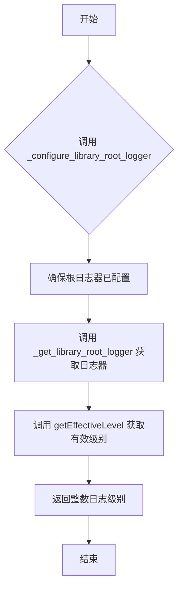

#### 带注释源码

```python
def get_verbosity() -> int:
    """
    Return the current level for the 🤗 Diffusers' root logger as an `int`.

    Returns:
        `int`:
            Logging level integers which can be one of:

            - `50`: `diffusers.logging.CRITICAL` or `diffusers.logging.FATAL`
            - `40`: `diffusers.logging.ERROR`
            - `30`: `diffusers.logging.WARNING` or `diffusers.logging.WARN`
            - `20`: `diffusers.logging.INFO`
            - `10`: `diffusers.logging.DEBUG`

    """

    # Step 1: 确保库根日志器已初始化配置
    # 此函数会检查并初始化默认处理器和日志级别
    _configure_library_root_logger()
    
    # Step 2: 获取库根日志器实例
    # 调用内部函数获取名为 'diffusers' 的根日志器
    library_root_logger = _get_library_root_logger()
    
    # Step 3: 获取当前有效的日志级别
    # getEffectiveLevel 会返回日志器当前设置的实际级别
    # 即使父日志器设置了不同级别，也会返回最终生效的级别
    return library_root_logger.getEffectiveLevel()
```


### `set_verbosity`

设置 🤗 Diffusers 根日志记录器的详细程度（verbosity）级别。

参数：

-  `verbosity`：`int`，日志级别，可以是以下值之一：
  - `diffusers.logging.CRITICAL` 或 `diffusers.logging.FATAL`（值 50）
  - `diffusers.logging.ERROR`（值 40）
  - `diffusers.logging.WARNING` 或 `diffusers.logging.WARN`（值 30）
  - `diffusers.logging.INFO`（值 20）
  - `diffusers.logging.DEBUG`（值 10）

返回值：`None`，该函数不返回任何值，仅设置日志级别。

#### 流程图

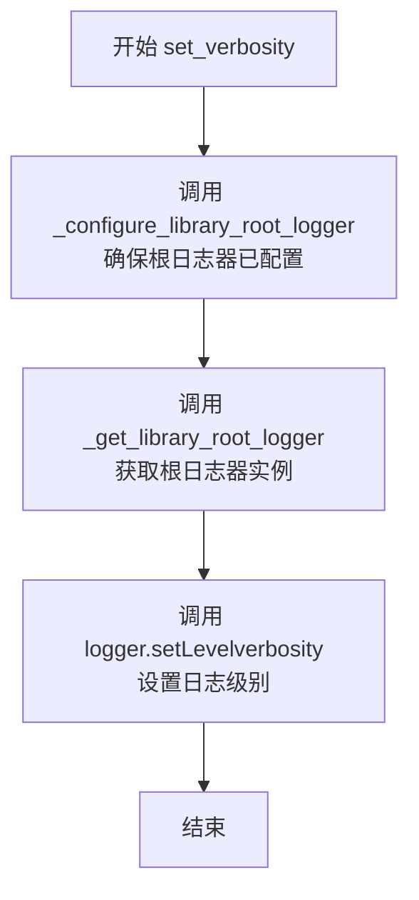

#### 带注释源码

```python
def set_verbosity(verbosity: int) -> None:
    """
    Set the verbosity level for the 🤗 Diffusers' root logger.

    Args:
        verbosity (`int`):
            Logging level which can be one of:

            - `diffusers.logging.CRITICAL` or `diffusers.logging.FATAL`
            - `diffusers.logging.ERROR`
            - `diffusers.logging.WARNING` or `diffusers.logging.WARN`
            - `diffusers.logging.INFO`
            - `diffusers.logging.DEBUG`
    """

    # 确保库根日志器已初始化（如果尚未配置，则创建默认处理器和配置）
    _configure_library_root_logger()
    
    # 获取库根日志器实例，并设置指定的详细程度级别
    _get_library_root_logger().setLevel(verbosity)
```


### `set_verbosity_info`

设置 🤗 Diffusers 根日志记录器的详细程度为 INFO 级别。

参数：  
无参数

返回值：`None`，无返回值描述

#### 流程图

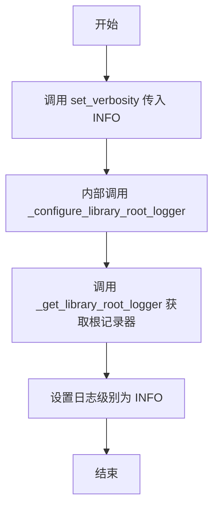

#### 带注释源码

```python
def set_verbosity_info() -> None:
    """Set the verbosity to the `INFO` level."""
    # 调用 set_verbosity 函数，传入 logging.INFO 常量
    # 该常量值为 20，对应 logging.INFO 级别
    # 函数内部会先确保根日志记录器已配置，然后设置日志级别
    return set_verbosity(INFO)
```

> **备注**：该函数是对 `set_verbosity(INFO)` 的便捷封装，遵循其他类似函数（`set_verbosity_warning`、`set_verbosity_debug`、`set_verbosity_error`）的统一模式。函数名采用 `snake_case` 风格，与项目中的其他日志设置函数保持一致。


### `set_verbosity_warning`

该函数用于将 🤗 Diffusers 根日志器的详细程度设置为 `WARNING` 级别，即仅显示警告及更高级别的日志信息。

参数：  
无

返回值：`None`，无返回值

#### 流程图

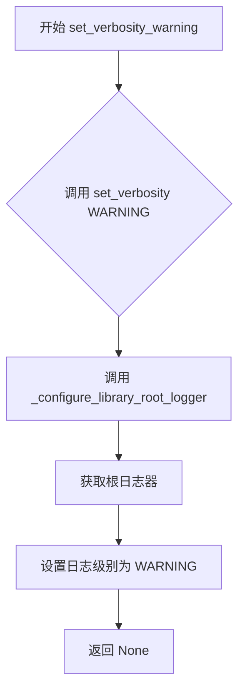

#### 带注释源码

```python
def set_verbosity_warning() -> None:
    """
    Set the verbosity to the `WARNING` level.
    
    该函数是一个便捷函数，用于快速将日志级别设置为 WARNING。
    它内部调用 set_verbosity() 函数并传入 WARNING 日志级别常量。
    WARNING 级别表示仅显示警告、错误和严重错误信息，
    不显示 info 和 debug 级别的调试信息。
    """
    # WARNING 是从 logging 模块导入的日志级别常量，值为 30
    # 调用 set_verbosity 函数，传入 WARNING 级别
    # set_verbosity 会先确保根日志器已配置，然后设置日志级别
    return set_verbosity(WARNING)
```


### `set_verbosity_debug`

设置日志 verbosity 级别为 DEBUG 的便捷函数，用于启用所有调试信息的显示。

参数：

- 无

返回值：`None`，无返回值

#### 流程图

```mermaid
flowchart TD
    A[set_verbosity_debug 调用] --> B[调用 set_verbosity]
    B --> C{检查日志处理器是否存在}
    C -->|不存在[D]| D[创建默认日志处理器]
    C -->|已存在[E]| E[获取库根日志器]
    D --> E
    E --> F[设置日志级别为 DEBUG]
    F --> G[返回]
    
    style A fill:#e1f5fe
    style F fill:#e8f5e8
    style G fill:#ffecb3
```

#### 带注释源码

```python
def set_verbosity_debug() -> None:
    """
    Set the verbosity to the `DEBUG` level.
    
    此函数是便捷函数，用于将 Diffusers 库的根日志器 verbosity 级别
    设置为 DEBUG 级别。它内部调用 set_verbosity(DEBUG) 来实现。
    
    使用此函数后，所有 DEBUG 级别及以上的日志消息都将被输出，
    有助于开发者调试代码和追踪程序执行流程。
    """
    # 调用 set_verbosity 函数，传入 DEBUG 日志级别常量
    # DEBUG 来自 logging 模块，值为 10
    return set_verbosity(DEBUG)
```


### `set_verbosity_error`

将 Diffusers 库的根日志记录器（Root Logger）的详细程度设置为 `ERROR` 级别。调用此函数后，系统将仅显示错误（ERROR）和严重（CRITICAL）日志信息，警告（WARNING）及更低级别的日志将被屏蔽。

参数：
- 无

返回值：`None`，无返回值（该函数直接修改全局日志记录器的状态）。

#### 流程图

```mermaid
graph TD
    Start([开始]) --> CallSetVerbosity[调用 set_verbosity(ERROR)]
    CallSetVerbosity --> ConfigureLogger{检查并初始化<br>根日志记录器}
    ConfigureLogger --> SetLevel[设置日志级别为 ERROR]
    SetLevel --> End([结束])
    
    style CallSetVerbosity fill:#f9f,stroke:#333,stroke-width:2px
```

#### 带注释源码

```python
def set_verbosity_error() -> None:
    """Set the verbosity to the `ERROR` level."""
    # 调用通用的 set_verbosity 函数，传入日志模块的 ERROR 级别常量
    # 该函数内部会确保日志系统已初始化，并将根日志器级别设为 ERROR
    return set_verbosity(ERROR)
```


### `disable_default_handler`

禁用 🤗 Diffusers 根日志记录器的默认处理器，使其不再输出日志。

参数：

- （无参数）

返回值：`None`，无返回值，但会移除根日志记录器的默认处理器。

#### 流程图

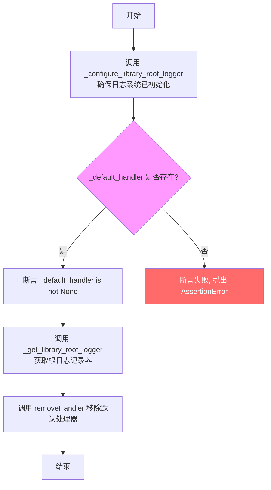

#### 带注释源码

```python
def disable_default_handler() -> None:
    """Disable the default handler of the 🤗 Diffusers' root logger."""
    # 确保日志系统已初始化（如果尚未配置，则创建默认处理器）
    _configure_library_root_logger()

    # 断言确保默认处理器已存在，防止意外移除不存在的处理器
    assert _default_handler is not None
    # 获取根日志记录器并移除默认处理器
    _get_library_root_logger().removeHandler(_default_handler)
```


### `enable_default_handler`

该函数用于启用 Diffusers 库根日志记录器的默认处理器（handler），使其能够输出日志信息。

参数：无

返回值：`None`，无返回值描述

#### 流程图

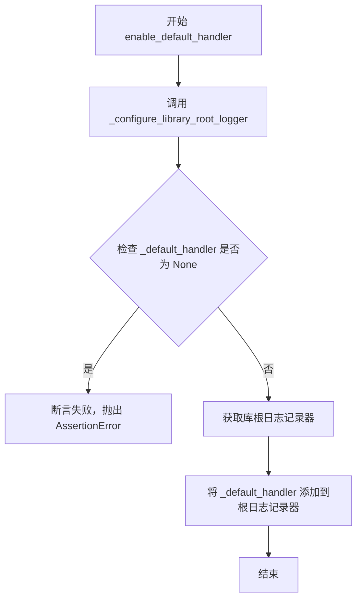

#### 带注释源码

```python
def enable_default_handler() -> None:
    """Enable the default handler of the 🤗 Diffusers' root logger."""

    # 确保库根日志记录器已经配置（如果未配置则创建默认 handler）
    _configure_library_root_logger()

    # 断言确保默认处理器已存在（已被 _configure_library_root_logger 创建）
    assert _default_handler is not None
    
    # 获取库根日志记录器并将默认处理器添加到其中
    _get_library_root_logger().addHandler(_default_handler)
```


### `add_handler`

为 HuggingFace Diffusers 的根日志记录器添加一个日志处理器。

参数：

- `handler`：`logging.Handler`，要添加的日志处理器，用于处理日志输出

返回值：`None`，无返回值

#### 流程图

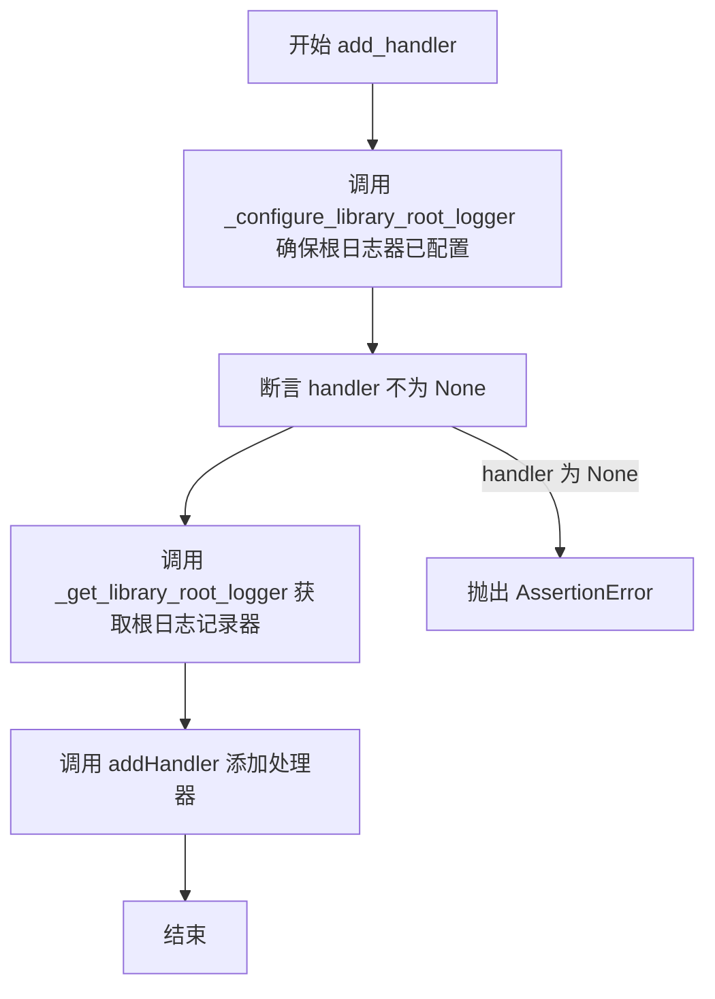

#### 带注释源码

```python
def add_handler(handler: logging.Handler) -> None:
    """adds a handler to the HuggingFace Diffusers' root logger."""
    
    # 确保根日志记录器已初始化（包含默认处理器和日志级别配置）
    _configure_library_root_logger()
    
    # 断言传入的 handler 不能为空，否则抛出 AssertionError
    assert handler is not None
    
    # 获取库根日志记录器，并将传入的 handler 添加到其中
    # 这样该 handler 就可以处理来自 Diffusers 库的日志消息了
    _get_library_root_logger().addHandler(handler)
```


### `remove_handler`

该函数用于从 HuggingFace Diffusers 的根日志记录器中移除指定的日志处理器，确保日志系统能够动态管理处理器列表。

参数：

- `handler`：`logging.Handler`，要移除的日志处理器对象，必须不为空且存在于根日志记录器的处理器列表中

返回值：`None`，该函数不返回任何值，仅执行移除操作

#### 流程图

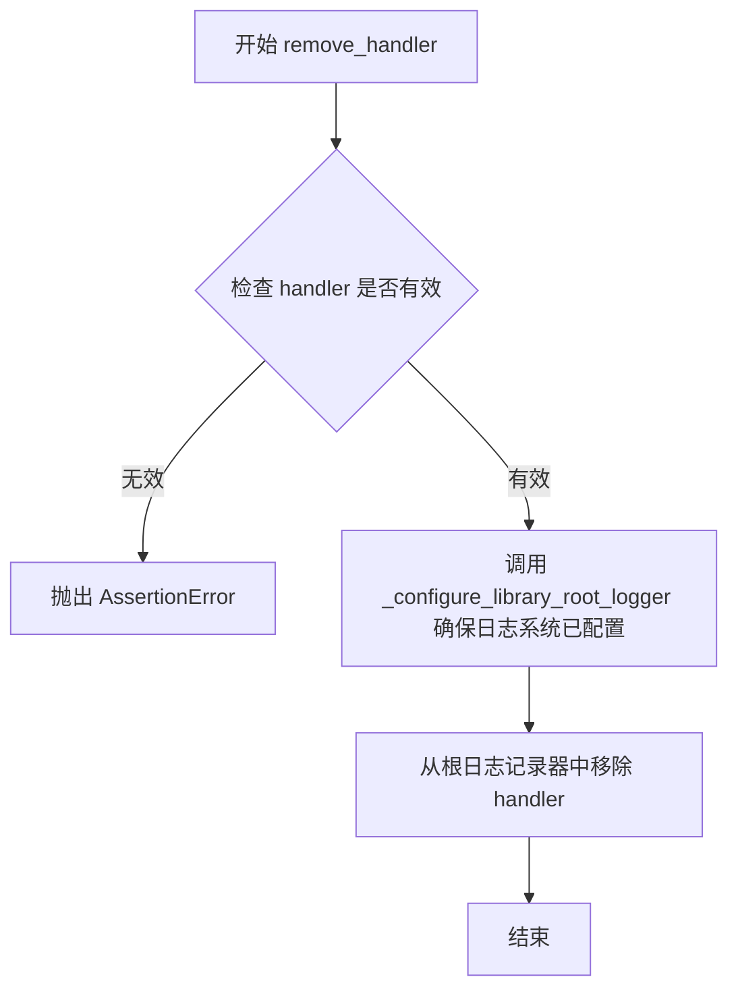

#### 带注释源码

```python
def remove_handler(handler: logging.Handler) -> None:
    """removes given handler from the HuggingFace Diffusers' root logger."""
    # 确保库根日志记录器已经过配置（如果未配置则初始化）
    _configure_library_root_logger()

    # 断言验证：
    # 1. handler 不能为 None
    # 2. handler 必须存在于根日志记录器的 handlers 列表中
    assert handler is not None and handler in _get_library_root_logger().handlers
    # 从根日志记录器中移除指定的处理器
    _get_library_root_logger().removeHandler(handler)
```


### `disable_propagation`

该函数用于禁用库的日志输出向上传播（propagation）到父logger。注意：日志传播在默认情况下是禁用的。

参数：

- 无参数

返回值：`None`，无返回值（该函数修改logger的属性但不返回任何值）

#### 流程图

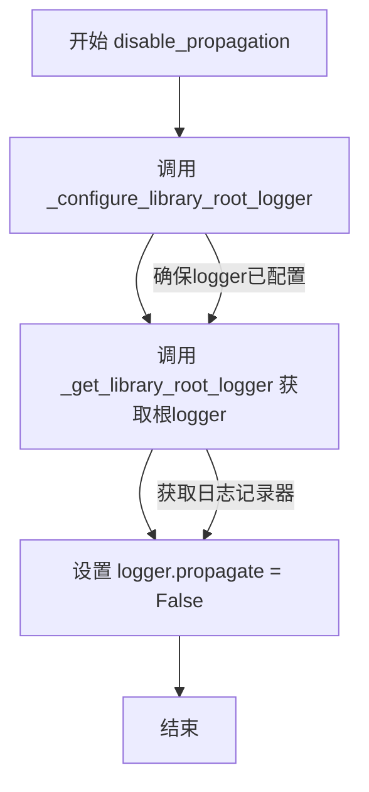

#### 带注释源码

```python
def disable_propagation() -> None:
    """
    Disable propagation of the library log outputs. Note that log propagation is disabled by default.
    """
    # 调用 _configure_library_root_logger 确保根logger已经被配置
    # （包括添加默认handler、设置日志级别等）
    _configure_library_root_logger()
    
    # 获取库的根logger（通常是'diffusers'）
    # 并将其 propagate 属性设置为 False
    # 这样日志不会向上传播到父logger（如root logger）
    # 避免日志被多次处理或重复输出
    _get_library_root_logger().propagate = False
```


### `enable_propagation`

启用日志传播功能，允许日志消息传播到父日志器。

参数：

- （无参数）

返回值：`None`，无返回值

#### 流程图

```mermaid
flowchart TD
    A[开始] --> B[调用 _configure_library_root_logger 初始化根日志器]
    B --> C[调用 _get_library_root_logger 获取库根日志器]
    C --> D[设置日志器的 propagate 属性为 True]
    D --> E[结束]
```

#### 带注释源码

```python
def enable_propagation() -> None:
    """
    Enable propagation of the library log outputs. Please disable the HuggingFace Diffusers' default handler to prevent
    double logging if the root logger has been configured.
    """
    # 确保库根日志器已被初始化和配置
    # 如果尚未配置，则创建默认处理器并设置日志级别
    _configure_library_root_logger()
    
    # 获取库根日志器（Diffusers 库的顶层日志器）
    # 返回 logging.Logger 对象
    _get_library_root_logger().propagate = True
    # 将 propagate 属性设置为 True
    # 允许日志消息向上传播到父日志器（如根日志器）
    # 默认情况下 propagate 为 False，需要显式启用
```


### `enable_explicit_format`

启用显式日志格式，为所有绑定到根日志器的处理器设置统一的格式化器，格式为 `[LEVELNAME|FILENAME|LINE NUMBER] TIME >> MESSAGE`。

参数：

- 该函数无参数

返回值：`None`，无返回值（表示该方法仅修改日志处理器的格式，不返回任何值）

#### 流程图

```mermaid
flowchart TD
    A[开始] --> B[获取根日志器 handlers]
    B --> C{遍历 handlers}
    C -->|每个 handler| D[创建显式格式化器]
    D --> E[设置 handler 的格式化器]
    E --> C
    C --> F[结束]
```

#### 带注释源码

```python
def enable_explicit_format() -> None:
    """
    Enable explicit formatting for every 🤗 Diffusers' logger. The explicit formatter is as follows:
    ```
    [LEVELNAME|FILENAME|LINE NUMBER] TIME >> MESSAGE
    ```
    All handlers currently bound to the root logger are affected by this method.
    """
    # 获取根日志器的所有处理器（handlers）
    handlers = _get_library_root_logger().handlers

    # 遍历每个处理器并设置显式格式化器
    for handler in handlers:
        # 创建显式格式的格式化器
        # 格式说明：
        #   %(levelname)s  - 日志级别（如DEBUG、INFO等）
        #   %(filename)s   - 日志文件名
        #   %(lineno)s     - 日志行号
        #   %(asctime)s    - 时间戳
        #   %(message)s   - 日志消息
        formatter = logging.Formatter("[%(levelname)s|%(filename)s:%(lineno)s] %(asctime)s >> %(message)s")
        # 为当前处理器设置格式化器
        handler.setFormatter(formatter)
```


### `reset_format`

重置 🤗 Diffusers 日志处理器的格式化配置，将所有绑定到根日志记录器的处理器格式恢复为默认状态（无格式）。

参数：

- 无

返回值：`None`，无返回值描述

#### 流程图

```mermaid
flowchart TD
    A[开始 reset_format] --> B[获取根日志记录器的所有处理器]
    B --> C{遍历每个处理器}
    C -->|是| D[设置处理器格式为 None]
    D --> C
    C -->|否| E[结束]
```

#### 带注释源码

```python
def reset_format() -> None:
    """
    Resets the formatting for 🤗 Diffusers' loggers.

    All handlers currently bound to the root logger are affected by this method.
    """
    # 获取根日志记录器的所有处理器（handlers）
    # 这些处理器负责输出日志到不同的目标（如stderr、文件等）
    handlers = _get_library_root_logger().handlers

    # 遍历每个处理器，将其格式化器设置为None
    # 这会移除任何自定义的日志格式，恢复到Python默认的日志格式
    for handler in handlers:
        handler.setFormatter(None)
```


### `logging.Logger.warning_advice`

该方法是对 `logger.warning()` 的包装，用于在特定环境下抑制 advisory 类型的警告信息。当环境变量 `DIFFUSERS_NO_ADVISORY_WARNINGS` 被设置为真值时，警告信息将不会被打印；否则行为与标准 `warning()` 方法一致。

参数：

- `self`：`logging.Logger`，Logger 实例本身，用于调用原始的 warning 方法
- `*args`：`Any`，可变位置参数，会原样传递给 self.warning()，通常为警告消息模板或格式化参数
- `**kwargs`：`Any`，可变关键字参数，会原样传递给 self.warning()，通常包含日志消息的额外参数

返回值：`None`，无返回值，仅执行日志输出或静默退出

#### 流程图

```mermaid
flowchart TD
    A[开始] --> B{检查环境变量<br/>DIFFUSERS_NO_ADVISORY_WARNINGS}
    B -->|值为真| C[直接返回<br/>不输出警告]
    B -->|值为假或不存在| D[调用 self.warning<br/>传递所有参数]
    D --> E[结束]
```

#### 带注释源码

```python
def warning_advice(self, *args, **kwargs) -> None:
    """
    This method is identical to `logger.warning(), but if env var DIFFUSERS_NO_ADVISORY_WARNINGS=1 is set, this
    warning will not be printed
    """
    # 从环境变量获取 advisory warnings 的设置，默认为 False
    # 当设置为非空字符串（如 '1', 'true'）时视为真值
    no_advisory_warnings = os.getenv("DIFFUSERS_NO_ADVISORY_WARNINGS", False)
    
    # 如果环境变量设置为禁用 advisory warnings，则直接返回，不打印警告
    if no_advisory_warnings:
        return
    
    # 否则正常调用 logger 的 warning 方法，输出警告信息
    # self 指向 logging.Logger 的实例，*args 和 **kwargs 会原样传递
    self.warning(*args, **kwargs)
```

**使用示例**：

```python
import logging
from diffusers.logging import get_logger

logger = get_logger(__name__)

# 正常情况下的警告输出
logger.warning_advice("This is an advisory warning")  # 会打印警告

# 设置环境变量后
# import os
# os.environ["DIFFUSERS_NO_ADVISORY_WARNINGS"] = "1"
# logger.warning_advice("This advisory will be suppressed")  # 不会打印
```


### `is_progress_bar_enabled`

该函数用于检查进度条（tqdm progress bar）是否已启用，通过返回全局变量 `_tqdm_active` 的布尔值来确定当前是否允许显示进度条。

参数：
- 该函数无参数

返回值：`bool`，返回当前进度条是否启用的状态（True 表示启用，False 表示禁用）

#### 流程图

```mermaid
flowchart TD
    A[开始] --> B[读取全局变量 _tqdm_active]
    B --> C{_tqdm_active 值}
    C -->|True| D[返回 True]
    C -->|False| E[返回 False]
    D --> F[结束]
    E --> F
```

#### 带注释源码

```python
def is_progress_bar_enabled() -> bool:
    """
    Return a boolean indicating whether tqdm progress bars are enabled.
    
    该函数检查全局变量 _tqdm_active 的状态，用于判断是否允许显示 tqdm 进度条。
    在分布式训练环境中，非 rank-zero 进程可能需要禁用进度条以减少输出混乱。
    
    Returns:
        bool: True 表示进度条已启用，False 表示进度条已禁用
    """
    global _tqdm_active  # 声明使用全局变量 _tqdm_active，用于跟踪进度条启用状态
    return bool(_tqdm_active)  # 将 _tqdm_active 转换为布尔值并返回，确保返回值为 bool 类型
```


### `enable_progress_bar`

该函数用于启用 tqdm 进度条，通过将全局变量 `_tqdm_active` 设置为 `True` 来激活进度条的显示功能。

参数： 无

返回值：`None`，无返回值，仅修改全局状态

#### 流程图

```mermaid
flowchart TD
    A[开始] --> B[访问全局变量 _tqdm_active]
    B --> C[将 _tqdm_active 设置为 True]
    C --> D[结束]
    
    style A fill:#f9f,color:#000
    style D fill:#9f9,color:#000
```

#### 带注释源码

```python
def enable_progress_bar() -> None:
    """Enable tqdm progress bar."""
    # 声明使用全局变量 _tqdm_active，以便在函数内部修改其值
    global _tqdm_active
    # 将全局标志位设置为 True，启用 tqdm 进度条
    # 当 _tqdm_active 为 True 时，_tqdm_cls 类返回真实的 tqdm 对象
    # 当 _tqdm_active 为 False 时，_tqdm_cls 类返回 EmptyTqdm 虚拟对象
    _tqdm_active = True
```


### `disable_progress_bar`

该函数用于禁用 tqdm 进度条，通过将全局变量 `_tqdm_active` 设置为 `False` 来实现。

参数： 无

返回值：`None`，无返回值描述

#### 流程图

```mermaid
flowchart TD
    A[开始 disable_progress_bar] --> B[访问全局变量 _tqdm_active]
    B --> C[将 _tqdm_active 设置为 False]
    C --> D[结束]
```

#### 带注释源码

```python
def disable_progress_bar() -> None:
    """Disable tqdm progress bar."""
    global _tqdm_active  # 声明需要修改全局变量 _tqdm_active
    _tqdm_active = False  # 将全局标志设置为 False，禁用 tqdm 进度条
```


### `_RankZeroFilter.filter`

该方法是一个日志过滤器，用于在分布式训练环境中控制日志输出。它允许 rank-zero（主进程）的日志始终通过，同时保留所有进程的 DEBUG 级别日志以便故障排查，其他非 DEBUG 级别的非 rank-zero 日志将被过滤掉。

参数：

- `self`：`_RankZeroFilter`，日志过滤器实例本身
- `record`：`logging.LogRecord`，要过滤的日志记录对象，包含日志级别、消息等信息

返回值：`bool`，返回 `True` 表示允许记录该日志，返回 `False` 表示过滤掉该日志

#### 流程图

```mermaid
flowchart TD
    A[开始 filter] --> B{is_torch_dist_rank_zero?}
    B -->|True| C[返回 True - 允许日志]
    B -->|False| D{record.levelno <= logging.DEBUG?}
    D -->|True| C
    D -->|False| E[返回 False - 过滤日志]
```

#### 带注释源码

```python
def filter(self, record):
    """
    过滤日志记录，决定是否允许该日志通过。
    
    过滤逻辑：
    1. 如果当前进程是 rank-zero（主进程），总是允许通过
    2. 如果不是 rank-zero，则只允许 DEBUG 级别的日志通过
    这样既保证了主进程的完整日志输出，又允许所有进程输出 DEBUG 级别日志用于排查问题。
    
    参数:
        self: _RankZeroFilter 实例
        record: logging.LogRecord 对象，包含日志记录的所有信息
    
    返回:
        bool: True 允许日志记录，False 过滤掉日志记录
    """
    # Always allow rank-zero logs, but keep debug-level messages from all ranks for troubleshooting.
    # 判断当前进程是否是分布式训练中的 rank-zero（主进程）
    # 如果是主进程，返回 True，允许所有日志通过
    # 如果不是主进程，则判断日志级别
    # 如果日志级别 <= DEBUG（即 DEBUG 级别），返回 True，允许通过
    # 否则返回 False，过滤掉该日志
    return is_torch_dist_rank_zero() or record.levelno <= logging.DEBUG
```


### `EmptyTqdm.__init__`

初始化一个空的 tqdm 替代品，用于在进度条被禁用时提供最小化的接口兼容。

参数：

- `*args`：可变位置参数，用于兼容 tqdm 的接口，第一个参数（如果存在）会被用作迭代器
- `**kwargs`：可变关键字参数，用于兼容 tqdm 的接口（当前未被使用）

返回值：`None`，构造函数没有返回值

#### 流程图

```mermaid
flowchart TD
    A[开始 __init__] --> B{args 是否非空?}
    B -->|是| C[设置 self._iterator = args[0]]
    B -->|否| D[设置 self._iterator = None]
    C --> E[结束]
    D --> E
```

#### 带注释源码

```python
def __init__(self, *args, **kwargs):  # pylint: disable=unused-argument
    """
    初始化 EmptyTqdm 实例。
    
    这是一个 dummy tqdm 实现，当进度条被禁用时用作替代品。
    它提供了与 tqdm 兼容的接口，但不做任何实际的操作。
    
    Args:
        *args: 可变位置参数，用于兼容 tqdm 接口。
               第一个参数（如果存在）会被存储为迭代器。
        **kwargs: 可变关键字参数，用于兼容 tqdm 接口，
                  此处未使用但保持接口一致性。
    """
    self._iterator = args[0] if args else None
    # 如果传入了位置参数，则将第一个参数保存为 _iterator
    # 否则将 _iterator 设置为 None
```


### `EmptyTqdm.__iter__`

这是一个虚拟的 tqdm 迭代器方法，用于在进度条禁用时返回一个空的操作，实际上是将存储的迭代器进行迭代并返回。

参数：
- `self`：`EmptyTqdm` 类型，当前迭代的实例对象

返回值：`iterator`，返回 `self._iterator` 的迭代器。

#### 流程图

```mermaid
flowchart TD
    A[开始 __iter__] --> B[获取 self._iterator]
    B --> C[调用 iter 返回迭代器]
    C --> D[返回迭代器]
```

#### 带注释源码

```python
class EmptyTqdm:
    """Dummy tqdm which doesn't do anything."""

    def __init__(self, *args, **kwargs):  # pylint: disable=unused-argument
        # 初始化时，如果传入了迭代器参数，则保存为 _iterator，否则为 None
        self._iterator = args[0] if args else None

    def __iter__(self):
        # 返回存储的迭代器的迭代器，允许 EmptyTqdm 实例直接用于迭代
        return iter(self._iterator)
```


### `EmptyTqdm.__getattr__`

该方法是 `EmptyTqdm` 类的魔术方法，用于处理对类中未定义属性的访问。当访问 `EmptyTqdm` 实例上不存在的属性时，此方法会被自动调用，并返回一个空函数，该函数执行时什么都不做（相当于一个 no-op），从而实现"假进度条"的效果——即使进度条被禁用，调用进度条的任意方法也不会抛出 `AttributeError`。

参数：

- `self`：`EmptyTqdm`，调用该方法的 `EmptyTqdm` 实例本身
- `_`：`str`，被访问的属性名称（下划线 `_` 表示该参数在方法体内未使用）

返回值：`Callable[..., None]`，返回一个无参数限定、可接受任意位置参数和关键字参数的空函数，该函数返回 `None`

#### 流程图

```mermaid
flowchart TD
    A[访问 EmptyTqdm 实例的属性] --> B{属性是否存在?}
    B -- 是 --> C[返回该属性值]
    B -- 否 --> D[调用 __getattr__ 方法]
    D --> E[创建空函数 empty_fn]
    E --> F[返回 empty_fn]
    F --> G[调用 empty_fn 时直接返回 None]
```

#### 带注释源码

```python
def __getattr__(self, _):
    """Return empty function."""

    def empty_fn(*args, **kwargs):  # pylint: disable=unused-argument
        # 空函数，接受任意参数但什么都不做，直接返回 None
        return

    # 返回这个空函数，使得对 EmptyTqdm 实例的任何属性访问都不会抛出 AttributeError
    return empty_fn
```


### `EmptyTqdm.__enter__`

该方法是 `EmptyTqdm` 类的上下文管理器入口方法，用于支持 `with` 语句的上下文管理协议。当进入 `with` 块时自动调用，返回实例本身以供 `as` 变量捕获。

参数：

- `self`：`EmptyTqdm`，上下文管理器实例本身

返回值：`EmptyTqdm`，返回该方法的调用者实例本身

#### 流程图

```mermaid
flowchart TD
    A[进入 with 块] --> B{调用 __enter__ 方法}
    B --> C[返回 self]
    C --> D[将 self 绑定到 with 语句的 as 变量]
    D --> E[执行 with 块内的代码]
```

#### 带注释源码

```python
def __enter__(self):
    """
    上下文管理器入口方法，支持 with 语句。
    
    当使用 'with EmptyTqdm(...) as variable:' 语法时，
    此方法会被自动调用，返回实例本身供 'variable' 绑定。
    
    Returns:
        EmptyTqdm: 返回当前实例本身 (self)，以支持上下文管理协议。
    """
    return self
```


### `EmptyTqdm.__exit__`

该方法是 `EmptyTqdm` 类的上下文管理器退出方法，用于在退出 `with` 块时执行清理操作。由于 `EmptyTqdm` 是一个虚拟的 tqdm 实现（什么都不做），该方法为空实现，直接返回 `None`。

参数：

- `type_`：`type`，异常类型参数，当 with 块内抛出异常时，传递异常类型；若正常退出则为 `None`
- `value`：`Any`，异常值参数，当 with 块内抛出异常时，传递异常实例；若正常退出则为 `None`
- `traceback`：`Any`，回溯对象参数，当 with 块内抛出异常时，传递异常回溯信息；若正常退出则为 `None`

返回值：`None`，该方法不执行任何操作，直接返回 `None`

#### 流程图

```mermaid
flowchart TD
    A[开始 __exit__] --> B{接收异常信息}
    B --> C[不处理任何异常]
    C --> D[返回 None]
    D --> E[结束]
```

#### 带注释源码

```python
def __exit__(self, type_, value, traceback):
    """
    上下文管理器退出方法。
    
    当离开 with 块时调用。由于 EmptyTqdm 是一个虚拟的 tqdm 实现，
    不需要执行任何清理操作，因此直接返回 None。
    
    Args:
        type_: 异常类型，如果 with 块正常退出则为 None
        value: 异常值，如果 with 块正常退出则为 None
        traceback: 异常回溯对象，如果 with 块正常退出则为 None
    
    Returns:
        None: 不处理异常，允许异常传播
    """
    return
```


### `_tqdm_cls.__call__`

该方法是 `_tqdm_cls` 类的实例可调用接口，根据全局变量 `_tqdm_active` 的值决定返回真实的 tqdm 进度条对象还是空操作版本，从而实现进度条的启用/禁用功能。

参数：

- `*args`：可变位置参数，用于传递给 tqdm 进度条的参数
- `**kwargs`：可变关键字参数，用于传递给 tqdm 进度条的参数

返回值：`tqdm_lib.tqdm | EmptyTqdm`，返回实际的 tqdm 进度条实例或空操作版本（当进度条被禁用时）

#### 流程图

```mermaid
flowchart TD
    A[开始 __call__] --> B{_tqdm_active 为 True?}
    B -->|是| C[调用 tqdm_lib.tqdm(*args, **kwargs)]
    B -->|否| D[创建 EmptyTqdm(*args, **kwargs)]
    C --> E[返回 tqdm 实例]
    D --> F[返回 EmptyTqdm 实例]
    E --> G[结束]
    F --> G
```

#### 带注释源码

```python
def __call__(self, *args, **kwargs):
    """
    使类的实例可调用，根据 _tqdm_active 状态返回真实或空进度条
    
    参数:
        *args: 可变位置参数，传递给 tqdm 构造器
        **kwargs: 可变关键字参数，传递给 tqdm 构造器
    
    返回:
        返回 tqdm 进度条实例或 EmptyTqdm 空操作对象
    """
    # 检查全局变量 _tqdm_active 是否启用进度条
    if _tqdm_active:
        # 进度条启用时，返回真实的 tqdm 进度条对象
        # tqdm_lib 是从 tqdm import auto as tqdm_lib 导入的
        return tqdm_lib.tqdm(*args, **kwargs)
    else:
        # 进度条禁用时，返回 EmptyTqdm 空操作对象
        # EmptyTqdm 实现了与 tqdm 相同的接口，但不做任何操作
        return EmptyTqdm(*args, **kwargs)
```


### `_tqdm_cls.set_lock`

该方法用于为 tqdm 进度条设置线程锁，当进度条处于激活状态时，会调用 tqdm 库的 set_lock 方法；否则会将内部锁置为 None。

参数：

- `*args`：`Any`，可变位置参数，用于传递给底层 tqdm 库的 set_lock 方法
- `**kwargs`：`Any`，可变关键字参数，用于传递给底层 tqdm 库的 set_lock 方法

返回值：`Any`，返回底层 tqdm 库 set_lock 方法的返回值，如果进度条未激活则返回 `None`。

#### 流程图

```mermaid
flowchart TD
    A[开始 set_lock] --> B{_tqdm_active 是否为 True?}
    B -->|是| C[将 self._lock 设为 None]
    C --> D[调用 tqdm_lib.tqdm.set_lock 并传递参数]
    D --> E[返回结果]
    B -->|否| F[将 self._lock 设为 None]
    F --> G[返回 None]
```

#### 带注释源码

```python
def set_lock(self, *args, **kwargs):
    """
    设置 tqdm 进度条的线程锁。
    
    参数:
        *args: 可变位置参数，传递给底层 tqdm 库的 set_lock 方法
        **kwargs: 可变关键字参数，传递给底层 tqdm 库的 set_lock 方法
    
    返回:
        Any: 底层 tqdm 库 set_lock 方法的返回值，如果进度条未激活则返回 None
    """
    # 无论进度条是否激活，都将实例的 _lock 属性置为 None
    self._lock = None
    
    # 检查进度条是否处于激活状态
    if _tqdm_active:
        # 如果激活，则调用 tqdm 库的 set_lock 方法并返回其结果
        return tqdm_lib.tqdm.set_lock(*args, **kwargs)
    
    # 如果未激活，直接返回 None（隐式返回）
```


### `_tqdm_cls.get_lock`

该方法是 `_tqdm_cls` 类的实例方法，用于获取 tqdm 库的全局锁对象。当进度条功能处于激活状态时，它直接调用 `tqdm_lib.tqdm.get_lock()` 返回 tqdm 内部的线程锁；当进度条被禁用时，则返回 `None`，以避免在禁用进度条后仍然保持锁的状态。

参数： 无

返回值： `threading.Lock | None`，返回 tqdm 库的全局锁对象。如果进度条功能被禁用（`_tqdm_active` 为 `False`），则返回 `None`。

#### 流程图

```mermaid
flowchart TD
    A[开始 get_lock] --> B{_tqdm_active 是 true?}
    B -- 是 --> C[调用 tqdm_lib.tqdm.get_lock]
    C --> D[返回 lock 对象]
    B -- 否 --> E[返回 None]
    D --> F[结束]
    E --> F
```

#### 带注释源码

```python
def get_lock(self):
    """
    获取 tqdm 库的全局锁对象。
    
    该方法用于在多线程环境下同步对 tqdm 进度条的访问。
    只有当进度条功能处于激活状态时才会返回有效的锁对象。
    
    Returns:
        threading.Lock or None: 
            - 如果 _tqdm_active 为 True，返回 tqdm 库的全局锁对象
            - 如果 _tqdm_active 为 False，返回 None
    """
    # 检查进度条功能是否处于激活状态
    if _tqdm_active:
        # 调用 tqdm 库的 get_lock 方法获取全局锁
        return tqdm_lib.tqdm.get_lock()
    # 如果进度条被禁用，则不返回任何值（隐式返回 None）
```

## 关键组件


### 日志级别管理 (log_levels)

用于存储日志级别的字符串到整数映射字典，支持 debug、info、warning、error、critical 五个级别。

### 默认日志级别 (_default_log_level)

全局变量，默认值为 WARNING 级别，用于未明确指定日志级别时的回退选项。

### 线程锁 (_lock)

用于确保日志配置线程安全的 threading.Lock 对象，防止并发配置冲突。

### 默认处理器 (_default_handler)

全局变量，类型为 logging.Handler | None，用于存储库根日志器的默认 StreamHandler。

### 进度条激活状态 (_tqdm_active)

全局布尔变量，控制是否启用 tqdm 进度条，默认为 True。

### Rank 零过滤器 (_RankZeroFilter)

日志过滤器类，用于在分布式训练环境中只允许 rank 0 进程输出日志，同时保留所有进程的 DEBUG 级别消息。

### 库根日志器获取 (_get_library_root_logger)

返回以库名称命名的根日志器，用于整个模块的日志记录。

### 库根日志器配置 (_configure_library_root_logger)

初始化并配置库根日志器，设置默认处理器和日志级别，确保只执行一次配置。

### 日志器获取 (get_logger)

返回指定名称的日志器，自动配置根日志器并添加 Rank 零过滤器。

### 进度条类 (_tqdm_cls)

工厂类，根据 _tqdm_active 状态返回实际的 tqdm 对象或空的 EmptyTqdm 对象，实现进度条的惰性加载。

### 空进度条 (EmptyTqdm)

虚拟进度条类，当进度条被禁用时返回，不执行任何操作以减少开销。

### 显式格式设置 (enable_explicit_format)

为所有日志处理器设置包含级别名、文件名、行号和时间的显式格式化字符串。

### 分布式_rank_zero_filter

全局变量，缓存 _RankZeroFilter 实例以避免重复创建。


## 问题及建议


### 已知问题

-   **全局状态线程安全问题**：`_tqdm_active`、`_rank_zero_filter` 等全局变量缺少线程安全保护，在多线程并发环境下可能导致竞态条件
-   **RankZeroFilter 性能问题**：每次日志记录都调用 `is_torch_dist_rank_zero()` 函数，在高频日志场景下会造成性能开销，应考虑缓存结果
-   **EmptyTqdm 返回值不一致**：`EmptyTqdm.__getattr__` 返回的 `empty_fn` 返回 `None`，可能与调用方期望的 tqdm 返回值不兼容，导致难以追踪的空引用错误
-   **_tqdm_cls.set_lock 逻辑错误**：`set_lock` 方法中 `self._lock = None` 的赋值语句无实际作用且与参数 `*args, **kwargs` 完全无关，导致锁机制失效
-   **tqdm 导入缺少异常处理**：直接导入 `tqdm_lib` 但未处理可能的导入失败情况，若 tqdm 未安装会导致整个模块无法使用
-   **Handler 管理缺少空值检查**：`remove_handler` 函数中直接访问 handler 而未检查是否为 None，可能在某些边界情况下抛出 AttributeError
-   **warning_advice monkey patch 方式不佳**：通过直接修改 `logging.Logger` 类属性添加方法，这种 monkey patching 方式不够优雅且可能导致与未来 Python 版本的兼容性问题
-   **reset_format 功能不完整**：将 formatter 设置为 `None` 而非恢复原始 formatter，导致无法回退到之前的格式化配置
-   **日志级别环境变量验证不够严格**：仅检查是否在已知 key 中，但未对大小写进行规范化处理，且 warning 信息中的变量引用可能产生字符串格式化问题

### 优化建议

-   考虑使用 `threading.Lock` 保护所有全局可变状态的读写操作，或使用单例模式和惰性初始化
-   为 `_RankZeroFilter` 添加缓存机制，例如每隔一定时间或基于事件触发重新检查 rank zero 状态
-   让 `EmptyTqdm` 返回一个更真实的空对象，实现更多 tqdm 接口方法，或直接返回 `None` 并在文档中明确说明
-   修正 `_tqdm_cls.set_lock` 方法的实现，正确处理锁的设置和传递
-   添加 tqdm 可选的 try-except 导入逻辑，使模块在 tqdm 不可用时仍能基本运行（虽然进度条功能会受限）
-   在所有 handler 操作函数中添加空值和存在性检查，使用更健壮的错误处理方式
-   考虑将 `warning_advice` 作为独立的工具函数或使用组合模式扩展 Logger 功能，而非 monkey patching
-   实现真正的格式恢复机制，保存原始 formatter 以便在 `reset_format` 时恢复
-   对环境变量值进行大小写规范化处理，并改进错误提示信息的生成方式
-   考虑为关键函数添加类型注解和更详细的文档字符串，提升代码可维护性和可读性


## 其它


### 设计目标与约束

本模块的设计目标是为Hugging Face Diffusers库提供统一的日志管理机制，支持可配置的日志级别、分布式环境下的日志过滤（仅在rank 0显示非DEBUG日志）、进度条控制以及环境变量驱动的配置方式。设计约束包括：线程安全（使用threading.Lock）、保持向后兼容性、不依赖复杂的外部日志框架、仅使用Python标准logging库。

### 错误处理与异常设计

本模块主要通过以下方式进行错误处理：1）使用assert语句进行参数校验（如enable_default_handler、disable_default_handler、add_handler、remove_handler）；2）对环境变量DIFFUSERS_VERBOSITY进行合法性检查，若值无效则记录警告信息并回退到默认级别；3）_RankZeroFilter在is_torch_dist_rank_zero()返回False时会过滤掉非DEBUG级别的日志，但不会抛出异常；4）所有API函数在执行前都会调用_configure_library_root_logger()确保日志系统已初始化。

### 数据流与状态机

模块内部状态主要包括：1）日志系统初始化状态（_default_handler是否为None）；2）日志级别状态（通过环境变量或API设置）；3）进度条启用状态（_tqdm_active布尔值）；4）日志传播状态（propagate属性）。状态转换流程：首次调用get_logger()或set_verbosity()等API时触发初始化，_configure_library_root_logger()创建默认Handler并配置根日志器，之后的调用不会重复初始化。进度条状态通过enable_progress_bar()/disable_progress_bar()显式切换。

### 外部依赖与接口契约

本模块的外部依赖包括：1）Python标准库：logging、os、sys、threading；2）第三方库：tqdm（用于进度条）。接口契约方面：1）is_torch_dist_rank_zero函数来自distributed_utils模块，需返回布尔值表示当前进程是否为分布式训练的rank 0；2）环境变量DIFFUSERS_VERBOSITY用于设置默认日志级别，可选值为debug/info/warning/error/critical；3）环境变量DIFFUSERS_NO_ADVISORY_WARNINGS用于控制是否显示 advisory 警告；4）所有公共函数（get_logger、set_verbosity等）均为线程安全且可重入。

### 潜在的技术债务或优化空间

1）_RankZeroFilter的filter方法每次调用都会执行is_torch_dist_rank_zero()，这可能在高频日志场景下造成性能开销，可考虑缓存结果或使用更高效的检测机制；2）_configure_library_root_logger使用全局锁_lock，在高并发场景下可能成为瓶颈；3）模块级别直接修改logging.Logger类添加warning_advice方法（通过monkey patching），这种做法不够优雅，可能影响其他使用logging的代码；4）缺少对日志格式的单元测试和对多进程场景的测试覆盖；5）progress bar的全局开关_tqdm_active是模块级变量，可能在多实例场景下造成状态污染。

    