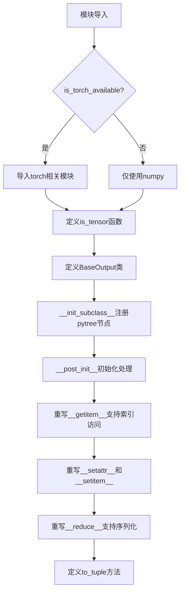
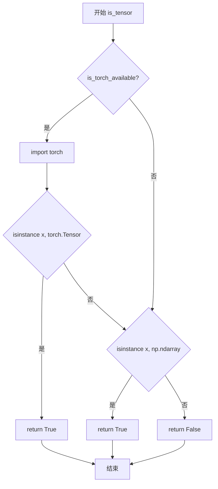
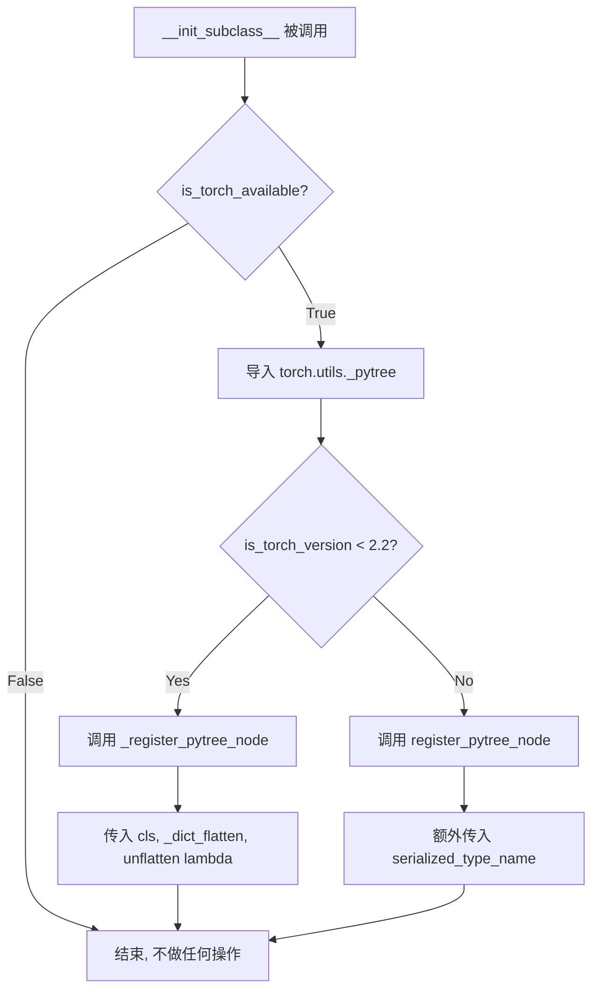
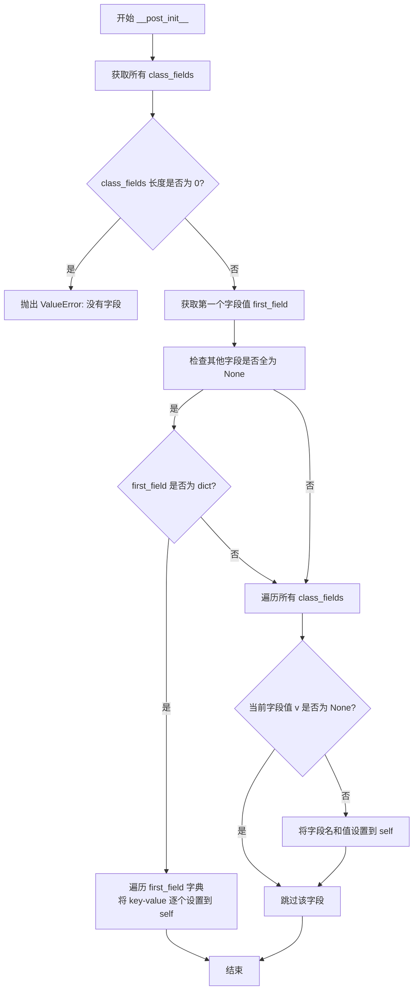
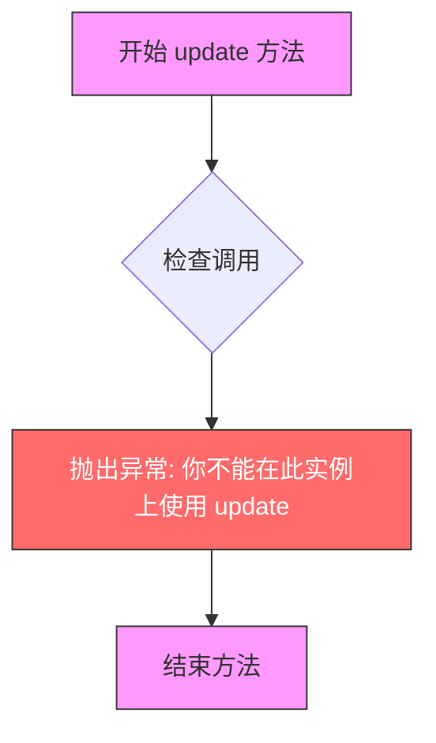
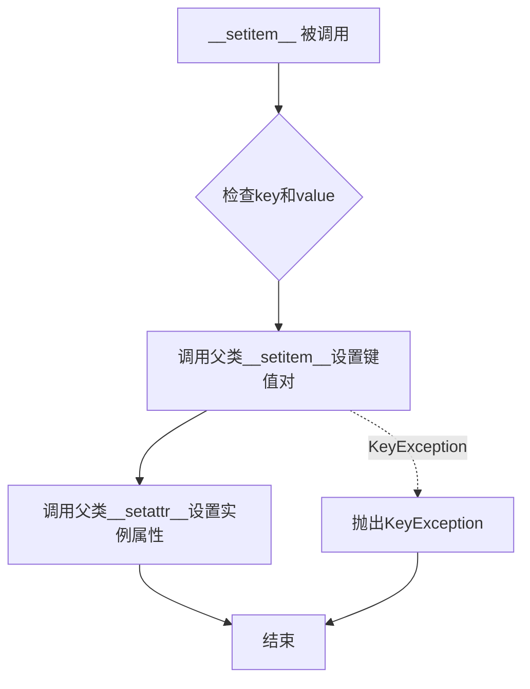

# `diffusers\src\diffusers\utils\outputs.py` 详细设计文档

该模块提供通用的工具函数和基类，用于处理模型输出的数据结构，支持张量类型检查和类似于字典/元组的多功能访问接口。

## 整体流程



## 类结构

```
object (Python内置)
└── OrderedDict (collections)
    └── BaseOutput (自定义基类)
```

## 全局变量及字段


### `is_torch_available`
    
从import_utils导入的函数，用于检查torch是否可用

类型：`function`
    


### `is_torch_version`
    
从import_utils导入的函数，用于检查torch版本

类型：`function`
    


### `BaseOutput.BaseOutput`
    
所有模型输出的基类，继承自OrderedDict，支持字典和属性两种访问方式

类型：`class`
    
    

## 全局函数及方法


### `is_tensor`

该函数用于检查输入对象是否为 PyTorch Tensor 或 NumPy 数组，如果是其中任意一种则返回 True，否则返回 False。

参数：

-  `x`：`Any`，待检测的对象，可以是任意类型的输入

返回值：`bool`，如果输入是 `torch.Tensor` 或 `np.ndarray` 则返回 `True`，否则返回 `False`

#### 流程图



#### 带注释源码

```python
def is_tensor(x) -> bool:
    """
    Tests if `x` is a `torch.Tensor` or `np.ndarray`.
    
    参数:
        x: 待检测的对象，可以是任意类型
        
    返回值:
        bool: 如果 x 是 torch.Tensor 或 np.ndarray 返回 True，否则返回 False
    """
    # 检查 PyTorch 是否可用（已安装）
    if is_torch_available():
        # 动态导入 torch（延迟导入以避免不必要的依赖）
        import torch

        # 首先检查 x 是否为 torch.Tensor
        if isinstance(x, torch.Tensor):
            return True

    # 如果 torch 不可用，或 x 不是 torch.Tensor
    # 则检查 x 是否为 numpy 数组
    return isinstance(x, np.ndarray)
```


### `BaseOutput.__init_subclass__`

该方法是一个 Python 特殊方法（`__init_subclass__`），在类定义时自动调用，用于将 BaseOutput 的子类注册为 PyTorch 的 pytree 节点，以支持 `torch.nn.parallel.DistributedDataParallel` 在 `static_graph=True` 模式下的梯度同步。

参数：

- `cls`：`type`，Python 自动传递的隐式参数，代表正在被定义的子类本身（即继承自 BaseOutput 的类）

返回值：`None`，该方法不返回任何值

#### 流程图



#### 带注释源码

```python
def __init_subclass__(cls) -> None:
    """Register subclasses as pytree nodes.

    This is necessary to synchronize gradients when using `torch.nn.parallel.DistributedDataParallel` with
    `static_graph=True` with modules that output `ModelOutput` subclasses.
    """
    # 检查 PyTorch 是否可用（通过导入 utils 中的配置判断）
    if is_torch_available():
        # 导入 PyTorch 内部 pytree 工具模块
        import torch.utils._pytree

        # 根据 PyTorch 版本选择不同的注册方法
        if is_torch_version("<", "2.2"):
            # PyTorch < 2.2: 使用内部 API _register_pytree_node
            # 参数说明：
            #   cls: 要注册为 pytree 节点的类
            #   _dict_flatten: 用于将字典展平的函数
            #   lambda: 用于从展平的值重建对象的函数
            torch.utils._pytree._register_pytree_node(
                cls,
                torch.utils._pytree._dict_flatten,
                lambda values, context: cls(**torch.utils._pytree._dict_unflatten(values, context)),
            )
        else:
            # PyTorch >= 2.2: 使用公开的 register_pytree_node API
            # 额外参数 serialized_type_name 用于序列化时标识类型
            torch.utils._pytree.register_pytree_node(
                cls,
                torch.utils._pytree._dict_flatten,
                lambda values, context: cls(**torch.utils._pytree._dict_unflatten(values, context)),
                serialized_type_name=f"{cls.__module__}.{cls.__name__}",
            )
```


### `BaseOutput.__post_init__`

该方法是 `BaseOutput` 类的初始化后钩子，用于在 dataclass 实例化后自动处理字段值的展开和字典同步。它检查第一个字段是否为字典且其他字段为空，若是则将字典内容展开到 Output 对象中，否则将所有非 None 字段值同步到内部字典。

参数：

- `self`：无需显式传递，由 Python 自动传入，代表当前 `BaseOutput` 实例本身

返回值：`None`，该方法不返回任何值，仅修改实例的内部状态

#### 流程图



#### 带注释源码

```python
def __post_init__(self) -> None:
    # 获取当前 dataclass 的所有字段定义
    class_fields = fields(self)

    # ====== 安全性和一致性检查 ======
    # 检查该类是否定义了至少一个字段
    if not len(class_fields):
        # 如果没有字段，抛出有意义的错误信息
        raise ValueError(f"{self.__class__.__name__} has no fields.")

    # 获取第一个字段的实际值
    first_field = getattr(self, class_fields[0].name)
    
    # 检查除第一个字段外，其他所有字段是否都为 None
    other_fields_are_none = all(getattr(self, field.name) is None for field in class_fields[1:])

    # ====== 字典展开逻辑 ======
    # 如果满足条件：其他字段全为 None 且 第一个字段是字典类型
    # 则将字典的内容"展开"到 Output 对象本身（即作为键值对）
    if other_fields_are_none and isinstance(first_field, dict):
        # 遍历字典，将每个键值对设置到 self（继承自 OrderedDict）
        for key, value in first_field.items():
            self[key] = value
    else:
        # 否则，按常规方式处理：将所有非 None 的字段值同步到字典中
        for field in class_fields:
            v = getattr(self, field.name)
            if v is not None:
                # 这里会调用 __setitem__，但由于我们已经处理过，
                # 可以避免递归问题（见 __setattr__ 和 __setitem__ 的实现）
                self[field.name] = v
```


### `BaseOutput.__delitem__`

该方法用于阻止对 `BaseOutput` 实例进行删除操作，通过抛出异常来禁止使用 `__delitem__` 功能，从而保护模型输出的完整性。

参数：

- `self`：`BaseOutput`，隐式参数，表示 `BaseOutput` 类的实例本身
- `*args`：`Any`，可变位置参数（保留参数，用于接口兼容性，实际未使用）
- `**kwargs`：`Any`，可变关键字参数（保留参数，用于接口兼容性，实际未使用）

返回值：`None`，该方法通过抛出异常终止执行，无返回值。

#### 流程图

```mermaid
flowchart TD
    A[__delitem__ 被调用] --> B{检查实例类型}
    B --> C[构造异常消息: You cannot use __delitem__ on a {ClassName} instance.]
    C --> D[raise Exception]
    D --> E[异常传播至调用者]
    E --> F[结束]
    
    style A fill:#e1f5fe
    style D fill:#ffcdd2
    style F fill:#f5f5f5
```

#### 带注释源码

```python
def __delitem__(self, *args, **kwargs):
    """
    禁止删除 BaseOutput 实例中的元素。
    
    该方法覆盖了字典的 __delitem__ 操作，防止用户通过 del 语句
    或其他方式删除模型输出中的属性，保持输出对象的不可变性。
    
    参数:
        *args: 可变位置参数，保留以保持接口兼容性
        **kwargs: 可变关键字参数，保留以保持接口兼容性
    
    返回值:
        无返回值。始终抛出异常以阻止删除操作。
    
    异常:
        Exception: 始终抛出，提示用户不能在 BaseOutput 实例上使用 __delitem__
    """
    # 获取当前类的名称用于错误消息
    class_name = self.__class__.__name__
    
    # 抛出异常，告知用户禁止使用删除操作
    raise Exception(f"You cannot use ``__delitem__`` on a {class_name} instance.")
```


### `BaseOutput.setdefault`

该方法是一个禁止使用的方法，它会抛出异常，明确阻止用户在 `BaseOutput`（作为模型输出的基类）实例上调用 `setdefault`，以保护输出对象的结构不被随意修改。

参数：

- `*args`：可变位置参数，用于接受任意数量的位置参数（该方法不使用这些参数）
- `**kwargs`：可变关键字参数，用于接受任意数量的关键字参数（该方法不使用这些参数）

返回值：无返回值，该方法总是抛出异常

#### 流程图

```mermaid
flowchart TD
    A[开始 setdefault] --> B{检查是否调用}
    B --> C[抛出异常: You cannot use setdefault on a {ClassName} instance]
    C --> D[结束]
    
    style C fill:#ffcccc
    style D fill:#ffcccc
```

#### 带注释源码

```python
def setdefault(self, *args, **kwargs):
    """
    禁止在 BaseOutput 实例上使用 setdefault 方法。
    
    该方法的设计目的是防止用户意外修改模型输出的结构，
    保持输出对象的完整性和一致性。BaseOutput 被设计为不可变的数据结构，
    类似于命名元组或数据类，其字段应在创建时确定。
    
    参数:
        *args: 任意数量的位置参数（不被使用）
        **kwargs: 任意数量的关键字参数（不被使用）
    
    异常:
        Exception: 总是抛出，提示用户不能在 BaseOutput 实例上使用 setdefault
    """
    # 获取当前类的名称用于错误消息
    class_name = self.__class__.__name__
    
    # 抛出异常，明确告知用户该操作不允许
    raise Exception(f"You cannot use ``setdefault`` on a {class_name} instance.")
```

---

### 备注

该方法是 `BaseOutput` 类中四个"禁止方法"之一（其他三个是 `__delitem__`、`pop` 和 `update`），它们共同确保了 `BaseOutput` 实例的只读特性。这种设计体现了以下考虑：

1. **不可变性**：模型输出应当是不可变的，以避免在推理或训练过程中意外修改输出
2. **结构保护**：防止用户错误地向输出对象添加非预期的字段
3. **一致性**：确保所有使用该类的代码都通过相同的方式访问数据


### `BaseOutput.pop`

该方法用于禁止在 `BaseOutput` 实例上调用 `pop` 操作，调用时直接抛出异常以防止修改模型输出对象。

参数：

- `*args`：可变位置参数，用于捕获任意位置参数（尽管不允许使用）
- `**kwargs`：可变关键字参数，用于捕获任意关键字参数（尽管不允许使用）

返回值：无（该方法总是抛出异常，无返回值）

#### 流程图

```mermaid
flowchart TD
    A[开始] --> B[接收args和kwargs参数]
    B --> C[构造异常消息: 'You cannot use pop on a {ClassName} instance.']
    C --> D[抛出Exception异常]
    D --> E[结束]
    
    style D fill:#ffcccc
    style E fill:#ffcccc
```

#### 带注释源码

```python
def pop(self, *args, **kwargs):
    """
    禁止在 BaseOutput 实例上使用 pop 方法。
    
    该方法覆盖了字典的 pop 功能，以防止用户意外修改 BaseOutput 实例的内容。
    BaseOutput 设计为不可变的数据结构，类似于 namedtuple，所有字段应在创建时确定。
    
    参数:
        *args: 可变位置参数，用于捕获任意参数（不允许使用）
        **kwargs: 可变关键字参数，用于捕获任意关键字参数（不允许使用）
    
    异常:
        Exception: 总是抛出，提示用户不能在此类实例上使用 pop 方法
    """
    # 构造包含类名的错误消息，提供清晰的错误提示
    raise Exception(f"You cannot use ``pop`` on a {self.__class__.__name__} instance.")
```


### `BaseOutput.update`

该方法用于阻止对 `BaseOutput` 实例进行字典式的更新操作，通过抛出异常来禁止调用 `update` 方法，从而保证模型输出的不可变性。

参数：

- `self`：隐式参数，`BaseOutput` 实例本身
- `*args`：可变位置参数，不接受任何参数
- `**kwargs`：可变关键字参数，不接受任何参数

返回值：`None`，该方法总是抛出异常，不会正常返回

#### 流程图



#### 带注释源码

```python
def update(self, *args, **kwargs):
    """
    禁止在 BaseOutput 实例上使用 update 方法。
    
    该方法的设计目的是确保模型输出（ModelOutput）的不可变性，
    防止在运行时意外修改输出对象的属性。
    
    参数:
        self: BaseOutput 实例本身
        *args: 不接受任何位置参数
        **kwargs: 不接受任何关键字参数
        
    异常:
        Exception: 总是抛出此异常，提示用户不能在 BaseOutput 实例上使用 update
    """
    # 抛出异常并包含具体的类名，提供清晰的错误信息
    raise Exception(f"You cannot use ``update`` on a {self.__class__.__name__} instance.")
```


### `BaseOutput.__getitem__`

该方法实现字典式的键访问和元组式的整数/slice访问，允许通过字符串键或整数索引获取输出属性，并在字符串访问时忽略 `None` 值。

参数：

- `k`：`Any`，用于索引的键，可以是字符串（字典键访问）或整数/slice（元组索引访问）

返回值：`Any`，返回对应键或索引处的值

#### 流程图

```mermaid
flowchart TD
    A[开始 __getitem__] --> B{isinstance(k, str)?}
    B -->|Yes| C[将self.items()转换为dict]
    C --> D[return inner_dict[k]]
    B -->|No| E[调用self.to_tuple转换为元组]
    E --> F[return self.to_tuple()[k]]
    D --> G[结束]
    F --> G[结束]
```

#### 带注释源码

```python
def __getitem__(self, k: Any) -> Any:
    """
    获取输出属性，支持字典式键访问和元组式索引访问。
    
    Args:
        k: 可以是字符串（键访问）或整数/slice（索引访问）
    
    Returns:
        Any: 对应键或索引处的值
    """
    # 判断是否为字符串键访问
    if isinstance(k, str):
        # 将OrderedDict转换为普通dict，以支持字典键访问
        inner_dict = dict(self.items())
        # 返回指定键对应的值
        return inner_dict[k]
    else:
        # 非字符串键（整数或slice）时，转换为元组进行索引访问
        return self.to_tuple()[k]
```


### `BaseOutput.__setattr__`

该方法用于处理 `BaseOutput` 类实例属性的设置操作。当设置属性时，如果属性名已存在于字典键中且值不为 `None`，则同时更新字典项和实例属性；否则仅设置实例属性。

参数：

- `self`：`BaseOutput` 实例，当前对象本身
- `name`：`Any`，要设置的属性名称
- `value`：`Any`，要设置的属性值

返回值：`None`，无返回值

#### 流程图

```mermaid
flowchart TD
    A[开始 __setattr__] --> B{name in self.keys 且 value is not None?}
    B -->|是| C[调用 super().__setitem__(name, value)]
    C --> D[调用 super().__setattr__(name, value)]
    D --> E[结束]
    B -->|否| D
```

#### 带注释源码

```python
def __setattr__(self, name: Any, value: Any) -> None:
    """
    设置实例属性。
    
    当设置的属性名已存在于字典键中且值不为 None 时，
    同时更新字典项和实例属性；否则仅设置实例属性。
    """
    # 检查属性名是否已存在于字典键中，且值不为 None
    if name in self.keys() and value is not None:
        # 直接调用父类的 __setitem__ 方法来更新字典
        # 避免调用 self.__setitem__ 导致的递归错误
        super().__setitem__(name, value)
    
    # 无论是否满足上述条件，都调用父类的 __setattr__ 
    # 以确保属性被正确设置到实例上
    # 这里不使用 self.__setattr__ 以避免递归错误
    super().__setattr__(name, value)
```


### `BaseOutput.__setitem__`

该方法用于设置 `BaseOutput` 对象的键值对，同时支持字典方式和属性方式访问该值，通过调用父类的 `__setitem__` 和 `__setattr__` 方法实现双向同步。

参数：

- `key`：`Any`，要设置的键，可以是整数、切片或字符串
- `value`：`Any`，要设置的值

返回值：`None`，该方法修改对象状态，不返回任何值

#### 流程图



#### 带注释源码

```python
def __setitem__(self, key, value):
    """
    设置 BaseOutput 对象的键值对。
    
    该方法同时完成两件事：
    1. 调用父类 OrderedDict 的 __setitem__ 方法，将键值对添加到字典中
    2. 调用父类 dict 的 __setattr__ 方法，将值设置为实例属性
    
    这样可以实现双向同步：通过字典方式设置值时，也可以通过属性方式访问。
    同时避免递归调用，因为 __setattr__ 中也会调用 __setitem__，所以这里直接调用父类方法。
    
    参数:
        key: 任何可哈希的类型，作为字典的键
        value: 任何类型，作为键对应的值
    
    返回:
        None: 该方法直接修改对象状态，不返回任何值
    """
    # Will raise a KeyException if needed
    # 首先调用父类的 __setitem__ 方法，如果键不存在会抛出 KeyException
    super().__setitem__(key, value)
    
    # Don't call self.__setattr__ to avoid recursion errors
    # 然后调用父类的 __setattr__ 方法，将值设置为实例属性
    # 使用 super().__setattr__ 而非 self.__setattr__ 是为了避免递归调用
    # 因为 __setattr__ 中有逻辑会调用 __setitem__，会造成无限递归
    super().__setattr__(key, value)
```


### `BaseOutput.__reduce__`

该方法是 Python 序列化协议的一部分，用于将对象序列化为可 pickle 的格式。对于 dataclass 类型的 `BaseOutput` 子类，它会重新构建序列化参数，确保所有字段都被正确序列化；对于非 dataclass，则回退到父类的默认实现。

参数：

- `self`：`BaseOutput` 实例，隐式参数，表示当前对象

返回值：`tuple`，包含 `(callable, args, *remaining)`，其中 `callable` 是类本身（可调用对象），`args` 是传递给类构造器的参数元组，`remaining` 是父类 `__reduce__` 返回的其余元素

#### 流程图

```mermaid
flowchart TD
    A[开始 __reduce__] --> B{self 是 dataclass?}
    B -->|否| C[调用父类 super().__reduce__]
    B -->|是| D[解包父类返回值: callable, _args, *remaining]
    E[使用 fields(self) 获取所有字段] --> F[生成新 args 元组]
    F --> G[返回 callable, args, *remaining]
    C --> G
```

#### 带注释源码

```python
def __reduce__(self):
    """
    支持 Python pickle 序列化协议。
    对于 dataclass 类型，重新构建序列化参数以确保所有字段正确序列化。
    """
    # 检查当前实例是否为 dataclass
    if not is_dataclass(self):
        # 非 dataclass 回退到父类 OrderedDict 的默认序列化实现
        return super().__reduce__()
    
    # 调用父类 OrderedDict 的 __reduce__ 获取基础序列化信息
    # 返回格式: (callable, args, *remaining)
    # callable: 类本身（用于重建对象）
    # _args: 父类原本的参数（被忽略）
    # *remaining: 额外的序列化数据（如 protocol 版本等）
    callable, _args, *remaining = super().__reduce__()
    
    # 重新构建 args：获取 dataclass 所有字段的当前值
    # fields(self) 返回所有 dataclass 字段的 Field 对象列表
    # getattr(self, field.name) 获取每个字段的当前值
    args = tuple(getattr(self, field.name) for field in fields(self))
    
    # 返回重构后的序列化元组
    # callable: 类的构造函数（如 ModelOutput 的子类）
    # args: 所有非空字段的值组成的元组
    # remaining: 保留父类的其他序列化数据
    return callable, args, *remaining
```


### `BaseOutput.to_tuple`

将 BaseOutput 实例转换为包含所有非 None 属性值的元组。

参数：

- `self`：`BaseOutput`，调用该方法的对象本身，表示当前的数据类输出实例

返回值：`tuple[Any, ...]`，返回一个元组，包含所有键对应的值（根据 BaseOutput 的 `__getitem__` 实现，字符串索引会忽略 None 值，但整数索引会返回所有值）

#### 流程图

```mermaid
flowchart TD
    A[开始执行 to_tuple] --> B[获取 self.keys]
    B --> C{遍历 keys}
    C -->|对于每个 key k| D[计算 self[k]]
    D --> E{self[k] 是否为 None}
    E -->|否| F[保留该值]
    E -->|是| G[根据 __getitem__ 逻辑处理]
    G -->|字符串索引| H[__getitem__ 返回 inner_dict[k], None值被忽略]
    G -->|整数索引| I[先转换为tuple再索引, 包含None值]
    F --> C
    H --> J[将所有非None值收集到结果元组]
    I --> J
    J --> K[返回元组]
```

#### 带注释源码

```python
def to_tuple(self) -> tuple[Any, ...]:
    """
    Convert self to a tuple containing all the attributes/keys that are not `None`.
    """
    # 使用生成器表达式遍历所有键，调用 __getitem__ 获取值
    # 注意：根据 __getitem__ 的实现，字符串索引会过滤掉 None 值，
    # 但整数索引（to_tuple()[k]）会包含 None 值
    # 这里的实现与文档描述存在不一致：实际返回的是所有键对应的值
    return tuple(self[k] for k in self.keys())
```

## 关键组件


### 张量类型检测 (is_tensor)

用于检测输入对象是否为 torch.Tensor 或 np.ndarray 的工具函数，支持 PyTorch 可用性检查。

### BaseOutput 基类

继承自 OrderedDict 的基类，作为所有模型输出的基类，支持字典和元组两种访问方式，自动过滤 None 值，并注册为 PyTorch pytree 节点以支持分布式训练的梯度同步。

### PyTorch 兼容性处理

通过 `__init_subclass__` 方法动态注册子类为 pytree 节点，根据 PyTorch 版本选择不同的注册API（2.2之前和之后的版本），确保分布式训练时梯度正确传播。

### 字典式访问与索引

通过重写 `__getitem__` 方法支持字符串键和整数/切片索引，字符串索引返回对应值，整数索引转换为元组后访问。

### 数据初始化与展开

`__post_init__` 方法处理 dataclass 字段初始化，支持将单个字典参数展开为多个属性，同时验证字段有效性。

### 写操作保护

重写 `__delitem__`、`setdefault`、`pop`、`update` 方法并抛出异常，防止用户直接修改输出对象，确保数据不可变性。

### 属性赋值控制

`__setattr__` 和 `__setitem__` 方法协同工作，管理对象属性的设置逻辑，避免递归错误。

### 元组转换

`to_tuple` 方法将 BaseOutput 实例转换为包含所有非 None 值的元组，支持解包操作。


## 问题及建议


### 已知问题

-   **递归调用设计复杂且脆弱**：`__setattr__` 和 `__setitem__` 相互调用形成交叉递归，虽然有注释表明是为了避免递归错误，但这种设计逻辑复杂，难以理解和维护，容易引入微妙的bug
-   **`__setattr__` 逻辑不一致**：当 `value` 为 `None` 时，即使 `name` 在 `keys()` 中也会调用 `super().__setattr__` 而非 `super().__setitem__`，可能导致状态不一致
- **`__getitem__` 重复创建字典**：每次通过字符串索引时都会执行 `dict(self.items())`，对于大型输出对象存在性能开销
- **`is_tensor` 函数扩展性差**：仅支持 `torch.Tensor` 和 `np.ndarray`，未考虑其他张量类型（如 TensorFlow、JAX 等），限制了在多框架环境中的适用性
- **缺少字段有效性验证**：`__setitem__` 方法未验证 `key` 是否对应有效的 dataclass 字段，与 `__setattr__` 的行为不对称
- **torch 版本兼容性分支**：针对 torch < 2.2 和 >= 2.2 有不同的实现分支，长期维护成本高，应考虑弃用旧版本支持
- **`__reduce__` 方法假设所有字段可获取**：未处理可能抛出异常的边缘情况

### 优化建议

-   简化 `__setattr__` 和 `__setitem__` 的交互逻辑，使用单一入口或更清晰的标志位控制流程
-   在 `__getitem__` 中缓存转换后的字典，或直接遍历 `self.items()` 而非每次创建新字典
-   扩展 `is_tensor` 函数支持更多张量类型，或提供插件式注册机制
-   在 `__setitem__` 中添加可选的字段有效性验证，提供配置开关控制
-   考虑弃用 torch < 2.2 的兼容代码，简化 pytree 注册逻辑
-   为 `BaseOutput` 类添加详细的文档字符串，说明使用限制和行为特性
-   在 `__reduce__` 中添加异常处理，确保序列化健壮性


## 其它


### 设计目标与约束

本模块旨在提供通用的基础工具类和函数，支持模型输出的标准化处理。主要约束包括：1）必须兼容PyTorch和NumPy两种数组类型；2）输出类需支持字典和元组两种访问方式；3）需要兼容PyTorch 2.2以下的版本；4）禁止对输出对象进行直接修改（delitem、setdefault、pop、update均抛出异常）。

### 错误处理与异常设计

代码中的异常处理主要包括：1）`__post_init__`中检查dataclass是否有字段，无字段则抛出ValueError；2）重写的字典操作方法（__delitem__、setdefault、pop、update）统一抛出Exception禁止修改；3）`__getitem__`对字符串key访问时调用dict.items()获取inner_dict，若key不存在会自然触发KeyError；4）`__setattr__`和`__setitem__`通过递归调用super方法避免无限递归。

### 外部依赖与接口契约

本模块依赖以下外部包：1）`numpy`作为可选依赖，当PyTorch不可用时作为唯一数组类型；2）`torch`为可选依赖，通过`is_torch_available()`和`is_torch_version()`判断可用性；3）`dataclasses`模块的fields和is_dataclass函数；4）`typing`模块的Any类型。接口契约：is_tensor返回布尔值，BaseOutput必须作为dataclass使用，to_tuple返回非None属性的元组。

### 版本兼容性说明

代码对PyTorch版本做了兼容性处理：通过is_torch_version("<", "2.2")判断版本，对于PyTorch < 2.2使用torch.utils._pytree._register_pytree_node，对于PyTorch >= 2.2使用torch.utils._pytree.register_pytree_node（增加了serialized_type_name参数）。这确保了梯度同步功能在不同版本PyTorch下的正常工作。

### 性能考虑

BaseOutput类继承OrderedDict而非dict，主要目的是保持字段顺序。__getitem__方法对字符串key使用dict(self.items())创建inner_dict再访问，可能带来一定性能开销，但在模型输出场景下可接受。to_tuple方法每次调用都会遍历所有key生成元组，频繁调用时需注意。

### 并行计算支持

__init_subclass__中注册为pytree节点的目的是支持torch.nn.parallel.DistributedDataParallel的static_graph=True模式，使模型输出的梯度能够正确同步。这是实现分布式训练兼容性的关键机制。

### 序列化与反序列化

__reduce__方法重写了pickle序列化逻辑，确保dataclass类型的BaseOutput子类能够正确序列化和反序列化。它提取所有字段值作为参数，而非使用默认的dict结构。

    