# `diffusers\src\diffusers\utils\peft_utils.py` 详细设计文档

This module provides a collection of utility functions for managing PEFT (Parameter-Efficient Fine-Tuning) models, specifically handling LoRA layer removal, scaling, adapter configuration, and state dictionary processing within the Hugging Face Transformers ecosystem.

## 整体流程

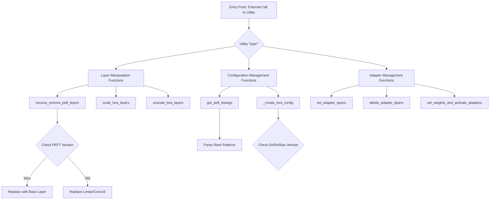

## 类结构

```
peft_utils (Module - No class hierarchy defined in this file)
└── Global Functions Scope
```

## 全局变量及字段


### `logger`
    
模块级日志记录器，通过 logging.get_logger(__name__) 初始化，用于输出模块运行时的日志信息

类型：`logging.Logger`
    


### `torch`
    
PyTorch 深度学习库的条件导入模块，仅在 is_torch_available() 返回 True 时导入，用于张量计算和神经网络层操作

类型：`torch module`
    


    

## 全局函数及方法


### `recurse_remove_peft_layers`

该函数用于递归地将模型中所有 `LoraLayer` 替换为对应的基础层（如 `torch.nn.Linear` 或 `torch.nn.Conv2d`），实现移除 PEFT（Parameter-Efficient Fine-Tuning）适配器层的效果，同时保留原始模型的权重参数。

参数：

- `model`：`torch.nn.Module`，需要移除 PEFT 层的模型对象

返回值：`torch.nn.Module`，返回移除 PEFT 层后的模型对象

#### 流程图

```mermaid
flowchart TD
    A[开始: recurse_remove_peft_layers] --> B[导入 BaseTunerLayer]
    B --> C{遍历 model.modules 检查是否有 BaseTunerLayer}
    C --> D{找到 BaseTunerLayer?}
    D -->|是| E{检查是否有 base_layer 属性}
    E --> F[设置 has_base_layer_pattern = hasattr(module, 'base_layer')]
    F --> G{has_base_layer_pattern?}
    D -->|否| H[has_base_layer_pattern = False]
    H --> G
    
    G -->|是| I[导入 _get_submodules]
    I --> J[遍历不包含'lora'的模块键]
    J --> K{尝试获取子模块}
    K -->|成功| L{检查 target 是否有 base_layer?}
    L -->|是| M[将 parent.target_name 设置为 target.get_base_layer]
    L -->|否| J
    M --> J
    K -->|失败 AttributeError| J
    
    G -->|否| N[导入 LoraLayer 实现向后兼容]
    N --> O[遍历模型的直接子模块]
    O --> P{模块有子模块?}
    P -->|是| Q[递归调用 recurse_remove_peft_layers]
    Q --> O
    P -->|否| R{模块是 LoraLayer 且是 Linear?}
    R -->|是| S[创建新的 torch.nn.Linear 并复制权重]
    R -->|否| T{模块是 LoraLayer 且是 Conv2d?}
    T -->|是| U[创建新的 torch.nn.Conv2d 并复制权重]
    T -->|否| V[module_replaced = False]
    S --> V
    U --> V
    V --> W{module_replaced?}
    W -->|是| X[使用 setattr 替换模块并删除原模块]
    W -->|否| Y[继续下一个模块]
    X --> Z[调用 empty_device_cache 清理缓存]
    Z --> O
    
    O --> AA[所有子模块处理完毕]
    AA --> AB[返回 model]
    
    J --> AB
```

#### 带注释源码

```python
def recurse_remove_peft_layers(model):
    r"""
    Recursively replace all instances of `LoraLayer` with corresponding new layers in `model`.
    该函数递归地遍历模型的所有模块，将 LoraLayer 替换为对应的基础层
    （Linear 或 Conv2d），实现移除 PEFT 适配器层的效果。
    """
    # 从 peft 库导入 BaseTunerLayer，用于检测模型中的 PEFT 层
    from peft.tuners.tuners_utils import BaseTunerLayer

    # 初始化标志：用于判断是否使用新版 PEFT 的 base_layer 模式
    has_base_layer_pattern = False
    
    # 遍历模型的所有模块，检测是否存在 BaseTunerLayer
    for module in model.modules():
        if isinstance(module, BaseTunerLayer):
            # 检查是否有 base_layer 属性（新版 PEFT 使用该属性）
            has_base_layer_pattern = hasattr(module, "base_layer")
            break

    # 根据 PEFT 版本采用不同处理策略
    if has_base_layer_pattern:
        # 新版 PEFT（> 0.6.2）：使用 base_layer 属性获取原始层
        from peft.utils import _get_submodules

        # 获取不包含 "lora" 的模块键列表（避免重复处理 LoRA 层）
        key_list = [key for key, _ in model.named_modules() if "lora" not in key]
        
        # 遍历所有需要处理的模块
        for key in key_list:
            try:
                # 尝试获取父模块、目标模块和目标名称
                parent, target, target_name = _get_submodules(model, key)
            except AttributeError:
                # 如果获取失败（如模块不存在），跳过继续
                continue
            
            # 如果目标模块有 base_layer 属性，说明是 PEFT 包装层
            if hasattr(target, "base_layer"):
                # 使用 get_base_layer() 获取原始基础层并替换
                setattr(parent, target_name, target.get_base_layer())
    else:
        # 旧版 PEFT（<= 0.6.2）：向后兼容处理
        # TODO: 当不再支持该 PEFT 版本时可移除此分支
        from peft.tuners.lora import LoraLayer

        # 遍历模型的直接子模块
        for name, module in model.named_children():
            # 如果模块包含子模块（复合模块），递归处理
            if len(list(module.children())) > 0:
                ## compound module, go inside it
                recurse_remove_peft_layers(module)

            # 初始化替换标志
            module_replaced = False

            # 检查是否为 LoRA 包装的 Linear 层
            if isinstance(module, LoraLayer) and isinstance(module, torch.nn.Linear):
                # 创建新的 Linear 层，保留原始层的输入输出特征数和偏置设置
                new_module = torch.nn.Linear(
                    module.in_features,
                    module.out_features,
                    bias=module.bias is not None,
                ).to(module.weight.device)
                # 复制原始权重
                new_module.weight = module.weight
                # 如果有偏置，也复制偏置
                if module.bias is not None:
                    new_module.bias = module.bias

                module_replaced = True
            # 检查是否为 LoRA 包装的 Conv2d 层
            elif isinstance(module, LoraLayer) and isinstance(module, torch.nn.Conv2d):
                # 创建新的 Conv2d 层，保留原始层的所有参数
                new_module = torch.nn.Conv2d(
                    module.in_channels,
                    module.out_channels,
                    module.kernel_size,
                    module.stride,
                    module.padding,
                    module.dilation,
                    module.groups,
                ).to(module.weight.device)

                # 复制原始权重
                new_module.weight = module.weight
                # 如果有偏置，也复制偏置
                if module.bias is not None:
                    new_module.bias = module.bias

                module_replaced = True

            # 如果进行了模块替换
            if module_replaced:
                # 使用 setattr 替换模型中的模块
                setattr(model, name, new_module)
                # 删除原始模块以释放内存
                del module

                # 清理 GPU 缓存
                empty_device_cache()
    
    # 返回处理后的模型
    return model
```


### `scale_lora_layers`

该函数用于调整模型中 LoRA 层的权重系数，通过遍历模型的所有模块，对实现了 `BaseTunerLayer` 接口的 LoRA 层应用缩放因子，从而实现对 LoRA 适配器影响力的动态调节。

参数：

- `model`：`torch.nn.Module`，需要调整 LoRA 层的模型
- `weight`：`float`，要应用于 LoRA 层的缩放权重

返回值：`None`，该函数直接修改模型状态，无返回值

#### 流程图

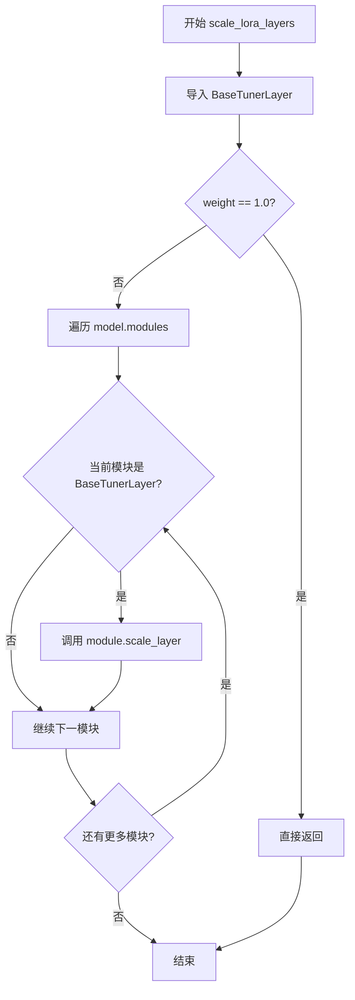

#### 带注释源码

```python
def scale_lora_layers(model, weight):
    """
    调整给定模型中 LoRA 层的权重系数。

    Args:
        model (`torch.nn.Module`):
            需要调整权重的模型。
        weight (`float`):
            要应用于 LoRA 层的权重系数。
    """
    # 动态导入 PEFT 库的 BaseTunerLayer 类，用于判断模块是否为 LoRA 层
    from peft.tuners.tuners_utils import BaseTunerLayer

    # 如果权重为默认值 1.0，则无需调整，直接返回以节省计算资源
    if weight == 1.0:
        return

    # 遍历模型中的所有模块
    for module in model.modules():
        # 检查当前模块是否为 LoRA 层（继承自 BaseTunerLayer）
        if isinstance(module, BaseTunerLayer):
            # 调用模块的 scale_layer 方法应用权重缩放
            module.scale_layer(weight)
```


### `unscale_lora_layers`

该函数用于移除之前应用于模型LoRA层的缩放权重。如果未传递权重或权重为1.0，则直接返回；如果权重为0.0，则将LoRA层的缩放重置为1.0；否则调用模块的`unscale_layer`方法进行反向缩放。

参数：

- `model`：`torch.nn.Module`，要进行反缩放操作的模型
- `weight`：`float | None`，可选参数，要反缩放的权重值。如果为None或1.0则直接返回；如果为0.0则将缩放重置为1.0；其他值则调用`unscale_layer`进行反向缩放

返回值：`None`，该函数无返回值，直接修改模型内部状态

#### 流程图

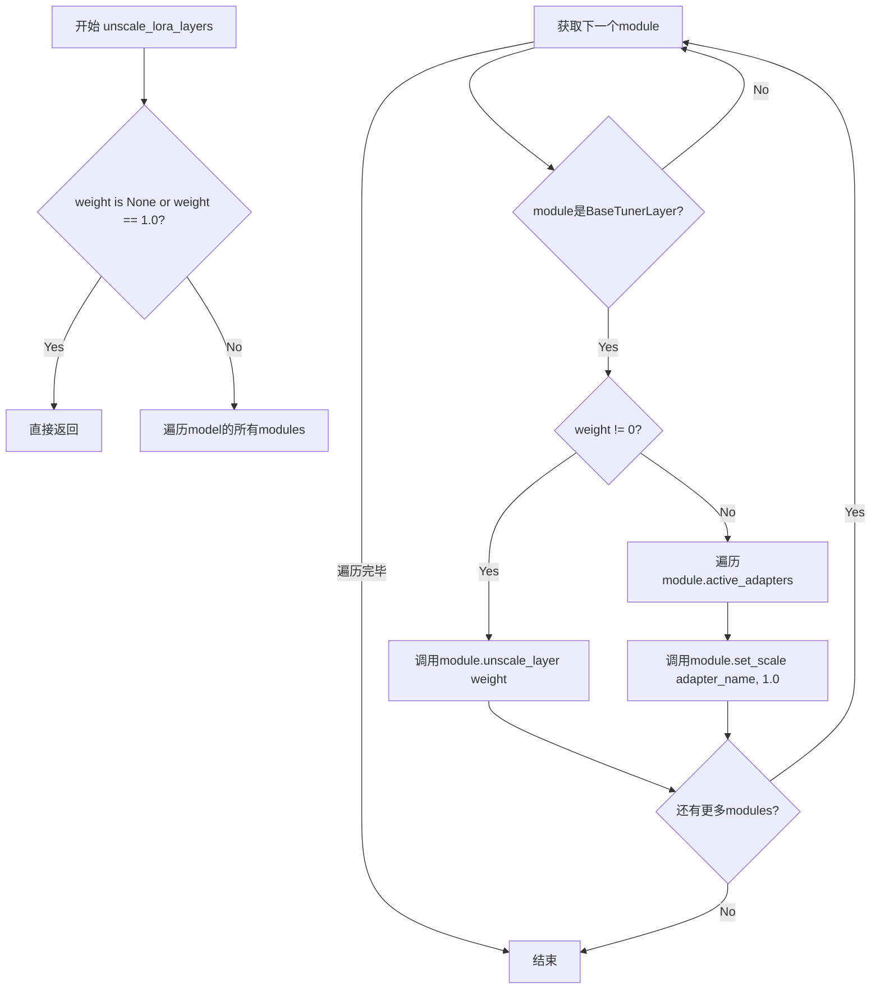

#### 带注释源码

```python
def unscale_lora_layers(model, weight: float | None = None):
    """
    Removes the previously passed weight given to the LoRA layers of the model.

    Args:
        model (`torch.nn.Module`):
            The model to scale.
        weight (`float`, *optional*):
            The weight to be given to the LoRA layers. If no scale is passed the scale of the lora layer will be
            re-initialized to the correct value. If 0.0 is passed, we will re-initialize the scale with the correct
            value.
    """
    # 动态导入PEFT的BaseTunerLayer类，用于类型检查
    from peft.tuners.tuners_utils import BaseTunerLayer

    # 如果weight为None或1.0，表示不需要进行反缩放操作，直接返回
    if weight is None or weight == 1.0:
        return

    # 遍历模型中的所有模块
    for module in model.modules():
        # 检查当前模块是否为BaseTunerLayer（LoRA层的基类）
        if isinstance(module, BaseTunerLayer):
            # 如果weight不为0，调用unscale_layer进行反向缩放
            if weight != 0:
                module.unscale_layer(weight)
            else:
                # 如果weight为0，需要将缩放重置为原始值（1.0）
                # 遍历所有活跃的适配器
                for adapter_name in module.active_adapters:
                    # if weight == 0 unscale should re-set the scale to the original value.
                    module.set_scale(adapter_name, 1.0)
```


### `get_peft_kwargs`

该函数用于从 PEFT（Parameter-Efficient Fine-Tuning）模型的状态字典中提取和生成 LoRA（Low-Rank Adaptation）配置参数，包括从 rank_dict 和 network_alpha_dict 中计算最常见的 rank 和 alpha 值，为异常值创建模式映射，并从 peft_state_dict 中检测 target_modules、use_dora 和 lora_bias 等配置选项，最终返回用于实例化 LoraConfig 的参数字典。

参数：

- `rank_dict`：`dict`，字典，键为模块名称，值为对应的 rank 整数值，用于存储各 LoRA 层的 rank 信息
- `network_alpha_dict`：`dict | None`，字典或 None，键为模块名称，值为对应的 alpha 浮点数值，用于存储各 LoRA 层的 alpha 缩放因子
- `peft_state_dict`：`dict`，字典，PEFT 模型的状态字典，包含所有 LoRA 层的权重键值对，用于提取目标模块和配置标志
- `is_unet`：`bool`，布尔值，默认为 True，指示模型是否为 UNet 结构，影响 alpha_pattern 的键处理方式
- `model_state_dict`：`dict | None`，字典或 None，完整模型的状态字典，可选参数，当前函数中未使用
- `adapter_name`：`str | None`，字符串或 None，适配器名称，可选参数，当前函数中未使用

返回值：`dict`，返回包含 LoRA 配置参数的字典，包括 r（默认 rank）、lora_alpha（默认 alpha）、rank_pattern（异常 rank 映射）、alpha_pattern（异常 alpha 映射）、target_modules（目标模块列表）、use_dora（是否使用 DoRA）、lora_bias（是否使用 LoRA bias）

#### 流程图

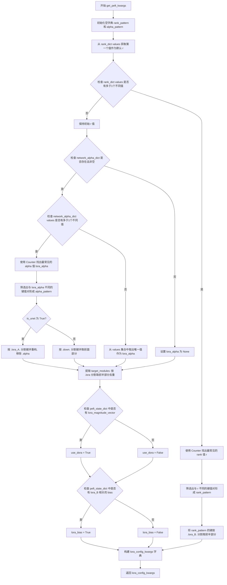

#### 带注释源码

```python
def get_peft_kwargs(
    rank_dict, network_alpha_dict, peft_state_dict, is_unet=True, model_state_dict=None, adapter_name=None
):
    """
    从给定的 PEFT 状态字典中提取 LoRA 配置参数。
    
    该函数分析 rank 和 alpha 字典，计算最常见的值作为默认值，
    并为与默认值不同的模块创建模式映射。同时从状态字典中检测
    目标模块、DoRA 使用情况和 bias 配置。
    
    Args:
        rank_dict: 包含各模块 rank 值的字典，键为模块路径，值为 rank 整数
        network_alpha_dict: 包含各模块 alpha 值的字典，键为模块路径，值为 alpha 浮点数
        peft_state_dict: PEFT 模型的状态字典，用于提取配置信息
        is_unet: 标识是否为 UNet 模型，影响 alpha_pattern 的键解析方式
        model_state_dict: 完整模型状态字典（暂未使用）
        adapter_name: 适配器名称（暂未使用）
    
    Returns:
        包含 LoRA 配置参数的字典，可直接用于 LoraConfig
    """
    # 初始化 rank 和 alpha 模式字典
    rank_pattern = {}
    alpha_pattern = {}
    
    # 从 rank_dict 中获取第一个值作为默认 rank 备选
    r = lora_alpha = list(rank_dict.values())[0]
    
    # 检查 rank_dict 是否包含多个不同的 rank 值
    if len(set(rank_dict.values())) > 1:
        # 使用 Counter 找出出现频率最高的 rank 作为默认值
        r = collections.Counter(rank_dict.values()).most_common()[0][0]
        
        # 筛选出与最常见 rank 不同的模块，创建 rank_pattern
        rank_pattern = dict(filter(lambda x: x[1] != r, rank_dict.items()))
        # 将键转换为模块路径（移除 .lora_B. 及之后的部分）
        rank_pattern = {k.split(".lora_B.")[0]: v for k, v in rank_pattern.items()}
    
    # 处理 network_alpha_dict（如果存在且非空）
    if network_alpha_dict is not None and len(network_alpha_dict) > 0:
        # 检查是否包含多个不同的 alpha 值
        if len(set(network_alpha_dict.values())) > 1:
            # 使用 Counter 找出出现频率最高的 alpha 作为默认值
            lora_alpha = collections.Counter(network_alpha_dict.values()).most_common()[0][0]
            
            # 筛选出与最常见 alpha 不同的模块，创建 alpha_pattern
            alpha_pattern = dict(filter(lambda x: x[1] != lora_alpha, network_alpha_dict.items()))
            
            # 根据模型类型（UNet 或其他）采用不同的键处理策略
            if is_unet:
                # UNet 模型：按 .lora_A. 分割，取前面部分，按 . 分割后重新组合，移除 .alpha
                alpha_pattern = {
                    ".".join(k.split(".lora_A.")[0].split(".")).replace(".alpha", ""): v
                    for k, v in alpha_pattern.items()
                }
            else:
                # 其他模型：按 .down. 分割，取前面部分，去掉最后一层
                alpha_pattern = {".".join(k.split(".down.")[0].split(".")[:-1]): v for k, v in alpha_pattern.items()}
        else:
            # 只有一个唯一的 alpha 值，直接提取
            lora_alpha = set(network_alpha_dict.values()).pop()
    
    # 从 peft_state_dict 提取目标模块：取 .lora 之前的部分并去重
    target_modules = list({name.split(".lora")[0] for name in peft_state_dict.keys()})
    
    # 检测是否使用 DoRA（Decomposable Rank Adaptation）
    # 通过检查是否存在 lora_magnitude_vector 键
    use_dora = any("lora_magnitude_vector" in k for k in peft_state_dict)
    
    # 检测是否使用 LoRA bias（仅与 lora_B 层关联）
    # 检查是否存在以 lora_B 开头且以 .bias 结尾的键
    lora_bias = any("lora_B" in k and k.endswith(".bias") for k in peft_state_dict)
    
    # 构建最终的 LoRA 配置参数字典
    lora_config_kwargs = {
        "r": r,                          # 默认 rank 值
        "lora_alpha": lora_alpha,        # 默认 alpha 值
        "rank_pattern": rank_pattern,    # 特殊 rank 映射
        "alpha_pattern": alpha_pattern,  # 特殊 alpha 映射
        "target_modules": target_modules,# 目标模块列表
        "use_dora": use_dora,            # 是否使用 DoRA
        "lora_bias": lora_bias,          # 是否使用 LoRA bias
    }
    
    return lora_config_kwargs
```


### `get_adapter_name`

获取模型中 LoRA 适配器的默认名称，通过遍历模型模块查找第一个 `BaseTunerLayer` 实例，并基于其 rank 数量生成适配器名称。

参数：

- `model`：`torch.nn.Module`，需要获取适配器名称的模型

返回值：`str`，返回格式为 `"default_{rank数}"` 的适配器名称，若模型中不存在 LoRA 层则返回 `"default_0"`

#### 流程图

```mermaid
flowchart TD
    A[开始: get_adapter_name] --> B[导入 BaseTunerLayer]
    B --> C[遍历 model.modules]
    C --> D{当前模块是否为 BaseTunerLayer?}
    D -->|是| E[返回 f"default_{len(module.r)}"]
    D -->|否| F{是否还有更多模块?}
    F -->|是| C
    F -->|否| G[返回 "default_0"]
    E --> H[结束]
    G --> H
```

#### 带注释源码

```python
def get_adapter_name(model):
    """
    获取模型中 LoRA 适配器的默认名称。
    
    该函数遍历模型的模块，查找第一个 BaseTunerLayer 实例，
    并基于该层的 rank 数量生成适配器名称。如果模型中不存在
    任何 LoRA 层，则返回默认名称 "default_0"。
    
    Args:
        model (torch.nn.Module): 需要获取适配器名称的模型
        
    Returns:
        str: 格式为 "default_{rank数}" 的适配器名称
    """
    # 从 peft 库导入 BaseTunerLayer 类，用于判断模块是否为 LoRA 层
    from peft.tuners.tuners_utils import BaseTunerLayer

    # 遍历模型的所有模块
    for module in model.modules():
        # 检查当前模块是否为 BaseTunerLayer（即 LoRA 层）
        if isinstance(module, BaseTunerLayer):
            # 返回基于 LoRA rank 数量的适配器名称
            # module.r 通常是一个字典，包含各适配器的 rank 信息
            return f"default_{len(module.r)}"
    
    # 如果模型中未找到任何 LoRA 层，返回默认名称
    return "default_0"
```


### `set_adapter_layers`

该函数用于启用或禁用模型中所有的 PEFT（LoRA）adapter 层。它通过遍历模型的模块，找出所有 `BaseTunerLayer` 类型的层，并根据 `enabled` 参数调用相应的方法来控制 adapter 的启用状态。

参数：

- `model`：`torch.nn.Module`，需要设置 adapter 的目标模型
- `enabled`：`bool`，指定是启用还是禁用 adapter（默认为 `True`，即启用）

返回值：`None`，该函数直接修改模型状态，不返回任何值

#### 流程图

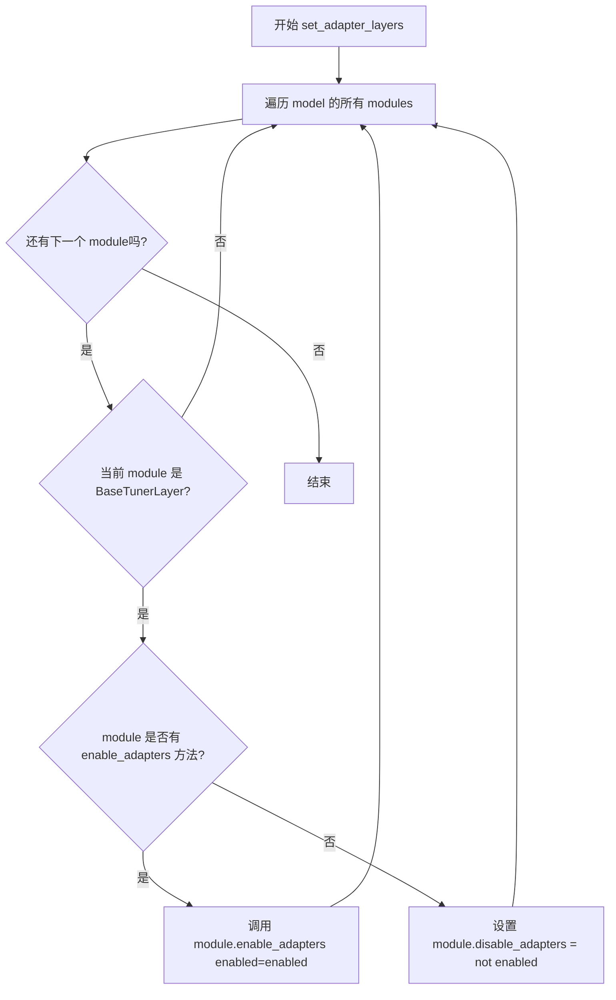

#### 带注释源码

```python
def set_adapter_layers(model, enabled=True):
    """
    设置模型中所有 adapter 层的启用/禁用状态。
    
    Args:
        model (torch.nn.Module): 需要设置 adapter 的模型
        enabled (bool): 是否启用 adapter，默认为 True
    """
    # 动态导入 BaseTunerLayer，用于判断模块是否为 adapter 层
    from peft.tuners.tuners_utils import BaseTunerLayer

    # 遍历模型中的所有模块
    for module in model.modules():
        # 检查当前模块是否为 BaseTunerLayer（PEFT adapter 层）
        if isinstance(module, BaseTunerLayer):
            # 新版 PEFT 需要调用 enable_adapters 方法
            if hasattr(module, "enable_adapters"):
                module.enable_adapters(enabled=enabled)
            else:
                # 旧版 PEFT 使用 disable_adapters 属性进行反向控制
                module.disable_adapters = not enabled
```


### `delete_adapter_layers`

该函数用于从模型中删除指定的 PEFT adapter。它遍历模型的所有模块，调用每个 `BaseTunerLayer` 的 `delete_adapter` 方法，同时处理与 Transformers 集成的配置清理。

参数：

- `model`：`torch.nn.Module`，要删除 adapter 的目标模型
- `adapter_name`：`str`，要删除的 adapter 名称

返回值：`None`，无返回值（函数执行完成后直接返回）

#### 流程图

```mermaid
flowchart TD
    A[开始 delete_adapter_layers] --> B{遍历 model.modules()}
    B --> C{当前模块是 BaseTunerLayer?}
    C -->|否| D[继续下一模块]
    C -->|是| E{模块有 delete_adapter 方法?}
    E -->|否| F[抛出 ValueError: PEFT 版本不兼容]
    E -->|是| G[调用 module.delete_adapter(adapter_name)]
    G --> D
    D --> H{模型有 _hf_peft_config_loaded 标志?}
    H -->|否| I[结束]
    H -->|是| J{模型有 peft_config?}
    J -->|否| I
    J -->|是| K[从 peft_config 中删除 adapter_name]
    K --> L{peft_config 为空?}
    L -->|否| I
    L -->|是| M[删除 peft_config 并置空 _hf_peft_config_loaded]
    M --> I
```

#### 带注释源码

```python
def delete_adapter_layers(model, adapter_name):
    """
    从模型中删除指定的 PEFT adapter 层。
    
    参数:
        model: 目标模型（torch.nn.Module）
        adapter_name: 要删除的 adapter 名称（str）
    """
    # 动态导入 PEFT 的 BaseTunerLayer 类
    from peft.tuners.tuners_utils import BaseTunerLayer

    # 遍历模型中的所有模块
    for module in model.modules():
        # 检查模块是否为 BaseTunerLayer 的实例（LoRA 层）
        if isinstance(module, BaseTunerLayer):
            # 如果模块有 delete_adapter 方法（PEFT >= 0.6.1），调用它删除 adapter
            if hasattr(module, "delete_adapter"):
                module.delete_adapter(adapter_name)
            else:
                # PEFT 版本不兼容，抛出异常
                raise ValueError(
                    "The version of PEFT you are using is not compatible, please use a version that is greater than 0.6.1"
                )

    # === 以下为 Transformers 集成相关处理 ===
    # 检查模型是否加载了 PEFT 配置
    if getattr(model, "_hf_peft_config_loaded", False) and hasattr(model, "peft_config"):
        # 从 peft_config 字典中移除该 adapter 的配置
        model.peft_config.pop(adapter_name, None)
        
        # 如果所有 adapters 都被删除，则清理配置对象
        if len(model.peft_config) == 0:
            del model.peft_config
            # 重置 PEFT 配置加载标志
            model._hf_peft_config_loaded = None
```


### `set_weights_and_activate_adapters`

该函数用于在模型中激活指定的 LoRA 适配器并为每个适配器设置相应的缩放权重，支持多层适配器的并行运行和不同模块的差异化权重配置。

参数：

- `model`：`torch.nn.Module`，要设置适配器的模型
- `adapter_names`：`List[str]`，要激活的适配器名称列表
- `weights`：`List[float]`，与 adapter_names 对应的权重列表，用于缩放每个适配器的输出

返回值：`None`，该函数直接修改模型状态，无返回值

#### 流程图

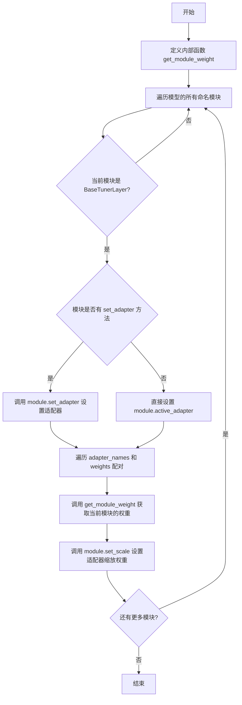

#### 带注释源码

```
def set_weights_and_activate_adapters(model, adapter_names, weights):
    """
    设置模型的适配器并激活它们，同时为每个适配器设置缩放权重。
    
    Args:
        model (torch.nn.Module): 要设置适配器的模型
        adapter_names (List[str]): 要激活的适配器名称列表
        weights (List[float]): 与 adapter_names 对应的权重列表
    """
    # 从 peft 库导入 BaseTunerLayer 基类，用于判断模块是否支持 LoRA
    from peft.tuners.tuners_utils import BaseTunerLayer

    def get_module_weight(weight_for_adapter, module_name):
        """
        内部函数：根据模块名称获取对应的权重值。
        
        支持两种权重配置方式：
        1. 单一数值：所有模块使用相同的权重
        2. 字典配置：不同模块使用不同的权重
        
        Args:
            weight_for_adapter: 权重配置（单一数值或字典）
            module_name: 模块的完整名称
            
        Returns:
            float: 模块对应的权重值
        """
        # 如果权重不是字典类型，直接返回单一数值
        if not isinstance(weight_for_adapter, dict):
            return weight_for_adapter

        # 尝试在字典中查找精确匹配的层名称
        for layer_name, weight_ in weight_for_adapter.items():
            if layer_name in module_name:
                return weight_

        # 如果没有精确匹配，尝试提取块级权重
        # 例如：从 "down_blocks.1.attentions.0.proj" 提取 "down_blocks.1.attentions.0"
        parts = module_name.split(".")
        key = f"{parts[0]}.{parts[1]}.attentions.{parts[3]}"
        # 默认为 1.0，如果未找到对应块权重
        block_weight = weight_for_adapter.get(key, 1.0)

        return block_weight

    # 遍历模型中的所有模块
    for module_name, module in model.named_modules():
        # 只处理继承自 BaseTunerLayer 的 LoRA 模块
        if isinstance(module, BaseTunerLayer):
            # 为了向后兼容旧版 PEFT，设置多个活跃适配器
            if hasattr(module, "set_adapter"):
                # 新版 PEFT 使用 set_adapter 方法
                module.set_adapter(adapter_names)
            else:
                # 旧版 PEFT 直接设置 active_adapter 属性
                module.active_adapter = adapter_names

            # 为每个适配器设置缩放权重
            # zip 会将 adapter_names 和 weights 配对
            for adapter_name, weight in zip(adapter_names, weights):
                # 获取该模块对应的具体权重值
                module_weight = get_module_weight(weight, module_name)
                # 设置适配器的缩放因子
                module.set_scale(adapter_name, module_weight)
```


### `apply_lora_scale`

该装饰器函数自动处理 LoRA 层的缩放/取消缩放操作。它从指定的关键字参数中提取 `lora_scale`，在 forward 方法执行前应用缩放，并在执行后（即使发生异常）确保取消缩放。

参数：

- `kwargs_name`：`str`，默认为 `"joint_attention_kwargs"`，包含 LoRA 比例的关键字参数名称

返回值：`function`，返回一个装饰器函数，用于包装 forward 方法

#### 流程图

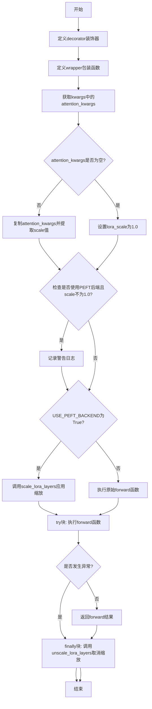

#### 带注释源码

```python
def apply_lora_scale(kwargs_name: str = "joint_attention_kwargs"):
    """
    Decorator to automatically handle LoRA layer scaling/unscaling in forward methods.
    
    这个装饰器从指定的kwargs参数中提取lora_scale，在forward方法执行前
    应用缩放，并在执行后确保取消缩放，即使发生异常也能正确处理。
    
    Args:
        kwargs_name (`str`, defaults to `"joint_attention_kwargs"`):
            The name of the keyword argument that contains the LoRA scale. Common values include
            "joint_attention_kwargs", "attention_kwargs", "cross_attention_kwargs", etc.
            包含LoRA比例的关键字参数名称，常见值包括"joint_attention_kwargs"、
            "attention_kwargs"、"cross_attention_kwargs"等。
    """

    def decorator(forward_fn):
        """装饰器内部函数，用于包装传入的forward方法"""
        
        @functools.wraps(forward_fn)
        def wrapper(self, *args, **kwargs):
            """
            实际的包装函数，执行以下操作：
            1. 从kwargs中提取lora_scale
            2. 在forward前应用缩放
            3. 执行forward方法
            4. 在finally块中确保取消缩放
            """
            from . import USE_PEFT_BACKEND  # 导入PEFT后端标志

            lora_scale = 1.0  # 默认缩放值为1.0（即不缩放）
            attention_kwargs = kwargs.get(kwargs_name)  # 获取指定名称的kwargs

            if attention_kwargs is not None:
                # 如果存在attention_kwargs，复制一份避免修改原字典
                attention_kwargs = attention_kwargs.copy()
                kwargs[kwargs_name] = attention_kwargs
                # 从kwargs中弹出scale值，默认1.0
                lora_scale = attention_kwargs.pop("scale", 1.0)

                # 如果未使用PEFT后端但传入了非1.0的scale，发出警告
                if not USE_PEFT_BACKEND and lora_scale != 1.0:
                    logger.warning(
                        f"Passing `scale` via `{kwargs_name}` when not using the PEFT backend is ineffective."
                    )

            # 只有在使用PEFT后端时才应用LoRA缩放
            if USE_PEFT_BACKEND:
                scale_lora_layers(self, lora_scale)

            try:
                # 执行原始的forward方法
                result = forward_fn(self, *args, **kwargs)
                return result
            finally:
                # 无论forward是否抛出异常，都会执行取消缩放
                # 这确保了即使发生异常，模型状态也能正确恢复
                if USE_PEFT_BACKEND:
                    unscale_lora_layers(self, lora_scale)

        return wrapper

    return decorator
```


### `check_peft_version`

检查当前安装的 PEFT 库的版本是否满足最低版本要求，若不满足则抛出 ValueError 异常。

参数：

- `min_version`：`str`，需要检查的最低 PEFT 版本号

返回值：`None`，该函数不返回任何值，仅进行版本兼容性检查并在不满足条件时抛出异常

#### 流程图

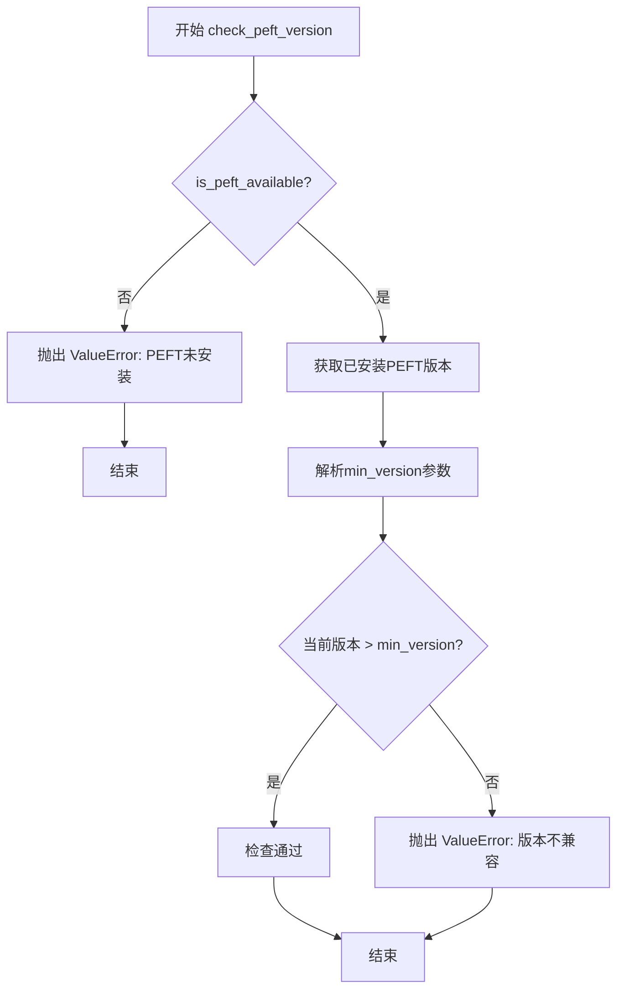

#### 带注释源码

```python
def check_peft_version(min_version: str) -> None:
    r"""
    Checks if the version of PEFT is compatible.
    # 检查PEFT版本是否兼容的函数
    
    Args:
        version (`str`):
            The version of PEFT to check against.
            # 要检查的PEFT版本
    """
    # 首先检查PEFT库是否已安装
    if not is_peft_available():
        # 若未安装，抛出异常提示用户安装
        raise ValueError("PEFT is not installed. Please install it with `pip install peft`")

    # 使用packaging.version解析并比较版本号
    # 获取当前已安装的PEFT版本
    is_peft_version_compatible = version.parse(importlib.metadata.version("peft")) > version.parse(min_version)

    # 检查版本是否满足最低版本要求
    if not is_peft_version_compatible:
        # 若版本不兼容，抛出异常并提示用户升级
        raise ValueError(
            f"The version of PEFT you are using is not compatible, please use a version that is greater"
            f" than {min_version}"
        )
```


### `_create_lora_config`

该函数是用于从预训练模型的状态字典中创建LoRA配置的核心函数。它通过解析状态字典中的参数（如rank、alpha、target_modules等），结合可选的metadata或调用`get_peft_kwargs`生成LoraConfig对象，同时进行版本兼容性检查以确保DoRA和lora_bias等功能所需的PEFT版本满足要求。

参数：

- `state_dict`：`dict`，预训练模型的状态字典，包含LoRA层的权重信息
- `network_alphas`：`dict`，网络alpha值字典，用于控制LoRA层的缩放因子
- `metadata`：`dict` 或 `None`，可选的元数据，如果提供则直接作为LoraConfig的参数
- `rank_pattern_dict`：`dict`，秩模式字典，指定不同层的rank值
- `is_unet`：`bool`，默认为`True`，指示模型是否为UNet架构（影响alpha_pattern的处理方式）
- `model_state_dict`：`dict` 或 `None`，模型的状态字典，用于额外的配置推断
- `adapter_name`：`str` 或 `None`，适配器名称，用于标识特定的LoRA适配器

返回值：`LoraConfig`，返回创建的PEFT库中的LoraConfig对象

#### 流程图

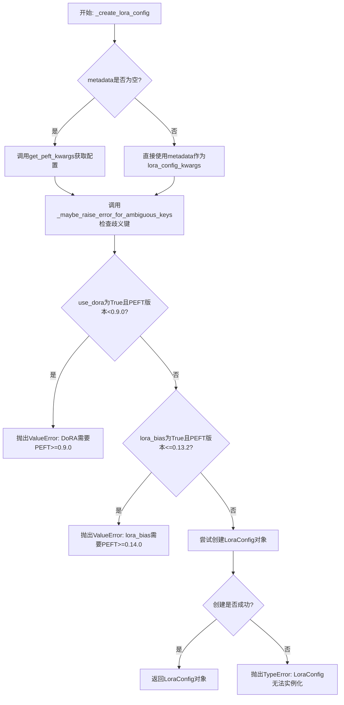

#### 带注释源码

```python
def _create_lora_config(
    state_dict, network_alphas, metadata, rank_pattern_dict, is_unet=True, model_state_dict=None, adapter_name=None
):
    """
    从状态字典创建LoraConfig对象
    
    参数:
        state_dict: 包含LoRA权重等状态信息的字典
        network_alphas: LoRA层的alpha值映射
        metadata: 可选的配置元数据
        rank_pattern_dict: 各层rank值的映射
        is_unet: 标记是否为UNet模型
        model_state_dict: 模型完整状态字典
        adapter_name: 适配器标识名称
    """
    from peft import LoraConfig

    # 如果提供了metadata，直接使用；否则通过get_peft_kwargs从state_dict推断配置
    if metadata is not None:
        lora_config_kwargs = metadata
    else:
        lora_config_kwargs = get_peft_kwargs(
            rank_pattern_dict,
            network_alpha_dict=network_alphas,
            peft_state_dict=state_dict,
            is_unet=is_unet,
            model_state_dict=model_state_dict,
            adapter_name=adapter_name,
        )

    # 检查是否存在歧义的键（如rank_pattern中的键与target_modules匹配不明确）
    _maybe_raise_error_for_ambiguous_keys(lora_config_kwargs)

    # 版本检查：DoRA功能需要PEFT>=0.9.0
    if "use_dora" in lora_config_kwargs and lora_config_kwargs["use_dora"]:
        if is_peft_version("<", "0.9.0"):
            raise ValueError("DoRA requires PEFT >= 0.9.0. Please upgrade.")

    # 版本检查：lora_bias功能需要PEFT>=0.14.0
    if "lora_bias" in lora_config_kwargs and lora_config_kwargs["lora_bias"]:
        if is_peft_version("<=", "0.13.2"):
            raise ValueError("lora_bias requires PEFT >= 0.14.0. Please upgrade.")

    # 尝试实例化LoraConfig对象并返回
    try:
        return LoraConfig(**lora_config_kwargs)
    except TypeError as e:
        raise TypeError("`LoraConfig` class could not be instantiated.") from e
```


### `_maybe_raise_error_for_ambiguous_keys`

该函数用于检测 LoRA 配置中是否存在歧义键（即 rank_pattern 中的某个键既是 target_modules 的精确匹配，同时也是另一个 target_modules 的子字符串匹配），如果存在歧义键且 PEFT 版本低于 0.14.1，则抛出 ValueError 异常以提示用户升级 PEFT 版本。

参数：

- `config`：`Dict`，包含 LoRA 配置信息的字典，必须包含 "rank_pattern"（rank 模式字典）和 "target_modules"（目标模块列表或字符串）键

返回值：`None`，该函数不返回任何值，仅在检测到歧义键时抛出异常

#### 流程图

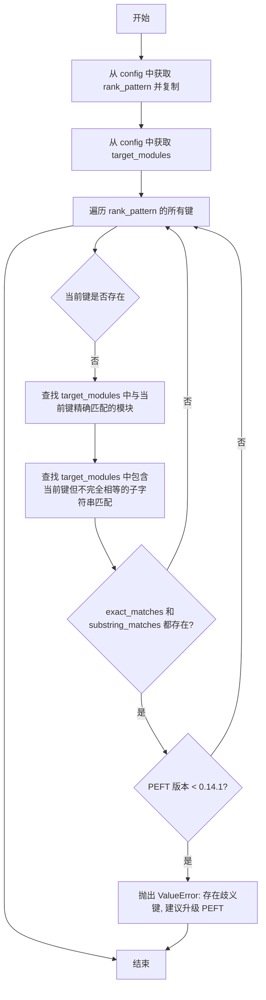

#### 带注释源码

```python
def _maybe_raise_error_for_ambiguous_keys(config):
    """
    检测 LoRA 配置中的歧义键并在低版本 PEFT 下抛出错误。
    
    当 rank_pattern 中的某个键既是 target_modules 的精确匹配，
    同时也是另一个 target_modules 元素的子字符串时，存在歧义。
    这种情况下旧版本 PEFT 可能无法正确处理，因此需要提示升级。
    """
    # 从配置字典中提取 rank_pattern 并创建副本
    # 避免修改原始配置
    rank_pattern = config["rank_pattern"].copy()
    
    # 获取目标模块列表，用于后续匹配检查
    target_modules = config["target_modules"]

    # 遍历 rank_pattern 中的所有键，检测是否存在歧义
    for key in list(rank_pattern.keys()):
        # 尝试检测歧义情况
        # 注意：target_modules 也可能是字符串，这种情况下会遍历字符串的每个字符
        # 技术上正确的方式是使用 LoraModel._check_target_module_exists
        # 但目前这样做已经足够满足需求
        
        # 精确匹配：找出与 key 完全相等的 target_modules 元素
        exact_matches = [mod for mod in target_modules if mod == key]
        
        # 子字符串匹配：找出包含 key 但不等于 key 的 target_modules 元素
        substring_matches = [mod for mod in target_modules if key in mod and mod != key]

        # 如果同时存在精确匹配和子字符串匹配，说明存在歧义
        if exact_matches and substring_matches:
            # 检查 PEFT 版本，如果低于 0.14.1 则抛出错误
            if is_peft_version("<", "0.14.1"):
                raise ValueError(
                    "There are ambiguous keys present in this LoRA. To load it, please update your `peft` installation - `pip install -U peft`."
                )
```


### `_maybe_warn_for_unhandled_keys`

该函数用于在加载 PEFT 适配器权重时，检查并警告用户是否出现了意外的或缺失的 LoRA 相关密钥，确保模型与适配器状态的兼容性。

参数：

- `incompatible_keys`：任意类型，包含模型加载过程中的不兼容密钥信息，通常为 `torch.nn.Module.load_state_dict` 返回的 `IncompatibleKeys` 对象或 `None`
- `adapter_name`：字符串，指定适配器的名称，用于筛选与该适配器相关的密钥

返回值：`None`，该函数仅通过日志输出警告信息，不返回任何值

#### 流程图

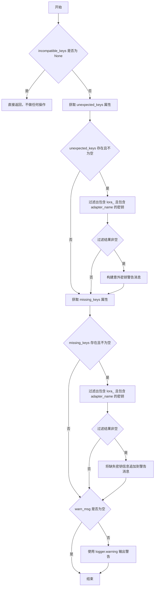

#### 带注释源码

```python
def _maybe_warn_for_unhandled_keys(incompatible_keys, adapter_name):
    """
    在加载 PEFT 适配器权重时，检查并警告用户关于意外的或缺失的 LoRA 相关密钥。
    
    Args:
        incompatible_keys: 包含模型加载过程中不兼容密钥信息的对象，通常来自 torch.nn.Module.load_state_dict 的返回值。
        adapter_name: 适配器名称，用于筛选与该特定适配器相关的密钥。
    """
    # 初始化警告消息为空字符串
    warn_msg = ""
    
    # 检查传入的 incompatible_keys 是否为 None
    if incompatible_keys is not None:
        # 从对象中获取 unexpected_keys（意外密钥）属性
        # unexpected_keys 表示模型权重中存在但状态字典中没有的密钥
        unexpected_keys = getattr(incompatible_keys, "unexpected_keys", None)
        
        # 如果存在意外密钥
        if unexpected_keys:
            # 过滤出与 LoRA 相关的意外密钥，且这些密钥属于当前适配器
            lora_unexpected_keys = [k for k in unexpected_keys if "lora_" in k and adapter_name in k]
            
            # 如果过滤结果非空，说明有需要警告的意外密钥
            if lora_unexpected_keys:
                # 构建警告消息，说明加载适配器权重时出现了意外密钥
                warn_msg = (
                    f"Loading adapter weights from state_dict led to unexpected keys found in the model:"
                    f" {', '.join(lora_unexpected_keys)}. "
                )

        # 获取 missing_keys（缺失密钥）属性
        # missing_keys 表示状态字典中存在但模型权重中没有的密钥
        missing_keys = getattr(incompatible_keys, "missing_keys", None)
        
        # 如果存在缺失密钥
        if missing_keys:
            # 过滤出与 LoRA 相关的缺失密钥，且这些密钥属于当前适配器
            lora_missing_keys = [k for k in missing_keys if "lora_" in k and adapter_name in k]
            
            # 如果过滤结果非空，说明有需要警告的缺失密钥
            if lora_missing_keys:
                # 将缺失密钥信息追加到警告消息中
                warn_msg += (
                    f"Loading adapter weights from state_dict led to missing keys in the model:"
                    f" {', '.join(lora_missing_keys)}."
                )

    # 如果最终生成了警告消息，则通过日志输出
    if warn_msg:
        logger.warning(warn_msg)
```

## 关键组件


### LoRA层递归移除组件

该组件负责递归遍历模型，识别并替换所有`LoraLayer`实例为基础层，包含对PEFT旧版本的向后兼容性处理逻辑，通过检测`BaseTunerLayer`和`LoraLayer`两种模式实现。

### LoRA层缩放/取消缩放组件

该组件提供对LoRA层权重的动态调整功能，包括`scale_lora_layers`和`unscale_lora_layers`两个函数，支持按指定权重值缩放或在异常情况下保证正确取消缩放。

### PEFT配置参数提取组件

该组件从PEFT状态字典中提取配置参数，包括rank_pattern、alpha_pattern、target_modules、use_dora和lora_bias等，支持处理不同模块具有不同rank和alpha值的情况，并找出最频繁出现的值作为默认值。

### 适配器管理层组件

该组件提供适配器的完整生命周期管理，包括获取适配器名称、设置适配器层启用状态、删除适配器层、设置权重并激活适配器等功能，支持PEFT多个版本的API差异。

### LoRA缩放装饰器组件

该组件是一个装饰器工厂`apply_lora_scale`，自动在forward方法中处理LoRA层缩放，通过`USE_PEFT_BACKEND`标志判断是否执行缩放，并确保在异常情况下也能正确取消缩放。

### 版本兼容性检查组件

该组件负责PEFT版本兼容性验证，包括检查最低版本要求、DoRA和lora_bias特性的版本限制、以及处理状态字典中的歧义键和未处理键的警告机制。

### LoraConfig创建组件

该组件封装了LoraConfig对象的创建逻辑，整合了配置参数提取、版本检查和歧义键处理，提供从状态字典创建完整LoraConfig的入口。


## 问题及建议


### 已知问题

-   **版本兼容性分支过多**：`recurse_remove_peft_layers` 函数保留了 PEFT <= 0.6.2 的旧分支处理逻辑，导致代码冗余且难以维护，同时增加了测试负担
-   **内存泄漏风险**：在 `recurse_remove_peft_layers` 中删除模块后未显式调用 `torch.cuda.empty_cache()` 或清理中间对象，可能导致内存无法及时释放
-   **字符串操作复杂且易错**：`get_peft_kwargs` 中大量使用 `split`/`join` 进行键名处理，逻辑复杂且容易因 PEFT 内部命名规则变化而失效
-   **缺少参数验证**：`set_weights_and_activate_adapters` 中 `adapter_names` 和 `weights` 长度不匹配时不会报错，而是静默截断或使用错误的权重
-   **装饰器状态依赖全局变量**：`apply_lora_scale` 依赖外部全局变量 `USE_PEFT_BACKEND`，降低了函数的自包含性和可测试性
-   **异常处理不完整**：多处导入 PEFT 模块在运行时进行，若 PEFT 未安装或版本不匹配，错误信息不够明确
-   **类型注解缺失**：函数参数和返回值缺少完整的类型注解，影响代码可读性和 IDE 支持

### 优化建议

-   **移除旧版本兼容代码**：设定最小支持的 PEFT 版本（建议 >= 0.7.0），删除旧版兼容分支，统一使用 `BaseTunerLayer` 方式处理
-   **添加参数校验**：在 `set_weights_and_activate_adapters` 开头添加 `adapter_names` 和 `weights` 长度校验，不匹配时抛出明确异常
-   **优化模块遍历**：使用 `model.named_modules()` 替代 `model.modules()` 并在遍历时直接过滤 `BaseTunerLayer`，减少不必要的迭代
-   **增强错误信息**：在所有 PEFT 导入处添加版本检查失败的具体原因说明，帮助开发者快速定位问题
-   **重构重复逻辑**：将 `scale_lora_layers` 和 `unscale_lora_layers` 的公共遍历逻辑抽取为私有方法
-   **添加类型注解**：为所有函数添加完整的类型注解，特别是 `get_peft_kwargs` 的复杂返回类型
-   **改进字符串处理**：使用正则表达式或更健壮的键名解析方式替代多个 `split` 链式操作

## 其它


### 设计目标与约束

本模块作为PEFT（Parameter-Efficient Fine-Tuning）工具库，提供LoRA层的动态管理能力，包括层的替换、缩放、激活控制等功能，支持PEFT后端与非PEFT后端的灵活切换。核心约束包括：1）仅支持PyTorch框架；2）依赖PEFT库版本>=0.6.1（部分功能需要>=0.9.0或>=0.14.0）；3）向后兼容PEFT<=0.6.2版本的LoraLayer结构；4）设计遵循最小侵入原则，通过装饰器模式实现LoRA缩放的自动管理。

### 错误处理与异常设计

本模块采用分层异常处理策略：1）版本检查异常（`check_peft_version`）：当PEFT未安装或版本不兼容时抛出`ValueError`；2）配置构建异常（`_create_lora_config`）：当LoraConfig实例化失败时抛出`TypeError`，并对DoRA和lora_bias特性进行版本门槛检查；3）动态加载异常（`_maybe_raise_error_for_ambiguous_keys`）：检测rank_pattern与target_modules之间的键冲突，抛出`ValueError`并提示升级PEFT；4）适配器操作异常（`delete_adapter_layers`）：当PEFT版本低于0.6.1时抛出`ValueError`；5）警告机制（`_maybe_warn_for_unhandled_keys`）：对加载state_dict时的意外键和缺失键记录warning而非抛出异常，保证加载过程的鲁棒性。

### 数据流与状态机

模块数据流遵循以下路径：1）模型转换流程：`recurse_remove_peft_layers`递归遍历模型模块树，识别`BaseTunerLayer`或`LoraLayer`类型，根据PEFT版本选择不同的替换策略，最终将LoRA层还原为原始线性层或卷积层；2）缩放控制流程：`scale_lora_layers`和`unscale_lora_layers`通过遍历模型模块，对`BaseTunerLayer`调用`scale_layer`/`unscale_layer`方法，实现LoRA权重的动态调整；3）适配器管理流程：`set_adapter_layers`控制适配器启用/禁用状态，`delete_adapter_layers`删除指定适配器并清理相关配置，`set_weights_and_activate_adapters`同时设置多个适配器及其权重；4）装饰器流程：`apply_lora_scale`装饰器拦截前向传播，自动提取kwargs中的scale参数，在forward前后执行缩放/反缩放操作，确保异常情况下也能正确恢复状态。

### 外部依赖与接口契约

本模块的外部依赖包括：1）`peft`库：核心依赖，提供`LoraConfig`、`BaseTunerLayer`、`LoraLayer`等类，需根据功能版本动态检查（最低0.6.1，推荐>=0.14.1）；2）`torch`库：模型张量操作依赖，通过`is_torch_available()`条件导入；3）`packaging`库：版本解析依赖，用于`version.parse`比较PEFT版本；4）`importlib`库：元数据读取依赖，用于动态获取已安装包的版本。内部模块依赖：`import_utils`模块提供`is_peft_available`、`is_peft_version`、`is_torch_available`等版本/可用性检查函数；`logging`模块提供日志记录功能；`torch_utils`模块提供`empty_device_cache`设备缓存清理函数。接口契约方面：`recurse_remove_peft_layers`接收`torch.nn.Module`返回修改后的model；`scale_lora_layers`和`unscale_lora_layers`接收model和weight参数，无返回值（in-place操作）；`get_peft_kwargs`接收多个字典和布尔参数，返回包含LoraConfig构造参数的字典；`apply_lora_scale`装饰器接收kwargs_name参数，返回装饰器函数。

### 性能考虑与优化建议

性能关键点：1）`recurse_remove_peft_layers`中遍历所有模型模块（`model.modules()`），对于大型模型可能存在性能瓶颈，建议增加早期退出条件或缓存机制；2）`get_peft_kwargs`中使用列表推导式和字典推导式创建数据结构，在处理大规模state_dict时需关注内存占用；3）`set_weights_and_activate_adapters`中对每个adapter遍历所有模块，当适配器数量较多时复杂度为O(adapter_count * module_count)，建议批量处理；4）`apply_lora_layers`装饰器每次前向传播都会遍历模型模块进行缩放操作，建议在推理阶段通过全局标志跳过不必要的缩放操作。

### 兼容性矩阵

| 功能 | PEFT版本要求 | 说明 |
|------|-------------|------|
| BaseTunerLayer接口 | >=0.6.1 | 新版本PEFT的核心tuner基类 |
| lora_magnitude_vector (DoRA) | >=0.9.0 | DoRA特性需要PEFT>=0.9.0 |
| lora_bias | >=0.14.0 | LoRA bias特性需要PEFT>=0.14.0 |
| 模糊键检测 | >=0.14.1 | 低于此版本无法检测rank_pattern冲突 |
| enable_adapters方法 | 动态检测 | 部分版本使用disable_adapters属性 |
| 旧版LoraLayer支持 | <=0.6.2 | 包含向后兼容的替换逻辑 |

### 使用示例与调用模式

典型调用模式：1）模型导出时调用`recurse_remove_peft_layers`移除LoRA层；2）推理时使用`apply_lora_scale`装饰器自动管理缩放；3）多适配器切换时使用`set_weights_and_activate_adapters`同时控制适配器和权重；4）模型加载时使用`_create_lora_config`构建配置，`_maybe_warn_for_unhandled_keys`处理异常键。


    