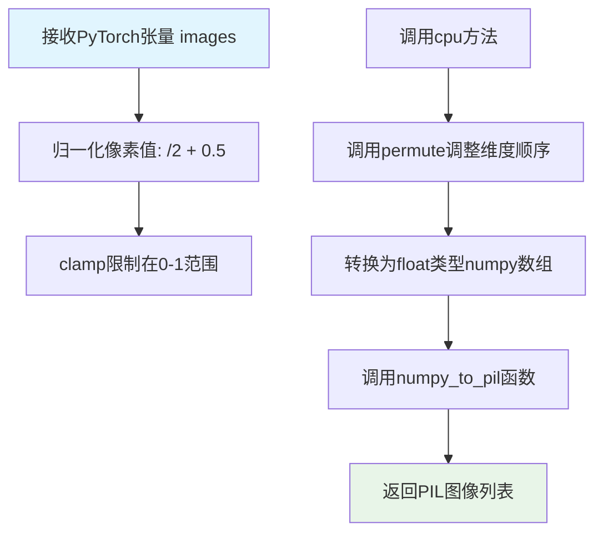
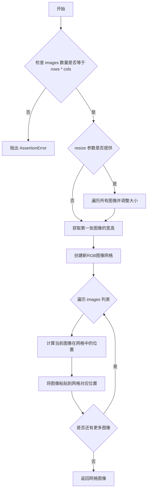

# `diffusers\src\diffusers\utils\pil_utils.py` 详细设计文档

该代码是一个图像处理工具模块，主要功能包括：将PyTorch张量转换为PIL图像、将numpy数组转换为PIL图像、以及将多个图像组合成网格视图。同时根据PIL版本动态选择正确的图像插值方法。

## 整体流程

```mermaid
graph TD
    A[开始] --> B{检查PIL版本}
    B --> C{版本 >= 9.1.0?}
    C -- 是 --> D[使用PIL.Image.Resampling]
    C -- 否 --> E[使用PIL.Image（旧API）]
    D --> F[定义PIL_INTERPOLATION字典]
    E --> F
    F --> G[pt_to_pil函数]
    G --> H[归一化图像到[0,1]]
    H --> I[转换为numpy数组]
    I --> J[调用numpy_to_pil]
    J --> K[返回PIL图像列表]
    F --> L[numpy_to_pil函数]
L --> M{图像维度=3?}
M -- 是 --> N[添加批次维度]
M -- 否 --> O[保持原样]
N --> P
O --> P[乘255并转换为uint8]
P --> Q{通道数=1?}
Q -- 是 --> R[转换为灰度图像]
Q -- 否 --> S[保持RGB]
R --> T[返回PIL图像列表]
S --> T
F --> U[make_image_grid函数]
U --> V[验证图像数量与行列匹配]
V --> W{resize非空?}
W -- 是 --> X[调整所有图像大小]
W -- 否 --> Y[跳过调整]
X --> Z
Y --> Z[创建新网格图像]
Z --> AA[逐个粘贴图像到网格]
AA --> AB[返回网格图像]
```

## 类结构

```
模块级函数（无类）
├── PIL_INTERPOLATION (全局变量)
├── pt_to_pil()
├── numpy_to_pil()
└── make_image_grid()
```

## 全局变量及字段


### `PIL_INTERPOLATION`
    
一个将插值方法名称映射到PIL图像重采样模式的字典，根据PIL版本（9.1.0及以上或以下）使用不同的映射值，用于图像处理中的缩放算法选择

类型：`dict`
    


    

## 全局函数及方法


### `pt_to_pil`

该函数用于将PyTorch张量格式的图像数据转换为PIL图像列表。它首先将图像像素值从[-1, 1]范围归一化到[0, 1]范围，然后通过NumPy数组中介转换格式，最终得到可直接用于PIL库处理的图像对象。

参数：

-  `images`：`torch.Tensor`，PyTorch张量格式的图像数据，通常为4D张量（batch_size, channels, height, width），通道顺序为CHW

返回值：`list[PIL.Image.Image]`，PIL图像对象列表，每个元素对应输入批次中的一张图像

#### 流程图



#### 带注释源码

```python
def pt_to_pil(images):
    """
    Convert a torch image to a PIL image.
    
    该函数将PyTorch张量格式的图像转换为PIL图像格式。
    处理流程包括：像素值归一化、维度调整、格式转换。
    
    参数:
        images: torch.Tensor, 4D张量 (B, C, H, W)，像素值范围 [-1, 1]
        
    返回:
        list[PIL.Image.Image]: PIL图像列表
    """
    # 步骤1: 将像素值从[-1, 1]范围映射到[0, 1]范围
    # PyTorch训练时通常将图像归一化到[-1, 1]，此处进行反向处理
    images = (images / 2 + 0.5).clamp(0, 1)
    
    # 步骤2: 将张量转移到CPU并转换为NumPy数组
    # permute(0, 2, 3, 1) 将张量维度从 (B, C, H, W) 转换为 (B, H, W, C)
    # 这是因为NumPy和PIL使用HWC格式，而PyTorch使用CHW格式
    images = images.cpu().permute(0, 2, 3, 1).float().numpy()
    
    # 步骤3: 调用辅助函数将NumPy数组转换为PIL图像
    images = numpy_to_pil(images)
    
    # 返回PIL图像列表
    return images
```


### `numpy_to_pil`

将 numpy 数组或图像批次转换为 PIL 图像列表的函数。

参数：

- `images`：`numpy.ndarray`，输入的 numpy 数组，可以是单张图像（3维）或图像批次（4维），像素值范围应为 [0, 1]

返回值：`list[PIL.Image.Image]`，返回 PIL 图像列表

#### 流程图

```mermaid
flowchart TD
    A[开始: 输入 numpy 数组 images] --> B{images.ndim == 3?}
    B -- 是 --> C[添加批次维度: images[None, ...]]
    B -- 否 --> D[直接使用 images]
    C --> E[像素值归一化: (images * 255).round().astype uint8]
    D --> E
    E --> F{images.shape[-1] == 1?}
    F -- 是 --> G[灰度图处理: mode='L']
    F -- 否 --> H[RGB/RGBA 图处理]
    G --> I[Image.fromarray with mode L]
    H --> I
    I --> J[生成 PIL 图像列表]
    J --> K[返回 pil_images]
```

#### 带注释源码

```python
def numpy_to_pil(images):
    """
    Convert a numpy image or a batch of images to a PIL image.
    """
    # 检查输入维度，如果是3维（单张图像），扩展为4维（批次）
    if images.ndim == 3:
        images = images[None, ...]
    
    # 将像素值从 [0, 1] 范围转换为 [0, 255] 范围，并转为 uint8 类型
    images = (images * 255).round().astype("uint8")
    
    # 判断是否为灰度图（单通道图像，最后一维为1）
    if images.shape[-1] == 1:
        # special case for grayscale (single channel) images
        # 灰度图需要指定 mode="L"，并使用 squeeze() 移除单通道维度
        pil_images = [Image.fromarray(image.squeeze(), mode="L") for image in images]
    else:
        # RGB 或 RGBA 图像直接转换
        pil_images = [Image.fromarray(image) for image in images]

    return pil_images
```


### `make_image_grid`

该函数将一组PIL图像排列成指定行数和列数的网格，并可选地调整图像大小，生成一个组合的网格图像，常用于可视化目的。

参数：

- `images`：`list[PIL.Image.Image]` ，输入的PIL图像列表，数量必须等于rows * cols
- `rows`：`int`，网格的行数
- `cols`：`int`，网格的列数
- `resize`：`int = None`，可选参数，如果提供则将所有图像调整到指定尺寸（正方形）

返回值：`PIL.Image.Image`，返回拼接后的网格图像对象

#### 流程图



#### 带注释源码

```python
def make_image_grid(images: list[PIL.Image.Image], rows: int, cols: int, resize: int = None) -> PIL.Image.Image:
    """
    Prepares a single grid of images. Useful for visualization purposes.
    
    参数:
        images: PIL图像列表，数量需等于 rows * cols
        rows: 网格行数
        cols:网格列数
        resize: 可选参数，用于将所有图像调整到指定尺寸
    
    返回:
        拼接后的网格图像
    """
    # 验证输入的图像数量是否与行列参数匹配
    assert len(images) == rows * cols

    # 如果指定了resize参数，则将所有图像调整到指定尺寸
    if resize is not None:
        images = [img.resize((resize, resize)) for img in images]

    # 获取第一张图像的尺寸作为网格中每个单元格的尺寸
    w, h = images[0].size
    # 创建一个新的RGB格式图像，尺寸为 cols * 宽度 x rows * 高度
    grid = Image.new("RGB", size=(cols * w, rows * h))

    # 遍历所有图像，将其依次粘贴到网格的对应位置
    for i, img in enumerate(images):
        # 计算当前图像在网格中的位置
        # i % cols 计算列索引，i // cols 计算行索引
        grid.paste(img, box=(i % cols * w, i // cols * h))
    
    # 返回拼接完成的网格图像
    return grid
```

## 关键组件


### PIL_INTERPOLATION

PIL图像插值方法的版本兼容映射字典，根据Pillow版本选择正确的插值枚举值，支持linear、bilinear、bicubic、lanczos、nearest五种插值方式。

### pt_to_pil

将PyTorch张量转换为PIL图像的函数。通过将张量值从[-1,1]范围归一化到[0,1]，然后转换为numpy数组，最后调用numpy_to_pil转换为PIL图像列表。

### numpy_to_pil

将NumPy数组或图像批次转换为PIL图像的函数。处理单通道灰度图像和多通道彩色图像，自动进行数据类型转换和维度调整。

### make_image_grid

创建图像网格的函数。将多个PIL图像排列成指定行数和列数的单一网格图像，支持可选的图像大小调整功能，便于可视化展示。


## 问题及建议


### 已知问题

-   **版本检查逻辑重复解析**：`version.parse(version.parse(PIL.__version__).base_version)` 重复调用了 `version.parse`，内层已经得到了版本对象，外层又重复解析，效率低下
-   **未使用的全局变量**：`PIL_INTERPOLATION` 字典定义了但在代码中未被引用，成为死代码
-   **缺少导入语句**：`pt_to_pil` 函数中使用了 `numpy` 和 `numpy_to_pil`，但代码中未导入 `numpy`，会导致运行时错误
-   **断言用于业务逻辑**：`make_image_grid` 中使用 `assert` 检查图片数量，断言在 Python 优化模式下（-O 标志）会被忽略，导致网格尺寸不匹配时无法正确报错
-   **缺乏输入验证**：`numpy_to_pil` 和 `pt_to_pil` 函数未对输入类型、维度、数值范围进行验证，可能导致隐式错误或难以追踪的异常
-   **类型注解不完整**：仅 `make_image_grid` 有类型注解，其他函数（`pt_to_pil`、`numpy_to_pil`）缺少参数和返回值类型注解

### 优化建议

-   **修复版本检查逻辑**：简化为 `version.parse(PIL.__version__.split('.')[0] if '+' in PIL.__version__ else PIL.__version__.rsplit('.', 1)[0])` 或使用 `packaging.version.Version(PIL.__version__).base_version`
-   **删除未使用的代码**：移除 `PIL_INTERPOLATION` 字典或实现使用它的功能
-   **添加缺失的导入**：在文件开头添加 `import numpy`
-   **使用 ValueError 替代断言**：将 `assert len(images) == rows * cols` 改为 `if len(images) != rows * cols: raise ValueError(...)`
-   **添加输入验证**：在 `numpy_to_pil` 中检查 `images` 是否为 None、维度是否有效、数值范围是否合理
-   **完善类型注解**：为 `pt_to_pil` 和 `numpy_to_pil` 添加完整的类型提示
-   **提取魔法数字**：将 `2`、`0.5`、`255` 等魔法数字定义为具名常量，提高代码可读性

## 其它


### 设计目标与约束

本模块的设计目标是提供PyTorch张量与PIL图像之间的无缝转换功能，并支持将多个图像组合成网格进行可视化。主要约束包括：1) 依赖PIL库进行图像处理；2) 需要兼容PIL 9.1.0前后的版本差异；3) 图像值域限制在[0,1]范围；4) 输入图像数量必须与行列数严格匹配。

### 错误处理与异常设计

代码采用多种错误处理策略：**显式断言检查**：在make_image_grid中使用assert len(images) == rows * cols确保图像数量与网格尺寸匹配；**隐式类型检查**：通过ndim属性检查numpy数组维度；**版本兼容性处理**：通过packaging.version解析PIL版本号并动态选择插值方式；**数值范围约束**：使用clamp(0,1)确保张量值在合法范围内。

### 数据流与状态机

主要数据流路径包括三条：**路径一（pt_to_pil）**：PyTorch张量 → 值域变换(/2+0.5) → clamp(0,1) → CPU转换 → numpy置换(0,2,3,1) → numpy_to_pil转换 → PIL图像列表；**路径二（numpy_to_pil）**：numpy数组 → 维度补全 → 值域变换(*255) → 类型转换(uint8) → 通道判断处理 → PIL图像列表；**路径三（make_image_grid）**：图像列表 → 尺寸调整(可选) → 网格创建 → 图像粘贴 → 组合网格图。

### 外部依赖与接口契约

本模块依赖以下外部包：**PIL(Pillow)**：图像处理核心库，版本需>=9.1.0以支持新的Resampling枚举；**packaging**：用于版本号解析和比较；**numpy**：数值计算和数组操作；**torch**：张量操作（pt_to_pil函数需要）。接口契约规定：pt_to_pil输入4D张量(B,C,H,W)值域[-1,1]，输出PIL.Image列表；numpy_to_pil输入3D(H,W,C)或4D(B,H,W,C)数组值域[0,1]，输出PIL.Image列表；make_image_grid输入PIL.Image列表和行列参数，可选resize参数，输出组合后的PIL.Image。

### 版本兼容性说明

代码通过版本检测实现向前兼容：当PIL版本>=9.1.0时使用PIL.Image.Resampling枚举（新版API）；当PIL版本<9.1.0时使用PIL.Image.LINEAR等直接属性（旧版API）。版本解析使用packaging.version.parse进行标准化处理，并额外调用base_version去除本地版本标识。

### 性能考虑与优化空间

当前实现存在以下性能特征：**内存拷贝**：numpy_to_pil中使用.round().astype("uint8)会创建新数组，可考虑使用out参数原地操作；**循环粘贴**：make_image_grid中使用Python循环粘贴图像，大批量图像时可考虑使用numpy数组拼接后一次性转换；**图像缩放**：make_image_grid中的resize操作逐个执行，可考虑批量处理。当前代码未包含缓存机制，频繁调用的场景可考虑缓存PIL_INTERPOLATION映射表。

### 边界条件处理

代码对以下边界条件进行了处理：**灰度图像**：通过检查shape[-1]==1识别单通道图像并使用mode="L"；**维度补全**：numpy_to_pil中3D数组自动扩展为4D(batch=1)；**值域截断**：使用clamp(0,1)防止数值溢出；**空数组**：未显式处理空数组输入，需调用方保证。
    