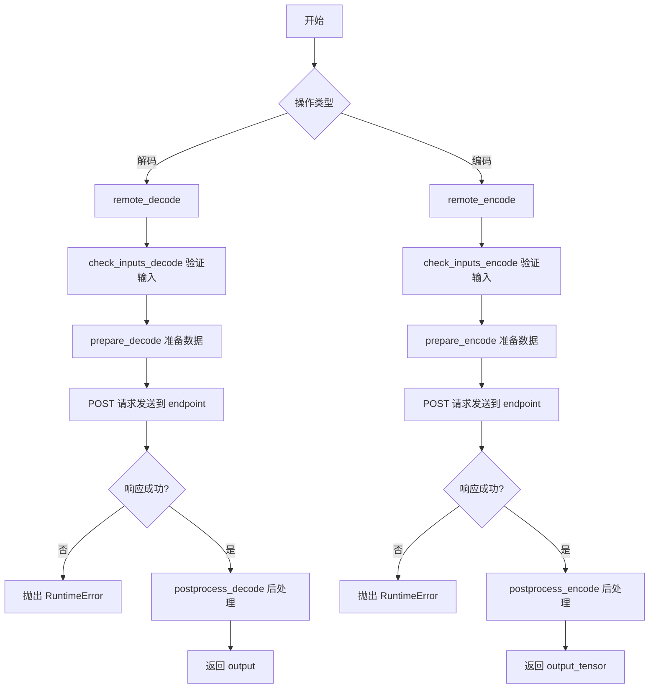
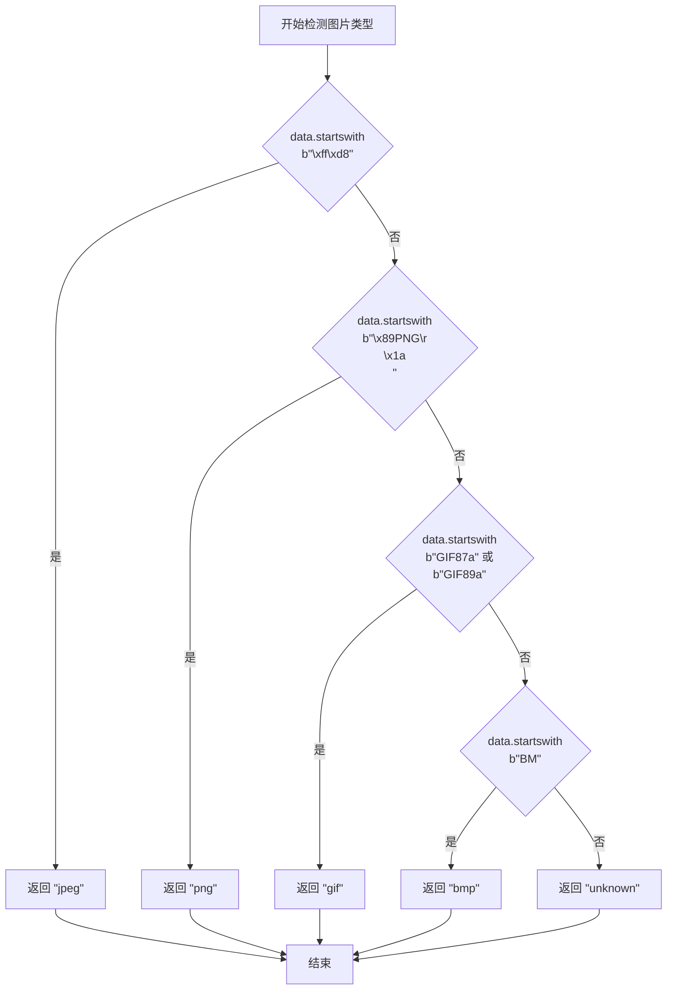
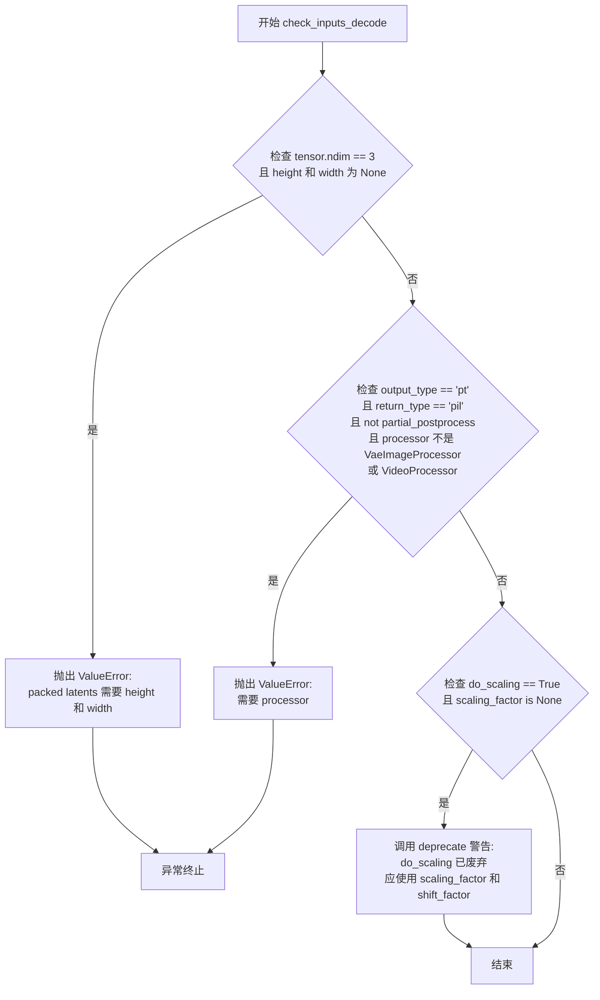
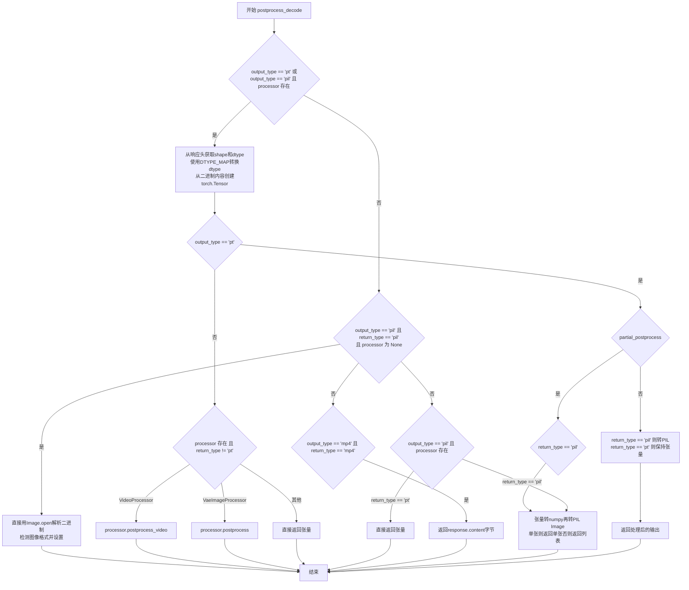
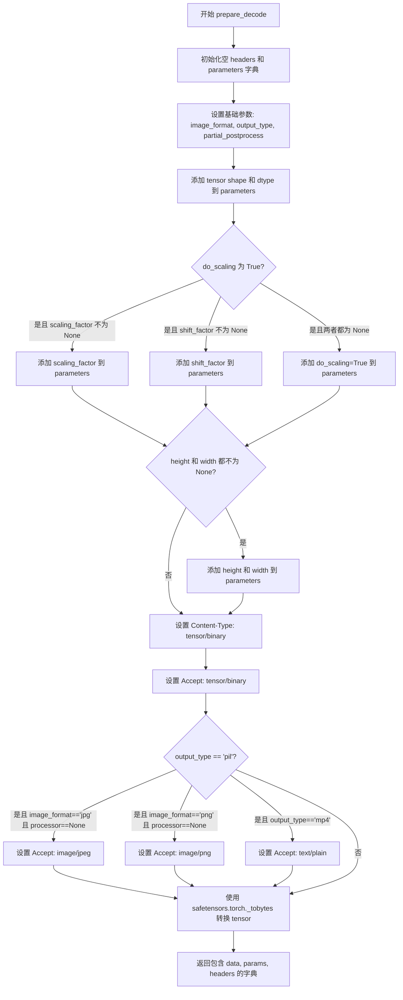
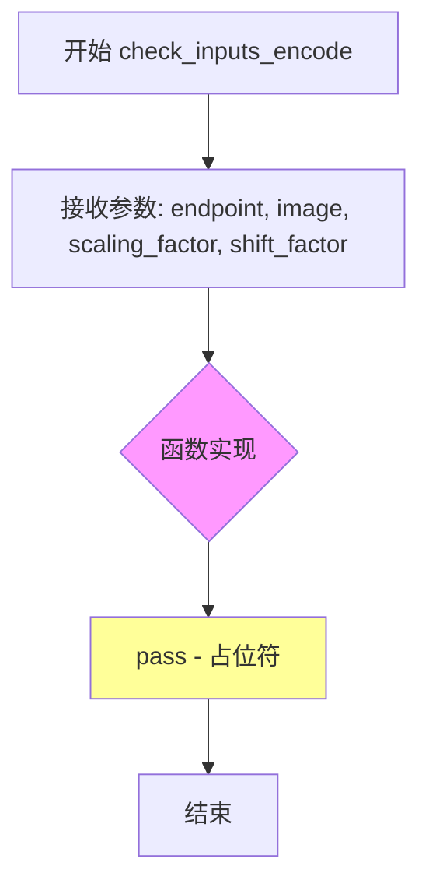
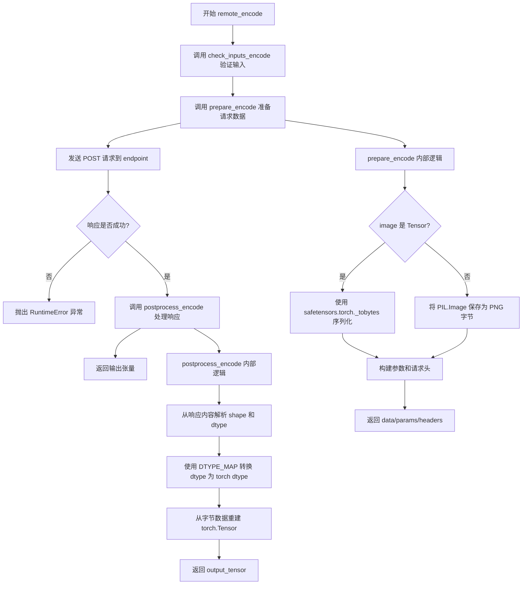

# `diffusers\src\diffusers\utils\remote_utils.py` 详细设计文档

该模块实现了 Hugging Face 混合推理功能，支持通过远程端点对 VAE（变分自编码器）的张量进行编码和解码操作。它提供了图像格式检测、输入验证、数据预处理、HTTP 请求发送和响应后处理等功能，支持 PIL 图像、PyTorch 张量和视频等多种输出类型的转换。

## 整体流程



## 类结构

```
全局变量
├── DTYPE_MAP (dtype 映射字典)
└── 
全局函数 (编码/解码流程)
├── detect_image_type (图像类型检测)
├── check_inputs_decode (解码输入验证)
├── postprocess_decode (解码响应后处理)
├── prepare_decode (解码数据准备)
├── remote_decode (远程解码主函数)
├── check_inputs_encode (编码输入验证)
├── postprocess_encode (编码响应后处理)
├── prepare_encode (编码数据准备)
└── remote_encode (远程编码主函数)
```

## 全局变量及字段


### `DTYPE_MAP`
    
将字符串dtype名称（如float16、float32）映射到PyTorch数据类型的字典，用于解码响应时的类型转换

类型：`dict[str, torch.dtype]`
    


### `torch`
    
PyTorch深度学习框架模块，通过条件导入获得，用于张量操作和数据类型处理

类型：`module`
    


### `safetensors.torch`
    
Safetensors库的PyTorch接口模块，通过条件导入获得，用于将张量序列化为二进制数据

类型：`module`
    


### `VaeImageProcessor`
    
VAE图像后处理器类，通过条件导入获得，用于将张量转换为PIL图像

类型：`class`
    


### `VideoProcessor`
    
视频处理器类，通过条件导入获得，用于视频张量的后处理

类型：`class`
    


    

## 全局函数及方法


### `detect_image_type`

该函数通过检查字节数据的文件头（魔数）来自动识别图片格式，支持 JPEG、PNG、GIF、BMP 四种常见图片格式的检测，若均不匹配则返回 "unknown"。

参数：

- `data`：`bytes`，待检测的图片字节数据

返回值：`str`，检测到的图片格式字符串（"jpeg"、"png"、"gif"、"bmp" 或 "unknown"）

#### 流程图



#### 带注释源码

```python
def detect_image_type(data: bytes) -> str:
    """
    检测图片的格式类型。
    
    该函数通过检查图片数据的文件头（魔数/文件签名）来识别图片格式。
    不同的图片格式在文件开头有特定的字节序列，可以用于快速识别。
    
    支持的格式：
    - JPEG: 文件头为 FF D8
    - PNG: 文件头为 89 50 4E 47 0D 0A 1A 0A
    - GIF87a: 文件头为 47 49 46 38 37 61
    - GIF89a: 文件头为 47 49 46 38 39 61
    - BMP: 文件头为 42 4D (即 "BM")
    
    参数:
        data (bytes): 图片的原始字节数据，通常是读取文件的前几个字节
        
    返回:
        str: 图片格式的字符串标识，可能的值：
            - "jpeg": JPEG 图片
            - "png": PNG 图片
            - "gif": GIF 图片
            - "bmp": BMP 图片
            - "unknown": 未知或不支持的图片格式
    """
    # 检查 JPEG 文件头：JPEG 图片以 FF D8 开头
    if data.startswith(b"\xff\xd8"):
        return "jpeg"
    # 检查 PNG 文件头：PNG 图片以 89 50 4E 47 0D 0A 1A 0A 开头
    elif data.startswith(b"\x89PNG\r\n\x1a\n"):
        return "png"
    # 检查 GIF 文件头：GIF87a 或 GIF89a
    elif data.startswith(b"GIF87a") or data.startswith(b"GIF89a"):
        return "gif"
    # 检查 BMP 文件头：42 4D (即字符 "BM")
    elif data.startswith(b"BM"):
        return "bmp"
    # 如果不匹配任何已知格式，返回 unknown
    return "unknown"
```


### `check_inputs_decode`

该函数是 Hugging Face 混合推理模块中的输入校验函数，用于在远程 VAE 解码前验证各项参数的有效性，包括张量维度、处理器类型、输出/返回类型组合以及缩放因子的使用合理性。

参数：

- `endpoint`：`str`，远程解码服务的端点 URL
- `tensor`：`torch.Tensor`，待解码的张量数据
- `processor`：`VaeImageProcessor | VideoProcessor | None`，用于后处理的图像或视频处理器
- `do_scaling`：`bool`，是否执行缩放操作（已废弃）
- `scaling_factor`：`float | None`，缩放因子，用于反缩放潜在变量
- `shift_factor`：`float | None`，偏移因子，用于潜在变量的平移调整
- `output_type`：`Literal["mp4", "pil", "pt"]`，端点返回的数据类型
- `return_type`：`Literal["mp4", "pil", "pt"]`，函数最终返回的数据类型
- `image_format`：`Literal["png", "jpg"]`，图像格式
- `partial_postprocess`：`bool`，是否执行部分后处理
- `input_tensor_type`：`Literal["binary"]`，输入张量的传输类型
- `output_tensor_type`：`Literal["binary"]`，输出张量的传输类型
- `height`：`int | None`，图像高度（packed latent 时必填）
- `width`：`int | None`，图像宽度（packed latent 时必填）

返回值：`None`，该函数不返回任何值，仅通过异常或警告进行参数校验

#### 流程图



#### 带注释源码

```python
def check_inputs_decode(
    endpoint: str,                                        # 远程解码服务的端点 URL
    tensor: "torch.Tensor",                               # 待解码的 PyTorch 张量
    processor: "VaeImageProcessor" | "VideoProcessor" | None = None,  # 图像/视频后处理器
    do_scaling: bool = True,                              # 是否执行缩放（已废弃参数）
    scaling_factor: float | None = None,                 # 缩放因子
    shift_factor: float | None = None,                    # 偏移因子
    output_type: Literal["mp4", "pil", "pt"] = "pil",    # 端点输出类型
    return_type: Literal["mp4", "pil", "pt"] = "pil",    # 函数返回类型
    image_format: Literal["png", "jpg"] = "jpg",         # 图像格式
    partial_postprocess: bool = False,                   # 是否部分后处理
    input_tensor_type: Literal["binary"] = "binary",     # 输入张量传输类型
    output_tensor_type: Literal["binary"] = "binary",    # 输出张量传输类型
    height: int | None = None,                            # 图像高度
    width: int | None = None,                             # 图像宽度
):
    # 检查1：当张量为3维packed latent时，必须提供height和width
    if tensor.ndim == 3 and height is None and width is None:
        raise ValueError("`height` and `width` required for packed latents.")
    
    # 检查2：当output_type为pt且return_type为pil且未启用部分后处理时，
    # 必须提供processor（VaeImageProcessor或VideoProcessor）
    if (
        output_type == "pt"
        and return_type == "pil"
        and not partial_postprocess
        and not isinstance(processor, (VaeImageProcessor, VideoProcessor))
    ):
        raise ValueError("`processor` is required.")
    
    # 检查3：若启用do_scaling但未提供scaling_factor，触发废弃警告
    # 提醒用户应直接传递scaling_factor和shift_factor参数
    if do_scaling and scaling_factor is None:
        deprecate(
            "do_scaling",
            "1.0.0",
            "`do_scaling` is deprecated, pass `scaling_factor` and `shift_factor` if required.",
            standard_warn=False,
        )
```


### `postprocess_decode`

该函数是远程解码（remote_decode）的后处理核心，负责将服务器返回的二进制响应数据转换为指定格式（PyTorch张量、PIL图像或视频字节）。它根据`output_type`和`return_type`参数以及`processor`的存在与否，智能地处理不同场景下的数据转换，包括张量 reshape、类型映射、图像反归一化等操作。

参数：

- `response`：`requests.Response`，服务器返回的HTTP响应对象，包含二进制数据内容和元数据头信息
- `processor`：`VaeImageProcessor | VideoProcessor | None`，用于将张量后处理为PIL图像的处理器，PT输出且非部分后处理时可能需要
- `output_type`：`Literal["mp4", "pil", "pt"]`，期望的服务器输出类型，pt为PyTorch张量，pil为PIL图像，mp4为视频
- `return_type`：`Literal["mp4", "pil", "pt"]`，函数最终返回的类型，默认为pil
- `partial_postprocess`：`bool`，是否执行部分后处理（如反归一化），仅在output_type为pt时生效

返回值：`Image.Image | list[Image.Image] | bytes | torch.Tensor`，根据output_type和return_type的组合返回不同类型的数据，可能是单个PIL图像、图像列表、视频字节或PyTorch张量

#### 流程图



#### 带注释源码

```python
def postprocess_decode(
    response: requests.Response,
    processor: "VaeImageProcessor" | "VideoProcessor" | None = None,
    output_type: Literal["mp4", "pil", "pt"] = "pil",
    return_type: Literal["mp4", "pil", "pt"] = "pil",
    partial_postprocess: bool = False,
):
    """
    处理远程解码服务的响应，将二进制数据转换为指定格式。
    
    Args:
        response: 服务器返回的HTTP响应，包含二进制数据和元数据
        processor: VAE图像处理器或视频处理器，用于后处理
        output_type: 服务器返回的数据类型（pt/pil/mp4）
        return_type: 函数应返回的数据类型（pt/pil/mp4）
        partial_postprocess: 是否进行部分后处理（如反归一化）
    """
    # 场景1: 服务器返回的是PyTorch张量 (output_type='pt')
    # 或者需要使用processor处理 (output_type='pil' 且 processor存在)
    if output_type == "pt" or (output_type == "pil" and processor is not None):
        # 从响应的二进制内容读取张量数据
        output_tensor = response.content
        # 从响应头获取张量元数据：shape和dtype
        parameters = response.headers
        shape = json.loads(parameters["shape"])
        dtype = parameters["dtype"]
        # 将字符串dtype映射到torch数据类型
        torch_dtype = DTYPE_MAP[dtype]
        # 将二进制数据转换为PyTorch张量并reshape到正确形状
        output_tensor = torch.frombuffer(bytearray(output_tensor), dtype=torch_dtype).reshape(shape)
    
    # 根据output_type分支处理
    if output_type == "pt":
        # PT输出模式的处理逻辑
        if partial_postprocess:
            # 部分后处理：对张量进行反归一化转为PIL图像
            if return_type == "pil":
                # 遍历每个张量，转numpy再转PIL Image
                output = [Image.fromarray(image.numpy()) for image in output_tensor]
                # 单张图返回单个对象，批量返回列表
                if len(output) == 1:
                    output = output[0]
            elif return_type == "pt":
                # 保持为PyTorch张量（已反归一化的uint8）
                output = output_tensor
        else:
            # 完全后处理模式
            if processor is None or return_type == "pt":
                # 无processor或要求返回pt，则直接返回原始张量（float16/bfloat16）
                output = output_tensor
            else:
                # 使用processor进行完整后处理
                if isinstance(processor, VideoProcessor):
                    # 视频处理器处理
                    output = cast(
                        list[Image.Image],
                        processor.postprocess_video(output_tensor, output_type="pil")[0],
                    )
                else:
                    # 图像处理器处理
                    output = cast(
                        Image.Image,
                        processor.postprocess(output_tensor, output_type="pil")[0],
                    )
    
    # 场景2: 服务器直接返回PIL图像 (output_type='pil')，无processor
    elif output_type == "pil" and return_type == "pil" and processor is None:
        # 直接从二进制数据创建PIL图像
        output = Image.open(io.BytesIO(response.content)).convert("RGB")
        # 检测图像格式并设置
        detected_format = detect_image_type(response.content)
        output.format = detected_format
    
    # 场景3: 服务器返回张量但需要手动转为PIL (output_type='pil' 且有processor)
    elif output_type == "pil" and processor is not None:
        if return_type == "pil":
            # 手动将张量反归一化: float32 -> [0,1] -> uint8 -> numpy -> PIL
            output = [
                Image.fromarray(image)
                for image in (output_tensor.permute(0, 2, 3, 1).float().numpy() * 255).round().astype("uint8")
            ]
        elif return_type == "pt":
            # 保持为张量格式
            output = output_tensor
    
    # 场景4: 服务器返回视频 (output_type='mp4')
    elif output_type == "mp4" and return_type == "mp4":
        # 直接返回视频字节数据
        output = response.content
    
    return output
```


### `prepare_decode`

该函数是 Hugging Face 混合推理中用于准备远程 VAE 解码请求的核心函数，负责将 PyTorch 张量转换为二进制数据，并构建 HTTP 请求所需的参数和请求头信息。

参数：

- `tensor`：`torch.Tensor`，要解码的 PyTorch 张量
- `processor`：`VaeImageProcessor | VideoProcessor | None`，可选的图像或视频处理器，用于后处理
- `do_scaling`：`bool`，是否应用缩放，默认为 True
- `scaling_factor`：`float | None`，缩放因子，用于远程 VAE 解码时的缩放操作
- `shift_factor`：`float | None`，偏移因子，用于远程 VAE 解码时的偏移操作
- `output_type`：`Literal["mp4", "pil", "pt"]`，输出类型，默认为 "pil"
- `image_format`：`Literal["png", "jpg"]`，图像格式，默认为 "jpg"
- `partial_postprocess`：`bool`，是否进行部分后处理，默认为 False
- `height`：`int | None`，图像高度，用于 packed latents
- `width`：`int | None`，图像宽度，用于 packed latents

返回值：`dict`，返回包含以下键的字典：

- `data`：bytes，二进制张量数据
- `params`：dict，请求参数（包含 shape、dtype、scaling_factor 等）
- `headers`：dict，HTTP 请求头（包含 Content-Type 和 Accept）

#### 流程图



#### 带注释源码

```python
def prepare_decode(
    tensor: "torch.Tensor",
    processor: "VaeImageProcessor" | "VideoProcessor" | None = None,
    do_scaling: bool = True,
    scaling_factor: float | None = None,
    shift_factor: float | None = None,
    output_type: Literal["mp4", "pil", "pt"] = "pil",
    image_format: Literal["png", "jpg"] = "jpg",
    partial_postprocess: bool = False,
    height: int | None = None,
    width: int | None = None,
):
    """
    准备远程解码请求的参数和数据。
    
    Args:
        tensor: 要解码的 PyTorch 张量
        processor: 可选的图像/视频处理器
        do_scaling: 是否应用缩放
        scaling_factor: 缩放因子
        shift_factor: 偏移因子
        output_type: 输出类型 (mp4/pil/pt)
        image_format: 图像格式 (png/jpg)
        partial_postprocess: 是否部分后处理
        height: 图像高度
        width: 图像宽度
    
    Returns:
        包含请求数据的字典 {data, params, headers}
    """
    # 初始化 HTTP 请求头字典
    headers = {}
    
    # 构造请求参数字典，包含基础参数
    parameters = {
        "image_format": image_format,           # 图像格式：png 或 jpg
        "output_type": output_type,             # 输出类型：mp4, pil, 或 pt
        "partial_postprocess": partial_postprocess,  # 是否部分后处理
        "shape": list(tensor.shape),            # 张量形状
        "dtype": str(tensor.dtype).split(".")[-1],  # 张量数据类型（如 float16）
    }
    
    # 处理缩放因子：如果启用缩放且提供了 scaling_factor，则添加到参数中
    if do_scaling and scaling_factor is not None:
        parameters["scaling_factor"] = scaling_factor
    
    # 处理偏移因子：如果启用缩放且提供了 shift_factor，则添加到参数中
    if do_scaling and shift_factor is not None:
        parameters["shift_factor"] = shift_factor
    
    # 处理弃用的 do_scaling 参数：保持向后兼容
    if do_scaling and scaling_factor is None:
        parameters["do_scaling"] = do_scaling
    elif do_scaling and scaling_factor is None and shift_factor is None:
        parameters["do_scaling"] = do_scaling
    
    # 处理高度和宽度参数（用于 packed latents）
    if height is not None and width is not None:
        parameters["height"] = height
        parameters["width"] = width
    
    # 设置 HTTP 请求头
    headers["Content-Type"] = "tensor/binary"   # 内容类型：二进制张量
    headers["Accept"] = "tensor/binary"          # 默认接受类型：二进制张量
    
    # 根据输出类型和图像格式优化 Accept 头
    # 当输出为 PIL 图像且有特定格式要求时，使用对应的图像 MIME 类型
    if output_type == "pil" and image_format == "jpg" and processor is None:
        headers["Accept"] = "image/jpeg"
    elif output_type == "pil" and image_format == "png" and processor is None:
        headers["Accept"] = "image/png"
    elif output_type == "mp4":
        headers["Accept"] = "text/plain"
    
    # 使用 safetensors 库将张量序列化为二进制字节
    tensor_data = safetensors.torch._tobytes(tensor, "tensor")
    
    # 返回包含数据、参数和请求头的字典，供 requests.post 使用
    return {"data": tensor_data, "params": parameters, "headers": headers}
```


### `remote_decode`

该函数是 Hugging Face Hybrid Inference 的核心组件，允许将 VAE（变分自编码器）解码操作卸载到远程端点执行。它接收一个 tensor，通过 HTTP POST 请求将其发送到指定的远程服务器进行解码，并根据 `output_type` 和 `return_type` 参数将响应转换为 PIL Image、torch.Tensor 或 bytes 等不同格式返回。

参数：

- `endpoint`：`str`，远程解码服务的端点 URL
- `tensor`：`torch.Tensor`，要解码的张量（通常为 latent 表示）
- `processor`：`VaeImageProcessor | VideoProcessor | None`，可选的图像/视频处理器，用于 `return_type="pt"` 或 `return_type="pil"` 的视频模型场景
- `do_scaling`：`bool`，**已弃用**。是否进行缩放的标志，建议使用 `scaling_factor` 和 `shift_factor` 参数
- `scaling_factor`：`float | None`，缩放因子，用于将 latents 缩放到正确的数值范围（如 SD v1 为 0.18215，SD XL 为 0.13025，Flux 为 0.3611）
- `shift_factor`：`float | None`，偏移因子，用于 Shift 缩放（如 Flux 的 0.1159）
- `output_type`：`Literal["mp4", "pil", "pt"]`，远程端点的输出类型，默认为 "pil"
- `return_type`：`Literal["mp4", "pil", "pt"]`，函数的返回类型，默认为 "pil"
- `image_format`：`Literal["png", "jpg"]`，当 `output_type="pil"` 时使用的图像格式，默认为 "jpg"
- `partial_postprocess`：`bool`，是否进行部分后处理，仅与 `output_type="pt"` 配合使用
- `input_tensor_type`：`Literal["binary"]`，张量传输类型，当前仅支持 "binary"
- `output_tensor_type`：`Literal["binary"]`，张量传输类型，当前仅支持 "binary"
- `height`：`int | None`，packed latents 所需的高度参数
- `width`：`int | None`，packed latents 所需的宽度参数

返回值：`Image.Image | list[Image.Image] | bytes | torch.Tensor`，根据 `output_type` 和 `return_type` 参数返回不同类型的结果

#### 流程图

```mermaid
flowchart TD
    A[开始 remote_decode] --> B{input_tensor_type == 'base64'?}
    B -->|是| C[deprecated warning: 转换为 'binary']
    B -->|否| D{output_tensor_type == 'base64'?}
    D -->|是| E[deprecated warning: 转换为 'binary']
    D -->|否| F[调用 check_inputs_decode 验证输入]
    F --> G[调用 prepare_decode 准备请求参数]
    G --> H[发送 HTTP POST 请求到 endpoint]
    H --> I{response.ok?}
    I -->|否| J[抛出 RuntimeError 异常]
    I -->|是| K[调用 postprocess_decode 处理响应]
    K --> L[返回 output]
    
    F -.-> F1[检查 packed latents 高度/宽度]
    F -.-> F2[检查 processor 必需性]
    
    G -.-> G1[构建 headers 和 parameters]
    G -.-> G2[使用 safetensors 序列化 tensor]
    
    K -.-> K1{output_type == 'pt' or (output_type == 'pil' and processor exists)}
    K -.-> K2{output_type == 'pil' and return_type == 'pil' and processor is None}
    K -.-> K3{output_type == 'mp4' and return_type == 'mp4'}
```

#### 带注释源码

```python
def remote_decode(
    endpoint: str,                              # 远程解码服务的端点 URL
    tensor: "torch.Tensor",                     # 要解码的 latent 张量
    processor: "VaeImageProcessor" | "VideoProcessor" | None = None,  # 可选的图像/视频处理器
    do_scaling: bool = True,                    # 是否进行缩放（已弃用）
    scaling_factor: float | None = None,        # 缩放因子
    shift_factor: float | None = None,          # 偏移因子
    output_type: Literal["mp4", "pil", "pt"] = "pil",  # 远程端点返回的数据类型
    return_type: Literal["mp4", "pil", "pt"] = "pil",  # 函数最终返回的数据类型
    image_format: Literal["png", "jpg"] = "jpg",       # 图像格式
    partial_postprocess: bool = False,         # 是否进行部分后处理
    input_tensor_type: Literal["binary"] = "binary",  # 输入张量传输类型
    output_tensor_type: Literal["binary"] = "binary",  # 输出张量传输类型
    height: int | None = None,                 # packed latents 所需高度
    width: int | None = None,                  # packed latents 所需宽度
) -> Image.Image | list[Image.Image] | bytes | "torch.Tensor":
    """
    Hugging Face Hybrid Inference that allow running VAE decode remotely.

    Args:
        endpoint (`str`):
            Endpoint for Remote Decode.
        tensor (`torch.Tensor`):
            Tensor to be decoded.
        processor (`VaeImageProcessor` or `VideoProcessor`, *optional*):
            Used with `return_type="pt"`, and `return_type="pil"` for Video models.
        do_scaling (`bool`, default `True`, *optional*):
            **DEPRECATED**. **pass `scaling_factor`/`shift_factor` instead.** **still set
            do_scaling=None/do_scaling=False for no scaling until option is removed** When `True` scaling e.g. `latents
            / self.vae.config.scaling_factor` is applied remotely. If `False`, input must be passed with scaling
            applied.
        scaling_factor (`float`, *optional*):
            Scaling is applied when passed e.g. [`latents /
            self.vae.config.scaling_factor`](https://github.com/huggingface/diffusers/blob/7007febae5cff000d4df9059d9cf35133e8b2ca9/src/diffusers/pipelines/stable_diffusion/pipeline_stable_diffusion.py#L1083C37-L1083C77).
            - SD v1: 0.18215
            - SD XL: 0.13025
            - Flux: 0.3611
            If `None`, input must be passed with scaling applied.
        shift_factor (`float`, *optional*):
            Shift is applied when passed e.g. `latents + self.vae.config.shift_factor`.
            - Flux: 0.1159
            If `None`, input must be passed with scaling applied.
        output_type (`"mp4"` or `"pil"` or `"pt", default `"pil"):
            **Endpoint** output type. Subject to change. Report feedback on preferred type.

            `"mp4": Supported by video models. Endpoint returns `bytes` of video. `"pil"`: Supported by image and video
            models.
                Image models: Endpoint returns `bytes` of an image in `image_format`. Video models: Endpoint returns
                `torch.Tensor` with partial `postprocessing` applied.
                    Requires `processor` as a flag (any `None` value will work).
            `"pt"`: Support by image and video models. Endpoint returns `torch.Tensor`.
                With `partial_postprocess=True` the tensor is postprocessed `uint8` image tensor.

            Recommendations:
                `"pt"` with `partial_postprocess=True` is the smallest transfer for full quality. `"pt"` with
                `partial_postprocess=False` is the most compatible with third party code. `"pil"` with
                `image_format="jpg"` is the smallest transfer overall.

        return_type (`"mp4"` or `"pil"` or `"pt", default `"pil"):
            **Function** return type.

            `"mp4": Function returns `bytes` of video. `"pil"`: Function returns `PIL.Image.Image`.
                With `output_type="pil" no further processing is applied. With `output_type="pt" a `PIL.Image.Image` is
                created.
                    `partial_postprocess=False` `processor` is required. `partial_postprocess=True` `processor` is
                    **not** required.
            `"pt"`: Function returns `torch.Tensor`.
                `processor` is **not** required. `partial_postprocess=False` tensor is `float16` or `bfloat16`, without
                denormalization. `partial_postprocess=True` tensor is `uint8`, denormalized.

        image_format (`"png"` or `"jpg"`, default `jpg`):
            Used with `output_type="pil"`. Endpoint returns `jpg` or `png`.

        partial_postprocess (`bool`, default `False`):
            Used with `output_type="pt"`. `partial_postprocess=False` tensor is `float16` or `bfloat16`, without
            denormalization. `partial_postprocess=True` tensor is `uint8`, denormalized.

        input_tensor_type (`"binary"`, default `"binary"`):
            Tensor transfer type.

        output_tensor_type (`"binary"`, default `"binary"`):
            Tensor transfer type.

        height (`int`, **optional**):
            Required for `"packed"` latents.

        width (`int`, **optional**):
            Required for `"packed"` latents.

    Returns:
        output (`Image.Image` or `list[Image.Image]` or `bytes` or `torch.Tensor`).
    """
    # 处理已弃用的 base64 参数，转换为 binary 类型
    if input_tensor_type == "base64":
        deprecate(
            "input_tensor_type='base64'",
            "1.0.0",
            "input_tensor_type='base64' is deprecated. Using `binary`.",
            standard_warn=False,
        )
        input_tensor_type = "binary"
    if output_tensor_type == "base64":
        deprecate(
            "output_tensor_type='base64'",
            "1.0.0",
            "output_tensor_type='base64' is deprecated. Using `binary`.",
            standard_warn=False,
        )
        output_tensor_type = "binary"
    
    # 验证输入参数的有效性
    check_inputs_decode(
        endpoint,
        tensor,
        processor,
        do_scaling,
        scaling_factor,
        shift_factor,
        output_type,
        return_type,
        image_format,
        partial_postprocess,
        input_tensor_type,
        output_tensor_type,
        height,
        width,
    )
    
    # 准备解码请求的参数（序列化、headers、parameters）
    kwargs = prepare_decode(
        tensor=tensor,
        processor=processor,
        do_scaling=do_scaling,
        scaling_factor=scaling_factor,
        shift_factor=shift_factor,
        output_type=output_type,
        image_format=image_format,
        partial_postprocess=partial_postprocess,
        height=height,
        width=width,
    )
    
    # 发送 HTTP POST 请求到远程端点
    response = requests.post(endpoint, **kwargs)
    
    # 检查响应状态，若失败则抛出异常
    if not response.ok:
        raise RuntimeError(response.json())
    
    # 对响应进行后处理，转换为目标格式
    output = postprocess_decode(
        response=response,
        processor=processor,
        output_type=output_type,
        return_type=return_type,
        partial_postprocess=partial_postprocess,
    )
    
    return output
```


### `check_inputs_encode`

该函数用于验证远程 VAE 编码的输入参数，确保传入的端点、图像以及缩放/偏移因子符合编码要求（当前为占位符实现，未包含实际验证逻辑）。

参数：

- `endpoint`：`str`，远程编码服务的端点 URL
- `image`：`torch.Tensor | Image.Image`，待编码的图像，支持 PyTorch 张量或 PIL 图像
- `scaling_factor`：`float | None`，缩放因子，用于编码时的缩放处理
- `shift_factor`：`float | None`，偏移因子，用于编码时的偏移处理

返回值：`None`，该函数目前仅为占位符，无返回值

#### 流程图



#### 带注释源码

```python
def check_inputs_encode(
    endpoint: str,
    image: "torch.Tensor" | Image.Image,
    scaling_factor: float | None = None,
    shift_factor: float | None = None,
):
    """
    检查远程编码输入参数。
    
    该函数用于验证传入的编码参数，当前为占位符实现，
    实际验证逻辑尚未完成（对应 decode 侧的 check_inputs_decode 有完整验证）。
    
    Args:
        endpoint: 远程编码服务的端点 URL
        image: 待编码的图像，支持 torch.Tensor 或 PIL.Image.Image 格式
        scaling_factor: 可选的缩放因子，用于 VAE 编码时的缩放操作
        shift_factor: 可选的偏移因子，用于 VAE 编码时的偏移操作
    
    Returns:
        None - 当前实现无返回值
    """
    pass  # 占位符：待实现的输入验证逻辑
```


### `postprocess_encode`

该函数是远程VAE编码（VAE Encode）的后处理函数，负责将远程服务端返回的二进制响应数据解析为PyTorch张量（torch.Tensor），完成从HTTP响应到模型张量的转换过程。

参数：

- `response`：`requests.Response`，HTTP响应对象，包含服务端返回的二进制张量数据及元数据头信息

返回值：`torch.Tensor`，从响应内容中重建的PyTorch张量，包含原始图像的编码潜在表示

#### 流程图

```mermaid
flowchart TD
    A[开始: postprocess_encode] --> B[获取响应内容: response.content]
    B --> C[获取响应头参数: response.headers]
    C --> D[解析shape: json.loads parameters['shape']]
    D --> E[获取dtype: parameters['dtype']]
    E --> F[映射dtype为torch类型: DTYPE_MAP[dtype]]
    F --> G[二进制数据转换为字节数组: bytearray output_tensor]
    G --> H[转换为torch.Tensor: torch.frombuffer]
    H --> I[reshape为原始形状: .reshape shape]
    I --> J[返回torch.Tensor]
```

#### 带注释源码

```python
def postprocess_encode(
    response: requests.Response,
):
    # 从HTTP响应中获取二进制张量数据
    output_tensor = response.content
    
    # 从响应头中获取编码时保存的元数据参数
    parameters = response.headers
    
    # 从响应头中解析张量的原始形状信息（JSON字符串格式）
    shape = json.loads(parameters["shape"])
    
    # 从响应头中获取张量的数据类型字符串（如"float16"）
    dtype = parameters["dtype"]
    
    # 使用DTYPE_MAP将字符串类型的dtype转换为PyTorch的dtype对象
    # 例如: "float16" -> torch.float16
    torch_dtype = DTYPE_MAP[dtype]
    
    # 将二进制数据转换为字节数组，再根据dtype转换为torch.Tensor
    # 最后reshape为原始形状，恢复编码前的张量维度
    output_tensor = torch.frombuffer(bytearray(output_tensor), dtype=torch_dtype).reshape(shape)
    
    # 返回重建的PyTorch张量（编码后的潜在表示）
    return output_tensor
```


### `prepare_encode`

该函数负责将输入图像（支持 PyTorch 张量或 PIL 图像）准备为远程编码请求所需的格式，包括序列化图像数据、构建请求参数和 HTTP 头部。

参数：

- `image`：`torch.Tensor | Image.Image`，待编码的输入图像，可以是 PyTorch 张量或 PIL 图像
- `scaling_factor`：`float | None`，可选的缩放因子，用于远程 VAE 编码时的缩放操作
- `shift_factor`：`float | None`，可选的偏移因子，用于远程 VAE 编码时的偏移操作

返回值：`dict`，包含三个键值的字典——`data`（序列化后的图像字节数据）、`params`（编码参数如 shape、dtype、scaling_factor、shift_factor）、`headers`（HTTP 请求头）

#### 流程图

```mermaid
flowchart TD
    A[开始 prepare_encode] --> B[初始化空字典 headers 和 parameters]
    B --> C{scaling_factor 是否不为 None?}
    C -->|是| D[parameters['scaling_factor'] = scaling_factor]
    C -->|否| E{shift_factor 是否不为 None?}
    D --> E
    E -->|是| F[parameters['shift_factor'] = shift_factor]
    E -->|否| G{image 是否为 torch.Tensor?}
    F --> G
    G -->|是| H[调用 safetensors.torch._tobytes 序列化张量]
    H --> I[parameters['shape'] = list(image.shape)]
    I --> J[parameters['dtype'] = str(image.dtype).split('.')[-1]]
    J --> K[返回 {'data': data, 'params': parameters, 'headers': headers}]
    G -->|否| L[创建 BytesIO 缓冲区]
    L --> M[将图像保存为 PNG 格式到缓冲区]
    M --> N[data = buffer.getvalue()]
    N --> K
```

#### 带注释源码

```python
def prepare_encode(
    image: "torch.Tensor" | Image.Image,
    scaling_factor: float | None = None,
    shift_factor: float | None = None,
):
    """
    准备图像数据用于远程 VAE 编码请求。
    
    Args:
        image: 输入图像，PyTorch 张量或 PIL 图像
        scaling_factor: 可选的缩放因子
        shift_factor: 可选的偏移因子
    
    Returns:
        包含请求数据的字典，包含 data、params 和 headers 三个键
    """
    # 初始化空的请求头和参数字典
    headers = {}
    parameters = {}
    
    # 如果提供了缩放因子，则添加到参数中
    if scaling_factor is not None:
        parameters["scaling_factor"] = scaling_factor
    
    # 如果提供了偏移因子，则添加到参数中
    if shift_factor is not None:
        parameters["shift_factor"] = shift_factor
    
    # 根据图像类型采用不同的序列化方式
    if isinstance(image, torch.Tensor):
        # 对于 PyTorch 张量：使用 safetensors 库序列化为二进制格式
        data = safetensors.torch._tobytes(image.contiguous(), "tensor")
        # 记录张量的形状和数据类型
        parameters["shape"] = list(image.shape)
        parameters["dtype"] = str(image.dtype).split(".")[-1]
    else:
        # 对于 PIL 图像：序列化为 PNG 格式的字节数据
        buffer = io.BytesIO()
        image.save(buffer, format="PNG")
        data = buffer.getvalue()
    
    # 返回包含所有请求信息的字典
    return {"data": data, "params": parameters, "headers": headers}
```


### `remote_encode`

远程VAE编码函数，用于将图像张量或PIL图像通过远程端点进行VAE编码，返回编码后的潜空间张量。

参数：

- `endpoint`：`str`，远程编码服务的端点URL
- `image`：`torch.Tensor | Image.Image`，待编码的图像，支持PyTorch张量或PIL图像
- `scaling_factor`：`float | None`，缩放因子，用于将潜空间数值缩放（如SD v1为0.18215，SD XL为0.13025，Flux为0.3611）
- `shift_factor`：`float | None`，偏移因子，用于潜空间偏移（如Flux为0.1159）

返回值：`torch.Tensor`，编码后的潜空间张量

#### 流程图



#### 带注释源码

```python
def remote_encode(
    endpoint: str,
    image: "torch.Tensor" | Image.Image,
    scaling_factor: float | None = None,
    shift_factor: float | None = None,
) -> "torch.Tensor":
    """
    Hugging Face Hybrid Inference that allow running VAE encode remotely.

    Args:
        endpoint (`str`):
            Endpoint for Remote Decode.  # 文档误写为Decode，实际应为Encode
        image (`torch.Tensor` or `PIL.Image.Image`):
            Image to be encoded.
        scaling_factor (`float`, *optional`):
            Scaling is applied when passed e.g. [`latents * self.vae.config.scaling_factor`].
            - SD v1: 0.18215
            - SD XL: 0.13025
            - Flux: 0.3611
            If `None`, input must be passed with scaling applied.
        shift_factor (`float`, *optional`):
            Shift is applied when passed e.g. `latents - self.vae.config.shift_factor`.
            - Flux: 0.1159
            If `None`, input must be passed with scaling applied.

    Returns:
        output (`torch.Tensor`).
    """
    # 步骤1: 验证输入参数有效性（当前check_inputs_encode实现为空）
    check_inputs_encode(
        endpoint,
        image,
        scaling_factor,
        shift_factor,
    )
    # 步骤2: 准备编码请求数据（序列化图像、构建参数和请求头）
    kwargs = prepare_encode(
        image=image,
        scaling_factor=scaling_factor,
        shift_factor=shift_factor,
    )
    # 步骤3: 向远程端点发送POST请求
    response = requests.post(endpoint, **kwargs)
    # 步骤4: 检查响应状态，若失败则抛出异常
    if not response.ok:
        raise RuntimeError(response.json())
    # 步骤5: 处理响应数据，将字节流转换为torch.Tensor
    output = postprocess_encode(
        response=response,
    )
    # 步骤6: 返回编码后的潜空间张量
    return output
```

## 关键组件


### 张量二进制序列化与反序列化

使用 `safetensors.torch._tobytes` 将 PyTorch 张量序列化为二进制数据进行传输，并使用 `torch.frombuffer` 将接收到的二进制数据反序列化为张量，支持 dtype 映射和 shape 重塑。

### 图像类型检测

通过检测字节头（magic bytes）识别图像格式，支持 JPEG (`\xff\xd8`)、PNG (`\x89PNG\r\n\x1a\n`)、GIF (`GIF87a`/`GIF89a`) 和 BMP (`BM`)。

### 远程解码 (remote_decode)

核心函数，支持将 VAE  latent 发送到远程端点进行解码，返回 PIL.Image、torch.Tensor 或 bytes（视频）。支持 scaling_factor 和 shift_factor 进行缩放/偏移，支持 partial_postprocess 进行部分后处理。

### 远程编码 (remote_encode)

核心函数，支持将 PIL.Image 或 torch.Tensor 发送到远程端点进行编码，返回 latent 张量。支持 scaling_factor 和 shift_factor 进行缩放/偏移。

### 输出类型适配

根据 output_type（pt/pil/mp4）和 return_type（pt/pil/mp4）的组合，以及是否有 processor，进行不同的后处理流程，包括张量转 PIL.Image、PIL.Image 转张量、视频后处理等。

### 数据类型映射 (DTYPE_MAP)

将字符串类型的 dtype（float16/float32/bfloat16/uint8）映射到 PyTorch 的 dtype 对象，用于张量反序列化。

### 惰性加载与条件导入

使用 `is_torch_available()` 和 `is_safetensors_available()` 进行条件导入，只在相应库可用时导入 torch 和 safetensors。

### 参数准备与 Header 构建

prepare_decode 和 prepare_encode 函数构建 HTTP 请求的参数、头部和数据，包括 Content-Type、Accept、shape、dtype、scaling_factor 等。


## 问题及建议


### 已知问题

-   **输入验证缺失**：`check_inputs_encode` 函数体为空（只有 `pass`），完全没有对输入参数进行任何验证，而 `check_inputs_decode` 有较完整的验证逻辑，导致编码和解码的输入检查不一致。
-   **错误处理不完善**：`remote_decode` 和 `remote_encode` 中对 HTTP 响应失败的处理过于简单，仅抛出包含 JSON 响应内容的 RuntimeError，没有区分不同类型的错误（如网络超时、服务端错误、客户端错误），且缺少请求超时（timeout）配置，可能导致请求无限期挂起。
-   **类型提示与实现不匹配**：`detect_image_type` 函数可能返回 `"unknown"`，但调用处未对此进行检查和处理；`output_tensor_type` 和 `input_tensor_type` 参数声明为 `Literal["binary"]`，但代码中完全没有使用这些参数进行实际类型转换，参数形同虚设。
-   **代码重复**：`postprocess_decode` 和 `postprocess_encode` 中存在重复的 response 处理逻辑（从 headers 解析 shape 和 dtype 并转换为 torch tensor），且 `DTYPE_MAP` 在模块级别定义但在多个函数中重复使用。
-   **逻辑冗余**：`prepare_decode` 函数中关于 `do_scaling` 的参数处理存在冗余逻辑（多个条件分支处理相似的情况），且当 `do_scaling=True` 但 `scaling_factor` 和 `shift_factor` 都为 `None` 时传递 `do_scaling` 参数，但该参数在服务端的行为不明确。
-   **安全风险**：错误消息直接返回 `response.json()`，可能泄露服务端内部信息；使用 `safetensors.torch._tobytes` 私有方法进行序列化，可能因版本更新导致接口不稳定。

### 优化建议

-   **完善输入验证**：实现 `check_inputs_encode` 函数的参数验证逻辑，与 `check_inputs_decode` 保持一致性，包括对 endpoint 格式、图像类型、维度等的验证。
-   **增强错误处理**：为 `requests.post` 添加合理的 timeout 参数；区分不同类型的 HTTP 错误码并抛出对应的自定义异常；添加重试机制以提高网络不稳定时的鲁棒性。
-   **清理无效参数**：移除或实现 `input_tensor_type` 和 `output_tensor_type` 参数的功能，或在文档中明确说明这些参数的预留意图。
-   **提取公共逻辑**：将 response 处理中解析 shape 和 dtype 的逻辑提取为独立函数，减少 `postprocess_decode` 和 `postprocess_encode` 中的重复代码。
-   **简化条件逻辑**：重构 `prepare_decode` 中关于 `do_scaling` 的参数处理，消除冗余的条件分支，使逻辑更清晰。
-   **安全加固**：在错误处理中过滤敏感信息，避免直接暴露服务端响应；考虑使用更稳定的序列化方法或封装私有方法的调用。

## 其它


### 设计目标与约束

该模块旨在实现Hugging Face混合推理功能，支持将VAE编码和解码操作卸载到远程端点执行，以降低本地计算资源消耗。核心约束包括：仅支持torch可用环境；必须使用safetensors进行张量序列化；远程端点必须返回兼容格式的数据；支持的输出类型限于"mp4"、"pil"、"pt"三种；图像格式仅支持png和jpg。

### 错误处理与异常设计

代码中的错误处理机制如下：check_inputs_decode函数对输入参数进行校验，不合法参数会抛出ValueError；remote_decode和remote_encode函数在HTTP请求失败时捕获response.ok为False的情况，抛出RuntimeError并附带JSON格式的错误信息。潜在异常场景包括：网络连接超时、远程端点返回非200状态码、tensor形状与dtype不匹配、processor类型不兼容等。建议补充更细粒度的异常类型定义，如NetworkError、RemoteDecodeError、RemoteEncodeError等。

### 数据流与状态机

数据流分为encode和decode两个方向。Decode流程：输入tensor → check_inputs_decode校验 → prepare_decode构建请求参数 → HTTP POST到endpoint → postprocess_decode处理响应 → 返回Image/bytes/Tensor。Encode流程：输入Image或Tensor → check_inputs_encode校验 → prepare_encode构建请求参数 → HTTP POST到endpoint → postprocess_encode处理响应 → 返回Tensor。无复杂状态机，依赖远程端点的状态转换。

### 外部依赖与接口契约

主要依赖包括：torch（张量操作）、requests（HTTP请求）、safetensors（张量序列化）、PIL（图像处理）、json（参数解析）。外部接口契约：远程端点必须接受Content-Type为"tensor/binary"的POST请求，Accept头需根据output_type和image_format设置，响应头需包含shape和dtype参数，响应体为二进制数据。encode端点返回编码后的latents，decode端点返回解码后的图像/视频数据。

### 安全性考虑

代码未包含身份验证机制，建议生产环境添加API Key或Bearer Token认证。数据传输使用二进制格式，需确保TLS加密。远程端点返回的错误信息直接透传，可能泄露内部实现细节，建议在RuntimeError外包装一层通用错误信息。用户输入的endpoint URL未做校验，存在DNS重绑定风险，应添加URL白名单或域名验证逻辑。

### 性能考虑与优化空间

当前实现每次请求都创建新的HTTP连接，可考虑使用requests.Session()复用连接。张量序列化使用safetensors的_tobytes方法，适合大张量但对小张量可能有额外开销。postprocess_decode中多次进行tensor类型转换和numpy转换，可合并操作减少拷贝。建议添加请求超时参数避免无限等待，支持批量请求以提高吞吐量。

### 版本兼容性

代码依赖torch、safetensors、PIL等库的特定功能。DTYPE_MAP仅支持float16、float32、bfloat16、uint8四种dtype，远程端点返回其他类型会抛出KeyError。do_scaling参数已标记为deprecated，未来版本将移除，需迁移到scaling_factor和shift_factor参数。input_tensor_type和output_tensor_type的base64选项已deprecated，统一使用binary。

### 测试策略建议

建议补充单元测试覆盖：detect_image_type函数对各类图片格式的识别；check_inputs_decode对非法参数组合的校验；postprocess_decode对不同output_type和return_type组合的处理；prepare_decode/encode对请求参数的正确构建。集成测试需mock HTTP响应，验证端到端流程。性能测试应关注大尺寸tensor的序列化和网络传输开销。

### 配置管理

当前代码通过函数参数传递配置，无全局配置对象。建议引入配置类或配置字典统一管理默认参数，如默认timeout时间、默认retry次数、默认image_format等。远程端点URL应通过环境变量或配置文件注入，避免硬编码。

### 日志与监控建议

代码缺少日志记录功能，建议添加logging模块记录请求发送、响应接收、错误发生等关键事件。监控指标应包括：请求成功率、平均响应时间、异常类型分布、远程端点可用性等。可考虑添加tracing支持以便分布式追踪。
    