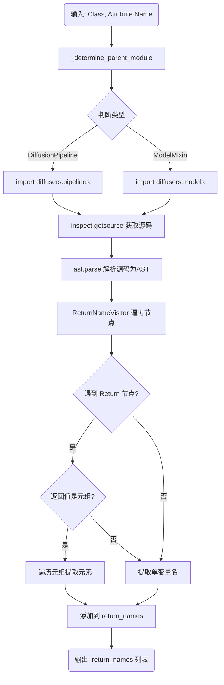
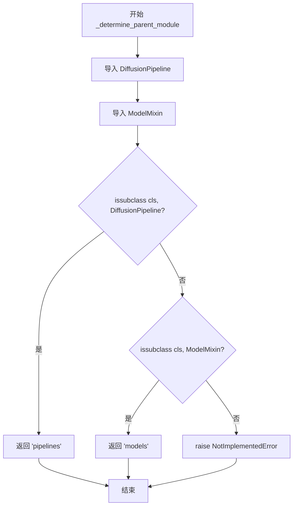
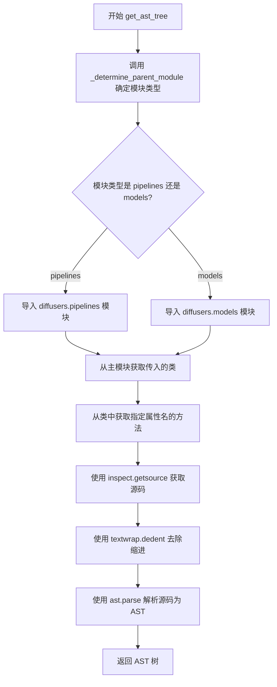
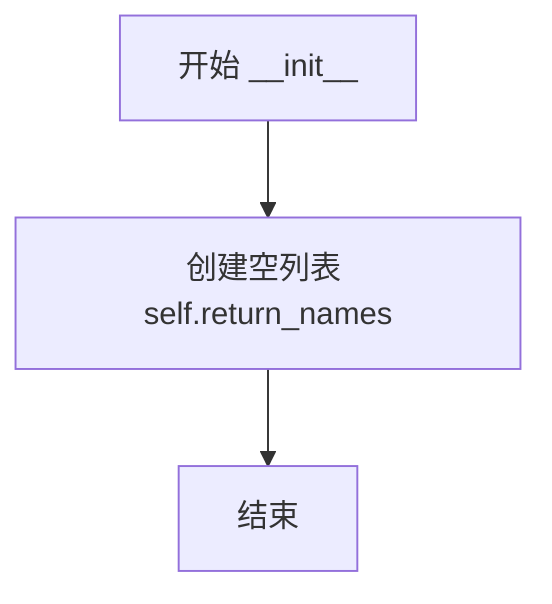
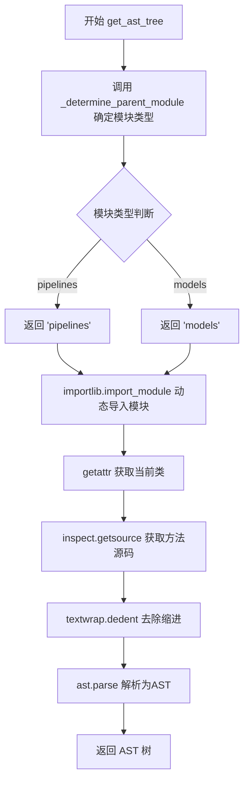

# `diffusers\src\diffusers\utils\source_code_parsing_utils.py` 详细设计文档

一个基于Python AST（抽象语法树）的静态代码分析工具，用于检查Hugging Face Diffusers库中的Pipeline或Model类，具体功能是提取指定方法（如encode_prompt）返回值中的变量名。

## 整体流程



## 类结构

```
ast.NodeVisitor (Python 标准库基类)
└── ReturnNameVisitor (自定义 AST 访问器)
```

## 全局变量及字段


### `ast`
    
Python标准库，用于将Python源代码解析为抽象语法树(AST)

类型：`module`
    


### `importlib`
    
Python标准库，用于动态导入模块

类型：`module`
    


### `inspect`
    
Python标准库，用于获取对象的源代码信息

类型：`module`
    


### `textwrap`
    
Python标准库，用于去除文本缩进

类型：`module`
    


### `diffusers`
    
Hugging Face的扩散模型库，作为外部依赖被导入用于类型判断

类型：`external dependency`
    


### `ReturnNameVisitor.return_names`
    
存储提取到的返回值变量名

类型：`List[str]`
    
    

## 全局函数及方法


### `ReturnNameVisitor.__init__`

初始化 `ReturnNameVisitor` 类的实例。在创建该类的对象时，会自动调用此方法，创建一个名为 `return_names` 的空列表，用于在后续的 AST 遍历过程中存储函数或方法的返回值名称。

参数：

- `self`：`ReturnNameVisitor`，代表当前创建的类实例本身。

返回值：`None`，`__init__` 方法不返回任何值，仅用于初始化对象状态。

#### 流程图

```mermaid
graph TD
    A([开始初始化]) --> B[创建实例属性 return_names]
    B --> C[将空列表 [] 赋值给 self.return_names]
    C --> D([结束])
```

#### 带注释源码

```python
def __init__(self):
    # 初始化一个空列表，用于存放被遍历到的返回值名称（变量名或表达式字符串）
    self.return_names = []
```


### `ReturnNameVisitor.visit_Return`

该方法用于访问Python抽象语法树（AST）中的返回节点（Return node），提取函数或方法的返回值名称，支持单个返回值和元组解包场景，并将结果存储到实例变量中。

参数：

- `node`：`ast.Return`，表示AST树中的返回节点

返回值：`None`，该方法通过修改实例变量 `self.return_names` 来输出结果，不直接返回值

#### 流程图

```mermaid
flowchart TD
    A[开始访问 Return 节点] --> B{node.value 是否为元组?}
    B -->|是| C[遍历元组元素]
    B -->|否| D{node.value 是否为 Name?}
    
    C --> E{当前元素是否为 Name?}
    E -->|是| F[添加 elt.id 到列表]
    E -->|否| G[尝试 ast.unparse 解析]
    G --> H{解析成功?}
    H -->|是| I[添加解析结果]
    H -->|否| J[添加 str(elt)]
    
    D -->|是| K[添加 node.value.id]
    D -->|否| L[尝试 ast.unparse 解析]
    L --> M{解析成功?}
    M -->|是| N[添加解析结果]
    M -->|否| O[添加 str(node.value)]
    
    F --> P[调用 generic_visit 继续遍历]
    I --> P
    J --> P
    K --> P
    N --> P
    O --> P
    P --> Q[结束]
```

#### 带注释源码

```python
def visit_Return(self, node):
    # 检查返回的值是否是一个元组（如 return a, b, c）
    if isinstance(node.value, ast.Tuple):
        # 遍历元组中的每个元素
        for elt in node.value.elts:
            # 如果元素是名称节点（如变量名）
            if isinstance(elt, ast.Name):
                # 直接添加变量名标识符
                self.return_names.append(elt.id)
            else:
                # 尝试将复杂表达式解析为字符串
                try:
                    # 使用 ast.unparse 将 AST 节点转回代码字符串
                    self.return_names.append(ast.unparse(elt))
                except Exception:
                    # 解析失败时，直接使用对象的字符串表示
                    self.return_names.append(str(elt))
    else:
        # 非元组情况：检查返回值是否为简单的名称节点
        if isinstance(node.value, ast.Name):
            # 添加变量名标识符
            self.return_names.append(node.value.id)
        else:
            # 尝试解析复杂表达式
            try:
                # 使用 ast.unparse 将 AST 节点转回代码字符串
                self.return_names.append(ast.unparse(node.value))
            except Exception:
                # 解析失败时，使用字符串表示作为后备
                self.return_names.append(str(node.value))
    
    # 继续遍历AST树的其他节点
    self.generic_visit(node)
```


### `ReturnNameVisitor._determine_parent_module`

该方法用于确定给定类（cls）在 diffusers 库中的父模块类型，根据类的继承关系判断它是属于 `pipelines` 模块还是 `models` 模块，以便后续获取对应的源代码进行 AST 分析。

参数：

- `cls`：`type`，要检查的类对象，用于判断其继承自 DiffusionPipeline 还是 ModelMixin

返回值：`str`，返回字符串 "pipelines" 表示该类属于管道模块，返回 "models" 表示该类属于模型模块

#### 流程图



#### 带注释源码

```python
def _determine_parent_module(self, cls):
    """
    根据类的继承关系确定其在 diffusers 库中的父模块类别。
    
    参数:
        cls: 要检查的类对象，应为 type 类型
    
    返回:
        str: 'pipelines' 或 'models'，表示类所属的模块类型
    
    异常:
        NotImplementedError: 当类既不是 DiffusionPipeline 也不是 ModelMixin 的子类时抛出
    """
    # 从 diffusers 库中导入 DiffusionPipeline 类
    # DiffusionPipeline 是所有扩散流水线的基类
    from diffusers import DiffusionPipeline
    
    # 从 diffusers.models.modeling_utils 中导入 ModelMixin 类
    # ModelMixin 是所有模型混合类的基类
    from diffusers.models.modeling_utils import ModelMixin

    # 检查传入的类是否是 DiffusionPipeline 的子类
    # 如果是，说明该类是一个扩散流水线组件
    if issubclass(cls, DiffusionPipeline):
        # 返回 'pipelines' 字符串，表示该类属于管道模块
        return "pipelines"
    
    # 检查传入的类是否是 ModelMixin 的子类
    # 如果是，说明该类是一个模型组件
    elif issubclass(cls, ModelMixin):
        # 返回 'models' 字符串，表示该类属于模型模块
        return "models"
    
    # 如果类既不是 DiffusionPipeline 也不是 ModelMixin 的子类
    # 则抛出 NotImplementedError，表示暂不支持该类型的类
    else:
        raise NotImplementedError
```


### `ReturnNameVisitor.get_ast_tree`

该方法用于获取指定类中特定方法的源代码，并将其解析为 Python 抽象语法树（AST）。它首先根据传入的类确定其所属的模块（pipelines 或 models），然后通过 `inspect` 模块获取源代码，最后使用 `ast.parse` 将源代码转换为 AST 树结构返回。

参数：

- `cls`：要分析的类对象，用于确定所属的模块类型
- `attribute_name`：字符串类型，默认为 "encode_prompt"，指定要获取源代码的方法或属性的名称

返回值：`ast.Module`，解析后的 Python 抽象语法树对象，包含了源代码的语法结构信息

#### 流程图



#### 带注释源码

```python
def get_ast_tree(self, cls, attribute_name="encode_prompt"):
    """
    获取指定类中方法的源代码并解析为 AST 树
    
    参数:
        cls: 类对象，用于确定所属的模块类型（pipelines 或 models）
        attribute_name: 字符串，默认为 "encode_prompt"，要获取源码的方法名
    
    返回:
        ast.Module: 解析后的抽象语法树对象
    """
    
    # Step 1: 确定类所属的模块类型（pipelines 或 models）
    # 调用内部方法 _determine_parent_module 来判断
    parent_module_name = self._determine_parent_module(cls)
    
    # Step 2: 根据模块类型动态导入对应的 diffusers 子模块
    # parent_module_name 可以是 "pipelines" 或 "models"
    main_module = importlib.import_module(f"diffusers.{parent_module_name}")
    
    # Step 3: 从导入的模块中获取传入类本身
    # 通过类名从主模块中获取类定义
    current_cls_module = getattr(main_module, cls.__name__)
    
    # Step 4: 获取指定方法/属性的源代码
    # 使用 inspect.getsource 获取方法的源码字符串
    source_code = inspect.getsource(getattr(current_cls_module, attribute_name))
    
    # Step 5: 去除源代码的缩进
    # textwrap.dedent 会移除所有行的一致缩进，使代码格式更整洁
    source_code = textwrap.dedent(source_code)
    
    # Step 6: 解析源代码为 AST 树
    # ast.parse 将源代码字符串解析为抽象语法树（AST）节点
    tree = ast.parse(source_code)
    
    # Step 7: 返回解析后的 AST 树
    return tree
```


### `ReturnNameVisitor.__init__`

初始化 ReturnNameVisitor 实例，创建一个空列表用于存储 AST 访问过程中收集到的返回值变量名称。

参数：

- `self`：无（Python 实例方法隐式参数），当前实例对象本身

返回值：`None`，Python 的 `__init__` 方法不返回值，默认返回 None

#### 流程图



#### 带注释源码

```python
def __init__(self):
    """初始化 ReturnNameVisitor 实例。
    
    创建一个空列表用于后续在 visit_Return 方法中收集
    函数返回值的变量名称。
    """
    self.return_names = []  # 初始化空列表，用于存储返回值名称
```


### `ReturnNameVisitor.visit_Return`

该方法重写了 `ast.NodeVisitor` 类中的 `visit_Return` 方法，用于访问 Python 抽象语法树（AST）中的 `return` 语句节点。其核心功能是提取 `return` 语句中返回的变量名称或表达式，并根据返回值是单个变量还是元组（tuple）进行相应处理，最终将结果追加到 `self.return_names` 列表中。

参数：

-  `node`：`ast.Return`，表示当前遍历到的 `return` 语句节点。

返回值：`None`，该方法没有显式的返回值，主要通过修改类属性 `self.return_names` 来输出结果。

#### 流程图

```mermaid
flowchart TD
    A([开始访问 Return 节点]) --> B{node.value 是否为\nast.Tuple?}
    
    %% 分支：是元组
    B -- 是 --> C[遍历元组中的每个元素 elt]
    C --> D{elt 是否为\nast.Name?}
    D -- 是 --> E[追加 elt.id 到列表]
    D -- 否 --> F{尝试执行\nast.unparse(elt)}
    F -- 成功 --> G[追加 unparse 结果]
    F -- 异常 --> H[追加 str(elt)]
    
    %% 分支：非元组
    B -- 否 --> I{node.value 是否为\nast.Name?}
    I -- 是 --> J[追加 node.value.id]
    I -- 否 --> K{尝试执行\nast.unparse(node.value)}
    K -- 成功 --> L[追加 unparse 结果]
    K -- 异常 --> M[追加 str(node.value)]
    
    %% 汇合
    E --> N[调用 generic_visit]
    G --> N
    H --> N
    J --> N
    L --> N
    M --> N
    
    N --> Z([结束])
```

#### 带注释源码

```python
def visit_Return(self, node):
    # 检查返回值是否是一个元组（例如：return a, b）
    if isinstance(node.value, ast.Tuple):
        # 遍历元组中的每一个元素
        for elt in node.value.elts:
            # 如果元素是一个变量名（ast.Name），直接获取其标识符
            if isinstance(elt, ast.Name):
                self.return_names.append(elt.id)
            else:
                # 如果是表达式（如函数调用、运算表达式），尝试将其解析为字符串
                try:
                    self.return_names.append(ast.unparse(elt))
                except Exception:
                    # 如果解析失败，转换为字符串保存
                    self.return_names.append(str(elt))
    else:
        # 如果返回值不是一个元组，则处理单值返回
        if isinstance(node.value, ast.Name):
            self.return_names.append(node.value.id)
        else:
            try:
                self.return_names.append(ast.unparse(node.value))
            except Exception:
                self.return_names.append(str(node.value))
    
    # 继续遍历子节点（虽然 return 节点通常没有需要进一步遍历的子节点，但符合 Visitor 模式规范）
    self.generic_visit(node)
```


### `ReturnNameVisitor._determine_parent_module`

该方法用于判断传入的类是属于 diffusers 库中的 pipelines 模块还是 models 模块，通过检查类的继承关系来确定其父模块类型。

参数：

- `cls`：`type`，要检查的类，用于判断其属于 pipelines 还是 models 模块

返回值：`str`，返回 "pipelines" 或 "models" 字符串，表示类所属的父模块类型

#### 流程图

```mermaid
flowchart TD
    A[开始] --> B[导入 DiffusionPipeline 和 ModelMixin]
    B --> C{检查 cls 是否为 DiffusionPipeline 的子类}
    C -->|是| D[返回 "pipelines"]
    C -->|否| E{检查 cls 是否为 ModelMixin 的子类}
    E -->|是| F[返回 "models"]
    E -->|否| G[抛出 NotImplementedError 异常]
    D --> H[结束]
    F --> H
    G --> H
```

#### 带注释源码

```python
def _determine_parent_module(self, cls):
    """
    确定给定类属于哪个父模块（pipelines 或 models）。

    参数:
        cls: 要检查的类对象

    返回:
        str: 返回 "pipelines" 或 "models"

    异常:
        NotImplementedError: 当类既不是 DiffusionPipeline 也不是 ModelMixin 的子类时抛出
    """
    # 导入 diffusers 库中的核心类
    from diffusers import DiffusionPipeline
    from diffusers.models.modeling_utils import ModelMixin

    # 检查传入的类是否是 DiffusionPipeline 的子类
    if issubclass(cls, DiffusionPipeline):
        # 如果是 DiffusionPipeline 的子类，返回 "pipelines"
        return "pipelines"
    # 检查传入的类是否是 ModelMixin 的子类
    elif issubclass(cls, ModelMixin):
        # 如果是 ModelMixin 的子类，返回 "models"
        return "models"
    else:
        # 如果既不是 pipelines 也不是 models 类型的类，抛出未实现异常
        raise NotImplementedError
```


### `ReturnNameVisitor.get_ast_tree`

该方法通过动态导入diffusers库中的指定类和方法，获取其源代码并解析为Python抽象语法树（AST），主要用于分析目标方法的代码结构。

参数：

- `cls`：`type`，需要分析的类对象（应为DiffusionPipeline或ModelMixin的子类）
- `attribute_name`：`str`，要获取源代码的方法名称，默认为"encode_prompt"

返回值：`ast.Module`，返回解析后的Python抽象语法树（AST）节点对象

#### 流程图



#### 带注释源码

```python
def get_ast_tree(self, cls, attribute_name="encode_prompt"):
    """
    获取指定类的方法源代码并解析为AST树
    
    参数:
        cls: 需要分析的类对象
        attribute_name: 方法名称，默认为 "encode_prompt"
    
    返回:
        ast.Module: 解析后的抽象语法树
    """
    # 第一步：根据类类型确定父模块名称（pipelines 或 models）
    parent_module_name = self._determine_parent_module(cls)
    
    # 第二步：动态导入diffusers库中的对应模块
    main_module = importlib.import_module(f"diffusers.{parent_module_name}")
    
    # 第三步：从模块中获取目标类
    current_cls_module = getattr(main_module, cls.__name__)
    
    # 第四步：使用inspect获取指定方法的源代码字符串
    source_code = inspect.getsource(getattr(current_cls_module, attribute_name))
    
    # 第五步：使用textwrap去除源代码的公共缩进
    source_code = textwrap.dedent(source_code)
    
    # 第六步：解析源代码为Python AST树
    tree = ast.parse(source_code)
    
    # 返回AST树供后续分析使用
    return tree
```

## 关键组件


### ReturnNameVisitor 类

AST（抽象语法树）访问器类，用于遍历Python代码的语法树，提取函数返回语句中的变量名称。支持处理单个返回值和元组返回值，并将结果存储在return_names列表中。

### _determine_parent_module 方法

逻辑判断方法，根据传入的类判断其属于diffusers库的哪个父模块。如果类是DiffusionPipeline的子类则返回"pipelines"，如果是ModelMixin的子类则返回"models"，否则抛出NotImplementedError异常。

### get_ast_tree 方法

源代码解析方法，根据传入的类和属性名（如"encode_prompt"）获取对应的源代码，并使用textwrap.dedent去除缩进，最后通过ast.parse解析为抽象语法树（AST）返回。

### visit_Return 方法

AST访问方法，专门处理Return节点。当返回值是元组时，遍历所有元素提取名称；否则直接提取返回值名称。使用ast.unparse尝试将复杂表达式转为字符串，失败时降级为str转换。


## 问题及建议


### 已知问题

- **异常处理过于宽泛**：在 `visit_Return` 方法中使用裸 `except Exception` 捕获所有异常，这种做法会隐藏潜在的真实错误信息，不利于调试和维护。
- **运行时动态导入**：`_determine_parent_module` 和 `get_ast_tree` 方法内部每次调用时都执行 `import` 语句，导致重复的模块加载开销，应将 import 语句提升至模块顶部。
- **异常类型使用不当**：`_determine_parent_module` 中对未知类型抛出 `NotImplementedError`，但这更像是业务逻辑错误，使用 `ValueError` 或自定义异常更为恰当。
- **缺乏输入校验**：未对 `cls` 参数进行类型检查，直接调用 `issubclass` 可能导致 `TypeError`；也未对 `attribute_name` 参数的有效性进行校验。
- **未实现缓存机制**：`get_ast_tree` 方法每次调用都会重新解析源代码，对于相同类和方法会重复执行 AST 解析操作，造成性能浪费。
- **Python 版本兼容性问题**：代码使用了 `ast.unparse`（Python 3.9+ 才有的功能），在低版本 Python 环境中会失败。
- **缺少错误处理**：`get_ast_tree` 中 `getattr(current_cls_module, attribute_name)` 若属性不存在会抛出 `AttributeError`，缺乏友好错误提示。
- **方法职责不单一**：`_determine_parent_module` 既判断类型又返回模块名，违反了单一职责原则，且对 DiffusionPipeline 和 ModelMixin 的判断逻辑缺乏扩展性。

### 优化建议

- 将 diffusers 相关的 import 语句移至文件顶部，或使用延迟导入配合缓存机制。
- 使用 `except (AttributeError, TypeError) as e` 替代宽泛的异常捕获，并保留原始错误信息。
- 将 `_determine_parent_module` 拆分为独立的方法，并使用 `ValueError` 替代 `NotImplementedError`，同时添加类型检查。
- 为 `get_ast_tree` 添加异常处理，为缺失的属性提供清晰的错误信息。
- 实现缓存机制（如使用 `functools.lru_cache` 或类级缓存字典）存储已解析的 AST 树。
- 添加 Python 版本检查或使用 `ast.dump` + 自定义解析作为 3.9 以下版本的兼容方案。
- 添加必要的类型注解和文档字符串，提升代码可读性和可维护性。
- 将 `_determine_parent_module` 的判断逻辑改为基于配置或注册机制，提高扩展性。


## 其它


### 设计目标与约束

该代码旨在通过静态分析技术自动提取diffusers库中指定类方法的返回值名称，支持DiffusionPipeline和ModelMixin两种类型的类。设计约束包括仅支持Python 3.9+（因ast.unparse在Python 3.9引入），仅针对diffusers库特定模块（pipelines和models），且假设目标方法存在并可被检查源码。

### 错误处理与异常设计

代码包含三层错误处理机制：1）visit_Return方法中使用try-except捕获ast.unparse异常并降级为str(node.value)；2）_determine_parent_module中使用issubclass检查并抛出NotImplementedError处理未知类类型；3）get_ast_tree中假设importlib和inspect操作成功，未做额外异常包装。潜在改进：增加ImportError、AttributeError、OSError（文件读取）的捕获。

### 数据流与状态机

数据流为：输入类cls → _determine_parent_module确定模块类型 → get_ast_tree加载源码并解析AST → visit_Return遍历所有Return节点 → 收集return_names列表。无复杂状态机，仅维护return_names的累积状态。

### 外部依赖与接口契约

显式依赖：ast（标准库）、importlib（标准库）、inspect（标准库）、textwrap（标准库）、diffusers库（运行时导入）。接口契约：_determine_parent_module接收cls参数返回"pipelines"或"models"字符串；get_ast_tree接收cls和attribute_name参数返回ast.tree对象；visit_Return接收ast.Return节点无返回值仅填充self.return_names。

### 性能考虑

当前实现每次调用get_ast_tree都会重新导入模块和获取源码，无缓存机制。inspect.getsource在频繁调用时有I/O开销。优化建议：添加模块级缓存或让调用方缓存tree结果。

### 安全性考虑

代码通过importlib动态导入diffusers子模块，假设输入cls来自可信来源。inspect.getsource可能读取任意可访问的Python源码，无路径遍历防护但受限于diffusers库结构。

### 测试策略

建议覆盖场景：1）单返回值Name类型；2）多返回值Tuple类型；3）复杂表达式返回值；4）DiffusionPipeline和ModelMixin子类识别；5）NotImplementedError触发条件；6）无效attribute_name的异常传播。

### 使用示例

```python
from diffusers import StableDiffusionPipeline
visitor = ReturnNameVisitor()
tree = visitor.get_ast_tree(StableDiffusionPipeline, "encode_prompt")
visitor.visit(tree)
print(visitor.return_names)  # 输出返回值名称列表
```

### 已知限制

1. 仅支持Python 3.9+；2. 只能处理diffusers库中的pipelines和models模块；3. ast.unparse可能无法处理所有Python语法；4. 静态分析无法获取运行时动态返回值；5. 不支持继承链上父类方法的返回值提取。

### 版本兼容性

依赖diffusers库版本变化：DiffusionPipeline和ModelMixin的模块路径可能随版本变化，当前代码硬编码为"diffusers.pipelines"和"diffusers.models.modeling_utils"。

    