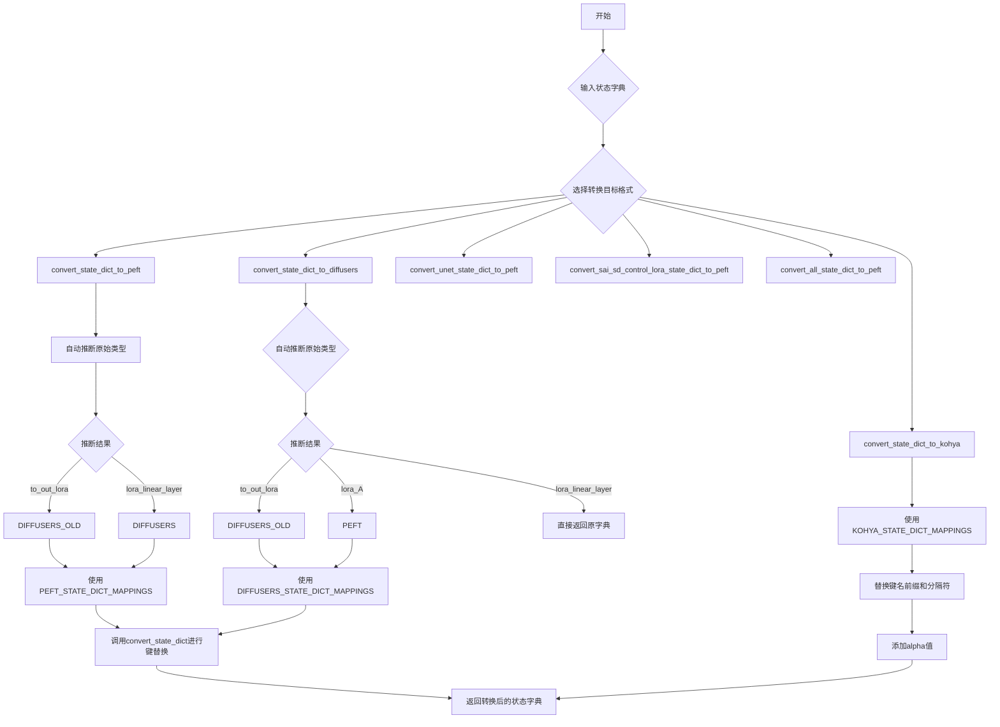
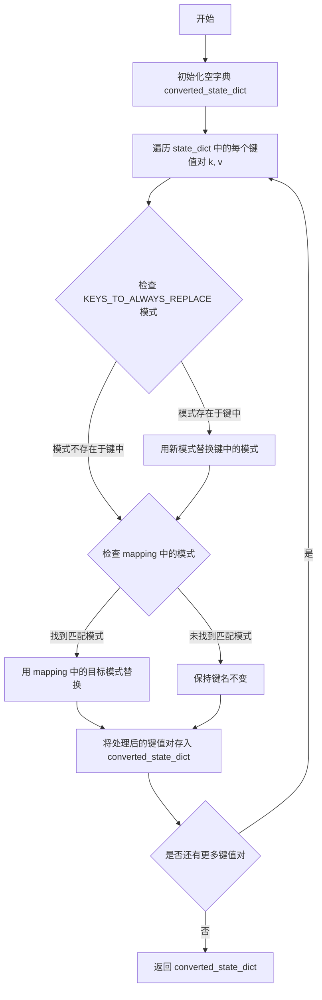
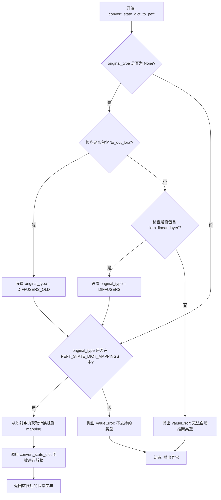
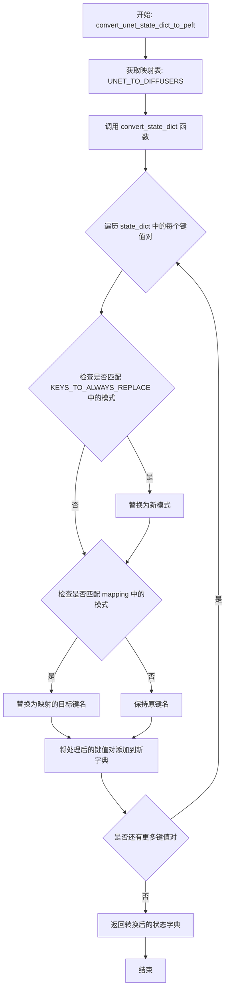
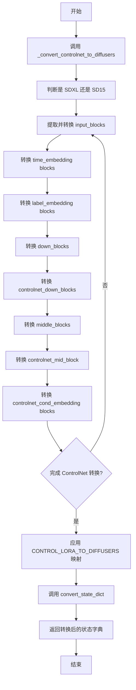
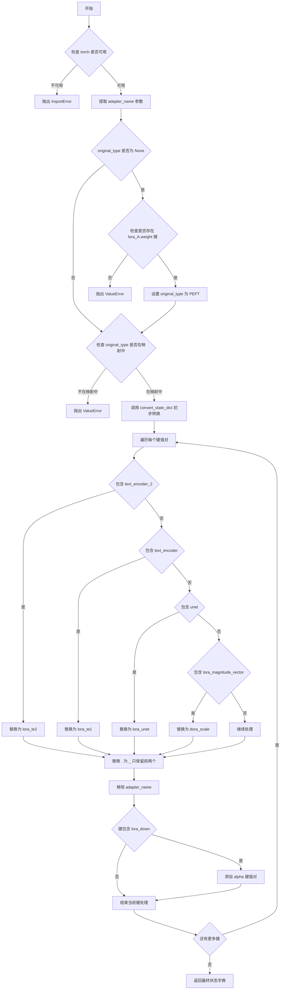
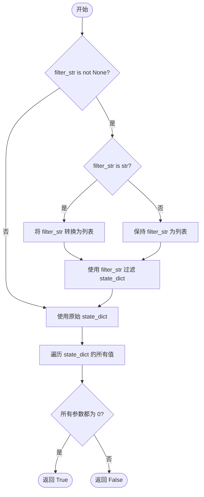
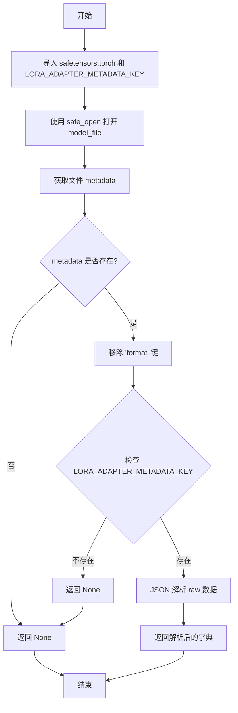

# `diffusers\src\diffusers\utils\state_dict_utils.py` 详细设计文档

提供在不同的LoRA状态字典格式之间进行转换的实用工具函数，支持Diffusers旧格式、Diffusers新格式、PEFT格式和Kohya SS格式之间的相互转换，主要用于扩散模型（如Stable Diffusion）的LoRA权重管理。

## 整体流程



## 类结构

```
无类层次结构（本文件为模块文件，仅包含函数和全局变量）
StateDictType (枚举类)
└── DIFFUSERS_OLD, KOHYA_SS, PEFT, DIFFUSERS
```

## 全局变量及字段


### `UNET_TO_DIFFUSERS`
    
映射字典，用于将UNet的LoRA权重键转换为Diffusers格式

类型：`dict[str, str]`
    


### `CONTROL_LORA_TO_DIFFUSERS`
    
映射字典，用于将ControlNet的LoRA权重键转换为Diffusers格式

类型：`dict[str, str]`
    


### `DIFFUSERS_TO_PEFT`
    
映射字典，用于将Diffusers格式的LoRA权重键转换为PEFT格式

类型：`dict[str, str]`
    


### `DIFFUSERS_OLD_TO_PEFT`
    
映射字典，用于将旧版Diffusers格式的LoRA权重键转换为PEFT格式

类型：`dict[str, str]`
    


### `PEFT_TO_DIFFUSERS`
    
映射字典，用于将PEFT格式的LoRA权重键转换为Diffusers格式

类型：`dict[str, str]`
    


### `DIFFUSERS_OLD_TO_DIFFUSERS`
    
映射字典，用于将旧版Diffusers格式转换为新版Diffusers格式

类型：`dict[str, str]`
    


### `PEFT_TO_KOHYA_SS`
    
映射字典，用于将PEFT格式的LoRA权重键转换为Kohya_ss格式

类型：`dict[str, str]`
    


### `PEFT_STATE_DICT_MAPPINGS`
    
存储PEFT状态字典的类型映射关系

类型：`dict[StateDictType, dict[str, str]]`
    


### `DIFFUSERS_STATE_DICT_MAPPINGS`
    
存储Diffusers状态字典的类型映射关系

类型：`dict[StateDictType, dict[str, str]]`
    


### `KOHYA_STATE_DICT_MAPPINGS`
    
存储Kohya状态字典的类型映射关系

类型：`dict[StateDictType, dict[str, str]]`
    


### `KEYS_TO_ALWAYS_REPLACE`
    
始终需要替换的键值对映射，用于预处理状态字典键

类型：`dict[str, str]`
    


### `logger`
    
模块级日志记录器，用于输出日志信息

类型：`logging.Logger`
    


### `StateDictType.DIFFUSERS_OLD`
    
枚举值，表示旧版Diffusers格式的状态字典类型

类型：`StateDictType`
    


### `StateDictType.KOHYA_SS`
    
枚举值，表示Kohya_ss格式的状态字典类型

类型：`StateDictType`
    


### `StateDictType.PEFT`
    
枚举值，表示PEFT格式的状态字典类型

类型：`StateDictType`
    


### `StateDictType.DIFFUSERS`
    
枚举值，表示新版Diffusers格式的状态字典类型

类型：`StateDictType`
    


    

## 全局函数及方法


### convert_state_dict

这是一个全局工具函数，用于将模型状态字典（state dict）中的键（key）根据指定的映射规则进行替换，实现不同格式（如 Diffusers、PEFT、Kohya 等）模型权重状态字典之间的转换。

参数：

- `state_dict`：`dict[str, torch.Tensor]`，输入的原始状态字典，包含模型权重等参数，键为字符串，值为张量
- `mapping`：`dict[str, str]`，键的替换映射规则，key 为待替换的模式字符串，value 为替换后的目标模式字符串

返回值：`dict`，转换后的状态字典，键已根据 mapping 规则进行替换，值保持不变

#### 流程图



#### 带注释源码

```
def convert_state_dict(state_dict, mapping):
    r"""
    简单遍历状态字典，并根据 mapping 中的规则替换键名
    
    参数:
        state_dict: 待转换的状态字典，键为字符串，值为 torch.Tensor
        mapping: 替换规则字典，key 是待替换的字符串模式，value 是替换后的目标字符串
    
    返回:
        converted_state_dict: 转换后的状态字典
    """
    # 初始化结果字典
    converted_state_dict = {}
    
    # 遍历原始状态字典中的每个键值对
    for k, v in state_dict.items():
        # 首先处理需要始终替换的键名模式
        # 例如：将 ".processor." 替换为 "."
        for pattern in KEYS_TO_ALWAYS_REPLACE.keys():
            if pattern in k:
                new_pattern = KEYS_TO_ALWAYS_REPLACE[pattern]
                k = k.replace(pattern, new_pattern)

        # 遍历传入的映射规则，查找第一个匹配的模式进行替换
        # 只执行第一次匹配，匹配后跳出循环
        for pattern in mapping.keys():
            if pattern in k:
                new_pattern = mapping[pattern]
                k = k.replace(pattern, new_pattern)
                break
        
        # 将处理后的键值对存入结果字典
        converted_state_dict[k] = v
    
    return converted_state_dict
```


### `convert_state_dict_to_peft`

该函数用于将不同格式的模型状态字典（state dict）转换为 PEFT（Parameter-Efficient Fine-Tuning）格式。目前支持从旧版 Diffusers 格式（DIFFUSERS_OLD）和新版 Diffusers 格式（DIFFUSERS）转换为 PEFT 格式。如果未提供原始状态字典的类型，函数会尝试根据键名自动推断。

参数：

- `state_dict`：`dict[str, torch.Tensor]`，需要转换的模型状态字典，键为字符串（参数名称），值为 PyTorch 张量
- `original_type`：`StateDictType`，可选参数，原始状态字典的类型（DIFFUSERS_OLD 或 DIFFUSERS），如果不提供则自动推断
- `**kwargs`：额外的关键字参数，目前未被使用，为未来扩展预留

返回值：`dict`，转换后的 PEFT 格式状态字典

#### 流程图



#### 带注释源码

```python
def convert_state_dict_to_peft(state_dict, original_type=None, **kwargs):
    r"""
    Converts a state dict to the PEFT format The state dict can be from previous diffusers format (`OLD_DIFFUSERS`), or
    new diffusers format (`DIFFUSERS`). The method only supports the conversion from diffusers old/new to PEFT for now.

    Args:
        state_dict (`dict[str, torch.Tensor]`):
            The state dict to convert.
        original_type (`StateDictType`, *optional*):
            The original type of the state dict, if not provided, the method will try to infer it automatically.
    """
    # 如果未指定原始类型，尝试自动推断
    if original_type is None:
        # 检查是否包含旧版 Diffusers 格式的键（包含 'to_out_lora'）
        if any("to_out_lora" in k for k in state_dict.keys()):
            original_type = StateDictType.DIFFUSERS_OLD
        # 检查是否包含新版 Diffusers 格式的键（包含 'lora_linear_layer'）
        elif any("lora_linear_layer" in k for k in state_dict.keys()):
            original_type = StateDictType.DIFFUSERS
        else:
            # 无法自动推断类型，抛出错误
            raise ValueError("Could not automatically infer state dict type")

    # 验证原始类型是否在支持列表中
    if original_type not in PEFT_STATE_DICT_MAPPINGS.keys():
        raise ValueError(f"Original type {original_type} is not supported")

    # 根据原始类型获取对应的转换映射规则
    mapping = PEFT_STATE_DICT_MAPPINGS[original_type]
    # 调用通用转换函数进行实际的键名替换转换
    return convert_state_dict(state_dict, mapping)
```


### `convert_state_dict_to_diffusers`

将不同来源（如旧版 Diffusers 或 PEFT 格式）的模型状态字典（State Dict）转换为新版 Diffusers 格式。如果状态字典已经是新版 Diffusers 格式，则直接返回原字典。该函数支持自动类型推断或显式指定类型，并利用预定义的映射表对键名进行替换。

参数：
- `state_dict`：`dict[str, torch.Tensor]`，待转换的模型状态字典，键为参数名称，值为 Tensor。
- `original_type`：`StateDictType`，可选参数，指定输入状态字典的原始类型（`DIFFUSERS_OLD` 或 `PEFT`）。如果未提供，函数将尝试根据键名自动推断。
- `kwargs`：`dict`，可选的额外关键字参数。
    - `adapter_name`：`str`，当输入为 PEFT 格式时，用于处理带适配器名称前缀的键名。

返回值：`dict[str, torch.Tensor]`，转换后的新版 Diffusers 格式状态字典。

#### 流程图

```mermaid
flowchart TD
    A[开始: convert_state_dict_to_diffusers] --> B{提供 adapter_name?}
    B -- 是 --> C[格式化 adapter_name 前缀]
    B -- 否 --> D[peft_adapter_name 设为空]
    C --> E{提供 original_type?}
    D --> E
    
    E -- 是 --> F[使用指定的 original_type]
    E -- 否 --> G{检测键名: 'to_out_lora'}
    G -- 存在 --> H[推断为 DIFFUSERS_OLD]
    G -- 不存在 --> I{检测键名: '.lora_A{peft_adapter_name}.weight'}
    I -- 存在 --> J[推断为 PEFT]
    I -- 不存在 --> K{检测键名: 'lora_linear_layer'}
    K -- 存在 --> L[直接返回原 state_dict]
    K -- 不存在 --> M[抛出 ValueError: 无法推断类型]
    
    F --> N{original_type 是否在映射表中?}
    H --> N
    J --> N
    M --> O[抛出 ValueError: 不支持的类型]
    
    N -- 是 --> P[获取对应映射规则 mapping]
    P --> Q[调用通用转换函数 convert_state_dict]
    Q --> R[返回转换后的 state_dict]
```

#### 带注释源码

```python
def convert_state_dict_to_diffusers(state_dict, original_type=None, **kwargs):
    r"""
    Converts a state dict to new diffusers format. The state dict can be from previous diffusers format
    (`OLD_DIFFUSERS`), or PEFT format (`PEFT`) or new diffusers format (`DIFFUSERS`). In the last case the method will
    return the state dict as is.

    The method only supports the conversion from diffusers old, PEFT to diffusers new for now.

    Args:
        state_dict (`dict[str, torch.Tensor]`):
            The state dict to convert.
        original_type (`StateDictType`, *optional*):
            The original type of the state dict, if not provided, the method will try to infer it automatically.
        kwargs (`dict`, *args*):
            Additional arguments to pass to the method.

            - **adapter_name**: For example, in case of PEFT, some keys will be prepended
                with the adapter name, therefore needs a special handling. By default PEFT also takes care of that in
                `get_peft_model_state_dict` method:
                https://github.com/huggingface/peft/blob/ba0477f2985b1ba311b83459d29895c809404e99/src/peft/utils/save_and_load.py#L92
                but we add it here in case we don't want to rely on that method.
    """
    # 1. 处理适配器名称
    peft_adapter_name = kwargs.pop("adapter_name", None)
    if peft_adapter_name is not None:
        peft_adapter_name = "." + peft_adapter_name
    else:
        peft_adapter_name = ""

    # 2. 自动推断原始类型
    if original_type is None:
        # 检查是否包含旧版 Diffusers 的特征键
        if any("to_out_lora" in k for k in state_dict.keys()):
            original_type = StateDictType.DIFFUSERS_OLD
        # 检查是否包含 PEFT 的特征键 (带有适配器名称后缀)
        elif any(f".lora_A{peft_adapter_name}.weight" in k for k in state_dict.keys()):
            original_type = StateDictType.PEFT
        # 检查是否已经新版 Diffusers 格式
        elif any("lora_linear_layer" in k for k in state_dict.keys()):
            # nothing to do
            return state_dict
        else:
            raise ValueError("Could not automatically infer state dict type")

    # 3. 验证类型并获取映射规则
    if original_type not in DIFFUSERS_STATE_DICT_MAPPINGS.keys():
        raise ValueError(f"Original type {original_type} is not supported")

    mapping = DIFFUSERS_STATE_DICT_MAPPINGS[original_type]
    
    # 4. 执行具体的键名转换
    return convert_state_dict(state_dict, mapping)
```


### `convert_unet_state_dict_to_peft`

将 UNet 格式的状态字典转换为 PEFT 格式，通过使用预定义的 UNET_TO_DIFFUSERS 映射替换状态字典中的特定键名，实现从旧版 UNet LoRA 参数命名约定到 Diffusers PEFT 格式的转换。

参数：

- `state_dict`：`dict[str, torch.Tensor]`，需要转换的 UNet 格式状态字典，包含 LoRA 权重参数

返回值：`dict`，转换后的 PEFT 格式状态字典

#### 流程图



#### 带注释源码

```python
def convert_unet_state_dict_to_peft(state_dict):
    r"""
    Converts a state dict from UNet format to diffusers format - i.e. by removing some keys
    
    此函数将 UNet 格式的状态字典转换为 PEFT 格式。UNet 格式使用特定的键名约定
    （如 .to_q_lora.up, .to_out_lora.down 等），需要将其转换为 Diffusers 格式
    （如 .to_q.lora_B, .to_out.0.lora_A 等）。
    
    Args:
        state_dict (dict[str, torch.Tensor]): 
            包含 UNet LoRA 权重参数的状态字典，例如：
            "unet.to_q_lora.up.weight", "unet.to_out_lora.down.weight" 等
    
    Returns:
        dict: 转换后的状态字典，键名已更新为 PEFT 格式
    """
    # 定义 UNet 到 Diffusers 的键名映射关系
    # 例如: ".to_out_lora.up" -> ".to_out.0.lora_B"
    #       ".to_q_lora.down" -> ".to_q.lora_A"
    mapping = UNET_TO_DIFFUSERS
    
    # 调用通用的状态字典转换函数，传入原始字典和映射表
    # 该函数会遍历字典中的每个键，根据映射表进行键名替换
    return convert_state_dict(state_dict, mapping)
```


### `convert_sai_sd_control_lora_state_dict_to_peft`

该函数用于将 SAI SD ControlLoRA 格式的模型状态字典转换为 PEFT 格式。首先调用内部函数 `_convert_controlnet_to_diffusers` 将 ControlNet 部分从 SAI 格式转换为 Diffusers 格式，然后应用 `CONTROL_LORA_TO_DIFFUSERS` 映射将 LoRA 部分转换为 PEFT 格式。

参数：

- `state_dict`：`dict[str, torch.Tensor]`，要转换的状态字典（来自 SAI SD ControlLoRA 格式）

返回值：`dict`，转换后的 PEFT 格式状态字典

#### 流程图



#### 带注释源码

```python
def convert_sai_sd_control_lora_state_dict_to_peft(state_dict):
    """
    将 SAI SD ControlLoRA 格式的状态字典转换为 PEFT 格式
    
    参数:
        state_dict: SAI SD ControlLoRA 格式的状态字典
        
    返回:
        转换后的 PEFT 格式状态字典
    """
    
    def _convert_controlnet_to_diffusers(state_dict):
        """
        内部函数：将 ControlNet 状态字典从 SAI 格式转换为 Diffusers 格式
        
        该函数处理以下转换:
        - 判断是 SDXL 还是 SD15 架构
        - 转换 input_blocks 到 conv_in 和 down_blocks
        - 转换 time_embed 到 time_embedding
        - 转换 label_emb 到 add_embedding
        - 转换 middle_block 到 mid_block
        - 转换 input_hint_block 到 controlnet_cond_embedding
        """
        
        # 1. 判断是 SDXL 还是 SD15
        # SDXL 有 'input_blocks.11.0.in_layers.0.weight' 键，SD15 没有
        is_sdxl = "input_blocks.11.0.in_layers.0.weight" not in state_dict
        logger.info(f"Using ControlNet lora ({'SDXL' if is_sdxl else 'SD15'})")

        # 2. 获取 input blocks 的数量
        num_input_blocks = len({".".join(layer.split(".")[:2]) for layer in state_dict if "input_blocks" in layer})
        
        # 3. 为每个 input block 收集相关的 key
        input_blocks = {
            layer_id: [key for key in state_dict if f"input_blocks.{layer_id}" in key]
            for layer_id in range(num_input_blocks)
        }
        
        layers_per_block = 2  # 每个 block 有 2 层

        # 4. 获取 op blocks 的 key
        op_blocks = [key for key in state_dict if "0.op" in key]

        converted_state_dict = {}

        # 5. 转换 conv_in 层 (input_blocks.0.0 -> conv_in)
        for key in input_blocks[0]:
            diffusers_key = key.replace("input_blocks.0.0", "conv_in")
            converted_state_dict[diffusers_key] = state_dict.get(key)

        # 6. 转换 time embedding blocks (time_embed -> time_embedding)
        time_embedding_blocks = [key for key in state_dict if "time_embed" in key]
        for key in time_embedding_blocks:
            diffusers_key = key.replace("time_embed.0", "time_embedding.linear_1").replace(
                "time_embed.2", "time_embedding.linear_2"
            )
            converted_state_dict[diffusers_key] = state_dict.get(key)

        # 7. 转换 label embedding blocks (label_emb -> add_embedding)
        label_embedding_blocks = [key for key in state_dict if "label_emb" in key]
        for key in label_embedding_blocks:
            diffusers_key = key.replace("label_emb.0.0", "add_embedding.linear_1").replace(
                "label_emb.0.2", "add_embedding.linear_2"
            )
            converted_state_dict[diffusers_key] = state_dict.get(key)

        # 8. 转换 down blocks (input_blocks -> down_blocks)
        for i in range(1, num_input_blocks):
            block_id = (i - 1) // (layers_per_block + 1)
            layer_in_block_id = (i - 1) % (layers_per_block + 1)

            # 转换 resnet 层
            resnets = [
                key for key in input_blocks[i] if f"input_blocks.{i}.0" in key and f"input_blocks.{i}.0.op" not in key
            ]
            for key in resnets:
                diffusers_key = (
                    key.replace("in_layers.0", "norm1")
                    .replace("in_layers.2", "conv1")
                    .replace("out_layers.0", "norm2")
                    .replace("out_layers.3", "conv2")
                    .replace("emb_layers.1", "time_emb_proj")
                    .replace("skip_connection", "conv_shortcut")
                )
                diffusers_key = diffusers_key.replace(
                    f"input_blocks.{i}.0", f"down_blocks.{block_id}.resnets.{layer_in_block_id}"
                )
                converted_state_dict[diffusers_key] = state_dict.get(key)

            # 转换 downsample 层
            if f"input_blocks.{i}.0.op.bias" in state_dict:
                for key in [key for key in op_blocks if f"input_blocks.{i}.0.op" in key]:
                    diffusers_key = key.replace(
                        f"input_blocks.{i}.0.op", f"down_blocks.{block_id}.downsamplers.0.conv"
                    )
                    converted_state_dict[diffusers_key] = state_dict.get(key)

            # 转换 attention 层
            attentions = [key for key in input_blocks[i] if f"input_blocks.{i}.1" in key]
            if attentions:
                for key in attentions:
                    diffusers_key = key.replace(
                        f"input_blocks.{i}.1", f"down_blocks.{block_id}.attentions.{layer_in_block_id}"
                    )
                    converted_state_dict[diffusers_key] = state_dict.get(key)

        # 9. 转换 controlnet down blocks (zero_convs -> controlnet_down_blocks)
        for i in range(num_input_blocks):
            converted_state_dict[f"controlnet_down_blocks.{i}.weight"] = state_dict.get(f"zero_convs.{i}.0.weight")
            converted_state_dict[f"controlnet_down_blocks.{i}.bias"] = state_dict.get(f"zero_convs.{i}.0.bias")

        # 10. 获取 middle blocks 的数量
        num_middle_blocks = len({".".join(layer.split(".")[:2]) for layer in state_dict if "middle_block" in layer})
        middle_blocks = {
            layer_id: [key for key in state_dict if f"middle_block.{layer_id}" in key]
            for layer_id in range(num_middle_blocks)
        }

        # 11. 转换 mid blocks (middle_block -> mid_block)
        for key in middle_blocks.keys():
            diffusers_key = max(key - 1, 0)
            if key % 2 == 0:
                # 偶数索引是 resnet 层
                for k in middle_blocks[key]:
                    diffusers_key_hf = (
                        k.replace("in_layers.0", "norm1")
                        .replace("in_layers.2", "conv1")
                        .replace("out_layers.0", "norm2")
                        .replace("out_layers.3", "conv2")
                        .replace("emb_layers.1", "time_emb_proj")
                        .replace("skip_connection", "conv_shortcut")
                    )
                    diffusers_key_hf = diffusers_key_hf.replace(
                        f"middle_block.{key}", f"mid_block.resnets.{diffusers_key}"
                    )
                    converted_state_dict[diffusers_key_hf] = state_dict.get(k)
            else:
                # 奇数索引是 attention 层
                for k in middle_blocks[key]:
                    diffusers_key_hf = k.replace(f"middle_block.{key}", f"mid_block.attentions.{diffusers_key}")
                    converted_state_dict[diffusers_key_hf] = state_dict.get(k)

        # 12. 转换 mid block 输出
        converted_state_dict["controlnet_mid_block.weight"] = state_dict.get("middle_block_out.0.weight")
        converted_state_dict["controlnet_mid_block.bias"] = state_dict.get("middle_block_out.0.bias")

        # 13. 转换 controlnet cond embedding blocks (input_hint_block -> controlnet_cond_embedding)
        cond_embedding_blocks = {
            ".".join(layer.split(".")[:2])
            for layer in state_dict
            if "input_hint_block" in layer
            and ("input_hint_block.0" not in layer)
            and ("input_hint_block.14" not in layer)
        }
        num_cond_embedding_blocks = len(cond_embedding_blocks)

        for idx in range(1, num_cond_embedding_blocks + 1):
            diffusers_idx = idx - 1
            cond_block_id = 2 * idx

            converted_state_dict[f"controlnet_cond_embedding.blocks.{diffusers_idx}.weight"] = state_dict.get(
                f"input_hint_block.{cond_block_id}.weight"
            )
            converted_state_dict[f"controlnet_cond_embedding.blocks.{diffusers_idx}.bias"] = state_dict.get(
                f"input_hint_block.{cond_block_id}.bias"
            )

        # 14. 转换 cond embedding 的输入和输出层
        for key in [key for key in state_dict if "input_hint_block.0" in key]:
            diffusers_key = key.replace("input_hint_block.0", "controlnet_cond_embedding.conv_in")
            converted_state_dict[diffusers_key] = state_dict.get(key)

        for key in [key for key in state_dict if "input_hint_block.14" in key]:
            diffusers_key = key.replace("input_hint_block.14", "controlnet_cond_embedding.conv_out")
            converted_state_dict[diffusers_key] = state_dict.get(key)

        return converted_state_dict

    # 主函数逻辑：
    # 步骤1: 将 ControlNet 部分从 SAI 格式转换为 Diffusers 格式
    state_dict = _convert_controlnet_to_diffusers(state_dict)
    
    # 步骤2: 应用 CONTROL_LORA_TO_DIFFUSERS 映射，将 LoRA 部分转换为 PEFT 格式
    mapping = CONTROL_LORA_TO_DIFFUSERS
    
    # 步骤3: 调用通用的状态字典转换函数
    return convert_state_dict(state_dict, mapping)
```


### `convert_all_state_dict_to_peft`

将 Diffusers 格式的状态字典转换为 PEFT 格式。首先尝试使用 `convert_state_dict_to_peft` 进行转换，如果无法自动推断状态字典类型，则回退到使用 `convert_unet_state_dict_to_peft` 进行 UNet 格式的转换。最终验证转换结果中是否包含 `lora_A` 或 `lora_B` 键，以确保转换成功。

参数：

- `state_dict`：`dict[str, torch.Tensor]`，需要转换的状态字典

返回值：`dict`，转换后的 PEFT 格式状态字典

#### 流程图

```mermaid
flowchart TD
    A[开始] --> B[调用 convert_state_dict_to_peft]
    B --> C{转换是否成功?}
    C -->|是| D{检查是否包含 lora_A 或 lora_B}
    C -->|否| E{错误消息是否为 "Could not automatically infer state dict type"?}
    E -->|是| F[调用 convert_unet_state_dict_to_peft]
    E -->|否| G[抛出异常]
    F --> H[将结果赋值给 peft_dict]
    H --> D
    D -->|是| I[返回 peft_dict]
    D -->|否| J[抛出 ValueError: Your LoRA was not converted to PEFT]
```

#### 带注释源码

```python
def convert_all_state_dict_to_peft(state_dict):
    r"""
    Attempts to first `convert_state_dict_to_peft`, and if it doesn't detect `lora_linear_layer` for a valid
    `DIFFUSERS` LoRA for example, attempts to exclusively convert the Unet `convert_unet_state_dict_to_peft`
    """
    # 首先尝试使用 convert_state_dict_to_peft 进行转换
    try:
        peft_dict = convert_state_dict_to_peft(state_dict)
    except Exception as e:
        # 如果转换失败且错误消息表示无法自动推断状态字典类型
        if str(e) == "Could not automatically infer state dict type":
            # 则尝试使用 convert_unet_state_dict_to_peft 进行 UNet 格式的转换
            peft_dict = convert_unet_state_dict_to_peft(state_dict)
        else:
            # 其他异常直接重新抛出
            raise

    # 验证转换结果，确保包含 lora_A 或 lora_B 键
    if not any("lora_A" in key or "lora_B" in key for key in peft_dict.keys()):
        raise ValueError("Your LoRA was not converted to PEFT")

    return peft_dict
```


### `convert_state_dict_to_kohya`

将 PEFT 格式的状态字典转换为 Kohya 格式的状态字典，支持 AUTOMATIC1111、ComfyUI、SD.Next、InvokeAI 等推理框架使用。

参数：

-  `state_dict`：`dict[str, torch.Tensor]`，需要转换的 PEFT 格式状态字典
-  `original_type`：`StateDictType`，可选，原始状态字典类型，若未提供则尝试自动推断
-  `**kwargs`：关键字参数，支持 `adapter_name` 用于处理 PEFT 适配器名称前缀

返回值：`dict`，转换后的 Kohya 格式状态字典

#### 流程图



#### 带注释源码

```python
def convert_state_dict_to_kohya(state_dict, original_type=None, **kwargs):
    r"""
    将 PEFT 格式的状态字典转换为 Kohya 格式
    
    支持转换为以下推理框架可用的格式：
    - AUTOMATIC1111
    - ComfyUI
    - SD.Next
    - InvokeAI
    
    注意：目前仅支持从 PEFT 格式转换为 Kohya 格式
    
    参数:
        state_dict: PEFT 格式的状态字典，键为字符串，值为张量
        original_type: 可选，原始状态字典的类型
        **kwargs: 额外参数，目前支持 adapter_name 用于处理适配器名称
    
    返回:
        转换后的 Kohya 格式状态字典
    """
    # 尝试导入 torch，如果未安装则抛出错误
    try:
        import torch
    except ImportError:
        logger.error("Converting PEFT state dicts to Kohya requires torch to be installed.")
        raise

    # 从 kwargs 中提取 adapter_name 参数
    # PEFT 格式的键可能包含适配器名称前缀，需要特殊处理
    peft_adapter_name = kwargs.pop("adapter_name", None)
    if peft_adapter_name is not None:
        # Kohya 格式不支持适配器名称，需要移除此前缀
        peft_adapter_name = "." + peft_adapter_name
    else:
        peft_adapter_name = ""

    # 如果未提供 original_type，尝试自动推断类型
    if original_type is None:
        # 检查是否存在 PEFT 格式的特定键模式
        # lora_A.weight 是 PEFT 格式的标志性键
        if any(f".lora_A{peft_adapter_name}.weight" in k for k in state_dict.keys()):
            original_type = StateDictType.PEFT

    # 验证原始类型是否在支持的状态字典映射中
    if original_type not in KOHYA_STATE_DICT_MAPPINGS.keys():
        raise ValueError(f"Original type {original_type} is not supported")

    # 第一次转换：使用基础映射进行初步转换
    # PEFT_TO_KOHYA_SS 映射包含基本的键名替换规则：
    # lora_A -> lora_down
    # lora_B -> lora_up
    kohya_ss_partial_state_dict = convert_state_dict(
        state_dict, 
        KOHYA_STATE_DICT_MAPPINGS[StateDictType.PEFT]
    )
    
    # 初始化最终的状态字典
    kohya_ss_state_dict = {}

    # 第二次转换：进行 Kohya 特有的键名处理
    for kohya_key, weight in kohya_ss_partial_state_dict.items():
        # 1. 处理文本编码器的键名映射
        if "text_encoder_2." in kohya_key:
            # SDXL 的第二个文本编码器
            kohya_key = kohya_key.replace("text_encoder_2.", "lora_te2.")
        elif "text_encoder." in kohya_key:
            # 第一个文本编码器
            kohya_key = kohya_key.replace("text_encoder.", "lora_te1.")
        elif "unet" in kohya_key:
            # UNet 模块
            kohya_key = kohya_key.replace("unet", "lora_unet")
        elif "lora_magnitude_vector" in kohya_key:
            # DoRA 缩放因子
            kohya_key = kohya_key.replace("lora_magnitude_vector", "dora_scale")

        # 2. 替换规则：Kohya 格式使用下划线而非点号
        # 但需要保留前两个点号分隔符（用于区分模块层级）
        # 例如：lora_te1_text_model_encoder_layers_mlp_fc1.lora_A.weight
        # 转换为：lora_te1_text_model_encoder_layers_mlp_fc1_lora_A.weight
        kohya_key = kohya_key.replace(
            ".", 
            "_", 
            kohya_key.count(".") - 2
        )
        
        # 3. 移除适配器名称前缀（Kohya 不支持命名适配器）
        kohya_key = kohya_key.replace(peft_adapter_name, "")

        # 4. 保存转换后的键值对
        kohya_ss_state_dict[kohya_key] = weight

        # 5. 为每个 lora_down 键添加 alpha 参数
        # Kohya 格式需要 alpha 值，通常设置为权重通道数
        if "lora_down" in kohya_key:
            # 构造 alpha 键名
            alpha_key = f"{kohya_key.split('.')[0]}.alpha"
            # alpha 值通常设置为权重维度（len(weight) 获取通道数）
            kohya_ss_state_dict[alpha_key] = torch.tensor(len(weight))

    return kohya_ss_state_dict
```


### `state_dict_all_zero`

该函数用于检查给定的 PyTorch 模型状态字典（state_dict）中所有参数是否为零。可选地支持通过过滤字符串来只检查特定的参数。

参数：

- `state_dict`：`dict[str, torch.Tensor]`，需要检查的模型参数字典，键为参数名称，值为参数张量
- `filter_str`：`str` 或 `list[str]`，可选参数，用于过滤 state_dict 中的键，只保留包含指定字符串的参数

返回值：`bool`，如果 state_dict（过滤后）的所有参数张量均为零则返回 `True`，否则返回 `False`

#### 流程图



#### 带注释源码

```python
def state_dict_all_zero(state_dict, filter_str=None):
    """
    检查 state_dict 中的所有参数是否为零。
    
    Args:
        state_dict: 模型参数字典
        filter_str: 可选的过滤字符串或字符串列表
        
    Returns:
        所有参数都为零返回 True，否则返回 False
    """
    # 如果提供了过滤字符串，则只检查匹配的参数
    if filter_str is not None:
        # 将字符串转换为列表，以便统一处理
        if isinstance(filter_str, str):
            filter_str = [filter_str]
        # 使用字典推导式过滤，只保留包含任意一个过滤字符串的键
        state_dict = {k: v for k, v in state_dict.items() if any(f in k for f in filter_str)}

    # 使用 all() 检查所有参数张量是否全为零
    # torch.all(param == 0) 返回布尔张量，.item() 转为 Python 布尔值
    return all(torch.all(param == 0).item() for param in state_dict.values())
```


### `_load_sft_state_dict_metadata`

从 safetensors 模型文件中加载并解析 LoRA 适配器的元数据（JSON 格式），用于获取训练相关的配置信息。

参数：

- `model_file`：`str`，safetensors 格式的模型文件路径

返回值：`Optional[dict]`，如果存在 LoRA 适配器元数据则返回解析后的字典，否则返回 `None`

#### 流程图



#### 带注释源码

```python
def _load_sft_state_dict_metadata(model_file: str):
    """
    从 safetensors 模型文件中加载 LoRA 适配器元数据
    
    Args:
        model_file: safetensors 格式的模型文件路径
        
    Returns:
        包含 LoRA 适配器元数据的字典，如果不存在则返回 None
    """
    # 导入 safetensors 库用于读取模型文件
    import safetensors.torch
    
    # 从 loaders.lora_base 模块导入 LoRA 适配器元数据的特定键名
    from ..loaders.lora_base import LORA_ADAPTER_METADATA_KEY
    
    # 以只读方式打开 safetensors 文件，使用 PyTorch 框架，CPU 设备
    with safetensors.torch.safe_open(model_file, framework="pt", device="cpu") as f:
        # 获取文件的元数据字典
        metadata = f.metadata() or {}
    
    # 移除常见的 'format' 键，它通常不包含有用的适配器信息
    metadata.pop("format", None)
    
    # 检查是否存在其他元数据
    if metadata:
        # 尝试获取 LoRA 适配器元数据键对应的原始 JSON 字符串
        raw = metadata.get(LORA_ADAPTER_METADATA_KEY)
        # 如果存在原始数据，则解析为 JSON 字典并返回
        return json.loads(raw) if raw else None
    else:
        # 元数据为空，返回 None
        return None
```

## 关键组件


### StateDictType 枚举

定义状态字典的类型模式，包括 DIFFUSERS_OLD、KOHYA_SS、PEFT、DIFFUSERS 四种，用于在转换过程中识别源格式

### 状态字典映射字典

包含多个格式转换映射表：UNET_TO_DIFFUSERS、CONTROL_LORA_TO_DIFFUSERS、DIFFUSERS_TO_PEFT、DIFFUSERS_OLD_TO_PEFT、PEFT_TO_DIFFUSERS、DIFFUSERS_OLD_TO_DIFFUSERS、PEFT_TO_KOHYA_SS，分别对应不同模型组件（Unet、ControlNet、Text Encoder等）的LoRA权重键名转换规则

### convert_state_dict 基础转换函数

通用的状态字典键名替换函数，支持基于映射字典对键名进行模式匹配和替换，并包含 KEYS_TO_ALWAYS_REPLACE 强制替换规则

### convert_state_dict_to_peft 函数

将Diffusers旧格式或新格式的状态字典转换为PEFT格式，支持自动推断原始类型，通过 PEFT_STATE_DICT_MAPPINGS 选择对应映射规则

### convert_state_dict_to_diffusers 函数

将状态字典转换为新的Diffusers格式，支持从DIFFUSERS_OLD、PEFT或DIFFUSERS格式转换，包含adapter_name特殊处理逻辑用于PEFT适配器名称前缀处理

### convert_state_dict_to_kohya 函数

将PEFT格式状态字典转换为Kohya格式（用于AUTOMATIC1111、ComfyUI、SD.Next、InvokeAI等UI），包含文本编码器前缀替换（lora_te1/lora_te2）、unet前缀替换、点号替换为下划线、alpha值计算等特殊处理

### convert_unet_state_dict_to_peft 函数

专门处理UNet模型的LoRA权重转换，将Unet特定的键名模式转换为Diffusers标准格式

### convert_sai_sd_control_lora_state_dict_to_peft 函数

处理ControlNet的LoRA状态字典转换，内部包含_convert_controlnet_to_diffusers子函数，支持SDXL和SD15两种版本，涵盖input_blocks、time_embed、label_emb、down_blocks、middle_block、controlnet_down_blocks、cond_embedding等组件的键名映射

### convert_all_state_dict_to_peft 函数

自动检测状态字典类型并转换的入口函数，优先尝试通用转换，失败时降级使用UNet专用转换，并验证转换结果包含lora_A和lora_B键

### state_dict_all_zero 函数

检查状态字典中所有参数是否为零，可选支持filter_str过滤特定键

### _load_safetensors_metadata 加载元数据函数

从safetensors模型文件中读取LORA_ADAPTER_METADATA_KEY元数据，支持CPU设备读取并解析JSON格式的适配器元信息


## 问题及建议


### 已知问题

- **硬编码映射缺乏灵活性**：`CONTROL_LORA_TO_DIFFUSERS` 和 `UNET_TO_DIFFUSERS` 等映射字典包含大量硬编码的键值对，随着模型架构演进需要手动维护，新增模型支持时扩展性差。
- **代码重复**：自动检测 state dict 类型的逻辑在 `convert_state_dict_to_peft` 和 `convert_state_dict_to_diffusers` 中几乎相同；`_convert_controlnet_to_diffusers` 函数内部存在大量重复的键替换模式。
- **Magic Numbers 和字符串**：如 `range(1, 3)`、`layers_per_block = 2`、各种字符串匹配模式（`"to_out_lora"`、`"lora_linear_layer"` 等）缺乏常量定义或配置化，理解和维护困难。
- **类型注解不完整**：多数函数缺少参数和返回值的类型注解，降低了代码的可读性和 IDE 支持。
- **异常处理不一致**：`convert_state_dict_to_peft` 在无法推断类型时抛出 `ValueError`，而 `convert_all_state_dict_to_peft` 使用 try-except 捕获并特殊处理，逻辑分支不统一。
- **Kohya 转换不完整**：代码注释明确指出 `PEFT_TO_KOHYA_SS` 不是完整的映射，Kohya 格式转换需要大量额外处理逻辑，散落在 `convert_state_dict_to_kohya` 函数中。
- **函数职责过载**：`convert_sai_sd_control_lora_state_dict_to_peft` 包含嵌套函数定义，混合了 ControlNet 检测、转换和 LoRA 映射逻辑，难以测试和复用。
- **输入验证缺失**：转换函数未对输入 `state_dict` 的结构进行验证，可能在格式错误时产生难以追踪的静默错误或异常。

### 优化建议

- **抽取映射配置**：将硬编码的映射字典迁移到独立的配置文件（如 JSON/YAML）或数据库，支持运行时扩展，减少代码修改。
- **抽象公共逻辑**：提取自动类型推断和转换框架的公共逻辑为装饰器或基类，消除重复代码。
- **定义常量枚举**：将 magic strings 和 numbers 提取为具名常量或枚举类（如 `StateDictType` 已有），提高可读性和可维护性。
- **完善类型注解**：为所有公共函数添加完整的类型注解，使用 `typing.Optional`、`typing.Dict` 等。
- **统一异常策略**：建立统一的异常处理和错误传播机制，考虑自定义异常类提供更丰富的上下文信息。
- **解耦转换逻辑**：将 `convert_sai_sd_control_lora_state_dict_to_peft` 拆分为独立的转换步骤，每个子函数专注单一职责。
- **添加输入校验**：在转换前增加 state dict 格式校验函数，明确告知用户缺失的键或不支持的格式。
- **补充测试覆盖**：增加针对不同模型变体（SDXL、SD15）、边缘情况和大规模数据的单元测试与集成测试。

## 其它


### 设计目标与约束

该模块的核心设计目标是提供在不同 LoRA 状态字典格式之间进行转换的统一能力，支持 Diffusers 旧格式、Diffusers 新格式、PEFT 格式和 Kohya 格式之间的相互转换。主要约束包括：1) 仅支持 PyTorch 张量作为状态字典的值；2) 依赖 torch 库的存在；3) 转换过程为单向映射，不保证双向完全可逆。

### 错误处理与异常设计

模块采用多种错误处理机制：1) 对于无法自动推断状态字典类型的情况，抛出 ValueError 并提示"Could not automatically infer state dict type"；2) 对于不支持的原始类型，抛出 ValueError 明确指出不支持的类型；3) 对于 torch 未安装的情况，在 convert_state_dict_to_kohya 函数中捕获 ImportError 并记录错误日志；4) 使用 try-except 包装 convert_state_dict_to_peft 调用，在类型推断失败时尝试回退到 UNet 格式转换。

### 数据流与状态机

数据流遵循以下路径：输入状态字典 → 类型推断（自动或显式指定）→ 选择对应映射规则 → 调用 convert_state_dict 进行键名替换 → 输出转换后的状态字典。StateDictType 枚举定义了四种状态：DIFFUSERS_OLD（旧版 Diffusers 格式）、KOHYA_SS（Kohya 格式）、PEFT（PEFT 库格式）、DIFFUSERS（新版 Diffusers 格式）。转换函数之间存在依赖关系：convert_state_dict_to_peft 和 convert_state_dict_to_diffusers 依赖 convert_state_dict 作为核心转换引擎；convert_sai_sd_control_lora_state_dict_to_peft 内部先调用 _convert_controlnet_to_diffusers 再应用映射。

### 外部依赖与接口契约

主要外部依赖包括：1) torch 库（条件导入，通过 is_torch_available() 检查）；2) safetensors.torch（用于加载元数据）；3) json 模块（解析元数据）；4) 内部模块 .import_utils 和 .logging。接口契约方面：所有转换函数接受 state_dict (dict[str, torch.Tensor]) 和可选的 original_type (StateDictType) 参数；kwargs 中可传递 adapter_name 用于 PEFT 适配器名称处理；返回值均为 dict 类型的状态字典。

### 性能考虑

性能优化的关键点包括：1) 使用字典推导式进行状态字典转换，避免频繁的键值对操作；2) 在类型推断时使用 any() 进行短路求值，减少不必要的遍历；3) KEYS_TO_ALWAYS_REPLACE 字典用于预过滤需要始终替换的键，提高转换效率；4) 对于大规模状态字典，映射查找采用字符串包含检查而非精确匹配。

### 兼容性考虑

模块设计考虑了多版本兼容性：1) 自动类型推断机制允许在不指定 original_type 的情况下自动检测格式；2) 通过映射字典支持新旧两种 Diffusers 格式；3) adapter_name 参数处理确保了 PEFT 多适配器场景的兼容性；4) Kohya 转换中的文本编码器前缀处理（lora_te1、lora_te2）支持不同的模型架构。

### 测试策略

建议的测试覆盖包括：1) 各格式之间的双向转换测试，验证转换前后的键名映射正确性；2) 类型推断功能的边界情况测试，包括空状态字典、混合格式状态字典；3) ControlNet LoRA 转换的 SD15 和 SDXL 两种模式测试；4) adapter_name 参数传递的正确性验证；5) 错误处理场景测试，包括不支持的类型、无效状态字典格式等。

### 使用示例

```python
# 从旧版 Diffusers 格式转换为 PEFT 格式
peft_state_dict = convert_state_dict_to_peft(old_diffusers_state_dict)

# 从 PEFT 格式转换为新版 Diffusers 格式
diffusers_state_dict = convert_state_dict_to_diffusers(peft_state_dict, original_type=StateDictType.PEFT)

# 从 PEFT 格式转换为 Kohya 格式
kohya_state_dict = convert_state_dict_to_kohya(peft_state_dict)

# 转换 UNet 特定的状态字典
unet_peft_dict = convert_unet_state_dict_to_peft(unet_state_dict)

# 转换 ControlNet LoRA 状态字典
control_lora_peft = convert_sai_sd_control_lora_state_dict_to_peft(controlnet_state_dict)

# 自动检测并转换（尝试所有可能的格式）
auto_converted = convert_all_state_dict_to_peft(mixed_state_dict)
```

### 版本历史和变更记录

该模块为 Hugging Face Diffusers 库的一部分，根据文件头部版权声明（2025年），版本信息需参考官方 Release Notes。主要变更包括：从单一格式转换扩展为多格式支持；添加了 ControlNet LoRA 转换支持；引入了 StateDictType 枚举统一类型管理；增加了 safetensors 元数据加载功能用于获取 LoRA 适配器信息。


    