# `diffusers\src\diffusers\utils\testing_utils.py` 详细设计文档

该文件是diffusers库的测试工具模块，提供测试辅助功能、环境变量解析、设备检测（CUDA/XPU/MPS等）、测试装饰器（slow/nightly/require_torch等）、图像/视频/3D模型加载导出、pytest配置集成、日志捕获、确定性控制以及多后端（CUDA/XPU/CPU/MPS）的设备无关抽象函数。

## 整体流程

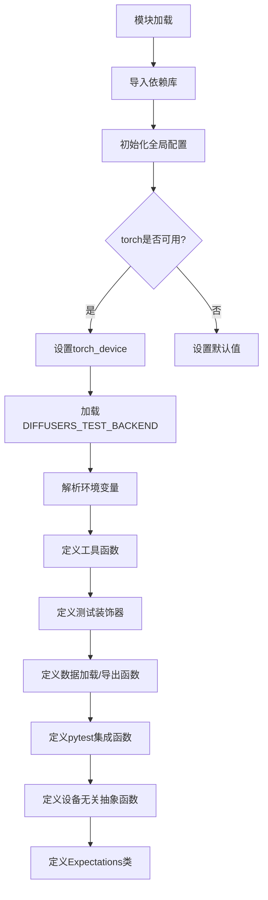

## 类结构

```
CaptureLogger (日志捕获上下文管理器)
Expectations (设备属性期望字典，继承自UserDict)
```

## 全局变量及字段


### `global_rng`
    
全局随机数生成器实例，用于生成可复现的随机数

类型：`random.Random`
    


### `logger`
    
模块级日志记录器，用于记录测试过程中的日志信息

类型：`logging.Logger`
    


### `_required_peft_version`
    
标识是否满足PEFT库的版本要求（大于0.5版本）

类型：`bool`
    


### `_required_transformers_version`
    
标识是否满足transformers库的版本要求（大于4.33版本）

类型：`bool`
    


### `USE_PEFT_BACKEND`
    
标识是否启用PEFT后端，基于PEFT和transformers版本检查结果

类型：`bool`
    


### `BIG_GPU_MEMORY`
    
大GPU内存阈值（GB），默认40GB，用于判断是否为大显存GPU

类型：`int`
    


### `IS_ROCM_SYSTEM`
    
标识当前系统是否为ROCM（AMD GPU）系统

类型：`bool`
    


### `IS_CUDA_SYSTEM`
    
标识当前系统是否为CUDA（NVIDIA GPU）系统

类型：`bool`
    


### `IS_XPU_SYSTEM`
    
标识当前系统是否为XPU（Intel GPU）系统

类型：`bool`
    


### `torch_device`
    
当前PyTorch设备字符串，根据环境变量或可用性自动设置（cuda/xpu/cpu/mps）

类型：`str`
    


### `_run_slow_tests`
    
标识是否运行慢速测试，由环境变量RUN_SLOW控制

类型：`bool`
    


### `_run_nightly_tests`
    
标识是否运行夜间测试，由环境变量RUN_NIGHTLY控制

类型：`bool`
    


### `_run_compile_tests`
    
标识是否运行torch.compile编译测试，由环境变量RUN_COMPILE控制

类型：`bool`
    


### `BACKEND_SUPPORTS_TRAINING`
    
各后端是否支持训练的布尔标志映射字典

类型：`dict[str, bool]`
    


### `BACKEND_EMPTY_CACHE`
    
各后端清空缓存函数的映射字典

类型：`dict[str, Callable]`
    


### `BACKEND_DEVICE_COUNT`
    
各后端获取设备数量函数的映射字典

类型：`dict[str, Callable]`
    


### `BACKEND_MANUAL_SEED`
    
各后端设置随机种子函数的映射字典

类型：`dict[str, Callable]`
    


### `BACKEND_RESET_PEAK_MEMORY_STATS`
    
各后端重置峰值内存统计函数的映射字典

类型：`dict[str, Callable]`
    


### `BACKEND_RESET_MAX_MEMORY_ALLOCATED`
    
各后端重置最大内存分配函数的映射字典

类型：`dict[str, Callable]`
    


### `BACKEND_MAX_MEMORY_ALLOCATED`
    
各后端获取最大已分配内存函数的映射字典

类型：`dict[str, Callable]`
    


### `BACKEND_SYNCHRONIZE`
    
各后端同步函数的映射字典

类型：`dict[str, Callable]`
    


### `pytest_opt_registered`
    
pytest选项注册字典，用于避免重复注册pytest选项

类型：`dict`
    


### `CaptureLogger.logger`
    
被捕获日志的logger实例

类型：`logging.Logger`
    


### `CaptureLogger.io`
    
用于捕获日志输出的字符串IO对象

类型：`StringIO`
    


### `CaptureLogger.sh`
    
将日志输出到StringIO的流处理器

类型：`logging.StreamHandler`
    


### `CaptureLogger.out`
    
捕获的日志输出内容字符串

类型：`str`
    


### `Expectations.DevicePropertiesUserDict`
    
继承的用户字典类型，用于存储设备属性期望值

类型：`UserDict`
    
    

## 全局函数及方法


### `torch_all_close`

该函数用于比较两个 PyTorch 张量是否在数值上足够接近（使用 `torch.allclose`），如果两个张量不完全相等，则抛出断言错误并显示最大差异值。

参数：

- `a`：`torch.Tensor`，第一个用于比较的张量
- `b`：`torch.Tensor`，第二个用于比较的张量
- `*args`：可变位置参数，这些参数会被直接传递给 `torch.allclose` 函数
- `**kwargs`：可变关键字参数，这些参数会被直接传递给 `torch.allclose` 函数

返回值：`bool`，当两个张量足够接近时返回 `True`，否则会抛出断言错误

#### 流程图

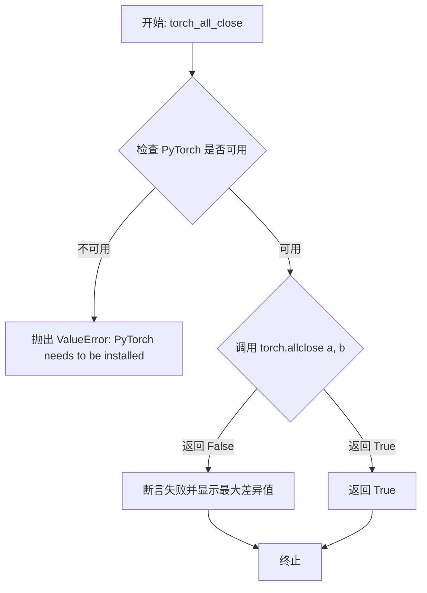

#### 带注释源码

```python
def torch_all_close(a, b, *args, **kwargs):
    """
    比较两个 PyTorch 张量是否在数值上足够接近。
    
    该函数是对 torch.allclose 的封装，如果两个张量不完全接近，
    则会抛出详细的断言错误信息，包含最大差异值和差异张量。
    
    参数:
        a: 第一个用于比较的 PyTorch 张量
        b: 第二个用于比较的 PyTorch 张量
        *args: 可变位置参数，传递给 torch.allclose
        **kwargs: 可变关键字参数，传递给 torch.allclose
        
    返回:
        bool: 如果两个张量足够接近返回 True
        
    异常:
        ValueError: 当 PyTorch 不可用时抛出
        AssertionError: 当两个张量不接近时抛出，并附带详细的差异信息
    """
    # 首先检查 PyTorch 是否已安装并可用
    if not is_torch_available():
        raise ValueError("PyTorch needs to be installed to use this function.")
    
    # 调用 PyTorch 的 allclose 函数进行比较
    # *args 和 **kwargs 允许调用者传递额外的参数（如 rtol, atol 等）
    if not torch.allclose(a, b, *args, **kwargs):
        # 计算差异并获取最大差异值，用于错误报告
        diff = (a - b).abs()
        max_diff = diff.max()
        # 抛出断言错误，包含详细的差异信息帮助调试
        assert False, f"Max diff is absolute {max_diff}. Diff tensor is {diff}."
    
    # 如果比较成功，返回 True
    return True
```


### `numpy_cosine_similarity_distance`

该函数用于计算两个向量之间的余弦相似度距离（1 - 余弦相似度），常用于衡量向量间的相似程度，值越小表示越相似。

参数：

- `a`：`np.ndarray`，输入的第一个向量或矩阵
- `b`：`np.ndarray`，输入的第二个向量或矩阵，需与 a 维度相同

返回值：`float`，返回余弦相似度距离，范围通常在 [0, 2] 之间，0 表示完全相似（余弦相似度为1），2 表示完全相反（余弦相似度为-1）

#### 流程图

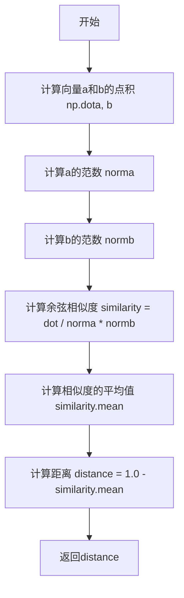

#### 带注释源码

```python
def numpy_cosine_similarity_distance(a, b):
    """
    计算两个向量之间的余弦相似度距离
    
    参数:
        a: 第一个输入向量或矩阵
        b: 第二个输入向量或矩阵，需与a维度相同
    
    返回:
        余弦相似度距离 (1 - 余弦相似度)
    """
    # 计算两个向量的点积，然后除以各自范数的乘积
    # 得到余弦相似度（Cosine Similarity）
    # 对于一维向量，这会得到一个标量；对于多维矩阵，会得到一个数组
    similarity = np.dot(a, b) / (norm(a) * norm(b))
    
    # 计算相似度的平均值
    # 注意：对于单个向量，similarity是标量，mean()返回自身
    # 这样设计可能是为了兼容批量计算的情况
    distance = 1.0 - similarity.mean()
    
    # 返回距离值
    # 0 表示完全相似（余弦相似度为1）
    # 1 表示正交（余弦相似度为0）
    # 2 表示完全相反（余弦相似度为-1）
    return distance
```


### `check_if_dicts_are_equal`

该函数用于比较两个字典是否相等，首先对字典进行深拷贝以避免修改原始数据，然后将字典中的集合（set）类型转换为排序后的列表（因为集合是无序的，直接比较可能产生误差），最后双向检查键集合和键值对是否完全一致。

参数：

- `dict1`：`dict`，第一个要比较的字典
- `dict2`：`dict`，第二个要比较的字典

返回值：`bool`，如果两个字典相等则返回 `True`，否则返回 `False`

#### 流程图

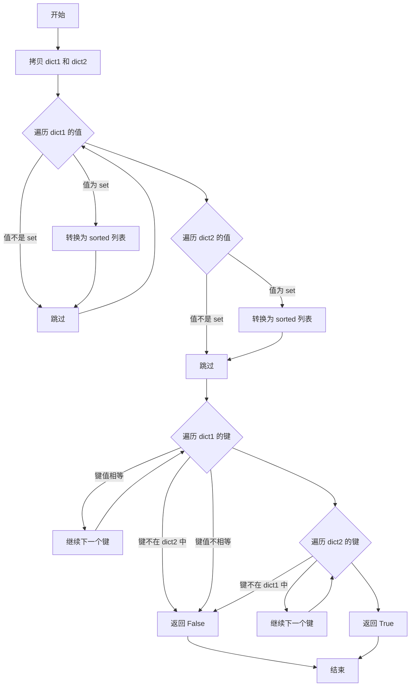

#### 带注释源码

```python
def check_if_dicts_are_equal(dict1, dict2):
    """
    比较两个字典是否相等。
    
    注意：此函数会对字典进行拷贝以避免修改原始数据，
    并将字典中的 set 转换为排序后的列表以便正确比较。
    
    Args:
        dict1: 第一个要比较的字典
        dict2: 第二个要比较的字典
    
    Returns:
        bool: 如果两个字典相等则返回 True，否则返回 False
    """
    # 拷贝字典以避免修改原始输入数据
    dict1, dict2 = dict1.copy(), dict2.copy()

    # 将 dict1 中的 set 转换为排序后的列表
    # 因为 set 是无序的，直接比较可能产生错误结果
    for key, value in dict1.items():
        if isinstance(value, set):
            dict1[key] = sorted(value)
    
    # 将 dict2 中的 set 转换为排序后的列表
    for key, value in dict2.items():
        if isinstance(value, set):
            dict2[key] = sorted(value)

    # 检查 dict1 中的所有键是否都在 dict2 中，且值相等
    for key in dict1:
        if key not in dict2:
            return False
        if dict1[key] != dict2[key]:
            return False

    # 检查 dict2 中的所有键是否都在 dict1 中
    #（双向检查确保键集合完全一致）
    for key in dict2:
        if key not in dict1:
            return False

    return True
```


### `print_tensor_test`

该函数用于在测试中将张量转换为NumPy数组格式并输出到文件，主要用于生成测试校正数据或记录张量值。

参数：

- `tensor`：`Union[torch.Tensor, np.ndarray]`，输入的张量，可以是PyTorch张量或NumPy数组
- `limit_to_slices`：`Optional[Any]`，可选参数，用于限制张量的切片范围，默认为None
- `max_torch_print`：`Optional[Any]`，可选参数，当设置时配置torch的打印阈值，默认为None
- `filename`：`str`，输出文件名，默认为"test_corrections.txt"
- `expected_tensor_name`：`str`，输出文件中变量的名称，默认为"expected_slice"

返回值：`None`，该函数无返回值，主要通过文件输出

#### 流程图

```mermaid
flowchart TD
    A[开始] --> B{检查 max_torch_print 是否设置}
    B -->|是| C[设置 torch.set_printoptions threshold=10000]
    B -->|否| D[获取 PYTEST_CURRENT_TEST 环境变量]
    C --> D
    D --> E{检查 tensor 是否为 torch.Tensor}
    E -->|否| F[将 tensor 转换为 torch.Tensor]
    E -->|是| G{检查 limit_to_slices 是否设置}
    F --> G
    G -->|是| H[对 tensor 进行切片: tensor[0, -3:, -3:, -1]]
    G -->|否| I[detach cpu 并转换为 float32]
    H --> I
    I --> J[将张量展平并转为字符串]
    J --> K[替换字符串中的 'tensor' 为 'expected_tensor_name = np.array']
    K --> L[解析测试名称: 文件::类::方法]
    L --> M[打开文件并追加写入]
    M --> N[结束]
```

#### 带注释源码

```python
def print_tensor_test(
    tensor,
    limit_to_slices=None,
    max_torch_print=None,
    filename="test_corrections.txt",
    expected_tensor_name="expected_slice",
):
    # 如果设置了 max_torch_print，则配置 PyTorch 的打印选项
    # 将打印阈值设置为 10000，以便输出更大的张量
    if max_torch_print:
        torch.set_printoptions(threshold=10_000)

    # 从环境变量获取当前测试的名称，格式通常为: test_file.py::TestClass::test_method
    test_name = os.environ.get("PYTEST_CURRENT_TEST")
    
    # 如果输入的不是 PyTorch 张量，则转换为 PyTorch 张量
    # 支持 numpy 数组作为输入
    if not torch.is_tensor(tensor):
        tensor = torch.from_numpy(tensor)
    
    # 如果设置了 limit_to_slices，则对张量进行切片
    # 切片取第一个样本的后3个维度的最后3个元素
    if limit_to_slices:
        tensor = tensor[0, -3:, -3:, -1]

    # 将张量 detach（脱离计算图），移到 CPU，展平，并转换为 float32
    # 然后转为字符串并去除换行符
    tensor_str = str(tensor.detach().cpu().flatten().to(torch.float32)).replace("\n", "")
    
    # 格式化输出字符串，将 'tensor' 替换为 'expected_slice = np.array'
    # 输出格式示例: expected_slice = np.array([-0.5713, -0.3018, -0.9814, ...])
    output_str = tensor_str.replace("tensor", f"{expected_tensor_name} = np.array")
    
    # 解析测试名称，获取测试文件、测试类和测试函数名
    # 格式: test_file.py::TestClass::test_method (additional info)
    test_file, test_class, test_fn = test_name.split("::")
    test_fn = test_fn.split()[0]
    
    # 以追加模式打开文件，写入测试信息和张量数据
    with open(filename, "a") as f:
        print("::".join([test_file, test_class, test_fn, output_str]), file=f)
```


### `get_tests_dir`

获取测试目录的完整路径，使得测试可以从任何位置调用。如果提供了 `append_path`，则将其连接到测试目录路径之后。

参数：

- `append_path`：`str | None`，可选参数，要附加到测试目录路径的路径

返回值：`str`，测试目录的完整路径（POSIX 格式），如果提供了 `append_path`，则路径已连接到测试目录之后

#### 流程图

```mermaid
flowchart TD
    A[开始] --> B[获取调用者的 __file__]
    B --> C[获取 __file__ 所在目录的绝对路径]
    D{tests_dir 是否以 'tests' 结尾?}
    C --> D
    D -- 否 --> E[获取父目录]
    E --> D
    D -- 是 --> F{append_path 是否存在?}
    F -- 是 --> G[返回 Path(tests_dir, append_path).as_posix()]
    F -- 否 --> H[返回 tests_dir]
    G --> I[结束]
    H --> I
```

#### 带注释源码

```python
def get_tests_dir(append_path=None):
    """
    Args:
        append_path: optional path to append to the tests dir path
    Return:
        The full path to the `tests` dir, so that the tests can be invoked from anywhere. Optionally `append_path` is
        joined after the `tests` dir the former is provided.
    """
    # 获取调用此函数的文件路径（调用者的 __file__）
    caller__file__ = inspect.stack()[1][1]
    # 获取调用者文件所在目录的绝对路径
    tests_dir = os.path.abspath(os.path.dirname(caller__file__))

    # 向上遍历目录直到找到以 'tests' 结尾的目录
    while not tests_dir.endswith("tests"):
        tests_dir = os.path.dirname(tests_dir)

    # 如果提供了 append_path，则连接到 tests_dir 之后
    if append_path:
        return Path(tests_dir, append_path).as_posix()
    else:
        return tests_dir
```


### `str_to_bool`

该函数将字符串形式的真值转换为整数 1（真）或 0（假），支持多种常见布尔值表示方式（如 "yes"、"true"、"1" 等为真，"no"、"false"、"0" 等为假），常用于解析环境变量中的布尔标志。

参数：

- `value`：`str`，需要转换为布尔值的字符串

返回值：`int`，如果字符串表示真值返回 1，表示假值返回 0

#### 流程图

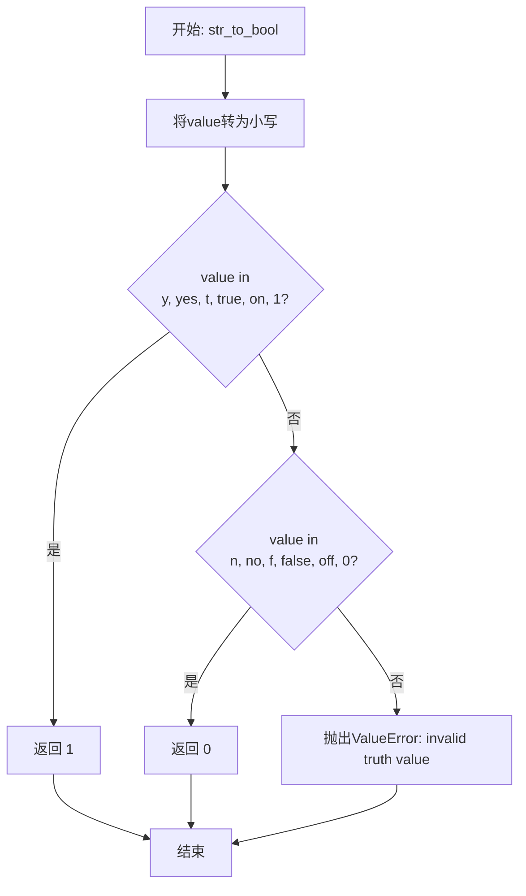

#### 带注释源码

```python
def str_to_bool(value) -> int:
    """
    Converts a string representation of truth to `True` (1) or `False` (0). True values are `y`, `yes`, `t`, `true`,
    `on`, and `1`; False value are `n`, `no`, `f`, `false`, `off`, and `0`;
    
    参数:
        value: 需要转换的字符串，支持多种布尔值表示形式
    
    返回:
        int: 1 表示真值，0 表示假值
    
    异常:
        ValueError: 当value不在支持的真/假值列表中时抛出
    """
    # 将字符串转为小写，以支持大小写不敏感的匹配
    value = value.lower()
    
    # 检查是否为真值（truthy value）
    # 支持的格式: y, yes, t, true, on, 1
    if value in ("y", "yes", "t", "true", "on", "1"):
        return 1  # 返回整数1表示True
    
    # 检查是否为假值（falsy value）
    # 支持的格式: n, no, f, false, off, 0
    elif value in ("n", "no", "f", "false", "off", "0"):
        return 0  # 返回整数0表示False
    
    # 如果既不是真值也不是假值，抛出异常
    else:
        raise ValueError(f"invalid truth value {value}")
```


### `parse_flag_from_env`

该函数用于从环境变量中解析布尔标志值。如果环境变量已设置，则将其字符串值转换为布尔值（是/否）；如果未设置，则返回默认值。

参数：

- `key`：`str`，环境变量的名称，用于从 `os.environ` 中获取值
- `default`：`bool`，当环境变量未设置时返回的默认值，默认为 `False`

返回值：`int`，返回转换后的布尔值（1 表示 True，0 表示 False）或默认值

#### 流程图

```mermaid
flowchart TD
    A[开始 parse_flag_from_env] --> B{尝试获取 os.environ[key]}
    B -->|成功| C{调用 str_to_bool 转换值}
    B -->|KeyError 异常| D[设置 _value = default]
    C -->|转换成功| E[返回 _value]
    C -->|ValueError 异常| F[抛出 ValueError: 'If set, {key} must be yes or no.']]
    D --> E
    F -->|异常| G[结束]
    E --> G
    
    style F fill:#ffcccc
    style D fill:#ccffcc
    style E fill:#ccffcc
```

#### 带注释源码

```python
def parse_flag_from_env(key, default=False):
    """
    从环境变量中解析布尔标志值。
    
    Args:
        key: 环境变量名称
        default: 当环境变量未设置时的默认值
    
    Returns:
        解析后的布尔值（int 类型，1 或 0）或默认值
    """
    try:
        # 尝试从环境变量中获取值
        value = os.environ[key]
    except KeyError:
        # 环境变量未设置，使用默认值
        # KEY isn't set, default to `default`.
        _value = default
    else:
        # KEY is set, convert it to True or False.
        # 环境变量已设置，尝试将其转换为布尔值
        try:
            _value = str_to_bool(value)
        except ValueError:
            # More values are supported, but let's keep the message simple.
            # 转换失败，抛出异常（值不是有效的 yes/no 值）
            raise ValueError(f"If set, {key} must be yes or no.")
    return _value
```

---

**补充说明**：

该函数依赖于同文件中的 `str_to_bool` 辅助函数，用于将字符串 `"y"`, `"yes"`, `"t"`, `"true"`, `"on"`, `"1"` 转换为 `1`（True），将 `"n"`, `"no"`, `"f"`, `"false"`, `"off"`, `"0"` 转换为 `0`（False）。

该函数在模块级别被多次调用，用于初始化测试配置标志：
- `_run_slow_tests = parse_flag_from_env("RUN_SLOW", default=False)`
- `_run_nightly_tests = parse_flag_from_env("RUN_NIGHTLY", default=False)`
- `_run_compile_tests = parse_flag_from_env("RUN_COMPILE", default=False)`


### `floats_tensor`

创建一个指定形状的随机 float32 张量，用于测试目的。

参数：

- `shape`：`tuple` 或 `int`，张量的形状
- `scale`：`float`，可选，默认为 1.0，用于缩放随机数的乘数
- `rng`：`random.Random`，可选，默认为 None（使用全局随机数生成器 `global_rng`）
- `name`：`str`，可选，默认为 None，标识符（当前未使用）

返回值：`torch.Tensor`，具有指定形状的连续 float32 张量

#### 流程图

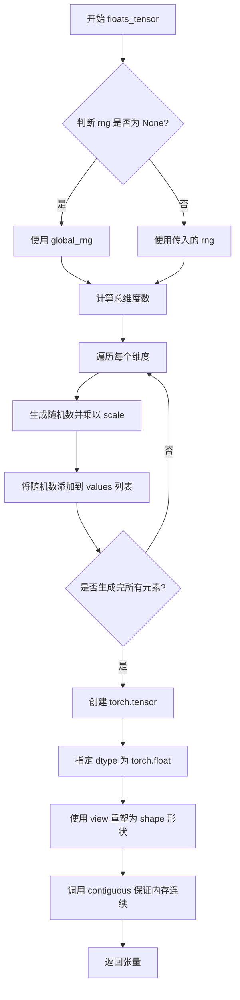

#### 带注释源码

```python
def floats_tensor(shape, scale=1.0, rng=None, name=None):
    """Creates a random float32 tensor"""
    # 如果未提供随机数生成器，则使用全局随机数生成器
    if rng is None:
        rng = global_rng

    # 计算总维度数（即张量中元素的总数）
    total_dims = 1
    for dim in shape:
        total_dims *= dim

    # 存储随机数值的列表
    values = []
    # 遍历生成 total_dims 个随机数
    for _ in range(total_dims):
        # 生成 0-1 之间的随机数并乘以 scale 进行缩放
        values.append(rng.random() * scale)

    # 将数值列表转换为 torch 张量，指定 dtype 为 float32
    # 使用 view 方法重塑为指定的 shape 形状
    # 调用 contiguous() 确保返回的张量在内存中是连续的
    return torch.tensor(data=values, dtype=torch.float).view(shape).contiguous()
```


### `slow`

装饰器函数，用于将测试标记为慢速测试。慢速测试默认会被跳过，只有在设置 `RUN_SLOW` 环境变量为真值时才会运行。

参数：

- `test_case`：`Callable`，需要标记为慢速的测试用例（函数或类）

返回值：`Callable`，根据 `RUN_SLOW` 环境变量决定是否跳过测试的装饰器

#### 流程图

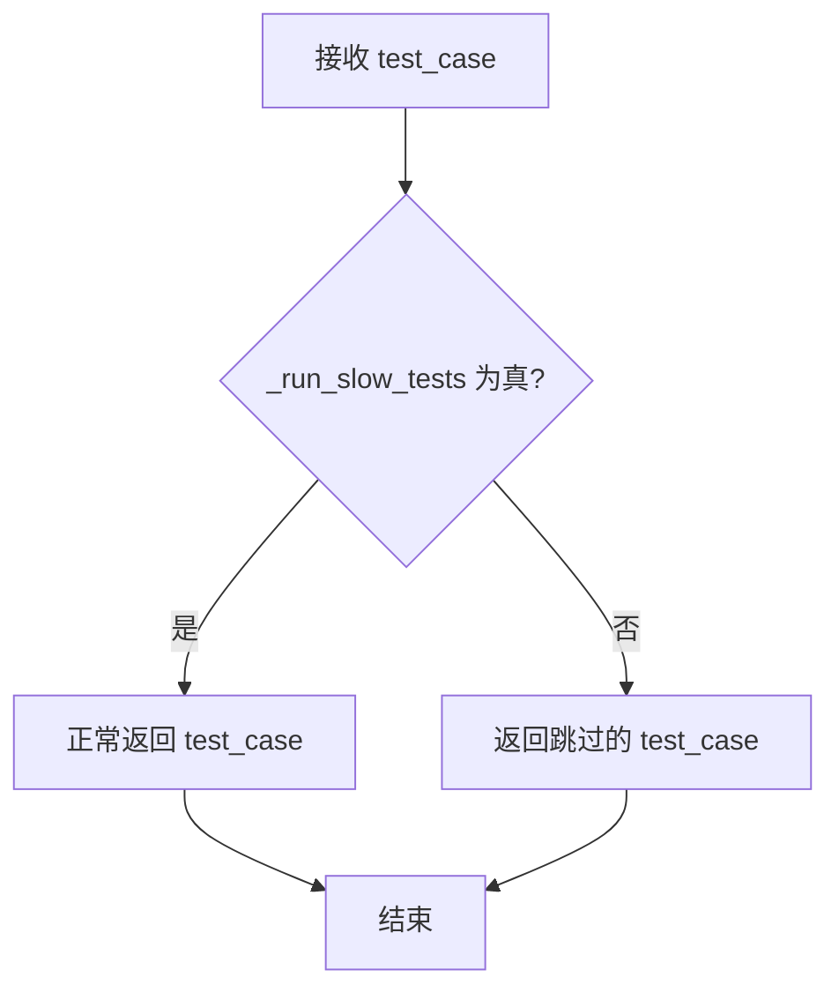

#### 带注释源码

```python
def slow(test_case):
    """
    Decorator marking a test as slow.

    Slow tests are skipped by default. Set the RUN_SLOW environment variable to a truthy value to run them.

    """
    # _run_slow_tests 是通过解析 RUN_SLOW 环境变量得到的布尔值
    # 默认值为 False，即默认跳过慢速测试
    # unittest.skipUnless 会根据条件决定是否跳过测试
    return unittest.skipUnless(_run_slow_tests, "test is slow")(test_case)
```


### `nightly`

一个装饰器函数，用于标记在 diffusers CI 中每晚运行的测试。默认情况下会跳过这些测试，需要将 `RUN_NIGHTLY` 环境变量设置为真值才能运行。

参数：

- `test_case`：`Callable`，需要被装饰的测试函数或测试类

返回值：`Callable`，经过 `unittest.skipUnless` 装饰后的测试函数，如果 `RUN_NIGHTLY` 环境变量为真则执行测试，否则跳过

#### 流程图

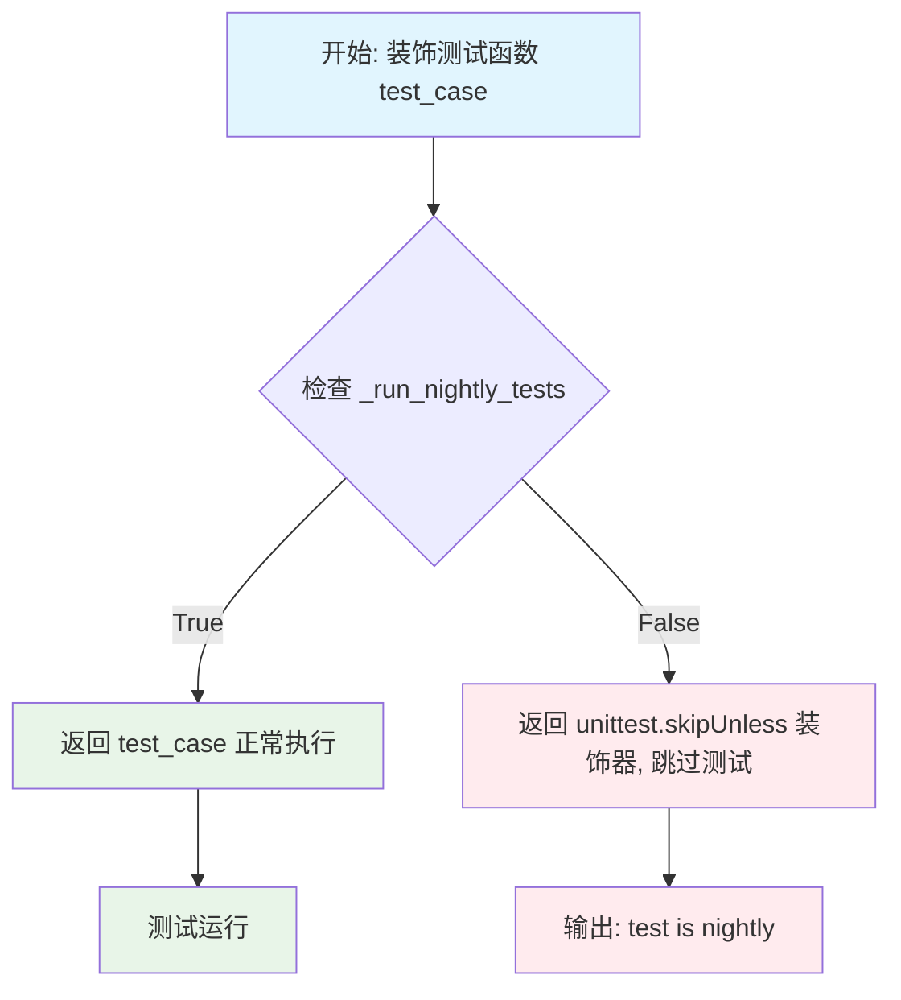

#### 带注释源码

```python
def nightly(test_case):
    """
    Decorator marking a test that runs nightly in the diffusers CI.

    Slow tests are skipped by default. Set the RUN_NIGHTLY environment variable to a truthy value to run them.

    """
    # _run_nightly_tests 是在模块加载时通过解析环境变量 RUN_NIGHTLY 得到的布尔值
    # 使用 unittest.skipUnless 装饰器实现条件跳过：
    # - 如果 _run_nightly_tests 为 True，则测试正常执行
    # - 如果 _run_nightly_tests 为 False，则测试被跳过并显示 "test is nightly" 消息
    return unittest.skipUnless(_run_nightly_tests, "test is nightly")(test_case)
```


### `is_torch_compile`

该函数是一个测试装饰器，用于标记需要运行 PyTorch 编译（torch.compile）相关测试的用例。默认情况下编译测试会被跳过，只有当环境变量 `RUN_COMPILE` 设置为真值时才会执行。

参数：

- `test_case`：`Callable`，被装饰的测试函数或测试类

返回值：`Callable`，返回经过 `unittest.skipUnless` 装饰器处理后的测试用例，如果 `RUN_COMPILE` 环境变量未设置或为假值则跳过该测试

#### 流程图

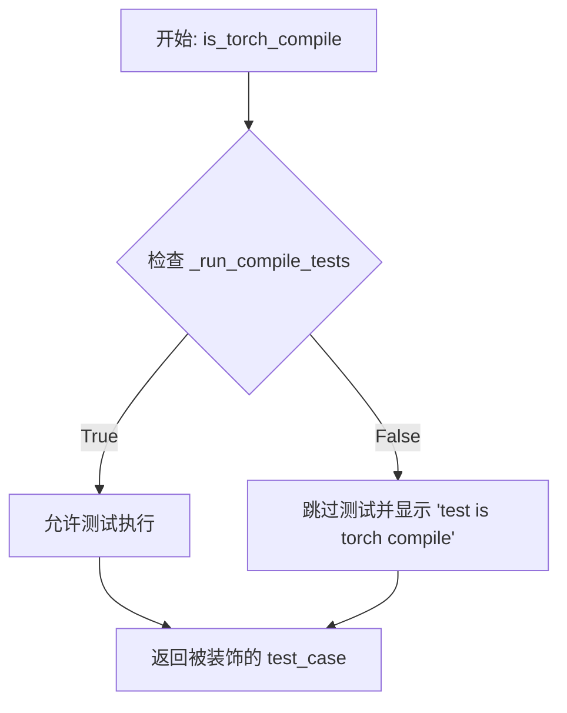

#### 带注释源码

```python
def is_torch_compile(test_case):
    """
    Decorator marking a test that runs compile tests in the diffusers CI.

    Compile tests are skipped by default. Set the RUN_COMPILE environment variable to a truthy value to run them.

    """
    # 使用 unittest.skipUnless 装饰器，根据 _run_compile_tests 的值决定是否跳过测试
    # _run_compile_tests 在模块加载时通过 parse_flag_from_env("RUN_COMPILE", default=False) 设置
    # 当环境变量 RUN_COMPILE 未设置或为 'n', 'no', 'f', 'false', 'off', '0' 时，测试会被跳过
    return unittest.skipUnless(_run_compile_tests, "test is torch compile")(test_case)
```

---

#### 相关全局变量

| 名称 | 类型 | 描述 |
|------|------|------|
| `_run_compile_tests` | `int` | 从环境变量 `RUN_COMPILE` 解析出的布尔标志，0 表示跳过编译测试，1 表示执行编译测试 |
| `parse_flag_from_env` | `Callable` | 辅助函数，用于从环境变量解析布尔值 |


### `require_torch`

该函数是一个测试装饰器，用于标记需要 PyTorch 的测试用例。当 PyTorch 未安装时，装饰器会将测试标记为跳过，确保测试在缺少 PyTorch 环境下不会执行。

参数：

- `test_case`：`Callable`，需要被装饰的测试类或测试函数（通常是一个测试方法或测试类）

返回值：`Callable`，返回经过 `unittest.skipUnless` 装饰后的测试类或测试函数。如果 PyTorch 可用，则原样返回；否则返回一个跳过状态的测试。

#### 流程图

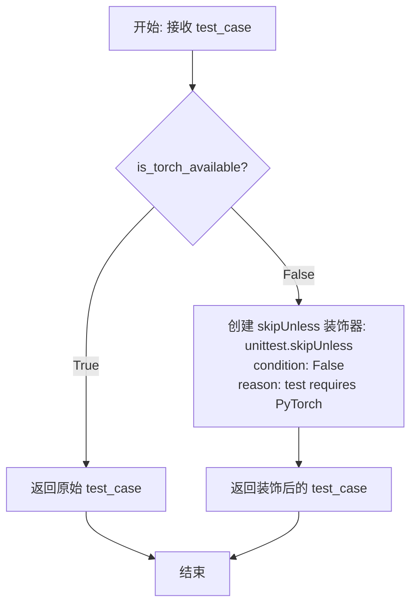

#### 带注释源码

```python
def require_torch(test_case):
    """
    Decorator marking a test that requires PyTorch. These tests are skipped when PyTorch isn't installed.
    
    这个装饰器用于标记需要 PyTorch 的测试。当 PyTorch 未安装时，
    测试会被跳过而不是失败，这样可以确保测试套件在不同环境下都能运行。
    
    Args:
        test_case: 要被装饰的测试函数或测试类
        
    Returns:
        如果 PyTorch 可用，返回原始的测试函数/类；
        如果 PyTorch 不可用，返回一个被 unittest.skipUnless 装饰的测试函数/类
    """
    # 使用 unittest.skipUnless 创建条件跳过装饰器
    # 条件: is_torch_available() 的返回值（检查 PyTorch 是否已安装）
    # 原因: "test requires PyTorch" - 当 PyTorch 未安装时显示的跳过原因
    return unittest.skipUnless(is_torch_available(), "test requires PyTorch")(test_case)
```


### `require_torch_2`

这是一个装饰器函数，用于标记需要 PyTorch 2 的测试。当 PyTorch 未安装或版本低于 2.0.0 时，测试会被跳过。

参数：

- `test_case`：`Callable`，被装饰的测试用例（测试函数或测试类）

返回值：`Callable`，返回一个装饰后的测试用例，如果 PyTorch 版本不满足要求则跳过该测试

#### 流程图

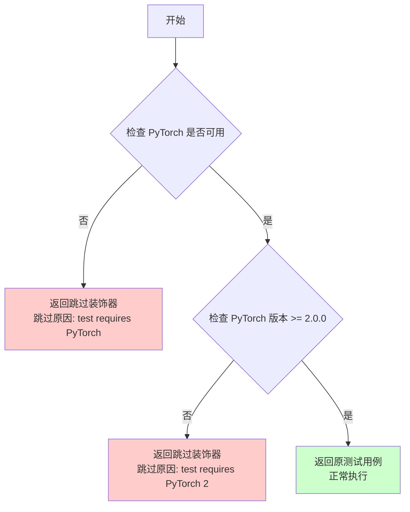

#### 带注释源码

```python
def require_torch_2(test_case):
    """
    Decorator marking a test that requires PyTorch 2. These tests are skipped when it isn't installed.
    
    参数:
        test_case: 被装饰的测试用例（测试函数或测试类）
    
    返回:
        返回一个装饰器，如果 PyTorch 可用且版本 >= 2.0.0，则返回原测试用例；
        否则返回 unittest.skipUnless 装饰器，使测试被跳过
    """
    # 使用 unittest.skipUnless 来实现条件跳过
    # 条件: is_torch_available() AND is_torch_version(">=", "2.0.0")
    # 跳过消息: "test requires PyTorch 2"
    return unittest.skipUnless(
        is_torch_available() and is_torch_version(">=", "2.0.0"), 
        "test requires PyTorch 2"
    )(test_case)
```


### `require_torch_version_greater_equal`

该函数是一个测试装饰器工厂，用于根据PyTorch版本有条件地跳过测试。当PyTorch版本满足指定版本要求时，测试正常运行；否则测试将被跳过。

参数：

- `torch_version`：`str`，指定的PyTorch最低版本要求，格式如"1.0.0"

返回值：`Callable`，返回一个装饰器函数，用于包装测试用例

#### 流程图

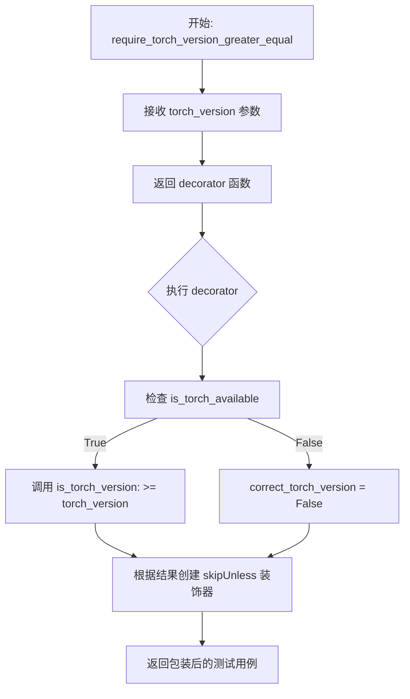

#### 带注释源码

```python
def require_torch_version_greater_equal(torch_version):
    """
    装饰器工厂：标记需要特定版本或更高版本PyTorch的测试。
    
    Args:
        torch_version: 最低要求的PyTorch版本，格式如"2.0.0"
    
    Returns:
        返回一个装饰器函数，用于包装测试用例
    """
    
    def decorator(test_case):
        """
        内部装饰器函数，用于实际包装测试用例
        
        Args:
            test_case: 被装饰的测试用例函数或类
        
        Returns:
            根据版本检查结果返回跳过或正常执行的测试用例
        """
        # 检查PyTorch是否可用，且版本是否满足要求
        correct_torch_version = is_torch_available() and is_torch_version(">=", torch_version)
        
        # 使用unittest.skipUnless创建条件跳过装饰器
        return unittest.skipUnless(
            correct_torch_version, 
            f"test requires torch with the version greater than or equal to {torch_version}"
        )(test_case)
    
    return decorator
```


### `require_torch_version_greater`

装饰器函数，用于标记需要特定版本以上（不包含该版本）的 PyTorch 测试。当 PyTorch 版本不符合要求时，测试会被跳过。

参数：

- `torch_version`：`str`，需要比较的 PyTorch 版本号（exclusive），例如 "2.0.0" 表示需要大于 2.0.0 的版本

返回值：`Callable`，返回一个测试装饰器函数，根据 PyTorch 版本决定是否跳过测试

#### 流程图

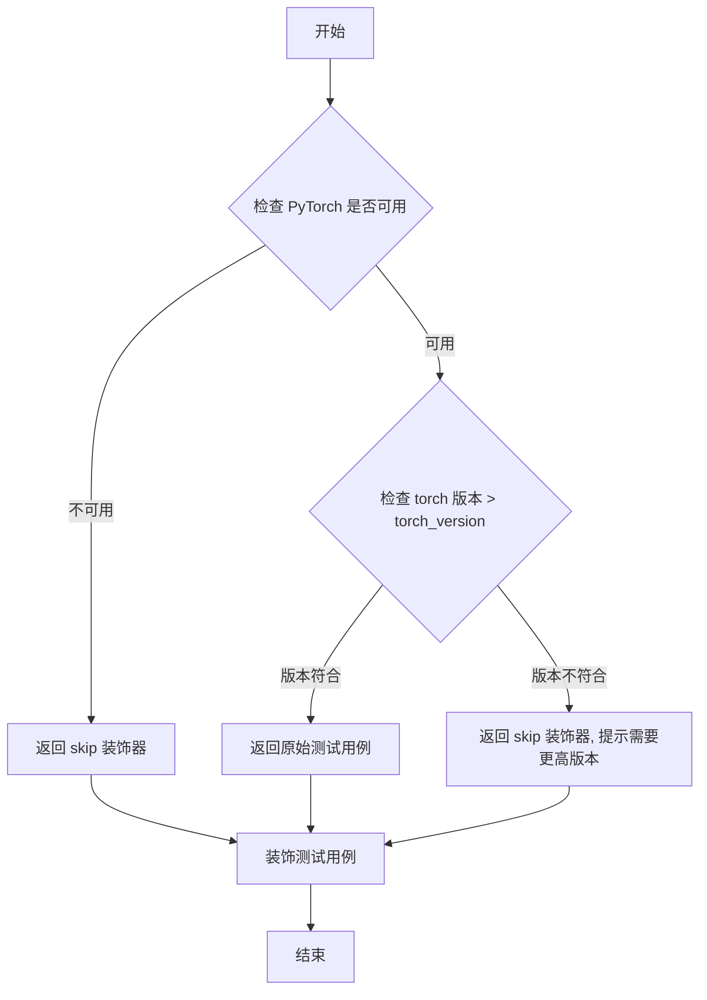

#### 带注释源码

```python
def require_torch_version_greater(torch_version):
    """
    装饰器：标记需要特定版本以上的 PyTorch 测试。
    
    参数:
        torch_version: str, 需要比较的 PyTorch 版本号（exclusive）
                      例如 "2.0.0" 表示需要大于 2.0.0 的版本
    
    返回:
        一个装饰器函数，用于包装测试用例
    """
    
    def decorator(test_case):
        # 检查 PyTorch 是否可用且版本是否大于指定版本
        # 使用 is_torch_available() 检查 PyTorch 是否安装
        # 使用 is_torch_version(">", torch_version) 检查版本是否大于指定版本
        correct_torch_version = is_torch_available() and is_torch_version(">", torch_version)
        
        # 返回一个 unittest skipUnless 装饰器
        # 如果版本不符合要求，测试会被跳过，并显示指定的消息
        return unittest.skipUnless(
            correct_torch_version, 
            f"test requires torch with the version greater than {torch_version}"
        )(test_case)

    return decorator
```


### `require_torch_gpu`

装饰器函数，用于标记需要 CUDA 和 PyTorch 的测试。当 PyTorch 不可用或设备不是 CUDA 时，测试将被跳过。

参数：

- `test_case`：`test_case`（任意测试类或测试方法），需要 CUDA 和 PyTorch 的测试用例

返回值：`test_case`，返回装饰后的测试用例，如果条件不满足则返回跳过的测试用例

#### 流程图

```mermaid
flowchart TD
    A[开始: require_torch_gpu] --> B{检查条件: is_torch_available() && torch_device == 'cuda'}
    B -->|条件为真| C[返回 test_case 正常执行]
    B -->|条件为假| D[返回 unittest.skipUnless 包装的跳过测试]
    C --> E[结束: 测试正常执行]
    D --> E
```

#### 带注释源码

```python
def require_torch_gpu(test_case):
    """
    装饰器标记需要 CUDA 和 PyTorch 的测试。
    
    当 PyTorch 不可用或 torch_device 不是 'cuda' 时，这些测试会被跳过。
    """
    # 使用 unittest.skipUnless 来条件性地跳过测试
    # 条件：PyTorch 可用 且 设备为 CUDA
    return unittest.skipUnless(
        is_torch_available() and torch_device == "cuda",  # 条件：PyTorch可用且设备为cuda
        "test requires PyTorch+CUDA"  # 跳过原因：需要PyTorch+CUDA
    )(test_case)  # 将test_case作为参数传入skipUnless返回的可调用对象
```


### `require_torch_cuda_compatibility`

该函数是一个装饰器工厂，用于根据CUDA设备的计算能力（compute capability）有条件地跳过测试。它接受期望的计算能力作为参数，返回一个装饰器，该装饰器检查当前CUDA设备的计算能力是否与期望值匹配，如果不匹配则跳过测试。

参数：

- `expected_compute_capability`：期望的CUDA计算能力值（如7.0表示Sm_70，8.0表示Sm_80等），用于与当前CUDA设备的计算能力进行比对。

返回值：`Callable[[T], T]`，返回一个测试用例装饰器，如果CUDA可用且设备计算能力与期望值匹配则原样返回测试用例，否则返回跳过该测试的装饰器。

#### 流程图

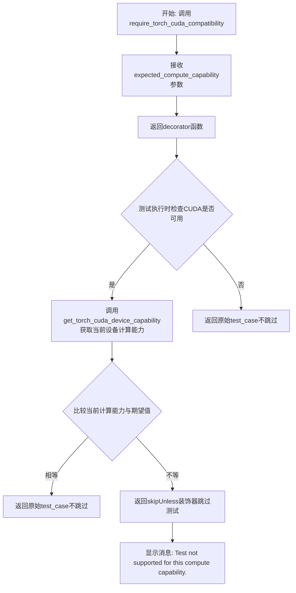

#### 带注释源码

```python
def require_torch_cuda_compatibility(expected_compute_capability):
    """
    装饰器工厂函数，用于根据CUDA计算能力跳过或执行测试。
    
    参数:
        expected_compute_capability: 期望的CUDA计算能力值（如7.0, 8.0等）
    
    返回:
        一个装饰器函数，用于包装测试用例
    """
    
    def decorator(test_case):
        """内部装饰器函数，实际用于装饰测试用例"""
        
        # 检查CUDA是否可用（确保torch已安装且有可用的CUDA设备）
        if torch.cuda.is_available():
            # 获取当前CUDA设备的计算能力
            current_compute_capability = get_torch_cuda_device_capability()
            
            # 使用unittest.skipUnless创建条件跳过装饰器
            # 只有当当前设备的计算能力精确匹配期望值时才执行测试
            return unittest.skipUnless(
                float(current_compute_capability) == float(expected_compute_capability),
                "Test not supported for this compute capability.",
            )(test_case)
        
        # 如果CUDA不可用，返回原始的test_case（不会跳过）
        # 注意：这里缺少else分支的return，可能导致返回None的问题
        return test_case

    return decorator
```

**使用示例：**

```python
# 只有当CUDA设备的计算能力为8.0时才会运行该测试
@require_torch_cuda_compatibility(expected_compute_capability=8.0)
def test_my_cuda_feature():
    # 测试代码...
    pass
```


### `require_torch_accelerator`

该函数是一个测试装饰器，用于标记需要硬件加速器（如 CUDA、XPU、MPS 等）且支持 PyTorch 的测试。如果当前环境不满足条件（PyTorch 不可用或设备为 CPU），则跳过该测试。

参数：

- `test_case`：`Callable`（或 `unittest.TestCase`），需要被装饰的测试用例

返回值：`Callable`，返回一个装饰后的测试用例（`unittest.skipUnless` 的返回值），用于在条件不满足时跳过测试

#### 流程图

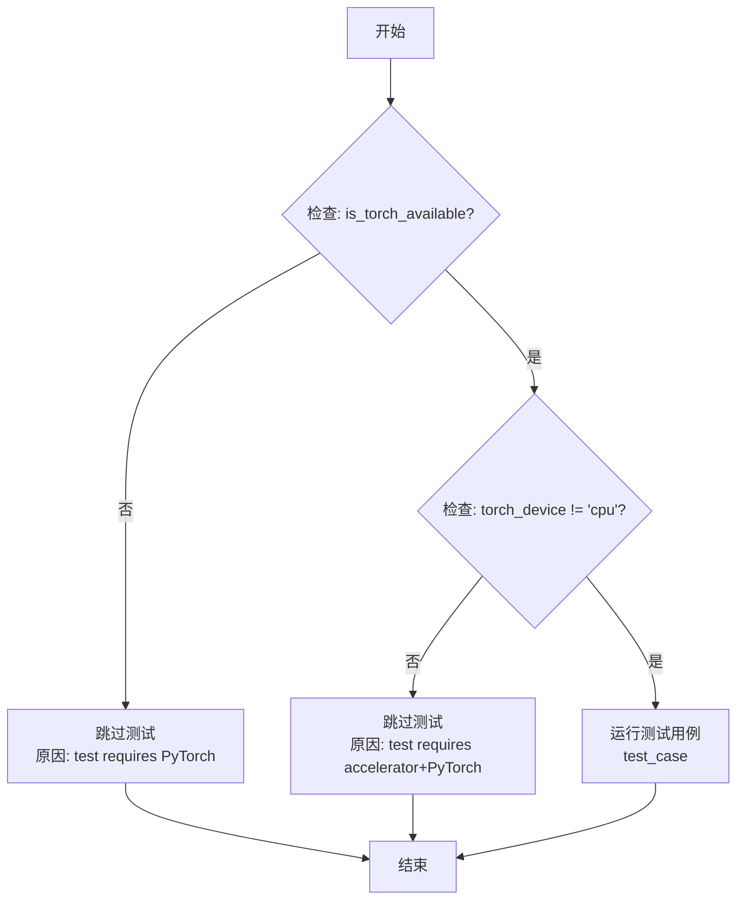

#### 带注释源码

```python
def require_torch_accelerator(test_case):
    """
    装饰器：标记需要硬件加速器和 PyTorch 的测试。
    
    该装饰器用于条件性地跳过不满足硬件要求的测试用例。
    当 PyTorch 不可用或设备为 CPU 时，测试将被跳过。
    
    参数:
        test_case: 需要被装饰的测试用例（通常为 unittest.TestCase 或测试函数）
    
    返回值:
        返回一个装饰后的测试用例，当条件不满足时会被跳过
    """
    # 使用 unittest.skipUnless 检查条件：
    # 1. is_torch_available(): PyTorch 是否已安装
    # 2. torch_device != "cpu": 设备是否为非 CPU（如 cuda、xpu、mps）
    # 如果条件不满足，返回跳过测试的装饰器，并附带错误信息
    return unittest.skipUnless(
        is_torch_available() and torch_device != "cpu", 
        "test requires accelerator+PyTorch"
    )(test_case)
```


### `require_torch_multi_gpu`

该函数是一个装饰器，用于标记需要多 GPU 环境（PyTorch）的测试。当机器没有多个 GPU 时，这些测试会被跳过。

参数：

- `test_case`：`Callable`（具体为 `unittest.TestCase` 或测试函数），需要被装饰的测试用例

返回值：`Callable`，装饰后的测试用例，如果条件不满足则返回跳过的测试用例

#### 流程图

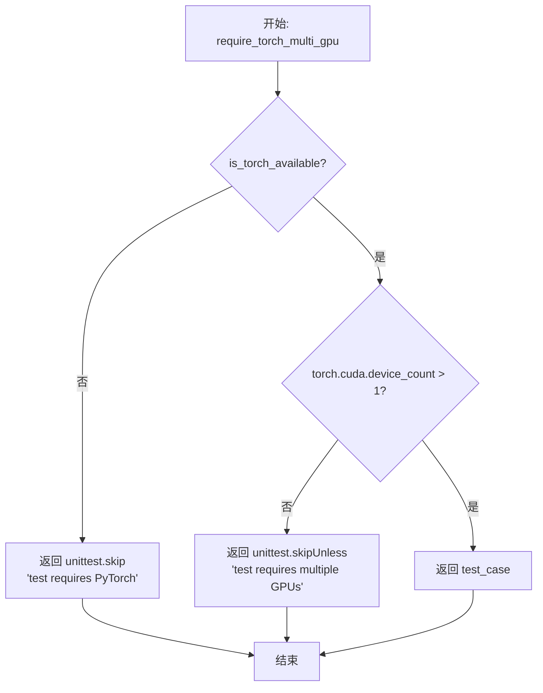

#### 带注释源码

```python
def require_torch_multi_gpu(test_case):
    """
    Decorator marking a test that requires a multi-GPU setup (in PyTorch). These tests are skipped on a machine without
    multiple GPUs. To run *only* the multi_gpu tests, assuming all test names contain multi_gpu: $ pytest -sv ./tests
    -k "multi_gpu"
    
    装饰器标记需要多GPU设置的测试（PyTorch）。在没有多个GPU的机器上，这些测试会被跳过。
    要仅运行multi_gpu测试，假设所有测试名包含multi_gpu：$ pytest -sv ./tests -k "multi_gpu"
    """
    # 首先检查PyTorch是否可用，如果不可用则跳过测试
    if not is_torch_available():
        return unittest.skip("test requires PyTorch")(test_case)

    # 动态导入torch以确保在需要时才加载
    import torch

    # 检查CUDA设备数量是否大于1，即是否有多个GPU
    # 如果没有多个GPU，则跳过测试并给出相应提示
    return unittest.skipUnless(torch.cuda.device_count() > 1, "test requires multiple GPUs")(test_case)
```


### `require_torch_multi_accelerator`

该函数是一个测试装饰器，用于标记需要多硬件加速器（如多GPU或多XPU设备）的测试用例。如果系统没有多个加速器，测试将被跳过。

参数：

- `test_case`：`Callable`，需要装饰的测试函数或测试类

返回值：`Callable`，装饰后的测试函数或测试类，如果系统不满足多加速器要求则返回跳过的测试

#### 流程图

```mermaid
flowchart TD
    A[开始: require_torch_multi_accelerator] --> B{PyTorch 是否可用?}
    B -->|否| C[返回 unittest.skip 装饰器: test requires PyTorch]
    B -->|是| D{检查加速器数量}
    D --> E[获取 CUDA 设备数量]
    D --> F[获取 XPU 设备数量]
    E --> G{CUDA 设备数 > 1 或 XPU 设备数 > 1?}
    F --> G
    G -->|否| H[返回 unittest.skip 装饰器: test requires multiple hardware accelerators]
    G -->|是| I[返回原始测试用例]
    C --> J[结束]
    H --> J
    I --> J
```

#### 带注释源码

```python
def require_torch_multi_accelerator(test_case):
    """
    Decorator marking a test that requires a multi-accelerator setup (in PyTorch). These tests are skipped on a machine
    without multiple hardware accelerators.
    
    此装饰器用于标记需要多硬件加速器设置的测试。
    如果机器没有多个硬件加速器，这些测试将被跳过。
    """
    # 检查 PyTorch 是否可用，如果不可用则跳过测试
    if not is_torch_available():
        return unittest.skip("test requires PyTorch")(test_case)

    # 导入 torch 模块以检查设备数量
    import torch

    # 检查是否有多个 CUDA 设备或多个 XPU 设备
    # 如果没有多加速器，则跳过测试并显示相应消息
    return unittest.skipUnless(
        torch.cuda.device_count() > 1 or torch.xpu.device_count() > 1, 
        "test requires multiple hardware accelerators"
    )(test_case)
```


### `require_torch_accelerator_with_fp16`

这是一个装饰器函数，用于标记需要支持 FP16 数据类型的硬件加速器的测试。

参数：

- `test_case`：`Callable`，需要被装饰的测试函数或测试类

返回值：`Callable`，返回装饰后的测试函数，如果当前设备不支持 FP16 则跳过该测试

#### 流程图

```mermaid
flowchart TD
    A[开始] --> B{检查 torch 是否可用}
    B -->|否| C[返回 False]
    B -->|是| D[获取设备类型]
    D --> E[创建 2x2 FP16 零张量并移动到设备]
    E --> F{尝试执行乘法运算}
    F -->|成功| G[返回 True]
    F -->|失败| H{设备类型是 cuda?}
    H -->|是| I[抛出 ValueError 异常]
    H -->|否| J[返回 False]
    G --> K[装饰器返回结果]
    C --> K
    I --> K
    J --> K
```

#### 带注释源码

```python
def require_torch_accelerator_with_fp16(test_case):
    """Decorator marking a test that requires an accelerator with support for the FP16 data type."""
    # 使用 unittest.skipUnless 装饰器，根据 _is_torch_fp16_available 的返回值决定是否跳过测试
    # torch_device 是模块级全局变量，表示当前测试设备（cuda/xpu/cpu/mps）
    return unittest.skipUnless(
        _is_torch_fp16_available(torch_device),  # 检查当前设备是否支持 FP16
        "test requires accelerator with fp16 support"  # 跳过时的消息
    )(test_case)


def _is_torch_fp16_available(device):
    """检查给定设备是否支持 FP16 数据类型"""
    # 首先检查 PyTorch 是否可用
    if not is_torch_available():
        return False

    import torch

    # 将设备字符串转换为 torch.device 对象
    device = torch.device(device)

    try:
        # 尝试创建一个 FP16 类型的零张量并移动到指定设备
        x = torch.zeros((2, 2), dtype=torch.float16).to(device)
        # 尝试执行乘法运算，验证 FP16 在该设备上是否真正可用
        _ = torch.mul(x, x)
        return True

    except Exception as e:
        # 如果设备类型是 cuda 但失败，说明 CUDA 安装可能有问题
        if device.type == "cuda":
            raise ValueError(
                f"You have passed a device of type 'cuda' which should work with 'fp16', but 'cuda' does not seem to be correctly installed on your machine: {e}"
            )
        # 其他设备类型直接返回 False
        return False
```


### `require_torch_accelerator_with_fp64`

这是一个用于测试的装饰器函数，用于标记需要支持 FP64（64位浮点数）数据类型的加速器的测试。如果当前设备不支持 FP64，则跳过该测试。

参数：

-  `test_case`：`Callable`，需要装饰的测试用例（测试类或测试方法）

返回值：`Callable`，返回装饰后的测试用例，如果设备不支持 FP64 则会被跳过

#### 流程图

```mermaid
flowchart TD
    A[开始] --> B{传入 test_case}
    B --> C{调用 _is_torch_fp64_available}
    C --> D{检查 torch 是否可用}
    D -->|否| E[返回 False]
    D -->|是| F[创建 torch.device 对象]
    F --> G[尝试创建 float64 张量]
    G --> H{操作成功?}
    H -->|是| I[返回 True]
    H -->|否| J{设备类型是 cuda?}
    J -->|是| K[抛出 ValueError]
    J -->|否| L[返回 False]
    I --> M[unittest.skipUnless 判断]
    E --> M
    K --> M
    L --> M
    M --> N{条件为真?}
    N -->|是| O[正常执行测试]
    N -->|否| P[跳过测试并显示消息]
    O --> Q[结束]
    P --> Q
```

#### 带注释源码

```python
def require_torch_accelerator_with_fp64(test_case):
    """
    装饰器标记需要支持 FP64 数据类型的加速器的测试。
    
    该装饰器检查当前测试设备（torch_device）是否支持 FP64（float64）数据类型。
    如果不支持，则跳过该测试。
    
    Args:
        test_case: 要装饰的测试用例（测试类或测试方法）
        
    Returns:
        装饰后的测试用例，如果设备不支持 FP64 则会被跳过
        
    Example:
        @require_torch_accelerator_with_fp64
        def test_fp64_operation(self):
            # 测试代码...
            pass
    """
    # 使用 _is_torch_fp64_available 函数检查设备是否支持 FP64
    # 如果不支持，返回的装饰器会跳过测试，并显示 "test requires accelerator with fp64 support" 消息
    return unittest.skipUnless(_is_torch_fp64_available(torch_device), "test requires accelerator with fp64 support")(
        test_case
    )


# 内部辅助函数：检查给定设备是否支持 FP64
def _is_torch_fp64_available(device):
    """
    检查指定的 PyTorch 设备是否支持 FP64（float64）数据类型。
    
    Args:
        device: 设备字符串（如 'cuda', 'cpu', 'xpu', 'mps'）
        
    Returns:
        bool: 如果设备支持 FP64 返回 True，否则返回 False
        
    Raises:
        ValueError: 如果设备类型是 'cuda' 但 FP64 操作失败（CUDA 未正确安装）
    """
    # 首先检查 PyTorch 是否可用
    if not is_torch_available():
        return False

    import torch

    # 将设备字符串转换为 torch.device 对象
    device = torch.device(device)

    try:
        # 尝试在指定设备上创建 float64 类型的张量并进行运算
        # 如果设备不支持 FP64，这里会抛出异常
        x = torch.zeros((2, 2), dtype=torch.float64).to(device)
        _ = torch.mul(x, x)
        # 如果操作成功，说明设备支持 FP64
        return True

    except Exception as e:
        # 如果发生异常
        if device.type == "cuda":
            # 对于 CUDA 设备，抛出更具体的错误信息
            raise ValueError(
                f"You have passed a device of type 'cuda' which should work with 'fp64', but 'cuda' does not seem to be correctly installed on your machine: {e}"
            )

        # 对于其他设备类型（如 CPU），返回 False 表示不支持
        return False
```


### `require_big_gpu_with_torch_cuda`

这是一个测试装饰器，用于标记需要较大GPU（24GB）才能执行的测试用例。常见的使用场景包括Flux、SD3、Cog等大型管道。

参数：

- `test_case`：`Callable`，需要被装饰的测试用例函数

返回值：`Callable`，返回修改后的测试用例，如果条件不满足则会被跳过

#### 流程图

```mermaid
flowchart TD
    A[开始: require_big_gpu_with_torch_cuda] --> B{is_torch_available?}
    B -->|No| C[返回 unittest.skip<br/>'test requires PyTorch']
    B -->|Yes| D{torch.cuda.is_available?}
    D -->|No| E[返回 unittest.skip<br/>'test requires PyTorch CUDA']
    D -->|Yes| F[获取GPU设备属性<br/>torch.cuda.get_device_properties]
    F --> G[计算GPU总内存<br/>total_memory = device_properties.total_memory / 1024^3]
    G --> H{total_memory >= BIG_GPU_MEMORY?}
    H -->|No| I[返回 unittest.skip<br/>'test requires GPU with at least X GB memory']
    H -->|Yes| J[返回原始测试用例]
    C --> K[结束]
    E --> K
    I --> K
    J --> K
```

#### 带注释源码

```python
def require_big_gpu_with_torch_cuda(test_case):
    """
    Decorator marking a test that requires a bigger GPU (24GB) for execution. Some example pipelines: Flux, SD3, Cog,
    etc.
    
    Args:
        test_case: The test case to be decorated
        
    Returns:
        The decorated test case, potentially skipped based on GPU memory availability
    """
    # Step 1: Check if PyTorch is available
    # If PyTorch is not installed, skip the test immediately
    if not is_torch_available():
        return unittest.skip("test requires PyTorch")(test_case)

    # Step 2: Import torch (PyTorch is confirmed available)
    import torch

    # Step 3: Check if CUDA is available
    # If CUDA is not available, skip the test
    if not torch.cuda.is_available():
        return unittest.skip("test requires PyTorch CUDA")(test_case)

    # Step 4: Get GPU device properties
    # Retrieve the properties of the first GPU (index 0)
    device_properties = torch.cuda.get_device_properties(0)
    
    # Step 5: Calculate total GPU memory in GB
    # Convert from bytes to gigabytes (divide by 1024^3)
    total_memory = device_properties.total_memory / (1024**3)
    
    # Step 6: Check if GPU memory meets the requirement
    # BIG_GPU_MEMORY is defined at module level (default 40GB)
    # If total memory is less than required, skip the test
    return unittest.skipUnless(
        total_memory >= BIG_GPU_MEMORY, 
        f"test requires a GPU with at least {BIG_GPU_MEMORY} GB memory"
    )(test_case)
```


### `require_big_accelerator`

这是一个测试装饰器函数，用于标记需要较大硬件加速器（24GB）的测试用例，例如 Flux、SD3、Cog 等pipeline。

参数：

- `test_case`：`Callable`，被装饰的测试函数或测试类

返回值：`Callable`，装饰后的测试函数或测试类，如果硬件加速器内存不足则会被跳过

#### 流程图

```mermaid
flowchart TD
    A[开始] --> B[使用pytest标记big_accelerator]
    B --> C{is_torch_available?}
    C -->|否| D[返回跳过测试: test requires PyTorch]
    C -->|是| E{torch.cuda.is_available or torch.xpu.is_available?}
    E -->|否| F[返回跳过测试: test requires PyTorch CUDA or XPU]
    E -->|是| G{torch.xpu.is_available?}
    G -->|是| H[获取XPU设备属性]
    G -->|否| I[获取CUDA设备属性]
    H --> J[计算总内存GB]
    I --> J
    J --> K{total_memory >= BIG_GPU_MEMORY?}
    K -->|否| L[返回跳过测试: 需要至少{BIG_GPU_MEMORY}GB内存]
    K -->|是| M[返回装饰后的测试用例]
    D --> N[结束]
    F --> N
    L --> N
    M --> N
```

#### 带注释源码

```python
def require_big_accelerator(test_case):
    """
    Decorator marking a test that requires a bigger hardware accelerator (24GB) for execution. Some example pipelines:
    Flux, SD3, Cog, etc.
    """
    import pytest

    # 使用pytest标记该测试为big_accelerator，用于测试框架识别
    test_case = pytest.mark.big_accelerator(test_case)

    # 检查PyTorch是否可用，不可用的直接跳过测试
    if not is_torch_available():
        return unittest.skip("test requires PyTorch")(test_case)

    import torch

    # 检查是否有CUDA或XPU加速器可用，两者都没有则跳过测试
    if not (torch.cuda.is_available() or torch.xpu.is_available()):
        return unittest.skip("test requires PyTorch CUDA")(test_case)

    # 根据可用的加速器类型获取设备属性
    if torch.xpu.is_available():
        device_properties = torch.xpu.get_device_properties(0)
    else:
        device_properties = torch.cuda.get_device_properties(0)

    # 计算设备总内存（转换为GB）
    total_memory = device_properties.total_memory / (1024**3)
    
    # 检查内存是否满足要求，不满足则跳过测试
    # BIG_GPU_MEMORY默认值为40GB，可通过环境变量BIG_GPU_MEMORY设置
    return unittest.skipUnless(
        total_memory >= BIG_GPU_MEMORY,
        f"test requires a hardware accelerator with at least {BIG_GPU_MEMORY} GB memory",
    )(test_case)
```


### `require_torch_accelerator_with_training`

这是一个装饰器函数，用于标记需要支持训练功能的硬件加速器的测试。如果当前设备不支持训练（如 MPS 设备），则跳过该测试。

参数：

- `test_case`：`test_case`（任意类型），被装饰的测试函数或测试类

返回值：`test_case`，装饰后的测试函数或测试类（如果条件满足），或者跳过该测试（如果条件不满足）

#### 流程图

```mermaid
flowchart TD
    A[开始: require_torch_accelerator_with_training] --> B{检查 is_torch_available()}
    B -->|True| C{检查 backend_supports_training<br/>torch_device}
    B -->|False| D[返回跳过测试]
    C -->|True| E[返回被装饰的测试函数]
    C -->|False| F[返回跳过测试<br/>reason: test requires accelerator<br/>with training support]
    E --> G[测试执行]
    D --> G
    F --> G
    
    style C fill:#f9f,stroke:#333
    style E fill:#9f9,stroke:#333
    style F fill:#f99,stroke:#333
```

#### 带注释源码

```python
def require_torch_accelerator_with_training(test_case):
    """Decorator marking a test that requires an accelerator with support for training."""
    return unittest.skipUnless(
        is_torch_available() and backend_supports_training(torch_device),
        "test requires accelerator with training support",
    )(test_case)
```

**源码解释：**

- **`is_torch_available()`**：检查 PyTorch 是否已安装
- **`backend_supports_training(torch_device)`**：检查当前设备（`torch_device`，如 cuda、xpu、cpu 或 mps）是否支持训练功能
- **`unittest.skipUnless(condition, reason)`**：如果条件为 False，则跳过测试并显示指定的原因
- **返回值**：返回装饰后的 `test_case`，使其仅在支持训练的加速器上运行


### `skip_mps`

该函数是一个测试装饰器，用于在 PyTorch 设备为 'mps' (Apple Silicon MPS) 时跳过测试用例。

参数：

- `test_case`：`Callable`，需要被装饰的测试函数或测试类

返回值：`Callable`，装饰后的测试函数，如果设备为 'mps' 则跳过该测试

#### 流程图

```mermaid
flowchart TD
    A[开始] --> B{检查 torch_device 是否为 'mps'}
    B -->|是| C[跳过测试<br/>返回 unittest.skipUnless 结果]
    B -->|否| D[正常执行测试<br/>返回 unittest.skipUnless 结果]
    C --> E[结束]
    D --> E
```

#### 带注释源码

```python
def skip_mps(test_case):
    """
    Decorator marking a test to skip if torch_device is 'mps'
    
    该装饰器用于标记测试用例，当 torch_device 为 'mps' 时跳过该测试。
    MPS (Metal Performance Shaders) 是 Apple Silicon 的 GPU 加速后端，
    某些测试可能在 MPS 上不支持或行为不同，因此需要跳过。
    
    Args:
        test_case: 要装饰的测试函数或测试类
        
    Returns:
        装饰后的测试函数，如果设备为 'mps' 则会被跳过
    """
    # 使用 unittest.skipUnless 装饰器
    # 条件：torch_device != "mps"（即非 MPS 设备才执行）
    # 消息：告诉用户该测试需要非 'mps' 设备
    return unittest.skipUnless(torch_device != "mps", "test requires non 'mps' device")(test_case)
```


### `require_flax`

这是一个装饰器函数，用于标记需要 JAX 和 Flax 的测试。当 JAX 和/或 Flax 未安装时，这些测试会被跳过。

参数：

- `test_case`：`Callable` 或 `Type`，需要装饰的测试用例（测试类或测试函数）

返回值：`Callable` 或 `Type`，装饰后的测试用例，如果 JAX & Flax 不可用则会被跳过

#### 流程图

```mermaid
flowchart TD
    A[开始] --> B{is_flax_available?}
    B -->|True| C[返回装饰后的test_case]
    B -->|False| D[返回跳过的test_case<br/>message: 'test requires JAX & Flax']
    C --> E[结束]
    D --> E
```

#### 带注释源码

```python
def require_flax(test_case):
    """
    装饰器：标记需要 JAX & Flax 的测试。
    当 JAX 和/或 Flax 未安装时，这些测试会被跳过。

    Args:
        test_case: 需要装饰的测试用例（测试类或测试函数）

    Returns:
        装饰后的测试用例，如果 JAX & Flax 不可用则会被跳过
    """
    # 使用 unittest.skipUnless 条件跳过装饰器
    # is_flax_available() 检查 JAX & Flax 是否可用
    # 如果不可用，测试将被跳过并显示消息 "test requires JAX & Flax"
    return unittest.skipUnless(is_flax_available(), "test requires JAX & Flax")(test_case)
```


### `require_compel`

这是一个测试装饰器函数，用于标记需要 `compel` 库的测试用例。当 `compel` 库未安装时，使用该装饰器的测试会被跳过。

参数：

- `test_case`：`Callable`，需要被装饰的测试用例（测试函数或测试类）

返回值：`Callable`，装饰后的测试用例，如果 `compel` 库不可用则返回跳过的测试

#### 流程图

```mermaid
flowchart TD
    A[开始] --> B{检查 compel 库是否可用}
    B -->|可用| C[返回原始测试用例]
    B -->|不可用| D[返回跳过的测试用例]
    C --> E[结束]
    D --> E
```

#### 带注释源码

```python
def require_compel(test_case):
    """
    Decorator marking a test that requires compel: https://github.com/damian0815/compel. These tests are skipped when
    the library is not installed.
    """
    # 使用 unittest.skipUnless 装饰器
    # 如果 is_compel_available() 返回 False，则跳过该测试
    # 跳过时显示的消息为 "test requires compel"
    return unittest.skipUnless(is_compel_available(), "test requires compel")(test_case)
```


### `require_onnxruntime`

该函数是一个装饰器，用于标记需要 ONNX Runtime 的测试。如果 ONNX Runtime 未安装，则跳过该测试。

参数：

- `test_case`：`Callable`，需要 ONNX Runtime 的测试用例（函数或类）

返回值：`Callable`，返回一个根据 ONNX Runtime 可用性决定是否跳过的测试装饰器

#### 流程图

```mermaid
flowchart TD
    A[开始] --> B[接收 test_case 参数]
    B --> C{调用 is_onnx_available 检查 ONNX Runtime 是否可用}
    C -->|可用| D[返回 unittest.skipUnless 装饰器<br/>条件为 True，测试正常执行]
    C -->|不可用| E[返回 unittest.skipUnless 装饰器<br/>条件为 False，测试被跳过]
    D --> F[结束]
    E --> F
```

#### 带注释源码

```python
def require_onnxruntime(test_case):
    """
    Decorator marking a test that requires onnxruntime. These tests are skipped when onnxruntime isn't installed.
    
    Args:
        test_case: The test case (function or class) to be decorated.
        
    Returns:
        A decorator that skips the test if onnxruntime is not available.
    """
    # 使用 is_onnx_available() 检查 ONNX Runtime 是否已安装
    # 如果已安装则测试正常运行，否则测试被跳过并显示 "test requires onnxruntime" 消息
    return unittest.skipUnless(is_onnx_available(), "test requires onnxruntime")(test_case)
```


### `require_note_seq`

这是一个装饰器函数，用于标记需要 `note_seq` 库的测试用例。当 `note_seq` 库未安装时，对应的测试将被跳过。

参数：

- `test_case`：`Callable` 或 `type`，需要装饰的测试用例（可以是测试函数或测试类）

返回值：`Callable` 或 `type`，返回装饰后的测试用例，如果 `note_seq` 可用则正常运行测试，否则跳过测试并显示相应消息

#### 流程图

```mermaid
flowchart TD
    A[开始] --> B{检查 note_seq 是否可用}
    B -->|可用| C[返回测试用例正常执行]
    B -->|不可用| D[跳过测试并显示 'test requires note_seq']
    C --> E[结束]
    D --> E
```

#### 带注释源码

```python
def require_note_seq(test_case):
    """
    Decorator marking a test that requires note_seq. These tests are skipped when note_seq isn't installed.
    
    参数:
        test_case: 需要装饰的测试用例（函数或类）
    
    返回:
        装饰后的测试用例，如果 note_seq 可用则正常运行，否则跳过测试
    """
    # 使用 is_note_seq_available() 检查 note_seq 是否已安装
    # 如果已安装则返回 True，测试正常运行
    # 如果未安装则返回 False，测试被跳过并显示指定消息
    return unittest.skipUnless(is_note_seq_available(), "test requires note_seq")(test_case)
```


### `require_accelerator`

这是一个测试装饰器函数，用于标记需要硬件加速器（如 CUDA、XPU、MPS 等）的测试用例。当系统没有可用的硬件加速器时（即 torch_device 为 "cpu"），该装饰器会跳过相应的测试。

参数：

- `test_case`：`Callable` 或 `unittest.TestCase`，被装饰的测试用例（测试方法或测试类）

返回值：`Callable`，返回带有跳过条件装饰器的测试用例，如果硬件加速器不可用则测试被跳过

#### 流程图

```mermaid
flowchart TD
    A[开始] --> B{torch_device != 'cpu'?}
    B -->|是| C[返回 unittest.skipUnless 装饰器<br/>条件为 True, 测试执行]
    B -->|否| D[返回 unittest.skipUnless 装饰器<br/>条件为 False, 测试跳过]
    C --> E[结束]
    D --> E
```

#### 带注释源码

```python
def require_accelerator(test_case):
    """
    Decorator marking a test that requires a hardware accelerator backend. These tests are skipped when there are no
    hardware accelerator available.
    """
    # 使用 unittest.skipUnless 创建条件跳过装饰器
    # 条件：torch_device 不等于 "cpu"（即存在硬件加速器）
    # 如果条件为 False（没有加速器），测试会被跳过，并显示消息 "test requires a hardware accelerator"
    return unittest.skipUnless(torch_device != "cpu", "test requires a hardware accelerator")(test_case)
```


### `require_torchsde`

该函数是一个测试装饰器，用于标记需要 `torchsde` 库的测试。如果 `torchsde` 未安装，则对应测试会被跳过。

参数：

- `test_case`：`Callable`，需要被装饰的测试用例（通常是 unittest 的测试方法或测试类）

返回值：`Callable`，返回一个在 `torchsde` 不可用时会被跳过的测试用例装饰器

#### 流程图

```mermaid
flowchart TD
    A[开始] --> B[接收 test_case 参数]
    B --> C{is_torchsde_available?}
    C -->|True| D[返回 test_case 本身]
    C -->|False| E[返回 skipUnless 装饰器<br/>跳过条件: test requires torchsde]
    D --> F[测试正常执行]
    E --> G[测试被跳过]
```

#### 带注释源码

```python
def require_torchsde(test_case):
    """
    Decorator marking a test that requires torchsde. These tests are skipped when torchsde isn't installed.
    
    这是一个测试装饰器，用于标记需要 torchsde 库的测试。
    如果 torchsde 未安装，则对应测试会被跳过。
    
    参数:
        test_case: 需要被装饰的测试用例（通常是 unittest 的测试方法或测试类）
    
    返回:
        返回一个 unittest.skipUnless 装饰器，当 torchsde 不可用时跳过测试
    """
    # 使用 is_torchsde_available() 检查 torchsde 是否可用
    # 如果可用，测试正常执行；否则跳过并显示消息 "test requires torchsde"
    return unittest.skipUnless(is_torchsde_available(), "test requires torchsde")(test_case)
```


### `require_peft_backend`

这是一个装饰器函数，用于标记需要 PEFT (Parameter-Efficient Fine-Tuning) 后端的测试。该装饰器会检查 PEFT 和 Transformers 库的版本是否满足要求（PEFT > 0.5，Transformers > 4.33），如果版本不满足要求则跳过测试。

参数：

- `test_case`：`test_case`，被装饰的测试用例（测试类或测试函数）

返回值：`Callable`，返回一个根据 `USE_PEFT_BACKEND` 条件跳过或执行的测试用例

#### 流程图

```mermaid
flowchart TD
    A[开始 require_peft_backend] --> B{USE_PEFT_BACKEND 为 True?}
    B -->|True| C[允许测试执行]
    B -->|False| D[跳过测试并显示消息: test requires PEFT backend]
    C --> E[返回装饰后的测试用例]
    D --> E
```

#### 带注释源码

```python
def require_peft_backend(test_case):
    """
    Decorator marking a test that requires PEFT backend, this would require some specific versions of PEFT and
    transformers.
    
    该装饰器用于标记需要 PEFT 后端的测试。它基于模块级变量 USE_PEFT_BACKEND 的值
    来决定是否跳过测试。USE_PEFT_BACKEND 在模块加载时通过检查以下条件确定:
    1. peft 库可用且版本大于 0.5
    2. transformers 库可用且版本大于 4.33
    
    参数:
        test_case: 要装饰的测试用例（类或函数）
    
    返回:
        如果 USE_PEFT_BACKEND 为 True，则返回原测试用例；
        如果为 False，则返回 unittest.skipUnless 装饰器包装后的跳过测试用例
    """
    return unittest.skipUnless(USE_PEFT_BACKEND, "test requires PEFT backend")(test_case)
```


### `require_timm`

该函数是一个测试装饰器，用于标记需要 timm 库的测试。如果 timm 库未安装，则跳过该测试。

参数：

- `test_case`：`Callable`，需要装饰的测试用例（函数或类）

返回值：`Callable`，装饰后的测试用例（如果 timm 可用则原样返回，否则返回跳过的测试）

#### 流程图

```mermaid
flowchart TD
    A[开始] --> B{is_timm_available?}
    B -->|True| C[返回 test_case 正常执行]
    B -->|False| D[返回 unittest.skipUnless 包装的 test_case]
    C --> E[结束]
    D --> E
```

#### 带注释源码

```python
def require_timm(test_case):
    """
    Decorator marking a test that requires timm. These tests are skipped when timm isn't installed.
    """
    # 使用 unittest.skipUnless 装饰器
    # 如果 is_timm_available() 返回 True，则测试正常运行
    # 如果返回 False，则测试被跳过，并显示 "test requires timm" 消息
    return unittest.skipUnless(is_timm_available(), "test requires timm")(test_case)
```


### `require_bitsandbytes`

该函数是一个测试装饰器，用于标记需要 `bitsandbytes` 库的测试。当 `bitsandbytes` 未安装时，对应的测试将被跳过。

参数：

- `test_case`：`Any`，被装饰的测试用例（函数或类），可以是测试类或测试方法

返回值：`Callable`，装饰后的测试用例——如果 `bitsandbytes` 可用则正常运行，否则返回跳过的测试

#### 流程图

```mermaid
flowchart TD
    A[开始] --> B{is_bitsandbytes_available?}
    B -->|True| C[返回 test_case 正常执行]
    B -->|False| D[返回跳过测试, 原因: test requires bitsandbytes]
    C --> E[结束]
    D --> E
```

#### 带注释源码

```python
def require_bitsandbytes(test_case):
    """
    Decorator marking a test that requires bitsandbytes. These tests are skipped when bitsandbytes isn't installed.
    
    参数:
        test_case: 被装饰的测试用例, 可以是测试类或测试方法
        
    返回值:
        装饰后的测试用例, 如果 bitsandbytes 可用则正常运行, 否则跳过测试
    """
    # 使用 unittest.skipUnless 检查 bitsandbytes 是否可用
    # 如果可用, 正常执行测试; 如果不可用, 跳过测试并显示消息 "test requires bitsandbytes"
    return unittest.skipUnless(is_bitsandbytes_available(), "test requires bitsandbytes")(test_case)
```


### `require_quanto`

这是一个装饰器函数，用于标记需要 `quanto` 库的测试用例。当 `quanto`（通过 `optimum.quanto`）不可用时，使用该装饰器标记的测试将被跳过。

参数：

- `test_case`：`Callable`，需要被装饰的测试用例（函数或类）

返回值：`Callable`，返回装饰后的测试用例——如果 `quanto` 可用则返回原测试用例，否则返回跳过的测试用例。

#### 流程图

```mermaid
flowchart TD
    A[开始: require_quanto decorator] --> B{检查 is_optimum_quanto_available}
    B -->|True| C[测试可用, 返回原 test_case]
    B -->|False| D[测试被标记为 skip, 原因: test requires quanto]
    C --> E[返回 test_case]
    D --> E
```

#### 带注释源码

```python
def require_quanto(test_case):
    """
    Decorator marking a test that requires quanto. These tests are skipped when quanto isn't installed.
    
    这是一个测试装饰器，用于标记需要 quanto 库的测试用例。
    它依赖于 is_optimum_quanto_available() 函数来检查 quanto 是否可用。
    如果 quanto 不可用，测试将被 unittest.skipUnless 跳过。
    """
    # 调用 is_optimum_quanto_available() 检查 quanto 是否可用
    # 如果可用 (返回 True)，测试正常运行；如果不可用，测试被跳过
    return unittest.skipUnless(is_optimum_quanto_available(), "test requires quanto")(test_case)
```


### `require_accelerate`

装饰器函数，用于标记需要 `accelerate` 库的测试。当 `accelerate` 未安装时，这些测试将被跳过。

参数：

- `test_case`：`test_case`，被装饰的测试用例（通常是 unittest.TestCase 的子类或测试方法）

返回值：`Callable`，返回一个装饰器，用于根据 `accelerate` 是否可用来决定是否跳过测试

#### 流程图

```mermaid
flowchart TD
    A[开始] --> B[调用 is_accelerate_available 检查 accelerate 是否可用]
    B --> C{is_accelerate_available 返回值}
    C -->|True| D[返回 unittest.skipUnless 装饰器<br/>条件为 True, 测试正常执行]
    C -->|False| E[返回 unittest.skipUnless 装饰器<br/>条件为 False, 测试被跳过]
    D --> F[结束]
    E --> F
```

#### 带注释源码

```python
def require_accelerate(test_case):
    """
    Decorator marking a test that requires accelerate. These tests are skipped when accelerate isn't installed.
    
    Args:
        test_case: 被装饰的测试用例（ unittest.TestCase 的子类或测试方法）
    
    Returns:
        返回一个 unittest.skipUnless 装饰器，根据 accelerate 是否可用决定是否跳过测试
    """
    # 使用 is_accelerate_available() 检查 accelerate 是否已安装
    # 如果已安装，测试正常执行；如果未安装，测试被跳过并显示消息 "test requires accelerate"
    return unittest.skipUnless(is_accelerate_available(), "test requires accelerate")(test_case)
```


### `require_peft_version_greater`

该函数是一个装饰器工厂，用于标记需要 PEFT 后端且版本大于指定值的测试。如果当前环境的 PEFT 版本不满足要求，则跳过该测试。

参数：

- `peft_version`：`str`，需要检查的 PEFT 最低版本号

返回值：`Callable`，返回一个装饰器函数，用于包装测试函数以根据 PEFT 版本决定是否跳过

#### 流程图

```mermaid
flowchart TD
    A[开始 require_peft_version_greater] --> B[接收 peft_version 参数]
    B --> C[返回 decorator 函数]
    C --> D[装饰器被调用 with test_case]
    D --> E{is_peft_available?}
    E -->|否| F[correct_peft_version = False]
    E -->|是| G{版本比较: peft > peft_version?}
    G -->|是| H[correct_peft_version = True]
    G -->|否| F
    F --> I[返回 skipUnless 装饰器]
    H --> I
    I --> J[测试执行时检查条件]
    J --> K{条件满足?}
    K -->|是| L[执行测试]
    K -->|否| M[跳过测试并显示消息]
```

#### 带注释源码

```python
def require_peft_version_greater(peft_version):
    """
    Decorator marking a test that requires PEFT backend with a specific version, this would require some specific
    versions of PEFT and transformers.
    
    Args:
        peft_version: str, the minimum version of PEFT required for the test to run
        
    Returns:
        A decorator function that wraps a test case and conditionally skips it based on PEFT version
    """
    # 定义内部装饰器函数，用于包装测试用例
    def decorator(test_case):
        # 检查 PEFT 是否可用，并比较版本号
        # 1. is_peft_available() - 检查 PEFT 库是否已安装
        # 2. importlib.metadata.version("peft") - 获取已安装的 PEFT 版本字符串
        # 3. version.parse().base_version - 解析版本号并获取基础版本
        # 4. version.parse(peft_version) - 解析传入的最低版本要求
        # 5. 比较两者，如果已安装版本大于要求版本则返回 True
        correct_peft_version = is_peft_available() and version.parse(
            version.parse(importlib.metadata.version("peft")).base_version
        ) > version.parse(peft_version)
        
        # 使用 unittest.skipUnless 装饰器：
        # - 如果 correct_peft_version 为 True，测试正常执行
        # - 如果 correct_peft_version 为 False，测试被跳过并显示指定消息
        return unittest.skipUnless(
            correct_peft_version, f"test requires PEFT backend with the version greater than {peft_version}"
        )(test_case)

    # 返回装饰器函数，供 Python 装饰器语法使用
    return decorator
```


### `require_transformersVersion_greater`

该函数是一个装饰器工厂，用于标记需要特定版本以上的 transformers 库的测试。当 transformers 版本不满足要求时，测试将被跳过。

参数：

- `transformers_version`：`str`，需要检查的 transformers 最低版本号

返回值：`Callable`，返回一个装饰器函数，用于跳过不满足版本要求的测试

#### 流程图

```mermaid
flowchart TD
    A[接收 transformers_version 参数] --> B{检查 transformers 是否可用}
    B -->|可用| C[获取已安装的 transformers 版本]
    B -->|不可用| D[设置版本检查为 False]
    C --> E[解析并比较版本: installed_version > required_version]
    E --> F{版本检查结果}
    F -->|True| G[返回不跳过测试的装饰器]
    F -->|False| H[返回跳过测试的装饰器, 提示需要更高版本]
    
    style A fill:#f9f,color:#333
    style G fill:#9f9,color:#333
    style H fill:#fcc,color:#333
```

#### 带注释源码

```python
def require_transformersVersion_greater(transformers_version):
    """
    Decorator marking a test that requires transformers with a specific version, 
    this would require some specific versions of PEFT and transformers.
    
    Args:
        transformers_version: 字符串形式的版本号，如 "4.33"
        
    Returns:
        返回一个装饰器函数 (decorator)，该装饰器会根据 transformers 版本
        决定是否跳过被装饰的测试用例
    """
    
    def decorator(test_case):
        # 检查 transformers 库是否可用，并获取其版本号进行比对
        # 使用 version.parse 确保版本比较的准确性
        correct_transformers_version = is_transformers_available() and version.parse(
            version.parse(importlib.metadata.version("transformers")).base_version
        ) > version.parse(transformers_version)
        
        # 如果版本满足要求或库可用则执行测试，否则跳过测试并显示提示信息
        return unittest.skipUnless(
            correct_transformers_version,
            f"test requires transformers with the version greater than {transformers_version}",
        )(test_case)

    return decorator
```


### `require_accelerate_version_greater`

该函数是一个测试装饰器工厂，用于检查 `accelerate` 库的版本是否大于指定版本，如果不满足版本要求则跳过测试。

参数：

- `accelerate_version`：`str`，需要检查的最低 accelerate 版本号

返回值：`Callable`，返回一个装饰器函数，用于包装测试函数以根据版本条件决定是否跳过

#### 流程图

```mermaid
flowchart TD
    A[开始 require_accelerate_version_greater] --> B[接收 accelerate_version 参数]
    B --> C[定义内部装饰器函数 decorator]
    C --> D{检查 accelerate 是否可用}
    D -->|是| E[获取 accelerate 版本并解析]
    D -->|否| F[设置 correct_accelerate_version = False]
    E --> G{版本比较}
    G -->|当前版本 > 指定版本| H[correct_accelerate_version = True]
    G -->|当前版本 ≤ 指定版本| I[correct_accelerate_version = False]
    H --> J[返回 unittest.skipUnless 装饰器]
    I --> J
    F --> J
    J --> K[装饰器应用到 test_case]
    K --> L[返回包装后的测试函数]
```

#### 带注释源码

```python
def require_accelerate_version_greater(accelerate_version):
    """
    装饰器工厂函数：创建用于检查 accelerate 库版本的测试装饰器
    
    Args:
        accelerate_version (str): 期望的最低 accelerate 版本号
        
    Returns:
        decorator (Callable): 返回一个装饰器函数，该装饰器根据版本检查结果决定是否跳过测试
    """
    def decorator(test_case):
        """
        内部装饰器：实际包装测试函数的装饰器
        
        Args:
            test_case (Callable): 被装饰的测试函数
            
        Returns:
            Callable: 根据版本条件可能被跳过的测试函数
        """
        # 检查 accelerate 是否可用，并比较版本号
        # 1. is_accelerate_available() 检查 accelerate 是否已安装
        # 2. version.parse(...).base_version 获取安装版本的基础版本号
        # 3. 与传入的 accelerate_version 进行比较
        correct_accelerate_version = is_accelerate_available() and version.parse(
            version.parse(importlib.metadata.version("accelerate")).base_version
        ) > version.parse(accelerate_version)
        
        # 使用 unittest.skipUnless 根据条件决定是否跳过测试
        # 如果 correct_accelerate_version 为 True，测试正常运行
        # 如果为 False，测试被跳过并显示指定消息
        return unittest.skipUnless(
            correct_accelerate_version, f"Test requires accelerate with the version greater than {accelerate_version}."
        )(test_case)

    return decorator
```


### `require_bitsandbytes_version_greater`

该函数是一个装饰器工厂，用于检查 bitsandbytes 库的版本是否大于指定版本，如果不满足条件则跳过测试。

参数：

- `bnb_version`：`str`，需要比较的 bitsandbytes 版本号（如 "0.37.0"）

返回值：`Callable`，返回一个装饰器函数，该装饰器根据 bitsandbytes 版本检查结果决定是否跳过测试

#### 流程图

```mermaid
flowchart TD
    A[开始: require_bitsandbytes_version_greater] --> B[接收 bnb_version 参数]
    B --> C[定义内部装饰器函数 decorator]
    C --> D{检查 is_bitsandbytes_available}
    D -->|True| E[获取 bitsandbytes 版本并解析]
    E --> F{版本号大于 bnb_version?}
    D -->|False| G[correct_bnb_version = False]
    F -->|True| H[correct_bnb_version = True]
    F -->|False| I[correct_bnb_version = False]
    H --> J[使用 unittest.skipUnless 返回装饰器]
    G --> J
    I --> J
    J --> K[返回装饰器]
    K --> L[结束]
```

#### 带注释源码

```python
def require_bitsandbytes_version_greater(bnb_version):
    """
    装饰器工厂函数：用于检查 bitsandbytes 版本是否大于指定版本
    
    参数:
        bnb_version: str，需要比较的版本号（如 "0.37.0"）
    
    返回:
        decorator: 一个装饰器函数，用于根据版本检查结果跳过测试
    """
    def decorator(test_case):
        # 检查 bitsandbytes 是否可用，并比较版本号
        correct_bnb_version = is_bitsandbytes_available() and version.parse(
            version.parse(importlib.metadata.version("bitsandbytes")).base_version
        ) > version.parse(bnb_version)
        # 返回根据检查结果决定是否跳过的装饰器
        return unittest.skipUnless(
            correct_bnb_version, f"Test requires bitsandbytes with the version greater than {bnb_version}."
        )(test_case)

    return decorator
```


### `require_hf_hub_version_greater`

这是一个装饰器工厂函数，用于检查 `huggingface_hub` 库的版本是否大于指定版本。如果版本不满足条件，则跳过测试用例。

参数：

- `hf_hub_version`：`str`，需要检查的最低版本号（如 "0.20.0"）

返回值：`Callable`，返回一个装饰器函数，用于标记测试用例是否需要根据版本条件跳过

#### 流程图

```mermaid
flowchart TD
    A[开始] --> B[传入 hf_hub_version 参数]
    B --> C[定义内部装饰器函数 decorator]
    C --> D[获取当前 huggingface_hub 版本]
    D --> E[解析当前版本号 base_version]
    E --> F[使用 version.parse 比较版本]
    F --> G{当前版本 > 要求版本?}
    G -->|是| H[correct_hf_hub_version = True]
    G -->|否| I[correct_hf_hub_version = False]
    H --> J[返回 unittest.skipUnless 装饰器]
    I --> J
    J --> K[返回 decorator 函数]
    K --> L[结束]
```

#### 带注释源码

```python
def require_hf_hub_version_greater(hf_hub_version):
    """
    装饰器工厂函数：标记测试需要 huggingface_hub 版本大于指定版本
    
    Args:
        hf_hub_version: str，需要检查的最低版本号（如 "0.20.0"）
    
    Returns:
        decorator: 返回一个装饰器函数，用于根据版本条件跳过测试
    """
    def decorator(test_case):
        """
        内部装饰器：实际执行版本检查并返回跳过逻辑
        
        Args:
            test_case: 被装饰的测试函数或类
        
        Returns:
            unittest.skipUnless: 根据版本条件返回跳过或执行测试的装饰器
        """
        # 1. 获取当前安装的 huggingface_hub 版本
        # 2. 解析版本号（取 base_version 去除预发布标识）
        # 3. 比较当前版本与要求的版本
        correct_hf_hub_version = version.parse(
            version.parse(importlib.metadata.version("huggingface_hub")).base_version
        ) > version.parse(hf_hub_version)
        
        # 如果版本不满足条件，跳过测试并显示提示信息
        return unittest.skipUnless(
            correct_hf_hub_version, 
            f"Test requires huggingface_hub with the version greater than {hf_hub_version}."
        )(test_case)

    return decorator
```


### `require_gguf_version_greater_or_equal`

这是一个装饰器工厂函数，用于检查 gguf 库的版本是否大于或等于指定版本。如果 gguf 库未安装或版本不满足要求，则跳过测试。

参数：

- `gguf_version`：`str`，期望的 gguf 最低版本号

返回值：`Callable`，返回一个装饰器函数，用于标记测试用例

#### 流程图

```mermaid
flowchart TD
    A[开始] --> B{is_gguf_available?}
    B -->|True| C[获取 gguf 版本]
    B -->|False| D[correct_gguf_version = False]
    C --> E[解析版本号: version.parse base_version]
    E --> F{解析后的版本 >= gguf_version?}
    F -->|True| G[correct_gguf_version = True]
    F -->|False| H[correct_gguf_version = False]
    D --> I[返回装饰器: unittest.skipUnless]
    G --> I
    H --> I
    I --> J[结束]
```

#### 带注释源码

```
def require_gguf_version_greater_or_equal(gguf_version):
    """
    装饰器工厂函数：要求 gguf 版本大于或等于指定版本
    
    Args:
        gguf_version: 期望的 gguf 最低版本号，字符串格式，如 "1.0.0"
    
    Returns:
        一个装饰器函数，用于跳过不满足版本要求的测试
    """
    def decorator(test_case):
        # 检查 gguf 库是否可用，并解析版本号进行比较
        # 1. is_gguf_available() 检查 gguf 库是否已安装
        # 2. importlib.metadata.version("gguf") 获取已安装的 gguf 版本
        # 3. version.parse().base_version 解析版本字符串，提取基础版本
        # 4. >= version.parse(gguf_version) 比较版本号
        correct_gguf_version = is_gguf_available() and version.parse(
            version.parse(importlib.metadata.version("gguf")).base_version
        ) >= version.parse(gguf_version)
        
        # 使用 unittest.skipUnless 装饰器：
        # - 如果 correct_gguf_version 为 True，测试正常执行
        # - 如果为 False，测试被跳过，并显示指定消息
        return unittest.skipUnless(
            correct_gguf_version, f"Test requires gguf with the version greater than {gguf_version}."
        )(test_case)

    return decorator
```


### `require_torchao_version_greater_or_equal`

该函数是一个测试装饰器工厂，用于检查 torchao 库的版本是否满足最低要求，如果不满足则跳过测试。

参数：

- `torchao_version`：`str`，需要检查的 torchao 最低版本要求

返回值：`Callable`，返回一个测试用例装饰器，用于在版本不满足要求时跳过测试

#### 流程图

```mermaid
flowchart TD
    A[开始] --> B[接收 torchao_version 参数]
    B --> C{检查 torchao 是否可用}
    C -->|是| D[获取已安装的 torchao 版本]
    C -->|否| E[correct_torchao_version = False]
    D --> F[解析版本号: version.parse metadata.version torchao]
    F --> G[比较版本: base_version >= torchao_version]
    G --> H[创建 skipUnless 装饰器]
    H --> I[返回装饰器函数]
    E --> H
    I --> J[应用到测试用例]
```

#### 带注释源码

```python
def require_torchao_version_greater_or_equal(torchao_version):
    """
    装饰器工厂函数：标记需要 torchao 特定版本或更高版本的测试。
    
    参数:
        torchao_version: 所需的 torchao 最低版本字符串 (如 '0.6.0')
    
    返回:
        一个装饰器函数，用于根据版本条件跳过测试
    """
    
    def decorator(test_case):
        """
        内部装饰器：实际执行版本检查并返回修饰后的测试函数
        
        参数:
            test_case: 要装饰的测试用例类或函数
        
        返回:
            根据版本条件可能跳过的测试用例
        """
        # 检查 torchao 是否可用，并解析版本进行比较
        correct_torchao_version = is_torchao_available() and version.parse(
            version.parse(importlib.metadata.version("torchao")).base_version
        ) >= version.parse(torchao_version)
        
        # 返回 unittest 条件跳过装饰器
        return unittest.skipUnless(
            correct_torchao_version, f"Test requires torchao with version greater than {torchao_version}."
        )(test_case)

    return decorator
```


### `require_modelopt_version_greater_or_equal`

该函数是一个装饰器工厂，用于检查 NVIDIA ModelOpt 库是否可用且版本是否大于或等于指定版本，如果不满足条件则跳过测试。

参数：

- `modelopt_version`：`str`，需要检查的 ModelOpt 最低版本号

返回值：`Callable`，返回一个测试装饰器函数，用于根据版本检查结果跳过或不跳过测试

#### 流程图

```mermaid
flowchart TD
    A[开始] --> B[接收 modelopt_version 参数]
    B --> C[创建 decorator 函数]
    C --> D{检查 is_nvidia_modelopt_available}
    D -->|True| E[获取 modelopt 版本号]
    D -->|False| F[设置 correct_nvidia_modelopt_version = False]
    E --> G[解析并比较版本号]
    G --> H{版本号 >= modelopt_version}
    H -->|True| I[correct_nvidia_modelopt_version = True]
    H -->|False| F
    I --> J[返回 unittest.skipUnless 装饰器]
    F --> J
    J --> K[返回装饰后的 test_case]
```

#### 带注释源码

```python
def require_modelopt_version_greater_or_equal(modelopt_version):
    """
    装饰器工厂函数，用于检查 NVIDIA ModelOpt 库的版本是否满足要求。
    
    参数:
        modelopt_version: str, 最低要求的 ModelOpt 版本号
    
    返回:
        decorator: 一个装饰器函数，用于包装测试用例
    """
    def decorator(test_case):
        # 检查 ModelOpt 是否可用，并比较版本号
        # 1. is_nvidia_modelopt_available() 检查 ModelOpt 库是否安装
        # 2. version.parse(...).base_version 获取版本号的基准版本
        # 3. version.parse(modelopt_version) 解析传入的版本要求
        # 4. >= 比较是否满足最低版本要求
        correct_nvidia_modelopt_version = is_nvidia_modelopt_available() and version.parse(
            version.parse(importlib.metadata.version("modelopt")).base_version
        ) >= version.parse(modelopt_version)
        
        # 如果版本不满足要求，使用 unittest.skipUnless 跳过测试
        # 跳过时会显示错误信息，说明需要的最低版本
        return unittest.skipUnless(
            correct_nvidia_modelopt_version, 
            f"Test requires modelopt with version greater than {modelopt_version}."
        )(test_case)

    return decorator
```


### `require_kernels_version_greater_or_equal`

该函数是一个装饰器工厂，用于检查测试环境中的 `kernels` 库版本是否大于或等于指定版本。如果版本不满足要求，则跳过测试。

参数：

- `kernels_version`：`str`，指定需要检查的 kernels 库最低版本

返回值：`Callable`，返回一个装饰器函数，该装饰器根据版本检查结果决定是否跳过测试

#### 流程图

```mermaid
flowchart TD
    A[开始] --> B[接收 kernels_version 参数]
    B --> C[定义内部装饰器函数 decorator]
    C --> D{检查 is_kernels_available}
    D -->|True| E[获取 kernels 库版本]
    D -->|False| F[设置 correct_kernels_version = False]
    E --> G{版本比较: 当前版本 >= 目标版本}
    G -->|True| H[correct_kernels_version = True]
    G -->|False| I[correct_kernels_version = False]
    F --> J[返回 unittest.skipUnless 装饰器]
    H --> J
    I --> J
    J --> K[结束 - 返回 decorator]
```

#### 带注释源码

```python
def require_kernels_version_greater_or_equal(kernels_version):
    """
    装饰器工厂函数：检查 kernels 库版本是否满足最低要求
    
    参数:
        kernels_version: 字符串，指定需要的最低版本号（如 "0.1.0"）
    
    返回:
        返回一个装饰器 decorator，用于包装测试函数
    """
    def decorator(test_case):
        # 检查 kernels 库是否可用，并比较版本号
        # 1. is_kernels_available() - 检查库是否已安装
        # 2. version.parse() - 解析版本字符串
        # 3. .base_version - 获取基础版本号（去除预发布信息）
        # 4. >= 比较当前版本与要求版本
        correct_kernels_version = is_kernels_available() and version.parse(
            version.parse(importlib.metadata.version("kernels")).base_version
        ) >= version.parse(kernels_version)
        
        # 返回 unittest.skipUnless 装饰器
        # 如果版本不满足要求，测试将被跳过，并显示指定错误信息
        return unittest.skipUnless(
            correct_kernels_version, 
            f"Test requires kernels with version greater than {kernels_version}."
        )(test_case)

    return decorator
```


### `deprecate_after_peft_backend`

该函数是一个测试装饰器，用于在 PEFT (Parameter-Efficient Fine-Tuning) 后端可用时跳过某些测试。PEFT 后端是由全局变量 `USE_PEFT_BACKEND` 控制的，该变量在模块加载时根据 PEFT 和 Transformers 库的版本条件进行计算。

参数：

- `test_case`：`Callable`，需要被装饰的测试用例（通常是 `unittest.TestCase` 类或测试函数）

返回值：`Callable`，应用了跳过条件的装饰后的测试用例

#### 流程图

```mermaid
flowchart TD
    A[开始] --> B{USE_PEFT_BACKEND == False?}
    B -->|是| C[不跳过测试<br/>返回 test_case 正常执行]
    B -->|否| D[跳过测试<br/>返回 test_case 并标记为跳过<br/>原因: test skipped in favor of PEFT backend]
    C --> E[结束]
    D --> E
```

#### 带注释源码

```python
def deprecate_after_peft_backend(test_case):
    """
    装饰器标记一个测试，该测试将在 PEFT 后端可用时被跳过。
    
    此装饰器用于管理测试兼容性问题：当项目支持 PEFT 后端时，
    某些旧的测试可能已经不再适用，需要被跳过以避免重复测试
    或与 PEFT 后端的功能冲突。
    
    参数:
        test_case: 需要被装饰的测试用例，可以是 unittest.TestCase 类
                   或单独的测试函数
    
    返回:
        装饰后的测试用例，带有条件跳过逻辑
    """
    # 使用 unittest.skipUnless 装饰器实现条件跳过
    # 当 USE_PEFT_BACKEND 为 False 时（即 PEFT 后端不可用），
    # 测试将被执行；否则测试将被跳过
    return unittest.skipUnless(not USE_PEFT_BACKEND, "test skipped in favor of PEFT backend")(test_case)
```


### `get_python_version`

获取当前 Python 解释器的主版本号和次版本号。

参数：

- 该函数无参数

返回值：`tuple[int, int]`，返回 Python 版本的主版本号 (major) 和次版本号 (minor)。

#### 流程图

```mermaid
flowchart TD
    A[开始] --> B[获取 sys.version_info]
    B --> C[提取 major 和 minor 版本号]
    C --> D[返回 (major, minor) 元组]
    D --> E[结束]
```

#### 带注释源码

```python
def get_python_version():
    """
    获取当前 Python 解释器的主版本号和次版本号。
    
    Returns:
        tuple[int, int]: 包含 Python 主版本号和次版本号的元组，例如 (3, 11) 表示 Python 3.11。
    """
    # 获取 Python 版本信息对象
    sys_info = sys.version_info
    
    # 提取主版本号和次版本号
    major, minor = sys_info.major, sys_info.minor
    
    # 返回版本号元组
    return major, minor
```


### `load_numpy`

该函数用于加载 numpy 数组，支持从 URL、本地文件路径或直接传入 ndarray 三种方式，并可选地通过 local_path 参数修正测试图像路径。

参数：

- `arry`：`str | np.ndarray`，要加载的数组，可以是 URL 字符串、本地文件路径或已存在的 numpy 数组
- `local_path`：`str | None`，可选的本地路径，用于修正测试图像的路径

返回值：`np.ndarray`，加载后的 numpy 数组

#### 流程图

```mermaid
flowchart TD
    A[开始 load_numpy] --> B{arry 是字符串?}
    B -->|是| C{local_path 是否提供?}
    B -->|否| D{arry 是 np.ndarray?}
    C -->|是| E[使用 local_path 构造本地路径]
    C -->|否| F{arry 以 http:// 或 https:// 开头?}
    E --> G[返回构造的路径字符串]
    F -->|是| H[发起 HTTP GET 请求]
    F -->|否| I{arry 是文件路径?}
    H --> J[检查响应状态码]
    J --> K[从响应内容加载 np.ndarray]
    I -->|是| L[使用 np.load 加载文件]
    I -->|否| M[抛出 ValueError 异常]
    D -->|是| N[直接返回 arry]
    D -->|否| O[抛出 ValueError 异常]
    K --> P[返回加载的数组]
    L --> P
    G --> P
    N --> P
    M --> Q[结束]
    O --> Q
    P --> Q
```

#### 带注释源码

```python
def load_numpy(arry: str | np.ndarray, local_path: str | None = None) -> np.ndarray:
    # 判断输入是否为字符串类型
    if isinstance(arry, str):
        # 如果提供了 local_path，用于修正测试图像路径
        if local_path is not None:
            # local_path can be passed to correct images of tests
            # 通过 local_path 与数组路径的片段拼接构造完整路径
            return Path(local_path, arry.split("/")[-5], arry.split("/")[-2], arry.split("/")[-1]).as_posix()
        # 判断是否为 HTTP/HTTPS URL
        elif arry.startswith("http://") or arry.startswith("https://"):
            # 发起 HTTP GET 请求获取远程数组文件
            response = requests.get(arry, timeout=DIFFUSERS_REQUEST_TIMEOUT)
            # 检查响应状态，抛出 HTTP 错误异常
            response.raise_for_status()
            # 将响应内容转换为 BytesIO 并使用 numpy 加载
            arry = np.load(BytesIO(response.content))
        # 判断是否为本地文件路径
        elif os.path.isfile(arry):
            # 使用 numpy 直接加载本地文件
            arry = np.load(arry)
        else:
            # 输入既不是有效的 URL 也不是有效的文件路径
            raise ValueError(
                f"Incorrect path or url, URLs must start with `http://` or `https://`, and {arry} is not a valid path"
            )
    # 如果已经是 numpy 数组，直接传递
    elif isinstance(arry, np.ndarray):
        pass
    else:
        # 输入格式不正确
        raise ValueError(
            "Incorrect format used for numpy ndarray. Should be an url linking to an image, a local path, or a"
            " ndarray."
        )

    # 返回加载后的 numpy 数组
    return arry
```


### `load_pt`

该函数是一个全局工具函数，用于从指定的URL地址下载PyTorch模型或张量文件，并通过`torch.load`将其加载到指定的设备环境中。它支持通过`map_location`参数指定目标设备，并通过`weights_only`参数控制是否仅加载权重数据（避免执行潜在的恶意代码）。

参数：

- `url`：`str`，PyTorch模型/张量文件的URL地址，支持http://或https://协议
- `map_location`：`str | None`，指定张量映射到的设备位置，传递给`torch.load`的map_location参数，用于跨设备加载（如CPU、CUDA等），默认为None
- `weights_only`：`bool | None`，控制是否仅加载张量权重而不加载Python对象，传递给`torch.load`的weights_only参数，默认为True以提高安全性

返回值：返回加载后的PyTorch对象（可能是模型、张量字典或其他PyTorch可序列化对象）

#### 流程图

```mermaid
flowchart TD
    A[开始] --> B[发送HTTP GET请求到URL]
    B --> C{请求是否成功}
    C -->|否| D[抛出HTTP错误异常]
    C -->|是| E[获取响应内容]
    E --> F[将响应内容转换为BytesIO]
    F --> G[调用torch.load加载数据]
    G --> H{weights_only参数}
    H -->|True| I[仅加载权重安全模式]
    H -->|False| J[加载全部Python对象]
    I --> K[根据map_location映射设备]
    J --> K
    K --> L[返回加载的PyTorch对象]
    L --> M[结束]
```

#### 带注释源码

```python
def load_pt(url: str, map_location: str | None = None, weights_only: bool | None = True):
    """
    从URL下载并加载PyTorch模型/张量文件。
    
    Args:
        url: PyTorch文件的HTTP/HTTPS URL地址
        map_location: 指定张量映射到的设备位置
        weights_only: 是否仅加载权重（安全模式）
    
    Returns:
        加载后的PyTorch对象
    """
    # 发送HTTP GET请求到指定URL，设置超时时间
    response = requests.get(url, timeout=DIFFUSERS_REQUEST_TIMEOUT)
    # 检查HTTP响应状态，如果请求失败则抛出异常
    response.raise_for_status()
    # 将响应内容（二进制数据）包装为BytesIO对象
    arry = torch.load(BytesIO(response.content), map_location=map_location, weights_only=weights_only)
    # 返回加载的PyTorch对象
    return arry
```


### `load_image`

该函数用于将字符串路径（本地文件或URL）或已有的 PIL Image 对象加载为标准的 PIL Image 格式，并进行 EXIF 转置和 RGB 色彩空间转换，确保图像在不同来源和方向下的一致性。

参数：

- `image`：`str | PIL.Image.Image`，需要加载的图像，支持三种形式：HTTP/HTTPS URL 字符串、本地文件系统路径字符串、或已有的 PIL Image.Image 对象

返回值：`PIL.Image.Image`，返回标准化的 PIL Image 对象（RGB 格式）

#### 流程图

```mermaid
flowchart TD
    A[开始: load_image] --> B{image 是否为字符串?}
    B -->|是| C{字符串是否以 http:// 或 https:// 开头?}
    C -->|是| D[通过 requests 库下载图像]
    D --> E[PIL.Image.open 打开下载的图像流]
    C -->|否| F{路径是否为有效文件?}
    F -->|是| G[PIL.Image.open 直接打开本地文件]
    F -->|否| H[抛出 ValueError: 无效路径]
    B -->|否| I{image 是否为 PIL.Image.Image?}
    I -->|是| J[直接使用该图像对象]
    I -->|否| K[抛出 ValueError: 格式不正确]
    E --> L[PIL.ImageOps.exif_transpose 转换 EXIF]
    G --> L
    J --> L
    L --> M[image.convert RGB 转换色彩空间]
    M --> N[返回处理后的 PIL Image]
```

#### 带注释源码

```python
def load_image(image: str | PIL.Image.Image) -> PIL.Image.Image:
    """
    Loads `image` to a PIL Image.

    Args:
        image (`str` or `PIL.Image.Image`):
            The image to convert to the PIL Image format.
    Returns:
        `PIL.Image.Image`:
            A PIL Image.
    """
    # 判断输入是否为字符串类型（URL或本地路径）
    if isinstance(image, str):
        # 处理网络URL类型输入
        if image.startswith("http://") or image.startswith("https://"):
            # 使用 requests 库下载图像，设置 stream=True 和超时时间
            image = PIL.Image.open(requests.get(image, stream=True, timeout=DIFFUSERS_REQUEST_TIMEOUT).raw)
        # 处理本地文件系统路径
        elif os.path.isfile(image):
            # 直接使用 PIL 打开本地图像文件
            image = PIL.Image.open(image)
        else:
            # 路径无效，抛出详细错误信息
            raise ValueError(
                f"Incorrect path or url, URLs must start with `http://` or `https://`, and {image} is not a valid path"
            )
    # 判断输入是否已经是 PIL Image 对象
    elif isinstance(image, PIL.Image.Image):
        # 直接赋值，保持原有对象引用
        image = image
    else:
        # 输入类型既不是字符串也不是 PIL Image，抛出错误
        raise ValueError(
            "Incorrect format used for image. Should be an url linking to an image, a local path, or a PIL image."
        )
    
    # 处理 EXIF 元数据中的旋转信息，确保图像方向正确
    image = PIL.ImageOps.exif_transpose(image)
    
    # 统一转换为 RGB 色彩空间，兼容不同格式（如 RGBA、灰度等）
    image = image.convert("RGB")
    
    # 返回处理完成的 PIL Image 对象
    return image
```


### `preprocess_image`

该函数用于将 PIL 图像预处理为神经网络可用的批量张量格式，包括尺寸调整、归一化和值域变换。

参数：
- `image`：`PIL.Image`，输入的 PIL 图像对象
- `batch_size`：`int`，批量大小，指定输出张量的样本数量

返回值：`torch.Tensor`，处理后的图像张量，形状为 (batch_size, 3, H, W)，值域为 [-1, 1]

#### 流程图

```mermaid
flowchart TD
    A[输入 PIL Image] --> B[获取图像宽度 w 和高度 h]
    B --> C{调整尺寸}
    C --> D[将 w 和 h 调整为 8 的整数倍]
    D --> E[使用 LANCZOS 重采样调整图像尺寸]
    E --> F[转换为 NumPy 数组并归一化到 0-1]
    F --> G[转置数组维度从 HWC 到 CHW]
    G --> H[垂直堆叠复制 batch_size 份]
    H --> I[转换为 PyTorch 张量]
    I --> J[值域变换: 2.0 * image - 1.0]
    J --> K[输出 Tensor]
```

#### 带注释源码

```python
def preprocess_image(image: PIL.Image, batch_size: int):
    """
    将 PIL 图像预处理为神经网络可用的批量张量格式
    
    参数:
        image: PIL.Image 输入的 PIL 图像对象
        batch_size: int 批量大小，指定输出张量的样本数量
    
    返回:
        torch.Tensor 处理后的图像张量，形状为 (batch_size, 3, H, W)，值域为 [-1, 1]
    """
    # 获取图像的原始宽度和高度
    w, h = image.size
    
    # 将宽度和高度调整为 8 的整数倍，确保图像尺寸能被 8 整除
    # 这是因为许多 diffusion 模型内部使用的下采样因子是 8
    w, h = (x - x % 8 for x in (w, h))
    
    # 使用 LANCZOS 重采样算法调整图像尺寸到目标大小
    image = image.resize((w, h), resample=PIL.Image.LANCZOS)
    
    # 将 PIL 图像转换为 NumPy 数组，并归一化到 [0, 1] 范围
    image = np.array(image).astype(np.float32) / 255.0
    
    # 在第 0 维添加批次维度，然后转置数组
    # 将形状从 (H, W, C) 转换为 (1, C, H, W)
    # 再垂直堆叠复制 batch_size 份，得到 (batch_size, C, H, W)
    image = np.vstack([image[None].transpose(0, 3, 1, 2)] * batch_size)
    
    # 将 NumPy 数组转换为 PyTorch 张量
    image = torch.from_numpy(image)
    
    # 将像素值从 [0, 1] 范围变换到 [-1, 1] 范围
    # 这是许多图像生成模型（如 Stable Diffusion）使用的标准归一化方式
    return 2.0 * image - 1.0
```


### `export_to_gif`

该函数用于将一组PIL图像导出为GIF动画文件。如果未指定输出路径，则创建一个临时GIF文件。

参数：

- `image`：`list[PIL.Image.Image]`，需要导出为GIF的图像列表，至少包含一张图像
- `output_gif_path`：`str | None`，输出GIF文件的路径，默认为None，表示创建临时文件

返回值：`str`，返回生成的GIF文件的路径

#### 流程图

```mermaid
flowchart TD
    A[开始 export_to_gif] --> B{output_gif_path 是否为 None?}
    B -->|是| C[创建临时GIF文件]
    B -->|否| D[使用提供的路径]
    C --> E[调用 image[0].save 保存GIF]
    D --> E
    E --> F[返回输出文件路径]
    F --> G[结束]
    
    subgraph 保存参数
    E --> E1[save_all=True]
    E --> E2[append_images=image[1:]]
    E --> E3[optimize=False]
    E --> E4[duration=100ms]
    E --> E5[loop=0无限循环]
    end
```

#### 带注释源码

```python
def export_to_gif(image: list[PIL.Image.Image], output_gif_path: str = None) -> str:
    """
    将一组PIL图像导出为GIF动画文件。
    
    参数:
        image: PIL图像列表,需要转换为GIF的帧序列
        output_gif_path: 输出文件路径,None时创建临时文件
    
    返回:
        生成的GIF文件路径
    """
    # 如果未指定输出路径,创建临时GIF文件
    # 注意: NamedTemporaryFile在Windows上可能存在文件占用问题
    if output_gif_path is None:
        output_gif_path = tempfile.NamedTemporaryFile(suffix=".gif").name

    # 使用PIL.Image.save方法将图像序列保存为GIF
    # 参数说明:
    # - save_all=True: 保存所有帧而不仅仅是第一帧
    # - append_images=image[1:]: 附加剩余的图像帧
    # - optimize=False: 禁用优化以确保兼容性
    # - duration=100: 每帧显示100毫秒
    # - loop=0: 无限循环播放
    image[0].save(
        output_gif_path,
        save_all=True,
        append_images=image[1:],
        optimize=False,
        duration=100,
        loop=0,
    )
    return output_gif_path
```


### `buffered_writer`

这是一个上下文管理器函数，用于将原始文件对象包装为缓冲写入器，并在上下文退出时自动刷新缓冲区，确保所有缓冲数据都被写入到底层文件。

参数：

- `raw_f`：文件对象（file object），需要被包装为缓冲写入器的原始底层文件对象

返回值：`io.BufferedWriter`，返回包装后的缓冲写入器对象，供调用者在 `with` 块内使用

#### 流程图

```mermaid
flowchart TD
    A[开始: buffered_writer] --> B[创建 io.BufferedWriter 对象包装 raw_f]
    B --> C{yield f}
    C --> D[调用者获取缓冲写入器进行写操作]
    D --> E[退出 with 块, 执行 f.flush]
    E --> F[结束: 缓冲区已刷新]
    
    style A fill:#e1f5fe
    style C fill:#fff3e0
    style E fill:#e8f5e9
    style F fill:#e8f5e9
```

#### 带注释源码

```python
@contextmanager
def buffered_writer(raw_f):
    """
    上下文管理器: 将原始文件对象包装为缓冲写入器
    
    参数:
        raw_f: 底层文件对象,通常是二进制模式打开的文件
        
    返回:
        io.BufferedWriter: 包装后的缓冲写入器
        
    使用示例:
        with buffered_writer(open('file.bin', 'wb')) as f:
            f.write(b'data')
    """
    # 1. 使用 io.BufferedWriter 包装原始文件对象
    #    BufferedWriter 会将写入操作缓存在内存中,减少系统调用
    f = io.BufferedWriter(raw_f)
    
    # 2. yield 将缓冲写入器返回给 with 语句的调用者
    #    在 with 块内,调用者可以执行多次写操作,数据会被缓冲
    yield f
    
    # 3. 当退出 with 块时,执行 flush 确保所有缓冲数据写入底层文件
    #    这是关键步骤,否则可能导致数据丢失
    f.flush()
```


### `export_to_ply`

将3D网格数据导出为PLY（Polygon File Format）文件，支持顶点的RGB颜色信息和面索引。

参数：

- `mesh`：任意类型，包含 `verts`（顶点）、`faces`（面）、`vertex_channels`（顶点颜色通道）等属性的网格对象
- `output_ply_path`：`str | None`，输出PLY文件的路径，默认为 `None`（使用临时文件）

返回值：`str`，返回生成的PLY文件的路径

#### 流程图

```mermaid
flowchart TD
    A[开始 export_to_ply] --> B{output_ply_path 是否为 None}
    B -- 是 --> C[创建临时 .ply 文件]
    B -- 否 --> D[使用传入的路径]
    C --> E[提取 mesh.verts 转换为 NumPy 数组]
    D --> E
    E --> F[提取 mesh.faces 转换为 NumPy 数组]
    F --> G[提取 RGB 通道数据并堆叠]
    H[打开文件并使用 buffered_writer] --> I[写入 PLY 头部: ply 标识]
    I --> J[写入 format binary_little_endian 1.0]
    J --> K[写入 vertex 数量和属性: x, y, z]
    K --> L{rgb 是否存在}
    L -- 是 --> M[写入 red, green, blue 属性]
    L -- 否 --> N{faces 是否存在}
    M --> O[写入 face 数量和 vertex_index 属性]
    N -- 是 --> O
    N -- 否 --> P[写入 end_header]
    O --> P
    P --> Q{rgb 是否存在}
    Q -- 是 --> R[将 RGB 转换为 0-255 整数]
    R --> S[打包顶点数据 3f3B 格式并写入]
    Q -- 否 --> T[打包顶点数据 3f 格式并写入]
    S --> U{faces 是否存在}
    T --> U
    U -- 是 --> V[打包面数据并写入]
    U -- 否 --> W[返回文件路径]
    V --> W
```

#### 带注释源码

```python
def export_to_ply(mesh, output_ply_path: str = None):
    """
    Write a PLY file for a mesh.
    """
    # 如果未指定输出路径，则创建临时文件
    if output_ply_path is None:
        output_ply_path = tempfile.NamedTemporaryFile(suffix=".ply").name

    # 提取网格的顶点坐标并转换为 NumPy 数组 (从 PyTorch tensor 脱离并移到 CPU)
    coords = mesh.verts.detach().cpu().numpy()
    # 提取网格的面索引并转换为 NumPy 数组
    faces = mesh.faces.cpu().numpy()
    # 提取顶点颜色通道 (RGB) 并沿 axis=1 堆叠为一个 (N, 3) 的数组
    rgb = np.stack([mesh.vertex_channels[x].detach().cpu().numpy() for x in "RGB"], axis=1)

    # 使用 buffered_writer 上下文管理器打开文件 (二进制写入模式)
    with buffered_writer(open(output_ply_path, "wb")) as f:
        # --- 写入 PLY 文件头部 ---
        f.write(b"ply\n")
        f.write(b"format binary_little_endian 1.0\n")
        # 写入顶点数量
        f.write(bytes(f"element vertex {len(coords)}\n", "ascii"))
        # 写入顶点坐标属性 (x, y, z)
        f.write(b"property float x\n")
        f.write(b"property float y\n")
        f.write(b"property float z\n")
        # 如果存在 RGB 颜色数据，添加颜色属性
        if rgb is not None:
            f.write(b"property uchar red\n")
            f.write(b"property uchar green\n")
            f.write(b"property uchar blue\n")
        # 如果存在面数据，添加面元素定义
        if faces is not None:
            f.write(bytes(f"element face {len(faces)}\n", "ascii"))
            f.write(b"property list uchar int vertex_index\n")
        # 头部结束标记
        f.write(b"end_header\n")

        # --- 写入顶点数据 (二进制) ---
        if rgb is not None:
            # 将浮点颜色值 [0,1] 转换为整数 [0,255]
            rgb = (rgb * 255.499).round().astype(int)
            # 组合坐标和颜色
            vertices = [
                (*coord, *rgb)
                for coord, rgb in zip(
                    coords.tolist(),
                    rgb.tolist(),
                )
            ]
            # 定义二进制格式: 3个float (12字节) + 3个unsigned char (3字节)
            format = struct.Struct("<3f3B")
            # 逐个写入顶点
            for item in vertices:
                f.write(format.pack(*item))
        else:
            # 只有坐标，没有颜色
            format = struct.Struct("<3f")
            for vertex in coords.tolist():
                f.write(format.pack(*vertex))

        # --- 写入面数据 (二进制) ---
        if faces is not None:
            for tri in faces.tolist():
                # 每个面是一个三角形，使用变长列表存储顶点索引
                f.write(format.pack(len(tri), *tri))
            # 定义面格式: 1个unsigned char (顶点数) + 3个unsigned int (索引)
            format = struct.Struct("<B3I")
    
    # 返回输出文件路径
    return output_ply_path
```


### `export_to_obj`

该函数用于将3D网格对象导出为Wavefront OBJ格式文件，支持带顶点颜色的网格导出。它接受一个网格对象和一个可选的输出路径，如果未指定输出路径则创建临时文件。

参数：

- `mesh`：任意具有 `verts`、`faces` 和 `vertex_channels` 属性的网格对象，包含网格的顶点坐标、面索引和顶点颜色信息
- `output_obj_path`：`str | None`，可选参数，指定输出OBJ文件的路径。如果为 `None`，则使用临时文件

返回值：`str`，返回实际使用的输出OBJ文件路径

#### 流程图

```mermaid
flowchart TD
    A[开始 export_to_obj] --> B{output_obj_path 是否为 None?}
    B -->|是| C[创建临时 OBJ 文件]
    B -->|否| D[使用提供的路径]
    C --> E[从 mesh 提取顶点数据]
    D --> E
    E --> F[提取面索引数据]
    F --> G[提取 RGB 顶点颜色]
    G --> H[组合顶点坐标和颜色]
    H --> I[构建面索引字符串]
    I --> J[合并顶点行和面行为完整数据]
    J --> K[写入 OBJ 文件]
    K --> L[返回文件路径]
```

#### 带注释源码

```python
def export_to_obj(mesh, output_obj_path: str = None):
    """
    将 3D 网格导出为 Wavefront OBJ 格式文件（支持顶点颜色）。
    
    Args:
        mesh: 3D 网格对象，必须包含以下属性：
            - verts: 顶点坐标张量 (N, 3)
            - faces: 面索引张量 (M, 3)
            - vertex_channels: 包含 RGB 颜色的字典
        output_obj_path: 输出文件路径，可选
    
    Returns:
        str: 实际使用的输出文件路径
    """
    # 如果未提供输出路径，创建临时文件
    if output_obj_path is None:
        output_obj_path = tempfile.NamedTemporaryFile(suffix=".obj").name

    # 提取顶点坐标并转为 NumPy 数组
    verts = mesh.verts.detach().cpu().numpy()
    # 提取面索引并转为 NumPy 数组
    faces = mesh.faces.cpu().numpy()

    # 提取 RGB 三个通道的顶点颜色并堆叠为 (N, 3) 数组
    vertex_colors = np.stack([mesh.vertex_channels[x].detach().cpu().numpy() for x in "RGB"], axis=1)
    
    # 组合每个顶点的坐标和颜色，格式为 "x y z r g b"
    vertices = [
        "{} {} {} {} {} {}".format(*coord, *color) 
        for coord, color in zip(verts.tolist(), vertex_colors.tolist())
    ]

    # 构建面索引字符串（OBJ 索引从 1 开始）
    faces = ["f {} {} {}".format(str(tri[0] + 1), str(tri[1] + 1), str(tri[2] + 1)) 
             for tri in faces.tolist()]

    # 合并顶点数据和面数据，顶点行需加 "v " 前缀
    combined_data = ["v " + vertex for vertex in vertices] + faces

    # 写入文件
    with open(output_obj_path, "w") as f:
        f.writelines("\n".join(combined_data))
    
    return output_obj_path
```


### `export_to_video`

该函数用于将一系列图像帧（numpy 数组）导出为 MP4 格式的视频文件，内部使用 OpenCV 库进行视频编码。

参数：

- `video_frames`：`list[np.ndarray]`，输入的视频帧列表，每个元素是一个形状为 (height, width, channels) 的 numpy 数组
- `output_video_path`：`str | None`，输出视频文件路径，默认为 None，此时会创建临时文件

返回值：`str`，生成的视频文件的路径

#### 流程图

```mermaid
flowchart TD
    A[开始 export_to_video] --> B{检查 OpenCV 是否可用}
    B -->|不可用| C[抛出 ImportError]
    B -->|可用| D{output_video_path 是否为 None}
    D -->|是| E[创建临时 mp4 文件]
    D -->|否| F[使用指定的输出路径]
    E --> G[获取视频编码器 fourcc]
    F --> G
    G --> H[从第一帧获取 h, w, c]
    H --> I[创建 VideoWriter 对象 fps=8]
    J[遍历所有视频帧] --> K[将帧从 RGB 转换为 BGR]
    K --> L[写入视频帧]
    L --> J
    J --> M{还有更多帧?}
    M -->|是| J
    M -->|否| N[返回输出视频路径]
    N --> O[结束]
```

#### 带注释源码

```python
def export_to_video(video_frames: list[np.ndarray], output_video_path: str = None) -> str:
    """
    将视频帧列表导出为 MP4 视频文件。
    
    参数:
        video_frames: 视频帧列表，每个帧为 numpy 数组
        output_video_path: 输出路径，默认创建临时文件
    返回:
        生成的视频文件路径
    """
    # 检查 OpenCV 是否可用，不可用则抛出 ImportError
    if is_opencv_available():
        import cv2
    else:
        raise ImportError(BACKENDS_MAPPING["opencv"][1].format("export_to_video"))
    
    # 如果未指定输出路径，创建临时 MP4 文件
    if output_video_path is None:
        output_video_path = tempfile.NamedTemporaryFile(suffix=".mp4").name

    # 使用 'mp4v' 编码器
    fourcc = cv2.VideoWriter_fourcc(*"mp4v")
    
    # 从第一帧获取视频尺寸
    h, w, c = video_frames[0].shape
    
    # 创建 VideoWriter 对象，帧率为 8fps
    video_writer = cv2.VideoWriter(output_video_path, fourcc, fps=8, frameSize=(w, h))
    
    # 遍历所有帧，写入视频
    for i in range(len(video_frames)):
        # 将图像从 RGB 转换为 BGR（OpenCV 使用 BGR 格式）
        img = cv2.cvtColor(video_frames[i], cv2.COLOR_RGB2BGR)
        video_writer.write(img)
    
    # 返回生成的视频文件路径
    return output_video_path
```


### `load_hf_numpy`

该函数是一个便捷的numpy数组加载函数，专门用于从HuggingFace数据集仓库中加载.npy或.npz格式的numpy文件。它通过将相对路径自动补全为完整的HuggingFace数据集URL，并使用URL编码处理特殊字符，最后委托给`load_numpy`函数执行实际的加载操作。

参数：

- `path`：`str`，需要加载的numpy文件的路径或HuggingFace数据集URL，支持相对路径（如"path/to/array.npy"）或完整的HTTP URL

返回值：`np.ndarray`，从指定路径加载的numpy数组对象

#### 流程图

```mermaid
flowchart TD
    A[开始 load_hf_numpy] --> B{检查 path 是否为 HTTP URL}
    B -->|是| C[直接使用原始 path]
    B -->|否| D[拼接 base_url 和 path]
    D --> E[使用 urllib.parse.quote 对 path 进行 URL 编码]
    C --> F[调用 load_numpy 函数]
    E --> F
    F --> G[返回 numpy.ndarray]
    G --> H[结束]
```

#### 带注释源码

```python
def load_hf_numpy(path) -> np.ndarray:
    """
    从HuggingFace数据集加载numpy数组文件。
    
    Args:
        path: numpy文件的路径或URL。如果是相对路径，会自动拼接到
              https://huggingface.co/datasets/fusing/diffusers-testing/resolve/main
            
    Returns:
        np.ndarray: 加载的numpy数组
    """
    # 定义HuggingFace数据集的基础URL
    base_url = "https://huggingface.co/datasets/fusing/diffusers-testing/resolve/main"
    
    # 检查path是否为完整的HTTP/HTTPS URL
    if not path.startswith("http://") and not path.startswith("https://"):
        # 如果不是完整URL，则拼接到基础URL，并进行URL编码处理
        path = os.path.join(base_url, urllib.parse.quote(path))
    
    # 委托给load_numpy函数执行实际的加载操作
    return load_numpy(path)
```


### `pytest_addoption_shared`

该函数用于向 pytest 添加 `--make-reports` 命令行选项，允许从多个 `conftest.py` 文件加载时避免重复注册选项导致的失败。

参数：

- `parser`：`pytest.config.Parser`，pytest 的配置解析器对象，用于注册新的命令行选项

返回值：`None`，该函数没有返回值，仅执行注册逻辑

#### 流程图

```mermaid
flowchart TD
    A[开始 pytest_addoption_shared] --> B{检查 '--make-reports' 是否已注册}
    B -->|已注册| C[不做任何操作]
    B -->|未注册| D[向 parser 添加 '--make-reports' 选项]
    D --> E[设置 action='store']
    D --> F[设置 default=False]
    D --> G[设置 help 文本]
    E --> H[在 pytest_opt_registered 中标记为已注册]
    H --> I[结束]
    C --> I
```

#### 带注释源码

```python
def pytest_addoption_shared(parser):
    """
    This function is to be called from `conftest.py` via `pytest_addoption` wrapper that has to be defined there.

    It allows loading both `conftest.py` files at once without causing a failure due to adding the same `pytest`
    option.

    """
    # 定义要注册的选项名称
    option = "--make-reports"
    # 检查该选项是否已经注册过，避免重复注册导致 pytest 失败
    if option not in pytest_opt_registered:
        # 使用 parser.addoption 添加新的命令行选项
        parser.addoption(
            option,
            action="store",          # action="store" 表示将选项值存储到配置中
            default=False,           # 默认值为 False，即默认不生成报告
            help="generate report files. The value of this option is used as a prefix to report names",
        )
        # 在全局字典中标记该选项已注册，防止后续调用重复添加
        pytest_opt_registered[option] = 1
```


### `pytest_terminal_summary_main`

该函数是 pytest 的终端摘要钩子，用于在测试套件运行结束后生成多种自定义测试报告（包括耗时、错误、失败、警告、通过等），并将每种报告写入当前目录下的独立文件，文件名带有测试套件唯一标识前缀，模拟了 `--duration` 和 `-rA` pytest 参数的行为。

参数：

- `tr`：`TerminalReporter` 对象，pytest 传递的终端报告器实例，包含测试执行结果和配置信息
- `id`：`str` 类型，唯一标识符（如 `tests` 或 `examples`），用于区分不同的测试运行，防止报告文件相互覆盖

返回值：`None`，该函数直接写入文件，不返回任何值

#### 流程图

```mermaid
flowchart TD
    A[开始 pytest_terminal_summary_main] --> B{检查 id 是否为空}
    B -->|是| C[id = 'tests']
    B -->|否| D[保持原 id]
    C --> E[获取 pytest config 和原始终端写入器配置]
    D --> E
    E --> F[创建 reports 目录]
    F --> G[构建报告文件名映射字典]
    G --> H[生成耗时报告 durations.txt]
    H --> I[生成失败报告 failures_long.txt]
    I --> J[生成失败报告 failures_short.txt]
    J --> K[生成失败报告 failures_line.txt]
    K --> L[生成错误报告 errors.txt]
    L --> M[生成警告报告 warnings.txt]
    M --> N[生成通过报告 passes.txt]
    N --> O[生成简短摘要 summary_short.txt]
    O --> P[生成统计信息 stats.txt]
    P --> Q[恢复原始终端写入器配置]
    Q --> R[结束]
```

#### 带注释源码

```python
def pytest_terminal_summary_main(tr, id):
    """
    Generate multiple reports at the end of test suite run - each report goes into a dedicated file in the current
    directory. The report files are prefixed with the test suite name.

    This function emulates --duration and -rA pytest arguments.

    This function is to be called from `conftest.py` via `pytest_terminal_summary` wrapper that has to be defined
    there.

    Args:
    - tr: `terminalreporter` passed from `conftest.py`
    - id: unique id like `tests` or `examples` that will be incorporated into the final reports filenames - this is
      needed as some jobs have multiple runs of pytest, so we can't have them overwrite each other.

    NB: this functions taps into a private _pytest API and while unlikely, it could break should
    pytest do internal changes - also it calls default internal methods of terminalreporter which
    can be hijacked by various `pytest-` plugins and interfere.

    """
    # 从 _pytest.config 导入用于创建自定义终端写入器的函数
    from _pytest.config import create_terminal_writer

    # 如果 id 为空，默认设为 'tests'
    if not len(id):
        id = "tests"

    # 获取 pytest 配置对象和原始终端写入器配置
    config = tr.config
    orig_writer = config.get_terminal_writer()
    orig_tbstyle = config.option.tbstyle
    orig_reportchars = tr.reportchars

    # 定义报告输出目录
    dir = "reports"
    # 创建 reports 目录（如果不存在）
    Path(dir).mkdir(parents=True, exist_ok=True)
    
    # 构建报告文件名映射字典，包含 9 种报告类型
    report_files = {
        k: f"{dir}/{id}_{k}.txt"
        for k in [
            "durations",       # 测试耗时报告
            "errors",          # 错误报告
            "failures_long",   # 详细失败报告（完整堆栈）
            "failures_short",  # 简短失败报告
            "failures_line",   # 单行失败报告
            "passes",          # 通过测试报告
            "stats",           # 统计信息报告
            "summary_short",   # 简短摘要
            "warnings",        # 警告报告
        ]
    }

    # ========== 自定义耗时报告 ==========
    # 注意：无需调用 pytest --durations=XX 即可获得此单独报告
    # 适配自 https://github.com/pytest-dev/pytest/blob/897f151e/src/_pytest/runner.py#L66
    dlist = []
    # 遍历所有测试结果，收集具有 duration 属性的报告
    for replist in tr.stats.values():
        for rep in replist:
            if hasattr(rep, "duration"):
                dlist.append(rep)
    
    # 如果有耗时数据，按耗时降序排序并写入文件
    if dlist:
        dlist.sort(key=lambda x: x.duration, reverse=True)
        with open(report_files["durations"], "w") as f:
            durations_min = 0.05  # 秒，过滤阈值
            f.write("slowest durations\n")
            for i, rep in enumerate(dlist):
                # 如果耗时低于阈值，停止记录并写入省略信息
                if rep.duration < durations_min:
                    f.write(f"{len(dlist) - i} durations < {durations_min} secs were omitted")
                    break
                # 写入格式：耗时[s] 测试阶段 测试节点ID
                f.write(f"{rep.duration:02.2f}s {rep.when:<8} {rep.nodeid}\n")

    # ========== 定义简短失败摘要函数 ==========
    def summary_failures_short(tr):
        """
        生成简短格式的失败报告，只保留最后一个堆栈帧
        """
        # 期望使用 --tb=long（默认），这里将其截断到最后一帧
        reports = tr.getreports("failed")
        if not reports:
            return
        tr.write_sep("=", "FAILURES SHORT STACK")
        for rep in reports:
            # 获取失败标题
            msg = tr._getfailureheadline(rep)
            tr.write_sep("_", msg, red=True, bold=True)
            # 使用正则表达式移除可选的前导额外帧，只保留最后一个
            # 匹配模式：任意字符 + 10个以上 "_ _ _ " + "_ _ "
            longrepr = re.sub(r".*_ _ _ (_ ){10,}_ _ ", "", rep.longreprtext, 0, re.M | re.S)
            tr._tw.line(longrepr)
            # 注意：不打印 rep.sections 以保持报告简短

    # ========== 使用准备好的报告函数，劫持文件句柄以输出到专门文件 ==========
    # 适配自 https://github.com/pytest-dev/pytest/blob/897f151e/src/_pytest/terminal.py#L814
    # 注意：某些 pytest 插件可能会通过劫持默认 terminalreporter 进行干扰（如 pytest-instafail）

    # 报告失败（完整堆栈）
    config.option.tbstyle = "auto"  # 完整 tb
    with open(report_files["failures_long"], "w") as f:
        tr._tw = create_terminal_writer(config, f)
        tr.summary_failures()

    # 报告失败（简短）
    # config.option.tbstyle = "short" # short tb
    with open(report_files["failures_short"], "w") as f:
        tr._tw = create_terminal_writer(config, f)
        summary_failures_short(tr)

    # 报告失败（单行）
    config.option.tbstyle = "line"  # 每个错误一行
    with open(report_files["failures_line"], "w") as f:
        tr._tw = create_terminal_writer(config, f)
        tr.summary_failures()

    # 报告错误
    with open(report_files["errors"], "w") as f:
        tr._tw = create_terminal_writer(config, f)
        tr.summary_errors()

    # 报告警告
    with open(report_files["warnings"], "w") as f:
        tr._tw = create_terminal_writer(config, f)
        tr.summary_warnings()  # 正常警告
        tr.summary_warnings()  # 最终警告

    # 模拟 -rA（用于 summary_passes() 和 short_test_summary()）
    tr.reportchars = "wPpsxXEf"
    with open(report_files["passes"], "w") as f:
        tr._tw = create_terminal_writer(config, f)
        tr.summary_passes()

    # 简短测试摘要
    with open(report_files["summary_short"], "w") as f:
        tr._tw = create_terminal_writer(config, f)
        tr.short_test_summary()

    # 统计信息
    with open(report_files["stats"], "w") as f:
        tr._tw = create_terminal_writer(config, f)
        tr.summary_stats()

    # ========== 恢复原始配置 ==========
    tr._tw = orig_writer
    tr.reportchars = orig_reportchars
    config.option.tbstyle = orig_tbstyle
```


### `is_flaky`

该函数是一个装饰器，用于标记 flaky（不稳定）的测试方法或测试类。当测试失败时，它会自动重试指定次数，帮助识别和处理间歇性失败的测试。

参数：

- `max_attempts`：`int`，可选，默认值为 5。最大重试次数。
- `wait_before_retry`：`float | None`，可选。重试前等待的秒数。
- `description`：`str | None`，可选。描述 flaky 测试的情况（如原因、相关 Issue/PR 链接等）。

返回值：`Callable`，返回一个装饰器函数，用于装饰测试方法或测试类。

#### 流程图

```mermaid
flowchart TD
    A[调用 is_flaky] --> B{传入参数}
    B --> C[max_attempts = 5]
    B --> D[wait_before_retry = None]
    B --> E[description = None]
    C --> F[返回 decorator 函数]
    
    F --> G{被装饰的对象}
    G --> H{是类吗?}
    H -->|Yes| I[遍历类的所有属性]
    H -->|No| J[创建 wrapper 函数]
    
    I --> K{找到 test 方法?}
    K -->|Yes| L[递归装饰该方法]
    K -->|No| M[返回原类]
    
    J --> N{执行测试}
    N --> O{成功?}
    O -->|Yes| P[返回结果]
    O -->|No| Q{retry_count < max_attempts?}
    Q -->|Yes| R[打印错误信息]
    R --> S{wait_before_retry?}
    S -->|Yes| T[等待指定秒数]
    S -->|No| U[retry_count + 1]
    T --> U
    U --> N
    Q -->|No| P
```

#### 带注释源码

```python
def is_flaky(max_attempts: int = 5, wait_before_retry: float | None = None, description: str | None = None):
    """
    To decorate flaky tests (methods or entire classes). They will be retried on failures.

    Args:
        max_attempts (`int`, *optional*, defaults to 5):
            The maximum number of attempts to retry the flaky test.
        wait_before_retry (`float`, *optional*):
            If provided, will wait that number of seconds before retrying the test.
        description (`str`, *optional*):
            A string to describe the situation (what / where / why is flaky, link to GH issue/PR comments, errors,
            etc.)
    """

    def decorator(obj):
        # If decorating a class, wrap each test method on it
        if inspect.isclass(obj):
            # 遍历类的所有属性，寻找测试方法
            for attr_name, attr_value in list(obj.__dict__.items()):
                # 检查是否是可调用的且以 test 开头的方法
                if callable(attr_value) and attr_name.startswith("test"):
                    # 递归装饰每个测试方法
                    setattr(obj, attr_name, decorator(attr_value))
            return obj

        # Otherwise we're decorating a single test function / method
        # 使用 functools.wraps 保留原函数元数据
        @functools.wraps(obj)
        def wrapper(*args, **kwargs):
            retry_count = 1
            # 在达到最大重试次数前循环执行测试
            while retry_count < max_attempts:
                try:
                    return obj(*args, **kwargs)
                except Exception as err:
                    # 构建错误信息，包含描述和重试次数
                    msg = (
                        f"[FLAKY] {description or obj.__name__!r} "
                        f"failed on attempt {retry_count}/{max_attempts}: {err}"
                    )
                    # 打印错误信息到标准错误输出
                    print(msg, file=sys.stderr)
                    # 如果指定了等待时间，则在重试前等待
                    if wait_before_retry is not None:
                        time.sleep(wait_before_retry)
                    retry_count += 1

            # 达到最大重试次数后，再次执行测试（最后一次尝试）
            return obj(*args, **kwargs)

        return wrapper

    return decorator
```


### `run_test_in_subprocess`

在子进程中运行测试函数，以避免（GPU）内存问题。该函数通过 multiprocessing 创建子进程，使用队列传递输入输出，并处理超时和错误情况。

参数：

- `test_case`：`unittest.TestCase`，调用此函数的测试用例，用于报告失败
- `target_func`：`Callable`，实际执行测试逻辑的函数
- `inputs`：`dict`，可选，默认值为 `None`，要通过队列传递给目标函数的输入参数
- `timeout`：`int`，可选，默认值为 `None`，超时时间（秒）。如果未指定，则从环境变量 `PYTEST_TIMEOUT` 获取，默认为 600 秒

返回值：无（`None`），该函数通过 `test_case.fail()` 报告错误而非返回值

#### 流程图

```mermaid
flowchart TD
    A[开始] --> B{timeout是否为None}
    B -->|是| C[从环境变量获取PYTEST_TIMEOUT<br/>默认为600]
    B -->|否| D[使用传入的timeout]
    C --> E[设置start_method为spawn<br/>获取multiprocessing上下文]
    D --> E
    E --> F[创建input_queue和output_queue]
    F --> G[将inputs放入input_queue]
    G --> H[启动子进程<br/>target=target_func<br/>args=(input_queue, output_queue, timeout)]
    H --> I[从output_queue获取结果]
    I --> J{是否超时或异常}
    J -->|是| K[终止子进程<br/>调用test_case.fail报告错误]
    J -->|否| L[调用process.join等待进程结束]
    L --> M{results中是否存在error}
    M -->|是| N[调用test_case.fail报告错误]
    M -->|否| O[结束]
    K --> O
    N --> O
```

#### 带注释源码

```python
def run_test_in_subprocess(test_case, target_func, inputs=None, timeout=None):
    """
    To run a test in a subprocess. In particular, this can avoid (GPU) memory issue.

    Args:
        test_case (`unittest.TestCase`):
            The test that will run `target_func`.
        target_func (`Callable`):
            The function implementing the actual testing logic.
        inputs (`dict`, *optional*, defaults to `None`):
            The inputs that will be passed to `target_func` through an (input) queue.
        timeout (`int`, *optional*, defaults to `None`):
            The timeout (in seconds) that will be passed to the input and output queues. If not specified, the env.
            variable `PYTEST_TIMEOUT` will be checked. If still `None`, its value will be set to `600`.
    """
    # 如果未指定timeout，则从环境变量获取，默认为600秒
    if timeout is None:
        timeout = int(os.environ.get("PYTEST_TIMEOUT", 600))

    # 使用spawn方式启动子进程（适用于Windows和macOS，避免fork问题）
    start_methohd = "spawn"
    ctx = multiprocessing.get_context(start_methohd)

    # 创建队列用于进程间通信
    # input_queue: 将输入数据传递给子进程
    # output_queue: 接收子进程返回的结果
    input_queue = ctx.Queue(1)
    output_queue = ctx.JoinableQueue(1)

    # 不能将unittest.TestCase传递给子进程，否则会pickle失败
    # 只传递inputs数据
    input_queue.put(inputs, timeout=timeout)

    # 创建并启动子进程
    # target_func应该接收(input_queue, output_queue, timeout)三个参数
    process = ctx.Process(target=target_func, args=(input_queue, output_queue, timeout))
    process.start()
    
    # 如果无法及时从子进程获取输出，则终止子进程
    # 否则挂起的子进程会导致测试无法正常退出
    try:
        results = output_queue.get(timeout=timeout)
        output_queue.task_done()
    except Exception as e:
        process.terminate()
        test_case.fail(e)
    process.join(timeout=timeout)

    # 如果子进程执行过程中发生错误，报告失败
    if results["error"] is not None:
        test_case.fail(f"{results['error']}")
```


### `enable_full_determinism`

该函数是一个用于在分布式训练中实现可重复行为的辅助函数。它是对 `torch_utils` 模块中同名函数的包装，通过日志警告提示用户该功能已迁移至 `diffusers.utils.torch_utils`，并在弃用后调用实际的确定性配置函数。

参数：无

返回值：`Any`（来自 `diffusers.utils.torch_utils.enable_full_determinism` 的返回值，通常为 `None`），返回底层确定性配置函数的结果

#### 流程图

```mermaid
flowchart TD
    A[开始] --> B[记录弃用警告日志]
    B --> C[从 torch_utils 导入 enable_full_determinism]
    C --> D[调用 torch_utils 中的 enable_full_determinism]
    D --> E[返回结果]
```

#### 带注释源码

```python
def enable_full_determinism():
    """
    Helper function for reproducible behavior during distributed training. See
    - https://pytorch.org/docs/stable/notes/randomness.html for pytorch
    """
    # 从 torch_utils 模块导入实际的 enable_full_determinism 实现
    from .torch_utils import enable_full_determinism as _enable_full_determinism

    # 记录弃用警告，提示用户该函数已迁移至 torch_utils
    logger.warning(
        "enable_full_determinism has been moved to diffusers.utils.torch_utils. "
        "Importing from diffusers.utils.testing_utils is deprecated and will be removed in a future version."
    )
    # 调用底层的确定性配置函数并返回其结果
    return _enable_full_determinism()
```


### `disable_full_determinism`

该函数是一个用于禁用完全确定性训练的兼容性包装器。它从 `torch_utils` 模块导入实际的实现，并通过日志记录一条弃用警告，提示用户该功能已迁移到 `diffusers.utils.torch_utils`。

参数： 无

返回值： 未明确指定（返回从 `diffusers.utils.torch_utils.disable_full_determinism` 调用得到的结果），调用底层确定性禁用逻辑的返回值。

#### 流程图

```mermaid
flowchart TD
    A[开始 disable_full_determinism] --> B[从 torch_utils 导入 disable_full_determinism as _disable_full_determinism]
    B --> C[记录弃用警告日志]
    C --> D[调用 _disable_full_determinism]
    D --> E[返回结果]
    E --> F[结束]
```

#### 带注释源码

```python
def disable_full_determinism():
    """
    禁用完全确定性训练模式。
    
    该函数是一个兼容性包装器，实际实现已迁移到 diffusers.utils.torch_utils 模块。
    调用此函数会记录一条弃用警告，并将请求转发到底层的 torch_utils 实现。
    """
    # 从 torch_utils 模块导入实际的 disable_full_determinism 函数
    # 使用别名 _disable_full_determinism 避免命名冲突
    from .torch_utils import disable_full_determinism as _disable_full_determinism

    # 记录弃用警告，提醒用户该函数已迁移到新位置
    # 警告信息指出该导入路径将在未来版本中移除
    logger.warning(
        "disable_full_determinism has been moved to diffusers.utils.torch_utils. "
        "Importing from diffusers.utils.testing_utils is deprecated and will be removed in a future version."
    )
    
    # 调用底层的确定性禁用实现并返回其结果
    return _disable_full_determinism()
```


### `_is_torch_fp16_available`

该函数用于检测给定的 PyTorch 设备是否支持 FP16（半精度浮点数）运算。它首先检查 PyTorch 是否可用，然后尝试在指定设备上创建一个 FP16 张量并进行乘法运算，如果成功则返回 True，否则返回 False（对于非 CUDA 设备）或抛出异常（对于 CUDA 设备但 FP16 不可用的情况）。

参数：

- `device`：`str`，表示 PyTorch 设备标识符（如 "cuda"、"cpu"、"xpu" 等）

返回值：`bool`，如果设备支持 FP16 运算则返回 True，否则返回 False

#### 流程图

```mermaid
flowchart TD
    A[开始] --> B{is_torch_available?}
    B -->|否| C[返回 False]
    B -->|是| D[导入 torch]
    E[创建 torch.device] --> F[尝试创建 FP16 张量]
    F --> G{运算成功?}
    G -->|是| H[返回 True]
    G -->|否| I{device.type == 'cuda'?}
    I -->|是| J[抛出 ValueError]
    I -->|否| K[返回 False]
```

#### 带注释源码

```python
def _is_torch_fp16_available(device):
    """
    检查给定设备是否支持 FP16（半精度浮点数）运算。
    
    Args:
        device: PyTorch 设备标识符 (如 "cuda", "cpu", "xpu" 等)
    
    Returns:
        bool: 如果设备支持 FP16 运算返回 True，否则返回 False
    """
    # 检查 PyTorch 是否已安装
    if not is_torch_available():
        return False

    import torch

    # 将设备字符串转换为 torch.device 对象
    device = torch.device(device)

    try:
        # 尝试创建一个 2x2 的 FP16 零张量并移动到指定设备
        x = torch.zeros((2, 2), dtype=torch.float16).to(device)
        # 尝试执行乘法运算以验证 FP16 支持
        _ = torch.mul(x, x)
        # 如果成功执行，返回 True 表示设备支持 FP16
        return True

    except Exception as e:
        # 如果运算失败
        if device.type == "cuda":
            # 对于 CUDA 设备，抛出更详细的错误信息
            raise ValueError(
                f"You have passed a device of type 'cuda' which should work with 'fp16', but 'cuda' does not seem to be correctly installed on your machine: {e}"
            )

        # 对于其他设备（如 CPU、XPU 等），返回 False 表示不支持
        return False
```


### `_is_torch_fp64_available`

该函数用于检测当前环境中指定设备是否支持 PyTorch 的 float64（双精度浮点）数据类型。通过尝试在该设备上创建和执行 float64 类型的张量运算来判断支持情况，若操作成功则返回 True，否则根据设备类型返回 False 或抛出异常。

参数：

- `device`：`str`，设备标识符，如 `"cuda"`、`"cpu"`、`"xpu"` 等

返回值：`bool`，如果设备支持 float64 则返回 `True`，否则返回 `False`（对于 CUDA 设备可能抛出 `ValueError` 异常）

#### 流程图

```mermaid
flowchart TD
    A[开始] --> B{is_torch_available?}
    B -->|否| C[返回 False]
    B -->|是| D[导入 torch]
    D --> E[将 device 转换为 torch.device]
    E --> F[尝试创建 float64 张量]
    F --> G{运算是否成功?}
    G -->|是| H[返回 True]
    G -->|否| I{device.type == 'cuda'?}
    I -->|是| J[抛出 ValueError 详情]
    I -->|否| K[返回 False]
```

#### 带注释源码

```python
def _is_torch_fp64_available(device):
    """
    检测指定设备是否支持 PyTorch float64 (double) 数据类型。
    
    Args:
        device: 设备字符串标识符，如 "cuda", "cpu", "xpu", "mps" 等
        
    Returns:
        bool: 如果设备支持 float64 返回 True，否则返回 False
    """
    # 首先检查 PyTorch 是否可用，若不可用直接返回 False
    if not is_torch_available():
        return False

    # 动态导入 torch（确保在 torch 可用的情况下）
    import torch

    # 将字符串设备标识符转换为 torch.device 对象
    device = torch.device(device)

    try:
        # 尝试在指定设备上创建 float64 类型的零张量
        x = torch.zeros((2, 2), dtype=torch.float64).to(device)
        # 尝试执行简单的乘法运算，验证该数据类型在该设备上是否可用
        _ = torch.mul(x, x)
        # 若无异常抛出，说明该设备支持 float64
        return True

    except Exception as e:
        # 如果设备类型是 cuda，说明 CUDA 可能未正确安装
        if device.type == "cuda":
            raise ValueError(
                f"You have passed a device of type 'cuda' which should work with 'fp64', "
                f"but 'cuda' does not seem to be correctly installed on your machine: {e}"
            )

        # 对于其他设备类型（如 cpu, xpu 等），直接返回 False
        return False
```


### `_device_agnostic_dispatch`

该函数是一个设备无关的分发函数，根据传入的设备类型字符串从分发表中选择并调用对应的函数，支持默认回退机制，同时处理直接返回值和可调用函数两种情况。

参数：

- `device`：`str`，设备类型标识符（如 "cuda"、"cpu"、"xpu"、"mps" 等）
- `dispatch_table`：`dict[str, Callable]`，设备名称到函数/值的映射表，必须包含 "default" 键作为回退选项
- `*args`：可变位置参数，传递给目标函数的额外位置参数
- `**kwargs`：可变关键字参数，传递给目标函数的额外关键字参数

返回值：`Any`，返回对应设备函数执行的结果，如果 dispatch_table 中该设备对应的值不可调用则直接返回该值

#### 流程图

```mermaid
flowchart TD
    A[开始 _device_agnostic_dispatch] --> B{device 是否在 dispatch_table 中?}
    B -- 否 --> C[获取 dispatch_table['default'] 作为 fn]
    B -- 是 --> D[获取 dispatch_table[device] 作为 fn]
    C --> E{fn 是否可调用?}
    D --> E
    E -- 否 --> F[直接返回 fn 值]
    E -- 是 --> G[调用 fn(*args, **kwargs)]
    F --> H[结束]
    G --> H
```

#### 带注释源码

```python
# This dispatches a defined function according to the accelerator from the function definitions.
def _device_agnostic_dispatch(device: str, dispatch_table: dict[str, Callable], *args, **kwargs):
    # 如果设备不在分发表中，使用 default 键对应的函数作为回退
    if device not in dispatch_table:
        return dispatch_table["default"](*args, **kwargs)

    # 从分发表中获取该设备对应的函数或值
    fn = dispatch_table[device]

    # Some device agnostic functions return values. Need to guard against 'None' instead at
    # user level
    # 检查获取的函数是否可调用，部分设备分发函数可能直接返回静态值而非函数
    if not callable(fn):
        # 如果不可调用，直接返回该值（例如某些设备的配置标志）
        return fn

    # 调用对应的设备函数，并传递所有额外参数
    return fn(*args, **kwargs)
```


### `backend_manual_seed`

设置指定设备上的随机种子，用于确保测试或训练过程的可重复性。

参数：

- `device`：`str`，目标设备标识符（如 "cuda"、"xpu"、"cpu"、"mps" 等）
- `seed`：`int`，要设置的随机种子值

返回值：`Any`，调用底层后端特定的 `manual_seed` 函数的结果

#### 流程图

```mermaid
flowchart TD
    A[开始 backend_manual_seed] --> B{检查 torch 是否可用}
    B -->|是| C[从 torch_utils 导入 _backend_manual_seed]
    C --> D[记录废弃警告]
    D --> E[调用 _backend_manual_seed device seed]
    E --> F[返回结果]
    B -->|否| G[抛出异常或使用默认实现]
    F --> H[结束]
```

#### 带注释源码

```python
def backend_manual_seed(device: str, seed: int):
    """
    设置指定设备上的随机种子，用于确保测试或训练过程的可重复性。
    
    此函数是向后兼容的包装器，实际实现已移至 torch_utils 模块。
    由于 testing_utils 已被弃用，此函数会发出警告并委托给新的实现。
    
    参数:
        device: 目标设备标识符（如 "cuda", "xpu", "cpu", "mps" 等）
        seed: 要设置的随机种子值
    
    返回值:
        调用底层后端特定的 manual_seed 函数的结果
    """
    # 从 torch_utils 模块导入实际的实现
    from .torch_utils import backend_manual_seed as _backend_manual_seed

    # 记录废弃警告，提示用户使用新模块
    logger.warning(
        "backend_manual_seed has been moved to diffusers.utils.torch_utils. "
        "diffusers.utils.testing_utils is deprecated and will be removed in a future version."
    )
    
    # 委托给新的实现
    return _backend_manual_seed(device, seed)
```


### `backend_synchronize`

该函数是一个设备无关的同步函数，用于在不同硬件后端（CUDA、XPU、CPU、MPS）上同步设备操作。它作为适配器，将调用重定向到对应的底层实现，并记录一条弃用警告，建议用户迁移到新的模块。

参数：

- `device`：`str`，目标设备标识符（如 "cuda"、"xpu"、"cpu"、"mps"），指定要同步操作的设备类型

返回值：取决于底层 `_backend_synchronize` 函数的返回类型（通常为 `None`），表示设备同步操作的结果

#### 流程图

```mermaid
flowchart TD
    A[开始 backend_synchronize] --> B[接收 device 参数]
    B --> C{检查设备类型}
    C -->|CUDA| D[调用 torch.cuda.synchronize]
    C -->|XPU| E[调用 torch.xpu.synchronize]
    C -->|CPU/MPS| F[返回 None]
    D --> G[记录弃用警告]
    E --> G
    F --> G
    G --> H[调用底层 _backend_synchronize]
    H --> I[返回同步结果]
    I --> J[结束]
```

#### 带注释源码

```python
def backend_synchronize(device: str):
    """
    设备无关的同步函数，根据设备类型调用相应的底层同步操作。
    
    注意：此函数已弃用，功能已移至 diffusers.utils.torch_utils 模块。
    
    参数:
        device: str, 目标设备标识符（如 "cuda", "xpu", "cpu", "mps"）
    
    返回:
        底层 _backend_synchronize 函数的返回值（通常为 None）
    """
    # 从新模块导入底层实现函数，避免循环导入
    from .torch_utils import backend_synchronize as _backend_synchronize

    # 记录弃用警告，提醒用户迁移到新位置
    logger.warning(
        "backend_synchronize has been moved to diffusers.utils.torch_utils. "
        "diffusers.utils.testing_utils is deprecated and will be removed in a future version."
    )
    
    # 调用底层实现并返回结果
    return _backend_synchronize(device)
```


### `backend_empty_cache`

该函数是一个设备无关的缓存清理封装器，用于释放指定计算设备（CUDA、XPU、MPS等）的GPU缓存内存。它是对不同后端设备内存清理函数的统一调度接口。

**参数：**
- `device`：`str`，目标设备标识符（如 "cuda"、"xpu"、"cpu"、"mps" 等）

**返回值：** `None`，该函数直接调用底层后端的清理函数，不返回任何值

#### 流程图

```mermaid
flowchart TD
    A[开始: backend_empty_cache] --> B{检查 device 是否在 dispatch_table 中}
    B -- 是 --> C[获取对应设备的清理函数]
    B -- 否 --> D[使用 default 清理函数]
    C --> E{函数是否可调用?}
    D --> E
    E -- 是 --> F[调用清理函数]
    E -- 否 --> G[返回 None]
    F --> H[返回结果]
    G --> H
    H[结束]
```

#### 带注释源码

```python
def backend_empty_cache(device: str):
    """
    设备无关的缓存清理函数封装器。
    
    该函数用于释放不同计算设备上的缓存内存（主要是GPU内存）。
    由于不同后端（CUDA、XPU、MPS等）的清理函数不同，此函数提供统一的调用接口。
    
    参数:
        device: str, 计算设备标识符
               可能的值: "cuda", "xpu", "cpu", "mps"
    
    返回:
        None: 该函数直接调用底层清理函数，不返回任何值
    
    注意:
        此函数已弃用，建议使用 diffusers.utils.torch_utils.backend_empty_cache
    """
    # 从 torch_utils 模块导入真正的实现
    from .torch_utils import backend_empty_cache as _backend_empty_cache

    # 记录弃用警告，建议用户迁移到新模块
    logger.warning(
        "backend_empty_cache has been moved to diffusers.utils.torch_utils. "
        "diffusers.utils.testing_utils is deprecated and will be removed in a future version."
    )
    
    # 调用真正的实现并返回结果
    return _backend_empty_cache(device)


# 底层实现（在 torch_utils.py 中的实际逻辑）:
# BACKEND_EMPTY_CACHE = {
#     "cuda": torch.cuda.empty_cache,    # CUDA 设备缓存清理
#     "xpu": torch.xpu.empty_cache,       # XPU 设备缓存清理
#     "cpu": None,                         # CPU 不需要清理缓存
#     "mps": torch.mps.empty_cache,       # Apple MPS 设备缓存清理
#     "default": None,                     # 默认无操作
# }
```


### `backend_device_count`

该函数是一个设备无关的设备计数分发函数，用于获取指定后端硬件加速器的设备数量。它是一个装饰器函数，委托调用 `diffusers.utils.torch_utils` 模块中的实际实现，并记录已弃用的警告信息。

参数：

- `device`：`str`，指定目标设备类型（如 "cuda"、"xpu"、"cpu"、"mps" 等）

返回值：`int`，返回指定后端可用的设备数量

#### 流程图

```mermaid
flowchart TD
    A[开始 backend_device_count] --> B{检查 device 是否在 dispatch_table 中}
    B -->|是| C[获取 device 对应的函数]
    B -->|否| D[使用 default 值]
    C --> E{函数是否可调用}
    D --> E
    E -->|是| F[调用函数并返回结果]
    E -->|否| G[直接返回值]
    F --> H[结束]
    G --> H
```

#### 带注释源码

```python
def backend_device_count(device: str):
    """
    获取指定后端硬件加速器的设备数量。
    
    这是一个设备无关的设备计数分发函数，根据传入的 device 参数
    自动分派到对应的后端实现（如 CUDA、XPU、CPU、MPS 等）。
    
    参数:
        device: str, 目标设备类型（如 "cuda", "xpu", "cpu", "mps"）
        
    返回:
        int: 指定后端可用的设备数量
        
    注意:
        此函数已被弃用，实际实现已移至 diffusers.utils.torch_utils.backend_device_count
    """
    # 从 torch_utils 模块导入实际的设备计数实现
    from .torch_utils import backend_device_count as _backend_device_count

    # 记录弃用警告，提示用户该函数已迁移到新位置
    logger.warning(
        "backend_device_count has been moved to diffusers.utils.torch_utils. "
        "diffusers.utils.testing_utils is deprecated and will be removed in a future version."
    )
    
    # 委托调用实际实现并返回设备数量
    return _backend_device_count(device)
```


### `backend_reset_peak_memory_stats`

这是一个设备无关的公共API函数，用于重置指定计算后端（CUDA、XPU、CPU或MPS）的峰值内存统计信息。该函数是适配器模式的具体实现，通过调用 `torch_utils` 模块中对应的后端函数来完成实际操作，同时向用户发出弃用警告，提示该函数已迁移至 `diffusers.utils.torch_utils` 模块。

参数：

- `device`：`str`，目标设备标识符，用于指定需要重置峰值内存统计的后端设备（如 "cuda"、"xpu"、"cpu"、"mps" 等）

返回值：`None`，该函数直接调用底层后端函数并返回其结果（底层函数无返回值）

#### 流程图

```mermaid
flowchart TD
    A[开始: backend_reset_peak_memory_stats] --> B{检查 device 参数}
    B --> C[导入 torch_utils 模块中的 _backend_reset_peak_memory_stats]
    C --> D[记录弃用警告日志]
    D --> E[调用 _backend_reset_peak_memory_stats(device)]
    E --> F[返回结果]
```

#### 带注释源码

```python
def backend_reset_peak_memory_stats(device: str):
    """
    重置指定设备的峰值内存统计信息。
    
    这是一个设备无关的公共API，底层调用 torch_utils 模块中的实现。
    该函数已被标记为弃用，建议直接使用 diffusers.utils.torch_utils 中的版本。
    
    Args:
        device (str): 目标设备标识符，如 "cuda", "xpu", "cpu", "mps"
    
    Returns:
        None: 直接返回底层后端函数的执行结果（底层函数无返回值）
    """
    # 从 torch_utils 模块导入实际实现函数，使用别名避免命名冲突
    from .torch_utils import backend_reset_peak_memory_stats as _backend_reset_peak_memory_stats

    # 记录弃用警告，提醒用户该函数已迁移至 torch_utils 模块
    # 并将在未来版本中从 testing_utils 中移除
    logger.warning(
        "backend_reset_peak_memory_stats has been moved to diffusers.utils.torch_utils. "
        "diffusers.utils.testing_utils is deprecated and will be removed in a future version."
    )
    
    # 委托给 torch_utils 模块中的实际实现函数执行重置操作
    return _backend_reset_peak_memory_stats(device)
```


### `backend_reset_max_memory_allocated`

这是一个设备无关的内存统计重置函数，用于重置指定计算设备的最大内存分配统计信息。该函数作为兼容性包装器，将调用转发到 `diffusers.utils.torch_utils` 模块中的实现，并提供向后兼容性支持。

参数：

- `device`：`str`，目标计算设备标识符（如 "cuda"、"xpu"、"cpu"、"mps" 等）

返回值：`Any`，返回对应设备后端的重置函数执行结果（通常为 None）

#### 流程图

```mermaid
flowchart TD
    A[调用 backend_reset_max_memory_allocated] --> B{检查 Torch 是否可用}
    B -->|是| C[记录弃用警告日志]
    B -->|否| D[抛出异常或返回 None]
    C --> E[从 torch_utils 导入实际实现]
    E --> F[_backend_reset_max_memory_allocated]
    F --> G{设备类型}
    G -->|cuda| H[调用 torch.cuda.reset_max_memory_allocated]
    G -->|xpu| I[调用 torch.xpu.reset_peak_memory_stats]
    G -->|cpu| J[返回 None]
    G -->|mps| K[返回 None]
    G -->|default| L[返回 None]
    H --> M[重置 CUDA 设备的最大内存分配统计]
    I --> N[重置 XPU 设备的峰值内存统计]
    M --> O[返回结果]
    N --> O
    J --> O
    K --> O
    L --> O
```

#### 带注释源码

```python
def backend_reset_max_memory_allocated(device: str):
    """
    设备无关的最大内存分配重置函数。
    
    该函数用于重置指定设备的最大内存分配统计信息。它作为兼容性包装器，
    将调用转发到 diffusers.utils.torch_utils 模块中的实际实现。
    
    参数:
        device: 目标计算设备标识符，如 "cuda", "xpu", "cpu", "mps" 等
        
    返回:
        返回对应设备后端的重置函数执行结果
    """
    # 从 torch_utils 模块导入实际实现
    from .torch_utils import backend_reset_max_memory_allocated as _backend_reset_max_memory_allocated

    # 记录弃用警告，表明该函数已迁移到 torch_utils
    logger.warning(
        "backend_reset_max_memory_allocated has been moved to diffusers.utils.torch_utils. "
        "diffusers.utils.testing_utils is deprecated and will be removed in a future version."
    )
    
    # 调用实际实现并返回结果
    return _backend_reset_max_memory_allocated(device)


# 相关的后端函数映射字典（在模块初始化时定义）
BACKEND_RESET_MAX_MEMORY_ALLOCATED = {
    "cuda": torch.cuda.reset_max_memory_allocated,      # CUDA 设备：重置最大内存分配
    "xpu": getattr(torch.xpu, "reset_peak_memory_stats", None),  # XPU 设备：重置峰值内存统计
    "cpu": None,                                          # CPU：不支持
    "mps": None,                                          # MPS：不支持
    "default": None,                                      # 默认：不支持
}
```

#### 关键组件信息

| 组件名称 | 一句话描述 |
|---------|-----------|
| `BACKEND_RESET_MAX_MEMORY_ALLOCATED` | 存储不同后端设备的最大内存统计重置函数的字典映射 |
| `_device_agnostic_dispatch` | 根据设备类型自动分发到对应后端函数的通用分发函数 |
| `backend_reset_max_memory_allocated` | 设备无关的最大内存分配统计重置接口函数 |

#### 潜在的技术债务或优化空间

1. **弃用但未移除**：该函数已标记为弃用，但仍在使用旧实现，增加了代码维护负担
2. **XPU 函数映射错误**：代码中 XPU 使用了 `reset_peak_memory_stats` 而不是 `reset_max_memory_allocated`，可能导致功能不一致
3. **设备支持不完整**：CPU 和 MPS 后端返回 `None`，但没有提供明确的错误处理或替代方案


### `backend_max_memory_allocated`

该函数是一个设备无关的内存追踪封装器，用于获取指定计算设备后端（如CUDA、XPU、CPU、MPS等）在测试或执行过程中分配的最大GPU内存大小。函数会先发出弃用警告，然后将调用转发到 `diffusers.utils.torch_utils` 模块中的对应实现。

参数：

- `device`：`str`，目标计算设备标识符，如 `"cuda"`、`"xpu"`、`"cpu"`、`"mps"` 等，用于指定需要查询内存统计的设备类型。

返回值：`int` 或 `float`，返回指定设备后端在当前会话中分配的最大内存字节数（对于CPU和MPS设备返回0）。

#### 流程图

```mermaid
flowchart TD
    A[开始] --> B[接收device参数]
    B --> C{检查PyTorch是否可用}
    C -->|是| D[导入torch_utils模块的backend_max_memory_allocated]
    C -->|否| E[返回0或默认值]
    D --> F[记录弃用警告日志]
    F --> G[调用_backend_max_memory_allocated传入device参数]
    G --> H{设备类型}
    H -->|cuda| I[调用torch.cuda.max_memory_allocated]
    H -->|xpu| J[调用torch.xpu.max_memory_allocated]
    H -->|cpu| K[返回0]
    H -->|mps| L[返回0]
    H -->|default| M[返回0]
    I --> N[返回最大内存字节数]
    J --> N
    K --> N
    L --> N
    M --> N
    N --> O[结束]
    E --> O
```

#### 带注释源码

```python
def backend_max_memory_allocated(device: str):
    """
    获取指定设备后端分配的最大内存的封装函数。
    
    这是一个设备无关的函数，会根据传入的device参数分发到对应的
    PyTorch后端函数（torch.cuda.max_memory_allocated 或 
    torch.xpu.max_memory_allocated）。
    
    参数:
        device: 目标设备标识符字符串，如"cuda"、"xpu"、"cpu"、"mps"等
        
    返回:
        返回对应设备分配的最大内存字节数（int类型），对于不支持
        内存统计的设备（CPU/MPS）返回0
    """
    # 从torch_utils模块导入实际实现，避免循环依赖
    from .torch_utils import backend_max_memory_allocated as _backend_max_memory_allocated

    # 记录弃用警告，提醒用户该函数已迁移到torch_utils模块
    logger.warning(
        "backend_max_memory_allocated has been moved to diffusers.utils.torch_utils. "
        "diffusers.utils.testing_utils is deprecated and will be removed in a future version."
    )
    
    # 转发调用到新模块的实际实现
    return _backend_max_memory_allocated(device)
```


### `backend_supports_training`

该函数是一个设备无关的训练支持检查函数，用于判断给定的设备类型（如 cuda、xpu、cpu、mps 等）是否支持模型训练功能。它是一个包装器函数，实际逻辑委托给 `diffusers.utils.torch_utils` 模块中的同名函数，并通过日志提示用户该函数已被废弃。

参数：

- `device`：`str`，要检查训练支持情况的设备标识符（如 "cuda"、"xpu"、"cpu"、"mps" 等）

返回值：`bool`，返回 True 表示该设备支持训练，返回 False 表示不支持训练

#### 流程图

```mermaid
flowchart TD
    A[开始: backend_supports_training] --> B[记录废弃警告日志]
    B --> C{import torch_utils.backend_supports_training}
    C --> D[调用 _backend_supports_training 函数]
    D --> E{设备类型}
    E -->|cuda| F[返回 True]
    E -->|xpu| G[返回 True]
    E -->|cpu| H[返回 True]
    E -->|mps| I[返回 False]
    E -->|default| J[返回 True]
    F --> K[结束]
    G --> K
    H --> K
    I --> K
    J --> K
```

#### 带注释源码

```python
# These are callables which return boolean behaviour flags and can be used to specify some
# device agnostic alternative where the feature is unsupported.
def backend_supports_training(device: str):
    """
    检查给定设备是否支持训练功能。
    
    这是一个包装器函数，实际逻辑在 torch_utils 模块中。
    由于 testing_utils 已被废弃，此函数会记录警告并调用新位置的实现。
    
    参数:
        device: str - 设备标识符，如 'cuda', 'xpu', 'cpu', 'mps' 等
        
    返回:
        bool - True 表示设备支持训练，False 表示不支持
    """
    # 从 torch_utils 模块导入实际实现
    from .torch_utils import backend_supports_training as _backend_supports_training

    # 记录废弃警告，提醒用户该函数已迁移到 torch_utils
    logger.warning(
        "backend_supports_training has been moved to diffusers.utils.torch_utils. "
        "diffusers.utils.testing_utils is deprecated and will be removed in a future version."
    )
    
    # 委托给 torch_utils 中的实现
    return _backend_supports_training(device)
```

---

**补充说明：**

底层实现（`torch_utils.backend_supports_training`）实际上是基于 `BACKEND_SUPPORTS_TRAINING` 字典来查询的：

```python
# 定义在不同后端设备上是否支持训练行为标志
BACKEND_SUPPORTS_TRAINING = {"cuda": True, "xpu": True, "cpu": True, "mps": False, "default": True}
```

其中 `mps`（Apple Silicon GPU）返回 `False`，这意味着当前版本的 diffusers 认为 MPS 后端对训练的支持不完整或存在已知问题。


### `update_mapping_from_spec`

该函数是一个全局工具函数，用于根据设备规范文件动态更新设备函数映射字典。它尝试从设备规范模块中获取指定的函数，并将其注册到给定的设备函数字典中，以支持自定义测试后端的设备函数分发。

参数：

- `device_fn_dict`：`dict[str, Callable]`，设备函数字典，用于存储特定设备的函数映射
- `attribute_name`：`str`，要获取的属性名称，对应设备规范模块中的函数名

返回值：`None`，该函数通过修改传入的字典进行操作，无显式返回值

#### 流程图

```mermaid
flowchart TD
    A[开始 update_mapping_from_spec] --> B[尝试从device_spec_module获取attribute_name属性]
    B --> C{获取成功?}
    C -->|是| D[将获取的函数赋值给device_fn_dict[torch_device]]
    D --> E[结束]
    C -->|否: 抛出AttributeError| F{检查default是否在device_fn_dict中}
    F -->|是| E
    F -->|否| G[抛出详细AttributeError异常]
    G --> E
```

#### 带注释源码

```python
def update_mapping_from_spec(device_fn_dict: dict[str, Callable], attribute_name: str):
    """
    根据设备规范更新函数映射字典。
    
    参数:
        device_fn_dict: 设备函数字典，用于存储特定设备的函数映射
        attribute_name: 要获取的属性名称，对应设备规范模块中的函数名
    """
    try:
        # 尝试直接从设备规范模块导入指定的函数
        spec_fn = getattr(device_spec_module, attribute_name)
        # 将获取到的函数注册到设备函数字典中，使用torch_device作为键
        device_fn_dict[torch_device] = spec_fn
    except AttributeError as e:
        # 如果函数不存在于设备规范模块中，检查是否有默认的回退函数
        if "default" not in device_fn_dict:
            # 如果没有默认函数，则抛出详细的错误信息
            raise AttributeError(
                f"`{attribute_name}` not found in '{device_spec_path}' and no default fallback function found."
            ) from e
```


### `get_device_properties`

获取当前环境的设备属性（设备类型和计算能力主版本号），用于在不同硬件后端（CUDA/ROCM/XPU/CPU）上进行兼容性判断。

参数：

- 该函数无参数

返回值：`DeviceProperties`（即 `tuple[str | None, int | None]`），返回一个元组，包含设备类型字符串（如 "cuda"、"rocm"、"xpu"）和计算能力主版本号（如 7.0、8.0），若无法获取则返回 `None`。

#### 流程图

```mermaid
flowchart TD
    A[开始 get_device_properties] --> B{IS_CUDA_SYSTEM 或 IS_ROCM_SYSTEM?}
    B -->|是| C[导入 torch]
    B -->|否| D{IS_XPU_SYSTEM?}
    C --> E[获取 CUDA 设备计算能力 major]
    E --> F{IS_ROCM_SYSTEM?}
    F -->|是| G[返回 ('rocm', major)]
    F -->|否| H[返回 ('cuda', major)]
    D -->|是| I[导入 torch]
    I --> J[获取 XPU 设备架构信息]
    J --> K[计算生成号 gen]
    K --> L[返回 ('xpu', gen)]
    D -->|否| M[返回 (torch_device, None)]
    G --> N[结束]
    H --> N
    L --> N
    M --> N
```

#### 带注释源码

```python
@functools.lru_cache
def get_device_properties() -> DeviceProperties:
    """
    获取环境设备属性。
    返回包含设备类型和计算能力主版本的元组，用于测试环境适配。
    """
    # 检查是否为 CUDA 或 ROCm 系统
    if IS_CUDA_SYSTEM or IS_ROCM_SYSTEM:
        import torch

        # 获取设备的计算能力主版本号（如 7 表示 Volta，8 表示 Ampere）
        major, _ = torch.cuda.get_device_capability()
        if IS_ROCM_SYSTEM:
            # AMD ROCm 系统返回 'rocm' 及主版本
            return ("rocm", major)
        else:
            # NVIDIA CUDA 系统返回 'cuda' 及主版本
            return ("cuda", major)
    # 检查是否为 Intel XPU 系统
    elif IS_XPU_SYSTEM:
        import torch

        # 获取 XPU 设备架构信息（架构编码为 32 位整数）
        # 架构定义参考: https://github.com/intel/llvm/blob/sycl/sycl/include/sycl/ext/oneapi/experimental/device_architecture.def
        arch = torch.xpu.get_device_capability()["architecture"]
        # 从架构编码中提取生成号（Generation）
        gen_mask = 0x000000FF00000000
        gen = (arch & gen_mask) >> 32
        return ("xpu", gen)
    else:
        # CPU 或其他设备，返回全局 torch_device 和 None
        return (torch_device, None)
```


### `_get_expected_safetensors_files`

该函数用于根据模块结构、磁盘卸载路径、卸载类型和每组块数，计算并返回预期的 safetensors 文件集合。主要用于验证模块序列化/卸载操作是否正确完成。

参数：

- `module`：`torch.nn.Module`，要获取预期 safetensors 文件的 PyTorch 模块
- `offload_to_disk_path`：`str`，文件卸载到磁盘的路径
- `offload_type`：`str`，卸载类型，值为 "block_level" 或 "leaf_level"
- `num_blocks_per_group`：`int | None`，每组的块数，仅在 "block_level" 卸载时需要提供

返回值：`Set[str]`，预期存在的 safetensors 文件路径集合

#### 流程图

```mermaid
flowchart TD
    A[开始] --> B{offload_type == 'block_level'}
    B -->|Yes| C{num_blocks_per_group is None?}
    C -->|Yes| D[抛出 ValueError]
    C -->|No| E[遍历模块的子模块]
    E --> F{子模块是 ModuleList 或 Sequential?}
    F -->|Yes| G[按 num_blocks_per_group 分组]
    G --> H[生成 group_id 并添加到 expected_files]
    F -->|No| I[添加到 unmatched_modules]
    H --> J{处理完所有子模块?}
    J -->|No| E
    J -->|Yes| K[处理 unmatched_modules]
    K --> L[添加到 expected_files]
    L --> Z[返回 expected_files]
    
    B -->|No| M{offload_type == 'leaf_level'}
    M -->|Yes| N[遍历模块的所有子模块]
    N --> O{子模块是支持的层类型?}
    O -->|Yes| P[添加文件到 expected_files]
    O -->|No| Q[收集无父模块的参数和缓冲区]
    Q --> R[将孤儿张量按父模块分组]
    R --> S[为每个父模块添加文件]
    S --> T[添加 lazy_leaf 文件]
    T --> Z
    
    M -->|No| U[抛出 ValueError: 不支持的 offload_type]
    
    D --> Z
    U --> Z
```

#### 带注释源码

```python
def _get_expected_safetensors_files(
    module: torch.nn.Module,
    offload_to_disk_path: str,
    offload_type: str,
    num_blocks_per_group: int | None = None,
) -> Set[str]:
    """
    根据模块和卸载配置计算预期的 safetensors 文件集合。
    
    Args:
        module: 要处理的 PyTorch 模块
        offload_to_disk_path: 文件输出目录路径
        offload_type: 卸载类型，'block_level' 或 'leaf_level'
        num_blocks_per_group: 每组的块数量（block_level 必需）
    
    Returns:
        预期存在的 safetensors 文件路径集合
    """
    # 初始化结果集合
    expected_files = set()

    def get_hashed_filename(group_id: str) -> str:
        """
        根据 group_id 生成哈希文件名
        
        Args:
            group_id: 分组标识符
            
        Returns:
            完整的 safetensors 文件路径
        """
        short_hash = _compute_group_hash(group_id)
        return os.path.join(offload_to_disk_path, f"group_{short_hash}.safetensors")

    # 处理 block_level 卸载类型
    if offload_type == "block_level":
        # 验证必要参数
        if num_blocks_per_group is None:
            raise ValueError("num_blocks_per_group must be provided for 'block_level' offloading.")

        # 用于存储无法匹配的顶级模块
        unmatched_modules = []
        
        # 遍历模块的直接子模块
        for name, submodule in module.named_children():
            # 仅处理 ModuleList 和 Sequential 类型
            if not isinstance(submodule, (torch.nn.ModuleList, torch.nn.Sequential)):
                unmatched_modules.append(module)
                continue

            # 按块数分组处理
            for i in range(0, len(submodule), num_blocks_per_group):
                current_modules = submodule[i : i + num_blocks_per_group]
                if not current_modules:
                    continue
                # 生成组 ID: name_startIndex_endIndex
                group_id = f"{name}_{i}_{i + len(current_modules) - 1}"
                expected_files.add(get_hashed_filename(group_id))

        # 处理未匹配的顶级模块
        for module in unmatched_modules:
            expected_files.add(get_hashed_filename(f"{module.__class__.__name__}_unmatched_group"))

    # 处理 leaf_level 卸载类型
    elif offload_type == "leaf_level":
        # 遍历所有子模块，为支持的层类型生成文件
        for name, submodule in module.named_modules():
            if isinstance(submodule, _GO_LC_SUPPORTED_PYTORCH_LAYERS):
                # 这些组始终有参数，需要生成文件
                expected_files.add(get_hashed_filename(name))

        # 收集支持组卸载的模块名称集合
        modules_with_group_offloading = {
            name for name, sm in module.named_modules() if isinstance(sm, _GO_LC_SUPPORTED_PYTORCH_LAYERS)
        }
        
        # 获取没有组卸载父模块的参数和缓冲区
        parameters = _gather_parameters_with_no_group_offloading_parent(module, modules_with_group_offloading)
        buffers = _gather_buffers_with_no_group_offloading_parent(module, modules_with_group_offloading)

        # 合并所有孤儿张量
        all_orphans = parameters + buffers
        if all_orphans:
            # 按父模块组织孤儿张量
            parent_to_tensors = {}
            module_dict = dict(module.named_modules())
            for tensor_name, _ in all_orphans:
                parent_name = _find_parent_module_in_module_dict(tensor_name, module_dict)
                if parent_name not in parent_to_tensors:
                    parent_to_tensors[parent_name] = []
                parent_to_tensors[parent_name].append(tensor_name)

            # 为每个有孤儿张量的父模块生成文件
            for parent_name in parent_to_tensors:
                expected_files.add(get_hashed_filename(parent_name))
        
        # 添加 lazy_leaf 组文件
        expected_files.add(get_hashed_filename(_GROUP_ID_LAZY_LEAF))

    else:
        raise ValueError(f"Unsupported offload_type: {offload_type}")

    return expected_files
```


### `_check_safetensors_serialization`

该函数用于验证 safetensors 文件的序列化结果是否正确，通过比较预期的 safetensors 文件集合与实际存在的文件集合，检查是否存在缺失或多余的文件。

参数：

- `module`：`torch.nn.Module`，要检查的 PyTorch 模块
- `offload_to_disk_path`：`str`，模块卸载到的磁盘路径
- `offload_type`：`str`，卸载类型（如 "block_level" 或 "leaf_level"）
- `num_blocks_per_group`：`int | None`，每个组包含的块数量，仅在 block_level 类型时需要

返回值：`tuple[bool, Set[str], Set[str]]`，返回一个元组，包含：(1) 是否所有文件都正确匹配；(2) 额外的文件集合；(3) 缺失的文件集合

#### 流程图

```mermaid
flowchart TD
    A[开始检查 safetensors 序列化] --> B{offload_to_disk_path 是否为有效目录}
    B -->|否| C[返回 False, None, None]
    B -->|是| D[调用 _get_expected_safetensors_files 获取预期文件列表]
    D --> E[使用 glob 获取实际存在的 safetensors 文件]
    E --> F[计算缺失文件: expected - actual]
    F --> G[计算额外文件: actual - expected]
    G --> H{缺失文件为空 且 额外文件为空?}
    H -->|是| I[is_correct = True]
    H -->|否| J[is_correct = False]
    I --> K[返回 is_correct, extra_files, missing_files]
    J --> K
```

#### 带注释源码

```python
def _check_safetensors_serialization(
    module: torch.nn.Module,
    offload_to_disk_path: str,
    offload_type: str,
    num_blocks_per_group: int | None = None,
) -> bool:
    """
    检查 safetensors 文件的序列化结果是否正确。
    
    Args:
        module: 要检查的 PyTorch 模块
        offload_to_disk_path: 模块卸载到的磁盘路径
        offload_type: 卸载类型，可以是 "block_level" 或 "leaf_level"
        num_blocks_per_group: 每个组包含的块数量，仅在 block_level 类型时需要
    
    Returns:
        一个元组 (is_correct, extra_files, missing_files)：
        - is_correct: 布尔值，表示文件是否完全匹配
        - extra_files: 实际存在但不在预期中的文件集合
        - missing_files: 预期存在但实际缺失的文件集合
    """
    # 首先检查提供的路径是否为有效的目录
    if not os.path.isdir(offload_to_disk_path):
        # 如果路径无效或不存在，返回 False 和两个 None
        return False, None, None

    # 调用内部函数获取预期的 safetensors 文件集合
    expected_files = _get_expected_safetensors_files(
        module, offload_to_disk_path, offload_type, num_blocks_per_group
    )
    
    # 使用 glob 模块查找实际存在的所有 .safetensors 文件
    actual_files = set(glob.glob(os.path.join(offload_to_disk_path, "*.safetensors")))
    
    # 计算缺失的文件：预期有但实际没有的
    missing_files = expected_files - actual_files
    
    # 计算额外的文件：实际有但预期没有的
    extra_files = actual_files - expected_files

    # 判断文件是否完全正确：既没有缺失也没有额外
    is_correct = not missing_files and not extra_files
    
    # 返回结果：是否正确、额外文件列表、缺失文件列表
    return is_correct, extra_files, missing_files
```


### `CaptureLogger.__init__`

这是 `CaptureLogger` 类的初始化方法，用于设置日志捕获所需的基本属性和流处理器。

参数：

- `logger`：`logging.Logger`，要捕获日志的 logger 对象

返回值：无（`None`），构造函数不返回值

#### 流程图

```mermaid
flowchart TD
    A[开始 __init__] --> B[将传入的 logger 参数赋值给 self.logger]
    B --> C[创建 StringIO 对象并赋值给 self.io]
    C --> D[创建 logging.StreamHandler 并指向 self.io, 赋值给 self.sh]
    D --> E[初始化 self.out 为空字符串 '']
    E --> F[结束 __init__]
```

#### 带注释源码

```python
def __init__(self, logger):
    """
    初始化 CaptureLogger 实例
    
    Args:
        logger: 要捕获日志的 logging.Logger 对象
    """
    # 存储传入的 logger 对象引用，以便后续添加/移除处理器
    self.logger = logger
    
    # 创建一个 StringIO 对象用于作为日志输出的目标缓冲区
    self.io = StringIO()
    
    # 创建一个日志流处理器，将日志输出重定向到 StringIO 缓冲区
    # 这样可以捕获日志输出而不是直接打印到控制台
    self.sh = logging.StreamHandler(self.io)
    
    # 初始化捕获结果为空字符串
    # 将在 __exit__ 方法中通过 self.io.getvalue() 获取实际的日志内容
    self.out = ""
```


### `CaptureLogger.__enter__`

实现上下文管理器的入口方法，将日志处理器添加到记录器中以便捕获日志输出。

参数： 无（`__enter__` 方法除了 `self` 外不接受其他参数）

返回值：`CaptureLogger`，返回 `self`，使得在 `with` 语句中可以使用 `as` 子句绑定的变量访问 `CaptureLogger` 实例的属性（如 `self.out`）。

#### 流程图

```mermaid
flowchart TD
    A[开始 __enter__] --> B[将 StreamHandler 添加到 logger]
    C[返回 self] --> D[结束]
    B --> C
```

#### 带注释源码

```python
def __enter__(self):
    """
    上下文管理器入口方法。
    在进入 with 语句块时调用，将 StringIO 类型的 StreamHandler 添加到 logger，
    以便捕获该 logger 输出的所有日志信息。
    
    Returns:
        CaptureLogger: 返回 self 实例，使得 with 语句的 as 子句可以绑定到该实例，
                      从而访问 self.out 获取捕获的日志内容。
    """
    # 将日志处理器添加到 logger，使得日志输出被重定向到 self.io (StringIO)
    self.logger.addHandler(self.sh)
    # 返回 self，符合上下文管理器协议
    return self
```


### `CaptureLogger.__exit__`

该方法是 `CaptureLogger` 上下文管理器的退出方法，负责在退出 with 块时移除日志处理器并获取捕获的日志输出。

参数：

-  `*exc`：可变参数，包含异常信息元组 (exc_type, exc_val, exc_tb)，分别表示异常类型、异常值和回溯信息。当没有异常发生时，该元组为 `(None, None, None)`。

返回值：`bool`，返回 `None`（即不阻止异常传播）。

#### 流程图

```mermaid
flowchart TD
    A[__exit__ 被调用] --> B{检查异常信息}
    B -->|有异常或无异常| C[从 logger 中移除 StreamHandler]
    C --> D[从 StringIO 获取捕获的日志内容]
    D --> E[将日志内容存储到 self.out]
    E --> F[返回 None, 不阻止异常传播]
```

#### 带注释源码

```python
def __exit__(self, *exc):
    """
    Context manager exit method.
    
    Args:
        *exc: Variable arguments containing exception information tuple
              (exc_type, exc_val, exc_tb). If no exception occurred,
              this will be (None, None, None).
    
    Returns:
        None: Does not suppress any exceptions that were raised.
    """
    # 移除之前在 __enter__ 中添加的日志处理器
    self.logger.removeHandler(self.sh)
    
    # 从 StringIO 获取捕获的日志内容并存储到 self.out 属性
    self.out = self.io.getvalue()
```


### `CaptureLogger.__repr__`

该方法是 `CaptureLogger` 类的字符串表示方法，用于返回捕获的日志输出内容。

参数：
- 无显式参数（隐式参数 `self`：当前 `CaptureLogger` 实例）

返回值：`str`，返回格式化的捕获日志字符串，格式为 `"captured: {self.out}\n"`

#### 流程图

```mermaid
flowchart TD
    A[开始 __repr__] --> B[获取 self.out 的值]
    B --> C[拼接字符串: f"captured: {self.out}\n"]
    C --> D[返回拼接后的字符串]
    D --> E[结束]
```

#### 带注释源码

```python
def __repr__(self):
    """
    返回 CaptureLogger 对象的字符串表示。
    
    Returns:
        str: 格式化的捕获日志字符串，包含前缀 'captured: ' 和捕获的日志内容。
             如果没有捕获到任何内容，self.out 为空字符串，此时返回 "captured: \n"。
    """
    return f"captured: {self.out}\n"
```


### `Expectations.get_expectation`

该方法用于根据当前环境的设备属性（如CUDA、ROCM、XPU等）从Expectations字典中查找最匹配的期望值。它通过调用`get_device_properties()`获取当前设备属性，然后使用`find_expectation()`方法在字典中找到最佳匹配项。

参数：
- （无显式参数，仅使用`self`）

返回值：`Any`，返回与当前设备环境最匹配的期望值

#### 流程图

```mermaid
flowchart TD
    A[开始 get_expectation] --> B[调用 get_device_properties 获取当前设备属性]
    B --> C[调用 find_expectation 查找最佳匹配]
    C --> D[在 self.data 中遍历所有键值对]
    D --> E[对每个键计算与目标设备的相似度得分]
    E --> F[选择得分最高的键值对]
    F --> G{得分是否为0?}
    G -->|是| H[抛出 ValueError 异常]
    G -->|否| I[返回最佳匹配的期望值]
    
    style A fill:#f9f,stroke:#333
    style I fill:#9f9,stroke:#333
    style H fill:#f99,stroke:#333
```

#### 带注释源码

```python
class Expectations(DevicePropertiesUserDict):
    """
    Expectations 类：继承自 UserDict，用于存储设备特定的期望值配置
    支持根据不同设备属性（CUDA/ROCM/XPU/CPU）存储不同的测试期望值
    """
    
    def get_expectation(self) -> Any:
        """
        查找与当前环境设备属性最匹配的期望值。
        
        工作流程：
        1. 获取当前环境的设备属性（设备类型、计算能力等）
        2. 调用 find_expectation 方法在字典中查找最佳匹配
        3. 返回匹配的期望值
        
        Returns:
            Any: 与当前设备环境最匹配的期望值，如果无匹配则抛出 ValueError
        """
        # 获取当前环境的设备属性
        # 返回格式为 (device_type, major_version)，例如 ("cuda", 8) 或 ("cpu", None)
        current_device_properties = get_device_properties()
        
        # 调用 find_expectation 查找最佳匹配
        return self.find_expectation(current_device_properties)

    @staticmethod
    def is_default(key: DeviceProperties) -> bool:
        """
        检查设备属性是否为默认值（即完全未指定）
        
        Args:
            key: 设备属性元组 (device_type, major)
            
        Returns:
            bool: 如果所有属性都为 None 则返回 True
        """
        return all(p is None for p in key)

    @staticmethod
    def score(key: DeviceProperties, other: DeviceProperties) -> int:
        """
        计算两个设备属性之间的相似度得分。
        
        得分规则（二进制位运算）：
        - 设备类型完全匹配：+8分 (0b1000)
        - 设备类型半匹配（如cuda和rocm）：+4分 (0b100)
        - 计算能力主版本匹配：+2分 (0b10)
        - 默认期望值（fallback）：+1分 (0b1)
        
        Args:
            key: 目标设备属性
            other: 待比较的期望设备属性
            
        Returns:
            int: 相似度得分，得分越高表示越匹配
        """
        (device_type, major) = key
        (other_device_type, other_major) = other

        score = 0b0  # 初始化得分
        
        # 检查设备类型是否完全匹配
        if device_type == other_device_type:
            score |= 0b1000  # 完全匹配加8分
        # 检查是否为同类GPU（CUDA/ROCM）
        elif device_type in ["cuda", "rocm"] and other_device_type in ["cuda", "rocm"]:
            score |= 0b100  # 半匹配加4分

        # 检查计算能力主版本是否匹配
        if major == other_major and other_major is not None:
            score |= 0b10  # 主版本匹配加2分

        # 检查是否为默认期望值（作为 fallback）
        if Expectations.is_default(other):
            score |= 0b1  # 默认值加1分

        return int(score)

    def find_expectation(self, key: DeviceProperties = (None, None)) -> Any:
        """
        根据提供的设备属性查找最佳匹配的期望值。
        
        Args:
            key: 设备属性元组，默认为 (None, None) 表示通用默认值
            
        Returns:
            Any: 最佳匹配的期望值
            
        Raises:
            ValueError: 如果没有找到任何匹配的期望值（得分为0）
        """
        # 使用 max 函数根据 score 值找到最佳匹配的键值对
        # score 越高的键值对越匹配
        (result_key, result) = max(
            self.data.items(), 
            key=lambda x: Expectations.score(key, x[0])
        )

        # 检查是否有匹配（得分是否为0）
        if Expectations.score(key, result_key) == 0:
            raise ValueError(f"No matching expectation found for {key}")

        return result
```


### `Expectations.is_default`

该方法用于判断给定的设备属性键是否为默认属性（即 `(None, None)`），通常用于匹配最宽松的设备期望配置。

参数：

- `key`：`DeviceProperties`，要检查的设备属性键，是一个包含设备类型和计算能力主版本的元组 `(str | None, int | None)`

返回值：`bool`，如果键中所有属性都为 `None`（即默认配置），返回 `True`；否则返回 `False`

#### 流程图

```mermaid
flowchart TD
    A[开始 is_default] --> B[检查 key 中的所有元素是否都为 None]
    B -->|全是 None| C[返回 True]
    B -->|存在非 None 值| D[返回 False]
```

#### 带注释源码

```python
@staticmethod
def is_default(key: DeviceProperties) -> bool:
    """
    检查给定的设备属性键是否为默认配置。
    
    Args:
        key: 设备属性元组，格式为 (device_type, major_version)，
             例如 (None, None) 表示默认配置
    
    Returns:
        bool: 如果 key 中的所有元素都为 None，返回 True；
              否则返回 False
    """
    # 使用 all() 检查元组中所有元素是否都为 None
    # 这对于匹配 "通配" 期望值很有用，当没有特定设备匹配时使用
    return all(p is None for p in key)
```


### Expectations.score

这是一个静态方法，用于计算两个设备属性元组之间的相似度得分。得分通过位运算计算，用于在 `Expectations` 字典中查找与当前设备最匹配的期望配置。

参数：

- `key`：`DeviceProperties`（即 `tuple[str | None, int | None]`），要匹配的设备属性元组，包含 (设备类型, 主要计算能力版本)
- `other`：`DeviceProperties`（即 `tuple[str | None, int | None]`），字典中已有的设备属性元组，用于比较

返回值：`int`，返回表示相似度的得分（0-15之间的整数）

#### 流程图

```mermaid
flowchart TD
    A[开始 score 方法] --> B[初始化 score = 0b0]
    B --> C{key.device_type == other.device_type?}
    C -->|是| D[score |= 0b1000 8分]
    C -->|否| E{device_type 是 cuda/rocm 且 other 是 cuda/rocm?}
    E -->|是| F[score |= 0b100 4分]
    E -->|否| G{other 是默认期望?}
    D --> G
    F --> G
    G --> H{major == other_major 且 other_major 不为 None?}
    H -->|是| I[score |= 0b10 2分]
    H -->|否| J{Expectations.is_default(other)?}
    I --> J
    J -->|是| K[score |= 0b1 1分]
    J -->|否| L[返回 int(score)]
    K --> L
    L --> M[结束]
    
    style D fill:#90EE90
    style F fill:#90EE90
    style I fill:#90EE90
    style K fill:#90EE90
```

#### 带注释源码

```python
@staticmethod
def score(key: DeviceProperties, other: DeviceProperties) -> int:
    """
    Returns score indicating how similar two instances of the `Properties` tuple are. 
    Points are calculated using bits, but documented as int. Rules are as follows:
        * Matching `type` gives 8 points (0b1000).
        * Semi-matching `type`, for example cuda and rocm, gives 4 points (0b100).
        * Matching `major` (compute capability major version) gives 2 points (0b10).
        * Default expectation (if present) gives 1 points (0b1).
    """
    # 解包两个设备属性元组
    (device_type, major) = key           # 当前设备的属性 (类型, 主版本)
    (other_device_type, other_major) = other  # 字典中存储的属性
    
    # 初始化得分（使用二进制便于按位累加）
    score = 0b0
    
    # 检查设备类型是否完全匹配（得8分）
    if device_type == other_device_type:
        score |= 0b1000  # 8 points - 完全匹配设备类型
    
    # 检查是否半匹配（cuda与rocm视为同类，得4分）
    elif device_type in ["cuda", "rocm"] and other_device_type in ["cuda", "rocm"]:
        score |= 0b100  # 4 points - 半匹配（同类GPU）
    
    # 检查主版本号是否匹配（得2分）
    if major == other_major and other_major is not None:
        score |= 0b10  # 2 points - 主版本匹配
    
    # 检查other是否为默认期望（得1分）
    if Expectations.is_default(other):
        score |= 0b1  # 1 point - 默认期望
    
    # 返回整数得分（0-15之间）
    return int(score)
```

**得分规则说明：**

| 条件 | 得分 | 二进制 |
|------|------|--------|
| 设备类型完全匹配 | 8 | 0b1000 |
| 设备类型半匹配（cuda/rocm互为半匹配） | 4 | 0b100 |
| 主版本号匹配 | 2 | 0b10 |
| other为默认期望 | 1 | 0b1 |


### Expectations.find_expectation

该方法用于根据提供的设备属性（设备类型和计算能力主版本号）在 Expectations 字典中查找最佳匹配的期望值。它通过计算候选键与目标键的相似度得分，返回得分最高的条目；如果没有匹配的条目则抛出 ValueError 异常。

参数：

- `key`：`DeviceProperties`（即 `tuple[str | None, int | None]`），默认为 `(None, None)`，表示要匹配的设备属性，包含设备类型（如 "cuda"、"rocm"、"xpu"）和计算能力主版本号

返回值：`Any`，返回与给定设备属性最佳匹配的期望值

#### 流程图

```mermaid
flowchart TD
    A[开始 find_expectation] --> B[接收 key 参数]
    B --> C[使用 max 函数遍历 self.data]
    C --> D[对每个候选键调用 Expectations.score 计算相似度得分]
    E[找出得分最高的 result_key 和对应的 result]
    D --> E
    E --> F{得分是否为 0?}
    F -->|是| G[抛出 ValueError: No matching expectation found]
    F -->|否| H[返回 result]
    G --> I[结束]
    H --> I
    
    subgraph "score 计算逻辑"
    J[接收 key 和 other 参数] --> K{device_type 完全匹配?}
    K -->|是| L[score += 8]
    K -->|否| M{device_type 都是 cuda/rocm?}
    M -->|是| N[score += 4]
    M -->|否| O[不加分]
    L --> P{major 版本匹配?}
    N --> P
    O --> P
    P -->|是且不为 None| Q[score += 2]
    P -->|否| R{other 是默认键?}
    Q --> R
    R -->|是| S[score += 1]
    R -->|否| T[返回 score]
    S --> T
    end
```

#### 带注释源码

```python
def find_expectation(self, key: DeviceProperties = (None, None)) -> Any:
    """
    Find best matching expectation based on provided device properties.
    
    Args:
        key: A tuple of (device_type, major_version) to match against stored expectations.
             device_type can be 'cuda', 'rocm', 'xpu', 'cpu', or None
             major_version is the compute capability major version (e.g., 7, 8) or None
    
    Returns:
        Any: The expectation value that best matches the provided device properties.
             The matching is done by calculating a similarity score between the
             provided key and each stored key in self.data.
    
    Raises:
        ValueError: If no matching expectation is found (i.e., all scores are 0).
    
    Example:
        If self.data contains:
        {
            ('cuda', 8): {...},  # RTX 30xx series
            ('cuda', 7): {...},  # RTX 20xx series
            ('cpu', None): {...} # CPU fallback
        }
        
        find_expectation(('cuda', 8)) would return the value for ('cuda', 8)
        find_expectation(('cuda', 9)) would return the value for ('cuda', 8)
                                   # since 8 is the closest match to 9
    """
    # 使用 max 函数基于 score 值找到最佳匹配的键值对
    # self.data 来自 DevicePropertiesUserDict（继承自 UserDict）
    # key=lambda x: Expectations.score(key, x[0]) 表示用目标 key 与
    # 字典中每个候选键 x[0] 计算相似度得分，返回得分最高的键值对
    (result_key, result) = max(self.data.items(), key=lambda x: Expectations.score(key, x[0]))

    # 如果得分为 0，说明没有任何匹配，抛出异常
    if Expectations.score(key, result_key) == 0:
        raise ValueError(f"No matching expectation found for {key}")

    # 返回最佳匹配的期望值
    return result
```


### `Expectations.__repr__`

该方法是 `Expectations` 类的字符串表示方法，用于返回该字典类对象的字符串形式。

参数： 无参数（继承自 Python 的特殊方法 `__repr__`）

返回值：`str`，返回字典对象的字符串表示形式

#### 流程图

```mermaid
flowchart TD
    A[__repr__ 调用] --> B{self.data 存在}
    B -->|是| C[返回 f&quot;{self.data}&quot;]
    B -->|否| D[返回空字典字符串]
    C --> E[结束]
    D --> E
```

#### 带注释源码

```python
def __repr__(self):
    """
    返回 Expectation 对象的字符串表示。
    继承自 DevicePropertiesUserDict（UserDict 的子类），
    用于调试和日志输出。
    
    Returns:
        str: 字典数据的字符串表示，格式为 f"{self.data}"
    """
    return f"{self.data}"
```

## 关键组件


### 张量索引与惰性加载

处理模块参数和缓冲区的惰性加载与索引。通过 `_GROUP_ID_LAZY_LEAF` 标识符和 `_get_expected_safetensors_files` 函数管理叶级模块的分组，支持 block_level 和 leaf_level 两种卸载模式，能够追踪无父模块的参数和缓冲区。

### 反量化支持

通过条件导入 `is_optimum_quanto_available`、`is_torchao_available` 等函数检测量化库可用性，并提供相应的版本比较装饰器 `require_quanto`、`require_torchao_version_greater_or_equal`，支持对量化模型的测试。

### 量化策略

提供多种量化后端的版本检查和测试条件装饰器，包括 bitsandbytes、quanto、torchao、modelopt 等，支持不同量化策略下的测试场景配置。

### 设备后端抽象

通过 `BACKEND_SUPPORTS_TRAINING`、`BACKEND_EMPTY_CACHE`、`BACKEND_DEVICE_COUNT` 等字典和 `_device_agnostic_dispatch` 函数实现跨 CUDA、XPU、CPU、MPS 等硬件加速器的统一接口。

### Expectations 设备属性匹配

`Expectations` 类实现基于设备属性（类型如 cuda/rocm/xpu 和计算能力主版本号）的动态期望查找，通过评分机制找到最佳匹配配置，支持默认值回退。

### 测试图像与视频处理

提供 `load_image`、`load_numpy`、`preprocess_image`、`export_to_gif`、`export_to_video`、`export_to_ply`、`export_to_obj` 等函数，支持测试数据的加载、预处理和多种格式导出。

### 测试流程控制装饰器

提供 `slow`、`nightly`、`is_torch_compile` 等装饰器控制测试执行，通过环境变量 `RUN_SLOW`、`RUN_NIGHTLY`、`RUN_COMPILE` 和设备特定条件实现条件跳过。

### Safetensors 序列化验证

`_check_safetensors_serialization` 函数验证模块卸载到磁盘的 safetensors 文件完整性，通过对比预期文件和实际文件检测缺失或多余的资产。

### 设备规格自定义

支持通过 `DIFFUSERS_TEST_DEVICE_SPEC` 环境变量加载自定义设备规格模块，动态扩展后端函数映射，实现自定义硬件的测试支持。

### 日志捕获与子进程测试

`CaptureLogger` 上下文管理器捕获日志输出，`run_test_in_subprocess` 函数在独立进程中执行测试以避免 GPU 内存问题。


## 问题及建议


### 已知问题

-   **重复的版本解析开销**：在模块级别多次使用 `version.parse()` 对 `importlib.metadata.version()` 进行解析（如 `_required_peft_version`、`_required_transformers_version` 以及多个 `require_*_version_greater` 装饰器函数），每次导入模块都会执行这些操作，可将版本信息缓存。
-   **设备检测逻辑冗余**：在多个地方（如 `_is_torch_fp16_available`、`_is_torch_fp64_available`）重复导入 `torch` 并创建设备对象，设备检测逻辑可以统一抽象。
-   **装饰器重复计算版本**：每个版本检查装饰器（如 `require_peft_version_greater`、`require_transformers_version_greater`）都独立调用 `version.parse()` 和 `importlib.metadata.version()`，建议提取为共享的版本检查函数。
-   **全局状态管理复杂**：`torch_device` 变量的赋值逻辑分散在多个条件分支中，且依赖于环境变量和运行时检测，逻辑较难维护。
-   **废弃函数仍执行完整逻辑**：`enable_full_determinism`、`disable_full_determinism` 等函数会打印警告但仍然调用新位置的函数，导致额外的函数调用开销，建议直接抛出 `DeprecationWarning` 或仅保留警告。
-   **设备后端字典冗余**：`BACKEND_SUPPORTS_TRAINING`、`BACKEND_EMPTY_CACHE` 等字典在不同设备上的映射关系分散，且使用 `None` 作为默认值时需要在调用侧做额外判断。
-   **pytest hook 重复注册风险**：`pytest_opt_registered` 字典用于防止重复注册选项，但实现方式依赖于全局字典状态，可能在某些边缘情况下失效。
-   **字符串格式化低效**：在 `export_to_ply` 和 `export_to_obj` 中使用多次 `f.write()` 调用写入小段字节，可合并为更少的写入操作。
-   **异常处理不完整**：`require_torch_cuda_compatibility` 装饰器在 `torch.cuda.is_available()` 为 False 时会隐式返回 None 而不是跳过测试。

### 优化建议

-   **版本检查缓存**：创建统一的版本检查工具函数，缓存已解析的版本信息，避免重复调用 `importlib.metadata.version()`。
-   **统一设备抽象层**：将 `torch_device` 的检测逻辑封装为函数，使用懒加载模式，并在模块初始化时完成一次检测。
-   **装饰器工厂优化**：将版本比较逻辑抽取为通用的 `@requires_version(package, min_version)` 装饰器，减少重复代码。
-   **减少全局变量**：将部分全局状态（如 `torch_device`）封装为类或通过函数参数传递，提高可测试性。
-   **批量 I/O 操作**：在 `export_to_ply`、`export_to_obj` 等函数中使用缓冲写入或一次性写入字符串。
-   **错误处理强化**：确保所有装饰器在缺少依赖时明确返回 `unittest.skip`，而不是隐式的 None。
-   **日志级别优化**：部分 `logger.warning` 调用可以使用 `logger.info` 或 `logger.debug`，避免在正常测试运行时输出过多警告信息。


## 其它


### 设计目标与约束

本模块的核心设计目标是为 diffusers 库提供统一的测试工具框架，支持多硬件平台（CPU/CUDA/ROCm/XPU/MPS）的测试用例编写与执行，通过装饰器模式实现测试条件检查，支持慢速测试、夜间测试、编译测试的分级执行，并提供设备无关的随机数种子管理以确保测试可复现性。主要约束包括：必须依赖 PyTorch 环境运行核心功能，通过环境变量（RUN_SLOW、RUN_NIGHTLY、RUN_COMPILE、DIFFUSERS_TEST_DEVICE 等）控制测试行为，硬件加速器测试需要满足特定的内存和计算能力要求。

### 错误处理与异常设计

本模块采用分层异常处理策略。在环境检测层面，通过 `is_torch_available()` 等函数将可选依赖的缺失封装为布尔值，避免直接抛出导入错误；在硬件设备检测层面，当指定的测试设备无效时抛出 `RuntimeError` 并携带具体的环境变量名称和错误值；在测试装饰器层面，使用 `unittest.skipUnless()` 将条件不满足的情况转化为测试跳过而非失败；在数据加载层面，`load_numpy()`、`load_image()` 等函数在网络请求失败或路径无效时抛出 `ValueError` 或通过 `response.raise_for_status()` 传播 HTTP 错误；对于 GPU 计算能力检查，`require_torch_cuda_compatibility` 通过比较实际与期望的计算能力决定是否跳过测试。

### 数据流与状态机

模块本身不包含复杂的状态机，但存在两类关键的状态转换。第一类是测试设备初始化状态机：模块加载时根据环境变量 `DIFFUSERS_TEST_DEVICE` 或自动检测（CUDA > XPU > MPS > CPU）确定 `torch_device`，随后通过 `DIFFUSERS_TEST_DEVICE_SPEC` 可选的设备规格文件覆盖设备名称，最终将设备映射到对应的后端函数字典（BACKEND_MANUAL_SEED、BACKEND_EMPTY_CACHE 等）。第二类是测试跳过决策状态机：装饰器首先检查依赖库是否可用（`is_torch_available()` 等），然后检查环境变量标志（`_run_slow_tests` 等），最后检查硬件特性（GPU 数量、内存大小、计算能力等），任一条件不满足则将测试标记为跳过。

### 外部依赖与接口契约

本模块依赖以下外部库并通过接口契约约定其行为。核心依赖包括 `torch`（通过 `is_torch_available()` 条件导入）、`numpy`（数值计算）、`PIL`（图像处理）、`requests`（网络请求）；可选依赖通过 `import_utils` 模块中的检测函数（`is_flax_available()`、`is_peft_available()` 等）进行版本检查，包括 `transformers>=4.33`、`peft>=0.5`、`accelerate`、`bitsandbytes`、`quanto`、`timm`、`compel`、`onnxruntime`、`note_seq`、`torchsde`、`gguf`、`torchao`、`modelopt`、`kernels`、`opencv`；环境变量接口包括 `RUN_SLOW`/`RUN_NIGHTLY`/`RUN_COMPILE`（测试执行策略）、`DIFFUSERS_TEST_DEVICE`（指定设备）、`DIFFUSERS_TEST_BACKEND`（自定义加速器模块）、`DIFFUSERS_TEST_DEVICE_SPEC`（设备规格文件路径）、`BIG_GPU_MEMORY`（大内存 GPU 阈值，默认为 40GB）；模块导出接口包括测试装饰器集合（`@slow`、`@nightly`、`@require_torch_gpu` 等）、工具函数（`load_numpy`、`load_image`、`export_to_video` 等）、设备无关操作函数（`backend_manual_seed`、`backend_synchronize` 等）以及 `Expectations` 类用于设备属性匹配。

### 性能考虑

模块在性能方面有以下设计考量。随机数生成使用全局 `global_rng` 实例配合 `enable_full_determinism()` 函数确保测试可复现性；设备操作通过 `_device_agnostic_dispatch()` 实现零成本抽象，根据设备字符串直接索引函数字典而非运行时条件分支；图像预处理使用 `preprocess_image()` 中的向量化 NumPy 操作和批量张量构造；文件导出（`export_to_ply`、`export_to_obj`、`export_to_video`）使用二进制写入和流式处理避免大文件内存溢出；`get_device_properties()` 函数使用 `@functools.lru_cache` 缓存设备属性查询结果避免重复的 CUDA/XPU API 调用。

### 安全性考虑

本模块主要运行于测试环境，安全性风险较低，但仍有以下考量。网络请求使用 `requests.get()` 并设置 `DIFFUSERS_REQUEST_TIMEOUT` 防止请求挂起；`load_pt()` 函数的 `weights_only` 参数默认为 `True` 防止反序列化恶意 pickle 对象；设备规格文件加载通过路径存在性检查和 Python 模块导入验证防止任意代码执行；环境变量解析使用 `str_to_bool()` 严格限制布尔值输入避免注入攻击。

### 可维护性与扩展性

模块在可维护性方面采用以下模式。设备后端支持通过 `BACKEND_*` 字典集合（`BACKEND_SUPPORTS_TRAINING`、`BACKEND_EMPTY_CACHE` 等）实现可插拔架构，新增设备只需在字典中添加对应条目；`Expectations` 类提供基于设备属性的智能匹配机制，支持 CUDA/ROCm 计算能力评分（类型匹配 8 分、半匹配 4 分、主版本匹配 2 分、默认值 1 分），便于编写跨设备兼容的测试用例；测试装饰器采用工厂函数模式（如 `require_torch_version_greater_equal(torch_version)`）支持参数化条件；版本比较统一使用 `packaging.version` 模块确保语义版本兼容；通过 `pytest_addoption_shared()` 和 `pytest_terminal_summary_main()` 钩子函数与 pytest 框架集成，允许多 conftest.py 文件共存而不冲突。

### 测试策略

本模块本身作为测试工具库，采用以下测试策略。使用 `unittest` 框架的装饰器模式（`@slow`、`@nightly`）实现测试分级执行，慢速测试和夜间测试默认跳过以缩短 CI 时间；通过 `@is_flaky` 装饰器自动重试不稳定测试（默认 5 次）；`run_test_in_subprocess()` 支持将耗时的 GPU 内存密集型测试隔离到子进程执行避免主测试进程泄漏内存；测试用例通过 `parse_flag_from_env()` 函数读取环境变量实现配置外部化；设备兼容性测试通过 `Expectations` 类动态加载设备特定的期望值，避免硬编码阈值。

### 版本兼容性

模块在版本兼容性方面做了以下处理。PyTorch 版本检测使用 `version.parse(torch.__version__).base_version` 提取语义版本主版本号进行兼容判断（如检测 `torch>=1.12` 以确定 MPS 后端支持）；通过 `is_torch_version()` 函数提供统一的版本比较接口；PEFT 和 transformers 库的最低版本要求分别为 `>0.5` 和 `>4.33`，通过 `importlib.metadata.version()` 动态获取已安装版本；`DIFFUSERS_TEST_DEVICE_SPEC` 机制允许用户通过外部文件定义自定义设备的规格和函数映射，实现与未来新硬件的兼容性。

### 配置管理

模块的配置管理通过以下机制实现。编译时配置：模块顶层的全局变量（`_run_slow_tests`、`_run_nightly_tests`、`_run_compile_tests`、`USE_PEFT_BACKEND`、`BIG_GPU_MEMORY`）在导入时通过环境变量初始化一次，后续测试执行期间保持不变；运行时配置：`torch_device` 在首次访问时根据环境变量或自动检测确定，后续可被 `DIFFUSERS_TEST_DEVICE_SPEC` 覆盖；设备后端字典（BACKEND_* 系列）在模块加载时根据检测到的设备填充，并可通过设备规格文件动态扩展；测试超时配置通过环境变量 `PYTEST_TIMEOUT`（默认 600 秒）传递给子进程执行的重试机制。


    