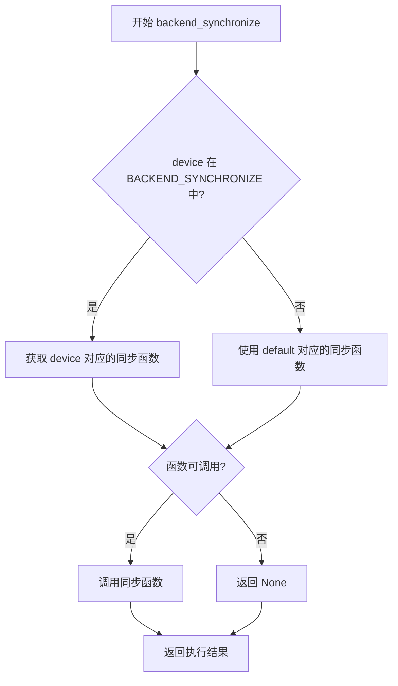
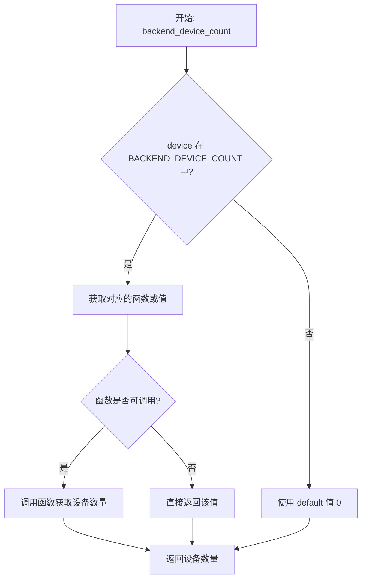
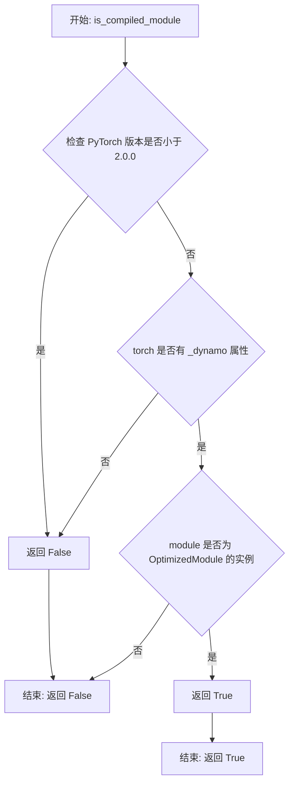
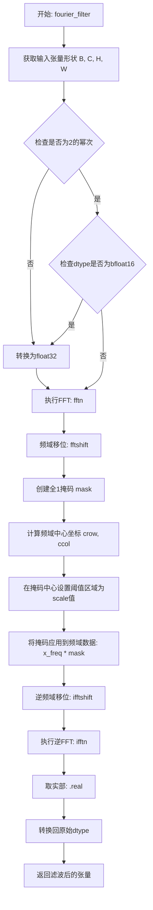
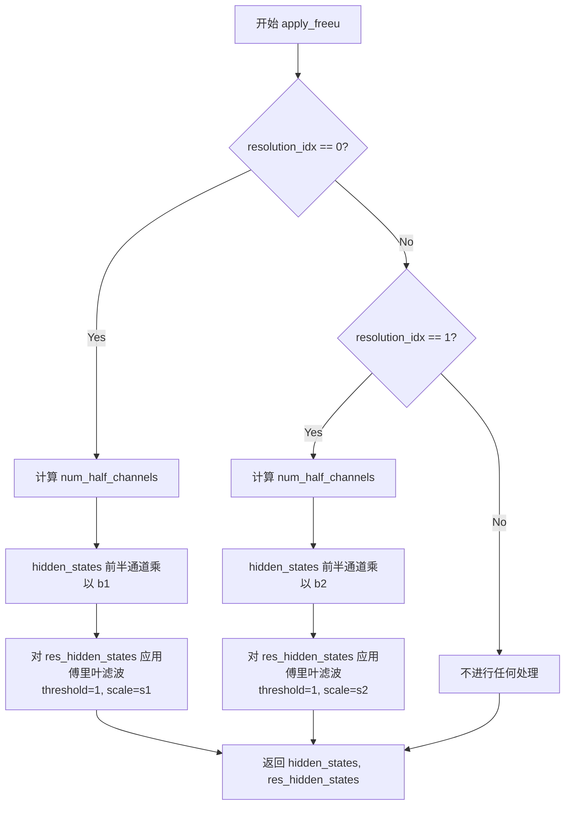
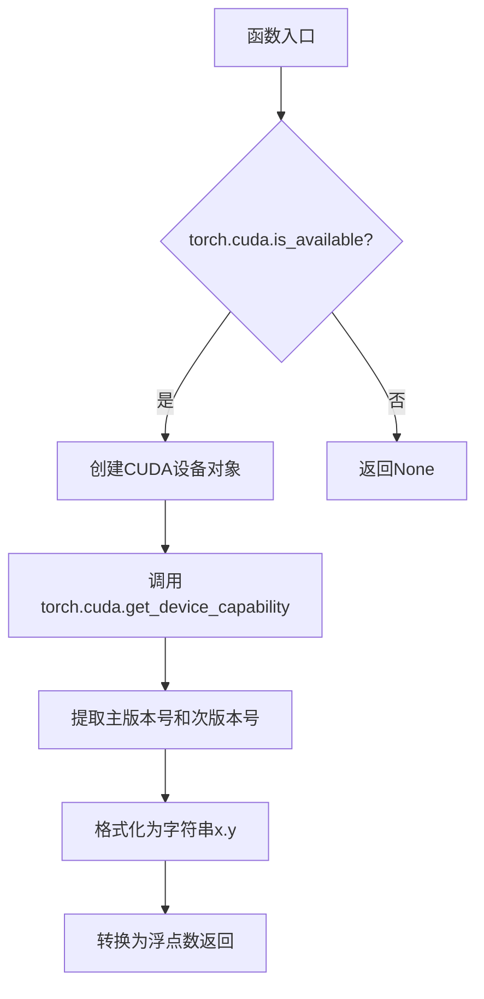
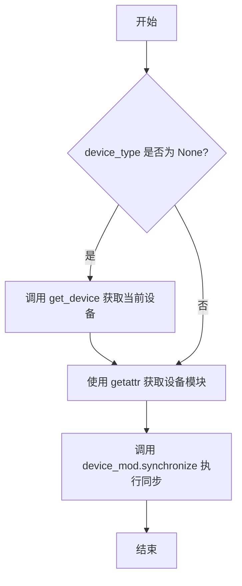

# `diffusers\src\diffusers\utils\torch_utils.py` 详细设计文档

HuggingFace Diffusers库的PyTorch工具模块，提供跨不同硬件加速器（CUDA、XPU、MPS、NPU、CPU）的设备无关操作接口，包括随机张量生成、内存管理、设备同步、FreeU机制应用以及确定性训练配置等功能。

## 整体流程

```mermaid
graph TD
    A[模块加载] --> B{is_torch_available()?}
B -- 否 --> C[仅导入基础模块]
B -- 是 --> D[初始化BACKEND_*字典]
D --> E[尝试导入torch._dynamo]
E --> F[定义_device_agnostic_dispatch函数]
F --> G[定义backend_*分发函数]
G --> H[定义randn_tensor函数]
H --> I[定义is_compiled_module和unwrap_module]
I --> J[定义FreeU相关函数]
J --> K[定义设备检测函数]
K --> L[定义确定性训练函数]
L --> M[初始化torch_device全局变量]
M --> N[模块加载完成]
```

## 类结构

```
pytorch_utils.py (工具模块，无类定义)
├── 全局变量 (BACKEND_* 字典集合)
├── 核心分发函数 (_device_agnostic_dispatch)
├── 设备分发函数 (backend_* 系列)
├── 张量操作函数 (randn_tensor)
├── 模块封装函数 (is_compiled_module, unwrap_module)
├── FreeU函数 (fourier_filter, apply_freeu)
├── 设备检测函数 (get_torch_cuda_device_capability, get_device)
└── 确定性训练函数 (enable_full_determinism, disable_full_determinism)
```

## 全局变量及字段


### `BACKEND_SUPPORTS_TRAINING`
    
存储不同设备后端是否支持训练功能的映射表

类型：`dict[str, bool]`
    


### `BACKEND_EMPTY_CACHE`
    
存储不同设备后端清空缓存方法的映射表

类型：`dict[str, callable | None]`
    


### `BACKEND_DEVICE_COUNT`
    
存储不同设备后端获取设备数量方法的映射表

类型：`dict[str, callable | int]`
    


### `BACKEND_MANUAL_SEED`
    
存储不同设备后端设置随机种子方法的映射表

类型：`dict[str, callable]`
    


### `BACKEND_RESET_PEAK_MEMORY_STATS`
    
存储不同设备后端重置峰值内存统计方法的映射表

类型：`dict[str, callable | None]`
    


### `BACKEND_RESET_MAX_MEMORY_ALLOCATED`
    
存储不同设备后端重置最大内存分配方法的映射表

类型：`dict[str, callable | None]`
    


### `BACKEND_MAX_MEMORY_ALLOCATED`
    
存储不同设备后端获取最大内存分配值的映射表

类型：`dict[str, callable | int]`
    


### `BACKEND_SYNCHRONIZE`
    
存储不同设备后端同步方法的映射表

类型：`dict[str, callable | None]`
    


### `maybe_allow_in_graph`
    
用于在torch.compile中允许特定类进入计算图的装饰器函数

类型：`callable`
    


### `torch_device`
    
当前PyTorch运行环境的主要计算设备类型字符串

类型：`str`
    


    

## 全局函数及方法


### `_device_agnostic_dispatch`

该函数是一个设备无关的调度函数，根据传入的 device 参数从 dispatch_table 中查找并调用对应的函数实现，支持 CUDA、XPU、CPU、MPS 等多种 PyTorch 设备后端，如果设备不存在于调度表中则回退到 "default" 实现。

参数：

- `device`：`str`，目标设备类型字符串（如 "cuda"、"xpu"、"cpu"、"mps" 等）
- `dispatch_table`：`dict[str, callable]`，设备到函数实现的映射字典，包含 "default" 键作为回退选项
- `*args`：可变位置参数，用于传递给调度表中对应的函数
- `**kwargs`：可变关键字参数，用于传递给调度表中对应的函数

返回值：任意类型，返回调度表中对应设备函数执行的返回值，如果函数不可调用则直接返回该值

#### 流程图

```mermaid
flowchart TD
    A[开始 _device_agnostic_dispatch] --> B{device 是否在 dispatch_table 中?}
    B -- 否 --> C[获取 dispatch_table['default']]
    C --> D{default 函数是否可调用?}
    D -- 是 --> E[调用 default 函数并传参 *args, **kwargs]
    D -- 否 --> F[直接返回 default 值]
    B -- 是 --> G[获取 dispatch_table[device] 对应的函数 fn]
    G --> H{fn 是否可调用?}
    H -- 否 --> I[直接返回 fn 的值]
    H -- 是 --> J[调用 fn 函数并传参 *args, **kwargs]
    E --> K[返回结果]
    F --> K
    I --> K
    J --> K
    K --> L[结束]
```

#### 带注释源码

```python
# This dispatches a defined function according to the accelerator from the function definitions.
def _device_agnostic_dispatch(device: str, dispatch_table: dict[str, callable], *args, **kwargs):
    """
    设备无关的函数调度函数，根据 device 参数从 dispatch_table 中选择对应的函数执行。
    
    Args:
        device: 目标设备类型字符串，用于从 dispatch_table 中查找对应的函数实现
        dispatch_table: 设备到函数实现的映射字典，键为设备名称字符串，值为可调用函数或任意值
        *args: 可变位置参数，传递给调度表中查找到的函数
        **kwargs: 可变关键字参数，传递给调度表中查找到的函数
    
    Returns:
        任意类型：返回调度表中对应设备函数执行的返回值
    """
    # 如果设备不在调度表中，使用 "default" 键对应的函数作为回退
    if device not in dispatch_table:
        return dispatch_table["default"](*args, **kwargs)

    # 从调度表中获取指定设备对应的函数实现
    fn = dispatch_table[device]

    # Some device agnostic functions return values. Need to guard against 'None' instead at
    # user level
    # 如果获取到的值不是可调用函数（如直接是一个值或 None），则直接返回该值
    if not callable(fn):
        return fn

    # 调用找到的函数，传入所有参数并返回结果
    return fn(*args, **kwargs)
```


### `backend_manual_seed`

该函数是一个设备无关的随机种子设置函数，通过设备类型分发到对应的后端（如 CUDA、XPU、CPU、MPS）执行具体的随机种子设置操作，实现了对不同硬件平台的统一接口封装。

参数：

- `device`：`str`，目标设备类型字符串，支持 "cuda"、"xpu"、"cpu"、"mps" 或 "default"
- `seed`：`int`，要设置的随机种子值，用于确保随机操作的可重复性

返回值：任意类型，返回对应后端 `manual_seed` 函数的返回值（通常为 `None`）

#### 流程图

```mermaid
flowchart TD
    A[开始 backend_manual_seed] --> B{device 是否在 BACKEND_MANUAL_SEED 中?}
    B -->|是| C[获取 BACKEND_MANUAL_SEED[device] 对应的函数]
    B -->|否| D[获取 BACKEND_MANUAL_SEED['default'] 对应的函数]
    C --> E{函数是否可调用?}
    D --> E
    E -->|是| F[调用对应的 manual_seed 函数, 传入 seed 参数]
    E -->|否| G[返回函数本身作为默认值]
    F --> H[返回函数执行结果]
    G --> H
    H[结束]
```

#### 带注释源码

```python
def backend_manual_seed(device: str, seed: int):
    """
    在指定设备上设置随机种子。
    
    这是一个设备无关的封装函数，根据 device 参数自动分派到
    对应的后端 (cuda, xpu, cpu, mps) 的 manual_seed 函数。
    
    参数:
        device: str, 目标设备类型，如 'cuda', 'xpu', 'cpu', 'mps'
        seed: int, 随机种子值
    
    返回:
        返回对应后端 manual_seed 函数的返回值（通常为 None）
    """
    # 调用设备无关分发函数，传入设备类型、映射表和种子参数
    # BACKEND_MANUAL_SEED 字典映射了各设备的 manual_seed 实现:
    # {
    #     "cuda": torch.cuda.manual_seed,
    #     "xpu": torch.xpu.manual_seed,
    #     "cpu": torch.manual_seed,
    #     "mps": torch.mps.manual_seed,
    #     "default": torch.manual_seed
    # }
    return _device_agnostic_dispatch(device, BACKEND_MANUAL_SEED, seed)
```


### `backend_synchronize`

该函数是一个设备无关的同步函数，用于根据传入的设备类型（device）调度相应的后端同步操作（如 CUDA 或 XPU 设备的同步），以确保设备上的所有计算完成。

参数：

- `device`：`str`，目标设备标识符（如 "cuda"、"xpu"、"cpu"、"mps" 等）

返回值：`Any`，返回对应设备的同步函数（如 `torch.cuda.synchronize` 或 `torch.xpu.synchronize`），如果设备不支持同步则返回 `None`

#### 流程图



#### 带注释源码

```python
def backend_synchronize(device: str):
    """
    根据设备类型调度相应的后端同步函数。
    
    参数:
        device: 字符串，指定目标设备类型（如 "cuda", "xpu", "cpu", "mps"）
    
    返回:
        返回对应设备的同步函数调用结果，如果设备不支持同步则返回 None
    """
    # 调用设备无关调度函数，根据 device 参数从 BACKEND_SYNCHRONIZE 字典中
    # 获取对应的同步函数并执行
    # BACKEND_SYNCHRONIZE 字典定义如下:
    # {
    #     "cuda": torch.cuda.synchronize,    # CUDA 设备同步
    #     "xpu": getattr(torch.xpu, "synchronize", None),  # XPU 设备同步
    #     "cpu": None,   # CPU 不支持同步操作
    #     "mps": None,   # MPS 不支持同步操作
    #     "default": None  # 默认返回 None
    # }
    return _device_agnostic_dispatch(device, BACKEND_SYNCHRONIZE)
```


### `backend_empty_cache`

该函数是一个设备无关的缓存清理分发函数，根据传入的设备类型参数，从预定义的 `BACKEND_EMPTY_CACHE` 字典中获取对应设备的缓存清理函数并执行，用于清空 GPU、IPU 等设备的显存/缓存。

参数：

-  `device`：`str`，目标设备类型，支持 "cuda"（NVIDIA GPU）、"xpu"（Intel GPU）、"cpu"（中央处理器）、"mps"（Apple Silicon）等

返回值：`任意`，返回对应设备的 `empty_cache` 方法调用结果（对于 cuda/xpu/mps 返回 None，对于 cpu/default 返回 None），实际上是通过 `_device_agnostic_dispatch` 分发后的结果

#### 流程图

```mermaid
flowchart TD
    A[开始: backend_empty_cache] --> B{device in BACKEND_EMPTY_CACHE?}
    B -->|是| C[获取 dispatch_table[device] 的函数]
    B -->|否| D[使用 dispatch_table['default'] 即 None]
    C --> E{fn 可调用?}
    D --> E
    E -->|是| F[调用 fn 清理缓存]
    E -->|否| G[直接返回 fn 值]
    F --> H[结束]
    G --> H
```

#### 带注释源码

```python
def backend_empty_cache(device: str):
    """
    根据设备类型分发调用对应的后端缓存清理函数
    
    Args:
        device: 设备类型字符串，如 'cuda', 'xpu', 'mps', 'cpu' 等
        
    Returns:
        返回对应设备的 empty_cache 方法调用结果（实际上返回 None）
    """
    # 调用设备无关的分发函数，从 BACKEND_EMPTY_CACHE 字典中查找并执行
    # BACKEND_EMPTY_CACHE = {
    #     "cuda": torch.cuda.empty_cache,   # NVIDIA GPU 缓存清理
    #     "xpu": torch.xpu.empty_cache,     # Intel XPU 缓存清理
    #     "cpu": None,                      # CPU 无需清理缓存
    #     "mps": torch.mps.empty_cache,     # Apple MPS 缓存清理
    #     "default": None,                  # 默认无操作
    # }
    return _device_agnostic_dispatch(device, BACKEND_EMPTY_CACHE)
```


### `backend_device_count`

获取指定计算后端的设备数量。该函数是一个设备无关的调度函数，根据传入的 `device` 参数从 `BACKEND_DEVICE_COUNT` 字典中获取对应的设备计数方法并执行，返回该后端的设备数量。

参数：

- `device`：`str`，指定计算后端类型（如 "cuda"、"xpu"、"cpu"、"mps" 等）

返回值：`int`，返回指定后端的设备数量。对于 CUDA 和 XPU 后端，调用相应的 `device_count` 方法获取真实数量；对于 CPU 和 MPS 后端，返回 0；对于未知后端，使用默认值 0。

#### 流程图



#### 带注释源码

```python
def backend_device_count(device: str):
    """
    获取指定计算后端的设备数量。
    
    这是一个设备无关的调度函数，根据传入的 device 参数从预定义的
    BACKEND_DEVICE_COUNT 字典中获取对应的设备计数方法或值。
    
    支持的后端：
    - cuda: 调用 torch.cuda.device_count()
    - xpu: 调用 torch.xpu.device_count()
    - cpu: 返回 0（CPU 不支持多设备）
    - mps: 返回 0（MPS 不支持多设备）
    - default: 返回 0（未知后端的默认值）
    
    Args:
        device (str): 计算设备类型标识符
        
    Returns:
        int: 指定后端的设备数量
    """
    # 调用通用的设备无关调度函数，传入设备类型和设备计数字典
    return _device_agnostic_dispatch(device, BACKEND_DEVICE_COUNT)
```


### `backend_reset_peak_memory_stats`

该函数是一个设备无关的内存统计重置函数，用于重置指定计算设备（cuda/xpu/cpu/mps）的峰值内存统计信息。它通过设备类型分发机制，调用对应 PyTorch 后端的 `reset_peak_memory_stats` 方法，实现跨不同硬件平台（CUDA、XPU、CPU、MPS）的统一接口。

参数：

- `device`：`str`，目标计算设备标识符（如 "cuda"、"xpu"、"cpu"、"mps"）

返回值：`Any`，返回对应设备后端的 `reset_peak_memory_stats` 函数的执行结果，若设备不支持该功能则返回 `None`

#### 流程图

```mermaid
flowchart TD
    A[开始 backend_reset_peak_memory_stats] --> B{device 是否在 dispatch_table 中}
    B -->|是| C[获取 dispatch_table[device] 对应的函数]
    B -->|否| D[获取 dispatch_table['default'] 对应的函数]
    C --> E{函数是否可调用}
    D --> E
    E -->|是| F[调用该函数并返回结果]
    E -->|否| G[返回 None]
    F --> H[结束]
    G --> H
```

#### 带注释源码

```python
def backend_reset_peak_memory_stats(device: str):
    """
    重置指定设备的峰值内存统计信息。
    
    这是一个设备无关的封装函数，根据传入的 device 参数，
    自动分发到对应的 PyTorch 后端（CUDA、XPU 等）的 reset_peak_memory_stats 方法。
    
    参数:
        device: 目标设备字符串标识，可选值为 "cuda", "xpu", "cpu", "mps" 等
        
    返回:
        对应后端函数的返回值，若设备不支持则返回 None
    """
    # 调用设备无关的分发函数，传入设备类型和后端函数映射表
    return _device_agnostic_dispatch(device, BACKEND_RESET_PEAK_MEMORY_STATS)
```


### `backend_reset_max_memory_allocated`

该函数是一个设备无关的内存管理工具函数，用于重置指定设备上的最大内存分配计数器。它通过设备分发表（dispatch table）根据传入的设备类型动态调用对应的后端 PyTorch 内存重置函数。

参数：

- `device`：`str`，目标设备类型，支持 "cuda"、"xpu"、"cpu"、"mps" 等，用于确定调用哪个后端的内存重置函数

返回值：`any`，返回所调用后端函数的结果。如果设备对应的后端函数为 `None` 或不可调用，则返回 `None`。

#### 流程图

```mermaid
flowchart TD
    A[开始: backend_reset_max_memory_allocated] --> B{device 是否在 dispatch_table 中}
    B -->|是| C[获取 dispatch_table[device] 对应的函数 fn]
    B -->|否| D[使用 dispatch_table['default'] 作为函数 fn]
    C --> E{fn 是否可调用}
    D --> E
    E -->|是| F[调用 fn 返回结果]
    E -->|否| G[直接返回 fn 的值]
    F --> H[结束: 返回结果]
    G --> H
```

#### 带注释源码

```python
def backend_reset_max_memory_allocated(device: str):
    """
    重置指定设备的最大内存分配统计信息。
    
    这是一个设备无关的包装函数，通过设备分发表动态调用
    对应设备的后端 PyTorch 内存重置函数。
    
    参数:
        device: 设备类型字符串，如 'cuda', 'xpu', 'cpu', 'mps' 等
        
    返回:
        返回对应后端函数的结果；对于不支持的设备返回 None
    """
    # 调用设备无关的分发函数，传入设备类型和后端分发表
    # BACKEND_RESET_MAX_MEMORY_ALLOCATED 定义了各设备对应的内存重置函数:
    # {
    #     "cuda": torch.cuda.reset_max_memory_allocated,  # CUDA 设备
    #     "xpu": getattr(torch.xpu, "reset_peak_memory_stats", None),  # XPU 设备（注意：此处使用了错误的函数名）
    #     "cpu": None,  # CPU 不支持此操作
    #     "mps": None,  # MPS 不支持此操作
    #     "default": None  # 默认返回 None
    # }
    return _device_agnostic_dispatch(device, BACKEND_RESET_MAX_MEMORY_ALLOCATED)
```


### `backend_max_memory_allocated`

该函数是一个设备无关的内存查询工具，用于获取指定设备上已分配的最大 GPU 内存大小。通过设备类型的分发机制，它能够自动适配 CUDA、XPU、CPU、MPS 等多种硬件平台，将请求转发给对应的 PyTorch 后端函数或返回默认值。

参数：

- `device`：`str`，目标设备类型（如 "cuda"、"xpu"、"cpu"、"mps" 等）

返回值：`int | torch.cuda.MaxMemoryAllocatedCallback`，返回指定设备上已分配的最大内存字节数（对于 CPU 和 MPS 返回 0）

#### 流程图

```mermaid
flowchart TD
    A[开始: backend_max_memory_allocated] --> B{device 在 dispatch_table 中?}
    B -- 是 --> C[获取 fn = dispatch_table[device]]
    B -- 否 --> D[获取 fn = dispatch_table['default']]
    C --> E{fn 可调用?}
    D --> E
    E -- 是 --> F[调用 fn 并返回结果]
    E -- 否 --> G[直接返回 fn 值]
    F --> H[结束: 返回结果]
    G --> H
    
    subgraph "设备特定处理"
    C1[cuda: torch.cuda.max_memory_allocated]
    C2[xpu: torch.xpu.max_memory_allocated]
    C3[cpu: 返回 0]
    C4[mps: 返回 0]
    end
```

#### 带注释源码

```python
def backend_max_memory_allocated(device: str):
    """
    获取指定设备上已分配的最大 GPU 内存大小。
    
    这是一个设备无关的封装函数，根据传入的 device 参数自动分发到
    对应的 PyTorch 后端函数。支持的设备包括 cuda、xpu、cpu、mps 等。
    
    参数:
        device: 字符串形式的设备标识符，如 "cuda", "xpu", "cpu", "mps"
        
    返回:
        对于 cuda/xpu 设备，返回 torch.cuda.max_memory_allocated 或
        torch.xpu.max_memory_allocated 的调用结果（最大内存字节数）；
        对于 cpu/mps 设备，返回 0（这些设备不支持内存分配统计）
    """
    # 调用通用的设备无关分发函数，将请求转发到 BACKEND_MAX_MEMORY_ALLOCATED 字典
    # 该字典映射了不同设备到其对应的 max_memory_allocated 函数或默认值
    return _device_agnostic_dispatch(device, BACKEND_MAX_MEMORY_ALLOCATED)
```


### `backend_supports_training`

该函数用于判断给定的 PyTorch 后端设备是否支持训练功能。它通过查询预定义的 `BACKEND_SUPPORTS_TRAINING` 字典来确定设备是否支持训练，如果 PyTorch 不可用则直接返回 False。

参数：

-  `device`：`str`，设备类型字符串，如 "cuda"、"xpu"、"cpu" 或 "mps" 等

返回值：`bool`，返回 True 表示该后端支持训练功能，返回 False 表示不支持训练

#### 流程图

```mermaid
flowchart TD
    A[开始] --> B{is_torch_available?}
    B -- 否 --> C[返回 False]
    B -- 是 --> D{device in BACKEND_SUPPORTS_TRAINING?}
    D -- 否 --> E[device = "default"]
    D -- 是 --> F[保持 device 不变]
    E --> G[返回 BACKEND_SUPPORTS_TRAINING[device]]
    F --> G
```

#### 带注释源码

```python
# 这些是可返回布尔行为标志的调用，可用于在功能不支持时指定一些设备无关的替代方案
def backend_supports_training(device: str):
    """检查给定的 PyTorch 后端是否支持训练功能
    
    Args:
        device (str): 设备类型，如 "cuda", "xpu", "cpu", "mps"
    
    Returns:
        bool: 如果后端支持训练则返回 True，否则返回 False
    """
    # 首先检查 PyTorch 是否可用，如果不可用则直接返回 False
    if not is_torch_available():
        return False

    # 如果设备不在预定义的 BACKEND_SUPPORTS_TRAINING 字典中，
    # 则使用 "default" 作为后备值
    if device not in BACKEND_SUPPORTS_TRAINING:
        device = "default"

    # 从字典中返回对应设备的训练支持状态
    return BACKEND_SUPPORTS_TRAINING[device]
```

#### 相关全局变量

- `BACKEND_SUPPORTS_TRAINING`：`dict[str, bool]`，定义了各后端是否支持训练的字典，键为设备类型（"cuda"、"xpu"、"cpu"、"mps"、"default"），值为布尔值表示是否支持训练


### `randn_tensor`

该函数是一个辅助函数，用于在指定设备上创建具有指定数据类型和布局的随机张量。当传入生成器列表时，可以为每个批次大小单独设置随机种子。如果传入CPU生成器，张量始终在CPU上创建，然后再移动到目标设备。

参数：

- `shape`：`tuple | list`，张量的形状
- `generator`：`list["torch.Generator"] | "torch.Generator" | None`，用于随机数生成的PyTorch生成器，支持单个或列表形式
- `device`：`str | torch.device | None`，目标设备，默认为CPU
- `dtype`：`torch.dtype | None`，张量的数据类型
- `layout`：`torch.layout | None`，张量的内存布局，默认为torch.strided

返回值：`torch.Tensor`，生成的随机张量

#### 流程图

```mermaid
flowchart TD
    A[开始 randn_tensor] --> B{device是字符串?}
    B -->|是| C[转换为torch.device]
    B -->|否| D[rand_device = device]
    C --> D
    D --> E[batch_size = shape[0]]
    E --> F[layout = layout or torch.strided]
    F --> G[device = device or cpu]
    G --> H{generator is not None?}
    H -->|是| I{generator是列表?}
    H -->|否| M[直接生成张量]
    I -->|是| J[检查第一个generator的设备类型]
    I -->|否| K[gen_device_type = generator.device.type]
    J --> L{gen_device_type != device.type?}
    K --> L
    L -->|是| M1{gen_device_type == 'cpu'?}
    L -->|否| N[rand_device = device]
    M1 -->|是| O[rand_device = 'cpu']
    M1 -->|否| P[抛出ValueError]
    O --> Q[日志提示]
    Q --> R{generator列表长度==1?}
    R -->|是| S[generator = generator[0]]
    R -->|否| T[为每个generator生成张量]
    T --> U[沿dim=0拼接并移动到device]
    M --> V[torch.randn生成张量]
    S --> V
    U --> W[返回张量]
    V --> W
    N --> V
    P --> X[结束]
```

#### 带注释源码

```python
def randn_tensor(
    shape: tuple | list,
    generator: list["torch.Generator"] | "torch.Generator" | None = None,
    device: str | "torch.device" | None = None,
    dtype: "torch.dtype" | None = None,
    layout: "torch.layout" | None = None,
):
    """A helper function to create random tensors on the desired `device` with the desired `dtype`. When
    passing a list of generators, you can seed each batch size individually. If CPU generators are passed, the tensor
    is always created on the CPU.
    """
    # 如果device是字符串形式，转换为torch.device对象
    if isinstance(device, str):
        device = torch.device(device)
    
    # 随机设备默认为目标device
    rand_device = device
    # 从shape中获取batch_size
    batch_size = shape[0]

    # 默认布局为连续内存布局
    layout = layout or torch.strided
    # 默认设备为CPU
    device = device or torch.device("cpu")

    # 如果提供了generator，检查其设备类型
    if generator is not None:
        # 获取generator的设备类型
        gen_device_type = generator.device.type if not isinstance(generator, list) else generator[0].device.type
        
        # 如果generator设备与目标设备不同且generator是CPU设备
        if gen_device_type != device.type and gen_device_type == "cpu":
            rand_device = "cpu"  # 先在CPU上创建
            if device != "mps":
                # 记录日志，提示用户使用目标设备的generator可以加速
                logger.info(
                    f"The passed generator was created on 'cpu' even though a tensor on {device} was expected."
                    f" Tensors will be created on 'cpu' and then moved to {device}. Note that one can probably"
                    f" slightly speed up this function by passing a generator that was created on the {device} device."
                )
        # 如果generator是CUDA设备但目标设备不是CUDA，抛出错误
        elif gen_device_type != device.type and gen_device_type == "cuda":
            raise ValueError(f"Cannot generate a {device} tensor from a generator of type {gen_device_type}.")

    # 如果generator列表长度为1，则视为单个generator处理
    if isinstance(generator, list) and len(generator) == 1:
        generator = generator[0]

    # 如果generator是列表，为每个batch size生成独立的随机张量
    if isinstance(generator, list):
        shape = (1,) + shape[1:]  # 将shape调整为每个generator生成一个样本
        latents = [
            torch.randn(shape, generator=generator[i], device=rand_device, dtype=dtype, layout=layout)
            for i in range(batch_size)
        ]
        # 沿第0维拼接所有张量，然后移动到目标设备
        latents = torch.cat(latents, dim=0).to(device)
    else:
        # 单个generator或None，直接生成随机张量
        latents = torch.randn(shape, generator=generator, device=rand_device, dtype=dtype, layout=layout).to(device)

    return latents
```


### `is_compiled_module`

检查传入的 PyTorch 模块是否通过 `torch.compile()` 编译而成。该函数通过判断模块是否为 `torch._dynamo.eval_frame.OptimizedModule` 的实例来确认其是否经过了编译优化。

参数：

- `module`：`torch.nn.Module`，要检查的 PyTorch 模块对象

返回值：`bool`，如果模块是通过 `torch.compile()` 编译的则返回 `True`，否则返回 `False`

#### 流程图



#### 带注释源码

```python
def is_compiled_module(module) -> bool:
    """Check whether the module was compiled with torch.compile()"""
    # 首先检查 PyTorch 版本是否低于 2.0.0，
    # 因为 torch.compile 是 2.0.0 版本引入的新功能
    if is_torch_version("<", "2.0.0") or not hasattr(torch, "_dynamo"):
        return False
    
    # 如果 PyTorch 版本 >= 2.0.0，则检查模块是否为 OptimizedModule 实例
    # OptimizedModule 是 torch.compile() 编译模块时生成的包装类
    return isinstance(module, torch._dynamo.eval_frame.OptimizedModule)
```


### `unwrap_module`

该函数用于解包（unwrap）通过 `torch.compile()` 编译后的 PyTorch 模块，返回原始的未编译模块。如果模块未经过编译，则直接返回原模块。

参数：

- `module`：`torch.nn.Module`，需要解包的 PyTorch 模块

返回值：`torch.nn.Module`，如果是编译后的模块则返回原始模块（`_orig_mod`），否则返回原模块本身

#### 流程图

```mermaid
flowchart TD
    A[开始 unwrap_module] --> B{is_compiled_module(module)?}
    B -->|是| C[返回 module._orig_mod]
    B -->|否| D[返回 module]
    C --> E[结束]
    D --> E
```

#### 带注释源码

```python
def unwrap_module(module):
    """Unwraps a module if it was compiled with torch.compile()"""
    # 检查模块是否由 torch.compile() 编译而成
    # 如果是编译模块，返回其原始模块 _orig_mod 属性
    # 如果不是编译模块，直接返回原模块
    return module._orig_mod if is_compiled_module(module) else module
```


### `fourier_filter`

该函数实现了FreeU论文中提出的傅里叶滤波（Fourier Filter）机制，用于在频域对特征图进行滤波处理，通过抑制或增强低频成分来改善图像生成质量。函数首先对输入张量进行快速傅里叶变换（FFT），然后在频域中心创建一个环形掩码对特定频率区域进行缩放，最后通过逆FFT（IFFT）将处理后的频域数据转换回空域。

参数：

- `x_in`：`torch.Tensor`，输入的四维张量，形状为 (B, C, H, W)，代表批量大小、通道数、高度和宽度
- `threshold`：`int`，频域中心掩码的半径，用于确定要滤波的频率范围
- `scale`：`int`，掩码的缩放因子，用于增强或抑制指定频率区域的幅度

返回值：`torch.Tensor`，返回滤波后的四维张量，形状与输入相同 (B, C, H, W)，数据类型与输入张量相同

#### 流程图



#### 带注释源码

```python
def fourier_filter(x_in: "torch.Tensor", threshold: int, scale: int) -> "torch.Tensor":
    """Fourier filter as introduced in FreeU (https://huggingface.co/papers/2309.11497).

    This version of the method comes from here:
    https://github.com/huggingface/diffusers/pull/5164#issuecomment-1732638706
    """
    # 将输入张量赋值给局部变量x
    x = x_in
    # 获取批量大小B、通道数C、高度H和宽度W
    B, C, H, W = x.shape

    # Non-power of 2 images must be float32
    # 检查宽度和高度是否为2的幂次方，如果不是则转换为float32
    # 因为非2的幂次图像使用fftn可能会有问题
    if (W & (W - 1)) != 0 or (H & (H - 1)) != 0:
        x = x.to(dtype=torch.float32)
    # fftn does not support bfloat16
    # PyTorch的fftn不支持bfloat16数据类型，需要转换为float32
    elif x.dtype == torch.bfloat16:
        x = x.to(dtype=torch.float32)

    # FFT
    # 使用fftn在最后两个维度（高度和宽度）上进行快速傅里叶变换
    x_freq = fftn(x, dim=(-2, -1))
    # 使用fftshift将零频率分量移动到频域中心，便于后续掩码操作
    x_freq = fftshift(x_freq, dim=(-2, -1))

    # 重新获取变换后的形状（与输入形状相同）
    B, C, H, W = x_freq.shape
    # 创建与频域数据形状相同的全1掩码，设备与输入张量相同
    mask = torch.ones((B, C, H, W), device=x.device)

    # 计算频域中心坐标
    crow, ccol = H // 2, W // 2
    # 在掩码的中心区域（由threshold决定半径）设置为scale值
    # 这会放大或缩小中心频率区域的幅度
    mask[..., crow - threshold : crow + threshold, ccol - threshold : ccol + threshold] = scale
    # 将掩码应用到频域数据上
    x_freq = x_freq * mask

    # IFFT
    # 逆频域移位，将数据从中心移回原始位置
    x_freq = ifftshift(x_freq, dim=(-2, -1))
    # 执行逆FFT变换回空域
    x_filtered = ifftn(x_freq, dim=(-2, -1)).real

    # 转换回原始输入的数据类型并返回
    return x_filtered.to(dtype=x_in.dtype)
```


### `apply_freeu`

该函数实现了 FreeU 机制，通过对 UNet 中不同分辨率的特征进行频域滤波和通道缩放，从而改善扩散模型的生成质量。函数根据 resolution_idx 参数对 hidden_states 进行通道缩放，对 res_hidden_states 进行傅里叶滤波处理，最后返回处理后的两个张量。

参数：

- `resolution_idx`：`int`，表示 UNet 中的块索引，用于决定应用哪种 FreeU 处理策略（0 或 1）
- `hidden_states`：`torch.Tensor`，底层块的输入特征
- `res_hidden_states`：`torch.Tensor`，来自跳跃连接的跳过特征
- `**freeu_kwargs`：可变关键字参数，包含 s1、s2、b1、b2 四个缩放因子

返回值：`tuple[torch.Tensor", "torch.Tensor"]`，返回处理后的 hidden_states 和 res_hidden_states

#### 流程图



#### 带注释源码

```python
def apply_freeu(
    resolution_idx: int, hidden_states: "torch.Tensor", res_hidden_states: "torch.Tensor", **freeu_kwargs
) -> tuple["torch.Tensor", "torch.Tensor"]:
    """Applies the FreeU mechanism as introduced in https:
    //arxiv.org/abs/2309.11497. Adapted from the official code repository: https://github.com/ChenyangSi/FreeU.

    Args:
        resolution_idx (`int`): Integer denoting the UNet block where FreeU is being applied.
        hidden_states (`torch.Tensor`): Inputs to the underlying block.
        res_hidden_states (`torch.Tensor`): Features from the skip block corresponding to the underlying block.
        s1 (`float`): Scaling factor for stage 1 to attenuate the contributions of the skip features.
        s2 (`float`): Scaling factor for stage 2 to attenuate the contributions of the skip features.
        b1 (`float`): Scaling factor for stage 1 to amplify the contributions of backbone features.
        b2 (`float`): Scaling factor for stage 2 to amplify the contributions of backbone features.
    """
    # 处理分辨率索引为0的情况（对应UNet的早期层）
    if resolution_idx == 0:
        # 计算通道数的一半，用于分离特征
        num_half_channels = hidden_states.shape[1] // 2
        # 对前半部分通道进行放大，增强主干特征
        hidden_states[:, :num_half_channels] = hidden_states[:, :num_half_channels] * freeu_kwargs["b1"]
        # 对跳过连接的特征进行频域滤波，衰减高频成分
        res_hidden_states = fourier_filter(res_hidden_states, threshold=1, scale=freeu_kwargs["s1"])
    
    # 处理分辨率索引为1的情况（对应UNet的中期层）
    if resolution_idx == 1:
        # 计算通道数的一半
        num_half_channels = hidden_states.shape[1] // 2
        # 对前半部分通道进行放大
        hidden_states[:, :num_half_channels] = hidden_states[:, :num_half_channels] * freeu_kwargs["b2"]
        # 对跳过连接的特征进行频域滤波
        res_hidden_states = fourier_filter(res_hidden_states, threshold=1, scale=freeu_kwargs["s2"])

    # 返回处理后的特征
    return hidden_states, res_hidden_states
```


### `get_torch_cuda_device_capability`

该函数用于检测当前环境中 CUDA 是否可用，如果可用则获取 CUDA 设备的计算能力（Compute Capability）并以浮点数形式返回，否则返回 None。

参数： 无

返回值：`float | None`，如果 CUDA 可用则返回 GPU 的计算能力版本号（如 7.0、8.0 等），否则返回 `None`

#### 流程图



#### 带注释源码

```python
def get_torch_cuda_device_capability():
    """
    获取 CUDA 设备的计算能力（Compute Capability）。
    
    Returns:
        float | None: 如果 CUDA 可用，返回设备计算能力版本号（如 7.0）；
                     如果 CUDA 不可用，返回 None。
    """
    # 检查 CUDA 是否可用（需要安装 CUDA 版本的 PyTorch）
    if torch.cuda.is_available():
        # 创建一个 CUDA 设备对象，默认使用第一个 GPU (id=0)
        device = torch.device("cuda")
        
        # 获取指定设备的计算能力，返回值为元组 (major, minor)
        # 例如：RTX 3090 返回 (8, 6) 表示 Compute Capability 8.6
        compute_capability = torch.cuda.get_device_capability(device)
        
        # 将元组格式化为字符串，如 (8, 6) -> "8.6"
        compute_capability = f"{compute_capability[0]}.{compute_capability[1]}"
        
        # 转换为浮点数返回，如 "8.6" -> 8.6
        return float(compute_capability)
    else:
        # CUDA 不可用的情况：
        # - 未安装 CUDA 版本 PyTorch
        # - 没有可用的 NVIDIA GPU
        # - GPU 驱动未正确安装
        return None
```


### `get_device`

该函数是一个设备检测工具，用于自动检测并返回当前环境可用的 PyTorch 计算设备。它按照优先级顺序检查 CUDA、NPU、XPU、MPS、MLU 等加速设备，若均不可用则返回 CPU 设备。该函数使用 `@functools.lru_cache` 装饰器进行结果缓存，确保在同一执行环境中只进行一次设备检测，提高后续调用的性能。

参数：

- （无参数）

返回值：`str`，返回当前可用的 PyTorch 设备名称字符串（"cuda"、"npu"、"xpu"、"mps"、"mlu" 或 "cpu"）

#### 流程图

```mermaid
flowchart TD
    A([开始 get_device]) --> B{CUDA 可用?}
    B -->|是| C[返回 "cuda"]
    B -->|否| D{NPU 可用?}
    D -->|是| E[返回 "npu"]
    D -->|否| F{XPU 可用?}
    F -->|是| G[返回 "xpu"]
    F -->|否| H{MPS 可用?}
    H -->|是| I[返回 "mps"]
    H -->|否| J{MLU 可用?}
    J -->|是| K[返回 "mlu"]
    J -->|否| L[返回 "cpu"]
    
    C --> M([结束])
    E --> M
    G --> M
    I --> M
    K --> M
    L --> M
```

#### 带注释源码

```python
@functools.lru_cache
def get_device():
    """自动检测并返回当前可用的 PyTorch 计算设备。
    
    该函数按照优先级顺序检查以下设备：
    1. CUDA (NVIDIA GPU)
    2. NPU (华为昇腾)
    3. XPU (Intel GPU)
    4. MPS (Apple Silicon GPU)
    5. MLU (寒武纪 AI 芯片)
    6. CPU (默认 fallback)
    
    Returns:
        str: 可用设备的字符串标识符 ("cuda", "npu", "xpu", "mps", "mlu", "cpu")
    """
    # 检查 NVIDIA CUDA 是否可用
    if torch.cuda.is_available():
        return "cuda"
    # 检查华为 NPU (Ascend) 是否可用
    elif is_torch_npu_available():
        return "npu"
    # 检查 Intel XPU 是否可用
    elif hasattr(torch, "xpu") and torch.xpu.is_available():
        return "xpu"
    # 检查 Apple MPS (Metal Performance Shaders) 是否可用
    elif torch.backends.mps.is_available():
        return "mps"
    # 检查寒武纪 MLU 是否可用
    elif is_torch_mlu_available():
        return "mlu"
    # 所有加速设备均不可用，返回 CPU
    else:
        return "cpu"
```


### `empty_device_cache`

该函数用于清空指定设备类型的 GPU 缓存。如果未指定设备类型，则自动检测当前设备。对于 CPU 设备，由于没有缓存概念，函数直接返回。对于其他设备（如 CUDA、XPU、MPS 等），函数会获取对应的 PyTorch 模块并调用其 `empty_cache()` 方法释放未使用的 GPU 显存。

参数：

- `device_type`：`str | None`，可选参数，指定要清空缓存的设备类型（如 "cuda"、"xpu"、"mps" 等），如果为 `None` 则自动检测当前设备

返回值：`None`，该函数无返回值

#### 流程图

```mermaid
flowchart TD
    A[开始 empty_device_cache] --> B{device_type is None?}
    B -->|是| C[调用 get_device() 获取设备类型]
    B -->|否| D{device_type == 'cpu'?}
    C --> D
    D -->|是| E[直接返回]
    D -->|否| F[获取 torch 模块: getattr(torch, device_type, torch.cuda)]
    F --> G[调用 device_mod.empty_cache()]
    G --> H[结束]
    E --> H
```

#### 带注释源码

```python
def empty_device_cache(device_type: str | None = None):
    """
    清空指定设备类型的 GPU 缓存。
    
    Args:
        device_type: 设备类型字符串，可选值包括 'cuda', 'xpu', 'mps', 'cpu' 等。
                     如果为 None，则自动检测当前设备。
    """
    # 如果未指定设备类型，则自动获取当前设备
    if device_type is None:
        device_type = get_device()
    
    # CPU 设备没有缓存概念，直接返回
    if device_type in ["cpu"]:
        return
    
    # 获取对应的 PyTorch 设备模块
    # 如果 device_type 不存在，则默认使用 torch.cuda
    # 例如：torch.cuda, torch.xpu, torch.mps 等
    device_mod = getattr(torch, device_type, torch.cuda)
    
    # 调用设备模块的 empty_cache 方法释放 GPU 缓存
    device_mod.empty_cache()
```


### `device_synchronize`

该函数用于同步指定设备（GPU、XPU 等）的执行，确保所有在该设备上的操作已完成。它通过获取对应设备模块并调用其 `synchronize()` 方法来实现跨设备的同步操作。

参数：

- `device_type`：`str | None`，要同步的设备类型（如 "cuda"、"xpu" 等），如果为 `None` 则自动获取当前默认设备

返回值：`None`，该函数不返回任何值，仅执行同步操作

#### 流程图



#### 带注释源码

```python
def device_synchronize(device_type: str | None = None):
    """同步指定设备的执行，确保所有设备操作已完成。
    
    Args:
        device_type: 设备类型字符串，如 'cuda'、'xpu' 等。如果为 None，则自动获取当前默认设备。
    """
    # 如果未指定设备类型，则自动检测当前可用的设备
    if device_type is None:
        device_type = get_device()
    
    # 动态获取对应的设备模块，fallback 到 torch.cuda
    # 支持 cuda、xpu 等多种后端设备
    device_mod = getattr(torch, device_type, torch.cuda)
    
    # 调用设备模块的 synchronize 方法进行同步
    # 对于 CUDA 会等待所有 GPU 操作完成
    # 对于 XPU 会等待所有 Intel GPU 操作完成
    device_mod.synchronize()
```


### `enable_full_determinism`

用于在分布式训练中实现可重现行为的辅助函数，通过设置环境变量和PyTorch后端选项来启用完全确定性模式。

参数：

- 该函数无参数

返回值：`None`，无返回值描述

#### 流程图

```mermaid
flowchart TD
    A[开始 enable_full_determinism] --> B[设置环境变量 CUDA_LAUNCH_BLOCKING=1]
    B --> C[设置环境变量 CUBLAS_WORKSPACE_CONFIG=:16:8]
    C --> D[调用 torch.use_deterministic_algorithms(True)]
    D --> E[设置 torch.backends.cudnn.deterministic = True]
    E --> F[设置 torch.backends.cudnn.benchmark = False]
    F --> G[设置 torch.backends.cuda.matmul.allow_tf32 = False]
    G --> H[结束函数]
```

#### 带注释源码

```
def enable_full_determinism():
    """
    Helper function for reproducible behavior during distributed training. See
    - https://pytorch.org/docs/stable/notes/randomness.html for pytorch
    """
    # Enable PyTorch deterministic mode. This potentially requires either the environment
    # variable 'CUDA_LAUNCH_BLOCKING' or 'CUBLAS_WORKSPACE_CONFIG' to be set,
    # depending on the CUDA version, so we set them both here
    
    # 设置 CUDA_LAUNCH_BLOCKING 环境变量为 "1"
    # 强制 CUDA 内核按顺序同步执行，便于调试和确保确定性
    os.environ["CUDA_LAUNCH_BLOCKING"] = "1"
    
    # 设置 CUBLAS 工作区配置为 ":16:8"
    # 控制 cuBLAS 内存分配策略，不同 CUDA 版本可能有不同要求
    os.environ["CUBLAS_WORKSPACE_CONFIG"] = ":16:8"
    
    # 启用 PyTorch 的确定性算法模式
    # 这将强制 PyTorch 使用确定性算法（如果可用），确保每次运行结果一致
    torch.use_deterministic_algorithms(True)

    # Enable CUDNN deterministic mode
    
    # 设置 cuDNN 为确定性模式
    # 禁用非确定性卷积算法，确保卷积操作可重现
    torch.backends.cudnn.deterministic = True
    
    # 禁用 cuDNN 自动调优（benchmark）
    # 每次运行时使用固定的算法而不是搜索最优算法
    torch.backends.cudnn.benchmark = False
    
    # 禁用 TF32 数学模式
    # TF32 是 NVIDIA A100+ GPU 上的快速但低精度数学模式，禁用以确保精度和确定性
    torch.backends.cuda.matmul.allow_tf32 = False
```


### `disable_full_determinism`

该函数用于禁用完全确定性训练模式，撤销 `enable_full_determinism()` 所做的更改，包括重置环境变量和关闭 PyTorch 确定性算法模式，以便在需要时恢复默认的非确定性（但可能更快）的计算行为。

参数：

- 该函数没有参数

返回值：`None`，该函数没有返回值

#### 流程图

```mermaid
flowchart TD
    A[开始 disable_full_determinism] --> B[设置环境变量 CUDA_LAUNCH_BLOCKING = "0"]
    B --> C[设置环境变量 CUBLAS_WORKSPACE_CONFIG = ""]
    C --> D[调用 torch.use_deterministic_algorithms False]
    D --> E[结束函数]
```

#### 带注释源码

```
def disable_full_determinism():
    """
    禁用完全确定性训练模式，撤销 enable_full_determinism() 所做的更改。
    
    该函数执行以下操作：
    1. 将 CUDA_LAUNCH_BLOCKING 环境变量设置为 "0"，允许 CUDA 异步执行
    2. 清空 CUBLAS_WORKSPACE_CONFIG 环境变量，解除 CUBLAS 工作区限制
    3. 关闭 PyTorch 的确定性算法模式，允许使用非确定性但可能更快的算法
    """
    # 允许 CUDA 内核异步执行，撤销 enable_full_determinism 中的 "1" 设置
    os.environ["CUDA_LAUNCH_BLOCKING"] = "0"
    
    # 清除 CUBLAS 工作区配置限制，撤销 enable_full_determinism 中的 ":16:8" 设置
    os.environ["CUBLAS_WORKSPACE_CONFIG"] = ""
    
    # 关闭 PyTorch 确定性算法模式，允许使用非确定性操作以提升性能
    torch.use_deterministic_algorithms(False)
```

## 关键组件


### 设备无关调度系统（Device-Agnostic Dispatch System）

该系统通过 `_device_agnostic_dispatch` 函数和多个 `backend_*` 函数实现，支持 CUDA、XPU、CPU、MPS 等多种加速器的统一接口调用，包括随机种子设置、同步、缓存清空、内存统计等功能。

### 张量生成器（Tensor Generator）

`randn_tensor` 函数用于在指定设备上创建指定数据类型的随机张量，支持单个或多个生成器，可为每个 batch 单独设置随机种子，支持 CPU 生成器自动迁移到目标设备。

### FreeU 机制（Fourier Transform for Diffusion U-Net）

`fourier_filter` 和 `apply_freeu` 函数实现 FreeU 图像生成增强技术，通过频域滤波对跳跃连接特征进行阈值缩放和尺度调整，提升扩散模型的生成质量。

### 设备自动检测（Device Auto-Detection）

`get_device` 函数通过 `@functools.lru_cache` 缓存机制自动检测可用的计算设备，按优先级依次查找 CUDA、NPU、XPU、MPS、MLU 和 CPU。

### 确定性训练支持（Deterministic Training Support）

`enable_full_determinism` 和 `disable_full_determinism` 函数通过设置环境变量和 PyTorch 后端参数，确保训练过程的可复现性，包括 CUDA 同步阻塞和 CuDNN 确定性模式。

### 编译模块检测（Compiled Module Detection）

`is_compiled_module` 和 `unwrap_module` 函数用于检测模块是否经过 `torch.compile()` 编译，并可还原原始模块，支持 PyTorch 2.0+ 的动态图优化框架。


## 问题及建议


### 已知问题

-   **后端函数映射错误**：`BACKEND_RESET_MAX_MEMORY_ALLOCATED`字典中错误地引用了`torch.xpu.reset_peak_memory_stats`（应该是`reset_max_memory_allocated`），与`BACKEND_RESET_PEAK_MEMORY_STATS`使用了相同的函数，这可能导致内存统计不准确。
-   **设备回退逻辑风险**：`device_synchronize`和`empty_device_cache`函数中使用`getattr(torch, device_type, torch.cuda)`作为回退方案，当设备类型不存在时默认使用CUDA模块，可能导致在非CUDA环境下的隐藏错误或意外行为。
-   **魔法数字硬编码**：`fourier_filter`函数中threshold=1是硬编码的，应该作为参数传入以提高灵活性；同样apply_freeu中的threshold值也是硬编码的。
-   **类型提示不完整**：多个函数缺少返回类型注解，如`_device_agnostic_dispatch`、`backend_synchronize`等；部分函数参数使用了旧式字符串类型提示（如`"torch.Generator"`）。
-   **设备缓存不灵活**：`get_device`函数使用了`@functools.lru_cache`装饰器，但设备可用性可能在运行时变化（如热插拔外接GPU），缓存可能导致设备选择不正确。
-   **错误处理不一致**：`get_device`在无任何加速设备时返回"cpu"，但`backend_device_count`对于cpu/mps返回`lambda: 0`，这种不一致可能导致调用方需要额外判断。
-   **内存效率问题**：`randn_tensor`函数在使用CPU生成器创建非CPU tensor时，会先在CPU上创建tensor再移动到目标设备，产生临时内存占用。
-   **隐式类型转换**：`fourier_filter`函数对非2次幂图像和bfloat16强制转换为float32，可能导致输入dtype不匹配的问题，且在文档中未明确说明。

### 优化建议

-   **修复后端映射**：更正`BACKEND_RESET_MAX_MEMORY_ALLOCATED`中对torch.xpu的函数引用，使用正确的`reset_max_memory_allocated`方法。
-   **改进设备回退逻辑**：移除不安全的torch.cuda回退，改为在设备不支持时抛出明确的异常或返回None。
-   **参数化配置**：将`fourier_filter`和`apply_freeu`中的threshold值提取为可配置参数；将scale值也参数化以便更灵活控制。
-   **完善类型注解**：为所有函数添加完整的类型提示，包括返回类型；考虑使用Python 3.10+的联合类型语法。
-   **改进缓存策略**：考虑使用弱引用缓存或添加缓存清除机制，或者移除缓存并在每次调用时重新检测。
-   **统一错误处理**：为`get_device`添加可选的异常模式参数，让调用方决定在无设备时是返回"cpu"还是抛出异常。
-   **优化内存使用**：在randn_tensor中，如果生成器设备与目标设备不同，考虑使用`torch.zeros_like`配合`copy_`或直接在不同设备间流式创建。
-   **添加dtype保护**：在fourier_filter返回值时，考虑是否需要恢复原始dtype，或者在文档中明确说明返回值类型可能变化的情况。
-   **文档完善**：为apply_freeu的**freeu_kwargs参数添加详细的参数说明，使其更符合API文档规范。

## 其它


### 设计目标与约束

本模块的设计目标是为HuggingFace Diffusers库提供跨平台（CUDA/XPU/CPU/MPS/NPU/MLU）的PyTorch设备无关工具函数封装，简化在多种加速器上的张量操作、内存管理和随机数生成。核心约束包括：1）仅在PyTorch可用时导入torch相关依赖；2）保持向后兼容性，支持PyTorch 2.0+的torch.compile特性；3）对不支持的设备提供优雅降级（default分支）；4）确保随机数生成的可重现性（determinism）。

### 错误处理与异常设计

本模块的错误处理遵循以下策略：1）设备未知时回退到default分支，由调用方处理None返回值；2）生成器设备类型与目标设备不匹配时，CPU生成器会记录警告并执行设备迁移，CUDA生成器直接抛出ValueError；3）不支持的训练设备返回False而非抛出异常；4）导入torch._dynamo失败时定义空的maybe_allow_in_graph函数作为fallback；5）fft相关操作对非2的幂次图像自动转换为float32，对bfloat16同样转换以避免fftn不支持的问题。

### 数据流与状态机

模块内部无复杂状态机，主要数据流包括：1）设备感知调度流：用户调用backend_xxx函数 → _device_agnostic_dispatch查询dispatch_table → 调用对应设备实现或default分支；2）随机张量生成流：接收shape/generator/device/dtype/layout参数 → 确定rand_device → 按batch遍历generator列表或使用单一generator → torch.randn生成 → .to(device)迁移；3）FreeU处理流：hidden_states和res_hidden_states输入 → 根据resolution_idx选择阈值和缩放因子 → fourier_filter处理res_hidden_states → 原地修改hidden_states前半通道 → 返回二元组。

### 外部依赖与接口契约

核心依赖包括：1）torch及其子模块（torch.cuda, torch.xpu, torch.mps, torch.fft）；2）diffusers.import_utils模块中的版本和设备检测函数（is_torch_available, is_torch_mlu_available, is_torch_npu_available, is_torch_version）；3）diffusers.logging模块用于日志输出。接口契约约定：1）所有backend_xxx函数接受device: str参数；2）randn_tensor接受shape: tuple|list，可选generator//device/dtype/layout参数，返回torch.Tensor；3）apply_freeu接受resolution_idx: int和hidden_states/res_hidden_states: torch.Tensor及freeu_kwargs，返回二元组；4）get_device和get_torch_cuda_device_capability返回字符串或float/None，无副作用。

### 性能考量和优化建议

性能优化点包括：1）get_device函数使用@lru_cache缓存设备检测结果，避免重复调用torch.cuda.is_available等开销；2）randn_tensor中对单generator列表做特殊处理避免不必要的循环；3）fourier_filter中通过条件判断减少dtype转换频率。建议：1）可对_rand_device等关键路径添加类型注解以帮助torch.compile优化；2）BACKEND_xxx字典可考虑转换为静态常亮而非运行时计算；3）device_mod使用getattr动态获取，可考虑在模块初始化时建立设备到模块的映射表以减少运行时查找。

### 版本兼容性说明

本模块最低要求PyTorch 2.0.0以支持torch._dynamo相关功能（is_compiled_module检查），但fft功能在更低版本亦可工作。torch.xpu和torch.mps模块需对应硬件和驱动支持。CUDA相关环境变量（CUDA_LAUNCH_BLOCKING, CUBLAS_WORKSPACE_CONFIG）设置仅在CUDA可用时有效。NPU支持依赖华为MindSpore生态的torch_npu模块。

### 配置和可扩展性设计

扩展性设计：1）新增设备支持仅需在BACKEND_xxx字典中添加对应条目，无需修改dispatch逻辑；2）fourier_filter的threshold和scale参数通过freeu_kwargs字典传递，便于未来扩展更多参数；3）maybe_allow_in_graph支持自定义类装饰器。配置方面：1）enable_full_determinism通过环境变量控制确定性行为；2）设备选择逻辑集中在get_device函数，便于统一修改优先级策略。

### 并发和线程安全性

本模块函数大多为无状态纯函数，具备天然线程安全性。需注意：1）torch.use_deterministic_algorithms等全局状态修改函数在多线程环境下调用可能产生竞争，建议在主线程初始化阶段调用；2）torch.cuda.empty_cache等缓存清理操作非原子性，但PyTorch内部有适当同步；3）randn_tensor中generator参数如果是共享的torch.Generator对象，多线程调用时需外部加锁。

### 监控和可观测性

模块提供以下可观测性接口：1）logger.info记录CPU生成器与目标设备不匹配时的警告；2）get_torch_cuda_device_capability返回计算能力用于诊断；3）backend_max_memory_allocated系列函数支持显存监控；4）is_compiled_module和unwrap_module支持检查模块编译状态。建议在生产环境集成时可通过这些函数采集设备利用率、内存分配等指标。

### 测试策略建议

建议测试覆盖：1）各backend_xxx函数在所有声明设备上的调用路径（mock对应torch子模块）；2）randn_tensor的generator组合场景（单generator、generator列表、CPU vs CUDA generator）；3）fourier_filter的边界条件（非2的幂次、bfloat16输入）；4）FreeU在resolution_idx 0/1时的行为差异；5）enable/disable_full_determinism的配对调用和状态恢复；6）设备不可用时的降级行为。


    