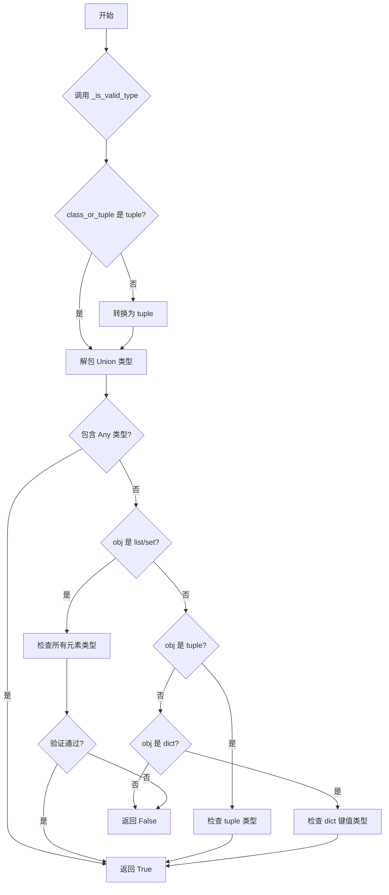
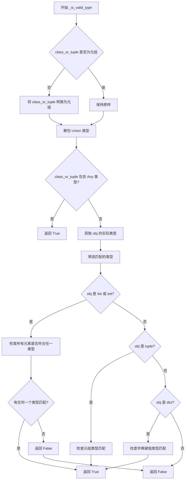

# `diffusers\src\diffusers\utils\typing_utils.py` 详细设计文档

这是一个类型检查和验证的工具模块，提供类型验证函数来判断对象是否符合指定类型，以及获取对象详细类型信息的函数，主要用于Python类型注解的运行时检查和集合类型的嵌套类型验证。

## 整体流程



## 类结构

```
模块: typing_utils (无类定义)
└── 全局函数
    ├── _is_valid_type (类型验证)
    └── _get_detailed_type (获取详细类型)
```

## 全局变量及字段


    

## 全局函数及方法


### `_is_valid_type`

该函数用于检查给定对象是否是指定类型（或多个类型之一）的实例。对于集合类型（列表、集合、元组、字典），它会递归验证集合中的每个元素是否匹配指定的类型参数。

参数：

- `obj`：`Any`，要检查的对象
- `class_or_tuple`：`Type | tuple[Type, ...]`，目标类型或类型元组，可以是单个类型或多个类型的组合

返回值：`bool`，如果对象符合指定的类型约束则返回 `True`，否则返回 `False`

#### 流程图



#### 带注释源码

```python
def _is_valid_type(obj: Any, class_or_tuple: Type | tuple[Type, ...]) -> bool:
    """
    Checks if an object is an instance of any of the provided types. For collections, it checks if every element is of
    the correct type as well.
    """
    # 如果传入的不是元组，则转换为元组以统一处理
    if not isinstance(class_or_tuple, tuple):
        class_or_tuple = (class_or_tuple,)

    # 解包 Union 类型（例如 Union[int, str] 会被拆分为 int 和 str）
    unpacked_class_or_tuple = []
    for t in class_or_tuple:
        if get_origin(t) is Union:
            unpacked_class_or_tuple.extend(get_args(t))
        else:
            unpacked_class_or_tuple.append(t)
    class_or_tuple = tuple(unpacked_class_or_tuple)

    # 如果允许任何类型，直接返回 True
    if Any in class_or_tuple:
        return True

    obj_type = type(obj)
    # 筛选出与 obj 类型匹配的类型（处理泛型类型如 List[int]）
    class_or_tuple = {t for t in class_or_tuple if isinstance(obj, get_origin(t) or t)}

    # 获取类型参数（例如 List[int] 的参数是 (int,)）
    elem_class_or_tuple = {get_args(t) for t in class_or_tuple}
    
    # 无参数泛型（如 List, Set）匹配任何内容
    if () in elem_class_or_tuple:
        return True
    # 处理 list 或 set 类型
    elif obj_type in (list, set):
        return any(all(_is_valid_type(x, t) for x in obj) for t in elem_class_or_tuple)
    # 处理 tuple 类型
    elif obj_type is tuple:
        return any(
            # 可变长度元组（如 Tuple[int, ...]）
            (len(t) == 2 and t[-1] is Ellipsis and all(_is_valid_type(x, t[0]) for x in obj))
            or
            # 固定长度元组（如 Tuple[int, str]）
            (len(obj) == len(t) and all(_is_valid_type(x, tt) for x, tt in zip(obj, t)))
            for t in elem_class_or_tuple
        )
    # 处理 dict 类型
    elif obj_type is dict:
        return any(
            all(_is_valid_type(k, kt) and _is_valid_type(v, vt) for k, v in obj.items())
            for kt, vt in elem_class_or_tuple
        )
    # 其他类型不匹配
    else:
        return False
```


### `_get_detailed_type`

获取对象的详细类型信息，包括集合类型的嵌套类型参数。

参数：

- `obj`：`Any`，需要进行类型详细分析的对象，可以是任意类型

返回值：`Type`，返回对象的详细类型，对于集合类型会包含其元素类型的联合类型

#### 流程图

```mermaid
flowchart TD
    A[开始: _get_detailed_type] --> B{obj_type = type(obj)}
    B --> C{obj_type in (list, set)?}
    C -->|Yes| D[确定原始类型: List 或 Set]
    D --> E[获取所有元素的详细类型集合]
    E --> F[构建 Union[元素类型元组]]
    F --> G[返回 List[Union[...]] 或 Set[Union[...]]]
    C -->|No| H{obj_type is tuple?}
    H -->|Yes| I[获取所有元素的详细类型]
    J --> J[返回 Tuple[元素类型元组]]
    H -->|No| K{obj_type is dict?}
    K -->|Yes| L[获取所有键的详细类型]
    L --> M[获取所有值的详细类型]
    M --> N[构建 Dict[键类型, 值类型]]
    N --> O[返回 Dict[Union[...], Union[...]]]
    K -->|No| P[返回 obj_type]
```

#### 带注释源码

```python
def _get_detailed_type(obj: Any) -> Type:
    """
    获取对象的详细类型，包括集合的嵌套类型。
    
    参数:
        obj: 任意类型的对象，用于提取其详细类型信息
        
    返回值:
        对于简单类型返回其原始类型；
        对于list/set返回List[Union[元素类型...]]或Set[Union[元素类型...]]；
        对于tuple返回Tuple[元素类型...]；
        对于dict返回Dict[键类型, 值类型]
    """
    # 获取对象的基本类型
    obj_type = type(obj)

    # 处理 list 和 set 类型
    if obj_type in (list, set):
        # 确定是 List 还是 Set
        obj_origin_type = List if obj_type is list else Set
        
        # 递归获取集合中每个元素的详细类型，并去除重复类型
        elems_type = Union[tuple({_get_detailed_type(x) for x in obj})]
        
        # 返回带泛型参数的集合类型: List[Union[...]] 或 Set[Union[...]]
        return obj_origin_type[elems_type]
    
    # 处理 tuple 类型
    elif obj_type is tuple:
        # 递归获取每个元素的详细类型
        return Tuple[tuple(_get_detailed_type(x) for x in obj)]
    
    # 处理 dict 类型
    elif obj_type is dict:
        # 获取所有键的类型并构建联合类型
        keys_type = Union[tuple({_get_detailed_type(k) for k in obj.keys()})]
        # 获取所有值的类型并构建联合类型
        values_type = Union[tuple({_get_detailed_type(k) for k in obj.values()})]
        # 返回带泛型参数的字典类型
        return Dict[keys_type, values_type]
    
    # 处理其他基本类型（如 int, str, 自定义类等）
    else:
        return obj_type
```

## 关键组件


### 类型验证组件 (`_is_valid_type`)

该函数是核心的类型检查工具，支持检查单个对象和集合类型的实例是否匹配指定的类型，包括对Union类型的解包处理和嵌套集合类型的递归验证。

### 联合类型解包机制

该模块通过`get_origin`和`get_args`将Union类型解包为其组成类型，从而实现对`Type[int | str]`等联合类型的完整支持。

### 集合类型检查器

该组件实现了对list、set、tuple和dict四种集合类型的类型检查，支持泛型参数（如`List[int]`）和任意长度元组（如`Tuple[int, ...]`）。

### 详细类型推断组件 (`_get_detailed_type`)

该函数递归地获取对象的完整类型信息，为集合类型生成带泛型参数的详细类型注解，如`List[int]`或`Dict[str, int]`。

### 类型原语与泛型处理

该模块使用Python的`typing`模块处理类型注解，能够正确识别`List`、`Set`、`Dict`、`Tuple`等泛型类型及其参数。


## 问题及建议


### 已知问题

-   **类型注解兼容性**：使用 `Type | tuple[Type, ...]` 语法（Python 3.10+），但未添加 `from __future__ import annotations`，可能在低版本 Python 中导致语法错误
-   **空集合处理不当**：`_get_detailed_type` 对空列表/集合返回 `List[Any]` 或 `Set[Any]`，丢失了原始类型信息；空字典同理
-   **缺少 `frozenset` 支持**：仅处理 `list` 和 `set`，未考虑 `frozenset`
-   **递归性能问题**：`_is_valid_type` 对大型嵌套集合递归调用，可能导致栈溢出或性能瓶颈；缺少对循环引用类型的检测
-   **`Any` 类型处理冗余**：多次检查 `Any in class_or_tuple`，可在函数开始处统一处理
-   **类型推断不标准**：`_get_detailed_type` 使用 `Union[tuple({...})]` 而非标准写法 `Union[X, Y, ...]`
-   **`None` 值未处理**：函数未对 `None` 输入进行显式处理，可能导致意外行为
-   **缺少缓存机制**：重复调用相同类型检查时无缓存，效率低下

### 优化建议

-   添加 `from __future__ import annotations` 以支持现代类型注解语法，同时保持向后兼容
-   在函数入口处统一处理 `Any` 类型和 `None` 值，添加明确的参数校验
-   引入 `functools.lru_cache` 或手动缓存机制存储已验证的类型结果，提升重复检查性能
-   扩展对 `frozenset` 和其他集合类型的支持，统一处理逻辑
-   重构空集合的类型推断，保留原始类型信息或返回泛型类型而非 `Any`
-   将 `Union[tuple({...})]` 改为标准形式 `Union[*set_of_types]`
-   增加递归深度限制或改用迭代方式处理深层嵌套集合，防止栈溢出
-   添加详细的单元测试覆盖边界情况（空集合、嵌套类型、循环引用等）

## 其它


### 设计目标与约束

本模块的设计目标是为HuggingFace Transformers库提供类型检查和验证的实用工具函数，支持基本类型、集合类型（List、Set、Tuple、Dict）以及泛型类型的运行时类型验证。主要约束包括：仅支持Python内置类型和typing模块提供的类型注解，不支持自定义类的复杂类型检查；依赖Python的typing模块（get_args、get_origin）进行类型解析。

### 错误处理与异常设计

本模块不抛出自定义异常，主要通过返回布尔值（True/False）来表示类型检查结果。对于无效输入，_is_valid_type函数会返回False而不是抛出异常，这是为了在类型验证场景中提供更灵活的使用方式。_get_detailed_type函数在处理未知类型时返回对象的实际type。

### 数据流与状态机

数据流主要分为两条路径：类型验证路径（_is_valid_type）接收任意对象和目标类型，返回布尔值；类型推断路径（_get_detailed_type）接收任意对象，返回其详细类型信息。模块内部不涉及状态机，因为这两个函数都是纯函数，无状态副作用。

### 外部依赖与接口契约

仅依赖Python标准库typing模块。接口契约：_is_valid_type(obj: Any, class_or_tuple: Type | tuple[Type, ...]) -> bool，接受任意对象和类型/类型元组，返回是否匹配；_get_detailed_type(obj: Any) -> Type，接受任意对象，返回其Type对象。

### 性能考虑与边界情况

_is_valid_type函数在处理大型集合时可能存在性能问题，因为需要对集合中每个元素递归调用自身进行类型检查。边界情况包括：空集合返回True（因为all()对空序列返回True）；Any类型作为目标类型时直接返回True；未参数化的泛型（如List而非List[int]）视为接受任何元素。

### 使用示例与调用场景

该模块主要用于库内部的类型验证场景，例如在模型配置类中验证输入参数类型、在数据处理管道中验证数据格式。调用方应处理返回False的情况，根据业务需求决定后续处理方式。

    