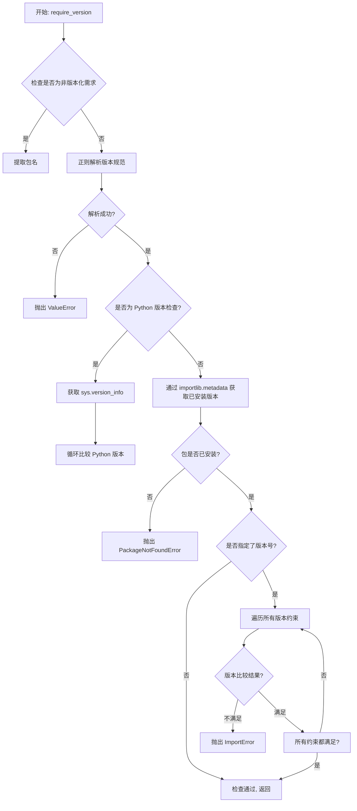
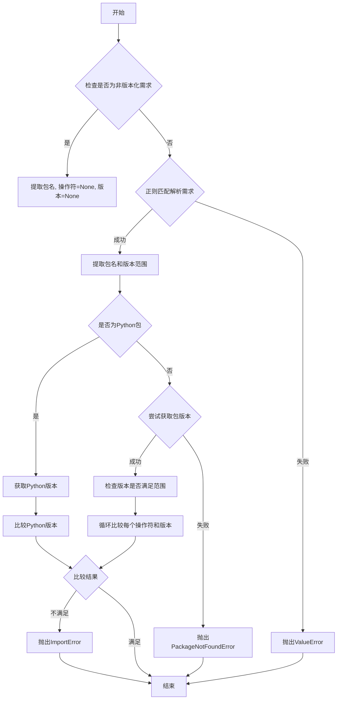
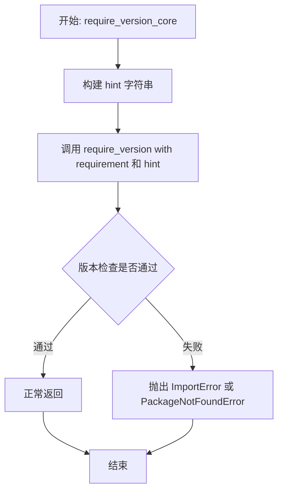
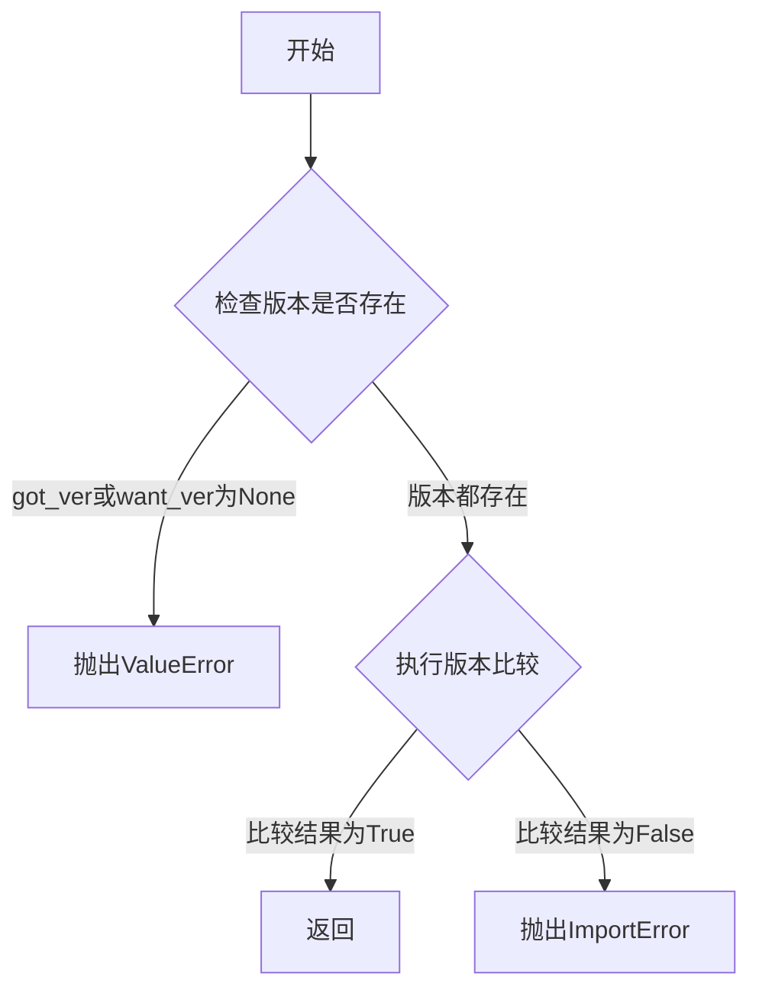
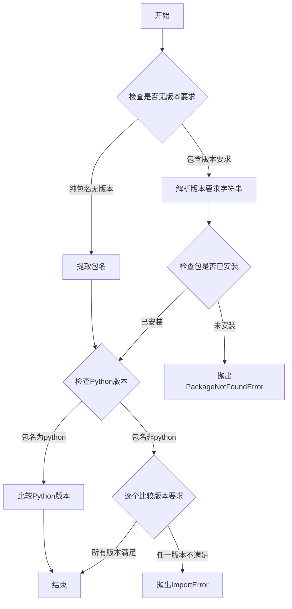
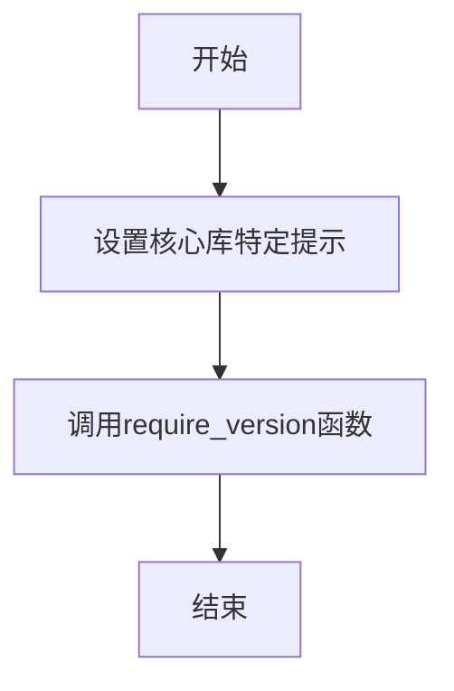

# `diffusers\src\diffusers\utils\versions.py` 详细设计文档

这是一个用于运行时依赖版本检查的实用工具模块，支持 pip 风格的版本规范语法（如 'package==1.0.0', 'package>=1.0.0', 'package!=1.0.0' 等），通过 importlib.metadata 获取已安装包的版本，并进行比较验证，确保所需依赖满足指定的版本要求。

## 整体流程



## 类结构

```
无类定义 (纯函数模块)
```

## 全局变量及字段


### `ops`
    
操作符到比较函数的映射字典，包含 <, <=, ==, !=, >=, >

类型：`dict`
    


    

## 全局函数及方法


### `_compare_versions`

这是一个内部版本比较函数，用于验证已安装的包版本是否满足指定的要求版本。如果版本不匹配或版本信息缺失，该函数会抛出相应的异常。

参数：

- `op`：`str`，比较操作符（如 "<", "<=", "==", "!=", ">=", ">"）
- `got_ver`：`str | None`，实际安装的版本号
- `want_ver`：`str | None`，要求的版本号
- `requirement`：`str`，完整的版本要求描述字符串
- `pkg`：`str`，被检查的包名称
- `hint`：`str`，当版本不满足要求时显示的提示信息

返回值：`None`，该函数不返回任何值，通过抛出异常来表示比较结果

#### 流程图

```mermaid
flowchart TD
    A[开始 _compare_versions] --> B{got_ver is None or want_ver is None?}
    B -->|Yes| C[抛出 ValueError]
    B -->|No| D[使用 version.parse 解析 got_ver]
    D --> E[使用 version.parse 解析 want_ver]
    E --> F{ops[op](got_ver, want_ver)?}
    F -->|True| G[版本满足要求，结束]
    F -->|False| H[抛出 ImportError]
    C --> I[异常处理]
    H --> I
    G --> I
```

#### 带注释源码

```python
def _compare_versions(op, got_ver, want_ver, requirement, pkg, hint):
    """
    比较实际版本与要求版本是否满足指定的操作符关系
    
    Args:
        op: 比较操作符字符串 (如 '<', '<=', '==', '!=', '>=', '>')
        got_ver: 实际安装的版本号字符串
        want_ver: 要求的版本号字符串
        requirement: 完整的版本需求描述 (用于错误信息)
        pkg: 包名 (用于错误信息)
        hint: 额外的提示信息 (用于错误信息)
    
    Raises:
        ValueError: 当 got_ver 或 want_ver 为 None 时抛出，表示版本信息缺失
        ImportError: 当版本不满足要求时抛出，表示依赖版本不匹配
    """
    # 检查版本号是否存在，如果缺失则抛出异常（这种情况不寻常，建议重新安装包）
    if got_ver is None or want_ver is None:
        raise ValueError(
            f"Unable to compare versions for {requirement}: need={want_ver} found={got_ver}. This is unusual. Consider"
            f" reinstalling {pkg}."
        )
    
    # 使用 packaging 库的 version.parse 解析版本字符串
    # 然后使用 ops 字典中对应的操作符函数进行比较
    # 如果比较结果为 False（即不满足要求），则抛出 ImportError
    if not ops[op](version.parse(got_ver), version.parse(want_ver)):
        raise ImportError(
            f"{requirement} is required for a normal functioning of this module, but found {pkg}=={got_ver}.{hint}"
        )
```


### `require_version`

执行运行时依赖版本检查，使用与 pip 完全相同的语法。函数从 site-packages 目录通过 importlib.metadata 获取已安装模块版本，并与需求版本进行比较，如果不满足要求则抛出 ImportError 或 PackageNotFoundError 异常。

参数：

- `requirement`：`str`，pip 风格版本定义，例如 "tokenizers==0.9.4"、"tqdm>=4.27"、"numpy"
- `hint`：`str | None`，可选参数，当需求不满足时打印的建议信息

返回值：`None`，仅进行版本检查，无返回值

#### 流程图



#### 带注释源码

```python
def require_version(requirement: str, hint: str | None = None) -> None:
    """
    Perform a runtime check of the dependency versions, using the exact same syntax used by pip.

    The installed module version comes from the *site-packages* dir via *importlib.metadata*.

    Args:
        requirement (`str`): pip style definition, e.g.,  "tokenizers==0.9.4", "tqdm>=4.27", "numpy"
        hint (`str`, *optional*): what suggestion to print in case of requirements not being met

    Example:

    ```python
    require_version("pandas>1.1.2")
    require_version("numpy>1.18.5", "this is important to have for whatever reason")
    ```"""

    # 如果提供了 hint，则在开头添加换行符，否则为空字符串
    hint = f"\n{hint}" if hint is not None else ""

    # 非版本化检查：如果需求只包含字母、数字、下划线和连字符（无版本操作符）
    if re.match(r"^[\w_\-\d]+$", requirement):
        pkg, op, want_ver = requirement, None, None  # 包名，无操作符，无版本需求
    else:
        # 解析带版本的需求格式，如 "package==1.0.0" 或 "package>=1.0"
        match = re.findall(r"^([^!=<>\s]+)([\s!=<>]{1,2}.+)", requirement)
        if not match:
            raise ValueError(
                "requirement needs to be in the pip package format, .e.g., package_a==1.23, or package_b>=1.23, but"
                f" got {requirement}"
            )
        pkg, want_full = match[0]
        want_range = want_full.split(",")  # 可能有多个需求，用逗号分隔
        wanted = {}
        for w in want_range:
            # 解析每个版本需求，如 ">=1.0"
            match = re.findall(r"^([\s!=<>]{1,2})(.+)", w)
            if not match:
                raise ValueError(
                    "requirement needs to be in the pip package format, .e.g., package_a==1.23, or package_b>=1.23,"
                    f" but got {requirement}"
                )
            op, want_ver = match[0]
            wanted[op] = want_ver
            if op not in ops:
                raise ValueError(f"{requirement}: need one of {list(ops.keys())}, but got {op}")

    # 特殊 case：检查 Python 版本
    if pkg == "python":
        got_ver = ".".join([str(x) for x in sys.version_info[:3]])
        for op, want_ver in wanted.items():
            _compare_versions(op, got_ver, want_ver, requirement, pkg, hint)
        return

    # 检查是否安装了任何版本的包
    try:
        got_ver = importlib.metadata.version(pkg)  # 获取已安装包的版本
    except importlib.metadata.PackageNotFoundError:
        raise importlib.metadata.PackageNotFoundError(
            f"The '{requirement}' distribution was not found and is required by this application. {hint}"
        )

    # 如果提供了版本号或版本范围，检查已安装版本是否满足要求
    if want_ver is not None:
        for op, want_ver in wanted.items():
            _compare_versions(op, got_ver, want_ver, requirement, pkg, hint)
```


### `require_version_core`

该函数是 `require_version` 的包装器，在版本检查失败时提供特定的核心包安装提示（如 `pip install transformers -U` 或 `pip install -e '.[dev]'`），帮助用户快速修复依赖问题。

参数：

- `requirement`：`str`，pip 风格的依赖版本要求字符串，例如 `"tokenizers==0.9.4"`、`"tqdm>=4.27"` 或 `"numpy"`

返回值：`None`，该函数直接返回 `require_version` 的结果（`require_version` 返回 `None`）

#### 流程图



#### 带注释源码

```python
def require_version_core(requirement):
    """
    require_version wrapper which emits a core-specific hint on failure
    
    这是一个包装函数，为 require_version 提供特定的失败提示。
    当依赖版本检查失败时，会提示用户使用 pip 安装 transformers 的方法。
    
    参数:
        requirement: pip 风格的依赖版本要求字符串
    
    返回值:
        None，直接返回 require_version 的结果
    """
    # 定义核心包安装提示，当版本检查失败时显示
    hint = "Try: pip install transformers -U or pip install -e '.[dev]' if you're working with git main"
    # 调用实际的版本检查函数，传入需求字符串和提示信息
    return require_version(requirement, hint)
```

## 关键组件


## 代码概述

该代码是一个包版本检查工具模块，用于在运行时验证项目依赖包的版本是否符合要求，支持精确版本比较、版本范围检查以及Python版本验证，通过解析pip风格的版本字符串并与已安装包版本进行对比，确保模块正常运行所需的环境配置。

## 文件运行流程

该模块的运行流程如下：首先定义版本比较操作符映射表；然后提供内部版本比较函数`_compare_versions`用于执行具体的版本比较逻辑；接着公开`require_version`函数作为主入口，解析pip风格的版本要求字符串；最后提供`require_version_core`作为包装器添加核心库特定的提示信息。

## 全局变量与函数详情

### 全局变量

### ops

- **类型**: `dict`
- **描述**: 版本比较操作符映射表，将字符串操作符映射到实际的比较函数，用于支持"<"、">="、"=="等版本比较操作

### 全局函数

#### _compare_versions

- **参数**:
  - `op` (str): 版本比较操作符，如">"、"=="、"!="等
  - `got_ver` (str): 已安装包的版本号
  - `want_ver` (str): 要求的版本号
  - `requirement` (str): 完整的版本需求字符串
  - `pkg` (str): 包名称
  - `hint` (str): 版本不满足时的提示信息
- **返回值类型**: `None`
- **返回值描述**: 该函数不返回值，仅在版本不满足要求时抛出ImportError异常
- **mermaid流程图**:



- **源码**:

```python
def _compare_versions(op, got_ver, want_ver, requirement, pkg, hint):
    if got_ver is None or want_ver is None:
        raise ValueError(
            f"Unable to compare versions for {requirement}: need={want_ver} found={got_ver}. This is unusual. Consider"
            f" reinstalling {pkg}."
        )
    if not ops[op](version.parse(got_ver), version.parse(want_ver)):
        raise ImportError(
            f"{requirement} is required for a normal functioning of this module, but found {pkg}=={got_ver}.{hint}"
        )
```

#### require_version

- **参数**:
  - `requirement` (str): pip风格的版本定义，如"tokenizers==0.9.4"、"tqdm>=4.27"、"numpy"
  - `hint` (str | None): 版本不满足时显示的建议信息
- **返回值类型**: `None`
- **返回值描述**: 该函数仅执行版本检查，不返回任何值，不满足要求时抛出异常
- **mermaid流程图**:



- **源码**:

```python
def require_version(requirement: str, hint: str | None = None) -> None:
    """
    Perform a runtime check of the dependency versions, using the exact same syntax used by pip.

    The installed module version comes from the *site-packages* dir via *importlib.metadata*.

    Args:
        requirement (`str`): pip style definition, e.g.,  "tokenizers==0.9.4", "tqdm>=4.27", "numpy"
        hint (`str`, *optional*): what suggestion to print in case of requirements not being met

    Example:

    ```python
    require_version("pandas>1.1.2")
    require_version("numpy>1.18.5", "this is important to have for whatever reason")
    ```"""

    hint = f"\n{hint}" if hint is not None else ""

    # non-versioned check
    if re.match(r"^[\w_\-\d]+$", requirement):
        pkg, op, want_ver = requirement, None, None
    else:
        match = re.findall(r"^([^!=<>\s]+)([\s!=<>]{1,2}.+)", requirement)
        if not match:
            raise ValueError(
                "requirement needs to be in the pip package format, .e.g., package_a==1.23, or package_b>=1.23, but"
                f" got {requirement}"
            )
        pkg, want_full = match[0]
        want_range = want_full.split(",")  # there could be multiple requirements
        wanted = {}
        for w in want_range:
            match = re.findall(r"^([\s!=<>]{1,2})(.+)", w)
            if not match:
                raise ValueError(
                    "requirement needs to be in the pip package format, .e.g., package_a==1.23, or package_b>=1.23,"
                    f" but got {requirement}"
                )
            op, want_ver = match[0]
            wanted[op] = want_ver
            if op not in ops:
                raise ValueError(f"{requirement}: need one of {list(ops.keys())}, but got {op}")

    # special case
    if pkg == "python":
        got_ver = ".".join([str(x) for x in sys.version_info[:3]])
        for op, want_ver in wanted.items():
            _compare_versions(op, got_ver, want_ver, requirement, pkg, hint)
        return

    # check if any version is installed
    try:
        got_ver = importlib.metadata.version(pkg)
    except importlib.metadata.PackageNotFoundError:
        raise importlib.metadata.PackageNotFoundError(
            f"The '{requirement}' distribution was not found and is required by this application. {hint}"
        )

    # check that the right version is installed if version number or a range was provided
    if want_ver is not None:
        for op, want_ver in wanted.items():
            _compare_versions(op, got_ver, want_ver, requirement, pkg, hint)
```

#### require_version_core

- **参数**:
  - `requirement` (str): pip风格的版本要求字符串
- **返回值类型**: `None`
- **返回值描述**: 该函数是require_version的包装器，调用后者执行版本检查
- **mermaid流程图**:



- **源码**:

```python
def require_version_core(requirement):
    """require_version wrapper which emits a core-specific hint on failure"""
    hint = "Try: pip install transformers -U or pip install -e '.[dev]' if you're working with git main"
    return require_version(requirement, hint)
```

## 关键组件信息

### 版本比较操作符映射表

定义支持的所有版本比较操作符及其对应的比较函数，支持小于、小于等于、等于、不等于、大于等于、大于等六种比较操作。

### 内部版本比较器

负责执行实际的版本号解析和比较逻辑，使用packaging库的version.parse进行语义化版本解析，确保版本比较符合PEP 440规范。

### 主版本检查器

解析pip风格的版本要求字符串，支持无版本检查、单一版本要求、多版本范围要求等多种形式，并处理Python版本检查的特殊情况。

### 核心库版本检查包装器

为transformers核心库提供的便捷包装器，在版本检查失败时提供特定的修复建议。

## 潜在技术债务与优化空间

### 正则表达式重复解析

代码中使用了多个正则表达式进行字符串解析，每次调用require_version都会重新编译正则表达式，可考虑预编译正则表达式以提高性能。

### 错误信息一致性

ValueError和ImportError的抛出使用了不同的错误消息格式，缺乏统一性，建议统一错误处理风格。

### 缺少日志记录

当前实现仅通过抛出异常来报告错误，缺少日志记录机制，不利于运行时监控和调试。

### 类型提示不完整

require_version_core函数缺少参数类型和返回值类型提示，与require_version函数风格不一致。

## 其它项目说明

### 设计目标与约束

该模块的设计目标是确保运行环境中安装了正确版本的依赖包，约束包括：必须使用pip风格的版本语法、支持主流版本比较操作符、需要处理包未安装的特殊情况。

### 错误处理与异常设计

代码定义了两种主要异常：ValueError用于版本要求格式错误的情况，ImportError用于依赖包版本不满足要求的情况，PackageNotFoundError用于包未安装的情况。所有异常都携带描述性错误信息。

### 外部依赖与接口契约

模块依赖packaging库进行版本解析，依赖importlib.metadata获取已安装包信息。公开接口require_version接受字符串形式的版本要求，返回None，失败时抛出异常。


## 问题及建议


### 已知问题

-   **正则表达式重复编译**：代码中多次使用`re.match`和`re.findall`但没有预编译正则表达式，导致每次调用`require_version`时都重新编译正则表达式，影响性能
-   **版本解析重复执行**：在`_compare_versions`函数中，`version.parse(got_ver)`和`version.parse(want_ver)`在每个操作符比较时都会重复解析，可以缓存解析后的版本对象
-   **类型提示不完整**：`require_version_core`函数缺少参数和返回值的类型注解，且`require_version`的`hint`参数使用了Python 3.10+的联合类型语法`str | None`，但代码没有做版本兼容处理
-   **缺少版本缓存机制**：没有对已获取的包版本进行缓存，重复调用检查同一包时会重复查询`importlib.metadata`
-   **错误处理粒度不够**：使用通用的`ValueError`和`ImportError`，缺少自定义异常类来区分不同类型的错误场景
-   **硬编码提示信息**：`require_version_core`中的hint是硬编码的，灵活性差，不便于外部配置

### 优化建议

-   **预编译正则表达式**：将所有正则表达式在模块级别预编译，如`VERSION_ONLY_PATTERN = re.compile(r"^[\w_\-\d]+$")`，避免重复编译开销
-   **版本解析缓存**：在`_compare_versions`中提前解析版本并缓存，或在`require_version`中一次性解析后传递解析后的版本对象
-   **完善类型注解**：为`require_version_core`添加类型提示，并考虑使用`Optional[str]`替代`str | None`以提高兼容性
-   **添加版本缓存**：使用`functools.lru_cache`或字典缓存已查询的包版本信息，减少重复的metadata查询
-   **自定义异常类**：创建`VersionMismatchError`、`PackageNotFoundError`等自定义异常类，提供更精确的错误处理和更友好的错误信息
-   **配置化提示信息**：将硬编码的hint提取为可配置的默认参数或环境变量，提高灵活性
-   **日志记录**：添加日志记录功能，便于调试和追踪版本检查过程


## 其它


### 设计目标与约束

本模块的设计目标是提供一种运行时检查Python包版本的能力，确保依赖包的版本满足应用要求。使用pip风格的版本规范（如==、>=、>、<、<=、!=），支持单版本和多版本范围检查。约束条件包括：仅支持Python 3.8+（因importlib.metadata）、依赖packaging库进行版本解析、不支持预发布版本（如alpha、beta）的精确比较。

### 错误处理与异常设计

主要异常类型包括：ValueError（版本比较参数不合法、requirement格式错误）、ImportError（版本不满足要求）、importlib.metadata.PackageNotFoundError（包未安装）。_compare_versions函数在版本号为None时抛出ValueError；require_version在requirement格式不匹配时抛出ValueError；版本不满足时抛出ImportError并附带提示信息hint。

### 数据流与状态机

数据流：requirement字符串输入 → 正则解析提取包名、操作符、版本号 → 查询已安装包版本（importlib.metadata.version） → 调用_compare_versions进行版本比较 → 结果判定（通过或抛异常）。状态机包含：初始状态、解析状态、查询状态、比较状态、结果状态。

### 外部依赖与接口契约

外部依赖：importlib.metadata（Python标准库，Python 3.8+）、packaging.version（第三方库）、operator（Python标准库）、re（Python标准库）、sys（Python标准库）。接口契约：require_version接受requirement字符串和可选hint字符串，返回None（void），在版本不满足时抛异常；require_version_core内部调用require_version并添加固定hint。

### 性能考虑

版本解析使用packaging.version.parse，会缓存解析结果。包版本查询使用importlib.metadata.version，存在文件系统I/O开销。建议在应用启动时调用一次而非频繁调用。对于大量版本检查场景，可考虑添加缓存机制。

### 安全性考虑

本模块不涉及用户输入处理或网络请求，安全性风险较低。唯一风险点是requirement参数来自外部输入时需验证格式，避免正则表达式ReDoS攻击（当前正则表达式较简单，风险较低）。

### 测试策略

测试用例应覆盖：正常版本比较（==、>=、>、<、<=、!=）、版本范围检查（逗号分隔多条件）、无版本号检查、非版本标识符检查、包不存在情况、Python版本检查、异常消息格式验证。

### 使用示例

```python
# 检查精确版本
require_version("tokenizers==0.9.4")

# 检查最低版本
require_version("numpy>=1.18.5")

# 检查版本范围
require_version("torch>=1.8.0,<2.0.0")

# 检查无版本要求（仅检查包存在）
require_version("pandas")

# 带提示信息
require_version("transformers>=4.0.0", "Please upgrade transformers package")
```

### 兼容性考虑

Python版本：3.8+（importlib.metadata在3.8之前为第三方库）。packaging库版本：无特殊要求。跨平台：依赖importlib.metadata，在Windows、Linux、macOS均可正常工作。

### 边界条件处理

空requirement字符串：不支持，会抛出ValueError。特殊字符包名：支持字母、数字、下划线、连字符、短横线。预发布版本：packaging库会将1.0.0a1解析为小于1.0.0。大版本号：支持如10.0.0、100.0.0等较大版本号。


    