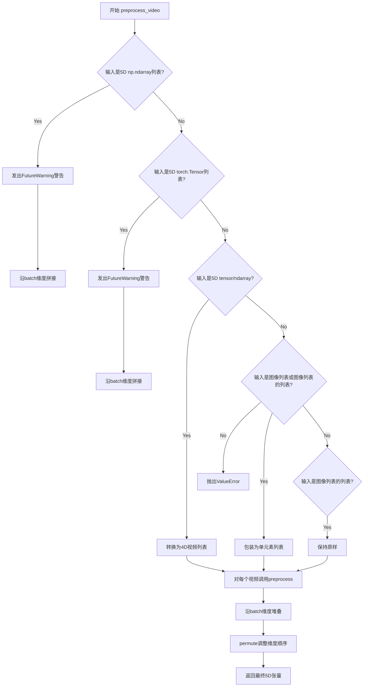

# `diffusers\src\diffusers\video_processor.py` 详细设计文档

VideoProcessor是一个视频处理类，继承自VaeImageProcessor，用于对视频数据进行预处理（将各种格式的视频转换为标准化的5D张量）和后处理（将5D张量转换回指定格式），支持PIL图像、NumPy数组和PyTorch张量等多种输入格式。

## 整体流程

```mermaid
graph TD
    A[开始 preprocess_video] --> B{输入类型检查}
    B -->|5D np.ndarray| C[发出FutureWarning并沿batch维度拼接]
    B -->|5D torch.Tensor| D[发出FutureWarning并沿batch维度拼接]
    B -->|5D张量或数组| E[转换为4D视频列表]
    B -->|PIL图像列表或有效图像列表| F[包装为单元素列表]
    E --> G[验证输入格式]
    F --> G
    C --> G
    D --> G
    G -->|格式无效| H[抛出ValueError]
    G -->|格式有效| I[遍历每个视频调用preprocess]
    I --> J[torch.stack堆叠所有帧]
    J --> K[permute调整维度顺序 (N,T,C,H,W)->(N,C,T,H,W)]
    K --> L[返回预处理后的5D张量]
    M[开始 postprocess_video] --> N[获取batch_size]
    N --> O[遍历每个batch]
    O --> P[permute调整维度 (C,T,H,W)->(T,C,H,W)]
    P --> Q[调用postprocess处理单帧]
    Q --> R[根据output_type堆叠或保持列表]
    R --> S[返回np.ndarray或torch.Tensor或list[PIL.Image]]
```

## 类结构

```
VaeImageProcessor (基类)
└── VideoProcessor (子类)
```

## 全局变量及字段


### `np`
    
NumPy库，用于数值计算和多维数组操作

类型：`module`
    


### `PIL`
    
Python Imaging Library（Pillow），用于图像加载和处理

类型：`module`
    


### `torch`
    
PyTorch深度学习框架，提供张量计算和神经网络功能

类型：`module`
    


### `F`
    
torch.nn.functional模块，提供神经网络常用函数如插值、激活等

类型：`module`
    


### `VaeImageProcessor`
    
VAE图像处理器基类，提供图像预处理和后处理功能

类型：`class`
    


### `is_valid_image`
    
验证单个图像是否为有效PIL图像的辅助函数

类型：`function`
    


### `is_valid_image_imagelist`
    
验证图像列表是否为有效图像集合的辅助函数

类型：`function`
    


    

## 全局函数及方法


### VideoProcessor.preprocess_video

该方法负责将多种格式的视频输入（ PIL 图像列表、NumPy 数组、PyTorch 张量等）预处理为统一的标准化的 5D PyTorch 张量格式 `(batch_size, num_channels, num_frames, height, width)`，支持自动尺寸调整和通道顺序转换。

参数：

- `self`：`VideoProcessor` 实例本身，隐式参数
- `video`：`list[PIL.Image] | list[list[PIL.Image]] | torch.Tensor | np.array | list[torch.Tensor] | list[np.array]`，输入视频数据，支持多种格式
- `height`：`int | None`，预处理后视频的高度，默认为 None
- `width`：`int | None`，预处理后视频的宽度，默认为 None

返回值：`torch.Tensor`，预处理后的视频张量，形状为 `(batch_size, num_channels, num_frames, height, width)`

#### 流程图



#### 带注释源码

```python
def preprocess_video(self, video, height: int | None = None, width: int | None = None) -> torch.Tensor:
    r"""
    Preprocesses input video(s).

    Args:
        video (`list[PIL.Image]`, `list[list[PIL.Image]]`, `torch.Tensor`, `np.array`, `list[torch.Tensor]`, `list[np.array]`):
            The input video. It can be one of the following:
            * list of the PIL images.
            * list of list of PIL images.
            * 4D Torch tensors (expected shape for each tensor `(num_frames, num_channels, height, width)`).
            * 4D NumPy arrays (expected shape for each array `(num_frames, height, width, num_channels)`).
            * list of 4D Torch tensors (expected shape for each tensor `(num_frames, num_channels, height,
              width)`).
            * list of 4D NumPy arrays (expected shape for each array `(num_frames, height, width, num_channels)`).
            * 5D NumPy arrays: expected shape for each array `(batch_size, num_frames, height, width,
              num_channels)`.
            * 5D Torch tensors: expected shape for each array `(batch_size, num_frames, num_channels, height,
              width)`.
        height (`int`, *optional*, defaults to `None`):
            The height in preprocessed frames of the video. If `None`, will use the `get_default_height_width()` to
            get default height.
        width (`int`, *optional*`, defaults to `None`):
            The width in preprocessed frames of the video. If `None`, will use get_default_height_width()` to get
            the default width.
    """
    # 处理5D np.ndarray列表的deprecated用法，沿batch维度拼接
    if isinstance(video, list) and isinstance(video[0], np.ndarray) and video[0].ndim == 5:
        warnings.warn(
            "Passing `video` as a list of 5d np.ndarray is deprecated."
            "Please concatenate the list along the batch dimension and pass it as a single 5d np.ndarray",
            FutureWarning,
        )
        video = np.concatenate(video, axis=0)
    
    # 处理5D torch.Tensor列表的deprecated用法，沿batch维度拼接
    if isinstance(video, list) and isinstance(video[0], torch.Tensor) and video[0].ndim == 5:
        warnings.warn(
            "Passing `video` as a list of 5d torch.Tensor is deprecated."
            "Please concatenate the list along the batch dimension and pass it as a single 5d torch.Tensor",
            FutureWarning,
        )
        video = torch.cat(video, axis=0)

    # 确保输入被规范化为视频列表格式:
    # - 如果是批量视频(5D tensor/ndarray)，转换为4D视频列表
    # - 如果是单个视频，转换为单元素列表
    if isinstance(video, (np.ndarray, torch.Tensor)) and video.ndim == 5:
        video = list(video)  # 5D -> 4D列表
    elif isinstance(video, list) and is_valid_image(video[0]) or is_valid_image_imagelist(video):
        video = [video]  # 包装为单元素列表
    elif isinstance(video, list) and is_valid_image_imagelist(video[0]):
        video = video  # 已经是正确的列表格式
    else:
        raise ValueError(
            "Input is in incorrect format. Currently, we only support numpy.ndarray, torch.Tensor, PIL.Image.Image"
        )

    # 对列表中的每个视频调用preprocess方法，然后沿batch维度堆叠
    video = torch.stack([self.preprocess(img, height=height, width=width) for img in video], dim=0)

    # 调整维度顺序：将通道数(num_channels)移到帧数(num_frames)前面
    # 转换前的形状: (batch, num_frames, num_channels, height, width)
    # 转换后的形状: (batch, num_channels, num_frames, height, width)
    video = video.permute(0, 2, 1, 3, 4)

    return video
```


### `VideoProcessor.postprocess_video`

该方法将视频张量转换为指定格式的输出（NumPy数组、PyTorch张量或PIL图像列表），通过遍历批次中的每个视频并调用内部 postprocess 方法处理每一帧，最后根据 output_type 参数将结果堆叠或保持为列表形式返回。

参数：

- `video`：`torch.Tensor`，输入的视频张量，形状通常为 (batch_size, channels, num_frames, height, width)
- `output_type`：`str`，输出类型，可选值为 "np"（NumPy数组）、"pt"（PyTorch张量）或 "pil"（PIL图像列表），默认为 "np"

返回值：`np.ndarray | torch.Tensor | list[PIL.Image.Image]`，根据 output_type 参数返回对应格式的处理后视频数据

#### 流程图

```mermaid
flowchart TD
    A[开始 postprocess_video] --> B[获取 batch_size = video.shape[0]]
    B --> C[初始化空列表 outputs]
    C --> D[循环 batch_idx 从 0 到 batch_size-1]
    D --> E[获取当前批次视频: batch_vid = video[batch_idx]]
    E --> F[permute 维度: batch_vid.permute(1, 0, 2, 3)]
    F --> G[调用 self.postprocess 进行后处理]
    G --> H[将结果 append 到 outputs]
    H --> D
    D --> |循环结束| I{output_type == 'np'?}
    I -->|是| J[outputs = np.stack(outputs)]
    I -->|否| K{output_type == 'pt'?}
    K -->|是| L[outputs = torch.stack(outputs)]
    K -->|否| M{output_type == 'pil'?}
    M -->|是| N[保持 outputs 为 list]
    M -->|否| O[抛出 ValueError 异常]
    O --> P[结束]
    J --> Q[返回 outputs]
    L --> Q
    N --> Q
    P --> Q
```

#### 带注释源码

```python
def postprocess_video(
    self, video: torch.Tensor, output_type: str = "np"
) -> np.ndarray | torch.Tensor | list[PIL.Image.Image]:
    r"""
    Converts a video tensor to a list of frames for export.

    Args:
        video (`torch.Tensor`): The video as a tensor.
        output_type (`str`, defaults to `"np"`): Output type of the postprocessed `video` tensor.
    """
    # 获取视频张量的批次大小
    batch_size = video.shape[0]
    # 初始化输出列表，用于存储每个视频的处理结果
    outputs = []
    # 遍历批次中的每个视频
    for batch_idx in range(batch_size):
        # 提取当前索引的视频批次: (C, T, H, W)
        batch_vid = video[batch_idx].permute(1, 0, 2, 3)
        # 调用基类的 postprocess 方法处理单个视频
        # 将 (C, T, H, W) 转换为目标格式
        batch_output = self.postprocess(batch_vid, output_type)
        # 将处理结果添加到输出列表
        outputs.append(batch_output)

    # 根据 output_type 合并结果
    if output_type == "np":
        # 将 Python 列表堆叠为 NumPy 数组
        outputs = np.stack(outputs)
    elif output_type == "pt":
        # 将 Python 列表堆叠为 PyTorch 张量
        outputs = torch.stack(outputs)
    elif not output_type == "pil":
        # 如果不是有效的输出类型，抛出异常
        raise ValueError(f"{output_type} does not exist. Please choose one of ['np', 'pt', 'pil']")

    # 返回处理后的视频数据
    return outputs
```


### VideoProcessor.classify_height_width_bin

该函数是一个静态方法，用于根据输入图像的宽高比从预定义的宽高比字典中找到最接近的匹配，并返回对应的标准化高度和宽度值，常用于视频或图像处理中的分辨率归一化。

参数：

- `height`：`int`，输入图像的高度（像素值）
- `width`：`int`，输入图像的宽度（像素值）
- `ratios`：`dict`，键为宽高比（浮点数），值为对应的(高度, 宽度)元组，例如 `{0.5: (256, 512), 1.0: (512, 512)}`

返回值：`tuple[int, int]`，返回最接近的标准化高度和宽度（均为整数）

#### 流程图

```mermaid
flowchart TD
    A[开始] --> B[计算实际宽高比 ar = height / width]
    B --> C[遍历ratios的所有键]
    C --> D[计算每个ratio与ar的绝对差值]
    D --> E[找到差值最小的ratio作为closest_ratio]
    E --> F[从ratios获取closest_ratio对应的default_hw]
    F --> G[提取default_hw中的高度和宽度]
    G --> H[转换为整数并返回 tuple[int, int]]
    H --> I[结束]
```

#### 带注释源码

```python
@staticmethod
def classify_height_width_bin(height: int, width: int, ratios: dict) -> tuple[int, int]:
    r"""
    Returns the binned height and width based on the aspect ratio.

    Args:
        height (`int`): The height of the image.
        width (`int`): The width of the image.
        ratios (`dict`): A dictionary where keys are aspect ratios and values are tuples of (height, width).

    Returns:
        `tuple[int, int]`: The closest binned height and width.
    """
    # 计算输入图像的实际宽高比（aspect ratio）
    ar = float(height / width)
    
    # 使用min函数配合lambda找到与实际宽高比最接近的预定义宽高比
    # lambda函数计算每个ratio与实际宽高比ar的绝对差值
    # key参数指定比较基准，返回差值最小的ratio
    closest_ratio = min(ratios.keys(), key=lambda ratio: abs(float(ratio) - ar))
    
    # 从ratios字典中获取最接近宽高比对应的标准(高度, 宽度)元组
    default_hw = ratios[closest_ratio]
    
    # 将标准高度和宽度转换为整数并返回元组
    return int(default_hw[0]), int(default_hw[1])
```


### `VideoProcessor.resize_and_crop_tensor`

该方法用于将形状为 (N, C, T, H, W) 的视频张量调整大小并裁剪到指定的宽度和高度。它首先计算缩放比例，然后使用双线性插值进行resize，最后进行中心裁剪以获得目标尺寸。

参数：

- `samples`：`torch.Tensor`，形状为 (N, C, T, H, W) 的视频张量，其中 N 是批量大小，C 是通道数，T 是帧数，H 是高度，W 是宽度
- `new_width`：`int`，输出视频的期望宽度
- `new_height`：`int`，输出视频的期望高度

返回值：`torch.Tensor`，包含调整大小和裁剪后的视频张量

#### 流程图

```mermaid
flowchart TD
    A[Start] --> B[获取原始高度和宽度<br/>orig_height = samples.shape[3]<br/>orig_width = samples.shape[4]]
    B --> C{orig_height != new_height<br/>OR<br/>orig_width != new_width?}
    C -->|No| D[直接返回samples<br/>无需处理]
    C -->|Yes| E[计算缩放比例<br/>ratio = max(new_height/orig_height, new_width/orig_width)]
    E --> F[计算调整后的尺寸<br/>resized_width = int(orig_width * ratio)<br/>resized_height = int(orig_height * ratio)]
    F --> G[reshape: (N,C,T,H,W) → (N*T, C, H, W)<br/>用于插值操作]
    G --> H[F.interpolate调整大小<br/>mode='bilinear', align_corners=False]
    H --> I[计算裁剪坐标<br/>start_x = (resized_width - new_width) // 2<br/>start_y = (resized_height - new_height) // 2]
    I --> J[中心裁剪<br/>samples = samples[:, :, start_y:end_y, start_x:end_x]]
    J --> K[reshape回原始格式<br/>(N*T, C, H, W) → (N, C, T, new_height, new_width)]
    K --> D
    D --> L[End]
```

#### 带注释源码

```python
@staticmethod
def resize_and_crop_tensor(samples: torch.Tensor, new_width: int, new_height: int) -> torch.Tensor:
    r"""
    Resizes and crops a tensor of videos to the specified dimensions.

    Args:
        samples (`torch.Tensor`):
            A tensor of shape (N, C, T, H, W) where N is the batch size, C is the number of channels, T is the
            number of frames, H is the height, and W is the width.
        new_width (`int`): The desired width of the output videos.
        new_height (`int`): The desired height of the output videos.

    Returns:
        `torch.Tensor`: A tensor containing the resized and cropped videos.
    """
    # 从输入张量中获取原始高度和宽度
    # samples shape: (N, C, T, H, W)
    orig_height, orig_width = samples.shape[3], samples.shape[4]

    # 检查是否需要调整大小
    # 只有当目标尺寸与原始尺寸不同时才进行处理
    if orig_height != new_height or orig_width != new_width:
        # 计算缩放比例：取宽高比的最大值，确保内容不被拉伸
        # 这确保了调整后的尺寸能够完全覆盖目标尺寸
        ratio = max(new_height / orig_height, new_width / orig_width)
        
        # 根据比例计算调整后的尺寸
        resized_width = int(orig_width * ratio)
        resized_height = int(orig_height * ratio)

        # 将5D张量(N,C,T,H,W)重塑为4D张量(N*T,C,H,W)
        # 这是为了使用F.interpolate进行批量插值处理
        n, c, t, h, w = samples.shape
        samples = samples.permute(0, 2, 1, 3, 4).reshape(n * t, c, h, w)

        # 使用双线性插值调整图像大小
        # align_corners=False是更标准的插值方式
        samples = F.interpolate(
            samples, size=(resized_height, resized_width), mode="bilinear", align_corners=False
        )

        # 计算中心裁剪的起始和结束坐标
        # 确保裁剪位于调整大小后的图像中心
        start_x = (resized_width - new_width) // 2
        end_x = start_x + new_width
        start_y = (resized_height - new_height) // 2
        end_y = start_y + new_height
        
        # 执行中心裁剪
        samples = samples[:, :, start_y:end_y, start_x:end_x]

        # 将张量重塑回原始的5D格式 (N, C, T, H, W)
        # 首先reshape回(N, T, C, new_height, new_width)
        # 然后permute回(N, C, T, new_height, new_width)
        samples = samples.reshape(n, t, c, new_height, new_width).permute(0, 2, 1, 3, 4)

    # 返回处理后的张量（如果未调整大小则返回原始张量）
    return samples
```

## 关键组件


### VideoProcessor类

VideoProcessor类是一个简单的视频处理器，继承自VaeImageProcessor，用于对视频数据进行预处理和后处理，支持多种输入格式（ PIL Images、NumPy数组、PyTorch张量），并提供视频帧的resize和crop功能。

### preprocess_video方法

预处理输入视频的方法，支持多种视频格式输入，将视频转换为标准化的PyTorch张量格式，并调整通道顺序（将通道维度移到帧维度之前）。

### postprocess_video方法

将视频张量转换为指定输出类型（np数组、PyTorch张量或PIL图像列表）的后处理方法，支持批量视频处理。

### classify_height_width_bin静态方法

根据宽高比返回最接近的预设宽高 bin 的方法，用于图像/视频的标准化尺寸选择。

### resize_and_crop_tensor静态方法

对视频张量进行resize和center crop操作的方法，将(N, C, T, H, W)形状的视频调整为指定的宽高尺寸。

### 通道维度重排

在preprocess_video中使用permute操作将通道维度从帧之后移到帧之前，形成(N, C, T, H, W)的标准视频张量格式。

### 批量视频处理

支持5D张量（批量视频）的处理，自动将其转换为4D张量列表进行逐个处理，最后再堆叠回批量格式。

### 多种输入格式支持

支持PIL图像列表、嵌套图像列表、4D/5D PyTorch张量、4D/5D NumPy数组等多种视频输入格式的自动识别和转换。


## 问题及建议


### 已知问题

-   **空列表未做校验**：在 `preprocess_video` 方法中，直接使用 `video[0]` 访问列表第一个元素，但如果传入空列表会导致 `IndexError` 异常。
-   **类型提示错误**：`postprocess_video` 方法的返回类型标注为 `list[PIL.Image.Image]`，但实际返回的是 `list[list[PIL.Image.Image]]`（每个 batch 包含多个帧的列表）。
-   **逻辑判断缺陷**：`postprocess_video` 中使用 `not output_type == "pil"` 而非 `output_type != "pil"`，语义不清晰且容易产生误判。
-   **类型转换效率低下**：`postprocess_video` 使用 Python 循环遍历 batch 处理视频，而非采用向量化操作，在大 batch 场景下性能较差。
-   **重复警告代码**：处理 5D np.ndarray 和 5D torch.Tensor 的警告代码块几乎完全相同，存在代码重复。
-   **硬编码维度顺序**：张量的 `permute` 操作硬编码了维度顺序 (0, 2, 1, 3, 4)，缺乏灵活性，难以适配不同的视频格式约定。
-   **边界条件未覆盖**：`resize_and_crop_tensor` 仅检查了宽高是否相等，但未处理输入张量维度不足 5 维的异常情况。
-   **内存占用隐患**：在 `resize_and_crop_tensor` 中，通过 reshape 将 (N,C,T,H,W) 转换为 (N*T,C,H,W) 再进行插值，对于长视频可能导致临时内存占用过高。

### 优化建议

-   在 `preprocess_video` 开头添加空列表检查：`if not video: raise ValueError("Video input cannot be empty")`
-   修正 `postprocess_video` 的返回类型标注为 `list[np.ndarray] | list[torch.Tensor] | list[list[PIL.Image.Image]]`
-   将 `not output_type == "pil"` 改为 `output_type != "pil"` 以提高可读性
-   使用 `torch.stack` 或 `torch.vmap` 重构 `postprocess_video` 的循环逻辑为向量化操作
-   提取警告代码为通用函数以消除重复：`def _concatenate_deprecated_format(video)` 
-   考虑添加维度顺序配置参数，允许用户指定输入视频的通道位置
-   在 `resize_and_crop_tensor` 开头添加 `samples.ndim == 5` 的验证
-   对于超长视频，考虑分批处理或使用原地操作（in-place operation）以降低内存峰值
-   添加类型注解检查工具（如 mypy）以捕获类型不一致问题
-   考虑使用 `@torch.jit.script` 装饰 `resize_and_crop_tensor` 以提升执行效率


## 其它


### 设计目标与约束

该代码的设计目标是提供一个统一的视频处理接口，支持多种输入格式（PIL、NumPy、PyTorch）的视频数据预处理和后处理。约束条件包括：输入视频维度必须为4D或5D张量；支持批量处理；输出格式仅支持np、pt、pil三种；高度和宽度参数可选，默认为None时使用get_default_height_width()获取。

### 错误处理与异常设计

代码中的错误处理主要包括：ValueError用于格式不正确的输入（如postprocess_video中output_type不支持时）；FutureWarning用于废弃的5D数组输入格式；warnings.warn用于提醒用户将5D列表转换为单一个5D张量。异常设计遵循Python异常层次结构，使用具体明确的错误信息指导用户正确使用API。

### 外部依赖与接口契约

主要依赖包括：torch（PyTorch张量操作）、numpy（数值计算）、PIL（图像处理）、torch.nn.functional（插值运算）。接口契约方面：preprocess_video接受多种视频格式并返回4D torch.Tensor (N,T,C,H,W)；postprocess_video接受4D torch.Tensor并根据output_type返回对应格式；classify_height_width_bin为静态方法，用于根据宽高比计算最佳分辨率；resize_and_crop_tensor执行实际的resize和crop操作。

### 性能考虑与优化空间

当前实现使用Python循环处理批量视频，可考虑使用向量化操作或CUDA加速；preprocess_video中每次调用preprocess方法都会创建新的张量，可优化内存分配；resize_and_crop_tensor中的reshape和permute操作可以合并减少中间张量创建；可考虑添加缓存机制存储常用分辨率的resize参数。

### 版本兼容性

代码使用Python 3.9+的类型注解（int | None语法）；依赖版本需满足torch、numpy、PIL的兼容性要求；FutureWarning表明未来可能有不兼容的API变更。

### 配置参数

主要可配置参数包括：height和width参数用于指定输出分辨率；output_type参数控制后处理输出格式；ratios字典用于classify_height_width_bin方法定义宽高比映射；new_width和new_height用于resize_and_crop_tensor方法。

### 资源管理

代码本身不直接管理持久资源，但需要注意：预处理过程中创建的中间张量应及时释放；批量处理大尺寸视频时需注意内存占用；建议使用torch.no_grad()上下文管理器避免梯度计算带来的内存开销。

### 测试策略建议

应覆盖的测试场景包括：各种输入格式的预处理和后处理；边界情况如单帧视频、极大/小分辨率视频；批量大小为1和多批次的情况；输出类型np、pt、pil的兼容性；resize_and_crop_tensor的几何变换正确性；classify_height_width_bin的宽高比匹配精度。

    