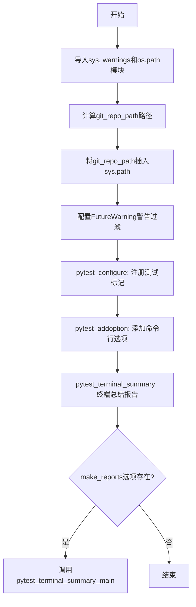
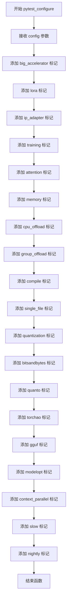
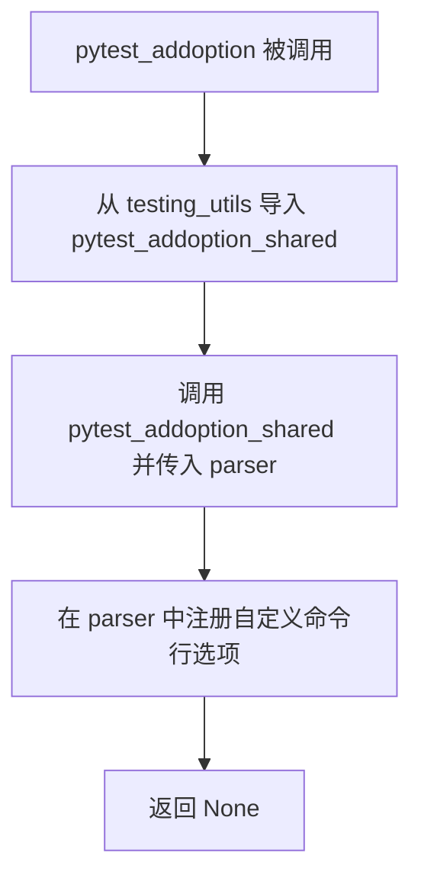
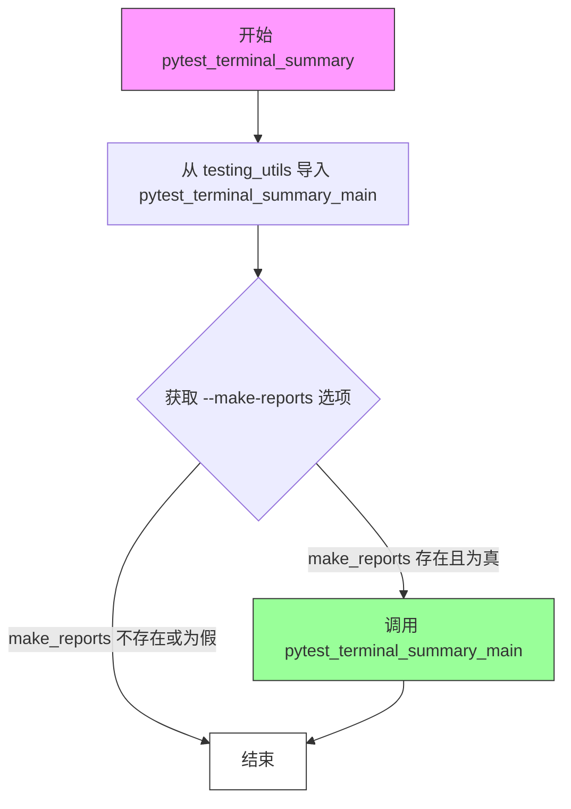

# `diffusers\tests\conftest.py` 详细设计文档

这是HuggingFace Diffusers库的pytest配置文件，用于配置测试环境、注册测试标记、添加自定义pytest命令行选项，以及定义测试终端总结功能，以支持组织和管理不同类型的测试（如大模型加速器、LoRA、量化等特殊测试）。

## 整体流程



## 类结构

```
conftest.py (pytest配置文件，无类定义)
└── 全局函数: pytest_configure, pytest_addoption, pytest_terminal_summary
```

## 全局变量及字段


### `git_repo_path`
    
指向项目src目录的绝对路径，用于sys.path配置

类型：`str`
    


    

## 全局函数及方法


### `pytest_configure`

该函数是pytest的钩子函数，用于在测试运行前配置pytest标记（markers）。它通过调用`config.addinivalue_line`方法注册了一系列自定义标记，包括big_accelerator、lora、ip_adapter、training、attention、memory、cpu_offload、group_offload、compile、single_file、quantization、bitsandbytes、quanto、torchao、gguf、modelopt、context_parallel、slow、nightly等，用于标记不同类别的测试，以便在测试执行时进行筛选和分类。

参数：

-  `config`：`pytest.Config`，pytest配置对象，用于访问和修改pytest的全局配置

返回值：`None`，该函数没有返回值

#### 流程图



#### 带注释源码

```python
def pytest_configure(config):
    """
    配置pytest标记（markers），用于标记不同类别的测试
    
    参数:
        config: pytest.Config对象，pytest的全局配置对象
    
    返回值:
        None
    """
    # 标记需要大型加速器资源的测试
    config.addinivalue_line("markers", "big_accelerator: marks tests as requiring big accelerator resources")
    
    # 标记LoRA/PEFT功能相关的测试
    config.addinivalue_line("markers", "lora: marks tests for LoRA/PEFT functionality")
    
    # 标记IP Adapter功能相关的测试
    config.addinivalue_line("markers", "ip_adapter: marks tests for IP Adapter functionality")
    
    # 标记训练功能相关的测试
    config.addinivalue_line("markers", "training: marks tests for training functionality")
    
    # 标记注意力处理器功能相关的测试
    config.addinivalue_line("markers", "attention: marks tests for attention processor functionality")
    
    # 标记内存优化功能相关的测试
    config.addinivalue_line("markers", "memory: marks tests for memory optimization functionality")
    
    # 标记CPU卸载功能相关的测试
    config.addinivalue_line("markers", "cpu_offload: marks tests for CPU offloading functionality")
    
    # 标记组卸载功能相关的测试
    config.addinivalue_line("markers", "group_offload: marks tests for group offloading functionality")
    
    # 标记torch.compile功能相关的测试
    config.addinivalue_line("markers", "compile: marks tests for torch.compile functionality")
    
    # 标记单文件检查点加载相关的测试
    config.addinivalue_line("markers", "single_file: marks tests for single file checkpoint loading")
    
    # 标记量化功能相关的测试
    config.addinivalue_line("markers", "quantization: marks tests for quantization functionality")
    
    # 标记BitsAndBytes量化功能相关的测试
    config.addinivalue_line("markers", "bitsandbytes: marks tests for BitsAndBytes quantization functionality")
    
    # 标记Quanto量化功能相关的测试
    config.addinivalue_line("markers", "quanto: marks tests for Quanto quantization functionality")
    
    # 标记TorchAO量化功能相关的测试
    config.addinivalue_line("markers", "torchao: marks tests for TorchAO quantization functionality")
    
    # 标记GGUF量化功能相关的测试
    config.addinivalue_line("markers", "gguf: marks tests for GGUF quantization functionality")
    
    # 标记NVIDIA ModelOpt量化功能相关的测试
    config.addinivalue_line("markers", "modelopt: marks tests for NVIDIA ModelOpt quantization functionality")
    
    # 标记上下文并行推理功能相关的测试
    config.addinivalue_line("markers", "context_parallel: marks tests for context parallel inference functionality")
    
    # 标记慢速测试
    config.addinivalue_line("markers", "slow: mark test as slow")
    
    # 标记夜间测试
    config.addinivalue_line("markers", "nightly: mark test as nightly")
```


### `pytest_addoption`

该函数是 pytest 的钩子函数，用于在测试运行前添加自定义命令行选项。它从同目录下的 `testing_utils` 模块导入 `pytest_addoption_shared` 函数并调用它，将 parser 对象传递过去以注册项目特定的自定义选项。

参数：

- `parser`：`pytest.Parser`，pytest 的命令行解析器对象，用于注册新的命令行选项

返回值：`None`，该函数没有返回值，通过副作用完成配置

#### 流程图



#### 带注释源码

```python
def pytest_addoption(parser):
    """
    pytest 钩子函数：在解析命令行选项之前被调用
    
    参数:
        parser: pytest 的 Parser 对象，用于添加自定义命令行选项
    
    返回值:
        无（返回 None）
    """
    # 从同目录下的 testing_utils 模块导入 pytest_addoption_shared 函数
    # 该函数封装了所有项目特定的自定义选项添加逻辑
    from .testing_utils import pytest_addoption_shared

    # 调用共享的选项添加函数，将 parser 对象传递过去
    # 由 pytest_addoption_shared 负责具体的选项注册工作
    pytest_addoption_shared(parser)
```

---

## 附加信息

### 文件整体运行流程

该文件是 pytest 的配置文件（`conftest.py`），在测试运行前自动执行。主要流程包括：

1. **环境设置**：将源代码目录添加到 `sys.path`，允许测试导入项目模块
2. **警告过滤**：忽略 FutureWarning 警告，避免测试输出被污染
3. **配置标记**：通过 `pytest_configure` 函数注册各种测试标记（markers）
4. **添加命令行选项**：通过 `pytest_addoption` 函数添加自定义命令行参数
5. **测试摘要**：通过 `pytest_terminal_summary` 函数在测试结束后生成报告

### 关键组件信息

| 组件名称 | 一句话描述 |
|---------|-----------|
| `pytest_configure` | 注册项目特定的测试标记（markers），如 big_accelerator、lora、quantization 等 |
| `pytest_addoption` | 添加自定义命令行选项的入口函数，调用 testing_utils 中的共享函数 |
| `pytest_terminal_summary` | 在测试结束后生成测试报告，支持 --make-reports 选项 |
| `git_repo_path` | 计算项目源代码目录的绝对路径，用于动态添加 import 路径 |

### 潜在的技术债务或优化空间

1. **隐式依赖**：`pytest_addoption` 函数依赖于 `testing_utils` 模块中的 `pytest_addoption_shared` 函数，但该函数的实现未知，如果该函数不存在或接口变更会导致测试框架无法初始化
2. **硬编码路径**：使用 `dirname(__file__)` 相对路径计算源代码目录，在某些边缘情况下（如符号链接）可能出现路径问题
3. **魔法字符串**：`"--make-reports"` 选项名称硬编码在 `pytest_terminal_summary` 中，如果需要配置化会比较困难

### 其它项目

#### 设计目标与约束

- **目标**：为测试框架提供自定义命令行选项和测试标记的支持
- **约束**：必须与 pytest 框架兼容，遵循 pytest 的钩子函数接口规范

#### 错误处理与异常设计

- 如果 `testing_utils` 模块不存在或导入失败，pytest 将在初始化阶段报错，这是预期行为
- 没有显式的错误处理逻辑，依赖 pytest 框架本身的错误报告机制

#### 外部依赖与接口契约

- **依赖**：pytest 框架本身、testing_utils 模块
- **接口**：
  - `pytest_configure(config)`：接收 pytest Config 对象
  - `pytest_addoption(parser)`：接收 pytest Parser 对象
  - `pytest_terminal_summary(terminalreporter)`：接收 pytest TerminalReporter 对象


### `pytest_terminal_summary`

该函数是 pytest 的钩子函数，在测试执行结束后被调用。它从配置中获取 `--make-reports` 选项的值，如果该选项存在且为真，则调用 `pytest_terminal_summary_main` 函数生成测试报告。

参数：

- `terminalreporter`：`TerminalReporter`，pytest 的终端报告器对象，包含测试执行结果和配置信息

返回值：`None`，该函数没有返回值，仅执行副作用操作

#### 流程图



#### 带注释源码

```python
def pytest_terminal_summary(terminalreporter):
    """
    pytest 钩子函数，在测试会话结束后调用，用于生成测试报告。
    
    参数:
        terminalreporter: pytest 的 TerminalReporter 对象，包含测试结果和配置信息
    """
    # 从同包的 testing_utils 模块导入报告生成主函数
    # 使用延迟导入避免循环依赖
    from .testing_utils import pytest_terminal_summary_main

    # 从 pytest 配置中获取 --make-reports 命令行选项的值
    # 如果未指定该选项，getoption 返回 None 或 False
    make_reports = terminalreporter.config.getoption("--make-reports")
    
    # 如果 make_reports 选项存在（值为真），则生成测试报告
    if make_reports:
        # 调用报告生成函数，传入 terminalreporter 和 make_reports 的值作为 id
        pytest_terminal_summary_main(terminalreporter, id=make_reports)
```

## 关键组件


### pytest_configure

配置pytest的测试标记，用于标记需要特定资源或功能的测试用例，包括大 accelerator、LoRA、IP Adapter、训练、注意力机制、内存优化、CPU offload、group offload、torch.compile、单文件检查点加载、量化（bitsandbytes、quanto、torchao、gguf、modelopt）、context parallel、slow 和 nightly 测试。

### pytest_addoption

从 testing_utils 模块加载并执行共享的 pytest 命令行选项添加逻辑，用于扩展 pytest 的命令行参数支持。

### pytest_terminal_summary

从 testing_utils 模块加载并执行终端摘要生成逻辑，当指定 --make-reports 选项时，生成测试报告。

### 测试标记系统

定义了丰富的 pytest 标记体系，涵盖量化策略（bitsandbytes、quanto、torchao、gguf、modelopt）、模型加载优化（single_file）、并行推理（context_parallel）和性能测试（big_accelerator、memory、compile）等关键测试维度。

### 路径配置与惰性加载

通过动态计算 git_repo_path 并使用 sys.path.insert 将源代码目录添加到 Python 路径，实现多仓库 checkout 环境下无需重新安装即可运行测试的灵活机制。

### 警告过滤

使用 warnings.simplefilter 忽略 FutureWarning 类型的警告，确保测试输出不会被尚未成为标准警告的未来特性警告所干扰。


## 问题及建议


### 已知问题

- **硬编码路径构建**：使用 `abspath(join(dirname(dirname(__file__)), "src"))` 假设源代码目录总是在特定的相对路径下，这在某些安装场景（如符号链接、不同目录结构）可能导致路径解析失败
- **静默警告抑制**：`warnings.simplefilter(action="ignore", category=FutureWarning)` 会静默抑制所有 FutureWarning，可能隐藏重要的弃用信息，导致测试期间无法及时发现即将发生的 API 变更
- **函数内导入**：`from .testing_utils import ...` 在函数内部进行导入而非模块级别，这使得如果 testing_utils 模块不存在或导入失败，错误信息不够清晰，且每次调用函数都会执行导入操作
- **缺乏错误处理**：对 testing_utils 模块的导入没有任何错误处理机制，如果该模块不存在会导致运行时错误
- **标记重复定义风险**：所有测试标记在 pytest_configure 中硬编码，如果 testing_utils.py 中的 pytest_addoption_shared 也定义了相同标记，可能导致冲突或重复

### 优化建议

- 将 testing_utils 的导入移至模块顶部，并添加 try-except 包装以提供更清晰的错误信息，例如提示需要安装开发依赖
- 考虑使用配置文件或从 testing_utils 动态读取标记定义，避免硬编码
- 对于 FutureWarning 的过滤策略，建议改为在特定测试类中使用 pytest.mark.filterwarnings 装饰器进行精细控制，而非全局静默
- 添加路径验证逻辑，在路径不存在时给出明确的警告或错误提示
- 考虑将 git_repo_path 的构建逻辑封装成独立函数以提高可测试性和可维护性

## 其它


### 设计目标与约束

本代码作为pytest的配置文件（conftest.py），主要目标是为HuggingFace Transformers项目提供统一的测试环境配置。约束包括：1) 必须兼容Python 3.8+和pytest 7.0+；2) 需要支持多仓库检出的开发场景；3) 必须保持与主代码仓库的相对路径一致性；4) 所有标记定义必须与项目测试策略保持一致。

### 错误处理与异常设计

代码本身错误处理较少，主要通过warnings模块的简单过滤机制处理FutureWarning。在路径解析方面，使用abspath和dirname确保路径的正确性，但未对sys.path.insert操作失败的情况进行异常捕获。当testing_utils模块导入失败时，pytest_configure和pytest_addoption函数会抛出ImportError。

### 数据流与状态机

本文件不涉及复杂的数据流或状态机。其数据流为：1) 模块加载时执行路径配置；2) pytest启动时调用pytest_configure注册标记；3) 解析命令行选项时调用pytest_addoption；4) 测试结束后调用pytest_terminal_summary生成报告。

### 外部依赖与接口契约

代码依赖三个外部模块：1) sys、warnings、os.path为Python标准库；2) testing_utils.py中的pytest_addoption_shared函数，接受parser参数，无返回值；3) testing_utils.py中的pytest_terminal_summary_main函数，接受terminalreporter和id参数，返回值未定义。这些函数的接口契约由testing_utils模块定义。

### 安全与权限考虑

代码主要涉及文件路径操作。使用abspath和join确保路径安全，避免路径遍历攻击。sys.path的修改可能引入代码注入风险，但在开发测试环境中可接受。建议在未来版本中添加路径存在性验证。

### 版本兼容性

代码需要Python 3.8+以支持os.path.join的某些特性。pytest版本应至少为7.0以支持config.addinivalue_line方法。代码未显式声明支持的pytest版本范围。

### 性能考虑

路径解析在模块加载时执行，每次测试会话仅执行一次，性能影响可忽略。sys.path.insert操作的时间复杂度为O(n)，其中n为sys.path长度，但在测试环境中通常可接受。

### 配置管理

配置通过两种方式管理：1) pytest标记注册，存储在pytest config对象中；2) 命令行选项，通过parser对象添加。配置值无法通过环境变量覆盖，这是潜在的限制。

### 测试隔离机制

代码通过sys.path操作实现测试隔离：使用git_repo_path指向src目录，确保导入的是当前检出的代码而非安装的包。warnings过滤仅影响当前进程。

### CI/CD集成

代码支持--make-reports命令行选项，用于生成测试报告，适合CI/CD环境集成。标记定义支持选择性运行测试，如slow、nightly等标记可用于CI策略配置。

### 可扩展性设计

代码具有良好的可扩展性：1) 标记注册通过addinivalue_line动态添加；2) pytest_addoption和pytest_terminal_summary可被子模块覆盖；3) 支持通过testing_utils扩展功能。建议未来考虑插件化架构以支持更多测试框架。

    