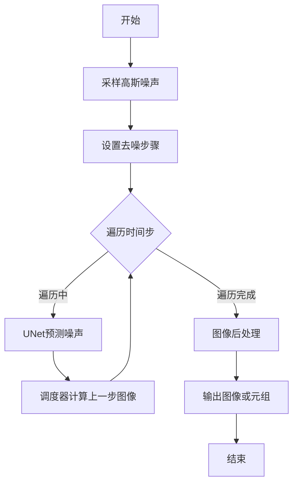
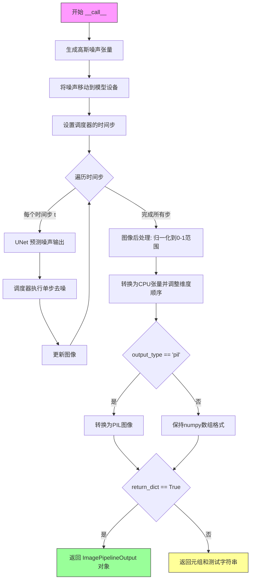

# `diffusers\tests\fixtures\custom_pipeline\pipeline.py` 详细设计文档

这是一个基于HuggingFace Diffusers库的自定义图像扩散Pipeline，通过U-Net模型和调度器对高斯噪声进行迭代去噪，最终生成目标图像。

## 整体流程



## 类结构

```
DiffusionPipeline (基类)
└── CustomLocalPipeline (自定义扩散Pipeline)
```

## 全局变量及字段


### `CustomLocalPipeline.unet`
    
U-Net去噪模型，用于预测噪声并逐步重建图像

类型：`UNet2DModel`
    


### `CustomLocalPipeline.scheduler`
    
噪声调度器，控制扩散过程中的噪声添加和去除策略

类型：`SchedulerMixin`
    
    

## 全局函数及方法


### CustomLocalPipeline.__init__

该方法用于初始化CustomLocalPipeline扩散管道实例，通过调用父类DiffusionPipeline的构造函数并注册UNet2DModel和SchedulerMixin模块，使管道具备图像去噪生成能力。

参数：

- `self`：隐式参数，指向当前创建的管道实例
- `unet`：`UNet2DModel`，U-Net架构模型，用于对编码图像进行去噪处理
- `scheduler`：`SchedulerMixin`，调度器，用于与unet配合执行去噪步骤，可选DDPMScheduler或DDIMScheduler等

返回值：无（`None`），该方法通过修改实例属性完成初始化

#### 流程图

```mermaid
flowchart TD
    A[开始 __init__] --> B[调用 super().__init__]
    B --> C[调用 self.register_modules]
    C --> D[注册 unet 模块]
    C --> E[注册 scheduler 模块]
    D --> F[结束初始化]
    E --> F
```

#### 带注释源码

```python
def __init__(self, unet: UNet2DModel, scheduler: SchedulerMixin):
    r"""
    初始化CustomLocalPipeline扩散管道
    
    参数:
        unet (UNet2DModel): U-Net架构，用于对编码图像进行去噪
        scheduler (SchedulerMixin): 调度器，与unet配合去噪，可为DDPMScheduler或DDIMScheduler
    """
    # 调用父类DiffusionPipeline的初始化方法
    # 设置管道的基本配置和设备管理
    super().__init__()
    
    # 使用register_modules方法注册unet和scheduler模块
    # 这会自动处理模块的设备分配和参数管理
    # 注册后的模块可通过self.unet和self.scheduler访问
    self.register_modules(unet=unet, scheduler=scheduler)
```


### CustomLocalPipeline.__call__

执行图像生成功能，通过去噪过程将随机高斯噪声逐步转换为目标图像，返回生成的图像或包含图像的输出对象。

参数：

- `self`：隐式参数，当前管道实例
- `batch_size`：`int`，默认值 1，要生成的图像数量
- `generator`：`torch.Generator | None`，默认值 None，用于确保生成可复现的 torch 随机数生成器
- `num_inference_steps`：`int`，默认值 50，去噪迭代的步数，步数越多图像质量越高但推理速度越慢
- `output_type`：`str | None`，默认值 "pil"，输出图像的格式，可选 "pil"（PIL.Image.Image）或 numpy 数组
- `return_dict`：`bool`，默认值 True，是否返回 [`~pipelines.ImagePipelineOutput`] 格式的结果
- `**kwargs`：可变关键字参数，用于传递额外的未定义参数

返回值：`ImagePipelineOutput | tuple`，当 `return_dict` 为 True 时返回 `ImagePipelineOutput` 对象（包含生成的图像列表），否则返回元组 `(image,)`

#### 流程图



#### 带注释源码

```python
@torch.no_grad()
def __call__(
    self,
    batch_size: int = 1,
    generator: torch.Generator | None = None,
    num_inference_steps: int = 50,
    output_type: str | None = "pil",
    return_dict: bool = True,
    **kwargs,
) -> ImagePipelineOutput | tuple:
    r"""
    执行图像生成的去噪流程。

    参数:
        batch_size: 要生成的图像数量，默认1
        generator: torch随机生成器，用于确定性生成
        num_inference_steps: 去噪步数，默认50
        output_type: 输出格式，"pil"或numpy数组，默认"pil"
        return_dict: 是否返回字典格式，默认True

    返回:
        ImagePipelineOutput或tuple: 生成的图像或元组
    """

    # 步骤1: 采样高斯噪声作为去噪循环的起点
    # 根据batch_size、UNet配置的通道数和样本尺寸创建随机噪声张量
    image = torch.randn(
        (batch_size, self.unet.config.in_channels, self.unet.config.sample_size, self.unet.config.sample_size),
        generator=generator,  # 传入生成器确保可复现性
    )
    # 将噪声张量移动到模型所在的设备（CPU/CUDA）
    image = image.to(self.device)

    # 步骤2: 设置调度器的时间步
    # 根据指定的推理步数配置调度器的时间步序列
    self.scheduler.set_timesteps(num_inference_steps)

    # 步骤3: 迭代去噪循环
    # 遍历调度器生成的所有时间步
    for t in self.progress_bar(self.scheduler.timesteps):
        # 1. 使用UNet预测噪声模型输出
        # 将当前噪声图像和时间步输入UNet，获取预测的噪声
        model_output = self.unet(image, t).sample

        # 2. 调度器执行单步去噪
        # 根据预测的噪声和时间步计算前一时刻的图像x_t-1
        # eta参数控制方差大小（0为DDIM，1为DDPM类型）
        image = self.scheduler.step(model_output, t, image).prev_sample

    # 步骤4: 后处理生成的图像
    # 将图像从[-1,1]范围归一化到[0,1]范围: (image / 2 + 0.5).clamp(0, 1)
    image = (image / 2 + 0.5).clamp(0, 1)
    
    # 转换为CPU上的numpy数组，调整维度顺序从(CHW)变为(HWC)
    image = image.cpu().permute(0, 2, 3, 1).numpy()
    
    # 根据output_type决定输出格式
    if output_type == "pil":
        # 将numpy数组转换为PIL图像对象
        image = self.numpy_to_pil(image)

    # 步骤5: 返回结果
    if not return_dict:
        # 返回元组格式（兼容旧API），包含图像和测试字符串
        return (image,), "This is a local test"

    # 返回标准Pipeline输出格式
    return ImagePipelineOutput(images=image), "This is a local test"
```

## 关键组件


### CustomLocalPipeline 类

继承自DiffusionPipeline的自定义图像生成扩散管道，封装了UNet2DModel去噪模型和SchedulerMixin调度器，协调整个图像生成流程。

### UNet2DModel (unet)

U-Net架构的去噪模型，根据当前噪声图像和时间步预测噪声，是扩散模型的核心组件。

### SchedulerMixin (scheduler)

调度器组件，管理去噪过程的时间步列表，提供step方法计算前一时刻的图像，实现DDPM/DDIM等不同采样策略。

### 张量索引与惰性加载

使用torch.randn按需生成指定形状的高斯噪声张量，避免预加载完整数据集；通过.to(self.device)实现设备惰性迁移。

### 反量化支持

通过`(image / 2 + 0.5).clamp(0, 1)`将[-1,1]范围的模型输出反量化至[0,1]图像范围，并转换为numpy数组和PIL图像格式。

### 噪声采样与去噪循环

使用torch.Generator实现确定性生成，通过progress_bar遍历scheduler.timesteps，在每步调用unet预测噪声并由scheduler计算前一时刻图像，形成迭代去噪过程。

### 图像后处理管道

整合clamp、permute、numpy转换和numpy_to_pil等操作，将张量输出标准化为PIL.Image或numpy数组格式。

### 设备管理

通过self.device属性统一管理计算设备，支持CPU/GPU自动切换。


## 问题及建议


### 已知问题

-   **文档与实现不一致**：`__call__` 方法的文档字符串中提到了 `eta` 参数，但方法签名中没有这个参数，会误导使用者。
-   **返回值格式不符合规范**：方法返回时额外返回了字符串 `"This is a local test"`，这与文档描述的 `ImagePipelineOutput` 或 tuple 格式不符，破坏了接口契约。
-   **设备一致性未保证**：仅将 `image` 移动到 `self.device`，但未确保 `unet` 和 `scheduler` 也在同一设备上，可能导致运行时设备不匹配错误。
-   **参数验证缺失**：没有对输入参数（如 `batch_size`、`num_inference_steps`）进行有效性验证，负数或零值可能导致异常或未定义行为。
-   **scheduler 接口未验证**：未检查传入的 `scheduler` 是否具有 `step`、`set_timesteps`、`timesteps` 等必要方法或属性，调用时可能出错。
-   **类型注解不精确**：返回类型标注为 `ImagePipelineOutput | tuple` 过于宽泛，实际返回的是三元组，类型安全不足。
-   **缺少必要导入验证**：`numpy_to_pil` 方法依赖父类实现，但未在文档中说明，父类实现变更时可能破坏功能。

### 优化建议

-   在 `__call__` 方法签名中添加 `eta` 参数（如果需要支持）或从文档中移除对该参数的描述。
-   移除返回元组中的额外字符串 `"This is a local test"`，保持与 `ImagePipelineOutput` 的一致性，或调整文档以反映实际返回格式。
-   在初始化或调用前添加设备一致性检查，例如：`self.unet.to(self.device)` 和 `self.scheduler.to(self.device)`。
-   添加参数验证逻辑，如检查 `batch_size > 0` 和 `num_inference_steps > 0`，并在验证失败时抛出 `ValueError`。
-   添加对 scheduler 接口的运行时检查，或在文档中明确说明支持的 scheduler 类型。
-   改进类型注解，使用 `NamedTuple` 或自定义返回类来精确描述返回值结构。
-   在类或方法文档中明确说明对 `scheduler` 接口的要求和依赖。

## 其它


### 设计目标与约束

本设计旨在实现一个基于U-Net架构的图像扩散生成管道，继承DiffusionPipeline基类，实现文本到图像或噪声到图像的生成能力。设计约束包括：必须继承自diffusers库的DiffusionPipeline；必须支持批量生成；必须支持随机数生成器以实现可重复性；必须支持不同的输出格式（PIL或numpy）；返回值需同时包含图像和字符串信息。

### 错误处理与异常设计

管道在以下场景进行错误处理：1）当batch_size小于1时，应抛出ValueError；2）当num_inference_steps小于1时，应抛出ValueError；3）当output_type不为"pil"或"numpy"时，应给出警告并默认为numpy；4）当device不一致时，代码自动将图像移动到self.device；5）scheduler的step方法可能抛出异常，需确保scheduler实现了正确的step接口。

### 数据流与状态机

数据流状态机包含以下状态：1）INIT状态：初始化U-Net和Scheduler；2）NOISE_SAMPLING状态：从高斯分布采样初始噪声；3）DENOISING_LOOP状态：迭代去噪循环，包含PREDICT（预测噪声）、STEP（计算上一步图像）、UPDATE（更新图像）子状态；4）POST_PROCESSING状态：图像后处理，包括归一化、格式转换；5）OUTPUT状态：返回最终图像或元组。

### 外部依赖与接口契约

外部依赖包括：1）torch库：提供张量运算和随机数生成器；2）diffusers库：DiffusionPipeline基类、ImagePipelineOutput、SchedulerMixin、UNet2DModel；3）PIL库：numpy_to_pil转换。接口契约：unet必须实现config属性（in_channels、sample_size）和sample方法；scheduler必须实现set_timesteps、step、timesteps属性；管道实例必须具有device属性。

### 配置与参数说明

关键配置参数：batch_size控制生成图像数量；generator控制随机种子以实现可重复生成；num_inference_steps控制去噪迭代次数，影响图像质量和生成速度；output_type控制输出格式（"pil"或"numpy"）；return_dict控制返回值格式。eta参数在代码中未使用但文档已说明，用于控制DDIM和DDPM的方差。

### 性能考虑与优化空间

性能优化方向：1）可添加torch.cuda.amp.autocast以支持混合精度推理；2）可添加torch.compile加速推理；3）批处理大小受GPU显存限制，需添加显存检查；4）progress_bar可能影响性能，可添加开关控制；5）图像后处理（numpy和PIL转换）可考虑异步执行；6）可添加缓存机制避免重复创建相同尺寸的张量。

### 安全性考虑

安全考量包括：1）生成的图像内容不包含恶意代码或敏感信息；2）模型权重来源需可信；3）输入参数验证防止资源耗尽攻击；4）设备选择需考虑CUDA内存安全；5）生成的图像数据需妥善处理防止泄露。

### 测试策略

测试应覆盖：1）单元测试：验证__call__方法基本功能、参数验证、返回值格式；2）集成测试：测试完整生成流程、多种输出格式；3）性能测试：测量不同num_inference_steps的性能；4）边界测试：batch_size=1和较大值、generator为None和有效值；5）回归测试：确保多次运行结果一致性（使用相同generator）。

### 使用示例

```python
# 基本使用
pipeline = CustomLocalPipeline(unet=unet, scheduler=scheduler)
images = pipeline(batch_size=1, num_inference_steps=50)

# 使用随机种子
import torch
generator = torch.Generator(device="cuda").manual_seed(42)
images = pipeline(batch_size=1, generator=generator)

# 返回numpy数组
images = pipeline(output_type="numpy", return_dict=False)
```

### 版本兼容性

版本兼容性要求：1）Python版本需支持类型注解（3.9+）；2）torch版本需支持Generator类型注解（1.10+）；3）diffusers版本需支持SchedulerMixin和ImagePipelineOutput；4）UNet2DModel配置属性（in_channels、sample_size）需与实际模型一致。

### 扩展性设计

扩展性设计考虑：1）可继承添加文本条件输入实现文本到图像；2）可添加LoRA权重加载支持；3）可添加ControlNet条件控制；4）可添加自定义后处理pipeline；5）scheduler可通过register_modules灵活替换；6）可添加回调函数支持中间过程可视化。

    