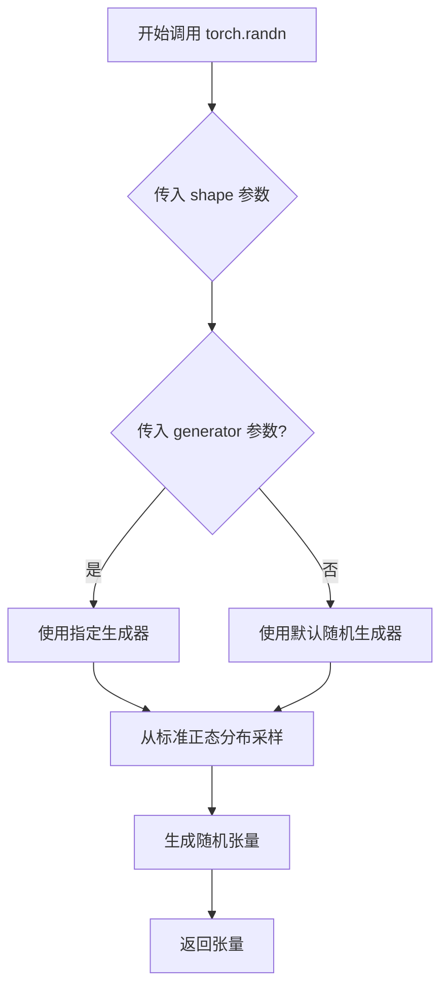
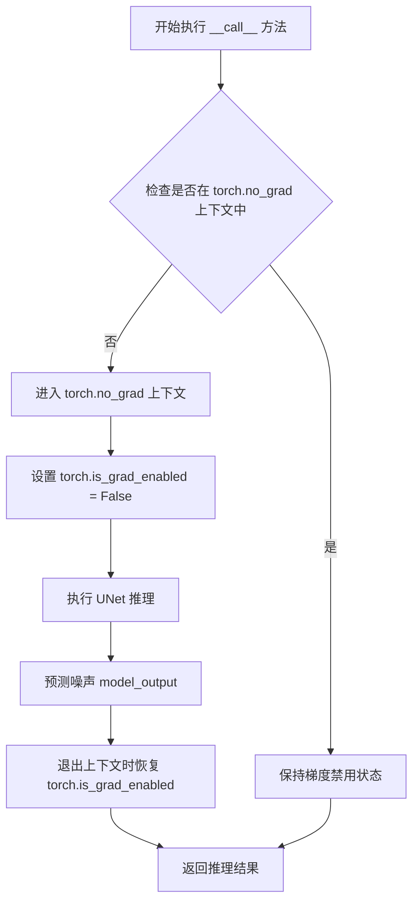
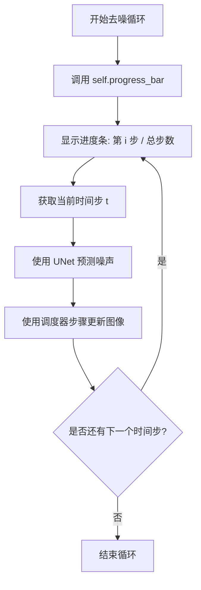
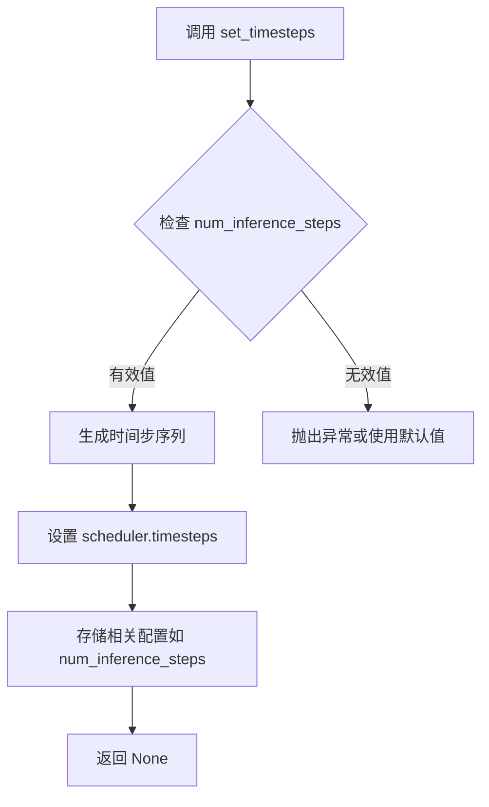
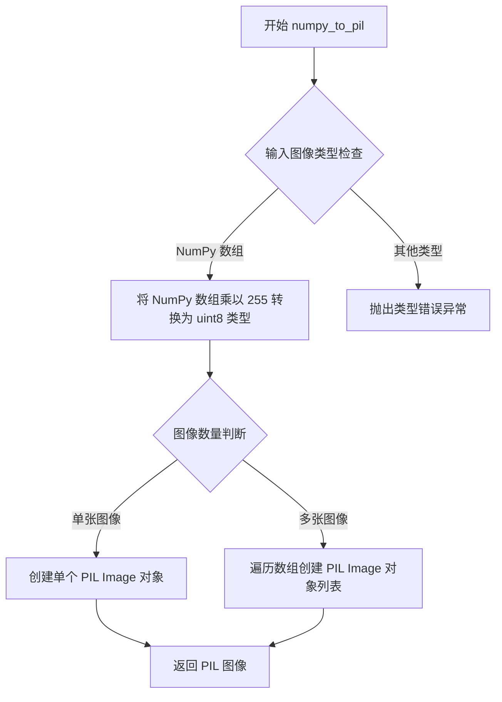
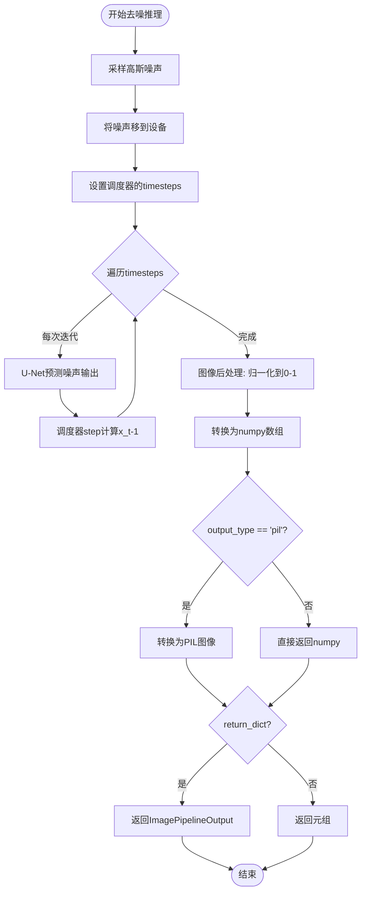

# `diffusers\tests\fixtures\custom_pipeline\what_ever.py` 详细设计文档

这是一个自定义的图像生成扩散管道，继承自DiffusionPipeline类，通过UNet2DModel进行噪声预测，配合SchedulerMixin调度器进行迭代去噪，最终生成图像。可配置批次大小、推理步数和输出格式，支持PIL图像或NumPy数组输出。

## 整体流程

```mermaid
graph TD
A[开始 __call__] --> B[检查并生成随机噪声]
B --> C[将噪声移到设备]
C --> D[设置调度器时间步]
D --> E{还有时间步未处理?}
E -- 是 --> F[UNet预测噪声输出]
F --> G[调度器执行去噪步骤]
G --> E
E -- 否 --> H[图像后处理: 归一化到[0,1]]
H --> I[转换为NumPy数组]
I --> J{output_type == 'pil'?}
J -- 是 --> K[转换为PIL图像]
J -- 否 --> L[返回NumPy数组]
K --> M{return_dict?}
L --> M
M -- 是 --> N[返回ImagePipelineOutput]
M -- 否 --> O[返回元组]
```

## 类结构

```
DiffusionPipeline (基类)
└── CustomLocalPipeline (自定义本地管道)
```

## 全局变量及字段


### `CustomLocalPipeline.unet`
    
U-Net去噪模型，用于预测噪声并逐步重建图像

类型：`UNet2DModel`
    


### `CustomLocalPipeline.scheduler`
    
扩散调度器，控制去噪过程中的时间步和噪声添加策略

类型：`SchedulerMixin`
    
    

## 全局函数及方法


### `torch.randn`

生成一个给定形状的张量，其元素从均值为0、方差为1的正态分布（高斯分布）中随机采样。

参数：

- `shape`：`tuple`，输出的张量形状，格式为 (batch_size, channels, height, width)
- `generator`：`torch.Generator | None`，可选的随机数生成器，用于控制随机性，实现确定性生成
- `out`：`torch.Tensor | None`，可选的输出张量
- `dtype`：`torch.dtype | None`，可选的数据类型
- `layout`：`torch.layout | None`，可选的内存布局
- `device`：`torch.device | None`，可选的设备
- `requires_grad`：`bool`，是否需要计算梯度

返回值：`torch.Tensor`，返回一个随机生成的正态分布张量

#### 流程图



#### 带注释源码

```python
# Sample gaussian noise to begin loop
# 生成用于去噪扩散过程的初始高斯噪声
# 参数说明:
# - shape: (batch_size, 通道数, 图像高度, 图像宽度)
#   其中 batch_size 是生成的图像数量
#   self.unet.config.in_channels 是UNet模型的输入通道数
#   self.unet.config.sample_size 是样本的空间分辨率
# - generator: 可选的随机生成器，用于确保结果可复现
image = torch.randn(
    (batch_size, self.unet.config.in_channels, self.unet.config.sample_size, self.unet.config.sample_size),
    generator=generator,
)
# 将生成的噪声张量移动到当前计算设备上（CPU/GPU）
image = image.to(self.device)
```

---

**使用场景说明**：

在扩散模型（如DDPM、DDIM）中，推理过程从随机采样的高斯噪声开始，然后通过UNet模型逐步预测并去除噪声，最终生成清晰的图像。`torch.randn`在此处的作用就是生成这个初始的随机噪声，作为扩散去噪过程的起点。


### `torch.no_grad`

`torch.no_grad` 是 PyTorch 的一个上下文管理器（当作为装饰器使用时），用于禁用梯度计算。在推理阶段使用此管理器可以显著减少内存消耗并加快计算速度，因为它阻止了张量历史记录的追踪和梯度计算。

参数：

- 此上下文管理器不接受显式参数（通常以 `@torch.no_grad()` 形式调用）

返回值：`torch.no_grad` 上下文管理器对象，该对象在 `__enter__` 时设置 `torch_grad_enabled` 为 `False`，在 `__exit__` 时恢复原始状态。

#### 流程图



#### 带注释源码

```python
@torch.no_grad()  # 装饰器形式：调用 torch.no_grad() 返回上下文管理器并应用于 __call__ 方法
def __call__(
    self,
    batch_size: int = 1,
    generator: torch.Generator | None = None,
    num_inference_steps: int = 50,
    output_type: str | None = "pil",
    return_dict: bool = True,
    **kwargs,
) -> ImagePipelineOutput | tuple:
    # 在此方法执行期间，PyTorch 会禁用梯度计算
    # 这样做的好处：
    # 1. 减少内存占用 - 不保存计算图
    # 2. 加快推理速度 - 跳过梯度计算
    # 3. 明确表示这是推理代码而非训练代码
    
    # 示例：高斯噪声采样（无需梯度）
    image = torch.randn(
        (batch_size, self.unet.config.in_channels, self.unet.config.sample_size, self.unet.config.sample_size),
        generator=generator,
    )
    image = image.to(self.device)

    # 设置去噪步骤
    self.scheduler.set_timesteps(num_inference_steps)

    for t in self.progress_bar(self.scheduler.timesteps):
        # 1. 预测噪声模型输出（无梯度需求）
        model_output = self.unet(image, t).sample

        # 2. 预测上一步图像并添加方差
        image = self.scheduler.step(model_output, t, image).prev_sample

    # 后处理图像（无需梯度）
    image = (image / 2 + 0.5).clamp(0, 1)
    image = image.cpu().permute(0, 2, 3, 1).numpy()
    if output_type == "pil":
        image = self.numpy_to_pil(image)

    if not return_dict:
        return (image,), "This is a local test"

    return ImagePipelineOutput(images=image), "This is a local test"
```

#### 等效的上下文管理器形式

```python
# 以下两种写法在功能上等价：

# 方式1：装饰器形式（代码中使用的）
@torch.no_grad()
def __call__(self, ...):
    ...

# 方式2：上下文管理器形式
def __call__(self, ...):
    with torch.no_grad():  # 显式使用上下文管理器
        ...
```


### `CustomLocalPipeline.progress_bar`

这是一个继承自父类 `DiffusionPipeline` 的方法，用于在扩散模型的推理过程中显示去噪步骤的进度条。该方法接收调度器的时间步长数组作为参数，返回一个可迭代对象供 for 循环使用，使用户能够直观地看到去噪过程的进展情况。

参数：

- `timesteps`：`torch.Tensor`，来自调度器的时间步长数组，包含了从起始时间步到结束时间步的所有离散时间点，用于控制扩散模型的去噪过程

返回值：`torch.Tensor` 或可迭代对象，返回时间步长数组的可迭代版本，用于 for 循环遍历

#### 流程图



#### 带注释源码

```python
# 在 CustomLocalPipeline.__call__ 方法中调用进度条
for t in self.progress_bar(self.scheduler.timesteps):
    """
    progress_bar 是继承自 DiffusionPipeline 的方法:
    - 参数: self.scheduler.timesteps - 调度器生成的时间步长数组
    - 功能: 包装时间步长数组，在迭代时显示进度条
    - 返回: 可迭代的时间步长序列
    """
    
    # 1. 使用 UNet 模型预测噪声
    # 输入: 当前噪声图像 image 和当前时间步 t
    # 输出: 预测的噪声 model_output
    model_output = self.unet(image, t).sample

    # 2. 使用调度器根据预测的噪声计算去噪后的图像
    # scheduler.step 计算 x_{t-1} = x_t - noise
    # 参数: 预测噪声 model_output, 当前时间步 t, 当前图像 image
    # 输出: 去噪后的图像 prev_sample
    image = self.scheduler.step(model_output, t, image).prev_sample
```

#### 补充说明

**方法来源**：`progress_bar` 方法定义在 `DiffusionPipeline` 父类中，这是 Hugging Face diffusers 库提供的通用进度条显示功能。在自定义管道中直接调用即可，无需额外定义。

**使用场景**：该方法用于在扩散模型的迭代去噪过程中向用户提供视觉反馈，显示当前已完成的去噪步骤数和总步骤数，特别适用于长时间运行的推理任务。

**技术细节**：进度条的实现依赖于 `tqdm` 库或其他类似的进度条库，能够在控制台中实时更新进度信息，提升用户体验。


### `SchedulerMixin.set_timesteps`

设置去噪时间步，根据推理步数生成用于去噪调度的时间步序列，供后续迭代过程中逐步从噪声图像中恢复目标图像。

参数：

- `num_inference_steps`：`int`，去噪推理的总步数，决定生成多少个时间步进行迭代去噪，值越大通常图像质量越高但推理速度越慢

返回值：`None`，该方法无返回值，通过修改 scheduler 内部的 `timesteps` 属性来生效

#### 流程图



#### 带注释源码

```
# 在 CustomLocalPipeline.__call__ 方法中调用
# 用于初始化去噪过程的时间步
self.scheduler.set_timesteps(num_inference_steps)

# 源码位置：diffusers/src/diffusers/schedulers/scheduling_utils.py (SchedulerMixin)
# 以下为典型实现逻辑：

def set_timesteps(self, num_inference_steps: int, device: str | torch.device = "cpu"):
    """
    Sets the discrete timesteps used for the denoising chain. 
    Supporting function to be run before inference.
    
    Args:
        num_inference_steps (`int`):
            The number of denoising steps to run during inference.
        device (`str` or `torch.device`, *optional*, defaults to "cpu"):
            The device on which the timesteps should be created.
    """
    # 1. 计算步长间隔，根据调度器类型生成等差或等比时间步
    step_ratio = self.config.num_train_timesteps // num_inference_steps
    
    # 2. 生成时间步数组（从大到小，表示从高噪声到低噪声）
    timesteps = (np.arange(0, num_inference_steps) * step_ratio).round()[::-1].copy()
    timesteps = torch.from_numpy(timesteps).to(device)
    
    # 3. 设置到实例属性，供后续 step() 方法使用
    self.timesteps = timesteps
    
    # 4. 记录推理步数
    self.num_inference_steps = num_inference_steps
```


### `SchedulerMixin.step`

该方法是扩散模型调度器（Scheduler）的核心方法，执行单步去噪操作。它接收模型预测的噪声输出、当前时间步和当前噪声图像，计算并返回上一时间步的去噪图像样本（`prev_sample`）。

参数：

-  `model_output`：`torch.Tensor`，UNet 模型预测的噪声输出
-  `t`：`int` 或 `torch.Tensor`，当前扩散时间步（timestep）
-  `image`：`torch.Tensor`，当前时间步的噪声图像（x_t）

返回值：`torch.Tensor`，去噪后的图像样本（x_{t-1}），即 `prev_sample` 属性

#### 流程图

```mermaid
flowchart TD
    A[接收 model_output, t, image] --> B{检查调度器类型}
    B -->|DDPM| C[计算前向扩散方差]
    B -->|DDIM| D[计算确定性路径]
    B -->|其他| E[通用采样逻辑]
    C --> F[计算 x_{t-1} = sqrt(alpha_bar) * pred_x0 + sqrt(1 - alpha_bar) * noise]
    D --> G[计算 x_{t-1} = sqrt(alpha_t) * pred_x0 + sqrt(1 - alpha_t - eta*beta_t) * noise]
    E --> H[根据对应公式计算]
    F --> I[返回 PrevSample 对象]
    G --> I
    H --> I
    I --> J[提取 .prev_sample 属性]
    J --> K[返回去噪图像 x_{t-1}]
```

#### 带注释源码

```python
# 在 CustomLocalPipeline.__call__ 方法中的调用方式
# 第75行

# 1. 获取 UNet 预测的噪声输出
# model_output: torch.Tensor，形状为 [batch_size, channels, height, width]
model_output = self.unet(image, t).sample

# 2. 调用调度器的 step 方法执行单步去噪
# 参数说明：
#   - model_output: UNet 预测的噪声
#   - t: 当前时间步（整数标量）
#   - image: 当前噪声图像 x_t
# 返回值是一个调度器特定的对象，包含 prev_sample 等属性
scheduler_output = self.scheduler.step(model_output, t, image)

# 3. 从调度器输出中提取去噪后的图像 x_{t-1}
# prev_sample: torch.Tensor，去除噪声后的图像样本
image = scheduler_output.prev_sample
```


### `CustomLocalPipeline.numpy_to_pil`

将 NumPy 数组格式的图像数据转换为 PIL 图像对象列表，用于扩散模型输出格式的转换。

参数：

- `image`：`numpy.ndarray`，输入的 NumPy 数组，形状为 (batch_size, height, width, channels)，值范围为 [0, 1]

返回值：`List[PIL.Image.Image]` 或 `PIL.Image.Image`，转换后的 PIL 图像对象或图像列表

#### 流程图



#### 带注释源码

```
# 注意: 此方法继承自父类 DiffusionPipeline，此处为推断的标准实现
# 方法名: numpy_to_pil
# 参数: image - NumPy 数组，形状为 (batch_size, height, width, channels)，值范围 [0, 1]

def numpy_to_pil(self, images):
    """
    Convert a numpy image or a batch of images to PIL Image(s).

    Args:
        images (`numpy.ndarray` or `List[numpy.ndarray]`):
            The input image(s) to convert to PIL Image(s). Should be of shape
            (batch_size, height, width, channels) with values in [0, 1].

    Returns:
        `PIL.Image.Image` or `List[PIL.Image.Image]`:
            The converted PIL Image(s).
    """
    # 如果是单个图像数组（非批量）
    if isinstance(images, np.ndarray):
        # 将 [0, 1] 范围的浮点数转换为 [0, 255] 的 uint8 类型
        images = (images * 255).round().astype(np.uint8)
        
        # 如果是批量图像（第一维大于1）
        if images.ndim == 4:
            return [Image.fromarray(img) for img in images]
        # 如果是单张图像（第三维）
        elif images.ndim == 3:
            return Image.fromarray(images)
        else:
            raise ValueError(f"Unsupported image array shape: {images.shape}")
    else:
        raise TypeError(f"Expected numpy.ndarray, got {type(images)}")
```

#### 备注

该方法继承自 `DiffusionPipeline` 基类，源代码中未直接显示实现细节。以上为基于 `diffusers` 库常见实现的推断版本。在当前代码中的调用上下文如下：

```python
# 在 __call__ 方法末尾:
image = image.cpu().permute(0, 2, 3, 1).numpy()  # 将 PyTorch 张量转为 NumPy 数组
if output_type == "pil":
    image = self.numpy_to_pil(image)  # 转换为 PIL 图像
```


### `CustomLocalPipeline.__init__`

初始化CustomLocalPipeline管道实例，注册UNet模型和调度器组件，使其成为管道的可调用模块。

参数：

- `self`：隐式参数，CustomLocalPipeline实例本身
- `unet`：`UNet2DModel`，U-Net架构模型，用于对编码图像进行去噪处理
- `scheduler`：`SchedulerMixin`，调度器，用于与unet配合对编码图像进行去噪，可选DDPMScheduler或DDIMScheduler等

返回值：`None`，无显式返回值，但通过`register_modules`方法注册了unet和scheduler模块到实例属性

#### 流程图

```mermaid
flowchart TD
    A[开始 __init__] --> B[调用 super().__init__]
    B --> C[调用 self.register_modules]
    C --> D[注册 unet 模块]
    C --> E[注册 scheduler 模块]
    D --> F[结束 __init__]
    E --> F
```

#### 带注释源码

```python
def __init__(self, unet: UNet2DModel, scheduler: SchedulerMixin):
    """
    初始化CustomLocalPipeline管道实例
    
    参数:
        unet: UNet2DModel实例，用于图像去噪的U-Net模型
        scheduler: SchedulerMixin实例，用于控制去噪过程的调度器
    """
    # 调用父类DiffusionPipeline的初始化方法
    # 继承基础管道功能，如设备管理、模型加载等
    super().__init__()
    
    # 将unet和scheduler注册为管道的可调用模块
    # 注册后可通过self.unet和self.scheduler访问
    # 同时支持管道的save/load功能自动保存这些组件
    self.register_modules(unet=unet, scheduler=scheduler)
```


### CustomLocalPipeline.__call__

执行图像生成的去噪推理过程，通过迭代使用U-Net模型预测噪声并使用调度器逐步去噪，最终生成目标图像。

参数：

- `self`：CustomLocalPipeline实例本身
- `batch_size`：`int`，可选，默认值为1，要生成的图像数量
- `generator`：`torch.Generator | None`，可选，默认值为None，用于确保生成确定性的torch随机数生成器
- `num_inference_steps`：`int`，可选，默认值为50，去噪迭代的步数，步数越多通常图像质量越高但推理速度越慢
- `output_type`：`str | None`，可选，默认值为"pil"，生成图像的输出格式，可选"pil"返回PIL图像或numpy数组
- `return_dict`：`bool`，可选，默认值为True，是否返回ImagePipelineOutput字典格式而不是元组
- `**kwargs`：可变关键字参数，用于接收额外的未定义参数

返回值：`ImagePipelineOutput | tuple`，返回生成的图像及相关信息，如果是字典格式返回ImagePipelineOutput对象，否则返回元组(图像列表, 字符串信息)

#### 流程图



#### 带注释源码

```python
@torch.no_grad()
def __call__(
    self,
    batch_size: int = 1,
    generator: torch.Generator | None = None,
    num_inference_steps: int = 50,
    output_type: str | None = "pil",
    return_dict: bool = True,
    **kwargs,
) -> ImagePipelineOutput | tuple:
    r"""
    执行图像生成的去噪推理过程

    Args:
        batch_size: 要生成的图像数量，默认为1
        generator: torch随机数生成器，用于确保生成可复现，默认为None
        eta: eta参数，控制方差比例(0是DDIM，1是DDPM的一种)，此处通过kwargs传递但未使用
        num_inference_steps: 去噪步数，步数越多质量越高但速度越慢，默认为50
        output_type: 输出格式，"pil"返回PIL.Image.Image或np.array，默认为"pil"
        return_dict: 是否返回字典格式，默认为True

    Returns:
        ImagePipelineOutput或tuple: 生成的图像，或包含图像和测试字符串的元组
    """

    # 第一步：采样高斯噪声作为去噪循环的起点
    # 根据UNet配置的通道数和样本大小生成随机噪声张量
    image = torch.randn(
        (batch_size, self.unet.config.in_channels, self.unet.config.sample_size, self.unet.config.sample_size),
        generator=generator,
    )
    # 将噪声张量移动到当前计算设备(CPU/GPU)上
    image = image.to(self.device)

    # 第二步：设置调度器的timestep值
    # 根据推理步数生成离散的timestep序列
    self.scheduler.set_timesteps(num_inference_steps)

    # 第三步：迭代去噪循环
    # 遍历每个timestep进行逐步去噪
    for t in self.progress_bar(self.scheduler.timesteps):
        # 1. 使用U-Net模型预测噪声输出
        # 输入当前噪声图像和时间步，输出预测的噪声
        model_output = self.unet(image, t).sample

        # 2. 使用调度器预测上一时刻的图像x_t-1
        # 根据预测的噪声和时间步计算去噪后的图像
        # eta参数通过kwargs传递但在此实现中未使用
        image = self.scheduler.step(model_output, t, image).prev_sample

    # 第四步：图像后处理
    # 将图像从[-1,1]范围归一化到[0,1]范围
    image = (image / 2 + 0.5).clamp(0, 1)
    # 将图像从CHW格式转换为HWC格式的numpy数组
    image = image.cpu().permute(0, 2, 3, 1).numpy()
    
    # 第五步：格式转换
    # 根据output_type决定输出格式
    if output_type == "pil":
        # 将numpy数组转换为PIL图像
        image = self.numpy_to_pil(image)

    # 第六步：返回结果
    # 根据return_dict决定返回格式
    if not return_dict:
        # 返回元组格式(图像列表, 测试字符串)
        return (image,), "This is a local test"

    # 返回ImagePipelineOutput对象
    return ImagePipelineOutput(images=image), "This is a local test"
```

## 关键组件


### CustomLocalPipeline 类

自定义扩散管道类，继承自DiffusionPipeline，用于通过U-Net模型和调度器实现图像去噪生成。

### UNet2DModel 集成

U-Net架构用于对编码图像进行去噪处理，通过接收噪声图像和时间步长预测噪声输出。

### SchedulerMixin 调度器

调度器与U-Net结合使用以去噪编码图像，实现迭代去噪过程，可选DDPMScheduler或DDIMScheduler。

### 高斯噪声采样

使用torch.randn生成初始高斯噪声作为去噪循环的起点，遵循扩散模型的前向扩散过程逆操作。

### 迭代去噪循环

通过progress_bar遍历调度器的时间步，在每一步预测噪声并计算前一时间步的图像，实现DDIM/DDPM去噪算法。

### 输出后处理

将去噪后的图像张量从[-1,1]归一化到[0,1]范围，转换为numpy数组并可选转换为PIL图像格式。

### 设备管理

通过self.device将张量移动到模型运行的设备上，确保计算设备一致性。

### ImagePipelineOutput 返回值

返回生成的图像列表，支持字典和元组两种返回格式，包含生成的图像和测试字符串。


## 问题及建议


### 已知问题

- **返回值不一致**：方法返回了额外的字符串 `"This is a local test"`，这与 `ImagePipelineOutput` 的设计意图不符，且不符合标准扩散管道的返回格式
- **文档与实现不匹配**：文档字符串中提到了 `eta` 参数，但方法签名中没有实现该参数
- **缺少输入验证**：没有对 `batch_size`、`num_inference_steps` 等关键参数进行有效性检查，可能导致运行时错误
- **未使用的参数**：`**kwargs` 被接收但从未使用，增加了代码理解难度
- **类型注解不完整**：多处缺少返回类型注解和变量类型注解，降低了代码可维护性
- **缺少 `eta` 参数处理逻辑**：即使文档中提到 eta，实际的调度器 step 调用也没有传递该参数

### 优化建议

- 移除返回元组中多余的字符串，统一返回 `ImagePipelineOutput` 对象或符合标准格式的元组
- 补充实现 `eta` 参数或从文档中移除对该参数的描述
- 添加输入参数验证逻辑，如 `batch_size > 0`、`num_inference_steps > 0` 等
- 移除未使用的 `**kwargs` 参数或明确其用途
- 添加完整的类型注解，包括类属性、变量和返回值
- 考虑使用 `torch.autocast` 或其他混合精度技术提升推理性能
- 添加设备兼容性检查，确保 `self.device` 正确初始化

## 其它


### 设计目标与约束

本Pipeline的设计目标是为用户提供一个自定义的图像生成扩散模型实现，继承DiffusionPipeline的标准接口，支持批量生成图像、可控的推理步数、可选的随机种子生成器，以及灵活的输出格式转换。设计约束包括：必须依赖diffusers库的基础设施（UNet2DModel和SchedulerMixin），生成的图像尺寸由UNet的sample_size和in_channels决定，输出格式仅支持PIL.Image或numpy数组两种形式。

### 错误处理与异常设计

代码中未显式实现错误处理和异常捕获，存在以下潜在风险点：1）输入参数验证缺失，未对batch_size、num_inference_steps等参数进行合法性检查（如负值、零值）；2）device获取依赖父类实现，若self.device未正确初始化会导致运行时错误；3）output_type仅支持"pil"和None两种字符串，其他值会导致后续处理异常；4）numpy_to_pil转换失败时（如图像数据格式错误）会向上传播异常；5）generator参数未进行类型严格校验，非Generator类型可能导致不确定行为。建议增加参数范围校验、类型检查、try-except包装关键操作、提供有意义的错误信息。

### 数据流与状态机

Pipeline的核心数据流遵循标准扩散模型逆向过程（Reverse Process）：初始状态为随机高斯噪声image（形状：[batch_size, in_channels, sample_size, sample_size]），中间状态为每步去噪后的图像，最终状态为归一化到[0,1]范围的图像张量。状态转换由Scheduler的step方法控制，每个时间步t执行：UNet预测噪声model_output → Scheduler计算上一时刻均值和方差 → 更新image为prev_sample。状态机包含三个主要阶段：初始化阶段（注册unet和scheduler模块）、推理阶段（遍历timesteps执行去噪循环）、后处理阶段（归一化、格式转换、输出封装）。状态转换是单向的、确定性的，仅依赖模型参数和输入噪声。

### 外部依赖与接口契约

本代码依赖以下外部组件：1）torch库 - 张量运算和随机数生成；2）diffusers库的核心类：DiffusionPipeline（父类）、SchedulerMixin（调度器抽象基类）、UNet2DModel（去噪模型）、ImagePipelineOutput（输出数据结构）；3）diffusers.pipelines.pipeline_utils中的numpy_to_pil和progress_bar工具函数。接口契约规定：unet参数必须提供有效的UNet2DModel实例且包含config.in_channels、config.sample_size属性；scheduler参数必须提供实现了set_timesteps和step方法的SchedulerMixin实例；__call__方法返回ImagePipelineOutput（当return_dict=True）或tuple（当return_dict=False）。外部依赖版本要求需参考diffusers库的兼容性文档，当前代码未指定版本约束。

### 性能考虑

当前实现存在以下性能优化空间：1）缺少批处理优化，推理循环串行执行，可考虑向量化操作；2）device placement未显式管理，image在每次循环中均在CPU和GPU间迁移（初始to(self.device)，最后cpu()），应在循环结束后统一转移；3）未使用mixed precision加速，可通过torch.cuda.amp.autocast提升推理速度；4）scheduler.timesteps每次迭代均访问，可缓存；5）未实现torch.compile优化，UNet前向传播可使用torch.compile加速；6）图像后处理（permute、numpy转换、PIL转换）可考虑lazy evaluation。当前实现适合原型验证，生产环境需针对性优化。

### 安全性考虑

代码未实现任何用户输入验证或恶意输入防护：batch_size参数未限制最大值，可能导致显存耗尽（OOM）；generator参数直接传递给torch.randn，未校验是否为有效的torch.Generator；kwargs参数未使用且直接透传，可能引入隐藏风险；模型输出未实现水印或元数据嵌入。建议增加：输入参数范围限制和校验、敏感操作权限检查、模型输出验证机制、审计日志记录。

### 扩展性考虑

当前设计具备一定的扩展性：1）通过继承DiffusionPipeline可复用通用方法（save、from_pretrained等）；2）register_modules机制支持模块热插拔；3）kwargs参数预留了扩展接口。但存在限制：输出格式硬编码为两种（pil和numpy），新增格式需修改代码；__call__方法返回值为tuple或ImagePipelineOutput，不支持流式输出或中间状态返回；调度器接口固定为SchedulerMixin，新型扩散方法可能不兼容。建议：提取输出格式处理为策略模式、将推理过程拆分为可挂载的钩子点、支持流式生成和中间结果回调。

### 版本兼容性说明

本代码基于diffusers库设计，未声明最低版本要求。DiffusionPipeline的接口在不同版本间可能存在变化（如progress_bar的实现、numpy_to_pil的位置、ImagePipelineOutput的定义），建议在项目依赖中明确指定diffusers版本号。代码中使用的类型注解（int | None、str | None）需要Python 3.10+环境，若需兼容更低版本Python应使用Union注解。


    