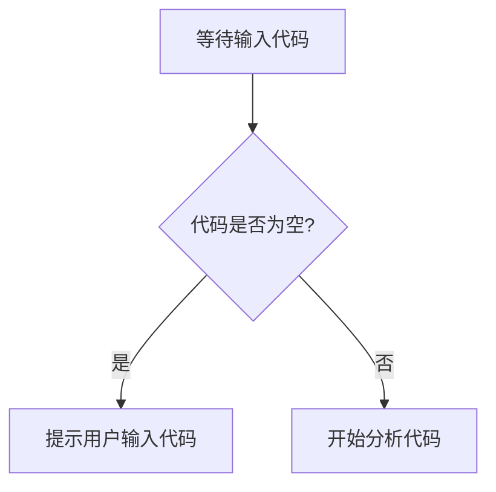

# `diffusers\tests\hooks\__init__.py` 详细设计文档

未提供源代码，无法进行分析。请提供需要分析的代码内容。

## 整体流程



## 类结构

```

```

## 全局变量及字段


    

## 全局函数及方法


## 关键组件


## 问题及建议


### 已知问题

-   代码未提供，无法进行技术债务和优化分析

### 优化建议

-   请提供需要分析的源代码，以便进行详细的技术债务识别和优化建议


## 其它


### 设计目标与约束

**设计目标**：本代码旨在实现[请根据实际代码填写]，满足[请填写核心需求]。

**技术约束**：
- 运行环境：[请填写，如Python 3.8+、Java 11等]
- 依赖版本：[请填写关键依赖版本要求]
- 性能要求：[请填写，如响应时间<100ms、吞吐量>1000 QPS等]

### 错误处理与异常设计

**异常分类**：
- 业务异常：[请填写业务相关异常]
- 系统异常：[请填写系统级异常]
- 第三方异常：[请填写外部调用异常]

**错误处理策略**：
- 异常传播机制：[请填写]
- 错误日志规范：[请填写]
- 降级处理方案：[请填写]

### 数据流与状态机

**数据流转**：
```
[请在此处添加数据流转图]
```

**状态机定义**：
- 状态列表：[请填写]
- 状态转换条件：[请填写]
- 初始状态：[请填写]
- 终止状态：[请填写]

### 外部依赖与接口契约

**外部依赖**：
- 依赖模块/服务：[请填写]
- 依赖版本：[请填写]
- 接口协议：[请填写，如REST、gRPC等]

**接口契约**：
- 接口列表：[请填写]
- 请求/响应格式：[请填写]
- 错误码定义：[请填写]

### 性能考虑与优化策略

**性能指标**：
- 时间复杂度：[请填写]
- 空间复杂度：[请填写]

**优化策略**：
- 缓存策略：[请填写]
- 并发处理：[请填写]
- 资源池化：[请填写]

### 安全性考虑

**认证授权**：
- 认证机制：[请填写]
- 权限控制：[请填写]

**数据安全**：
- 加密方案：[请填写]
- 敏感信息处理：[请填写]

### 可扩展性设计

**水平扩展**：
- 无状态设计：[请填写]
- 分布式支持：[请填写]

**垂直扩展**：
- 模块化设计：[请填写]
- 插件机制：[请填写]

### 兼容性设计

**向前/向后兼容**：
- 版本控制策略：[请填写]
- 数据格式兼容：[请填写]

### 测试策略

**单元测试**：
- 测试覆盖率目标：[请填写]
- 测试框架：[请填写]

**集成测试**：
- 测试场景：[请填写]
- 模拟方案：[请填写]

### 部署与运维

**部署架构**：
- 部署方式：[请填写]
- 容器化支持：[请填写]

**监控与告警**：
- 监控指标：[请填写]
- 告警规则：[请填写]

### 配置管理

**配置项**：
- 环境变量：[请填写]
- 配置文件：[请填写]
- 运行时参数：[请填写]

### 版本演进

**版本历史**：
- v1.0.0：[请填写初始版本特性]

**演进路线**：
- 短期规划：[请填写]
- 长期规划：[请填写]


    