# `diffusers\tests\hooks\test_group_offloading.py` 详细设计文档

这是一组针对HuggingFace diffusers库的group offloading（分组卸载）功能的单元测试，验证了不同模型结构（标准模型、多块模型、层归一化模型、嵌套结构模型等）在不同offload类型（block_level、leaf_level）和配置下（是否使用stream、不同分组大小）的功能正确性、内存使用效率以及错误处理机制。

## 整体流程

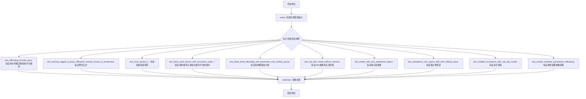

## 类结构

```
unittest.TestCase
└── GroupOffloadTests (主测试类)

torch.nn.Module (基类)
├── DummyBlock (简单线性块)
├── DummyModel (标准Dummy模型)
├── DummyModelWithMultipleBlocks (多块模型)
├── DummyModelWithLayerNorm (带层归一化的模型)
├── DummyPipeline (虚拟Pipeline)
├── DummyModelWithStandaloneLayers (独立层模型)
├── DummyModelWithDeeplyNestedBlocks (深度嵌套模型)
├── ContainerWithNestedModuleList (嵌套容器外层)
└── NestedContainer (嵌套容器内层)

ModelHook (基类)
└── LayerOutputTrackerHook (层输出追踪Hook)
```

## 全局变量及字段


### `DummyBlock.proj_in`
    
输入投影层

类型：`torch.nn.Linear`
    


### `DummyBlock.activation`
    
激活函数

类型：`torch.nn.ReLU`
    


### `DummyBlock.proj_out`
    
输出投影层

类型：`torch.nn.Linear`
    


### `DummyModel.linear_1`
    
第一线性层

类型：`torch.nn.Linear`
    


### `DummyModel.activation`
    
激活函数

类型：`torch.nn.ReLU`
    


### `DummyModel.blocks`
    
模块块列表

类型：`torch.nn.ModuleList`
    


### `DummyModel.linear_2`
    
第二线性层

类型：`torch.nn.Linear`
    


### `DummyModelWithMultipleBlocks.linear_1`
    
第一线性层

类型：`torch.nn.Linear`
    


### `DummyModelWithMultipleBlocks.activation`
    
激活函数

类型：`torch.nn.ReLU`
    


### `DummyModelWithMultipleBlocks.single_blocks`
    
单块列表

类型：`torch.nn.ModuleList`
    


### `DummyModelWithMultipleBlocks.double_blocks`
    
双块列表

类型：`torch.nn.ModuleList`
    


### `DummyModelWithMultipleBlocks.linear_2`
    
第二线性层

类型：`torch.nn.Linear`
    


### `DummyModelWithLayerNorm.linear_1`
    
第一线性层

类型：`torch.nn.Linear`
    


### `DummyModelWithLayerNorm.activation`
    
激活函数

类型：`torch.nn.ReLU`
    


### `DummyModelWithLayerNorm.blocks`
    
模块块列表

类型：`torch.nn.ModuleList`
    


### `DummyModelWithLayerNorm.layer_norm`
    
层归一化

类型：`torch.nn.LayerNorm`
    


### `DummyModelWithLayerNorm.linear_2`
    
第二线性层

类型：`torch.nn.Linear`
    


### `DummyPipeline.model_cpu_offload_seq`
    
模型CPU卸载顺序

类型：`str`
    


### `LayerOutputTrackerHook.outputs`
    
存储层输出列表

类型：`list`
    


### `DummyModelWithStandaloneLayers.layer1`
    
第一层

类型：`torch.nn.Linear`
    


### `DummyModelWithStandaloneLayers.activation`
    
激活函数

类型：`torch.nn.ReLU`
    


### `DummyModelWithStandaloneLayers.layer2`
    
第二层

类型：`torch.nn.Linear`
    


### `DummyModelWithStandaloneLayers.layer3`
    
第三层

类型：`torch.nn.Linear`
    


### `DummyModelWithDeeplyNestedBlocks.input_layer`
    
输入层

类型：`torch.nn.Linear`
    


### `DummyModelWithDeeplyNestedBlocks.container`
    
嵌套容器

类型：`ContainerWithNestedModuleList`
    


### `DummyModelWithDeeplyNestedBlocks.output_layer`
    
输出层

类型：`torch.nn.Linear`
    


### `ContainerWithNestedModuleList.proj_in`
    
输入投影

类型：`torch.nn.Linear`
    


### `ContainerWithNestedModuleList.nested_container`
    
嵌套容器

类型：`NestedContainer`
    


### `ContainerWithNestedModuleList.proj_out`
    
输出投影

类型：`torch.nn.Linear`
    


### `NestedContainer.blocks`
    
模块列表

类型：`torch.nn.ModuleList`
    


### `NestedContainer.norm`
    
归一化层

类型：`torch.nn.LayerNorm`
    


### `GroupOffloadTests.in_features`
    
输入特征维度(类字段)

类型：`int`
    


### `GroupOffloadTests.hidden_features`
    
隐藏层特征维度(类字段)

类型：`int`
    


### `GroupOffloadTests.out_features`
    
输出特征维度(类字段)

类型：`int`
    


### `GroupOffloadTests.num_layers`
    
层数(类字段)

类型：`int`
    


### `GroupOffloadTests.model`
    
测试模型实例(实例字段)

类型：`DummyModel`
    


### `GroupOffloadTests.input`
    
测试输入(实例字段)

类型：`torch.Tensor`
    
    

## 全局函数及方法


### `backend_empty_cache`

后端清空缓存函数，用于释放指定设备上的 GPU 缓存内存，通常在测试或内存基准测试前后调用以确保干净的内存状态。

参数：

- `torch_device`：`str` 或 `torch.device`，目标设备标识符，指定要清空缓存的设备（如 "cuda"、"cuda:0" 等）

返回值：`None`，该函数不返回任何值，仅执行副作用（清空缓存）

#### 流程图

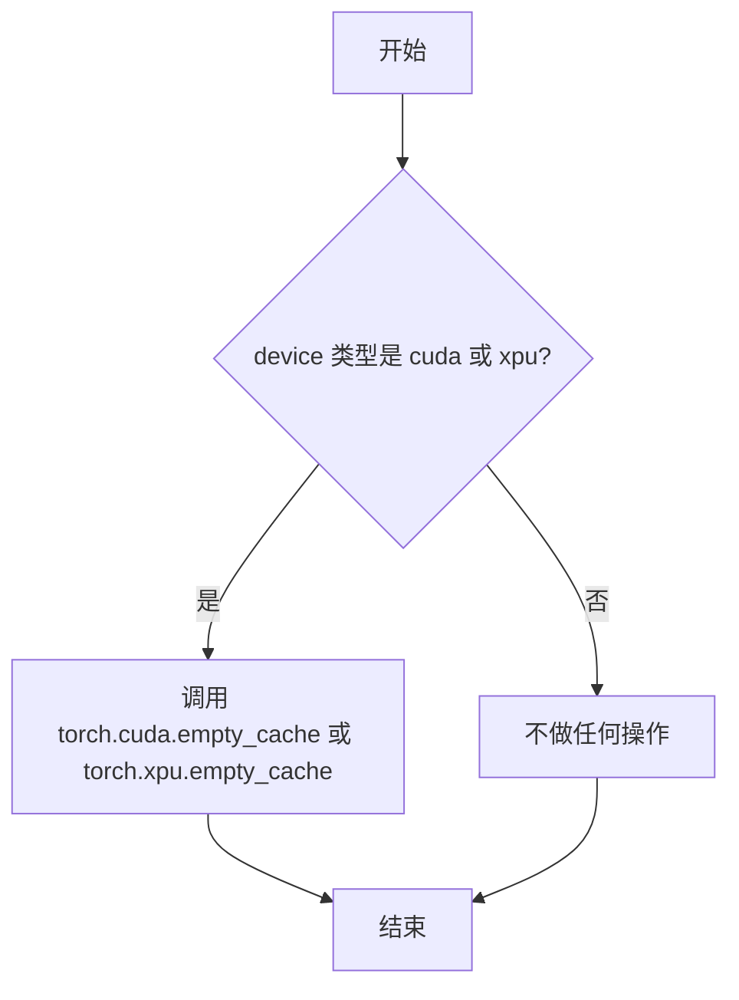

#### 带注释源码

```python
# 该函数定义在 testing_utils.py 中，此处为调用方的使用示例：
# 导入声明
from ..testing_utils import (
    backend_empty_cache,
    backend_max_memory_allocated,
    backend_reset_peak_memory_stats,
    require_torch_accelerator,
    torch_device,
)

# 使用场景1: 在 tearDown 方法中清理测试后的内存
def tearDown(self):
    super().tearDown()

    del self.model
    del self.input
    gc.collect()
    backend_empty_cache(torch_device)  # 清空GPU缓存，释放测试占用的显存
    backend_reset_peak_memory_stats(torch_device)  # 重置内存统计

# 使用场景2: 在基准测试前清理内存，确保测量的准确性
@torch.no_grad()
def run_forward(model):
    gc.collect()
    backend_empty_cache(torch_device)  # 清空缓存，确保基准测试从干净状态开始
    backend_reset_peak_memory_stats(torch_device)
    # ... 执行模型推理并测量内存使用
```


### `backend_max_memory_allocated`

获取指定计算设备上当前进程的最大分配内存（峰值内存使用）。

参数：

-  `torch_device`：`str`，目标计算设备标识符（如 `"cuda"`、`"cuda:0"`、`"xpu"` 等）

返回值：`int`，返回自上次内存统计重置以来，该设备上当前进程分配的最大内存字节数。

#### 流程图

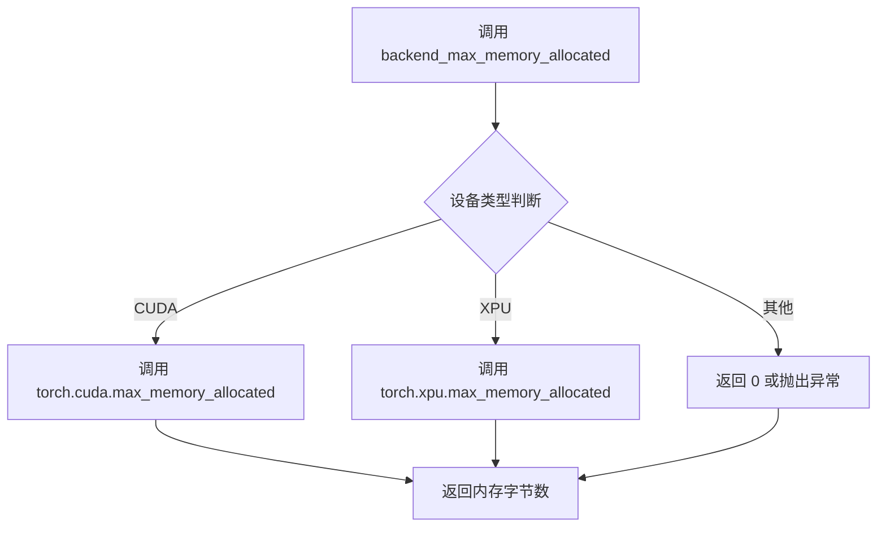

#### 带注释源码

```
# 注意：此函数定义在 testing_utils.py 模块中，此处为基于使用方式的推断实现

def backend_max_memory_allocated(torch_device: str) -> int:
    """
    获取指定设备上的最大分配内存（峰值内存）。
    
    参数:
        torch_device: 目标设备字符串标识符，如 "cuda", "cuda:0", "xpu" 等
        
    返回值:
        自上次统计重置以来，该设备上分配的最大内存字节数
    """
    
    # 根据设备类型调用对应的后端内存统计函数
    if torch_device.startswith("cuda"):
        # CUDA 设备使用 torch.cuda.max_memory_allocated
        return torch.cuda.max_memory_allocated(torch_device)
    elif torch_device.startswith("xpu"):
        # XPU 设备使用 torch.xpu.max_memory_allocated
        return torch.xpu.max_memory_allocated(torch_device)
    else:
        # 不支持的设备类型返回 0 或抛出异常
        return 0  # 或 raise NotImplementedError(...)
```

#### 实际使用示例

```python
# 在测试代码中的实际调用方式
gc.collect()
backend_empty_cache(torch_device)
backend_reset_peak_memory_stats(torch_device)
# ... 执行某些操作 ...
max_memory_allocated = backend_max_memory_allocated(torch_device)
# max_memory_allocated 类型为 int，表示字节数
```


### `backend_reset_peak_memory_stats`

该函数是测试工具模块中用于重置指定设备峰值内存统计信息的工具函数，常用于性能测试场景中清理内存状态，以便准确测量后续操作的内存使用情况。

参数：

- `torch_device`：`str`，表示目标设备（如 "cuda"、"cpu"、"xpu" 等），用于指定需要重置内存统计的设备。

返回值：`None`，该函数不返回任何值，仅执行重置操作。

#### 流程图

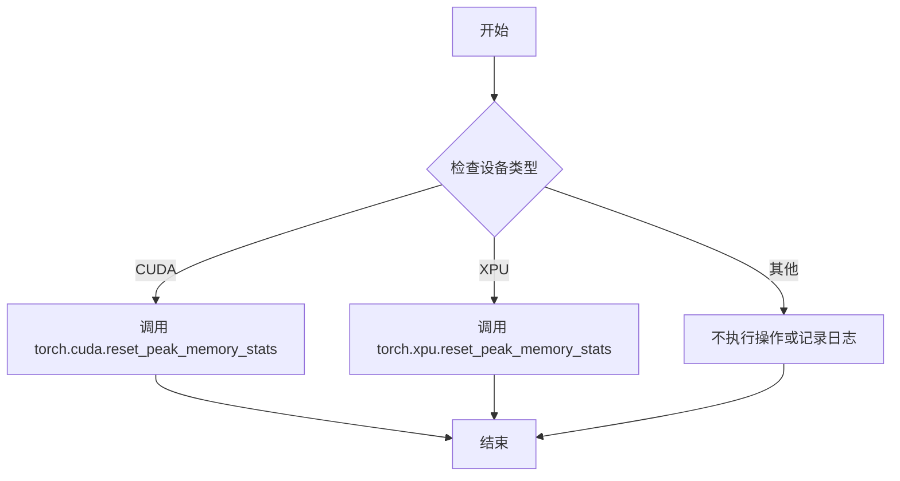

#### 带注释源码

```python
# 该函数定义在 testing_utils 模块中（未在此代码块中提供定义）
# 根据调用方式和模块用途，推断其实现逻辑如下：

def backend_reset_peak_memory_stats(torch_device: str) -> None:
    """
    重置指定设备的峰值内存统计信息。
    
    参数:
        torch_device: 目标设备标识符，用于指定需要重置内存统计的设备。
    
    返回值:
        无返回值。该函数仅执行内存统计重置操作。
    """
    # 根据设备类型调用相应的 PyTorch 后端 API
    # 支持 CUDA 和 XPU 设备的内存统计重置
    if torch_device is not None:
        # 获取设备对象
        device = torch.device(torch_device)
        
        # 根据设备类型调用对应的重置函数
        if device.type == 'cuda':
            # CUDA 设备：调用 torch.cuda.reset_peak_memory_stats
            torch.cuda.reset_peak_memory_stats(device)
        elif device.type == 'xpu':
            # XPU 设备：调用 torch.xpu.reset_peak_memory_stats
            torch.xpu.reset_peak_memory_stats(device)
        # 其他设备类型可能不支持或不需要重置操作
```


### `torch_device`

该常量为测试用例提供默认的Torch计算设备标识符，用于在CPU或GPU设备上执行张量操作和内存管理。

参数：

- 无

返回值：`str`，返回当前配置的Torch设备字符串（如 "cuda"、"cpu" 等）

#### 流程图

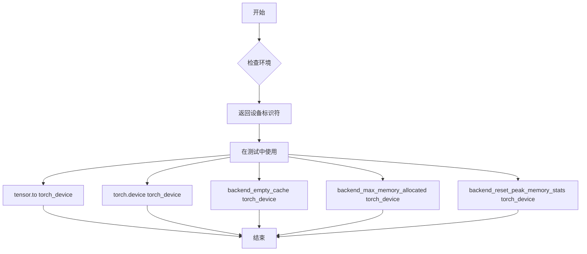

#### 带注释源码

```python
# torch_device 是从 testing_utils 模块导入的全局常量
# 定义位置: diffusers/testing_utils.py
# 用途: 为测试用例提供统一的设备配置

# 代码中的典型使用方式:
# 1. 创建张量时指定设备
self.input = torch.randn((4, self.in_features)).to(torch_device)

# 2. 创建torch设备对象
torch.device(torch_device).type  # 返回 'cuda' 或 'cpu' 等

# 3. 传递给内存管理工具函数
backend_empty_cache(torch_device)
backend_max_memory_allocated(torch_device)
backend_reset_peak_memory_stats(torch_device)

# 4. 作为模型和模块的目标设备
model.to(torch_device)
model.enable_group_offload(torch_device, offload_type="block_level", num_blocks_per_group=3)
```


### `DummyBlock.forward`

该方法实现了 DummyBlock 的前向传播逻辑，通过输入层投影、激活函数和输出层投影对输入张量进行非线性变换。

参数：

- `x`：`torch.Tensor`，输入张量，通常是上一层的输出或初始特征向量

返回值：`torch.Tensor`，经过两层线性变换和 ReLU 激活后的输出张量

#### 流程图

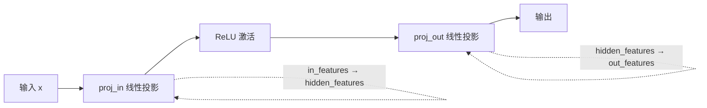

#### 带注释源码

```python
def forward(self, x: torch.Tensor) -> torch.Tensor:
    """
    前向传播方法，对输入进行线性变换和非线性激活
    
    参数:
        x: 输入张量，形状为 (batch_size, in_features)
    
    返回:
        输出张量，形状为 (batch_size, out_features)
    """
    # 第一层线性投影：将输入特征从 in_features 维度映射到 hidden_features 维度
    x = self.proj_in(x)
    
    # ReLU 非线性激活函数，引入非线性能力
    x = self.activation(x)
    
    # 第二层线性投影：将特征从 hidden_features 维度映射到 out_features 维度
    x = self.proj_out(x)
    
    return x
```


### `DummyModel.forward`

描述：该方法是 DummyModel 类的前向传播实现，实现了一个简单的前馈神经网络（MLP），包含输入线性层、激活函数、多个隐藏块（由 DummyBlock 组成）和输出线性层，用于模型推理时的数据流计算。

参数：

- `x`：`torch.Tensor`，输入张量，通常为形状 `(batch_size, in_features)` 的二维张量

返回值：`torch.Tensor`，输出张量，形状为 `(batch_size, out_features)` 的二维张量

#### 流程图

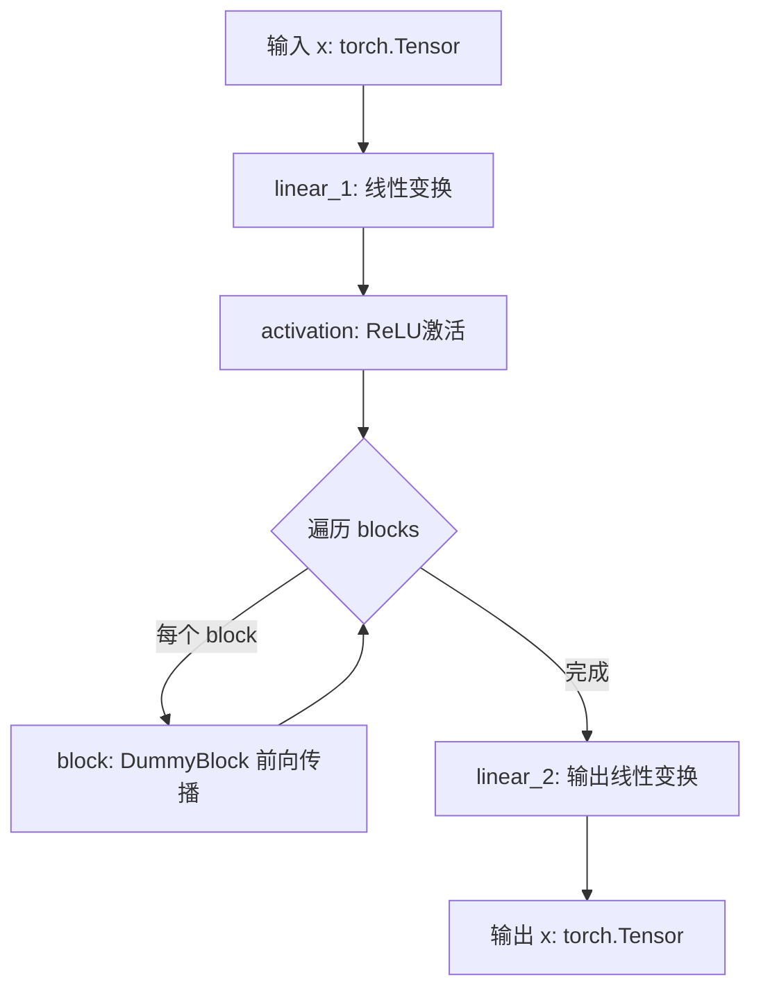

#### 带注释源码

```python
def forward(self, x: torch.Tensor) -> torch.Tensor:
    """
    前向传播方法，执行模型的数据流计算
    
    参数:
        x: 输入张量，形状为 (batch_size, in_features)
    
    返回:
        输出张量，形状为 (batch_size, out_features)
    """
    # 第一层线性变换：将输入特征映射到隐藏特征空间
    x = self.linear_1(x)
    
    # ReLU 激活函数，引入非线性变换
    x = self.activation(x)
    
    # 遍历所有隐藏块（DummyBlock），每个块包含两层线性变换和激活
    for block in self.blocks:
        x = block(x)
    
    # 输出层线性变换：将隐藏特征映射到输出特征空间
    x = self.linear_2(x)
    
    # 返回最终输出
    return x
```


### `DummyModelWithMultipleBlocks.forward`

该方法实现了具有双块和单块结构的模型前向传播，首先对输入进行线性变换和激活，然后依次通过双块模块和单块模块，最后通过输出线性层得到预测结果。

参数：

- `x`：`torch.Tensor`，输入张量，形状为 `(batch_size, in_features)`

返回值：`torch.Tensor`，输出张量，形状为 `(batch_size, out_features)`

#### 流程图

```mermaid
flowchart TD
    A[输入 x] --> B[linear_1 线性变换]
    B --> C[activation 激活函数]
    C --> D{遍历 double_blocks}
    D -->|每个 block| E[block(x) 执行块前向]
    E --> D
    D --> F{遍历 single_blocks}
    F -->|每个 block| G[block(x) 执行块前向]
    G --> F
    F --> H[linear_2 线性变换]
    H --> I[输出 x]
```

#### 带注释源码

```python
def forward(self, x: torch.Tensor) -> torch.Tensor:
    """
    模型前向传播方法
    
    参数:
        x: 输入张量，形状为 (batch_size, in_features)
    
    返回:
        输出张量，形状为 (batch_size, out_features)
    """
    # 第一层线性变换：将输入特征从 in_features 映射到 hidden_features
    x = self.linear_1(x)
    
    # 应用 ReLU 激活函数引入非线性
    x = self.activation(x)
    
    # 依次遍历并执行所有双块模块 (double_blocks) 的前向传播
    for block in self.double_blocks:
        x = block(x)
    
    # 依次遍历并执行所有单块模块 (single_blocks) 的前向传播
    # 注意：调用顺序与初始化顺序不同（先 double_blocks 再 single_blocks）
    for block in self.single_blocks:
        x = block(x)
    
    # 最终线性变换：将特征从 hidden_features 映射到 out_features
    x = self.linear_2(x)
    
    # 返回最终输出
    return x
```


### `DummyModelWithLayerNorm.forward`

该函数实现了 DummyModelWithLayerNorm 模型的前向传播过程，将输入张量依次通过线性层、激活函数、DummyBlock 模块列表、LayerNorm 层和输出线性层，生成最终的输出张量。

参数：

- `x`：`torch.Tensor`，输入张量，通常为 batch_size × in_features 形状的向量

返回值：`torch.Tensor`，经过模型各层变换后的输出张量，形状为 batch_size × out_features

#### 流程图

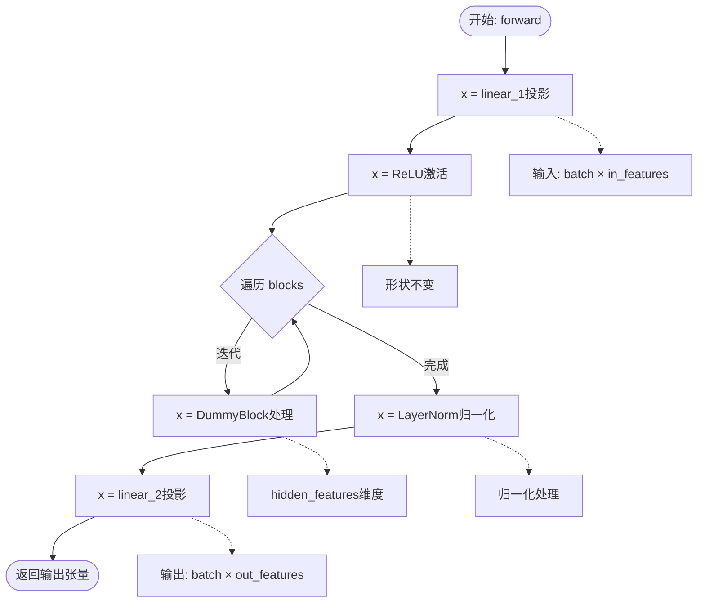

#### 带注释源码

```python
def forward(self, x: torch.Tensor) -> torch.Tensor:
    """
    前向传播方法，对输入张量依次执行以下操作:
    1. 线性投影 (linear_1): in_features -> hidden_features
    2. ReLU 激活函数
    3. 遍历 ModuleList 中的所有 DummyBlock
    4. LayerNorm 归一化
    5. 线性投影 (linear_2): hidden_features -> out_features
    
    Args:
        x: 输入张量，形状为 (batch_size, in_features)
    
    Returns:
        输出张量，形状为 (batch_size, out_features)
    """
    # 第一层线性变换: 将输入从 in_features 维度投影到 hidden_features 维度
    x = self.linear_1(x)
    
    # ReLU 激活函数，增加非线性
    x = self.activation(x)
    
    # 遍历所有 DummyBlock 模块进行特征变换
    for block in self.blocks:
        x = block(x)
    
    # LayerNorm 层归一化，有助于稳定训练和加速收敛
    x = self.layer_norm(x)
    
    # 第二层线性变换: 将特征从 hidden_features 维度投影到 out_features 维度
    x = self.linear_2(x)
    
    return x
```


### `DummyPipeline.__init__`

该方法是 `DummyPipeline` 类的构造函数，用于初始化一个虚拟扩散管道。它接受一个 PyTorch 模型作为输入，调用父类 `DiffusionPipeline` 的构造函数，并将传入的模型注册为管道的子模块，使其纳入 Diffusers 框架的统一管理体系。

参数：

- `model`：`torch.nn.Module`，要注册的 PyTorch 模型，作为管道的核心推理模型使用

返回值：`None`，构造函数不返回任何值

#### 流程图

```mermaid
flowchart TD
    A[开始 __init__] --> B[调用 super().__init__]
    B --> C[调用 self.register_modules model=model]
    C --> D[结束初始化]
    
    subgraph "DiffusionPipeline 父类初始化"
        B
    end
    
    subgraph "模块注册"
        C
    end
```

#### 带注释源码

```python
def __init__(self, model: torch.nn.Module) -> None:
    """
    初始化 DummyPipeline 实例。
    
    参数:
        model: torch.nn.Module，要注册的 PyTorch 模型
    """
    # 调用父类 DiffusionPipeline 的构造函数
    # 父类会执行基础初始化工作，如配置设备、创建模块字典等
    super().__init__()
    
    # 将传入的 model 注册为管道的子模块
    # 这使得 model 成为 DiffusionPipeline 内部管理的核心组件
    # 允许框架对 model 进行 CPU offload、device placement 等操作
    self.register_modules(model=model)
```


### `DummyPipeline.__call__`

该方法是 `DummyPipeline` 类的核心前向传播方法，通过对输入张量进行两次循环计算（每次将模型输出的 10% 累加到输入上），实现一个简单的扩散管道推理流程。

参数：

- `x`：`torch.Tensor`，输入的初始张量

返回值：`torch.Tensor`，经过两次模型计算和累加后的输出张量

#### 流程图

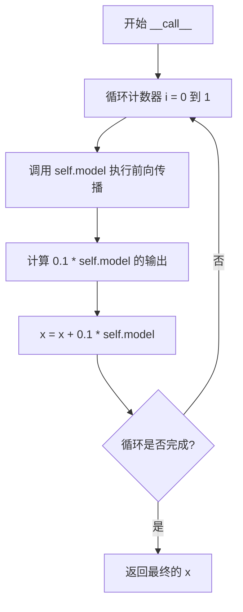

#### 带注释源码

```python
def __call__(self, x: torch.Tensor) -> torch.Tensor:
    """
    管道的前向调用方法，对输入张量执行模型计算。
    
    参数:
        x: 输入的初始张量，形状为 [batch_size, feature_dim]
        
    返回:
        经过两次模型计算和残差累加后的输出张量
    """
    # 循环执行两次前向传播，每次将模型输出的 10% 累加到当前输入上
    for _ in range(2):
        # 调用内部模型进行前向计算
        model_output = self.model(x)
        # 将模型输出的十分之一加到原始输入上，实现残差连接
        x = x + 0.1 * model_output
    # 返回累加后的最终结果
    return x
```


### `LayerOutputTrackerHook.post_forward`

该方法是 `LayerOutputTrackerHook` 类中的前向传播后钩子（post_forward hook），用于在模型前向传播过程中捕获并存储每个模块的输出，以便后续分析或调试。钩子实现为透明传递输出，不修改任何计算结果。

参数：

- `module`：`torch.nn.Module`，执行前向传播的模块实例
- `output`：`torch.Tensor` 或 `tuple`，模块前向传播的输出结果

返回值：`torch.Tensor` 或 `tuple`，原样返回输入的 `output`，确保不干扰模型的正常计算流程

#### 流程图

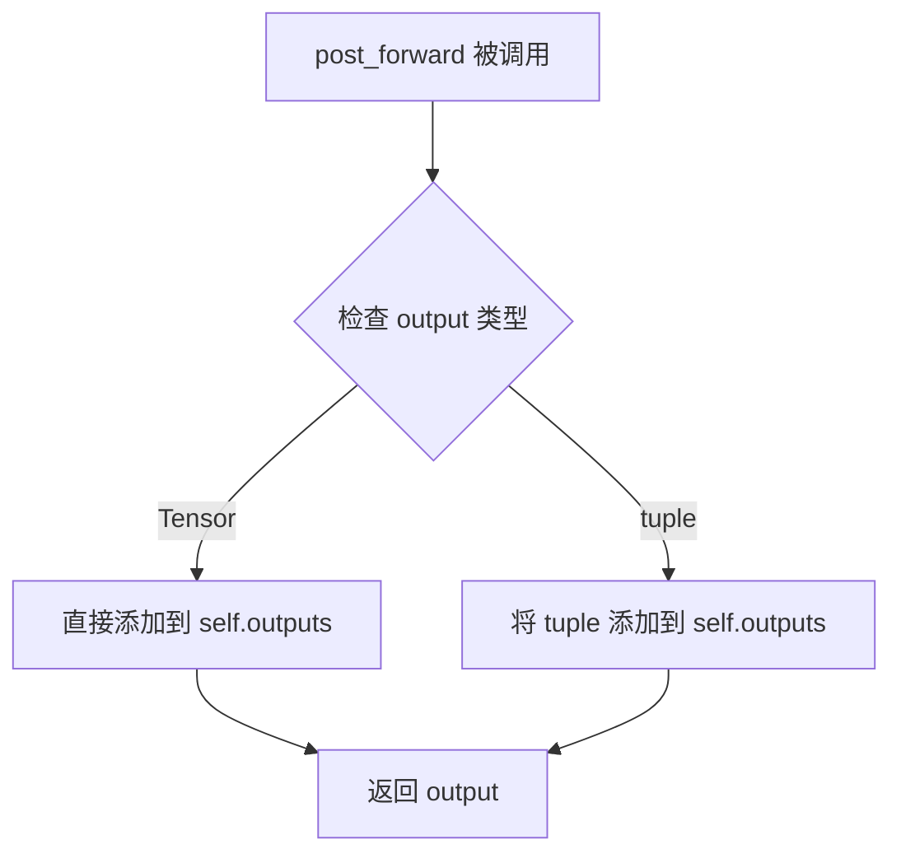

#### 带注释源码

```python
def post_forward(self, module, output):
    """
    前向传播后的钩子方法，在每个模块完成前向计算后被调用。
    
    该钩子用于追踪并保存每个模块的输出结果，以便后续分析、
    调试或验证模型的中间状态。
    
    参数:
        module (torch.nn.Module): 执行前向传播的模块实例
        output (torch.Tensor | tuple): 模块的输出，可以是单个张量或元组
    
    返回:
        torch.Tensor | tuple: 原样返回输出，确保不影响模型的计算图和梯度流
    """
    # 将模块的输出追加到内部列表中保存
    self.outputs.append(output)
    # 返回原始输出，保持计算图完整
    return output
```


### `DummyModelWithStandaloneLayers.forward`

该方法实现了一个仅包含独立计算层（无 ModuleList/Sequential）的简单多层感知器（MLP）模型的前向传播，通过三个线性层和 ReLU 激活函数对输入张量进行非线性变换并输出最终结果。

参数：

- `x`：`torch.Tensor`，输入张量，形状为 `(batch_size, in_features)`

返回值：`torch.Tensor`，输出张量，形状为 `(batch_size, out_features)`

#### 流程图

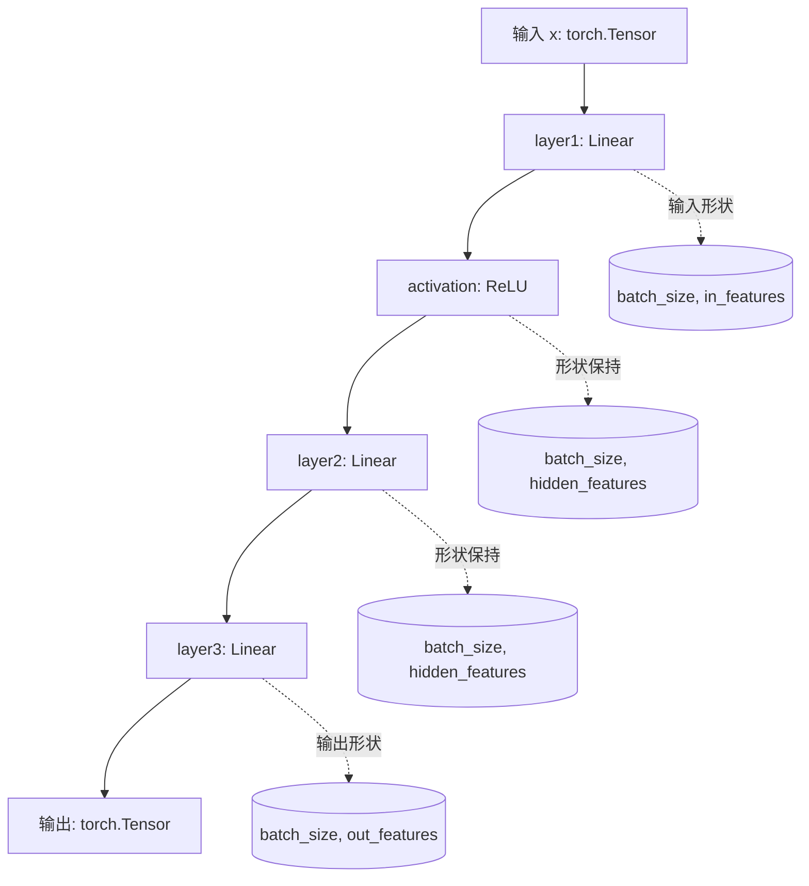

#### 带注释源码

```python
def forward(self, x: torch.Tensor) -> torch.Tensor:
    """
    前向传播方法，对输入张量执行三层线性变换和非线性激活。
    
    该模型是一个简单的多层感知器（MLP），由三个独立的线性层组成：
    1. layer1: 将输入从 in_features 投影到 hidden_features 维度
    2. layer2: 在 hidden_features 空间中进行进一步变换
    3. layer3: 将特征映射到输出空间 out_features
    
    参数:
        x (torch.Tensor): 输入张量，形状为 (batch_size, in_features)
        
    返回:
        torch.Tensor: 输出张量，形状为 (batch_size, out_features)
    """
    # 第一层线性变换：输入 -> 隐藏层
    # 将输入特征从 in_features 维度映射到 hidden_features 维度
    x = self.layer1(x)
    
    # 应用 ReLU 激活函数，引入非线性
    x = self.activation(x)
    
    # 第二层线性变换：隐藏层 -> 隐藏层
    # 在隐藏空间中进行特征转换
    x = self.layer2(x)
    
    # 第三层线性变换：隐藏层 -> 输出层
    # 将隐藏特征映射到最终的输出维度
    x = self.layer3(x)
    
    return x
```


### `DummyModelWithDeeplyNestedBlocks.forward`

该方法实现了一个具有深度嵌套结构的Dummy模型的完整前向传播过程。输入张量依次经过输入层线性变换、ContainerWithNestedModuleList容器的嵌套处理（包括投影输入、嵌套容器块和投影输出）、最后通过输出层线性变换得到最终输出。该模型专门用于测试diffusers库中group offloading功能对深层嵌套模块参数处理的支持。

参数：

- `x`：`torch.Tensor`，输入张量，形状为 (batch_size, in_features)，其中 in_features 是模型的输入特征维度

返回值：`torch.Tensor`，经过模型处理后的输出张量，形状为 (batch_size, out_features)，其中 out_features 是模型的输出特征维度

#### 流程图

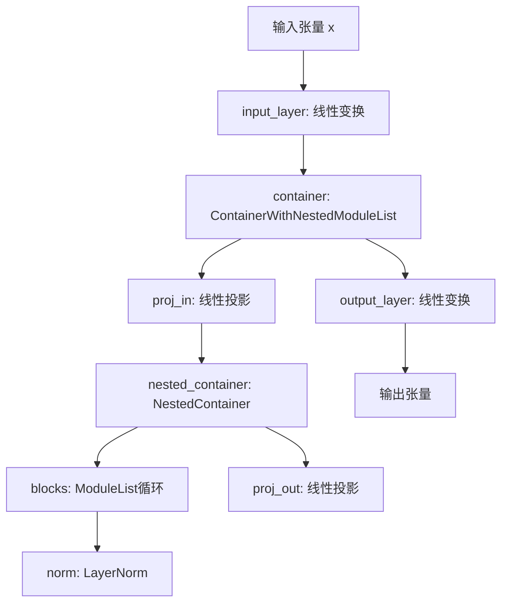

#### 带注释源码

```python
def forward(self, x: torch.Tensor) -> torch.Tensor:
    """
    模型的前向传播方法，处理深度嵌套的模块结构。
    
    参数:
        x: 输入张量，形状为 (batch_size, in_features)
    
    返回:
        输出张量，形状为 (batch_size, out_features)
    """
    # 第一步：输入层线性变换
    # 将输入特征从 in_features 投影到 hidden_features 维度
    x = self.input_layer(x)
    
    # 第二步：通过容器模块（包含嵌套结构）
    # ContainerWithNestedModuleList 内部包含:
    #   - proj_in: 线性投影层
    #   - nested_container: 包含 ModuleList 和 LayerNorm 的嵌套容器
    #   - proj_out: 线性投影层
    x = self.container(x)
    
    # 第三步：输出层线性变换
    # 将特征从 hidden_features 投影到 out_features 维度
    x = self.output_layer(x)
    
    # 返回最终输出
    return x
```


### `ContainerWithNestedModuleList.forward`

该方法是 `ContainerWithNestedModuleList` 类的前向传播实现，负责对输入张量进行深度嵌套的模块处理。方法通过三个级联的线性层（输入投影层、嵌套容器层、输出投影层）对张量进行变换，其中嵌套容器内部包含 ModuleList 结构的模块，用于模拟具有多个子块的复杂神经网络层级结构。

参数：

- `x`：`torch.Tensor`，输入张量，通常为批量特征向量

返回值：`torch.Tensor`，经过嵌套容器处理后的输出张量

#### 流程图

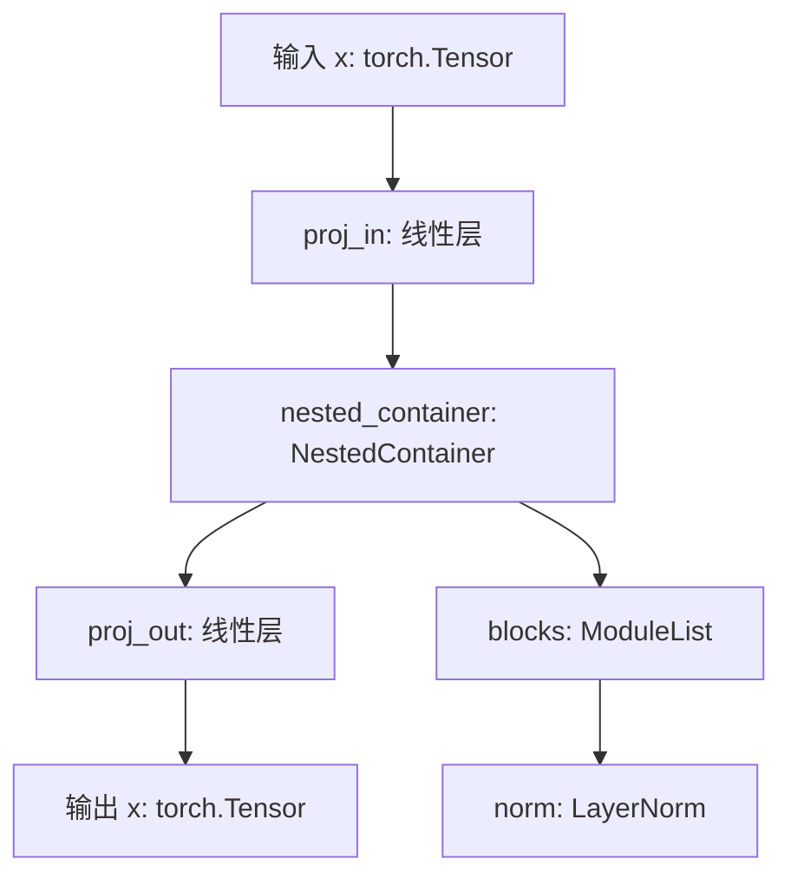

#### 带注释源码

```python
class ContainerWithNestedModuleList(torch.nn.Module):
    """容器类，包含嵌套的模块列表结构，用于测试深度嵌套模型的卸载功能。"""
    
    def __init__(self, features: int) -> None:
        """
        初始化容器。
        
        参数:
            features: 输入输出特征的维度
        """
        super().__init__()

        # 顶层计算层：输入投影
        self.proj_in = torch.nn.Linear(features, features)

        # 嵌套容器，包含 ModuleList 结构
        self.nested_container = NestedContainer(features)

        # 顶层计算层：输出投影
        self.proj_out = torch.nn.Linear(features, features)

    def forward(self, x: torch.Tensor) -> torch.Tensor:
        """
        前向传播：依次通过输入投影、嵌套容器、输出投影处理输入。
        
        参数:
            x: 输入张量，形状为 (batch_size, features)
            
        返回:
            经过三层变换后的输出张量，形状与输入相同
        """
        # 第一步：输入投影变换
        x = self.proj_in(x)
        
        # 第二步：经过嵌套容器（内部包含 ModuleList 和 LayerNorm）
        x = self.nested_container(x)
        
        # 第三步：输出投影变换
        x = self.proj_out(x)
        
        return x
```


### `NestedContainer.forward`

该方法是 `NestedContainer` 类的核心前向传播方法，负责对输入张量依次通过两个线性层模块并进行层归一化处理，最终输出处理后的张量。

参数：

- `x`：`torch.Tensor`，输入的特征张量

返回值：`torch.Tensor`，经过嵌套容器处理后的特征张量

#### 流程图

```mermaid
flowchart TD
    A[开始 forward] --> B[输入 x]
    B --> C[遍历 self.blocks]
    C --> D[对当前 block 执行前向传播: x = block(x)]
    D --> E{blocks 是否遍历完毕?}
    E -->|否| C
    E -->|是| F[执行层归一化: x = self.norm(x)]
    F --> G[返回结果 x]
    G --> H[结束 forward]
```

#### 带注释源码

```python
class NestedContainer(torch.nn.Module):
    def __init__(self, features: int) -> None:
        """
        初始化 NestedContainer 模块
        
        参数:
            features: int - 输入输出特征的维度
        """
        super().__init__()
        # 创建一个包含两个线性层的 ModuleList
        self.blocks = torch.nn.ModuleList([
            torch.nn.Linear(features, features),  # 第一个线性层
            torch.nn.Linear(features, features)   # 第二个线性层
        ])
        # 层归一化层
        self.norm = torch.nn.LayerNorm(features)

    def forward(self, x: torch.Tensor) -> torch.Tensor:
        """
        NestedContainer 的前向传播方法
        
        参数:
            x: torch.Tensor - 输入的特征张量，形状为 (batch_size, features)
            
        返回:
            torch.Tensor - 经过两个线性层和层归一化处理后的特征张量
        """
        # 依次通过第一个线性层、激活函数（如有）、第二个线性层
        for block in self.blocks:
            x = block(x)
        # 应用层归一化
        x = self.norm(x)
        # 返回处理后的张量
        return x
```


### `GroupOffloadTests.setUp`

测试类 `GroupOffloadTests` 的初始化方法，在每个测试方法执行前被自动调用，用于创建测试所需的模型实例和随机输入张量，确保测试环境的一致性。

参数：

- `self`：`GroupOffloadTests`，当前测试类实例，无需显式传递

返回值：`None`，该方法不返回任何值

#### 流程图

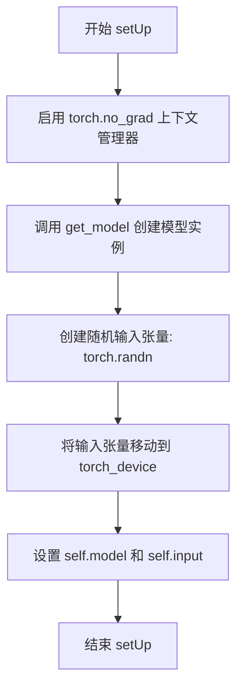

#### 带注释源码

```python
def setUp(self):
    """
    测试前设置方法，在每个测试方法运行前自动调用。
    初始化测试所需的模型实例和输入张量。
    """
    # 使用 torch.no_grad() 上下文管理器，禁用梯度计算以节省内存
    with torch.no_grad():
        # 调用 get_model 方法创建 DummyModel 实例
        self.model = self.get_model()
        # 创建形状为 (4, in_features) 的随机输入张量，并移动到指定设备
        self.input = torch.randn((4, self.in_features)).to(torch_device)
```


### `GroupOffloadTests.tearDown`

测试后清理方法，用于释放测试过程中分配的资源，包括删除模型和输入张量，触发垃圾回收，以及清空后端内存缓存和重置内存统计信息。

参数：

- `self`：`GroupOffloadTests`，测试类的实例对象，隐式参数，表示当前测试用例的上下文

返回值：`None`，无返回值

#### 流程图

```mermaid
flowchart TD
    A[开始 tearDown] --> B[调用 super().tearDown]
    B --> C[删除 self.model]
    C --> D[删除 self.input]
    D --> E[调用 gc.collect]
    E --> F[调用 backend_empty_cache 清理GPU缓存]
    F --> G[调用 backend_reset_peak_memory_stats 重置内存统计]
    G --> H[结束 tearDown]
```

#### 带注释源码

```python
def tearDown(self):
    """
    测试后清理方法。
    释放测试中使用的模型和输入张量，清理GPU内存，并重置内存统计信息。
    """
    # 调用父类的 tearDown 方法，确保父类的清理逻辑被执行
    super().tearDown()

    # 删除测试中创建的模型对象，释放其内存引用
    del self.model
    # 删除测试中创建的输入张量
    del self.input
    
    # 手动触发 Python 垃圾回收器，清理未被引用的对象
    gc.collect()
    
    # 清空指定设备的后端缓存（如 GPU 内存缓存）
    backend_empty_cache(torch_device)
    
    # 重置指定设备的峰值内存统计信息
    backend_reset_peak_memory_stats(torch_device)
```


### `GroupOffloadTests.get_model`

获取模型实例，用于创建具有特定配置的 DummyModel 实例，以便进行组卸载（group offloading）测试。

参数：

- `self`：`GroupOffloadTests`，方法的调用者，包含模型的配置参数（`in_features`、`hidden_features`、`out_features`、`num_layers`）

返回值：`DummyModel`，返回一个初始化的 DummyModel 实例，使用类属性作为构造参数，并通过 `torch.manual_seed(0)` 确保随机种子的一致性

#### 流程图

```mermaid
flowchart TD
    A[开始 get_model] --> B[设置随机种子 torch.manual_seed(0)]
    B --> C[读取类属性 in_features hidden_features out_features num_layers]
    C --> D[创建 DummyModel 实例]
    D --> E[返回 DummyModel]
```

#### 带注释源码

```python
def get_model(self):
    """
    获取模型实例，用于创建具有特定配置的 DummyModel 实例。
    
    该方法在测试 setup 阶段被调用，用于初始化一个 DummyModel 对象，
    以便进行后续的组卸载（group offloading）功能测试。
    """
    # 设置随机种子为 0，确保每次测试运行时模型权重初始化一致
    torch.manual_seed(0)
    
    # 使用类属性作为参数，创建 DummyModel 实例并返回
    return DummyModel(
        in_features=self.in_features,      # 输入特征维度 (64)
        hidden_features=self.hidden_features,  # 隐藏层特征维度 (256)
        out_features=self.out_features,    # 输出特征维度 (64)
        num_layers=self.num_layers,        # 隐藏层块数量 (4)
    )
```

---

### `DummyModel`

DummyModel 是一个用于测试目的的简单多层感知机（MLP）模型，继承自 `ModelMixin`。它包含一个输入线性层、多个隐藏块（由 DummyBlock 组成）和一个输出线性层，用于模拟真实的神经网络结构以测试组卸载功能。

类字段：

- `linear_1`：`torch.nn.Linear`，输入线性层，将输入特征映射到隐藏空间
- `activation`：`torch.nn.ReLU`，ReLU 激活函数
- `blocks`：`torch.nn.ModuleList`，包含多个 DummyBlock 的模块列表
- `linear_2`：`torch.nn.Linear`，输出线性层，将隐藏特征映射到输出空间

类方法：

- `__init__(in_features, hidden_features, out_features, num_layers)`：构造函数，初始化模型的所有层
- `forward(x)`：前向传播方法，执行完整的推理流程

#### 流程图

```mermaid
flowchart TD
    A[forward 输入 x] --> B[linear_1 线性变换]
    B --> C[activation ReLU 激活]
    C --> D{遍历 blocks}
    D -->|每个 block| E[block(x) 执行块前向]
    E --> D
    D -->|遍历完成| F[linear_2 输出变换]
    F --> G[返回输出]
```

#### 带注释源码

```python
class DummyModel(ModelMixin):
    """
    用于测试的简单多层感知机模型。
    
    该模型模拟了一个典型深度学习模型的架构：
    - 输入层 -> 隐藏层 -> 多个隐藏块 -> 输出层
    用于验证组卸载（group offloading）功能的正确性。
    """
    
    def __init__(
        self, 
        in_features: int, 
        hidden_features: int, 
        out_features: int, 
        num_layers: int
    ) -> None:
        """
        初始化 DummyModel。
        
        参数：
        - in_features: 输入特征维度
        - hidden_features: 隐藏层特征维度
        - out_features: 输出特征维度
        - num_layers: 隐藏块的数量
        """
        super().__init__()
        
        # 第一层线性变换：输入 -> 隐藏层
        self.linear_1 = torch.nn.Linear(in_features, hidden_features)
        
        # ReLU 激活函数
        self.activation = torch.nn.ReLU()
        
        # 多个隐藏块组成的模块列表
        self.blocks = torch.nn.ModuleList(
            [DummyBlock(hidden_features, hidden_features, hidden_features) 
             for _ in range(num_layers)]
        )
        
        # 输出层线性变换：隐藏层 -> 输出
        self.linear_2 = torch.nn.Linear(hidden_features, out_features)

    def forward(self, x: torch.Tensor) -> torch.Tensor:
        """
        前向传播方法。
        
        参数：
        - x: 输入张量，形状为 (batch_size, in_features)
        
        返回：
        输出张量，形状为 (batch_size, out_features)
        """
        # 输入层变换
        x = self.linear_1(x)
        
        # 激活函数
        x = self.activation(x)
        
        # 依次通过每个隐藏块
        for block in self.blocks:
            x = block(x)
        
        # 输出层变换
        x = self.linear_2(x)
        return x
```


### `GroupOffloadTests.test_offloading_forward_pass`

该测试方法验证模型组卸载（group offloading）功能的前向传播正确性，通过对比有无组卸载以及不同配置（block_level/leaf_level、num_blocks_per_group、use_stream）下的输出精度和内存占用，确保组卸载机制不影响计算结果且能有效降低显存消耗。

参数：无（仅使用类属性 `self.in_features`、`self.hidden_features`、`self.out_features`、`self.num_layers`）

返回值：`None`，该方法为测试用例，通过 `assert` 语句验证精度和内存条件

#### 流程图

```mermaid
flowchart TD
    A[开始测试] --> B[定义内部函数 run_forward]
    B --> C[将模型移至设备并执行无组卸载的前向传播]
    C --> D[记录输出和基线内存]
    E[创建模型并启用 block_level 组卸载<br/>num_blocks_per_group=3] --> F[执行前向传播]
    E1[创建模型并启用 block_level 组卸载<br/>num_blocks_per_group=1] --> F1[执行前向传播]
    E2[创建模型并启用 block_level 组卸载<br/>num_blocks_per_group=1, use_stream=True] --> F2[执行前向传播]
    E3[创建模型并启用 leaf_level 组卸载] --> F3[执行前向传播]
    E4[创建模型并启用 leaf_level 组卸载<br/>use_stream=True] --> F4[执行前向传播]
    F --> G{验证输出精度}
    F1 --> G
    F2 --> G
    F3 --> G
    F4 --> G
    G --> H{验证内存递减}
    H --> I[测试通过]
    H --> J[测试失败]
```

#### 带注释源码

```python
def test_offloading_forward_pass(self):
    """
    测试组卸载功能的前向传播
    验证不同配置下组卸载不影响输出精度且能降低内存使用
    """
    # 定义内部函数用于执行前向传播并收集内存统计
    @torch.no_grad()
    def run_forward(model):
        # 清理缓存并重置内存统计
        gc.collect()
        backend_empty_cache(torch_device)
        backend_reset_peak_memory_stats(torch_device)
        
        # 验证所有模块都已注册 group_offloading hook
        self.assertTrue(
            all(
                module._diffusers_hook.get_hook("group_offloading") is not None
                for module in model.modules()
                if hasattr(module, "_diffusers_hook")
            )
        )
        
        # 设置模型为评估模式并执行前向传播
        model.eval()
        output = model(self.input)[0].cpu()
        
        # 记录最大内存占用
        max_memory_allocated = backend_max_memory_allocated(torch_device)
        return output, max_memory_allocated

    # 测试1: 无组卸载的基线测试
    self.model.to(torch_device)
    output_without_group_offloading, mem_baseline = run_forward(self.model)
    self.model.to("cpu")

    # 测试2: block_level 卸载, 每3个块为一组
    model = self.get_model()
    model.enable_group_offload(torch_device, offload_type="block_level", num_blocks_per_group=3)
    output_with_group_offloading1, mem1 = run_forward(model)

    # 测试3: block_level 卸载, 每个块单独卸载
    model = self.get_model()
    model.enable_group_offload(torch_device, offload_type="block_level", num_blocks_per_group=1)
    output_with_group_offloading2, mem2 = run_forward(model)

    # 测试4: block_level 卸载 + 使用流式处理
    model = self.get_model()
    model.enable_group_offload(torch_device, offload_type="block_level", num_blocks_per_group=1, use_stream=True)
    output_with_group_offloading3, mem3 = run_forward(model)

    # 测试5: leaf_level 卸载
    model = self.get_model()
    model.enable_group_offload(torch_device, offload_type="leaf_level")
    output_with_group_offloading4, mem4 = run_forward(model)

    # 测试6: leaf_level 卸载 + 使用流式处理
    model = self.get_model()
    model.enable_group_offload(torch_device, offload_type="leaf_level", use_stream=True)
    output_with_group_offloading5, mem5 = run_forward(model)

    # 精度断言 - 组卸载不应影响输出结果
    self.assertTrue(torch.allclose(output_without_group_offloading, output_with_group_offloading1, atol=1e-5))
    self.assertTrue(torch.allclose(output_without_group_offloading, output_with_group_offloading2, atol=1e-5))
    self.assertTrue(torch.allclose(output_without_group_offloading, output_with_group_offloading3, atol=1e-5))
    self.assertTrue(torch.allclose(output_without_group_offloading, output_with_group_offloading4, atol=1e-5))
    self.assertTrue(torch.allclose(output_without_group_offloading, output_with_group_offloading5, atol=1e-5))

    # 内存断言 - 组卸载应降低内存使用
    # 预期顺序: mem4 <= mem5 < mem2 <= mem3 < mem1 < mem_baseline
    self.assertTrue(mem4 <= mem5 < mem2 <= mem3 < mem1 < mem_baseline)
```


### `GroupOffloadTests.test_warning_logged_if_group_offloaded_module_moved_to_accelerator`

该测试方法用于验证当已经启用组卸载（group offloading）的模块被显式移动到加速器设备（如 CUDA 或 XPU）时，系统会正确记录警告信息，以防止用户误操作导致卸载功能失效。

参数：

- `self`：`GroupOffloadTests`，测试类实例，隐式参数

返回值：`None`，无返回值（测试方法）

#### 流程图

```mermaid
flowchart TD
    A[开始测试] --> B{检查设备类型是否为 cuda 或 xpu?}
    B -->|否| C[直接返回, 跳过测试]
    B -->|是| D[对模型启用组卸载<br/>enable_group_offload<br/>offload_type=block_level<br/>num_blocks_per_group=3]
    D --> E[获取 diffusers.models.modeling_utils logger]
    E --> F[设置日志级别为 INFO]
    F --> G[使用 assertLogs 捕获 WARNING 级别日志]
    G --> H[将模型移动到 torch_device]
    H --> I{是否产生 WARNING 日志?}
    I -->|是| J[断言日志包含特定消息<br/>The module 'DummyModel' is group offloaded]
    J --> K[测试通过]
    I -->|否| L[测试失败 - 抛出异常]
    C --> K
```

#### 带注释源码

```python
def test_warning_logged_if_group_offloaded_module_moved_to_accelerator(self):
    """
    测试当模块被移动到加速器时是否记录警告。
    
    该测试验证以下场景：
    1. 模块已启用组卸载（group offloading）
    2. 用户显式调用 .to(torch_device) 将模块移到加速器
    3. 系统应记录警告，告知用户组卸载可能失效
    """
    # 检查当前设备是否为支持的加速器类型（cuda 或 xpu）
    # 如果不是，则跳过此测试
    if torch.device(torch_device).type not in ["cuda", "xpu"]:
        return
    
    # 启用组卸载功能
    # offload_type="block_level" 表示按块级别进行卸载
    # num_blocks_per_group=3 表示每3个块为一组进行卸载
    self.model.enable_group_offload(
        torch_device, 
        offload_type="block_level", 
        num_blocks_per_group=3
    )
    
    # 获取 diffusers 模型的日志记录器
    logger = get_logger("diffusers.models.modeling_utils")
    
    # 设置日志级别为 INFO，确保能捕获 WARNING 级别日志
    logger.setLevel("INFO")
    
    # 使用 assertLogs 上下文管理器捕获日志输出
    # 期望捕获 WARNING 级别的日志
    with self.assertLogs(logger, level="WARNING") as cm:
        # 显式将模型移到加速器设备
        # 这应该触发警告日志
        self.model.to(torch_device)
    
    # 断言验证日志中包含预期的警告消息
    # 消息应包含：模块类名 + "is group offloaded"
    self.assertIn(
        f"The module '{self.model.__class__.__name__}' is group offloaded", 
        cm.output[0]
    )
```


### `GroupOffloadTests.test_warning_logged_if_group_offloaded_pipe_moved_to_accelerator`

该测试函数验证当已经启用组卸载（Group Offload）的模型被封装在Pipeline中，并将整个Pipeline移动到加速器设备时，系统能否正确记录警告日志。

参数：

- `self`：`GroupOffloadTests`，测试类实例本身，无需显式传递

返回值：`None`，测试函数无返回值，通过断言验证行为

#### 流程图

```mermaid
flowchart TD
    A[开始测试] --> B{检查torch_device是否为cuda或xpu}
    B -->|否| C[直接返回, 跳过测试]
    B -->|是| D[创建DummyPipeline, 封装self.model]
    D --> E[对self.model启用group_offload: block_level, num_blocks_per_group=3]
    E --> F[获取diffusers.pipelines.pipeline_utils日志记录器]
    F --> G[设置日志级别为INFO]
    G --> H[使用assertLogs捕获WARNING级别日志]
    H --> I[执行pipe.to(torch_device)移动到加速器]
    I --> J{检查日志输出中是否包含预期警告信息}
    J -->|是| K[测试通过]
    J -->|否| L[测试失败]
```

#### 带注释源码

```python
def test_warning_logged_if_group_offloaded_pipe_moved_to_accelerator(self):
    """
    测试当Pipeline中的模型已启用group offload,
    将Pipeline整体移动到加速器时是否会记录警告日志
    """
    # 检查当前设备是否为支持的加速器类型(cuda或xpu)
    # 如果不是则直接返回, 跳过该测试
    if torch.device(torch_device).type not in ["cuda", "xpu"]:
        return
    
    # 创建一个DummyPipeline, 将已存在的self.model封装进去
    # 此时self.model已处于CPU设备上
    pipe = DummyPipeline(self.model)
    
    # 对self.model启用group offload
    # offload_type="block_level": 按模块块级别进行分组卸载
    # num_blocks_per_group=3: 每3个块为一组进行卸载
    self.model.enable_group_offload(
        torch_device, 
        offload_type="block_level", 
        num_blocks_per_group=3
    )
    
    # 获取pipeline工具模块的日志记录器
    logger = get_logger("diffusers.pipelines.pipeline_utils")
    
    # 设置日志级别为INFO, 以便捕获WARNING级别的日志
    logger.setLevel("INFO")
    
    # 使用assertLogs上下文管理器捕获日志输出
    # 预期会触发WARNING级别的日志
    with self.assertLogs(logger, level="WARNING") as cm:
        # 将整个Pipeline移动到加速器设备
        # 由于model已启用group offload, 此操作应该记录警告
        pipe.to(torch_device)
    
    # 断言捕获的日志输出中包含预期的警告信息
    # 警告信息格式应为: "The module 'xxx' is group offloaded"
    self.assertIn(
        f"The module '{self.model.__class__.__name__}' is group offloaded", 
        cm.output[0]
    )
```


### `GroupOffloadTests.test_error_raised_if_streams_used_and_no_accelerator_device`

该测试方法用于验证当没有可用的加速器设备（如 CUDA）但尝试使用流（streams）启用分组卸载（group offloading）时，系统是否正确抛出 ValueError 异常。这是确保在不支持流的硬件环境下不会出现静默失败或未定义行为的安全检查。

参数：

- `self`：`GroupOffloadTests`，测试类实例，包含模型和测试配置

返回值：`None`，该方法为测试方法，不返回任何值，仅通过断言验证异常行为

#### 流程图

```mermaid
flowchart TD
    A[开始测试] --> B[获取torch加速器模块]
    B --> C[保存原始is_available方法]
    C --> D[临时设置is_available为lambda: False]
    D --> E[调用model.enable_group_offload with use_stream=True]
    E --> F{是否抛出ValueError?}
    F -->|是| G[断言通过 - 测试成功]
    F -->|否| H[断言失败 - 测试失败]
    G --> I[恢复原始is_available方法]
    H --> I
    I --> J[结束测试]
    
    style F fill:#ff9999
    style G fill:#99ff99
    style H fill:#ff9999
```

#### 带注释源码

```python
def test_error_raised_if_streams_used_and_no_accelerator_device(self):
    """
    测试当没有加速器设备时使用流是否会正确抛出错误。
    
    该测试确保在使用 use_stream=True 时，如果加速器模块不可用，
    enable_group_offload 方法会抛出 ValueError 而不是静默失败。
    """
    # 获取当前设备对应的torch加速器模块
    # 例如: torch_device='cuda' 时获取 torch.cuda
    torch_accelerator_module = getattr(torch, torch_device, torch.cuda)
    
    # 保存原始的 is_available 方法，以便测试后恢复
    original_is_available = torch_accelerator_module.is_available
    
    # 临时将 is_available 设置为返回 False，模拟没有加速器设备的环境
    torch_accelerator_module.is_available = lambda: False
    
    # 验证调用 enable_group_offload 时会抛出 ValueError
    # offload_type="leaf_level" 和 use_stream=True 的组合需要加速器支持
    with self.assertRaises(ValueError):
        self.model.enable_group_offload(
            onload_device=torch.device(torch_device),  # 加载设备
            offload_type="leaf_level",                  # 卸载类型：叶子级别
            use_stream=True                             # 使用流（需要加速器）
        )
    
    # 恢复原始的 is_available 方法，避免影响其他测试
    torch_accelerator_module.is_available = original_is_available
```


### `GroupOffloadTests.test_error_raised_if_supports_group_offloading_false`

该测试方法用于验证当模型将 `_supports_group_offloading` 属性设置为 `False` 时，调用 `enable_group_offload` 方法会抛出包含 "does not support group offloading" 消息的 `ValueError` 异常，确保分组卸载功能在不支持的模型上被正确拒绝。

参数：

- `self`：`GroupOffloadTests`，测试类的实例，隐式参数，用于访问测试类的成员变量和方法

返回值：`None`，测试方法无返回值，通过 `assertRaisesRegex` 验证异常抛出

#### 流程图

```mermaid
flowchart TD
    A[开始测试] --> B[设置模型不支持分组卸载]
    B --> C[将 self.model._supports_group_offloading 设为 False]
    D[调用 enable_group_offload] --> E{是否抛出 ValueError?}
    E -->|是| F{错误消息是否包含 'does not support group offloading'?}
    E -->|否| G[测试失败: 未抛出异常]
    F -->|是| H[测试通过]
    F -->|否| I[测试失败: 错误消息不匹配]
    C --> D
```

#### 带注释源码

```python
def test_error_raised_if_supports_group_offloading_false(self):
    """
    测试当模型不支持分组卸载时，enable_group_offload 应抛出 ValueError。
    
    该测试验证了分组卸载功能的输入验证机制：
    1. 将模型的 _supports_group_offloading 属性设置为 False
    2. 尝试调用 enable_group_offload 方法
    3. 预期抛出 ValueError 并包含特定的错误消息
    """
    # 步骤1: 模拟模型不支持分组卸载的情况
    # 通过直接设置模型的内部属性来模拟不支持的状态
    self.model._supports_group_offloading = False
    
    # 步骤2: 使用 assertRaisesRegex 验证异常抛出
    # expect ValueError with message containing "does not support group offloading"
    with self.assertRaisesRegex(ValueError, "does not support group offloading"):
        # 步骤3: 调用 enable_group_offload，预期抛出异常
        # 参数 onload_device 指定了卸载后模型应加载到的设备
        self.model.enable_group_offload(onload_device=torch.device(torch_device))
```


### `GroupOffloadTests.test_error_raised_if_model_offloading_applied_on_group_offloaded_module`

测试对已分组卸载的模块应用模型卸载时是否正确抛出错误。该测试创建一个包含模型的DummyPipeline，先对模型启用group offload，然后尝试启用model CPU offload，预期会抛出ValueError异常。

参数：

- `self`：`GroupOffloadTests`，测试用例的self参数，表示测试类实例本身

返回值：`None`，无返回值，这是一个测试方法，不返回任何值

#### 流程图

```mermaid
flowchart TD
    A[开始测试] --> B[创建DummyPipeline实例]
    B --> C[对pipe.model启用group_offload]
    C --> D[调用pipe.enable_model_cpu_offload]
    D --> E{是否抛出ValueError?}
    E -->|是| F[测试通过: 错误信息匹配]
    E -->|否| G[测试失败]
    F --> H[结束测试]
    G --> H
```

#### 带注释源码

```python
def test_error_raised_if_model_offloading_applied_on_group_offloaded_module(self):
    """
    测试对已分组卸载的模块应用模型卸载时是否正确抛出错误。
    
    验证逻辑：
    1. 创建一个DummyPipeline，包含self.model
    2. 对pipe.model启用group offload（block_level，3个块一组）
    3. 尝试调用pipe.enable_model_cpu_offload()
    4. 预期抛出ValueError，错误信息包含"You are trying to apply model/sequential CPU offloading"
    """
    # 步骤1: 创建DummyPipeline实例，包装self.model
    pipe = DummyPipeline(self.model)
    
    # 步骤2: 对pipe.model启用group offload
    # 使用block_level类型，每3个块为一组进行卸载
    pipe.model.enable_group_offload(torch_device, offload_type="block_level", num_blocks_per_group=3)
    
    # 步骤3: 尝试启用model CPU offload，预期抛出ValueError
    # assertRaisesRegex会检查是否抛出了指定类型的异常，且异常消息匹配正则表达式
    with self.assertRaisesRegex(ValueError, "You are trying to apply model/sequential CPU offloading"):
        pipe.enable_model_cpu_offload()
```


### `GroupOffloadTests.test_error_raised_if_sequential_offloading_applied_on_group_offloaded_module`

该测试方法验证当对已启用分组卸载（Group Offload）的模块尝试应用顺序 CPU 卸载（Sequential CPU Offload）时，系统能够正确抛出 ValueError 异常，防止两种不兼容的内存管理策略同时作用于同一模型。

参数：

- `self`：`GroupOffloadTests`，测试类实例本身，无需显式传递

返回值：`None`，测试方法无返回值，通过 `assertRaisesRegex` 验证异常抛出

#### 流程图

```mermaid
flowchart TD
    A[开始测试] --> B[创建DummyPipeline实例]
    B --> C[在pipe.model上启用分组卸载]
    C --> D[调用pipe.enable_sequential_cpu_offload]
    D --> E{是否抛出ValueError?}
    E -->|是| F[验证异常消息包含指定文本]
    E -->|否| G[测试失败 - 断言错误]
    F --> H[测试通过]
    G --> H
```

#### 带注释源码

```python
def test_error_raised_if_sequential_offloading_applied_on_group_offloaded_module(self):
    """
    测试验证: 对已分组卸载的模块应用顺序卸载时抛出错误
    
    此测试确保两种不同的模型卸载策略（分组卸载与顺序卸载）
    不能同时应用于同一个模型，避免潜在的内存管理冲突。
    """
    # 步骤1: 创建DummyPipeline实例，将模型包装为管道
    pipe = DummyPipeline(self.model)
    
    # 步骤2: 先对模型启用分组卸载 (Group Offload)
    # 使用block_level类型，每3个块为一组进行卸载
    pipe.model.enable_group_offload(
        torch_device, 
        offload_type="block_level", 
        num_blocks_per_group=3
    )
    
    # 步骤3: 尝试启用顺序CPU卸载，预期应抛出ValueError
    # assertRaisesRegex 验证:
    #   1. 确实抛出了ValueError异常
    #   2. 异常消息包含 "You are trying to apply model/sequential CPU offloading"
    with self.assertRaisesRegex(ValueError, "You are trying to apply model/sequential CPU offloading"):
        pipe.enable_sequential_cpu_offload()
```


### `GroupOffloadTests.test_error_raised_if_group_offloading_applied_on_model_offloaded_module`

测试对已模型卸载的模块应用分组卸载时是否正确抛出错误。该测试首先创建一个包含模型的管道，启用模型CPU卸载，然后尝试在已卸载的模型上启用分组卸载，预期会捕获到包含"Cannot apply group offloading"的ValueError异常。

参数：

- `self`：`GroupOffloadTests`，unittest.TestCase的实例方法，表示测试类本身

返回值：`None`，此测试方法不返回任何值，仅执行断言验证错误抛出

#### 流程图

```mermaid
flowchart TD
    A[开始测试] --> B[创建DummyPipeline实例pipe]
    B --> C[在pipe上调用enable_model_cpu_offload]
    C --> D[尝试在pipe.model上调用enable_group_offload]
    D --> E{是否抛出ValueError?}
    E -->|是| F[验证错误消息包含'Cannot apply group offloading']
    E -->|否| G[测试失败 - 未抛出预期异常]
    F --> H[测试通过]
    G --> H
```

#### 带注释源码

```python
def test_error_raised_if_group_offloading_applied_on_model_offloaded_module(self):
    """
    测试错误：当对已应用模型卸载的模块尝试应用分组卸载时，应抛出ValueError。
    
    测试场景：
    1. 创建一个DummyPipeline，其中包含self.model
    2. 先在管道上启用model_cpu_offload（模型卸载）
    3. 然后尝试在模型上启用group_offload（分组卸载）
    4. 预期：应抛出ValueError，提示"Cannot apply group offloading"
    """
    # 创建包含模型的虚拟管道
    pipe = DummyPipeline(self.model)
    
    # 首先启用模型CPU卸载（这是第一次卸载操作）
    pipe.enable_model_cpu_offload()
    
    # 然后尝试在已卸载的模型上启用分组卸载
    # 预期会抛出ValueError，因为不能对已卸载的模型应用分组卸载
    with self.assertRaisesRegex(ValueError, "Cannot apply group offloading"):
        pipe.model.enable_group_offload(
            torch_device, 
            offload_type="block_level", 
            num_blocks_per_group=3
        )
```


### `GroupOffloadTests.test_error_raised_if_group_offloading_applied_on_sequential_offloaded_module`

该测试方法用于验证当模型已经应用了顺序CPU卸载（sequential CPU offload）后，再尝试在其上应用分组卸载（group offloading）时，系统能否正确抛出ValueError异常。这确保了两种不同的卸载策略之间不会发生冲突。

参数：

- `self`：`GroupOffloadTests`，测试类的实例，隐含参数

返回值：`None`，无返回值（测试方法）

#### 流程图

```mermaid
flowchart TD
    A[开始测试] --> B[创建DummyPipeline实例: pipe = DummyPipeline(self.model)]
    B --> C[在pipe上启用顺序CPU卸载: pipe.enable_sequential_cpu_offload]
    C --> D[尝试在pipe.model上启用分组卸载: pipe.model.enable_group_offload<br/>torch_device, offload_type='block_level', num_blocks_per_group=3]
    D --> E{是否抛出ValueError?}
    E -->|是| F[检查错误消息是否包含'Cannot apply group offloading']
    E -->|否| G[测试失败: 未抛出预期异常]
    F --> H{消息匹配?}
    H -->|是| I[测试通过]
    H -->|否| J[测试失败: 错误消息不匹配]
```

#### 带注释源码

```python
def test_error_raised_if_group_offloading_applied_on_sequential_offloaded_module(self):
    """
    测试对已顺序卸载的模块应用分组卸载时是否抛出错误
    
    测试场景：
    1. 创建一个包含模型的Pipeline
    2. 先对Pipeline应用顺序CPU卸载（sequential CPU offload）
    3. 然后尝试在模型上应用分组卸载（group offloading）
    4. 预期行为：应该抛出ValueError，提示Cannot apply group offloading
    """
    # 步骤1: 创建DummyPipeline实例，包含self.model
    pipe = DummyPipeline(self.model)
    
    # 步骤2: 先启用顺序CPU卸载
    # 这会将模型的各个部分顺序地卸载到CPU
    pipe.enable_sequential_cpu_offload()
    
    # 步骤3: 尝试对已顺序卸载的模型应用分组卸载
    # 使用block_level类型，每3个块为一组进行卸载
    # 预期结果：应该抛出ValueError，因为两种卸载策略互斥
    with self.assertRaisesRegex(ValueError, "Cannot apply group offloading"):
        pipe.model.enable_group_offload(
            torch_device, 
            offload_type="block_level", 
            num_blocks_per_group=3
        )
```


### `GroupOffloadTests.test_block_level_stream_with_invocation_order_different_from_initialization_order`

该测试方法用于验证当模型的调用顺序与初始化顺序不同时（如先调用 double_blocks 再调用 single_blocks，而初始化时 single_blocks 在前），在使用块级流式卸载（block_level stream）时不会出现设备不匹配错误。此测试确保了 PR #11375 修复后的 group offloading 实现能够正确处理这种场景。

参数：

- `self`：`GroupOffloadTests`，测试类实例本身，用于访问测试类的属性和方法

返回值：`None`，无返回值（测试方法）

#### 流程图

```mermaid
flowchart TD
    A[开始测试] --> B{检查设备类型是否为 cuda 或 xpu}
    B -->|否| C[直接返回, 跳过测试]
    B -->|是| D[创建 DummyModelWithMultipleBlocks 实例]
    D --> E[调用 enable_group_offload 启用块级流式卸载]
    E --> F{判断 diffusers 版本 <= 0.33.0}
    F -->|是| G[设置 context 为 assertRaisesRegex 期望 RuntimeError]
    F -->|否| H[设置 context 为 nullcontext 即不检查异常]
    G --> I[执行 with context 块]
    H --> I
    I --> J[调用 model 进行前向传播]
    J --> K{是否发生异常}
    K -->|是且期望异常| L[测试通过: 旧版本正确抛出异常]
    K -->|否| M[测试通过: 新版本正常工作]
    K -->|是但未期望| N[测试失败]
```

#### 带注释源码

```python
def test_block_level_stream_with_invocation_order_different_from_initialization_order(self):
    """
    测试当模型的调用顺序与初始化顺序不同时,
    块级流式卸载是否能正常工作.
    
    该测试验证 PR #11375 的修复:
    - DummyModelWithMultipleBlocks 在 __init__ 中先初始化 single_blocks, 后初始化 double_blocks
    - 但在 forward() 中先调用 double_blocks, 后调用 single_blocks
    - 使用 offload_type="block_level", num_blocks_per_group=1, use_stream=True 时
      旧版本会因设备假设导致错误
    """
    # 仅在 CUDA 或 XPU 设备上运行此测试
    if torch.device(torch_device).type not in ["cuda", "xpu"]:
        return

    # 创建具有多个块类型的模型:
    # - single_blocks: 数量为 num_layers + 1 = 5
    # - double_blocks: 数量为 num_layers = 4
    # 初始化顺序: single_blocks 在前, double_blocks 在后
    # 调用顺序: double_blocks 在前, single_blocks 在后 (见 DummyModelWithMultipleBlocks.forward)
    model = DummyModelWithMultipleBlocks(
        in_features=self.in_features,
        hidden_features=self.hidden_features,
        out_features=self.out_features,
        num_layers=self.num_layers,
        num_single_layers=self.num_layers + 1,
    )
    
    # 启用块级流式卸载:
    # - offload_type="block_level": 按块进行卸载
    # - num_blocks_per_group=1: 每个组一个块
    # - use_stream=True: 使用 CUDA stream 进行异步数据传输
    model.enable_group_offload(torch_device, offload_type="block_level", num_blocks_per_group=1, use_stream=True)

    # 根据 diffusers 版本选择上下文:
    # - 旧版本 (<=0.33.0): 期望抛出 RuntimeError, 提示设备不匹配
    # - 新版本 (>0.33.0): 正常工作, 不抛出异常
    context = contextlib.nullcontext()
    if compare_versions("diffusers", "<=", "0.33.0"):
        # Will raise a device mismatch RuntimeError mentioning weights are on CPU but input is on device
        context = self.assertRaisesRegex(RuntimeError, "Expected all tensors to be on the same device")

    # 执行前向传播, 验证在指定上下文中行为是否符合预期
    with context:
        model(self.input)
```


### `GroupOffloadTests.test_block_level_offloading_with_parameter_only_module_group`

该测试方法用于验证分组卸载功能在仅包含参数模块（parameter-only module）场景下的正确性。测试通过对比参考模型（直接加载到设备）与启用分组卸载的模型在前向传播过程中的输出，确保分组卸载机制不会影响模型的计算结果，同时验证在 `use_stream=True` 时流式传输的正确性。

参数：

- `offload_type`：`str`，指定卸载类型，可选值为 `"block_level"` 或 `"leaf_level"`，用于控制在何种粒度上进行分组卸载

返回值：`None`，该方法为测试方法，无返回值

#### 流程图

```mermaid
flowchart TD
    A[开始] --> B{检查设备类型是否为 cuda 或 xpu}
    B -->|否| C[直接返回, 跳过测试]
    B -->|是| D[创建 apply_layer_output_tracker_hook 辅助函数]
    D --> E[创建参考模型 model_ref 和测试模型 model]
    E --> F[从参考模型加载权重到测试模型]
    F --> G[将参考模型移到 torch_device]
    G --> H[启用分组卸载 onload_device=torch_device, offload_type, num_blocks_per_group=1, use_stream=True]
    H --> I[为两个模型应用 LayerOutputTrackerHook]
    I --> J[创建输入张量 x 并移到 torch_device]
    J --> K[第一次前向传播: out_ref = model_ref(x), out = model(x)]
    K --> L{检查输出是否相近}
    L -->|否| M[断言失败, 测试不通过]
    L -->|是| N[循环 2 次进行前向传播验证多次调用]
    N --> O{检查输出是否相近}
    O -->|否| P[断言失败, 测试不通过]
    O -->|是| Q[遍历两个模型的模块, 对比 layer output]
    Q --> R{累计误差是否小于阈值 1e-5}
    R -->|否| S[断言失败, 输出差异过大]
    R -->|是| T[测试通过]
```

#### 带注释源码

```python
@parameterized.expand([("block_level",), ("leaf_level",)])
def test_block_level_offloading_with_parameter_only_module_group(self, offload_type: str):
    """测试纯参数模块的分组卸载功能，验证输出与参考模型一致性"""
    
    # 仅在 CUDA 或 XPU 设备上运行此测试
    if torch.device(torch_device).type not in ["cuda", "xpu"]:
        return

    def apply_layer_output_tracker_hook(model: DummyModelWithLayerNorm):
        """为模型的所有模块注册 LayerOutputTrackerHook，用于追踪输出"""
        for name, module in model.named_modules():
            # 检查或初始化模块的 HookRegistry
            registry = HookRegistry.check_if_exists_or_initialize(module)
            # 创建输出追踪 hook 并注册到模块
            hook = LayerOutputTrackerHook()
            registry.register_hook(hook, "layer_output_tracker")

    # 创建参考模型和测试模型，使用相同的配置 (128, 256, 128, 2)
    model_ref = DummyModelWithLayerNorm(128, 256, 128, 2)
    model = DummyModelWithLayerNorm(128, 256, 128, 2)

    # 从参考模型加载权重到测试模型，确保参数一致
    model.load_state_dict(model_ref.state_dict(), strict=True)

    # 将参考模型移到加速设备上
    model_ref.to(torch_device)
    # 为测试模型启用分组卸载，指定 offload_type, 每组 1 个 block, 启用流式传输
    model.enable_group_offload(torch_device, offload_type=offload_type, num_blocks_per_group=1, use_stream=True)

    # 为两个模型应用输出追踪 hook
    apply_layer_output_tracker_hook(model_ref)
    apply_layer_output_tracker_hook(model)

    # 创建随机输入并移到加速设备
    x = torch.randn(2, 128).to(torch_device)

    # 第一次前向传播，对比输出
    out_ref = model_ref(x)
    out = model(x)
    # 验证输出在容差 1e-5 内相等
    self.assertTrue(torch.allclose(out_ref, out, atol=1e-5), "Outputs do not match.")

    # 多次调用验证模型在分组卸载下的稳定性
    num_repeats = 2
    for i in range(num_repeats):
        out_ref = model_ref(x)
        out = model(x)
    # 验证多次调用后输出仍然一致
    self.assertTrue(torch.allclose(out_ref, out, atol=1e-5), "Outputs do not match after multiple invocations.")

    # 遍历所有模块，对比每一层的输出差异
    for (ref_name, ref_module), (name, module) in zip(model_ref.named_modules(), model.named_modules()):
        assert ref_name == name
        # 获取参考模块和测试模块的 hook 输出
        ref_outputs = (
            HookRegistry.check_if_exists_or_initialize(ref_module).get_hook("layer_output_tracker").outputs
        )
        outputs = HookRegistry.check_if_exists_or_initialize(module).get_hook("layer_output_tracker").outputs
        
        # 计算累计最大绝对误差
        cumulated_absmax = 0.0
        for i in range(len(outputs)):
            diff = ref_outputs[0] - outputs[i]
            absdiff = diff.abs()
            absmax = absdiff.max().item()
            cumulated_absmax += absmax
        
        # 验证每层的输出误差在阈值内
        self.assertLess(
            cumulated_absmax, 1e-5, f"Output differences for {name} exceeded threshold: {cumulated_absmax:.5f}"
        )
```


### `GroupOffloadTests.test_vae_like_model_without_streams`

测试VAE类模型在块级卸载（block-level offloading）且不使用流（streams）情况下的前向传播正确性，确保分组卸载不会影响模型的输出结果。

参数：

- `self`：`GroupOffloadTests`，测试类实例本身，包含测试所需的模型配置和工具方法

返回值：`None`，该方法为测试方法，通过断言验证模型输出正确性，不返回具体值

#### 流程图

```mermaid
flowchart TD
    A[开始测试] --> B{检查设备类型是否为CUDA或XPU}
    B -->|否| C[直接返回, 跳过测试]
    B -->|是| D[获取AutoencoderKL配置]
    D --> E[创建AutoencoderKL模型model]
    E --> F[创建参考模型model_ref并复制权重]
    F --> G[将model_ref移至torch_device]
    G --> H[启用group_offload: block_level, num_blocks_per_group=1, use_stream=False]
    H --> I[生成随机输入x: (2, 3, 32, 32)]
    I --> J[关闭梯度计算 with torch.no_grad]
    J --> K[执行model_ref前向传播获取out_ref]
    K --> L[执行model前向传播获取out]
    L --> M[断言: torch.allclose out_ref 与 out]
    M --> N[结束测试]
```

#### 带注释源码

```python
def test_vae_like_model_without_streams(self):
    """Test VAE-like model with block-level offloading but without streams."""
    # 检查当前设备是否为CUDA或XPU设备，非这两种设备则跳过测试
    if torch.device(torch_device).type not in ["cuda", "xpu"]:
        return

    # 获取AutoencoderKL的标准测试配置
    # 返回包含block_out_channels, in_channels, out_channels等参数的字典
    config = self.get_autoencoder_kl_config()
    
    # 使用配置创建AutoencoderKL模型实例
    # 这是一个VAE-like的模型，用于测试分组卸载功能
    model = AutoencoderKL(**config)

    # 创建参考模型，用于与分组卸载后的模型输出进行对比
    model_ref = AutoencoderKL(**config)
    
    # 从model复制权重到model_ref，确保两者初始状态完全一致
    model_ref.load_state_dict(model.state_dict(), strict=True)
    
    # 将参考模型移至测试设备（CUDA/XPU）
    model_ref.to(torch_device)

    # 启用分组卸载：块级卸载，每个组1个块，不使用流
    # 这会将模型的模块分组按需在CPU和设备间迁移
    model.enable_group_offload(
        torch_device, 
        offload_type="block_level", 
        num_blocks_per_group=1, 
        use_stream=False  # 关键参数：不使用stream进行异步数据传输
    )

    # 创建随机输入张量，模拟真实图像数据 (batch=2, channels=3, height=32, width=32)
    x = torch.randn(2, 3, 32, 32).to(torch_device)

    # 关闭梯度计算，减少内存占用并加速推理
    with torch.no_grad():
        # 参考模型的前向传播，输出为VAE解码后的样本
        out_ref = model_ref(x).sample
        
        # 分组卸载后的模型前向传播
        out = model(x).sample

    # 断言两个输出在数值上非常接近（容差1e-5）
    # 验证分组卸载功能不会影响模型的计算结果
    self.assertTrue(
        torch.allclose(out_ref, out, atol=1e-5), 
        "Outputs do not match for VAE-like model without streams."
    )
```


### `GroupOffloadTests.test_model_with_only_standalone_layers`

该测试方法用于验证仅包含独立计算层（不含 ModuleList 或 Sequential）的模型在使用块级（block-level）分组卸载时能够正常工作，通过对比启用分组卸载的模型与参考模型的输出来确保卸载机制不影响计算结果的正确性。

参数：

- `self`：`GroupOffloadTests`，测试类实例本身

返回值：`None`，无返回值（测试方法通过断言验证正确性）

#### 流程图

```mermaid
flowchart TD
    A[开始测试] --> B{检查设备类型是否为 cuda 或 xpu}
    B -->|否| C[直接返回, 跳过测试]
    B -->|是| D[创建 DummyModelWithStandaloneLayers 模型实例]
    D --> E[创建参考模型 model_ref 并复制权重]
    E --> F[将参考模型移动到目标设备 torch_device]
    F --> G[为待测模型启用块级分组卸载]
    G --> H[生成随机输入张量 x]
    H --> I[进入无梯度计算上下文 torch.no_grad]
    I --> J[循环执行 2 次前向传播]
    J --> K[执行参考模型前向传播 out_ref = model_ref(x)]
    K --> L[执行卸载模型前向传播 out = model(x)]
    L --> M{比较输出差异是否在容差范围内}
    M -->|是| N[继续下一次循环或结束]
    M -->|否| O[抛出断言错误]
    N --> J
    O --> P[测试失败]
```

#### 带注释源码

```python
def test_model_with_only_standalone_layers(self):
    """
    测试只有独立层的模型（不含 ModuleList/Sequential）在块级卸载下正常工作。
    这是一个回归测试，确保分组卸载功能可以处理简单的线性层堆叠结构。
    """
    # 检查当前设备是否为支持的加速设备（CUDA 或 XPU）
    # 如果不是，则直接返回，不执行测试
    if torch.device(torch_device).type not in ["cuda", "xpu"]:
        return

    # 创建待测试的模型：仅包含独立线性层，无 ModuleList/Sequential
    # 结构：layer1 -> activation -> layer2 -> layer3
    model = DummyModelWithStandaloneLayers(in_features=64, hidden_features=128, out_features=64)

    # 创建参考模型，用于与启用分组卸载的模型输出进行对比
    model_ref = DummyModelWithStandaloneLayers(in_features=64, hidden_features=128, out_features=64)
    # 复制模型权重到参考模型，确保两者初始权重相同
    model_ref.load_state_dict(model.state_dict(), strict=True)
    # 将参考模型移动到目标设备（通常为 GPU），不启用任何卸载
    model_ref.to(torch_device)

    # 为待测模型启用块级分组卸载
    # offload_type="block_level": 按块级别进行卸载
    # num_blocks_per_group=1: 每个组包含 1 个块
    # use_stream=True: 使用 CUDA Streams 异步加载权重
    model.enable_group_offload(torch_device, offload_type="block_level", num_blocks_per_group=1, use_stream=True)

    # 生成随机输入张量，形状为 [batch_size=2, features=64]
    x = torch.randn(2, 64).to(torch_device)

    # 禁用梯度计算，减少内存占用并加速计算
    with torch.no_grad():
        # 执行 2 次前向传播，验证卸载机制在多次调用下的稳定性
        for i in range(2):
            # 参考模型的前向传播输出
            out_ref = model_ref(x)
            # 启用分组卸载的模型前向传播输出
            out = model(x)
            # 断言：两次输出的差异必须在容差范围内（1e-5）
            # 如果不匹配，抛出详细的错误信息包括迭代次数
            self.assertTrue(
                torch.allclose(out_ref, out, atol=1e-5),
                f"Outputs do not match at iteration {i} for model with standalone layers.",
            )
```


### `GroupOffloadTests.test_standalone_conv_layers_with_both_offload_types`

该方法用于测试独立的 Conv2d 层在 block-level 和 leaf-level 两种 offload 类型下是否能正确工作。它通过创建 AutoencoderKL 模型，比较启用 group offload 与否的输出是否一致来验证 offload 功能的正确性。

参数：

- `offload_type`：`str`，指定 offload 类型，可选值为 "block_level" 或 "leaf_level"

返回值：`None`，该方法为测试方法，通过断言验证结果

#### 流程图

```mermaid
flowchart TD
    A[开始测试] --> B{设备类型检查}
    B -->|不是 cuda/xpu| C[直接返回]
    B -->|是 cuda/xpu| D[获取 AutoencoderKL 配置]
    D --> E[创建 model 和 model_ref]
    E --> F[加载 state_dict 到 model_ref]
    F --> G[将 model_ref 移动到 torch_device]
    G --> H[启用 group offload]
    H --> I[创建随机输入 x]
    I --> J[无梯度上下文]
    J --> K[执行 model_ref 前向传播]
    K --> L[执行 model 前向传播]
    L --> M{输出是否接近}
    M -->|是| N[测试通过]
    M -->|否| O[测试失败]
```

#### 带注释源码

```python
@parameterized.expand([("block_level",), ("leaf_level",)])
def test_standalone_conv_layers_with_both_offload_types(self, offload_type: str):
    """Test that standalone Conv2d layers work correctly with both block-level and leaf-level offloading."""
    # 检查设备类型是否支持（需要 CUDA 或 XPU）
    if torch.device(torch_device).type not in ["cuda", "xpu"]:
        return

    # 获取 AutoencoderKL 的配置参数
    config = self.get_autoencoder_kl_config()
    # 创建待测试的模型（将启用 group offload）
    model = AutoencoderKL(**config)

    # 创建参考模型（不启用 group offload）
    model_ref = AutoencoderKL(**config)
    # 从 model 加载权重到 model_ref，确保两者初始权重相同
    model_ref.load_state_dict(model.state_dict(), strict=True)
    # 将参考模型移动到目标设备
    model_ref.to(torch_device)

    # 对 model 启用 group offload，指定 offload 类型、每组块数和流处理
    model.enable_group_offload(torch_device, offload_type=offload_type, num_blocks_per_group=1, use_stream=True)

    # 创建随机输入张量 (batch=2, channels=3, height=32, width=32)
    x = torch.randn(2, 3, 32, 32).to(torch_device)

    # 在无梯度模式下进行前向传播，验证 offload 不影响计算结果
    with torch.no_grad():
        # 参考模型的输出
        out_ref = model_ref(x).sample
        # 启用 group offload 模型的输出
        out = model(x).sample

    # 断言两个输出在允许的误差范围内一致
    self.assertTrue(
        torch.allclose(out_ref, out, atol=1e-5),
        f"Outputs do not match for standalone Conv layers with {offload_type}.",
    )
```


### `GroupOffloadTests.test_multiple_invocations_with_vae_like_model`

该测试方法用于验证在启用分组卸载（group offloading）功能后，VAE-like 模型在进行多次前向传播时能够正确工作。测试通过比较启用分组卸载的模型与在目标设备上直接运行的参考模型的输出，确保分组卸载机制不会影响模型的计算结果。

参数：

- `self`：`GroupOffloadTests`，测试类实例本身

返回值：`None`，该方法为单元测试方法，无返回值

#### 流程图

```mermaid
flowchart TD
    A[开始测试 test_multiple_invocations_with_vae_like_model] --> B{检查设备类型是否为 cuda 或 xpu}
    B -->|否| C[直接返回，退出测试]
    B -->|是| D[获取 AutoencoderKL 配置]
    D --> E[创建 AutoencoderKL 模型实例 model]
    E --> F[创建参考模型 model_ref 并加载 model 的权重]
    F --> G[将 model_ref 移动到 torch_device]
    G --> H[为 model 启用分组卸载: block_level, num_blocks_per_group=1, use_stream=True]
    H --> I[生成随机输入 x: shape=(2, 3, 32, 32)]
    I --> J[设置 torch.no_grad 上下文]
    J --> K[循环执行 2 次前向传播]
    K -->|第 i 次| L[计算参考模型输出 out_ref = model_ref(x).sample]
    K -->|第 i 次| M[计算分组卸载模型输出 out = model(x).sample]
    K -->|第 i 次| N{检查 out_ref 和 out 是否近似相等}
    N -->|是| O[继续下一次循环或结束]
    N -->|否| P[断言失败，抛出 AssertionError]
    O --> Q[测试通过]
```

#### 带注释源码

```python
def test_multiple_invocations_with_vae_like_model(self):
    """Test that multiple forward passes work correctly with VAE-like model."""
    # 检查当前设备是否为 CUDA 或 XPU，若不是则直接返回测试
    if torch.device(torch_device).type not in ["cuda", "xpu"]:
        return

    # 获取 AutoencoderKL 的配置参数
    config = self.get_autoencoder_kl_config()
    # 使用配置创建 AutoencoderKL 模型实例，该模型将启用分组卸载
    model = AutoencoderKL(**config)

    # 创建参考模型 model_ref，用于与分组卸载模型进行输出对比
    model_ref = AutoencoderKL(**config)
    # 严格加载模型权重，确保权重完全匹配
    model_ref.load_state_dict(model.state_dict(), strict=True)
    # 将参考模型移动到目标设备（CUDA/XPU）上进行推理
    model_ref.to(torch_device)

    # 为 model 启用分组卸载功能
    # offload_type="block_level": 按块级别进行分组卸载
    # num_blocks_per_group=1: 每个组包含 1 个块
    # use_stream=True: 使用流式处理优化
    model.enable_group_offload(torch_device, offload_type="block_level", num_blocks_per_group=1, use_stream=True)

    # 生成随机输入张量，形状为 (batch_size=2, channels=3, height=32, width=32)
    x = torch.randn(2, 3, 32, 32).to(torch_device)

    # 禁用梯度计算以提高推理性能并减少内存占用
    with torch.no_grad():
        # 执行 2 次前向传播，验证多次调用的正确性
        for i in range(2):
            # 参考模型的前向传播输出
            out_ref = model_ref(x).sample
            # 分组卸载模型的前向传播输出
            out = model(x).sample
            # 断言两次输出在容差 1e-5 范围内近似相等
            self.assertTrue(torch.allclose(out_ref, out, atol=1e-5), f"Outputs do not match at iteration {i}.")
```


### `GroupOffloadTests.test_nested_container_parameters_offloading`

测试嵌套容器参数卸载 - 验证来自非计算层（在嵌套容器中）的参数在块级组卸载时能被正确处理，确保模型输出与未卸载时一致。

参数：

- `self`：隐式参数，`GroupOffloadTests` 类实例，无需显式传递

返回值：`None`，该方法为单元测试方法，通过断言验证行为，不返回任何值

#### 流程图

```mermaid
flowchart TD
    A[开始测试] --> B{检查设备类型是否为CUDA或XPU}
    B -->|否| C[直接返回, 跳过测试]
    B -->|是| D[创建测试模型 DummyModelWithDeeplyNestedBlocks]
    D --> E[创建参考模型并复制权重]
    E --> F[将参考模型移至目标设备]
    F --> G[启用块级组卸载: offload_type=block_level, num_blocks_per_group=1, use_stream=True]
    G --> H[生成随机输入张量 x]
    H --> I[循环执行2次前向传播]
    I --> J[比较参考模型输出与卸载模型输出]
    J --> K{输出是否接近}
    K -->|是| L[断言通过]
    K -->|否| M[断言失败, 抛出异常]
    L --> N[测试通过]
    M --> N
```

#### 带注释源码

```python
def test_nested_container_parameters_offloading(self):
    """
    测试嵌套容器参数卸载
    
    验证功能: 确保来自非计算层（在嵌套容器中）的参数在块级组卸载时能被正确处理
    测试场景: 模型包含深层嵌套结构（ContainerWithNestedModuleList -> NestedContainer）
    """
    
    # 前置条件检查: 仅在支持CUDA或XPU的设备上运行
    if torch.device(torch_device).type not in ["cuda", "xpu"]:
        return  # 跳过测试
    
    # 创建具有深层嵌套结构的测试模型
    # 该模型包含: input_layer -> container(嵌套模块) -> output_layer
    # container内部包含: proj_in -> nested_container(包含ModuleList和LayerNorm) -> proj_out
    model = DummyModelWithDeeplyNestedBlocks(
        in_features=64, 
        hidden_features=128, 
        out_features=64
    )
    
    # 创建参考模型用于输出对比
    # 确保两个模型具有完全相同的初始权重
    model_ref = DummyModelWithDeeplyNestedBlocks(
        in_features=64, 
        hidden_features=128, 
        out_features=64
    )
    # 严格模式复制权重（参数名称和形状必须完全匹配）
    model_ref.load_state_dict(model.state_dict(), strict=True)
    # 将参考模型移至目标设备（不经过任何卸载处理）
    model_ref.to(torch_device)
    
    # 对测试模型启用块级组卸载
    # offload_type="block_level": 按块进行分组卸载
    # num_blocks_per_group=1: 每个组包含1个块
    # use_stream=True: 使用流式卸载（异步操作）
    model.enable_group_offload(
        torch_device, 
        offload_type="block_level", 
        num_blocks_per_group=1, 
        use_stream=True
    )
    
    # 创建测试输入: 批量大小2, 特征维度64
    x = torch.randn(2, 64).to(torch_device)
    
    # 禁用梯度计算以节省内存
    with torch.no_grad():
        # 执行2次前向传播以验证多次调用的稳定性
        for i in range(2):
            # 参考模型前向传播（无卸载）
            out_ref = model_ref(x)
            # 启用组卸载的模型前向传播
            out = model(x)
            # 断言: 两次输出的差异必须小于1e-5
            self.assertTrue(
                torch.allclose(out_ref, out, atol=1e-5),
                f"Outputs do not match at iteration {i} for nested parameters.",
            )
```


### `GroupOffloadTests.get_autoencoder_kl_config`

获取 AutoencoderKL 模型配置，返回一个包含模型初始化参数的字典，用于测试 VAE 类模型的组卸载功能，默认配置包含 2 个下采样块。

参数：

- `block_out_channels`：`Optional[List[int]]`，可选，模型块输出通道数列表，默认为 [2, 4]
- `norm_num_groups`：`Optional[int]`，可选，归一化组数，默认为 2

返回值：`dict`，返回包含 AutoencoderKL 模型初始化参数的字典

#### 流程图

```mermaid
graph TD
    A[开始] --> B{检查 block_out_channels 是否为 None}
    B -->|是| C[设置默认值为 [2, 4]]
    B -->|否| D[使用传入的值]
    C --> E{检查 norm_num_groups 是否为 None}
    D --> E
    E -->|是| F[设置默认值为 2]
    E -->|否| G[使用传入的值]
    F --> H[创建 init_dict 字典]
    G --> H
    H --> I[返回 init_dict]
```

#### 带注释源码

```python
def get_autoencoder_kl_config(self, block_out_channels=None, norm_num_groups=None):
    # 如果未提供 block_out_channels，使用默认值 [2, 4]
    block_out_channels = block_out_channels or [2, 4]
    # 如果未提供 norm_num_groups，使用默认值 2
    norm_num_groups = norm_num_groups or 2
    # 构建 AutoencoderKL 初始化参数字典
    init_dict = {
        "block_out_channels": block_out_channels,  # 模型块输出通道数
        "in_channels": 3,                           # 输入通道数（RGB图像）
        "out_channels": 3,                          # 输出通道数
        # 下采样块类型，根据通道数列表长度确定块数量
        "down_block_types": ["DownEncoderBlock2D"] * len(block_out_channels),
        # 上采样块类型，根据通道数列表长度确定块数量
        "up_block_types": ["UpDecoderBlock2D"] * len(block_out_channels),
        "latent_channels": 4,                       # 潜在空间通道数（VAE bottleneck）
        "norm_num_groups": norm_num_groups,         # 归一化组数
        "layers_per_block": 1,                      # 每个块中的层数
    }
    return init_dict  # 返回完整配置字典
```

## 关键组件


### 张量索引与惰性加载

代码中的group offloading机制实现了张量的惰性加载功能。通过设置不同的offload_type（block_level和leaf_level）以及num_blocks_per_group参数，可以控制模型参数在CPU和加速器之间的动态加载。block_level按模块块进行offloading，leaf_level则更细粒度地处理每一层。当启用use_stream=True时，使用CUDA stream实现异步数据传输，进一步优化内存使用。

### 反量化支持

虽然代码中没有直接实现反量化逻辑，但测试框架支持对模型输出精度进行验证。测试中使用torch.allclose进行输出比对（atol=1e-5），确保offloading前后的数值一致性，这间接验证了权重加载过程中的数值精度保持能力。

### 量化策略

代码未包含量化（quantization）实现，但提供了多种offloading策略作为内存优化的替代方案。测试覆盖了不同的offloading配置，包括stream的同步/异步模式，以及针对不同模型结构（VAE、CNN、Transformer块）的兼容性测试。

### GroupOffloadTests

核心测试类，验证diffusers库中group offloading功能的正确性和性能。包含对不同offloading类型、stream使用、嵌套结构、错误处理等的全面测试覆盖。

### DummyModelWithMultipleBlocks

测试初始化顺序与调用顺序不一致的模型。single_blocks和double_blocks的初始化顺序与forward中的执行顺序相反，用于验证group offloading在复杂调用模式下的设备匹配正确性。

### LayerOutputTrackerHook

ModelHook实现，用于在forward过程中跟踪捕获各层的输出值。配合HookRegistry使用，确保offloading不会影响层输出的正确性。

### 关键方法enable_group_offload

启用group offloading功能的核心方法，支持onload_device、offload_type、num_blocks_per_group、use_stream等参数，用于控制模型参数的动态加载策略。


## 问题及建议


### 已知问题

- **版本条件测试逻辑**：`test_block_level_stream_with_invocation_order_different_from_initialization_order` 方法中使用 `compare_versions("diffusers", "<=", "0.33.0")` 条件判断来决定期望行为，导致测试逻辑与特定版本耦合，难以维护。
- **测试代码重复**：多个测试方法中包含相同的模式（如模型加载、状态字典复制、输入创建、输出比较），未提取为公共辅助方法，导致代码冗余。
- **硬编码配置**：测试中使用大量硬编码数值（如 `128, 256, 128, 2`、`(2, 128)`、设备类型检查），未充分利用类属性或配置对象，降低了测试的灵活性。
- **设备类型覆盖不足**：测试仅覆盖 `cuda` 和 `xpu` 设备，缺少对其他加速器设备（如 `mps`、`cpu` 专用场景）的测试覆盖。
- **资源管理不够优雅**：`tearDown` 方法中手动 `del` 对象并调用 `gc.collect()` 和 `backend_empty_cache`，未使用 context manager 或 pytest fixtures 管理资源。
- **状态污染风险**：测试方法之间可能存在隐藏的状态依赖（如全局 logger 级别修改、模型属性修改），缺乏适当的隔离机制。
- **异常断言不够精确**：部分测试使用 `assertRaisesRegex` 但错误消息匹配模式较为宽泛，可能捕获非预期异常。

### 优化建议

- **消除版本依赖**：将版本相关的条件测试逻辑移除或重构为明确的版本兼容性测试，使用 mock 或 skip 机制替代条件分支。
- **提取公共测试逻辑**：创建 `run_model_test`、`compare_outputs`、`setup_model` 等辅助方法，减少重复代码。
- **参数化配置**：将硬编码值提取为类属性或测试参数，使用 `@parameterized` 装饰更多测试场景。
- **扩展设备覆盖**：添加 `mps` 设备测试或在不支持的设备上添加明确的 skip 提示。
- **改进资源管理**：使用 pytest fixtures 或 context managers 管理模型和内存，或考虑使用 `torch.cuda.memory_reserved` 等更精确的内存监控。
- **增强测试隔离**：每个测试前重置 logger 状态，使用 `unittest.mock` 隔离全局状态修改。
- **精确异常断言**：使用更具体的异常类型和消息模式，确保捕获的是预期异常。

## 其它


### 设计目标与约束

本模块旨在实现深度学习模型的分组卸载（Group Offloading）功能，通过将模型的不同层级分组在CPU和GPU之间动态迁移，以优化大模型在有限GPU内存环境下的运行。设计目标包括：支持block_level和leaf_level两种卸载粒度，支持流式传输（use_stream）以提高效率，确保卸载后模型输出的数值精度与原始模型一致。约束条件包括：仅支持CUDA/XPU设备，仅能与模型CPU卸载或顺序CPU卸载二选一使用，不支持已启用其他卸载方式的模型。

### 错误处理与异常设计

代码中的错误处理通过以下机制实现：1）使用`assert`进行前置条件检查，如`assertTrue(torch.allclose(...))`验证输出精度；2）使用`assertRaises/assertRaisesRegex`捕获预期异常，包括ValueError（不支持的卸载类型、设备不兼容）和RuntimeError（设备不匹配）；3）针对流式传输需要加速器设备的情况，模拟设备不可用来测试错误路径；4）日志记录警告信息，当已启用分组卸载的模块被显式移动到加速器设备时发出警告。

### 数据流与状态机

分组卸载的数据流遵循以下状态转换：1）初始化状态：模型位于CPU或GPU；2）启用分组卸载：调用`enable_group_offload()`，根据`offload_type`和`num_blocks_per_group`参数将模型层分组；3）前向传播状态：模型层在GPU和CPU之间按组动态迁移，使用流（stream）实现异步传输；4）卸载完成状态：所有层处理完毕。数据流向为：输入张量→模型第一层→分组内各层→输出张量，其中每个分组执行"加载到GPU→计算→卸载到CPU"的循环。

### 外部依赖与接口契约

本模块依赖以下外部组件：1）PyTorch框架（torch.nn.Module, torch.cuda, torch.device）；2）diffusers库核心模块（ModelMixin, DiffusionPipeline, HookRegistry, ModelHook, AutoencoderKL）；3）测试工具（unittest, parameterized, contextlib）。接口契约包括：`enable_group_offload(onload_device, offload_type, num_blocks_per_group, use_stream)`方法、`disable_group_offload()`方法、ModelHook接口（`post_forward`钩子）、HookRegistry的`register_hook`和`get_hook`方法。

### 性能考虑与基准测试

性能测试通过`backend_max_memory_allocated`和`backend_reset_peak_memory_stats`监控内存使用。测试验证的内存优化效果顺序为：mem4 <= mem5 < mem2 <= mem3 < mem1 < mem_baseline，其中mem4/5为leaf_level，mem1/2/3为block_level的不同配置。流式传输（use_stream=True）相比非流式有轻微额外开销但提供更好并发性。测试使用固定随机种子（torch.manual_seed(0)）确保可复现性。

### 安全性考虑

代码中的安全措施包括：1）使用`torch.no_grad()`上下文管理器确保推理时不计算梯度；2）测试后清理资源（tearDown方法中的gc.collect()和backend_empty_cache）；3）设备类型检查（CUDA/XPU）防止在不支持的设备上运行；4）状态字典加载使用strict=True确保模型结构完全匹配。

### 测试策略

测试采用多层次验证策略：1）精度验证：使用`torch.allclose(output_without_group_offloading, output_with_group_offloading, atol=1e-5)`确保功能正确性；2）内存验证：比较峰值内存使用量；3）边界情况测试：包括模型仅含独立层、深层嵌套结构、VAE类模型、多次调用等场景；4）互斥性测试：验证不同卸载方式的冲突检测；5）参数化测试：使用@parameterized.expand覆盖多种配置组合。

### 配置参数说明

核心配置参数包括：1）offload_type：卸载粒度，可选"block_level"（模块级）或"leaf_level"（最底层）；2）num_blocks_per_group：每组包含的模块数，影响内存与速度权衡；3）use_stream：是否使用CUDA流实现异步传输；4）onload_device：目标设备（torch.device）。测试中的固定参数：in_features=64, hidden_features=256, out_features=64, num_layers=4。

### 版本兼容性

代码中对版本兼容性进行了处理：通过`compare_versions("diffusers", "<=", "0.33.0")`检测旧版本API差异，对不同版本采用不同的测试上下文（assertRaisesRegex或nullcontext）。测试标记为`@require_torch_accelerator`，仅在有加速器环境中运行。

### 使用示例与集成指南

集成步骤：1）加载模型并移至目标设备；2）调用`model.enable_group_offload(torch_device, offload_type="block_level", num_blocks_per_group=3)`启用分组卸载；3）执行推理，模型将自动管理层在CPU/GPU间的迁移；4）可选：使用`LayerOutputTrackerHook`跟踪中间层输出进行调试。注意事项：分组卸载与模型CPU卸载、顺序CPU卸载互斥；流式传输需要CUDA/XPU环境。

    