# `diffusers\tests\hooks\test_hooks.py` 详细设计文档

该代码是一个单元测试文件，用于测试 diffusers 库中的 Hook 机制，包括 HookRegistry 注册中心和 ModelHook 钩子类的各种功能，包括添加hook、乘法hook、有状态hook、跳过层hook以及hook的调用顺序等。

## 整体流程

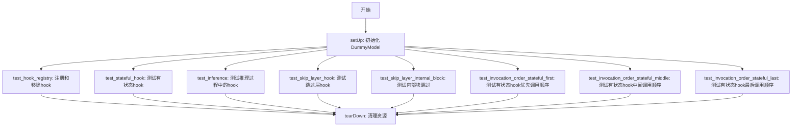

## 类结构

```
torch.nn.Module (基类)
├── DummyBlock
├── DummyModel
ModelHook (抽象基类)
├── AddHook
├── MultiplyHook
├── StatefulAddHook
└── SkipLayerHook
unittest.TestCase
└── HookTests
```

## 全局变量及字段


### `gc`
    
Python的垃圾回收模块，用于手动管理内存

类型：`module`
    


### `unittest`
    
Python标准库单元测试框架

类型：`module`
    


### `torch`
    
PyTorch深度学习库

类型：`module`
    


### `logger`
    
用于记录调试和运行信息的日志记录器

类型：`logging.Logger`
    


### `torch_device`
    
测试所使用的计算设备（CPU或CUDA）

类型：`str`
    


### `DummyBlock.proj_in`
    
将输入特征映射到隐藏空间的线性层

类型：`torch.nn.Linear`
    


### `DummyBlock.activation`
    
用于引入非线性的ReLU激活函数

类型：`torch.nn.ReLU`
    


### `DummyBlock.proj_out`
    
将隐藏特征映射到输出空间的线性层

类型：`torch.nn.Linear`
    


### `DummyModel.linear_1`
    
模型的第一层线性变换

类型：`torch.nn.Linear`
    


### `DummyModel.activation`
    
模型的主激活函数

类型：`torch.nn.ReLU`
    


### `DummyModel.blocks`
    
包含多个DummyBlock的模块列表

类型：`torch.nn.ModuleList`
    


### `DummyModel.linear_2`
    
模型的最后一层线性变换

类型：`torch.nn.Linear`
    


### `AddHook.value`
    
在forward前要加到输入上的数值

类型：`int`
    


### `MultiplyHook.value`
    
在forward前要乘到输入上的数值

类型：`int`
    


### `StatefulAddHook.value`
    
基础加法值

类型：`int`
    


### `StatefulAddHook.increment`
    
状态计数器，记录forward被调用的次数

类型：`int`
    


### `SkipLayerHook.skip_layer`
    
控制是否跳过层执行的标志

类型：`bool`
    


### `SkipLayerHook.fn_ref`
    
保存原始forward函数引用的对象

类型：`引用属性`
    


### `HookTests.in_features`
    
测试模型的输入特征维度

类型：`int`
    


### `HookTests.hidden_features`
    
测试模型的隐藏层特征维度

类型：`int`
    


### `HookTests.out_features`
    
测试模型的输出特征维度

类型：`int`
    


### `HookTests.num_layers`
    
测试模型中DummyBlock的数量

类型：`int`
    


### `HookTests.model`
    
用于测试的虚拟模型实例

类型：`DummyModel`
    
    

## 全局函数及方法


### `free_memory`

该函数是 `diffusers.training_utils` 模块中提供的内存释放工具函数，用于在测试或训练流程结束后清理 GPU 内存，防止内存泄漏。

参数：
- 该函数无参数

返回值：`None`，无返回值

#### 流程图

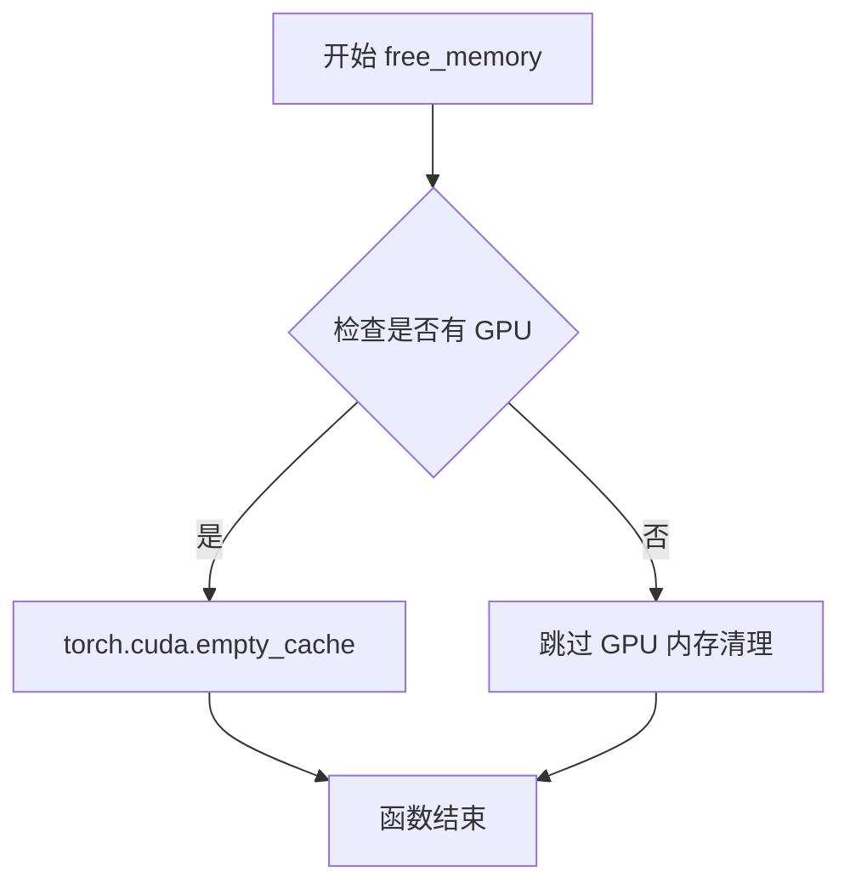

#### 带注释源码

```
# 该函数定义在 diffusers.training_utils 模块中
# 以下为模拟的实现逻辑

def free_memory():
    """
    释放 GPU 内存的实用函数。
    
    作用：
    1. 调用 gc.collect() 强制进行垃圾回收，清理 Python 对象
    2. 调用 torch.cuda.empty_cache() 清空 CUDA 缓存，释放未使用的 GPU 内存
    
    使用场景：
    - 单元测试的 tearDown 方法中
    - 模型训练或推理完成后
    - 需要在有限 GPU 资源环境下切换模型时
    """
    
    # 1. 强制 Python 垃圾回收，释放不再使用的 Python 对象
    gc.collect()
    
    # 2. 清空 CUDA 缓存，释放未使用的 GPU 显存
    # 注意：只会释放可以释放的显存，已被占用的显存不会被释放
    if torch.cuda.is_available():
        torch.cuda.empty_cache()
```

> **注意**：实际的 `free_memory` 函数源码位于 `diffusers/training_utils.py` 文件中，在当前提供的测试代码文件中仅导入了该函数而未展示其完整实现。上面的源码是基于其使用方式和常见模式推断的模拟实现。


### `HookRegistry.check_if_exists_or_initialize`

该方法用于检查指定模型是否已存在 HookRegistry 实例，如果不存在则初始化一个新的 HookRegistry 实例。它是 HookRegistry 类的静态方法，通过模型对象作为键来管理钩子注册表，确保每个模型只有一个对应的钩子注册表。

参数：

-  `model`：`torch.nn.Module`，需要检查或初始化钩子注册表的 PyTorch 模型对象

返回值：`HookRegistry`，返回与给定模型关联的钩子注册表实例

#### 流程图

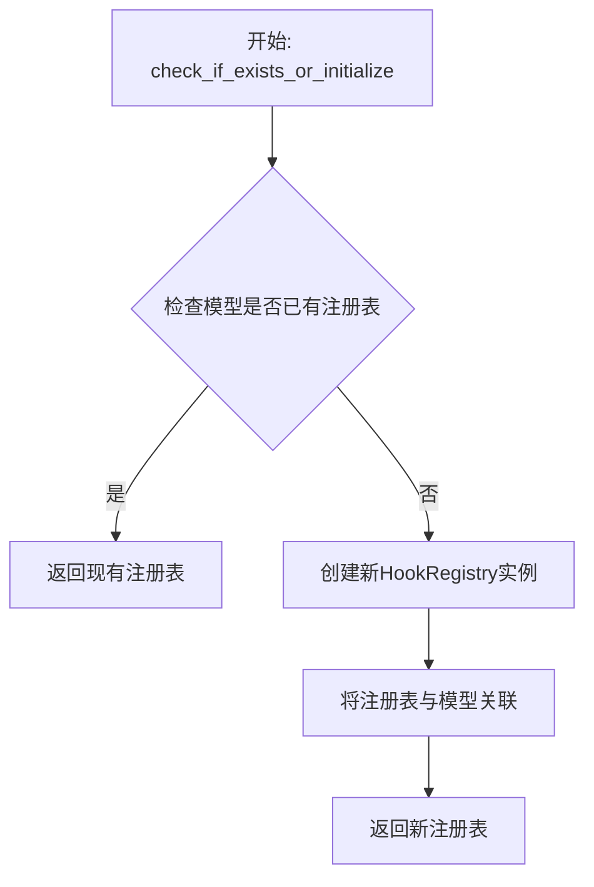

#### 带注释源码

```python
# 注意：以下是基于测试用例使用方式推断的方法签名和功能
# 实际实现位于 diffusers.hooks 模块中，此处为测试文件中的调用示例

# 从测试用例中可以看到调用方式：
# registry = HookRegistry.check_if_exists_or_initialize(self.model)
# 
# 参数说明：
# - self.model: torch.nn.Module 类型，是需要进行钩子注册的模型
#
# 返回值：
# - registry: HookRegistry 类型，是与该模型关联的钩子注册表对象
#
# 使用示例：
registry = HookRegistry.check_if_exists_or_initialize(self.model)
registry.register_hook(AddHook(1), "add_hook")
registry.register_hook(MultiplyHook(2), "multiply_hook")
# 
# 后续可以通过 registry.hooks 访问已注册的钩子
# 通过 registry._hook_order 访问钩子调用顺序
# 通过 registry.remove_hook("hook_name") 移除钩子
```


### `HookRegistry.register_hook`

该方法用于将自定义的模型钩子（Hook）注册到钩子注册表中，以便在模型前向传播过程中执行相应的预处理和后处理逻辑。

参数：

- `hook`：`ModelHook`，要注册的钩子对象，必须是 `ModelHook` 的子类实例
- `name`：`str`，钩子的唯一标识名称，用于后续添加、移除或检索钩子

返回值：`None`，该方法无返回值，直接修改注册表内部状态

#### 流程图

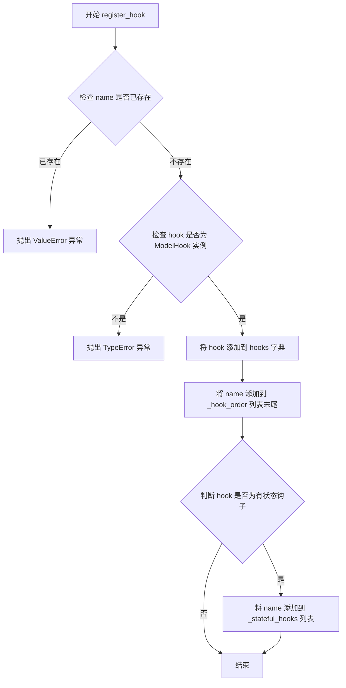

#### 带注释源码

```python
def register_hook(self, hook: ModelHook, name: str) -> None:
    """
    注册一个模型钩子到注册表中
    
    参数:
        hook: ModelHook 实例，要注册的钩子对象
        name: str，钩子的唯一标识名称
    
    返回值:
        None
    
    异常:
        ValueError: 如果同名钩子已存在
        TypeError: 如果 hook 不是 ModelHook 的有效实例
    """
    # 检查钩子名称是否已存在，避免重复注册
    if name in self.hooks:
        raise ValueError(f"Hook with name '{name}' already registered.")
    
    # 验证 hook 是 ModelHook 的有效实例
    if not isinstance(hook, ModelHook):
        raise TypeError(f"Expected ModelHook instance, got {type(hook)}")
    
    # 将钩子对象存储到 hooks 字典中，以名称作为键
    self.hooks[name] = hook
    
    # 维护钩子的注册顺序，用于控制调用优先级
    self._hook_order.append(name)
    
    # 如果钩子是有状态的（_is_stateful 属性为 True），记录到状态钩子列表
    if getattr(hook, '_is_stateful', False):
        self._stateful_hooks.append(name)
```


由于提供的代码是测试文件，`HookRegistry` 类的实际实现（`remove_hook` 方法）并未在此代码中给出。该类是从 `diffusers.hooks` 模块导入的。以下信息是基于测试代码中对 `remove_hook` 方法的调用方式推断得出的。

### HookRegistry.remove_hook

从测试代码中可以看出，该方法用于从钩子注册表中移除指定名称的钩子。

参数：

-  `hook_name`：`str`，要移除的钩子的名称（键名）

返回值：`None`，根据测试代码中的调用方式推断，该方法不返回任何值（测试中未使用返回值，且常规的移除操作通常返回 None 或被删除的对象）

#### 流程图

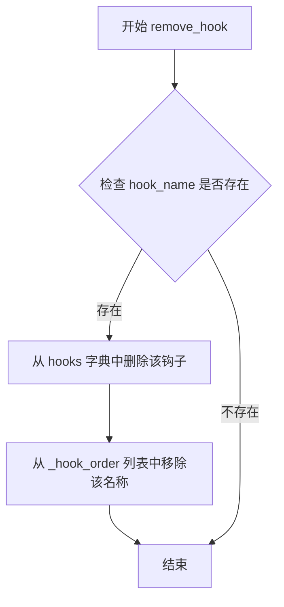

#### 带注释源码

基于测试代码中的使用方式推断的实现：

```python
def remove_hook(self, hook_name: str) -> None:
    """
    从钩子注册表中移除指定名称的钩子。
    
    参数:
        hook_name (str): 要移除的钩子的名称，必须是之前通过 register_hook 注册时提供的名称。
    
    返回值:
        None: 该方法不返回任何值。移除操作会直接修改注册表内部的 hooks 字典和 _hook_order 列表。
    
    示例:
        >>> registry = HookRegistry(model)
        >>> registry.register_hook(AddHook(1), "add_hook")
        >>> registry.remove_hook("add_hook")  # 移除 "add_hook" 钩子
    """
    # 从 hooks 字典中移除该钩子对象
    if hook_name in self.hooks:
        del self.hooks[hook_name]
    
    # 从 _hook_order 列表中移除该名称
    if hook_name in self._hook_order:
        self._hook_order.remove(hook_name)
```

**注意**：由于未提供 `HookRegistry` 类的实际源代码，上述源码是基于测试代码中的行为（如 `test_hook_registry` 中验证了 `hooks` 字典和 `_hook_order` 列表的变化）推断的。如果需要准确的实现细节，请查阅 `diffusers/hooks.py` 源文件。


### HookRegistry.reset_stateful_hooks

该方法用于重置所有已注册的状态钩子（StatefulHook）的内部状态，使钩子的计数器或状态值恢复到初始值。在测试中用于验证有状态钩子能够在模型推理之间正确重置其累积的状态。

参数：无需参数

返回值：`None`，无返回值，仅执行状态重置操作

#### 流程图

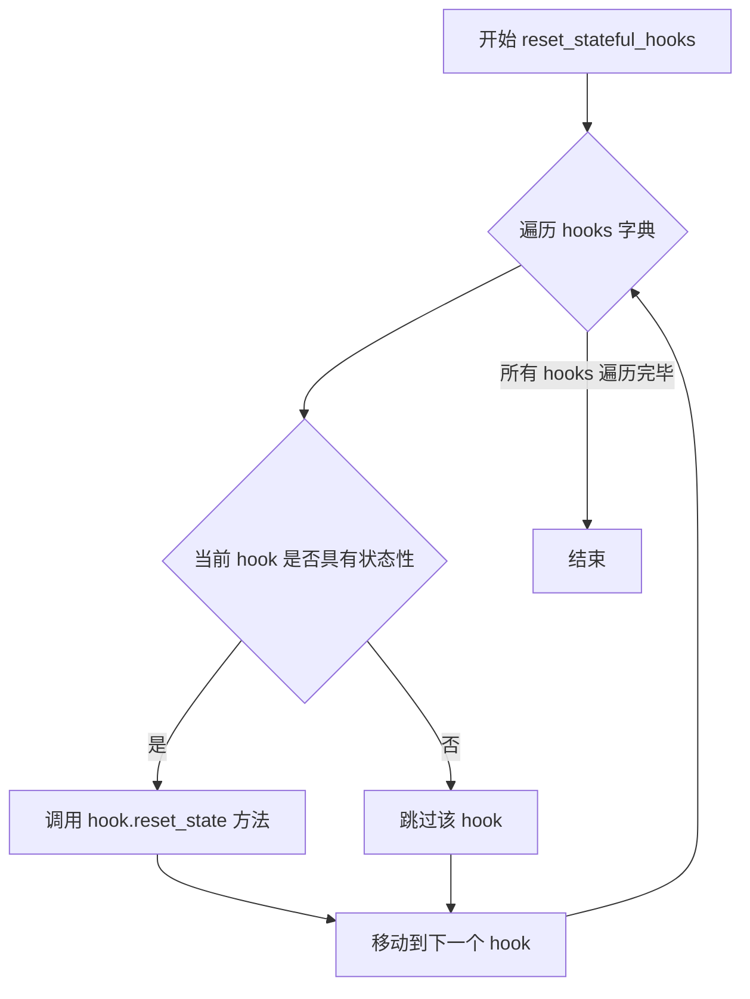

#### 带注释源码

```python
def reset_stateful_hooks(self):
    """
    重置所有状态钩子的内部状态。
    
    遍历注册表中的所有钩子，检查每个钩子是否具有状态性
    （通过 _is_stateful 属性判断），如果有状态则调用其
    reset_state 方法将状态重置为初始值。
    
    此方法通常在需要重新开始计数或清除累积状态时调用，
    例如测试场景中验证状态钩子的重置功能。
    """
    for hook in self.hooks.values():
        # 检查钩子是否具有状态性
        # StatefulAddHook 类通过设置 _is_stateful = True 来标识
        if getattr(hook, '_is_stateful', False):
            # 调用钩子的 reset_state 方法重置状态
            # StatefulAddHook 中会将 increment 计数器重置为 0
            hook.reset_state(module=None)
```

**注意**：由于 `HookRegistry` 类的源代码位于 `diffusers.hooks` 模块中，未在当前测试文件中直接提供。以上源码为基于测试用例行为和常见设计模式的合理推断。实际实现可能略有差异，建议查阅 `diffusers/hooks.py` 获取官方源码。


### HookRegistry.get_hook

该方法用于从注册表中检索已注册的钩子实例，通过钩子名称获取对应的钩子对象。

参数：

- `name`：`str`，需要获取的钩子的名称（标识符）

返回值：`ModelHook`，返回指定名称对应的钩子实例，如果未找到则可能返回 None 或抛出异常。

#### 流程图

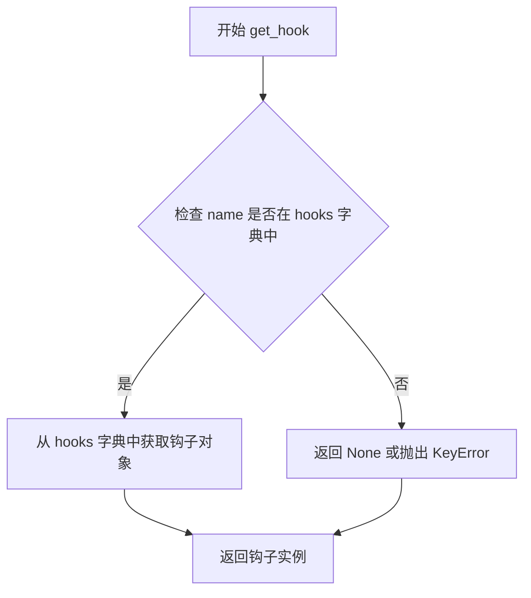

#### 带注释源码

```python
# 注意：由于 HookRegistry 类定义在 diffusers.hooks 模块中，
# 以下是根據測試用例中的使用方式推斷的實現

def get_hook(self, name: str) -> ModelHook:
    """
    根据钩子名称从注册表中获取对应的钩子实例。
    
    参数:
        name: 钩子的唯一标识名称
        
    返回:
        返回对应名称的 ModelHook 实例，如果不存在则返回 None 或抛出异常
    """
    # 从 hooks 字典中检索指定名称的钩子
    # 在测试代码中的使用方式：
    # registry.get_hook("stateful_add_hook").increment
    # 这表明返回的是一个 hook 对象，可以访问其属性
    return self.hooks.get(name)
```


根据代码内容，我找到了两个自定义的 `forward` 方法，它们都继承自 `torch.nn.Module`。由于 `torch.nn.Module.forward` 是 PyTorch 基类的方法，代码中实际定义的是 `DummyBlock.forward` 和 `DummyModel.forward`。以下是对这两个方法的详细文档：

---

### `DummyBlock.forward`

前向传播方法，处理单个块的特征转换，将输入通过输入投影层、激活函数和输出投影层进行变换。

参数：

-  `x`：`torch.Tensor`，输入特征张量

返回值：`torch.Tensor`，经过块处理后的输出特征张量

#### 流程图

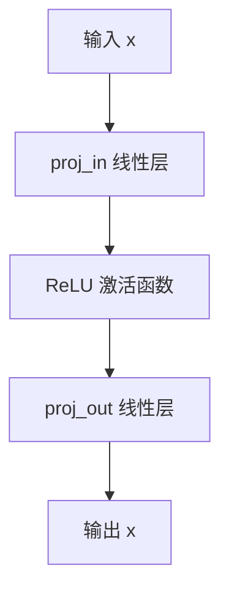

#### 带注释源码

```python
def forward(self, x: torch.Tensor) -> torch.Tensor:
    # 第一步：通过输入投影层将特征从 in_features 映射到 hidden_features
    x = self.proj_in(x)
    # 第二步：应用 ReLU 激活函数引入非线性
    x = self.activation(x)
    # 第三步：通过输出投影层将特征从 hidden_features 映射到 out_features
    x = self.proj_out(x)
    # 返回处理后的特征张量
    return x
```

---

### `DummyModel.forward`

前向传播方法，处理整个模型的特征转换，将输入通过初始线性层、多个块组成的中间层和最终输出层进行变换。

参数：

-  `x`：`torch.Tensor`，输入特征张量

返回值：`torch.Tensor`，模型处理后的输出特征张量

#### 流程图

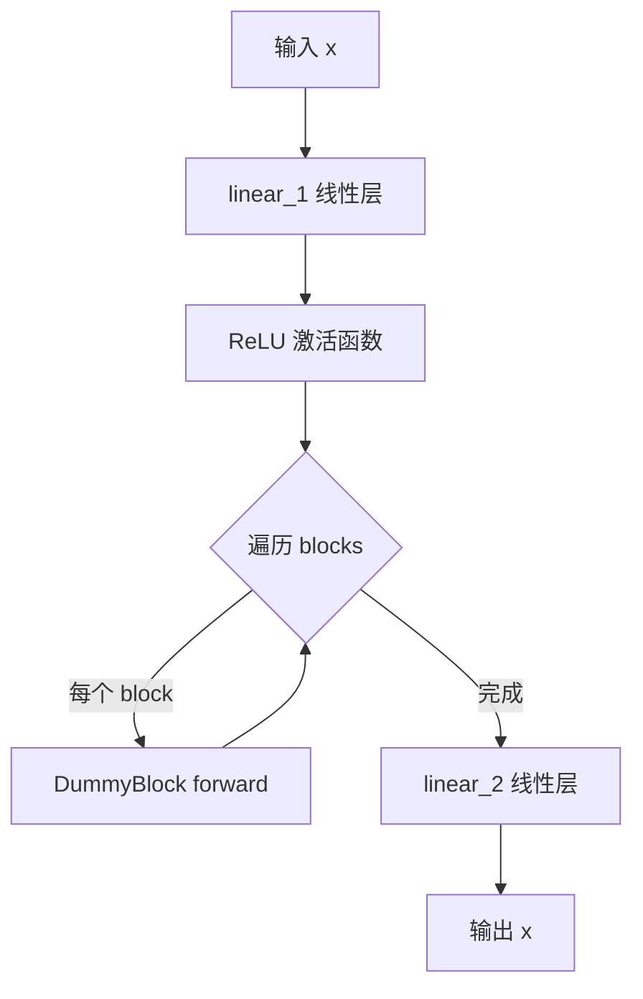

#### 带注释源码

```python
def forward(self, x: torch.Tensor) -> torch.Tensor:
    # 第一步：通过初始线性层将特征从 in_features 映射到 hidden_features
    x = self.linear_1(x)
    # 第二步：应用 ReLU 激活函数引入非线性
    x = self.activation(x)
    # 第三步：遍历每个 DummyBlock 进行中间层处理
    for block in self.blocks:
        x = block(x)
    # 第四步：通过最终线性层将特征从 hidden_features 映射到 out_features
    x = self.linear_2(x)
    # 返回模型输出
    return x
```

---

### 关键组件信息

| 组件名称 | 一句话描述 |
|----------|------------|
| `DummyBlock` | 包含输入投影、激活函数和输出投影的单层神经网络块 |
| `DummyModel` | 多层神经网络模型，包含初始层、多个块和输出层 |
| `HookRegistry` | 管理模型钩子的注册表，用于在 forward 前后注入自定义逻辑 |
| `ModelHook` | 钩子基类，定义 pre_forward、post_forward 和 new_forward 接口 |

---

### 潜在的技术债务或优化空间

1. **缺乏类型提示的多样性**：当前所有 forward 方法仅接受 `torch.Tensor`，可以考虑支持更多输入类型（如字典或元组）以提高灵活性。
2. **缺少梯度禁用处理**：在钩子测试中使用了 `.detach()` 和 `.cpu().item()`，可以在测试工具中封装这些操作以提高可读性。
3. **重复的激活函数实例**：`DummyModel` 中的激活函数被所有块共享，可能导致状态管理问题，建议每个块独立管理激活函数。

---

### 其它项目

- **设计目标与约束**：该代码主要用于测试 `HookRegistry` 和各种钩子（`AddHook`、`MultiplyHook` 等）的功能，验证钩子在模型 forward 过程中的调用顺序和状态管理。
- **错误处理与异常设计**：测试中通过 `self.assertRaises(RuntimeError)` 验证了形状不匹配时的错误抛出。
- **数据流与状态机**：钩子的调用顺序遵循特定规则：状态ful钩子优先执行（pre_forward），然后是非状态ful钩子，post_forward 逆序执行。
- **外部依赖与接口契约**：依赖 `diffusers.hooks` 中的 `HookRegistry` 和 `ModelHook`，以及 `diffusers.training_utils` 中的 `free_memory`。


### `torch.randn`

这是 PyTorch 库中的核心张量生成函数，用于从标准正态分布（均值为0，标准差为1）中随机采样生成指定形状的张量。在本测试代码中，该函数用于生成模拟输入数据，以验证 Hook 机制的正确性。

参数：

-  `*size`：`int` 或 `Tuple[int, ...]`，张量的形状，可以是任意数量的整数参数（如 `1, 4` 表示创建形状为 (1, 4) 的张量）或一个整数元组
-  `generator`：`torch.Generator`，可选，用于控制随机数生成器的状态，以确保结果可复现
-  `out`：`Tensor`，可选，用于指定输出张量的内存位置
-  `dtype`：`torch.dtype`，可选，指定输出张量的数据类型
-  `layout`：`torch.layout`，可选，指定张量的内存布局
-  `device`：`torch.device`，可选，指定张量创建的设备（CPU 或 CUDA）
-  `requires_grad`：`bool`，可选，指定是否需要计算梯度

返回值：`torch.Tensor`，返回从标准正态分布中采样的随机张量，形状由 `*size` 参数指定

#### 流程图

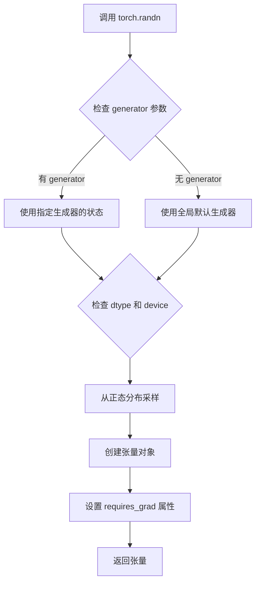

#### 带注释源码

```python
# torch.randn 是 PyTorch 的内置函数，以下是其在代码中的典型使用方式：

# 基础用法：创建形状为 (1, 4) 的随机张量
input = torch.randn(1, 4)

# 带设备指定：在指定设备上创建张量
input = torch.randn(1, 4, device=torch_device)

# 带随机种子：使用生成器确保结果可复现
# generator=torch.manual_seed(0) 创建了一个固定种子的生成器
input = torch.randn(1, 4, device=torch_device, generator=torch.manual_seed(0))

# 组合使用：指定设备、生成器和梯度计算
input = torch.randn(
    1,                      # 批次大小
    4,                      # 特征维度
    device=torch_device,   # 计算设备 (cuda 或 cpu)
    generator=self.get_generator()  # 随机数生成器，用于结果复现
)

# 返回值说明：
# input 现在是一个形状为 (1, 4) 的 torch.Tensor
# 张量中的每个元素服从标准正态分布 N(0, 1)
# 可以进行后续的神经网络前向传播
```


### `torch.zeros`

创建一个所有元素都为0的张量。

参数：

-  `*size`：`int`，可变参数，表示输出张量的形状（例如，1, 4 表示形状为 (1, 4)）
-  `out`：`torch.Tensor`，可选，表示输出张量
-  `dtype`：`torch.dtype`，可选，表示数据类型
-  `layout`：`torch.layout`，可选，表示布局
-  `device`：`torch.device`，可选，表示设备
-  `requires_grad`：`bool`，可选，表示是否需要梯度

返回值：`torch.Tensor`，返回一个新的全零张量

#### 流程图

```mermaid
graph TD
    A[开始调用 torch.zeros] --> B{传入形状参数}
    B -->|例如 (1, 4)| C[在指定设备上分配内存]
    C --> D[初始化所有元素为 0]
    D --> E[返回张量]
```

#### 带注释源码

```python
# 在测试方法 test_skip_layer_hook 中调用 torch.zeros 创建形状为 (1, 4) 的全零输入张量
input = torch.zeros(1, 4, device=torch_device)
```

#### 说明

在提供的代码中，`torch.zeros` 被用于创建测试输入。例如在 `test_skip_layer_hook` 和 `test_skip_layer_internal_block` 方法中，使用 `torch.zeros(1, 4, device=torch_device)` 创建形状为 (1, 4) 的全零张量作为模型输入。该函数是 PyTorch 库的一部分，不是在当前代码文件中定义的。


### torch.manual_seed

设置CPU生成器的随机种子，用于生成随机数。该函数确保PyTorch中的随机操作可复现，常用于深度学习实验中的随机性控制。

参数：

- `seed`：`int`，随机数生成器的种子值，必须为整数。

返回值：`torch.Generator`，返回手动设置的随机数生成器对象，可用于后续的随机操作。

#### 流程图

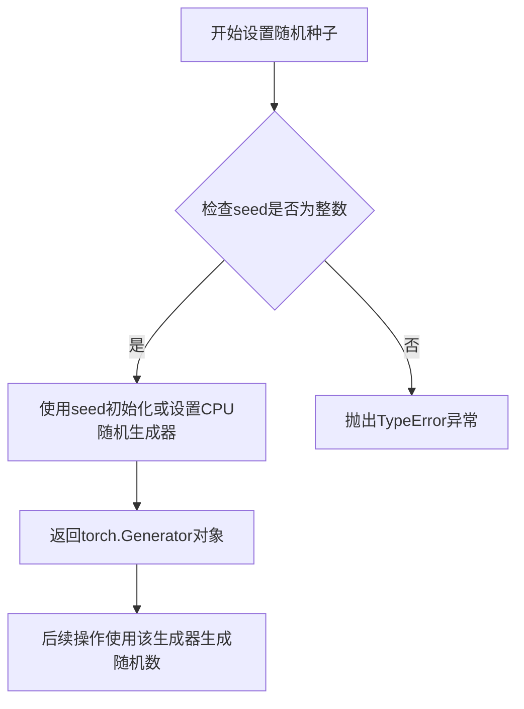

#### 带注释源码

```python
# 这是一个在测试代码中使用torch.manual_seed的示例方法
def get_generator(self):
    """
    获取一个手动设置种子的随机生成器。
    
    用途：确保测试中随机操作的可复现性
    """
    # torch.manual_seed(0) 设置CPU随机生成器的种子为0
    # 参数seed: int类型，指定随机种子值
    # 返回值: torch.Generator对象，可用于控制随机数生成
    return torch.manual_seed(0)
```

```python
# 在测试中使用get_generator()创建确定性随机输入
input = torch.randn(1, 4, device=torch_device, generator=self.get_generator())
```

#### 补充说明

1. **设计目标**：确保深度学习实验和测试的可复现性，通过固定随机种子使得每次运行产生相同的随机数序列。

2. **约束条件**：
   - seed参数必须是整数类型
   - 相同的seed值会生成相同的随机数序列
   - 主要影响CPU端的随机操作

3. **使用场景**：
   - 单元测试中确保测试数据一致性
   - 复现实验结果
   - 调试随机相关问题

4. **技术债务**：当前代码仅使用了CPU随机种子，未涉及CUDA随机种子的设置（应使用`torch.cuda.manual_seed_all()`处理多GPU情况）。


在给定的代码中，未找到名为 `torch.allclose` 的函数或方法的定义。`torch.allclose` 是 PyTorch 库中的一个函数，用于检查两个张量是否在指定容差内相等。代码中在 `test_stateful_hook` 方法中使用了 `torch.allclose` 来验证输出，但由于该函数不在代码中定义，我无法提取其详细设计。

如果您需要我提取代码中使用 `torch.allclose` 的方法（如 `test_stateful_hook`）的详细信息，请告知。但根据任务要求，我无法从代码中提取 `torch.allclose` 本身的定义，因为它不是在此代码中实现的。


### `torch.is_tensor`

检查给定对象是否为 PyTorch 张量（Tensor）。

参数：

-  `obj`：`Any`，任意 Python 对象

返回值：`bool`，如果对象是 PyTorch 张量返回 `True`，否则返回 `False`

#### 流程图

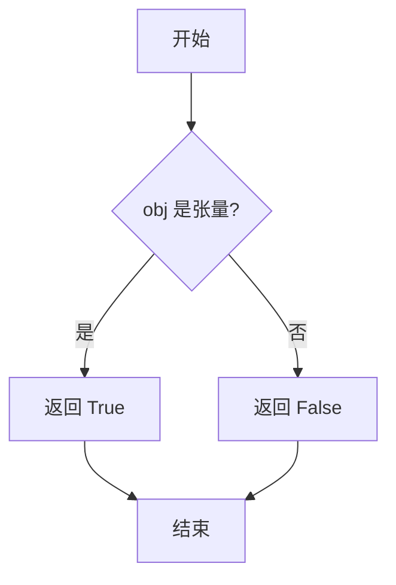

#### 带注释源码

```python
def is_tensor(obj):
    """
    检查对象是否为 PyTorch 张量。
    
    参数:
        obj: 任意 Python 对象
        
    返回值:
        bool: 如果对象是 torch.Tensor 的实例返回 True，否则返回 False
    """
    return isinstance(obj, torch.Tensor)
```

> **注意**：此函数为 PyTorch 内置函数，在代码中调用位置如下：
> ```python
> # 位于 AddHook.pre_forward 方法中
> args = ((x + self.value) if torch.is_tensor(x) else x for x in args)
> ```
> 该调用用于判断输入参数 `x` 是否为 PyTorch 张量，以便决定是否执行加法操作。


### `DummyBlock.__init__`

这是 `DummyBlock` 类的构造函数，用于初始化一个简单的多层感知机（MLP）模块。该模块包含一个输入投影层、ReLU 激活函数和输出投影层，形成一个标准的三层神经网络结构。

参数：

- `in_features`：`int`，输入特征向量的维度
- `hidden_features`：`int`，隐藏层特征向量的维度
- `out_features`：`int`，输出特征向量的维度

返回值：`None`，构造函数不返回任何值

#### 流程图

```mermaid
flowchart TD
    A[开始 __init__] --> B[调用父类 torch.nn.Module 的构造函数]
    B --> C[创建输入投影层 proj_in: Linear(in_features, hidden_features)]
    C --> D[创建激活函数 activation: ReLU]
    D --> E[创建输出投影层 proj_out: Linear(hidden_features, out_features)]
    E --> F[结束 __init__]
```

#### 带注释源码

```python
def __init__(self, in_features: int, hidden_features: int, out_features: int) -> None:
    """
    初始化 DummyBlock 模块
    
    参数:
        in_features: 输入特征维度
        hidden_features: 隐藏层特征维度
        out_features: 输出特征维度
    """
    # 调用父类 torch.nn.Module 的构造函数，进行模块的初始化
    super().__init__()

    # 创建输入投影层：将输入特征从 in_features 维度映射到 hidden_features 维度
    self.proj_in = torch.nn.Linear(in_features, hidden_features)
    
    # 创建 ReLU 激活函数，用于引入非线性
    self.activation = torch.nn.ReLU()
    
    # 创建输出投影层：将隐藏层特征从 hidden_features 维度映射到 out_features 维度
    self.proj_out = torch.nn.Linear(hidden_features, out_features)
```


### `DummyBlock.forward`

该方法实现了一个简单的前馈神经网络块（Block），通过输入投影层将特征映射到隐藏空间，经ReLU激活函数非线性变换后，再通过输出投影层映射到目标输出空间。这是构成深层神经网络的基础组件之一。

参数：

- `x`：`torch.Tensor`，输入张量，形状为 `(batch_size, in_features)` 或任意满足 `in_features` 维度的张量

返回值：`torch.Tensor`，经过全连接层和ReLU激活处理后的输出张量，形状为 `(batch_size, out_features)`

#### 流程图

```mermaid
flowchart TD
    A[输入 x] --> B[proj_in 线性层]
    B --> C[ReLU 激活函数]
    C --> D[proj_out 线性层]
    D --> E[输出 tensor]
    
    B -->|x = self.proj_in(x)| B1[线性变换: in_features → hidden_features]
    C -->|x = self.activation(x)| C1[非线性变换: ReLU]
    D -->|x = self.proj_out(x)| D1[线性变换: hidden_features → out_features]
```

#### 带注释源码

```python
class DummyBlock(torch.nn.Module):
    """简单的多层感知机块，用于构建深层神经网络"""
    
    def __init__(self, in_features: int, hidden_features: int, out_features: int) -> None:
        """
        初始化 DummyBlock
        
        参数:
            in_features: 输入特征的维度
            hidden_features: 隐藏层特征的维度
            out_features: 输出特征的维度
        """
        super().__init__()
        
        # 输入投影层: 将输入从 in_features 维度映射到 hidden_features 维度
        self.proj_in = torch.nn.Linear(in_features, hidden_features)
        
        # ReLU 激活函数: 引入非线性变换
        self.activation = torch.nn.ReLU()
        
        # 输出投影层: 将隐藏特征从 hidden_features 维度映射到 out_features 维度
        self.proj_out = torch.nn.Linear(hidden_features, out_features)

    def forward(self, x: torch.Tensor) -> torch.Tensor:
        """
        前向传播方法
        
        参数:
            x: 输入张量，形状为 (batch_size, in_features)
            
        返回:
            输出张量，形状为 (batch_size, out_features)
        """
        # 第一步: 输入线性变换
        x = self.proj_in(x)
        
        # 第二步: 非线性激活
        x = self.activation(x)
        
        # 第三步: 输出线性变换
        x = self.proj_out(x)
        
        return x
```


### `DummyModel.__init__`

该方法是 `DummyModel` 类的构造函数，负责初始化一个多层感知机（MLP）模型，包含输入层、隐藏层块列表和输出层。

参数：

- `in_features`：`int`，输入特征的维度
- `hidden_features`：`int`，隐藏层特征的维度
- `out_features`：`int`，输出特征的维度
- `num_layers`：`int`，隐藏层块的数量

返回值：`None`，构造函数无返回值

#### 流程图

```mermaid
flowchart TD
    A[开始 __init__] --> B[调用 super().__init__ 初始化nn.Module]
    --> C[创建 self.linear_1: Linear(in_features, hidden_features)]
    --> D[创建 self.activation: ReLU]
    --> E[创建 self.blocks: ModuleList[ DummyBlock ] 共 num_layers 个]
    --> F[创建 self.linear_2: Linear(hidden_features, out_features)]
    --> G[结束 __init__]
```

#### 带注释源码

```python
def __init__(self, in_features: int, hidden_features: int, out_features: int, num_layers: int) -> None:
    """
    初始化 DummyModel 多层感知机模型
    
    参数:
        in_features: 输入特征的维度
        hidden_features: 隐藏层特征的维度
        out_features: 输出特征的维度
        num_layers: 隐藏层块的数量
    """
    # 调用父类 nn.Module 的初始化方法
    super().__init__()

    # 创建第一层线性变换: 输入层 -> 隐藏层
    self.linear_1 = torch.nn.Linear(in_features, hidden_features)
    
    # 创建激活函数 (ReLU)
    self.activation = torch.nn.ReLU()
    
    # 创建隐藏层块列表,每个块是一个 DummyBlock
    # 每个块的输入/输出维度均为 hidden_features
    self.blocks = torch.nn.ModuleList(
        [DummyBlock(hidden_features, hidden_features, hidden_features) for _ in range(num_layers)]
    )
    
    # 创建第二层线性变换: 隐藏层 -> 输出层
    self.linear_2 = torch.nn.Linear(hidden_features, out_features)
```


### `DummyModel.forward`

该方法实现了一个简单的前馈神经网络（MLP），通过输入层、激活函数、多个隐藏块和输出层对输入张量进行逐层变换，最终返回处理后的输出张量。

参数：

- `x`：`torch.Tensor`，输入的原始特征张量，通常形状为 `(batch_size, in_features)`

返回值：`torch.Tensor`，经过网络变换后的输出张量，形状为 `(batch_size, out_features)`

#### 流程图

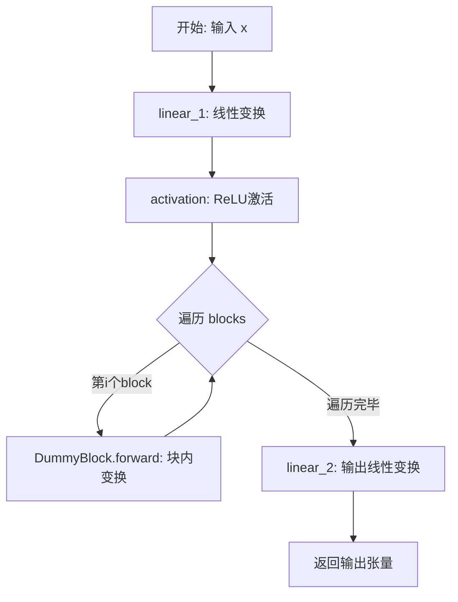

#### 带注释源码

```python
def forward(self, x: torch.Tensor) -> torch.Tensor:
    """
    前馈传播方法，对输入张量进行多层线性变换和非线性激活
    
    参数:
        x: 输入张量，形状为 (batch_size, in_features)
    
    返回:
        输出张量，形状为 (batch_size, out_features)
    """
    # 第一层线性变换：将输入特征映射到隐藏空间
    # 输入: (batch_size, in_features) -> 输出: (batch_size, hidden_features)
    x = self.linear_1(x)
    
    # 应用ReLU激活函数，引入非线性
    x = self.activation(x)
    
    # 依次通过每个DummyBlock进行深层特征变换
    # 每个Block内部: Linear -> ReLU -> Linear
    for block in self.blocks:
        x = block(x)
    
    # 最后一层线性变换：将隐藏特征映射到输出空间
    # 输入: (batch_size, hidden_features) -> 输出: (batch_size, out_features)
    x = self.linear_2(x)
    
    # 返回最终输出
    return x
```


### `AddHook.__init__`

这是 `AddHook` 类的构造函数，用于初始化一个模型钩子，该钩子会在模型前向传播之前将指定的值添加到输入张量中。

参数：

-  `value`：`int`，要在前向传播前添加到输入张量的整数值

返回值：`None`，`__init__` 方法不返回值（Python 中构造函数默认返回 None）

#### 流程图

```mermaid
flowchart TD
    A[开始 __init__] --> B[接收 value: int 参数]
    B --> C[调用 super().__init__ 初始化父类 ModelHook]
    C --> D[将 value 存储到 self.value 实例变量]
    D --> E[结束 __init__, 隐式返回 None]
```

#### 带注释源码

```python
class AddHook(ModelHook):
    """
    一个模型钩子类，继承自 ModelHook。
    会在模型前向传播之前将指定的值添加到输入张量中。
    """
    
    def __init__(self, value: int):
        """
        初始化 AddHook 实例。
        
        参数:
            value: int - 要添加到输入张量的整数值
        """
        # 调用父类 ModelHook 的 __init__ 方法进行初始化
        super().__init__()
        
        # 将传入的 value 参数存储为实例变量，供 pre_forward 方法使用
        self.value = value
```


### `AddHook.pre_forward`

该方法是一个模型钩子（ModelHook）的预置回调函数，在目标模块的 `forward` 方法执行前被调用，其核心功能是对输入参数进行加法变换处理——将所有 tensor 类型的参数加上实例属性 `self.value` 指定的整数值，而非 tensor 类型的数据保持不变。

参数：

- `self`：`AddHook`，钩子类的实例，方法调用者，包含实例属性 `value` 用于指定加法操作的数值
- `module`：`torch.nn.Module`，被挂钩的目标 PyTorch 模块，用于标识钩子作用的具体模块对象
- `*args`：可变长度位置参数列表（Tuple[Any, ...]），传递给目标模块 forward 方法的原始输入参数，可能包含多个任意类型的参数
- `**kwargs`：可变长度关键字参数字典（Dict[str, Any]），传递给目标模块 forward 方法的关键字参数，当前方法中未被修改

返回值：

- `args`：生成器表达式（Generator[Tuple, None, None]），处理后的位置参数，其中每个 tensor 类型的元素都加上了 `self.value`，非 tensor 类型保持原样
- `kwargs`：字典（Dict[str, Any]），未经修改的关键字参数，直接从输入传递

#### 流程图

```mermaid
graph TD
    A[开始 pre_forward] --> B[记录调试日志: AddHook pre_forward]
    B --> C[创建生成器表达式]
    C --> D[遍历 args 中的每个元素 x]
    D --> E{torch.is_tensor(x)?}
    E -->|True| F[x + self.value]
    E -->|False| G[x]
    F --> H[收集结果到生成器]
    G --> H
    H --> I{args 遍历结束?}
    I -->|否| D
    I -->|是| J[返回 (生成器, kwargs)]
```

#### 带注释源码

```python
def pre_forward(self, module: torch.nn.Module, *args, **kwargs):
    """
    在目标模块 forward 方法执行前调用的预置钩子。
    
    参数:
        module: 被挂钩的 PyTorch 模块实例
        *args: 传递给 forward 的可变位置参数
        **kwargs: 传递给 forward 的可变关键字参数
    
    返回:
        包含修改后 args 和原始 kwargs 的元组
    """
    # 使用 logger 记录调试信息，标记钩子类型和调用时机
    logger.debug("AddHook pre_forward")
    
    # 创建一个生成器表达式，遍历所有位置参数
    # 对每个 tensor 类型的参数加上 self.value，非 tensor 保持不变
    # 注意：这里使用生成器表达式而非列表推导，以延迟计算
    args = ((x + self.value) if torch.is_tensor(x) else x for x in args)
    
    # 返回处理后的参数元组，kwargs 保持不变直接传递
    return args, kwargs
```


### `AddHook.post_forward`

`AddHook.post_forward` 是 `AddHook` 类中的后向传播钩子方法，在模块前向传播完成后被调用。该方法主要实现日志记录功能，并直接将模块的输出返回，不进行任何修改。

参数：

-  `module`：`torch.nn.Module`，执行前向传播的模块
-  `output`：任意类型，模块前向传播的输出结果

返回值：任意类型，直接返回传入的 `output` 参数，不做任何修改

#### 流程图

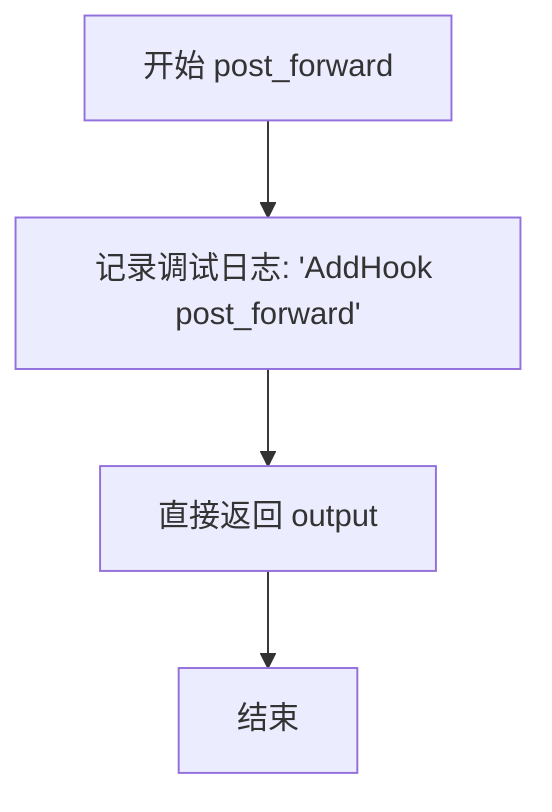

#### 带注释源码

```python
def post_forward(self, module, output):
    """
    在模块前向传播完成后调用的后向钩子方法。
    
    该方法记录调试日志并直接返回模块的输出，不做任何修改。
    这是一个最简单的钩子实现示例，用于展示钩子机制的基本结构。
    
    参数:
        module (torch.nn.Module): 执行前向传播的模块实例
        output: 模块前向传播的输出结果，可以是任意类型（通常是 torch.Tensor）
    
    返回:
        直接返回传入的 output 参数，不做任何修改
    """
    # 记录调试日志，表明 post_forward 钩子已被调用
    logger.debug("AddHook post_forward")
    
    # 直接返回模块的输出，不进行任何处理
    return output
```


### `MultiplyHook.__init__`

这是 `MultiplyHook` 类的构造函数，用于初始化一个乘法钩子实例。该钩子继承自 `ModelHook`，会在前向传播前将输入参数乘以指定的值。

参数：

- `value`：`int`，指定乘法操作的乘数，用于在 `pre_forward` 中对输入张量进行缩放

返回值：`None`，构造函数不返回任何值

#### 流程图

```mermaid
flowchart TD
    A[开始 __init__] --> B[调用 super().__init__]
    B --> C[将参数 value 赋值给实例属性 self.value]
    D[结束 __init__]
    C --> D
```

#### 带注释源码

```python
def __init__(self, value: int):
    """
    初始化 MultiplyHook 实例
    
    参数:
        value: int, 指定乘法操作的乘数
    """
    # 调用父类 ModelHook 的初始化方法
    super().__init__()
    
    # 将传入的 value 参数存储为实例属性，供 pre_forward 和 post_forward 方法使用
    self.value = value
```


### `MultiplyHook.pre_forward`

该方法是一个模型钩子（Hook），在模型 `forward` 方法执行之前被调用，用于将输入参数乘以一个预先设置的值（`self.value`），实现对输入数据的缩放处理。

参数：

- `module`：`torch.nn.Module`，被挂载钩子的 PyTorch 模块
- `*args`：可变位置参数（Tuple[Any, ...]），传入模块 `forward` 方法的位置参数
- `**kwargs`：关键字参数（Dict[str, Any]），传入模块 `forward` 方法的关键字参数

返回值：`(Tuple, Dict)`，返回一个元组，包含修改后的位置参数生成器和保持不变的关键字参数字典

#### 流程图

```mermaid
flowchart TD
    A[开始 pre_forward] --> B[记录调试日志: MultiplyHook pre_forward]
    B --> C{遍历 args 中的每个元素 x}
    C -->|x 是 Tensor| D[x * self.value]
    C -->|x 不是 Tensor| E[保持原值 x]
    D --> F[将处理后的元素组成生成器]
    E --> F
    F --> G[返回 args 生成器和 kwargs 字典]
    G --> H[结束 pre_forward]
```

#### 带注释源码

```python
def pre_forward(self, module, *args, **kwargs):
    """
    在模块 forward 方法执行前调用的钩子
    将输入参数乘以 self.value 进行缩放
    
    参数:
        module: 被挂载的 PyTorch 模块
        *args: 传入 forward 的位置参数
        **kwargs: 传入 forward 的关键字参数
    
    返回:
        (args, kwargs): 修改后的参数元组
    """
    # 记录调试日志
    logger.debug("MultiplyHook pre_forward")
    
    # 遍历 args 中的每个参数，如果是 Tensor 则乘以 self.value
    # 使用生成器表达式延迟计算，返回生成器对象而非列表
    args = ((x * self.value) if torch.is_tensor(x) else x for x in args)
    
    # 返回修改后的 args 和原始 kwargs
    # 注意：kwargs 在此方法中未修改，直接返回
    return args, kwargs
```


### `MultiplyHook.post_forward`

这是 `MultiplyHook` 类中的一个方法，用于在模型前向传播完成后执行特定操作（钩子回调）。当前实现记录日志后直接返回模块的输出，不做任何修改。

参数：

- `module`：`torch.nn.Module`，执行前向传播的 PyTorch 模块
- `output`：`torch.Tensor`，模块前向传播的输出结果

返回值：`torch.Tensor`，直接返回传入的 output（不做任何修改）

#### 流程图

```mermaid
flowchart TD
    A[模块执行 forward] --> B[调用 MultiplyHook.post_forward]
    B --> C[记录调试日志: MultiplyHook post_forward]
    C --> D{是否需要修改输出}
    D -->|否| E[原样返回 output]
    D -->|是| F[对 output 进行处理后返回]
    
    style E fill:#90EE90,stroke:#333,stroke-width:2px
    style F fill:#FFB6C1,stroke:#333,stroke-width:2px
```

#### 带注释源码

```python
def post_forward(self, module, output):
    """
    在模型前向传播后执行的钩子方法。
    
    参数:
        module: 执行前向传播的 PyTorch 模块
        output: 模块的输出结果 (torch.Tensor)
    
    返回:
        torch.Tensor: 直接返回 output，不做任何修改
    """
    # 记录调试日志，表明 MultiplyHook 的 post_forward 已被调用
    logger.debug("MultiplyHook post_forward")
    
    # 直接返回模块的输出，不做任何修改
    # 当前实现为 passthrough，可用于:
    # - 记录输出信息
    # - 监控输出
    # - 未来扩展: 在此添加输出变换逻辑
    return output
```


### `MultiplyHook.__repr__`

该方法返回 `MultiplyHook` 实例的标准字符串表示，主要用于调试、日志记录以及在 UI 或控制台中直观地展示 Hook 的配置信息（如当前设置的乘数值）。

参数：

-  `self`：`MultiplyHook`，调用该方法的 `MultiplyHook` 类实例本身，用于访问实例属性 `value`。

返回值：`str`，返回对象的字符串表示，格式为 `MultiplyHook(value={value})`。

#### 流程图

```mermaid
flowchart TD
    A([Start __repr__]) --> B[读取实例属性 self.value]
    B --> C[格式化字符串: f"MultiplyHook(value={self.value})"]
    C --> D([返回字符串])
```

#### 带注释源码

```python
def __repr__(self):
    """
    返回 MultiplyHook 实例的字符串表示。

    Returns:
        str: 包含类名和 value 属性的字符串，例如 'MultiplyHook(value=2)'。
    """
    return f"MultiplyHook(value={self.value})"
```


### `StatefulAddHook.__init__`

初始化 `StatefulAddHook` 类的实例，设置基础钩子属性、存储要添加的数值，并初始化内部状态计数器。

参数：

- `value`：`int`，在模型前向传播时需要加到输入张量上的数值

返回值：`None`，构造函数无返回值

#### 流程图

```mermaid
flowchart TD
    A[开始 __init__] --> B[调用父类 ModelHook 的 __init__]
    B --> C[将参数 value 存储到实例属性 self.value]
    D[将 self.increment 初始化为 0]
    C --> E[结束]
    D --> E
```

#### 带注释源码

```python
def __init__(self, value: int):
    """
    初始化 StatefulAddHook 实例
    
    参数:
        value: int - 在前向传播时需要加到输入张量上的基础数值
    """
    # 调用父类 ModelHook 的初始化方法，设置基类属性
    super().__init__()
    
    # 存储用户传入的数值，该值会与 increment 组合形成实际的增量
    self.value = value
    
    # 初始化状态计数器，用于跟踪前向传播被调用的次数
    # 每次调用 pre_forward 时，increment 会递增，从而实现累加效果
    self.increment = 0
```


### `StatefulAddHook.pre_forward`

该方法是一个有状态的预置钩子（pre-forward hook），在模型前向传播之前被调用。它会将一个递增值（基础值加上内部计数器）加到输入张量的每个元素上，并递增内部计数器，实现每次调用时增加不同的值。

参数：

- `module`：`torch.nn.Module`，被钩住修改的 PyTorch 模块
- `*args`：任意数量的位置参数，会被遍历并对每个张量类型的参数加上递增值
- `**kwargs`：任意数量的关键字参数，保持不变传递下去

返回值：`tuple`，返回处理后的新位置参数（转换为元组）和关键字字典，供后续模块前向传播使用

#### 流程图

```mermaid
flowchart TD
    A[pre_forward 被调用] --> B[记录调试日志]
    B --> C[计算 add_value = value + increment]
    C --> D[increment 计数器加 1]
    D --> E{遍历 args 中的每个参数}
    E -->|是张量| F[将该参数加上 add_value]
    E -->|非张量| G[保持原样]
    F --> H[收集到新元组]
    G --> H
    H --> I[返回处理后的 args 和 kwargs 元组]
```

#### 带注释源码

```python
def pre_forward(self, module, *args, **kwargs):
    """
    在模型前向传播前执行的预钩子，对输入张量添加递增值。
    
    参数:
        module: 被钩子修饰的 PyTorch 模块实例
        *args: 位置参数列表，会遍历检查是否为张量并处理
        **kwargs: 关键字参数，保持原样传递
    
    返回:
        tuple: (处理后的新位置参数元组, 关键字参数字典)
    """
    # 记录调试日志，便于追踪钩子执行顺序
    logger.debug("StatefulAddHook pre_forward")
    
    # 计算实际要加上的值：基础value + 当前increment计数
    add_value = self.value + self.increment
    
    # 递增计数器，记录该钩子被调用的次数
    self.increment += 1
    
    # 遍历所有位置参数，对每个张量类型的参数加上 add_value
    # 使用生成器表达式逐个处理，非张量参数保持不变
    args = ((x + add_value) if torch.is_tensor(x) else x for x in args)
    
    # 将生成器转换为元组返回，同时保持 kwargs 不变
    return args, kwargs
```


### `StatefulAddHook.reset_state`

重置有状态钩子的内部状态计数器，将 `increment` 属性重置为 0，以便在后续的前向传播中重新开始计数。

参数：

- `module`：`torch.nn.Module`，传入的 PyTorch 模块实例，当前方法体中未使用该参数，但为保持接口一致性而保留

返回值：`None`，无返回值

#### 流程图

```mermaid
flowchart TD
    A[开始 reset_state] --> B[将 self.increment 设置为 0]
    B --> C[结束方法]
```

#### 带注释源码

```python
def reset_state(self, module):
    """
    重置 StatefulAddHook 的状态。
    
    该方法将内部的 increment 计数器重置为 0，使其在下次前向传播时
    从初始值开始计数。这在需要重新开始累积值序列的场景中非常有用，
    例如在测试或需要重置模型钩子状态的场景。
    
    参数:
        module: torch.nn.Module 模块实例，此参数在当前实现中未被使用，
                但保留以保持与可能需要模块信息的接口一致性
    """
    self.increment = 0  # 将增量计数器重置为初始值 0
```


### `SkipLayerHook.__init__`

该方法是 `SkipLayerHook` 类的构造函数，用于初始化跳过层 Hook 的实例。它接收一个布尔类型的参数 `skip_layer`，用于控制是否跳过模块的前向传播过程。

参数：

- `skip_layer`：`bool`，指示是否跳过模块的执行。如果为 `True`，则在 `new_forward` 方法中直接返回输入而不执行原始模块的前向传播；如果为 `False`，则执行原始模块的前向传播。

返回值：`None`，构造函数不返回任何值。

#### 流程图

```mermaid
flowchart TD
    A[开始 __init__] --> B[调用父类 ModelHook 的构造函数]
    B --> C[将 skip_layer 参数赋值给实例属性 self.skip_layer]
    C --> D[结束 __init__]
```

#### 带注释源码

```python
def __init__(self, skip_layer: bool):
    """
    初始化 SkipLayerHook 实例。
    
    参数:
        skip_layer: 一个布尔值，指定是否跳过模块的执行。
                    当为 True 时，模块的前向传播将被跳过，
                    直接返回输入张量；为 False 时，则正常执行模块。
    """
    # 调用父类 ModelHook 的初始化方法
    super().__init__()
    
    # 将 skip_layer 参数保存为实例属性，供后续方法使用
    self.skip_layer = skip_layer
```


### `SkipLayerHook.pre_forward`

该方法是 `SkipLayerHook` 类的前向传播前钩子（pre_forward hook），用于在模型层执行前被调用，记录调试日志并原样返回传入的位置参数和关键字参数，为后续可能的层跳过逻辑做准备。

参数：

- `module`：`torch.nn.Module`，被挂载钩子的 PyTorch 模块实例
- `*args`：可变位置参数，表示传入模型前向传播的位置参数元组
- `**kwargs`：可变关键字参数，表示传入模型前向传播的关键字参数字典

返回值：`tuple[tuple, dict]`，返回未经修改的 `args` 元组和 `kwargs` 字典的元组形式

#### 流程图

```mermaid
flowchart TD
    A[开始 pre_forward] --> B[记录调试日志: 'SkipLayerHook pre_forward']
    B --> C[返回原始 args 和 kwargs]
    C --> D[结束 pre_forward, 传递给模型]
```

#### 带注释源码

```python
def pre_forward(self, module, *args, **kwargs):
    """
    在模型层前向传播之前调用的钩子方法。
    
    该方法记录调试日志并原样返回传入的参数，
    实际的处理逻辑在 new_forward 方法中完成。
    
    参数:
        module (torch.nn.Module): 被挂载钩子的 PyTorch 模块实例
        *args: 传入模型前向传播的可变位置参数
        **kwargs: 传入模型前向传播的可变关键字参数
    
    返回:
        tuple: 包含 (args, kwargs) 的元组，保持参数不变传递下去
    """
    # 记录调试日志，表明 SkipLayerHook 的 pre_forward 被调用
    logger.debug("SkipLayerHook pre_forward")
    
    # 原样返回 args 和 kwargs，不做任何修改
    # 实际参数处理在 new_forward 方法中根据 skip_layer 标志执行
    return args, kwargs
```


### `SkipLayerHook.new_forward`

该方法是 `SkipLayerHook` 类的核心方法，用于实现条件性跳过层的功能。当 `skip_layer` 属性为 `True` 时，直接返回输入的第一个参数（即跳过该层的计算）；当 `skip_layer` 为 `False` 时，调用存储在 `fn_ref` 中的原始 forward 函数执行正常的前向传播。

参数：

- `module`：`torch.nn.Module`，执行 hook 的目标模块
- `*args`：可变位置参数，传递给模块 forward 方法的输入张量
- `**kwargs`：可变关键字参数，传递给模块 forward 方法的额外参数

返回值：`Any`，当 `skip_layer` 为 `True` 时返回输入的第一个参数（通常是输入张量），否则返回原始 forward 方法的执行结果

#### 流程图

```mermaid
flowchart TD
    A[开始 new_forward] --> B{self.skip_layer?}
    B -->|True| C[返回 args[0]<br/>即跳过该层计算]
    B -->|False| D[调用 self.fn_ref.original_forward<br/>执行原始 forward]
    C --> E[结束]
    D --> E
```

#### 带注释源码

```python
def new_forward(self, module: torch.nn.Module, *args, **kwargs):
    """
    实现条件性跳过层的逻辑。
    
    参数:
        module: 执行 hook 的目标模块
        *args: 传递给模块 forward 方法的位置参数
        **kwargs: 传递给模块 forward 方法的关键字参数
    
    返回:
        如果 skip_layer 为 True，返回输入的第一个参数（跳过层计算）；
        否则调用原始 forward 函数并返回其结果。
    """
    # 记录调试日志，表明 new_forward 方法被调用
    logger.debug("SkipLayerHook new_forward")
    
    # 检查是否需要跳过该层
    if self.skip_layer:
        # 直接返回输入的第一个参数，跳过该层的计算
        return args[0]
    
    # 调用原始 forward 函数，执行正常的层计算
    # fn_ref.original_forward 是预先存储的模块原始 forward 方法引用
    return self.fn_ref.original_forward(*args, **kwargs)
```


### `SkipLayerHook.post_forward`

该方法是一个后向钩子（post-forward hook），在模型层前向传播完成后被调用，用于处理该层的输出结果。在此实现中，它主要承担日志记录功能，直接返回未经修改的输出，但为子类提供了扩展接口以实现自定义的后处理逻辑。

参数：

- `module`：`torch.nn.Module`，被钩子挂载的 PyTorch 模块实例
- `output`：`Any`，模型层前向传播的输出结果，可以是张量、元组或其他数据类型

返回值：`Any`，返回处理后的输出（在本实现中直接返回原始 output）

#### 流程图

```mermaid
flowchart TD
    A[开始 post_forward] --> B{记录日志}
    B --> C[SkipLayerHook post_forward]
    C --> D[返回 output]
    D --> E[结束]
    
    style A fill:#e1f5fe
    style D fill:#e8f5e8
    style E fill:#f3e5f5
```

#### 带注释源码

```python
def post_forward(self, module, output):
    """
    后向钩子方法，在模块前向传播完成后执行。
    
    Args:
        module: 被钩子挂载的 PyTorch 模块
        output: 模块前向传播的输出
        
    Returns:
        返回未经修改的 output，传递给下游模块
    """
    # 记录调试日志，表明后向钩子被触发
    logger.debug("SkipLayerHook post_forward")
    # 直接返回原始输出，不做任何修改
    return output
```


### `HookTests.setUp`

该方法是 unittest.TestCase 的初始化方法，在每个测试方法执行前被调用，用于设置测试所需的 DummyModel 模型实例，并将其移动到指定的计算设备（torch_device）上。

参数：

- `self`：`HookTests`，测试类实例（Python 隐式传递）

返回值：`None`，无返回值，仅作为测试 fixture 初始化使用

#### 流程图

```mermaid
flowchart TD
    A[开始 setUp] --> B[调用 get_module_parameters 获取模型参数字典]
    B --> C[使用 params 实例化 DummyModel]
    C --> D[调用 model.to torch_device 迁移模型到指定设备]
    D --> E[结束 setUp, 模型准备完毕等待测试执行]
```

#### 带注释源码

```python
def setUp(self):
    """
    unittest.TestCase 的 setUp 方法，在每个测试方法运行前被调用。
    作用：初始化测试所需的模型实例并迁移到指定计算设备。
    """
    # 获取模型构造参数（包含 in_features, hidden_features, out_features, num_layers）
    params = self.get_module_parameters()
    
    # 创建 DummyModel 实例（包含多层神经网络结构的测试模型）
    self.model = DummyModel(**params)
    
    # 将模型迁移到指定的计算设备（如 CUDA 或 CPU）
    self.model.to(torch_device)
```


### `HookTests.tearDown`

该方法是单元测试的清理方法，在每个测试用例执行完毕后被调用，用于释放测试过程中创建的模型对象及其占用的 GPU 内存，确保测试环境不会因残留对象导致内存泄漏。

参数：无（除隐含的 `self`）

返回值：`None`，无返回值，仅执行清理操作

#### 流程图

```mermaid
flowchart TD
    A[开始 tearDown] --> B[调用 super().tearDown]
    B --> C[删除 self.model 引用]
    C --> D[执行 gc.collect 强制垃圾回收]
    D --> E[调用 free_memory 释放GPU内存]
    E --> F[结束]
```

#### 带注释源码

```python
def tearDown(self):
    """
    测试用例清理方法，在每个测试方法执行完毕后自动调用。
    负责清理测试过程中创建的模型对象和释放相关内存资源。
    """
    # 调用父类的 tearDown 方法，执行 unittest.TestCase 的标准清理逻辑
    super().tearDown()

    # 删除 self.model 引用，使模型对象变为不可达，等待垃圾回收器回收
    del self.model
    
    # 手动触发 Python 垃圾回收器，强制回收已删除的对象
    gc.collect()
    
    # 调用 diffusers 提供的 free_memory 函数，释放 GPU/CUDA 显存
    free_memory()
```


### `HookTests.get_module_parameters`

该方法是一个测试辅助方法，用于返回创建 DummyModel 所需的参数字典，包括输入特征数、隐藏层特征数、输出特征数和层数等配置信息。

参数：
- 无显式参数（隐式参数 `self`：类型 `HookTests`，表示类的实例上下文）

返回值：`Dict[str, int]`，返回包含模型初始化参数的字典，键为参数字符串名称，值为对应的整数值

#### 流程图

```mermaid
flowchart TD
    A[开始] --> B[创建空字典]
    B --> C[添加 in_features]
    C --> D[添加 hidden_features]
    D --> E[添加 out_features]
    E --> F[添加 num_layers]
    F --> G[返回字典]
    G --> H[结束]
```

#### 带注释源码

```python
def get_module_parameters(self):
    """
    获取用于初始化 DummyModel 的参数字典。
    
    Returns:
        Dict[str, int]: 包含以下键的字典：
            - in_features: 输入特征维度
            - hidden_features: 隐藏层特征维度
            - out_features: 输出特征维度
            - num_layers: Block 层数
    """
    return {
        "in_features": self.in_features,      # 从类属性获取输入特征数
        "hidden_features": self.hidden_features,  # 从类属性获取隐藏层特征数
        "out_features": self.out_features,    # 从类属性获取输出特征数
        "num_layers": self.num_layers,        # 从类属性获取模块列表层数
    }
```

---

**补充信息**

| 属性 | 类型 | 值 | 描述 |
|------|------|-----|------|
| `HookTests.in_features` | `int` | `4` | 类属性，模型输入特征维度 |
| `HookTests.hidden_features` | `int` | `8` | 类属性，隐藏层特征维度 |
| `HookTests.out_features` | `int` | `4` | 类属性，模型输出特征维度 |
| `HookTests.num_layers` | `int` | `2` | 类属性，DummyBlock 堆叠层数 |


### `HookTests.get_generator`

该方法用于创建一个具有固定种子的 PyTorch 随机数生成器，以确保测试过程中的随机性可复现。

参数：
- 无显式参数（`self` 为隐式参数，表示 HookTests 实例本身）

返回值：`torch.Generator`，返回一个固定种子（0）的 PyTorch 随机数生成器对象，用于后续的随机操作。

#### 流程图

```mermaid
flowchart TD
    A[开始] --> B[调用 torch.manual_seed(0)]
    B --> C[创建固定种子的生成器]
    C --> D[返回 Generator 对象]
    D --> E[结束]
```

#### 带注释源码

```python
def get_generator(self):
    """
    创建一个固定种子的随机数生成器。
    
    该方法用于确保测试中随机操作的可重复性，
    通过固定种子(0)使得每次测试运行产生相同的随机序列。
    
    Returns:
        torch.Generator: 一个设置了固定种子的 PyTorch 随机数生成器对象
    """
    return torch.manual_seed(0)
```

#### 详细说明

- **方法位置**：位于 `HookTests` 测试类中
- **设计目的**：为测试用例提供可重复的随机输入，确保测试结果的确定性
- **调用场景**：在多个测试方法（如 `test_stateful_hook`、`test_inference`、`test_invocation_order_stateful_first` 等）中用于初始化输入张量的随机种子
- **返回值类型说明**：`torch.manual_seed(0)` 返回一个 `torch.Generator` 对象，该对象可用于 `torch.randn` 等函数的 `generator` 参数，以确保生成的随机数序列可预测


### `HookTests.test_hook_registry`

该测试方法用于验证HookRegistry的注册、查询和移除Hook的功能是否正常工作，确保Hook能够正确地被添加到注册表中并按照预期顺序执行。

参数：

- `self`：`HookTests`，测试类的实例，包含模型和测试参数

返回值：`None`，该方法为测试方法，通过assert断言验证功能，不返回具体值

#### 流程图

```mermaid
flowchart TD
    A[开始测试 test_hook_registry] --> B[获取或初始化HookRegistry]
    B --> C[注册AddHook到registry]
    C --> D[注册MultiplyHook到registry]
    D --> E{验证hooks数量}
    E -->|等于2| F[验证_hook_order顺序]
    F --> G{验证字符串表示}
    G -->|匹配预期| H[移除add_hook]
    H --> I{验证hooks数量}
    I -->|等于1| J[验证_hook_order更新]
    J --> K[测试结束]
    E -->|不等于2| L[断言失败]
    G -->|不匹配| L
    I -->|不等于1| L
```

#### 带注释源码

```python
def test_hook_registry(self):
    """
    测试HookRegistry的注册和移除功能
    验证点：
    1. Hook能够正确注册到registry
    2. 注册表能正确返回字符串表示
    3. Hook能够按照注册顺序正确排序
    4. Hook能够正确从注册表中移除
    """
    # 第一步：获取或初始化与model关联的HookRegistry实例
    # HookRegistry.check_if_exists_or_initialize会检查是否已存在对应model的registry
    # 如果存在则返回，否则创建新的registry并与model关联
    registry = HookRegistry.check_if_exists_or_initialize(self.model)
    
    # 第二步：注册第一个hook - AddHook
    # 参数1：hook实例，参数2：hook的唯一标识名称
    # AddHook会在前向传播前将输入tensor加上self.value(1)
    registry.register_hook(AddHook(1), "add_hook")
    
    # 第三步：注册第二个hook - MultiplyHook
    # MultiplyHook会在前向传播前将输入tensor乘以self.value(2)
    registry.register_hook(MultiplyHook(2), "multiply_hook")
    
    # 第四步：获取registry的字符串表示形式
    # 预期格式应包含所有已注册的hook及其名称
    registry_repr = repr(registry)
    
    # 第五步：定义期望的字符串表示
    # 格式说明：索引 - 钩子名称 - 钩子类型(额外信息)
    expected_repr = "HookRegistry(\n  (0) add_hook - AddHook\n  (1) multiply_hook - MultiplyHook(value=2)\n)"
    
    # 第六步：断言验证
    # 验证点1：hooks字典中应该包含2个hook
    self.assertEqual(len(registry.hooks), 2)
    
    # 验证点2：hook执行顺序应该是["add_hook", "multiply_hook"]
    # 注意：虽然后注册的multiply_hook在前面，但_hook_order记录的是注册顺序
    self.assertEqual(registry._hook_order, ["add_hook", "multiply_hook"])
    
    # 验证点3：字符串表示应该完全匹配预期
    self.assertEqual(registry_repr, expected_repr)
    
    # 第七步：移除名为"add_hook"的hook
    # 移除后registry中应该只保留multiply_hook
    registry.remove_hook("add_hook")
    
    # 第八步：移除后的再次验证
    # 验证点4：hooks字典中应该只有1个hook
    self.assertEqual(len(registry.hooks), 1)
    
    # 验证点5：hook执行顺序应该更新为["multiply_hook"]
    self.assertEqual(registry._hook_order, ["multiply_hook"])
```


### `HookTests.test_stateful_hook`

该测试方法用于验证有状态Hook（StatefulHook）在模型前向传播过程中的状态累积与重置功能，确保有状态钩子能够正确维护内部状态并在需要时重置。

参数：

- `self`：`HookTests`，测试类实例本身

返回值：`None`，该方法为测试用例，无返回值

#### 流程图

```mermaid
flowchart TD
    A[开始测试] --> B[初始化HookRegistry]
    B --> C[注册StatefulAddHook]
    C --> D{验证初始increment值}
    D -->|等于0| E[创建输入张量]
    D -->|不等于0| F[测试失败]
    E --> G[循环执行模型前向传播3次]
    G --> H{当前循环索引}
    H -->|i == 0| I[保存第一次输出到output1]
    H -->|i != 0| J[仅执行前向传播]
    I --> J
    J --> K[循环结束?]
    K -->|否| G
    K -->|是| L{验证increment等于3}
    L -->|是| M[调用reset_stateful_hooks重置状态]
    L -->|否| F
    M --> N[再次执行模型前向传播]
    N --> O{验证increment等于1}
    O -->|是| P[验证输出与第一次相等]
    O -->|否| F
    P -->|相等| Q[测试通过]
    P -->|不相等| F
```

#### 带注释源码

```python
def test_stateful_hook(self):
    """
    测试有状态Hook的状态累积与重置功能。
    
    测试流程：
    1. 初始化HookRegistry并注册StatefulAddHook
    2. 验证初始状态值为0
    3. 执行多次前向传播，观察状态累积
    4. 重置状态后再次验证
    """
    # 步骤1: 为模型初始化或获取已有的HookRegistry实例
    registry = HookRegistry.check_if_exists_or_initialize(self.model)
    
    # 步骤2: 注册一个有状态钩子，初始值为1
    registry.register_hook(StatefulAddHook(1), "stateful_add_hook")

    # 步骤3: 验证钩子初始状态为0（尚未执行前向传播）
    self.assertEqual(registry.hooks["stateful_add_hook"].increment, 0)

    # 步骤4: 创建随机输入张量，形状为(1, 4)
    input = torch.randn(1, 4, device=torch_device, generator=self.get_generator())
    
    # 定义重复执行次数
    num_repeats = 3

    # 步骤5: 循环执行模型前向传播num_repeats次
    for i in range(num_repeats):
        # 执行模型前向传播，触发StatefulAddHook
        result = self.model(input)
        # 仅在第一次迭代时保存输出结果
        if i == 0:
            output1 = result

    # 步骤6: 验证状态已累积到num_repeats（每次前向传播increment自增1）
    self.assertEqual(registry.get_hook("stateful_add_hook").increment, num_repeats)

    # 步骤7: 重置所有有状态钩子的内部状态
    registry.reset_stateful_hooks()
    
    # 步骤8: 再次执行模型前向传播
    output2 = self.model(input)

    # 步骤9: 验证重置后increment重置为1（再次执行了一次前向传播）
    self.assertEqual(registry.get_hook("stateful_add_hook").increment, 1)
    
    # 步骤10: 验证重置后输出与第一次输出相等（因为add_value回归到初始值1）
    self.assertTrue(torch.allclose(output1, output2))
```


### `HookTests.test_inference`

该测试方法验证 Diffusers 框架中 Hook 机制在模型推理过程中的正确性，包括 Hook 的注册、移除以及它们对模型输入输出的正确影响。测试通过比较不同 Hook 组合下的输出值，验证 Hook 链式调用的数学等价性。

参数：无（除 `self` 外）

返回值：`None`（测试方法无返回值，通过 `assert` 断言验证正确性）

#### 流程图

```mermaid
flowchart TD
    A[开始 test_inference] --> B[初始化 HookRegistry 并注册 AddHook 和 MultiplyHook]
    B --> C[生成随机输入 tensor]
    C --> D[第一次前向传播: input → AddHook → MultiplyHook → model<br/>output1 = mean((input + 1) * 2)]
    D --> E[移除 multiply_hook]
    E --> F[修改输入: new_input = input * 2]
    F --> G[第二次前向传播: new_input → AddHook → model<br/>output2 = mean(new_input + 1)]
    G --> H[移除 add_hook]
    H --> I[修改输入: new_input = input * 2 + 1]
    I --> J[第三次前向传播: new_input → model<br/>output3 = mean(new_input)]
    J --> K{验证数学等价性}
    K -->|output1 ≈ output2 ≈ output3| L[测试通过]
    K -->|不满足| M[测试失败]
```

#### 带注释源码

```python
def test_inference(self):
    """
    测试 Hook 机制在模型推理过程中的行为。
    
    验证流程：
    1. 注册 AddHook(1) 和 MultiplyHook(2)
    2. 执行第一次推理：output1 = mean((input + 1) * 2)
    3. 移除 MultiplyHook，输入乘以2：new_input = input * 2
    4. 执行第二次推理：output2 = mean(input * 2 + 1)
    5. 移除 AddHook，输入乘以2加1：new_input = input * 2 + 1
    6. 执行第三次推理：output3 = mean(input * 2 + 1)
    7. 验证三者数学等价：output1 ≈ output2 ≈ output3
    """
    # 步骤1：获取或初始化模型的 HookRegistry
    registry = HookRegistry.check_if_exists_or_initialize(self.model)
    
    # 注册两个 Hook：AddHook(1) 和 MultiplyHook(2)
    # Hook 执行顺序：按注册顺序，先注册的先执行
    registry.register_hook(AddHook(1), "add_hook")
    registry.register_hook(MultiplyHook(2), "multiply_hook")

    # 步骤2：生成随机输入 tensor，形状为 (1, 4)
    input = torch.randn(1, 4, device=torch_device, generator=self.get_generator())
    
    # 第一次前向传播
    # 输入经过 AddHook(1)：x + 1
    # 再经过 MultiplyHook(2)：(x + 1) * 2
    # 最终 output1 = mean(((input + 1) * 2))
    output1 = self.model(input).mean().detach().cpu().item()

    # 步骤3：移除 multiply_hook，只保留 add_hook
    registry.remove_hook("multiply_hook")
    
    # 修改输入为 input * 2
    new_input = input * 2
    
    # 第二次前向传播
    # 输入经过 AddHook(1)：(input * 2) + 1 = input * 2 + 1
    # output2 = mean(input * 2 + 1)
    output2 = self.model(new_input).mean().detach().cpu().item()

    # 步骤4：移除 add_hook，无 Hook 生效
    registry.remove_hook("add_hook")
    
    # 修改输入为 input * 2 + 1
    new_input = input * 2 + 1
    
    # 第三次前向传播
    # 无 Hook 修改，直接前向传播
    # output3 = mean(input * 2 + 1)
    output3 = self.model(new_input).mean().detach().cpu().item()

    # 步骤5：验证数学等价性
    # 由于：((input + 1) * 2) = input * 2 + 2 = input * 2 + 1 + 1
    # 而 input * 2 + 1 在不同 Hook 组合下应产生相同均值（考虑浮点误差）
    self.assertAlmostEqual(output1, output2, places=5)
    self.assertAlmostEqual(output1, output3, places=5)
    self.assertAlmostEqual(output2, output3, places=5)
```


### `HookTests.test_skip_layer_hook`

该测试方法验证 SkipLayerHook 的跳过层功能。首先注册一个 skip_layer=True 的钩子，使模型跳过层计算直接返回输入，验证输出均值为0；然后更换为 skip_layer=False 的钩子，恢复正常计算，验证输出均值不为0。

参数：

- `self`：无参数，测试类实例方法的标准参数

返回值：`None`，该方法为测试方法，使用断言进行验证，不返回具体值

#### 流程图

```mermaid
flowchart TD
    A[开始测试 test_skip_layer_hook] --> B[创建HookRegistry并初始化模型]
    B --> C[注册SkipLayerHook skip_layer=True]
    C --> D[创建零输入张量 input = torch.zeros]
    E[执行模型前向传播] --> F[获取输出均值 output.mean]
    D --> E
    F --> G{断言: output == 0.0?}
    G -->|是| H[移除skip_layer钩子]
    G -->|否| I[测试失败]
    H --> J[注册SkipLayerHook skip_layer=False]
    J --> K[再次执行模型前向传播]
    K --> L[获取输出均值 output.mean]
    L --> M{断言: output != 0.0?}
    M -->|是| N[测试通过]
    M -->|否| O[测试失败]
```

#### 带注释源码

```python
def test_skip_layer_hook(self):
    """
    测试 SkipLayerHook 的跳过层功能
    
    测试场景：
    1. 当 skip_layer=True 时，模型层被跳过，直接返回输入
    2. 当 skip_layer=False 时，模型层正常执行计算
    """
    # 步骤1: 创建HookRegistry并初始化模型
    # HookRegistry用于管理模型的钩子注册与调用
    registry = HookRegistry.check_if_exists_or_initialize(self.model)
    
    # 步骤2: 注册SkipLayerHook，skip_layer=True表示跳过该层
    # 此时模型的前向传播会被拦截，直接返回输入而不执行实际计算
    registry.register_hook(SkipLayerHook(skip_layer=True), "skip_layer_hook")

    # 步骤3: 创建全零输入张量
    # 由于层被跳过，输入的零张量会直接传递到输出
    input = torch.zeros(1, 4, device=torch_device)
    
    # 步骤4: 执行模型前向传播并计算输出均值
    # 预期结果：因为层被跳过，输出仍为全零，均值为0.0
    output = self.model(input).mean().detach().cpu().item()
    
    # 步骤5: 断言验证输出均值为0.0（层被跳过）
    self.assertEqual(output, 0.0)

    # 步骤6: 移除跳过层的钩子
    registry.remove_hook("skip_layer_hook")
    
    # 步骤7: 重新注册SkipLayerHook，skip_layer=False表示正常计算
    # 此时模型将执行完整的前向传播计算
    registry.register_hook(SkipLayerHook(skip_layer=False), "skip_layer_hook")
    
    # 步骤8: 再次执行模型前向传播
    output = self.model(input).mean().detach().cpu().item()
    
    # 步骤9: 断言验证输出均值不为0.0（正常计算）
    self.assertNotEqual(output, 0.0)
```


### `HookTests.test_skip_layer_internal_block`

该测试方法用于验证在特定模块（`linear_1`或`blocks[1]`）上注册"跳过层"钩子时的行为，特别是当跳过第一个线性层时应抛出形状不匹配的运行时错误，而跳过中间的块时则应正常执行。

参数：

- `self`：`HookTests`，测试类的实例，包含模型配置属性（`in_features`、`hidden_features`、`out_features`、`num_layers`）和辅助方法

返回值：`None`，测试方法不返回任何值

#### 流程图

```mermaid
flowchart TD
    A[开始测试] --> B[为model.linear_1初始化HookRegistry]
    B --> C[创建零输入张量torch.zeros]
    C --> D[注册SkipLayerHook skip_layer=True]
    D --> E[调用self.model(input).mean().detach().cpu().item]
    E --> F{是否抛出RuntimeError?}
    F -->|是| G[断言错误信息包含'mat1 and mat2 shapes cannot be multiplied']
    F -->|否| H[测试失败]
    G --> I[移除skip_layer_hook]
    I --> J[再次调用self.model验证正常执行]
    J --> K[为model.blocks[1]初始化HookRegistry]
    K --> L[注册SkipLayerHook skip_layer=True到blocks[1]]
    L --> M[调用self.model验证输出非零]
    M --> N[结束测试]
```

#### 带注释源码

```python
def test_skip_layer_internal_block(self):
    """
    测试在特定模块上注册跳过层钩子的行为。
    验证：
    1. 在linear_1上跳过层会导致运行时错误（形状不匹配）
    2. 移除钩子后模型正常执行
    3. 在blocks[1]上跳过层时模型仍能正常执行
    """
    # 步骤1：为模型的第一个线性层linear_1初始化HookRegistry
    registry = HookRegistry.check_if_exists_or_initialize(self.model.linear_1)
    
    # 步骤2：创建形状为(1, 4)的零输入张量，匹配in_features=4
    input = torch.zeros(1, 4, device=torch_device)

    # 步骤3：注册skip_layer=True的SkipLayerHook，会跳过linear_1的计算
    registry.register_hook(SkipLayerHook(skip_layer=True), "skip_layer_hook")
    
    # 步骤4：尝试执行模型，预期抛出RuntimeError
    # 因为skip_layer=True会直接返回输入，绕过了linear_1的计算
    # 导致后续层接收到形状不匹配的输入
    with self.assertRaises(RuntimeError) as cm:
        self.model(input).mean().detach().cpu().item()
    
    # 步骤5：验证错误信息包含形状不匹配的相关内容
    self.assertIn("mat1 and mat2 shapes cannot be multiplied", str(cm.exception))

    # 步骤6：移除钩子后，模型应能正常执行
    registry.remove_hook("skip_layer_hook")
    output = self.model(input).mean().detach().cpu().item()
    self.assertNotEqual(output, 0.0)

    # 步骤7：为模型的第二个块blocks[1]注册跳过层钩子
    # 跳过中间的块不会影响整体计算图，因为输入形状仍然正确
    registry = HookRegistry.check_if_exists_or_initialize(self.model.blocks[1])
    registry.register_hook(SkipLayerHook(skip_layer=True), "skip_layer_hook")
    
    # 步骤8：验证模型仍能正常执行且输出非零
    output = self.model(input).mean().detach().cpu().item()
    self.assertNotEqual(output, 0.0)
```


### HookTests.test_invocation_order_stateful_first

该测试方法用于验证 Hook 系统中状态钩子（stateful hook）在调用顺序中的优先级行为。测试注册了三个不同类型的钩子（StatefulAddHook、AddHook、MultiplyHook），并通过捕获日志输出来验证在模型前向传播时，状态钩子的 `pre_forward` 方法是否被优先调用，同时验证移除特定钩子后的调用顺序是否符合预期。

参数：无（除 `self` 外的显式参数）

返回值：`None`，该方法为 `unittest.TestCase` 的测试方法，不返回任何值，仅通过断言验证行为

#### 流程图

```mermaid
flowchart TD
    A[开始测试] --> B[初始化HookRegistry并注册三个钩子]
    B --> C[创建随机输入张量 input]
    C --> D[设置日志级别为DEBUG]
    D --> E[使用CaptureLogger捕获日志]
    E --> F[执行模型前向传播: self.model(input)]
    F --> G{验证第一次调用顺序}
    G -->|成功| H[移除add_hook钩子]
    G -->|失败| I[测试失败]
    H --> J[再次执行模型前向传播]
    J --> K{验证第二次调用顺序}
    K -->|成功| L[测试通过]
    K -->|失败| I
    
    style G fill:#f9f,color:#333
    style K fill:#f9f,color:#333
```

#### 带注释源码

```python
def test_invocation_order_stateful_first(self):
    """
    测试钩子调用顺序：验证状态钩子在pre_forward阶段被优先调用
    
    测试场景：
    1. 注册顺序：StatefulAddHook -> AddHook -> MultiplyHook
    2. 预期pre_forward顺序：MultiplyHook -> AddHook -> StatefulAddHook（逆序）
    3. 预期post_forward顺序：AddHook -> MultiplyHook（正序）
    """
    
    # 步骤1：初始化HookRegistry并注册三个钩子
    # HookRegistry用于管理模型的钩子注册和调用
    registry = HookRegistry.check_if_exists_or_initialize(self.model)
    
    # 注册状态钩子（value=1），命名为"add_hook"
    # StatefulAddHook具有_is_stateful = True属性，会被优先调用
    registry.register_hook(StatefulAddHook(1), "add_hook")
    
    # 注册普通加法钩子（value=2），命名为"add_hook_2"
    registry.register_hook(AddHook(2), "add_hook_2")
    
    # 注册乘法钩子（value=3），命名为"multiply_hook"
    registry.register_hook(MultiplyHook(3), "multiply_hook")

    # 步骤2：创建随机输入张量
    # 使用固定随机种子(0)确保测试可复现
    input = torch.randn(1, 4, device=torch_device, generator=self.get_generator())

    # 步骤3：配置日志系统
    logger = get_logger(__name__)
    logger.setLevel("DEBUG")

    # 步骤4：捕获日志输出并执行模型
    # CaptureLogger上下文管理器用于捕获钩子的调试日志
    with CaptureLogger(logger) as cap_logger:
        self.model(input)
    
    # 步骤5：处理日志输出并验证
    # 移除空格和换行符以进行精确比较
    output = cap_logger.out.replace(" ", "").replace("\n", "")
    
    # 构建预期输出字符串
    # 注意：pre_forward阶段，状态钩子(最后注册的StatefulAddHook)最先被调用
    # post_forward阶段，按照注册顺序的逆序调用
    expected_invocation_order_log = (
        (
            "MultiplyHook pre_forward\n"      # multiply_hook的pre_forward (最后注册，最先调用)
            "AddHook pre_forward\n"           # add_hook_2的pre_forward
            "StatefulAddHook pre_forward\n"  # stateful add_hook的pre_forward (最先注册，最后调用)
            "AddHook post_forward\n"          # add_hook_2的post_forward
            "MultiplyHook post_forward\n"    # multiply_hook的post_forward
        )
        .replace(" ", "")
        .replace("\n", "")
    )
    
    # 断言：验证调用顺序符合预期
    self.assertEqual(output, expected_invocation_order_log)

    # 步骤6：移除add_hook后再次测试
    registry.remove_hook("add_hook")
    
    # 再次执行模型并捕获日志
    with CaptureLogger(logger) as cap_logger:
        self.model(input)
    
    output = cap_logger.out.replace(" ", "").replace("\n", "")
    
    # 移除stateful hook后的预期顺序：
    # pre_forward: MultiplyHook -> AddHook（仍然是逆序）
    # post_forward: AddHook -> MultiplyHook
    expected_invocation_order_log = (
        ("MultiplyHook pre_forward\nAddHook pre_forward\nAddHook post_forward\nMultiplyHook post_forward\n")
        .replace(" ", "")
        .replace("\n", "")
    )
    
    # 断言：验证移除钩子后的调用顺序
    self.assertEqual(output, expected_invocation_order_log)
```


### HookTests.test_invocation_order_stateful_middle

该测试方法用于验证当有状态钩子（StatefulAddHook）注册在非首位位置时，整个模型钩子的调用顺序是否正确，包括前置钩子和后置钩子的执行流程，以及动态移除钩子后调用顺序的变化。

参数：

- `self`：`HookTests`，测试类实例本身

返回值：`None`，无返回值（测试方法）

#### 流程图

```mermaid
flowchart TD
    A[开始测试] --> B[初始化HookRegistry并注册三个钩子]
    B --> C[创建随机输入张量]
    C --> D[设置日志级别为DEBUG]
    D --> E[执行模型前向传播]
    E --> F[捕获日志输出]
    F --> G{验证调用顺序}
    G -->|通过| H[移除add_hook非状态钩子]
    G -->|失败| I[测试失败]
    H --> J[再次执行模型并验证顺序]
    J --> K{验证调用顺序}
    K -->|通过| L[移除add_hook_2状态钩子]
    K -->|失败| I
    L --> M[再次执行模型并验证顺序]
    M --> N{验证调用顺序}
    N -->|通过| O[测试通过]
    N -->|失败| I
```

#### 带注释源码

```python
def test_invocation_order_stateful_middle(self):
    """
    测试当StatefulAddHook注册在中间位置（非首位）时，
    验证所有钩子的调用顺序是否正确。
    测试场景：
    1. 注册顺序：AddHook(2) -> StatefulAddHook(1) -> MultiplyHook(3)
    2. 预期调用顺序：StatefulHook最先调用pre_forward，然后按注册顺序调用
    3. 移除非状态钩子后再次验证
    4. 移除状态钩子后再次验证
    """
    # 步骤1：初始化HookRegistry并注册三个钩子
    # 注册顺序：AddHook(2), StatefulAddHook(1), MultiplyHook(3)
    registry = HookRegistry.check_if_exists_or_initialize(self.model)
    registry.register_hook(AddHook(2), "add_hook")                    # 注册非状态钩子1
    registry.register_hook(StatefulAddHook(1), "add_hook_2")          # 注册状态钩子（中间位置）
    registry.register_hook(MultiplyHook(3), "multiply_hook")          # 注册非状态钩子2

    # 步骤2：创建随机输入张量
    # 生成形状为(1, 4)的随机张量，使用固定随机种子保证可复现性
    input = torch.randn(1, 4, device=torch_device, generator=self.get_generator())

    # 步骤3：设置日志级别为DEBUG以捕获钩子调用日志
    logger = get_logger(__name__)
    logger.setLevel("DEBUG")

    # 步骤4：执行模型并捕获日志输出
    # 使用CaptureLogger上下文管理器捕获钩子的pre_forward和post_forward调用日志
    with CaptureLogger(logger) as cap_logger:
        self.model(input)
    
    # 步骤5：处理输出并验证调用顺序
    # 移除空格和换行符以便比较
    output = cap_logger.out.replace(" ", "").replace("\n", "")
    
    # 预期调用顺序说明：
    # - StatefulHook的pre_forward最先被调用（因为_is_stateful=True）
    # - 然后按注册顺序调用其他钩子的pre_forward
    # - post_forward按反向注册顺序调用
    expected_invocation_order_log = (
        (
            "MultiplyHook pre_forward\n"       # MultiplyHook的pre_forward
            "StatefulAddHook pre_forward\n"    # StatefulAddHook的pre_forward（状态钩子优先）
            "AddHook pre_forward\n"            # AddHook的pre_forward
            "AddHook post_forward\n"           # AddHook的post_forward（后进先出）
            "MultiplyHook post_forward\n"      # MultiplyHook的post_forward
        )
        .replace(" ", "")
        .replace("\n", "")
    )
    # 断言调用顺序是否符合预期
    self.assertEqual(output, expected_invocation_order_log)

    # 步骤6：移除add_hook后再次验证调用顺序
    # 移除非状态钩子AddHook，保留StatefulAddHook和MultiplyHook
    registry.remove_hook("add_hook")
    with CaptureLogger(logger) as cap_logger:
        self.model(input)
    output = cap_logger.out.replace(" ", "").replace("\n", "")
    
    # 移除后的预期顺序：
    # StatefulHook仍然最先调用pre_forward，然后是MultiplyHook
    # post_forward按反向顺序调用
    expected_invocation_order_log = (
        ("MultiplyHook pre_forward\nStatefulAddHook pre_forward\nMultiplyHook post_forward\n")
        .replace(" ", "")
        .replace("\n", "")
    )
    self.assertEqual(output, expected_invocation_order_log)

    # 步骤7：移除add_hook_2后再次验证调用顺序
    # 移除状态钩子StatefulAddHook，仅保留MultiplyHook
    registry.remove_hook("add_hook_2")
    with CaptureLogger(logger) as cap_logger:
        self.model(input)
    output = cap_logger.out.replace(" ", "").replace("\n", "")
    
    # 仅剩MultiplyHook时的调用顺序：
    # 只有pre_forward和post_forward
    expected_invocation_order_log = (
        ("MultiplyHook pre_forward\nMultiplyHook post_forward\n").replace(" ", "").replace("\n", "")
    )
    self.assertEqual(output, expected_invocation_order_log)
```


### `HookTests.test_invocation_order_stateful_last`

该测试方法用于验证当有状态钩子（StatefulHook）注册在钩子列表末尾时，钩子的调用顺序是否符合预期。测试检查有状态钩子是否优先于其他钩子被调用（pre_forward阶段），以及post_forward阶段的调用顺序是否正确。

参数：

- `self`：`HookTests`（unittest.TestCase），测试类的实例，包含模型和测试参数

返回值：`None`，该方法为测试方法，通过 `self.assertEqual` 断言验证日志输出

#### 流程图

```mermaid
flowchart TD
    A[开始测试] --> B[初始化HookRegistry]
    B --> C[注册AddHook值为1]
    C --> D[注册MultiplyHook值为2]
    D --> E[注册StatefulAddHook值为3]
    E --> F[创建随机输入tensor]
    F --> G[设置日志级别为DEBUG]
    G --> H[使用CaptureLogger捕获日志]
    H --> I[执行模型前向传播]
    I --> J{验证日志输出}
    J -->|通过| K[移除add_hook]
    K --> L[再次执行模型前向传播]
    L --> M{验证日志输出}
    M -->|通过| N[测试结束]
    
    J -->|失败| O[抛出AssertionError]
    M -->|失败| O
```

#### 带注释源码

```python
def test_invocation_order_stateful_last(self):
    """
    测试当有状态钩子注册在最后时，钩子的调用顺序。
    预期：状态钩子的pre_forward最先被调用，其他钩子按注册顺序调用pre_forward，
         post_forward按逆序调用。
    """
    # 步骤1: 获取或初始化模型对应的HookRegistry
    registry = HookRegistry.check_if_exists_or_initialize(self.model)
    
    # 步骤2: 注册三个钩子
    # - AddHook(1): 简单钩子，前向时将输入加1
    # - MultiplyHook(2): 简单钩子，前向时将输入乘2
    # - StatefulAddHook(3): 有状态钩子，值为3，increment初始为0
    registry.register_hook(AddHook(1), "add_hook")
    registry.register_hook(MultiplyHook(2), "multiply_hook")
    registry.register_hook(StatefulAddHook(3), "add_hook_2")
    
    # 步骤3: 创建随机输入tensor (1x4维，设备为torch_device，固定随机种子)
    input = torch.randn(1, 4, device=torch_device, generator=self.get_generator())
    
    # 步骤4: 获取logger并设置DEBUG级别以便捕获钩子调用日志
    logger = get_logger(__name__)
    logger.setLevel("DEBUG")
    
    # 步骤5: 第一次执行模型，捕获日志输出
    # 预期顺序：
    #   1. StatefulAddHook pre_forward (状态钩子优先)
    #   2. MultiplyHook pre_forward
    #   3. AddHook pre_forward
    #   4. AddHook post_forward (post_forward逆序)
    #   5. MultiplyHook post_forward
    with CaptureLogger(logger) as cap_logger:
        self.model(input)
    
    # 步骤6: 处理日志输出（去除空格和换行用于比较）
    output = cap_logger.out.replace(" ", "").replace("\n", "")
    
    # 步骤7: 构建期望的日志字符串（去除空格和换行）
    expected_invocation_order_log = (
        (
            "StatefulAddHook pre_forward\n"      # 状态钩子优先调用pre_forward
            "MultiplyHook pre_forward\n"         # 然后按注册顺序调用
            "AddHook pre_forward\n"
            "AddHook post_forward\n"             # post_forward逆序调用
            "MultiplyHook post_forward\n"
        )
        .replace(" ", "")
        .replace("\n", "")
    )
    
    # 步骤8: 断言日志输出是否符合预期
    self.assertEqual(output, expected_invocation_order_log)
    
    # 步骤9: 移除add_hook后再次测试
    registry.remove_hook("add_hook")
    with CaptureLogger(logger) as cap_logger:
        self.model(input)
    output = cap_logger.out.replace(" ", "").replace("\n", "")
    
    # 步骤10: 验证移除后的调用顺序
    # 预期：
    #   1. StatefulAddHook pre_forward
    #   2. MultiplyHook pre_forward
    #   3. MultiplyHook post_forward (只剩一个非状态钩子)
    expected_invocation_order_log = (
        ("StatefulAddHook pre_forward\nMultiplyHook pre_forward\nMultiplyHook post_forward\n")
        .replace(" ", "")
        .replace("\n", "")
    )
    self.assertEqual(output, expected_invocation_order_log)
```

## 关键组件


### HookRegistry

管理模型 Hook 的注册、调用和移除的核心组件，提供 check_if_exists_or_initialize 方法初始化或获取已有注册表，支持 register_hook、remove_hook、get_hook、reset_stateful_hooks 等操作，维护 hooks 字典和 _hook_order 列表来跟踪已注册的 Hook。

### ModelHook

Hook 系统的抽象基类，定义了 pre_forward、post_forward 方法供子类实现，支持有状态 Hook（通过 _is_stateful 标记），提供 original_forward 和 fn_ref 属性用于引用原始前向方法。

### AddHook

在模型前向传播前对输入张量加上指定值的 Hook，继承自 ModelHook，在 pre_forward 中修改输入参数，post_forward 直接返回输出。

### MultiplyHook

在模型前向传播前对输入张量乘以指定值的 Hook，与 AddHook 类似但在 pre_forward 中执行乘法操作。

### StatefulAddHook

具有内部状态的有状态 Hook，每次前向传播时递增 increment 值，支持 reset_state 方法重置状态，用于测试 Hook 状态的保持和重置。

### SkipLayerHook

允许跳过模型层执行的 Hook，通过 new_forward 方法返回原始输入或调用 original_forward 实现条件性跳过层。

### DummyModel / DummyBlock

用于测试的虚拟神经网络模型，DummyModel 包含多层 DummyBlock，提供了完整的 forward 流程用于验证 Hook 机制的正确性。

### Hook 调用顺序机制

基于 _is_stateful 标记的优先级调度系统，有状态 Hook 始终优先执行，确保状态 Hook 在其他 Hook 之前被调用，维护正确的执行顺序。


## 问题及建议


### 已知问题

-   **SkipLayerHook.new_forward 方法存在潜在 AttributeError**：该方法引用了 `self.fn_ref.original_forward`，但在代码中未明确定义 `self.fn_ref` 的初始化逻辑，可能在运行时导致 AttributeError。
-   **StatefulAddHook.reset_state 方法参数未使用**：reset_state 接收 module 参数但未实际使用，设计不一致。
-   **SkipLayerHook.new_forward 缺少输入参数校验**：当 skip_layer=False 时直接调用 original_forward，未验证 args 和 kwargs 的有效性。
-   **类型注解不完整**：部分方法如 post_forward 的参数缺少类型注解，影响代码可读性和静态分析。
-   **测试依赖日志输出验证行为**：通过日志字符串匹配验证 hook 调用顺序，脆弱且容易因日志格式变化而失败。
-   **随机数种子设置不跨平台**：仅使用 torch.manual_seed(0)，未考虑 CUDA 等不同设备上的随机性差异。
-   **测试代码存在重复模式**：多个测试方法中重复创建 HookRegistry 和注册 hook 的逻辑，可提取为辅助方法。
-   **test_skip_layer_internal_block 中异常测试的验证方式**：捕获 RuntimeError 并通过错误消息字符串验证，耦合度高。

### 优化建议

-   **完善 SkipLayerHook 实现**：确保 fn_ref 属性在 Hook 基类或子类中正确初始化和赋值。
-   **补充类型注解**：为所有方法和函数参数添加完整的类型注解，提升代码质量。
-   **改进状态重置机制**：统一 reset_state 的设计，可考虑使用 context manager 或回调机制。
-   **增强参数校验**：在 SkipLayerHook.new_forward 中添加参数数量和类型的校验，提升鲁棒性。
-   **重构测试代码**：提取重复的 registry 初始化和 hook 注册逻辑到 setUp 或独立的辅助方法中。
-   **改进测试验证方式**：考虑使用 mock 或其他更可靠的机制验证 hook 调用顺序，减少对日志输出的依赖。
-   **统一设备随机性处理**：使用更全面的随机种子设置方法，确保测试的可重复性。
-   **优化异常测试**：使用更具体的异常类型或自定义错误类，避免依赖错误消息字符串进行验证。

## 其它


### 设计目标与约束

本模块的设计目标是为diffusers库提供一套灵活的模型钩子（Hook）机制，允许用户在模型前向传播过程中对输入/输出进行拦截和修改。约束条件包括：1）Hook必须继承自ModelHook基类；2）支持状态ful和stateless两种Hook类型；3）支持按名称注册、移除和调用Hook；4）Stateful Hook必须实现reset_state方法以支持状态重置。

### 错误处理与异常设计

代码中的错误处理主要体现在：1）HookRegistry通过check_if_exists_or_initialize方法检查或初始化注册表；2）SkipLayerHook在skip_layer为True时返回原始输入，若形状不匹配会抛出RuntimeError（如"mat1 and mat2 shapes cannot be multiplied"）；3）测试用例中使用assertRaises捕获预期异常；4）Hook的参数类型检查主要依赖Python的类型提示和运行时检查。

### 数据流与状态机

Hook的调用顺序遵循特定的数据流：对于stateless Hook，按注册顺序调用pre_forward，然后执行模型forward，最后按逆序调用post_forward；对于stateful Hook，始终优先执行。StatefulAddHook维护一个increment计数器，每次前向传播后递增，通过reset_stateful_hooks方法重置。数据流从输入tensor经过各Hook的pre_forward处理 -> 模型forward -> Hook的post_forward处理 -> 最终输出。

### 外部依赖与接口契约

本模块依赖以下外部组件：1）torch库提供张量操作和nn.Module基类；2）diffusers.hooks模块提供HookRegistry和ModelHook基类；3）diffusers.training_utils.free_memory用于内存清理；4）diffusers.utils.logging.get_logger用于日志记录；5）..testing_utils提供CaptureLogger和torch_device测试工具。接口契约包括：ModelHook子类必须实现pre_forward和post_forward方法；stateful Hook必须设置_is_stateful=True并实现reset_state方法。

### 性能考虑与基准测试

性能考虑点包括：1）Hook的pre_forward使用生成器表达式延迟计算，避免不必要的内存开销；2）测试中使用torch.no_grad()或detach()避免梯度计算（虽然代码中未显式使用，但值得注意）；3）每次测试后通过gc.collect()和free_memory()清理内存；4）Hook调用顺序影响性能，stateful Hook始终优先执行可能导致额外的状态管理开销。当前代码未包含性能基准测试，建议在生产环境中添加。

### 安全考量与权限控制

安全考量包括：1）Hook直接操作tensor数据，需确保输入tensor类型检查（使用torch.is_tensor判断）；2）SkipLayerHook的skip_layer功能可绕过模型层执行，需谨慎使用以避免安全风险；3）日志输出需注意敏感信息泄露（当前仅输出调试级别日志）；4）代码运行在Apache 2.0许可证下，需遵守相关权限要求。

### 并发处理与线程安全

代码未显式处理并发场景。潜在线程安全问题包括：1）StatefulAddHook的increment计数器在多线程环境下可能产生竞态条件；2）HookRegistry的hooks字典在并发访问时可能需要锁保护；3）建议在多线程环境下使用threading.Lock保护共享状态，或使用线程安全的Hook实现。

### 版本演进与兼容性规划

当前版本基于Python类型提示（Python 3.5+）和torch.nn.Module设计。兼容性考虑：1）ModelHook基类需保持稳定接口，子类实现需兼容；2）HookRegistry的register_hook和remove_hook方法签名需保持向后兼容；3）_is_stateful类属性作为标记位的设计需在后续版本中保持；4）建议在更新Hook机制时保持API稳定性，并提供迁移指南。

### 配置与扩展性设计

扩展性设计包括：1）通过继承ModelHook基类可轻松添加新的Hook类型；2）HookRegistry支持按名称管理Hook，便于动态添加/移除；3）SkipLayerHook的fn_ref机制支持包装原始forward方法，提供灵活的层跳过逻辑；4）建议未来可添加Hook优先级支持、Hook链组合器等高级功能。


    