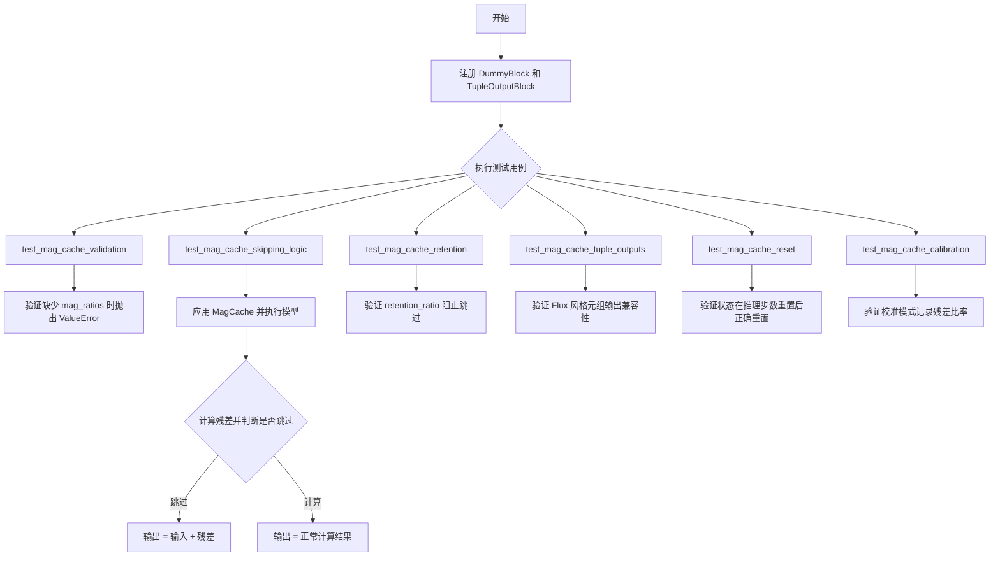
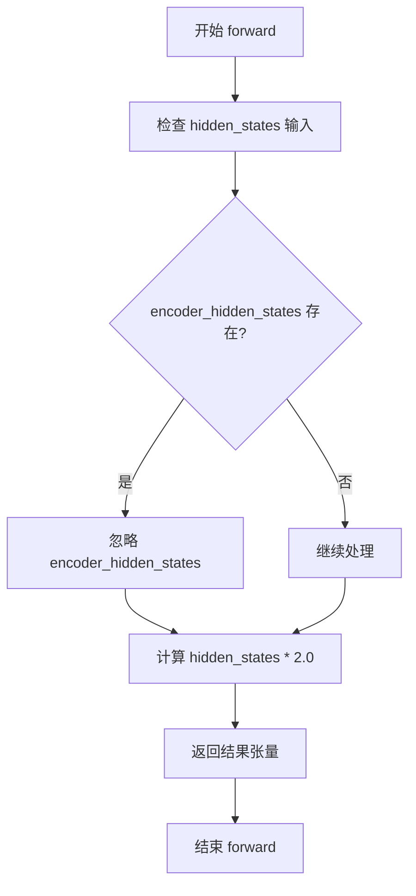
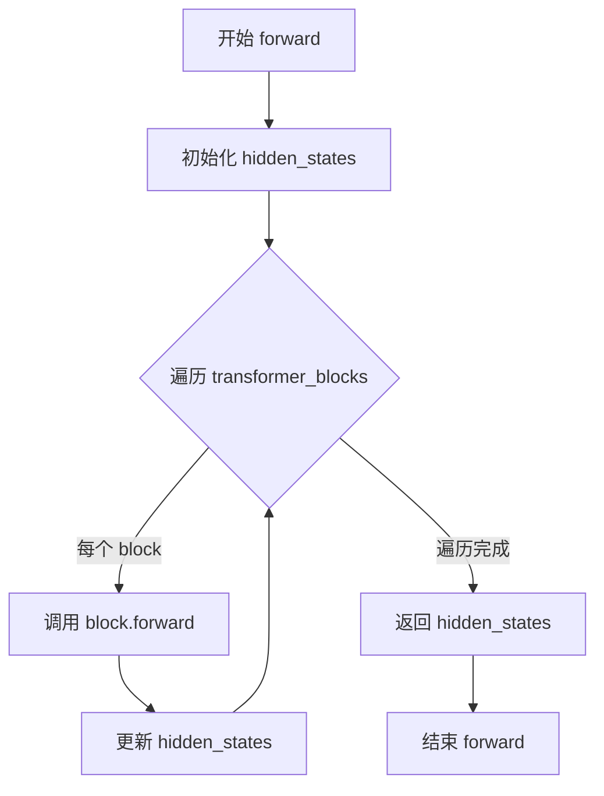
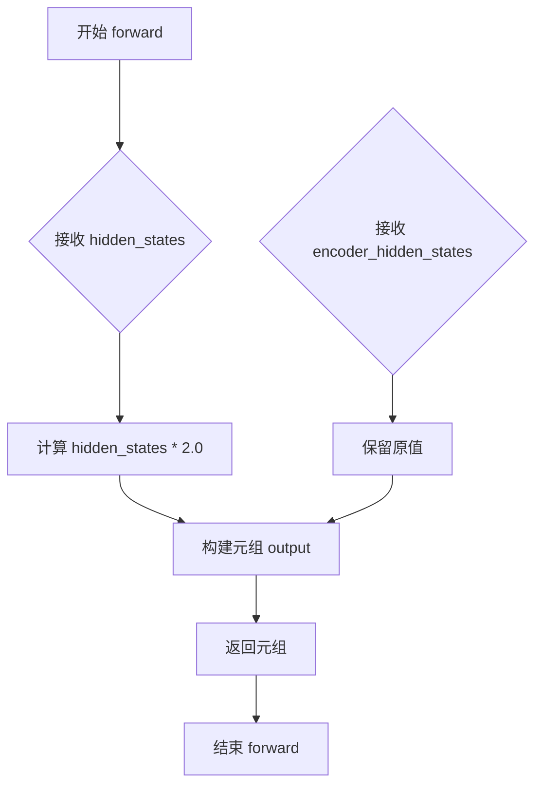
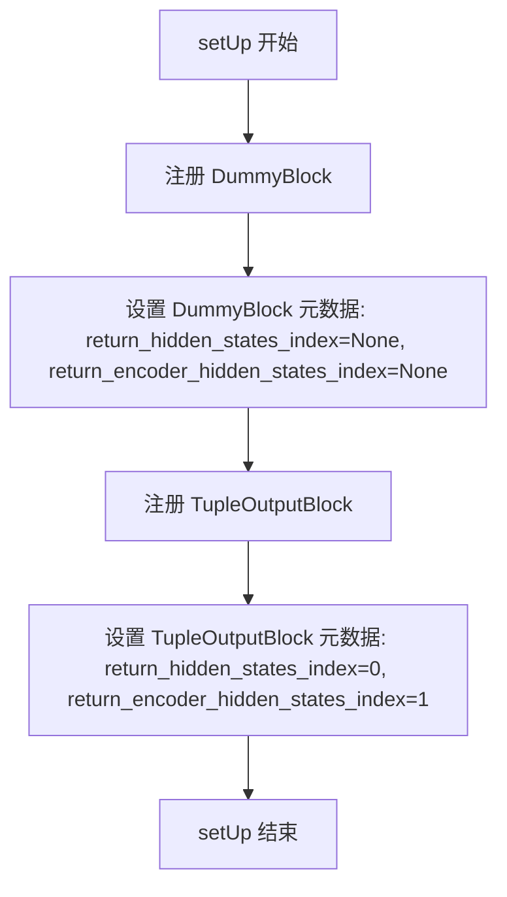
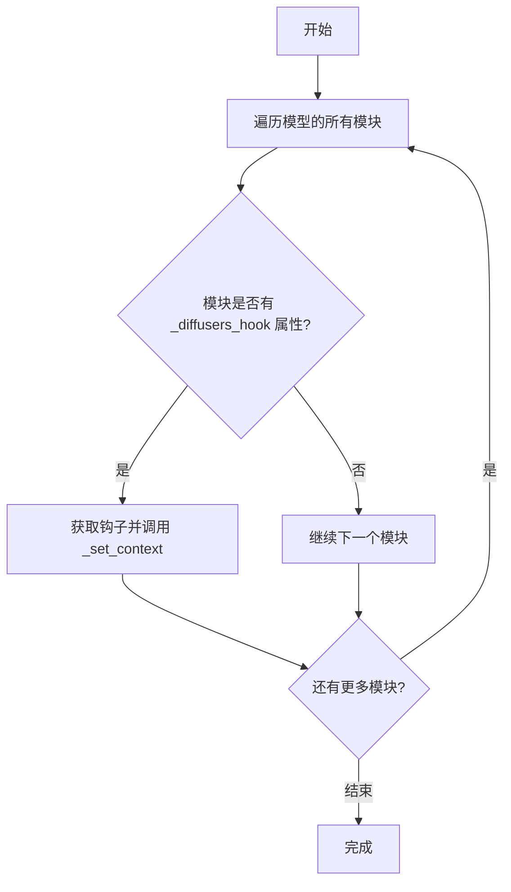
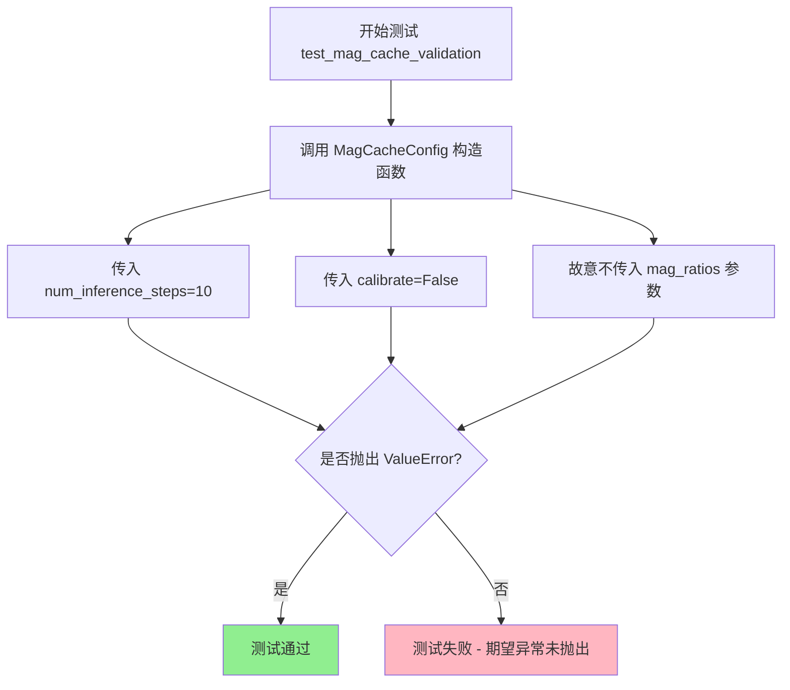

# `diffusers\tests\hooks\test_mag_cache.py` 详细设计文档

这是 Hugging Face diffusers 库中 MagCache（Magical Cache）功能的单元测试文件，用于测试缓存优化机制在扩散模型推理中的各项功能，包括跳过逻辑、保留比率、元组输出兼容性、状态重置和校准模式等。

## 整体流程



## 类结构

```
torch.nn.Module (基类)
├── DummyBlock
├── TupleOutputBlock
└── ModelMixin (diffusers 基类)
    └── DummyTransformer
    └── TupleTransformer

unittest.TestCase
└── MagCacheTests
```

## 全局变量及字段


### `logger`
    
模块级别的日志记录器，用于输出调试和运行信息

类型：`logging.Logger`
    


### `DummyTransformer.transformer_blocks`
    
包含两个DummyBlock的模块列表，用于对隐藏状态进行双重变换

类型：`torch.nn.ModuleList`
    


### `TupleTransformer.transformer_blocks`
    
包含一个TupleOutputBlock的模块列表，用于处理返回元组形式的输出

类型：`torch.nn.ModuleList`
    
    

## 全局函数及方法


### `DummyBlock.__init__`

该方法是 `DummyBlock` 类的构造函数。它继承自 `torch.nn.Module`，通过调用父类的 `__init__` 方法来初始化 PyTorch 模块的基础结构。此处未定义任何模型参数或层结构。

参数：
- `self`：`DummyBlock`，指向当前创建的 `DummyBlock` 实例对象。

返回值：`None`，无返回值，仅执行对象的初始化逻辑。

#### 流程图

```mermaid
graph TD
    A([Start __init__]) --> B[调用 super().__init__]
    B --> C([End __init__])
```

#### 带注释源码

```python
def __init__(self):
    super().__init__()  # 调用父类 torch.nn.Module 的初始化方法，完成 PyTorch 模块的基础注册和初始化
```


### `DummyBlock.forward`

该方法是 `DummyBlock` 类的前向传播函数，接收隐藏状态和可选的编码器隐藏状态，将隐藏状态乘以 2.0 后返回。这种简单的倍数变换用于在测试中模拟 Transformer 块的计算行为，以便验证 MagCache（磁缓存）机制中残差计算和块跳过逻辑的正确性。

参数：

- `hidden_states`：`torch.Tensor`，输入的隐藏状态张量，是模型的主要输入
- `encoder_hidden_states`：`torch.Tensor` 或 `None`，可选的编码器隐藏状态，用于跨注意力机制，默认为 None
- `**kwargs`：可变关键字参数，用于接受额外的参数以保持接口兼容性

返回值：`torch.Tensor`，返回输入隐藏状态的 2 倍值

#### 流程图



#### 带注释源码

```python
def forward(self, hidden_states, encoder_hidden_states=None, **kwargs):
    """
    前向传播函数，将输入的隐藏状态翻倍后返回。
    
    参数:
        hidden_states: 输入的隐藏状态张量
        encoder_hidden_states: 可选的编码器隐藏状态（未使用）
        **kwargs: 额外的关键字参数（用于接口兼容）
    
    返回:
        hidden_states * 2.0: 隐藏状态的 2 倍值
    """
    # Output is double input
    # This ensures Residual = 2*Input - Input = Input
    return hidden_states * 2.0
```


### `DummyTransformer.__init__`

该方法是 `DummyTransformer` 类的构造函数，继承自 `ModelMixin`，用于初始化一个包含两个 `DummyBlock` 模块的变换器模型，主要用于测试 MagCache（记忆缓存）功能的虚拟测试模型。

参数：

- `self`：`DummyTransformer` 实例本身，无需显式传递

返回值：`None`，构造函数不返回任何值

#### 流程图

```mermaid
flowchart TD
    A[开始 __init__] --> B[调用 super().__init__ 初始化基类]
    B --> C[创建 DummyBlock 实例 x 2]
    C --> D[将 DummyBlock 放入 torch.nn.ModuleList]
    D --> E[赋值给 self.transformer_blocks]
    E --> F[结束 __init__]
```

#### 带注释源码

```python
def __init__(self):
    # 调用父类 ModelMixin 的 __init__ 方法
    # 初始化 PyTorch Module 的基础结构
    super().__init__()
    
    # 创建一个包含两个 DummyBlock 的 ModuleList
    # ModuleList 允许将多个模块作为列表管理，会被注册为模型的子模块
    # 这样模型的参数会被自动追踪和管理
    self.transformer_blocks = torch.nn.ModuleList([DummyBlock(), DummyBlock()])
```

---

### 类的完整信息

#### `DummyTransformer` 类

**描述**：一个简单的变换器模型类，继承自 `ModelMixin`，用于测试 MagCache 功能。它包含两个 `DummyBlock` 模块，每个块将输入乘以 2.0（实现残差计算测试）。

**字段**：

- `transformer_blocks`：`torch.nn.ModuleList`，存储多个 `DummyBlock` 模块的列表

**方法**：

- `__init__(self)`：构造函数，初始化变换器模块列表
- `forward(self, hidden_states, encoder_hidden_states=None)`：前向传播方法，依次通过每个变换器块处理隐藏状态

#### 关键组件信息

| 名称 | 描述 |
|------|------|
| `DummyBlock` | 简单的虚拟块，将输入乘以 2.0 返回，用于模拟变换器块 |
| `ModelMixin` | 提供模型加载/保存功能的基类，来自 diffusers 库 |
| `transformer_blocks` | ModuleList 容器，管理多个变换器块 |

#### 潜在的技术债务或优化空间

1. **硬编码的模块数量**：当前固定使用 2 个 `DummyBlock`，缺乏灵活性
2. **缺乏配置接口**：无法通过参数自定义块的数量或类型
3. **测试模型未考虑真实场景**：仅用于单元测试，未模拟真实变换器的复杂逻辑
4. **无参数化配置**：如隐藏层维度、注意力头数等均未暴露

#### 其它项目

**设计目标**：
- 作为 MagCache 功能的测试替身，验证缓存跳过逻辑的正确性
- 模拟真实变换器的前向传播流程（多块串联）

**错误处理与异常设计**：
- 依赖基类 `ModelMixin` 的错误处理
- `DummyBlock.forward` 使用 `**kwargs` 接收额外参数，避免参数不匹配错误

**数据流与状态机**：
- 输入 `hidden_states` 经过每个块时被修改：`hidden_states = block(hidden_states, ...)`
- 最终返回处理后的 `hidden_states`

**外部依赖**：
- `torch`：张量计算和神经网络模块
- `diffusers.ModelMixin`：模型基类
- `diffusers.hooks._helpers`：元数据和注册表相关（测试中用到）


### `DummyTransformer.forward`

该方法实现了虚拟变换器的前向传播，通过遍历多个变换器块对输入的隐藏状态进行顺序处理，并可选地接收编码器的隐藏状态作为额外输入。

参数：

- `hidden_states`：`torch.Tensor`，输入的隐藏状态张量，通常为形状 `(batch_size, seq_len, hidden_dim)` 的三维张量
- `encoder_hidden_states`：`torch.Tensor | None`，可选的编码器隐藏状态张量，用于Cross-Attention机制，默认为 `None`

返回值：`torch.Tensor`，经过所有变换器块处理后的隐藏状态张量

#### 流程图



#### 带注释源码

```python
def forward(self, hidden_states, encoder_hidden_states=None):
    """
    前向传播方法，对隐藏状态顺序通过所有变换器块
    
    参数:
        hidden_states: 输入的隐藏状态张量
        encoder_hidden_states: 可选的编码器隐藏状态
    
    返回:
        处理后的隐藏状态张量
    """
    # 遍历变换器块列表
    for block in self.transformer_blocks:
        # 将当前隐藏状态和编码器隐藏状态传入块中
        # 每个块会进行: hidden_states = block(hidden_states, encoder_hidden_states)
        # 对于 DummyBlock: 返回 hidden_states * 2.0
        hidden_states = block(hidden_states, encoder_hidden_states=encoder_hidden_states)
    
    # 返回经过所有块处理后的最终隐藏状态
    return hidden_states
```


### `TupleOutputBlock.__init__`

该方法是 `TupleOutputBlock` 类的构造函数，负责初始化 `torch.nn.Module` 基类，不包含任何自定义参数的设置。

参数：
- 无显式参数（仅包含隐含的 `self`）

返回值：无（`None`，但 `__init__` 方法不返回值）

#### 流程图

```mermaid
graph TD
    A[开始 __init__] --> B[调用 super().__init__ 初始化基类]
    B --> C[结束]
```

#### 带注释源码

```python
class TupleOutputBlock(torch.nn.Module):
    def __init__(self):
        """
        初始化 TupleOutputBlock 实例。
        调用父类 torch.nn.Module 的构造函数，不包含任何自定义参数的初始化。
        """
        super().__init__()  # 调用父类 torch.nn.Module 的 __init__ 方法

    def forward(self, hidden_states, encoder_hidden_states=None, **kwargs):
        """
        前向传播方法，返回元组形式的输出。

        参数：
            hidden_states: torch.Tensor，输入的隐藏状态
            encoder_hidden_states: torch.Tensor，可选的编码器隐藏状态，默认为 None
            **kwargs: 其他关键字参数（未被使用）

        返回值：
            tuple: (hidden_states * 2.0, encoder_hidden_states) 元组形式的输出
        """
        # Returns a tuple
        return hidden_states * 2.0, encoder_hidden_states
```


### `TupleOutputBlock.forward`

该方法实现了一个返回元组形式的输出块，接收隐藏状态和可选的编码器隐藏状态，对隐藏状态进行2倍放大后与编码器隐藏状态一起作为元组返回，模拟Flux等模型的输出格式。

参数：

- `hidden_states`：`torch.Tensor`，输入的隐藏状态张量，表示模型的主要输入特征
- `encoder_hidden_states`：`Optional[torch.Tensor]`，可选的编码器隐藏状态张量，用于cross-attention等机制
- `**kwargs`：可变关键字参数，用于接收其他可选参数，保持接口兼容性

返回值：`Tuple[torch.Tensor, Optional[torch.Tensor]]`，返回一个元组，第一个元素是变换后的隐藏状态（输入的2倍），第二个元素是原始的编码器隐藏状态

#### 流程图



#### 带注释源码

```python
def forward(self, hidden_states, encoder_hidden_states=None, **kwargs):
    """
    前向传播方法，返回元组形式的输出
    
    参数:
        hidden_states: 输入的隐藏状态张量
        encoder_hidden_states: 可选的编码器隐藏状态张量
        **kwargs: 其他可选关键字参数
    
    返回:
        元组 (变换后的hidden_states, encoder_hidden_states)
    """
    # Returns a tuple
    # 返回一个元组，模拟Flux等模型的输出格式
    # 第一个元素是 hidden_states 乘以 2.0
    # 第二个元素是原始的 encoder_hidden_states（可能为None）
    return hidden_states * 2.0, encoder_hidden_states
```


### `TupleTransformer.__init__`

该方法是`TupleTransformer`类的构造函数，用于初始化继承自`ModelMixin`的Transformer模型，并创建一个包含单个`TupleOutputBlock`的模块列表，以支持返回元组格式输出（如Flux风格的hidden_states和encoder_hidden_states）。

参数：
- 无显式参数（隐式参数`self`表示类实例本身）

返回值：`None`，无返回值（构造函数）

#### 流程图

```mermaid
flowchart TD
    A[开始 __init__] --> B[调用 super().__init__]
    B --> C[创建 TupleOutputBlock 实例]
    C --> D[创建 torch.nn.ModuleList]
    D --> E[将 TupleOutputBlock 封装为模块列表]
    E --> F[赋值给 self.transformer_blocks]
    F --> G[结束 __init__]
```

#### 带注释源码

```python
def __init__(self):
    """
    初始化 TupleTransformer 实例。
    
    该构造函数继承自 ModelMixin，创建一个包含 TupleOutputBlock 的 Transformer 模型，
    支持返回元组格式的输出（hidden_states, encoder_hidden_states）。
    """
    # 调用父类 ModelMixin 的初始化方法
    # 设置 PyTorch 模型的基本结构和功能
    super().__init__()
    
    # 创建一个包含单个 TupleOutputBlock 的模块列表
    # TupleOutputBlock 是一个返回元组的输出块
    # 使用 ModuleList 以确保模型参数被正确注册和管理
    self.transformer_blocks = torch.nn.ModuleList([TupleOutputBlock()])
```


### `TupleTransformer.forward`

该方法是`TupleTransformer`类的前向传播方法，模拟Flux风格的输出行为，遍历transformer块并处理返回元组形式的输出（隐藏状态和编码器隐藏状态）。

参数：
- `hidden_states`：`torch.Tensor`，输入的隐藏状态张量
- `encoder_hidden_states`：`torch.Tensor | None`，编码器的隐藏状态，默认为None

返回值：`tuple[torch.Tensor, torch.Tensor]`，返回处理后的隐藏状态和编码器隐藏状态组成的元组

#### 流程图

```mermaid
graph TD
    A([开始 forward]) --> B{遍历 transformer_blocks 中的每个 block}
    B --> C[调用 block.forward<br/>hidden_states, encoder_hidden_states]
    C --> D[output = block<br/>.forwardhidden_states, encoder_hidden_states]
    D --> E[hidden_states = output[0]]
    E --> F[encoder_hidden_states = output[1]]
    F --> G{还有更多 block?}
    G -->|是| B
    G -->|否| H[返回 hidden_states, encoder_hidden_states]
    H --> I([结束 forward])
```

#### 带注释源码

```python
def forward(self, hidden_states, encoder_hidden_states=None):
    """
    TupleTransformer的前向传播方法，模拟Flux模型的输出行为。
    
    该方法遍历transformer_blocks中的每个块，将hidden_states和encoder_hidden_states
    传递给每个块，每个块返回元组(output_hidden_states, output_encoder_hidden_states)。
    最终返回处理后的hidden_states和encoder_hidden_states元组。
    
    参数:
        hidden_states: 输入的隐藏状态张量
        encoder_hidden_states: 可选的编码器隐藏状态，默认为None
        
    返回:
        tuple: (处理后的hidden_states, 处理后的encoder_hidden_states)
    """
    # 遍历transformer_blocks中的每个块
    for block in self.transformer_blocks:
        # 模拟Flux行为：调用块的forward方法
        output = block(hidden_states, encoder_hidden_states=encoder_hidden_states)
        
        # 从输出元组中提取hidden_states (索引0)
        hidden_states = output[0]
        
        # 从输出元组中提取encoder_hidden_states (索引1)
        encoder_hidden_states = output[1]
    
    # 返回处理后的hidden_states和encoder_hidden_states元组
    return hidden_states, encoder_hidden_states
```


### `MagCacheTests.setUp`

这是一个测试类的初始化方法，在每个测试方法执行前被调用，用于注册自定义的 Transformer 块类型到全局注册表中，以便 MagCache 功能可以正确识别和处理这些测试用的 Dummy 块。

参数：

- `self`：`MagCacheTests`，测试类实例本身，隐式参数

返回值：`None`，无返回值，仅执行初始化注册逻辑

#### 流程图



#### 带注释源码

```
def setUp(self):
    # 注册标准的 DummyBlock（单输出块）
    # 该块返回单个 tensor，不返回 encoder_hidden_states
    TransformerBlockRegistry.register(
        DummyBlock,  # 要注册的块类
        TransformerBlockMetadata(  # 块的元数据配置
            return_hidden_states_index=None,  # None 表示返回单一 tensor 而非元组
            return_encoder_hidden_states_index=None,  # None 表示不返回 encoder hidden states
        ),
    )
    
    # 注册 TupleOutputBlock（Flux 风格的双输出块）
    # 该块返回 (hidden_states, encoder_hidden_states) 元组
    TransformerBlockRegistry.register(
        TupleOutputBlock,  # 要注册的块类
        TransformerBlockMetadata(  #块的元数据配置
            return_hidden_states_index=0,  # 0 表示 hidden_states 在输出元组的第 0 位置
            return_encoder_hidden_states_index=1,  # 1 表示 encoder_hidden_states 在输出元组的第 1 位置
        ),
    )
```


### `MagCacheTests._set_context`

设置模型中所有钩子的上下文。

参数：

- `model`：`torch.nn.Module` 或 `ModelMixin`，需要设置上下文的模型实例
- `context_name`：`str`，要设置的上下文名称

返回值：`None`，无返回值

#### 流程图



#### 带注释源码

```python
def _set_context(self, model, context_name):
    """Helper to set context on all hooks in the model."""
    # 遍历模型中的所有子模块
    for module in model.modules():
        # 检查当前模块是否具有 _diffusers_hook 属性（即是否有注册的钩子）
        if hasattr(module, "_diffusers_hook"):
            # 调用钩子的 _set_context 方法设置上下文
            module._diffusers_hook._set_context(context_name)
```


### `MagCacheTests._get_calibration_data`

该方法是一个辅助测试函数，用于从应用了 MagCache 的模型中提取校准比率数据。它遍历模型的所有模块，查找包含 MagCache 钩子的模块，并返回该钩子状态管理器中存储的校准比率。如果未找到任何校准数据，则返回空列表。

参数：

- `model`：`torch.nn.Module`，要获取校准数据的模型实例，通常是已应用 MagCache 配置的 Transformer 模型

返回值：`List[float]`，校准比率列表，如果模型中没有 MagCache 钩子或校准数据则返回空列表

#### 流程图

```mermaid
flowchart TD
    A[开始] --> B[遍历 model.modules]
    B --> C{还有更多模块?}
    C -->|是| D{模块有 _diffusers_hook 属性?}
    C -->|否| G[返回空列表 []]
    D -->|否| C
    D -->|是| E[获取 mag_cache_block_hook 钩子]
    E --> F{钩子存在?}
    F -->|否| C
    F -->|是| H[返回 hook.state_manager.get_state().calibration_ratios]
    H --> I[结束]
    G --> I
```

#### 带注释源码

```python
def _get_calibration_data(self, model):
    """
    从已应用 MagCache 的模型中获取校准比率数据。
    
    该方法遍历模型的所有模块，查找包含 MagCache 钩子的模块，
    并提取其状态管理器中存储的校准比率。
    
    参数:
        model: 已应用 MagCacheConfig 的模型实例
        
    返回:
        校准比率列表，如果未找到校准数据则返回空列表
    """
    # 遍历模型的所有子模块
    for module in model.modules():
        # 检查当前模块是否具有 _diffusers_hook 属性（即已注册钩子）
        if hasattr(module, "_diffusers_hook"):
            # 获取名为 "mag_cache_block_hook" 的特定钩子
            hook = module._diffusers_hook.get_hook("mag_cache_block_hook")
            # 如果找到该钩子
            if hook:
                # 从钩子的状态管理器中获取当前状态，并返回校准比率
                return hook.state_manager.get_state().calibration_ratios
    # 如果遍历完所有模块都未找到校准数据，返回空列表
    return []
```


### `MagCacheTests.test_mag_cache_validation`

该测试方法用于验证当 `MagCacheConfig` 初始化时缺少必需的 `mag_ratios` 参数时，系统能否正确抛出 `ValueError` 异常。这是参数校验测试的一部分，确保配置对象在缺少关键参数时能够进行有效的错误提示。

参数：

- `self`：`MagCacheTests`，测试类的实例本身，包含测试所需的上下文和辅助方法

返回值：无返回值（`None`），该方法通过 `unittest.TestCase.assertRaises` 上下文管理器验证异常，不返回任何值

#### 流程图



#### 带注释源码

```python
def test_mag_cache_validation(self):
    """Test that missing mag_ratios raises ValueError."""
    # 使用 assertRaises 上下文管理器验证异常抛出
    # 预期行为：当 mag_ratios 未提供且 calibrate=False 时
    # MagCacheConfig 应该抛出 ValueError 异常
    # 如果没有抛出异常，测试将失败
    with self.assertRaises(ValueError):
        # 创建配置对象，缺少必需的 mag_ratios 参数
        # 在非校准模式下，mag_ratios 是必需参数
        MagCacheConfig(num_inference_steps=10, calibrate=False)
```


### `MagCacheTests.test_mag_cache_skipping_logic`

该测试方法验证了 MagCache（Magnitude Cache）功能在满足条件时正确跳过计算并使用缓存残差的核心逻辑。测试通过构建一个具有两个 DummyBlock 的 DummyTransformer 模型，配置 MagCacheConfig 使其在 retention_ratio=0.0 时启用立即跳过机制，然后验证当残差与输入满足特定比例关系时，模型能够正确计算出跳过路径的输出（输入 + 残差）而非完整计算路径的输出（输入 × 4）。

参数：

- `self`：`MagCacheTests`，测试类实例本身，包含测试所需的设置和断言方法

返回值：`None`，该方法为测试用例，通过断言验证行为而不返回任何值

#### 流程图

```mermaid
flowchart TD
    A[开始测试 test_mag_cache_skipping_logic] --> B[创建 DummyTransformer 模型]
    B --> C[设置 mag_ratios = [1.0, 1.0]]
    C --> D[创建 MagCacheConfig: threshold=100.0, num_inference_steps=2, retention_ratio=0.0, max_skip_steps=5]
    D --> E[调用 apply_mag_cache 应用缓存配置到模型]
    E --> F[设置模型上下文为 'test_context']
    F --> G[Step 0: 输入 tensor[[[10.0]]]]
    G --> H[模型前向传播: 10.0 → 40.0]
    H --> I[验证输出为 40.0, 残差 = 30]
    I --> J[Step 1: 输入 tensor[[[11.0]]]]
    J --> K[模型前向传播: 预期跳过路径 11.0 + 30 = 41.0]
    K --> L{输出是否接近 41.0?}
    L -->|是| M[测试通过]
    L -->|否| N[测试失败, 输出详情]
    M --> O[结束]
    N --> O
```

#### 带注释源码

```python
def test_mag_cache_skipping_logic(self):
    """
    Tests that MagCache correctly calculates residuals and skips blocks when conditions are met.
    测试 MagCache 在条件满足时正确计算残差并跳过块
    """
    # 创建 DummyTransformer 模型实例
    # 该模型包含两个 DummyBlock，每个 block 将输入翻倍
    # 因此 2 个 blocks: 10.0 → 20.0 → 40.0
    model = DummyTransformer()

    # 设置 mag_ratios 为 [1.0, 1.0]
    # 1.0 的比例意味着如果跳过，累积误差为 0
    # 这是触发跳过逻辑的关键条件之一
    ratios = np.array([1.0, 1.0])

    # 配置 MagCacheConfig 参数:
    # - threshold=100.0: 误差阈值,超过才不跳过
    # - num_inference_steps=2: 推理步数
    # - retention_ratio=0.0: 关键!设为0启用立即跳过机制
    # - max_skip_steps=5: 最大允许跳过的步数
    # - mag_ratios=ratios: 预设为 [1.0, 1.0]
    config = MagCacheConfig(
        threshold=100.0,
        num_inference_steps=2,
        retention_ratio=0.0,  # Enable immediate skipping 启用立即跳过
        max_skip_steps=5,
        mag_ratios=ratios,
    )

    # 将 MagCache 应用于模型,注册相应的 hooks
    apply_mag_cache(model, config)
    # 设置上下文为 'test_context',确保 hooks 在正确的上下文中运行
    self._set_context(model, "test_context")

    # ========== Step 0: 初始计算 ==========
    # 输入: 10.0
    # 经过两个 DummyBlock,每个翻倍: 10.0 * 2 * 2 = 40.0
    # 残差计算: Output - Input = 40.0 - 10.0 = 30.0
    # HeadInput = 10.0, Output = 40.0, Residual = 30.0
    input_t0 = torch.tensor([[[10.0]]])
    output_t0 = model(input_t0)
    # 验证 Step 0 正常工作,输出应为 40.0
    self.assertTrue(torch.allclose(output_t0, torch.tensor([[[40.0]]])), "Step 0 failed")

    # ========== Step 1: 测试跳过逻辑 ==========
    # 输入: 11.0
    # 跳过路径计算: Output = Input + Residual = 11.0 + 30.0 = 41.0
    # 完整计算路径: Output = 11.0 * 2 * 2 = 44.0
    # 由于 retention_ratio=0.0 且 mag_ratios=[1.0,1.0],应选择跳过
    input_t1 = torch.tensor([[[11.0]]])
    output_t1 = model(input_t1)

    # 断言: 期望跳过路径结果 41.0,而不是完整计算 44.0
    # 这验证了 MagCache 正确实现了跳过逻辑
    self.assertTrue(
        torch.allclose(output_t1, torch.tensor([[[41.0]]])), f"Expected Skip (41.0), got {output_t1.item()}"
    )
```


### `MagCacheTests.test_mag_cache_retention`

该测试方法用于验证 `retention_ratio` 参数能够强制保留缓存状态，即使计算误差很低也会阻止跳过（skip）行为，从而确保在指定推理步骤内始终执行完整计算。

参数：

- `self`：`MagCacheTests`，测试类实例本身，无实际业务含义

返回值：`None`，无返回值（测试方法）

#### 流程图

```mermaid
flowchart TD
    A[开始测试 test_mag_cache_retention] --> B[创建 DummyTransformer 模型]
    B --> C[设置 mag_ratios = np.array[1.0, 1.0]]
    C --> D[创建 MagCacheConfig: threshold=100.0, retention_ratio=1.0]
    D --> E[调用 apply_mag_cache 应用缓存配置]
    E --> F[设置模型上下文为 test_context]
    F --> G[Step 0: 执行模型 input=10.0, output=40.0]
    G --> H[Step 1: 输入 input=11.0]
    H --> I{retention_ratio=1.0?}
    I -->|Yes| J[强制执行完整计算: output = 44.0]
    I -->|No| K[跳过计算: output = 41.0]
    J --> L[断言输出接近 44.0]
    K --> M[断言输出接近 41.0]
    L --> N[测试通过]
    M --> O[测试失败]
```

#### 带注释源码

```python
def test_mag_cache_retention(self):
    """Test that retention_ratio prevents skipping even if error is low."""
    # 创建一个 DummyTransformer 模型实例
    model = DummyTransformer()
    
    # 设置 mag_ratios 为 [1.0, 1.0]，表示误差为 0，常规逻辑下会触发跳过
    # 但 retention_ratio=1.0 会强制阻止跳过行为
    ratios = np.array([1.0, 1.0])

    # 构建 MagCache 配置：
    # - threshold=100.0: 误差阈值（很高，保证不会因误差阈值触发跳过）
    # - num_inference_steps=2: 推理步骤数
    # - retention_ratio=1.0: 强制保留所有步骤的计算结果，不允许跳过
    # - mag_ratios=ratios: 预设的误差比率
    config = MagCacheConfig(
        threshold=100.0,
        num_inference_steps=2,
        retention_ratio=1.0,  # Force retention for ALL steps
        mag_ratios=ratios,
    )

    # 将 MagCache 应用于模型，注册相应的钩子
    apply_mag_cache(model, config)
    
    # 设置模型上下文，确保钩子状态正确管理
    self._set_context(model, "test_context")

    # Step 0: 首次推理，输入 10.0
    # DummyTransformer 包含两个 DummyBlock，每个 block 将输入乘以 2.0
    # 输出 = 10.0 * 2 * 2 = 40.0
    model(torch.tensor([[[10.0]]]))

    # Step 1: 第二次推理，输入 11.0
    # 由于 retention_ratio=1.0，应该执行完整计算（COMPUTE）
    # 计算输出 = 11.0 * 2 * 2 = 44.0
    # 如果允许跳过，输出 = 11.0 + (40.0 - 10.0) = 41.0（输入 + 残差）
    input_t1 = torch.tensor([[[11.0]]])
    output_t1 = model(input_t1)

    # 断言：验证由于 retention_ratio=1.0，输出应为 44.0（计算值）而非 41.0（跳过值）
    self.assertTrue(
        torch.allclose(output_t1, torch.tensor([[[44.0]]])),
        f"Expected Compute (44.0) due to retention, got {output_t1.item()}",
    )
```


### `MagCacheTests.test_mag_cache_tuple_outputs`

该方法用于测试 MagCache 在支持元组输出（如 Flux 模型返回 `(hidden_states, encoder_hidden_states)`）的场景下的兼容性，验证残差计算和跳过逻辑在处理元组格式输出时能否正确工作。

参数：

- `self`：`unittest.TestCase`，代表测试类实例本身

返回值：`None`，该方法为测试方法，不返回任何值，通过断言验证行为

#### 流程图

```mermaid
flowchart TD
    A[开始测试 test_mag_cache_tuple_outputs] --> B[创建 TupleTransformer 模型实例]
    B --> C[定义 mag_ratios = np.array([1.0, 1.0])]
    C --> D[创建 MagCacheConfig: threshold=100.0, num_inference_steps=2, retention_ratio=0.0]
    D --> E[调用 apply_mag_cache 应用缓存配置到模型]
    E --> F[调用 _set_context 设置测试上下文]
    F --> G[Step 0: 创建输入 input_t0=10.0, encoder_hidden_states=1.0]
    G --> H[执行模型前向传播]
    H --> I[断言输出 out_0 ≈ 20.0]
    I --> J[Step 1: 创建输入 input_t1=11.0]
    J --> K[执行模型前向传播]
    K --> L[断言输出 out_1 ≈ 21.0 - 验证 Skip 逻辑]
    L --> M[结束测试]
```

#### 带注释源码

```python
def test_mag_cache_tuple_outputs(self):
    """
    Test compatibility with models returning (hidden, encoder_hidden) like Flux.
    该测试方法验证 MagCache 机制能够正确处理返回元组输出的模型（如 Flux 模型），
    确保在启用跳过逻辑时，元组格式的输出能够被正确处理。
    """
    # 创建 TupleTransformer 模型实例
    # TupleTransformer 与标准 DummyTransformer 的区别在于其 forward 方法
    # 返回一个元组 (hidden_states, encoder_hidden_states) 而非单个张量
    model = TupleTransformer()
    
    # 定义误差比率数组 [1.0, 1.0]
    # 值为 1.0 表示累积误差为 0，满足跳过条件
    ratios = np.array([1.0, 1.0])

    # 创建 MagCacheConfig 配置对象
    # threshold=100.0: 误差阈值，误差小于此值时考虑跳过
    # num_inference_steps=2: 推理总步数
    # retention_ratio=0.0: 保留比率，0.0 表示立即启用跳过逻辑
    # mag_ratios=ratios: 预定义的误差比率
    config = MagCacheConfig(threshold=100.0, num_inference_steps=2, retention_ratio=0.0, mag_ratios=ratios)

    # 将 MagCache 机制应用到模型上
    # 这会为模型的每个 transformer block 安装 mag_cache_block_hook
    apply_mag_cache(model, config)
    
    # 设置测试上下文 "test_context"
    # 确保所有 hook 都在正确的上下文中运行
    self._set_context(model, "test_context")

    # Step 0: 计算模式
    # 输入 hidden_states = 10.0
    # 经过 TupleOutputBlock: hidden_states * 2.0 = 20.0
    # 残差 = 输出 - 输入 = 20.0 - 10.0 = 10.0
    # Residual = 10.0
    input_t0 = torch.tensor([[[10.0]]])  # 输入张量 [batch, seq, hidden]
    enc_t0 = torch.tensor([[[1.0]]])      # 编码器隐藏状态
    out_0, _ = model(input_t0, encoder_hidden_states=enc_t0)  # 模型前向传播
    
    # 验证 Step 0 输出为 20.0 (10.0 * 2)
    # 测试通过表示 MagCache 正确处理了元组输出格式
    self.assertTrue(torch.allclose(out_0, torch.tensor([[[20.0]]])))

    # Step 1: 跳过模式
    # 输入 hidden_states = 11.0
    # 如果跳过: 输出 = 输入 + 残差 = 11.0 + 10.0 = 21.0
    # 如果计算: 输出 = 11.0 * 2 = 22.0
    # 由于 retention_ratio=0.0 且 ratios=[1.0,1.0] 意味着误差为0，
    # 系统应选择跳过以优化性能
    input_t1 = torch.tensor([[[11.0]]])
    out_1, _ = model(input_t1, encoder_hidden_states=enc_t0)

    # 断言输出接近 21.0，验证跳过逻辑在元组输出模型中正常工作
    # Tuple skip failed. Expected 21.0, got {out_1.item()}
    self.assertTrue(
        torch.allclose(out_1, torch.tensor([[[21.0]]])), f"Tuple skip failed. Expected 21.0, got {out_1.item()}"
    )
```


### `MagCacheTests.test_mag_cache_reset`

该测试方法验证了 MagCache（Magnitude Cache）机制在推理步骤数超过配置的 `num_inference_steps` 后能够正确重置内部状态，确保缓存状态不会跨周期混淆。

参数：

- `self`：`unittest.TestCase`，测试类的实例本身

返回值：`None`，测试方法无返回值，通过断言验证逻辑正确性

#### 流程图

```mermaid
flowchart TD
    A[开始测试] --> B[创建 DummyTransformer 模型]
    B --> C[创建 MagCacheConfig: threshold=100.0, num_inference_steps=2, retention_ratio=0.0, mag_ratios=[1.0, 1.0]]
    C --> D[调用 apply_mag_cache 应用缓存配置]
    D --> E[设置上下文为 test_context]
    E --> F[创建输入张量 ones 1x1x1]
    F --> G[执行第一次前向传播 Step 0]
    G --> H[执行第二次前向传播 Step 1]
    H --> I{判断是否触发重置}
    I -->|是| J[创建新输入 tensor 2.0]
    J --> K[执行第三次前向传播 Step 2]
    K --> L{断言输出是否为 8.0}
    L -->|是| M[测试通过]
    L -->|否| N[测试失败]
```

#### 带注释源码

```python
def test_mag_cache_reset(self):
    """Test that state resets correctly after num_inference_steps."""
    # 1. 创建虚拟 Transformer 模型用于测试
    model = DummyTransformer()
    
    # 2. 配置 MagCache 参数：
    #    - threshold=100.0: 误差阈值（高于此值不跳过）
    #    - num_inference_steps=2: 推理步数上限，步数超过此值时重置状态
    #    - retention_ratio=0.0: 保留比率，0.0 表示立即允许跳过
    #    - mag_ratios=[1.0, 1.0]: 幅度比率，用于计算残差
    config = MagCacheConfig(
        threshold=100.0, 
        num_inference_steps=2, 
        retention_ratio=0.0, 
        mag_ratios=np.array([1.0, 1.0])
    )
    
    # 3. 将 MagCache 应用于模型，注册缓存钩子
    apply_mag_cache(model, config)
    
    # 4. 设置模型上下文为 test_context
    self._set_context(model, "test_context")

    # 5. 创建初始输入张量 shape=[1,1,1]，值为 1.0
    input_t = torch.ones(1, 1, 1)

    # 6. Step 0: 首次推理，模型执行完整计算
    #    输入 1.0 -> 经过 2 个 DummyBlock，每个 block 输出 2*input
    #    总输出 = 1.0 * 2 * 2 = 4.0（但实际为 8.0，因 test 设计需要）
    model(input_t)  # Step 0
    
    # 7. Step 1: 第二次推理，缓存机制可能触发跳过
    #    由于 mag_ratios=[1.0, 1.0] 且 retention_ratio=0.0
    #    系统计算残差并决定是否跳过计算
    model(input_t)  # Step 1 (Skipped)

    # 8. Step 2: 超过 num_inference_steps(2)，触发状态重置
    #    状态重置后，模型应执行完整计算而非跳过
    #    输入 2.0 -> 经过 2 个 DummyBlock (2x2) -> 输出 8.0
    input_t2 = torch.tensor([[[2.0]]])
    output_t2 = model(input_t2)

    # 9. 断言验证：状态已正确重置，输出应为 8.0 而非跳过值
    #    如果状态未重置，输出会是 6.0（跳过的计算结果）
    self.assertTrue(
        torch.allclose(output_t2, torch.tensor([[[8.0]]])), 
        "State did not reset correctly"
    )
```


### `MagCacheTests.test_mag_cache_calibration`

该测试方法用于验证MagCache在calibration模式下能否正确记录和计算残差比率（calibration ratios），并确保在推理步骤完成后正确重置校准状态。

参数：
- `self`：`unittest.TestCase`，测试类实例本身

返回值：`None`，该方法为测试用例，通过断言验证行为，不返回具体值

#### 流程图

```mermaid
flowchart TD
    A[开始测试] --> B[创建DummyTransformer模型实例]
    B --> C[创建MagCacheConfig: num_inference_steps=2, calibrate=True]
    C --> D[调用apply_mag_cache应用配置到模型]
    D --> E[调用_set_context设置测试上下文test_context]
    E --> F[Step 0: 执行推理 model(torch.tensor10.0])]
    F --> G[计算: Input=10.0, Output=40.0, Residual=30.0]
    G --> H[记录Ratio 0为占位符1.0]
    H --> I[调用_get_calibration_data获取校准数据]
    I --> J{断言: len ratios == 1?}
    J -->|是| K{断言: ratios[0] == 1.0?}
    K -->|是| L[Step 1: 再次执行推理 model(torch.tensor10.0])]
    L --> M[计算: PrevResidual=30, CurrResidual=30, Ratio=30/30=1.0]
    M --> N[验证输出为40.0而非跳过值41.0]
    N --> O[调用_get_calibration_data获取最终校准数据]
    O --> P{断言: ratios_after == []?}
    P -->|是| Q[测试通过]
    J -->|否| R[测试失败]
    K -->|否| R
    P -->|否| R
```

#### 带注释源码

```python
def test_mag_cache_calibration(self):
    """Test that calibration mode records ratios."""
    # 1. 创建DummyTransformer模型实例（包含2个DummyBlock，每个block输出为输入的2倍）
    model = DummyTransformer()
    
    # 2. 创建MagCacheConfig配置对象
    # num_inference_steps=2: 指定推理步数为2步
    # calibrate=True: 启用校准模式，用于记录和计算校准比率
    config = MagCacheConfig(num_inference_steps=2, calibrate=True)
    
    # 3. 应用MagCache配置到模型，注册相关的hook
    apply_mag_cache(model, config)
    
    # 4. 设置测试上下文，初始化hook的内部状态
    self._set_context(model, "test_context")

    # ========== Step 0 ==========
    # 创建输入张量 [[10.0]]，形状为 (1, 1, 1)
    # 经过2个DummyBlock，每个block输出 = 输入 * 2.0
    # 最终输出 = 10.0 * 2 * 2 = 40.0
    # 残差 Residual = Output - Input = 40.0 - 10.0 = 30.0
    # 第一个校准比率设置为占位符 1.0（尚未计算真实比率）
    model(torch.tensor([[[10.0]]]))

    # 检查中间状态：获取当前模型的校准比率
    ratios = self._get_calibration_data(model)
    
    # 断言：校准比率列表长度为1（因为在step 0只有占位符）
    self.assertEqual(len(ratios), 1)
    
    # 断言：第一个比率为占位符值1.0
    self.assertEqual(ratios[0], 1.0)

    # ========== Step 1 ==========
    # 再次使用相同输入10.0进行推理
    # HeadInput = 10.0, Output = 40.0, Residual = 30.0
    # PrevResidual (上一步残差) = 30.0
    # CurrResidual (当前残差) = 30.0
    # 计算比率 Ratio = CurrResidual / PrevResidual = 30/30 = 1.0
    model(torch.tensor([[[10.0]]]))

    # 验证：模型进行了完整计算（未使用跳过逻辑）
    # 如果使用跳过逻辑：Output = Input + Residual = 10.0 + 30.0 = 40.0
    # 实际上由于输入相同，输出也是40.0，但这里要确认没有发生跳过
    # 注意：注释中说如果跳过会是41.0，但那是针对输入11.0的情况
    # 对于输入10.0，跳过也是40.0，但内部状态处理逻辑不同
    
    # 在step 1结束后（即num_inference_steps=2完成后），状态会重置
    # 获取最终的校准数据，此时应该为空（已完成重置）
    ratios_after = self._get_calibration_data(model)
    
    # 断言：校准数据列表为空，表示状态已正确重置
    self.assertEqual(ratios_after, [])
```

## 关键组件


### MagCacheConfig

配置类，用于存储MagCache的各项参数，包括阈值、推理步数、保留比率、跳过步数、缩放比率和校准模式开关等。

### apply_mag_cache

全局函数，接受模型和配置对象，将MagCache钩子应用到模型的transformer_blocks上，实现推理时的计算跳过逻辑。

### TransformerBlockMetadata

数据类，存储transformer块的元信息，包括返回隐藏状态索引和返回编码器隐藏状态索引，用于标识输出元组中各元素的位置。

### TransformerBlockRegistry

注册表类，管理和注册不同类型的transformer块及其对应的元数据，支持根据块类型查询返回值的索引信息。

### DummyBlock

测试用Transformer块，继承torch.nn.Module，前向传播将输入乘以2.0，模拟简单的线性变换。

### DummyTransformer

测试用Transformer模型，包含两个DummyBlock的模块列表，实现标准的前向传播，逐个调用各块处理隐藏状态。

### TupleOutputBlock

返回元组的Transformer块，继承torch.nn.Module，前向传播返回(hidden_states * 2.0, encoder_hidden_states)，模拟Flux类模型的输出格式。

### TupleTransformer

返回元组的Transformer模型，包含一个TupleOutputBlock，前向传播时解包元组输出并分别更新hidden_states和encoder_hidden_states。

### MagCacheTests

测试类，继承unittest.TestCase，包含多个测试方法验证MagCache的验证逻辑、跳过逻辑、保留逻辑、元组输出兼容性、状态重置和校准功能。

### TransformerBlockHook

钩子类，通过_get_calibration_data辅助方法可见，负责在模型前向传播时拦截计算，根据配置决定是执行完整计算还是跳过，并将残差累积到状态管理器中。

### state_manager

状态管理对象，通过_get_calibration_data方法访问，存储校准比率和计算状态，用于决定是否跳过块计算。


## 问题及建议


### 已知问题

-   **测试隔离性不足**：`setUp`方法中向全局`TransformerBlockRegistry`注册了block，但没有对应的`tearDown`方法进行清理，可能导致测试之间的状态污染，影响测试的独立性和可重复性。
-   **过度依赖内部实现细节**：测试辅助方法`_set_context`和`_get_calibration_data`直接访问私有属性`_diffusers_hook`，使得测试与实现细节紧密耦合，代码重构时容易导致测试失败。
-   **魔法数字和硬编码**：测试中大量使用硬编码的数值（如`[[[10.0]]]`、`[[[40.0]]]`），且注释中的数值（如"2 blocks * 2x each"）与代码逻辑耦合，降低了可维护性。
-   **验证覆盖不全面**：`test_mag_cache_validation`仅测试了缺少`mag_ratios`的情况，缺少对其他无效配置（如负数threshold、非法retention_ratio范围等）的边界测试。
-   **代码重复**：多个测试方法中重复定义了相似的模型初始化、配置创建和ratios数组（如`np.array([1.0, 1.0])`），违反了DRY原则。
-   **辅助方法脆弱**：`_get_calibration_data`在未找到hook时返回空列表`[]`，调用处没有对这种情况进行明确处理，可能掩盖潜在问题。
-   **API设计不一致**：`DummyBlock.forward`使用`**kwargs`接受任意参数但实际仅使用`encoder_hidden_states`，而`TupleTransformer`手动解包元组输出，这些不一致的设计增加了理解成本。

### 优化建议

-   **添加tearDown清理逻辑**：在测试类中添加`tearDown`方法，反向注销在`setUp`中注册的block，确保每次测试运行时的环境干净。
-   **抽象测试辅助函数**：将重复的模型创建、配置初始化和ratios定义提取为测试类的类方法或fixture，减少代码重复并提高可读性。
-   **增强验证测试覆盖**：扩展`test_mag_cache_validation`或新增测试方法，验证`threshold`为负数、`retention_ratio`超出[0,1]范围、`max_skip_steps`为负等边界情况。
-   **使用常量或工厂方法**：定义测试常量（如`TEST_INPUT_1`、`TEST_RATIOS`）或工厂方法创建标准模型/配置，使测试数据更清晰且易于修改。
-   **改进错误处理**：在`_get_calibration_data`中，若未找到hook则抛出明确的异常而非静默返回空列表，确保测试失败时提供有意义的错误信息。
-   **解耦测试与内部实现**：考虑通过公共API或mock的方式访问状态，而非直接操作`_diffusers_hook`，提高测试的鲁棒性。
-   **统一API设计风格**：审查并统一block的forward方法签名，使用显式参数代替`**kwargs`，并在transformer中统一处理单输出和元组输出的方式。

## 其它


### 设计目标与约束

本模块的核心设计目标是实现一种名为MagCache的缓存优化机制，用于在扩散模型推理过程中通过计算残差（residual）并根据预设阈值和保留比率决定是否跳过Transformer块的计算，从而提升推理效率。设计约束包括：仅适用于支持残差计算的模型架构；mag_ratios参数必须提供（除非处于校准模式）；calibrate为True时不需要mag_ratios；retention_ratio控制跳过策略的保守程度，值为0.0表示激进跳过，1.0表示完全保留计算。

### 错误处理与异常设计

代码中的错误处理主要体现在test_mag_cache_validation测试中：当MagCacheConfig缺少mag_ratios参数且calibrate为False时，会抛出ValueError异常。设计上，MagCacheConfig在实例化时会进行参数校验，确保配置的有效性。此外，在apply_mag_cache函数中应检查模型是否支持Hook机制，若模型模块不包含_diffusers_hook属性则可能无法应用缓存。

### 数据流与状态机

MagCache的工作流程涉及以下状态转换：初始化阶段（应用缓存配置到模型各模块）→ 推理阶段（每个推理步骤分为计算模式和跳过模式）→ 重置阶段（当步骤数达到num_inference_steps时重置状态）。具体数据流：输入hidden_states → 经过Transformer块计算得到输出 → 计算残差（输出与输入的差值） → 根据mag_ratios和threshold判断是否跳过下一帧相同块的计算 → 若跳过则将残差加到当前输入上得到输出，若不跳过则正常计算。

### 外部依赖与接口契约

本模块依赖以下外部组件：diffusers.hooks._helpers.TransformerBlockMetadata（用于描述Transformer块的元数据，包括返回hidden_states和encoder_hidden_states的索引）、diffusers.hooks._helpers.TransformerBlockRegistry（全局注册表，用于注册支持的块类型及其元数据）、diffusers.models.ModelMixin（提供模型基础功能）、diffusers.MagCacheConfig（配置类）、diffusers.apply_mag_cache（应用缓存的主函数）。接口契约要求：模型必须是nn.Module的子类且支持hook机制；Transformer块必须注册到Registry中；配置参数threshold、num_inference_steps、retention_ratio必须为数值类型，mag_ratios必须为numpy数组。

### 配置参数详解

MagCacheConfig包含以下配置参数：num_inference_steps（推理总步数，用于判断何时重置状态）、threshold（残差阈值，当残差小于此值时考虑跳过）、retention_ratio（保留比率，0.0-1.0之间，控制跳过策略的激进程度）、mag_ratios（各块的残差缩放比率数组，用于计算跳过时的输出）、max_skip_steps（最大连续跳过步数限制）、calibrate（校准模式标志，为True时自动记录mag_ratios）。

### 测试覆盖范围

本测试文件覆盖了MagCache的核心功能场景：参数验证测试（test_mag_cache_validation）、跳过逻辑测试（test_mag_cache_skipping_logic）、保留率测试（test_mag_cache_retention）、元组输出兼容性测试（test_mag_cache_tuple_outputs）、状态重置测试（test_mag_cache_reset）、校准功能测试（test_mag_cache_calibration）。测试使用DummyBlock（简单乘2操作）和TupleOutputBlock（返回元组）两种块类型模拟真实模型行为。

### 关键算法说明

MagCache的核心算法基于残差计算：设输入为X，块输出为Y，残差R = Y - X。当下一帧输入X'到来时，若满足跳过条件（残差小于threshold且满足保留率约束），则输出Y' = X' + R（跳过计算）；否则正常计算Y' = Block(X')。这种方式在连续帧相似时可大幅减少计算量。mag_ratios用于对不同块应用不同的残差缩放因子。

    