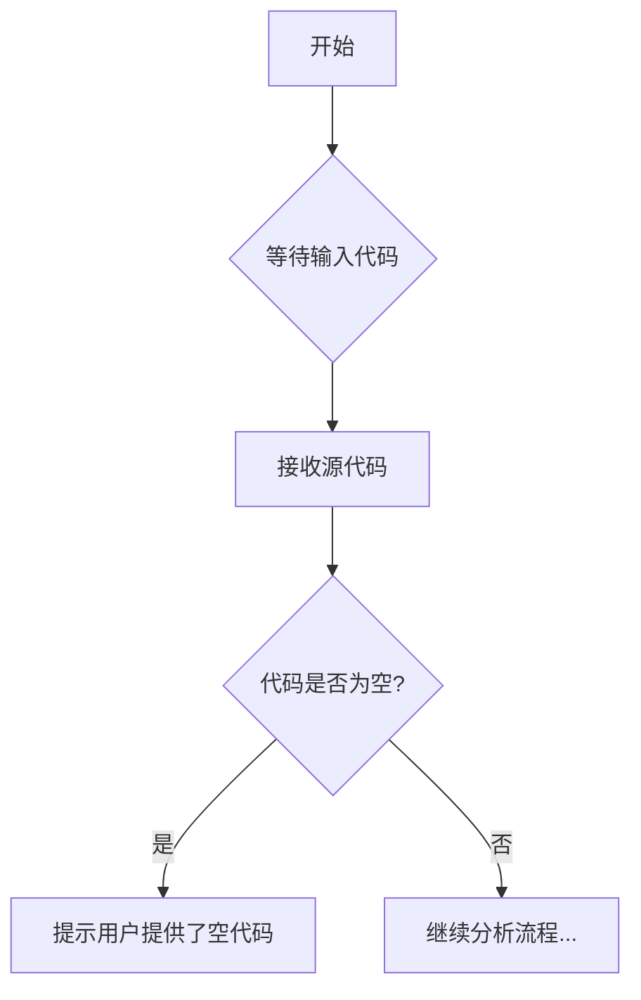

# `diffusers\tests\lora\__init__.py` 详细设计文档

未提供源代码进行分析。请在代码块中提供需要分析的源代码。

## 整体流程



## 类结构

```
无法确定 - 代码为空
```

## 全局变量及字段


    

## 全局函数及方法


## 关键组件


## 问题及建议


### 已知问题

-   未提供代码内容，无法进行分析

### 优化建议

-   请提供需要分析的代码，以便进行技术债务识别和优化建议


## 其它


### 设计目标与约束

（未提供代码，无法填写）

### 错误处理与异常设计

（未提供代码，无法填写）

### 数据流与状态机

（未提供代码，无法填写）

### 外部依赖与接口契约

（未提供代码，无法填写）

### 性能要求与基准

（未提供代码，无法填写）

### 安全性设计

（未提供代码，无法填写）

### 兼容性设计

（未提供代码，无法填写）

### 部署架构

（未提供代码，无法填写）

### 测试策略

（未提供代码，无法填写）

### 配置管理

（未提供代码，无法填写）

### 日志与监控设计

（未提供代码，无法填写）

### 命名规范与代码风格

（未提供代码，无法填写）

### 版本兼容性

（未提供代码，无法填写）

### 容量规划

（未提供代码，无法填写）

### 性能优化建议

（未提供代码，无法填写）


    