# `diffusers\tests\lora\test_lora_layers_auraflow.py` 详细设计文档

这是一个针对AuraFlow模型的LoRA（Low-Rank Adaptation）功能测试文件，用于验证AuraFlowPipeline在集成LoRA权重时的正确性和兼容性，包含模型配置、输入数据准备和推理测试。

## 整体流程

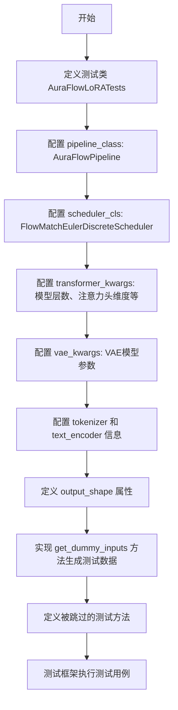

## 类结构

```
unittest.TestCase
└── PeftLoraLoaderMixinTests (通过多重继承)
    └── AuraFlowLoRATests
```

## 全局变量及字段


### `AuraFlowLoRATests.pipeline_class`
    
The pipeline class used for AuraFlow LoRA testing, representing the diffusion model pipeline

类型：`AuraFlowPipeline`
    


### `AuraFlowLoRATests.scheduler_cls`
    
The scheduler class used for flow matching Euler discrete scheduling in the diffusion process

类型：`FlowMatchEulerDiscreteScheduler`
    


### `AuraFlowLoRATests.scheduler_kwargs`
    
Additional keyword arguments for configuring the scheduler, currently an empty dictionary

类型：`dict`
    


### `AuraFlowLoRATests.transformer_kwargs`
    
Configuration dictionary for the AuraFlowTransformer2DModel including sample size, patch size, channels, and attention parameters

类型：`dict`
    


### `AuraFlowLoRATests.transformer_cls`
    
The transformer model class used for 2D image generation in the AuraFlow pipeline

类型：`AuraFlowTransformer2DModel`
    


### `AuraFlowLoRATests.vae_kwargs`
    
Configuration dictionary for the VAE model including sample size, channels, block out channels, and encoding/decoding parameters

类型：`dict`
    


### `AuraFlowLoRATests.tokenizer_cls`
    
The tokenizer class used for converting text prompts into token IDs for the text encoder

类型：`AutoTokenizer`
    


### `AuraFlowLoRATests.tokenizer_id`
    
The HuggingFace model identifier for loading the tokenizer (hf-internal-testing/tiny-random-t5)

类型：`str`
    


### `AuraFlowLoRATests.text_encoder_cls`
    
The text encoder model class (UMT5) used for encoding textual prompts into embeddings

类型：`UMT5EncoderModel`
    


### `AuraFlowLoRATests.text_encoder_id`
    
The HuggingFace model identifier for loading the text encoder (hf-internal-testing/tiny-random-umt5)

类型：`str`
    


### `AuraFlowLoRATests.text_encoder_target_modules`
    
List of module names (q, k, v, o) where LoRA adapters can be applied in the text encoder

类型：`list`
    


### `AuraFlowLoRATests.denoiser_target_modules`
    
List of module names (to_q, to_k, to_v, to_out.0, linear_1) where LoRA adapters can be applied in the denoiser transformer

类型：`list`
    


### `AuraFlowLoRATests.supports_text_encoder_loras`
    
Flag indicating whether the AuraFlow pipeline supports text encoder LoRA adapters (set to False)

类型：`bool`
    


### `AuraFlowLoRATests.output_shape`
    
Property returning the expected output shape of generated images (1, 8, 8, 3)

类型：`property, tuple`
    
    

## 全局函数及方法


### `floats_tensor`

该函数用于生成指定形状的随机浮点数张量，主要用于测试场景中模拟输入数据。

参数：

-  `shape`：`tuple`，张量的形状，例如此处传入 `(batch_size, num_channels) + sizes`

返回值：`torch.Tensor`，包含随机浮点数的 PyTorch 张量

#### 流程图

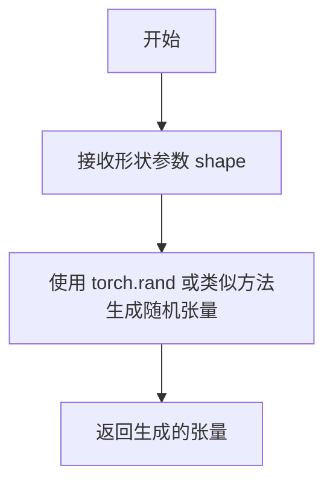

#### 带注释源码

```
# 注意：此函数定义不在当前代码文件中
# 而是从 testing_utils 模块导入
# 根据调用方式推断的函数签名：

def floats_tensor(shape, dtype=None, device=None):
    """
    生成指定形状的随机浮点数张量。
    
    参数：
        shape: 张量的形状元组
        dtype: 张量的数据类型，默认为 torch.float32
        device: 张量所在的设备，默认为 cpu
    
    返回值：
        随机浮点数张量
    """
    # 实际实现可能使用 torch.randn 或 torch.rand
    # 例如：return torch.randn(*shape, dtype=dtype, device=device)
```

---

**注意**：由于 `floats_tensor` 函数定义在 `..testing_utils` 模块中（代码中通过 `from ..testing_utils import floats_tensor` 导入），而该模块的具体实现未在当前代码片段中提供，因此无法获取其完整的源代码。上面的信息是基于该函数在 `get_dummy_inputs` 方法中的使用方式推断得出的：

```python
noise = floats_tensor((batch_size, num_channels) + sizes)
```


### `is_peft_available`

该函数用于检测 PEFT（Parameter-Efficient Fine-Tuning）库是否已安装并可用，通常用于条件导入或功能特性检测。

参数： 无

返回值：`bool`，如果 PEFT 库可用返回 `True`，否则返回 `False`

#### 流程图

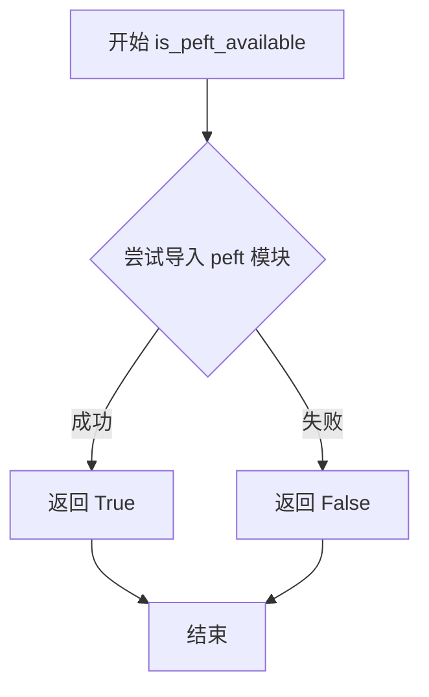

#### 带注释源码

```python
def is_peft_available() -> bool:
    """
    检查 PEFT (Parameter-Efficient Fine-Tuning) 库是否可用。
    
    该函数通过尝试导入 'peft' 模块来判断 PEFT 库是否已安装。
    通常用于条件性地启用需要 PEFT 的功能，例如 LoRA 加载器测试。
    
    返回:
        bool: 如果 PEFT 库可用返回 True，否则返回 False
    """
    try:
        import peft  # 尝试导入 PEFT 模块
        return True  # 导入成功，PEFT 可用
    except ImportError:  # 导入失败，PEFT 不可用
        return False
```


### `require_peft_backend`

该函数是一个测试装饰器，用于检查 PEFT（Parameter-Efficient Fine-Tuning）后端是否可用。如果 PEFT 不可用，则跳过被装饰的测试类或测试函数。

参数：

- `obj`：`type`，被装饰的测试类或测试函数对象

返回值：`type`，如果 PEFT 可用，返回被装饰的对象；否则返回跳过的测试对象

#### 流程图

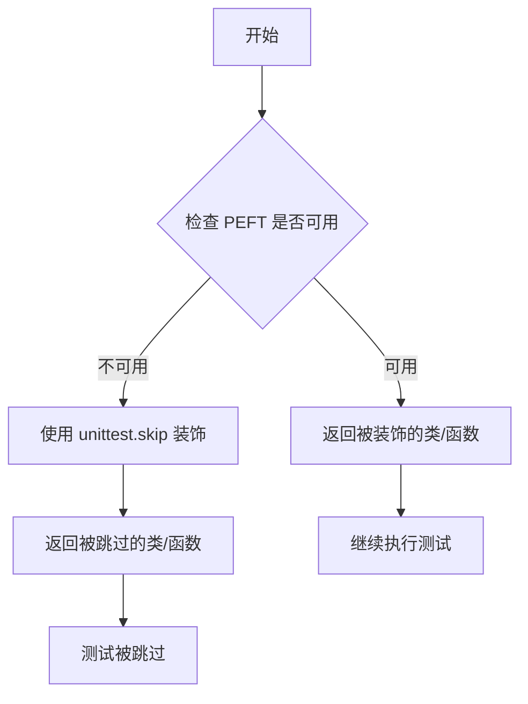

#### 带注释源码

由于 `require_peft_backend` 是从 `..testing_utils` 模块导入的，并非在该代码文件中定义，因此无法直接提供其完整源码。基于其使用方式和典型实现，推测其源码结构如下：

```python
# 推测的源码实现（来自 testing_utils 模块）

def require_peft_backend(obj):
    """
    装饰器：检查 PEFT 后端是否可用，如果不可用则跳过测试。
    
    参数:
        obj: 被装饰的测试类或测试函数
        
    返回值:
        如果 PEFT 可用，返回原对象；否则返回被 unittest.skip 装饰的对象
    """
    if not is_peft_available():
        return unittest.skip("PEFT backend is not available")(obj)
    return obj
```

> **注意**：该函数定义在 `..testing_utils` 模块中，在此代码文件中仅作为导入的装饰器使用，用于标记 `AuraFlowLoRATests` 类需要 PEFT 后端才能运行。


### `AutoTokenizer`

`AutoTokenizer` 是 Hugging Face Transformers 库中的一个便捷类，用于自动加载与预训练模型相匹配的 tokenizer。在该测试代码中，它被赋值给 `tokenizer_cls` 变量，用于后续的 LoRA 测试场景中加载一个小型 T5 模型的 tokenizer。

参数：

- `pretrained_model_name_or_path`：`str` 或 `os.PathLike`，预训练模型的名字（HuggingFace Hub 上的模型 ID 或本地路径）
- `cache_dir`：`str` 或 `os.PathLike`，可选，用于下载缓存模型的目录
- `force_download`：`bool`，可选，是否强制重新下载模型
- `resume_download`：`bool`，可选，是否允许从中断的下载中恢复
- `proxies`：`dict`，可选，HTTP 代理字典
- `use_auth_token`：`str` 或 `bool`，可选，访问私有模型所需的 token
- `revision`：`str`，可选，模型仓库的版本（commit hash、branch name 或 tag）
- `subfolder`：`str`，可选，模型在仓库中的子文件夹路径
- `from_pipeline`：`str`，可选，指定原始 pipeline 名称
- `from_auto_class`：`str`，可选，指定使用的自动类（如 "AutoTokenizer"）
- `trust_remote_code`：`bool`，可选，是否信任远程代码
- `torch_dtype`：`torch.dtype`，可选，模型权重的 dtype
- `device_map`：`str` 或 `dict`，可选，模型在设备上的映射
- `max_memory`：`dict`，可选，设备内存限制
- `offload_folder`：`str`，可选，卸载权重的文件夹
- `offload_state_dict`：`bool`，可选，是否卸载 state dict
- `low_cpu_mem_usage`：`bool`，可选，是否降低 CPU 内存使用
- `variant`：`str`，可选，模型变体（如 "fp16"）
- `use_safetensors`：`bool`，可选，是否使用 .safetensors 格式
- `legacy_cache_layout`：`bool`，可选，是否使用旧版缓存布局

返回值：返回与指定预训练模型匹配的 `PreTrainedTokenizer` 或 `PreTrainedTokenizerFast` 实例，用于对文本进行分词（将文本转换为 token IDs）和解码（将 token IDs 转换回文本）。

#### 流程图

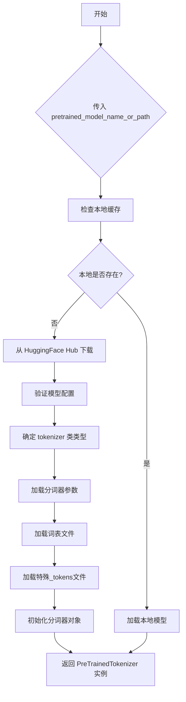

#### 带注释源码

```python
# AutoTokenizer 的典型使用方式（在测试代码中）
# 代码中将其赋值给变量，而非直接调用
tokenizer_cls, tokenizer_id = AutoTokenizer, "hf-internal-testing/tiny-random-t5"

# 等效的完整调用方式：
# tokenizer = AutoTokenizer.from_pretrained(
#     pretrained_model_name_or_path="hf-internal-testing/tiny-random-t5",
#     trust_remote_code=False,  # 是否信任远程代码
#     use_fast=True,  # 是否使用快速分词器（Rust实现）
# )
#
# # 常用方法示例：
# # 分词：将文本转换为 token IDs
# inputs = tokenizer("Hello, world!")
# # 解码：将 token IDs 转换回文本
# text = tokenizer.decode(inputs["input_ids"])
# # 批量分词
# inputs = tokenizer(["Hello", "World"], padding=True, truncation=True, max_length=512, return_tensors="pt")
```

#### 关键信息

- **来源库**: `transformers` (Hugging Face)
- **代码中的作用**: 作为 `tokenizer_cls` 变量存储，用于后续测试中可能通过 `tokenizer_cls.from_pretrained(tokenizer_id)` 方式实例化
- **关联变量**: 
  - `tokenizer_id`: `"hf-internal-testing/tiny-random-t5"` (用于测试的微型随机 T5 模型)
  - `tokenizer_cls`: `AutoTokenizer` 类本身
- **使用场景**: 在 LoRA 测试中用于文本编码，将 prompt 转换为模型可处理的 token 序列


### `UMT5EncoderModel`

该类是HuggingFace Transformers库中的文本编码器模型，用于将文本输入转换为模型可处理的嵌入表示。在本测试代码中作为文本编码器（text_encoder_cls）使用，配合AuraFlowPipeline进行文本到图像的生成任务。

#### 基本信息

- **类名**: `UMT5EncoderModel`
- **来源**: `transformers` 库
- **用途**: 文本编码器，将文本提示转换为向量嵌入
- **预训练模型ID**: `"hf-internal-testing/tiny-random-umt5"`

#### 在代码中的使用方式

```python
# 导入语句
from transformers import AutoTokenizer, UMT5EncoderModel

# 在测试类中的配置
text_encoder_cls, text_encoder_id = UMT5EncoderModel, "hf-internal-testing/tiny-random-umt5"
```

#### 参数

由于`UMT5EncoderModel`类定义在外部库（transformers）中，无法从当前代码文件中提取其完整的方法签名。以下信息基于其在当前测试代码中的使用方式：

- **模型路径/ID**: `str`，预训练模型的标识符或本地路径，当前值为 `"hf-internal-testing/tiny-random-umt5"`

#### 返回值

- **text_encoder_cls**: 返回`UMT5EncoderModel`类本身，用于后续实例化文本编码器对象

#### 流程图

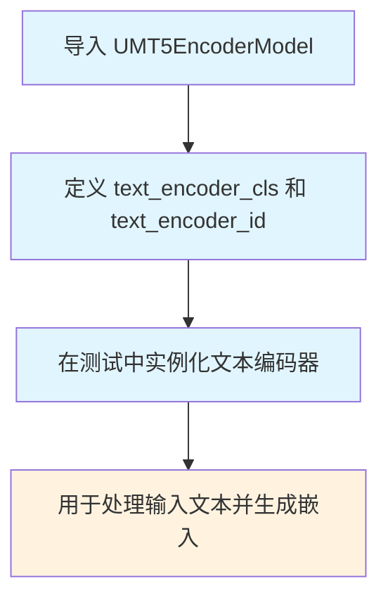

#### 带注释源码

```python
# 从transformers库导入UMT5EncoderModel类
# 这是一个预训练的UMT5编码器模型，用于文本编码任务
from transformers import AutoTokenizer, UMT5EncoderModel

# 在AuraFlowLoRATests测试类中配置文本编码器
# text_encoder_cls: 文本编码器的类对象
# text_encoder_id: HuggingFace Hub上的预训练模型标识符
text_encoder_cls, text_encoder_id = UMT5EncoderModel, "hf-internal-testing/tiny-random-umt5"

# 注意: 完整的UMT5EncoderModel类定义位于transformers库中
# 当前代码仅展示其使用方式，不包含类内部实现
```

#### 重要说明

⚠️ **限制说明**: 由于`UMT5EncoderModel`类定义在外部的`transformers`库中，当前代码文件仅展示了该类的**使用方式**，并未包含其完整实现。要获取`UMT5EncoderModel`的详细类结构、字段、方法参数和返回值信息，需要查阅transformers库的官方文档或源码。

#### 相关配置信息

| 配置项 | 值 | 说明 |
|--------|-----|------|
| `text_encoder_cls` | UMT5EncoderModel | 文本编码器类 |
| `text_encoder_id` | hf-internal-testing/tiny-random-umt5 | 预训练模型ID |
| `text_encoder_target_modules` | ["q", "k", "v", "o"] | LoRA可适配的注意力模块 |
| `supports_text_encoder_loras` | False | AuraFlow当前不支持文本编码器LoRA |

#### 技术债务与优化空间

1. **不支持文本编码器LoRA**: 当前设置 `supports_text_encoder_loras = False`，如果需要支持文本编码器的LoRA适配，需要进一步开发
2. **测试覆盖**: 代码中跳过了多个与文本去噪器相关的测试（使用 `@unittest.skip`），表明功能尚未完全实现


### AuraFlowPipeline

AuraFlowPipeline 是一个图像生成管道类，属于 diffusers 库，用于根据文本提示生成图像。该类整合了 Transformer 模型、VAE 模型、文本编码器和调度器，通过 Flow Match 算法实现高质量的文本到图像生成任务。

参数：

- `pipeline_class`：类类型，指定为 AuraFlowPipeline 管道类
- `scheduler_cls`：调度器类型，FlowMatchEulerDiscreteScheduler，用于扩散模型的噪声调度
- `transformer_cls`：模型类型，AuraFlowTransformer2DModel，用于图像生成的核心 Transformer 模型
- `tokenizer_cls`：分词器类型，AutoTokenizer，用于文本处理
- `tokenizer_id`：分词器预训练模型标识，"hf-internal-testing/tiny-random-t5"
- `text_encoder_cls`：文本编码器类型，UMT5EncoderModel，用于将文本转换为嵌入向量
- `text_encoder_id`：文本编码器预训练模型标识，"hf-internal-testing/tiny-random-umt5"

返回值：`torch.Tensor` 或 `numpy.ndarray`，生成的图像输出

#### 流程图

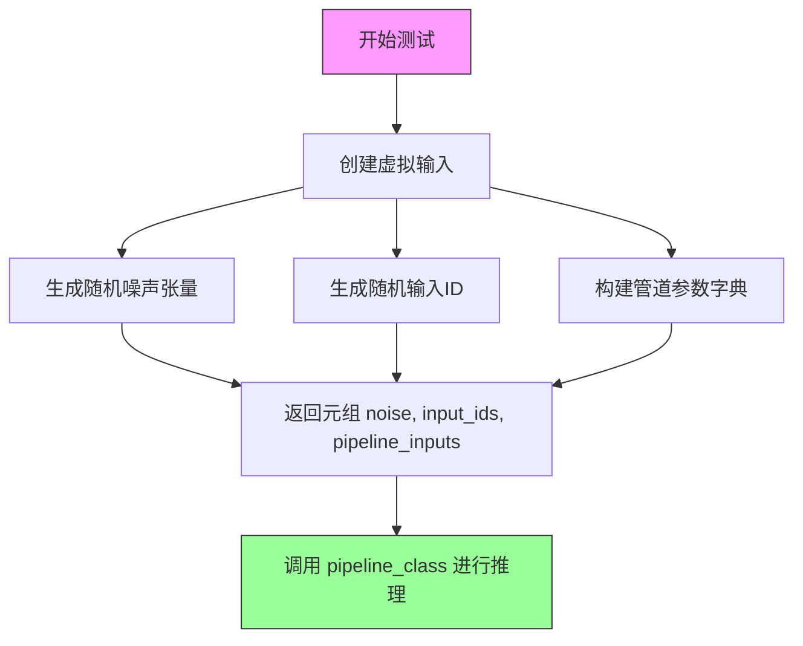

#### 带注释源码

```python
@property
def output_shape(self):
    """
    定义测试输出的预期形状
    """
    return (1, 8, 8, 3)  # 批次大小1，8x8分辨率，3通道RGB图像

def get_dummy_inputs(self, with_generator=True):
    """
    生成用于测试的虚拟输入数据
    
    参数:
        with_generator: 是否包含随机生成器，用于 reproducibility
    
    返回值:
        包含噪声、输入ID和管道参数的元组
    """
    # 批次大小为1
    batch_size = 1
    # 文本序列长度
    sequence_length = 10
    # 噪声通道数
    num_channels = 4
    # 图像空间尺寸
    sizes = (32, 32)

    # 初始化随机生成器，确保测试可重复性
    generator = torch.manual_seed(0)
    # 生成符合扩散模型输入要求的噪声张量
    # 形状: (batch_size, num_channels) + sizes = (1, 4, 32, 32)
    noise = floats_tensor((batch_size, num_channels) + sizes)
    # 生成随机整数作为文本输入的token ID
    # 形状: (batch_size, sequence_length) = (1, 10)
    input_ids = torch.randint(1, sequence_length, size=(batch_size, sequence_length), generator=generator)

    # 构建管道调用的核心参数字典
    pipeline_inputs = {
        "prompt": "A painting of a squirrel eating a burger",  # 文本提示
        "num_inference_steps": 4,   # 推理步数，较少的步数用于快速测试
        "guidance_scale": 0.0,      # 无条件引导，用于测试场景
        "height": 8,                # 输出图像高度
        "width": 8,                 # 输出图像宽度
        "output_type": "np",       # 输出为numpy数组格式
    }
    
    # 如果需要生成器，将其添加到参数字典
    if with_generator:
        pipeline_inputs.update({"generator": generator})

    # 返回完整的三元组输入：噪声、文本ID、管道参数
    # 这些输入将传递给 AuraFlowPipeline 的 __call__ 方法
    return noise, input_ids, pipeline_inputs
```

---

### 关键组件信息

| 组件名称 | 一句话描述 |
|---------|-----------|
| AuraFlowPipeline | 文本到图像生成管道，整合Transformer、VAE和文本编码器 |
| AuraFlowTransformer2DModel | 基于Transformer的图像生成模型，支持Flow Match算法 |
| FlowMatchEulerDiscreteScheduler | 欧拉离散调度器，实现Flow Match噪声调度 |
| AutoTokenizer | T5系列文本分词器 |
| UMT5EncoderModel | 统一感知多模态T5文本编码器 |

### 潜在技术债务与优化空间

1. **测试覆盖不完整**：多个测试方法被 `@unittest.skip` 跳过，包括文本去噪器块缩放和填充模式测试
2. **不支持的LoRA功能**：`supports_text_encoder_loras = False` 表明文本编码器的LoRA适配尚未实现
3. **硬编码配置**：transformer_kwargs 和 vae_kwargs 中的参数为硬编码，可能需要配置化

### 其他项目说明

- **设计目标**：通过 unittest 框架验证 AuraFlow Pipeline 的 LoRA 加载功能
- **测试约束**：使用 tiny-random 模型进行快速测试，降低计算资源需求
- **输入规范**：管道接受 prompt 字符串、num_inference_steps 整数、guidance_scale 浮点数等参数
- **输出格式**：支持 "np" (numpy数组)、"pil" (PIL图像) 等多种输出类型


根据提供的代码分析，`AuraFlowTransformer2DModel` 是从 `diffusers` 库导入的一个类，并非在此代码文件中定义。该文件是一个测试文件，引用了这个类用于测试目的。

由于提供的代码片段中没有 `AuraFlowTransformer2DModel` 类的实际实现，只有测试代码中的调用和相关配置参数，我将基于代码中对该类的使用方式来提供文档。

---

### AuraFlowTransformer2DModel

该类是 AuraFlow 扩散模型的核心变换器（Transformer）组件，负责处理图像去噪过程中的潜在空间表示。从代码中的 `transformer_kwargs` 可以看出，它是一个 2D 变换器模型，支持文本条件的联合注意力机制。

参数：

- 无直接参数（构造函数参数需参考 diffusers 库实现）
- 代码中通过 `transformer_kwargs` 字典配置：

  - `sample_size`：`int`，输入样本的空间尺寸（高度/宽度）
  - `patch_size`：`int`，图像补丁大小
  - `in_channels`：`int`，输入通道数（4 代表潜在空间通道）
  - `num_mmdit_layers`：`int`，MMDIT 层数量
  - `num_single_dit_layers`：`int`，单 DIT 层数量
  - `attention_head_dim`：`int`，注意力头维度
  - `num_attention_heads`：`int`，注意力头数量
  - `joint_attention_dim`：`int`，联合注意力维度（文本-图像）
  - `caption_projection_dim`：`int`， caption 投影维度
  - `pos_embed_max_size`：`int`，位置嵌入最大尺寸

返回值：`torch.nn.Module`，返回 AuraFlowTransformer2DModel 模型实例

#### 流程图

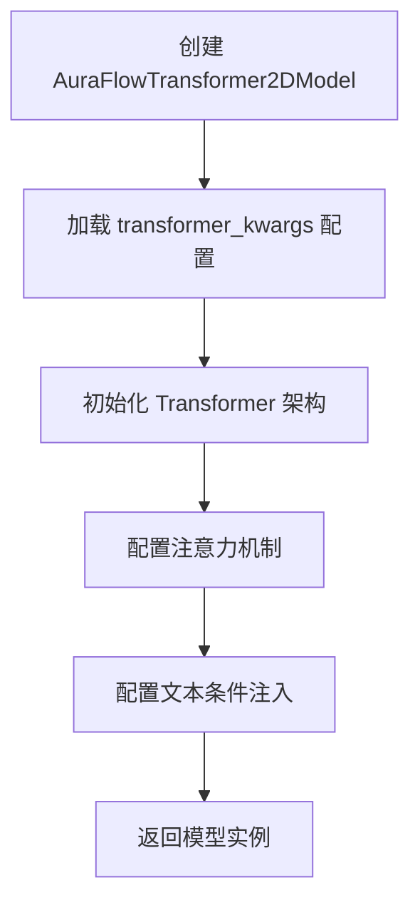

#### 带注释源码

```python
# 从 diffusers 库导入 AuraFlowTransformer2DModel 类
from diffusers import (
    AuraFlowPipeline,
    AuraFlowTransformer2DModel,  # 核心变换器模型类
    FlowMatchEulerDiscreteScheduler,
)

# 测试类中配置 AuraFlowTransformer2DModel 的参数
transformer_cls = AuraFlowTransformer2DModel  # 指定变换器类

transformer_kwargs = {
    "sample_size": 64,              # 输入潜在空间的宽高
    "patch_size": 1,                # 补丁划分大小
    "in_channels": 4,               # 潜在空间的通道数
    "num_mmdit_layers": 1,          # 多模态 DIT 层数
    "num_single_dit_layers": 1,     # 单模态 DIT 层数
    "attention_head_dim": 16,       # 每个注意力头的维度
    "num_attention_heads": 2,       # 注意力头数量
    "joint_attention_dim": 32,      # 文本-图像联合注意力维度
    "caption_projection_dim": 32,   # 文本 caption 投影维度
    "pos_embed_max_size": 64,       # 位置嵌入的最大尺寸
}
```

---

### 补充说明

由于提供的代码是测试文件，未包含 `AuraFlowTransformer2DModel` 类的具体实现细节。若需获取完整的类字段、方法和详细设计文档，建议查阅 diffusers 库源码或官方文档。


### FlowMatchEulerDiscreteScheduler

FlowMatchEulerDiscreteScheduler 是 Hugging Face diffusers 库中的一个调度器类，用于实现基于 Flow Matching 的欧拉离散采样方法，主要应用于 AuraFlow 等扩散模型的推理过程中的噪声调度。

参数：

- 无直接参数（构造函数参数需参考 diffusers 库源码）

返回值：FlowMatchEulerDiscreteScheduler 类实例

#### 流程图

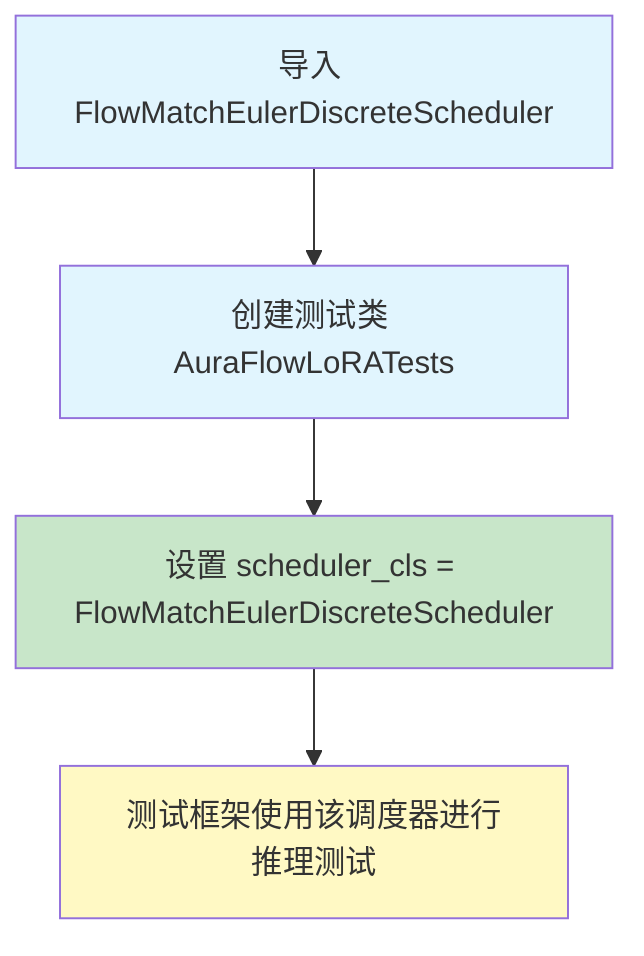

#### 带注释源码

```python
# 从 diffusers 库导入 FlowMatchEulerDiscreteScheduler
# 这是一个外部依赖的调度器类，用于扩散模型的采样
from diffusers import (
    AuraFlowPipeline,
    AuraFlowTransformer2DModel,
    FlowMatchEulerDiscreteScheduler,  # <-- 目标类：从库导入
)

# 在测试类中指定使用的调度器类
@require_peft_backend
class AuraFlowLoRATests(unittest.TestCase, PeftLoraLoaderMixinTests):
    pipeline_class = AuraFlowPipeline
    scheduler_cls = FlowMatchEulerDiscreteScheduler  # <-- 指定调度器类用于测试
    scheduler_kwargs = {}
    
    # ... 其它测试配置 ...
```

#### 补充说明

由于 `FlowMatchEulerDiscreteScheduler` 是从外部库（diffusers）导入的类，未在本项目中定义源码，因此无法提供其完整的方法和字段信息。该类的具体实现位于 diffusers 库中。在本测试文件中，它被用作 AuraFlow 模型的噪声调度器，配合 `AuraFlowPipeline` 进行 LoRA 微调相关的推理测试。

如需查看 FlowMatchEulerDiscreteScheduler 的完整源码和详细文档，建议参考 [Hugging Face diffusers 官方仓库](https://github.com/huggingface/diffusers)。


# 分析结果

从提供的代码中，我注意到 `PeftLoraLoaderMixinTests` 并不是在本文件中定义的，而是通过 `from .utils import PeftLoraLoaderMixinTests` 从 `utils.py` 模块导入的混合类（Mixin）。

由于提供的代码片段仅包含导入语句和 `AuraFlowLoRATests` 测试类的使用示例，并未包含 `PeftLoraLoaderMixinTests` 类的完整定义，因此无法直接从中提取该类的完整实现细节。

不过，我可以基于代码上下文提供以下分析：

---

### `{PeftLoraLoaderMixinTests}`

从导入语句和类的使用方式来看，`PeftLoraLoaderMixinTests` 是一个测试混合类（Test Mixin），专门用于测试 PEFT LoRA（Parameter-Efficient Fine-Tuning with Low-Rank Adaptation）加载器功能。

参数：

- 无直接参数（该类作为混合类被 `AuraFlowLoRATests` 继承使用）

返回值：`无`（测试类不返回值）

#### 流程图

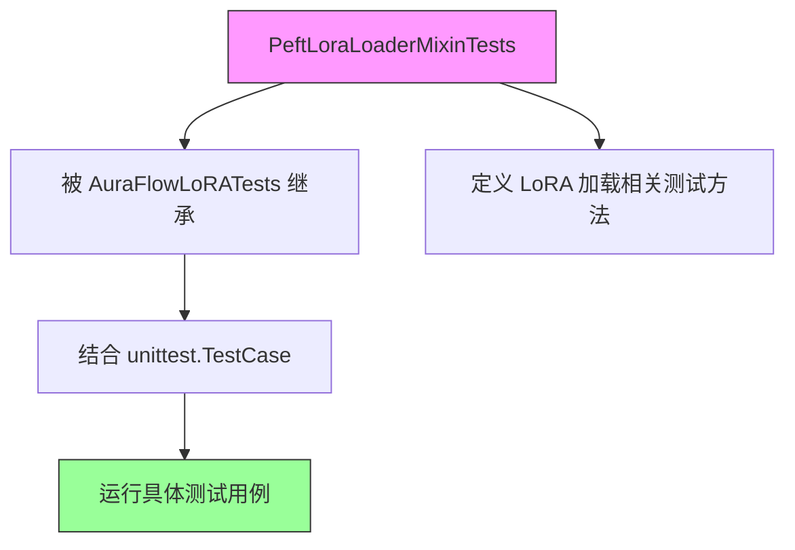

#### 带注释源码

```python
# 该类未在此文件中定义，从 .utils 模块导入
from .utils import PeftLoraLoaderMixinTests  # noqa: E402

# 使用 PeftLoraLoaderMixinTests 作为混合类
@require_peft_backend
class AuraFlowLoRATests(unittest.TestCase, PeftLoraLoaderMixinTests):
    """
    AuraFlow LoRA 测试类，继承自 unittest.TestCase 和 PeftLoraLoaderMixinTests
    用于测试 AuraFlow pipeline 的 PEFT LoRA 加载功能
    """
    pipeline_class = AuraFlowPipeline
    scheduler_cls = FlowMatchEulerDiscreteScheduler
    # ... 其他配置
```

---

## 补充说明

### 潜在的技术债务

1. **导入依赖隐式**：由于 `PeftLoraLoaderMixinTests` 的完整实现未在此文件中，需要查看 `utils.py` 才能了解其完整的测试方法集合
2. **跳过测试**：代码中有3个被跳过的测试方法（`test_simple_inference_with_text_denoiser_block_scale` 等），需要确认是否需要实现或移除

### 建议

要获取 `PeftLoraLoaderMixinTests` 的完整详细信息，需要查看同目录下的 `utils.py` 文件以获取该混合类的完整定义和所有测试方法。


### `AuraFlowLoRATests.output_shape`

这是一个测试属性，用于定义 AuraFlow 管道输出张量的期望形状。该属性返回预期输出尺寸的元组 (batch_size, height, width, channels)，供测试框架验证推理结果的正确性。

参数：此属性不接受任何参数。

返回值：`tuple`，返回预期输出形状元组 (1, 8, 8, 3)，其中 1 表示批量大小，8x8 表示空间维度，3 表示通道数（RGB 图像）。

#### 流程图

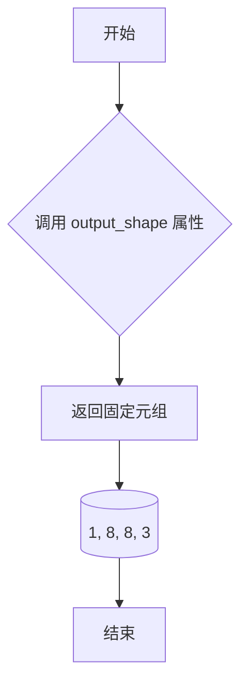

#### 带注释源码

```python
@property
def output_shape(self):
    """
    属性: output_shape
    
    描述:
        定义测试用例的期望输出形状。
        用于验证 AuraFlow 管道推理输出的张量维度是否符合预期。
    
    返回值:
        tuple: 预期输出张量的形状元组 (batch_size, height, width, channels)
               - batch_size: 1 (单样本批次)
               - height: 8 (输出图像高度)
               - width: 8 (输出图像宽度)
               - channels: 3 (RGB 三通道)
    
    使用场景:
        此属性被测试框架用于对比实际管道输出与期望形状，
        确保图像生成维度正确。
    """
    return (1, 8, 8, 3)
```


### `AuraFlowLoRATests.get_dummy_inputs`

该方法为 AuraFlowLoRA 测试用例生成虚拟输入数据，包括噪声张量、输入ID以及管道参数字典，用于测试扩散管道的推理流程。

参数：

- `self`：类的实例引用，用于访问类属性
- `with_generator`：`bool`，默认为 `True`，指定是否在返回的管道参数字典中包含生成器对象

返回值：`tuple[torch.Tensor, torch.Tensor, dict]`，返回包含三个元素的元组
- `noise`：`torch.Tensor`，形状为 (1, 4, 32, 32) 的噪声张量
- `input_ids`：`torch.Tensor`，形状为 (1, 10) 的输入ID张量
- `pipeline_inputs`：`dict`，包含提示词、推理步数、引导_scale、输出高度、宽度和输出类型等管道参数，可选包含生成器

#### 流程图

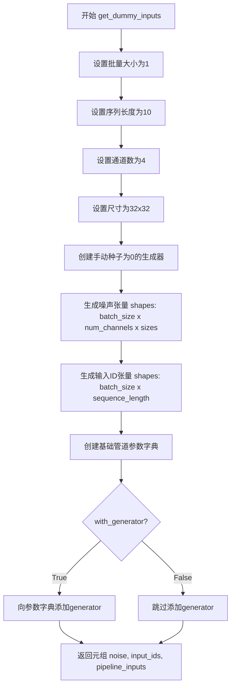

#### 带注释源码

```python
def get_dummy_inputs(self, with_generator=True):
    """
    生成用于测试的虚拟输入数据
    
    参数:
        with_generator: bool, 是否包含生成器用于 reproducibility
    返回:
        tuple: (noise, input_ids, pipeline_inputs)
    """
    # 定义批量大小
    batch_size = 1
    # 定义序列长度
    sequence_length = 10
    # 定义通道数（对应潜在空间的维度）
    num_channels = 4
    # 定义空间尺寸（潜在空间的高度和宽度）
    sizes = (32, 32)

    # 创建随机生成器，设置固定种子以确保可复现性
    generator = torch.manual_seed(0)
    # 生成噪声张量，形状为 (batch_size, num_channels, height, width)
    noise = floats_tensor((batch_size, num_channels) + sizes)
    # 生成输入ID张量，形状为 (batch_size, sequence_length)
    # 范围从1到sequence_length，排除0（通常保留为padding）
    input_ids = torch.randint(1, sequence_length, size=(batch_size, sequence_length), generator=generator)

    # 构建管道输入参数字典
    pipeline_inputs = {
        "prompt": "A painting of a squirrel eating a burger",  # 测试用提示词
        "num_inference_steps": 4,     # 推理步数（较少用于快速测试）
        "guidance_scale": 0.0,        # 无分类器引导（0表示不使用）
        "height": 8,                  # 输出图像高度
        "width": 8,                   # 输出图像宽度
        "output_type": "np",          # 输出类型为numpy数组
    }
    
    # 如果需要生成器，将其添加到参数字典中
    if with_generator:
        pipeline_inputs.update({"generator": generator})

    # 返回噪声、输入ID和管道参数的元组
    return noise, input_ids, pipeline_inputs
```


### `AuraFlowLoRATests.test_simple_inference_with_text_denoiser_block_scale`

该测试方法用于验证 AuraFlow 管道在文本去噪器块缩放场景下的简单推理功能。由于 AuraFlow 不支持此功能，该测试被跳过。

参数：

- `self`：`unittest.TestCase`，测试类的实例，代表当前的测试对象

返回值：`None`，该方法被 `@unittest.skip` 装饰器跳过，不执行任何操作，也不返回任何值

#### 流程图

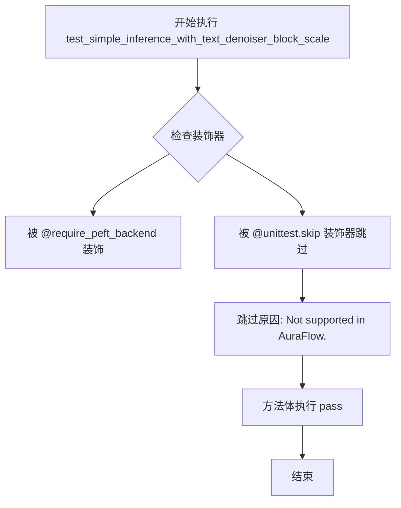

#### 带注释源码

```python
@unittest.skip("Not supported in AuraFlow.")
def test_simple_inference_with_text_denoiser_block_scale(self):
    """
    测试 AuraFlow 管道在文本去噪器块缩放场景下的简单推理功能。
    
    该测试原本用于验证：
    1. 文本编码器 LoRA 和去噪器 LoRA 的联合推理
    2. 块缩放（block scale）参数的正确应用
    3. 管道输出的正确性
    
    由于 AuraFlow 不支持此功能，当前实现直接跳过该测试。
    """
    pass  # 不执行任何操作，测试被跳过
```


### `AuraFlowLoRATests.test_simple_inference_with_text_denoiser_block_scale_for_all_dict_options`

这是一个被跳过的测试方法，用于测试文本去噪器块缩放功能的所有字典选项。由于AuraFlow不支持该功能，测试方法体为空，仅包含`pass`语句并使用`@unittest.skip`装饰器跳过执行。

参数：

- `self`：`unittest.TestCase`，测试类实例自身

返回值：`None`，无返回值（测试方法被跳过）

#### 流程图

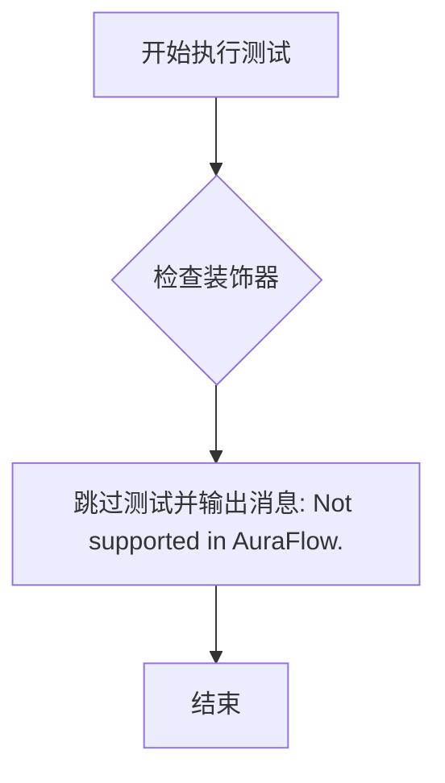

#### 带注释源码

```python
@unittest.skip("Not supported in AuraFlow.")
def test_simple_inference_with_text_denoiser_block_scale_for_all_dict_options(self):
    """
    测试文本去噪器块缩放功能的所有字典选项。
    
    该测试用于验证AuraFlow管道中文本去噪器块缩放的不同配置选项，
    但由于AuraFlow当前不支持此功能，测试被跳过。
    """
    pass  # 方法体为空，测试被跳过
```


### `AuraFlowLoRATests.test_modify_padding_mode`

这是一个被跳过的测试方法，用于测试修改 padding_mode 的功能。由于 AuraFlow 不支持此功能，该测试用例被禁用（跳过）。

参数：

- `self`：`unittest.TestCase`，测试类实例本身，包含测试状态和配置信息

返回值：`None`，该方法不返回任何值（被跳过的测试）

#### 流程图

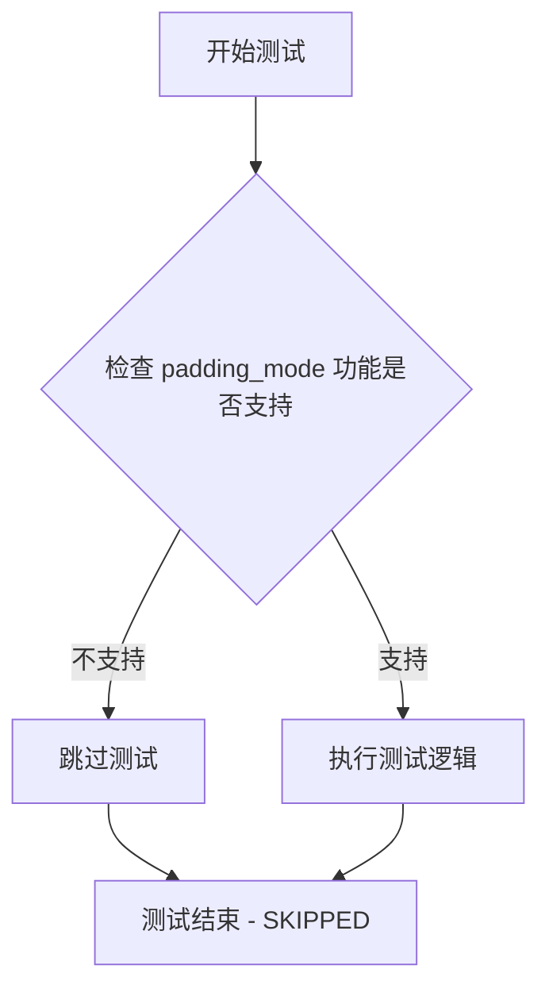

#### 带注释源码

```python
@unittest.skip("Not supported in AuraFlow.")
def test_modify_padding_mode(self):
    """
    测试修改 padding_mode 功能。
    
    该测试用例用于验证 AuraFlow pipeline 是否支持修改 tokenizer 的 padding_mode。
    由于 AuraFlow 目前不支持此功能，因此该测试被跳过。
    
    参数:
        self: 测试类实例，继承自 unittest.TestCase
        
    返回值:
        None: 该方法被跳过，不执行任何测试逻辑
    """
    pass
```

## 关键组件


### AuraFlowLoRATests

这是AuraFlow模型的LoRA（低秩适配）功能测试类，继承自unittest.TestCase和PeftLoraLoaderMixinTests，用于验证AuraFlowPipeline在集成LoRA权重时的正确性。

### pipeline_class - AuraFlowPipeline

diffusers库中的AuraFlowPipeline类，用于执行AuraFlow模型的推理流程。

### scheduler_cls - FlowMatchEulerDiscreteScheduler

流匹配欧拉离散调度器，用于控制扩散模型的采样过程。

### transformer_cls - AuraFlowTransformer2DModel

AuraFlow的2D变换器模型类，处理图像生成的核心变换逻辑。

### tokenizer_cls 和 text_encoder_cls

tokenizer_cls使用AutoTokenizer，text_encoder_cls使用UMT5EncoderModel，用于处理文本提示并生成文本嵌入。

### transformer_kwargs

transformer模型的配置参数字典，包含sample_size、patch_size、in_channels、num_mmdit_layers、num_single_dit_layers、attention_head_dim、num_attention_heads、joint_attention_dim、caption_projection_dim、pos_embed_max_size等参数。

### vae_kwargs

VAE模型的配置参数字典，包含sample_size、in_channels、out_channels、block_out_channels、layers_per_block、latent_channels、norm_num_groups、use_quant_conv、use_post_quant_conv、shift_factor、scaling_factor等参数。

### get_dummy_inputs方法

生成测试用的虚拟输入数据，包括噪声张量、输入ID和管道参数字典，支持可选的随机数生成器。

### 被跳过的测试

代码中有3个被跳过的测试方法：test_simple_inference_with_text_denoiser_block_scale、test_simple_inference_with_text_denoiser_block_scale_for_all_dict_options和test_modify_padding_mode，这些功能在AuraFlow中不支持。


## 问题及建议


### 已知问题

-   **空的条件语句**：`if is_peft_available(): pass` 是一个空的pass语句，完全没有作用，可能是未完成的代码或遗留的检查逻辑
-   **未使用的导入**：`PeftLoraLoaderMixinTests` 被导入但未在当前文件中直接引用（虽然通过继承间接使用），且 `sys.path.append(".")` 是不推荐的做法
-   **未使用的类属性**：定义了多个但未在测试中使用的属性，包括 `scheduler_cls`、`scheduler_kwargs`、`tokenizer_cls`、`tokenizer_id`、`text_encoder_cls`、`text_encoder_id`、`text_encoder_target_modules`、`denoiser_target_modules`、`supports_text_encoder_loras`
-   **返回值未充分利用**：`get_dummy_inputs` 方法返回三个值 `(noise, input_ids, pipeline_inputs)`，但调用方可能只使用其中部分数据
-   **大量跳过的测试**：有3个测试方法被完全跳过（`test_simple_inference_with_text_denoiser_block_scale`等），这些可能是已知的限制但缺乏文档说明原因

### 优化建议

-   删除 `if is_peft_available(): pass` 空语句，或添加实际的PEFT相关初始化逻辑
-   将配置属性（tokenizer、text_encoder等）移至父类或配置常量文件中，避免在每个测试类中重复定义
-   考虑将 `get_dummy_inputs` 拆分为更细粒度的方法，或提供更清晰的返回值说明文档
-   为跳过的测试添加更详细的文档说明，说明为何不支持以及未来是否有计划支持
-   使用 `__all__` 明确导出接口，清理未使用的导入以提高代码可读性
-   考虑使用pytest fixtures替代部分硬编码的测试配置，提高测试的可维护性和复用性


## 其它


### 设计目标与约束

本测试模块旨在验证AuraFlow Pipeline的LoRA（Low-Rank Adaptation）功能是否正常工作。设计目标包括：确保LoRA权重能够正确加载到transformer模型中，验证文本编码器LoRA支持状态，以及测试不同配置下的推理流程。约束条件方面，由于AuraFlow架构限制，暂不支持文本去噪器块缩放功能，同时需要PEFT后端可用才能运行测试。

### 错误处理与异常设计

本模块采用两种主要的错误处理机制。首先，通过`@require_peft_backend`装饰器确保测试环境安装了PEFT库，若不满足条件则跳过测试并报告`SKIPPED`状态。其次，使用`@unittest.skip`装饰器明确标注不支持的测试用例（如`test_simple_inference_with_text_denoiser_block_scale`系列），这些测试直接跳过而非失败，避免误报。测试过程中若模型加载或推理出现异常，将由unittest框架捕获并报告具体的错误堆栈信息。

### 数据流与状态机

测试数据流遵循以下路径：首先通过`get_dummy_inputs`方法生成模拟输入数据，包括批次大小为1的随机噪声张量、输入ID序列以及包含推理参数（步数、引导系数、输出尺寸等）的字典。随后这些输入被传递给`pipeline_class`实例化的AuraFlowPipeline执行推理流程。状态机方面，测试主要关注Pipeline的初始化状态和推理执行状态，测试通过验证输出张量形状是否符合预期的`(1, 8, 8, 3)`来确认流程正确性。

### 外部依赖与接口契约

本模块依赖以下外部组件：PyTorch（张量计算）、Transformers库（AutoTokenizer、UMT5EncoderModel用于文本编码）、Diffusers库（AuraFlowPipeline、AuraFlowTransformer2DModel、FlowMatchEulerDiscreteScheduler核心组件）、PEFT库（LoRA功能支持）。接口契约方面，`pipeline_class`必须实现标准的Diffusers Pipeline接口，`transformer_cls`和`tokenizer_cls`需与预定义配置兼容。`PeftLoraLoaderMixinTests`基类定义了LoRA加载器必须实现的接口方法。

### 性能考虑与基准

由于使用dummy数据和极小模型配置（num_mmdit_layers=1、num_single_dit_layers=1、attention_head_dim=16等），测试主要关注功能正确性而非性能。推理步数设置为4（num_inference_steps=4）以加快测试速度。潜在的性能优化方向包括：使用更高效的批处理策略、减少不必要的张量拷贝、优化LoRA权重合并时机等。

### 安全性考虑

测试代码本身不涉及敏感数据处理，但需要注意的是：测试中使用的模型均为"tiny-random"版本，不包含任何预训练权重；测试过程不涉及网络持久化存储或敏感信息传输；建议在隔离环境中运行测试以避免潜在的环境污染风险。

### 配置管理与版本兼容性

关键配置通过类属性集中定义，包括transformer配置（transformer_kwargs）、VAE配置（vae_kwargs）、 tokenizer配置（tokenizer_cls和tokenizer_id）、文本编码器配置（text_encoder_cls和text_encoder_id）以及目标模块配置（text_encoder_target_modules、denoiser_target_modules）。版本兼容性方面，需要确保Diffusers库版本支持AuraFlow组件，Transformers库版本支持T5系列模型，PyTorch版本与CUDA/cuDNN驱动兼容。

### 测试策略与覆盖率

本测试采用单元测试策略，继承自`PeftLoraLoaderMixinTests`以复用通用的LoRA加载测试用例。测试覆盖范围包括：LoRA权重加载验证、Pipeline推理功能验证、输出形状正确性验证、不支持功能的正确跳过。覆盖率提升建议：可增加更多边界条件测试（如空提示、极端引导系数值）、可添加性能基准测试记录推理耗时、建议集成测试验证完整训练-推理流程。

### 监控与日志

当前测试模块未显式配置日志记录功能。运行时可通过pytest的-v（verbose）选项查看详细的测试执行过程。建议在CI/CD流程中集成测试结果收集，监控测试通过率趋势，及时发现因依赖库更新导致的兼容性问题。

### 部署注意事项

本测试模块设计用于开发验证和CI/CD流程，不建议直接用于生产环境。部署时需注意：确保测试环境与生产环境的依赖版本一致；PEFT后端必须正确安装；建议使用虚拟环境隔离测试依赖；测试执行节点需具备足够的GPU内存（即使使用小模型配置）。

### 潜在改进方向

代码中存在若干可改进之处：首先，`supports_text_encoder_loras = False`表明当前不支持文本编码器LoRA，建议在文档中明确说明此限制原因并规划后续支持。其次，`is_peft_available()`分支仅包含`pass`语句，建议添加版本检查或功能提示。第三，`scheduler_kwargs`为空字典，建议根据实际需求配置合适的调度器参数。最后，可考虑添加类型注解（type hints）以提升代码可维护性。

    