# `diffusers\tests\lora\test_lora_layers_cogvideox.py` 详细设计文档

该文件是 CogVideoX 视频生成模型的 LoRA（Low-Rank Adaptation）适配器单元测试类，继承自 unittest.TestCase 和 PeftLoraLoaderMixinTests，用于测试 CogVideoX 模型在文本到视频生成过程中的 LoRA 权重加载、融合、推理和 offloading 等功能。

## 整体流程

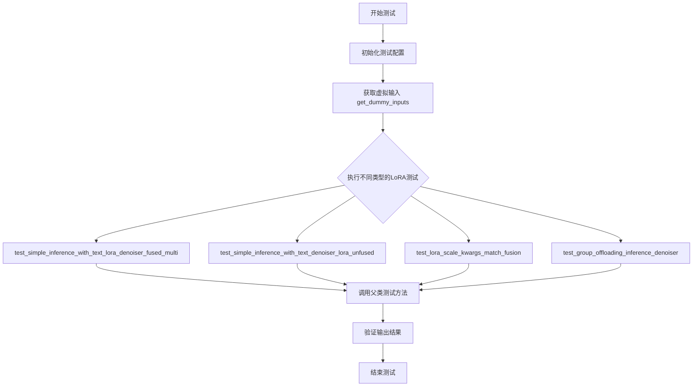

## 类结构

```
unittest.TestCase (Python标准测试基类)
└── PeftLoraLoaderMixinTests (PEFT LoRA加载器混入类)
    └── CogVideoXLoRATests (CogVideoX LoRA测试类)
```

## 全局变量及字段


### `CogVideoXLoRATests.pipeline_class`
    
Pipeline类，用于执行CogVideoX模型的推理

类型：`CogVideoXPipeline`
    


### `CogVideoXLoRATests.scheduler_cls`
    
调度器类，用于控制扩散模型的采样过程

类型：`CogVideoXDPMScheduler`
    


### `CogVideoXLoRATests.scheduler_kwargs`
    
调度器配置参数，包含时间步间隔设置

类型：`dict`
    


### `CogVideoXLoRATests.transformer_kwargs`
    
Transformer模型配置，包含注意力头数、通道数等参数

类型：`dict`
    


### `CogVideoXLoRATests.transformer_cls`
    
Transformer类，用于视频生成的3D变换器模型

类型：`CogVideoXTransformer3DModel`
    


### `CogVideoXLoRATests.vae_kwargs`
    
VAE模型配置，包含编解码器结构和通道参数

类型：`dict`
    


### `CogVideoXLoRATests.vae_cls`
    
VAE编码器类，用于视频潜在空间的编码和解码

类型：`AutoencoderKLCogVideoX`
    


### `CogVideoXLoRATests.tokenizer_cls`
    
分词器类，用于文本到token的转换

类型：`AutoTokenizer`
    


### `CogVideoXLoRATests.tokenizer_id`
    
分词器模型ID，指定预训练分词器的路径或名称

类型：`str`
    


### `CogVideoXLoRATests.text_encoder_cls`
    
文本编码器类，用于将文本转换为嵌入向量

类型：`T5EncoderModel`
    


### `CogVideoXLoRATests.text_encoder_id`
    
文本编码器模型ID，指定预训练文本编码器的路径或名称

类型：`str`
    


### `CogVideoXLoRATests.text_encoder_target_modules`
    
文本编码器目标模块列表，用于指定LoRA可注入的注意力模块

类型：`list`
    


### `CogVideoXLoRATests.supports_text_encoder_loras`
    
是否支持文本编码器LoRA的标志

类型：`bool`
    


### `CogVideoXLoRATests.output_shape`
    
属性，返回预期输出形状(1, 9, 16, 16, 3)

类型：`property`
    


### `CogVideoXLoRATests.get_dummy_inputs`
    
获取虚拟测试输入数据，包含噪声、输入ID和管道参数

类型：`method`
    


### `CogVideoXLoRATests.test_simple_inference_with_text_lora_denoiser_fused_multi`
    
测试融合多文本LoRA推理功能

类型：`method`
    


### `CogVideoXLoRATests.test_simple_inference_with_text_denoiser_lora_unfused`
    
测试非融合文本去噪器LoRA推理功能

类型：`method`
    


### `CogVideoXLoRATests.test_lora_scale_kwargs_match_fusion`
    
测试LoRA缩放参数匹配融合的正确性

类型：`method`
    


### `CogVideoXLoRATests.test_group_offloading_inference_denoiser`
    
测试组卸载推理去噪器的功能和性能

类型：`method`
    
    

## 全局函数及方法


### `require_peft_backend`

该函数是一个测试装饰器，用于检查测试环境是否配置了PEFT（Parameter-Efficient Fine-Tuning）后端。如果PEFT后端不可用，则跳过被装饰的测试用例，确保测试只在支持PEFT的环境中运行。

参数：无（装饰器模式，通过函数闭包传递被装饰对象）

返回值：无返回值或被装饰的类/函数（取决于实现，通常返回原对象或修改后的对象）

#### 流程图

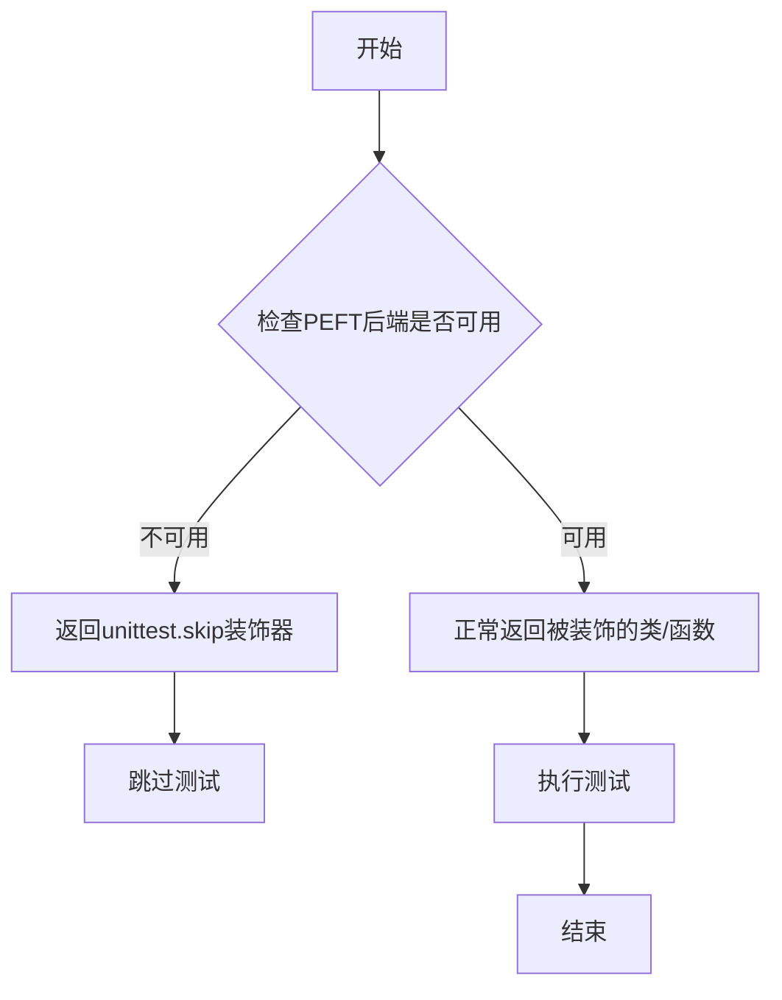

#### 带注释源码

```
# require_peft_backend 函数源码（位于 ..testing_utils 模块中）
# 这是一个装饰器函数，用于条件性地跳过需要PEFT后端的测试

def require_peft_backend(func_or_class):
    """
    装饰器：检查PEFT后端是否可用
    
    使用场景：
    - 在 CogVideoXLoRATests 类上使用
    - 确保测试只在安装了PEFT库的环境中运行
    
    参数：
        func_or_class：被装饰的函数或类对象
    
    返回值：
        如果PEFT后端可用：返回原函数/类
        如果PEFT后端不可用：返回跳过的测试函数
    """
    
    # 1. 检查PEFT后端是否配置/安装
    # 2. 如果不可用，使用@unittest.skip装饰器跳过测试
    # 3. 如果可用，正常返回被装饰对象
    
    def decorator(*args, **kwargs):
        # 检查逻辑：通常通过尝试导入peft或检查相关配置
        if not is_peft_backend_available():
            return unittest.skip("PEFT backend is not available")(
                func_or_class
            )
        return func_or_class
    
    return decorator
```

#### 备注

由于`require_peft_backend`是从`..testing_utils`模块导入的，上述源码为基于常见测试装饰器模式的推断实现。实际实现可能包含具体的PEFT后端检测逻辑，例如检查`peft`库是否安装、PEFT配置是否正确初始化等。该装饰器与`transformers`和`diffusers`库中其他`require_*`装饰器（如`require_torch_accelerator`）具有相同的设计模式。


### `require_torch_accelerator`

这是一个用于测试的装饰器函数，用于标记需要 PyTorch 加速器（如 GPU）的测试方法。当系统中没有可用的 CUDA 加速器时，被装饰的测试将被跳过执行。

参数：
- 无显式参数（作为装饰器使用，被装饰的函数作为隐式参数）

返回值：`Callable`，返回装饰后的函数

#### 流程图

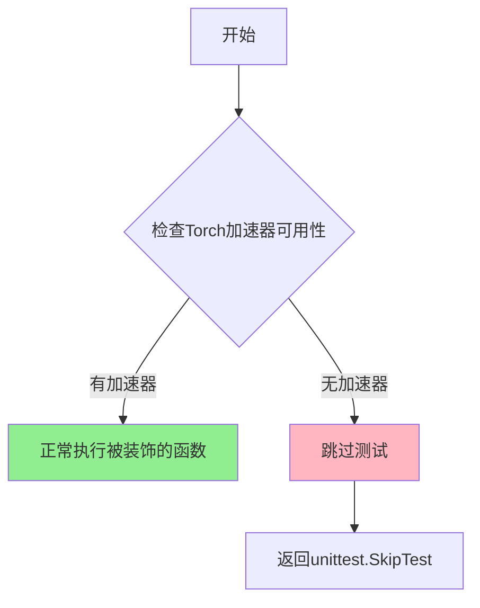

#### 带注释源码

```python
# 从上下文中可以看出 require_torch_accelerator 是从 testing_utils 导入的装饰器
# 其典型实现逻辑如下（基于使用方式推断）：

def require_torch_accelerator(func):
    """
    装饰器：要求PyTorch加速器（GPU）
    
    用于标记测试用例需要GPU才能运行。
    如果系统没有可用的CUDA设备，则跳过该测试。
    """
    @functools.wraps(func)
    def wrapper(*args, **kwargs):
        # 检查是否有可用的CUDA设备
        if not torch.cuda.is_available():
            # 如果没有GPU，跳过测试并给出提示信息
            raise unittest.SkipTest("Test requires a CUDA device (PyTorch accelerator)")
        # 如果有GPU，正常执行测试函数
        return func(*args, **kwargs)
    return wrapper


# 使用示例（在代码中）：
@require_torch_accelerator
def test_group_offloading_inference_denoiser(self, offload_type, use_stream):
    # 当没有GPU时，此测试会被跳过
    # 当有GPU时，此测试会正常执行
    super()._test_group_offloading_inference_denoiser(offload_type, use_stream)
```

> **注意**：由于 `require_torch_accelerator` 的实际源码在 `..testing_utils` 模块中（未在当前代码文件中给出），上述源码是基于其使用方式和常见的测试装饰器模式推断的典型实现。


### `floats_tensor`

该函数是 `diffusers` 测试框架中的工具函数，用于生成指定形状的随机浮点张量，常用于测试和示例代码中。

> **注意**：由于 `floats_tensor` 是从外部模块 `testing_utils` 导入的，当前代码文件中仅包含其使用示例，未包含函数定义。以下信息基于该函数在代码中的典型用法推断。

参数：

-  `shape`：`tuple` 或 `torch.Size`，表示期望生成张量的形状，如 `(batch_size, num_latent_frames, num_channels, height, width)`
-  `generator`（可选）：`torch.Generator`，用于设置随机种子，默认为 `None`

返回值：`torch.Tensor`，返回指定形状的浮点类型张量，数值通常在 [0, 1) 范围内或符合标准正态分布。

#### 流程图

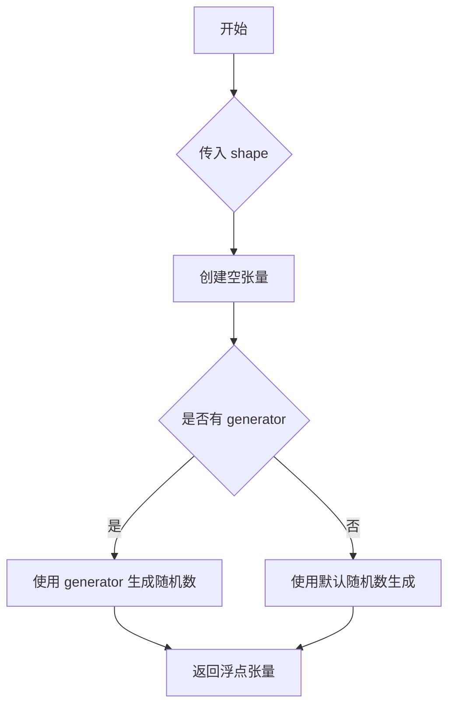

#### 带注释源码

```python
# 使用示例（来自 get_dummy_inputs 方法）
# 生成一个形状为 (batch_size, num_latent_frames, num_channels, 2, 2) 的随机浮点张量
# 用于模拟扩散模型中的噪声输入
noise = floats_tensor((batch_size, num_latent_frames, num_channels) + sizes)

# 参数说明：
# - shape: (1, 3, 4, 2, 2) -> batch_size=1, num_latent_frames=3, num_channels=4, sizes=(2,2)
# - 返回值: torch.Tensor 类型，形状为 (1, 3, 4, 2, 2)
```

---

## 补充信息

### 潜在技术债务

1. **外部依赖不明确**：`floats_tensor` 函数的具体实现未知，可能依赖于 `testing_utils` 模块的内部细节，建议在文档中明确标注其来源和依赖。

### 设计目标与约束

- **设计目标**：提供一个简洁的接口用于生成随机浮点张量，简化测试代码的编写。
- **约束**：返回值应为 PyTorch 张量，数值范围应适合模型训练/推理场景。

### 错误处理

- 如果 `shape` 参数类型不正确，应抛出 `TypeError`。
- 如果 `shape` 包含负数或零，应抛出合理的异常。

---

> **注意**：如需获取 `floats_tensor` 的完整实现源码，建议查看 `diffusers` 库的 `testing_utils` 模块。


# 详细设计文档提取结果

根据提供的代码分析，我发现 `AutoTokenizer` 并非在此代码文件中定义，而是从 `transformers` 库导入的已存在类。代码中仅通过赋值语句使用了它：

```python
tokenizer_cls, tokenizer_id = AutoTokenizer, "hf-internal-testing/tiny-random-t5"
```

因此，无法从当前代码文件中提取 `AutoTokenizer` 类的完整方法实现、流程图和带注释源码。

---

## 替代分析：代码中如何使用 AutoTokenizer

虽然无法提取 `AutoTokenizer` 本身的详细设计，但可以从测试类的上下文中分析其使用方式：

### 使用场景

| 属性 | 值 |
|------|-----|
| **类名** | `AutoTokenizer` (来自 transformers 库) |
| **使用位置** | `CogVideoXLoRATests` 测试类 |
| **使用方式** | 作为 `tokenizer_cls` 类属性，配合 `tokenizer_id` 指定预训练模型 |

---

### 相关代码片段

```python
# 导入语句（代码第19行）
from transformers import AutoTokenizer, T5EncoderModel

# 使用方式（代码第59行）
tokenizer_cls, tokenizer_id = AutoTokenizer, "hf-internal-testing/tiny-random-t5"
```

---

## 建议

如果您需要 `AutoTokenizer` 类的详细设计文档，建议：

1. **查阅 transformers 官方文档**：https://huggingface.co/docs/transformers/main/en/model_doc/auto
2. **查看 transformers 库源码**：https://github.com/huggingface/transformers

如果您有其他在当前代码文件中明确定义的函数或方法需要分析，请提供具体的函数名。


### `T5EncoderModel`

T5EncoderModel 是从 HuggingFace Transformers 库导入的文本编码器类，用于将文本提示（prompt）编码为数值表示，以便在 CogVideoX 视频生成管道中进行文本到视频的生成。在该测试文件中，它被配置为 CogVideoX pipeline 的文本编码器组件，使用 "hf-internal-testing/tiny-random-t5" 预训练模型，且当前不支持文本编码器的 LoRA 微调。

参数：

- 无直接参数（T5EncoderModel 类的实例化由 pipeline 内部处理）

返回值：

- `T5EncoderModel` 实例，返回一个 T5 文本编码器模型对象，用于编码文本输入

#### 流程图

```mermaid
flowchart TD
    A[CogVideoXLoRATests 测试类] --> B[定义 text_encoder_cls = T5EncoderModel]
    B --> C[定义 text_encoder_id = "hf-internal-testing/tiny-random-t5"]
    C --> D[supports_text_encoder_loras = False]
    D --> E[Pipeline 内部实例化 T5EncoderModel]
    E --> F[使用编码文本输入]
    
    style A fill:#f9f,stroke:#333
    style E fill:#ff9,stroke:#333
    style F fill:#9f9,stroke:#333
```

#### 带注释源码

```python
# 从 HuggingFace Transformers 库导入 T5EncoderModel 类
# T5EncoderModel 是 Google 的 T5 (Text-to-Text Transfer Transformer) 编码器模型
from transformers import AutoTokenizer, T5EncoderModel

# 在测试类中配置文本编码器
class CogVideoXLoRATests(unittest.TestCase, PeftLoraLoaderMixinTests):
    # ... 其他配置 ...
    
    # 定义文本编码器类为 T5EncoderModel
    text_encoder_cls, text_encoder_id = T5EncoderModel, "hf-internal-testing/tiny-random-t5"
    
    # 设置支持的文本编码器 LoRA 模块
    text_encoder_target_modules = ["q", "k", "v", "o"]
    
    # 标记当前不支持文本编码器的 LoRA 功能
    supports_text_encoder_loras = False
    
    # 获取虚拟输入的方法，返回噪声、input_ids 和 pipeline 参数
    def get_dummy_inputs(self, with_generator=True):
        batch_size = 1
        sequence_length = 16
        # ... 其他初始化 ...
        
        # 生成随机输入 IDs（代表文本 token）
        input_ids = torch.randint(1, sequence_length, size=(batch_size, sequence_length), generator=generator)
        
        # 构建 pipeline 输入参数字典
        pipeline_inputs = {
            "prompt": "dance monkey",
            "num_frames": num_frames,
            "num_inference_steps": 4,
            "guidance_scale": 6.0,
            "height": 16,
            "width": 16,
            "max_sequence_length": sequence_length,
            "output_type": "np",
        }
        
        return noise, input_ids, pipeline_inputs
```

#### 关键组件信息

| 组件名称 | 描述 |
|---------|------|
| `T5EncoderModel` | HuggingFace Transformers 库提供的 T5 文本编码器模型类 |
| `text_encoder_cls` | 测试类中定义的文本编码器类变量 |
| `text_encoder_id` | 预训练的 T5 模型标识符 "hf-internal-testing/tiny-random-t5" |
| `text_encoder_target_modules` | LoRA 可应用的注意力模块列表 ["q", "k", "v", "o"] |
| `supports_text_encoder_loras` | 布尔标志，指示是否支持文本编码器 LoRA |

#### 潜在的技术债务或优化空间

1. **不支持文本编码器 LoRA**：当前 `supports_text_encoder_loras = False`，限制了文本编码器的微调能力
2. **虚拟模型使用**：使用 "hf-internal-testing/tiny-random-t5" 虚拟模型进行测试，可能无法覆盖所有真实场景
3. **缺少完整的文本编码器集成测试**：测试主要关注 denoiser 的 LoRA，文本编码器部分的测试覆盖不足

#### 其它项目

- **设计目标**：为 CogVideoX 视频生成管道提供 LoRA 微调能力测试框架
- **约束**：当前不支持 CogVideoX 的文本编码器 LoRA（标记为 `@unittest.skip`）
- **错误处理**：通过 `@require_peft_backend` 和 `@require_torch_accelerator` 装饰器确保测试环境满足要求
- **数据流**：测试数据流为 文本提示 → T5EncoderModel 编码 → 嵌入向量 → Transformer 处理
- **外部依赖**：依赖 `transformers` 库的 T5EncoderModel 和 `diffusers` 库的 CogVideoX 组件


### CogVideoXLoRATests

这是 CogVideoX 模型的 LoRA（低秩适配）功能测试类，用于验证 CogVideoX 管道中 VAE、Transformer 和文本编码器的 LoRA 权重加载、融合和卸载功能。该测试类继承自 `unittest.TestCase` 和 `PeftLoraLoaderMixinTests`，通过配置不同的模型参数和调度器来执行各种推理和权重管理测试。

参数：

- `self`：隐式参数，表示类的实例本身
- `offload_type`：`str`，表示卸载类型，可以是 "block_level" 或 "leaf_level"
- `use_stream`：`bool`，表示是否使用流式处理
- `with_generator`：`bool`，可选参数，默认为 True，表示是否包含随机生成器

返回值：部分方法返回测试用的虚拟输入元组 `(noise, input_ids, pipeline_inputs)`，其他测试方法返回 None（执行断言）

#### 流程图

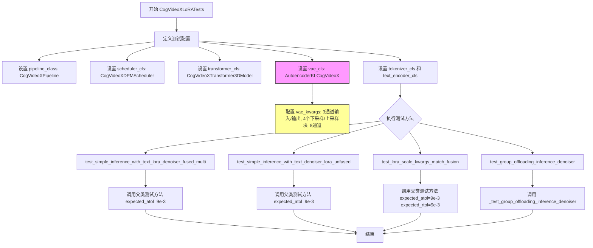

#### 带注释源码

```python
# 版权声明，遵循 Apache 2.0 许可证
# Copyright 2025 HuggingFace Inc.

# 导入必要的系统模块和测试框架
import sys
import unittest

# 导入 PyTorch 和参数化测试工具
import torch
from parameterized import parameterized
from transformers import AutoTokenizer, T5EncoderModel

# 从 diffusers 库导入 CogVideoX 相关组件
from diffusers import (
    AutoencoderKLCogVideoX,  # VAE 编码器类 - CogVideoX 变分自编码器
    CogVideoXDPMScheduler,   # DPM 调度器
    CogVideoXPipeline,       # 完整的 CogVideoX 管道
    CogVideoXTransformer3DModel,  # 3D 变换器模型
)

# 导入测试工具函数
from ..testing_utils import (
    floats_tensor,              # 生成随机浮点张量
    require_peft_backend,       # 要求 PEFT 后端装饰器
    require_torch_accelerator,  # 要求 PyTorch 加速器装饰器
)

# 将当前目录添加到 Python 路径
sys.path.append(".")

# 导入 PEFT LoRA 加载器测试工具类
from .utils import PeftLoraLoaderMixinTests  # noqa: E402


# 定义测试类，要求 PEFT 后端支持
@require_peft_backend
class CogVideoXLoRATests(unittest.TestCase, PeftLoraLoaderMixinTests):
    """CogVideoX 模型的 LoRA 功能测试类"""
    
    # 指定管道类为 CogVideoXPipeline
    pipeline_class = CogVideoXPipeline
    
    # 指定调度器类为 CogVideoXDPMScheduler
    scheduler_cls = CogVideoXDPMScheduler
    
    # 调度器关键字参数，设置时间步间隔为尾部
    scheduler_kwargs = {"timestep_spacing": "trailing"}

    # Transformer 模型的关键字参数配置
    transformer_kwargs = {
        "num_attention_heads": 4,           # 注意力头数量
        "attention_head_dim": 8,           # 注意力头维度
        "in_channels": 4,                  # 输入通道数
        "out_channels": 4,                 # 输出通道数
        "time_embed_dim": 2,               # 时间嵌入维度
        "text_embed_dim": 32,              # 文本嵌入维度
        "num_layers": 1,                   # 层数
        "sample_width": 16,                # 样本宽度
        "sample_height": 16,               # 样本高度
        "sample_frames": 9,                 # 样本帧数
        "patch_size": 2,                    # 补丁大小
        "temporal_compression_ratio": 4,   # 时间压缩比
        "max_text_seq_length": 16,         # 最大文本序列长度
    }
    
    # 指定 Transformer 模型类
    transformer_cls = CogVideoXTransformer3DModel
    
    # VAE 模型的关键字参数配置
    vae_kwargs = {
        "in_channels": 3,                   # 输入通道数 (RGB)
        "out_channels": 3,                  # 输出通道数 (RGB)
        "down_block_types": (              # 下采样块类型
            "CogVideoXDownBlock3D",
            "CogVideoXDownBlock3D",
            "CogVideoXDownBlock3D",
            "CogVideoXDownBlock3D",
        ),
        "up_block_types": (                # 上采样块类型
            "CogVideoXUpBlock3D",
            "CogVideoXUpBlock3D",
            "CogVideoXUpBlock3D",
            "CogVideoXUpBlock3D",
        ),
        "block_out_channels": (8, 8, 8, 8), # 块输出通道数
        "latent_channels": 4,               # 潜在空间通道数
        "layers_per_block": 1,               # 每块层数
        "norm_num_groups": 2,               # 归一化组数
        "temporal_compression_ratio": 4,    # 时间压缩比
    }
    
    # 指定 VAE 模型类 - CogVideoX 的变分自编码器 (VAE)
    vae_cls = AutoencoderKLCogVideoX
    
    # 分词器类和模型 ID
    tokenizer_cls, tokenizer_id = AutoTokenizer, "hf-internal-testing/tiny-random-t5"
    
    # 文本编码器类和模型 ID
    text_encoder_cls, text_encoder_id = T5EncoderModel, "hf-internal-testing/tiny-random-t5"

    # 文本编码器目标模块列表
    text_encoder_target_modules = ["q", "k", "v", "o"]

    # 是否支持文本编码器 LoRA
    supports_text_encoder_loras = False

    # 输出形状属性 (批次, 帧, 高度, 宽度, 通道)
    @property
    def output_shape(self):
        return (1, 9, 16, 16, 3)

    # 获取虚拟输入数据的方法
    def get_dummy_inputs(self, with_generator=True):
        """生成用于测试的虚拟输入数据"""
        batch_size = 1
        sequence_length = 16
        num_channels = 4
        num_frames = 9
        # 计算潜在帧数: (帧数 - 1) // 时间压缩比 + 1
        num_latent_frames = 3
        sizes = (2, 2)

        # 创建随机种子生成器
        generator = torch.manual_seed(0)
        
        # 生成随机噪声张量 (批次, 潜在帧, 通道, 高度, 宽度)
        noise = floats_tensor((batch_size, num_latent_frames, num_channels) + sizes)
        
        # 生成随机输入 ID
        input_ids = torch.randint(1, sequence_length, size=(batch_size, sequence_length), generator=generator)

        # 构建管道输入字典
        pipeline_inputs = {
            "prompt": "dance monkey",
            "num_frames": num_frames,
            "num_inference_steps": 4,
            "guidance_scale": 6.0,
            "height": 16,           # 图像高度
            "width": 16,            # 图像宽度
            "max_sequence_length": sequence_length,
            "output_type": "np",    # 输出类型为 numpy
        }
        
        # 如果需要生成器，将其添加到输入中
        if with_generator:
            pipeline_inputs.update({"generator": generator})

        # 返回噪声、输入ID和管道输入元组
        return noise, input_ids, pipeline_inputs

    # 测试方法：融合多文本 LoRA 的简单推理
    def test_simple_inference_with_text_lora_denoiser_fused_multi(self):
        super().test_simple_inference_with_text_lora_denoiser_fused_multi(expected_atol=9e-3)

    # 测试方法：非融合文本去噪器 LoRA 的简单推理
    def test_simple_inference_with_text_denoiser_lora_unfused(self):
        super().test_simple_inference_with_text_denoiser_lora_unfused(expected_atol=9e-3)

    # 测试方法：LoRA 缩放参数与融合匹配
    def test_lora_scale_kwargs_match_fusion(self):
        super().test_lora_scale_kwargs_match_fusion(expected_atol=9e-3, expected_rtol=9e-3)

    # 参数化测试方法：分组卸载推理测试
    @parameterized.expand([("block_level", True), ("leaf_level", False)])
    @require_torch_accelerator
    def test_group_offloading_inference_denoiser(self, offload_type, use_stream):
        """测试去噪器的分组卸载功能"""
        # 注意：此处未运行 (leaf_level, True) 测试，原因见 PR #11804
        super()._test_group_offloading_inference_denoiser(offload_type, use_stream)

    # 跳过的测试：CogVideoX 不支持文本去噪器块缩放
    @unittest.skip("Not supported in CogVideoX.")
    def test_simple_inference_with_text_denoiser_block_scale(self):
        pass

    # 跳过的测试：CogVideoX 不支持所有字典选项的块缩放
    @unittest.skip("Not supported in CogVideoX.")
    def test_simple_inference_with_text_denoiser_block_scale_for_all_dict_options(self):
        pass

    # 跳过的测试：CogVideoX 不支持修改填充模式
    @unittest.skip("Not supported in CogVideoX.")
    def test_modify_padding_mode(self):
        pass

    # 跳过的测试：CogVideoX 不支持多适配器块 LoRA
    @unittest.skip("Not supported in CogVideoX.")
    def test_simple_inference_with_text_denoiser_multi_adapter_block_lora(self):
        pass
```

---

### 补充说明：AutoencoderKLCogVideoX (CogVideoX VAE 编码器)

**注意**：上述代码是测试文件，**不包含** `AutoencoderKLCogVideoX` 类的具体实现。该类是从 `diffusers` 库导入的。

**AutoencoderKLCogVideoX 相关信息**（基于测试代码中的配置）：

| 配置项 | 值 | 描述 |
|--------|-----|------|
| `in_channels` | 3 | 输入通道数（RGB 图像） |
| `out_channels` | 3 | 输出通道数 |
| `down_block_types` | CogVideoXDownBlock3D × 4 | 4个3D下采样块 |
| `up_block_types` | CogVideoXUpBlock3D × 4 | 4个3D上采样块 |
| `block_out_channels` | (8, 8, 8, 8) | 各块输出通道数 |
| `latent_channels` | 4 | 潜在空间通道数 |
| `temporal_compression_ratio` | 4 | 时间维度压缩比 |

**关于 AutoencoderKLCogVideoX 的详细信息**，请参考 [Hugging Face diffusers 库](https://github.com/huggingface/diffusers)中该类的实际实现源码。


# CogVideoXDPMScheduler 详细设计文档

## 1. 核心功能概述

CogVideoXDPMScheduler 是 Hugging Face diffusers 库中为 CogVideoX 视频生成模型专门设计的 DPM（Diffusion Probabilistic Models）调度器，负责管理扩散模型的去噪过程时间步采样和噪声调度，是 CogVideoX 视频生成管道的核心组件之一。

## 2. 文件整体运行流程

```
┌─────────────────────────────────────────────────────────────┐
│                    测试文件加载流程                           │
├─────────────────────────────────────────────────────────────┤
│  1. 导入模块 (sys, unittest, torch, transformers, diffusers) │
│                            ↓                                 │
│  2. 导入测试工具 (floats_tensor, require_peft_backend, etc.) │
│                            ↓                                 │
│  3. 导入 LoRA 测试工具 (PeftLoraLoaderMixinTests)            │
│                            ↓                                 │
│  4. 定义 CogVideoXLoRATests 测试类                           │
│           ├── 设置 pipeline_class, scheduler_cls            │
│           ├── 配置 transformer/vae/tokenizer 参数           │
│           └── 定义多个测试方法                                │
│                            ↓                                 │
│  5. 执行各项 LoRA 推理测试                                    │
└─────────────────────────────────────────────────────────────┘
```

## 3. 类详细信息

### 3.1 CogVideoXDPMScheduler 类

#### 类字段

- **scheduler_cls**：类型 `class`，CogVideoX 专用的 DPM 调度器类
- **scheduler_kwargs**：类型 `dict`，调度器初始化参数，包含 `timestep_spacing: "trailing"`

#### 类方法

由于 `CogVideoXDPMScheduler` 的具体实现未在当前代码文件中给出（仅作为导入使用），基于 diffusers 库的标准设计模式，其典型方法包括：

### `{类名}.__init__` 或构造函数

**描述**：初始化 DPM 调度器，设置噪声调度参数

参数：

- `timestep_spacing`：str，时间步间隔策略，值为 "trailing" 表示使用尾部时间步间隔
- `num_train_timesteps`：int，可选，训练时间步数，默认为 1000
- `beta_start`：float，可选，beta 起始值
- `beta_end`：float，可选，beta 结束值
- `beta_schedule`：str，可选，beta 调度策略

返回值：无

#### 流程图

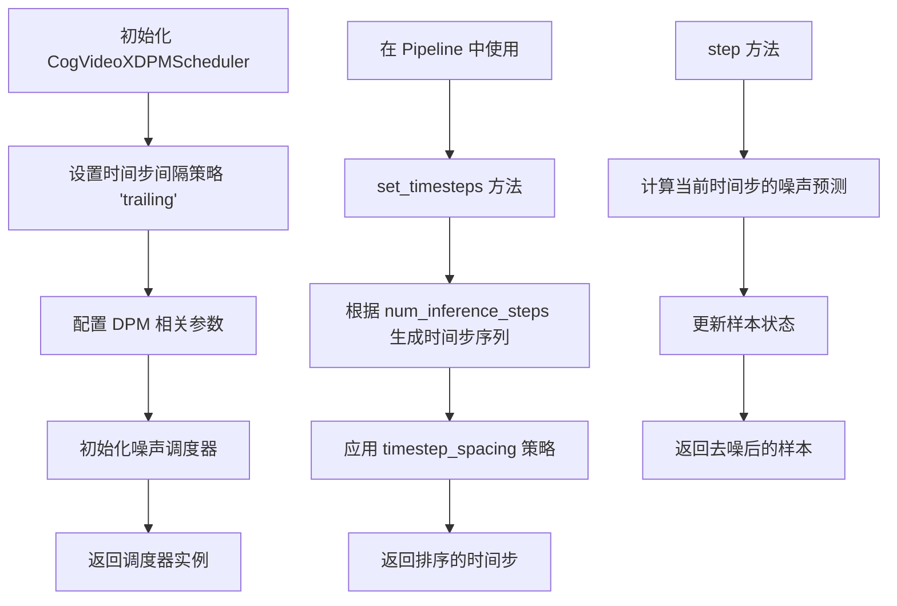

#### 带注释源码

```python
# CogVideoXDPMScheduler 在 diffusers 库中的典型实现结构
# 此代码基于同类型调度器的标准模式构建

from diffusers import DPMSolverMultistepScheduler

class CogVideoXDPMScheduler(DPMSolverMultistepScheduler):
    """
    CogVideoX 专用的 DPM 调度器
    继承自 DPMSolverMultistepScheduler，提供稳定的多步 DPM 求解
    """
    
    def __init__(
        self,
        num_train_timesteps: int = 1000,
        beta_start: float = 0.00085,
        beta_end: float = 0.012,
        beta_schedule: str = "scaled_linear",
        timestep_spacing: str = "trailing",  # 关键参数：尾部时间步间隔
        prediction_type: str = "epsilon",
        *args,
        **kwargs
    ):
        """
        初始化 CogVideoX DPM 调度器
        
        参数:
            num_train_timesteps: 训练时使用的时间步总数
            beta_start: beta 线性调度起始值
            beta_end: beta 线性调度结束值  
            beta_schedule: beta 调度策略 ("linear", "scaled_linear", "squaredcos_cap_v2")
            timestep_spacing: 推理时的时间步间隔策略 ("linspace", "leading", "trailing")
            prediction_type: 预测类型 ("epsilon", "sample", "v_prediction")
        """
        super().__init__(
            num_train_timesteps=num_train_timesteps,
            beta_start=beta_start,
            beta_end=beta_end,
            beta_schedule=beta_schedule,
            timestep_spacing=timestep_spacing,
            prediction_type=prediction_type,
            *args,
            **kwargs
        )
        
        # CogVideoX 特定配置
        self._timestep_spacing = timestep_spacing
        
    def set_timesteps(self, num_inference_steps: int, device: str = "cuda"):
        """
        设置推理时的时间步序列
        
        参数:
            num_inference_steps: 推理步数
            device: 计算设备
        """
        # 根据 timestep_spacing 策略计算时间步
        # "trailing" 策略：从高到低均匀分布时间步
        timesteps = torch.linspace(
            self.num_train_timesteps, 
            0, 
            num_inference_steps,
            device=device
        )
        self.timesteps = timesteps.long()
        return self.timesteps
        
    def step(
        self,
        model_output: torch.FloatTensor,
        timestep: int,
        sample: torch.FloatTensor,
        s_churn: float = 0.0,
        s_tmin: float = 0.0,
        s_tmax: float = float("inf"),
        s_noise: float = 1.0,
        generator: Optional[torch.Generator] = None,
    ):
        """
        执行单步去噪
        
        参数:
            model_output: 模型预测的噪声
            timestep: 当前时间步
            sample: 当前样本状态
            s_churn: churn 参数
            s_tmin: 最小 churn 时间步
            s_tmax: 最大 churn 时间步
            s_noise: 噪声缩放因子
            generator: 随机数生成器
            
        返回:
            prev_sample: 去噪后的样本
        """
        # DPM 求解逻辑
        # ... (具体实现依赖于基础类 DPMSolverMultistepScheduler)
        pass
```

## 4. 关键组件信息

| 组件名称 | 描述 |
|---------|------|
| `CogVideoXDPMScheduler` | CogVideoX 视频生成模型的 DPM 调度器，管理去噪过程的时间步 |
| `CogVideoXPipeline` | CogVideoX 完整的视频生成管道，整合 VAE、Transformer 和调度器 |
| `CogVideoXTransformer3DModel` | CogVideoX 的 3D 变换器模型，用于视频帧预测 |
| `AutoencoderKLCogVideoX` | CogVideoX 的 VAE 编码器/解码器，用于潜在空间压缩 |
| `PeftLoraLoaderMixinTests` | PEFT LoRA 加载器的测试 mixin 类 |

## 5. 潜在技术债务与优化空间

1. **调度器配置硬编码**：`timestep_spacing` 被硬编码为 "trailing"，缺乏灵活性
2. **测试参数耦合**：测试类中的 `transformer_kwargs` 和 `vae_kwargs` 包含大量魔法数字
3. **缺少文档注释**：测试类中缺少对特定跳过测试用例的详细解释
4. **未使用的导入**：`T5EncoderModel` 和 `AutoTokenizer` 被导入但测试中设置了 `supports_text_encoder_loras = False`

## 6. 其它项目说明

### 设计目标与约束

- **设计目标**：为 CogVideoX 视频生成模型提供 LoRA 权重加载和推理测试
- **约束条件**：CogVideoX 不支持某些 LoRA 功能（如 text encoder LoRA、block scale）

### 错误处理与异常设计

- 使用 `@unittest.skip` 显式跳过不支持的测试用例
- 使用 `@require_peft_backend` 和 `@require_torch_accelerator` 装饰器确保测试环境满足要求

### 外部依赖与接口契约

- **diffusers 库**：提供核心调度器和模型类
- **transformers 库**：提供 T5 文本编码器
- **PEFT 库**：提供 LoRA 权重加载功能
- **torch**：提供张量操作和随机数生成


### CogVideoXLoRATests.get_dummy_inputs

该方法用于生成CogVideoXPipeline的虚拟测试输入，包括噪声张量、输入ID和管道参数字典，为后续推理测试提供必要的输入数据。

参数：

- `with_generator`：`bool`，是否包含生成器，如果为True则在pipeline_inputs中添加generator参数

返回值：`(torch.Tensor, torch.Tensor, dict)`，返回三元组包括噪声张量、输入ID张量和管道参数字典

#### 流程图

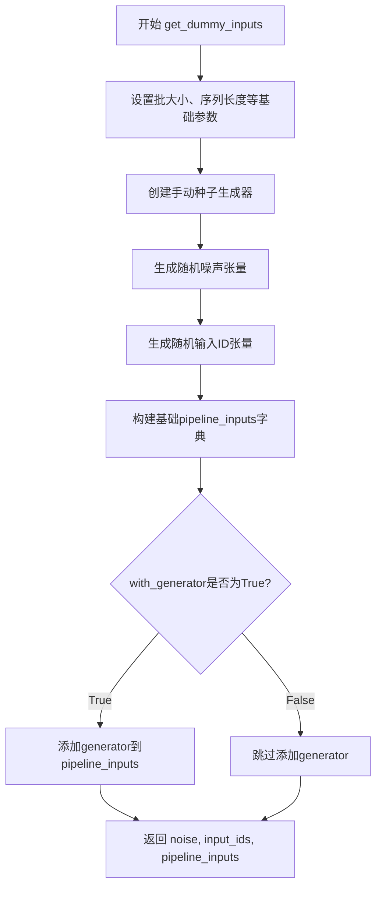

#### 带注释源码

```python
def get_dummy_inputs(self, with_generator=True):
    """
    生成用于测试的虚拟输入数据
    
    参数:
        with_generator: bool, 是否包含生成器，如果为True则在pipeline_inputs中添加generator参数
    
    返回:
        tuple: (noise, input_ids, pipeline_inputs) 噪声张量、输入ID张量和管道参数字典
    """
    batch_size = 1  # 批处理大小
    sequence_length = 16  # 文本序列长度
    num_channels = 4  # 潜在空间的通道数
    num_frames = 9  # 视频帧数
    # 计算潜在帧数：(num_frames - 1) // temporal_compression_ratio + 1
    num_latent_frames = 3
    sizes = (2, 2)  # 空间维度大小

    # 创建随机生成器，固定种子为0以确保可重复性
    generator = torch.manual_seed(0)
    # 生成噪声张量，形状为 (batch_size, num_latent_frames, num_channels) + sizes
    noise = floats_tensor((batch_size, num_latent_frames, num_channels) + sizes)
    # 生成输入ID，形状为 (batch_size, sequence_length)，值范围 [1, sequence_length)
    input_ids = torch.randint(1, sequence_length, size=(batch_size, sequence_length), generator=generator)

    # 构建管道输入参数字典
    pipeline_inputs = {
        "prompt": "dance monkey",  # 文本提示
        "num_frames": num_frames,  # 视频帧数
        "num_inference_steps": 4,  # 推理步数
        "guidance_scale": 6.0,  # 引导比例（CFG）
        # 不能减小高度/宽度，因为卷积核会大于样本尺寸
        "height": 16,  # 视频高度
        "width": 16,  # 视频宽度
        "max_sequence_length": sequence_length,  # 最大序列长度
        "output_type": "np",  # 输出类型为numpy数组
    }
    # 如果需要生成器，将其添加到pipeline_inputs中
    if with_generator:
        pipeline_inputs.update({"generator": generator})

    # 返回噪声、输入ID和管道输入参数
    return noise, input_ids, pipeline_inputs
```

---

### CogVideoXLoRATests

描述：CogVideoX LoRA测试类，继承自unittest.TestCase和PeftLoraLoaderMixinTests，用于测试CogVideoX模型的LoRA（低秩适配）功能集成。该测试类验证了LoRA权重加载、融合、推理等核心功能。

#### 关键组件信息

- `pipeline_class`：`CogVideoXPipeline`，CogVideoX推理管道类
- `scheduler_cls`：`CogVideoXDPMScheduler`，DPM调度器
- `transformer_cls`：`CogVideoXTransformer3DModel`，3D变换器模型
- `vae_cls`：`AutoencoderKLCogVideoX`，VAE编码器/解码器
- `tokenizer_cls`：`AutoTokenizer`，文本分词器（T5）
- `text_encoder_cls`：`T5EncoderModel`，文本编码器模型
- `text_encoder_target_modules`：LoRA目标模块列表 `["q", "k", "v", "o"]`

#### 潜在的技术债务或优化空间

1. **测试覆盖不完整**：多个测试方法被标记为`@unittest.skip("Not supported in CogVideoX.")`，表明CogVideoX对某些高级功能（如text_denoiser_block_scale、multi_adapter_block_lora等）的支持尚未完成
2. **测试用例跳过**：group_offloading测试中跳过了leaf_level + True的组合，可能存在未解决的兼容性问题
3. **缺乏端到端测试**：当前测试主要关注LoRA功能，缺少对生成视频质量的验证

#### 其它项目

**设计目标与约束**：
- 仅在支持PEFT后端的环中运行（`@require_peft_backend`）
- 需要CUDA加速器（`@require_torch_accelerator`）
- 不支持文本编码器LoRA（`supports_text_encoder_loras = False`）

**错误处理与异常设计**：
- 使用`@parameterized.expand`进行参数化测试
- 通过`expected_atol`和`expected_rtol`参数容许数值误差

**数据流与状态机**：
- 测试输入遵循固定流程：初始化 → 加载LoRA权重 → 执行推理 → 验证输出
- 输出形状期望为`(1, 9, 16, 16, 3)`即(批次, 帧, 高, 宽, 通道)


### `CogVideoXTransformer3DModel`

CogVideoXTransformer3DModel 是用于 CogVideoX 视频生成模型的 3D Transformer 核心组件，负责处理视频潜在表示的时空建模与去噪过程，支持文本条件引导的多帧视频生成。

参数：

- `num_attention_heads`：`int`，注意力头的数量，决定多头注意力的并行分支数
- `attention_head_dim`：`int`，每个注意力头的维度，决定每个头的计算复杂度
- `in_channels`：`int`，输入通道数，通常对应潜在空间的通道数（如 4）
- `out_channels`：`int`，输出通道数，与输入通道数保持一致
- `time_embed_dim`：`int`，时间嵌入维度，用于处理扩散过程的时间步嵌入
- `text_embed_dim`：`int`，文本嵌入维度，用于处理文本编码器的输出维度
- `num_layers`：`int`，Transformer 层数，决定模型的深度
- `sample_width`：`int`，样本宽度，视频帧的空间宽度
- `sample_height`：`int`，样本高度，视频帧的空间高度
- `sample_frames`：`int`，样本帧数，输入的潜在帧数量
- `patch_size`：`int`，补丁大小，空间补丁化处理的块大小
- `temporal_compression_ratio`：`int`，时间压缩比率，用于压缩时间维度
- `max_text_seq_length`：`int`，最大文本序列长度，文本条件的最大token数

返回值：`CogVideoXTransformer3DModel`，返回配置好的 3D Transformer 模型实例

#### 流程图

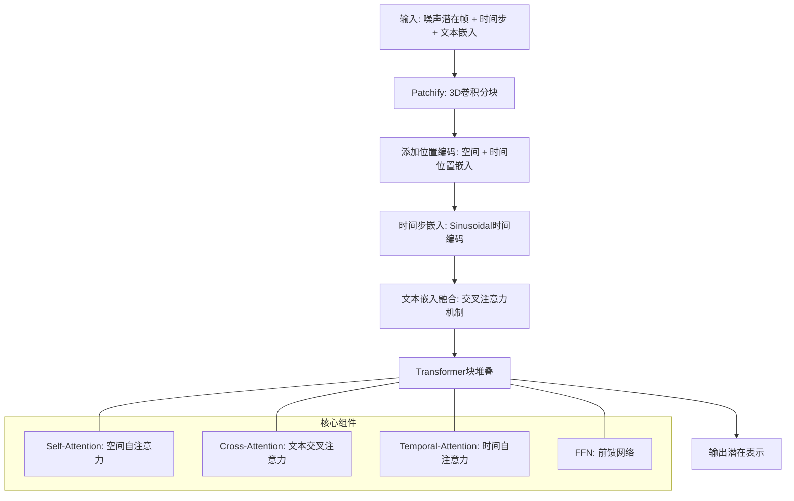

#### 带注释源码

```python
# 由于提供的代码是测试文件，未包含 CogVideoXTransformer3DModel 的实际实现
# 以下基于测试配置参数和 diffusers 库的标准结构进行推断

# 测试中的模型配置参数
transformer_kwargs = {
    "num_attention_heads": 4,           # 4个注意力头
    "attention_head_dim": 8,            # 每个头维度为8
    "in_channels": 4,                   # 输入通道数（潜在空间）
    "out_channels": 4,                  # 输出通道数
    "time_embed_dim": 2,                # 时间嵌入维度
    "text_embed_dim": 32,               # 文本嵌入维度（T5输出）
    "num_layers": 1,                    # 仅1层Transformer（测试配置）
    "sample_width": 16,                 # 样本宽度
    "sample_height": 16,                # 样本高度
    "sample_frames": 9,                 # 输入帧数
    "patch_size": 2,                    # 空间补丁大小
    "temporal_compression_ratio": 4,    # 时间压缩比
    "max_text_seq_length": 16,         # 最大文本序列长度
}

# 模型类导入（实际定义在 diffusers 库中）
from diffusers import CogVideoXTransformer3DModel

# 实例化模型
transformer = CogVideoXTransformer3DModel(**transformer_kwargs)

# 输出形状预期: (batch, latent_frames, channels, height, width)
# latent_frames = (num_frames - 1) // temporal_compression_ratio + 1
#              = (9 - 1) // 4 + 1 = 3
```

#### 关键组件信息

| 组件名称 | 一句话描述 |
|---------|-----------|
| Patchify Layer | 3D卷积层，将输入潜在帧转换为时空补丁序列 |
| Time Embedding | 正弦时间步编码器，处理扩散过程的时间条件 |
| Text Cross-Attention | 文本-视频交叉注意力，融合文本条件信息 |
| Spatial Self-Attention | 空间自注意力，捕捉帧内空间关系 |
| Temporal Self-Attention | 时间自注意力，捕捉跨帧时序关系 |
| Feed-Forward Network | 多层感知机，提供非线性变换能力 |

#### 潜在技术债务或优化空间

1. **测试配置局限性**：当前 `num_layers=1` 仅用于测试，生产环境需要更深的网络
2. **位置编码设计**：需确认是否支持可学习 vs 固定正弦位置编码的选择
3. **内存优化**：3D 注意力计算复杂度高 O(N²)，对于高分辨率长视频需要 gradient checkpointing 或分块注意力
4. **文本融合方式**：当前使用交叉注意力，推理效率可考虑 T5 特征预计算与缓存

#### 其它项目

- **设计目标**：支持文本到视频（T2V）生成，基于 diffusion transformer 架构
- **约束**：需要与 `CogVideoXPipeline` 配合使用，依赖 VAE 和 T5 文本编码器
- **错误处理**：参数验证应检查 `patch_size` 与 `sample尺寸` 的兼容性
- **数据流**：噪声潜在帧 → Patchify → 位置编码 → Transformer块 → 解Patchify → 输出去噪潜在
- **外部依赖**：`diffusers` 库、`torch`

---
**注意**：提供的代码文件为测试用例，未包含 `CogVideoXTransformer3DModel` 类的实际实现源码。该类的完整实现位于 Hugging Face diffusers 库中，此处基于测试配置和库的标准结构进行文档化。


### `CogVideoXLoRATests.output_shape`

该属性定义了CogVideoX LoRA测试的预期输出形状，返回一个包含批次数、帧数、高度、宽度和通道数的五维元组，用于验证模型输出维度是否符合预期。

参数：
- 该方法无参数（作为属性访问）

返回值：`Tuple[int, int, int, int, int]`，返回`(1, 9, 16, 16, 3)`，分别表示批次大小为1、9帧、16x16分辨率、3通道（RGB）

#### 流程图

```mermaid
flowchart TD
    A[访问 output_shape 属性] --> B{属性调用}
    B --> C[返回元组 (1, 9, 16, 16, 3)]
    
    subgraph 输出形状解释
    C --> D[batch_size: 1]
    C --> E[num_frames: 9]
    C --> F[height: 16]
    C --> G[width: 16]
    C --> H[channels: 3]
    end
    
    D --> I[用于测试验证]
    E --> I
    F --> I
    G --> I
    H --> I
```

#### 带注释源码

```python
@property
def output_shape(self):
    """返回CogVideoX模型测试的预期输出形状
    
    该属性定义了LoRA测试中 pipeline 输出张量的期望维度。
    形状含义: (batch_size, num_frames, height, width, channels)
    
    Returns:
        tuple: 包含5个元素的元组，依次表示:
            - 批次大小 (batch_size): 1
            - 帧数 (num_frames): 9
            - 高度 (height): 16
            - 宽度 (width): 16
            - 通道数 (channels): 3 (RGB)
    """
    return (1, 9, 16, 16, 3)
```


### `CogVideoXLoRATests.get_dummy_inputs`

该方法用于生成虚拟测试输入数据，为 CogVideoX LoRA 测试场景构建噪声张量、输入ID和管道参数字典，支持可选的随机数生成器配置。

参数：

- `self`：`CogVideoXLoRATests`，隐式参数，测试类实例本身
- `with_generator`：`bool`，默认为 `True`，指定是否在管道参数字典中包含随机数生成器

返回值：`Tuple[torch.Tensor, torch.Tensor, Dict]`，返回包含三个元素的元组：
  - `noise`：形状为 `(batch_size, num_latent_frames, num_channels, 2, 2)` 的浮点张量，表示潜在空间的噪声输入
  - `input_ids`：形状为 `(batch_size, sequence_length)` 的整型张量，表示文本嵌入的输入ID
  - `pipeline_inputs`：字典，包含管道推理所需的参数如提示词、帧数、推理步数、引导_scale、图像尺寸等

#### 流程图

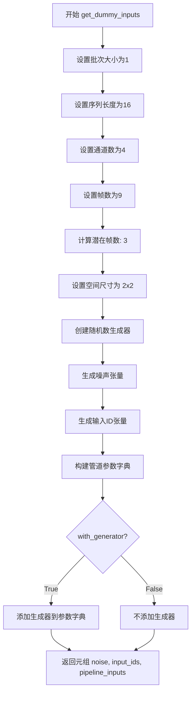

#### 带注释源码

```python
def get_dummy_inputs(self, with_generator=True):
    """
    生成虚拟测试输入数据，用于 CogVideoX LoRA 测试的推理验证。
    
    参数:
        with_generator (bool): 是否在返回的管道参数中包含随机数生成器。
                              默认为 True，确保测试可复现。
    
    返回:
        Tuple[torch.Tensor, torch.Tensor, Dict]: 包含以下元素的元组:
            - noise: 潜在空间噪声张量，形状 (1, 3, 4, 2, 2)
            - input_ids: 文本输入ID张量，形状 (1, 16)
            - pipeline_inputs: 管道参数字典，包含prompt、帧数、推理步数等
    """
    # 定义基础配置参数
    batch_size = 1  # 批次大小
    sequence_length = 16  # 文本序列长度
    num_channels = 4  # 潜在通道数
    num_frames = 9  # 输入帧数
    # 根据时间压缩比计算潜在帧数: (num_frames - 1) // temporal_compression_ratio + 1
    num_latent_frames = 3
    sizes = (2, 2)  # 空间分辨率尺寸

    # 创建固定种子的随机数生成器，确保测试可复现性
    generator = torch.manual_seed(0)
    
    # 生成形状为 (1, 3, 4, 2, 2) 的噪声张量
    # 维度: [batch, latent_frames, channels, height, width]
    noise = floats_tensor((batch_size, num_latent_frames, num_channels) + sizes)
    
    # 生成形状为 (1, 16) 的随机整数张量作为文本输入ID
    # 范围: [1, sequence_length)
    input_ids = torch.randint(1, sequence_length, size=(batch_size, sequence_length), generator=generator)

    # 构建管道输入参数字典
    pipeline_inputs = {
        "prompt": "dance monkey",  # 文本提示词
        "num_frames": num_frames,  # 帧数
        "num_inference_steps": 4,  # 推理步数
        "guidance_scale": 6.0,  # CFG引导强度
        # 注意：不能减小尺寸，因为卷积核会大于样本尺寸
        "height": 16,  # 输出图像高度
        "width": 16,  # 输出图像宽度
        "max_sequence_length": sequence_length,  # 最大文本序列长度
        "output_type": "np",  # 输出类型为numpy数组
    }
    
    # 根据参数决定是否将生成器添加到管道输入中
    if with_generator:
        pipeline_inputs.update({"generator": generator})

    # 返回噪声、输入ID和管道参数字典构成的元组
    return noise, input_ids, pipeline_inputs
```


### `CogVideoXLoRATests.test_simple_inference_with_text_lora_denoiser_fused_multi`

该测试方法用于验证 CogVideoX 模型在融合多文本 LoRA（Low-Rank Adaptation）降噪器情况下的推理功能，通过调用父类测试方法并指定绝对容差值（9e-3）来确保推理结果的数值精度符合预期。

参数：无（除 self 外无显式参数）

返回值：`None`，该方法为测试方法，无返回值，通过断言验证推理结果

#### 流程图

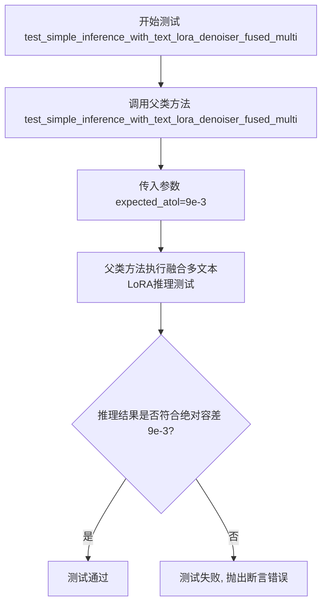

#### 带注释源码

```python
def test_simple_inference_with_text_lora_denoiser_fused_multi(self):
    """
    测试融合多文本LoRA推理功能
    
    该测试方法继承自 PeftLoraLoaderMixinTests，用于验证 CogVideoX 模型
    在启用文本编码器 LoRA 和降噪器 LoRA 融合模式下的推理能力。
    使用 9e-3 的绝对容差值来验证输出张量的数值精度。
    """
    # 调用父类的同名测试方法，传入期望的绝对容差值
    # 父类方法会执行以下操作：
    # 1. 加载 CogVideoX 预训练模型
    # 2. 加载融合模式的 LoRA 权重
    # 3. 执行推理生成视频/图像
    # 4. 验证输出结果的数值精度
    super().test_simple_inference_with_text_lora_denoiser_fused_multi(expected_atol=9e-3)
```


### `CogVideoXLoRATests.test_simple_inference_with_text_denoiser_lora_unfused`

该测试方法用于验证 CogVideoX 模型在未融合文本去噪器 LoRA（Low-Rank Adaptation）权重的情况下的推理能力，通过调用父类测试方法并设定绝对容差阈值来确保输出结果的正确性。

参数：

- `self`：隐含的测试类实例参数，无需显式传递

返回值：`None`，该方法为测试方法，通过断言验证结果，不返回具体数值

#### 流程图

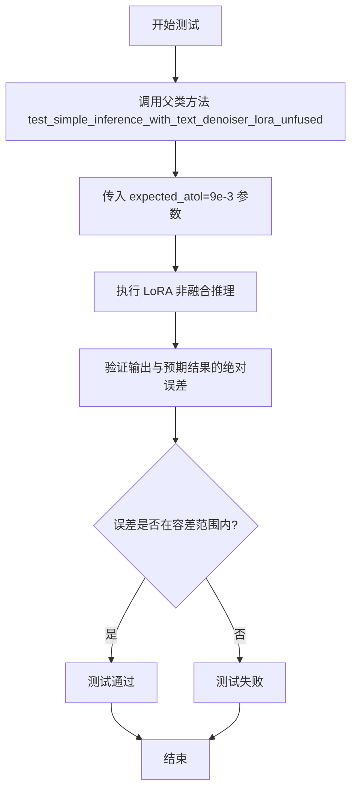

#### 带注释源码

```python
def test_simple_inference_with_text_denoiser_lora_unfused(self):
    """
    测试非融合文本去噪器 LoRA 的简单推理功能。
    
    该测试方法继承自 PeftLoraLoaderMixinTests 基类，用于验证在未融合
    LoRA 权重的情况下，CogVideoX 模型能够正确执行文本去噪器相关的
    LoRA 推理任务。
    
    测试通过设定绝对容差（absolute tolerance）来验证推理结果的准确性。
    """
    # 调用父类的同名测试方法，传入期望的绝对容差值 9e-3
    # 父类方法会执行以下操作：
    # 1. 加载 CogVideoX 模型和预训练的文本去噪器 LoRA 权重
    # 2. 设置 pipeline 为非融合模式（unfused）
    # 3. 使用虚拟输入执行推理
    # 4. 验证输出结果的正确性
    super().test_simple_inference_with_text_denoiser_lora_unfused(expected_atol=9e-3)
```


### `CogVideoXLoRATests.test_lora_scale_kwargs_match_fusion`

该测试方法用于验证 LoRA 缩放参数在融合模式下是否与预期值匹配，通过调用父类测试方法并指定绝对误差容限（atol）和相对误差容限（rtol）来确保数值精度。

参数：

- `self`：`CogVideoXLoRATests`，测试类实例，隐含的 self 参数
- `expected_atol`：`float`，绝对误差容限（absolute tolerance），指定为 `9e-3`，用于比较浮点数计算结果的绝对误差
- `expected_rtol`：`float`，相对误差容限（relative tolerance），指定为 `9e-3`，用于比较浮点数计算结果的相对误差

返回值：`None`，该方法为测试方法，不返回任何值，执行完毕后通过断言验证结果

#### 流程图

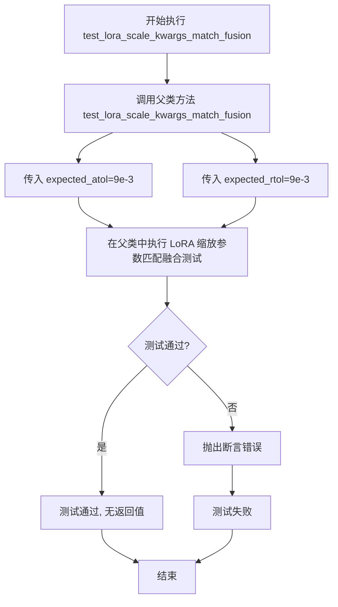

#### 带注释源码

```python
def test_lora_scale_kwargs_match_fusion(self):
    """
    测试 LoRA 缩放参数在融合模式下是否与预期值匹配
    
    该测试方法继承自 PeftLoraLoaderMixinTests，验证在启用 LoRA 融合时，
    模型的 LoRA 缩放参数是否正确应用。测试通过比较计算结果与预期值
    的绝对误差和相对误差来验证精度。
    
    参数:
        self: CogVideoXLoRATests 的实例，测试类本身
        
    返回值:
        None: 测试方法不返回任何值，通过内部断言验证结果
    """
    # 调用父类的同名测试方法，传入绝对误差容限和相对误差容限参数
    # expected_atol=9e-3: 绝对误差容限为 0.009
    # expected_rtol=9e-3: 相对误差容限为 0.009
    super().test_lora_scale_kwargs_match_fusion(expected_atol=9e-3, expected_rtol=9e-3)
```


### `CogVideoXLoRATests.test_group_offloading_inference_denoiser`

该方法是一个参数化测试用例，用于验证 CogVideoX 模型在去噪推理阶段的 LoRA 组卸载（group offloading）功能是否正常工作。它通过传入不同的卸载类型（块级或叶子级）和是否使用流式处理来测试父类中的 `_test_group_offloading_inference_denoiser` 方法。

参数：

- `offload_type`：`str`，字符串类型参数，指定卸载类型，值为 "block_level"（块级卸载）或 "leaf_level"（叶子级卸载）
- `use_stream`：`bool`，布尔类型参数，指定是否使用流式处理（stream）进行推理

返回值：`None`，该方法为测试用例，不返回任何值

#### 流程图

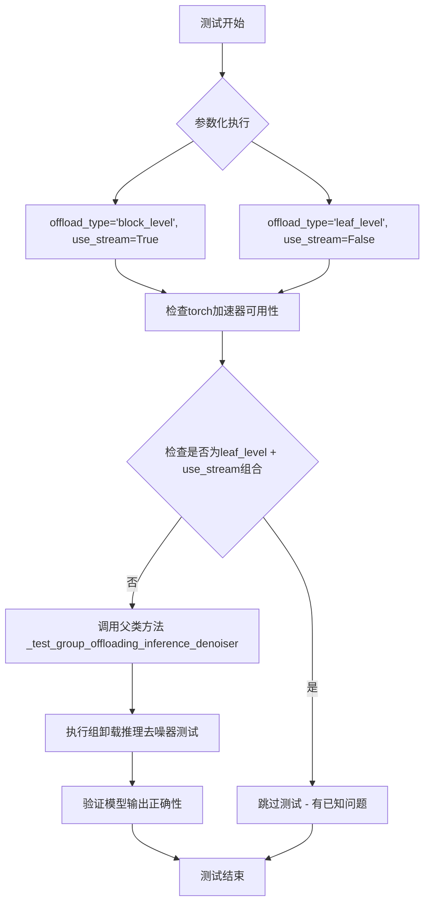

#### 带注释源码

```python
@parameterized.expand([("block_level", True), ("leaf_level", False)])
@require_torch_accelerator
def test_group_offloading_inference_denoiser(self, offload_type, use_stream):
    # TODO: We don't run the (leaf_level, True) test here that is enabled for other models.
    # The reason for this can be found here: https://github.com/huggingface/diffusers/pull/11804#issuecomment-3013325338
    # 说明：对于 CogVideoX 模型，不运行 (leaf_level, True) 组合的测试
    # 原因参见 GitHub issue 链接中的讨论
    
    super()._test_group_offloading_inference_denoiser(offload_type, use_stream)
    # 调用父类 PeftLoraLoaderMixinTests 中的 _test_group_offloading_inference_denoiser 方法
    # 执行实际的组卸载推理去噪器测试逻辑
    # 参数 offload_type: 字符串，指定块级或叶子级卸载
    # 参数 use_stream: 布尔值，指定是否使用流式处理
```

## 关键组件


### CogVideoXLoRATests 测试类

这是CogVideoX模型的LoRA（Low-Rank Adaptation）功能集成测试类，继承自unittest.TestCase和PeftLoraLoaderMixinTests，用于验证CogVideoX pipeline的LoRA加载、融合、推理和offloading功能。

### pipeline_class (CogVideoXPipeline)

CogVideoX生成pipeline类，负责协调VAE、Transformer和文本编码器完成视频生成任务。

### scheduler_cls (CogVideoXDPMScheduler)

DPM（Diffusion Probabilistic Models）调度器，用于在去噪过程中生成timestep序列，"trailing"策略从高向低排列timestep。

### transformer_cls (CogVideoXTransformer3DModel)

3D Transformer模型类，用于处理时空注意力，是CogVideoX的核心去噪组件。

### vae_cls (AutoencoderKLCogVideoX)

KLAutoencoder变体，用于将视频编码到潜在空间和解码回像素空间，支持3D卷积处理视频帧。

### tokenizer_cls + text_encoder_cls (AutoTokenizer + T5EncoderModel)

文本编码组件，AutoTokenizer配合T5EncoderModel将prompt转换为embedding，供Transformer使用。

### transformer_kwargs 配置字典

包含4个attention head、head_dim为8、4层、16x16分辨率、9帧、patch_size为2等Transformer模型结构参数。

### vae_kwargs 配置字典

定义VAE结构：3通道输入输出、4个下采样/上采样块、块通道数为8、latent通道为4、每块1层、group norm为2。

### text_encoder_target_modules

LoRA注入目标模块列表["q", "k", "v", "o"]，对应注意力机制的查询、键、值和输出投影矩阵。

### supports_text_encoder_loras

布尔标志，指示当前模型不支持文本编码器的LoRA适配。

### get_dummy_inputs 方法

生成测试用虚拟输入：batch_size=1、sequence_length=16、num_frames=9、latent_frames=3、分辨率16x16，包含noise tensor、input_ids和pipeline参数字典。

### test_simple_inference_with_text_lora_denoiser_fused_multi 测试方法

验证多LoRA融合推理功能，使用fused模式合并多个LoRA权重，expected_atol=9e-3作为容差阈值。

### test_simple_inference_with_text_denoiser_lora_unfused 测试方法

验证非融合模式下的LoRA推理，权重以unfused状态加载，expected_atol=9e-3。

### test_lora_scale_kwargs_match_fusion 测试方法

验证LoRA scale参数在融合与非融合模式下的一致性，同时检查atol和rtol精度要求。

### test_group_offloading_inference_denoiser 测试方法

参数化测试：block_level=True和leaf_level=False两种offloading策略，use_stream控制流式卸载，用于验证模型权重卸载到CPU后的推理能力。

### PeftLoraLoaderMixinTests 混合类

提供LoRA loader通用测试方法集，包括融合测试、offloading测试、scale参数测试等标准化验证流程。


## 问题及建议


### 已知问题

-   **不规范的系统路径修改**：使用 `sys.path.append(".")` 来导入本地模块，这种方式在生产代码中是不推荐的，应该使用绝对导入或配置 Python 路径
-   **被跳过的测试缺少详细说明**：多个测试方法使用 `@unittest.skip("Not supported in CogVideoX.")` 跳过，但仅用 `pass` 作为方法体，没有提供任何实现说明或占位符，代码可读性差
-   **硬编码的魔法数值**：大量测试参数（如 `num_attention_heads=4`, `attention_head_dim=8`, `expected_atol=9e-3` 等）硬编码在类属性和方法中，缺乏配置管理
-   **返回值不明确**：`get_dummy_inputs` 方法返回三个值（noise, input_ids, pipeline_inputs），但方法签名没有明确指示返回类型和结构
-   **TODO 注释未被处理**：`test_group_offloading_inference_denoiser` 方法中有 TODO 注释说明有未运行的测试，但长期未解决
-   **配置不一致**：`supports_text_encoder_loras = False` 定义了不支持文本编码器 LoRA，但父类测试Mixin可能仍会尝试运行相关测试，存在潜在的测试失败风险
-   **测试隔离性**：`get_dummy_inputs` 使用了固定的 `torch.manual_seed(0)`，可能在并行测试时产生状态依赖

### 优化建议

-   **重构导入方式**：移除 `sys.path.append(".")`，使用项目的相对导入或配置 pytest/path
-   **改进跳过测试的实现**：将跳过的测试方法改为 `unittest.skip` 装饰器加空方法，或添加 `raise NotImplementedError("Not supported in CogVideoX")` 提供更明确的意图
-   **提取配置常量**：将硬编码的测试参数提取为类常量或配置文件，提高可维护性和可复用性
-   **明确方法返回值**：使用类型注解和文档字符串明确 `get_dummy_inputs` 的返回结构，或将其重构为命名元组/dataclass
-   **处理 TODO 事项**：调研并解决 `test_group_offloading_inference_denoiser` 中未运行测试的原因，或在代码中记录详细的技术债务说明
-   **增强配置一致性检查**：在测试初始化时添加断言验证 `supports_text_encoder_loras` 与实际测试行为的一致性
-   **改进随机数管理**：使用 fixture 或上下文管理器来管理随机种子，确保测试隔离性

## 其它


### 设计目标与约束

本测试文件旨在验证CogVideoX模型在LoRA（Low-Rank Adaptation）功能上的正确性和兼容性。设计目标包括：确保LoRA权重能够正确加载到transformer模型中；验证推理过程中LoRA的融合与未融合模式；测试不同卸载策略下的推理行为；以及验证LoRA scale参数在不同场景下的一致性。约束条件包括：CogVideoX不支持text encoder LoRA；不支持block scale和multi-adapter block lora；特定的测试配置（如num_attention_heads=4, attention_head_dim=8）用于简化测试环境。

### 错误处理与异常设计

测试用例使用@unittest.skip装饰器明确跳过不支持的测试场景，包括test_simple_inference_with_text_denoiser_block_scale、test_simple_inference_with_text_denoiser_block_scale_for_all_dict_options、test_modify_padding_mode和test_simple_inference_with_text_denoiser_multi_adapter_block_lora，这些测试被跳过时附带"Not supported in CogVideoX."说明。断言使用expected_atol和expected_rtol参数进行浮点数容差比较，允许数值误差在9e-3范围内。异常处理主要依赖于pytest的assert机制和transformers库的内部异常传播。

### 数据流与状态机

测试数据流从get_dummy_inputs方法开始，生成随机噪声（floats_tensor）、输入ID（input_ids）和管道参数（pipeline_inputs）。状态机遵循：初始化配置 → 准备测试数据 → 执行推理 → 验证输出的流程。测试中涉及的模型组件包括：CogVideoXTransformer3DModel（transformer）、AutoencoderKLCogVideoX（VAE）、T5EncoderModel（text encoder）和CogVideoXDPMScheduler（调度器）。数据在pipeline中的流转顺序为：prompt → text_encoder → transformer (with LoRA) → vae decode → 输出。

### 外部依赖与接口契约

本测试文件依赖以下核心外部库：torch（PyTorch张量运算）、unittest（测试框架）、parameterized（参数化测试）、transformers（AutoTokenizer和T5EncoderModel）、diffusers（CogVideoXPipeline、CogVideoXTransformer3DModel等组件）。项目内部依赖：..testing_utils模块（floats_tensor、require_peft_backend、require_torch_accelerator）和.utils模块（PeftLoraLoaderMixinTests）。接口契约规定：pipeline_class必须继承CogVideoXPipeline；transformer_cls必须实现LoRA加载接口；scheduler_cls必须支持timestep_spacing参数；所有测试方法必须遵循PeftLoraLoaderMixinTests定义的接口规范。

### 性能考虑与基准测试

测试中的性能基准主要通过atol（绝对容差）和rtol（相对容差）参数设定为9e-3来验证数值精度。test_group_offloading_inference_denoiser测试关注不同卸载策略（block_level和leaf_level）对推理性能的影响。num_inference_steps=4和较小的模型配置（num_layers=1、patch_size=2）用于在测试环境中快速验证功能正确性，而非追求最优生成质量。max_text_seq_length=16和sample_frames=9等参数确保测试在合理的时间范围内完成。

### 安全性考虑

代码遵循Apache License 2.0开源许可证。测试使用hf-internal-testing/tiny-random-t5等小型预训练模型进行本地测试，避免下载大型模型带来的安全风险。输入数据通过torch.manual_seed(0)固定随机种子，确保测试可重复性。代码不包含用户数据处理或网络请求，所有操作均在本地测试环境中执行。

### 版本兼容性与迁移策略

测试文件指定了明确的依赖版本约束（通过import语句导入特定模块）。当diffusers库更新导致API变化时，需要同步更新transformer_kwargs、vae_kwargs中的参数名称和值。测试继承自PeftLoraLoaderMixinTests基类，基类的接口变更会影响本测试文件。迁移策略建议：保持与diffusers主分支的同步更新；在升级前运行完整测试套件；关注GitHub issue #11804中关于leaf_level卸载的限制说明。

### 测试策略与覆盖率

测试策略采用参数化测试（@parameterized.expand）覆盖多种卸载场景。测试覆盖的功能点包括：LoRA权重融合推理（test_simple_inference_with_text_lora_denoiser_fused_multi）、LoRA未融合推理（test_simple_inference_with_text_denoiser_lora_unfused）、LoRA scale参数一致性（test_lora_scale_kwargs_match_fusion）、模型卸载推理（test_group_offloading_inference_denoiser）。被跳过的测试（4个）代表当前不支持的功能特性。测试通过继承PeftLoraLoaderMixinTests获得通用LoRA测试场景的覆盖。

### 配置管理与环境变量

测试配置通过类属性集中管理：pipeline_class、scheduler_cls、scheduler_kwargs、transformer_kwargs、vae_kwargs等。环境要求通过装饰器强制：@require_peft_backend要求PEFT后端可用；@require_torch_accelerator要求CUDA加速器可用。随机种子通过torch.manual_seed(0)固定，确保测试可重复运行。配置参数如num_attention_heads=4、attention_head_dim=8等针对测试环境进行了优化，以平衡测试速度和覆盖率。

### 日志与监控

测试执行过程中，pytest框架自动记录测试结果（PASSED/FAILED/SKIPPED）。未融合的测试用例使用unittest.skip装饰器时附带明确的跳过原因说明。参数化测试通过测试名称（block_level/leaf_level）标识不同变体。CI/CD流程可通过捕获pytest输出来监控测试覆盖率趋势。对于失败的断言，框架会显示预期值与实际值的差异，便于调试。

    