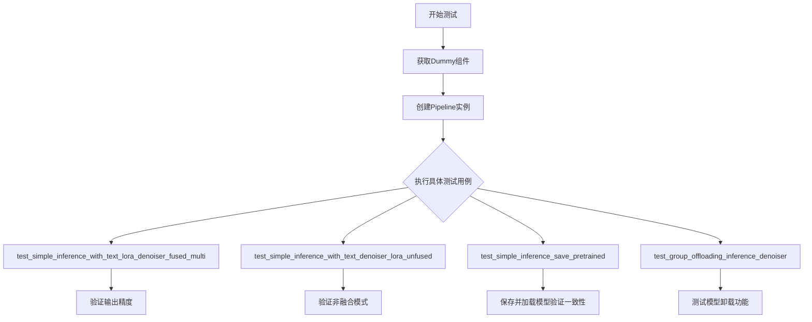
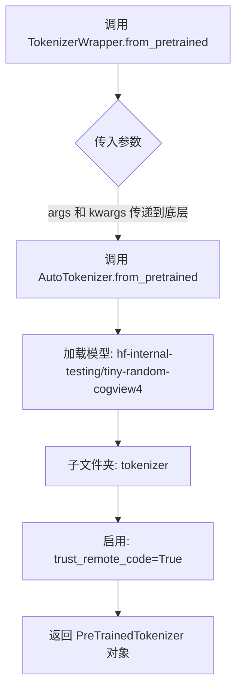
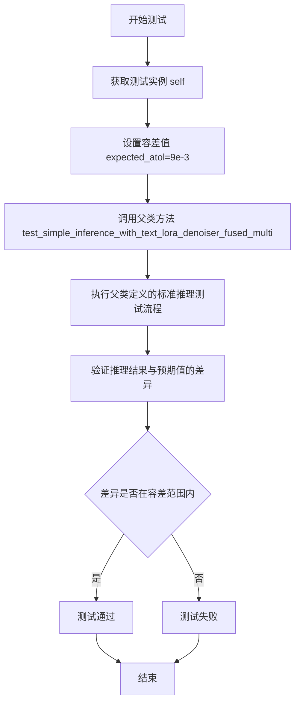
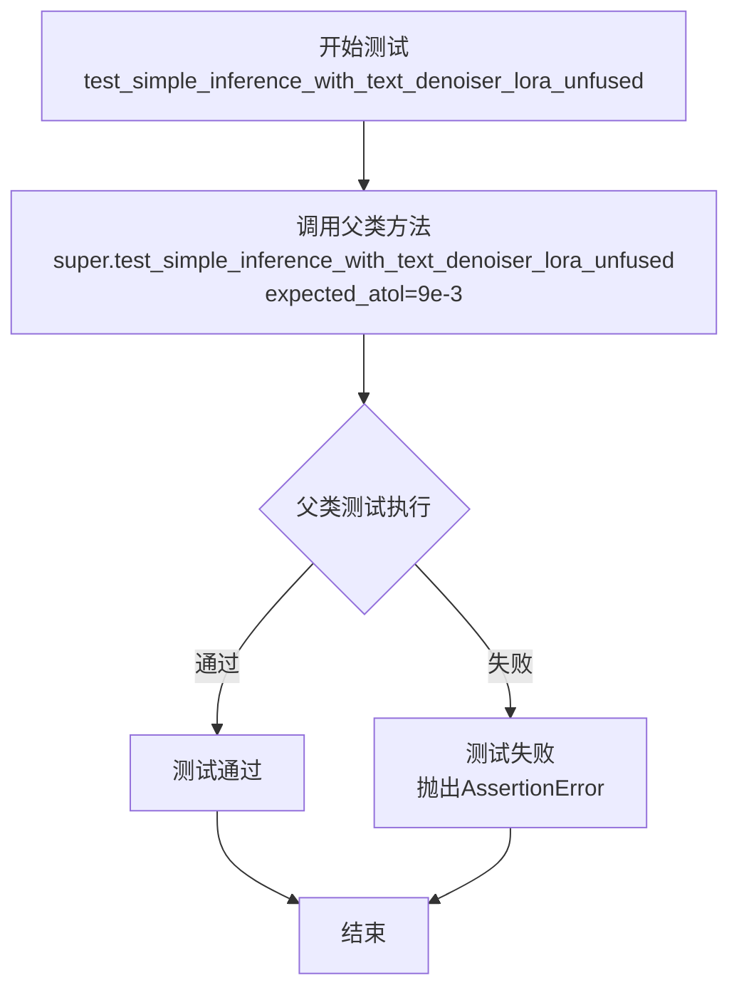
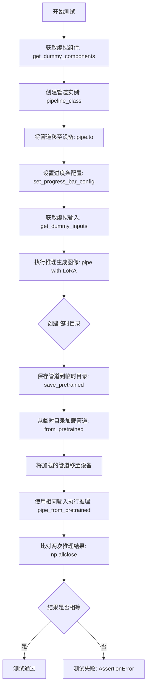
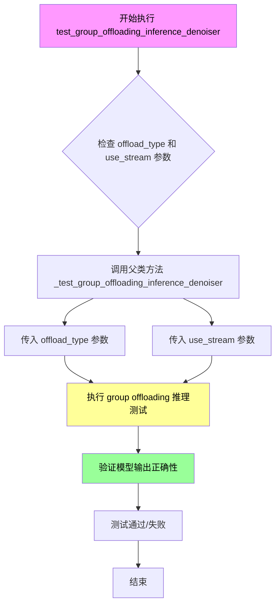
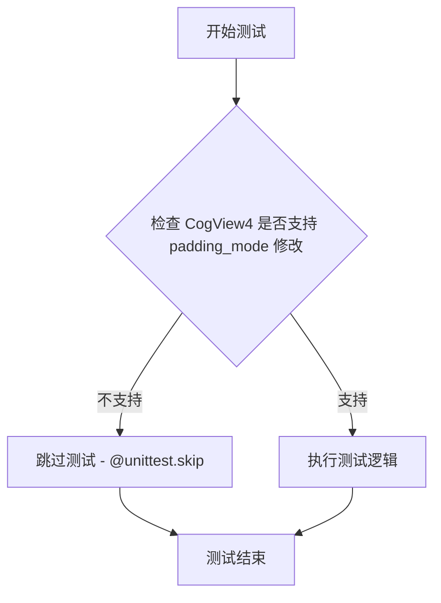

# `diffusers\tests\lora\test_lora_layers_cogview4.py` 详细设计文档

这是一个针对CogView4模型的LoRA（低秩适配）功能集成测试文件，用于验证CogView4Pipeline在加载、推理和保存LoRA权重时的正确性，包括与PEFT后端的集成、模型卸载、权重融合等功能测试。

## 整体流程



## 类结构

```
TokenizerWrapper (工具类)
└── CogView4LoRATests (测试类)
    └── 继承自 unittest.TestCase, PeftLoraLoaderMixinTests
```

## 全局变量及字段


### `CogView4LoRATests.pipeline_class`
    
CogView4Pipeline类，用于图像生成的扩散管道

类型：`type`
    


### `CogView4LoRATests.scheduler_cls`
    
FlowMatchEulerDiscreteScheduler类，流匹配欧拉离散调度器

类型：`type`
    


### `CogView4LoRATests.scheduler_kwargs`
    
调度器配置参数字典，当前为空字典

类型：`dict`
    


### `CogView4LoRATests.transformer_kwargs`
    
Transformer模型配置参数字典，包含patch_size、in_channels等配置

类型：`dict`
    


### `CogView4LoRATests.transformer_cls`
    
CogView4Transformer2DModel类，CogView4的2D变换器模型

类型：`type`
    


### `CogView4LoRATests.vae_kwargs`
    
VAE模型配置参数字典，包含block_out_channels等配置

类型：`dict`
    


### `CogView4LoRATests.vae_cls`
    
AutoencoderKL类，自动编码器KL模型用于潜在空间编码

类型：`type`
    


### `CogView4LoRATests.tokenizer_cls`
    
TokenizerWrapper类，用于加载分词器的包装类

类型：`type`
    


### `CogView4LoRATests.tokenizer_id`
    
Tokenizer模型的HuggingFace Hub标识符

类型：`str`
    


### `CogView4LoRATests.tokenizer_subfolder`
    
Tokenizer模型存储的子文件夹路径

类型：`str`
    


### `CogView4LoRATests.text_encoder_cls`
    
GlmModel类，用于文本编码的模型

类型：`type`
    


### `CogView4LoRATests.text_encoder_id`
    
文本编码器模型的HuggingFace Hub标识符

类型：`str`
    


### `CogView4LoRATests.text_encoder_subfolder`
    
文本编码器模型存储的子文件夹路径

类型：`str`
    


### `CogView4LoRATests.supports_text_encoder_loras`
    
标志位，表示是否支持文本编码器LoRA，当前设置为False

类型：`bool`
    


### `CogView4LoRATests.output_shape`
    
输出图像的形状元组，值为(1, 32, 32, 3)

类型：`tuple`
    
    

## 全局函数及方法


### `TokenizerWrapper.from_pretrained`

这是一个静态方法，作为 `AutoTokenizer.from_pretrained` 的简单包装器，用于加载指定的 tokenizer。该方法硬编码了模型路径 "hf-internal-testing/tiny-random-cogview4" 和子文件夹 "tokenizer"，并启用 `trust_remote_code=True` 以支持自定义 tokenizer 代码。

参数：

- `*args`：`Any`，可变位置参数，将直接传递给底层的 `AutoTokenizer.from_pretrained` 方法，用于指定模型 ID 或路径等位置参数
- `**kwargs`：`Any`，可变关键字参数，将直接传递给底层的 `AutoTokenizer.from_pretrained` 方法，用于指定如 `revision`、`use_fast` 等可选参数

返回值：`PreTrainedTokenizer`，返回从 Hugging Face Hub 或本地路径加载的预训练 tokenizer 对象

#### 流程图



#### 带注释源码

```python
class TokenizerWrapper:
    @staticmethod
    def from_pretrained(*args, **kwargs):
        """
        从预训练模型加载 tokenizer 的静态方法。
        
        这是一个简化的包装器方法，内部直接调用 transformers 库的 AutoTokenizer.from_pretrained。
        该方法硬编码了模型路径和 trust_remote_code 参数，提供了固定的 tokenizer 加载配置。
        
        参数:
            *args: 可变位置参数，直接传递给 AutoTokenizer.from_pretrained
            **kwargs: 可变关键字参数，直接传递给 AutoTokenizer.from_pretrained
        
        返回:
            PreTrainedTokenizer: 加载完成的 tokenizer 实例
        """
        # 调用 transformers 库的 AutoTokenizer.from_pretrained 方法
        # 参数说明：
        #   - "hf-internal-testing/tiny-random-cogview4": Hugging Face Hub 上的模型 ID
        #   - subfolder="tokenizer": 指定从模型的 tokenizer 子目录加载
        #   - trust_remote_code=True: 允许加载远程自定义代码（用于自定义 tokenizer）
        return AutoTokenizer.from_pretrained(
            "hf-internal-testing/tiny-random-cogview4", 
            subfolder="tokenizer", 
            trust_remote_code=True
        )
```


### `CogView4LoRATests.get_dummy_inputs`

该方法用于生成 CogView4 模型的虚拟测试输入数据，包括噪声张量、输入 ID 张量以及管道推理所需的参数字典，常用于单元测试中模拟模型推理流程。

参数：

- `self`：`CogView4LoRATests`，测试类实例本身
- `with_generator`：`bool`，默认为 `True`，控制是否在返回的 pipeline_inputs 字典中包含生成器对象

返回值：`(torch.Tensor, torch.Tensor, dict)`，返回一个三元组，包含噪声张量、输入 ID 张量以及管道参数字典

#### 流程图

```mermaid
flowchart TD
    A[开始 get_dummy_inputs] --> B[设置 batch_size = 1]
    B --> C[设置 sequence_length = 16]
    C --> D[设置 num_channels = 4]
    D --> E[设置 sizes = (4, 4)]
    E --> F[创建随机生成器 generator = torch.manual_seed(0)]
    F --> G[生成噪声张量 noise = floats_tensor((1, 4, 4, 4))]
    G --> H[生成输入ID张量 input_ids = torch.randint(1, 16, (1, 16))]
    H --> I[构建基础 pipeline_inputs 字典]
    I --> J{with_generator?}
    J -->|True| K[向 pipeline_inputs 添加 generator]
    J -->|False| L[跳过添加 generator]
    K --> M[返回 (noise, input_ids, pipeline_inputs)]
    L --> M
```

#### 带注释源码

```python
def get_dummy_inputs(self, with_generator=True):
    """
    生成用于测试 CogView4 模型的虚拟输入数据
    
    参数:
        with_generator: bool, 是否在返回的参数字典中包含生成器,默认为True
        
    返回:
        tuple: (noise, input_ids, pipeline_inputs) 三元组
            - noise: 形状为 (1, 4, 4, 4) 的噪声张量
            - input_ids: 形状为 (1, 16) 的输入ID张量
            - pipeline_inputs: 包含推理参数的字典
    """
    # 批次大小设置为1，用于单样本测试
    batch_size = 1
    # 序列长度设为16，对应文本输入的长度
    sequence_length = 16
    # 通道数设为4，对应潜在空间的通道数
    num_channels = 4
    # 空间维度设为(4, 4)
    sizes = (4, 4)

    # 创建固定种子的随机生成器，确保测试结果可复现
    generator = torch.manual_seed(0)
    # 使用 floats_tensor 生成符合正态分布的噪声张量，形状为 (batch_size, num_channels) + sizes
    noise = floats_tensor((batch_size, num_channels) + sizes)
    # 生成随机整数作为文本输入的ID，范围 [1, sequence_length)
    input_ids = torch.randint(1, sequence_length, size=(batch_size, sequence_length), generator=generator)

    # 构建管道推理所需的基础参数字典
    pipeline_inputs = {
        "prompt": "",                          # 提示词，空字符串用于测试
        "num_inference_steps": 1,              # 推理步数，设为最小值1
        "guidance_scale": 6.0,                 # CFG引导强度
        "height": 32,                          # 生成图像高度
        "width": 32,                           # 生成图像宽度
        "max_sequence_length": sequence_length,  # 最大序列长度
        "output_type": "np",                   # 输出类型为numpy数组
    }
    # 如果需要生成器，则将其添加到参数字典中
    if with_generator:
        pipeline_inputs.update({"generator": generator})

    # 返回噪声、输入ID和完整参字典的三元组
    return noise, input_ids, pipeline_inputs
```


### `CogView4LoRATests.test_simple_inference_with_text_lora_denoiser_fused_multi`

该方法是一个测试用例，用于验证 CogView4 模型在融合文本 LoRA 和去噪器情况下的多尺度推理能力，通过调用父类测试方法并设置指定容差值来进行测试。

参数：

- `self`：`CogView4LoRATests`，测试类实例本身，代表当前测试对象

返回值：`None`，该方法为测试用例，通过 `unittest` 框架执行，不直接返回值，结果通过测试框架的断言机制反馈

#### 流程图



#### 带注释源码

```python
def test_simple_inference_with_text_lora_denoiser_fused_multi(self):
    """
    测试 CogView4 模型在融合文本 LoRA 和去噪器情况下的多尺度推理能力。
    该测试继承自 PeftLoraLoaderMixinTests，验证 LoRA 权重正确融合后的推理功能。
    
    参数:
        self: CogView4LoRATests 的实例，包含测试配置和辅助方法
        
    返回值:
        None: 测试方法通过 unittest 框架执行，结果通过断言反馈
        
    注意:
        - 使用 expected_atol=9e-3 设置绝对容差，用于数值精度验证
        - 实际测试逻辑由父类 PeftLoraLoaderMixinTests 的同名方法实现
    """
    # 调用父类 (PeftLoraLoaderMixinTests) 的同名测试方法
    # expected_atol=9e-3 表示允许的绝对误差容差为 0.009
    super().test_simple_inference_with_text_lora_denoiser_fused_multi(expected_atol=9e-3)
```


### `CogView4LoRATests.test_simple_inference_with_text_denoiser_lora_unfused`

该方法是一个单元测试用例，用于验证 CogView4 模型在使用文本去噪器 LoRA（未融合）配置下的简单推理功能是否正常，通过调用父类的同名测试方法并传入指定的绝对容差值（9e-3）来执行测试。

参数：

- 该方法本身没有显式参数，但内部调用父类方法时传入了 `expected_atol=9e-3`（预期绝对误差阈值）

返回值：`None`，因为这是一个测试方法（`unittest.TestCase`），通过断言来验证结果而非通过返回值

#### 流程图



#### 带注释源码

```python
def test_simple_inference_with_text_denoiser_lora_unfused(self):
    """
    测试 CogView4 模型在使用文本去噪器 LoRA 未融合配置下的简单推理功能。
    该测试方法继承自父类 PeftLoraLoaderMixinTests，通过调用父类方法执行实际的测试逻辑。
    
    测试配置：
    - expected_atol=9e-3: 设置绝对容差阈值为 0.009，用于比较推理结果的精度
    - LoRA 状态: 未融合 (unfused)，意味着 LoRA 权重在推理时动态加载而非合并到模型权重中
    """
    # 调用父类的测试方法，传入期望的绝对容差值
    # 父类方法会执行以下操作：
    # 1. 加载带有 LoRA 配置的 CogView4Pipeline
    # 2. 准备虚拟输入数据（噪声、输入ID、管道参数）
    # 3. 执行推理流程
    # 4. 验证输出结果的正确性（使用指定的 atol=9e-3）
    super().test_simple_inference_with_text_denoiser_lora_unfused(expected_atol=9e-3)
```


### `CogView4LoRATests.test_simple_inference_save_pretrained`

该方法是一个单元测试，用于验证 CogView4 模型的 LoRA（Low-Rank Adaptation）权重通过 `save_pretrained` 保存后，能够正确加载并产生与保存前一致的推理结果。测试流程包括：创建包含 LoRA 的管道、执行推理、保存管道到临时目录、从临时目录加载管道、再次执行推理，最后比对两次推理生成的图像是否在容差范围内相等。

参数：

- `self`：`CogView4LoRATests` 实例，隐式参数，测试类实例本身

返回值：`None`，无返回值（测试方法）

#### 流程图



#### 带注释源码

```python
def test_simple_inference_save_pretrained(self):
    """
    Tests a simple usecase where users could use saving utilities for LoRA through save_pretrained
    """
    # 获取模型组件（包含 LoRA 配置的虚拟组件）
    components, _, _ = self.get_dummy_components()
    
    # 使用组件初始化 CogView4Pipeline 管道实例
    pipe = self.pipeline_class(**components)
    
    # 将管道移至计算设备（如 CUDA）
    pipe = pipe.to(torch_device)
    
    # 配置进度条（disable=None 表示不禁用进度条）
    pipe.set_progress_bar_config(disable=None)
    
    # 获取虚拟输入数据（噪声、input_ids、pipeline参数）
    _, _, inputs = self.get_dummy_inputs(with_generator=False)

    # 第一次推理：使用带 LoRA 的管道生成图像
    # generator 设置固定种子确保可复现性
    images_lora = pipe(**inputs, generator=torch.manual_seed(0))[0]

    # 使用临时目录保存和加载模型
    with tempfile.TemporaryDirectory() as tmpdirname:
        # 将包含 LoRA 权重的管道保存到临时目录
        pipe.save_pretrained(tmpdirname)

        # 从保存的目录重新加载管道
        pipe_from_pretrained = self.pipeline_class.from_pretrained(tmpdirname)
        
        # 将重新加载的管道移至计算设备
        pipe_from_pretrained.to(torch_device)

    # 第二次推理：使用从保存的检查点加载的管道生成图像
    images_lora_save_pretrained = pipe_from_pretrained(**inputs, generator=torch.manual_seed(0))[0]

    # 断言验证：两次推理的图像应该在容差范围内相等
    # atol=1e-3: 绝对容差
    # rtol=1e-3: 相对容差
    self.assertTrue(
        np.allclose(images_lora, images_lora_save_pretrained, atol=1e-3, rtol=1e-3),
        "Loading from saved checkpoints should give same results.",
    )
```


### `CogView4LoRATests.test_group_offloading_inference_denoiser`

该方法是 CogView4LoRA 测试类中的一个测试方法，用于测试 CogView4 模型的 group offloading（组卸载）推理功能。方法通过参数化装饰器支持两种卸载类型（block_level 和 leaf_level）以及流式处理的测试场景，并将测试委托给父类的 `_test_group_offloading_inference_denoiser` 方法执行。

参数：

- `self`：`CogView4LoRATests`，隐式参数，测试类的实例自身
- `offload_type`：`str`，字符串类型参数，表示卸载类型，可选值为 "block_level"（块级卸载）或 "leaf_level"（叶子级卸载）
- `use_stream`：`bool`，布尔类型参数，表示是否使用流式处理（stream）模式

返回值：`None`，该方法没有返回值，它执行测试用例并通过 unittest 框架报告结果

#### 流程图



#### 带注释源码

```python
@parameterized.expand([("block_level", True), ("leaf_level", False)])
@require_torch_accelerator
def test_group_offloading_inference_denoiser(self, offload_type, use_stream):
    """
    测试 CogView4 模型的 group offloading 推理功能
    
    参数:
        offload_type: 字符串类型，指定卸载策略类型
            - "block_level": 块级卸载
            - "leaf_level": 叶子级卸载
        use_stream: 布尔类型，指定是否使用流式处理
            - True: 启用流式处理
            - False: 不启用流式处理
    
    注意:
        该测试方法跳过了 (leaf_level, True) 组合的测试，
        具体原因可参考: https://github.com/huggingface/diffusers/pull/11804#issuecomment-3013325338
    """
    # TODO: We don't run the (leaf_level, True) test here that is enabled for other models.
    # The reason for this can be found here: https://github.com/huggingface/diffusers/pull/11804#issuecomment-3013325338
    
    # 调用父类的 _test_group_offloading_inference_denoiser 方法执行实际的测试逻辑
    # 参数 offload_type 和 use_stream 被传递给父类方法
    super()._test_group_offloading_inference_denoiser(offload_type, use_stream)
```


### `CogView4LoRATests.test_simple_inference_with_text_denoiser_block_scale`

该测试方法用于验证CogView4模型中文本去噪器块缩放功能的简单推理能力，但由于CogView4不支持该功能，当前实现被跳过。

参数：

- `self`：`CogView4LoRATests`，测试类实例本身，包含测试所需的配置和工具方法

返回值：`None`，该方法体为空（pass），不返回任何值

#### 流程图

```mermaid
flowchart TD
    A[开始测试] --> B{检查装饰器}
    B -->|存在@unittest.skip| C[跳过测试]
    C --> D[测试结束]
    
    style C fill:#f9f,stroke:#333,stroke-width:2px
    style D fill:#9f9,stroke:#333,stroke-width:2px
```

#### 带注释源码

```python
@unittest.skip("Not supported in CogView4.")
def test_simple_inference_with_text_denoiser_block_scale(self):
    """
    测试CogView4模型中文本去噪器块缩放的简单推理功能。
    
    注意：此测试当前被跳过，因为CogView4不支持此功能。
    该测试方法继承自PeftLoraLoaderMixinTests基类，
    用于测试LoRA权重在文本编码器/去噪器中的块级缩放功能。
    
    参数:
        self: CogView4LoRATests类的实例
        
    返回值:
        None: 方法体为空，被@unittest.skip装饰器跳过
    """
    pass  # 方法体为空，不执行任何测试逻辑
```


### `CogView4LoRATests.test_simple_inference_with_text_denoiser_block_scale_for_all_dict_options`

该测试方法用于验证 CogView4 模型中文本去噪器块缩放功能的所有字典选项是否正常工作，但由于 CogView4 不支持此功能，测试被跳过。

参数：

- `self`：`CogView4LoRATests`（实例方法隐式参数），表示测试类实例本身

返回值：`None`，该方法不返回任何值（被跳过的测试）

#### 流程图

```mermaid
flowchart TD
    A[开始执行测试] --> B{检查装饰器}
    B -->|有@unittest.skip装饰器| C[跳过测试并输出原因]
    B -->|无装饰器| D[执行测试逻辑]
    C --> E[测试结束]
    D --> F[断言验证]
    F --> E
    
    style C fill:#ff9900
    style E fill:#66ccff
```

#### 带注释源码

```python
@unittest.skip("Not supported in CogView4.")
def test_simple_inference_with_text_denoiser_block_scale_for_all_dict_options(self):
    """
    测试文本去噪器块缩放功能的所有字典选项
    
    该测试方法原本用于验证 LoRA 权重块缩放功能的不同配置选项，
    包括但不限于：
    - 不同的块缩放因子
    - 不同的块级别配置
    - 多种字典选项组合
    
    但由于 CogView4 模型架构不支持 text_denoiser_block_scale 功能，
    因此该测试被标记为跳过。
    
    参数:
        self: CogView4LoRATests 实例
        
    返回值:
        None
        
    异常:
        unittest.SkipTest: 当执行时会被跳过，提示 "Not supported in CogView4."
    """
    pass  # 方法体为空，因为测试被跳过
```


### `CogView4LoRATests.test_modify_padding_mode`

该方法是一个被跳过的单元测试，用于测试修改 padding 模式的功能，但由于 CogView4 模型不支持此功能，因此该测试被跳过。

参数：

- `self`：`CogView4LoRATests`，表示测试类实例本身

返回值：`None`，该方法不返回任何值（使用 `pass` 语句占位）

#### 流程图



#### 带注释源码

```python
@unittest.skip("Not supported in CogView4.")
def test_modify_padding_mode(self):
    """
    测试修改 padding 模式的功能。
    
    该测试用于验证 LoRA 加载器是否支持在 tokenizer 或模型中修改 padding 模式。
    由于 CogView4 模型架构不支持此功能，因此该测试被跳过。
    
    继承自 PeftLoraLoaderMixinTests 基类中的同名方法。
    """
    pass
```

## 关键组件


### CogView4LoRATests

CogView4LoRA测试类是CogView4模型LoRA（低秩适应）功能的核心测试单元，继承自unittest.TestCase和PeftLoraLoaderMixinTests，用于验证CogView4Pipeline在PEFT后端下的LoRA加载、推理、保存和卸载功能。

### TokenizerWrapper

TokenizerWrapper是一个静态工具类，用于从预训练模型路径加载AutoTokenizer，封装了tokenizer的加载逻辑以适配测试框架。

### CogView4Pipeline

CogView4Pipeline是CogView4生成管道的主类，整合了VAE transformer、文本编码器和调度器，负责执行图像生成推理流程。

### CogView4Transformer2DModel

CogView4Transformer2DModel是CogView4的Transformer 2D模型，配置参数包括patch_size、num_layers、attention_head_dim等，用于denoising过程。

### AutoencoderKL

AutoencoderKL是变分自编码器模型，用于在潜在空间和像素空间之间进行图像编码和解码。

### FlowMatchEulerDiscreteScheduler

FlowMatchEulerDiscreteScheduler是基于Flow Matching的Euler离散调度器，用于控制扩散模型的去噪步骤。

### GlmModel

GlmModel是文本编码器模型，用于将文本提示转换为嵌入向量，作为生成条件的输入。

### get_dummy_inputs方法

get_dummy_inputs方法生成测试用的虚拟输入数据，包括噪声张量、输入ID和管道参数字典，用于自动化测试场景。

### transformer_kwargs

transformer_kwargs定义了Transformer模型的配置字典，包含patch_size、in_channels、num_layers等关键参数，用于初始化CogView4Transformer2DModel。

### vae_kwargs

vae_kwargs定义了VAE模型的配置字典，包含block_out_channels、in_channels、out_channels等参数，用于初始化AutoencoderKL。

### supports_text_encoder_loras

supports_text_encoder_loras是一个布尔类属性，标识CogView4模型是否支持文本编码器的LoRA权重，当前设置为False。

### test_group_offloading_inference_denoiser

test_group_offloading_inference_denoiser是分组卸载推理测试方法，用于验证LoRA权重在denoiser上的分组卸载功能，支持block_level和leaf_level两种模式。

### test_simple_inference_save_pretrained

test_simple_inference_save_pretrained测试方法验证LoRA权重通过save_pretrained保存和from_pretrained加载后的一致性，确保模型序列化功能正常。


## 问题及建议


### 已知问题

- **硬编码的模型标识符**：多处使用 `"hf-internal-testing/tiny-random-cogview4"` 字符串，缺乏配置管理，不利于维护和更换测试模型
- **魔法数字与硬编码参数**：patch_size、num_layers、attention_head_dim 等超参数以字典形式硬编码，容差值 (如 `atol=9e-3`、`atol=1e-3`) 缺乏明确来源说明
- **未实现的测试被跳过**：3个测试方法 (`test_simple_inference_with_text_denoiser_block_scale` 等) 被 `@unittest.skip` 标记为不支持，但仍然存在于代码库中，可能导致维护负担
- **重复的随机种子设置**：`torch.manual_seed(0)` 在多处重复使用，应提取为常量或通过 fixtures 管理
- **缺失的类型注解与文档**：所有方法均无文档字符串，参数和返回值缺少类型注解，降低代码可读性和可维护性
- **继承依赖隐式耦合**：测试类继承自 `PeftLoraLoaderMixinTests`，但未在当前文件中导入其定义，依赖关系不直观
- **测试隔离性不足**：`test_simple_inference_save_pretrained` 创建临时目录后未显式清理管道对象，可能存在资源泄漏风险

### 优化建议

- 将模型标识符、超参数配置、容差值提取为类常量或外部配置文件
- 对跳过的测试添加详细的原因说明文档，或移除未实现的功能对应的测试代码
- 使用 `pytest fixtures` 或 `setUp`/`tearDown` 方法集中管理随机种子和测试环境
- 为关键方法添加 docstring，描述测试目的、输入输出约束
- 显式导入 `PeftLoraLoaderMixinTests` 以提高依赖可读性
- 使用 `with` 上下文管理器或显式 `del` 确保临时资源及时释放
- 考虑将 `TokenizerWrapper` 移至独立模块，实现关注点分离

## 其它


### 设计目标与约束

本测试文件旨在验证 CogView4 模型在 LoRA（Low-Rank Adaptation）场景下的功能正确性。设计约束包括：必须使用 peft backend（通过 @require_peft_backend 装饰器强制要求），必须使用 torch accelerator（通过 @require_torch_accelerator 装饰器强制要求），不支持 MPS 设备（通过 @skip_mps 装饰器跳过），部分功能不被支持（如 text denoiser block scale、padding mode 修改等通过 @unittest.skip 跳过）。

### 错误处理与异常设计

测试文件中使用了多层错误处理与异常设计机制。首先通过装饰器进行前置条件检查：@require_peft_backend 在非 peft 环境下跳过测试，@require_torch_accelerator 在非加速器环境下跳过测试，@skip_mps 在 MPS 设备上跳过测试。其次对于不支持的功能，使用 @unittest.skip 装饰器显式标记为跳过，如 test_simple_inference_with_text_denoiser_block_scale、test_simple_inference_with_text_denoiser_block_scale_for_all_dict_options 和 test_modify_padding_mode 三个测试方法。测试中使用了断言来验证结果正确性，如 np.allclose 用于比较图像输出的相似性。

### 数据流与状态机

测试数据流遵循以下路径：首先通过 get_dummy_components 方法获取模型组件（包括 transformer、vae、tokenizer、text_encoder 等），然后通过 get_dummy_inputs 方法生成测试输入数据（包括噪声张量、input_ids 和 pipeline 参数字典），最后将输入传递给 pipeline_class 实例进行推理。状态机方面，测试流程包含正常推理状态、模型保存状态（save_pretrained）、模型加载状态（from_pretrained）和 LoRA 融合/非融合状态，测试通过覆盖这些状态转换来验证功能的正确性。

### 外部依赖与接口契约

本测试文件依赖多个外部组件和接口契约。在模型组件方面，依赖 CogView4Pipeline 作为 pipeline 类、CogView4Transformer2DModel 作为 transformer 类、AutoencoderKL 作为 vae 类、GlmModel 作为 text_encoder 类、FlowMatchEulerDiscreteScheduler 作为调度器类、AutoTokenizer 作为 tokenizer 类。在工具函数方面，依赖 floats_tensor 生成随机张量、torch_device 获取设备、PeftLoraLoaderMixinTests 提供 LoRA 测试混合方法。在配置参数方面，transformer_kwargs、vae_kwargs 定义了模型结构参数，tokenizer_id 和 text_encoder_id 指向预训练模型路径 "hf-internal-testing/tiny-random-cogview4"。接口契约要求 pipeline 必须支持 save_pretrained 和 from_pretrained 方法用于模型持久化，必须支持 LoRA 权重的加载和融合机制。

### 测试覆盖范围

测试覆盖了四个主要场景：基础推理功能测试（test_simple_inference_save_pretrained）验证模型在保存和加载后的输出一致性，LoRA 融合推理测试（test_simple_inference_with_text_lora_denoiser_fused_multi）验证融合多 LoRA 时的推理正确性，LoRA 非融合推理测试（test_simple_inference_with_text_denoiser_lora_unfused）验证非融合模式下的推理正确性，模型卸载推理测试（test_group_offloading_inference_denoiser）验证分组卸载场景下的推理功能。测试参数化设计支持两种卸载级别（block_level 和 leaf_level）的验证。

### 配置管理

测试采用集中式配置管理策略。所有模型配置参数通过类属性统一管理：pipeline_class 指定管道类，scheduler_cls 和 scheduler_kwargs 指定调度器配置，transformer_cls 和 transformer_kwargs 指定 transformer 参数（包括 patch_size=2、in_channels=4、num_layers=2、attention_head_dim=4、num_attention_heads=4 等），vae_cls 和 vae_kwargs 指定 VAE 参数（包括 block_out_channels=[32,64]、latent_channels=4、sample_size=128 等），tokenizer_cls/tokenizer_id/tokenizer_subfolder 和 text_encoder_cls/text_encoder_id/text_encoder_subfolder 指定 tokenizer 和 text_encoder 配置。输出形状通过 output_shape 属性定义为 (1, 32, 32, 3)。

    