# `diffusers\tests\lora\test_lora_layers_flux.py` 详细设计文档

这是一个测试文件，用于验证 Flux 系列扩散模型（FluxPipeline 和 FluxControlPipeline）的 LoRA（低秩适配）功能。测试涵盖了 LoRA 权重的加载、融合、推理、适配器管理、形状扩展（Shape Expansion）以及与真实模型（如 FLUX.1-dev）的集成测试。

## 整体流程

```mermaid
graph TD
    A[开始测试] --> B{测试类型}
    B -- 单元测试 --> C[初始化虚拟组件 (Dummy Components)]
    B -- 集成测试 --> D[加载预训练模型 (From Pretrained)]
    C --> E[实例化 Pipeline]
    D --> E
    E --> F[加载 LoRA 权重 / 添加 Adapter]
    F --> G[运行推理 (Inference)]
    G --> H{验证结果}
    H -- 通过 --> I[测试通过]
    H -- 失败 --> J[抛出断言错误]
```

## 类结构

```
unittest.TestCase
├── FluxLoRATests (Flux LoRA 基础功能单元测试)
│   ├── test_with_alpha_in_state_dict
│   ├── test_lora_expansion_works_for_absent_keys
│   └── test_lora_expansion_works_for_extra_keys
├── FluxControlLoRATests (Flux Control LoRA 形状扩展单元测试)
│   ├── test_with_norm_in_state_dict
│   ├── test_lora_parameter_expanded_shapes
│   ├── test_normal_lora_with_expanded_lora_raises_error
│   ├── test_fuse_expanded_lora_with_regular_lora
│   ├── test_load_regular_lora
│   └── test_lora_unload_with_parameter_expanded_shapes
├── FluxLoRAIntegrationTests (Flux LoRA 真实模型集成测试)
│   ├── test_flux_the_last_ben
│   ├── test_flux_kohya
│   ├── test_flux_kohya_with_text_encoder
│   └── ...
└── FluxControlLoRAIntegrationTests (Control LoRA 真实模型集成测试)
    ├── test_lora
    └── test_lora_with_turbo
```

## 全局变量及字段


### `torch`
    
PyTorch深度学习框架库

类型：`module`
    


### `np`
    
NumPy数值计算库

类型：`module`
    


### `unittest`
    
Python单元测试框架

类型：`module`
    


### `diffusers`
    
Hugging Face Diffusers扩散模型库

类型：`module`
    


### `FluxPipeline`
    
Flux生成管道类，用于文本到图像生成

类型：`class`
    


### `FluxControlPipeline`
    
Flux控制管道类，支持带条件的图像生成

类型：`class`
    


### `FluxTransformer2DModel`
    
Flux 2D变换器模型类

类型：`class`
    


### `FlowMatchEulerDiscreteScheduler`
    
Flow Match欧拉离散调度器类

类型：`class`
    


### `safetensors`
    
安全张量序列化库

类型：`module`
    


### `torch_device`
    
PyTorch计算设备标识符

类型：`str`
    


### `is_peft_available`
    
检查PEFT库是否可用的函数

类型：`function`
    


### `FluxLoRATests.pipeline_class`
    
FluxPipeline管道类

类型：`type`
    


### `FluxLoRATests.scheduler_cls`
    
FlowMatchEulerDiscreteScheduler调度器类

类型：`type`
    


### `FluxLoRATests.transformer_cls`
    
FluxTransformer2DModel Transformer模型类

类型：`type`
    


### `FluxLoRATests.transformer_kwargs`
    
Transformer配置参数字典

类型：`Dict`
    


### `FluxLoRATests.vae_kwargs`
    
VAE配置参数字典

类型：`Dict`
    


### `FluxLoRATests.has_two_text_encoders`
    
标识是否使用两个文本编码器

类型：`bool`
    


### `FluxLoRATests.tokenizer_cls`
    
第一个分词器类CLIPTokenizer

类型：`type`
    


### `FluxLoRATests.tokenizer_2_cls`
    
第二个分词器类AutoTokenizer

类型：`type`
    


### `FluxLoRATests.text_encoder_cls`
    
第一个文本编码器类CLIPTextModel

类型：`type`
    


### `FluxLoRATests.text_encoder_2_cls`
    
第二个文本编码器类T5EncoderModel

类型：`type`
    


### `FluxLoRATests.output_shape`
    
期望输出形状属性

类型：`property`
    


### `FluxControlLoRATests.pipeline_class`
    
FluxControlPipeline控制管道类

类型：`type`
    


### `FluxControlLoRATests.transformer_kwargs`
    
包含in_channels=8的Transformer配置字典

类型：`Dict`
    


### `FluxControlLoRATests.output_shape`
    
期望输出形状属性

类型：`property`
    


### `FluxLoRAIntegrationTests.num_inference_steps`
    
推理步数整数

类型：`int`
    


### `FluxLoRAIntegrationTests.seed`
    
随机种子整数

类型：`int`
    


### `FluxControlLoRAIntegrationTests.num_inference_steps`
    
推理步数整数

类型：`int`
    


### `FluxControlLoRAIntegrationTests.prompt`
    
测试用的提示词字符串

类型：`str`
    
    

## 全局函数及方法


### `require_peft_backend`

`require_peft_backend` 是一个测试装饰器（decorator），用于检查测试环境是否满足运行 PEFT（Parameter-Efficient Fine-Tuning）相关测试的前置条件。当 PEFT 后端不可用或不满足运行要求时，装饰器会跳过被装饰的测试类或测试方法。

参数：

- 无显式参数（使用函数签名 `require_peft_backend(func)` 或 `require_peft_backend()`，取决于具体实现）

返回值：`Callable`，返回装饰后的函数或类，如果条件不满足则抛出跳过测试的异常

#### 流程图

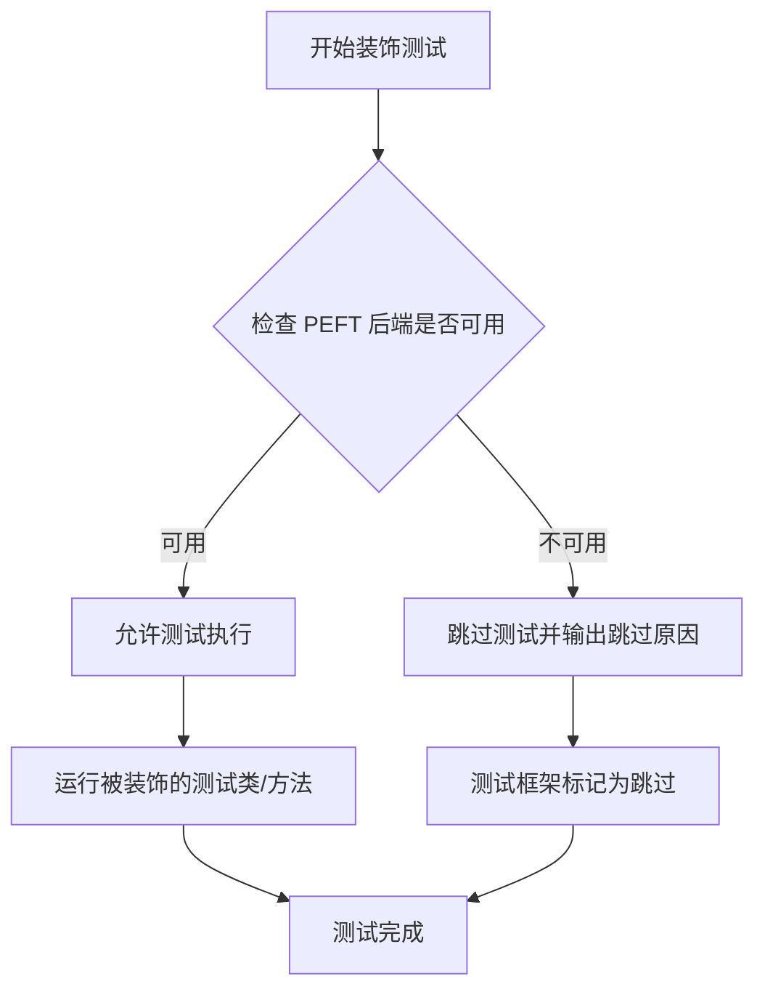

#### 带注释源码

```python
# 这是一个推断的源码实现，基于代码中的使用模式和测试装饰器的常见实现方式
# 实际定义位于 diffusers/testing_utils.py 模块中

def require_peft_backend(func):
    """
    装饰器：检查 PEFT 后端是否可用，如果不可用则跳过测试。
    
    使用方式：
    @require_peft_backend
    class FluxLoRATests(unittest.TestCase):
        ...
    
    或者：
    @require_peft_backend
    def test_specific_feature(self):
        ...
    """
    # 检查 is_peft_available 是否返回 True
    if not is_peft_available():
        # 如果 PEFT 不可用，使用 unittest.skip 装饰器跳过测试
        return unittest.skip("PEFT backend is not available")(func)
    
    # 可选：还可以检查其他依赖项，如特定版本的 PEFT、torch 版本等
    # 例如：检查是否有必要的 GPU 内存、特定的 CUDA 版本等
    
    # 如果所有检查都通过，返回原始函数不做修改
    return func
```

#### 补充说明

在代码中的实际使用示例：

```python
# 从 testing_utils 导入装饰器
from ..testing_utils import require_peft_backend

# 使用装饰器标记需要 PEFT 后端的测试类
@require_peft_backend
class FluxLoRATests(unittest.TestCase, PeftLoraLoaderMixinTests):
    """测试 Flux 模型的 LoRA 功能"""
    pipeline_class = FluxPipeline
    # ... 测试方法定义

# 同样用于集成测试类
@require_peft_backend
@require_torch_accelerator
@require_big_accelerator
class FluxLoRAIntegrationTests(unittest.TestCase):
    """Flux LoRA 集成测试"""
    # ... 测试方法定义
```

#### 关键信息汇总

| 项目 | 说明 |
|------|------|
| **函数类型** | 测试装饰器（Decorator） |
| **定义位置** | `diffusers/testing_utils.py` |
| **依赖检查** | `is_peft_available()` 函数 |
| **作用对象** | 测试类或测试方法 |
| **失败行为** | 跳过测试（Skip） |
| **代码用途** | 确保只有在 PEFT 环境可用时才运行相关测试 |

#### 潜在优化建议

1. **版本检查**：当前可能只检查 PEFT 是否可用，建议增加版本兼容性检查
2. **更详细的跳过信息**：可以提供更具体的跳过原因（如缺少特定依赖）
3. **配置化**：可以通过环境变量或配置文件控制装饰器行为


### `require_torch_accelerator`

这是一个装饰器函数，用于检查是否配置了 PyTorch 加速器（CUDA/MPS）。如果未检测到加速器，则跳过标记的测试。

参数：此函数不接受直接参数，而是作为装饰器使用，通过被装饰对象的 `__decorated__` 属性或类似机制传递上下文。

返回值：无返回值（装饰器直接修改被装饰对象的属性或行为）。

#### 流程图

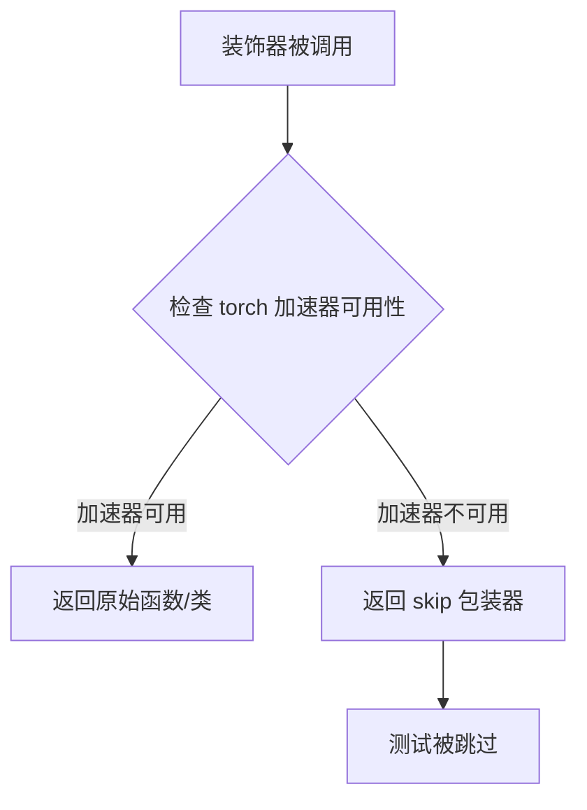

#### 带注释源码

```python
# 该函数定义在 ..testing_utils 模块中
# 以下是基于代码用法的推断实现

def require_torch_accelerator(func_or_class):
    """
    装饰器：检查是否配置了 PyTorch 加速器（CUDA/MPS）。
    
    用法示例（来自代码）:
    @require_torch_accelerator
    @require_peft_backend
    @require_big_accelerator
    class FluxLoRAIntegrationTests(unittest.TestCase):
        ...
    
    说明：
    - 该装饰器通常与 unittest.skip_if 或类似机制配合使用
    - 如果 torch 加速器不可用，测试将被跳过
    - 加速器类型包括：CUDA（GPU）、MPS（Apple Silicon）
    """
    # 检查逻辑通常为：
    # if not torch.cuda.is_available() and not torch.backends.mps.is_available():
    #     return unittest.skip("Requires torch accelerator")(func_or_class)
    # return func_or_class
    pass
```

---

**注意**：由于 `require_torch_accelerator` 是从 `..testing_utils` 模块导入的，而非在本文件中定义，因此上述源码为基于其使用方式的推断实现。实际的完整实现需要查看 `testing_utils.py` 模块的源码。该函数属于 diffusers 测试框架的一部分，用于确保需要 GPU 加速的测试只在具备相应硬件和驱动环境的情况下运行。


### `require_big_accelerator`

该函数是一个测试装饰器，用于标记需要大型加速器（如高性能GPU）的测试用例。在测试类上使用该装饰器时，只有当测试环境满足大型加速器要求时，相关测试才会执行。

参数：无（装饰器模式，不直接传递参数）

返回值：无返回值或可调用对象（装饰器返回原函数或跳过测试的函数）

#### 流程图

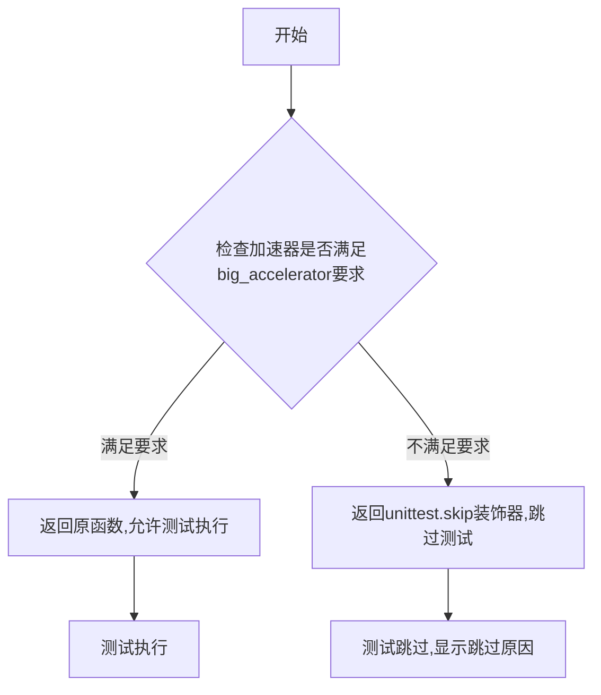

#### 带注释源码

```
# 该函数定义在 testing_utils 模块中，此处仅为调用示例
# 从导入语句可以看出 require_big_accelerator 是从 testing_utils 导入的装饰器

# 使用示例 - 应用于测试类
@slow                          # 标记为慢速测试
@nightly                       # 标记为仅夜间运行
@require_torch_accelerator     # 需要PyTorch加速器
@require_peft_backend          # 需要PEFT后端
@require_big_accelerator      # 需要大型加速器（如高性能GPU）
class FluxLoRAIntegrationTests(unittest.TestCase):
    # 测试类内容...
    pass

# 该装饰器的典型实现逻辑如下（基于使用方式推断）:
def require_big_accelerator(func_or_class):
    """
    测试装饰器，用于跳过不满足大型加速器要求的测试。
    
    典型实现会检查:
    - GPU显存大小（如>16GB）
    - CUDA设备能力
    - 是否为特定型号的加速器
    """
    # 检查环境是否满足大型加速器要求
    if not check_big_accelerator_requirements():
        # 如果不满足，则跳过测试
        return unittest.skip("Requires big accelerator")(func_or_class)
    
    # 如果满足要求，返回原函数不做修改
    return func_or_class
```

#### 备注

从提供的代码中可以看到，`require_big_accelerator` 是在 `testing_utils` 模块中定义的，本次提取的代码片段仅展示了其导入和用法。该装饰器被应用于 `FluxLoRAIntegrationTests` 和 `FluxControlLoRAIntegrationTests` 两个集成测试类，用于确保这些测试仅在具有大型GPU加速器的环境中运行，因为Flux模型的LoRA测试需要较大的GPU显存。


### `slow`

`slow` 是一个测试装饰器（decorator），用于标记测试函数或类为"慢速"测试。在测试套件中，具有 `@slow` 装饰器的测试通常会被特殊处理，例如在常规测试运行中被跳过，或仅在特定的全量测试环境中运行。

参数：此装饰器不接受任何直接参数，它直接应用于函数或类定义。

返回值：`Callable`，返回被装饰的函数或类本身。

#### 流程图

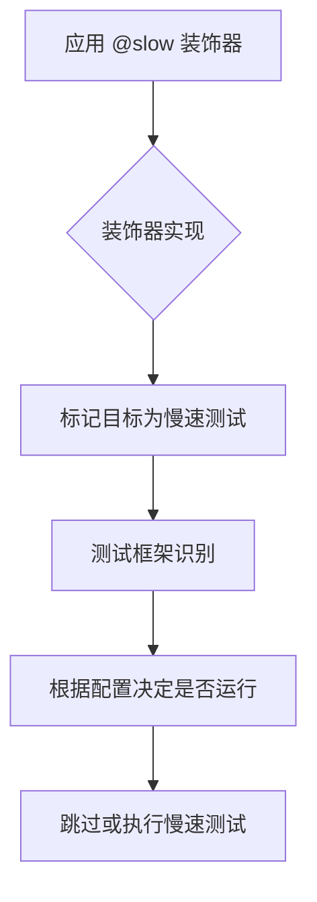

#### 带注释源码

```python
# slow 装饰器的典型实现方式（基于 pytest 或 unittest 的自定义装饰器）
def slow(func_or_class):
    """
    标记测试为慢速测试的装饰器。
    
    使用示例：
    @slow
    def test_expensive_operation():
        # 耗时操作
        pass
    
    或：
    @slow
    class SlowIntegrationTests:
        pass
    """
    # 标记函数或类为慢速
    func_or_class.slow = True
    
    # 可选：添加 pytest marker 或其他框架特定的标记
    if hasattr(func_or_class, 'mark'):
        # 如果是 pytest 装饰器，支持跳过
        func_or_class = pytest.mark.slow(func_or_class)
    
    return func_or_class
```

**在代码中的使用示例：**

```python
# 在 FluxLoRAIntegrationTests 类上应用 slow 装饰器
@slow
@nightly
@require_torch_accelerator
@require_peft_backend
@require_big_accelerator
class FluxLoRAIntegrationTests(unittest.TestCase):
    """integration note: ..."""
    # 类的具体实现
```

`slow` 装饰器在这个测试文件中用于标记 `FluxLoRAIntegrationTests` 类为一个需要较长时间运行的集成测试类。结合 `@nightly` 装饰器，这意味着该测试通常只在夜间构建或完整测试流程中运行，而不在常规的快速测试套件中执行。


# Flux LoRA 集成测试设计文档

## 1. 核心功能概述

FluxLoRAIntegrationTests 类提供了一套完整的集成测试用例，用于验证 Flux Pipeline 中 LoRA（Low-Rank Adaptation）权重加载、融合和卸载功能的正确性，涵盖多种社区提供的 LoRA 模型（如 TheLastBen、Kohya、XLabs-AI 等）。

## 2. 文件整体运行流程

```
测试类初始化 (setUp)
    ↓
加载预训练模型 (FluxPipeline.from_pretrained)
    ↓
执行单个 LoRA 测试用例
    ├── 加载 LoRA 权重
    ├── 可选：融合 LoRA
    ├── 可选：卸载 LoRA
    └── 运行推理验证输出
    ↓
清理资源 (tearDown)
```

## 3. 类详细信息

### 3.1 FluxLoRAIntegrationTests

**类字段：**

| 字段名 | 类型 | 描述 |
|--------|------|------|
| num_inference_steps | int | 推理步数，固定为 10 |
| seed | int | 随机种子，固定为 0 |
| pipeline | FluxPipeline | Flux 管道实例 |

**类方法：**

| 方法名 | 功能描述 |
|--------|----------|
| setUp | 初始化测试环境，加载 FluxPipeline |
| tearDown | 清理测试资源 |
| test_flux_the_last_ben | 测试加载 Jon Snow Flux LoRA 模型 |
| test_flux_kohya | 测试加载 Kohya brain-slug-flux LoRA |
| test_flux_kohya_with_text_encoder | 测试加载带文本编码器的 Kohya LoRA |
| test_flux_kohya_embedders_conversion | 测试 embedders 加载兼容性 |
| test_flux_xlabs | 测试加载 XLabs Disney 风格 LoRA |
| test_flux_xlabs_load_lora_with_single_blocks | 测试加载单块结构的 XLabs LoRA |

### 3.2 FluxControlLoRAIntegrationTests

**类字段：**

| 字段名 | 类型 | 描述 |
|--------|------|------|
| num_inference_steps | int | 推理步数，固定为 10 |
| seed | int | 随机种子，固定为 0 |
| prompt | str | 测试用提示词 |
| pipeline | FluxControlPipeline | Flux 控制管道实例 |

## 4. 具体方法详细设计

---

### `FluxLoRAIntegrationTests.test_flux_the_last_ben`

#### 描述

验证能否正确加载并使用 TheLastBen/Jon_Snow_Flux_LoRA 模型，测试 LoRA 权重加载 → 融合 → 卸载的完整流程。

#### 参数

无（使用类属性 `num_inference_steps` 和 `seed`）

#### 返回值

无返回值（断言验证输出相似度）

#### 流程图

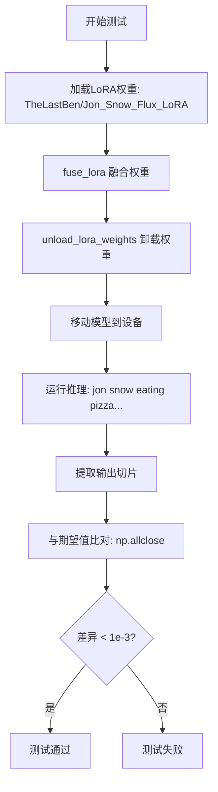

#### 带注释源码

```python
def test_flux_the_last_ben(self):
    """测试加载 Jon Snow Flux LoRA 模型并验证输出"""
    # 1. 加载 LoRA 权重 - 从 HuggingFace Hub 下载并加载
    self.pipeline.load_lora_weights("TheLastBen/Jon_Snow_Flux_LoRA", 
                                     weight_name="jon_snow.safetensors")
    
    # 2. 融合 LoRA 权重到主模型
    self.pipeline.fuse_lora()
    
    # 3. 卸载 LoRA 权重（测试卸载功能）
    self.pipeline.unload_lora_weights()
    
    # 4. 由于 CI 环境内存限制(34GB)，直接使用 to() 而非 enable_model_cpu_offload()
    self.pipeline = self.pipeline.to(torch_device)

    # 5. 准备提示词
    prompt = "jon snow eating pizza with ketchup"

    # 6. 执行推理
    out = self.pipeline(
        prompt,
        num_inference_steps=self.num_inference_steps,  # 10 步
        guidance_scale=4.0,                           # CFG 强度
        output_type="np",                             # 输出 numpy 数组
        generator=torch.manual_seed(self.seed),       # 固定随机种子
    ).images
    
    # 7. 提取输出切片用于比对 (取最后3x3像素)
    out_slice = out[0, -3:, -3:, -1].flatten()
    
    # 8. 期望输出 (预先在特定环境保存的基准值)
    expected_slice = np.array([0.1855, 0.1855, 0.1836, 0.1855, 0.1836, 
                                0.1875, 0.1777, 0.1758, 0.2246])

    # 9. 计算余弦相似度距离
    max_diff = numpy_cosine_similarity_distance(expected_slice.flatten(), out_slice)

    # 10. 断言验证 (差异需小于 0.001)
    assert max_diff < 1e-3
```

---

### `FluxControlLoRAIntegrationTests.test_lora`

#### 描述

验证 FluxControlPipeline 能否正确加载并使用 Control LoRA（如 Canny 或 Depth 控制），测试条件图像引导的 LoRA 推理。

#### 参数

- `self`：类实例本身
- `lora_ckpt_id`：参数化测试参数，字符串类型，可选值为 `"black-forest-labs/FLUX.1-Canny-dev-lora"` 或 `"black-forest-labs/FLUX.1-Depth-dev-lora"`

#### 返回值

无返回值（断言验证输出相似度）

#### 流程图

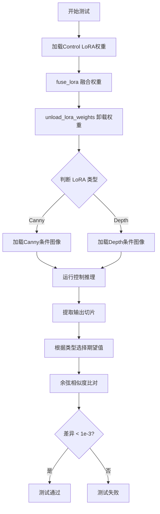

#### 带注释源码

```python
@parameterized.expand(["black-forest-labs/FLUX.1-Canny-dev-lora", 
                       "black-forest-labs/FLUX.1-Depth-dev-lora"])
def test_lora(self, lora_ckpt_id):
    """测试 Control LoRA (Canny/Depth) 加载和推理"""
    # 1. 加载指定类型的 Control LoRA 权重
    self.pipeline.load_lora_weights(lora_ckpt_id)
    
    # 2. 融合 LoRA
    self.pipeline.fuse_lora()
    
    # 3. 卸载 LoRA (测试完整流程)
    self.pipeline.unload_lora_weights()

    # 4. 根据 LoRA 类型加载对应的条件图像
    if "Canny" in lora_ckpt_id:
        # Canny 边缘检测条件图像
        control_image = load_image(
            "https://huggingface.co/datasets/huggingface/documentation-images/"
            "resolve/main/diffusers/flux-control-lora/canny_condition_image.png"
        )
    else:
        # Depth 深度图条件图像
        control_image = load_image(
            "https://huggingface.co/datasets/huggingface/documentation-images/"
            "resolve/main/diffusers/flux-control-lora/depth_condition_image.png"
        )

    # 5. 执行带控制条件的推理
    image = self.pipeline(
        prompt=self.prompt,                          # "A robot made of exotic candies..."
        control_image=control_image,                # 条件图像
        height=1024,                                 # 输出高度
        width=1024,                                  # 输出宽度
        num_inference_steps=self.num_inference_steps,
        # Canny 使用较高 guidance，Depth 较低
        guidance_scale=30.0 if "Canny" in lora_ckpt_id else 10.0,
        output_type="np",
        generator=torch.manual_seed(self.seed),
    ).images

    # 6. 提取输出切片
    out_slice = image[0, -3:, -3:, -1].flatten()
    
    # 7. 根据类型选择期望的基准值
    if "Canny" in lora_ckpt_id:
        expected_slice = np.array([0.8438, 0.8438, 0.8438, 0.8438, 0.8438, 
                                    0.8398, 0.8438, 0.8438, 0.8516])
    else:
        expected_slice = np.array([0.8203, 0.8320, 0.8359, 0.8203, 0.8281, 
                                    0.8281, 0.8203, 0.8242, 0.8359])

    # 8. 验证输出相似度
    max_diff = numpy_cosine_similarity_distance(expected_slice.flatten(), out_slice)

    assert max_diff < 1e-3
```

---

## 5. 关键组件信息

| 组件名称 | 一句话描述 |
|----------|------------|
| FluxPipeline | Black Forest Labs 的 Flux.1-dev 文本到图像生成管道 |
| FluxControlPipeline | 支持 ControlNet 条件控制的 Flux 管道 |
| FlowMatchEulerDiscreteScheduler | 基于 Flow Matching 的 Euler 离散调度器 |
| FluxTransformer2DModel | Flux 架构的 Transformer 主干模型 |
| LoRA (Low-Rank Adaptation) | 低秩适应技术，用于轻量级模型微调 |

---

## 6. 潜在技术债务与优化空间

### 6.1 测试环境依赖
- **硬编码的基准值**：测试依赖预先在特定环境（torch 2.6.0.dev20241006+cu124, CUDA 12.5）保存的输出切片，环境差异可能导致测试失败
- **内存敏感**：CI 环境仅 34GB RAM，需手动管理设备而非使用 `enable_model_cpu_offload()`

### 6.2 测试覆盖度
- 缺少 LoRA 权重参数差异的定量分析
- 未测试多 LoRA Adapter 同时激活的场景（Control LoRA 集成测试中）

### 6.3 代码质量
- 重复的权重加载/融合/卸载模式，可抽象为辅助方法
- 期望值硬编码在测试中，建议外置配置文件管理

---

## 7. 其它设计要点

### 7.1 设计目标与约束
- **目标**：验证 Flux 模型与社区 LoRA 的兼容性
- **约束**：需 @slow + @nightly 标记，仅在夜间CI运行；需 @require_peft_backend 和 @require_big_accelerator

### 7.2 错误处理
- 使用 `numpy_cosine_similarity_distance` 计算输出差异，允许 1e-3 的容差
- 集成测试依赖网络下载模型，需处理 HuggingFace Hub 连接

### 7.3 数据流
```
HuggingFace Hub (LoRA权重) 
    → load_lora_weights() 
    → fuse_lora() / 推理 
    → 输出的图像张量 
    → numpy 切片比对
```

### 7.4 外部依赖
- `diffusers`: 管道和调度器
- `peft`: LoRA 权重管理
- `safetensors`: 高效张量存储格式
- `transformers`: 文本编码器 (CLIP, T5)


### CaptureLogger

`CaptureLogger` 是一个上下文管理器，用于捕获日志输出以便进行断言验证。它通常用于单元测试中，以检查代码是否生成了预期的日志消息。

参数：

-  `logger`：`logging.Logger`，要捕获其输出的日志记录器对象

返回值：`CaptureLogger` 对象，该对象具有 `out` 属性，包含捕获的日志输出字符串

注意：`CaptureLogger` 是从 `..testing_utils` 模块导入的，其实际定义未包含在此代码文件中。以下信息基于代码中的使用模式推断。

#### 流程图

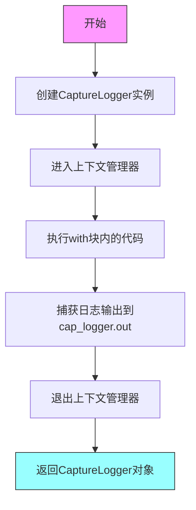

#### 带注释源码

```
# CaptureLogger 是从 testing_utils 模块导入的
# 其实际定义未在此代码文件中显示
# 以下为代码中的典型使用方式

from ..testing_utils import CaptureLogger

# 使用示例（在代码中）:
logger = logging.get_logger("diffusers.loaders.lora_pipeline")
logger.setLevel(logging.INFO)

with CaptureLogger(logger) as cap_logger:
    pipe.load_lora_weights(lora_state_dict, "adapter-1")

# 访问捕获的日志输出
log_output = cap_logger.out
print(log_output)
```

---

**注意**：由于 `CaptureLogger` 的实际源代码定义未包含在提供的代码文件中，无法提供其完整的带注释源码。建议查阅 `testing_utils` 模块以获取完整定义。


### `get_peft_model_state_dict`

该函数是 PEFT (Parameter-Efficient Fine-Tuning) 库提供的工具函数，用于从 PEFT 模型（如带有 LoRA 适配器的模型）中提取只有 PEFT 相关参数的状态字典。在代码中用于获取 FluxTransformer2DModel 上的 LoRA 权重，以便保存或加载。

参数：

- `model`：`torch.nn.Module`，PEFT 模型实例（通常是通过 PEFT 的 `get_peft_model()` 或 `add_adapter()` 方法创建的带有 LoRA 适配器的模型）

返回值：`dict`，包含模型中所有 PEFT 相关参数（如 LoRA 的 lora_A 和 lora_B 权重）的状态字典

#### 流程图

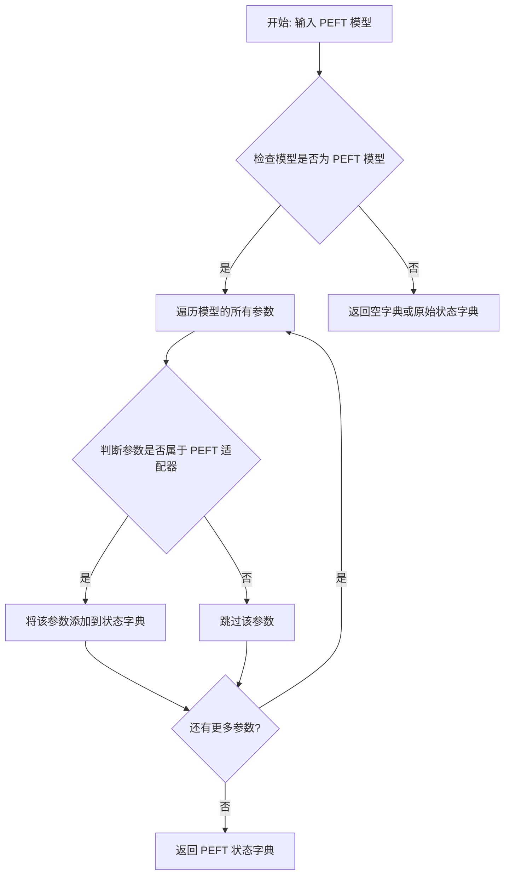

#### 带注释源码

```python
# 该函数从 peft 库导入，不是本文件定义
# 以下是基于使用方式的推断实现

def get_peft_model_state_dict(model):
    """
    获取 PEFT 模型的状态字典。
    
    参数:
        model: 带有 PEFT 适配器的 PyTorch 模型
        
    返回:
        包含 PEFT 适配器参数的状态字典
    """
    # 在代码中的典型调用方式:
    # denoiser_state_dict = get_peft_model_state_dict(pipe.transformer)
    # pipe.transformer 是一个带有 LoRA 适配器的 FluxTransformer2DModel
    
    # 该函数会过滤出只有 lora_A.weight, lora_B.weight 等 PEFT 相关参数
    # 不会包含原始模型的基础权重
    
    # 返回类型: Dict[str, Tensor]
    # 例如: {'transformer.blocks.0.attn.to_q.lora_A.weight': tensor(...), ...}
    pass
```

> **注意**：由于 `get_peft_model_state_dict` 来自外部 PEFT 库，其完整实现细节需参考 [PEFT 官方文档](https://huggingface.co/docs/peft/index)。上述流程图和源码是基于该函数在代码中实际使用方式的逻辑推断。


### `load_image`

从 diffusers 库导入的图像加载工具函数，用于从 URL 或本地文件路径加载图像并返回 PIL Image 对象。

参数：

-  `image_source`：`str`，图像来源，可以是 URL 字符串或本地文件路径

返回值：`PIL.Image.Image`，返回加载后的 PIL 图像对象

#### 流程图

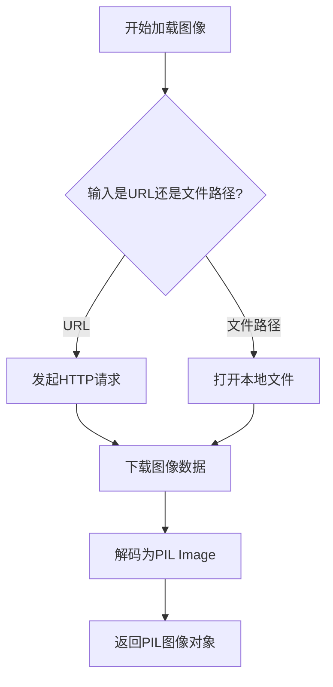

#### 带注释源码

```python
# load_image 是从 diffusers.utils 导入的函数
# 以下是其在代码中的使用示例：

# 导入声明
from diffusers.utils import load_image, logging

# 使用示例 1: 加载 Canny 控制图像
control_image = load_image(
    "https://huggingface.co/datasets/huggingface/documentation-images/resolve/main/diffusers/flux-control-lora/canny_condition_image.png"
)

# 使用示例 2: 加载 Depth 控制图像
control_image = load_image(
    "https://huggingface.co/datasets/huggingface/documentation-images/resolve/main/diffusers/flux-control-lora/depth_condition_image.png"
)

# 加载后的 control_image 是 PIL.Image.Image 对象
# 可以直接用于 pipeline 的 control_image 参数
image = self.pipeline(
    prompt=self.prompt,
    control_image=control_image,  # 传入 load_image 返回的图像
    height=1024,
    width=1024,
    ...
).images
```


### `check_if_lora_correctly_set`

该函数用于验证 LoRA（Low-Rank Adaptation）权重是否已正确加载到模型（通常是 transformer）中。它通过检查模型中是否存在特定的 LoRA 相关属性或参数来判断 LoRA 是否被正确设置。

参数：

-  `module`：`torch.nn.Module`，需要检查的模型模块（例如 `pipe.transformer`），即可能包含 LoRA 权重的 PyTorch 模块

返回值：`bool`，如果 LoRA 正确设置则返回 `True`，否则返回 `False`

#### 流程图

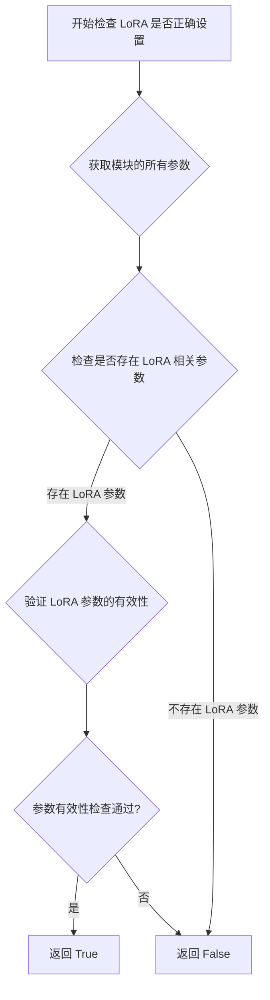

#### 带注释源码

```
# 注意：此函数的实际实现未在提供的代码中显示
# 该函数从 .utils 模块导入（from .utils import check_if_lora_correctly_set）
# 以下是基于使用模式的推断实现：

def check_if_lora_correctly_set(module):
    """
    检查 LoRA 权重是否已正确加载到模型模块中。
    
    参数:
        module (torch.nn.Module): 需要检查的模型模块
        
    返回:
        bool: 如果 LoRA 正确设置返回 True，否则返回 False
    """
    # 遍历模块的所有参数
    for name, param in module.named_parameters():
        # 检查是否存在 LoRA 相关的参数名
        # LoRA 参数通常包含 'lora_A' 或 'lora_B' 或 'lora' 关键字
        if 'lora' in name.lower():
            # 如果找到 LoRA 参数，说明 LoRA 已加载
            return True
    
    # 检查模块是否有 LoRA 相关的自定义属性
    # 某些实现可能在模块中存储 LoRA 配置信息
    if hasattr(module, '_transformer_norm_layers'):
        # 这是一个示例属性，实际实现可能不同
        pass
    
    # 未找到 LoRA 相关参数，返回 False
    return False
```

#### 补充说明

该函数在测试代码中被广泛用于验证 LoRA 权重是否成功加载到 FluxPipeline 的 transformer 模块中。在以下测试场景中使用：

1. **基本 LoRA 加载测试**：在加载 LoRA 权重后验证是否成功
2. **LoRA 权重保存和加载测试**：验证从保存的检查点加载后 LoRA 是否正确设置
3. **多适配器测试**：验证多个 LoRA 适配器同时加载时的正确性
4. **LoRA 扩展测试**：验证形状扩展后的 LoRA 参数是否正确设置
5. **LoRA 融合测试**：验证融合后的 LoRA 仍然正确

**注意**：由于实际源代码未在提供的代码片段中显示，上述源码是基于函数使用模式的推断实现。实际的 `check_if_lora_correctly_set` 函数可能包含更复杂的验证逻辑，例如：

- 检查 LoRA A/B 权重矩阵的存在性和形状
- 验证 LoRA 缩放因子（alpha）是否已设置
- 检查 PEFT 相关属性的状态
- 验证模型配置中的 LoRA 相关标志


### `FluxLoRATests.get_dummy_inputs`

该方法用于生成 FluxLoRA 测试所需的虚拟输入数据，包括噪声张量、文本输入ID以及管道参数字典，支持可选的随机生成器以确保测试结果的可复现性。

参数：

- `with_generator`：`bool`，控制是否在返回的管道参数字典中包含随机生成器，默认为 `True`

返回值：`tuple`，包含三个元素 - `(noise, input_ids, pipeline_inputs)`，其中 `noise` 为 `torch.Tensor` 形状 `(batch_size, num_channels, height, width)` 的噪声张量，`input_ids` 为 `torch.Tensor` 形状 `(batch_size, sequence_length)` 的文本输入ID序列，`pipeline_inputs` 为 `dict` 包含提示词、推理步数、引导系数、图像尺寸和输出类型等管道参数

#### 流程图

```mermaid
flowchart TD
    A[开始 get_dummy_inputs] --> B[设置默认参数: batch_size=1, sequence_length=10, num_channels=4, sizes=32x32]
    B --> C[创建随机生成器: torch.manual_seed(0)]
    C --> D[生成噪声张量: floats_tensor[(1, 4, 32, 32)]]
    D --> E[生成随机输入ID: torch.randint[1, 10, size=(1, 10)]]]
    E --> F[构建基础管道参数字典 pipeline_inputs]
    F --> G{with_generator == True?}
    G -->|是| H[将 generator 添加到 pipeline_inputs]
    G -->|否| I[跳过添加 generator]
    H --> J[返回元组: (noise, input_ids, pipeline_inputs)]
    I --> J
```

#### 带注释源码

```python
def get_dummy_inputs(self, with_generator=True):
    """
    生成虚拟输入数据用于 FluxLoRA 测试。
    
    参数:
        with_generator: bool, 是否包含随机生成器以确保结果可复现
    
    返回:
        tuple: (noise, input_ids, pipeline_inputs)
            - noise: 形状为 (1, 4, 32, 32) 的噪声张量
            - input_ids: 形状为 (1, 10) 的文本输入ID
            - pipeline_inputs: 包含推理参数的字典
    """
    # 设置测试参数：批次大小为1，序列长度10，通道数4，图像尺寸32x32
    batch_size = 1
    sequence_length = 10
    num_channels = 4
    sizes = (32, 32)

    # 创建固定种子的随机生成器，确保测试结果可复现
    generator = torch.manual_seed(0)
    
    # 生成随机噪声张量用于扩散模型的去噪过程
    noise = floats_tensor((batch_size, num_channels) + sizes)
    
    # 生成随机文本输入ID，模拟tokenizer输出的文本嵌入索引
    input_ids = torch.randint(1, sequence_length, size=(batch_size, sequence_length), generator=generator)

    # 构建管道参数字典，包含推理所需的基本配置
    pipeline_inputs = {
        "prompt": "A painting of a squirrel eating a burger",  # 测试用提示词
        "num_inference_steps": 4,        # 推理步数（低分辨率测试用）
        "guidance_scale": 0.0,           # 无分类器引导强度（测试模式）
        "height": 8,                     # 输出图像高度
        "width": 8,                      # 输出图像宽度
        "output_type": "np",             # 输出为numpy数组
    }
    
    # 根据参数决定是否将生成器加入管道输入（用于结果复现）
    if with_generator:
        pipeline_inputs.update({"generator": generator})

    # 返回噪声、输入ID和完整管道参数元组
    return noise, input_ids, pipeline_inputs
```


### `FluxLoRATests.test_with_alpha_in_state_dict`

测试在state_dict中包含alpha值时的LoRA权重加载，验证alpha值能被正确识别和处理

参数：

- `self`：隐式参数，测试类实例

返回值：`None`，该方法为单元测试方法，无返回值（assert语句用于验证逻辑）

#### 流程图

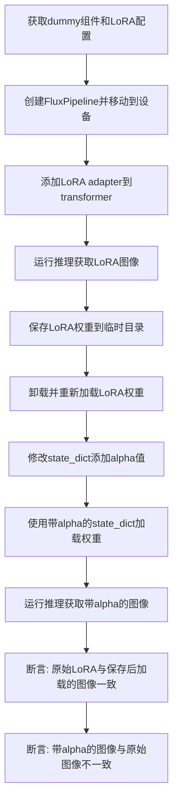

#### 带注释源码

```python
def test_with_alpha_in_state_dict(self):
    """
    测试在state_dict中包含alpha值时的加载行为
    
    该测试模拟了真实场景中LoRA权重文件包含alpha值的情况
    (参考: https://huggingface.co/TheLastBen/Jon_Snow_Flux_LoRA)
    """
    # 1. 获取测试所需的虚拟组件和LoRA配置
    components, _, denoiser_lora_config = self.get_dummy_components(FlowMatchEulerDiscreteScheduler)
    
    # 2. 创建pipeline并移动到计算设备
    pipe = self.pipeline_class(**components)
    pipe = pipe.to(torch_device)
    pipe.set_progress_bar_config(disable=None)
    
    # 3. 获取测试输入数据
    _, _, inputs = self.get_dummy_inputs(with_generator=False)
    
    # 4. 为transformer添加LoRA adapter
    pipe.transformer.add_adapter(denoiser_lora_config)
    
    # 5. 验证LoRA已正确设置
    self.assertTrue(check_if_lora_correctly_set(pipe.transformer), "Lora not correctly set in transformer")
    
    # 6. 使用LoRA进行推理，获取基准图像
    images_lora = pipe(**inputs, generator=torch.manual_seed(0)).images
    
    with tempfile.TemporaryDirectory() as tmpdirname:
        # 7. 获取当前LoRA模型的状态字典
        denoiser_state_dict = get_peft_model_state_dict(pipe.transformer)
        
        # 8. 将LoRA权重保存到临时目录
        self.pipeline_class.save_lora_weights(tmpdirname, transformer_lora_layers=denoiser_state_dict)
        
        # 9. 验证权重文件已保存
        self.assertTrue(os.path.isfile(os.path.join(tmpdirname, "pytorch_lora_weights.safetensors")))
        
        # 10. 卸载并重新加载LoRA权重（模拟从预训练权重加载）
        pipe.unload_lora_weights()
        pipe.load_lora_weights(os.path.join(tmpdirname, "pytorch_lora_weights.safetensors"))
        
        # 11. 修改state_dict，添加alpha值
        #    这种格式常见于某些社区训练的LoRA权重
        state_dict_with_alpha = safetensors.torch.load_file(
            os.path.join(tmpdirname, "pytorch_lora_weights.safetensors")
        )
        alpha_dict = {}
        for k, v in state_dict_with_alpha.items():
            # 仅针对transformer的to_k投影层的lora_A权重添加alpha
            if "transformer" in k and "to_k" in k and "lora_A" in k:
                # 生成随机alpha值 (10-100之间)
                alpha_dict[f"{k}.alpha"] = float(torch.randint(10, 100, size=()))
        state_dict_with_alpha.update(alpha_dict)
    
    # 12. 重新加载后的推理结果
    images_lora_from_pretrained = pipe(**inputs, generator=torch.manual_seed(0)).images
    
    # 13. 验证LoRA仍然正确设置
    self.assertTrue(check_if_lora_correctly_set(pipe.transformer), "Lora not correctly set in denoiser")
    
    # 14. 卸载并加载带alpha值的state_dict
    pipe.unload_lora_weights()
    pipe.load_lora_weights(state_dict_with_alpha)
    images_lora_with_alpha = pipe(**inputs, generator=torch.manual_seed(0)).images
    
    # 15. 断言验证
    #    验证从保存的权重重新加载应产生相同结果
    self.assertTrue(
        np.allclose(images_lora, images_lora_from_pretrained, atol=1e-3, rtol=1e-3),
        "Loading from saved checkpoints should give same results.",
    )
    
    #    验证带alpha值的加载应产生不同结果
    self.assertFalse(np.allclose(images_lora_with_alpha, images_lora, atol=1e-3, rtol=1e-3))
```


### `FluxLoRATests.test_lora_expansion_works_for_absent_keys`

该测试方法验证FluxPipeline在加载多个LoRA适配器时，当某个适配器的权重键在另一个适配器中缺失（不存在）时的处理能力。测试通过修改LoRA配置添加不存在的目标模块，然后加载缺失该模块权重的适配器，验证系统能够正确处理这种键不匹配的情况并产生预期的差异化输出。

参数：

- `self`：`FluxLoRATests`（隐式参数），测试类实例本身，包含pipeline_class、transformer_cls等测试所需的类属性和辅助方法

返回值：`None`，该方法为单元测试方法，通过断言验证行为，不返回具体数据

#### 流程图

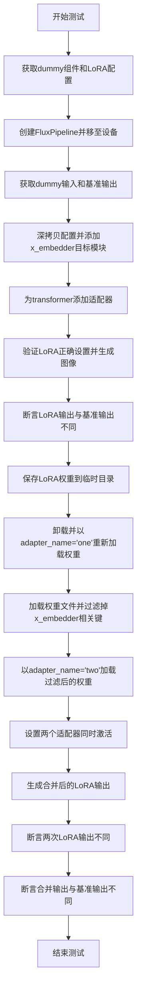

#### 带注释源码

```python
def test_lora_expansion_works_for_absent_keys(self):
    """
    测试LoRA扩展功能：当加载多个适配器时，如果某个适配器的权重键
    在另一个适配器中不存在，系统应能正确处理并产生差异化输出。
    """
    # 获取FlowMatchEulerDiscreteScheduler的dummy组件和denoiser的LoRA配置
    components, _, denoiser_lora_config = self.get_dummy_components(FlowMatchEulerDiscreteScheduler)
    
    # 使用FluxPipeline类创建pipeline实例
    pipe = self.pipeline_class(**components)
    
    # 将pipeline移至指定的计算设备（如GPU）
    pipe = pipe.to(torch_device)
    
    # 配置进度条（disable=None表示不禁用）
    pipe.set_progress_bar_config(disable=None)
    
    # 获取dummy输入，with_generator=False表示不使用随机生成器
    _, _, inputs = self.get_dummy_inputs(with_generator=False)

    # 获取不带LoRA的基准pipeline输出
    output_no_lora = self.get_base_pipe_output()

    # 【关键步骤1】修改配置：添加一个在第二个LoRA中不存在的目标模块
    # 深拷贝原始配置以避免修改原始配置
    modified_denoiser_lora_config = copy.deepcopy(denoiser_lora_config)
    # 向目标模块集合添加"x_embedder"，这个模块在后续加载的第二个LoRA中将被排除
    modified_denoiser_lora_config.target_modules.add("x_embedder")

    # 为transformer添加修改后的LoRA适配器
    pipe.transformer.add_adapter(modified_denoiser_lora_config)
    
    # 断言验证LoRA已正确设置在transformer中
    self.assertTrue(check_if_lora_correctly_set(pipe.transformer), "Lora not correctly set in transformer")

    # 使用第一个包含x_embedder的LoRA生成图像
    images_lora = pipe(**inputs, generator=torch.manual_seed(0)).images
    
    # 断言：LoRA应该产生与基准不同的结果
    self.assertFalse(
        np.allclose(images_lora, output_no_lora, atol=1e-3, rtol=1e-3),
        "LoRA should lead to different results.",
    )

    # 【关键步骤2】保存和重新加载流程
    with tempfile.TemporaryDirectory() as tmpdirname:
        # 从pipeline的transformer获取PEFT模型状态字典
        denoiser_state_dict = get_peft_model_state_dict(pipe.transformer)
        
        # 保存LoRA权重到safetensors文件
        self.pipeline_class.save_lora_weights(tmpdirname, transformer_lora_layers=denoiser_state_dict)

        # 验证权重文件已保存
        self.assertTrue(os.path.isfile(os.path.join(tmpdirname, "pytorch_lora_weights.safetensors")))
        
        # 卸载当前LoRA权重
        pipe.unload_lora_weights()
        
        # 以adapter_name='one'重新加载权重（包含完整的x_embedder）
        pipe.load_lora_weights(os.path.join(tmpdirname, "pytorch_lora_weights.safetensors"), adapter_name="one")

        # 【关键步骤3】修改状态字典，排除x_embedder相关的LoRA参数
        # 加载保存的权重文件
        lora_state_dict = safetensors.torch.load_file(os.path.join(tmpdirname, "pytorch_lora_weights.safetensors"))
        
        # 过滤掉所有包含"x_embedder"键的权重，创建不包含x_embedder的新状态字典
        lora_state_dict_without_xembedder = {k: v for k, v in lora_state_dict.items() if "x_embedder" not in k}

    # 【关键步骤4】加载缺失x_embedder的适配器作为第二个adapter
    pipe.load_lora_weights(lora_state_dict_without_xembedder, adapter_name="two")
    
    # 设置同时激活两个适配器："one"（有x_embedder）和"two"（无x_embedder）
    pipe.set_adapters(["one", "two"])
    
    # 验证LoRA在transformer中正确设置
    self.assertTrue(check_if_lora_correctly_set(pipe.transformer), "Lora not correctly set in transformer")
    
    # 生成同时使用两个适配器的输出
    images_lora_with_absent_keys = pipe(**inputs, generator=torch.manual_seed(0)).images

    # 断言：不同的LoRA配置应产生不同的结果
    self.assertFalse(
        np.allclose(images_lora, images_lora_with_absent_keys, atol=1e-3, rtol=1e-3),
        "Different LoRAs should lead to different results.",
    )
    
    # 断言：LoRA应产生与基准（无LoRA）不同的结果
    self.assertFalse(
        np.allclose(output_no_lora, images_lora_with_absent_keys, atol=1e-3, rtol=1e-3),
        "LoRA should lead to different results.",
    )
```


### `FluxLoRATests.test_lora_expansion_works_for_extra_keys`

测试LoRA扩展处理额外键的功能，验证当加载的LoRA权重包含目标模型中不存在的额外键时，系统能够正确处理这种情况。

参数：
- `self`：隐式参数，测试类实例本身

返回值：`None`，测试方法无返回值，通过断言验证行为

#### 流程图

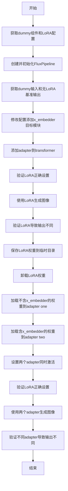

#### 带注释源码

```python
def test_lora_expansion_works_for_extra_keys(self):
    """测试LoRA扩展处理额外键的功能
    
    该测试验证当加载的LoRA权重包含目标模型中不存在的额外键时，
    系统能够正确处理这种情况。具体场景：
    - 第一个LoRA权重不包含x_embedder相关参数
    - 第二个LoRA权重包含x_embedder相关参数
    - 两个LoRA同时使用时，第二个LoRA的额外键能被正确处理
    """
    # 获取FluxPipeline的组件、调度器和LoRA配置
    components, _, denoiser_lora_config = self.get_dummy_components(FlowMatchEulerDiscreteScheduler)
    
    # 使用组件创建FluxPipeline实例
    pipe = self.pipeline_class(**components)
    
    # 将pipeline移动到指定的计算设备
    pipe = pipe.to(torch_device)
    
    # 配置进度条（disable=None表示不禁用进度条）
    pipe.set_progress_bar_config(disable=None)
    
    # 获取dummy输入（without generator用于确定性测试）
    _, _, inputs = self.get_dummy_inputs(with_generator=False)
    
    # 获取不使用LoRA时的基准输出，用于后续比较
    output_no_lora = self.get_base_pipe_output()

    # 修改配置添加x_embedder目标模块
    # 这个模块在第一个LoRA中不存在，但第二个LoRA中存在
    modified_denoiser_lora_config = copy.deepcopy(denoiser_lora_config)
    modified_denoiser_lora_config.target_modules.add("x_embedder")

    # 为transformer添加LoRA适配器
    pipe.transformer.add_adapter(modified_denoiser_lora_config)
    
    # 断言验证LoRA已正确设置到transformer中
    self.assertTrue(check_if_lora_correctly_set(pipe.transformer), "Lora not correctly set in transformer")

    # 使用LoRA进行推理生成图像
    images_lora = pipe(**inputs, generator=torch.manual_seed(0)).images
    
    # 断言验证LoRA确实改变了输出（与无LoRA输出不同）
    self.assertFalse(
        np.allclose(images_lora, output_no_lora, atol=1e-3, rtol=1e-3),
        "LoRA should lead to different results.",
    )

    # 创建临时目录用于保存LoRA权重
    with tempfile.TemporaryDirectory() as tmpdirname:
        # 获取当前transformer的PEFT模型状态字典
        denoiser_state_dict = get_peft_model_state_dict(pipe.transformer)
        
        # 将LoRA权重保存到临时目录
        self.pipeline_class.save_lora_weights(tmpdirname, transformer_lora_layers=denoiser_state_dict)

        # 验证权重文件已成功创建
        self.assertTrue(os.path.isfile(os.path.join(tmpdirname, "pytorch_lora_weights.safetensors")))
        
        # 卸载当前LoRA权重
        pipe.unload_lora_weights()
        
        # 加载权重文件并排除x_embedder相关的参数
        lora_state_dict = safetensors.torch.load_file(os.path.join(tmpdirname, "pytorch_lora_weights.safetensors"))
        lora_state_dict_without_xembedder = {k: v for k, v in lora_state_dict.items() if "x_embedder" not in k}
        
        # 将不含x_embedder的权重加载为adapter "one"
        pipe.load_lora_weights(lora_state_dict_without_xembedder, adapter_name="one")

        # 加载原始完整权重（含x_embedder）作为adapter "two"
        pipe.load_lora_weights(os.path.join(tmpdirname, "pytorch_lora_weights.safetensors"), adapter_name="two")

    # 同时激活"one"和"two"两个adapter
    pipe.set_adapters(["one", "two"])
    
    # 验证LoRA正确设置
    self.assertTrue(check_if_lora_correctly_set(pipe.transformer), "Lora not correctly set in transformer")
    
    # 使用两个adapter生成图像
    images_lora_with_extra_keys = pipe(**inputs, generator=torch.manual_seed(0)).images

    # 验证两个adapter同时使用导致输出不同（相对于单个adapter）
    self.assertFalse(
        np.allclose(images_lora, images_lora_with_extra_keys, atol=1e-3, rtol=1e-3),
        "Different LoRAs should lead to different results.",
    )
    
    # 验证LoRA导致输出不同于基准（无LoRA）
    self.assertFalse(
        np.allclose(output_no_lora, images_lora_with_extra_keys, atol=1e-3, rtol=1e-3),
        "LoRA should lead to different results.",
    )
```


### `FluxControlLoRATests.get_dummy_inputs`

获取用于 FluxControlPipeline 测试的虚拟输入数据，包括噪声张量、输入 ID 张量以及包含 control_image 的管道输入字典。

参数：

- `self`：隐式参数，测试类实例
- `with_generator`：`bool`，是否在返回的管道输入中包含随机数生成器（generator）

返回值：`Tuple[torch.Tensor, torch.Tensor, Dict]`，返回三元组：
- `noise`：`torch.Tensor`，形状为 (1, 4, 32, 32) 的噪声张量
- `input_ids`：`torch.Tensor`，形状为 (1, 10) 的输入 ID 张量
- `pipeline_inputs`：`Dict`，包含 prompt、control_image、num_inference_steps、guidance_scale、height、width、output_type 和可选 generator 的字典

#### 流程图

```mermaid
flowchart TD
    A[开始 get_dummy_inputs] --> B[设置批次大小为1<br/>序列长度为10<br/>通道数为4<br/>尺寸为32x32]
    B --> C[创建随机数生成器<br/>torch.manual_seed(0)]
    C --> D[生成噪声张量<br/>floats_tensor]
    E[生成input_ids张量<br/>torch.randint] --> F[设置numpy随机种子<br/>np.random.seed(0)]
    D --> E
    F --> G[创建pipeline_inputs字典<br/>包含prompt和control_image]
    H{with_generator?} -->|是| I[将generator添加到<br/>pipeline_inputs]
    H -->|否| J[跳过添加generator]
    I --> K[返回 noise, input_ids, pipeline_inputs]
    J --> K
```

#### 带注释源码

```python
def get_dummy_inputs(self, with_generator=True):
    """
    生成用于 FluxControlPipeline 测试的虚拟输入数据。
    
    参数:
        with_generator: 布尔值，指定是否在返回的字典中包含 PyTorch 随机数生成器。
                        默认为 True。
    
    返回:
        元组 (noise, input_ids, pipeline_inputs):
            - noise: 形状为 (batch_size, num_channels, height, width) 的噪声张量
            - input_ids: 形状为 (batch_size, sequence_length) 的文本输入 ID 张量
            - pipeline_inputs: 包含管道推理所需参数的字典，包括 control_image
    """
    # 定义测试用的批处理参数
    batch_size = 1
    sequence_length = 10
    num_channels = 4
    sizes = (32, 32)

    # 创建随机数生成器，确保测试结果可复现
    generator = torch.manual_seed(0)
    
    # 生成随机噪声张量，形状为 (1, 4, 32, 32)
    noise = floats_tensor((batch_size, num_channels) + sizes)
    
    # 生成随机输入 ID，用于文本编码器
    input_ids = torch.randint(1, sequence_length, size=(batch_size, sequence_length), generator=generator)

    # 设置 NumPy 随机种子，确保 control_image 可复现
    np.random.seed(0)
    
    # 构建管道输入字典，包含推理所需的所有参数
    pipeline_inputs = {
        "prompt": "A painting of a squirrel eating a burger",  # 测试用提示词
        "control_image": Image.fromarray(
            np.random.randint(0, 255, size=(32, 32, 3), dtype="uint8")
        ),  # 随机生成的 RGB 控制图像 (32x32)
        "num_inference_steps": 4,   # 推理步数
        "guidance_scale": 0.0,      # 无分类器指导权重
        "height": 8,                # 输出图像高度
        "width": 8,                 # 输出图像宽度
        "output_type": "np",        # 输出为 NumPy 数组
    }
    
    # 如果需要生成器，将其添加到管道输入中
    if with_generator:
        pipeline_inputs.update({"generator": generator})

    # 返回噪声、输入 ID 和管道输入字典
    return noise, input_ids, pipeline_inputs
```


### `FluxControlLoRATests.test_with_norm_in_state_dict`

测试加载归一化层权重，验证在 state_dict 中包含归一化层时 LoRA 加载机制的正确性。

参数：

-  `self`：无参数，测试类实例本身

返回值：无返回值（`None`），测试方法通过断言验证行为

#### 流程图

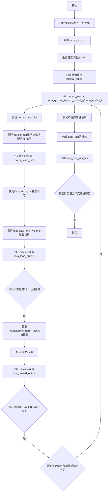

#### 带注释源码

```python
def test_with_norm_in_state_dict(self):
    """测试加载包含归一化层的state_dict"""
    
    # 1. 获取组件和LoRA配置
    components, _, denoiser_lora_config = self.get_dummy_components(FlowMatchEulerDiscreteScheduler)
    
    # 2. 初始化FluxControlPipeline
    pipe = self.pipeline_class(**components)
    pipe = pipe.to(torch_device)
    pipe.set_progress_bar_config(disable=None)

    # 3. 获取测试输入
    _, _, inputs = self.get_dummy_inputs(with_generator=False)

    # 4. 设置日志记录器
    logger = logging.get_logger("diffusers.loaders.lora_pipeline")
    logger.setLevel(logging.INFO)

    # 5. 获取基准输出（无LoRA）
    original_output = pipe(**inputs, generator=torch.manual_seed(0))[0]

    # 6. 遍历每种归一化层类型进行测试
    for norm_layer in ["norm_q", "norm_k", "norm_added_q", "norm_added_k"]:
        norm_state_dict = {}
        
        # 遍历transformer模块查找匹配的归一化层
        for name, module in pipe.transformer.named_modules():
            if norm_layer not in name or not hasattr(module, "weight") or module.weight is None:
                continue
            
            # 为每个匹配的归一化层生成随机权重
            norm_state_dict[f"transformer.{name}.weight"] = torch.randn(
                module.weight.shape, device=module.weight.device, dtype=module.weight.dtype
            )

            # 捕获加载权重时的日志输出
            with CaptureLogger(logger) as cap_logger:
                pipe.load_lora_weights(norm_state_dict)
            
            # 执行推理获取加载LoRA后的输出
            lora_load_output = pipe(**inputs, generator=torch.manual_seed(0))[0]

            # 验证日志中包含归一化层警告信息
            self.assertTrue(
                "The provided state dict contains normalization layers in addition to LoRA layers"
                in cap_logger.out
            )
            
            # 验证_transformer_norm_layers被正确设置
            self.assertTrue(len(pipe.transformer._transformer_norm_layers) > 0)

            # 卸载LoRA权重
            pipe.unload_lora_weights()
            
            # 执行推理获取卸载LoRA后的输出
            lora_unload_output = pipe(**inputs, generator=torch.manual_seed(0))[0]

        # 验证卸载后归一化层被清空
        self.assertTrue(pipe.transformer._transformer_norm_layers is None)
        
        # 验证原始输出与卸载后输出相近（权重已恢复）
        self.assertTrue(np.allclose(original_output, lora_unload_output, atol=1e-5, rtol=1e-5))
        
        # 验证原始输出与加载归一化层后的输出不同
        self.assertFalse(
            np.allclose(original_output, lora_load_output, atol=1e-6, rtol=1e-6), f"{norm_layer} is tested"
        )

    # 7. 测试不支持的归一化层键场景
    with CaptureLogger(logger) as cap_logger:
        # 修改state_dict的键名，替换norm为不存在的名称
        for key in list(norm_state_dict.keys()):
            norm_state_dict[key.replace("norm", "norm_k_something_random")] = norm_state_dict.pop(key)
        
        # 尝试加载包含不支持键的state_dict
        pipe.load_lora_weights(norm_state_dict)

    # 验证日志中包含不支持键的警告信息
    self.assertTrue(
        "Unsupported keys found in state dict when trying to load normalization layers" in cap_logger.out
    )
```


### `FluxControlLoRATests.test_lora_parameter_expanded_shapes()`

该测试方法验证了当LoRA参数的输入/输出特征维度与目标模型层不匹配时，系统能否正确扩展（填充或截断）这些参数。具体来说，它测试了两种场景：一种是LoRA参数维度大于模型层维度（截断），另一种是LoRA参数维度小于模型层维度（零填充）。通过模拟FluxControlPipeline在加载Control LoRA时可能遇到的输入通道数变化（如4通道输入扩展到8通道），该测试确保了LoRA权重能够动态适配不同的特征维度，并验证了扩展后的模型能够产生不同于原始模型的输出，同时检查了配置和权重形状的正确更新。

参数：
- 该方法无显式参数，但使用以下类属性/方法：
  - `self.get_dummy_components`：获取虚拟组件的方法
  - `self.pipeline_class`：管道类（`FluxControlPipeline`）
  - `self.get_dummy_inputs`：获取虚拟输入的方法
  - `torch_device`：测试设备
  - `check_if_lora_correctly_set`：验证LoRA是否正确设置的辅助函数
  - `CaptureLogger`：日志捕获上下文管理器

返回值：`None`，该方法为测试方法，通过断言验证行为而非返回值。

#### 流程图

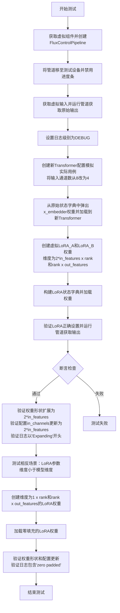

#### 带注释源码

```python
def test_lora_parameter_expanded_shapes(self):
    """
    测试LoRA参数形状扩展功能。
    
    该测试验证当LoRA参数的输入/输出特征维度与目标模型层不匹配时，
    系统能否正确扩展（截断或零填充）这些参数。
    主要测试两种场景：
    1. LoRA参数维度大于模型层维度（需要截断）
    2. LoRA参数维度小于模型层维度（需要零填充）
    """
    # 步骤1: 获取虚拟组件（包含transformer、vae、text encoder等）并创建管道
    components, _, _ = self.get_dummy_components(FlowMatchEulerDiscreteScheduler)
    pipe = self.pipeline_class(**components)
    pipe = pipe.to(torch_device)  # 移至测试设备
    pipe.set_progress_bar_config(disable=None)  # 禁用进度条

    # 步骤2: 获取虚拟输入并运行管道获取基准输出
    _, _, inputs = self.get_dummy_inputs(with_generator=False)
    original_out = pipe(**inputs, generator=torch.manual_seed(0))[0]

    # 步骤3: 设置日志级别以捕获LoRA加载过程中的日志信息
    logger = logging.get_logger("diffusers.loaders.lora_pipeline")
    logger.setLevel(logging.DEBUG)

    # 步骤4: 修改transformer配置模拟实际用例
    # 原始配置有8个输入通道（包含control），现在改为4个（无control）
    num_channels_without_control = 4
    # 从原始配置创建新的transformer，指定输入通道数为4
    transformer = FluxTransformer2DModel.from_config(
        components["transformer"].config, in_channels=num_channels_without_control
    ).to(torch_device)
    # 验证配置已正确更新
    self.assertTrue(
        transformer.config.in_channels == num_channels_without_control,
        f"Expected {num_channels_without_control} channels in the modified transformer but has {transformer.config.in_channels=}",
    )

    # 步骤5: 将原始transformer的权重（8通道）加载到新的transformer（4通道）
    # 获取原始transformer的状态字典
    original_transformer_state_dict = pipe.transformer.state_dict()
    # 弹出x_embedder权重（这是嵌入层，会随通道数变化）
    x_embedder_weight = original_transformer_state_dict.pop("x_embedder.weight")
    # 尝试加载状态字典，strict=False允许缺少某些键
    incompatible_keys = transformer.load_state_dict(original_transformer_state_dict, strict=False)
    # 验证x_embedder.weight确实在缺失键中
    self.assertTrue(
        "x_embedder.weight" in incompatible_keys.missing_keys,
        "Could not find x_embedder.weight in the missing keys.",
    )
    # 将权重数据复制到新transformer，只取前4个通道
    transformer.x_embedder.weight.data.copy_(x_embedder_weight[..., :num_channels_without_control])
    # 替换管道的transformer
    pipe.transformer = transformer

    # 步骤6: 创建测试用LoRA权重
    # 获取x_embedder的权重形状：out_features x in_features
    out_features, in_features = pipe.transformer.x_embedder.weight.shape
    rank = 4  # LoRA的秩

    # 创建维度为2*in_features x rank的LoRA_A（模拟扩展后的输入维度）
    # 原始in_features=4，这里创建8x4的权重（模拟Control LoRA的维度）
    dummy_lora_A = torch.nn.Linear(2 * in_features, rank, bias=False)
    # 创建维度为rank x out_features的LoRA_B
    dummy_lora_B = torch.nn.Linear(rank, out_features, bias=False)
    # 构建LoRA状态字典
    lora_state_dict = {
        "transformer.x_embedder.lora_A.weight": dummy_lora_A.weight,
        "transformer.x_embedder.lora_B.weight": dummy_lora_B.weight,
    }
    
    # 步骤7: 加载LoRA权重并捕获日志
    with CaptureLogger(logger) as cap_logger:
        pipe.load_lora_weights(lora_state_dict, "adapter-1")

    # 步骤8: 验证LoRA正确设置
    self.assertTrue(check_if_lora_correctly_set(pipe.transformer), "Lora not correctly set in denoiser")

    # 步骤9: 运行管道获取LoRA输出
    lora_out = pipe(**inputs, generator=torch.manual_seed(0))[0]

    # 步骤10: 断言验证
    # 验证LoRA输出与原始输出不同
    self.assertFalse(np.allclose(original_out, lora_out, rtol=1e-4, atol=1e-4))
    # 验证权重形状已扩展为2*in_features（从4扩展到8）
    self.assertTrue(pipe.transformer.x_embedder.weight.data.shape[1] == 2 * in_features)
    # 验证配置中的in_channels也已更新
    self.assertTrue(pipe.transformer.config.in_channels == 2 * in_features)
    # 验证日志信息正确（表明发生了形状扩展）
    self.assertTrue(cap_logger.out.startswith("Expanding the nn.Linear input/output features for module"))

    # 步骤11: 测试相反场景 - LoRA参数维度小于模型维度（需要零填充）
    # 重新创建管道和transformer
    components, _, _ = self.get_dummy_components(FlowMatchEulerDiscreteScheduler)
    pipe = self.pipeline_class(**components)
    pipe = pipe.to(torch_device)
    pipe.set_progress_bar_config(disable=None)
    
    # 创建维度为1 x rank的LoRA_A（小于模型所需）
    dummy_lora_A = torch.nn.Linear(1, rank, bias=False)
    dummy_lora_B = torch.nn.Linear(rank, out_features, bias=False)
    lora_state_dict = {
        "transformer.x_embedder.lora_A.weight": dummy_lora_A.weight,
        "transformer.x_embedder.lora_B.weight": dummy_lora_B.weight,
    }
    with CaptureLogger(logger) as cap_logger:
        pipe.load_lora_weights(lora_state_dict, "adapter-1")

    # 验证LoRA正确设置
    self.assertTrue(check_if_lora_correctly_set(pipe.transformer), "Lora not correctly set in denoiser")

    # 运行管道获取输出
    lora_out = pipe(**inputs, generator=torch.manual_seed(0))[0]

    # 验证结果
    self.assertFalse(np.allclose(original_out, lora_out, rtol=1e-4, atol=1e-4))
    self.assertTrue(pipe.transformer.x_embedder.weight.data.shape[1] == 2 * in_features)
    self.assertTrue(pipe.transformer.config.in_channels == 2 * in_features)
    # 验证日志包含零填充信息
    self.assertTrue("The following LoRA modules were zero padded to match the state dict of" in cap_logger.out)
```


### `FluxControlLoRATests.test_normal_lora_with_expanded_lora_raises_error`

该测试方法验证了当尝试在已加载形状扩展LoRA（Control LoRA）后再加载普通LoRA（Flux.1-Dev LoRA）时，系统应该抛出错误；反之顺序则可以成功加载（通过零填充方式）。

参数：无（测试类方法，通过self访问测试实例）

返回值：无（测试方法返回None，通过unittest断言验证行为）

#### 流程图

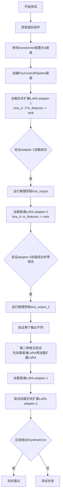

#### 带注释源码

```python
def test_normal_lora_with_expanded_lora_raises_error(self):
    # 测试场景：加载普通LoRA（如Flux.1-Dev训练的LoRA）后
    # 再加载形状扩展LoRA（如Control LoRA）的情况
    
    # 1. 获取虚拟组件用于测试
    components, _, _ = self.get_dummy_components(FlowMatchEulerDiscreteScheduler)

    # 2. 修改transformer配置以模拟真实用例（带control通道）
    # 原始Flux.1-Dev是4通道，这里改为4通道（无control）
    num_channels_without_control = 4
    transformer = FluxTransformer2DModel.from_config(
        components["transformer"].config, in_channels=num_channels_without_control
    ).to(torch_device)
    components["transformer"] = transformer

    # 3. 创建FluxControlPipeline管道并设置设备
    pipe = self.pipeline_class(**components)
    pipe = pipe.to(torch_device)
    pipe.set_progress_bar_config(disable=None)

    # 4. 设置日志级别为DEBUG以捕获LoRA加载日志
    logger = logging.get_logger("diffusers.loaders.lora_pipeline")
    logger.setLevel(logging.DEBUG)

    # 5. 获取当前transformer的权重形状
    out_features, in_features = pipe.transformer.x_embedder.weight.shape
    rank = 4  # LoRA的秩

    # 6. 创建形状扩展LoRA（输入维度翻倍，对应Control LoRA）
    shape_expander_lora_A = torch.nn.Linear(2 * in_features, rank, bias=False)
    shape_expander_lora_B = torch.nn.Linear(rank, out_features, bias=False)
    lora_state_dict = {
        "transformer.x_embedder.lora_A.weight": shape_expander_lora_A.weight,
        "transformer.x_embedder.lora_B.weight": shape_expander_lora_B.weight,
    }
    
    # 7. 加载形状扩展LoRA作为adapter-1
    with CaptureLogger(logger) as cap_logger:
        pipe.load_lora_weights(lora_state_dict, "adapter-1")

    # 8. 验证LoRA正确加载
    self.assertTrue(check_if_lora_correctly_set(pipe.transformer), "Lora not correctly set in denoiser")
    self.assertTrue(pipe.get_active_adapters() == ["adapter-1"])
    self.assertTrue(pipe.transformer.x_embedder.weight.data.shape[1] == 2 * in_features)
    self.assertTrue(pipe.transformer.config.in_channels == 2 * in_features)
    # 验证日志显示"Expanding"消息
    self.assertTrue(cap_logger.out.startswith("Expanding the nn.Linear input/output features for module"))

    # 9. 使用adapter-1运行推理
    _, _, inputs = self.get_dummy_inputs(with_generator=False)
    lora_output = pipe(**inputs, generator=torch.manual_seed(0))[0]

    # 10. 创建普通LoRA（输入维度为原始维度）
    normal_lora_A = torch.nn.Linear(in_features, rank, bias=False)
    normal_lora_B = torch.nn.Linear(rank, out_features, bias=False)
    lora_state_dict = {
        "transformer.x_embedder.lora_A.weight": normal_lora_A.weight,
        "transformer.x_embedder.lora_B.weight": normal_lora_B.weight,
    }

    # 11. 加载普通LoRA作为adapter-2（扩展LoRA后加载普通LoRA，应该可以工作）
    with CaptureLogger(logger) as cap_logger:
        pipe.load_lora_weights(lora_state_dict, "adapter-2")

    self.assertTrue(check_if_lora_correctly_set(pipe.transformer), "Lora not correctly set in denoiser")
    # 验证日志显示零填充消息
    self.assertTrue("The following LoRA modules were zero padded to match the state dict of" in cap_logger.out)
    self.assertTrue(pipe.get_active_adapters() == ["adapter-2"])

    # 12. 使用adapter-2运行推理
    lora_output_2 = pipe(**inputs, generator=torch.manual_seed(0))[0]
    # 验证两个输出不同
    self.assertFalse(np.allclose(lora_output, lora_output_2, atol=1e-3, rtol=1e-3))

    # 13. 测试相反情况：先加载普通LoRA，再加载扩展LoRA
    # 这应该导致输入形状不兼容的运行时错误
    components, _, _ = self.get_dummy_components(FlowMatchEulerDiscreteScheduler)
    # 重新创建transformer配置
    num_channels_without_control = 4
    transformer = FluxTransformer2DModel.from_config(
        components["transformer"].config, in_channels=num_channels_without_control
    ).to(torch_device)
    components["transformer"] = transformer

    pipe = self.pipeline_class(**components)
    pipe = pipe.to(torch_device)
    pipe.set_progress_bar_config(disable=None)

    logger = logging.get_logger("diffusers.loaders.lora_pipeline")
    logger.setLevel(logging.DEBUG)

    out_features, in_features = pipe.transformer.x_embedder.weight.shape
    rank = 4

    # 14. 先加载普通LoRA（正确维度）
    lora_state_dict = {
        "transformer.x_embedder.lora_A.weight": normal_lora_A.weight,
        "transformer.x_embedder.lora_B.weight": normal_lora_B.weight,
    }
    pipe.load_lora_weights(lora_state_dict, "adapter-1")

    self.assertTrue(check_if_lora_correctly_set(pipe.transformer), "Lora not correctly set in denoiser")
    self.assertTrue(pipe.transformer.x_embedder.weight.data.shape[1] == in_features)
    self.assertTrue(pipe.transformer.config.in_channels == in_features)

    # 15. 尝试加载形状扩展LoRA（维度不匹配）
    lora_state_dict = {
        "transformer.x_embedder.lora_A.weight": shape_expander_lora_A.weight,
        "transformer.x_embedder.lora_B.weight": shape_expander_lora_B.weight,
    }

    # 16. 验证抛出RuntimeError（形状不匹配）
    self.assertRaisesRegex(
        RuntimeError,
        "size mismatch for x_embedder.lora_A.adapter-2.weight",
        pipe.load_lora_weights,
        lora_state_dict,
        "adapter-2",
    )
```


### `FluxControlLoRATests.test_fuse_expanded_lora_with_regular_lora`

该测试方法验证了当同时加载形状扩展的LoRA（如Control LoRA，权重维度为2*in_features）和普通形状的LoRA（权重维度为in_features）时，fuse_lora操作能够正确地将多个适配器融合在一起，并产生与单独使用适配器时相同的结果。测试首先分别加载两种类型的LoRA权重，验证它们单独使用时产生不同的输出，然后使用fuse_lora将它们融合，最后验证融合后的输出与两个适配器权重相加后的输出在容差范围内相等。

参数：

- `self`：测试类实例本身，无需显式传递

返回值：`None`，该方法为测试方法，通过断言验证融合功能的正确性，不返回任何值

#### 流程图

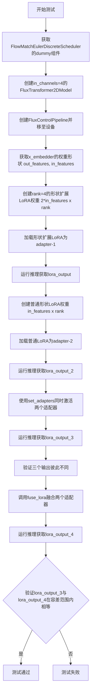

#### 带注释源码

```python
def test_fuse_expanded_lora_with_regular_lora(self):
    # 此测试检查当加载形状扩展的LoRA（如control loras）但
    # 另一个具有正确形状的LoRA时是否能正常工作。反向不支持并在其他测试中验证。
    
    # 步骤1: 获取FlowMatchEulerDiscreteScheduler的虚拟组件
    components, _, _ = self.get_dummy_components(FlowMatchEulerDiscreteScheduler)

    # 步骤2: 修改transformer配置以模拟真实用例
    # 设置输入通道为4（无control image时的通道数）
    num_channels_without_control = 4
    transformer = FluxTransformer2DModel.from_config(
        components["transformer"].config, in_channels=num_channels_without_control
    ).to(torch_device)
    components["transformer"] = transformer

    # 步骤3: 创建FluxControlPipeline并配置
    pipe = self.pipeline_class(**components)
    pipe = pipe.to(torch_device)
    pipe.set_progress_bar_config(disable=None)

    # 步骤4: 设置日志级别为DEBUG
    logger = logging.get_logger("diffusers.loaders.lora_pipeline")
    logger.setLevel(logging.DEBUG)

    # 步骤5: 获取x_embedder的权重维度
    out_features, in_features = pipe.transformer.x_embedder.weight.shape
    rank = 4  # LoRA的秩

    # 步骤6: 创建形状扩展的LoRA权重（输入维度翻倍，适用于Control LoRA）
    shape_expander_lora_A = torch.nn.Linear(2 * in_features, rank, bias=False)
    shape_expander_lora_B = torch.nn.Linear(rank, out_features, bias=False)
    lora_state_dict = {
        "transformer.x_embedder.lora_A.weight": shape_expander_lora_A.weight,
        "transformer.x_embedder.lora_B.weight": shape_expander_lora_B.weight,
    }
    
    # 步骤7: 加载形状扩展LoRA作为adapter-1
    pipe.load_lora_weights(lora_state_dict, "adapter-1")
    self.assertTrue(check_if_lora_correctly_set(pipe.transformer), "Lora not correctly set in denoiser")

    # 步骤8: 获取测试输入并运行推理
    _, _, inputs = self.get_dummy_inputs(with_generator=False)
    lora_output = pipe(**inputs, generator=torch.manual_seed(0))[0]

    # 步骤9: 创建普通形状的LoRA权重（适用于Flux.1-Dev）
    normal_lora_A = torch.nn.Linear(in_features, rank, bias=False)
    normal_lora_B = torch.nn.Linear(rank, out_features, bias=False)
    lora_state_dict = {
        "transformer.x_embedder.lora_A.weight": normal_lora_A.weight,
        "transformer.x_embedder.lora_B.weight": normal_lora_B.weight,
    }

    # 步骤10: 加载普通LoRA作为adapter-2
    pipe.load_lora_weights(lora_state_dict, "adapter-2")
    self.assertTrue(check_if_lora_correctly_set(pipe.transformer), "Lora not correctly set in denoiser")

    # 步骤11: 运行推理获取adapter-2的输出
    lora_output_2 = pipe(**inputs, generator=torch.manual_seed(0))[0]

    # 步骤12: 同时激活两个适配器，权重都为1.0
    pipe.set_adapters(["adapter-1", "adapter-2"], [1.0, 1.0])
    lora_output_3 = pipe(**inputs, generator=torch.manual_seed(0))[0]

    # 步骤13: 验证三个输出彼此不同（确保LoRA确实在工作）
    self.assertFalse(np.allclose(lora_output, lora_output_2, atol=1e-3, rtol=1e-3))
    self.assertFalse(np.allclose(lora_output, lora_output_3, atol=1e-3, rtol=1e-3))
    self.assertFalse(np.allclose(lora_output_2, lora_output_3, atol=1e-3, rtol=1e-3))

    # 步骤14: 融合两个适配器
    pipe.fuse_lora(lora_scale=1.0, adapter_names=["adapter-1", "adapter-2"])
    
    # 步骤15: 运行推理获取融合后的输出
    lora_output_4 = pipe(**inputs, generator=torch.manual_seed(0))[0]
    
    # 步骤16: 验证融合后的输出与两个适配器相加后的输出相等
    # 这是核心验证：fuse_lora应该产生与单独使用适配器相同的结果
    self.assertTrue(np.allclose(lora_output_3, lora_output_4, atol=1e-3, rtol=1e-3))
```


### `FluxControlLoRATests.test_load_regular_lora`

该测试方法验证了如何将标准LoRA（针对Flux.1-Dev训练的版本）加载到具有更多输入通道的Flux变换器中（如Flux Fill、Flux Control等）。测试通过创建扩展输入通道的变换器、构造符合Flux.1-Dev维度的常规LoRA权重、加载并验证LoRA正确应用，同时检查零填充机制是否正常工作。

参数：

- `self`：`FluxControlLoRATests`，测试类实例本身

返回值：`None`，该方法为单元测试方法，无返回值，通过断言验证行为

#### 流程图

```mermaid
flowchart TD
    A[开始测试] --> B[获取Dummy组件并创建Pipeline]
    B --> C[将Pipeline移至设备并禁用进度条]
    C --> D[获取Dummy输入数据]
    D --> E[运行原始Pipeline获取基准输出]
    E --> F[获取变换器x_embedder权重维度]
    F --> G[计算LoRA rank和输入特征数<br/>in_features = in_features // 2]
    G --> H[创建常规LoRA权重<br/>normal_lora_A和normal_lora_B]
    H --> I[构建lora_state_dict]
    I --> J[设置日志级别并捕获日志]
    J --> K[调用load_lora_weights加载LoRA]
    K --> L{断言: LoRA是否正确设置?}
    L -->|是| M[运行Pipeline获取LoRA输出]
    L -->|否| N[测试失败]
    M --> O{断言: 日志包含零填充信息?}
    O -->|是| P{断言: 权重形状正确扩展?}
    P -->|是| Q{断言: 输出与原始输出不同?}
    Q -->|是| R[测试通过]
    Q -->|否| N
    P -->|否| N
    O -->|否| N
```

#### 带注释源码

```python
def test_load_regular_lora(self):
    # 该测试检查是否能将常规LoRA（如在Flux.1 Dev上训练的LoRA）加载到
    # 具有更多输入通道的变换器中，例如Flux Fill、Flux Control等
    components, _, _ = self.get_dummy_components(FlowMatchEulerDiscreteScheduler)
    # 创建FluxControlPipeline实例
    pipe = self.pipeline_class(**components)
    # 将Pipeline移至计算设备
    pipe = pipe.to(torch_device)
    # 禁用进度条配置
    pipe.set_progress_bar_config(disable=None)
    # 获取测试输入数据（不包含generator）
    _, _, inputs = self.get_dummy_inputs(with_generator=False)

    # 运行原始Pipeline获取基准输出（无LoRA）
    original_output = pipe(**inputs, generator=torch.manual_seed(0))[0]

    # 获取变换器x_embedder层的权重形状
    out_features, in_features = pipe.transformer.x_embedder.weight.shape
    # 设置LoRA秩（rank）
    rank = 4
    # 将输入特征数减半，模拟Flux.1-Dev LoRA的维度
    in_features = in_features // 2  # to mimic the Flux.1-Dev LoRA.
    # 创建常规LoRA的A矩阵（降维）
    normal_lora_A = torch.nn.Linear(in_features, rank, bias=False)
    # 创建常规LoRA的B矩阵（升维）
    normal_lora_B = torch.nn.Linear(rank, out_features, bias=False)
    # 构建LoRA状态字典
    lora_state_dict = {
        "transformer.x_embedder.lora_A.weight": normal_lora_A.weight,
        "transformer.x_embedder.lora_B.weight": normal_lora_B.weight,
    }

    # 获取diffusers加载器的日志记录器
    logger = logging.get_logger("diffusers.loaders.lora_pipeline")
    # 设置日志级别为INFO
    logger.setLevel(logging.INFO)
    # 使用CaptureLogger捕获日志输出
    with CaptureLogger(logger) as cap_logger:
        # 调用load_lora_weights加载LoRA权重，指定adapter名称
        pipe.load_lora_weights(lora_state_dict, "adapter-1")
    
    # 断言LoRA已正确设置到transformer中
    self.assertTrue(check_if_lora_correctly_set(pipe.transformer), "Lora not correctly set in denoiser")

    # 使用LoRA运行Pipeline获取输出
    lora_output = pipe(**inputs, generator=torch.manual_seed(0))[0]

    # 断言日志中包含零填充相关信息
    self.assertTrue("The following LoRA modules were zero padded to match the state dict of" in cap_logger.out)
    # 断言x_embedder权重形状已扩展为原始输入特征数的2倍
    self.assertTrue(pipe.transformer.x_embedder.weight.data.shape[1] == in_features * 2)
    # 断言LoRA输出与原始输出不同（验证LoRA生效）
    self.assertFalse(np.allclose(original_output, lora_output, atol=1e-3, rtol=1e-3))
```


### `FluxControlLoRATests.test_lora_unload_with_parameter_expanded_shapes`

该测试方法用于验证当加载具有形状扩展参数的LoRA权重后，卸载LoRA时能否正确重置transformer的配置通道数恢复到原始状态。测试模拟了Flux Control Pipeline加载形状扩展LoRA（如Control LoRA）的场景，验证unload_lora_weights方法在reset_to_overwritten_params=True时能否将in_channels恢复为原始值，并通过FluxPipeline.from_pipe验证配置的正确性。

参数：

- `self`：隐式参数，`FluxControlLoRATests`类实例，表示测试类本身

返回值：无返回值（`None`），该方法为`unittest.TestCase`的测试方法，通过断言验证行为正确性

#### 流程图

```mermaid
flowchart TD
    A[开始测试] --> B[获取dummy组件]
    C[设置DEBUG日志级别]
    B --> C
    C --> D[创建in_channels=4的FluxTransformer]
    D --> E[用FluxPipeline创建原始管道pipe]
    E --> F[获取dummy输入并移除control_image]
    F --> G[运行原始管道得到original_out]
    G --> H[用FluxControlPipeline创建control_pipe]
    H --> I[获取x_embedder权重形状, rank=4]
    I --> J[创建形状扩展的dummy LoRA权重<br/>lora_A: 2*in_features -> rank<br/>lora_B: rank -> out_features]
    J --> K[加载LoRA权重到control_pipe]
    K --> L[添加control_image到输入]
    L --> M[运行control_pipe得到lora_out]
    M --> N{断言验证}
    N -->|lora_out与original_out不同| O[验证x_embedder权重形状为2*in_features]
    N -->|in_channels配置为2*in_features| O
    O --> P[调用unload_lora_weights<br/>reset_to_overwritten_params=True]
    P --> Q[验证in_channels恢复为num_channels_without_control]
    Q --> R[从control_pipe创建FluxPipeline]
    R --> S[验证新管道的in_channels为原始值]
    S --> T[运行loaded_pipe得到unloaded_lora_out]
    T --> U{最终断言验证}
    U -->|unloaded_lora_out不等于lora_out| V[验证x_embedder权重形状恢复为in_features]
    U -->|unloaded_lora_out等于original_out| V
    V --> W[测试结束]
```

#### 带注释源码

```python
def test_lora_unload_with_parameter_expanded_shapes(self):
    """
    测试卸载带有形状扩展参数的LoRA权重后，
    transformer配置能够正确恢复到原始状态
    """
    # 1. 获取FlowMatchEulerDiscreteScheduler的dummy组件
    components, _, _ = self.get_dummy_components(FlowMatchEulerDiscreteScheduler)

    # 2. 获取diffusers加载器日志记录器并设置为DEBUG级别
    logger = logging.get_logger("diffusers.loaders.lora_pipeline")
    logger.setLevel(logging.DEBUG)

    # 3. 模拟真实使用场景：创建in_channels=4的transformer配置
    # 这是为了模拟Flux.1-Dev管道（不含control_image）
    num_channels_without_control = 4
    transformer = FluxTransformer2DModel.from_config(
        components["transformer"].config, in_channels=num_channels_without_control
    ).to(torch_device)
    
    # 验证transformer配置正确
    self.assertTrue(
        transformer.config.in_channels == num_channels_without_control,
        f"Expected {num_channels_without_control} channels in the modified transformer but has {transformer.config.in_channels=}",
    )

    # 4. 使用FluxPipeline创建不含control_image的管道
    components["transformer"] = transformer
    pipe = FluxPipeline(**components)
    pipe = pipe.to(torch_device)
    pipe.set_progress_bar_config(disable=None)

    # 5. 获取dummy输入并移除control_image（FluxPipeline不支持）
    _, _, inputs = self.get_dummy_inputs(with_generator=False)
    control_image = inputs.pop("control_image")
    
    # 6. 运行原始管道得到基准输出
    original_out = pipe(**inputs, generator=torch.manual_seed(0))[0]

    # 7. 使用FluxControlPipeline创建支持control_image的管道
    control_pipe = self.pipeline_class(**components)
    
    # 8. 获取x_embedder的权重形状，用于创建匹配的LoRA权重
    out_features, in_features = control_pipe.transformer.x_embedder.weight.shape
    rank = 4  # LoRA的秩

    # 9. 创建形状扩展的dummy LoRA权重
    # lora_A: 输入维度扩展为2倍（因为control有额外的输入通道）
    dummy_lora_A = torch.nn.Linear(2 * in_features, rank, bias=False)
    dummy_lora_B = torch.nn.Linear(rank, out_features, bias=False)
    
    # 构建LoRA状态字典
    lora_state_dict = {
        "transformer.x_embedder.lora_A.weight": dummy_lora_A.weight,
        "transformer.x_embedder.lora_B.weight": dummy_lora_B.weight,
    }
    
    # 10. 加载LoRA权重，使用CaptureLogger捕获日志输出
    with CaptureLogger(logger) as cap_logger:
        control_pipe.load_lora_weights(lora_state_dict, "adapter-1")
        # 验证LoRA正确设置
        self.assertTrue(check_if_lora_correctly_set(pipe.transformer), "Lora not correctly set in denoiser")

    # 11. 恢复control_image到输入中
    inputs["control_image"] = control_image
    
    # 12. 运行带有LoRA的control_pipe
    lora_out = control_pipe(**inputs, generator=torch.manual_seed(0))[0]

    # 13. 验证LoRA加载后产生了不同的输出
    self.assertFalse(np.allclose(original_out, lora_out, rtol=1e-4, atol=1e-4))
    
    # 14. 验证transformer的x_embedder权重形状被扩展
    self.assertTrue(pipe.transformer.x_embedder.weight.data.shape[1] == 2 * in_features)
    
    # 15. 验证transformer的in_channels配置被更新
    self.assertTrue(pipe.transformer.config.in_channels == 2 * in_features)
    
    # 16. 验证日志中包含形状扩展的提示信息
    self.assertTrue(cap_logger.out.startswith("Expanding the nn.Linear input/output features for module"))

    # 17. 卸载LoRA权重，reset_to_overwritten_params=True表示重置为覆盖前的参数
    control_pipe.unload_lora_weights(reset_to_overwritten_params=True)
    
    # 18. 验证transformer的in_channels恢复为原始值
    self.assertTrue(
        control_pipe.transformer.config.in_channels == num_channels_without_control,
        f"Expected {num_channels_without_control} channels in the modified transformer but has {control_pipe.transformer.config.in_channels=}",
    )

    # 19. 从control_pipe创建新的FluxPipeline
    loaded_pipe = FluxPipeline.from_pipe(control_pipe)
    
    # 20. 验证新创建的pipeline也保持了正确的in_channels配置
    self.assertTrue(
        loaded_pipe.transformer.config.in_channels == num_channels_without_control,
        f"Expected {num_channels_without_control} channels in the modified transformer but has {loaded_pipe.transformer.config.in_channels=}",
    )

    # 21. 移除control_image后运行loaded_pipe
    inputs.pop("control_image")
    unloaded_lora_out = loaded_pipe(**inputs, generator=torch.manual_seed(0))[0]

    # 22. 验证卸载LoRA后的输出与原始输出一致，与LoRA输出不同
    self.assertFalse(np.allclose(unloaded_lora_out, lora_out, rtol=1e-4, atol=1e-4))
    self.assertTrue(np.allclose(unloaded_lora_out, original_out, atol=1e-4, rtol=1e-4))
    
    # 23. 验证x_embedder权重形状恢复到原始大小
    self.assertTrue(pipe.transformer.x_embedder.weight.data.shape[1] == in_features)
    self.assertTrue(pipe.transformer.config.in_channels == in_features)
```


### `FluxControlLoRATests.test_lora_unload_with_parameter_expanded_shapes_and_no_reset`

该测试方法验证了在加载具有扩展参数形状的LoRA权重后，使用`reset_to_overwritten_params=False`参数卸载LoRA权重时，transformer配置**不会**恢复到原始状态（与`test_lora_unload_with_parameter_expanded_shapes`测试相反）。该测试确保了扩展的输入通道在卸载后保持不变。

参数：

- `self`：测试类实例，无需显式传递

返回值：`None`，该方法为测试用例，通过断言验证行为，不返回任何值

#### 流程图

```mermaid
flowchart TD
    A[开始测试] --> B[获取FlowMatchEulerDiscreteScheduler的虚拟组件]
    B --> C[设置日志级别为DEBUG]
    C --> D[创建in_channels=4的FluxTransformer2DModel]
    D --> E[创建FluxPipeline并加载到设备]
    E --> F[获取虚拟输入并提取control_image]
    F --> G[运行管道获取原始输出original_out]
    G --> H[创建FluxControlPipeline]
    H --> I[获取transformer的weight shape]
    I --> J[创建形状扩展的dummy LoRA权重<br/>lora_A: 2*in_features × rank<br/>lora_B: rank × out_features]
    J --> K[加载LoRA权重到control_pipe]
    K --> L[运行管道获取LoRA输出lora_out]
    L --> M[断言: original_out ≠ lora_out]
    M --> N[断言: weight.shape[1] == 2*in_features]
    N --> O[断言: config.in_channels == 2*in_channels]
    O --> P[调用unload_lora_weights<br/>reset_to_overwritten_params=False]
    P --> Q[断言: config.in_channels == 2*num_channels_without_control<br/>即保持扩展状态]
    Q --> R[运行管道获取no_lora_out]
    R --> S[断言: no_lora_out ≠ lora_out]
    S --> T[断言: weight.shape[1] == in_features*2]
    T --> U[断言: config.in_channels == in_features*2]
    U --> V[测试结束]
```

#### 带注释源码

```python
def test_lora_unload_with_parameter_expanded_shapes_and_no_reset(self):
    # 1. 获取用于FlowMatchEulerDiscreteScheduler的虚拟组件
    components, _, _ = self.get_dummy_components(FlowMatchEulerDiscreteScheduler)

    # 2. 获取diffusers.loaders.lora_pipeline的logger并设置日志级别为DEBUG
    logger = logging.get_logger("diffusers.loaders.lora_pipeline")
    logger.setLevel(logging.DEBUG)

    # 3. 修改transformer配置以模拟真实使用场景
    # 设置为4个通道（无控制图像），而FluxControlPipeline默认有8个通道
    num_channels_without_control = 4
    transformer = FluxTransformer2DModel.from_config(
        components["transformer"].config, in_channels=num_channels_without_control
    ).to(torch_device)
    # 验证transformer配置已正确修改
    self.assertTrue(
        transformer.config.in_channels == num_channels_without_control,
        f"Expected {num_channels_without_control} channels in the modified transformer but has {transformer.config.in_channels=}",
    )

    # 4. 用修改后的transformer创建FluxPipeline（不接受control_image）
    components["transformer"] = transformer
    pipe = FluxPipeline(**components)
    pipe = pipe.to(torch_device)
    pipe.set_progress_bar_config(disable=None)

    # 5. 获取虚拟输入并提取control_image（将从inputs中移除）
    _, _, inputs = self.get_dummy_inputs(with_generator=False)
    control_image = inputs.pop("control_image")
    # 运行管道获取无LoRA的原始输出
    original_out = pipe(**inputs, generator=torch.manual_seed(0))[0]

    # 6. 创建FluxControlPipeline（支持控制图像，有8个输入通道）
    control_pipe = self.pipeline_class(**components)
    # 获取x_embedder权重的形状
    out_features, in_features = control_pipe.transformer.x_embedder.weight.shape
    rank = 4  # LoRA的秩

    # 7. 创建形状扩展的dummy LoRA权重
    # lora_A的输入特征是原始的2倍（因为control_pipe有8通道，original是4通道）
    dummy_lora_A = torch.nn.Linear(2 * in_features, rank, bias=False)
    dummy_lora_B = torch.nn.Linear(rank, out_features, bias=False)
    lora_state_dict = {
        "transformer.x_embedder.lora_A.weight": dummy_lora_A.weight,
        "transformer.x_embedder.lora_B.weight": dummy_lora_B.weight,
    }
    
    # 8. 加载LoRA权重
    with CaptureLogger(logger) as cap_logger:
        control_pipe.load_lora_weights(lora_state_dict, "adapter-1")
        # 验证LoRA已正确设置
        self.assertTrue(check_if_lora_correctly_set(pipe.transformer), "Lora not correctly set in denoiser")

    # 9. 将control_image放回inputs并运行管道获取LoRA输出
    inputs["control_image"] = control_image
    lora_out = control_pipe(**inputs, generator=torch.manual_seed(0))[0]

    # 10. 验证LoRA确实改变了输出
    self.assertFalse(np.allclose(original_out, lora_out, rtol=1e-4, atol=1e-4))
    # 11. 验证transformer权重已扩展（输入通道翻倍）
    self.assertTrue(pipe.transformer.x_embedder.weight.data.shape[1] == 2 * in_features)
    # 12. 验证config.in_channels已更新
    self.assertTrue(pipe.transformer.config.in_channels == 2 * in_features)
    # 13. 验证日志消息正确
    self.assertTrue(cap_logger.out.startswith("Expanding the nn.Linear input/output features for module"))

    # 14. 关键测试点：使用reset_to_overwritten_params=False卸载LoRA
    # 这应该保持transformer的扩展状态而不是重置回原始状态
    control_pipe.unload_lora_weights(reset_to_overwritten_params=False)
    
    # 15. 验证config.in_channels保持为扩展状态（2倍原始值）
    self.assertTrue(
        control_pipe.transformer.config.in_channels == 2 * num_channels_without_control,
        f"Expected {num_channels_without_control} channels in the modified transformer but has {control_pipe.transformer.config.in_channels=}",
    )
    
    # 16. 卸载LoRA后运行管道
    no_lora_out = control_pipe(**inputs, generator=torch.manual_seed(0))[0]

    # 17. 验证卸载后的输出与LoRA输出不同
    self.assertFalse(np.allclose(no_lora_out, lora_out, rtol=1e-4, atol=1e-4))
    # 18. 验证权重形状和config保持扩展状态
    self.assertTrue(pipe.transformer.x_embedder.weight.data.shape[1] == in_features * 2)
    self.assertTrue(pipe.transformer.config.in_channels == in_features * 2)
```


### `FluxLoRAIntegrationTests.setUp`

初始化测试环境，加载 FLUX.1-dev 模型管道，为集成测试准备必要的资源。

参数：

- `self`：`unittest.TestCase`，隐含的测试类实例参数

返回值：`None`，无返回值

#### 流程图

```mermaid
graph TD
    A[开始 setUp] --> B[调用父类 setUp]
    B --> C[gc.collect 垃圾回收]
    C --> D[backend_empty_cache 清空GPU缓存]
    D --> E[FluxPipeline.from_pretrained 加载模型]
    E --> F[结束 setUp]
```

#### 带注释源码

```python
def setUp(self):
    super().setUp()  # 调用 unittest.TestCase 的 setUp 方法，完成基础初始化

    gc.collect()  # 强制进行垃圾回收，释放之前测试遗留的内存对象
    backend_empty_cache(torch_device)  # 清空 GPU 缓存，确保有足够显存加载新模型

    # 从 HuggingFace Hub 加载 FLUX.1-dev 预训练模型管道
    # 使用 bfloat16 精度以减少显存占用同时保持推理质量
    self.pipeline = FluxPipeline.from_pretrained("black-forest-labs/FLUX.1-dev", torch_dtype=torch.bfloat16)
```


### FluxLoRAIntegrationTests.tearDown()

该方法为 `FluxLoRAIntegrationTests` 集成测试类的清理方法，负责在每个测试用例完成后释放测试资源，包括删除pipeline实例、强制垃圾回收以及清理GPU缓存，以确保测试环境不会因残留对象导致内存泄漏。

参数： 无

返回值： 无返回值

#### 流程图

```mermaid
flowchart TD
    A[tearDown 开始] --> B[调用 super().tearDown]
    B --> C[删除 self.pipeline]
    C --> D[执行 gc.collect]
    D --> E[调用 backend_empty_cache 清理GPU缓存]
    E --> F[tearDown 结束]
```

#### 带注释源码

```python
def tearDown(self):
    """
    清理测试资源：
    1. 调用父类的 tearDown 方法
    2. 删除 pipeline 实例以释放内存
    3. 强制进行垃圾回收
    4. 清理 GPU 缓存
    """
    # 调用父类的 tearDown 方法，完成 unittest 框架的基础清理工作
    super().tearDown()

    # 删除 self.pipeline 引用，释放 FluxPipeline 对象占用的内存
    # 这里使用 del 而非直接赋值 None，确保对象立即变为不可达
    del self.pipeline
    
    # 强制 Python 垃圾回收器运行，回收已删除对象占用的内存
    # 在测试环境中很重要，因为某些对象可能存在循环引用
    gc.collect()
    
    # 调用后端特定的缓存清理函数，释放 GPU 显存
    # torch_device 是全局变量，指定了当前使用的设备
    # 对于 CUDA 设备，这会调用 torch.cuda.empty_cache()
    backend_empty_cache(torch_device)
```


### `FluxLoRAIntegrationTests.test_flux_the_last_ben`

该测试方法是一个集成测试，用于验证能否成功从 HuggingFace Hub 加载名为 "Jon Snow" 的 Flux LoRA 权重，进行图像生成，并与预期的输出结果进行比对，以确认 LoRA 加载和融合功能的正确性。

参数：

- `self`：隐式参数，测试类实例本身，无类型描述

返回值：`None`，该测试方法无返回值，通过断言验证功能正确性

#### 流程图

```mermaid
flowchart TD
    A[测试开始] --> B[GC 收集与缓存清理]
    B --> C[从预训练模型加载 FluxPipeline: black-forest-labs/FLUX.1-dev]
    C --> D[加载 LoRA 权重: TheLastBen/Jon_Snow_Flux_LoRA]
    D --> E[权重名称: jon_snow.safetensors]
    E --> F[执行 fuse_lora 融合 LoRA 权重]
    F --> G[执行 unload_lora_weights 卸载 LoRA 权重]
    G --> H[将 pipeline 移动到 torch_device]
    H --> I[定义 prompt: jon snow eating pizza with ketchup]
    I --> J[调用 pipeline 生成图像]
    J --> K[num_inference_steps: 10<br/>guidance_scale: 4.0<br/>output_type: np<br/>generator: torch.manual_seed(0)]
    K --> L[提取输出图像最后 3x3 像素区域并展平]
    L --> M[预期输出切片: np.array]
    M --> N[计算预期切片与实际切片的余弦相似度距离]
    N --> O{max_diff < 1e-3?}
    O -->|是| P[断言通过 - 测试成功]
    O -->|否| Q[断言失败 - 抛出 AssertionError]
    P --> R[测试结束]
    Q --> R
```

#### 带注释源码

```python
def test_flux_the_last_ben(self):
    """
    集成测试：验证能否成功加载 TheLastBen/Jon_Snow_Flux_LoRA 并生成符合预期的图像。
    该测试会加载 Jon Snow 主题的 LoRA 权重，融合后进行推理，并比对输出结果。
    """
    
    # Step 1: 加载 LoRA 权重
    # 从 HuggingFace Hub 的 TheLastBen/Jon_Snow_Flux_LoRA 仓库加载权重
    # weight_name 指定具体的权重文件为 jon_snow.safetensors
    self.pipeline.load_lora_weights("TheLastBen/Jon_Snow_Flux_LoRA", weight_name="jon_snow.safetensors")
    
    # Step 2: 融合 LoRA 权重到模型中
    # fuse_lora 将 LoRA 的低秩分解权重合并到原始模型权重中，以便进行后续推理
    self.pipeline.fuse_lora()
    
    # Step 3: 卸载 LoRA 权重
    # 融合后卸载独立的 LoRA 权重文件，保留融合后的效果
    self.pipeline.unload_lora_weights()
    
    # Step 4: 设备转移
    # 由于 CI runner 内存限制（约 34GB），不使用 enable_model_cpu_offload()
    # 而是直接将 pipeline 移动到指定的 torch_device（如 cuda:0）
    self.pipeline = self.pipeline.to(torch_device)

    # Step 5: 定义推理提示词
    # 使用 Jon Snow 吃披萨的场景来验证 LoRA 的视觉效果
    prompt = "jon snow eating pizza with ketchup"

    # Step 6: 执行图像生成推理
    # 调用 pipeline 进行推理，参数包括：
    # - prompt: 文本提示词
    # - num_inference_steps: 推理步数（从类属性继承，值为 10）
    # - guidance_scale: classifier-free guidance 强度
    # - output_type: 输出类型为 numpy 数组
    # - generator: 随机种子生成器（从类属性继承，seed=0）
    # 返回值包含 images 属性，为生成的图像数组
    out = self.pipeline(
        prompt,
        num_inference_steps=self.num_inference_steps,
        guidance_scale=4.0,
        output_type="np",
        generator=torch.manual_seed(self.seed),
    ).images
    
    # Step 7: 提取输出切片
    # 取生成图像的最后 3x3 像素区域，并展平为一维数组
    # 用于与预期结果进行比对
    out_slice = out[0, -3:, -3:, -1].flatten()
    
    # Step 8: 定义预期输出切片
    # 在特定硬件环境下（torch 2.6.0.dev20241006+cu124, CUDA 12.5）生成的参考值
    expected_slice = np.array([0.1855, 0.1855, 0.1836, 0.1855, 0.1836, 0.1875, 0.1777, 0.1758, 0.2246])

    # Step 9: 计算相似度距离
    # 使用余弦相似度距离函数比较预期值与实际输出
    # 该函数返回两个向量之间的余弦距离
    max_diff = numpy_cosine_similarity_distance(expected_slice.flatten(), out_slice)

    # Step 10: 断言验证
    # 确保余弦相似度距离小于阈值 1e-3，即输出与预期高度接近
    assert max_diff < 1e-3
```


### `FluxLoRAIntegrationTests.test_flux_kohya`

该测试方法用于验证能否正确加载并应用 Kohya 格式的 LoRA 权重（从 HuggingFace Hub 的 "Norod78/brain-slug-flux" 模型），通过比对输出来确认 LoRA 已正确融合到 FluxPipeline 中。

参数：

-  `self`：`FluxLoRAIntegrationTests`，测试类实例，隐含参数，包含测试所需的 pipeline 和配置

返回值：`None`，该方法为测试用例，通过断言验证结果而非返回值

#### 流程图

```mermaid
flowchart TD
    A[开始测试] --> B[加载 LoRA 权重: Norod78/brain-slug-flux]
    B --> C[融合 LoRA: fuse_lora]
    C --> D[卸载 LoRA: unload_lora_weights]
    D --> E[将 pipeline 移至 torch_device]
    E --> F[运行 pipeline 推理]
    F --> G[提取输出切片: out[0, -3:, -3:, -1]]
    G --> H[定义期望切片值]
    H --> I[计算余弦相似度距离]
    I --> J{断言: max_diff < 1e-3?}
    J -->|是| K[测试通过]
    J -->|否| L[测试失败]
```

#### 带注释源码

```python
def test_flux_kohya(self):
    # 从 HuggingFace Hub 加载 Kohya 格式的 LoRA 权重
    # 模型 ID: Norod78/brain-slug-flux
    self.pipeline.load_lora_weights("Norod78/brain-slug-flux")
    
    # 将加载的 LoRA 权重融合到模型中
    # 融合后 LoRA 参数将直接作用于模型权重
    self.pipeline.fuse_lora()
    
    # 卸载 LoRA 权重，融合后卸载会清除 adapter 相关参数
    self.pipeline.unload_lora_weights()
    
    # 将整个 pipeline 移至指定的计算设备 (torch_device)
    self.pipeline = self.pipeline.to(torch_device)

    # 推理用的提示词
    prompt = "The cat with a brain slug earring"
    
    # 调用 pipeline 进行推理
    # 参数说明:
    #   - prompt: 文本提示
    #   - num_inference_steps: 推理步数 (从类属性继承，值为 10)
    #   - guidance_scale: 引导系数 (4.5)
    #   - output_type: 输出类型为 numpy 数组
    #   - generator: 随机种子生成器 (从类属性继承，seed=0)
    out = self.pipeline(
        prompt,
        num_inference_steps=self.num_inference_steps,
        guidance_scale=4.5,
        output_type="np",
        generator=torch.manual_seed(self.seed),
    ).images

    # 提取输出图像的最后 3x3 像素区域并展平
    # 用于与期望值进行对比
    out_slice = out[0, -3:, -3:, -1].flatten()
    
    # 期望的输出切片值 (基于参考模型生成)
    expected_slice = np.array([0.6367, 0.6367, 0.6328, 0.6367, 0.6328, 0.6289, 0.6367, 0.6328, 0.6484])

    # 计算期望值与实际输出之间的余弦相似度距离
    max_diff = numpy_cosine_similarity_distance(expected_slice.flatten(), out_slice)

    # 断言: 余弦相似度距离应小于 1e-3
    # 若失败则说明 LoRA 未正确加载或融合
    assert max_diff < 1e-3
```


### `FluxLoRAIntegrationTests.test_flux_kohya_with_text_encoder`

该测试方法用于验证从HuggingFace Hub加载带有文本编码器的LoRA权重（来自"cocktailpeanut/optimus"）并成功应用于FluxPipeline生成图像的功能。

参数：

- `self`：隐含的`FluxLoRAIntegrationTests`实例参数，无需显式传递

返回值：`None`，该方法为`unittest.TestCase`的测试方法，通过断言验证结果而非返回值

#### 流程图

```mermaid
flowchart TD
    A[测试开始] --> B[加载预训练FluxPipeline: black-forest-labs/FLUX.1-dev]
    B --> C[加载LoRA权重: cocktailpeanut/optimus optimus.safetensors]
    C --> D[融合LoRA权重: fuse_lora]
    D --> E[卸载LoRA权重: unload_lora_weights]
    E --> F[将Pipeline移至设备: torch_device]
    F --> G[构建推理参数: prompt/num_inference_steps/guidance_scale/generator]
    G --> H[执行Pipeline推理生成图像]
    H --> I[提取图像切片: out[0, -3:, -3:, -1]]
    I --> J[定义期望切片值]
    J --> K[计算余弦相似度距离]
    K --> L{最大差异 < 1e-3?}
    L -->|是| M[测试通过]
    L -->|否| N[测试失败]
```

#### 带注释源码

```python
def test_flux_kohya_with_text_encoder(self):
    # 从HuggingFace Hub加载带有文本编码器的LoRA权重
    # 该LoRA模型包含针对文本编码器的适配器权重
    self.pipeline.load_lora_weights("cocktailpeanut/optimus", weight_name="optimus.safetensors")
    
    # 融合LoRA权重到模型中，使LoRA修改生效
    self.pipeline.fuse_lora()
    
    # 卸载LoRA权重，测试卸载后的状态
    self.pipeline.unload_lora_weights()
    
    # 将整个pipeline移至指定设备（GPU或CPU）
    self.pipeline = self.pipeline.to(torch_device)

    # 定义测试用的提示词
    prompt = "optimus is cleaning the house with broomstick"
    
    # 执行pipeline推理生成图像
    # 参数说明：
    # - num_inference_steps: 推理步数，设置为10
    # - guidance_scale: 引导系数，影响生成图像与提示词的相关性
    # - output_type: 输出类型，np表示返回numpy数组
    # - generator: 随机种子生成器，确保结果可复现
    out = self.pipeline(
        prompt,
        num_inference_steps=self.num_inference_steps,
        guidance_scale=4.5,
        output_type="np",
        generator=torch.manual_seed(self.seed),
    ).images

    # 提取生成图像右下角3x3像素区域的切片用于验证
    # 取最后一个通道的值（RGB中的B通道或单通道）
    out_slice = out[0, -3:, -3:, -1].flatten()
    
    # 期望的像素值切片（基于已知正确结果）
    expected_slice = np.array([0.4023, 0.4023, 0.4023, 0.3965, 0.3984, 0.3965, 0.3926, 0.3906, 0.4219])

    # 计算期望值与实际输出之间的余弦相似度距离
    max_diff = numpy_cosine_similarity_distance(expected_slice.flatten(), out_slice)

    # 断言：最大差异应小于1e-3，否则抛出 AssertionError
    assert max_diff < 1e-3
```


### `FluxLoRAIntegrationTests.test_flux_xlabs`

该测试方法用于验证 XLabs AI 提供的 Flux LoRA 权重（disney_lora.safetensors）能否正确加载、融合并生成符合预期的图像，通过计算生成图像与预期图像片段的余弦相似度距离来断言模型行为正确性。

参数： 该方法无显式参数（仅继承自 `unittest.TestCase` 的 `self`）

返回值： 无显式返回值（`void`），该测试通过断言验证正确性

#### 流程图

```mermaid
flowchart TD
    A[开始测试 test_flux_xlabs] --> B[从预训练模型加载 FluxPipeline: black-forest-labs/FLUX.1-dev]
    B --> C[加载 XLabs LoRA 权重: XLabs-AI/flux-lora-collection / disney_lora.safetensors]
    C --> D[fuse_lora: 融合 LoRA 权重到模型中]
    D --> E[unload_lora_weights: 卸载原始 LoRA 权重]
    E --> F[将 pipeline 移动到 torch_device]
    F --> G[定义提示词: A blue jay standing on a large basket of rainbow macarons, disney style]
    G --> H[调用 pipeline 生成图像: num_inference_steps=10, guidance_scale=3.5]
    H --> I[提取输出图像最后 3x3 像素区域并展平]
    I --> J[定义预期像素值数组]
    J --> K[计算 expected_slice 与 out_slice 的余弦相似度距离]
    K --> L{最大差异 < 1e-3?}
    L -->|是| M[测试通过]
    L -->|否| N[测试失败]
```

#### 带注释源码

```python
def test_flux_xlabs(self):
    """
    Integration test for loading XLabs AI Flux LoRA weights.
    Tests the full pipeline: loading, fusing, unloading, and inference.
    """
    # Step 1: Load LoRA weights from XLabs-AI repository
    # weight_name specifies the specific LoRA file to load
    self.pipeline.load_lora_weights(
        "XLabs-AI/flux-lora-collection", 
        weight_name="disney_lora.safetensors"
    )
    
    # Step 2: Fuse LoRA weights into the model for inference
    # This combines the LoRA adapters with the base model
    self.pipeline.fuse_lora()
    
    # Step 3: Unload the LoRA weights after fusing
    # The weights are now part of the model, so separate storage can be freed
    self.pipeline.unload_lora_weights()
    
    # Step 4: Move pipeline to target device (e.g., GPU)
    self.pipeline = self.pipeline.to(torch_device)

    # Define the prompt for image generation
    prompt = "A blue jay standing on a large basket of rainbow macarons, disney style"

    # Step 5: Run inference with the LoRA-fused model
    # Parameters:
    #   - prompt: Text description for generation
    #   - num_inference_steps: 10 steps (class attribute)
    #   - guidance_scale: 3.5 (classifier-free guidance strength)
    #   - output_type: "np" returns numpy array
    #   - generator: seeded for reproducibility (seed=0 from class attribute)
    out = self.pipeline(
        prompt,
        num_inference_steps=self.num_inference_steps,
        guidance_scale=3.5,
        output_type="np",
        generator=torch.manual_seed(self.seed),
    ).images
    
    # Step 6: Extract a slice of the output for validation
    # Take the last 3x3 pixels from the last channel (RGB -> -1)
    out_slice = out[0, -3:, -3:, -1].flatten()
    
    # Expected output slice (pre-computed from reference run)
    expected_slice = np.array([
        0.3965, 0.4180, 0.4434, 
        0.4082, 0.4375, 0.4590, 
        0.4141, 0.4375, 0.4980
    ])

    # Step 7: Calculate cosine similarity distance between expected and actual
    max_diff = numpy_cosine_similarity_distance(expected_slice.flatten(), out_slice)

    # Assertion: The maximum difference should be less than 1e-3
    # This ensures the LoRA-modified model produces consistent results
    assert max_diff < 1e-3
```


### `FluxControlLoRAIntegrationTests.setUp`

这是FluxControlLoRAIntegrationTests测试类的初始化方法，用于在每个测试方法运行前准备测试环境，包括垃圾回收、清理GPU缓存，以及加载FluxControlPipeline预训练模型到指定设备。

参数：

- `self`：隐式的TestCase实例，表示当前测试类实例

返回值：`None`，该方法不返回任何值，仅执行初始化操作

#### 流程图

```mermaid
flowchart TD
    A[开始 setUp] --> B[调用父类 setUp 方法]
    B --> C[执行 gc.collect 垃圾回收]
    C --> D[调用 backend_empty_cache 清理缓存]
    D --> E[从预训练模型加载 FluxControlPipeline]
    E --> F[将 pipeline 移动到 torch_device]
    F --> G[结束 setUp]
```

#### 带注释源码

```python
def setUp(self):
    # 调用父类的 setUp 方法，执行 unittest.TestCase 的标准初始化
    super().setUp()

    # 执行垃圾回收，释放不再使用的内存对象
    gc.collect()
    
    # 调用后端工具函数清理 GPU 缓存，确保测试环境干净
    backend_empty_cache(torch_device)

    # 从预训练模型 'black-forest-labs/FLUX.1-dev' 加载 FluxControlPipeline
    # 使用 bfloat16 精度以减少内存占用
    self.pipeline = FluxControlPipeline.from_pretrained(
        "black-forest-labs/FLUX.1-dev", torch_dtype=torch.bfloat16
    ).to(torch_device)  # 将 pipeline 移动到指定的计算设备
```


### `FluxControlLoRAIntegrationTests.test_lora`

该测试方法用于验证 FluxControlPipeline 能否正确加载和控制两种类型的 LoRA（Control LoRA）：Canny 边缘检测 LoRA 和 Depth 深度估计 LoRA，并确保生成的图像与预期结果在数值上匹配（通过余弦相似度距离验证）。

参数：

-  `self`：`FluxControlLoRAIntegrationTests`，测试类实例本身
-  `lora_ckpt_id`：`str`，LoRA 检查点的 HuggingFace Hub ID，支持 `"black-forest-labs/FLUX.1-Canny-dev-lora"`（Canny 边缘检测）或 `"black-forest-labs/FLUX.1-Depth-dev-lora"`（Depth 深度估计）

返回值：`None`，该方法为单元测试方法，无返回值，通过断言验证正确性

#### 流程图

```mermaid
flowchart TD
    A[开始测试] --> B[加载预训练的 FluxControlPipeline]
    B --> C[根据 lora_ckpt_id 加载对应的 LoRA 权重]
    C --> D[融合 LoRA 权重到模型中]
    D --> E[卸载原始 LoRA 权重]
    E --> F{判断 lora_ckpt_id 类型}
    F -- Canny --> G[加载 Canny 边缘检测条件图像]
    F -- Depth --> H[加载 Depth 深度估计条件图像]
    G --> I[设置 guidance_scale=30.0]
    H --> J[设置 guidance_scale=10.0]
    I --> K[调用 pipeline 生成图像]
    J --> K
    K --> L[提取输出图像右下角 3x3 像素块]
    L --> M{判断 lora_ckpt_id 类型}
    M -- Canny --> N[期望像素值: 0.8438, 0.8438, 0.8438...]
    M -- Depth --> O[期望像素值: 0.8203, 0.8320, 0.8359...]
    N --> P[计算余弦相似度距离]
    O --> P
    P --> Q{max_diff < 1e-3?}
    Q -- 是 --> R[测试通过]
    Q -- 否 --> S[测试失败并抛出断言错误]
```

#### 带注释源码

```python
@parameterized.expand(["black-forest-labs/FLUX.1-Canny-dev-lora", "black-forest-labs/FLUX.1-Depth-dev-lora"])
def test_lora(self, lora_ckpt_id):
    """
    测试 FluxControlPipeline 加载和运行 Canny/Depth Control LoRA 的集成测试。
    参数化支持两种 LoRA 类型：Canny（边缘检测）和 Depth（深度估计）。
    """
    # 1. 加载指定 LoRA 权重到 pipeline 中
    self.pipeline.load_lora_weights(lora_ckpt_id)
    
    # 2. 将加载的 LoRA 权重融合到模型参数中
    self.pipeline.fuse_lora()
    
    # 3. 卸载未融合的 LoRA 权重，释放内存
    self.pipeline.unload_lora_weights()

    # 4. 根据 LoRA 类型选择对应的条件控制图像
    if "Canny" in lora_ckpt_id:
        # Canny LoRA 需要边缘检测图像作为条件输入
        control_image = load_image(
            "https://huggingface.co/datasets/huggingface/documentation-images/resolve/main/diffusers/flux-control-lora/canny_condition_image.png"
        )
    else:
        # Depth LoRA 需要深度估计图像作为条件输入
        control_image = load_image(
            "https://huggingface.co/datasets/huggingface/documentation-images/resolve/main/diffusers/flux-control-lora/depth_condition_image.png"
        )

    # 5. 使用 pipeline 进行图像生成
    # 参数：
    #   - prompt: 文本提示词
    #   - control_image: 条件控制图像（Canny 或 Depth）
    #   - height/width: 输出图像分辨率 1024x1024
    #   - num_inference_steps: 推理步数（类属性，值为10）
    #   - guidance_scale: 引导强度，Canny 用 30.0，Depth 用 10.0
    #   - output_type: 输出类型为 numpy 数组
    #   - generator: 随机种子固定（类属性 seed=0），确保可复现性
    image = self.pipeline(
        prompt=self.prompt,
        control_image=control_image,
        height=1024,
        width=1024,
        num_inference_steps=self.num_inference_steps,
        guidance_scale=30.0 if "Canny" in lora_ckpt_id else 10.0,
        output_type="np",
        generator=torch.manual_seed(self.seed),
    ).images

    # 6. 提取生成图像的右下角 3x3 像素块，并展平为一维数组
    # 用于与期望值进行数值对比
    out_slice = image[0, -3:, -3:, -1].flatten()
    
    # 7. 根据 LoRA 类型定义期望的像素值切片
    # 这些期望值是在特定环境（torch 2.6.0.dev20241006+cu124 + CUDA 12.5）下获得的基准值
    if "Canny" in lora_ckpt_id:
        expected_slice = np.array([0.8438, 0.8438, 0.8438, 0.8438, 0.8438, 0.8398, 0.8438, 0.8438, 0.8516])
    else:
        expected_slice = np.array([0.8203, 0.8320, 0.8359, 0.8203, 0.8281, 0.8281, 0.8203, 0.8242, 0.8359])

    # 8. 计算期望值与实际输出之间的余弦相似度距离
    max_diff = numpy_cosine_similarity_distance(expected_slice.flatten(), out_slice)

    # 9. 断言：余弦相似度距离必须小于 1e-3，否则测试失败
    # 这验证了 LoRA 加载和融合的正确性
    assert max_diff < 1e-3
```


### `FluxControlLoRAIntegrationTests.test_lora_with_turbo`

该测试方法验证了 Flux Control Pipeline 能够同时加载并正确应用 Control LoRA（如 Canny 或 Depth）以及 Turbo 加速 LoRA（Hyper-SD），确保两种 LoRA 权重融合后能够生成符合预期的控制图像。

参数：

- `lora_ckpt_id`：`str`，LoRA 检查点标识符，值为 `"black-forest-labs/FLUX.1-Canny-dev-lora"` 或 `"black-forest-labs/FLUX.1-Depth-dev-lora"` 之一，用于指定要加载的 Control LoRA 类型

返回值：`None`，该方法无返回值（测试用例通过断言验证结果）

#### 流程图

```mermaid
flowchart TD
    A[开始测试] --> B[加载 FluxControlPipeline]
    B --> C[加载 Control LoRA 权重: lora_ckpt_id]
    C --> D[加载 Turbo LoRA 权重: ByteDance/Hyper-SD]
    D --> E[融合 LoRA 权重: fuse_lora]
    E --> F[卸载 LoRA 权重: unload_lora_weights]
    F --> G{判断 lora_ckpt_id 类型}
    G -->|Canny| H[加载 Canny 控制图像]
    G -->|Depth| I[加载 Depth 控制图像]
    H --> J[执行 pipeline 生成图像]
    I --> J
    J --> K[提取输出切片]
    K --> L[根据 lora_ckpt_id 确定期望切片]
    L --> M[计算相似度距离]
    M --> N{断言: max_diff < 1e-3}
    N -->|通过| O[测试通过]
    N -->|失败| P[测试失败]
```

#### 带注释源码

```python
@parameterized.expand(["black-forest-labs/FLUX.1-Canny-dev-lora", "black-forest-labs/FLUX.1-Depth-dev-lora"])
def test_lora_with_turbo(self, lora_ckpt_id):
    # 加载指定类型的 Control LoRA 权重（Canny 或 Depth）
    self.pipeline.load_lora_weights(lora_ckpt_id)
    
    # 加载 Turbo 加速 LoRA（Hyper-SD 8步模型）
    self.pipeline.load_lora_weights(
        "ByteDance/Hyper-SD", 
        weight_name="Hyper-FLUX.1-dev-8steps-lora.safetensors"
    )
    
    # 融合所有已加载的 LoRA 权重到模型中
    self.pipeline.fuse_lora()
    
    # 卸载 LoRA 权重（fuse 后通常会合并权重）
    self.pipeline.unload_lora_weights()

    # 根据 LoRA 类型选择对应的控制图像
    if "Canny" in lora_ckpt_id:
        # 加载 Canny 边缘检测控制图像
        control_image = load_image(
            "https://huggingface.co/datasets/huggingface/documentation-images/resolve/main/diffusers/flux-control-lora/canny_condition_image.png"
        )
    else:
        # 加载 Depth 深度图控制图像
        control_image = load_image(
            "https://huggingface.co/datasets/huggingface/documentation-images/resolve/main/diffusers/flux-control-lora/depth_condition_image.png"
        )

    # 执行图像生成 pipeline
    image = self.pipeline(
        prompt=self.prompt,                      # 文本提示词
        control_image=control_image,             # 控制图像
        height=1024,                             # 输出图像高度
        width=1024,                              # 输出图像宽度
        num_inference_steps=self.num_inference_steps,  # 推理步数（10步）
        # 根据 LoRA 类型设置不同的引导强度
        guidance_scale=30.0 if "Canny" in lora_ckpt_id else 10.0,
        output_type="np",                        # 输出为 numpy 数组
        generator=torch.manual_seed(self.seed),  # 固定随机种子
    ).images

    # 提取输出图像右下角 3x3 区域的像素值用于验证
    out_slice = image[0, -3:, -3:, -1].flatten()
    
    # 根据 LoRA 类型定义期望的像素值切片
    if "Canny" in lora_ckpt_id:
        expected_slice = np.array([0.6562, 0.7266, 0.7578, 0.6367, 0.6758, 0.7031, 0.6172, 0.6602, 0.6484])
    else:
        expected_slice = np.array([0.6680, 0.7344, 0.7656, 0.6484, 0.6875, 0.7109, 0.6328, 0.6719, 0.6562])

    # 计算期望切片与实际输出的余弦相似度距离
    max_diff = numpy_cosine_similarity_distance(expected_slice.flatten(), out_slice)

    # 断言：最大差异应小于 0.001，确保输出与预期一致
    assert max_diff < 1e-3
```

## 关键组件


### 张量索引与形状扩展

在 `FluxControlLoRATests` 中，测试用例通过 `test_lora_parameter_expanded_shapes` 等方法验证了当 Transformer 输入通道数发生变化时（如 Flux Control 模型需要额外控制图像通道），LoRA 权重能够正确地进行形状扩展或零填充。代码通过 `dummy_lora_A = torch.nn.Linear(2 * in_features, rank, bias=False)` 创建扩展形状的 LoRA 权重，并使用切片操作 `transformer.x_embedder.weight.data.copy_(x_embedder_weight[..., :num_channels_without_control])` 将原始权重映射到扩展后的空间中，实现了不同通道数模型之间的 LoRA 权重共享。

### 惰性加载与适配器管理

代码通过 `pipe.load_lora_weights(lora_state_dict, "adapter-1")` 和 `pipe.set_adapters(["adapter-1", "adapter-2"])` 方法支持多适配器惰性加载。每个适配器可以拥有不同的权重形状，系统会自动处理形状不匹配的情况（如零填充或权重扩展）。`check_if_lora_correctly_set` 函数用于验证 LoRA 是否正确应用到目标模块上，支持在运行时动态切换活跃的适配器而无需重新加载整个模型。

### 反量化与数据类型处理

在集成测试 `FluxLoRAIntegrationTests` 和 `FluxControlLoRAIntegrationTests` 中，代码通过 `FluxPipeline.from_pretrained("black-forest-labs/FLUX.1-dev", torch_dtype=torch.bfloat16)` 加载模型时指定了 bfloat16 数据类型。测试验证了在不同精度下 LoRA 权重加载和融合的正确性，确保量化后的模型能够与 LoRA 适配器无缝协作。

### LoRA 融合与权重合并

代码实现了完整的 LoRA 融合机制，包括 `pipe.fuse_lora(lora_scale=1.0, adapter_names=["adapter-1", "adapter-2"])` 将多个 LoRA 适配器的权重融合到原始模型权重中，以及 `pipe.unload_lora_weights(reset_to_overwritten_params=True/False)` 卸载 LoRA 权重并可选地恢复原始参数。`test_fuse_expanded_lora_with_regular_lora` 测试验证了扩展形状 LoRA 与普通形状 LoRA 融合的正确性。

### 状态字典处理与键扩展

在 `test_with_norm_in_state_dict` 等测试中，代码验证了加载包含归一化层的状态字典时的行为。系统通过 `CaptureLogger` 捕获日志输出，检测 "The provided state dict contains normalization layers in addition to LoRA layers" 等警告信息，并自动将归一化层参数存储到 `transformer._transformer_norm_layers` 中进行特殊处理。


## 问题及建议


### 已知问题

-   **代码重复**: `FluxLoRATests` 和 `FluxControlLoRATests` 类中存在大量重复代码，包括 `get_dummy_inputs` 方法、`output_shape` 属性、以及 `transformer_kwargs`、`vae_kwargs` 等配置字典，造成维护负担。
-   **非确定性测试**: `test_with_alpha_in_state_dict` 中使用 `torch.randint(10, 100, size=())` 生成 alpha 值，导致测试结果每次运行可能不同，违反了测试的幂等性原则。
-   **不完整的测试**: 多个测试方法被 `@unittest.skip("Not supported in Flux.")` 跳过，表明某些功能（如 `text_denoiser_block_scale`、`modify_padding_mode`）尚未实现或未完成。
-   **魔法数字散布**: 代码中散布着大量硬编码的数值（如 `rank = 4`、`sequence_length = 10`、`atol=1e-3, rtol=1e-3` 等），缺乏统一配置管理，影响可读性和可维护性。
-   **资源密集型测试**: 集成测试 (`FluxLoRAIntegrationTests`, `FluxControlLoRAIntegrationTests`) 需要 `@require_big_accelerator` 和特定 CUDA 版本 (`cu124`)，导致测试环境难以复现，增加 CI 资源成本。
-   **外部依赖风险**: 测试依赖从 HuggingFace Hub 远程下载模型（`black-forest-labs/FLUX.1-dev` 等），网络不稳定或模型变更会导致测试失败。
-   **状态污染风险**: 多个测试直接修改 `transformer.config.in_channels` 等模型配置，若测试中途失败，可能导致模型对象处于不一致状态，影响后续测试执行。
-   **弱断言覆盖**: 多数测试仅使用 `np.allclose` 进行数值比对验证，缺乏对 LoRA 权重正确加载、适配器状态等深层次功能的验证。

### 优化建议

-   **抽取公共基类**: 将 `FluxLoRATests` 和 `FluxControlLoRATests` 的公共逻辑抽取到 mixin 或基类中，减少代码重复。
-   **提取配置常量**: 创建一个测试配置类或模块，集中管理所有魔法数字和阈值，提高可维护性。
-   **修复随机性问题**: 使用固定的 alpha 值或设置全局随机种子，确保测试结果可复现。
-   **增强错误处理**: 为远程模型下载添加重试机制和缓存策略，并增加超时处理。
-   **改进测试隔离**: 在每个测试方法结束时显式清理模型状态，或使用 pytest fixtures 确保环境清理。
-   **补充文档**: 为复杂的 LoRA 扩展逻辑（如 `test_lora_parameter_expanded_shapes`）添加详细注释，说明测试意图和预期行为。

## 其它


### 设计目标与约束

本代码旨在验证FluxPipeline和FluxControlPipeline的LoRA（Low-Rank Adaptation）功能正确性，确保在 Flux 模型上加载、融合、卸载 LoRA 权重时行为符合预期。测试覆盖了多种 LoRA 场景，包括普通 LoRA、扩展形状的 LoRA（如 Control LoRA）、多适配器组合、权重保存与加载等。设计约束包括：仅支持 PEFT 后端、不支持 Flux 的 text denoiser block scale 功能、集成测试需要特定的硬件环境（big accelerator）和 nightly 标记。

### 错误处理与异常设计

测试代码通过 CaptureLogger 捕获日志输出，验证警告和错误信息的正确性。例如，在加载包含 normalization 层的 state dict 时，会检测特定的警告信息；在加载不兼容的 LoRA 形状时，会触发 RuntimeError 并验证错误消息。测试使用 np.allclose 进行数值比较时设置了 atol 和 rtol 阈值，用于处理浮点数精度问题。对于不支持的功能（如 test_simple_inference_with_text_denoiser_block_scale），使用 @unittest.skip 装饰器跳过测试。

### 数据流与状态机

测试数据流主要包括：1) 通过 get_dummy_inputs 生成噪声、input_ids 和 pipeline 参数；2) 创建 pipeline 实例并加载组件；3) 调用 load_lora_weights 加载 LoRA 权重；4) 执行 pipeline 进行推理；5) 验证输出图像的正确性。状态转换包括：初始状态 → LoRA 加载状态 → 融合状态（可选）→ 卸载状态。FluxControlLoRAIntegrationTests 额外包含 control_image 的处理流程。

### 外部依赖与接口契约

主要依赖包括：diffusers 库（FluxPipeline, FluxControlPipeline, FlowMatchEulerDiscreteScheduler, FluxTransformer2DModel）、transformers 库（AutoTokenizer, CLIPTextModel, CLIPTokenizer, T5EncoderModel）、PEFT 库（用于 LoRA 管理）、safetensors（用于权重序列化）、numpy、PIL、torch。接口契约包括：pipeline_class 必须继承自 BaseOutput、必须实现 load_lora_weights、save_lora_weights、unload_lora_weights、fuse_lora、set_adapters、get_active_adapters 等方法。集成测试依赖 HuggingFace Hub 上的预训练模型（black-forest-labs/FLUX.1-dev 及各种 LoRA 权重）。

### 配置参数与常量

关键配置参数包括：scheduler_kwargs 为空字典、transformer_kwargs 定义了模型结构（patch_size=1, in_channels=4/8, num_layers=1, num_single_layers=1, attention_head_dim=16, num_attention_heads=2, joint_attention_dim=32, pooled_projection_dim=32, axes_dims_rope=[4,4,8]）、vae_kwargs 定义了 VAE 结构（sample_size=32, in_channels=3, out_channels=3, block_out_channels=(4,), layers_per_block=1 等）。集成测试常量：num_inference_steps=10, seed=0。LoRA rank 配置为 4。

### 性能考虑与资源管理

测试代码在 setUp 和 tearDown 中执行 gc.collect() 和 backend_empty_cache() 以管理 GPU 内存。集成测试需要大显存（big accelerator），约 34GB RAM。测试使用 torch_dtype=torch.bfloat16 进行推理以减少显存占用。部分测试使用 enable_model_cpu_offload() 或手动 .to(torch_device) 进行设备管理。

### 安全考虑

测试代码仅包含推理相关的功能验证，不涉及敏感数据处理。外部模型加载来自 HuggingFace Hub，需要网络访问。代码遵循 Apache 2.0 许可证。

### 版本兼容性与迁移指南

测试针对特定版本的依赖设计（torch: 2.6.0.dev20241006+cu124 with CUDA 12.5）。FluxControlLoRATests 与 FluxLoRATests 的主要区别在于 transformer_kwargs 中的 in_channels（8 vs 4）和 out_channels（4 vs 无）。集成测试标记为 @slow 和 @nightly，仅在特定 CI 环境中运行。

    