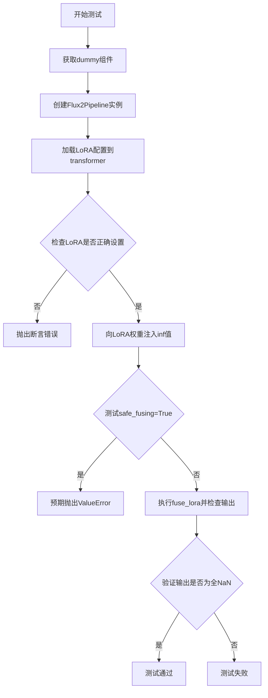
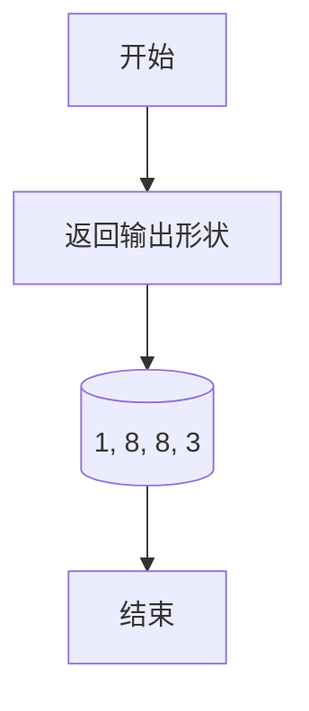
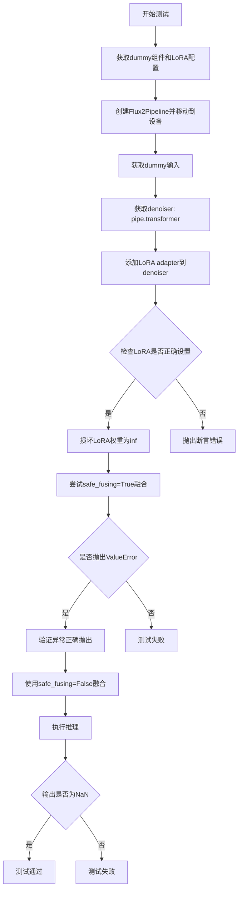
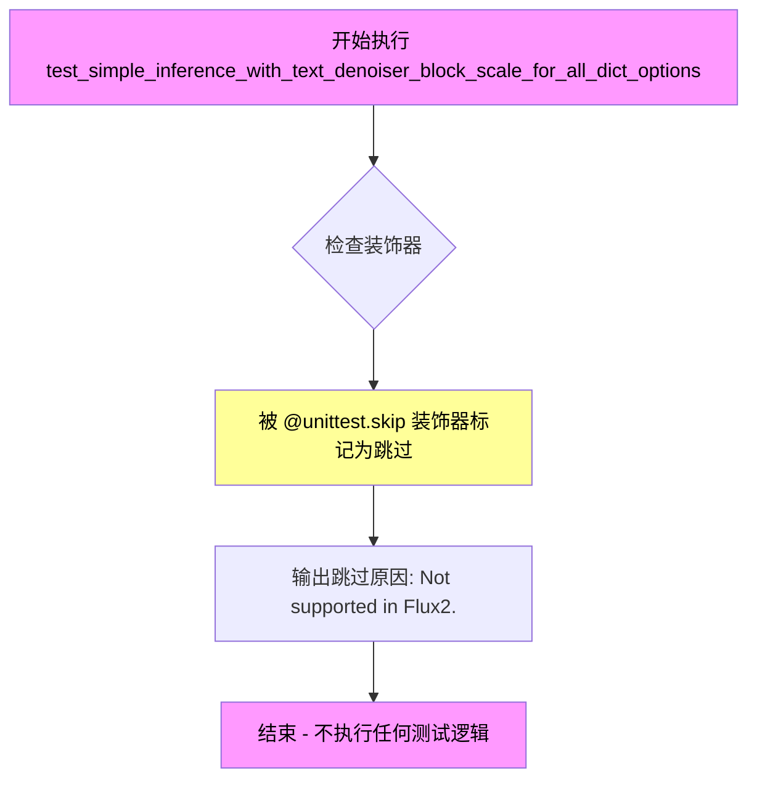
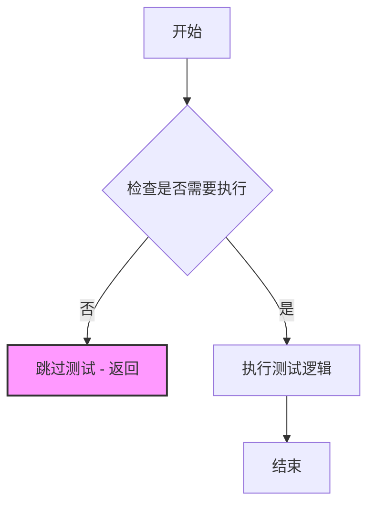

# `diffusers\tests\lora\test_lora_layers_flux2.py` 详细设计文档

这是一个针对Flux2模型的LoRA（低秩适配）功能测试文件，用于验证Flux2Pipeline在加载和融合LoRA权重时的正确性，特别关注NaN值的处理和安全的LoRA融合机制。

## 整体流程



## 类结构

```
Flux2LoRATests (测试类)
└── 继承: unittest.TestCase, PeftLoraLoaderMixinTests
```

## 全局变量及字段


### `Flux2LoRATests.pipeline_class`
    
Flux 2图像生成管道类，用于执行扩散模型的推理

类型：`Type[Flux2Pipeline]`
    


### `Flux2LoRATests.scheduler_cls`
    
Flow Match欧拉离散调度器类，用于控制扩散过程的噪声调度

类型：`Type[FlowMatchEulerDiscreteScheduler]`
    


### `Flux2LoRATests.scheduler_kwargs`
    
调度器的配置参数字典，当前为空字典

类型：`dict`
    


### `Flux2LoRATests.transformer_kwargs`
    
Flux2Transformer2DModel的配置参数，包含patch_size、层数、注意力头维度等

类型：`dict`
    


### `Flux2LoRATests.transformer_cls`
    
Flux 2 Transformer模型类，作为去噪器核心组件

类型：`Type[Flux2Transformer2DModel]`
    


### `Flux2LoRATests.vae_kwargs`
    
AutoencoderKLFlux2的配置参数，包含样本大小、通道数、块类型等

类型：`dict`
    


### `Flux2LoRATests.vae_cls`
    
Flux 2变分自编码器类，用于潜在空间的编码和解码

类型：`Type[AutoencoderKLFlux2]`
    


### `Flux2LoRATests.tokenizer_cls`
    
处理文本输入的tokenizer和processor类

类型：`Type[AutoProcessor]`
    


### `Flux2LoRATests.tokenizer_id`
    
Tokenizer和processor模型在HuggingFace Hub上的标识符

类型：`str`
    


### `Flux2LoRATests.text_encoder_cls`
    
将文本提示编码为嵌入向量的文本编码器类

类型：`Type[Mistral3ForConditionalGeneration]`
    


### `Flux2LoRATests.text_encoder_id`
    
文本编码器模型在HuggingFace Hub上的标识符

类型：`str`
    


### `Flux2LoRATests.denoiser_target_modules`
    
LoRA适配器要应用的目标模块名称列表，用于注意力机制的权重修改

类型：`list[str]`
    


### `Flux2LoRATests.supports_text_encoder_loras`
    
标志位，表示Flux 2模型是否支持文本编码器的LoRA适配

类型：`bool`
    


### `Flux2LoRATests.output_shape`
    
属性方法，返回测试期望的输出张量形状(1, 8, 8, 3)

类型：`tuple`
    


### `Flux2LoRATests.get_dummy_inputs`
    
生成用于测试的虚拟输入数据，包括噪声、输入ID和管道参数

类型：`function`
    


### `Flux2LoRATests.test_lora_fuse_nan`
    
测试LoRA融合时对NaN值的处理，验证safe_fusing参数的有效性

类型：`function`
    


### `Flux2LoRATests.test_simple_inference_with_text_denoiser_block_scale`
    
占位测试方法，Flux 2不支持该功能，已跳过

类型：`function`
    


### `Flux2LoRATests.test_simple_inference_with_text_denoiser_block_scale_for_all_dict_options`
    
占位测试方法，Flux 2不支持该功能，已跳过

类型：`function`
    


### `Flux2LoRATests.test_modify_padding_mode`
    
占位测试方法，Flux 2不支持该功能，已跳过

类型：`function`
    
    

## 全局函数及方法


### `Flux2LoRATests.output_shape`

这是一个测试类中的属性方法，用于返回Flux2 LoRA测试的期望输出形状。

参数：无

返回值：`tuple`，期望输出张量的形状为 (1, 8, 8, 3)，分别代表批量大小、高度、宽度和通道数。

#### 流程图



#### 带注释源码

```python
@property
def output_shape(self):
    """
    返回Flux2 LoRA测试的期望输出形状。
    
    该属性定义了pipeline输出张量的维度，用于在测试中验证输出形状是否正确。
    形状说明：
        - 1: 批量大小 (batch size)
        - 8: 高度 (height)
        - 8: 宽度 (width)
        - 3: 通道数 (channels/RGB)
    """
    return (1, 8, 8, 3)
```


### `Flux2LoRATests.get_dummy_inputs`

该方法用于生成 Flux2 LoRA 测试的虚拟输入数据，包括噪声张量、输入ID以及管道参数字典，用于模拟模型推理流程。

参数：

- `with_generator`：`bool`，是否在管道参数字典中包含随机生成器

返回值：`tuple`，包含三个元素：
1. `noise`：`torch.Tensor`，形状为 (batch_size, num_channels, height, width) 的噪声张量
2. `input_ids`：`torch.Tensor`，文本输入的ID张量
3. `pipeline_inputs`：`dict`，包含推理所需的参数如prompt、步数、引导比例等

#### 流程图

```mermaid
flowchart TD
    A[开始 get_dummy_inputs] --> B[设置默认参数: batch_size=1, sequence_length=10, num_channels=4, sizes=32x32]
    B --> C[创建随机生成器并设置种子为0]
    C --> D[生成噪声张量 floats_tensor]
    D --> E[生成输入ID张量 torch.randint]
    E --> F[构建基础管道参数字典]
    F --> G{with_generator?}
    G -->|True| H[将生成器添加到参数字典]
    G -->|False| I[跳过添加生成器]
    H --> J[返回 (noise, input_ids, pipeline_inputs)]
    I --> J
```

#### 带注释源码

```python
def get_dummy_inputs(self, with_generator=True):
    """
    生成用于 Flux2 LoRA 测试的虚拟输入数据。
    
    参数:
        with_generator (bool): 是否在返回的管道参数字典中包含 PyTorch 随机生成器。
                              默认为 True。
    
    返回:
        tuple: 包含三个元素的元组
            - noise (torch.Tensor): 形状为 (1, 4, 32, 32) 的噪声张量
            - input_ids (torch.Tensor): 形状为 (1, 10) 的文本输入ID张量
            - pipeline_inputs (dict): 包含推理参数的字典
    """
    # 定义批次大小、序列长度、通道数和图像尺寸
    batch_size = 1
    sequence_length = 10
    num_channels = 4
    sizes = (32, 32)

    # 创建随机生成器，设置随机种子以确保可重复性
    generator = torch.manual_seed(0)
    
    # 生成形状为 (batch_size, num_channels, height, width) 的噪声张量
    noise = floats_tensor((batch_size, num_channels) + sizes)
    
    # 生成形状为 (batch_size, sequence_length) 的随机整数张量作为文本输入ID
    # 范围为 [1, sequence_length)
    input_ids = torch.randint(1, sequence_length, size=(batch_size, sequence_length), generator=generator)

    # 构建管道输入参数字典，包含推理所需的各种参数
    pipeline_inputs = {
        "prompt": "a dog is dancing",           # 文本提示
        "num_inference_steps": 2,               # 推理步数
        "guidance_scale": 5.0,                  # 引导比例
        "height": 8,                            # 输出图像高度
        "width": 8,                             # 输出图像宽度
        "max_sequence_length": 8,               # 最大序列长度
        "output_type": "np",                    # 输出类型为 NumPy 数组
        "text_encoder_out_layers": (1,),        # 文本编码器输出层数
    }
    
    # 如果需要包含生成器，则将其添加到参数字典中
    if with_generator:
        pipeline_inputs.update({"generator": generator})

    # 返回噪声、输入ID和管道参数的元组
    return noise, input_ids, pipeline_inputs
```


### `Flux2LoRATests.test_lora_fuse_nan`

该测试方法用于验证 Flux2 LoRA 融合功能在处理损坏（被设置为无穷大）的 LoRA 权重时的行为。当启用安全融合（`safe_funing=True`）时应该抛出 ValueError 异常，而禁用安全融合（`safe_funing=False`）时虽然不会抛出异常，但输出图像应为全黑（NaN），以此确保融合机制能够正确处理异常情况。

参数： 无（仅包含 `self` 参数）

返回值：`None`，该方法为测试用例，不返回任何值

#### 流程图



#### 带注释源码

```python
# 测试方法：test_lora_fuse_nan
# 测试目标：验证Flux2 LoRA融合在处理损坏的LoRA权重时的行为
def test_lora_fuse_nan(self):
    # 步骤1: 获取dummy组件、随机组件和denoiser的LoRA配置
    components, _, denoiser_lora_config = self.get_dummy_components()
    
    # 步骤2: 使用这些组件创建Flux2Pipeline并移动到指定设备
    pipe = self.pipeline_class(**components)
    pipe = pipe.to(torch_device)
    
    # 步骤3: 禁用进度条
    pipe.set_progress_bar_config(disable=None)
    
    # 步骤4: 获取dummy输入（不包含generator）
    _, _, inputs = self.get_dummy_inputs(with_generator=False)
    
    # 步骤5: 获取denoiser（根据unet_kwargs判断是transformer还是unet）
    denoiser = pipe.transformer if self.unet_kwargs is None else pipe.unet
    
    # 步骤6: 向denoiser添加LoRA adapter
    denoiser.add_adapter(denoiser_lora_config, "adapter-1")
    
    # 步骤7: 断言验证LoRA是否正确设置
    self.assertTrue(check_if_lora_correctly_set(denoiser), "Lora not correctly set in denoiser.")

    # 步骤8: 损坏一个LoRA权重为无穷大（inf）
    with torch.no_grad():
        # 定义可能的transformer tower名称列表
        possible_tower_names = ["transformer_blocks", "single_transformer_blocks"]
        
        # 过滤出pipe.transformer实际拥有的tower属性
        filtered_tower_names = [
            tower_name for tower_name in possible_tower_names if hasattr(pipe.transformer, tower_name)
        ]
        
        # 如果没有找到任何tower，抛出错误
        if len(filtered_tower_names) == 0:
            reason = f"`pipe.transformer` didn't have any of the following attributes: {possible_tower_names}."
            raise ValueError(reason)
        
        # 遍历每个tower名称
        for tower_name in filtered_tower_names:
            # 获取transformer tower
            transformer_tower = getattr(pipe.transformer, tower_name)
            
            # 判断是否为single类型的tower
            is_single = "single" in tower_name
            
            # 根据tower类型损坏不同的LoRA权重：
            # - single类型: 损坏to_qkv_mlp_proj的lora_A权重
            # - 非single类型: 损坏to_k的lora_A权重
            if is_single:
                transformer_tower[0].attn.to_qkv_mlp_proj.lora_A["adapter-1"].weight += float("inf")
            else:
                transformer_tower[0].attn.to_k.lora_A["adapter-1"].weight += float("inf")

    # 步骤9: 验证使用safe_fusing=True时应该抛出ValueError异常
    with self.assertRaises(ValueError):
        pipe.fuse_lora(components=self.pipeline_class._lora_loadable_modules, safe_fusing=True)

    # 步骤10: 使用safe_fusing=False进行融合（不会抛出异常）
    pipe.fuse_lora(components=self.pipeline_class._lora_loadable_modules, safe_fusing=False)
    
    # 步骤11: 执行推理获取输出
    out = pipe(**inputs)[0]

    # 步骤12: 断言验证输出全为NaN（图像全黑）
    self.assertTrue(np.isnan(out).all())
```


### `Flux2LoRATests.test_simple_inference_with_text_denoiser_block_scale`

该方法是一个被跳过的测试用例，用于验证Flux2模型中文本去噪器块缩放功能的简单推理，由于Flux2不支持该功能，因此方法体为空且被@unittest.skip装饰器跳过。

参数：

- `self`：`Flux2LoRATests`，隐式参数，表示测试类实例本身

返回值：`None`，由于方法体为`pass`，无实际返回值

#### 流程图

```mermaid
flowchart TD
    A[开始测试方法] --> B{检查@unittest.skip装饰器}
    B -->|跳过原因: Not supported in Flux2.| C[跳过测试]
    C --> D[结束测试]
    
    style A fill:#f9f,stroke:#333
    style C fill:#ff6b6b,stroke:#333
    style D fill:#f9f,stroke:#333
```

#### 带注释源码

```python
@unittest.skip("Not supported in Flux2.")
def test_simple_inference_with_text_denoiser_block_scale(self):
    """
    测试方法：test_simple_inference_with_text_denoiser_block_scale
    
    功能描述：
        该测试方法旨在验证Flux2模型中文本去噪器块缩放功能的简单推理能力。
        由于Flux2架构不支持此功能，该测试被跳过。
    
    跳过原因：
        "Not supported in Flux2."
    
    参数：
        - self: Flux2LoRATests，测试类实例，隐式参数
    
    返回值：
        - None，方法体为空（pass），无实际执行逻辑
    
    备注：
        - 该方法是被 unittest.skip 装饰器永久跳过的测试用例
        - 类似的被跳过方法还包括：
          * test_simple_inference_with_text_denoiser_block_scale_for_all_dict_options
          * test_modify_padding_mode
    """
    pass  # 空方法体，由于功能不支持而跳过
```


### `Flux2LoRATests.test_simple_inference_with_text_denoiser_block_scale_for_all_dict_options`

该测试方法用于验证 Flux2 模型在文本去噪器块缩放场景下的推理能力，检查所有字典选项的配置是否正确，但由于 Flux2 架构不支持该功能，当前被跳过。

参数：

- `self`：`Flux2LoRATests`，测试类实例本身，包含测试所需的组件和配置信息

返回值：`None`，该方法被 `@unittest.skip` 装饰器跳过，不执行任何测试逻辑，因此无返回值

#### 流程图



#### 带注释源码

```python
@unittest.skip("Not supported in Flux2.")  # 跳过该测试，原因是 Flux2 架构不支持此功能
def test_simple_inference_with_text_denoiser_block_scale_for_all_dict_options(self):
    """
    测试文本去噪器块缩放功能的推理过程，验证所有字典选项的配置。
    
    该测试方法原本计划用于验证 Flux2 模型在文本去噪器块缩放场景下的推理能力，
    检查不同块缩放参数对生成结果的影响。由于 Flux2 架构的特殊性（QKV 投影融合、
    文本编码器 LoRA 不支持等），该测试功能目前无法在 Flux2 中实现，因此被跳过。
    
    Args:
        self: Flux2LoRATests 测试类实例，包含以下关键属性：
            - pipeline_class: Flux2Pipeline，Flux2 推理管道类
            - transformer_cls: Flux2Transformer2DModel，Transformer 模型类
            - vae_cls: AutoencoderKLFlux2，VAE 模型类
            - denoiser_target_modules: ["to_qkv_mlp_proj", "to_k"]，去噪器目标模块列表
    
    Returns:
        None: 由于测试被跳过，不返回任何值
    
    Note:
        该测试对应的非跳过版本 test_simple_inference_with_text_denoiser_block_scale 
        也被同时跳过，表明整个文本去噪器块缩放功能族在 Flux2 中暂不支持。
    """
    pass  # 空函数体，仅作为占位符，实际不执行任何逻辑
```


### `Flux2LoRATests.test_modify_padding_mode`

该方法用于测试在 Flux2 模型中修改填充模式（padding mode）的功能，但由于 Flux2 不支持此特性，该测试被跳过。

参数：

- 无

返回值：
- 无（方法体为 `pass`）

#### 流程图



#### 带注释源码

```python
@unittest.skip("Not supported in Flux2.")  # 跳过装饰器，标记该测试在 Flux2 中不支持
def test_modify_padding_mode(self):
    """
    测试修改填充模式的功能。
    
    该测试方法用于验证能否在 Flux2 模型的文本编码器或去噪器中
    修改 padding_mode 参数。然而，Flux2 架构本身不支持此特性，
    因此该测试被永久跳过。
    
    参数:
        self: Flux2LoRATests 实例引用
    
    返回值:
        None
    
    注意:
        - 这是一个空实现，仅包含 pass 语句
        - 使用 @unittest.skip 装饰器确保该测试不会被执行
        - 类似的测试方法还包括:
          * test_simple_inference_with_text_denoiser_block_scale
          * test_simple_inference_with_text_denoiser_block_scale_for_all_dict_options
    """
    pass  # 空方法体，该功能不被支持
```

#### 附加信息

- **类信息**：该方法属于 `Flux2LoRATests` 类，继承自 `unittest.TestCase` 和 `PeftLoraLoaderMixinTests`
- **跳过原因**：Flux2 架构不支持填充模式修改功能
- **设计决策**：通过 `@unittest.skip` 装饰器显式标记不支持的测试，避免测试失败
- **技术债务**：如果未来 Flux2 支持该功能，需要实现具体的测试逻辑来验证填充模式的修改是否正确工作

## 关键组件


### Flux2Pipeline

Flux2模型的生成管道，用于通过扩散模型生成图像

### FlowMatchEulerDiscreteScheduler

Flow Match欧拉离散调度器，用于 diffusion 过程的噪声调度

### Flux2Transformer2DModel

Flux2的Transformer 2D模型，作为去噪网络核心组件

### AutoencoderKLFlux2

Flux2的VAE模型，用于潜在空间的编码和解码

### AutoProcessor

文本处理器，用于处理文本输入

### Mistral3ForConditionalGeneration

条件生成的Mistral3模型，作为文本编码器

### Flux2LoRATests

Flux2 LoRA功能的集成测试类，验证LoRA适配器的加载、融合和功能正确性

### denoiser_target_modules

去噪器中LoRA应用的目标模块列表，包含"to_qkv_mlp_proj"和"to_k"

### supports_text_encoder_loras

标志位，指示Flux2是否支持文本编码器的LoRA（当前设置为False）

### test_lora_fuse_nan

测试方法，验证LoRA权重包含inf值时的融合行为，包括安全融合和非安全融合的场景

### get_dummy_inputs

生成虚拟输入的方法，用于测试，包括噪声张量、输入ID和管道参数字典

### transformer_kwargs

Transformer模型的初始化参数字典，包含patch_size、in_channels、num_layers等配置

### vae_kwargs

VAE模型的初始化参数字典，包含sample_size、in_channels、out_channels等配置，以及use_quant_conv和use_post_quant_conv标志

### to_qkv_mlp_proj

Flux2单块中的QKV投影层，融合了q、k、v和MLP投影，用于LoRA适配

### to_k

标准Transformer块中的key投影层，用于LoRA适配

### check_if_lora_correctly_set

工具函数，用于检查LoRA是否正确设置在模型中

### PeftLoraLoaderMixinTests

PEFT LoRA加载器的混入测试类，提供LoRA相关测试的基础方法


## 问题及建议


### 已知问题

-   `unet_kwargs` 在 `test_lora_fuse_nan` 方法中被引用但未在该类中定义，可能导致 NameError 或逻辑错误
-   `scheduler_kwargs` 定义为空字典但在整个类中未被使用，属于冗余代码
-   `supports_text_encoder_loras = False` 属性定义后未在代码中实际使用，缺乏实际作用
-   多个测试方法（`test_simple_inference_with_text_denoiser_block_scale`、`test_simple_inference_with_text_denoiser_block_scale_for_all_dict_options`、`test_modify_padding_mode`）被无条件跳过，缺乏实现计划和时间表
-   `tokenizer_cls` 和 `tokenizer_id` 命名风格不一致（一个用cls后缀一个用id后缀），`text_encoder_cls` 和 `text_encoder_id` 同样存在此问题
-   `get_dummy_inputs` 方法返回三个值 `(noise, input_ids, pipeline_inputs)`，但调用处可能只使用部分返回值，造成不必要的计算
-   `vae_cls` 变量定义后未被使用
-   硬编码的字符串 `"adapter-1"` 在 `test_lora_fuse_nan` 中出现多次，应提取为常量
-   条件判断 `if self.unet_kwargs is None` 使用了可能未定义的属性 `self.unet_kwargs`

### 优化建议

-   移除未使用的 `scheduler_kwargs`、`vae_cls`、`supports_text_encoder_loras` 等变量，或实现其真正用途
-   为被跳过的测试添加具体的实现计划或移除这些空测试方法，提高代码可维护性
-   统一变量命名规范，例如将 `tokenizer_id` 改为 `tokenizer_cls` 风格的命名
-   提取 `"adapter-1"` 为类常量或配置属性，避免硬编码
-   修复 `unet_kwargs` 的引用问题，明确其预期用途或移除相关逻辑
-   优化 `get_dummy_inputs` 方法，支持按需生成参数而非总是生成全部返回值

## 其它


### 设计目标与约束

本测试用例旨在验证Flux2Pipeline的LoRA适配器功能，主要设计目标包括：(1) 验证LoRA权重能正确加载到Flux2Transformer2DModel中；(2) 测试在融合LoRA时对NaN/Inf值的检测能力；(3) 确保Flux2特有的单块QKV融合投影能正确处理LoRA适配。设计约束包括：不支持text encoder LoRA（Flux2架构限制）；由于Flux2单块QKV投影总是融合的，因此不存在独立的to_q参数。

### 错误处理与异常设计

代码中的错误处理主要体现在test_lora_fuse_nan方法中：(1) 使用hasattr检查transformer属性是否存在，若transformer_blocks和single_transformer_blocks都不存在则抛出ValueError；(2) 使用assertTrue验证LoRA是否正确设置；(3) 使用assertRaises捕获safe_fusing=True时的ValueError；(4) 对NaN值的检测使用np.isnan(out).all()进行验证。异常设计遵循HuggingFace测试框架规范，使用unittest的断言方法进行错误验证。

### 数据流与状态机

数据流主要经过三个阶段：(1) 初始化阶段：通过get_dummy_components获取组件配置，通过get_dummy_inputs生成测试输入（包括noise、input_ids和pipeline参数）；(2) LoRA加载阶段：使用add_adapter方法将LoRA配置添加到denoiser；(3) 推理阶段：调用pipeline进行前向传播，生成图像输出。状态转换路径为：组件初始化 → LoRA适配器加载 → 参数融合（可选）→ 推理执行。

### 外部依赖与接口契约

主要外部依赖包括：(1) transformers库：提供Mistral3ForConditionalGeneration和AutoProcessor；(2) diffusers库：提供Flux2Pipeline、Flux2Transformer2DModel、AutoencoderKLFlux2和FlowMatchEulerDiscreteScheduler；(3) 本地测试工具：utils模块中的PeftLoraLoaderMixinTests和check_if_lora_correctly_set函数。接口契约方面，pipeline_class必须实现_lora_loadable_modules类属性，transformer必须支持add_adapter方法和特定的模块结构（transformer_blocks/single_transformer_blocks）。

### 测试策略

测试策略采用单元测试框架，针对LoRA功能的多个维度进行验证：(1) 使用dummy inputs保证测试的可重复性；(2) 通过override方式跳过不支持的测试用例（text encoder LoRA相关）；(3) 使用torch_device和floats_tensor确保设备兼容性；(4) 通过seed固定随机性。测试覆盖范围包括LoRA加载、参数融合、异常检测等核心功能。

### 性能考虑与基准

性能相关配置通过transformer_kwargs和vae_kwargs体现：(1) 使用最小的模型配置（num_layers=1, num_single_layers=1, attention_head_dim=16, num_attention_heads=2）；(2) VAE使用极小的block_out_channels(4)和sample_size(32)；(3) 推理步数设置为2（num_inference_steps=2）。这些配置旨在快速执行测试，同时保持功能的完整性验证。

### 版本兼容性与依赖管理

代码明确依赖Python环境中的以下版本兼容性要求：(1) PyTorch作为基础深度学习框架；(2) NumPy用于数值计算；(3) transformers和diffusers库需支持Flux2架构；(4) PEFT后端支持（通过@require_peft_backend装饰器）。测试使用hf-internal-testing/tiny-mistral3-diffusers作为轻量级模型，确保在资源受限环境下也能运行。

### 配置管理与参数化

配置管理采用类属性和kwargs字典的方式：(1) pipeline_class、scheduler_cls、transformer_cls、vae_cls等定义核心组件类型；(2) *_kwargs字典（transformer_kwargs、vae_kwargs、scheduler_kwargs）定义组件初始化参数；(3) tokenizer_cls/text_encoder_cls配合对应的model_id；(4) denoiser_target_modules指定可接受LoRA适配的模块名称。这种配置方式便于扩展和定制不同的测试场景。

    