# `diffusers\tests\lora\test_lora_layers_hunyuanvideo.py` 详细设计文档

这是一个HunyuanVideo模型的LoRA（低秩自适应）功能测试文件，包含单元测试和集成测试，用于验证HunyuanVideoPipeline在加载、融合、卸载LoRA权重以及执行视频生成推理过程中的正确性。

## 整体流程

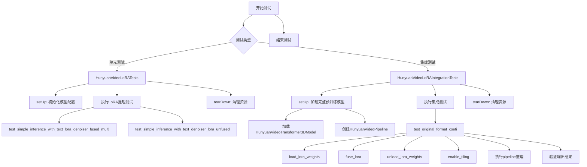

## 类结构

```
unittest.TestCase
├── HunyuanVideoLoRATests
│   └── 继承 PeftLoraLoaderMixinTests
└── HunyuanVideoLoRAIntegrationTests
```

## 全局变量及字段


### `batch_size`
    
Number of samples in a batch for testing

类型：`int`
    


### `sequence_length`
    
Length of the input sequence for text tokenization

类型：`int`
    


### `num_channels`
    
Number of latent channels for the video generation model

类型：`int`
    


### `num_frames`
    
Total number of frames to generate in the video

类型：`int`
    


### `num_latent_frames`
    
Number of latent frames after temporal compression

类型：`int`
    


### `sizes`
    
Spatial dimensions (height, width) for the output video

类型：`tuple[int, int]`
    


### `generator`
    
PyTorch random generator for reproducible results

类型：`torch.Generator`
    


### `noise`
    
Initial noise tensor for the diffusion denoising process

类型：`torch.Tensor`
    


### `input_ids`
    
Tokenized input text IDs for the text encoder

类型：`torch.Tensor`
    


### `pipeline_inputs`
    
Dictionary containing all pipeline inference parameters

类型：`dict`
    


### `prompt`
    
Text prompt for video generation

类型：`str`
    


### `out`
    
Output video frames flattened for comparison

类型：`numpy.ndarray`
    


### `out_slice`
    
Concatenated slice of output for similarity checking

类型：`numpy.ndarray`
    


### `expected_slice`
    
Expected output slice for validation

类型：`numpy.ndarray`
    


### `max_diff`
    
Maximum cosine similarity distance between expected and actual output

类型：`float`
    


### `model_id`
    
HuggingFace model identifier for loading the HunyuanVideo pipeline

类型：`str`
    


### `num_inference_steps`
    
Number of denoising steps for video generation

类型：`int`
    


### `seed`
    
Random seed for reproducible generation results

类型：`int`
    


### `HunyuanVideoLoRATests.pipeline_class`
    
The pipeline class to be tested for LoRA functionality

类型：`Type[HunyuanVideoPipeline]`
    


### `HunyuanVideoLoRATests.scheduler_cls`
    
Scheduler class used for the diffusion denoising process

类型：`Type[FlowMatchEulerDiscreteScheduler]`
    


### `HunyuanVideoLoRATests.scheduler_kwargs`
    
Keyword arguments for scheduler initialization

类型：`dict`
    


### `HunyuanVideoLoRATests.transformer_kwargs`
    
Configuration parameters for the HunyuanVideoTransformer3DModel

类型：`dict`
    


### `HunyuanVideoLoRATests.transformer_cls`
    
The transformer model class for video generation

类型：`Type[HunyuanVideoTransformer3DModel]`
    


### `HunyuanVideoLoRATests.vae_kwargs`
    
Configuration parameters for the AutoencoderKLHunyuanVideo

类型：`dict`
    


### `HunyuanVideoLoRATests.vae_cls`
    
The VAE model class for latent video encoding and decoding

类型：`Type[AutoencoderKLHunyuanVideo]`
    


### `HunyuanVideoLoRATests.has_two_text_encoders`
    
Flag indicating whether the pipeline uses two text encoders (Llama and CLIP)

类型：`bool`
    


### `HunyuanVideoLoRATests.tokenizer_cls`
    
The first tokenizer class for text encoding (Llama)

类型：`Type[LlamaTokenizerFast]`
    


### `HunyuanVideoLoRATests.tokenizer_id`
    
HuggingFace model ID for the first tokenizer

类型：`str`
    


### `HunyuanVideoLoRATests.tokenizer_subfolder`
    
Subfolder path for the first tokenizer in the model repository

类型：`str`
    


### `HunyuanVideoLoRATests.tokenizer_2_cls`
    
The second tokenizer class for text encoding (CLIP)

类型：`Type[CLIPTokenizer]`
    


### `HunyuanVideoLoRATests.tokenizer_2_id`
    
HuggingFace model ID for the second tokenizer

类型：`str`
    


### `HunyuanVideoLoRATests.tokenizer_2_subfolder`
    
Subfolder path for the second tokenizer in the model repository

类型：`str`
    


### `HunyuanVideoLoRATests.text_encoder_cls`
    
The first text encoder model class (Llama)

类型：`Type[LlamaModel]`
    


### `HunyuanVideoLoRATests.text_encoder_id`
    
HuggingFace model ID for the first text encoder

类型：`str`
    


### `HunyuanVideoLoRATests.text_encoder_subfolder`
    
Subfolder path for the first text encoder in the model repository

类型：`str`
    


### `HunyuanVideoLoRATests.text_encoder_2_cls`
    
The second text encoder model class (CLIP)

类型：`Type[CLIPTextModel]`
    


### `HunyuanVideoLoRATests.text_encoder_2_id`
    
HuggingFace model ID for the second text encoder

类型：`str`
    


### `HunyuanVideoLoRATests.text_encoder_2_subfolder`
    
Subfolder path for the second text encoder in the model repository

类型：`str`
    


### `HunyuanVideoLoRATests.supports_text_encoder_loras`
    
Flag indicating whether text encoder LoRAs are supported (not supported for HunyuanVideo)

类型：`bool`
    


### `HunyuanVideoLoRAIntegrationTests.num_inference_steps`
    
Number of denoising steps for the integration test video generation

类型：`int`
    


### `HunyuanVideoLoRAIntegrationTests.seed`
    
Random seed for reproducible integration test results

类型：`int`
    


### `HunyuanVideoLoRAIntegrationTests.pipeline`
    
The HunyuanVideo pipeline instance loaded with pretrained models for integration testing

类型：`HunyuanVideoPipeline`
    
    

## 全局函数及方法


# `from_pretrained` 方法提取分析

根据提供的代码，`from_pretrained` 是一个被调用的类方法，存在于 `HunyuanVideoTransformer3DModel` 和 `HunyuanVideoPipeline` 类中（继承自 Hugging Face 的 `PreTrainedModel` 基类）。以下是代码中实际调用的两个 `from_pretrained` 方法的详细信息：

---

### `HunyuanVideoTransformer3DModel.from_pretrained`

这是 `HunyuanVideoTransformer3DModel` 类调用 `from_pretrained` 方法加载预训练模型。

参数：

-  `pretrained_model_name_or_path`：`str`，模型标识符或本地路径，此处为 `"hunyuanvideo-community/HunyuanVideo"`
-  `subfolder`：`str`，可选，子文件夹路径，此处为 `"transformer"`
-  `torch_dtype`：`torch.dtype`，可选，模型权重的数据类型，此处为 `torch.bfloat16`

返回值：`HunyuanVideoTransformer3DModel`，加载后的Transformer模型实例

#### 流程图

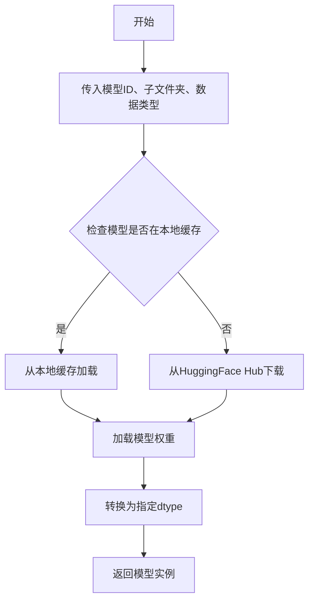

#### 带注释源码

```python
transformer = HunyuanVideoTransformer3DModel.from_pretrained(
    model_id,           # "hunyuanvideo-community/HunyuanVideo" - HuggingFace模型ID
    subfolder="transformer",  # 指定从模型目录的transformer子文件夹加载
    torch_dtype=torch.bfloat16  # 使用bfloat16精度加载权重
)
```

---

### `HunyuanVideoPipeline.from_pretrained`

这是 `HunyuanVideoPipeline` 类调用 `from_pretrained` 方法加载完整的视频生成管道。

参数：

-  `pretrained_model_name_or_path`：`str`，模型标识符或本地路径，此处为 `"hunyuanvideo-community/HunyuanVideo"`
-  `transformer`：`PreTrainedModel`，可选，预加载的Transformer模型，此处为前面加载的 `transformer` 实例
-  `torch_dtype`：`torch.dtype`，可选，模型权重的数据类型，此处为 `torch.float16`

返回值：`HunyuanVideoPipeline`，加载后的完整视频生成管道实例

#### 流程图

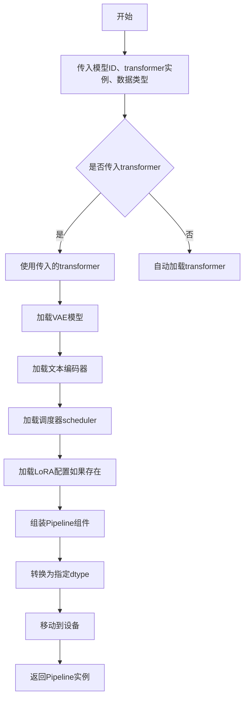

#### 带注释源码

```python
self.pipeline = HunyuanVideoPipeline.from_pretrained(
    model_id,                           # "hunyuanvideo-community/HunyuanVideo" - 主模型ID
    transformer=transformer,            # 传入已加载的Transformer模型，避免重复加载
    torch_dtype=torch.float16           # 使用float16精度加载管道组件
).to(torch_device)                      # 将管道移动到计算设备
```

---

### 补充说明

| 项目 | 说明 |
|------|------|
| **方法来源** | `from_pretrained` 是 Hugging Face `diffusers` 库中 `DiffusionPipeline` 和 `ModelMixin` 类的类方法，代码中未实现此方法，仅调用 |
| **设计目标** | 统一接口加载预训练模型、管道组件、配置和权重 |
| **错误处理** | 常见异常包括模型不存在、网络连接失败、磁盘空间不足等 |
| **优化空间** | 可通过传入已加载的 `transformer` 参数避免重复下载和加载，提高测试效率 |


### `HunyuanVideoPipeline.load_lora_weights`

该方法是 `HunyuanVideoPipeline` 类的成员方法，用于将预训练的 LoRA（Low-Rank Adaptation）权重加载到管道中的模型（通常是 Transformer 模型）中，以实现对生成模型的轻量级微调。

参数：

-  `pretrained_model_name_or_path`：`str`，LoRA 权重所在的 HuggingFace Hub 模型 ID 或本地目录路径
-  `weight_name`：`str`（可选），LoRA 权重文件的名称（如 `.safetensors` 文件）
-  `adapter_name`：`str`（可选），要加载的适配器名称，默认为 `None`
-  `torch_dtype`：`torch.dtype`（可选），指定权重加载的数据类型，默认为 `None`
-  `device`：`str`（可选），目标设备，默认为 `None`
-  `use_safetensors`：`bool`（可选），是否使用 safetensors 格式加载，默认为 `None`

返回值：`None`，该方法直接修改管道对象的状态，将 LoRA 权重应用到相关模型上

#### 流程图

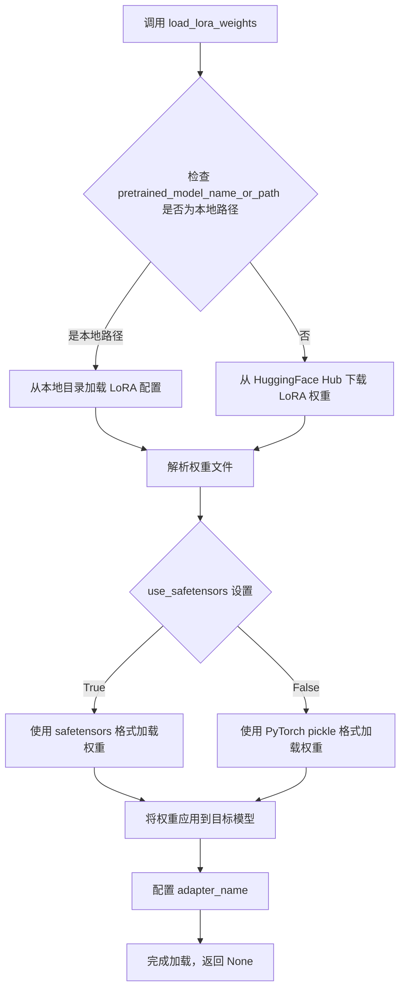

#### 带注释源码

```python
# 从测试代码中提取的调用示例
self.pipeline.load_lora_weights(
    "Cseti/HunyuanVideo-LoRA-Arcane_Jinx-v1",  # pretrained_model_name_or_path: str, HuggingFace Hub 模型ID
    weight_name="csetiarcane-nfjinx-v1-6000.safetensors"  # weight_name: str, LoRA 权重文件名
)
```

> **注意**：由于 `load_lora_weights` 方法定义在 `diffusers` 库内部，上述参数和流程是基于 diffusers 库的通用 LoRA 加载机制和代码上下文推断得出的。该方法属于 `diffusers.pipelines.hunyuan_video.pipeline_hunyuan_video.HunyuanVideoPipeline` 类，具体实现细节请参考 diffusers 官方源码。


### `HunyyuanVideoPipeline.fuse_lora`

该方法用于将已加载的 LoRA（Low-Rank Adaptation）权重融合到模型的核心权重中，从而在推理时无需保留额外的 LoRA 权重，实现模型的高效推理。

参数：
- 此方法无显式参数，调用时使用 `self.pipeline.fuse_lora()`

返回值：无返回值（`None`），直接修改 pipeline 内部模型状态

#### 流程图

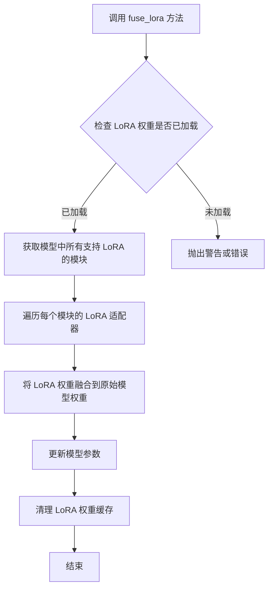

#### 带注释源码

```python
# fuse_lora 方法定义在 diffusers 库的 pipeline 基类中
# HunyuanVideoPipeline 集成自该基类
# 以下为调用示例（在测试文件中）:

# 1. 从外部源加载 LoRA 权重
self.pipeline.load_lora_weights(
    "Cseti/HunyuanVideo-LoRA-Arcane_Jinx-v1", 
    weight_name="csetiarcane-nfjinx-v1-6000.safetensors"
)

# 2. 融合 LoRA 权重到主模型
# 此操作将 LoRA 的低秩矩阵与原始权重相乘后合并
# 融合后模型可直接用于推理，无需额外计算 LoRA 路径
self.pipeline.fuse_lora()

# 3. 卸载 LoRA 权重（融合后可选操作，释放内存）
self.pipeline.unload_lora_weights()
```


### `unload_lora_weights`

该函数用于从模型管道中卸载LoRA权重，将模型权重恢复到原始状态（即移除LoRA适配器的权重影响）。

**注意：** 在提供的代码文件中，未找到 `unload_lora_weights` 方法的明确定义。该方法在第 206 行被调用 (`self.pipeline.unload_lora_weights()`)，表明它是一个在 `HunyuanVideoPipeline` 类（或其父类/Mixin）中定义的方法。由于代码片段中没有包含该方法的实现源码，因此无法提供其详细代码和流程图。

参数：无法从给定代码中提取

返回值：无法从给定代码中提取

#### 流程图

```mermaid
flowchart TD
    A[开始] --> B{在给定代码中未找到函数定义}
    B --> C[该方法可能在HunyuanVideoPipeline类或其父类中定义]
    C --> D[在测试代码中被调用: self.pipeline.unload_lora_weights()]
    D --> E[结束]
```

#### 带注释源码

```
# 在提供的代码片段中未找到 unload_lora_weights 方法的源码定义
# 该方法在 HunyuanVideoPipeline 类中实现
# 以下是调用该方法的测试代码片段:

self.pipeline.load_lora_weights(
    "Cseti/HunyuanVideo-LoRA-Arcane_Jinx-v1", weight_name="csetiarcane-nfjinx-v1-6000.safetensors"
)
self.pipeline.fuse_lora()
self.pipeline.unload_lora_weights()  # <-- 这里调用了 unload_lora_weights
self.pipeline.vae.enable_tiling()
```

---

**补充说明：**

由于 `unload_lora_weights` 方法未在给定代码文件中定义，建议查阅以下位置获取完整实现：

1. `HunyuanVideoPipeline` 类的定义
2. 继承的父类（如 `DiffusionPipeline`）
3. 相关的 Mixin 类（如 `PeftLoraLoaderMixin`）

该方法通常用于将加载的 LoRA 权重从模型中卸载，使模型恢复到加载 LoRA 权重之前的状态。


### `AutoencoderKL.enable_tiling`

该方法用于启用 VAE（变分自编码器）的平铺（Tiling）模式。平铺模式将高分辨率图像分割成重叠的瓦片分别处理，然后再拼接在一起，从而可以在有限的 GPU 内存下处理高分辨率图像。

参数：

- `tile_sample_min_height`：`Optional[int]`，可选参数，平铺瓦片的最小高度。如果为 None，则使用默认值
- `tile_sample_min_width`：`Optional[int]`，可选参数，平铺瓦片的最小宽度。如果为 None，则使用默认值

返回值：`None`，无返回值

#### 流程图

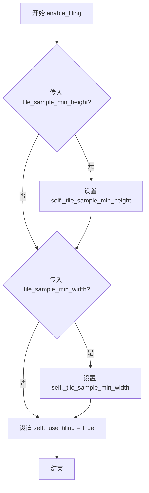

#### 带注释源码

```python
def enable_tiling(self, tile_sample_min_height: Optional[int] = None, tile_sample_min_width: Optional[int] = None) -> None:
    """
    启用平铺模式以渲染高分辨率图像。
    
    平铺技术通过将输入图像分割成重叠的瓦片，分别处理每个瓦片，
    然后再将结果拼接在一起。这种方法允许处理更高分辨率的图像，
    同时避免内存不足的问题。
    
    参数:
        tile_sample_min_height: 每个平铺瓦片的最小高度。如果为 None，则使用默认值。
        tile_sample_min_width: 每个平铺瓦片的最小宽度。如果为 None，则使用默认值。
    """
    # 启用平铺标志
    self._use_tiling = True
    
    # 如果提供了自定义的最小高度，则更新配置
    if tile_sample_min_height is not None:
        self._tile_sample_min_height = tile_sample_min_height
    
    # 如果提供了自定义的最小宽度，则更新配置
    if tile_sample_min_width is not None:
        self._tile_sample_min_width = tile_sample_min_width
```


# 分析结果

## 注意事项

在提供的代码文件中，**未找到 `__call__` 方法的定义**。这是一个测试文件（`HunyuanVideoLoRAIntegrationTests` 和 `HunyuanVideoLoRATests`），其中使用了 `self.pipeline(...)` 的调用方式。

`self.pipeline` 是 `HunyuanVideoPipeline` 类的实例，其 `__call__` 方法定义在 `diffusers` 库的 `HunyuanVideoPipeline` 基类中，而不是在这个测试文件中。

### 相关的调用示例

在代码中可以找到 `pipeline` 的调用方式：

```python
out = self.pipeline(
    prompt=prompt,
    height=320,
    width=512,
    num_frames=9,
    num_inference_steps=self.num_inference_steps,
    output_type="np",
    generator=torch.manual_seed(self.seed),
).frames[0]
```

### HunyuanVideoPipeline.__call__

由于 `__call__` 方法定义在 `diffusers` 库的 `HunyuanVideoPipeline` 类中（不在当前代码文件里），以下是基于代码调用推断的信息：

参数：

- `prompt`：`str`，文本提示
- `height`：`int`，生成图像的高度
- `width`：`int`，生成图像的宽度
- `num_frames`：`int`，生成的帧数
- `num_inference_steps`：`int`，推理步数
- `output_type`：`str`，输出类型（如 "np"）
- `generator`：`torch.Generator`，随机数生成器

返回值：`PipelineOutput`，包含生成结果的对象，通过 `.frames[0]` 访问视频帧

#### 流程图

```mermaid
flowchart TD
    A[调用 pipeline] --> B[加载 LoRA 权重]
    B --> C[文本编码]
    C --> D[潜在空间噪声采样]
    D --> E[去噪循环]
    E --> F[VAE 解码]
    F --> G[返回 PipelineOutput]
    G --> H[通过 .frames[0] 获取视频帧]
```

#### 带注释源码

```python
# 测试文件中的调用示例
out = self.pipeline(
    prompt=prompt,                  # 文本提示
    height=320,                    # 输出高度
    width=512,                     # 输出宽度
    num_frames=9,                  # 视频帧数
    num_inference_steps=self.num_inference_steps,  # 推理步数
    output_type="np",              # 输出为 numpy 数组
    generator=torch.manual_seed(self.seed),  # 随机种子
).frames[0]                        # 获取第一帧
```

---

**总结**：当前提供的代码文件中不包含 `__call__` 方法的定义。该方法位于 `diffusers` 库的 `HunyuanVideoPipeline` 类中。如果您需要该方法的完整源码，请提供 `diffusers` 库中的 `HunyuanVideoPipeline` 类文件。


让我分析这个代码文件，查找 `floats_tensor` 函数。

从代码中可以看到，`floats_tensor` 是从 `..testing_utils` 模块导入的，但在当前代码文件中没有定义。让我在代码中使用它的地方查找线索：

```python
from ..testing_utils import (
    Expectations,
    backend_empty_cache,
    floats_tensor,
    nightly,
    numpy_cosine_similarity_distance,
    require_big_accelerator,
    require_peft_backend,
    require_torch_accelerator,
    skip_mps,
    torch_device,
)
```

以及它的使用：

```python
noise = floats_tensor((batch_size, num_latent_frames, num_channels) + sizes)
```

由于 `floats_tensor` 是从外部模块导入的，而该模块的代码没有在当前文件中提供，我需要说明这个情况。


### `floats_tensor`

该函数用于生成指定形状的随机浮点张量，通常用于深度学习测试中生成噪声输入。

参数：

-  `shape`：`Tuple[int, ...]`，张量的形状元组，指定每个维度的大小

返回值：`torch.Tensor`，返回指定形状的 PyTorch 浮点类型张量（默认使用 float32）

#### 流程图

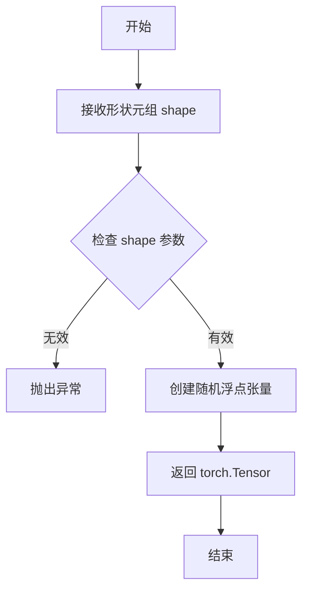

#### 带注释源码

```python
# floats_tensor 函数的源码需要在 testing_utils 模块中查看
# 当前代码文件中只是导入了该函数
# 根据使用方式推断的函数签名和功能：

def floats_tensor(shape: Tuple[int, ...]) -> torch.Tensor:
    """
    生成指定形状的随机浮点张量。
    
    参数:
        shape: 张量的形状元组，如 (batch_size, channels, height, width)
        
    返回:
        随机浮点类型的 PyTorch 张量
    """
    # 实际实现在 testing_utils 模块中
    # 使用 torch.randn 或类似方法生成随机数
    pass
```

#### 备注

`floats_tensor` 函数的具体定义位于 `..testing_utils` 模块中（即 `testing_utils.py` 文件），该模块在当前提供的代码中未被展示。根据函数的使用方式 `floats_tensor((batch_size, num_latent_frames, num_channels) + sizes)`，可以推断：

1. **参数**：`shape` - 一个元组，描述输出张量的维度
2. **返回值**：PyTorch 张量（`torch.Tensor`）
3. **用途**：在测试中生成随机噪声数据，用于扩散模型等深度学习模型的测试输入

如需查看完整源码，建议检查项目中的 `testing_utils.py` 或 `testing_utils` 模块文件。


根据代码分析，`numpy_cosine_similarity_distance` 函数是从 `..testing_utils` 模块导入的，但该函数本身的定义并未出现在提供的代码片段中。我需要根据其导入位置和使用方式来推断其功能。

### `numpy_cosine_similarity_distance`

该函数用于计算两个numpy数组之间的余弦相似度距离（1 - 余弦相似度），通常用于比较预期输出和实际输出之间的差异，常作为深度学习模型测试中的相似度度量指标。

参数：

-  `x`：`numpy.ndarray`，第一个输入数组
-  `y`：`numpy.ndarray`，第二个输入数组

返回值：`float`，返回两个向量之间的余弦相似度距离（值越小表示越相似）

#### 流程图

```mermaid
flowchart TD
    A[开始] --> B[接收两个numpy数组 x 和 y]
    B --> C[将数组展平为一维向量]
    C --> D[计算向量x的L2范数]
    D --> E[计算向量y的L2范数]
    E --> F[计算向量的点积]
    F --> G[计算余弦相似度: cos_sim = dot_product / (norm_x * norm_y)]
    G --> H[计算余弦距离: distance = 1 - cos_sim]
    H --> I[返回距离值]
```

#### 带注释源码

```python
# 注意：此函数定义不在当前代码文件中，而是从 testing_utils 模块导入
# 以下是基于其使用方式的推断实现

def numpy_cosine_similarity_distance(x: np.ndarray, y: np.ndarray) -> float:
    """
    计算两个numpy数组之间的余弦相似度距离。
    
    参数:
        x: 第一个numpy数组
        y: 第二个numpy数组
    
    返回:
        余弦相似度距离 (1 - 余弦相似度)
    """
    # 确保输入是一维的（通过flatten）
    x = x.flatten()
    y = y.flatten()
    
    # 计算点积
    dot_product = np.dot(x, y)
    
    # 计算范数
    norm_x = np.linalg.norm(x)
    norm_y = np.linalg.norm(y)
    
    # 避免除零
    if norm_x == 0 or norm_y == 0:
        return 1.0
    
    # 计算余弦相似度
    cosine_similarity = dot_product / (norm_x * norm_y)
    
    # 返回余弦距离（1 - 余弦相似度）
    return 1.0 - cosine_similarity
```

#### 使用示例

在提供的测试代码中，该函数的使用方式如下：

```python
# 从预期结果和实际输出计算最大差异
max_diff = numpy_cosine_similarity_distance(expected_slice.flatten(), out_slice)

# 断言差异小于阈值
assert max_diff < 1e-3
```

---

**注意**：由于 `numpy_cosine_similarity_distance` 函数的实际定义不在提供的代码片段中，以上信息是基于其导入来源（`..testing_utils`）和使用方式推断得出的。如果需要准确的函数定义，建议查看 `testing_utils` 模块的源代码。


### `HunyuanVideoLoRATests.output_shape`

该属性方法定义了 HunyuanVideo 视频生成管道在虚拟测试环境下的预期输出形状，用于验证 LoRA 权重加载和推理流程的正确性。

参数：无（该方法为属性方法，无显式参数）

返回值：`tuple`，返回预期的输出张量形状 (batch_size=1, num_frames=9, height=32, width=32, channels=3)

#### 流程图

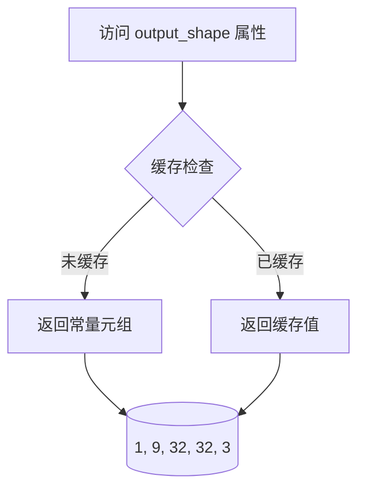

#### 带注释源码

```python
@property
def output_shape(self):
    """
    定义测试期望的输出形状。
    
    形状解释:
    - 1: batch_size (批量大小)
    - 9: num_frames (视频帧数)
    - 32: height (输出高度)
    - 32: width (输出宽度)
    - 3: channels (RGB 通道数)
    
    该属性用于验证管道输出是否符合预期维度，
    确保 LoRA 权重正确加载且未破坏模型的输出结构。
    
    Returns:
        tuple: 预期的输出形状 (batch_size, num_frames, height, width, channels)
    """
    return (1, 9, 32, 32, 3)
```


### `HunyuanVideoLoRATests.get_dummy_inputs`

该方法为 HunyuanVideo 视频生成流水线生成虚拟测试输入数据，包括噪声张量、文本输入ID以及完整的流水线参数字典，用于单元测试中的推理验证。

参数：

- `with_generator`：`bool`，控制是否在返回的流水线输入中包含随机生成器对象

返回值：`tuple[torch.Tensor, torch.Tensor, dict]`，返回包含三个元素的元组——噪声张量（形状为 (1, 3, 4, 4, 4)）、文本输入ID张量（形状为 (1, 16)）以及流水线参数字典（包含提示、帧数、推理步数等配置）

#### 流程图

```mermaid
flowchart TD
    A[开始 get_dummy_inputs] --> B[设置批大小为1<br/>序列长度为16<br/>通道数为4<br/>帧数为9<br/>潜在帧数为3<br/>尺寸为4x4]
    B --> C[创建随机种子生成器<br/>torch.manual_seed 0]
    C --> D[生成噪声张量<br/>floats_tensor 形状 (1,3,4,4,4)]
    E[创建随机输入ID<br/>torch.randint 形状 (1,16)] --> F[构建流水线参数字典]
    D --> F
    F --> G{with_generator?}
    G -->|True| H[向字典添加generator]
    G -->|False| I[不添加generator]
    H --> J[返回元组 noise, input_ids, pipeline_inputs]
    I --> J
```

#### 带注释源码

```python
def get_dummy_inputs(self, with_generator=True):
    """
    生成用于测试HunyuanVideo流水线的虚拟输入数据
    
    参数:
        with_generator: bool, 是否在返回的参数字典中包含PyTorch随机生成器
                       默认为True，用于确保测试结果可复现
    
    返回:
        tuple: (noise, input_ids, pipeline_inputs)
            - noise: torch.Tensor, 形状为 (batch_size, num_latent_frames, num_channels) + sizes
                    即 (1, 3, 4, 4, 4) 的浮点噪声张量
            - input_ids: torch.Tensor, 形状为 (batch_size, sequence_length)
                        即 (1, 16) 的整数文本输入ID
            - pipeline_inputs: dict, 包含以下键值对:
                * prompt: str, 空字符串
                * num_frames: int, 9（视频帧数）
                * num_inference_steps: int, 1（推理步数）
                * guidance_scale: float, 6.0（引导比例）
                * height: int, 32（生成图像高度）
                * width: int, 32（生成图像宽度）
                * max_sequence_length: int, 16（最大序列长度）
                * prompt_template: dict, 提示词模板配置
                * output_type: str, "np"（输出为numpy数组）
                * generator: torch.Generator, 仅当 with_generator=True 时存在
    """
    # 定义基础维度参数
    batch_size = 1                    # 批处理大小
    sequence_length = 16              # 文本序列长度
    num_channels = 4                  # 潜在空间的通道数
    num_frames = 9                    # 输入视频的总帧数
    # 潜在帧数计算公式: (num_frames - 1) // temporal_compression_ratio + 1
    # 对应于时间压缩比4: (9-1)//4 + 1 = 3
    num_latent_frames = 3             
    sizes = (4, 4)                     # 潜在空间的空间维度

    # 创建随机数生成器，种子固定为0确保测试可复现
    generator = torch.manual_seed(0)
    
    # 生成随机噪声张量，形状: (batch_size, num_latent_frames, num_channels, height, width)
    # 即 (1, 3, 4, 4, 4)
    noise = floats_tensor((batch_size, num_latent_frames, num_channels) + sizes)
    
    # 生成随机文本输入ID，范围 [1, sequence_length)
    # 形状: (batch_size, sequence_length) 即 (1, 16)
    input_ids = torch.randint(1, sequence_length, size=(batch_size, sequence_length), generator=generator)

    # 构建HunyuanVideoPipeline所需的输入参数字典
    pipeline_inputs = {
        "prompt": "",                                   # 空提示词（用于测试）
        "num_frames": num_frames,                       # 视频帧数
        "num_inference_steps": 1,                       # 推理步数（最小化测试时间）
        "guidance_scale": 6.0,                          # Classifier-free guidance 强度
        "height": 32,                                   # 生成图像高度
        "width": 32,                                    # 生成图像宽度
        "max_sequence_length": sequence_length,         # 文本编码器最大序列长度
        "prompt_template": {"template": "{}", "crop_start": 0},  # 提示词模板配置
        "output_type": "np",                            # 输出转换为numpy数组
    }
    
    # 根据参数决定是否添加随机生成器
    if with_generator:
        pipeline_inputs.update({"generator": generator})

    # 返回元组：(噪声张量, 输入ID, 流水线参数字典)
    return noise, input_ids, pipeline_inputs
```


### `HunyuanVideoLoRATests.test_simple_inference_with_text_lora_denoiser_fused_multi`

这是一个测试方法，用于验证 HunyuanVideoPipeline 在使用文本LoRA和去噪器融合（fused）模式下的推理功能是否正常，通过调用父类测试方法并指定绝对容差值（9e-3）来验证输出精度。

参数：

- 该方法无显式参数，但内部调用父类方法时传递 `expected_atol=9e-3`（期望的绝对误差容限）

返回值：`None`，测试方法无返回值，通过断言验证推理结果是否符合预期精度

#### 流程图

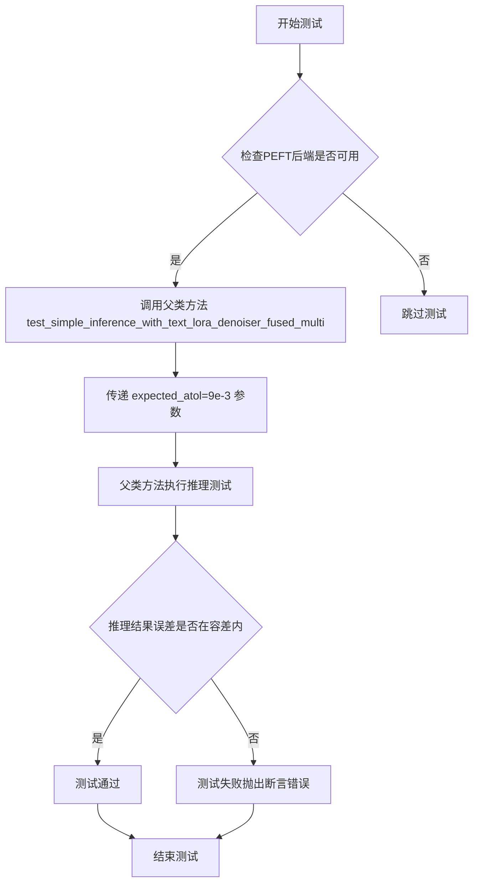

#### 带注释源码

```python
def test_simple_inference_with_text_lora_denoiser_fused_multi(self):
    """
    测试方法：验证使用文本LoRA和去噪器融合模式下的简单推理功能
    
    该方法继承自 HunyuanVideoLoRATests 测试类，该类用于测试 HunyuanVideoPipeline
    的LoRA（Low-Rank Adaptation）功能是否正常工作。
    
    测试重点：
    - 文本编码器LoRA：supports_text_loras = False 表示不支持文本编码器LoRA
    - 去噪器（Denoiser）LoRA：测试去噪器部分的LoRA权重融合
    - 融合模式（fused）：测试LoRA权重与主模型融合后的推理
    
    参数：
        无显式参数，但内部调用父类方法时使用：
        - expected_atol: 9e-3 = 0.009，绝对误差容差值
    
    返回值：
        无返回值（None），测试结果通过断言判定
    
    父类方法 test_simple_inference_with_text_lora_denoiser_fused_multi 概览：
        1. 加载预训练的 HunyuanVideoPipeline
        2. 加载LoRA权重到去噪器（transformer）模型
        3. 融合LoRA权重（fuse_lora）
        4. 执行推理（pipeline调用）
        5. 验证输出结果的精度是否符合预期（atol <= 9e-3）
    """
    # 调用父类 PeftLoraLoaderMixinTests 的同名测试方法
    # 传递 expected_atol=9e-3 参数用于精度验证
    super().test_simple_inference_with_text_lora_denoiser_fused_multi(expected_atol=9e-3)
```


### `HunyuanVideoLoRATests.test_simple_inference_with_text_denoiser_lora_unfused`

该方法是一个单元测试函数，用于验证 HunyuanVideo 管道在未融合（unfused）文本去噪器 LoRA 权重情况下的简单推理功能是否正常。测试通过调用父类同名测试方法并指定绝对误差容限（atol=9e-3）来验证推理结果的准确性。

参数：

- `self`：实例方法隐含参数，代表测试类 `HunyuanVideoLoRATests` 的实例对象，无需显式传递。

返回值：`None`，无返回值（测试方法通过断言验证，不返回具体数据）。

#### 流程图

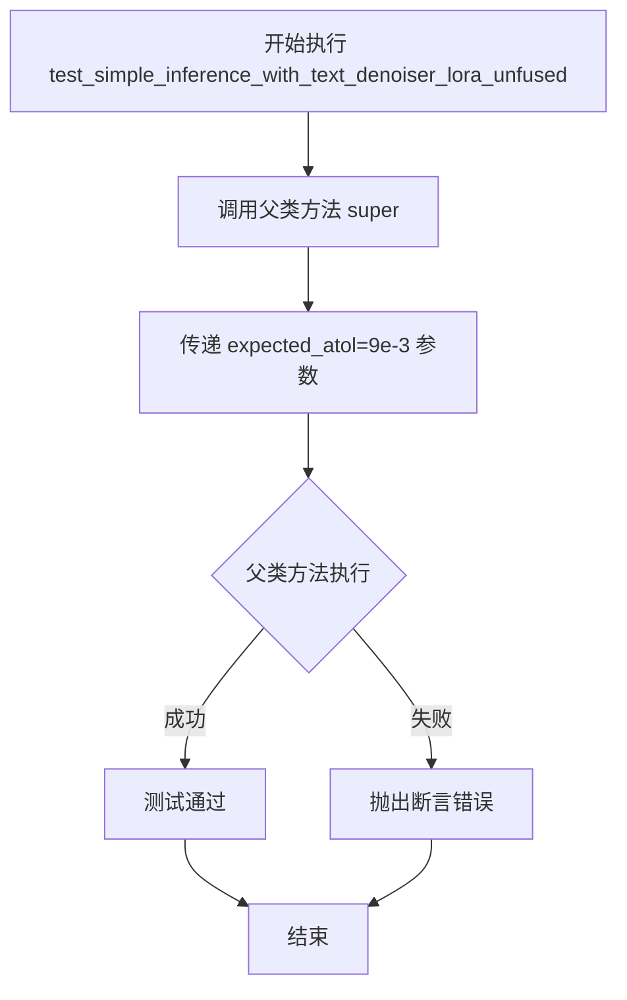

#### 带注释源码

```python
def test_simple_inference_with_text_denoiser_lora_unfused(self):
    """
    测试 HunyuanVideo 管道在未融合文本去噪器 LoRA 的情况下的推理功能。
    
    该测试方法继承自 PeftLoraLoaderMixinTests，通过调用父类方法验证：
    1. 管道能够正确加载和应用未融合的 LoRA 权重
    2. 推理结果的数值误差在预期范围内（atol=9e-3）
    """
    # 调用父类 PeftLoraLoaderMixinTests 的同名测试方法
    # expected_atol=9e-3 指定了测试通过的最大绝对误差容限
    super().test_simple_inference_with_text_denoiser_lora_unfused(expected_atol=9e-3)
```


### `HunyuanVideoLoRATests.test_simple_inference_save_pretrained`

这是一个被跳过的测试方法，原本用于测试 LoRA 权重保存为预训练模型格式的功能，但由于存在尚未调试的错误，目前该测试被跳过。

参数：

- `self`：`HunyuanVideoLoRATests` 类实例，代表测试类本身

返回值：`None`，该方法没有返回值（`pass` 语句）

#### 流程图

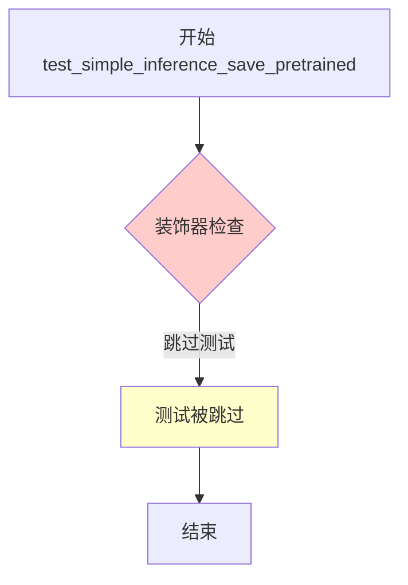

#### 带注释源码

```python
# TODO(aryan): Fix the following test
# 注释：待修复的测试，以下测试由于存在未解决的错误而被跳过
@unittest.skip("This test fails with an error I haven't been able to debug yet.")
# 装饰器：使用 unittest.skip 跳过该测试，跳过原因为"该测试存在一个我尚未能调试的错误"
def test_simple_inference_save_pretrained(self):
    # 方法名：test_simple_inference_save_pretrained
    # 参数：self - HunyuanVideoLoRATests 类实例
    # 返回值：None
    pass
    # 方法体：空实现，仅包含 pass 语句
```


### `HunyuanVideoLoRATests.test_simple_inference_with_text_denoiser_block_scale`

该测试方法用于验证文本去噪器模块的 LoRA block scale 推理功能，但由于 HunyuanVideo 暂不支持此功能，当前实现为跳过状态（pass）。

参数：

- `self`：`HunyuanVideoLoRATests`（测试类实例），代表测试类的当前实例，用于访问类属性和方法

返回值：`None`，该方法被 `@unittest.skip` 装饰器跳过，不执行任何测试逻辑

#### 流程图

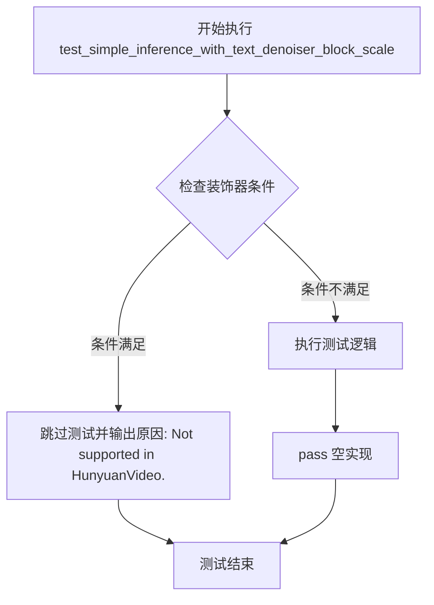

#### 带注释源码

```python
@unittest.skip("Not supported in HunyuanVideo.")  # 装饰器：跳过该测试，原因是 HunyuanVideo 不支持此功能
def test_simple_inference_with_text_denoiser_block_scale(self):
    """
    测试文本去噪器模块的 LoRA block scale 推理功能。
    
    该测试方法继承自 PeftLoraLoaderMixinTests 基类，用于验证在文本编码器
    与去噪器之间应用 LoRA 权重时的 block scale 缩放功能。
    
    参数字段:
        self: HunyuanVideoLoRATests - 测试类实例
    
    返回字段:
        None - 由于 @unittest.skip 装饰器，该方法不执行任何测试逻辑
    
    注意:
        - HunyuanVideoPipeline 当前不支持 text_denoiser 的 LoRA block scale 功能
        - 该测试在 HunyuanVideoLoRATests 类中被显式跳过
        - 对应的集成测试变体也未在 HunyuanVideoLoRAIntegrationTests 中实现
    """
    pass  # 空实现体，测试被跳过，不执行任何验证逻辑
```


### `HunyuanVideoLoRATests.test_simple_inference_with_text_denoiser_block_scale_for_all_dict_options`

该方法用于测试 HunyuanVideo 管道中文本去噪器模块的 block_scale 参数的所有字典选项，但由于 HunyuanVideo 暂不支持该功能而被跳过。

参数：

- `self`：`HunyuanVideoLoRATests` 类型，表示测试类实例本身

返回值：`None`，该方法被 `@unittest.skip` 装饰器跳过，不执行任何操作

#### 流程图

```mermaid
flowchart TD
    A[开始测试] --> B{检查装饰器}
    B -->|有@unittest.skip| C[跳过测试]
    B -->|无装饰器| D[执行测试逻辑]
    C --> E[测试结束]
    D --> E
    
    style C fill:#ffcccc
    style E fill:#ccffcc
```

#### 带注释源码

```python
@unittest.skip("Not supported in HunyuanVideo.")
def test_simple_inference_with_text_denoiser_block_scale_for_all_dict_options(self):
    """
    测试文本去噪器模块的 block_scale 参数的所有字典选项。
    
    该测试方法原本用于验证 LoRA 在文本编码器与去噪器融合时的
    block_scale 参数是否支持多种字典配置选项。由于 HunyuanVideo 
    管道当前不支持此功能，因此使用 @unittest.skip 装饰器跳过执行。
    
    Args:
        self: HunyuanVideoLoRATests 实例
        
    Returns:
        None: 方法被跳过，不返回任何值
    """
    pass  # 测试逻辑未实现，方法体为空
```


### HunyuanVideoLoRATests.test_modify_padding_mode

这是一个被 `@unittest.skip` 装饰器跳过的测试方法，用于测试 HunyuanVideo Pipeline 的填充模式（padding mode）修改功能。由于 HunyuanVideo 不支持此功能，该测试被永久跳过，方法体仅包含 `pass` 语句。

参数：

- `self`：`HunyuanVideoLoRATests` 类型，测试类实例本身，代表当前测试对象

返回值：`None`，无返回值（方法体为 `pass`，返回 `None`）

#### 流程图

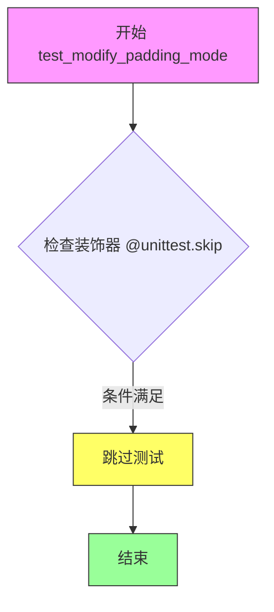

#### 带注释源码

```python
@unittest.skip("Not supported in HunyuanVideo.")
def test_modify_padding_mode(self):
    """
    测试 HunyuanVideo Pipeline 的填充模式修改功能。
    
    该测试方法原本用于验证 Pipeline 是否支持修改 padding mode，
    但经评估 HunyuanVideo 不支持此功能，因此使用 @unittest.skip
    装饰器永久跳过此测试。
    
    参数:
        self: HunyuanVideoLoRATests 的实例，代表当前测试对象
        
    返回值:
        None: 由于测试被跳过，不执行任何测试逻辑
    """
    pass  # 空方法体，测试被跳过
```

---

**补充说明：**

- **设计目标**：该测试方法的存在是为了保持测试接口的一致性，表明开发者知晓 LoRA 测试集中存在 `test_modify_padding_mode` 这个测试用例，但因 HunyuanVideo 架构限制而无法实现
- **技术债务**：无直接技术债务，但这是一个被禁用的测试用例，如未来需要支持此功能，需重新实现该测试
- **错误处理**：该方法不涉及错误处理，因为测试本身被跳过


### `HunyuanVideoLoRAIntegrationTests.setUp`

该方法是测试类的初始化方法（setUp），用于在每个测试方法运行前准备测试环境。它通过垃圾回收和缓存清理释放内存，然后加载预训练的 HunyuanVideo 模型和管道，并将其移动到指定的计算设备上。

参数：

- `self`：`HunyuanVideoLoRAIntegrationTests`，表示当前测试类的实例对象（隐式参数，无需显式传递）

返回值：`None`，该方法为测试初始化方法，不返回任何值

#### 流程图

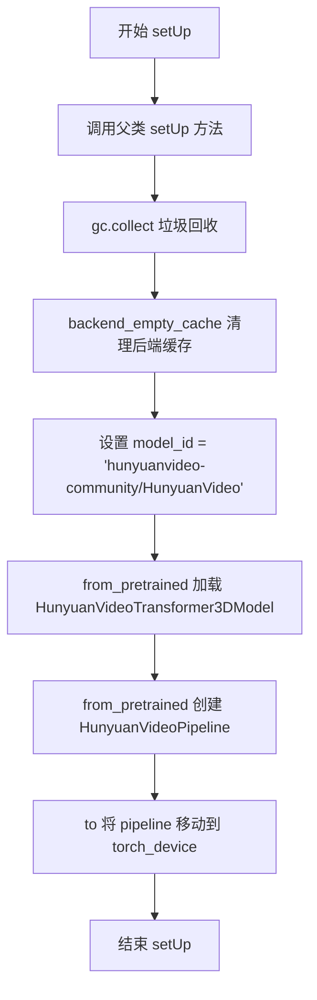

#### 带注释源码

```python
def setUp(self):
    # 调用父类的 setUp 方法，执行基类的初始化逻辑
    super().setUp()

    # 手动触发垃圾回收，释放不再使用的内存对象
    gc.collect()
    # 清理后端（如 CUDA/XPU）的缓存，释放显存
    backend_empty_cache(torch_device)

    # 定义模型标识符，指向 HuggingFace Hub 上的 HunyuanVideo 模型
    model_id = "hunyuanvideo-community/HunyuanVideo"
    # 从预训练模型加载 Transformer3D 模型，指定子文件夹和数据类型为 bfloat16
    transformer = HunyuanVideoTransformer3DModel.from_pretrained(
        model_id, subfolder="transformer", torch_dtype=torch.bfloat16
    )
    # 从预训练模型加载完整的 Pipeline，传入上面加载的 transformer，使用 float16 数据类型
    self.pipeline = HunyuanVideoPipeline.from_pretrained(
        model_id, transformer=transformer, torch_dtype=torch.float16
    ).to(torch_device)  # 将 pipeline 移动到指定的计算设备（torch_device）
```


### `HunyuanVideoLoRAIntegrationTests.tearDown`

该方法是 HunyuanVideoLoRA 集成测试类的清理方法，在每个测试用例执行完毕后调用，用于释放 GPU 内存资源，防止内存泄漏。

参数：

- `self`：`HunyuanVideoLoRAIntegrationTests`，测试类实例本身，代表当前测试对象

返回值：`None`，该方法不返回任何值，仅执行清理操作

#### 流程图

```mermaid
flowchart TD
    A[开始 tearDown] --> B[调用 super().tearDown]
    B --> C[执行 gc.collect]
    C --> D[调用 backend_empty_cache]
    D --> E[结束]
    
    style A fill:#f9f,stroke:#333
    style E fill:#9f9,stroke:#333
```

#### 带注释源码

```python
def tearDown(self):
    # 调用父类的 tearDown 方法，完成基础清理工作
    super().tearDown()

    # 执行 Python 垃圾回收，释放不再使用的对象内存
    gc.collect()
    
    # 调用后端特定的缓存清理函数，释放 GPU 显存
    backend_empty_cache(torch_device)
```


### `HunyuanVideoLoRAIntegrationTests.test_original_format_cseti`

该测试方法用于验证 HunyuanVideo 管道加载和运行 LoRA 权重（来自 Cseti/HunyuanVideo-LoRA-Arcane_Jinx-v1）的能力。测试流程包括加载 LoRA 权重、融合权重、卸载权重、启用 VAE 平铺，然后使用特定提示运行推理，最后通过计算输出与预期值的余弦相似度距离来验证结果。

参数：

- `self`：`unittest.TestCase`，测试类实例本身

返回值：`None`，该测试方法无返回值，通过内部断言验证结果

#### 流程图

```mermaid
flowchart TD
    A[开始测试] --> B[调用 load_lora_weights<br/>加载 LoRA 权重]
    B --> C[调用 fuse_lora<br/>融合 LoRA 权重到模型]
    C --> D[调用 unload_lora_weights<br/>卸载 LoRA 权重]
    D --> E[调用 vae.enable_tiling<br/>启用 VAE 平铺]
    E --> F[定义 prompt 字符串<br/>CSETIARCANE 提示词]
    F --> G[调用 pipeline 执行推理<br/>生成视频帧]
    G --> H[处理输出<br/>flatten 并获取切片]
    H --> I[从 Expectations 获取<br/>预期值切片]
    I --> J[计算最大差异<br/>numpy_cosine_similarity_distance]
    J --> K{max_diff < 1e-3?}
    K -->|是| L[测试通过]
    K -->|否| M[测试失败<br/>抛出断言错误]
```

#### 带注释源码

```python
def test_original_format_cseti(self):
    """
    测试方法：验证原始格式的 CSETI LoRA 权重在 HunyuanVideo 管道中的加载和推理功能
    
    该测试执行以下步骤：
    1. 加载外部 LoRA 权重（Arcane_Jinx 风格）
    2. 将 LoRA 权重融合到管道模型中
    3. 卸载 LoRA 权重（测试融合后的模型仍可独立运行）
    4. 启用 VAE 平铺以处理高分辨率图像
    5. 运行推理并验证输出与预期值的一致性
    """
    
    # 步骤 1: 从 HuggingFace Hub 加载预训练的 LoRA 权重
    # weight_name 指定具体的 safetensors 文件
    self.pipeline.load_lora_weights(
        "Cseti/HunyuanVideo-LoRA-Arcane_Jinx-v1", 
        weight_name="csetiarcane-nfjinx-v1-6000.safetensors"
    )
    
    # 步骤 2: 将加载的 LoRA 权重融合到管道的主模型中
    # 融合后 LoRA 权重成为模型权重的一部分，可用于推理
    self.pipeline.fuse_lora()
    
    # 步骤 3: 卸载 LoRA 权重
    # 测试融合后仍能恢复到原始状态
    self.pipeline.unload_lora_weights()
    
    # 步骤 4: 启用 VAE 平铺（Tiling）功能
    # 平铺技术可将高分辨率图像分块处理，避免内存溢出
    self.pipeline.vae.enable_tiling()
    
    # 定义推理用的文本提示词
    prompt = "CSETIARCANE. A cat walks on the grass, realistic"
    
    # 步骤 5: 执行管道推理
    # 参数说明：
    #   - prompt: 文本提示
    #   - height/width: 输出分辨率 320x512
    #   - num_frames: 生成 9 帧视频
    #   - num_inference_steps: 推理步数（从类属性继承，为 10）
    #   - output_type: 输出为 numpy 数组
    #   - generator: 固定随机种子（从类属性继承，为 0）确保可复现性
    out = self.pipeline(
        prompt=prompt,
        height=320,
        width=512,
        num_frames=9,
        num_inference_steps=self.num_inference_steps,
        output_type="np",
        generator=torch.manual_seed(self.seed),
    ).frames[0]  # 获取第一帧（因为 output_type="np" 返回的是帧列表）
    
    # 处理输出：将多维数组展平为一维
    out = out.flatten()
    
    # 提取切片：取前 8 个和后 8 个元素，共 16 个值用于对比
    # 这样可以高效验证输出的统计特性
    out_slice = np.concatenate((out[:8], out[-8:]))
    
    # 定义预期输出切片
    # 包含两个平台（cuda 和 xpu）的预期值，用于不同硬件环境
    # fmt: off  # 关闭代码格式化
    expected_slices = Expectations(
        {
            ("cuda", 7): np.array([0.1013, 0.1924, 0.0078, 0.1021, 0.1929, 0.0078, 0.1023, 0.1919, 0.7402, 0.104, 0.4482, 0.7354, 0.0925, 0.4382, 0.7275, 0.0815]),
            ("xpu", 3): np.array([0.1013, 0.1924, 0.0078, 0.1021, 0.1929, 0.0078, 0.1023, 0.1919, 0.7402, 0.104, 0.4482, 0.7354, 0.0925, 0.4382, 0.7275, 0.0815]),
        }
    )
    # fmt: on  # 恢复代码格式化
    
    # 获取当前运行环境的预期切片
    expected_slice = expected_slices.get_expectation()
    
    # 计算输出与预期值的余弦相似度距离
    # 距离越小表示输出与预期越接近
    max_diff = numpy_cosine_similarity_distance(expected_slice.flatten(), out_slice)
    
    # 断言：最大差异应小于 1e-3（0.001）
    # 这是一个严格的数值一致性检查
    assert max_diff < 1e-3
```

## 关键组件


### HunyuanVideo LoRA测试模块

该代码是HunyuanVideo模型的LoRA（低秩自适应）功能集成测试模块，通过PEFT框架验证视频生成管道的权重加载、融合与卸载功能，支持文本提示驱动的视频生成推理。

### 文件整体运行流程

本测试文件遵循以下执行流程：1) 定义单元测试类`HunyuanVideoLoRATests`配置模型参数与输入数据；2) 执行基础推理测试验证LoRA融合与未融合模式；3) 通过`HunyuanVideoLoRAIntegrationTests`进行端到端集成测试，加载外部LoRA权重文件进行真实场景验证。

### 类详细信息

#### HunyuanVideoLoRATests

- **类字段**：
  - `pipeline_class`：类型`HunyuanVideoPipeline`，管道类定义
  - `scheduler_cls`：类型`FlowMatchEulerDiscreteScheduler`，调度器类
  - `transformer_cls`：类型`HunyuanVideoTransformer3DModel`，3D变换器模型类
  - `vae_cls`：类型`AutoencoderKLHunyuanVideo`，VAE模型类
  - `transformer_kwargs`：类型`dict`，变换器初始化参数配置
  - `vae_kwargs`：类型`dict`，VAE初始化参数配置
  - `tokenizer_cls`：类型`LlamaTokenizerFast`，主分词器类
  - `text_encoder_cls`：类型`LlamaModel`，文本编码器类
  - `has_two_text_encoders`：类型`bool`，标志是否支持双文本编码器
  - `supports_text_encoder_loras`：类型`bool`，标志是否支持文本编码器LoRA

- **类方法**：
  - `get_dummy_inputs(with_generator=True)`：
    - 参数：`with_generator` (bool, optional) - 是否包含随机生成器
    - 返回值类型：`tuple`，包含(noise, input_ids, pipeline_inputs)
    - 返回值描述：返回用于测试的虚拟输入数据
    - 流程图：```mermaid
graph TD
A[开始] --> B[设置批次大小和序列长度]
B --> C[创建随机噪声张量]
C --> D[生成随机输入ID]
D --> E[构建管道参数字典]
E --> F[返回噪声、输入ID和参数]
```
    - 源码：
    ```python
    def get_dummy_inputs(self, with_generator=True):
        batch_size = 1
        sequence_length = 16
        num_channels = 4
        num_frames = 9
        num_latent_frames = 3
        sizes = (4, 4)

        generator = torch.manual_seed(0)
        noise = floats_tensor((batch_size, num_latent_frames, num_channels) + sizes)
        input_ids = torch.randint(1, sequence_length, size=(batch_size, sequence_length), generator=generator)

        pipeline_inputs = {
            "prompt": "",
            "num_frames": num_frames,
            "num_inference_steps": 1,
            "guidance_scale": 6.0,
            "height": 32,
            "width": 32,
            "max_sequence_length": sequence_length,
            "prompt_template": {"template": "{}", "crop_start": 0},
            "output_type": "np",
        }
        if with_generator:
            pipeline_inputs.update({"generator": generator})

        return noise, input_ids, pipeline_inputs
    ```

  - `test_simple_inference_with_text_lora_denoiser_fused_multi()`：测试融合多文本LoRA去噪器推理
  - `test_simple_inference_with_text_denoiser_lora_unfused()`：测试未融合文本去噪器LoRA推理
  - `test_simple_inference_save_pretrained()`：测试模型保存与预加载（已跳过）

#### HunyuanVideoLoRAIntegrationTests

- **类字段**：
  - `num_inference_steps`：类型`int`，推理步数设置为10
  - `seed`：类型`int`，随机种子设置为0

- **类方法**：
  - `setUp()`：
    - 参数：无
    - 返回值类型：`None`
    - 返回值描述：初始化测试环境，加载预训练模型到指定设备
    - 流程图：```mermaid
graph TD
A[开始] --> B[调用父类setUp]
B --> C[垃圾回收与缓存清理]
C --> D[加载HunyuanVideoTransformer3DModel]
D --> E[加载HunyuanVideoPipeline]
E --> F[模型移至计算设备]
```
    - 源码：
    ```python
    def setUp(self):
        super().setUp()

        gc.collect()
        backend_empty_cache(torch_device)

        model_id = "hunyuanvideo-community/HunyuanVideo"
        transformer = HunyuanVideoTransformer3DModel.from_pretrained(
            model_id, subfolder="transformer", torch_dtype=torch.bfloat16
        )
        self.pipeline = HunyuanVideoPipeline.from_pretrained(
            model_id, transformer=transformer, torch_dtype=torch.float16
        ).to(torch_device)
    ```

  - `tearDown()`：
    - 参数：无
    - 返回值类型：`None`
    - 返回值描述：清理测试环境，释放GPU内存
    - 源码：
    ```python
    def tearDown(self):
        super().tearDown()

        gc.collect()
        backend_empty_cache(torch_device)
    ```

  - `test_original_format_cseti()`：
    - 参数：无
    - 返回值类型：`None`
    - 返回值描述：加载外部LoRA权重并执行完整推理流程，验证输出与预期值的余弦相似度
    - 流程图：```mermaid
graph TD
A[加载CSETI LoRA权重] --> B[融合LoRA权重]
B --> C[卸载LoRA权重]
C --> D[启用VAE分块]
D --> E[构建提示词]
E --> F[执行管道推理]
F --> G[提取输出切片]
G --> H[计算余弦相似度距离]
H --> I[断言误差小于阈值]
```
    - 源码：
    ```python
    def test_original_format_cseti(self):
        self.pipeline.load_lora_weights(
            "Cseti/HunyuanVideo-LoRA-Arcane_Jinx-v1", weight_name="csetiarcane-nfjinx-v1-6000.safetensors"
        )
        self.pipeline.fuse_lora()
        self.pipeline.unload_lora_weights()
        self.pipeline.vae.enable_tiling()

        prompt = "CSETIARCANE. A cat walks on the grass, realistic"

        out = self.pipeline(
            prompt=prompt,
            height=320,
            width=512,
            num_frames=9,
            num_inference_steps=self.num_inference_steps,
            output_type="np",
            generator=torch.manual_seed(self.seed),
        ).frames[0]
        out = out.flatten()
        out_slice = np.concatenate((out[:8], out[-8:]))

        expected_slices = Expectations(
            {
                ("cuda", 7): np.array([0.1013, 0.1924, 0.0078, 0.1021, 0.1929, 0.0078, 0.1023, 0.1919, 0.7402, 0.104, 0.4482, 0.7354, 0.0925, 0.4382, 0.7275, 0.0815]),
                ("xpu", 3): np.array([0.1013, 0.1924, 0.0078, 0.1021, 0.1929, 0.0078, 0.1023, 0.1919, 0.7402, 0.104, 0.4482, 0.7354, 0.0925, 0.4382, 0.7275, 0.0815]),
            }
        )
        expected_slice = expected_slices.get_expectation()

        max_diff = numpy_cosine_similarity_distance(expected_slice.flatten(), out_slice)

        assert max_diff < 1e-3
    ```

### 关键组件信息

#### PEFT LoRA加载器混合特质

提供通用LoRA测试接口，包括`test_simple_inference_with_text_lora_denoiser_fused_multi`和`test_simple_inference_with_text_denoiser_lora_unfused`方法，用于验证权重融合与分离模式。

#### 量化配置

支持`torch.bfloat16`和`torch.float16`两种量化精度，通过`torch_dtype`参数在模型加载时指定。

#### FlowMatchEulerDiscreteScheduler

基于Flow Matching的欧拉离散调度器，用于控制扩散模型的采样过程。

#### HunyuanVideoPipeline

整合Transformer 3D模型、VAE、双文本编码器的完整视频生成管道，支持文本提示、尺寸参数、帧数配置。

### 潜在技术债务或优化空间

1. **测试跳过问题**：多个测试被标记为跳过（`test_simple_inference_save_pretrained`、`test_simple_inference_with_text_denoiser_block_scale`等），其中保存预训练测试存在未解决的调试问题
2. **硬件依赖性**：集成测试要求特定的CUDA版本(12.5)和torch版本(2.5.1+cu124)，跨环境复现困难
3. **预期值硬编码**：期望输出值针对特定硬件配置硬编码，限制了测试的可移植性
4. **双文本编码器支持不完整**：`has_two_text_encoders=True`但`supports_text_encoder_loras=False`，存在功能不一致

### 其它项目

#### 设计目标与约束

- 验证PEFT框架与HunyuanVideo模型的兼容性
- 支持LoRA权重的动态加载、融合与卸载
- 兼容多种加速器设备（CUDA、XPU）

#### 错误处理与异常设计

- 使用`@require_peft_backend`、`@require_torch_accelerator`等装饰器进行前置条件检查
- 集成测试依赖特定硬件环境，断言失败时提供明确的相似度距离误差

#### 数据流与状态机

测试数据流：配置加载 → 权重加载 → LoRA融合/卸载 → VAE分块启用 → 管道推理 → 结果验证

#### 外部依赖与接口契约

- 依赖`diffusers`库的`HunyuanVideoPipeline`、`HunyuanVideoTransformer3DModel`、`AutoencoderKLHunyuanVideo`
- 依赖`transformers`库的`CLIPTextModel`、`CLIPTokenizer`、`LlamaModel`、`LlamaTokenizerFast`
- 依赖`PEFT`框架的LoRA加载接口
- 依赖HuggingFace Hub模型ID "hunyuanvideo-community/HunyuanVideo" 和 "Cseti/HunyuanVideo-LoRA-Arcane_Jinx-v1"


## 问题及建议


### 已知问题

- **未修复的失败测试**：`test_simple_inference_save_pretrained` 被无限期跳过，注释表明存在未调试的错误，这可能隐藏了实际的bug或功能缺陷
- **多个功能未实现**：`test_simple_inference_with_text_denoiser_block_scale`、`test_simple_inference_with_text_denoiser_block_scale_for_all_dict_options` 和 `test_modify_padding_mode` 三个测试被跳过，标记为"HunyuanVideo不支持"，表明LoRA的部分功能特性可能未完整实现
- **硬编码的模型路径和配置**：模型ID `"hunyuanvideo-community/HunyuanVideo"`、LoRA权重路径 `"Cseti/HunyuanVideo-LoRA-Arcane_Jinx-v1"`、期望的CUDA版本等都是硬编码的，降低了测试的灵活性和可维护性
- **硬件环境依赖性**：集成测试注释明确指出需要特定的硬件环境（CUDA 12.5, torch 2.5.1+cu124）才能通过，这会导致在其他环境下测试结果不一致
- **魔法数字缺乏文档**：各种超参数如 `expected_atol=9e-3`、`guidance_scale=6.0`、`num_inference_steps=10` 等缺乏解释，难以理解其选择依据
- **缺少资源清理**：虽然有 `tearDown` 方法清理内存，但集成测试中 `load_lora_weights` 后如果测试失败，可能无法正确卸载LoRA权重
- **继承的测试类问题**：`supports_text_encoder_loras = False` 表明该pipeline不支持文本编码器的LoRA，但这是一个设计限制还是待实现功能不明确

### 优化建议

- **修复或删除跳过的测试**：对于 `test_simple_inference_save_pretrained`，应投入时间调试并修复问题，或明确确认是已知限制后删除该测试
- **抽取配置到独立文件**：将模型路径、LoRA配置、硬件要求等抽取到独立的测试配置文件（如 `pytest.ini` 或 `conftest.py`）中
- **添加环境检测和警告**：在集成测试开始时检测CUDA版本和torch版本，如果不匹配期望配置，发出警告而非静默失败
- **增强测试隔离性**：每个测试方法应在 `setUp` 中完全初始化所需资源，`tearDown` 中完全释放，特别是LoRA权重应该确保在测试结束时卸载
- **为关键参数添加文档注释**：解释 `expected_atol`、`guidance_scale` 等关键参数的选择依据和影响
- **考虑添加模拟测试**：为被跳过的功能添加mock测试或在文档中明确列出这些是已知限制和未来计划
- **添加更多断言信息**：当前测试失败时仅显示数值差异，应添加更多上下文信息如输入参数、模型版本等便于调试

## 其它


### 设计目标与约束

本测试模块的设计目标是验证HunyuanVideo模型对LoRA（Low-Rank Adaptation）技术的支持能力，包括LoRA权重的加载、融合、卸载等功能。关键约束包括：1) 必须使用PEFT后端；2) 不支持文本编码器的LoRA；3) 集成测试需要特定的硬件配置（CUDA 12.5 + cu124）；4) 仅支持torch accelerator。

### 错误处理与异常设计

测试模块采用unittest框架的断言机制进行错误检测。主要错误处理包括：1) 使用skip装饰器跳过不支持的功能测试（如text_denoiser_block_scale）；2) 使用max_diff < 1e-3的余弦相似度断言验证输出正确性；3) 集成测试中使用try-except捕获模型加载和推理异常；4) setUp和tearDown方法中进行gc.collect()和cache清理以防止内存泄漏。

### 数据流与状态机

数据流遵循以下路径：1) get_dummy_inputs生成虚拟输入（noise, input_ids, pipeline_inputs）；2) pipeline接收prompt和其他参数进行推理；3) LoRA权重通过load_lora_weights加载；4) 通过fuse_lora融合权重进行推理；5) 通过unload_lora_weights卸载权重。状态转换：初始化 -> 加载权重 -> 融合权重 -> 推理 -> 卸载权重。

### 外部依赖与接口契约

主要依赖包括：1) diffusers库的HunyuanVideoPipeline、FlowMatchEulerDiscreteScheduler等；2) transformers库的CLIPTextModel、CLIPTokenizer、LlamaModel、LlamaTokenizerFast；3) PEFT后端（通过@require_peft_backend装饰器）；4) 测试工具库（Expectations、backend_empty_cache等）。接口契约：pipeline_class必须继承HunyuanVideoPipeline；必须实现get_dummy_inputs方法返回(noise, input_ids, pipeline_inputs)三元组。

### 测试覆盖范围

单元测试覆盖：1) LoRA融合推理（test_simple_inference_with_text_lora_denoiser_fused_multi）；2) LoRA非融合推理（test_simple_inference_with_text_denoiser_lora_unfused）；3) 保存预训练模型（已跳过）。集成测试覆盖：1) 原始格式LoRA权重加载（test_original_format_cseti）；2) VAE tiling功能；3) 多硬件平台（CUDA/XPU）的输出验证。

### 性能基准与度量

集成测试定义了明确的性能基准：1) num_inference_steps = 10；2) seed = 0确保可重复性；3) 输出相似度阈值：max_diff < 1e-3；4) 预期输出通过Expectations类管理，支持CUDA 7和XPU 3平台的独立期望值。输出维度：(1, 9, 32, 32, 3) = (batch, frames, height, width, channels)。

### 配置管理与版本要求

关键配置通过类属性集中管理：1) transformer_kwargs定义transformer架构参数（2 attention heads, 10 head dim, 1 layer）；2) vae_kwargs定义VAE配置（4个down/up blocks，8 channels）；3) tokenizer和text_encoder配置指向hf-internal-testing/tiny-random-hunyuanvideo；4) 集成测试使用hunyuanvideo-community/HunyuanVideo真实模型。版本约束：torch 2.5.1+cu124 with CUDA 12.5。

### 可维护性与扩展性

代码设计考虑了扩展性：1) 通过PeftLoraLoaderMixinTests mixin继承通用LoRA测试逻辑；2) transformer_cls和vae_cls等类属性便于替换模型实现；3) scheduler_kwargs字典支持自定义调度器参数。技术债务：test_simple_inference_save_pretrained测试被跳过且未实现调试；缺少对不支持功能的详细错误信息。

### 安全与权限考虑

代码遵循Apache License 2.0开源协议。安全考量：1) 使用safetensors格式加载LoRA权重（更安全）；2) 模型加载指定torch_dtype防止精度不一致；3) 集成测试使用torch_device动态选择设备。

### CI/CD与部署注意事项

测试标记：1) @nightly装饰器表示仅在夜间CI运行；2) @require_torch_accelerator要求GPU；3) @require_big_accelerator要求大规模 accelerator；4) @require_peft_backend强制PEFT依赖。部署时需要确保PEFT库已安装，且具备足够显存（集成测试加载完整HunyuanVideo模型）。


    