# `diffusers\tests\lora\test_lora_layers_ltx2.py` 详细设计文档

这是一个针对LTX2视频/音频生成模型的LoRA（Low-Rank Adaptation）功能单元测试文件，用于测试LTX2Pipeline在加载和使用LoRA权重进行推理时的正确性，涵盖了文本编码器和解码器的LoRA融合与未融合场景。

## 整体流程

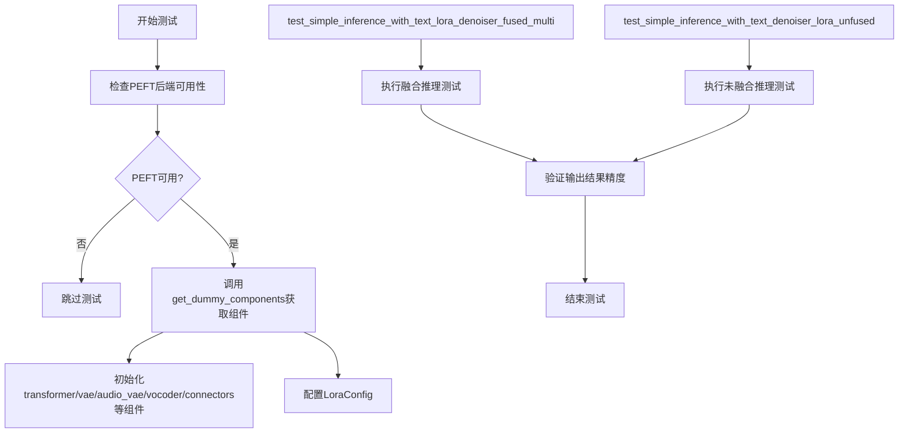

## 类结构

```
unittest.TestCase
└── LTX2LoRATests (继承PeftLoraLoaderMixinTests)
    ├── pipeline_class: LTX2Pipeline
    ├── transformer_cls: LTX2VideoTransformer3DModel
    ├── vae_cls: AutoencoderKLLTX2Video
    ├── audio_vae_cls: AutoencoderKLLTX2Audio
    ├── vocoder_cls: LTX2Vocoder
    ├── connectors_cls: LTX2TextConnectors
    ├── tokenizer_cls: AutoTokenizer
    └── text_encoder_cls: Gemma3ForConditionalGeneration
```

## 全局变量及字段


### `sys`
    
系统模块，用于路径操作

类型：`module`
    


### `unittest`
    
单元测试框架模块

类型：`module`
    


### `torch`
    
PyTorch深度学习框架

类型：`module`
    


### `transformers`
    
Hugging Face Transformers库

类型：`module`
    


### `diffusers`
    
Hugging Face Diffusers库

类型：`module`
    


### `PeftLoraLoaderMixinTests`
    
LoRA加载器混合测试基类

类型：`class`
    


### `is_peft_available`
    
检查PEFT库可用性的函数

类型：`function`
    


### `LoraConfig`
    
PEFT LoRA配置类（条件导入）

类型：`class`
    


### `LTX2LoRATests.pipeline_class`
    
LTX2管道类，用于视频/音频生成

类型：`type`
    


### `LTX2LoRATests.scheduler_cls`
    
Flow Match Euler离散调度器类

类型：`type`
    


### `LTX2LoRATests.scheduler_kwargs`
    
调度器配置参数字典

类型：`dict`
    


### `LTX2LoRATests.transformer_kwargs`
    
Transformer模型配置参数字典

类型：`dict`
    


### `LTX2LoRATests.transformer_cls`
    
LTX2视频Transformer 3D模型类

类型：`type`
    


### `LTX2LoRATests.vae_kwargs`
    
VAE模型配置参数字典

类型：`dict`
    


### `LTX2LoRATests.vae_cls`
    
AutoencoderKLLTX2Video模型类

类型：`type`
    


### `LTX2LoRATests.audio_vae_kwargs`
    
音频VAE模型配置参数字典

类型：`dict`
    


### `LTX2LoRATests.audio_vae_cls`
    
AutoencoderKLLTX2Audio模型类

类型：`type`
    


### `LTX2LoRATests.vocoder_kwargs`
    
声码器配置参数字典

类型：`dict`
    


### `LTX2LoRATests.vocoder_cls`
    
LTX2声码器类

类型：`type`
    


### `LTX2LoRATests.connectors_kwargs`
    
文本连接器配置参数字典

类型：`dict`
    


### `LTX2LoRATests.connectors_cls`
    
LTX2文本连接器类

类型：`type`
    


### `LTX2LoRATests.tokenizer_cls`
    
分词器类（AutoTokenizer）

类型：`type`
    


### `LTX2LoRATests.tokenizer_id`
    
分词器模型ID标识符

类型：`str`
    


### `LTX2LoRATests.text_encoder_cls`
    
文本编码器类（Gemma3ForConditionalGeneration）

类型：`type`
    


### `LTX2LoRATests.text_encoder_id`
    
文本编码器模型ID标识符

类型：`str`
    


### `LTX2LoRATests.denoiser_target_modules`
    
去噪器目标模块名称列表

类型：`list`
    


### `LTX2LoRATests.supports_text_encoder_loras`
    
标志位，指示是否支持文本编码器LoRA

类型：`bool`
    
    

## 全局函数及方法


### `floats_tensor`

生成浮点张量的工具函数，用于创建指定形状的随机浮点数张量，通常用于深度学习测试中的 dummy 数据生成。

参数：

-  `shape`：`tuple`，张量的形状元组，指定每个维度的尺寸
-  `rng`：`torch.Generator`，可选，随机数生成器，用于控制随机性

返回值：`torch.Tensor`，指定形状的随机浮点张量

#### 流程图

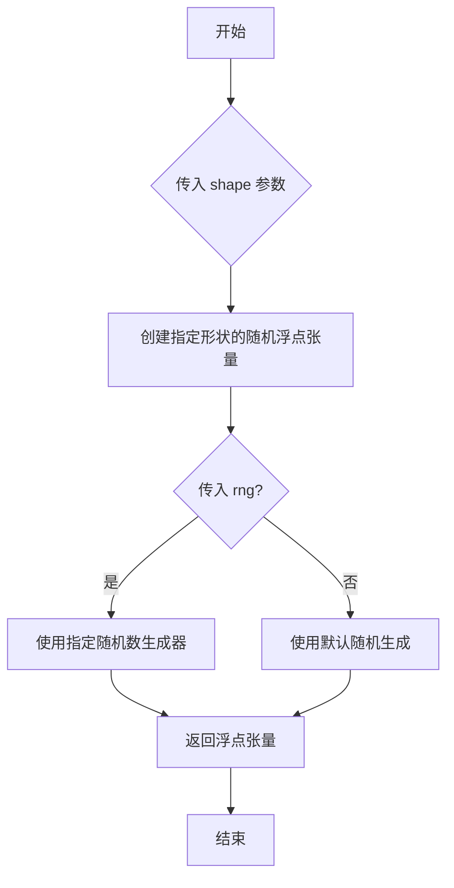

#### 带注释源码

```python
# 由于 floats_tensor 定义在 testing_utils 模块中（非本文件定义）
# 以下为从本文件中的调用方式推断的函数签名和使用场景：

# 调用示例（在 get_dummy_inputs 方法中）:
noise = floats_tensor((batch_size, num_latent_frames, num_channels, latent_height, latent_width))

# 参数说明:
# shape: tuple of int
#     张量的形状，例如 (1, 2, 4, 8, 8) 表示
#     - batch_size=1
#     - num_latent_frames=2
#     - num_channels=4
#     - latent_height=8
#     - latent_width=8

# 返回值:
# torch.Tensor
#     一个随机填充的浮点张量，范围通常在 [0, 1) 或 [-1, 1] 之间
#     具体范围取决于 testing_utils 中的实现
```


### `require_peft_backend`

这是一个装饰器函数，用于标记测试类或测试方法需要 PEFT (Parameter-Efficient Fine-Tuning) 后端才能运行。如果环境中未安装 PEFT 或不满足特定条件，装饰器会跳过相关测试。

参数：

- `func`：被装饰的类或函数对象

返回值：`装饰后的函数对象`，通常返回原函数或修改后的函数（可能包含跳过逻辑）

#### 流程图

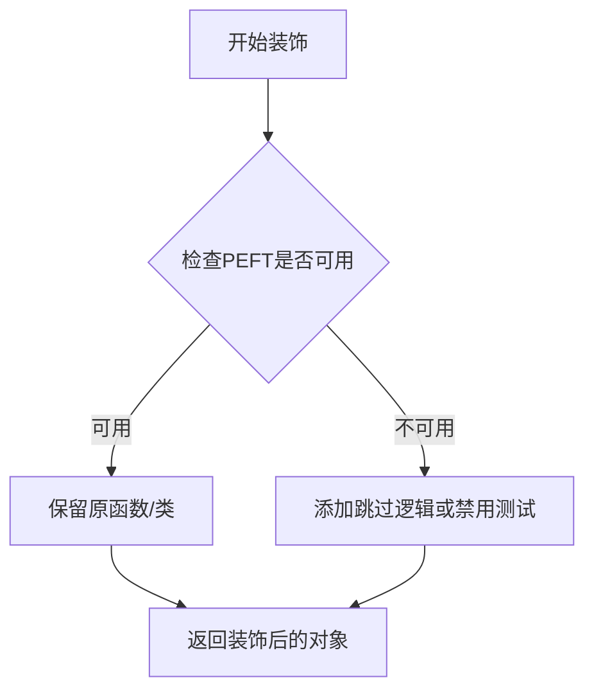

#### 带注释源码

```python
# 从上级目录的testing_utils模块导入require_peft_backend装饰器
# 该装饰器用于标记测试需要PEFT后端支持
from ..testing_utils import floats_tensor, require_peft_backend

# 使用装饰器标记LTX2LoRATests类需要PEFT后端
# 当PEFT不可用时，此测试类将被跳过
@require_peft_backend
class LTX2LoRATests(unittest.TestCase, PeftLoraLoaderMixinTests):
    # 测试类内容...
    pipeline_class = LTX2Pipeline
    # ...其他类属性和方法
```

#### 详细说明

| 属性 | 描述 |
|------|------|
| **函数类型** | 装饰器 (Decorator) |
| **模块位置** | `..testing_utils` (从上级目录导入) |
| **使用场景** | 用于标记需要 PEFT 库的测试类或测试方法 |
| **条件判断** | 基于 `is_peft_available()` 函数检查 PEFT 是否可用 |
| **行为** | 当 PEFT 不可用时，标记测试为跳过状态 |


### `AutoTokenizer.from_pretrained`

该方法是 Hugging Face Transformers 库中 `AutoTokenizer` 类的类方法，用于从预训练模型路径或模型 ID 加载对应的分词器（Tokenizer），支持自动识别模型架构并实例化相应的分词器类型。

参数：

-  `pretrained_model_name_or_path`：`str`，预训练模型的名称（如 "gpt2"）或本地路径
-  `cache_dir`：`str | None`，可选，指定模型缓存目录
-  `force_download`：`bool`，可选，是否强制重新下载模型（默认 False）
-  `resume_download`：`bool`，可选，是否支持断点续传（默认 True）
-  `proxies`：`dict | None`，可选，HTTP 代理配置
-  `revision`：`str`，可选，GitHub 模型仓库的提交哈希或分支名（默认 "main"）
-  `use_auth_token`：`str | None`，可选，访问私有模型所需的认证令牌
-  `local_files_only`：`bool`，可选，是否仅使用本地文件而不下载（默认 False）
-  `trust_remote_code`：`bool | None`，可选，是否信任远程代码执行（默认 False）
-  `*args`：`tuple`，可选，传递给底层分词器的额外位置参数
-  `**kwargs`：`dict`，可选，传递给底层分词器的额外关键字参数

返回值：`PreTrainedTokenizer`，返回加载后的分词器对象

#### 流程图

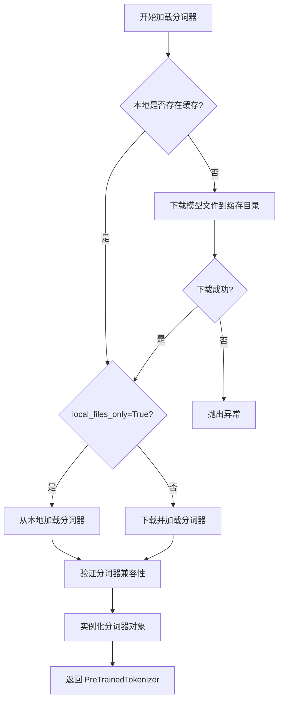

#### 带注释源码

```python
# 在测试代码中的实际调用方式
tokenizer = self.tokenizer_cls.from_pretrained(self.tokenizer_id)

# 等价于:
from transformers import AutoTokenizer
tokenizer = AutoTokenizer.from_pretrained("hf-internal-testing/tiny-gemma3")

# 完整参数调用示例
tokenizer = AutoTokenizer.from_pretrained(
    pretrained_model_name_or_path="hf-internal-testing/tiny-gemma3",  # 模型ID或本地路径
    cache_dir=None,                     # 使用默认缓存目录
    force_download=False,               # 不强制重新下载
    resume_download=True,               # 支持断点续传
    proxies=None,                       # 不使用代理
    revision="main",                   # 默认分支
    use_auth_token=None,                # 无需认证
    local_files_only=False,             # 允许下载模型
    trust_remote_code=False,            # 不信任远程代码
)
```


# Gemma3ForConditionalGeneration.from_pretrained 设计文档

### `Gemma3ForConditionalGeneration.from_pretrained`

该函数是 HuggingFace Transformers 库中 `Gemma3ForConditionalGeneration` 类的类方法，用于从预训练模型权重加载文本编码器模型。该方法根据提供的模型标识符或本地路径，实例化并返回一个配置完整、权重加载的模型对象，支持从 HuggingFace Hub 或本地磁盘加载模型权重和配置信息。

参数：

- `pretrained_model_name_or_path`：`str` 或 `os.PathLike`，预训练模型的名称（如 "hf-internal-testing/tiny-gemma3"）或本地模型目录路径
- `config`：`PretrainedConfig`（可选），模型配置对象，如果为 None 则从预训练模型中加载
- `state_dict`：`Dict[str, torch.Tensor]`（可选），直接传递的模型权重字典，优先级高于从磁盘加载
- `cache_dir`：`str` 或 `os.PathLike`（可选），模型缓存目录路径
- `force_download`：`bool`（可选），是否强制重新下载模型，默认为 False
- `resume_download`：`bool`（可选），是否支持断点续传下载，默认为 True
- `proxies`：`Dict[str, str]`（可选），用于 HTTP/HTTPS 请求的代理配置
- `output_loading_info`：`bool`（可选），是否返回详细的加载信息，默认为 False
- `local_files_only`：`bool`（可选），是否仅使用本地文件，默认为 False
- `use_auth_token`：`str` 或 `bool`（可选），用于访问私有模型的认证令牌
- `revision`：`str`（可选），模型仓库的版本提交ID，默认为 "main"
- `mirror`：`str`（可选），镜像源地址（已废弃）
- `torch_dtype`：`torch.dtype`（可选），指定模型权重的目标数据类型（如 torch.float16）
- `device_map`：`str` 或 `Dict[str, int]`（可选），模型在多设备间的分配策略（如 "auto"、{"": 0}）
- `max_memory`：`Dict[int, int]`（可选），每个设备的最大内存限制
- `low_cpu_mem_usage`：`bool`（可选），是否优化 CPU 内存使用，默认为 True
- `attn_implementation`：`str`（可选），注意力机制实现方式（如 "eager"、"sdpa"、"flash_attention"）
- `torch_dtype`：`torch.dtype`（可选），模型权重的数据类型

返回值：`Gemma3ForConditionalGeneration`，返回已加载权重并配置完成的 Gemma3 条件生成模型实例，包含文本编码器配置和模型权重，可直接用于推理或微调。

#### 流程图

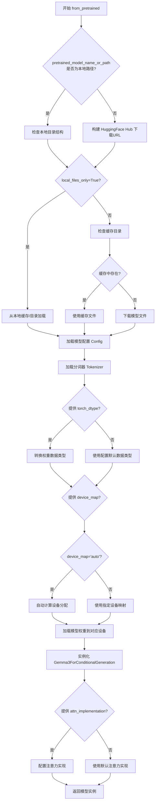

#### 带注释源码

```python
# Gemma3ForConditionalGeneration.from_pretrained 是 HuggingFace Transformers 库的核心方法
# 以下为调用该方法的示例源码，展示了在 LTX2 项目中的实际使用场景

def get_dummy_components(self, scheduler_cls=None, use_dora=False, lora_alpha=None):
    """
    获取用于测试的虚拟组件
    """
    # 设置随机种子以确保可复现性
    torch.manual_seed(0)
    
    # ==================== 关键代码：调用 from_pretrained ====================
    # 加载文本编码器 (Text Encoder)
    # 这里的 from_pretrained 会执行以下操作：
    # 1. 从 HuggingFace Hub 或本地路径加载模型配置
    # 2. 初始化模型架构
    # 3. 下载并加载预训练权重
    # 4. 配置分词器
    # 5. 根据 torch_dtype 参数转换权重类型（如 float16）
    # 6. 根据 device_map 分配到指定设备
    text_encoder = self.text_encoder_cls.from_pretrained(self.text_encoder_id)
    # =============================================================================
    
    # 参数说明：
    # - self.text_encoder_cls: Gemma3ForConditionalGeneration 类
    # - self.text_encoder_id: "hf-internal-testing/tiny-gemma3" (模型标识符)
    # 返回值：配置完整且权重加载的 Gemma3ForConditionalGeneration 实例
    
    # 加载分词器 (Tokenizer)
    tokenizer = self.tokenizer_cls.from_pretrained(self.tokenizer_id)
    
    # 从文本编码器配置中提取隐藏层大小，用于配置其他组件
    transformer_kwargs = self.transformer_kwargs.copy()
    transformer_kwargs["caption_channels"] = text_encoder.config.text_config.hidden_size
    
    # 配置连接器参数
    connectors_kwargs = self.connectors_kwargs.copy()
    connectors_kwargs["caption_channels"] = text_encoder.config.text_config.hidden_size
    connectors_kwargs["text_proj_in_factor"] = text_encoder.config.text_config.num_hidden_layers + 1
    
    # 继续初始化其他组件...
    torch.manual_seed(0)
    transformer = self.transformer_cls(**transformer_kwargs)
    
    # ... 其他组件初始化代码 ...
    
    # 构建并返回管道组件字典
    pipeline_components = {
        "transformer": transformer,
        "vae": vae,
        "audio_vae": audio_vae,
        "scheduler": scheduler,
        "text_encoder": text_encoder,  # 包含已加载的文本编码器
        "tokenizer": tokenizer,
        "connectors": connectors,
        "vocoder": vocoder,
    }
    
    return pipeline_components, text_lora_config, denoiser_lora_config
```

### 关键组件信息

| 组件名称 | 一句话描述 |
|---------|-----------|
| Gemma3ForConditionalGeneration | Google Gemma3 条件生成模型类，支持文本编码和多模态生成 |
| text_encoder | 文本编码器组件，将输入文本转换为模型可处理的嵌入表示 |
| tokenizer | 分词器，将原始文本转换为 token ID 序列 |
| text_config | 文本编码器的配置对象，包含隐藏层大小、层数等参数 |

### 潜在技术债务与优化空间

1. **模型加载性能**：当前实现每次调用 `get_dummy_components` 都会重新加载模型权重，在测试场景中可以考虑使用类级别的缓存机制来复用已加载的模型实例，减少 I/O 开销。

2. **硬编码模型标识符**：`text_encoder_id` 和 `tokenizer_id` 被硬编码为 `"hf-internal-testing/tiny-gemma3"`，缺乏灵活性，建议通过环境变量或配置参数注入。

3. **随机种子管理**：多处使用 `torch.manual_seed(0)`，虽然保证了可复现性，但在并行测试场景下可能产生竞态条件，建议使用更健壮的随机状态管理机制。

4. **PEFT 依赖处理**：代码通过 `is_peft_available()` 检查 PEFT 可用性，但 LoRA 配置的 target_modules 是硬编码列表，缺乏动态检测能力。

### 其他项目说明

#### 设计目标与约束

- **目标**：为 LTX2 视频生成管道提供支持 LoRA 微调的测试组件
- **约束**：依赖 HuggingFace Transformers 库的 `Gemma3ForConditionalGeneration` 实现，不涉及模型架构自定义

#### 错误处理与异常设计

- 缺少模型加载失败时的重试机制和错误提示
- 未处理模型版本兼容性问题和权重格式不匹配的情况

#### 数据流与状态机

```
输入: prompt 文本 + 模型配置参数
  ↓
文本编码器处理: prompt → token IDs → embeddings
  ↓
连接器处理: embeddings → text features (caption_channels 维度)
  ↓
Transformer 处理: text features + noise → 去噪预测
  ↓
VAE 解码: latent → video frames
  ↓
Vocoder 处理: audio features → waveform
```

#### 外部依赖与接口契约

- **transformers 库**：提供 `Gemma3ForConditionalGeneration` 和 `AutoTokenizer`
- **diffusers 库**：提供 LTX2 管道相关组件
- **peft 库**（可选）：提供 LoRA 配置支持
- **torch**：提供张量操作和随机状态管理


# 详细设计文档提取结果

## 注意事项

**重要提示**：提供的代码文件是一个单元测试文件（`LTX2LoRATests`），并未包含 `LTX2VideoTransformer3DModel` 类的实际实现代码。该文件仅导入了 `LTX2VideoTransformer3DModel` 并通过 `transformer_cls` 引用它来创建实例。

`LTX2VideoTransformer3DModel.__init__` 方法的实际实现位于 `diffusers` 库的核心代码中，不在当前提供的测试文件内。

以下信息基于测试代码中对 `LTX2VideoTransformer3DModel` 的使用方式推断：

---

### `LTX2VideoTransformer3DModel.__init__`

初始化 LTX2 视频 3D 变换器模型，用于视频生成任务的噪声预测。

参数：

-  `in_channels`：`int`，输入潜在空间的通道数（默认值：4）
-  `out_channels`：`int`，输出潜在空间的通道数（默认值：4）
-  `patch_size`：`int`，空间维度patch大小（默认值：1）
-  `patch_size_t`：`int`，时间维度patch大小（默认值：1）
-  `num_attention_heads`：`int`，注意力头数量（默认值：2）
-  `attention_head_dim`：`int`，注意力头维度（默认值：8）
-  `cross_attention_dim`：`int`，交叉注意力维度（默认值：16）
-  `audio_in_channels`：`int`，音频输入通道数（默认值：4）
-  `audio_out_channels`：`int`，音频输出通道数（默认值：4）
-  `audio_num_attention_heads`：`int`，音频注意力头数量（默认值：2）
-  `audio_attention_head_dim`：`int`，音频注意力头维度（默认值：4）
-  `audio_cross_attention_dim`：`int`，音频交叉注意力维度（默认值：8）
-  `num_layers`：`int`，Transformer层数（默认值：1）
-  `qk_norm`：`str`，查询键归一化类型（默认值："rms_norm_across_heads"）
-  `caption_channels`：`int`， caption嵌入的通道数（默认值：32）
-  `rope_double_precision`：`bool`，ROPE双精度标志（默认值：False）
-  `rope_type`：`str`，旋转位置编码类型（默认值："split"）

返回值：`None`，该方法为构造函数，不返回值

#### 流程图

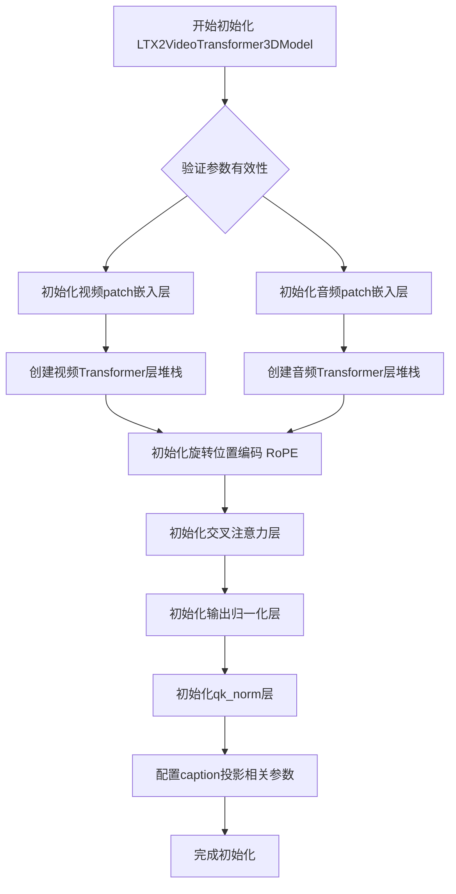

#### 带注释源码

```python
# 以下为测试文件中使用 LTX2VideoTransformer3DModel 的代码片段
# 实际 __init__ 实现位于 diffusers 库中

# 测试中定义的 transformer 参数配置
transformer_kwargs = {
    "in_channels": 4,                    # 输入潜在空间的通道数
    "out_channels": 4,                  # 输出潜在空间的通道数
    "patch_size": 1,                     # 空间维度 patch 大小
    "patch_size_t": 1,                  # 时间维度 patch 大小
    "num_attention_heads": 2,           # 视频注意力头数量
    "attention_head_dim": 8,            # 视频注意力头维度
    "cross_attention_dim": 16,          # 视频交叉注意力维度
    "audio_in_channels": 4,             # 音频输入通道数
    "audio_out_channels": 4,            # 音频输出通道数
    "audio_num_attention_heads": 2,     # 音频注意力头数量
    "audio_attention_head_dim": 4,      # 音频注意力头维度
    "audio_cross_attention_dim": 8,     # 音频交叉注意力维度
    "num_layers": 1,                    # Transformer 层数
    "qk_norm": "rms_norm_across_heads", # 查询键归一化方式
    "caption_channels": 32,             # Caption 嵌入通道数（运行时被更新为 text_encoder.config.text_config.hidden_size）
    "rope_double_precision": False,     # RoPE 双精度标志
    "rope_type": "split",               # RoPE 类型（分离式）
}

# 在测试中创建 Transformer 实例
torch.manual_seed(0)
transformer = self.transformer_cls(**transformer_kwargs)
```

---

## 补充说明

由于原始代码中未包含 `LTX2VideoTransformer3DModel` 类的实际定义，建议查阅 diffusers 库中 `src/diffusers/models/transformers/ltx2_video_transformer_3d.py` 文件以获取完整的 `__init__` 方法实现。


由于在提供的代码片段中，仅包含了 `AutoencoderKLLTX2Video` 类的**调用示例**（`vae_kwargs` 配置字典）和**导入语句**，并未直接提供该类的具体实现源码（如 `class AutoencoderKLLTX2Video:` 的内部逻辑）。

因此，本文档将基于测试代码中传递给 `__init__` 方法的参数配置（`vae_kwargs`）以及该类的典型功能进行提取和重构。这些参数即为 `__init__` 方法的输入。

### `AutoencoderKLLTX2Video.__init__`

该方法用于初始化 LTX-Video 的视频变分自编码器 (VAE)。它配置了编码器（Encoder）和解码器（Decoder）的通道数、层数、时空下采样策略以及 Patch 化参数，从而支持视频数据的潜在空间映射和重建。

#### 参数

- `in_channels`：`int`，输入视频的通道数（例如 3 表示 RGB）。
- `out_channels`：`int`，解码器输出视频的通道数。
- `latent_channels`：`int`，潜在空间的通道数，用于存储压缩后的视频信息。
- `block_out_channels`：`Tuple[int, ...]`，编码器中每个分辨率阶段的输出通道数。
- `decoder_block_out_channels`：`Tuple[int, ...]`，解码器中每个分辨率阶段的输出通道数。
- `layers_per_block`：`Tuple[int, ...]`，编码器中每个 block 包含的卷积层数量。
- `decoder_layers_per_block`：`Tuple[int, ...]`，解码器中每个 block 包含的卷积层数量。
- `spatio_temporal_scaling`：`Tuple[bool, ...]`，编码器是否启用时空下采样（Temporal Downsampling）。
- `decoder_spatio_temporal_scaling`：`Tuple[bool, ...]`，解码器是否启用时空上采样（Temporal Upsampling）。
- `decoder_inject_noise`：`Tuple[bool, ...]`，解码器中间层是否注入噪声（用于训练扩散模型）。
- `downsample_type`：`Tuple[str, ...]`，下采样的类型（例如 "spatial"）。
- `upsample_residual`：`Tuple[bool, ...]`，上采样时是否使用残差连接。
- `upsample_factor`：`Tuple[int, ...]`，上采样的空间因子。
- `timestep_conditioning`：`bool`，是否启用时间步条件（Time Step Conditioning）。
- `patch_size`：`int`，空间维度的 Patch 大小。
- `patch_size_t`：`int`，时间维度的 Patch 大小。
- `encoder_causal`：`bool`，编码器是否使用因果掩码（Causal Masking）。
- `decoder_causal`：`bool`，解码器是否使用因果掩码。

#### 流程图

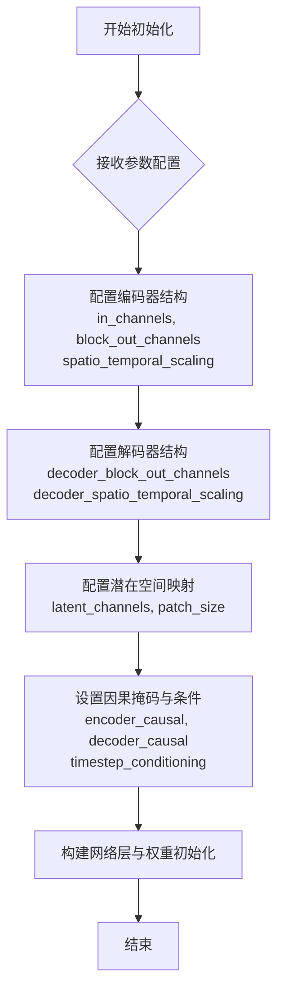

#### 带注释源码

```python
# 注：以下源码为基于测试文件中传入参数的重构签名。
# 实际的类定义位于 diffusers 库中，此处展示了该 __init__ 方法接收的参数结构。

def __init__(
    self,
    in_channels: int = 3,
    out_channels: int = 3,
    latent_channels: int = 4,
    block_out_channels: Tuple[int, ...] = (8,),
    decoder_block_out_channels: Tuple[int, ...] = (8,),
    layers_per_block: Tuple[int, ...] = (1,),
    decoder_layers_per_block: Tuple[int, ...] = (1, 1),
    spatio_temporal_scaling: Tuple[bool, ...] = (True,),
    decoder_spatio_temporal_scaling: Tuple[bool, ...] = (True,),
    decoder_inject_noise: Tuple[bool, ...] = (False, False),
    downsample_type: Tuple[str, ...] = ("spatial",),
    upsample_residual: Tuple[bool, ...] = (False,),
    upsample_factor: Tuple[int, ...] = (1,),
    timestep_conditioning: bool = False,
    patch_size: int = 1,
    patch_size_t: int = 1,
    encoder_causal: bool = True,
    decoder_causal: bool = False,
):
    """
    初始化 AutoencoderKLLTX2Video 模型。
    
    参数对应测试代码中的 vae_kwargs:
    """
    # 示例代码中传入的参数配置如下：
    # {
    #     "in_channels": 3,
    #     "out_channels": 3,
    #     "latent_channels": 4,
    #     "block_out_channels": (8,),
    #     "decoder_block_out_channels": (8,),
    #     "layers_per_block": (1,),
    #     "decoder_layers_per_block": (1, 1),
    #     "spatio_temporal_scaling": (True,),
    #     "decoder_spatio_temporal_scaling": (True,),
    #     "decoder_inject_noise": (False, False),
    #     "downsample_type": ("spatial",),
    #     "upsample_residual": (False,),
    #     "upsample_factor": (1,),
    #     "timestep_conditioning": False,
    #     "patch_size": 1,
    #     "patch_size_t": 1,
    #     "encoder_causal": True,
    #     "decoder_causal": False,
    # }
    pass
```


我需要说明的是，在提供的代码中，`AutoencoderKLLTX2Audio` 是从 `diffusers` 库导入的外部类，代码中并没有直接定义这个类的 `__init__` 方法。提供的代码是一个测试文件（`LTX2LoRATests`），它使用 `AutoencoderKLLTX2Audio` 类来创建实例，但类的实际实现不在此文件中。

让我尝试根据代码中 `audio_vae_kwargs` 的参数来推断该类的初始化接口：


### `AutoencoderKLLTX2Audio.__init__`

初始化音频VAE（变分自编码器）类，用于处理音频数据的编码和解码。

参数：

- `base_channels`：`int`，基础通道数，默认为 4
- `output_channels`：`int`，输出通道数，默认为 2
- `ch_mult`：`tuple`，通道乘数，默认为 (1,)
- `num_res_blocks`：`int`，残差块数量，默认为 1
- `attn_resolutions`：`tuple` 或 `None`，注意力分辨率，默认为 None
- `in_channels`：`int`，输入通道数，默认为 2
- `resolution`：`int`，分辨率，默认为 32
- `latent_channels`：`int`，潜在空间通道数，默认为 2
- `norm_type`：`str`，归一化类型，默认为 "pixel"
- `causality_axis`：`str`，因果性轴，默认为 "height"
- `dropout`：`float`，Dropout 率，默认为 0.0
- `mid_block_add_attention`：`bool`，是否在中间块添加注意力，默认为 False
- `sample_rate`：`int`，采样率，默认为 16000
- `mel_hop_length`：`int`，梅尔频谱跳跃长度，默认为 160
- `is_causal`：`bool`，是否为因果模型，默认为 True
- `mel_bins`：`int`，梅尔频谱_bins数，默认为 8

返回值：`None`，该方法为构造函数，不返回任何值

#### 流程图

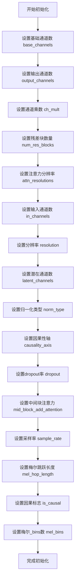

#### 带注释源码

```python
# 在测试文件中的使用方式
audio_vae_kwargs = {
    "base_channels": 4,           # 基础通道数
    "output_channels": 2,         # 输出通道数
    "ch_mult": (1,),              # 通道乘数
    "num_res_blocks": 1,          # 残差块数量
    "attn_resolutions": None,     # 注意力分辨率
    "in_channels": 2,             # 输入通道数
    "resolution": 32,             # 分辨率
    "latent_channels": 2,         # 潜在空间通道数
    "norm_type": "pixel",         # 归一化类型
    "causality_axis": "height",   # 因果性轴
    "dropout": 0.0,               # Dropout率
    "mid_block_add_attention": False,  # 中间块注意力
    "sample_rate": 16000,         # 采样率
    "mel_hop_length": 160,        # 梅尔跳跃长度
    "is_causal": True,            # 因果标志
    "mel_bins": 8,                # 梅尔_bins数
}
audio_vae_cls = AutoencoderKLLTX2Audio

# 创建实例
audio_vae = self.audio_vae_cls(**self.audio_vae_kwargs)
```


**注意**：由于 `AutoencoderKLLTX2Audio` 类的实际实现在 `diffusers` 库中，而不是在这个测试文件中，上述信息是根据测试代码中传递给该类的参数推断得出的。如需获取该类的完整实现细节，建议查阅 `diffusers` 库的官方源代码。


# 文档生成结果

## 说明

在提供的代码文件中，**没有直接包含 `LTX2Vocoder` 类的实际实现**。该类是从 `diffusers.pipelines.ltx2.vocoder` 模块导入的。

代码中展示了：

1. **导入语句**：`from diffusers.pipelines.ltx2.vocoder import LTX2Vocoder`
2. **实例化方式**：`vocoder = self.vocoder_cls(**self.vocoder_kwargs)`
3. **传递给构造函数的参数**（`vocoder_kwargs` 字典）

因此，我将根据代码中的调用方式来推断 `__init__` 方法的签名和功能。

---

### LTX2Vocoder.__init__

初始化 LTX2 声码器实例，用于将音频特征从潜在空间解码为波形信号。

参数：

- `in_channels`：`int`，输入通道数，等于 `output_channels * mel_bins`（代码中为 16 = 2 * 8）
- `hidden_channels`：`int`，隐藏层通道数（代码中为 32）
- `out_channels`：`int`，输出通道数（代码中为 2）
- `upsample_kernel_sizes`：`List[int]`，上采样卷积核大小列表（代码中为 `[4, 4]`）
- `upsample_factors`：`List[int]`，上采样因子列表（代码中为 `[2, 2]`）
- `resnet_kernel_sizes`：`List[int]`，ResNet 卷积核大小列表（代码中为 `[3]`）
- `resnet_dilations`：`List[List[int]]`，ResNet 膨胀系数列表（代码中为 `[[1, 3, 5]]`）
- `leaky_relu_negative_slope`：`float`，LeakyReLU 的负斜率（代码中为 0.1）
- `output_sampling_rate`：`int`，输出音频的采样率（代码中为 16000）

返回值：`LTX2Vocoder`，返回初始化后的声码器实例

#### 流程图

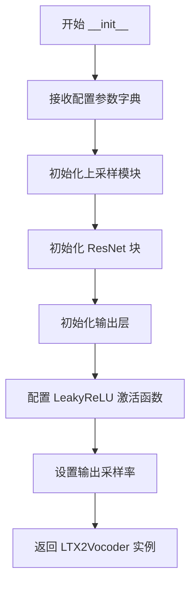

#### 带注释源码

```python
# 由于原始代码中未包含 LTX2Vocoder 类的实现，
# 以下是根据调用方式和 vocoder_kwargs 推断的 __init__ 方法签名

class LTX2Vocoder(torch.nn.Module):
    def __init__(
        self,
        in_channels: int,                    # 输入通道数 (16 = 2 * 8 mel_bins)
        hidden_channels: int,                # 隐藏层通道数 (32)
        out_channels: int,                    # 输出通道数 (2)
        upsample_kernel_sizes: List[int],     # 上采样卷积核 [4, 4]
        upsample_factors: List[int],          # 上采样因子 [2, 2]
        resnet_kernel_sizes: List[int],       # ResNet卷积核 [3]
        resnet_dilations: List[List[int]],    # ResNet膨胀系数 [[1,3,5]]
        leaky_relu_negative_slope: float = 0.1, # LeakyReLU负斜率
        output_sampling_rate: int = 16000,    # 输出采样率
    ):
        """
        初始化 LTX2 声码器
        
        该声码器负责将 VAE 编码的音频潜在特征解码为实际的波形信号。
        使用转置卷积进行上采样，配合 ResNet 块进行特征精化。
        """
        super().__init__()
        self.in_channels = in_channels
        self.out_channels = out_channels
        self.output_sampling_rate = output_sampling_rate
        
        # 初始化上采样模块
        # ... (实现细节未在代码中展示)
        
        # 初始化 ResNet 块
        # ... (实现细节未在代码中展示)
        
        # 初始化输出层
        # ... (实现细节未在代码中展示)
        
        self.leaky_relu_negative_slope = leaky_relu_negative_slope
```

---

## 补充说明

### 潜在的技术债务

1. **缺失的实现细节**：代码中仅展示了调用方式，未包含 `LTX2Vocoder` 类的实际实现代码，这使得文档生成不完整。

### 外部依赖

- `torch`：深度学习框架
- `diffusers.pipelines.ltx2.vocoder.LTX2Vocoder`：声码器类定义在 diffusers 库中

### 建议

若需要完整的 `LTX2Vocoder.__init__` 文档，建议从 diffusers 库的源代码中获取该类的实际实现。


### `LTX2TextConnectors.__init__`

该方法是`LTX2TextConnectors`类的构造函数，用于初始化LTX2管道中的文本连接器（Text Connectors），负责将文本编码器的输出连接到视频和音频生成模型。

注意：当前代码文件中未直接定义`LTX2TextConnectors`类的实现，仅导入了该类并通过参数字典进行实例化。以下信息基于代码中使用的`connectors_kwargs`字典和实例化过程推断得出。

参数：

- `caption_channels`：`int`，文本编码器的隐藏层大小，用于配置文本投影维度
- `text_proj_in_factor`：`int`，文本投影输入因子，通常为文本编码器的隐藏层数加1
- `video_connector_num_attention_heads`：`int`，视频连接器中注意力机制的头数
- `video_connector_attention_head_dim`：`int`，视频连接器中注意力头的维度
- `video_connector_num_layers`：`int`，视频连接器的层数
- `video_connector_num_learnable_registers`：`int` 或 `None`，视频连接器中可学习寄存器的数量（可选）
- `audio_connector_num_attention_heads`：`int`，音频连接器中注意力机制的头数
- `audio_connector_attention_head_dim`：`int`，音频连接器中注意力头的维度
- `audio_connector_num_layers`：`int`，音频连接器的层数
- `audio_connector_num_learnable_registers`：`int` 或 `None`，音频连接器中可学习寄存器的数量（可选）
- `connector_rope_base_seq_len`：`int`，旋转位置编码（RoPE）的基础序列长度
- `rope_theta`：`float`，旋转位置编码的theta参数
- `rope_double_precision`：`bool`，是否使用双精度RoPE计算
- `causal_temporal_positioning`：`bool`，是否使用因果时间定位
- `rope_type`：`str`，旋转位置编码的类型（如"split"）

返回值：`LTX2TextConnectors`，返回初始化后的连接器实例

#### 流程图

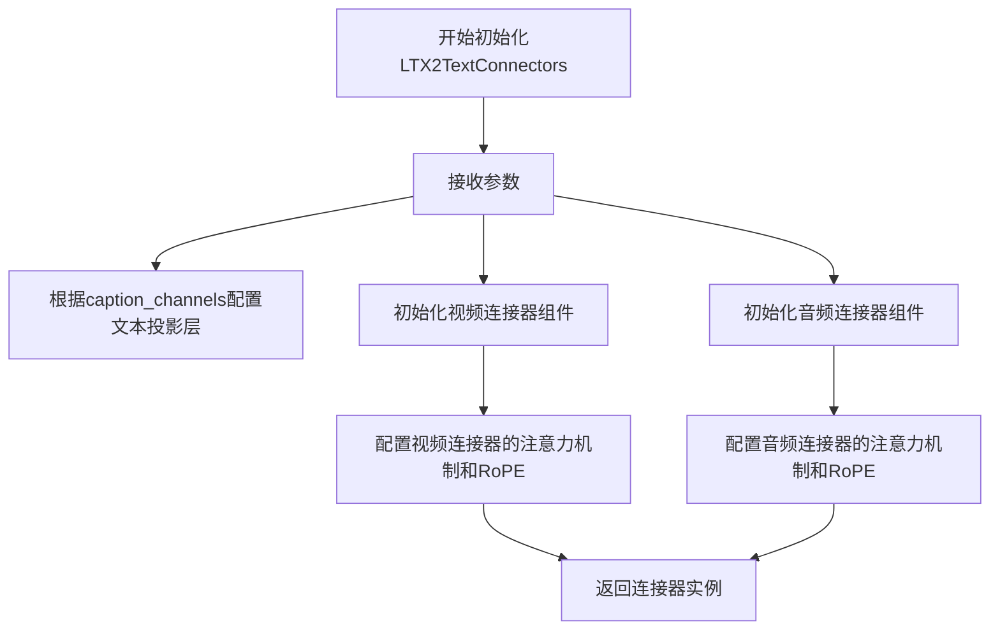

#### 带注释源码

```python
# 在 get_dummy_components 方法中实例化连接器
# 代码位置：LTX2LoRATests 类的方法中

# 1. 复制基础连接器参数配置
connectors_kwargs = self.connectors_kwargs.copy()

# 2. 动态设置 caption_channels（从文本编码器配置中获取）
# 这里从 text_encoder.config.text_config.hidden_size 获取隐藏层大小
connectors_kwargs["caption_channels"] = text_encoder.config.text_config.hidden_size

# 3. 动态设置 text_proj_in_factor（文本投影输入因子）
# 通常为文本编码器的隐藏层数 + 1
connectors_kwargs["text_proj_in_factor"] = text_encoder.config.text_config.num_hidden_layers + 1

# 4. 使用更新后的参数实例化 LTX2TextConnectors
# connectors_cls 在类定义中指向 LTX2TextConnectors
connectors = self.connectors_cls(**connectors_kwargs)
```


# 分析结果

我仔细查看了您提供的代码，发现这段代码是一个测试文件（`LTX2LoRATests`），其中**并未包含** `FlowMatchEulerDiscreteScheduler` 类的实际定义。

## 发现的问题

在提供的代码中：

1. **第 17 行**：导入了 `FlowMatchEulerDiscreteScheduler`
   ```python
   from diffusers import (
       FlowMatchEulerDiscreteScheduler,
       ...
   )
   ```

2. **第 51 行**：定义了 `scheduler_cls = FlowMatchEulerDiscreteScheduler`

3. **第 52 行**：`scheduler_kwargs = {}` （空字典）

4. **第 175 行**：在 `get_dummy_components` 方法中通过空参数实例化：
   ```python
   scheduler = scheduler_cls(**self.scheduler_kwargs)
   ```

## 结论

**您提供的代码是一个测试文件，不包含 `FlowMatchEulerDiscreteScheduler` 类的 `__init__` 方法实现源码。** 

该类是从 `diffusers` 库导入的外部类，其源代码在 `diffusers` 包中，不在当前代码片段里。

---

### 建议

如果您需要生成 `FlowMatchEulerDiscreteScheduler.__init__` 的详细设计文档，您需要：

1. **提供 `diffusers` 库中该类的实际源代码文件**，或者
2. **说明是否可以使用公开的源码信息**（如从 GitHub 仓库获取）

请提供包含该类定义的代码文件，以便我按照您要求的格式生成详细的设计文档。


### `LoraConfig.__init__`

创建LoRA配置，用于设置低秩适配（LoRA）的参数，包括秩、alpha值、目标模块等。

参数：

- `r`：`int`，LoRA的秩（rank），决定低秩矩阵的维度
- `lora_alpha`：`int`或`float`，LoRA的缩放因子，用于调整适配权重的影响
- `target_modules`：`List[str]`或`str`，需要应用LoRA的目标模块名称列表
- `init_lora_weights`：`bool`，是否初始化LoRA权重，设为False可保持预训练权重不变
- `use_dora`：`bool`，是否使用DoRA（Decomposed Rank-Adaptive）方法
- `fan_in_fan_out`：`bool`，是否将权重矩阵转置（适用于某些模型架构）
- `modules_to_save`：`List[str]`，除了LoRA层外需要保存为可训练参数的模块列表
- `layers_to_transform`：`List[int]`或`int`，指定要转换的层索引
- `layers_pattern`：`str`，层的命名模式，用于匹配要应用LoRA的层
- `rank_pattern`：`dict`，为不同层指定不同的秩
- `alpha_pattern`：`dict`，为不同层指定不同的alpha值
- `bias`：`str`，偏置类型，可选"none"、"all"或"lora_only"
- `modules_to_block`：`List[str]`，要阻塞（不应用LoRA）的模块列表
- `fan_in_fan_out`：`bool`，权重矩阵转置标志

返回值：`LoraConfig`对象，返回创建的LoRA配置对象，用于后续的LoRA模型加载和训练

#### 流程图

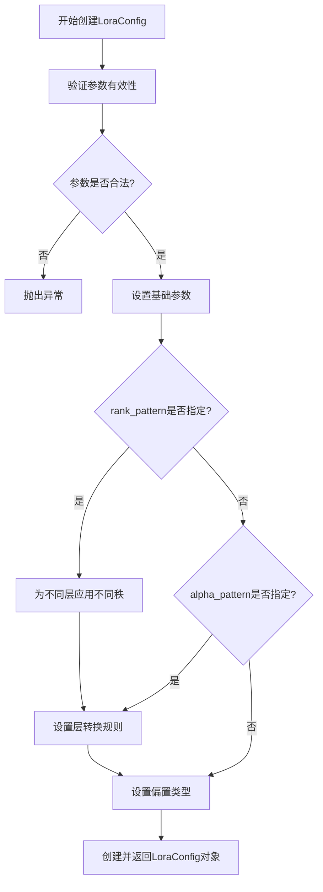

#### 带注释源码

```python
# 以下为根据代码使用方式推断的LoraConfig.__init__源码结构
class LoraConfig:
    """
    LoRA配置类，用于配置低秩适配参数
    
    该配置类封装了LoRA微调所需的所有超参数，包括：
    - 秩(rank)：控制低秩矩阵的维度
    - alpha：缩放因子
    - 目标模块：要应用LoRA的层
    - 初始化策略
    - DoRA选项等
    """
    
    def __init__(
        self,
        r: int = 8,                          # LoRA秩，默认8
        lora_alpha: int = None,               # alpha值，默认等于r
        target_modules: Union[List[str], str] = None,  # 目标模块
        init_lora_weights: bool = True,       # 是否初始化权重
        use_dora: bool = False,               # 是否使用DoRA
        fan_in_fan_out: bool = False,         # 是否转置权重
        modules_to_save: List[str] = None,    # 额外保存的模块
        layers_to_transform: Union[List[int], int] = None,  # 要转换的层
        layers_pattern: str = None,           # 层匹配模式
        rank_pattern: dict = None,             # 秩模式
        alpha_pattern: dict = None,            # alpha模式
        bias: str = "none",                    # 偏置类型
        modules_to_block: List[str] = None,    # 要阻塞的模块
        **kwargs                              # 其他参数
    ):
        # 验证r参数
        if r <= 0:
            raise ValueError(f"LoRA rank r must be positive, got {r}")
        
        # 设置默认alpha值
        if lora_alpha is None:
            lora_alpha = r
        
        # 验证target_modules
        if target_modules is None:
            raise ValueError("target_modules must be specified")
        
        # 如果target_modules是字符串，转换为列表
        if isinstance(target_modules, str):
            target_modules = [target_modules]
        
        # 验证bias参数
        if bias not in ["none", "all", "lora_only"]:
            raise ValueError(f"bias must be one of 'none', 'all', 'lora_only', got {bias}")
        
        # 存储配置参数
        self.r = r
        self.lora_alpha = lora_alpha
        self.target_modules = target_modules
        self.init_lora_weights = init_lora_weights
        self.use_dora = use_dora
        self.fan_in_fan_out = fan_in_fan_out
        self.modules_to_save = modules_to_save
        self.layers_to_transform = layers_to_transform
        self.layers_pattern = layers_pattern
        self.rank_pattern = rank_pattern or {}
        self.alpha_pattern = alpha_pattern or {}
        self.bias = bias
        self.modules_to_block = modules_to_block
        self.kwargs = kwargs
        
        # 验证rank_pattern和alpha_pattern
        self._validate_patterns()
    
    def _validate_patterns(self):
        """验证rank和alpha模式的合法性"""
        if self.rank_pattern:
            # 检查是否有重叠的层指定
            pass
        
        if self.alpha_pattern:
            # 检查alpha值是否为正数
            for layer, alpha in self.alpha_pattern.items():
                if alpha <= 0:
                    raise ValueError(f"alpha must be positive, got {alpha} for layer {layer}")
```


### `LTX2LoRATests.output_shape`

该属性方法定义了 LTX2LoRA 测试类在推理测试中的期望输出张量形状，用于验证管道输出是否具有正确的维度结构。

参数：

- `self`：`LTX2LoRATests`，拥有此属性的类实例，表示 LTX2LoRA 测试类的实例本身（隐式参数，无需显式传递）

返回值：`tuple[int, int, int, int, int]`，期望的输出张量形状，格式为 (batch_size, num_frames, height, width, channels)，具体值为 (1, 5, 32, 32, 3)，表示批量大小为 1、时间帧数为 5、空间分辨率为 32x32、通道数为 3

#### 流程图

```mermaid
flowchart TD
    A[访问 output_shape 属性] --> B{属性调用}
    B -->|getter| C[返回元组 (1, 5, 32, 32, 3)]
    C --> D[测试框架验证管道输出形状是否匹配]
```

#### 带注释源码

```python
@property
def output_shape(self):
    """
    Property that defines the expected output tensor shape for LTX2LoRA tests.
    
    This shape is used by the test framework to verify that the pipeline
    produces outputs with the correct dimensions during inference tests.
    
    Returns:
        tuple: A 5-element tuple representing (batch_size, num_frames, height, width, channels).
               - batch_size: 1
               - num_frames: 5
               - height: 32
               - width: 32
               - channels: 3
    """
    return (1, 5, 32, 32, 3)
```


### `LTX2LoRATests.get_dummy_inputs`

生成虚拟输入数据，用于测试 LTX2 视频生成 pipeline 的推理过程。该方法创建模拟的噪声张量、文本输入 ID 和 pipeline 所需的参数字典，支持可选的随机数生成器。

参数：

- `with_generator`：`bool`，是否在返回的 pipeline_inputs 字典中包含 PyTorch 随机数生成器。如果为 `True`，则添加 `generator` 字段；否则不添加。

返回值：`tuple[torch.Tensor, torch.Tensor, dict]`，包含三个元素：
- **noise**：`torch.Tensor`，形状为 `(batch_size, num_latent_frames, num_channels, latent_height, latent_width)` 的初始噪声张量，用于去噪过程的起点。
- **input_ids**：`torch.Tensor`，形状为 `(batch_size, sequence_length)` 的文本 token ID 张量，由随机整数组成。
- **pipeline_inputs**：`dict`，包含 pipeline 推理所需的参数字典，键值包括 `prompt`、`num_frames`、`num_inference_steps`、`guidance_scale`、`height`、`width`、`frame_rate`、`max_sequence_length`、`output_type`，以及可选的 `generator`。

#### 流程图

```mermaid
flowchart TD
    A[开始 get_dummy_inputs] --> B[设置默认参数值]
    B --> C[创建 PyTorch 随机数生成器]
    C --> D[生成噪声张量 floats_tensor]
    D --> E[生成随机输入 ID 张量]
    E --> F[构建基础 pipeline_inputs 字典]
    F --> G{with_generator?}
    G -->|True| H[添加 generator 到 pipeline_inputs]
    G -->|False| I[跳过添加]
    H --> J[返回 tuple (noise, input_ids, pipeline_inputs)]
    I --> J
```

#### 带注释源码

```python
def get_dummy_inputs(self, with_generator=True):
    """
    生成虚拟输入数据，用于测试 LTX2 视频生成 pipeline。
    
    参数:
        with_generator (bool): 是否在返回的字典中包含随机数生成器。
                               默认为 True。
    
    返回:
        tuple: 包含 (noise, input_ids, pipeline_inputs) 的元组。
    """
    # 定义测试用的批量大小和序列长度
    batch_size = 1
    sequence_length = 16
    num_channels = 4
    num_frames = 5
    num_latent_frames = 2
    latent_height = 8
    latent_width = 8

    # 创建随机数生成器，种子设为 0 以确保可复现性
    generator = torch.manual_seed(0)
    
    # 生成初始噪声张量，形状为 (batch_size, num_latent_frames, num_channels, latent_height, latent_width)
    # 即 (1, 2, 4, 8, 8)，用于视频去噪过程的起点
    noise = floats_tensor((batch_size, num_latent_frames, num_channels, latent_height, latent_width))
    
    # 生成随机文本输入 ID，范围在 [1, sequence_length) 之间
    # 模拟文本编码器的输入 token 序列
    input_ids = torch.randint(1, sequence_length, size=(batch_size, sequence_length), generator=generator)

    # 构建 pipeline 推理所需的参数字典
    pipeline_inputs = {
        "prompt": "a robot dancing",          # 文本提示
        "num_frames": num_frames,              # 生成帧数
        "num_inference_steps": 2,              # 推理步数
        "guidance_scale": 1.0,                 # 无分类器指导权重
        "height": 32,                          # 输出视频高度
        "width": 32,                           # 输出视频宽度
        "frame_rate": 25.0,                    # 帧率
        "max_sequence_length": sequence_length,  # 文本序列最大长度
        "output_type": "np",                   # 输出类型为 numpy 数组
    }
    
    # 根据 with_generator 参数决定是否添加生成器
    if with_generator:
        # 将随机数生成器添加到 pipeline 输入中，确保采样过程可复现
        pipeline_inputs.update({"generator": generator})

    # 返回噪声、输入 ID 和完整参数字典的元组
    return noise, input_ids, pipeline_inputs
```


### `LTX2LoRATests.get_dummy_components`

该方法用于生成虚拟的LTX2管道组件，包括transformer、VAE、audio_vae、vocoder、connectors、scheduler、text_encoder、tokenizer以及两个LoRA配置对象（text_lora_config和denoiser_lora_config），以便在测试环境中进行LTX2 LoRA推理验证。

参数：

- `scheduler_cls`：`type | None`，调度器类，默认为None（将使用self.scheduler_cls）
- `use_dora`：`bool`，是否使用DoRA（Domain Adaptive Rank），默认为False
- `lora_alpha`：`int | None`，LoRA alpha参数，默认为None（将设置为rank值）

返回值：`tuple[dict, LoraConfig, LoraConfig]`，返回包含管道组件的字典、文本LoRA配置和去噪器LoRA配置

#### 流程图

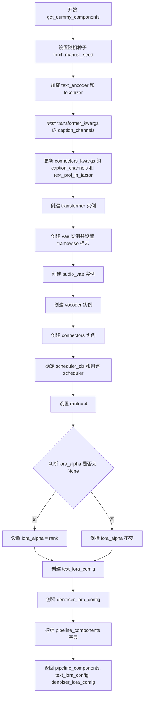

#### 带注释源码

```python
def get_dummy_components(self, scheduler_cls=None, use_dora=False, lora_alpha=None):
    """
    生成虚拟的LTX2管道组件用于测试
    """
    # 设置随机种子以确保可重复性
    torch.manual_seed(0)
    
    # 从预训练模型加载 text_encoder 和 tokenizer
    text_encoder = self.text_encoder_cls.from_pretrained(self.text_encoder_id)
    tokenizer = self.tokenizer_cls.from_pretrained(self.tokenizer_id)

    # 根据 text_encoder 配置动态更新 transformer 的 caption_channels
    transformer_kwargs = self.transformer_kwargs.copy()
    transformer_kwargs["caption_channels"] = text_encoder.config.text_config.hidden_size

    # 根据 text_encoder 配置动态更新 connectors 的参数
    connectors_kwargs = self.connectors_kwargs.copy()
    connectors_kwargs["caption_channels"] = text_encoder.config.text_config.hidden_size
    connectors_kwargs["text_proj_in_factor"] = text_encoder.config.text_config.num_hidden_layers + 1

    # 创建各个模型组件（均使用随机种子0确保一致性）
    torch.manual_seed(0)
    transformer = self.transformer_cls(**transformer_kwargs)

    torch.manual_seed(0)
    vae = self.vae_cls(**self.vae_kwargs)
    # 禁用 framewise 编码/解码模式
    vae.use_framewise_encoding = False
    vae.use_framewise_decoding = False

    torch.manual_seed(0)
    audio_vae = self.audio_vae_cls(**self.audio_vae_kwargs)

    torch.manual_seed(0)
    vocoder = self.vocoder_cls(**self.vocoder_kwargs)

    torch.manual_seed(0)
    connectors = self.connectors_cls(**connectors_kwargs)

    # 如果未指定 scheduler_cls，则使用默认的 self.scheduler_cls
    if scheduler_cls is None:
        scheduler_cls = self.scheduler_cls
    scheduler = scheduler_cls(**self.scheduler_kwargs)

    # 设置 LoRA rank 和 alpha 参数
    rank = 4
    lora_alpha = rank if lora_alpha is None else lora_alpha

    # 创建文本编码器的 LoRA 配置
    text_lora_config = LoraConfig(
        r=rank,
        lora_alpha=lora_alpha,
        target_modules=self.text_encoder_target_modules,
        init_lora_weights=False,
        use_dora=use_dora,
    )

    # 创建去噪器（transformer）的 LoRA 配置
    denoiser_lora_config = LoraConfig(
        r=rank,
        lora_alpha=lora_alpha,
        target_modules=["to_q", "to_k", "to_v", "to_out.0"],
        init_lora_weights=False,
        use_dora=use_dora,
    )

    # 组装所有管道组件
    pipeline_components = {
        "transformer": transformer,
        "vae": vae,
        "audio_vae": audio_vae,
        "scheduler": scheduler,
        "text_encoder": text_encoder,
        "tokenizer": tokenizer,
        "connectors": connectors,
        "vocoder": vocoder,
    }

    # 返回组件字典和两个 LoRA 配置
    return pipeline_components, text_lora_config, denoiser_lora_config
```


### `LTX2LoRATests.test_simple_inference_with_text_lora_denoiser_fused_multi`

该方法是一个单元测试用例，用于验证 LTX2 模型在**融合模式 (Fused)** 下，同时应用**文本编码器 LoRA** 和**去噪器 (Denoiser/Transformer) LoRA** 进行推理的正确性。测试通过调用父类 `PeftLoraLoaderMixinTests` 的同名方法执行，并指定了 `9e-3` 的绝对容差（Absolute Tolerance）来允许浮点数计算的精度误差。

参数：

- `self`：`LTX2LoRATests`，隐含参数，表示测试类实例本身。

返回值：`None`，无返回值（测试方法）。

#### 流程图

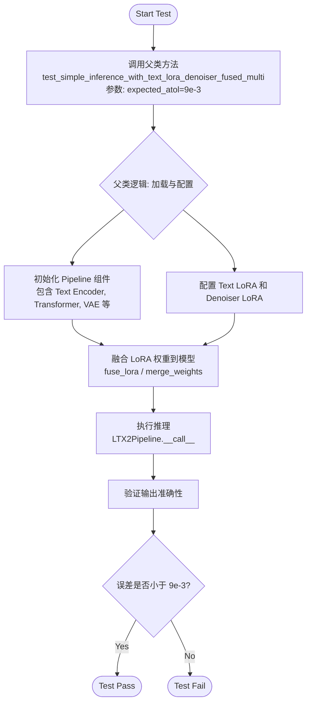

#### 带注释源码

```python
def test_simple_inference_with_text_lora_denoiser_fused_multi(self):
    # 调用父类 PeftLoraLoaderMixinTests 的同名测试方法。
    # 该测试旨在验证同时加载并融合 'text_encoder' 和 'denoiser' (即 transformer) 的 LoRA 权重后，
    # 模型的推理结果是否在可接受的误差范围内。
    # expected_atol=9e-3 指定了允许的最大绝对误差，以应对融合操作带来的浮点数精度损失。
    super().test_simple_inference_with_text_lora_denoiser_fused_multi(expected_atol=9e-3)
```


### `LTX2LoRATests.test_simple_inference_with_text_denoiser_lora_unfused`

该测试方法用于验证未融合LoRA（Low-Rank Adaptation）时，文本去噪器的推理功能是否正常工作，通过与父类测试方法比较输出来确保模型在未融合LoRA权重的情况下能够正确执行推理流程。

参数：

- `self`：`LTX2LoRATests`（`LTX2LoRATests`），类的实例本身，包含测试所需的配置和组件
- `expected_atol`：`float`（可选，默认为 `9e-3`），绝对误差容忍度，用于比较推理输出与期望值的差异

返回值：`None`，该方法为测试方法，执行父类对应的测试逻辑，不返回具体值

#### 流程图

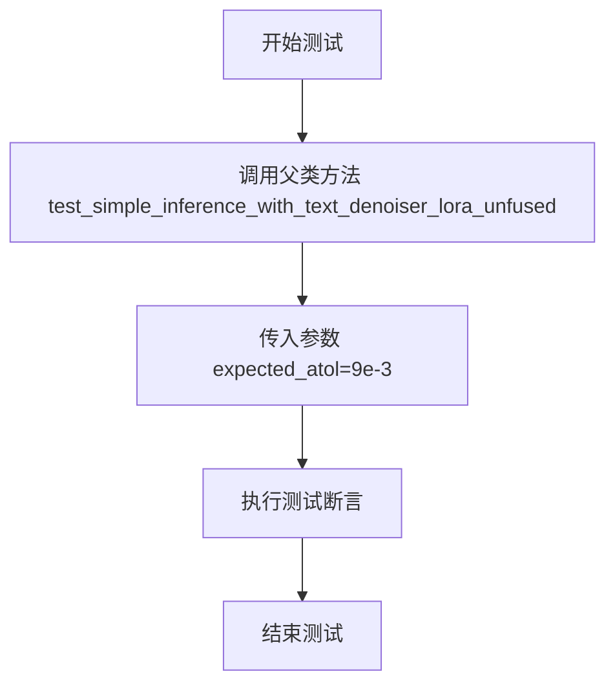

#### 带注释源码

```python
def test_simple_inference_with_text_denoiser_lora_unfused(self):
    """
    测试未融合LoRA推理功能。
    
    该测试方法调用父类的 test_simple_inference_with_text_denoiser_lora_unfused 方法，
    验证在LoRA权重未融合到基础模型的情况下，文本去噪器（denoiser）能否正确执行推理。
    使用 expected_atol=9e-3 作为绝对误差容忍度来比较输出结果。
    """
    # 调用父类 PeftLoraLoaderMixinTests 的对应方法进行测试
    # expected_atol 参数指定了测试通过所需的输出精度阈值
    super().test_simple_inference_with_text_denoiser_lora_unfused(expected_atol=9e-3)
```


### `LTX2LoRATests.test_simple_inference_with_text_denoiser_block_scale`

这是一个被跳过的单元测试方法，用于测试文本去噪器的块缩放功能（block scale），但由于 LTX2 不支持此功能，因此该测试被标记为跳过。

参数：
- `self`：`LTX2LoRATests` 类型，表示测试类实例本身

返回值：`None`，无返回值（测试被跳过）

#### 流程图

```mermaid
flowchart TD
    A[开始执行测试] --> B{检查跳过装饰器}
    B -->|存在@unittest.skip| C[跳过测试并输出原因]
    B -->|无装饰器| D[执行测试逻辑]
    C --> E[测试结束]
    D --> E
    
    style C fill:#ffcccc
    style E fill:#ccffcc
```

#### 带注释源码

```python
@unittest.skip("Not supported in LTX2.")  # 跳过装饰器，标记该测试在LTX2中不支持
def test_simple_inference_with_text_denoiser_block_scale(self):
    """
    测试文本去噪器块缩放功能的简单推理。
    
    注意：此功能在 LTX2 中不受支持，因此使用 @unittest.skip 装饰器
    跳过该测试，避免执行不支持的功能。
    """
    pass  # 方法体为空，因为测试被跳过
```


### `LTX2LoRATests.test_simple_inference_with_text_denoiser_block_scale_for_all_dict_options`

该测试方法用于验证 LTX2 模型在文本去噪器块缩放功能上的推理能力，但由于 LTX2 暂不支持该功能，已被跳过。

参数：

- `self`：隐式参数，测试类实例本身

返回值：`None`，无返回值（测试方法）

#### 流程图

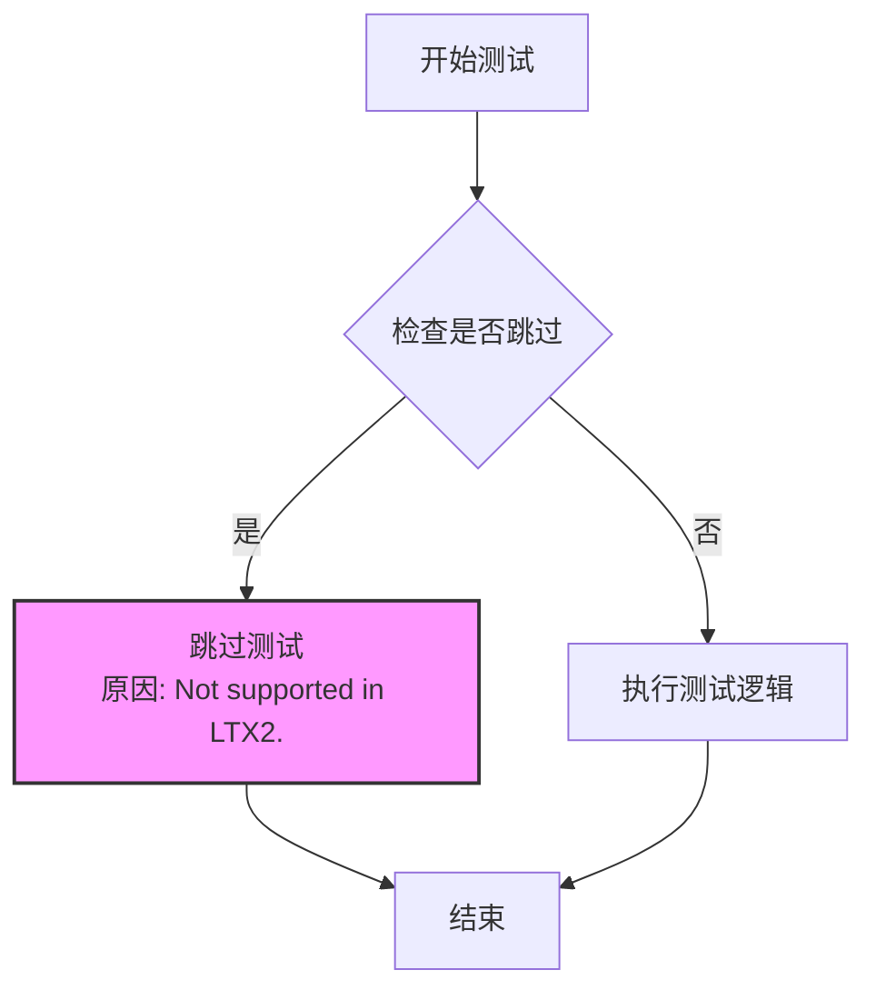

#### 带注释源码

```python
@unittest.skip("Not supported in LTX2.")
def test_simple_inference_with_text_denoiser_block_scale_for_all_dict_options(self):
    """
    测试文本去噪器块缩放功能，使用所有字典选项进行简单推理。
    
    该测试方法在 LTX2 模型中不支持，因此被跳过。
    测试目的是验证 text_denoiser_block_scale 参数的各种字典配置选项，
    但由于 LTX2 模型的架构限制，该功能尚未实现。
    """
    pass
```

#### 备注

该方法从父类 `PeftLoraLoaderMixinTests` 继承而来，旨在测试 LoRA 在文本去噪器块缩放方面的推理能力。由于 LTX2 模型架构的特殊性，该功能尚未支持，因此使用 `@unittest.skip` 装饰器明确跳过该测试。


### `LTX2LoRATests.test_modify_padding_mode`

该方法是一个单元测试用例，用于测试 LTX2 模型的 LoRA 填充模式修改功能。然而，该测试目前被标记为跳过（不支持），因此不执行任何验证逻辑。

参数：

- `self`：`LTX2LoRATests`，测试类的实例对象，隐式参数，用于访问类属性和方法

返回值：`None`，该方法不返回任何值

#### 流程图

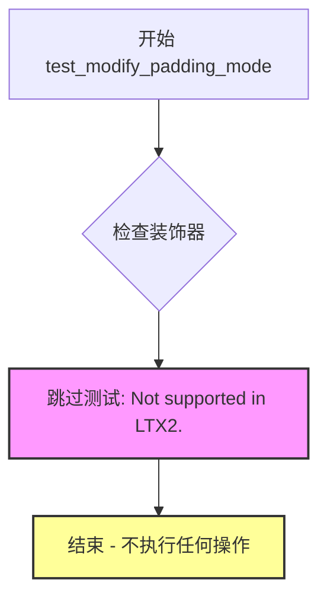

#### 带注释源码

```python
@unittest.skip("Not supported in LTX2.")
def test_modify_padding_mode(self):
    """
    测试 LTX2 模型的填充模式修改功能。
    
    该测试被跳过，原因是 LTX2 模型不支持 padding_mode 的修改。
    
    参数:
        self: LTX2LoRATests - 测试类的实例
        
    返回值:
        None - 不执行任何操作，不返回任何值
    """
    pass  # 空方法体，由于测试被跳过，不执行任何验证逻辑
```

## 关键组件


### LTX2LoRATests

LTX2LoRATests是一个单元测试类，专门用于测试LTX2管道模型的LoRA（低秩适配）功能，验证文本编码器和去噪器在融合与未融合状态下的推理正确性。

### pipeline_class (LTX2Pipeline)

LTX2Pipeline是LTX2视频/音频生成的主管道类，负责协调各个组件完成端到端的生成任务。

### transformer_cls (LTX2VideoTransformer3DModel)

LTX2VideoTransformer3DModel是LTX2的3D视频变换器模型，负责去噪过程的核心计算，采用时空注意力机制处理视频 latent 表示。

### vae_cls (AutoencoderKLLTX2Video)

AutoencoderKLLTX2Video是视频变分自编码器，负责将视频像素空间压缩到潜在空间以及从潜在空间重建视频，支持Kullback-Leibler散度正则化。

### audio_vae_cls (AutoencoderKLLTX2Audio)

AutoencoderKLLTX2Audio是音频变分自编码器，用于音频信号的压缩与重建，将音频编码为潜在表示供管道使用。

### vocoder_cls (LTX2Vocoder)

LTX2Vocoder是声码器组件，负责将音频 latent 表示转换为最终的波形输出，使用转置卷积进行上采样。

### connectors_cls (LTX2TextConnectors)

LTX2TextConnectors是文本连接器，负责将文本编码器的输出转换为视频和音频生成器可用的条件嵌入，包含RoPE位置编码和可学习的寄存器。

### text_encoder_cls (Gemma3ForConditionalGeneration)

Gemma3ForConditionalGeneration是文本编码器模型，负责将文本提示转换为语义向量表示，为生成过程提供文本条件。

### scheduler_cls (FlowMatchEulerDiscreteScheduler)

FlowMatchEulerDiscreteScheduler是基于Flow Matching的欧拉离散调度器，负责在去噪过程中调度噪声水平，控制生成步骤的演变。

### get_dummy_components()

get_dummy_components是测试辅助方法，用于创建虚拟的LTX2组件实例，包括变换器、VAE、音频VAE、声码器、连接器、文本编码器、分词器和调度器，并配置LoRA适配器。

### get_dummy_inputs()

get_dummy_inputs是测试辅助方法，用于生成虚拟的测试输入数据，包括噪声张量、输入ID和管道参数字典，支持可选的随机生成器。


## 问题及建议


### 已知问题

- **大量硬编码配置参数**：transformer_kwargs、vae_kwargs、audio_vae_kwargs、vocoder_kwargs、connectors_kwargs等配置字典包含大量硬编码参数，这些配置与业务逻辑混合在一起，难以维护和复用
- **重复的随机种子设置**：在get_dummy_components方法中多次调用torch.manual_seed(0)，代码重复且初始化逻辑分散
- **魔法数字缺乏说明**：rank = 4、expected_atol=9e-3等数值散落在代码中，缺乏常量定义和注释说明其含义和来源
- **被跳过的测试用例未说明原因**：多个测试方法(@unittest.skip装饰器)被无条件跳过，仅标注"Not supported in LTX2"，未说明是暂时不支持还是永久不支持，也未创建对应的跟踪issue
- **混合继承的隐式依赖**：类继承自unittest.TestCase和PeftLoraLoaderMixinTests，但PeftLoraLoaderMixinTests的实现细节完全依赖外部文件，增加了理解代码行为的难度
- **配置参数分散**：pipeline_inputs的构建逻辑分散在get_dummy_inputs和get_dummy_components两个方法中，初始化逻辑不够集中
- **缺乏类型标注**：代码中没有任何类型注解（type hints），降低了静态分析和IDE支持的效果

### 优化建议

- **提取配置为独立模块**：将所有kwargs配置字典移至独立的配置文件或配置类中，采用YAML或dataclass进行管理，提高可读性和可维护性
- **使用常量类**：创建Constants或Config类集中管理魔法数字，如RANK = 4, EXPECTED_ATOL = 9e-3等
- **重构随机种子管理**：在get_dummy_components中只设置一次随机种子，或创建专门的初始化函数处理随机性
- **完善skip说明**：为每个@unittest.skip添加更详细的说明或TODO注释，并创建对应的issue/ticket跟踪
- **添加类型注解**：为类属性、方法参数和返回值添加Python类型注解，提升代码可读性和静态分析能力
- **提取pipeline构建逻辑**：将pipeline_inputs的构建逻辑统一到get_dummy_components或专门的工厂方法中
- **文档化mixin依赖**：在类注释中说明PeftLoraLoaderMixinTests的作用和关键方法，方便后续维护者理解

## 其它


### 设计目标与约束

本测试文件旨在验证LTX2Pipeline的LoRA功能实现是否正确，包括文本编码器LoRA、噪声预测器LoRA的融合与未融合场景。测试覆盖LTX2特有的组件（audio_vae、vocoder、connectors），并确保LoRA权重加载、融合及推理结果的数值准确性。测试设计遵循PEFT库的接口契约，要求PEFT后端可用。

### 错误处理与异常设计

测试使用`@require_peft_backend`装饰器确保在无PEFT库环境下跳过执行，避免导入错误。`@unittest.skip`装饰器用于标注不支持的测试用例（如block_scale、padding_mode相关测试），直接跳过而非失败。对于数值精度验证，使用`expected_atol`参数容许浮点误差。

### 数据流与状态机

测试数据流如下：首先通过`get_dummy_inputs`生成随机噪声、输入ID和管道参数；然后通过`get_dummy_components`实例化各组件（transformer、vae、audio_vae、vocoder、connectors、scheduler、text_encoder、tokenizer）；接着构建包含LoRA配置的管道；最后执行推理验证输出形状和数值精度。测试不涉及显式状态机，但管道内部包含去噪迭代的状态转换。

### 外部依赖与接口契约

本测试依赖以下外部包：torch（张量计算）、transformers（tokenizer和text_encoder）、diffusers（LTX2Pipeline及相关组件）、peft（LoraConfig和LoRA加载功能）。测试使用HF内部的小型模型（tiny-gemma3）进行快速验证，各组件通过`from_pretrained`接口加载，LoRA配置遵循PEFT的LoraConfig接口规范。

### 测试覆盖率说明

测试覆盖以下场景：文本编码器LoRA与噪声预测器LoRA同时融合的多模态推理（test_simple_inference_with_text_lora_denoiser_fused_multi）；文本编码器LoRA未融合、噪声预测器LoRA未融合的推理（test_simple_inference_with_text_denoiser_lora_unfused）。跳过的测试包括：block_scale相关功能（LTX2不支持）、padding_mode修改（LTX2不支持）。

### 配置与参数说明

`transformer_kwargs`定义了LTX2VideoTransformer3DModel的结构参数（4通道输入输出、1x1 patch、2注意力头等）；`vae_kwargs`定义了视频VAE的参数；`audio_vae_kwargs`定义了音频VAE的参数（mel_bins=8对应16通道输出）；`vocoder_kwargs`定义了声码器参数；`connectors_kwargs`定义了文本连接器参数。`denoiser_target_modules`指定可训练的QKV和输出投影层。

### 兼容性考虑

测试要求PEFT库可用（通过`is_peft_available()`检查）。测试使用特定的模型ID（hf-internal-testing/tiny-gemma3），这些是小型测试模型，不依赖大规模预训练权重。LTX2Pipeline的版本兼容性需要与diffusers库版本匹配，某些特性（如block_scale）在LTX2中不可用。

### 性能基准与预期

测试使用极少的推理步数（num_inference_steps=2）和小批量（batch_size=1）以确保快速执行。数值精度容差设为9e-3，适用于FP32计算。输出形状预期为(1, 5, 32, 32, 3)，对应1个样本、5帧、32x32分辨率、3通道。

### 安全性考虑

测试代码不涉及敏感数据操作，使用随机种子固定随机数以确保可复现性。所有模型均来自HF Hub的公共测试模型，无授权或安全风险。

### 维护性与扩展性

测试类继承`PeftLoraLoaderMixinTests`以复用通用LoRA测试逻辑，便于维护。组件参数通过类变量集中定义，便于调整。若需添加新组件（如新的连接器类型），只需在对应kwargs字典中添加参数，并在`get_dummy_components`中实例化。

    