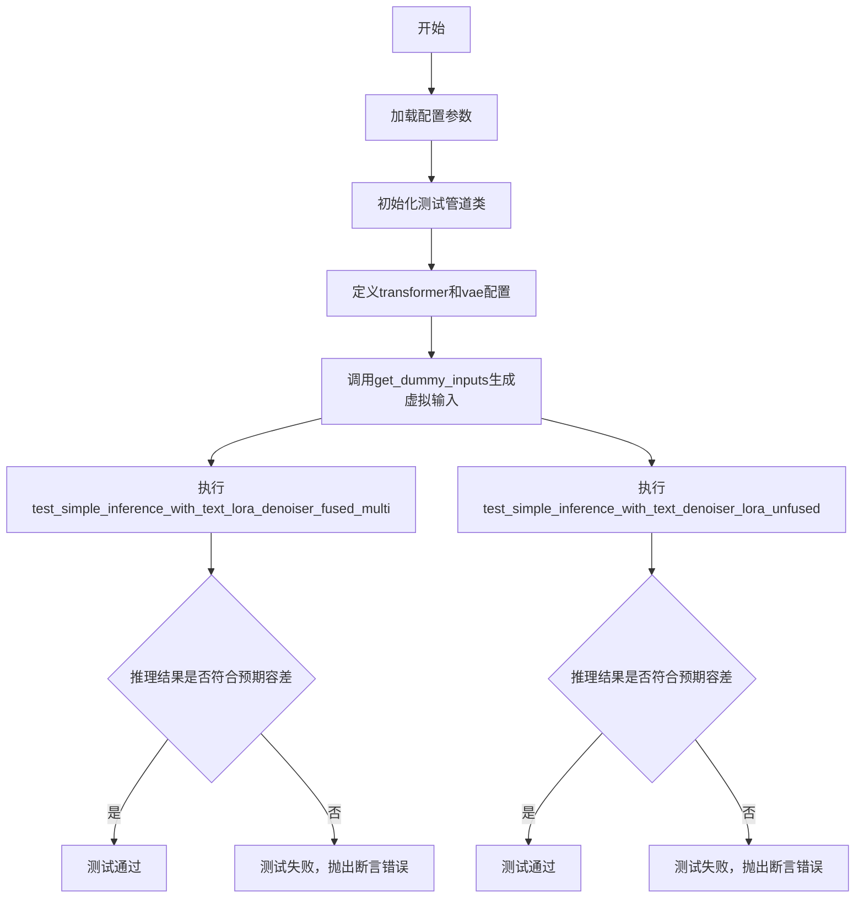
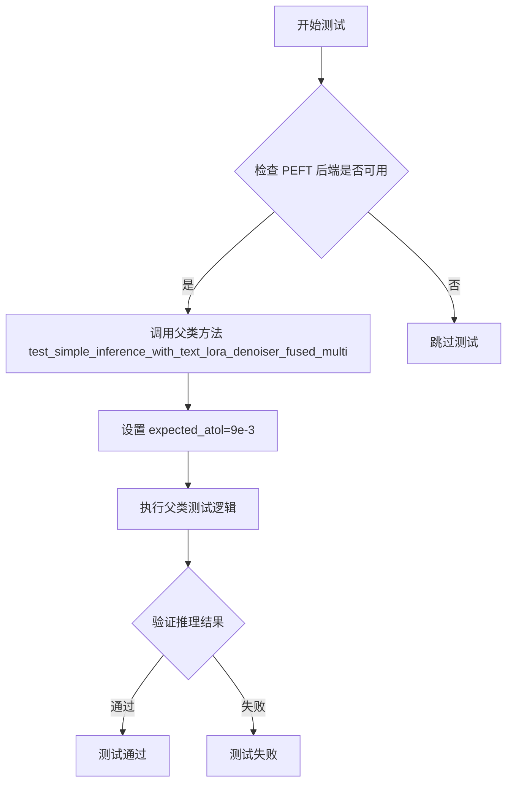
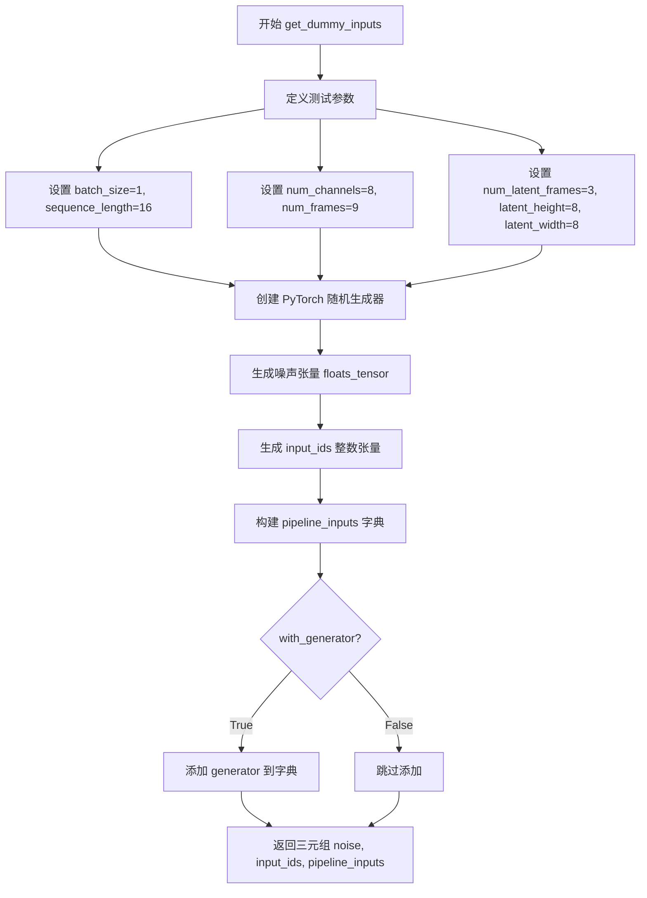
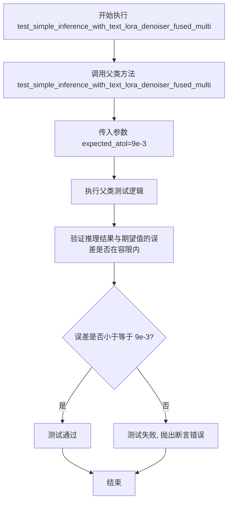
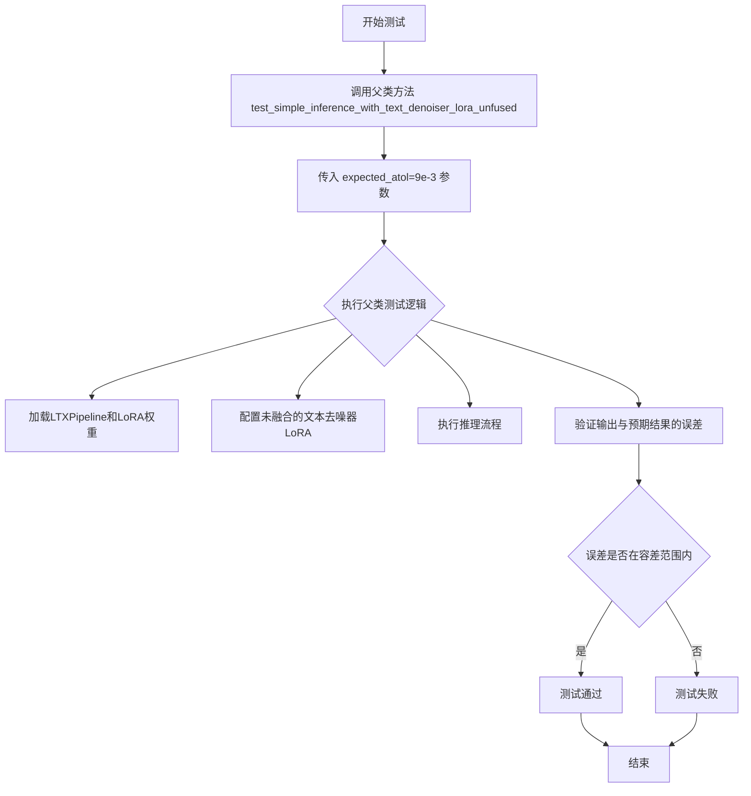
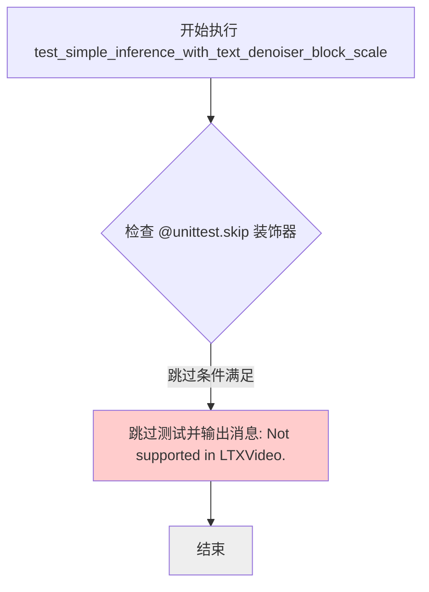
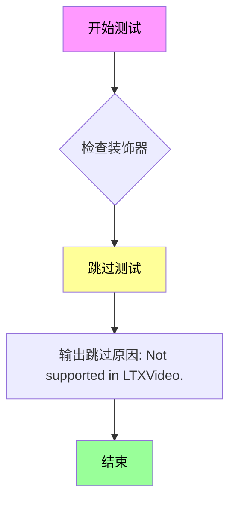
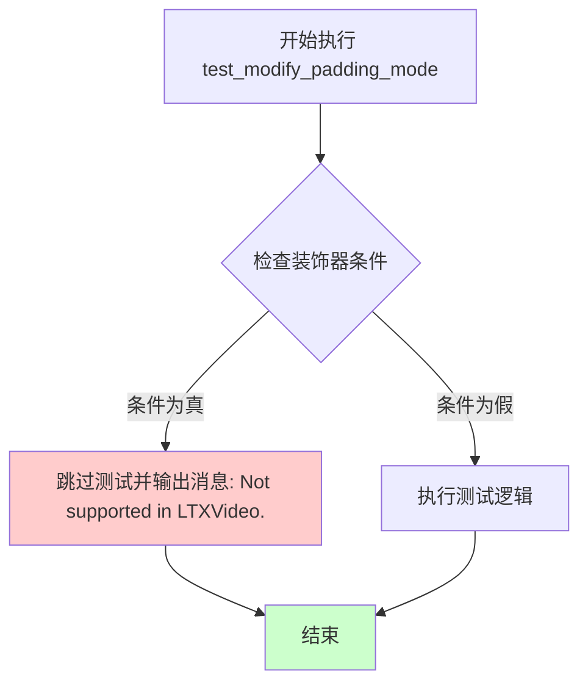

# `diffusers\tests\lora\test_lora_layers_ltx_video.py` 详细设计文档

这是LTXVideo模型的LoRA（Low-Rank Adaptation）加载功能单元测试文件，继承自PeftLoraLoaderMixinTests，用于验证LTXVideoTransformer3DModel在PEFT框架下的LoRA适配器集成是否正常工作，包括文本LORA融合与未融合的推理测试

## 整体流程



## 类结构

```
LTXVideoLoRATests (unittest.TestCase + PeftLoraLoaderMixinTests)
└── 继承方法来自: PeftLoraLoaderMixinTests
```

## 全局变量及字段


### `floats_tensor`
    
从testing_utils导入的生成随机浮点张量的工具函数

类型：`function`
    


### `require_peft_backend`
    
装饰器，用于检查PEFT后端是否可用

类型：`function`
    


### `LTXVideoLoRATests.pipeline_class`
    
主管道类，定义LTXVideo的推理管道

类型：`type`
    


### `LTXVideoLoRATests.scheduler_cls`
    
调度器类，用于离散时间步的流匹配

类型：`type`
    


### `LTXVideoLoRATests.scheduler_kwargs`
    
调度器的配置参数字典

类型：`dict`
    


### `LTXVideoLoRATests.transformer_kwargs`
    
transformer模型的配置参数，包括in_channels、out_channels、patch_size等

类型：`dict`
    


### `LTXVideoLoRATests.transformer_cls`
    
3D视频变换器模型类

类型：`type`
    


### `LTXVideoLoRATests.vae_kwargs`
    
VAE模型的配置参数，包括编码器/解码器通道数、层数等

类型：`dict`
    


### `LTXVideoLoRATests.vae_cls`
    
LTXVideo的VAE模型类

类型：`type`
    


### `LTXVideoLoRATests.tokenizer_cls`
    
分词器类，用于文本预处理

类型：`type`
    


### `LTXVideoLoRATests.tokenizer_id`
    
分词器的模型标识符 'hf-internal-testing/tiny-random-t5'

类型：`str`
    


### `LTXVideoLoRATests.text_encoder_cls`
    
文本编码器类，用于将文本转换为向量

类型：`type`
    


### `LTXVideoLoRATests.text_encoder_id`
    
文本编码器的模型标识符 'hf-internal-testing/tiny-random-t5'

类型：`str`
    


### `LTXVideoLoRATests.text_encoder_target_modules`
    
文本编码器中LoRA应用的目标模块 ['q', 'k', 'v', 'o']

类型：`list`
    


### `LTXVideoLoRATests.supports_text_encoder_loras`
    
标志位，表示是否支持文本编码器的LoRA

类型：`bool`
    


### `LTXVideoLoRATests.output_shape`
    
期望输出形状 (1, 9, 32, 32, 3)

类型：`tuple`
    
    

## 全局函数及方法


# PeftLoraLoaderMixinTests 类的详细设计文档

## 整体运行流程

这段代码定义了一个测试类 `LTXVideoLoRATests`，它继承自 `unittest.TestCase` 和外部导入的 `PeftLoraLoaderMixinTests` 混合类。该测试类用于测试 LTXVideo 模型的 LoRA（Low-Rank Adaptation）加载功能，包括 LoRA 的融合与未融合推理场景。测试框架使用 Python 的 unittest 模块，通过调用父类 `PeftLoraLoaderMixinTests` 中定义的测试方法来完成具体的测试逻辑。

## 类详细信息

### LTXVideoLoRATests 类

这是一个测试用例类，用于验证 LTXVideo 模型的 LoRA 加载器功能是否正常工作。

#### 类字段

- `pipeline_class`：`LTXPipeline`，管道类，用于构建视频生成管线
- `scheduler_cls`：`FlowMatchEulerDiscreteScheduler`，调度器类，用于控制扩散模型的采样过程
- `scheduler_kwargs`：`dict`，调度器的配置参数（当前为空字典）
- `transformer_kwargs`：`dict`，变换器模型的配置参数，包含输入输出通道、注意力头维度、层数等
- `transformer_cls`：`LTXVideoTransformer3DModel`，3D 视频变换器模型类
- `vae_kwargs`：`dict`，VAE（变分自编码器）的配置参数
- `vae_cls`：`AutoencoderKLLTXVideo`，LTX 视频的 VAE 模型类
- `tokenizer_cls`：`AutoTokenizer`，分词器类
- `tokenizer_id`：`str`，分词器的模型标识符（"hf-internal-testing/tiny-random-t5"）
- `text_encoder_cls`：`T5EncoderModel`，文本编码器模型类
- `text_encoder_id`：`str`，文本编码器的模型标识符（"hf-internal-testing/tiny-random-t5"）
- `text_encoder_target_modules`：`list`，文本编码器中 LoRA 应用的目标模块列表
- `supports_text_encoder_loras`：`bool`，是否支持文本编码器 LoRA（当前为 False）

#### 类方法

### test_simple_inference_with_text_lora_denoiser_fused_multi

该方法继承自 `PeftLoraLoaderMixinTests`，用于测试在文本 LoRA 和去噪器 LoRA 同时融合的情况下，模型进行简单推理的功能。

**参数：** 无（参数通过 unittest 框架隐式传递，方法调用父类时传入 `expected_atol=9e-3`）

**返回值：** 无返回值（unittest 测试方法）

**流程图**



#### 带注释源码

```python
def test_simple_inference_with_text_lora_denoiser_fused_multi(self):
    """
    测试文本LoRA和去噪器LoRA同时融合时的简单推理功能。
    
    该测试方法继承自PeftLoraLoaderMixinTests混合类，调用父类的实现逻辑。
    设置了较为宽松的绝对误差容限(9e-3)以适应LTXVideo模型的特性。
    """
    # 调用父类的测试方法，传入预期的绝对误差容限
    # 父类PeftLoraLoaderMixinTests的具体实现从外部导入，无法在此处查看
    super().test_simple_inference_with_text_lora_denoiser_fused_multi(expected_atol=9e-3)
```

---

### test_simple_inference_with_text_denoiser_lora_unfused

该方法继承自 `PeftLoraLoaderMixinTests`，用于测试在去噪器 LoRA 未融合的情况下，模型的推理功能。

**参数：** 无

**返回值：** 无返回值（unittest 测试方法）

#### 带注释源码

```python
def test_simple_inference_with_text_denoiser_lora_unfused(self):
    """
    测试去噪器LoRA未融合时的简单推理功能。
    
    该测试方法验证在LoRA权重未融合到模型参数的情况下，
    能否正确进行推理运算。
    """
    # 调用父类的测试方法进行验证
    super().test_simple_inference_with_text_denoiser_lora_unfused(expected_atol=9e-3)
```

---

### get_dummy_inputs

该方法用于生成测试用的虚拟输入数据，模拟真实的推理调用参数。

**参数：**

- `with_generator`：`bool`，是否包含随机数生成器（默认为 True）

**返回值：** 返回元组 `(noise, input_ids, pipeline_inputs)`

- `noise`：`torch.Tensor`，形状为 (batch_size, num_latent_frames, num_channels, latent_height, latent_width) 的噪声张量
- `input_ids`：`torch.Tensor`，文本输入的 token ID 张量
- `pipeline_inputs`：`dict`，包含管道推理所需的各种参数

#### 带注释源码

```python
def get_dummy_inputs(self, with_generator=True):
    """
    生成用于测试的虚拟输入数据。
    
    参数:
        with_generator: 是否包含随机数生成器，用于确保测试的可重复性
        
    返回:
        包含噪声、输入ID和管道参数的元组
    """
    # 设置批处理大小和序列长度
    batch_size = 1
    sequence_length = 16
    
    # 设置潜在空间和帧数的参数
    num_channels = 8
    num_frames = 9
    # 计算潜在帧数：考虑时间压缩比
    num_latent_frames = 3  # (num_frames - 1) // temporal_compression_ratio + 1
    latent_height = 8
    latent_width = 8

    # 创建固定随机种子以确保测试可重复性
    generator = torch.manual_seed(0)
    # 生成随机噪声张量作为潜在表示的输入
    noise = floats_tensor((batch_size, num_latent_frames, num_channels, latent_height, latent_width))
    # 生成随机文本输入ID
    input_ids = torch.randint(1, sequence_length, size=(batch_size, sequence_length), generator=generator)

    # 构建管道参数字典
    pipeline_inputs = {
        "prompt": "dance monkey",  # 测试用提示词
        "num_frames": num_frames,  # 生成的帧数
        "num_inference_steps": 4,  # 推理步数
        "guidance_scale": 6.0,     # 引导强度
        "height": 32,              # 输出高度
        "width": 32,               # 输出宽度
        "max_sequence_length": sequence_length,  # 最大序列长度
        "output_type": "np",       # 输出类型为numpy数组
    }
    
    # 如果需要生成器，则添加到参数字典中
    if with_generator:
        pipeline_inputs.update({"generator": generator})

    return noise, input_ids, pipeline_inputs
```

---

### output_shape 属性

该属性定义了模型输出的预期形状。

**参数：** 无

**返回值：** `tuple`，输出张量的形状 (1, 9, 32, 32, 3)

#### 带注释源码

```python
@property
def output_shape(self):
    """
    返回模型输出的预期形状。
    
    形状含义:
        - 1: 批处理大小
        - 9: 帧数
        - 32: 高度
        - 32: 宽度
        - 3: 通道数(RGB)
    """
    return (1, 9, 32, 32, 3)
```

---

## 关键组件信息

| 组件名称 | 描述 |
|---------|------|
| LTXPipeline | LTXVideo 模型的生成管道，整合了文本编码器、VAE 和变换器模型 |
| PeftLoraLoaderMixinTests | 混合类基类，提供 LoRA 加载器的通用测试实现逻辑（外部导入） |
| LTXVideoTransformer3DModel | 3D 视频变换器模型，支持时空注意力机制 |
| AutoencoderKLLTXVideo | LTX 视频的 VAE 模型，用于潜在空间编码和解码 |
| FlowMatchEulerDiscreteScheduler | 基于欧拉离散方法的流匹配调度器 |

## 潜在的技术债务或优化空间

1. **硬编码的测试参数**：许多参数（如 `num_frames=9`、`num_inference_steps=4`）被硬编码在测试方法中，缺乏灵活性，应该考虑参数化测试以支持不同配置。

2. **跳过测试的占位符**：代码中包含了多个被跳过的测试方法（`test_simple_inference_with_text_denoiser_block_scale` 等），这些占位符表明某些功能尚未实现或不支持，应该在后续版本中完成或移除。

3. **外部依赖的紧密耦合**：测试类依赖于外部导入的 `PeftLoraLoaderMixinTests` 混合类，这种设计虽然提高了代码复用性，但增加了测试的复杂性和维护难度。

4. **容差值的选择**：使用固定的 `expected_atol=9e-3` 值可能不够精确，应该根据不同的硬件配置和模型版本进行动态调整。

## 其它项目

### 设计目标与约束

- **设计目标**：验证 LTXVideo 模型在 LoRA 适配器加载和融合场景下的正确性
- **约束条件**：LTXVideo 不支持文本编码器 LoRA（`supports_text_encoder_loras = False`），不支持块缩放功能

### 错误处理与异常设计

- 使用 `@require_peft_backend` 装饰器确保测试环境安装了 PEFT 后端
- 使用 `@unittest.skip` 装饰器跳过不支持的测试用例
- 测试失败时通过 unittest 框架自动报告详细的错误信息

### 数据流与状态机

测试的数据流如下：

1. 生成虚拟输入（噪声、文本 ID、管道参数）
2. 构建 LTXPipeline 实例
3. 加载 LoRA 适配器（融合或未融合模式）
4. 执行推理过程
5. 验证输出结果的正确性（通过比较输出的数值容差）

### 外部依赖与接口契约

- **transformers 库**：用于 AutoTokenizer 和 T5EncoderModel
- **diffusers 库**：用于 LTXPipeline、LTXVideoTransformer3DModel、AutoencoderKLLTXVideo、FlowMatchEulerDiscreteScheduler
- **PEFT 库**：提供 LoRA 加载和融合功能（通过装饰器 `require_peft_backend` 验证可用性）
- **torch 库**：用于张量操作和随机数生成


### `LTXVideoLoRATests.get_dummy_inputs`

该方法生成虚拟测试输入数据，用于LTXVideo LoRA pipeline的测试场景。它创建噪声张量、input_ids以及包含推理参数的字典，支持可选的PyTorch随机生成器。

参数：

- `with_generator`：`bool`，可选参数，控制是否在返回的pipeline_inputs字典中包含PyTorch随机生成器，默认为`True`

返回值：`Tuple[torch.Tensor, torch.Tensor, dict]`，返回一个三元组，包含：
- `noise`：形状为`(1, 3, 8, 8, 8)`的5D噪声张量，用于扩散模型的去噪输入
- `input_ids`：形状为`(1, 16)`的整数张量，表示文本嵌入的输入ID
- `pipeline_inputs`：字典，包含prompt、帧数、推理步数、引导系数、图像尺寸等pipeline参数

#### 流程图



#### 带注释源码

```python
def get_dummy_inputs(self, with_generator=True):
    """
    生成虚拟测试输入数据，用于LTXVideo LoRA pipeline的单元测试。
    
    参数:
        with_generator (bool): 是否包含PyTorch随机生成器，默认为True。
                              设置为False时返回的pipeline_inputs不包含generator字段。
    
    返回:
        Tuple[torch.Tensor, torch.Tensor, dict]: 包含以下三个元素的元组:
            - noise: 5D张量 (batch_size, num_latent_frames, num_channels, latent_height, latent_width)
                    形状为 (1, 3, 8, 8, 8)，作为扩散模型的初始噪声输入
            - input_ids: 2D张量 (batch_size, sequence_length)
                    形状为 (1, 16)，代表文本token的输入ID
            - pipeline_inputs: 字典，包含以下键值对:
                * prompt: str, 测试用提示词 "dance monkey"
                * num_frames: int, 目标视频帧数 9
                * num_inference_steps: int, 推理步数 4
                * guidance_scale: float, 引导系数 6.0
                * height: int, 输出高度 32
                * width: int, 输出宽度 32
                * max_sequence_length: int, 最大序列长度 16
                * output_type: str, 输出类型 "np" (numpy数组)
                * generator: torch.Generator, 仅当 with_generator=True 时存在
    """
    # 定义基础维度参数
    batch_size = 1                         # 批次大小
    sequence_length = 16                   # 文本序列长度
    num_channels = 8                       # 潜在空间的通道数
    num_frames = 9                         # 目标输出的视频帧数
    # 潜在帧数 = (帧数 - 1) // 时间压缩比 + 1，这里假设压缩比为4
    num_latent_frames = 3                  # 对应 (9-1)//4+1 = 3
    latent_height = 8                      # 潜在空间高度
    latent_width = 8                       # 潜在空间宽度

    # 创建固定种子的随机生成器，确保测试结果可复现
    generator = torch.manual_seed(0)
    
    # 生成随机噪声张量，形状为 (1, 3, 8, 8, 8)
    # 用于模拟扩散模型的初始潜在表征
    noise = floats_tensor((batch_size, num_latent_frames, num_channels, latent_height, latent_width))
    
    # 生成随机输入ID，模拟文本编码器的token输入
    # 范围为 [1, sequence_length)，不包括0（通常保留给padding）
    input_ids = torch.randint(1, sequence_length, size=(batch_size, sequence_length), generator=generator)

    # 构建pipeline所需的基本参数字典
    pipeline_inputs = {
        "prompt": "dance monkey",           # 测试用短文本提示
        "num_frames": num_frames,          # 生成视频的帧数
        "num_inference_steps": 4,           # DDIM/扩散步数
        "guidance_scale": 6.0,             # Classifier-free guidance强度
        "height": 32,                       # 输出视频高度（像素）
        "width": 32,                       # 输出视频宽度（像素）
        "max_sequence_length": sequence_length,  # 文本编码最大长度
        "output_type": "np",                # 返回numpy数组而非张量
    }
    
    # 可选：添加随机生成器以确保采样确定性
    if with_generator:
        pipeline_inputs.update({"generator": generator})

    # 返回三个测试所需的核心组件
    return noise, input_ids, pipeline_inputs
```


### `LTXVideoLoRATests.test_simple_inference_with_text_lora_denoiser_fused_multi`

该测试方法用于验证文本LORA融合的多模块推理功能，通过调用父类方法并指定期望的绝对误差容限（atol=9e-3）来执行集成测试。

参数：

- `self`：隐式参数，类型为`LTXVideoLoRATests`，表示测试类实例本身

返回值：`None`（无返回值），该方法为测试用例，通过调用父类方法执行验证

#### 流程图



#### 带注释源码

```python
def test_simple_inference_with_text_lora_denoiser_fused_multi(self):
    """
    测试文本LORA融合的多模块推理功能。
    
    该测试方法继承自 PeftLoraLoaderMixinTests 类，用于验证在LTXVideo管道中
    正确加载和运行文本LORA denoiser融合模块的能力。
    
    参数:
        self: LTXVideoLoRATests的实例，包含测试所需的配置和工具方法
        
    返回值:
        None: 此测试方法不返回任何值，通过断言验证测试结果
        
    注意:
        - 该方法调用父类的同名方法进行实际测试
        - expected_atol=9e-3 指定了浮点数比较的绝对误差容限
        - 使用 @require_peft_backend 装饰器确保PEFT后端可用
    """
    # 调用父类的测试方法，传入期望的绝对误差容限
    # 父类方法 test_simple_inference_with_text_lora_denoiser_fused_multi 
    # 会执行完整的推理流程并验证结果精度
    super().test_simple_inference_with_text_lora_denoiser_fused_multi(expected_atol=9e-3)
```


### `LTXVideoLoRATests.test_simple_inference_with_text_denoiser_lora_unfused`

测试文本去噪器LoRA未融合的推理功能，继承自PeftLoraLoaderMixinTests基类，验证在LTXVideo管道中使用未融合的文本去噪器LoRA进行推理的正确性，通过设置expected_atol=9e-3的容差值来比较输出结果的精度。

参数：

- `self`：`LTXVideoLoRATests`，测试类实例本身，隐式参数
- `expected_atol`：`float`，默认值9e-3，绝对容差值，用于比较浮点数输出的近似程度

返回值：`None`，测试方法不返回任何值，通过断言验证推理结果的正确性

#### 流程图



#### 带注释源码

```python
def test_simple_inference_with_text_denoiser_lora_unfused(self):
    """
    测试文本去噪器LoRA未融合的推理功能
    
    该测试方法继承自PeftLoraLoaderMixinTests基类，验证在LTXVideo管道中
    使用未融合的文本去噪器LoRA进行推理的正确性。测试通过设置容差值
    expected_atol=9e-3来比较输出结果的精度。
    
    参数:
        self: LTXVideoLoRATests测试类实例
        expected_atol: 绝对容差值,默认9e-3,用于浮点数精度比较
    
    返回:
        None: 测试方法不返回值,通过断言验证正确性
    """
    # 调用父类PeftLoraLoaderMixinTests的同名测试方法
    # 传入expected_atol参数控制数值比较的容差范围
    super().test_simple_inference_with_text_denoiser_lora_unfused(expected_atol=9e-3)
```


### `LTXVideoLoRATests.test_simple_inference_with_text_denoiser_block_scale`

该方法是一个被跳过的单元测试，用于验证 LTXVideo 管道中文本去噪器块缩放功能，但由于 LTXVideo 不支持此功能，测试被无条件跳过。

参数：

- `self`：实例方法的标准参数，表示 `LTXVideoLoRATests` 类的实例

返回值：`None`，无返回值（该方法体只有 `pass` 语句）

#### 流程图



#### 带注释源码

```python
@unittest.skip("Not supported in LTXVideo.")
def test_simple_inference_with_text_denoiser_block_scale(self):
    """
    测试文本去噪器块缩放功能的简单推理。
    
    该测试被跳过，因为 LTXVideo 不支持此功能。
    块缩放（block scale）通常用于对 transformer 的不同层应用不同的缩放因子，
    以精细控制去噪过程，但在 LTXVideo 实现中未提供此能力。
    
    测试目的（原本意图）:
    - 验证在推理过程中对去噪器不同块应用自定义缩放因子
    - 测试 block_scale 参数对输出质量的影响
    - 确保多选项字典配置的正确性
    
    当前状态: 跳过（Skip）
    原因: LTXVideo 管道不支持块缩放功能
    """
    pass  # 方法体为空，不执行任何测试逻辑
```


### `LTXVideoLoRATests.test_simple_inference_with_text_denoiser_block_scale_for_all_dict_options`

该方法是一个被跳过的单元测试，用于验证文本去噪器块缩放功能的所有字典选项配置，但由于LTXVideo不支持该功能，因此测试被跳过。

参数：

- `self`：`LTXVideoLoRATests` 类型，测试类实例本身，包含测试所需的管道、调度器和模型配置

返回值：`None`，该方法不返回任何值（方法体为 `pass`）

#### 流程图



#### 带注释源码

```python
@unittest.skip("Not supported in LTXVideo.")  # 跳过测试装饰器，标记该测试在LTXVideo中不支持
def test_simple_inference_with_text_denoiser_block_scale_for_all_dict_options(self):
    """
    测试文本去噪器块缩放功能的所有字典选项配置。
    
    该测试方法用于验证LoRA模块在文本编码器块缩放场景下的功能，
    支持不同的字典选项配置。由于LTXVideo实现限制，此功能暂不支持，
    因此使用@unittest.skip装饰器跳过该测试。
    
    参数:
        self: 测试类实例，包含以下关键属性:
            - pipeline_class: LTXPipeline，管道类
            - transformer_cls: LTXVideoTransformer3DModel，变换器模型类
            - vae_cls: AutoencoderKLLTXVideo，VAE模型类
            - text_encoder_cls: T5EncoderModel，文本编码器类
            - supports_text_encoder_loras: False，不支持文本编码器LoRA
    
    返回值:
        None: 该方法不执行任何测试逻辑，仅作为占位符
    """
    pass  # 空方法体，测试被跳过
```

#### 关键信息说明

- **跳过原因**：LTXVideo 不支持文本去噪器块缩放功能的所有字典选项配置
- **装饰器**：`@unittest.skip("Not supported in LTXVideo.")` - Python unittest框架的跳过装饰器
- **测试目的**：原本应验证 `text_encoder_lora_scale` 等块缩放参数在不同字典选项下的工作情况
- **替代方案**：如需测试 LTXVideo 的 LoRA 功能，可使用其他非跳过的测试方法，如：
  - `test_simple_inference_with_text_lora_denoiser_fused_multi`
  - `test_simple_inference_with_text_denoiser_lora_unfused`


### `LTXVideoLoRATests.test_modify_padding_mode`

这是一个单元测试方法，用于测试修改填充模式（padding mode）的功能。由于LTXVideo视频模型不支持该功能，该测试方法使用 `@unittest.skip` 装饰器被跳过执行。

参数：

- `self`：`LTXVideoLoRATests`，隐式参数，表示测试类实例本身

返回值：`None`，该方法没有返回值（方法体只有 `pass` 语句）

#### 流程图



#### 带注释源码

```python
@unittest.skip("Not supported in LTXVideo.")
def test_modify_padding_mode(self):
    """
    测试修改填充模式的功能。
    
    该测试用于验证LTXVideoTransformer3DModel是否支持修改填充模式（padding mode），
    但由于LTXVideo模型架构不支持此功能，测试被跳过。
    
    Args:
        self: LTXVideoLoRATests实例，隐式参数
        
    Returns:
        None: 该方法不返回任何值
        
    Note:
        - 使用@unittest.skip装饰器跳过测试
        - 跳过原因: "Not supported in LTXVideo."
        - 方法体只有pass语句，实际测试逻辑未实现
    """
    pass  # 测试逻辑未实现，该测试被跳过
```

#### 补充说明

| 项目 | 说明 |
|------|------|
| **装饰器** | `@unittest.skip("Not supported in LTXVideo.")` - 跳过测试并显示指定消息 |
| **测试类** | `LTXVideoLoRATests` - 继承自 `unittest.TestCase` 和 `PeftLoraLoaderMixinTests` |
| **跳过原因** | LTXVideo模型不支持修改填充模式的功能 |
| **方法状态** | 已废弃/未实现 - 该测试方法仅包含空实现 |


## 关键组件


### LTXVideoLoRATests

LTXVideo模型的LoRA（低秩自适应）集成测试类，验证LTXVideo变换器、VAE和调度器的LoRA加载、融合与推理功能。

### LTXPipeline

LTXVideo的生成管道类，负责协调VAE、变换器和调度器完成视频生成任务。

### FlowMatchEulerDiscreteScheduler

流匹配欧拉离散调度器，用于扩散模型的噪声调度。

### LTXVideoTransformer3DModel

LTXVideo的3D变换器模型，处理时空维度特征的核心组件。

### AutoencoderKLLTXVideo

LTXVideo的KL散度自编码器，用于视频的潜在空间编码与解码。

### T5EncoderModel

文本编码器模型，将文本提示编码为条件向量。

### get_dummy_inputs

生成测试用虚拟输入的方法，返回噪声张量、输入ID和管道参数字典。

### text_encoder_target_modules

文本编码器LoRA目标模块列表["q", "k", "v", "o"]，指定LoRA适配的注意力层。

### transformer_kwargs

变换器配置字典，包含输入输出通道、patch尺寸、注意力头维度、层数等参数。

### vae_kwargs

VAE配置字典，包含编解码器通道配置、时空缩放、patch尺寸等参数。

### test_simple_inference_with_text_lora_denoiser_fused_multi

测试文本LoRA与去噪器多模块融合推理的测试方法。

### test_simple_inference_with_text_denoiser_lora_unfused

测试文本去噪器LoRA非融合推理的测试方法。

### supports_text_encoder_loras

布尔标志，表示LTXVideo不支持文本编码器LoRA。

### output_shape

属性方法，返回预期输出形状(1, 9, 32, 32, 3)。


## 问题及建议


### 已知问题

- **魔法数字缺乏解释**：代码中存在多个硬编码的数值（如`num_frames=9`、`num_latent_frames=3`、`num_inference_steps=4`、`sequence_length=16`等），缺乏注释说明其来源或计算逻辑，影响可维护性
- **sys.path.append(".")操作**：使用`sys.path.append(".")`来导入本地模块不是最佳实践，可能导致导入顺序问题和潜在的路径冲突
- **测试skip理由不充分**：多个测试方法被跳过（如`test_simple_inference_with_text_denoiser_block_scale`等），仅以"Not supported in LTXVideo"作为理由，缺乏更详细的技术说明或是否计划支持的 roadmap
- **get_dummy_inputs返回值类型不明确**：该方法返回三个值（noise, input_ids, pipeline_inputs），使用隐式tuple返回，调用方需要阅读实现才能理解返回值顺序，建议使用命名tuple或dataclass明确返回结构
- **重复的配置字典结构**：transformer_kwargs和vae_kwargs中存在大量重复的结构模式（如patch_size、patch_size_t等），可以考虑抽象为基类或配置生成器减少冗余
- **随机种子设置可能不稳定**：使用`torch.manual_seed(0)`设置种子，但未验证在不同的PyTorch版本或硬件平台上是否具有确定性

### 优化建议

- 将所有魔法数字提取为类级别的常量或枚举，并添加详细注释说明其含义和用途
- 移除`sys.path.append(".")`，改用项目的绝对导入路径或通过pytest配置正确设置Python路径
- 为跳过的测试添加更详细的说明，包括是否计划在未来支持、是否有替代测试方案等信息
- 重构`get_dummy_inputs`方法，使用`typing.NamedTuple`或`dataclass`明确返回值的类型和字段名称
- 考虑创建一个配置基类或混合类，将transformer和vae的公共配置参数抽象出来，减少重复代码
- 添加环境检查或版本兼容性验证，确保随机种子在不同执行环境下的一致性

## 其它


### 设计目标与约束

本测试文件旨在验证LTXVideo模型在LoRA（Low-Rank Adaptation）功能上的正确性，确保LTXPipeline能够在启用或禁用LoRA的情况下正确进行推理。测试覆盖多卡场景下的LoRA融合与未融合模式，验证模型在文本到视频生成任务中的稳定性。约束条件包括：不支持文本编码器的LoRA（supports_text_encoder_loras = False），不支持padding模式修改，不支持block scale相关功能。

### 错误处理与异常设计

测试文件中使用了@unittest.skip装饰器跳过不支持的测试用例（test_simple_inference_with_text_denoiser_block_scale、test_simple_inference_with_text_denoiser_block_scale_for_all_dict_options、test_modify_padding_mode），这些测试被标记为"Not supported in LTXVideo"。测试通过继承PeftLoraLoaderMixinTests获取通用的LoRA测试逻辑，使用expected_atol参数（9e-3）控制数值精度容差。当推理结果与预期值的绝对误差超过容差时，测试将失败。

### 数据流与状态机

测试数据流如下：首先通过get_dummy_inputs方法生成虚拟输入，包括batch_size=1的噪声张量（形状为(1, 3, 8, 8, 8)）和input_ids（形状为(1, 16)），以及包含prompt、num_frames、num_inference_steps等参数的pipeline_inputs字典。测试调用父类的test_simple_inference_with_text_lora_denoiser_fused_multi和test_simple_inference_with_text_denoiser_lora_unfused方法执行推理流程，验证输出形状为(1, 9, 32, 32, 3)。

### 外部依赖与接口契约

本测试依赖于以下外部组件和接口：transformers库提供AutoTokenizer和T5EncoderModel，diffusers库提供LTXPipeline、FlowMatchEulerDiscreteScheduler、LTXVideoTransformer3DModel和AutoencoderKLLTXVideo。本地测试工具来自..testing_utils模块的floats_tensor和require_peft_backend装饰器，以及.utils模块的PeftLoraLoaderMixinTests类。pipeline_class指定为LTXPipeline，scheduler_cls指定为FlowMatchEulerDiscreteScheduler，transformer_cls指定为LTXVideoTransformer3DModel，vae_cls指定为AutoencoderKLLTXVideo。

### 性能考虑与基准测试

测试使用极简模型配置（num_layers=1, num_attention_heads=4, attention_head_dim=8）以加快测试执行速度。num_inference_steps设置为4，远低于生产环境的典型值（20-50），以减少推理时间。测试通过torch.manual_seed(0)固定随机种子确保可重复性。expected_atol=9e-3的容差设置反映了在FP16/FP32混合精度下的数值误差预期。

### 配置与参数说明

transformer_kwargs定义了Transformer模型的架构参数：in_channels=8（输入通道）、out_channels=8（输出通道）、patch_size和patch_size_t均为1、num_attention_heads=4、attention_head_dim=8、cross_attention_dim=32、num_layers=1、caption_channels=32。vae_kwargs定义了VAE模型的架构参数：in_channels=3、out_channels=3、latent_channels=8、block_out_channels和decoder_block_out_channels均为(8,8,8,8)、layers_per_block和decoder_layers_per_block均为(1,1,1,1,1)。tokenizer_id和text_encoder_id均使用"hf-internal-testing/tiny-random-t5"微型测试模型。

### 测试策略与覆盖范围

测试采用继承策略，LTXVideoLoRATests继承自unittest.TestCase和PeftLoraLoaderMixinTests，复用通用的LoRA测试逻辑。测试覆盖两种场景：LoRA融合模式（test_simple_inference_with_text_lora_denoiser_fused_multi）和LoRA未融合模式（test_simple_inference_with_text_denoiser_lora_unfused）。output_shape属性定义了预期的输出形状用于验证。get_dummy_inputs方法支持with_generator参数控制是否包含生成器，以测试随机性和确定性两种场景。


    