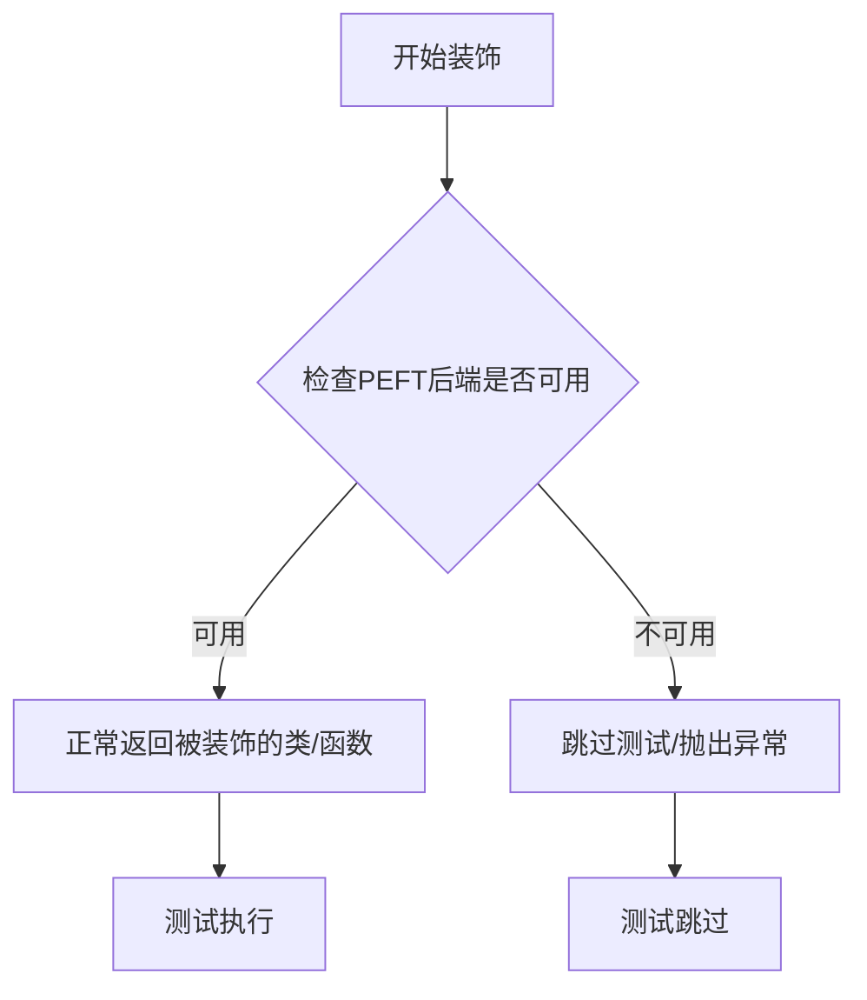
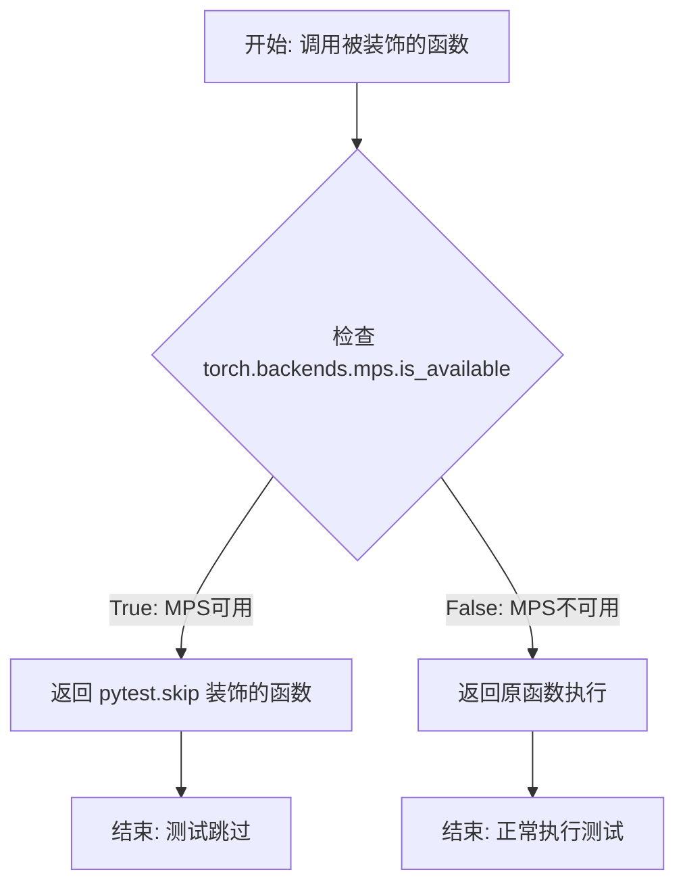
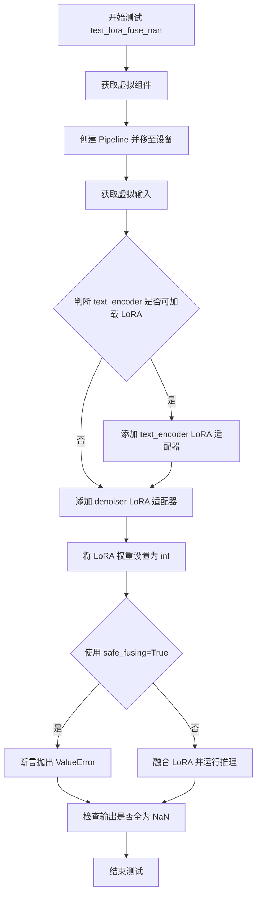
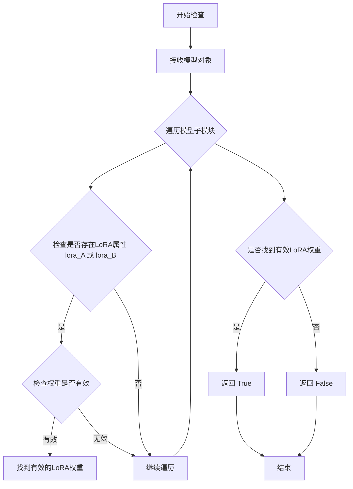
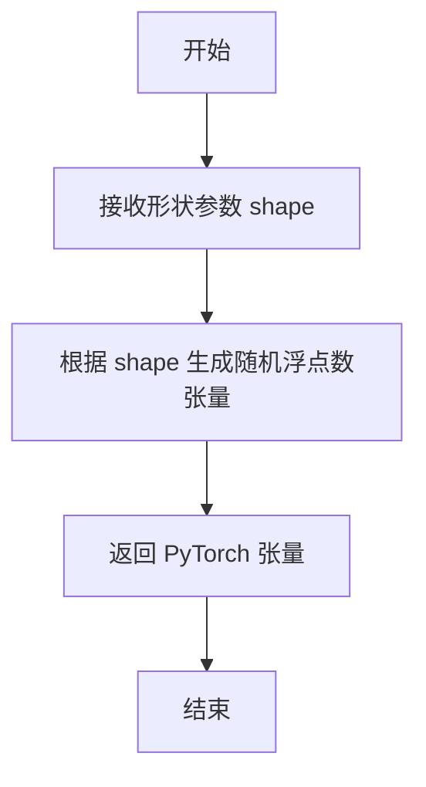
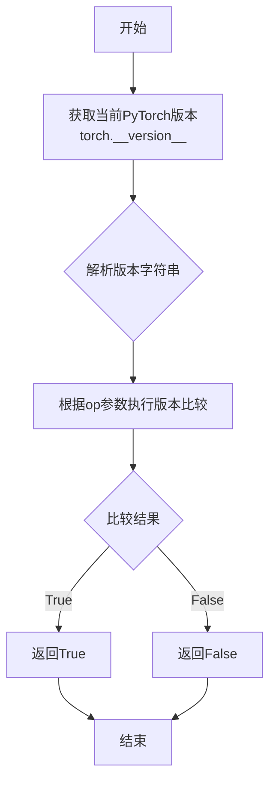
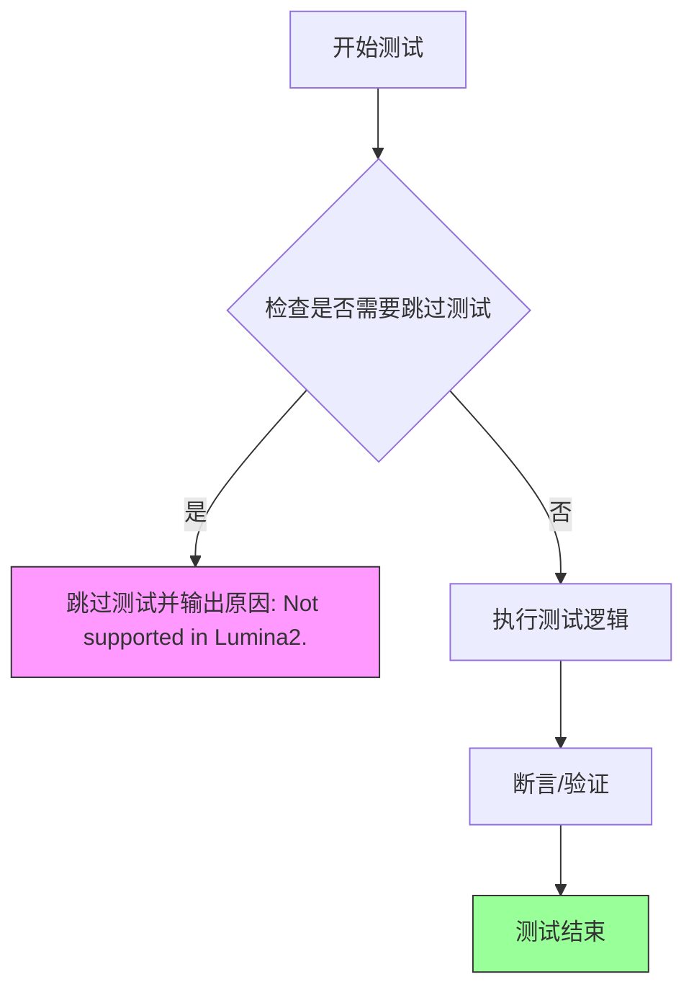

# `diffusers\tests\lora\test_lora_layers_lumina2.py` 详细设计文档

这是一个针对Lumina2图像生成Pipeline的LoRA（Low-Rank Adaptation）功能测试文件，主要测试LoRA适配器的加载、融合以及在模型权重损坏时（NaN值）的处理机制。

## 整体流程

```mermaid
graph TD
    A[开始测试] --> B[获取dummy components]
B --> C[创建Pipeline实例]
C --> D[设置设备并配置进度条]
D --> E{是否有text_encoder LoRA模块?}
E -- 是 --> F[添加text_encoder适配器并验证]
E -- 否 --> G[添加denoiser(transformer)适配器并验证]
F --> G
G --> H[人为损坏LoRA权重为inf]
H --> I[测试safe_fusing=True是否抛出异常]
I --> J[测试safe_fusing=False是否能融合]
J --> K[执行推理并检查输出是否为NaN]
K --> L[结束测试]
```

## 类结构

```
unittest.TestCase
└── Lumina2LoRATests (继承自PeftLoraLoaderMixinTests)
    ├── 配置类属性 (pipeline_class, scheduler_cls, transformer_kwargs等)
    └── 测试方法 (test_lora_fuse_nan等)
```

## 全局变量及字段


### `sys`
    
Python标准库模块，提供系统相关的参数和函数

类型：`module`
    


### `unittest`
    
Python单元测试框架，提供测试用例和测试套件功能

类型：`module`
    


### `np`
    
NumPy库，提供高效的数值数组操作功能

类型：`module`
    


### `pytest`
    
Python测试框架，提供更强大的测试功能和装饰器

类型：`module`
    


### `torch`
    
PyTorch深度学习库，提供张量计算和神经网络功能

类型：`module`
    


### `AutoTokenizer`
    
HuggingFace Transformers的自动分词器类，用于文本分词

类型：`class`
    


### `GemmaForCausalLM`
    
HuggingFace的Gemma因果语言模型类，用于文本生成

类型：`class`
    


### `AutoencoderKL`
    
Diffusers的变分自编码器类，用于图像编码解码

类型：`class`
    


### `FlowMatchEulerDiscreteScheduler`
    
Diffusers的Flow Match欧拉离散调度器，用于扩散模型采样

类型：`class`
    


### `Lumina2Pipeline`
    
Diffusers的Lumina2生成管道类，用于端到端图像生成

类型：`class`
    


### `Lumina2Transformer2DModel`
    
Diffusers的Lumina2二维变换器模型类，用于图像去噪

类型：`class`
    


### `PeftLoraLoaderMixinTests`
    
PEFT LoRA加载器混入测试类，提供LoRA测试通用方法

类型：`class`
    


### `check_if_lora_correctly_set`
    
检查LoRA权重是否正确设置的验证函数

类型：`function`
    


### `floats_tensor`
    
生成随机浮点张量的测试工具函数

类型：`function`
    


### `is_torch_version`
    
检查PyTorch版本的比较函数

类型：`function`
    


### `require_peft_backend`
    
要求PEFT后端的测试条件装饰器

类型：`function`
    


### `skip_mps`
    
跳过Apple MPS后端的测试装饰器

类型：`function`
    


### `torch_device`
    
测试使用的PyTorch设备字符串

类型：`str`
    


### `Lumina2LoRATests.pipeline_class`
    
Lumina2生成管道类，用于测试的管道类型

类型：`type`
    


### `Lumina2LoRATests.scheduler_cls`
    
Flow Match调度器类，用于扩散采样

类型：`type`
    


### `Lumina2LoRATests.scheduler_kwargs`
    
调度器关键字参数配置字典

类型：`dict`
    


### `Lumina2LoRATests.transformer_kwargs`
    
Lumina2变换器模型配置参数字典

类型：`dict`
    


### `Lumina2LoRATests.transformer_cls`
    
Lumina2变换器模型类，用于图像去噪

类型：`type`
    


### `Lumina2LoRATests.vae_kwargs`
    
VAE模型配置参数字典

类型：`dict`
    


### `Lumina2LoRATests.vae_cls`
    
变分自编码器类，用于图像编码解码

类型：`type`
    


### `Lumina2LoRATests.tokenizer_cls`
    
自动分词器类，用于文本处理

类型：`type`
    


### `Lumina2LoRATests.tokenizer_id`
    
分词器模型标识符

类型：`str`
    


### `Lumina2LoRATests.text_encoder_cls`
    
文本编码器模型类

类型：`type`
    


### `Lumina2LoRATests.text_encoder_id`
    
文本编码器模型标识符

类型：`str`
    


### `Lumina2LoRATests.supports_text_encoder_loras`
    
标志位，表示是否支持文本编码器LoRA

类型：`bool`
    
    

## 全局函数及方法


### `require_peft_backend`

这是一个装饰器函数，用于检查当前测试环境是否满足 PEFT (Parameter-Efficient Fine-Tuning) 后端要求。通常用于条件性地跳过不满足 PEFT 依赖的测试用例，确保测试只在支持 PEFT 的环境中运行。

参数：无（装饰器直接作用于函数或类，不直接传递参数）

返回值：装饰器函数，返回被装饰的对象（函数或类）

#### 流程图



#### 带注释源码

```python
# 注意：以下源码是基于代码上下文和常见模式推断的示例
# 实际定义在 testing_utils 模块中，此处未提供具体实现

@require_peft_backend  # 装饰器：检查PEFT后端是否可用
class Lumina2LoRATests(unittest.TestCase, PeftLoraLoaderMixinTests):
    # 如果PEFT后端不可用，此类将被跳过或标记为xfail
    pipeline_class = Lumina2Pipeline
    # ... 类其他属性和方法
```

> **注意**：由于源代码中仅展示了 `require_peft_backend` 装饰器的**使用示例**，而未提供其具体实现定义（该装饰器是从 `..testing_utils` 模块导入的），因此无法提供其精确的参数签名、返回值类型和完整源码。根据其使用场景和命名规范推断，它很可能是一个条件性跳过装饰器，用于在不支持 PEFT 后端的测试环境中跳过相关测试。


### skip_mps

描述：`skip_mps` 是一个测试装饰器，用于在检测到运行在 MPS (Metal Performance Shaders) 设备上时跳过被装饰的测试方法。MPS 是 Apple Silicon (M系列芯片) 的 GPU 加速框架。该装饰器通过检查 `torch.backends.mps.is_available()` 来判断当前是否使用 MPS 设备，如果是则跳过测试，否则正常执行测试。

参数：

- `func`：`Callable`，被装饰的测试函数

返回值：`Callable`，装饰后的函数。如果在 MPS 设备上运行，返回一个跳过的测试函数；否则返回原函数。

#### 流程图



#### 带注释源码

由于 `skip_mps` 定义在外部模块 `..testing_utils` 中，仅提供导入和使用方式。以下是基于其功能的典型实现逻辑：

```python
# 导入位置（在实际代码中）
# from ..testing_utils import skip_mps

# 典型实现逻辑（假设）
def skip_mps(func):
    """
    装饰器：检测MPS设备并跳过测试
    
    工作原理：
    1. 检查当前PyTorch是否支持MPS后端
    2. 如果支持MPS（Apple Silicon GPU），则将测试标记为跳过
    3. 如果不支持MPS，则正常执行测试
    """
    import unittest
    import torch
    from functools import wraps
    
    @wraps(func)
    def wrapper(*args, **kwargs):
        # 检查MPS是否可用（PyTorch 1.12+支持MPS）
        if torch.backends.mps.is_available():
            # 使用unittest跳过机制
            raise unittest.SkipTest("Skipping test on MPS device")
        # 如果MPS不可用，正常执行测试
        return func(*args, **kwargs)
    
    return wrapper

# 使用示例
@skip_mps
@pytest.mark.xfail(...)
def test_lora_fuse_nan(self):
    # 测试代码...
    pass
```

**注意**：在实际代码中，`skip_mps` 来自 `diffusers` 库的测试工具模块 `testing_utils`，具体实现可能使用 `pytest.mark.skipif` 装饰器来实现相同的跳过功能。


### `Lumina2LoRATests.test_lora_fuse_nan`

该函数是一个 pytest 测试方法，用于测试 LoRA（Low-Rank Adaptation）融合过程中的 NaN 值处理。测试通过使用 `@pytest.mark.xfail` 标记，预期在特定条件下（CPU 设备且 PyTorch 版本 >= 2.5）测试会失败。

参数：

- `self`：`Lumina2LoRATests`，测试类实例，包含测试所需的组件和配置

返回值：`None`，pytest 测试方法不返回值，通过断言验证行为

#### 流程图



#### 带注释源码

```python
@skip_mps
@pytest.mark.xfail(
    condition=torch.device(torch_device).type == "cpu" and is_torch_version(">=", "2.5"),
    reason="Test currently fails on CPU and PyTorch 2.5.1 but not on PyTorch 2.4.1.",
    strict=False,
)
def test_lora_fuse_nan(self):
    """
    测试 LoRA 融合时的 NaN 值处理行为
    
    测试目的：
    1. 验证当 LoRA 权重包含 inf 值时，使用 safe_fusing=True 会抛出错误
    2. 验证使用 safe_fusing=False 时不会抛出错误，但输出全为 NaN
    """
    # 获取虚拟组件用于测试
    components, text_lora_config, denoiser_lora_config = self.get_dummy_components()
    
    # 创建 Pipeline 实例并移至指定设备
    pipe = self.pipeline_class(**components)
    pipe = pipe.to(torch_device)
    pipe.set_progress_bar_config(disable=None)
    
    # 获取虚拟输入数据
    _, _, inputs = self.get_dummy_inputs(with_generator=False)

    # 如果 pipeline 支持 text_encoder LoRA，则添加适配器
    if "text_encoder" in self.pipeline_class._lora_loadable_modules:
        pipe.text_encoder.add_adapter(text_lora_config, "adapter-1")
        # 验证 LoRA 正确设置
        self.assertTrue(check_if_lora_correctly_set(pipe.text_encoder), "Lora not correctly set in text encoder")

    # 获取 denoiser（transformer 或 unet）并添加 LoRA 适配器
    denoiser = pipe.transformer if self.unet_kwargs is None else pipe.unet
    denoiser.add_adapter(denoiser_lora_config, "adapter-1")
    self.assertTrue(check_if_lora_correctly_set(denoiser), "Lora not correctly set in denoiser.")

    # 损坏一个 LoRA 权重，将其设置为无穷大
    with torch.no_grad():
        pipe.transformer.layers[0].attn.to_q.lora_A["adapter-1"].weight += float("inf")

    # 使用 safe_fusing=True 时应该抛出 ValueError
    with self.assertRaises(ValueError):
        pipe.fuse_lora(components=self.pipeline_class._lora_loadable_modules, safe_fusing=True)

    # 使用 safe_fusing=False 时不应抛出错误，但输出图像应为全黑（NaN）
    pipe.fuse_lora(components=self.pipeline_class._lora_loadable_modules, safe_fusing=False)
    out = pipe(**inputs)[0]

    # 验证输出全为 NaN
    self.assertTrue(np.isnan(out).all())
```


### `Lumina2LoRATests.test_simple_inference_with_text_denoiser_block_scale`

该方法是一个被`unittest.skip`装饰器跳过的测试方法，用于测试文本去噪器块缩放功能，但由于Lumina2不支持该功能而被跳过。

参数：无

返回值：`None`，由于方法体为`pass`语句，不返回任何值

#### 流程图

```mermaid
flowchart TD
    A[开始测试] --> B{检查@unittest.skip装饰器}
    B -->|跳过条件满足| C[跳过测试并输出消息: 'Not supported in Lumina2.']
    B -->|跳过条件不满足| D[执行测试逻辑]
    C --> E[结束测试]
    D --> E
```

#### 带注释源码

```python
@unittest.skip("Not supported in Lumina2.")  # 装饰器：跳过该测试，原因是Lumina2不支持该功能
def test_simple_inference_with_text_denoiser_block_scale(self):
    """
    测试文本去噪器块缩放功能的简单推理。
    由于Lumina2不支持此功能，该测试被跳过。
    """
    pass  # 空方法体，仅用于占位
```

---

### `Lumina2LoRATests.test_simple_inference_with_text_denoiser_block_scale_for_all_dict_options`

该方法是一个被`unittest.skip`装饰器跳过的测试方法，用于测试所有字典选项的文本去噪器块缩放功能，但由于Lumina2不支持该功能而被跳过。

参数：无

返回值：`None`，由于方法体为`pass`语句，不返回任何值

#### 流程图

```mermaid
flowchart TD
    A[开始测试] --> B{检查@unittest.skip装饰器}
    B -->|跳过条件满足| C[跳过测试并输出消息: 'Not supported in Lumina2.']
    B -->|跳过条件不满足| D[执行测试逻辑]
    C --> E[结束测试]
    D --> E
```

#### 带注释源码

```python
@unittest.skip("Not supported in Lumina2.")  # 装饰器：跳过该测试，原因是Lumina2不支持该功能
def test_simple_inference_with_text_denoiser_block_scale_for_all_dict_options(self):
    """
    测试所有字典选项的文本去噪器块缩放功能。
    由于Lumina2不支持此功能，该测试被跳过。
    """
    pass  # 空方法体，仅用于占位
```

---

### `Lumina2LoRATests.test_modify_padding_mode`

该方法是一个被`unittest.skip`装饰器跳过的测试方法，用于测试修改填充模式的功能，但由于Lumina2不支持该功能而被跳过。

参数：无

返回值：`None`，由于方法体为`pass`语句，不返回任何值

#### 流程图

```mermaid
flowchart TD
    A[开始测试] --> B{检查@unittest.skip装饰器}
    B -->|跳过条件满足| C[跳过测试并输出消息: 'Not supported in Lumina2.']
    B -->|跳过条件不满足| D[执行测试逻辑]
    C --> E[结束测试]
    D --> E
```

#### 带注释源码

```python
@unittest.skip("Not supported in Lumina2.")  # 装饰器：跳过该测试，原因是Lumina2不支持该功能
def test_modify_padding_mode(self):
    """
    测试修改填充模式的功能。
    由于Lumina2不支持此功能，该测试被跳过。
    """
    pass  # 空方法体，仅用于占位
```


### `check_if_lora_correctly_set`

该函数用于检查给定的模型（如 text_encoder 或 denoiser/transformer）中 LoRA（Low-Rank Adaptation）适配器是否已正确加载和设置。函数接收一个模型对象作为输入，遍历模型的子模块检查是否存在 LoRA 相关的属性（如 `lora_A`、`lora_B` 等），并返回布尔值表示检查结果。在测试中，该函数用于验证 LoRA 权重是否被正确添加到模型中，如果返回 False 则抛出断言错误。

参数：

-  `model`：`torch.nn.Module`，需要检查的模型对象（例如 `pipe.text_encoder`、`pipe.transformer` 或 `denoiser`）

返回值：`bool`，如果模型中正确设置了 LoRA 适配器则返回 `True`，否则返回 `False`

#### 流程图



#### 带注释源码

```python
# 注意：此函数的实际实现在 .utils 模块中，此处为基于使用方式的推断源码

def check_if_lora_correctly_set(model: torch.nn.Module) -> bool:
    """
    检查模型中LoRA适配器是否正确设置
    
    参数:
        model: 需要检查的PyTorch模型对象
        
    返回:
        bool: LoRA是否正确设置的标志
    """
    # 遍历模型的所有模块
    for name, module in model.named_modules():
        # 检查是否存在LoRA相关属性
        # LoRA通常在attention层添加 lora_A 和 lora_B 权重
        if hasattr(module, 'lora_A') or hasattr(module, 'lora_B'):
            # 检查LoRA权重是否存在且有效
            if hasattr(module, 'lora_A') and module.lora_A is not None:
                # 可选：检查权重是否包含有效数值（非NaN/Inf）
                if hasattr(module.lora_A, 'weight'):
                    weight = module.lora_A.weight
                    if torch.isfinite(weight).all():
                        return True
            if hasattr(module, 'lora_B') and module.lora_B is not None:
                if hasattr(module.lora_B, 'weight'):
                    weight = module.lora_B.weight
                    if torch.isfinite(weight).all():
                        return True
    
    # 未找到有效的LoRA权重
    return False
```


### `floats_tensor`

该函数用于生成指定形状的随机浮点数张量，通常用于测试场景中模拟输入数据。

参数：

-  `shape`：`tuple`，张量的形状，如 `(batch_size, num_channels) + sizes`

返回值：`torch.Tensor`，包含随机浮点数的 PyTorch 张量

#### 流程图



#### 带注释源码

```
# 该函数定义在 ..testing_utils 模块中
# 当前文件中仅导入并使用，未定义实现
# 根据使用示例推断：
# noise = floats_tensor((batch_size, num_channels) + sizes)
# 即生成指定形状的随机浮点数张量
```

---

**注意**：在提供的代码文件中，`floats_tensor` 函数是 **从 `..testing_utils` 模块导入的**，并未在该文件中定义其具体实现。根据代码中的使用方式 `floats_tensor((batch_size, num_channels) + sizes)`，可以推断该函数接受一个形状元组作为参数，返回一个 PyTorch 浮点张量。如需查看完整实现，请参考 `testing_utils` 模块的源码。


### `is_torch_version`

该函数用于比较当前环境中安装的 PyTorch 版本与指定的目标版本，支持传入比较运算符（">="、"=="、"<"等）和目标版本号，返回布尔值表示版本比较结果。

参数：

-  `op`：`str`，比较运算符，如 ">="、"=="、"<"、">" 等
-  `version`：`str`，目标 PyTorch 版本号，如 "2.0"、"2.5" 等

返回值：`bool`，如果当前 PyTorch 版本满足指定的操作符和版本条件则返回 `True`，否则返回 `False`

#### 流程图



#### 带注释源码

```python
# is_torch_version 函数定义于 testing_utils 模块中
# 以下为该函数的典型实现逻辑：

def is_torch_version(op: str, version: str) -> bool:
    """
    比较当前PyTorch版本与目标版本。
    
    参数:
        op: str, 比较运算符，支持 '>=', '==', '<', '>', '<=' 等
        version: str, 目标版本号，例如 '2.0', '2.5', '2.5.1' 等
    
    返回:
        bool: 版本比较结果
    """
    import torch
    from packaging import version as pkg_version
    
    # 获取当前PyTorch版本
    current_version = torch.__version__
    
    # 使用packaging.version进行版本比较
    # 例如：is_torch_version(">=", "2.5") 
    # 会检查 torch.__version__ >= "2.5" 是否成立
    return getattr(pkg_version.parse(current_version), op)(pkg_version.parse(version))
```

#### 使用示例

在提供的代码中，该函数被用于跳过特定测试：

```python
@pytest.mark.xfail(
    condition=torch.device(torch_device).type == "cpu" and is_torch_version(">=", "2.5"),
    reason="Test currently fails on CPU and PyTorch 2.5.1 but not on PyTorch 2.4.1.",
    strict=False,
)
def test_lora_fuse_nan(self):
    # 测试逻辑...
```

此处 `is_torch_version(">=", "2.5")` 用于检查当前 PyTorch 版本是否大于或等于 2.5，如果是则条件为真。


### `Lumina2LoRATests.output_shape`

该属性方法定义了Lumina2LoRA测试管道的预期输出形状，用于验证推理结果的维度是否正确。

参数： 无

返回值：`tuple`，返回预期的输出张量形状 `(1, 4, 4, 3)`，分别代表批量大小、高度、宽度和通道数。

#### 流程图

```mermaid
flowchart TD
    A[开始访问 output_shape 属性] --> B{是 property 方法}
    B -->|Yes| C[返回元组 (1, 4, 4, 3)]
    C --> D[结束]
    
    style A fill:#e1f5fe
    style C fill:#c8e6c9
    style D fill:#ffcdd2
```

#### 带注释源码

```python
@property
def output_shape(self):
    """
    Property method that defines the expected output shape for the Lumina2 LoRA pipeline.
    
    This shape is used in test cases to verify that the pipeline output has the correct
    dimensions after inference. The shape (1, 4, 4, 3) represents:
    - 1: batch size
    - 4: height (in pixels after VAE decoding)
    - 4: width (in pixels after VAE decoding)
    - 3: number of channels (RGB)
    
    Returns:
        tuple: A tuple of integers (batch_size, height, width, channels)
    """
    return (1, 4, 4, 3)
```


### `Lumina2LoRATests.get_dummy_inputs`

该方法是一个测试辅助函数，用于生成虚拟输入数据（噪声、输入ID和管道参数），以便在测试Lumina2 LoRA功能时使用。该方法支持可选的生成器参数，允许在需要时包含随机数生成器，确保测试的可重复性。

参数：

- `with_generator`：`bool`，默认为 `True`。当设为 `True` 时，在返回的管道参数字典中包含生成器对象；设为 `False` 时则不包含。

返回值：返回三个值的元组 `(noise, input_ids, pipeline_inputs)`：
- `noise`：`torch.Tensor`，形状为 `(batch_size, num_channels, height, width)` 的噪声张量，用于扩散模型的输入。
- `input_ids`：`torch.Tensor`，形状为 `(batch_size, sequence_length)` 的输入ID张量，用于文本编码器。
- `pipeline_inputs`：`dict`，包含管道推理所需的参数字典，包括 prompt、num_inference_steps、guidance_scale、height、width、output_type，以及可选的 generator。

#### 流程图

```mermaid
flowchart TD
    A[开始 get_dummy_inputs] --> B[设置 batch_size=1, sequence_length=16, num_channels=4, sizes=32x32]
    B --> C[创建随机数生成器 generator = torch.manual_seed(0)]
    C --> D[生成噪声张量 noise = floats_tensor]
    D --> E[生成输入ID张量 input_ids = torch.randint]
    E --> F[创建管道参数字典 pipeline_inputs]
    F --> G{with_generator?}
    G -->|True| H[在 pipeline_inputs 中添加 generator]
    G -->|False| I[不添加 generator]
    H --> J[返回 (noise, input_ids, pipeline_inputs)]
    I --> J
```

#### 带注释源码

```python
def get_dummy_inputs(self, with_generator=True):
    """
    生成用于测试的虚拟输入数据。
    
    参数:
        with_generator (bool): 是否在返回的管道参数中包含生成器对象。
                              默认为 True。
    
    返回:
        tuple: 包含以下三个元素的元组:
            - noise (torch.Tensor): 形状为 (1, 4, 32, 32) 的噪声张量
            - input_ids (torch.Tensor): 形状为 (1, 16) 的输入ID张量
            - pipeline_inputs (dict): 包含推理参数的字典
    """
    # 设置批处理大小、序列长度、通道数和图像尺寸
    batch_size = 1
    sequence_length = 16
    num_channels = 4
    sizes = (32, 32)

    # 创建随机数生成器，使用固定种子(0)确保测试可重复性
    generator = torch.manual_seed(0)
    
    # 生成形状为 (batch_size, num_channels, height, width) 的噪声张量
    noise = floats_tensor((batch_size, num_channels) + sizes)
    
    # 生成形状为 (batch_size, sequence_length) 的随机输入ID张量
    # 范围为 [1, sequence_length)
    input_ids = torch.randint(1, sequence_length, size=(batch_size, sequence_length), generator=generator)

    # 构建管道输入参数字典
    pipeline_inputs = {
        "prompt": "A painting of a squirrel eating a burger",  # 测试用提示词
        "num_inference_steps": 2,       # 推理步数
        "guidance_scale": 5.0,          # 引导 scale
        "height": 32,                   # 输出图像高度
        "width": 32,                    # 输出图像宽度
        "output_type": "np",            # 输出类型为 numpy 数组
    }
    
    # 如果 with_generator 为 True，则将生成器添加到参数字典中
    if with_generator:
        pipeline_inputs.update({"generator": generator})

    # 返回噪声、输入ID和管道参数字典
    return noise, input_ids, pipeline_inputs
```


### `Lumina2LoRATests.test_simple_inference_with_text_denoiser_block_scale`

该方法是一个被跳过的单元测试，用于测试文本去噪器模块的缩放功能，但由于Lumina2模型不支持该特性，故使用`@unittest.skip`装饰器跳过执行。

参数：

- `self`：`Lumina2LoRATests`，代表测试类实例本身，用于访问类属性和方法

返回值：`None`，该方法体为空的`pass`语句，不返回任何值

#### 流程图

```mermaid
flowchart TD
    A[开始测试方法] --> B{检查@unittest.skip装饰器}
    B -->|装饰器存在| C[跳过测试并输出消息: Not supported in Lumina2.]
    B -->|无装饰器| D[执行测试逻辑]
    C --> E[结束测试]
    D --> E
    
    style C fill:#ffcccc
    style E fill:#ccffcc
```

#### 带注释源码

```python
@unittest.skip("Not supported in Lumina2.")
def test_simple_inference_with_text_denoiser_block_scale(self):
    """
    测试文本去噪器模块的缩放功能。
    
    该测试用于验证在Lumina2模型中进行文本去噪器块缩放的能力。
    由于Lumina2模型当前不支持此功能，测试被跳过。
    
    参数:
        self: Lumina2LoRATests类的实例
        
    返回值:
        None
        
    注意:
        - 该测试方法已被@unittest.skip装饰器标记为跳过
        - 跳过原因: "Not supported in Lumina2."
        - 方法体仅包含pass语句，无实际测试逻辑
    """
    pass
```

#### 额外说明

该方法在类中还有另一个被跳过的相关测试方法 `test_simple_inference_with_text_denoiser_block_scale_for_all_dict_options`，两者都被标记为不支持。测试类的其他方法如 `test_lora_fuse_nan` 则是正常执行的测试，用于验证LoRA权重融合时的NaN处理逻辑。


### `Lumina2LoRATests.test_simple_inference_with_text_denoiser_block_scale_for_all_dict_options`

该测试方法用于验证Lumina2模型在不同的文本去噪器块缩放字典选项下的推理能力。由于Lumina2架构的限制，此测试目前不被支持，因此被跳过。

参数：

- `self`：`unittest.TestCase`，表示测试类实例本身

返回值：`None`，该方法被`@unittest.skip`装饰器跳过，不执行任何测试逻辑

#### 流程图

```mermaid
flowchart TD
    A[开始测试] --> B{检查装饰器}
    B --> C[被@unittest.skip装饰器跳过]
    C --> D[输出跳过信息: 'Not supported in Lumina2.']
    D --> E[结束测试 - 不执行任何操作]
```

#### 带注释源码

```python
@unittest.skip("Not supported in Lumina2.")
def test_simple_inference_with_text_denoiser_block_scale_for_all_dict_options(self):
    """
    测试文本去噪器块缩放功能，针对所有字典选项。
    
    该测试方法旨在验证Lumina2模型在使用不同的文本去噪器块缩放配置时
    的推理能力。由于Lumina2架构目前不支持此功能，测试被跳过。
    
    参数:
        self: unittest.TestCase - 测试类实例
        
    返回值:
        None - 测试被跳过，无返回值
        
    备注:
        - 该测试原本计划测试Lumina2Pipeline在不同text_denoiser_block_scale
          字典配置下的推理过程
        - 由于Lumina2架构的限制，此功能尚未实现
        - 使用@unittest.skip装饰器永久跳过此测试
    """
    pass  # 测试被跳过，不执行任何操作
```

#### 补充信息

**设计目标与约束：**
- 该测试原本的设计目标是验证LoRA（Low-Rank Adaptation）权重在文本去噪器块中的缩放功能
- 约束条件：Lumina2架构目前不支持此特性

**跳过原因：**
- Lumina2模型的架构设计与该测试用例的预期功能不兼容
- 需要等待Lumina2模型实现相应的文本去噪器块缩放功能后才能启用此测试

**潜在的技术债务：**
- 该测试被跳过表明Lumina2模型在LoRA支持方面存在功能缺失
- 未来可能需要补充实现text_denoiser_block_scale相关的功能
- 测试代码虽然存在但被跳过，可能造成维护负担


### `Lumina2LoRATests.test_modify_padding_mode`

该方法是一个测试用例，用于验证 Lumina2 模型中的 padding_mode 修改功能。由于 Lumina2 架构不支持此功能，该测试被显式跳过。

参数：

- `self`：`Lumina2LoRATests`，表示测试类实例本身，无需额外参数

返回值：`None`，该方法不返回任何值

#### 流程图



#### 带注释源码

```python
@unittest.skip("Not supported in Lumina2.")
def test_modify_padding_mode(self):
    """
    测试 Lumina2 模型中 padding_mode 的修改功能。
    
    该测试用例用于验证是否能够修改文本编码器的 padding_mode。
    由于 Lumina2 架构设计上的限制,不支持此功能,因此该测试被跳过。
    
    Args:
        self: 测试类实例,继承自 unittest.TestCase
        
    Returns:
        None: 该方法不执行任何测试逻辑,直接跳过
        
    Note:
        - 该测试继承自 PeftLoraLoaderMixinTests 基类
        - Lumina2 是一个基于 Flow Match 的图像生成模型
        - padding_mode 修改通常用于处理变长序列的文本编码
    """
    pass  # 测试逻辑未实现,因功能不支持
```


### `Lumina2LoRATests.test_lora_fuse_nan`

该测试方法用于验证 Lumina2 模型在融合 LoRA（Low-Rank Adaptation）权重时对 NaN/Inf 值的处理机制。测试通过故意向 LoRA 权重注入无穷大（inf）值，分别在安全融合模式（safe_fusing=True）和非安全融合模式（safe_fusing=False）下验证行为差异，确保模型能够正确检测异常权重并在必要时抛出异常。

参数：

- `self`：测试类实例本身，无需额外参数

返回值：`None`，无返回值（测试方法）

#### 流程图

```mermaid
flowchart TD
    A[开始测试] --> B[获取虚拟组件配置]
    B --> C[创建Lumina2Pipeline并移至设备]
    C --> D[设置进度条]
    D --> E[获取虚拟输入数据]
    E --> F{是否支持text_encoder_lora?}
    F -->|是| G[为text_encoder添加adapter-1]
    F -->|否| H
    G --> H[为denoiser添加adapter-1]
    H --> I[验证Lora是否正确设置]
    I --> J[向transformer.layers[0].attn.to_q.lora_A['adapter-1'].weight注入inf值]
    J --> K[尝试安全融合: safe_fusing=True]
    K --> L{是否抛出ValueError?}
    L -->|是| M[测试通过-正确检测到Inf值]
    L -->|否| N[测试失败]
    M --> O[执行非安全融合: safe_fusing=False]
    O --> P[运行管道推理]
    P --> Q[获取输出结果]
    Q --> R{输出是否全为NaN?}
    R -->|是| S[测试通过-Inf值导致了NaN输出]
    R -->|否| T[测试失败]
```

#### 带注释源码

```python
@skip_mps  # 跳过MPS设备测试
@pytest.mark.xfail(
    condition=torch.device(torch_device).type == "cpu" and is_torch_version(">=", "2.5"),
    reason="Test currently fails on CPU and PyTorch 2.5.1 but not on PyTorch 2.4.1.",
    strict=False,
)
def test_lora_fuse_nan(self):
    """
    测试LoRA融合时对NaN/Inf值的处理
    - 安全融合模式(safe_fusing=True)应检测并抛出错误
    - 非安全融合模式(safe_fusing=False)应允许融合但输出全为NaN
    """
    # 获取虚拟组件配置，包括text_lora和denoiser的lora配置
    components, text_lora_config, denoiser_lora_config = self.get_dummy_components()
    
    # 使用获取的组件创建Lumina2Pipeline实例
    pipe = self.pipeline_class(**components)
    
    # 将管道移至指定设备(CPU/GPU等)
    pipe = pipe.to(torch_device)
    
    # 配置进度条(参数为None表示使用默认设置)
    pipe.set_progress_bar_config(disable=None)
    
    # 获取虚拟输入数据(噪声、input_ids、管道输入参数)
    # with_generator=False表示不生成随机generator
    _, _, inputs = self.get_dummy_inputs(with_generator=False)

    # 如果pipeline支持text_encoder的LoRA模块
    if "text_encoder" in self.pipeline_class._lora_loadable_modules:
        # 为text_encoder添加adapter-1
        pipe.text_encoder.add_adapter(text_lora_config, "adapter-1")
        # 验证LoRA是否正确设置
        self.assertTrue(check_if_lora_correctly_set(pipe.text_encoder), "Lora not correctly set in text encoder")

    # 获取denoiser(transformer或unet)
    denoiser = pipe.transformer if self.unet_kwargs is None else pipe.unet
    
    # 为denoiser添加adapter-1
    denoiser.add_adapter(denoiser_lora_config, "adapter-1")
    # 验证LoRA是否正确设置
    self.assertTrue(check_if_lora_correctly_set(denoiser), "Lora not correctly set in denoiser.")

    # 故意破坏一个LoRA权重:向其中注入无穷大(inf)值
    # 操作目标:transformer第一层的attention的query值的LoRA A权重矩阵
    with torch.no_grad():
        pipe.transformer.layers[0].attn.to_q.lora_A["adapter-1"].weight += float("inf")

    # 测试安全融合模式:应抛出ValueError异常
    # 因为inf值应该被安全融合机制检测到
    with self.assertRaises(ValueError):
        pipe.fuse_lora(components=self.pipeline_class._lora_loadable_modules, safe_fusing=True)

    # 测试非安全融合模式:不抛出错误
    pipe.fuse_lora(components=self.pipeline_class._lora_loadable_modules, safe_fusing=False)
    
    # 执行推理并获取输出
    out = pipe(**inputs)[0]

    # 验证输出是否全为NaN(因为LoRA权重包含inf)
    self.assertTrue(np.isnan(out).all())
```

## 关键组件


### Lumina2Pipeline

Lumina2 生成的完整推理管道，封装了 transformer、VAE、scheduler 和 text_encoder，支持文本提示到图像的扩散模型推理流程。

### Lumina2Transformer2DModel

Lumina2 专用的 Transformer 2D 模型，负责去噪过程的核心计算，包含 U-Net 风格的时空建模能力。

### FlowMatchEulerDiscreteScheduler

基于 Flow Match 理论的欧拉离散调度器，用于控制扩散模型的去噪步数和噪声调度策略。

### AutoencoderKL

变分自编码器 (VAE) 模块，负责将图像编码到潜在空间以及从潜在空间解码回像素空间。

### GemmaForCausalLM

基于 Gemma 架构的因果语言模型，作为文本编码器将文本提示转换为文本嵌入向量。

### LoRA 适配器系统

支持在 text_encoder 和 denoiser (transformer) 上动态加载和融合 Low-Rank Adaptation 权重，实现高效的特征微调。

### safe_fusing 安全融合机制

在 LoRA 权重融合时可选的安全检查机制，通过 safe_fusing=True 可检测融合后权重中的 NaN/Inf 异常值并抛出错误。

### PeftLoraLoaderMixinTests

提供 LoRA 加载器通用测试方法的混入类，定义 LoRA 相关测试接口规范。

### get_dummy_components / get_dummy_inputs

测试辅助方法，分别用于生成虚拟模型组件配置和虚拟推理输入数据，支持无实际权重情况下的单元测试。


## 问题及建议


### 已知问题

- **魔法数字和硬编码配置**：代码中存在大量硬编码的数值（如 `sample_size=4`, `hidden_size=8`, `num_layers=2`, `batch_size=1`, `sequence_length=16` 等），这些配置值分散在类属性和方法中，缺乏统一管理和配置化，降低了代码的可维护性和可读性。
- **空实现的跳过测试**：多个测试方法（`test_simple_inference_with_text_denoiser_block_scale`、`test_simple_inference_with_text_denoiser_block_scale_for_all_dict_options`、`test_modify_padding_mode`）仅使用 `@unittest.skip` 装饰但无任何实现，只有 `pass`，这些测试逻辑完全缺失，可能导致功能覆盖不完整。
- **sys.path 手动修改**：使用 `sys.path.append(".")` 来解决导入路径问题，这种方式不符合 Python 包的最佳实践，容易导致导入冲突和可移植性问题。
- **测试名称与实现不符**：`test_lora_fuse_nan` 方法测试的是 LoRA 权重为 `inf` 时的行为，但方法名只提及 "nan"，命名不够准确，容易引起误解。
- **直接修改模型内部状态**：测试中直接通过 `pipe.transformer.layers[0].attn.to_q.lora_A["adapter-1"].weight += float("inf")` 修改模型权重，这种方式过度耦合模型内部结构，测试脆弱且难以维护。
- **缺少类型注解和文档**：类属性、方法参数和返回值都缺乏类型注解，方法缺少 docstring 说明，降低了代码的可读性和可维护性。
- **导入顺序问题**：使用了 `# noqa: E402` 来抑制导入顺序警告，表明存在潜在的代码结构问题。
- **supports_text_encoder_loras 标志未使用**：类属性 `supports_text_editor_loras = False` 被定义但在实际测试逻辑中未被引用或验证。

### 优化建议

- **配置统一管理**：将所有硬编码的配置值提取到类级别的配置字典或使用 pytest fixture 进行参数化，提高代码复用性和可维护性。
- **补充或删除空测试**：对于被跳过的测试，如果功能确实不支持，应在类的 docstring 中明确说明原因；如果功能需要实现，应补充完整测试逻辑。
- **重构导入方式**：移除 `sys.path.append(".")` 的做法，采用标准的包结构或通过 setup.py/pyproject.toml 配置包路径。
- **优化测试命名和结构**：将 `test_lora_fuse_nan` 重命名为 `test_lora_fuse_inf` 以准确反映测试内容；考虑使用 fixture 来准备模型组件，避免直接修改内部状态。
- **添加类型注解和文档**：为所有类属性、方法参数和返回值添加类型注解，为关键方法添加 docstring 说明功能、参数和返回值。
- **重构测试逻辑**：将 `supports_text_encoder_loras` 的逻辑检查融入测试流程，或在测试开始时进行断言验证，提高测试的完整性和准确性。
- **清理 noqa 注释**：重新组织导入顺序或代码结构，消除导入警告的根源，而不是简单抑制警告。

## 其它


### 设计目标与约束

该测试旨在验证Lumina2模型在LoRA（Low-Rank Adaptation）功能上的正确性，包括LoRA适配器的加载、融合（fuse）以及异常处理能力。关键设计约束包括：仅支持PEFT后端（通过`@require_peft_backend`装饰器），不支持文本编码器的LoRA（`supports_text_encoder_loras = False`），且存在平台特定的已知问题（如CPU + PyTorch 2.5+的组合会导致测试失败）。

### 错误处理与异常设计

代码中实现了两种异常处理机制：1）使用`@pytest.mark.xfail`标记预期失败的测试用例（CPU + PyTorch 2.5+的组合）；2）在`test_lora_fuse_nan`测试中使用`assertRaises(ValueError)`来验证当`safe_fusing=True`时，若LoRA权重包含`inf`值则抛出异常。此外，通过`np.isnan(out).all()`验证融合异常权重后输出的NaN检测能力。

### 数据流与状态机

测试数据流如下：首先通过`get_dummy_components()`获取初始化组件，然后通过`get_dummy_inputs()`生成测试输入（噪声、input_ids和pipeline参数）；接着在文本编码器（如支持）和去噪器（transformer或unet）上添加LoRA适配器；之后调用`fuse_lora()`进行权重融合；最后执行推理并验证输出。状态转换路径为：组件初始化 → 适配器添加 → 权重融合 → 推理验证。

### 外部依赖与接口契约

主要外部依赖包括：1）`transformers`库提供`AutoTokenizer`和`GemmaForCausalLM`；2）`diffusers`库提供`AutoencoderKL`、`FlowMatchEulerDiscreteScheduler`、`Lumina2Pipeline`和`Lumina2Transformer2DModel`；3）本地测试工具`PeftLoraLoaderMixinTests`提供LoRA加载的标准测试接口，`check_if_lora_correctly_set`用于验证LoRA正确设置，`floats_tensor`用于生成随机张量。pipeline类通过`_lora_loadable_modules`属性定义支持LoRA的模块列表。

### 配置与参数说明

关键配置参数分为三类：1）Transformer配置（`transformer_kwargs`）包含`sample_size=4`、`patch_size=2`、`in_channels=4`、`hidden_size=8`、`num_layers=2`、`num_attention_heads=1`、`num_kv_heads=1`、`multiple_of=16`、`norm_eps=1e-5`、`scaling_factor=1.0`、`axes_dim_rope=[4,2,2]`、`cap_feat_dim=8`；2）VAE配置（`vae_kwargs`）包含`sample_size=32`、`in_channels=3`、`out_channels=3`、`block_out_channels=(4,)`、`layers_per_block=1`、`latent_channels=4`、`norm_num_groups=1`、`shift_factor=0.0609`、`scaling_factor=1.5035`；3）推理参数（`pipeline_inputs`）包含`num_inference_steps=2`、`guidance_scale=5.0`、`height=32`、`width=32`、`output_type="np"`。

### 测试策略

采用多层次测试策略：1）单元级别通过`unittest.TestCase`框架组织测试；2）集成级别通过`PeftLoraLoaderMixinTests`混入类提供标准LoRA加载测试；3）特殊场景测试（如`test_lora_fuse_nan`）验证异常权重处理。测试覆盖了LoRA的添加、融合（安全融合和非安全融合）、以及在异常情况下的错误处理。使用`@skip_mps`跳过MPS设备测试以保证跨平台兼容性。

### 性能考虑

为保证测试执行效率，使用了极小的模型配置（如`hidden_size=8`、`num_layers=2`）和最小的推理步数（`num_inference_steps=2`），同时使用低分辨率输出（`height=32`、`width=32`）。这些设计使得测试能够在CI环境中快速完成，同时保持功能验证的完整性。

### 安全性考虑

代码在`fuse_lora`方法中实现了`safe_fusing`参数，支持两种模式：当`safe_fusing=True`时，会检查权重中的异常值（如inf或nan）并抛出`ValueError`；当`safe_fusing=False`时，允许融合异常权重但可能导致输出异常（测试中验证了会产生全黑图像或NaN输出）。这种设计允许用户在安全性和灵活性之间进行权衡。

### 版本兼容性

测试代码针对PyTorch版本差异进行了兼容性处理：通过`is_torch_version`函数检测版本，对于`torch_device`为CPU且PyTorch版本≥2.5的情况，使用`@pytest.mark.xfail`标记为预期失败。此外，通过`@skip_mps`装饰器跳过Apple MPS（Metal Performance Shaders）后端，以避免已知的兼容性问题。代码假设Python 3.x环境，并依赖于特定版本的transformers和diffusers库。
    