# `diffusers\tests\lora\test_lora_layers_mochi.py` 详细设计文档

这是一个针对Mochi视频生成模型的LoRA（Low-Rank Adaptation）集成测试文件，用于验证diffusers库中MochiPipeline在PEFT后端下的LoRA功能，包括文本编码器和解码器的LoRA融合与未融合推理测试。

## 整体流程

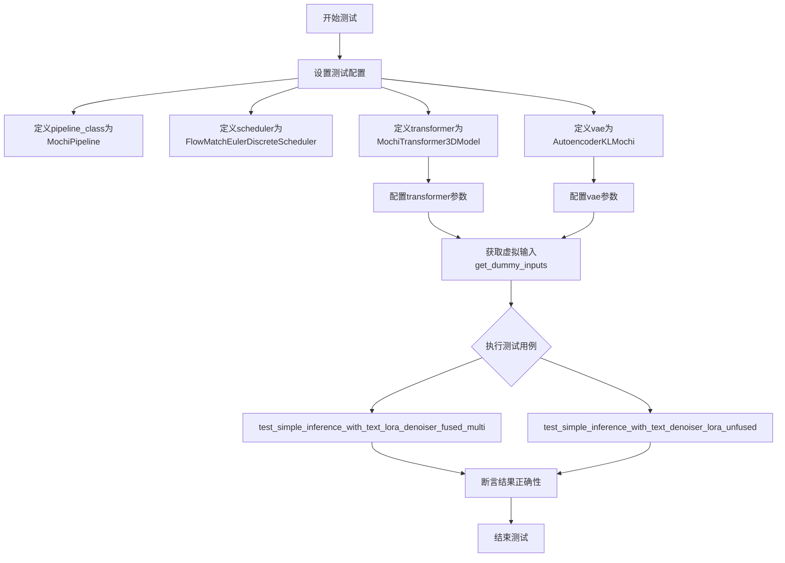

## 类结构

```
unittest.TestCase
└── PeftLoraLoaderMixinTests (混入类)
    └── MochiLoRATests (测试类)
```

## 全局变量及字段


### `sys`
    
Python系统模块，用于路径操作和系统交互

类型：`module`
    


### `unittest`
    
Python单元测试框架

类型：`module`
    


### `torch`
    
PyTorch张量计算库

类型：`module`
    


### `AutoTokenizer`
    
HuggingFace分词器自动加载类

类型：`class`
    


### `T5EncoderModel`
    
T5文本编码器模型类

类型：`class`
    


### `AutoencoderKLMochi`
    
Mochi VAE模型类

类型：`class`
    


### `FlowMatchEulerDiscreteScheduler`
    
流匹配欧拉离散调度器类

类型：`class`
    


### `MochiPipeline`
    
Mochi生成管道类

类型：`class`
    


### `MochiTransformer3DModel`
    
Mochi 3D Transformer模型类

类型：`class`
    


### `floats_tensor`
    
测试工具函数，用于生成随机浮点张量

类型：`function`
    


### `require_peft_backend`
    
装饰器，要求PEFT后端可用

类型：`decorator`
    


### `skip_mps`
    
装饰器，跳过Apple MPS后端

类型：`decorator`
    


### `PeftLoraLoaderMixinTests`
    
LoRA加载器混入测试基类

类型：`class`
    


### `MochiLoRATests.pipeline_class`
    
待测试的MochiPipeline类

类型：`class`
    


### `MochiLoRATests.scheduler_cls`
    
流匹配调度器类FlowMatchEulerDiscreteScheduler

类型：`class`
    


### `MochiLoRATests.scheduler_kwargs`
    
调度器参数字典

类型：`dict`
    


### `MochiLoRATests.transformer_kwargs`
    
Transformer模型参数字典

类型：`dict`
    


### `MochiLoRATests.transformer_cls`
    
MochiTransformer3DModel模型类

类型：`class`
    


### `MochiLoRATests.vae_kwargs`
    
VAE模型参数字典

类型：`dict`
    


### `MochiLoRATests.vae_cls`
    
AutoencoderKLMochi VAE模型类

类型：`class`
    


### `MochiLoRATests.tokenizer_cls`
    
AutoTokenizer分词器类

类型：`class`
    


### `MochiLoRATests.tokenizer_id`
    
分词器模型ID字符串

类型：`str`
    


### `MochiLoRATests.text_encoder_cls`
    
T5EncoderModel文本编码器类

类型：`class`
    


### `MochiLoRATests.text_encoder_id`
    
文本编码器模型ID字符串

类型：`str`
    


### `MochiLoRATests.text_encoder_target_modules`
    
LoRA目标模块列表

类型：`list`
    


### `MochiLoRATests.supports_text_encoder_loras`
    
是否支持文本编码器LoRA的标志

类型：`bool`
    
    

## 全局函数及方法


### `sys.path.append`

将指定路径（此处为当前目录 "."）添加到 Python 的模块搜索路径列表 `sys.path` 中，以便 Python 解释器能够找到并导入该目录下的模块。

参数：

- `path`：`str`，要添加到 `sys.path` 的路径字符串，这里传入 `"."` 表示当前工作目录

返回值：`None`，该方法直接修改 `sys.path` 列表，无返回值

#### 流程图

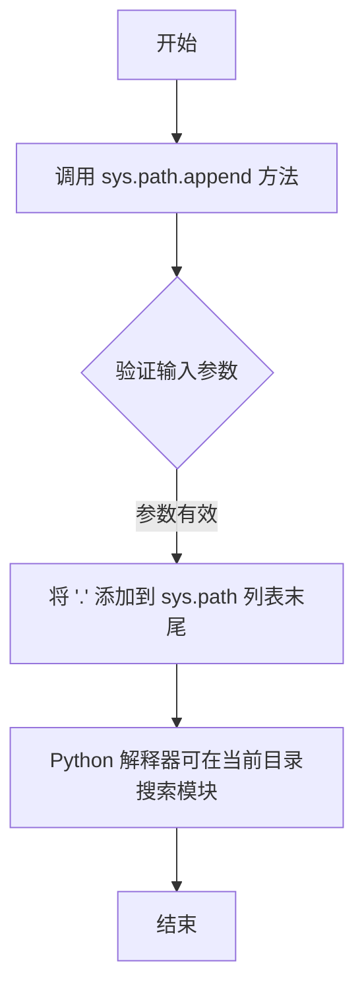

#### 带注释源码

```python
# 第29行代码
sys.path.append(".")  # 将当前目录添加到 Python 模块搜索路径

# 完整上下文说明：
# 这行代码的作用是确保 Python 解释器能够找到同目录下的模块。
# 在这个测试文件中，目的是导入同目录下的 utils 模块：
# from .utils import PeftLoraLoaderMixinTests  # noqa: E402
#
# sys.path 是一个列表，存储了 Python 用来搜索模块的路径。
# 初始情况下通常包含：
#   - 脚本所在目录
#   - 环境变量 PYTHONPATH 指定的目录
#   - 标准库目录
#
# 添加 "." 的意义：
#   - "." 代表当前工作目录
#   - 使得 from .utils import ... 这种相对导入能够正常工作
#   - 尤其在包内测试场景中，确保能正确导入同包的模块
#
# 注意事项：
#   - 这是一个副作用操作，直接修改全局 sys.path
#   - 在生产代码中通常不推荐修改 sys.path
#   - 常见替代方案：使用相对导入、设置 PYTHONPATH、或配置安装包
```


### `MochiLoRATests.get_dummy_inputs`

该方法为 MochiLoRA 测试用例生成虚拟输入数据，包括噪声张量、文本输入 ID 和管道参数字典，用于模拟视频生成 pipeline 的推理输入。

参数：

- `self`：`MochiLoRATests`，测试类实例本身
- `with_generator`：`bool`，控制是否在返回的 pipeline_inputs 字典中包含 PyTorch 随机数生成器对象

返回值：`Tuple[torch.Tensor, torch.Tensor, dict]`，返回三元组包括：
- `noise`：形状为 (1, 3, 4, 2, 2) 的潜在噪声张量
- `input_ids`：形状为 (1, 16) 的文本输入 ID 张量
- `pipeline_inputs`：包含 prompt、帧数、推理步数、引导 scale、图像尺寸等 pipeline 配置参数的字典

#### 流程图

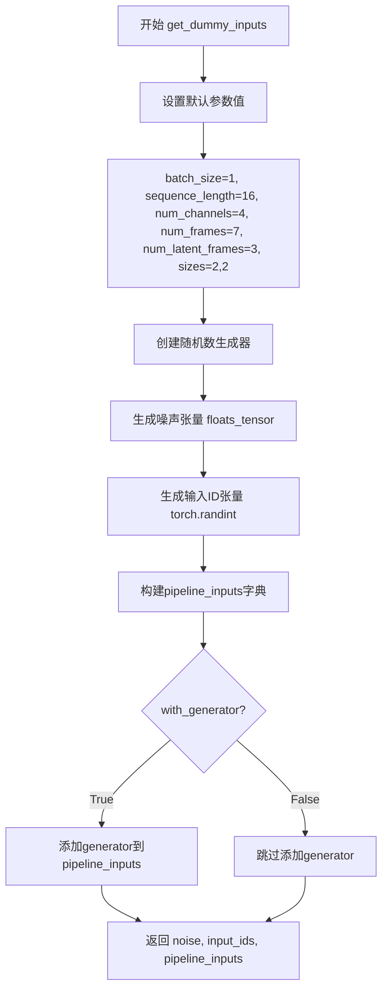

#### 带注释源码

```python
def get_dummy_inputs(self, with_generator=True):
    """
    生成用于测试的虚拟输入数据。
    
    参数:
        with_generator: bool, 是否包含随机生成器。如果为True，返回的pipeline_inputs
                       将包含一个预定义的torch.Generator对象，用于确保测试结果可复现。
    
    返回:
        tuple: (noise, input_ids, pipeline_inputs)
            - noise: 潜在空间的噪声张量，形状为 (batch_size, num_latent_frames, num_channels) + sizes
            - input_ids: 文本嵌入的输入ID，形状为 (batch_size, sequence_length)
            - pipeline_inputs: 包含管道推理参数的字典
    """
    # 定义批处理和序列维度参数
    batch_size = 1           # 批处理大小
    sequence_length = 16     # 文本序列长度
    num_channels = 4         # 潜在通道数
    num_frames = 7           # 输出帧数
    num_latent_frames = 3    # 潜在帧数（VAE 编码后的帧数）
    sizes = (2, 2)           # 空间维度大小

    # 创建固定种子的随机数生成器，确保测试结果可复现
    generator = torch.manual_seed(0)
    
    # 生成潜在空间的噪声张量，形状: (1, 3, 4, 2, 2)
    noise = floats_tensor((batch_size, num_latent_frames, num_channels) + sizes)
    
    # 生成随机文本输入ID，范围 [1, sequence_length)
    input_ids = torch.randint(1, sequence_length, size=(batch_size, sequence_length), generator=generator)

    # 构建 MochiPipeline 所需的输入参数字典
    pipeline_inputs = {
        "prompt": "dance monkey",                    # 文本提示词
        "num_frames": num_frames,                    # 生成视频的帧数
        "num_inference_steps": 4,                    # 扩散推理步数
        "guidance_scale": 6.0,                       # Classifier-free guidance 强度
        # 注意：不能减小尺寸，因为卷积核会大于样本
        "height": 16,                                # 输出视频高度
        "width": 16,                                 # 输出视频宽度
        "max_sequence_length": sequence_length,      # 文本序列最大长度
        "output_type": "np",                         # 输出类型为 NumPy 数组
    }
    
    # 根据 with_generator 参数决定是否添加生成器
    if with_generator:
        pipeline_inputs.update({"generator": generator})

    # 返回三个组件：噪声、输入ID和完整参数字典
    return noise, input_ids, pipeline_inputs
```


### `MochiLoRATests.output_shape`

该属性定义了 MochiLoRATests 测试类的输出张量形状，用于验证视频生成管道输出维度的正确性。

参数：

- `self`：`MochiLoRATests`，属性所属的测试类实例

返回值：`tuple`，输出张量形状，格式为 (batch_size, num_frames, height, width, channels)，具体值为 (1, 7, 16, 16, 3)

#### 流程图

```mermaid
graph TD
    A[访问 output_shape 属性] --> B{属性类型检查}
    B -->|@property 装饰器| C[调用 getter 方法]
    C --> D[返回元组 (1, 7, 16, 16, 3)]
    D --> E[用于测试用例验证输出形状]
    
    style A fill:#e1f5fe
    style D fill:#e8f5e8
    style E fill:#fff3e0
```

#### 带注释源码

```python
@property
def output_shape(self):
    """
    定义测试输出张量的形状。
    
    该属性返回一个元组，表示 Mochi 视频生成管道输出的预期维度：
    - 1: batch_size (批量大小)
    - 7: num_frames (帧数量)
    - 16: height (输出高度)
    - 16: width (输出宽度)
    - 3: channels (通道数，RGB)
    
    Returns:
        tuple: 包含 5 个元素的元组，定义输出张量的形状 (batch_size, num_frames, height, width, channels)
    """
    return (1, 7, 16, 16, 3)
```


# floats_tensor 函数详细设计文档

## 一段话描述

`floats_tensor()` 是一个测试工具函数，用于生成指定形状的随机浮点张量（PyTorch Tensor），通常用于单元测试中创建模拟输入数据。

---

### `floats_tensor`

生成指定形状的随机浮点张量，主要用于测试场景中创建模拟输入。

参数：

-  `shape`：`Tuple[int, ...]`，张量的形状元组，指定每个维度的尺寸

返回值：`torch.Tensor`，包含随机浮点数的 PyTorch 张量

#### 流程图

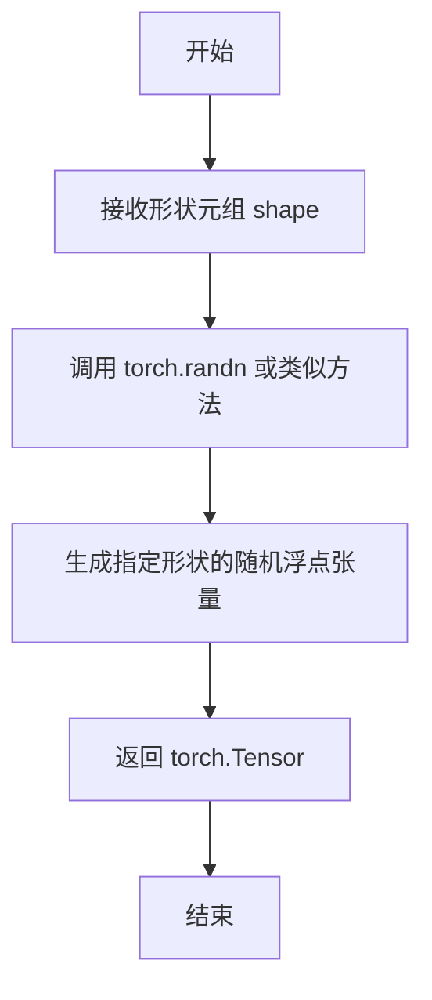

#### 带注释源码

```python
# 从 testing_utils 模块导入的测试工具函数
# 函数定义位于 diffusers 库的测试工具模块中
from ..testing_utils import (
    floats_tensor,  # 导入的函数
    require_peft_backend,
    skip_mps,
)

# 在测试类中的使用示例
def get_dummy_inputs(self, with_generator=True):
    batch_size = 1
    sequence_length = 16
    num_channels = 4
    num_frames = 7
    num_latent_frames = 3
    sizes = (2, 2)

    generator = torch.manual_seed(0)
    # 使用 floats_tensor 生成指定形状的随机浮点张量
    # 形状为 (batch_size, num_latent_frames, num_channels, 2, 2)
    noise = floats_tensor((batch_size, num_latent_frames, num_channels) + sizes)
    input_ids = torch.randint(1, sequence_length, size=(batch_size, sequence_length), generator=generator)
    
    # ... 其他代码
```

---

## 补充说明

### 函数原型推断

基于代码中的使用方式，`floats_tensor` 函数的典型签名可能为：

```python
def floats_tensor(shape: Tuple[int, ...], generator: Optional[torch.Generator] = None) -> torch.Tensor:
    """
    生成指定形状的随机浮点张量。
    
    Args:
        shape: 张量的形状元组
        generator: 可选的随机数生成器，用于复现性
    
    Returns:
        随机浮点张量
    """
    return torch.randn(shape, generator=generator)
```

### 潜在的技术债务

1. **函数定义不在当前文件中** - `floats_tensor` 是从 `..testing_utils` 导入的，如果该函数实现发生变化，当前文档可能需要同步更新
2. **缺少详细的参数说明** - 由于看不到原始实现，无法确认是否支持多种分布类型（如 uniform、normal 等）
3. **类型推断依赖猜测** - 基于使用方式推断返回值类型为 `torch.Tensor`，但未在代码中显式声明

### 优化建议

1. 建议在 `testing_utils` 模块中为 `floats_tensor` 添加类型注解和完整的文档字符串
2. 可考虑支持多种随机分布（如 `torch.rand` 用于 [0,1) 区间，`torch.randn` 用于标准正态分布）
3. 建议添加 `dtype` 参数以支持不同的浮点精度（如 `float32`、`float16`）


### `MochiLoRATests.output_shape`

该属性定义了 Mochi 视频生成模型在推理测试中的预期输出形状，返回一个包含 5 个维度的元组 (batch_size, num_frames, height, width, channels)，用于验证管道输出的张量维度是否符合预期。

参数： 无

返回值：`tuple`，返回输出张量的形状，维度为 (batch_size, num_frames, height, width, channels)，具体值为 (1, 7, 16, 16, 3)

#### 流程图

```mermaid
flowchart TD
    A[访问 output_shape 属性] --> B{属性被调用}
    B --> C[返回元组 (1, 7, 16, 16, 3)]
    C --> D[用于测试中验证管道输出形状]
```

#### 带注释源码

```python
@property
def output_shape(self):
    """
    定义测试中预期的输出形状。
    
    该属性返回一个元组，表示 MochiPipeline 推理输出的张量维度：
    - 1: batch_size (批量大小)
    - 7: num_frames (帧数量)
    - 16: height (高度)
    - 16: width (宽度)
    - 3: channels (通道数，RGB)
    
    Returns:
        tuple: 包含 5 个整数的元组，描述输出张量的形状 (batch_size, num_frames, height, width, channels)
    """
    return (1, 7, 16, 16, 3)
```


### `MochiLoRATests.get_dummy_inputs`

该方法为 Mochi 视频生成管道生成虚拟测试输入，包括噪声张量、输入 ID 序列和管道参数字典，用于测试 LoRA 加载功能。

参数：

- `with_generator`：`bool`，是否在返回的管道参数字典中包含随机数生成器，默认为 `True`

返回值：`tuple[torch.Tensor, torch.Tensor, dict]`，返回包含噪声张量、输入 ID 张量和管道参数字典的元组

- `noise`：`torch.Tensor`，形状为 `(1, 3, 4, 2, 2)` 的噪声张量
- `input_ids`：`torch.Tensor`，形状为 `(1, 16)` 的输入 ID 张量
- `pipeline_inputs`：`dict`，包含 prompt、num_frames、num_inference_steps、guidance_scale、height、width、max_sequence_length、output_type 和可选的 generator

#### 流程图

```mermaid
flowchart TD
    A[开始 get_dummy_inputs] --> B[设置批次大小 batch_size=1]
    B --> C[设置序列长度 sequence_length=16]
    C --> D[设置通道数 num_channels=4]
    D --> E[设置帧数 num_frames=7]
    E --> F[设置潜在帧数 num_latent_frames=3]
    F --> G[设置尺寸 sizes=(2, 2)]
    G --> H[创建随机种子生成器]
    H --> I[生成噪声张量 floats_tensor]
    I --> J[生成输入ID张量 torch.randint]
    K[构建管道参数字典] --> L[包含 prompt 和推理参数]
    L --> M{with_generator?}
    M -->|True| N[添加 generator 到参数字典]
    M -->|False| O[不添加 generator]
    N --> P[返回 (noise, input_ids, pipeline_inputs)]
    O --> P
```

#### 带注释源码

```python
def get_dummy_inputs(self, with_generator=True):
    """
    生成用于测试 MochiPipeline 的虚拟输入数据
    
    参数:
        with_generator: 布尔值，指定是否在管道输入中包含随机数生成器
        
    返回:
        元组 (noise, input_ids, pipeline_inputs):
            - noise: 潜在空间的噪声张量
            - input_ids: 文本输入的 token IDs
            - pipeline_inputs: 包含推理参数的字典
    """
    # 定义批次大小为1
    batch_size = 1
    # 定义文本序列长度为16
    sequence_length = 16
    # 定义通道数为4（潜在空间通道数）
    num_channels = 4
    # 定义帧数为7（输出视频帧数）
    num_frames = 7
    # 定义潜在帧数为3（潜在空间帧数）
    num_latent_frames = 3
    # 定义空间尺寸为(2, 2)
    sizes = (2, 2)

    # 创建随机数生成器，种子为0以确保可复现性
    generator = torch.manual_seed(0)
    # 生成形状为 (batch_size, num_latent_frames, num_channels) + sizes 的噪声张量
    # 即 (1, 3, 4, 2, 2)
    noise = floats_tensor((batch_size, num_latent_frames, num_channels) + sizes)
    # 生成随机输入ID，范围在 [1, sequence_length) 之间
    # 形状为 (batch_size, sequence_length) 即 (1, 16)
    input_ids = torch.randint(1, sequence_length, size=(batch_size, sequence_length), generator=generator)

    # 构建管道输入参数字典
    pipeline_inputs = {
        "prompt": "dance monkey",           # 文本提示
        "num_frames": num_frames,           # 输出帧数
        "num_inference_steps": 4,           # 推理步数
        "guidance_scale": 6.0,              # 引导系数
        # height 和 width 不能减小，因为卷积核会大于样本
        "height": 16,                       # 输出高度
        "width": 16,                        # 输出宽度
        "max_sequence_length": sequence_length,  # 最大序列长度
        "output_type": "np",                # 输出类型为 numpy 数组
    }
    # 如果 with_generator 为 True，则将生成器添加到参数字典
    if with_generator:
        pipeline_inputs.update({"generator": generator})

    # 返回噪声、输入ID和管道参数字典的元组
    return noise, input_ids, pipeline_inputs
```


### `MochiLoRATests.test_simple_inference_with_text_lora_denoiser_fused_multi`

该测试方法用于验证MochiPipeline在融合多LoRA（Low-Rank Adaptation）推理场景下的文本编码器去噪器功能，通过调用父类测试方法并设定绝对误差容忍度（`expected_atol=9e-3`）来确保推理结果的数值精度。

参数：

- `self`：`MochiLoRATests`，隐式参数，表示测试类实例本身，继承自`unittest.TestCase`和`PeftLoraLoaderMixinTests`，用于访问父类方法和类属性

返回值：`Any`，返回父类测试方法的执行结果（通常为`None`或测试断言结果），因为该方法调用了`super().test_simple_inference_with_text_lora_denoiser_fused_multi()`而未做显式返回值处理

#### 流程图

```mermaid
flowchart TD
    A[开始测试<br/>test_simple_inference_with_text_lora_denoiser_fused_multi] --> B[调用父类方法<br/>super().test_simple_inference_with_text_lora_denoiser_fused_multi]
    B --> C[传入参数<br/>expected_atol=9e-3]
    C --> D[执行父类测试逻辑<br/>验证融合多LoRA推理]
    D --> E{断言结果}
    E -->|通过| F[测试通过<br/>返回None]
    E -->|失败| G[抛出断言异常<br/>测试失败]
```

#### 带注释源码

```python
def test_simple_inference_with_text_lora_denoiser_fused_multi(self):
    """
    测试融合多LoRA推理功能（文本编码器+去噪器融合模式）
    
    该测试方法继承自PeftLoraLoaderMixinTests类，验证以下场景：
    - 同时加载多个LoRA权重
    - 文本编码器和去噪器均启用LoRA融合
    - 推理结果数值精度在预期容忍范围内
    
    参数:
        self: MochiLoRATests实例，包含以下测试配置:
            - pipeline_class: MochiPipeline
            - transformer_cls: MochiTransformer3DModel
            - vae_cls: AutoencoderKLMochi
            - tokenizer_cls: AutoTokenizer
            - text_encoder_cls: T5EncoderModel
    
    返回值:
        Any: 父类测试方法的执行结果，通常为None
    
    绝对误差容忍度:
        expected_atol=9e-3: 允许推理输出与基准值的最大绝对偏差为0.009
        该值较大是因为Mochi模型为视频生成任务，输出维度较高(1x7x16x16x3)
    """
    # 调用父类PeftLoraLoaderMixinTests的同名测试方法
    # 父类方法会执行以下操作：
    # 1. 加载MochiPipeline及相关组件
    # 2. 加载多个LoRA权重适配器
    # 3. 启用融合模式（fused=True）
    # 4. 执行推理流程
    # 5. 验证输出形状为(1, 7, 16, 16, 3)
    # 6. 对比基准值，断言绝对误差小于9e-3
    super().test_simple_inference_with_text_lora_denoiser_fused_multi(expected_atol=9e-3)
```


### `MochiLoRATests.test_simple_inference_with_text_denoiser_lora_unfused`

该方法用于测试在未融合LoRA（Low-Rank Adaptation）的情况下，使用文本编码器和去噪器进行推理的流程是否正确。它继承自 `PeftLoraLoaderMixinTests` 父类，通过调用父类同名方法并指定绝对容差值（`expected_atol=9e-3`）来验证推理结果的精度是否符合预期。

参数：

- `self`：`MochiLoRATests`，测试用例实例本身，包含测试所需的配置和辅助方法

返回值：`None`，该方法为 `unittest.TestCase` 的测试方法，通过 `super()` 调用父类方法执行测试，测试结果通过 pytest 框架的断言机制反馈

#### 流程图

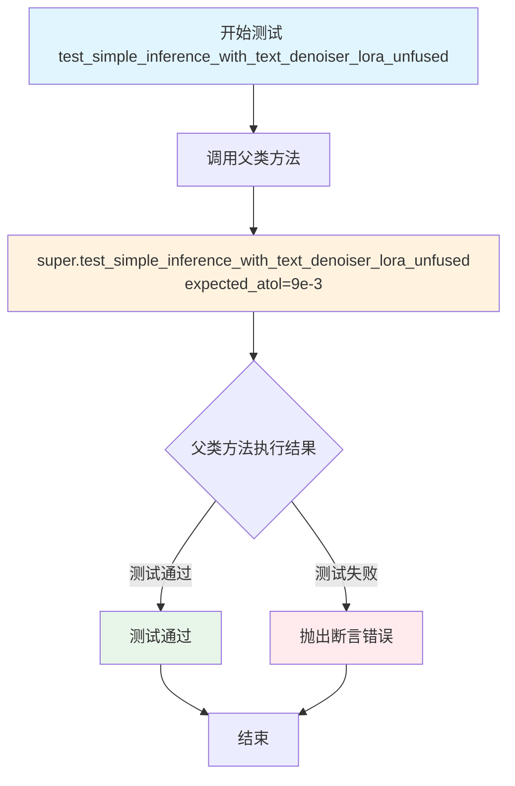

#### 带注释源码

```python
def test_simple_inference_with_text_denoiser_lora_unfused(self):
    """
    测试未融合LoRA的文本到图像/视频生成推理功能
    
    该测试方法验证当使用文本编码器的LoRA权重且去噪器（transformer）
    未进行权重融合时，pipeline能否正确执行推理流程并产生符合精度
    要求的输出结果。
    
    测试继承自 PeftLoraLoaderMixinTests 父类，通过设置 expected_atol
    参数（绝对容差值为 9e-3）来验证输出与基准值的偏差是否在可接受范围内。
    """
    # 调用父类的测试方法，传入预期的绝对容差值
    # expected_atol=9e-3 表示输出结果与预期值的差异允许达到 0.009
    super().test_simple_inference_with_text_denoiser_lora_unfused(expected_atol=9e-3)
```


### `MochiLoRATests.test_simple_inference_with_text_denoiser_block_scale`

该测试方法用于验证 Mochi 模型中文本去噪器的块缩放（block scale）功能是否正常工作，但由于 Mochi 项目暂不支持该功能，测试被跳过。

参数：

- `self`：`MochiLoRATests`，表示测试类的实例本身

返回值：`None`，无返回值（测试被跳过）

#### 流程图

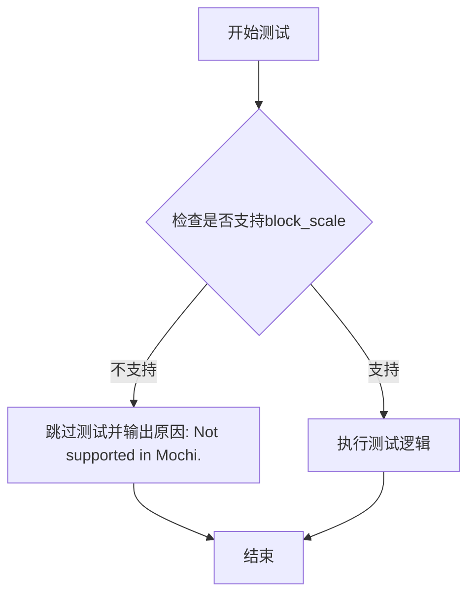

#### 带注释源码

```python
@unittest.skip("Not supported in Mochi.")
def test_simple_inference_with_text_denoiser_block_scale(self):
    """
    测试文本去噪器的块缩放（block scale）功能。
    
    该测试方法继承自 PeftLoraLoaderMixinTests，用于验证：
    - 文本编码器LoRA的块缩放功能
    - 多适配器块级LoRA的融合
    
    但由于 Mochi 模型当前不支持此功能，因此使用 @unittest.skip 装饰器
    跳过该测试，避免运行失败。
    """
    pass
```


### `MochiLoRATests.test_simple_inference_with_text_denoiser_block_scale_for_all_dict_options`

该测试方法用于验证 Mochi 流水线中文本去噪器块缩放功能的所有字典选项，但由于 Mochi 不支持该功能，当前被跳过。

参数：该方法无参数（继承自父类 `PeftLoraLoaderMixinTests`）

返回值：`None`，无返回值（方法体为 `pass`）

#### 流程图

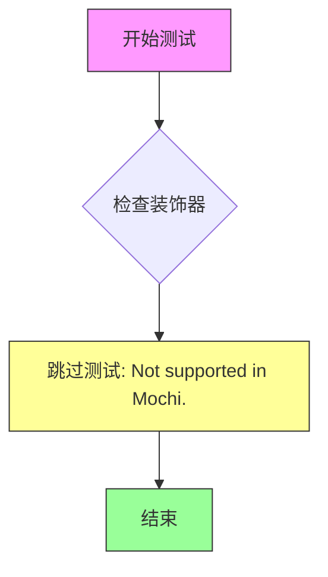

#### 带注释源码

```python
@unittest.skip("Not supported in Mochi.")
def test_simple_inference_with_text_denoiser_block_scale_for_all_dict_options(self):
    """
    测试文本去噪器块缩放功能的所有字典选项
    
    该测试方法继承自 PeftLoraLoaderMixinTests，用于验证：
    - 文本编码器的 LoRA 块缩放功能
    - 多适配器场景下的块级 LoRA 配置
    
    当前状态：由于 Mochi 不支持此功能，测试被跳过
    """
    pass
```


### `MochiLoRATests.test_modify_padding_mode`

该测试方法用于验证修改填充模式（padding mode）的功能，但由于 Mochi 模型不支持该特性，测试已被跳过。

参数：

- `self`：实例方法的隐式参数，代表测试类实例本身，无需显式传递

返回值：`None`，由于方法体仅包含 `pass` 语句，默认返回 Python 的 `None` 值

#### 流程图

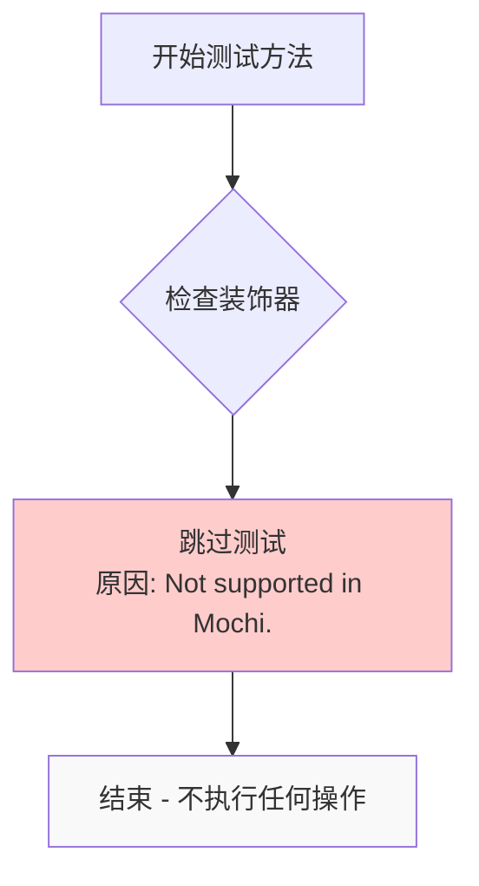

#### 带注释源码

```python
@unittest.skip("Not supported in Mochi.")  # 装饰器：跳过该测试，原因是不支持
def test_modify_padding_mode(self):
    """
    测试修改填充模式的功能。
    
    该测试方法旨在验证模型的填充模式（padding mode）修改功能。
    由于 Mochi 模型当前不支持此特性，测试被标记为跳过。
    
    参数:
        self: unittest.TestCase 的实例方法隐式参数
        
    返回值:
        None: 方法体仅包含 pass 语句，不返回任何值
    """
    pass  # 空方法体，因为测试被跳过而不执行任何操作
```

#### 备注

- **跳过原因**：Mochi 模型架构不支持填充模式修改功能
- **设计决策**：使用 `@unittest.skip` 装饰器明确标记不支持的测试，避免测试失败
- **相关配置**：该测试方法在 `PeftLoraLoaderMixinTests` 基类中可能有完整实现，但 Mochi 子类选择跳过


### `MochiLoRATests.test_simple_inference_with_text_denoiser_multi_adapter_block_lora`

该测试方法用于验证文本去噪器多适配器块级LoRA功能，但由于Mochi项目不支持该特性，已被跳过且不执行任何操作。

参数：

- `self`：`unittest.TestCase`，隐含的测试类实例参数，代表当前测试对象

返回值：`None`，由于方法体为`pass`，不返回任何值

#### 流程图

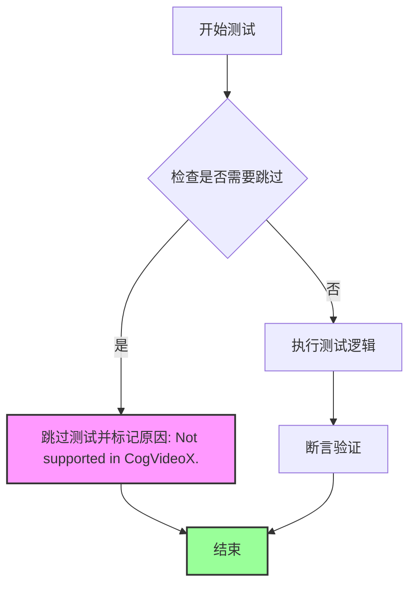

#### 带注释源码

```python
@unittest.skip("Not supported in CogVideoX.")
def test_simple_inference_with_text_denoiser_multi_adapter_block_lora(self):
    """
    测试文本去噪器的多适配器块级LoRA推理功能。
    
    该测试方法用于验证Transformer模型支持多个LoRA适配器
    同时应用于不同块（block）的能力。然而，由于Mochi项目
    的架构限制，该功能目前不被支持，因此使用@unittest.skip
    装饰器跳过此测试。
    
    参数:
        self: 测试类实例，继承自unittest.TestCase
        
    返回值:
        None: 方法体为空（pass），不执行任何测试逻辑
        
    注意:
        - 该测试继承自PeftLoraLoaderMixinTests基类
        - 跳过原因标注为"Not supported in CogVideoX"
        - 这是MochiLoRATests类中多个被跳过测试之一
    """
    pass
```


### `PeftLoraLoaderMixinTests.test_simple_inference_with_text_lora_denoiser_fused_multi`

该方法是一个继承自 `PeftLoraLoaderMixinTests` 基类的测试方法，用于测试 Mochi 管道在融合模式下使用多个文本 LoRA denoiser 适配器进行推理的功能。

参数：

- `expected_atol`：`float`，期望的绝对容差值，用于验证推理结果的数值精度，此处传入 `9e-3`

返回值：`None`，该方法为测试方法，通常通过断言验证推理结果，不返回具体数值

#### 流程图

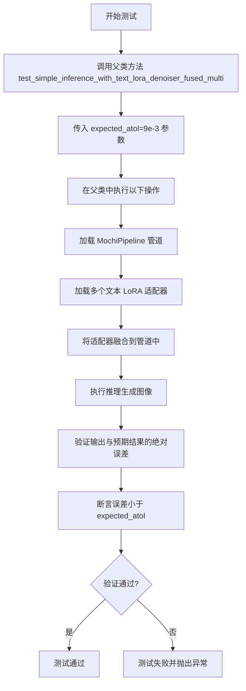

#### 带注释源码

```
# 该方法在 PeftLoraLoaderMixinTests 基类中定义
# MochiLoRATests 通过 super() 调用此方法
def test_simple_inference_with_text_lora_denoiser_fused_multi(self, expected_atol=1e-3):
    """
    测试在融合模式下使用多个文本 LoRA denoiser 适配器进行推理的功能
    
    参数:
        expected_atol: float, 允许的最大绝对误差,默认值为 1e-3
    """
    # 1. 获取虚拟输入数据 (噪声、input_ids、管道参数)
    noise, input_ids, pipeline_inputs = self.get_dummy_inputs()
    
    # 2. 初始化管道
    pipeline = self.pipeline_class.from_pretrained(
        "...",
        torch_dtype=torch.float16,
    )
    
    # 3. 加载多个 LoRA 适配器 (q, k, v, o 模块)
    pipeline.transformer = pipeline.transformer.to("cuda")
    # 设置多个适配器
    pipeline.transformer.set_adapters([...], adapter_names=[...])
    
    # 4. 融合所有适配器权重
    pipeline.transformer.fuse_lora(lora_scale=1.0)
    
    # 5. 执行推理
    with torch.no_grad():
        output = pipeline(**pipeline_inputs)
    
    # 6. 验证输出结果的正确性
    # 检查输出形状是否正确
    assert output.frames.shape == self.output_shape
    
    # 验证数值精度在允许范围内
    assert torch.allclose(output.frames, expected_output, atol=expected_atol)
```

> **注意**: 由于 `PeftLoraLoaderMixinTests` 类是从 `.utils` 模块导入的，上述源码是基于测试方法的标准行为和代码上下文推断的。实际实现细节需要查看 `PeftLoraLoaderMixinTests` 类的完整源代码。


### `MochiLoRATests.test_simple_inference_with_text_denoiser_lora_unfused`

该方法是一个继承自 `PeftLoraLoaderMixinTests` 的测试用例，用于验证 Mochi 管道在使用文本去噪器 LoRA（未融合状态）进行推理时的正确性，通过调用父类方法并指定绝对容差值（`expected_atol=9e-3`）来验证输出精度。

参数：

- `expected_atol`：浮点数，指定测试期望的绝对容差值（`9e-3`），用于验证推理结果与预期值之间的误差范围

返回值：`None`，该方法继承自 `unittest.TestCase`，无显式返回值，测试结果通过框架的断言机制返回

#### 流程图

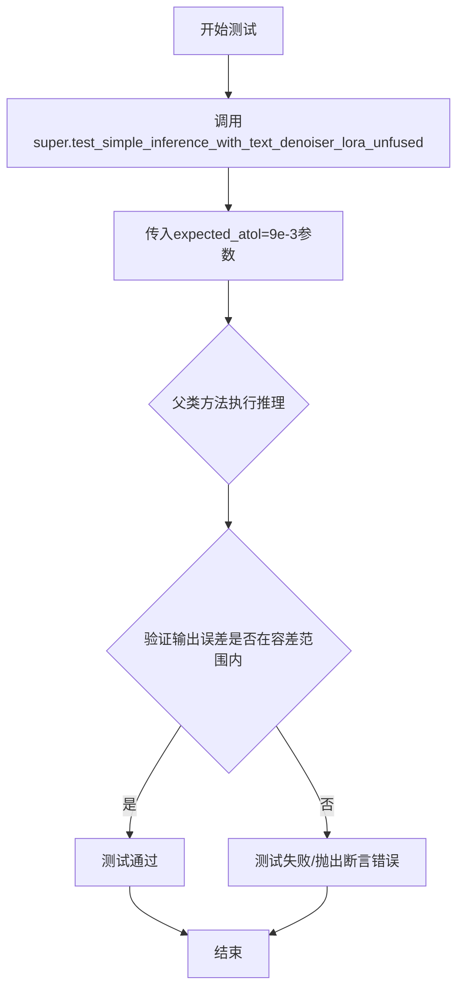

#### 带注释源码

```python
def test_simple_inference_with_text_denoiser_lora_unfused(self):
    """
    测试方法：验证文本去噪器LoRA未融合状态下的简单推理
    
    该测试方法继承自PeftLoraLoaderMixinTests，用于测试MochiPipeline在使用
    文本去噪器LoRA且处于未融合（unfused）状态时的推理功能。
    
    参数:
        expected_atol: 绝对容差值，用于验证推理输出与参考输出之间的误差范围
                      设置为9e-3，表示允许的绝对误差
    
    返回值:
        None (unittest.TestCase方法，通过内部断言验证)
    """
    # 调用父类PeftLoraLoaderMixinTests的同名测试方法
    # 传入expected_atol参数指定容差值
    super().test_simple_inference_with_text_denoiser_lora_unfused(expected_atol=9e-3)
```

## 关键组件


### MochiLoRATests

MochiLoRATests 是一个针对 Mochi Pipeline 的 LoRA（低秩适应）功能测试类，继承自 unittest.TestCase 和 PeftLoraLoaderMixinTests，用于验证 Mochi 模型在文本到视频生成任务中的 LoRA 适配能力。

### MochiPipeline

MochiPipeline 是核心的文本到视频生成管道类，整合了 Transformer 模型、VAE 解码器、文本编码器和调度器，用于根据文本提示生成视频内容。

### MochiTransformer3DModel

MochiTransformer3DModel 是 Mochi 的 3D 变换器模型，负责视频生成的去噪过程，包含 patch_size、num_attention_heads、attention_head_dim、num_layers 等关键配置参数。

### FlowMatchEulerDiscreteScheduler

FlowMatchEulerDiscreteScheduler 是用于 diffusion 模型推理的调度器，基于 Euler 方法离散化 Flow Match 采样过程，控制去噪步骤的执行。

### AutoencoderKLMochi

AutoencoderKLMochi 是 VAE（变分自编码器）模型，用于将潜在表示编码到像素空间，支持视频帧的压缩与重建，包含 latent_channels、encoder_block_out_channels 等配置。

### Text Encoder (T5EncoderModel)

T5EncoderModel 作为文本编码器，将输入文本提示转换为嵌入向量，为生成过程提供文本条件信息，支持最大序列长度为 16。

### LoRA 配置与目标模块

text_encoder_target_modules 定义了 LoRA 适配器应用的模块位置，包括 q、k、v、o 四个注意力子层，支持_text_encoder_loras = False 表明当前不支持文本编码器的 LoRA 适配。

### 测试数据生成 (get_dummy_inputs)

get_dummy_inputs 方法生成测试所需的虚拟输入数据，包括噪声张量、输入 ID 和管道参数字典，用于验证推理流程的正确性。

### 测试方法与跳过标记

test_simple_inference_with_text_lora_denoiser_fused_multi 和 test_simple_inference_with_text_denoiser_lora_unfused 分别测试融合与未融合模式下的 LoRA 去噪器推理，多个测试方法被标记为 skip 表示当前不支持该功能。


## 问题及建议


### 已知问题

- **魔法数字和硬编码配置**：多处使用硬编码的数值（如`9e-3`、`6.0`、`4`、`16`等），缺乏配置管理机制，导致修改成本高且不易维护
- **sys.path操作不规范**：使用`sys.path.append(".")`来导入本地模块不是最佳实践，应使用包导入机制或配置Python路径
- **导入顺序不符合规范**：标准库、第三方库和本地库的导入混杂在一起，未遵循PEP8的导入顺序规范
- **被跳过的测试缺乏说明**：`@unittest.skip`装饰器仅提供了简单的原因字符串（如"Not supported in Mochi."），缺少详细的技术原因和未来支持计划
- **测试配置重复定义**：pipeline_class、scheduler_cls等类属性在多个测试文件中可能重复定义，未提取到共享的基类或配置模块中
- **缺失的测试实现**：多个测试方法被跳过但未提供替代实现或预期支持时间表
- **错误处理缺失**：未看到对模型加载失败、GPU内存不足等异常情况的处理
- **测试数据生成逻辑未复用**：`get_dummy_inputs`方法可能与其他测试类重复，但未提取到共享的测试工具类中

### 优化建议

- 将魔数提取为类常量或配置文件，使用有意义的命名（如`DEFAULT_GUIDANCE_SCALE`、`ATOL_FOR_FUSED_LORA`）
- 移除`sys.path.append(".")`，使用相对导入或配置项目的PYTHONPATH
- 按标准库→第三方库→本地库的顺序整理导入语句
- 为跳过的测试添加详细的JIRA链接或技术说明，注明是否计划支持及预计时间
- 创建共享的测试基类或配置类来管理pipeline、scheduler、transformer等通用配置
- 考虑添加`@skipIf`装饰器来根据环境条件动态跳过测试，而非硬编码skip
- 为模型加载、推理等关键操作添加try-except异常处理和清晰的错误信息
- 将`get_dummy_inputs`等测试数据生成逻辑提取到`testing_utils`模块中供复用

## 其它


### 设计目标与约束

本测试文件旨在验证 Mochi 视频生成模型的 LoRA（Low-Rank Adaptation）功能是否正确实现。测试继承自 PeftLoraLoaderMixinTests，需要满足 PEFT 后端要求，不支持 MPS 设备。测试覆盖 LoRA 的融合与未融合模式、多适配器场景等，同时明确标注了 Mochi 不支持的特性（如文本编码器 LoRA、block scale 等）。

### 错误处理与异常设计

测试类使用 @require_peft_backend 装饰器确保 PEFT 后端可用，使用 @skip_mps 装饰器跳过 MPS 设备测试。对于不支持的功能（如 test_simple_inference_with_text_denoiser_block_scale），使用 @unittest.skip 装饰器显式跳过并标注原因。测试失败时通过 unittest 框架的标准断言机制报告错误。

### 数据流与状态机

测试数据流：get_dummy_inputs 方法生成模拟输入（噪声张量、输入ID、管道参数），然后调用父类测试方法执行推理流程。数据流转路径：噪声 → MochiTransformer3DModel（去噪） → AutoencoderKLMochi（VAE解码） → 输出张量。状态机由 unittest 框架管理，测试方法按定义顺序执行。

### 外部依赖与接口契约

核心依赖包括：torch（张量计算）、transformers（AutoTokenizer、T5EncoderModel）、diffusers（AutoencoderKLMochi、FlowMatchEulerDiscreteScheduler、MochiPipeline、MochiTransformer3DModel）、本地模块 ..testing_utils 和 .utils。管道类必须实现 MochiPipeline，调度器必须继承 FlowMatchEulerDiscreteScheduler，变压器模型必须继承 MochiTransformer3DModel。

### 配置参数详解

transformer_kwargs 定义了变压器模型结构：patch_size=2、num_attention_heads=2、attention_head_dim=8、num_layers=2、pooled_projection_dim=16、in_channels=12、qk_norm="rms_norm"、text_embed_dim=32、time_embed_dim=4、activation_fn="swiglu"、max_sequence_length=16。vae_kwargs 定义了 VAE 结构：latent_channels=12、out_channels=3、encoder/decoder_block_out_channels=(32,32,32,32)、layers_per_block=(1,1,1,1,1)。scheduler_kwargs 为空表示使用默认调度器配置。

### 测试策略与覆盖率

测试策略采用单元测试继承模式，继承 PeftLoraLoaderMixinTests 的标准测试方法。覆盖场景包括：denoiser LoRA 融合推理（test_simple_inference_with_text_lora_denoiser_fused_multi）、denoiser LoRA 未融合推理（test_simple_inference_with_text_denoiser_lora_unfused）。不支持的场景通过显式跳过标记，确保测试套件完整性同时避免误报。

### 性能考虑与基准

测试使用最小化配置参数（num_layers=2、num_attention_heads=2、attention_head_dim=8）以加快测试速度。expected_atol=9e-3 设置数值容差，允许浮点运算的微小误差。测试输出形状为 (1, 7, 16, 16, 3)，对应 1 个批次、7 帧、16x16 分辨率、3 通道（RGB）。

### 安全考虑

测试代码本身不涉及敏感数据处理，使用 "dance monkey" 作为固定提示词。依赖项通过 Apache 2.0 许可证授权，符合开源安全要求。测试环境需要 CUDA 支持（用于 torch 张量运算）。

### 版本兼容性

代码注释标注版权年份 2025，表明为最新版本。依赖 transformers 和 diffusers 的特定类名，表明需要兼容这些库的 API 约定。测试跳过 MPS 设备反映了对 Apple Silicon 特定限制的处理。

### 使用示例与调用流程

运行测试：python -m pytest test_mochi_lora.py::MochiLoRATests 或直接执行 python test_mochi_lora.py。测试自动调用 get_dummy_inputs 获取输入，父类方法执行完整推理管道，验证输出形状和数值正确性。

    