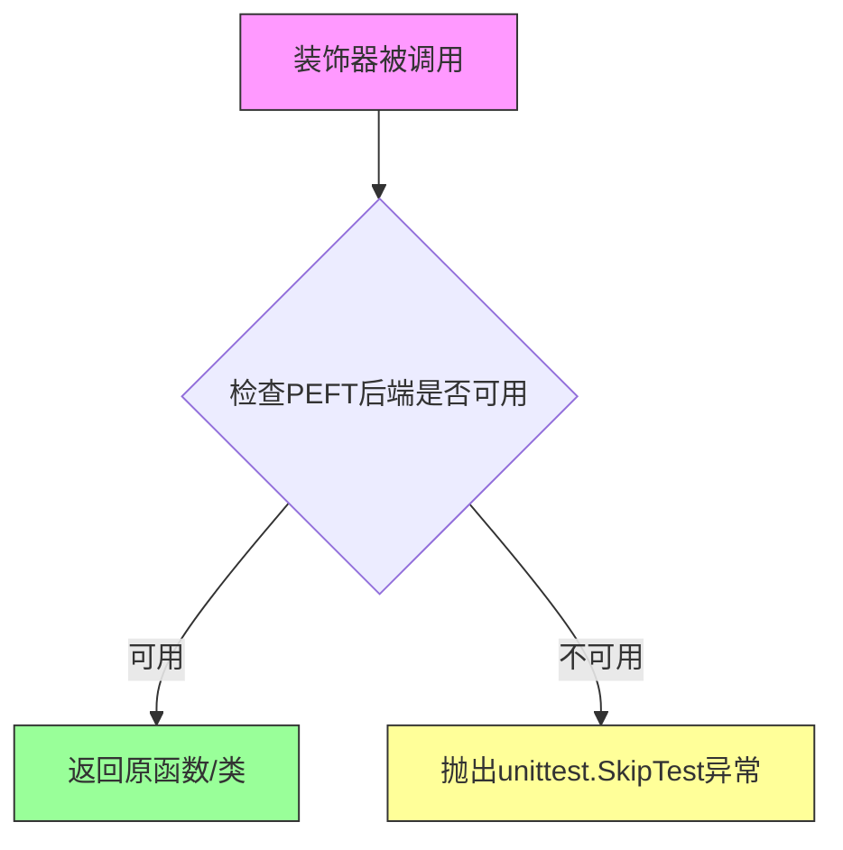
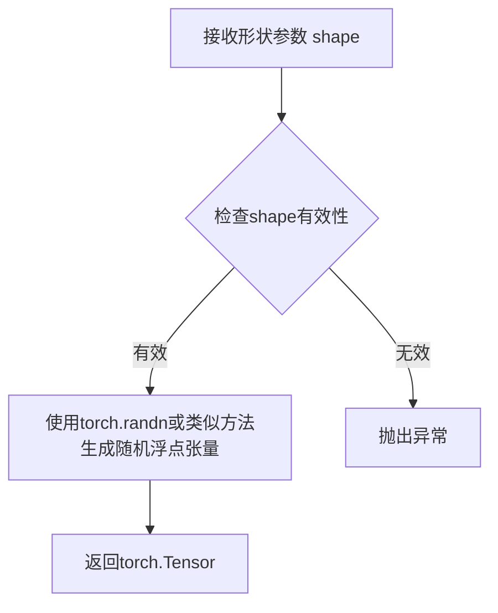
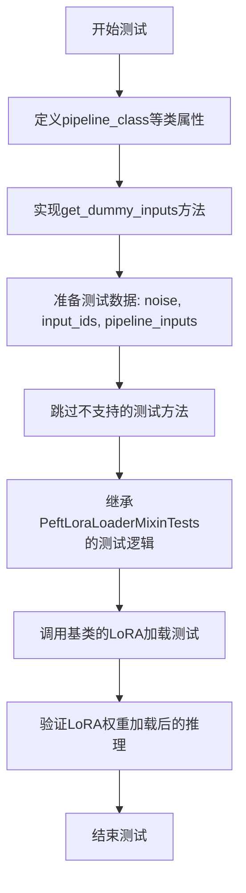
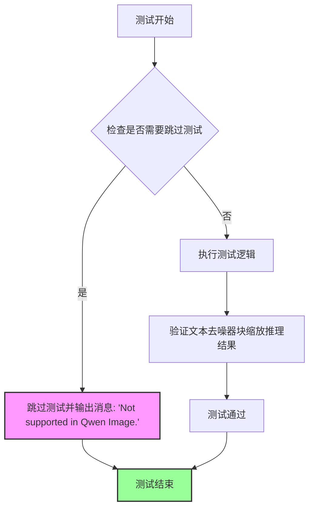
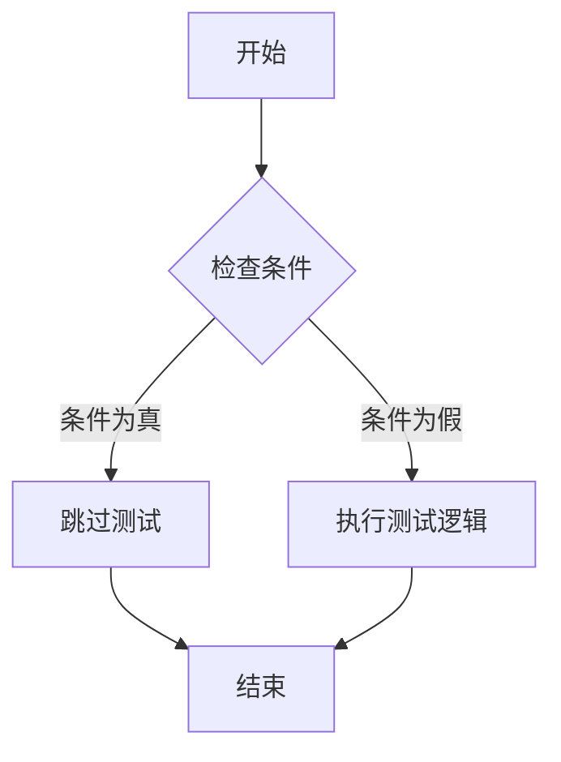
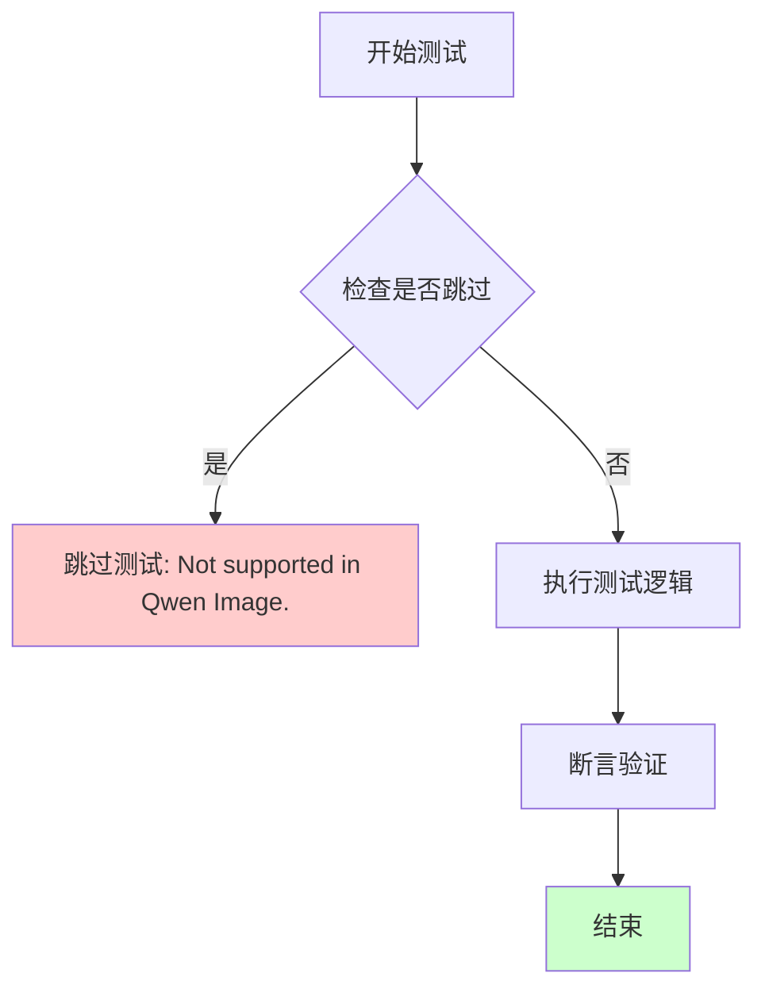

# `diffusers\tests\lora\test_lora_layers_qwenimage.py` 详细设计文档

这是一个基于unittest框架的测试文件，用于验证Qwen2.5-VL图像模型在diffusers库中的LoRA（Low-Rank Adaptation）功能是否正常工作，涵盖了pipeline、scheduler、transformer、VAE、tokenizer和text_encoder等组件的加载与推理测试。

## 整体流程

```mermaid
graph TD
    A[开始测试] --> B[加载依赖模块]
B --> C[定义QwenImageLoRATests测试类]
C --> D[配置pipeline_class为QwenImagePipeline]
D --> E[配置scheduler为FlowMatchEulerDiscreteScheduler]
E --> F[配置transformer参数: patch_size=2, in_channels=16, out_channels=4等]
F --> G[配置VAE参数: z_dim=4, dim_mult=[1,2,4]等]
G --> H[定义get_dummy_inputs方法生成测试数据]
H --> I[生成随机噪声张量floats_tensor]
I --> J[生成随机input_ids]
J --> K[构建pipeline_inputs字典包含prompt、num_inference_steps等]
K --> L[返回noise, input_ids, pipeline_inputs]
L --> M[执行各类测试用例（部分已跳过）]
```

## 类结构

```
unittest.TestCase
└── QwenImageLoRATests (继承PeftLoraLoaderMixinTests)
    ├── pipeline_class: QwenImagePipeline
    ├── scheduler_cls: FlowMatchEulerDiscreteScheduler
    ├── transformer_cls: QwenImageTransformer2DModel
    ├── vae_cls: AutoencoderKLQwenImage
    ├── tokenizer_cls: Qwen2Tokenizer
    └── text_encoder_cls: Qwen2_5_VLForConditionalGeneration
```

## 全局变量及字段


### `patch_size`
    
transformer补丁大小

类型：`int`
    


### `in_channels`
    
输入通道数

类型：`int`
    


### `out_channels`
    
输出通道数

类型：`int`
    


### `num_layers`
    
层数

类型：`int`
    


### `attention_head_dim`
    
注意力头维度

类型：`int`
    


### `num_attention_heads`
    
注意力头数量

类型：`int`
    


### `joint_attention_dim`
    
联合注意力维度

类型：`int`
    


### `guidance_embeds`
    
是否启用引导嵌入

类型：`bool`
    


### `axes_dims_rope`
    
RoPE轴维度

类型：`tuple`
    


### `base_dim`
    
VAE基础维度

类型：`int`
    


### `dim_mult`
    
VAE维度倍数

类型：`list`
    


### `num_res_blocks`
    
残差块数量

类型：`int`
    


### `temperal_downsample`
    
时间下采样配置

类型：`list`
    


### `latents_mean`
    
潜在变量均值

类型：`list`
    


### `latents_std`
    
潜在变量标准差

类型：`list`
    


### `batch_size`
    
批次大小

类型：`int`
    


### `sequence_length`
    
序列长度

类型：`int`
    


### `num_channels`
    
通道数

类型：`int`
    


### `sizes`
    
图像尺寸

类型：`tuple`
    


### `QwenImageLoRATests.pipeline_class`
    
测试用的pipeline类

类型：`class`
    


### `QwenImageLoRATests.scheduler_cls`
    
调度器类

类型：`class`
    


### `QwenImageLoRATests.scheduler_kwargs`
    
调度器参数

类型：`dict`
    


### `QwenImageLoRATests.transformer_kwargs`
    
transformer模型参数

类型：`dict`
    


### `QwenImageLoRATests.transformer_cls`
    
transformer模型类

类型：`class`
    


### `QwenImageLoRATests.z_dim`
    
VAE潜在空间维度

类型：`int`
    


### `QwenImageLoRATests.vae_kwargs`
    
VAE模型参数

类型：`dict`
    


### `QwenImageLoRATests.vae_cls`
    
VAE模型类

类型：`class`
    


### `QwenImageLoRATests.tokenizer_cls`
    
分词器类

类型：`class`
    


### `QwenImageLoRATests.tokenizer_id`
    
分词器模型ID

类型：`str`
    


### `QwenImageLoRATests.text_encoder_cls`
    
文本编码器类

类型：`class`
    


### `QwenImageLoRATests.text_encoder_id`
    
文本编码器模型ID

类型：`str`
    


### `QwenImageLoRATests.denoiser_target_modules`
    
可训练的LoRA目标模块列表

类型：`list`
    


### `QwenImageLoRATests.supports_text_encoder_loras`
    
是否支持文本编码器LoRA

类型：`bool`
    


### `QwenImageLoRATests.output_shape`
    
返回输出张量形状

类型：`property`
    


### `QwenImageLoRATests.get_dummy_inputs`
    
生成虚拟输入数据用于测试

类型：`method`
    


### `QwenImageLoRATests.test_simple_inference_with_text_denoiser_block_scale`
    
已跳过不支持

类型：`method`
    


### `QwenImageLoRATests.test_simple_inference_with_text_denoiser_block_scale_for_all_dict_options`
    
已跳过不支持

类型：`method`
    


### `QwenImageLoRATests.test_modify_padding_mode`
    
已跳过不支持

类型：`method`
    
    

## 全局函数及方法


### `require_peft_backend`

这是一个测试装饰器，用于标记测试类或测试方法需要 PEFT（Parameter-Efficient Fine-Tuning）后端才能运行。如果系统没有安装 PEFT 或没有正确的 PEFT 配置，相关测试将被跳过。

参数：
- 无直接参数（作为装饰器使用，接收被装饰的类或函数作为隐式参数）

返回值：返回被装饰的类或函数，如果条件不满足则抛出跳过异常

#### 流程图



#### 带注释源码

```python
# 由于require_peft_backend是从..testing_utils模块导入的，
# 当前代码文件中并未包含其完整实现定义
# 以下为基于使用方式的推断性源码结构：

def require_peft_backend(func_or_class):
    """
    装饰器：检查PEFT后端是否可用
    
    参数：
        func_or_class: 被装饰的函数或类对象
    
    返回：
        如果PEFT后端可用，返回原函数/类；否则抛出跳过异常
    """
    # 1. 检查PEFT库是否已安装
    # 2. 检查必要的PEFT依赖是否满足
    # 3. 如果检查失败，使用unittest.skip装饰器跳过测试
    
    @functools.wraps(func_or_class)
    def wrapper(*args, **kwargs):
        # 执行实际的检查逻辑
        if not _is_peft_available():
            raise unittest.SkipTest("PEFT backend is not available")
        return func_or_class(*args, **kwargs)
    
    return wrapper
```

#### 使用示例

```python
# 在给定代码中的实际使用方式
@require_peft_backend
class QwenImageLoRATests(unittest.TestCase, PeftLoraLoaderMixinTests):
    """
    使用require_peft_backend装饰器标记此类需要PEFT后端
    如果没有PEFT后端，此测试类将被跳过
    """
    pipeline_class = QwenImagePipeline
    # ... 其他测试配置
```


### `floats_tensor`

生成随机浮点张量的工具函数，用于测试目的。根据代码导入信息，该函数来自 `..testing_utils` 模块。

**注意**：该函数的实际定义不在当前代码文件中，以下信息基于其在 `get_dummy_inputs` 方法中的使用方式推断得出。

参数：

- `shape`：`tuple` 或 `torch.Size`，张量的形状，例如 `(batch_size, num_channels) + sizes`

返回值：`torch.Tensor`，包含随机浮点数的 PyTorch 张量

#### 流程图



#### 带注释源码

```python
# 该函数定义在 testing_utils 模块中，此处为基于使用的推断实现
def floats_tensor(shape, seed=None):
    """
    生成指定形状的随机浮点张量。
    
    参数:
        shape: 张量的形状元组，例如 (batch_size, num_channels, height, width)
        seed: 可选的随机种子，用于确保可重复性
    
    返回:
        torch.Tensor: 包含随机浮点数的张量
    """
    if seed is not None:
        torch.manual_seed(seed)
    
    # 生成标准正态分布的随机张量
    return torch.randn(shape)
```

#### 实际使用示例

```python
# 在 get_dummy_inputs 方法中的实际调用
noise = floats_tensor((batch_size, num_channels) + sizes)
# 其中 batch_size=1, num_channels=4, sizes=(32, 32)
# 最终生成形状为 (1, 4, 32, 32) 的随机浮点张量
```


# PeftLoraLoaderMixinTests 分析

从提供的代码片段来看，`PeftLoraLoaderMixinTests` 是从 `.utils` 模块导入的一个测试基类，当前代码文件中并没有直接定义该类的具体内容。但我可以通过分析 `QwenImageLoRATests` 对它的使用方式来推断其设计意图和结构。

---

### `QwenImageLoRATests` - Qwen图像LoRA测试类

这是继承自 `PeftLoraLoaderMixinTests` 的具体测试实现，用于验证 Qwen Image 模型在 PEFT 框架下加载 LoRA 权重的能力。

#### 参数

由于这是一个测试类，其参数主要通过类属性定义：

- `pipeline_class`：`QwenImagePipeline`，待测试的管道类
- `scheduler_cls`：`FlowMatchEulerDiscreteScheduler`，调度器类
- `scheduler_kwargs`：`dict`，调度器配置
- `transformer_cls`：`QwenImageTransformer2DModel`，Transformer模型类
- `transformer_kwargs`：`dict`，Transformer模型配置
- `vae_cls`：`AutoencoderKLQwenImage`，VAE模型类
- `vae_kwargs`：`dict`，VAE模型配置
- `tokenizer_cls`, `tokenizer_id`：分词器信息和路径
- `text_encoder_cls`, `text_encoder_id`：文本编码器信息和路径
- `denoiser_target_modules`：`list`，LoRA应用的目标模块列表
- `supports_text_encoder_loras`：`bool`，是否支持文本编码器LoRA

#### 返回值

无返回值，这是一个测试用例类，通过 `unittest` 框架执行。

#### 流程图



#### 带注释源码

```python
@require_peft_backend  # 要求PEFT后端环境
class QwenImageLoRATests(unittest.TestCase, PeftLoraLoaderMixinTests):
    """
    Qwen Image模型的LoRA加载器测试类
    继承自unittest.TestCase和PeftLoraLoaderMixinTests基类
    """
    
    # === 管道和调度器配置 ===
    pipeline_class = QwenImagePipeline  # 待测试的扩散管道类
    scheduler_cls = FlowMatchEulerDiscreteScheduler  # 使用的调度器
    scheduler_kwargs = {}  # 调度器额外参数
    
    # === Transformer模型配置 ===
    transformer_kwargs = {
        "patch_size": 2,           # 图像分块大小
        "in_channels": 16,         # 输入通道数
        "out_channels": 4,         # 输出通道数
        "num_layers": 2,           # 层数
        "attention_head_dim": 16,  # 注意力头维度
        "num_attention_heads": 3,  # 注意力头数量
        "joint_attention_dim": 16, # 联合注意力维度
        "guidance_embeds": False,  # 是否使用引导嵌入
        "axes_dims_rope": (8, 4, 4), # RoPE轴维度
    }
    transformer_cls = QwenImageTransformer2DModel  # Transformer模型类
    
    # === VAE模型配置 ===
    z_dim = 4  # 潜在空间维度
    vae_kwargs = {
        "base_dim": z_dim * 6,
        "z_dim": z_dim,
        "dim_mult": [1, 2, 4],
        "num_res_blocks": 1,
        "temperal_downsample": [False, True],
        "latents_mean": [0.0] * 4,
        "latents_std": [1.0] * 4,
    }
    vae_cls = AutoencoderKLQwenImage  # VAE模型类
    
    # === 分词器和文本编码器配置 ===
    tokenizer_cls, tokenizer_id = Qwen2Tokenizer, "hf-internal-testing/tiny-random-Qwen25VLForCondGen"
    text_encoder_cls, text_encoder_id = (
        Qwen2_5_VLForConditionalGeneration,
        "hf-internal-testing/tiny-random-Qwen25VLForCondGen",
    )
    
    # === LoRA目标模块 ===
    denoiser_target_modules = ["to_q", "to_k", "to_v", "to_out.0"]  # QKV和输出层
    
    # === 支持特性标志 ===
    supports_text_encoder_loras = False  # Qwen Image不支持文本编码器LoRA
    
    @property
    def output_shape(self):
        """输出图像形状 (batch, height, width, channels)"""
        return (1, 8, 8, 3)
    
    def get_dummy_inputs(self, with_generator=True):
        """
        生成虚拟测试输入数据
        
        参数:
            with_generator: 是否包含随机生成器
            
        返回:
            tuple: (noise, input_ids, pipeline_inputs)
        """
        batch_size = 1
        sequence_length = 10
        num_channels = 4
        sizes = (32, 32)
    
        # 固定随机种子以保证测试可复现
        generator = torch.manual_seed(0)
        noise = floats_tensor((batch_size, num_channels) + sizes)  # 随机噪声
        input_ids = torch.randint(1, sequence_length, 
                                  size=(batch_size, sequence_length), 
                                  generator=generator)  # 随机输入ID
    
        # 管道输入参数
        pipeline_inputs = {
            "prompt": "A painting of a squirrel eating a burger",
            "num_inference_steps": 4,    # 推理步数
            "guidance_scale": 0.0,       # CFG引导强度
            "height": 8,                # 输出高度
            "width": 8,                 # 输出宽度
            "output_type": "np",        # 输出类型为numpy
        }
        if with_generator:
            pipeline_inputs.update({"generator": generator})
    
        return noise, input_ids, pipeline_inputs
    
    @unittest.skip("Not supported in Qwen Image.")
    def test_simple_inference_with_text_denoiser_block_scale(self):
        """跳过的测试：文本去噪器块缩放"""
        pass
    
    @unittest.skip("Not supported in Qwen Image.")
    def test_simple_inference_with_text_denoiser_block_scale_for_all_dict_options(self):
        """跳过的测试：所有字典选项的文本去噪器块缩放"""
        pass
    
    @unittest.skip("Not supported in Qwen Image.")
    def test_modify_padding_mode(self):
        """跳过的测试：修改填充模式"""
        pass
```

---

## 关于 PeftLoraLoaderMixinTests

由于提供的代码片段中没有 `PeftLoraLoaderMixinTests` 的完整定义（它是从 `.utils` 模块导入的），以下是基于该测试类的使用模式的合理推断：

### PeftLoraLoaderMixinTests 基类推测结构

```python
class PeftLoraLoaderMixinTests:
    """
    PEFT LoRA加载器混合测试基类
    提供LoRA权重加载、卸载、融合等通用测试方法
    """
    
    # 子类必须实现的类属性
    pipeline_class = None
    scheduler_cls = None
    transformer_cls = None
    vae_cls = None
    tokenizer_cls = None
    text_encoder_cls = None
    denoiser_target_modules = []
    supports_text_encoder_loras = False
    
    # 测试方法（由子类继承）
    def test_lora_load(self):
        """测试LoRA权重加载"""
        pass
    
    def test_lora_unload(self):
        """测试LoRA权重卸载"""
        pass
    
    def test_lora_fusion(self):
        """测试LoRA权重融合"""
        pass
    
    def test_simple_inference(self):
        """测试基础推理"""
        pass
```

### 关键组件信息

| 组件名称 | 描述 |
|---------|------|
| `QwenImagePipeline` | Qwen图像扩散管道 |
| `FlowMatchEulerDiscreteScheduler` | 基于流匹配的发散调度器 |
| `QwenImageTransformer2DModel` | Qwen图像Transformer模型 |
| `AutoencoderKLQwenImage` | Qwen图像VAE编码器 |
| `PeftLoraLoaderMixinTests` | LoRA加载器通用测试Mixin |

### 潜在技术债务与优化空间

1. **测试覆盖不完整**：多个测试方法被跳过，可能需要后续支持
2. **硬编码的测试参数**：部分参数如路径、维度等硬编码，可考虑参数化
3. **缺乏异步测试**：对于大规模模型推理，可考虑添加异步测试
4. **文本编码器LoRA不支持**：当前不支持文本编码器的LoRA，可能需要扩展


### `QwenImageLoRATests.output_shape`

该属性是一个只读属性，用于返回 Qwen2-VL 图像生成模型的输出张量形状。在测试场景中，输出形状被定义为 (1, 8, 8, 3)，其中 1 表示批量大小，8×8 表示空间维度，3 表示 RGB 通道数。此属性用于验证图像生成管道的输出是否符合预期的张量维度。

参数：
- 该属性无参数（为只读属性）

返回值：`Tuple[int, int, int, int]`，返回输出张量的形状 (1, 8, 8, 3)，依次表示批量大小、高度、宽度和通道数

#### 流程图

```mermaid
flowchart TD
    A[开始] --> B{访问 output_shape 属性}
    B --> C[返回元组 (1, 8, 8, 3)]
    C --> D[结束]
```

#### 带注释源码

```python
@property
def output_shape(self):
    """
    返回 Qwen2-VL 图像生成模型的输出张量形状。
    
    返回值:
        Tuple[int, int, int, int]: 输出张量形状，格式为 (batch_size, height, width, channels)
                                   - batch_size: 1
                                   - height: 8
                                   - width: 8
                                   - channels: 3 (RGB)
    """
    return (1, 8, 8, 3)
```


### `QwenImageLoRATests.get_dummy_inputs`

生成虚拟输入数据，用于测试 Qwen2.5-VL 图像生成 pipeline 的推理流程。该方法创建模拟推理所需的噪声张量、文本输入 ID 以及管道配置参数。

参数：

- `with_generator`：`bool`，指定是否在返回的管道参数字典中包含 PyTorch 随机数生成器（用于结果可复现性）

返回值：`(noise, input_ids, pipeline_inputs)`，均为 `torch.Tensor` 类型，其中 `noise` 为去噪用噪声张量，`input_ids` 为文本嵌入输入 ID，`pipeline_inputs` 为包含推理参数的字典

#### 流程图

```mermaid
flowchart TD
    A[开始 get_dummy_inputs] --> B[设置批次大小=1<br/>序列长度=10<br/>通道数=4<br/>图像尺寸=32x32]
    B --> C[创建PyTorch随机种子生成器<br/>manual_seed=0]
    C --> D[生成噪声张量<br/>floats_tensor shape: (1, 4, 32, 32)]
    D --> E[生成输入ID张量<br/>randint: (1, 10) 范围1-10]
    E --> F[构建基础管道参数字典<br/>prompt/num_inference_steps/guidance_scale<br/>height/width/output_type]
    F --> G{with_generator?}
    G -->|True| H[向pipeline_inputs添加generator]
    G -->|False| I[跳过添加generator]
    H --> J[返回 noise, input_ids, pipeline_inputs]
    I --> J
```

#### 带注释源码

```python
def get_dummy_inputs(self, with_generator=True):
    """
    生成用于测试的虚拟输入数据。
    
    参数:
        with_generator: bool, 是否在管道参数中包含随机生成器以确保结果可复现
        
    返回:
        tuple: (noise, input_ids, pipeline_inputs)
            - noise: 形状为 (batch_size, num_channels, height, width) 的随机噪声张量
            - input_ids: 形状为 (batch_size, sequence_length) 的文本输入ID张量
            - pipeline_inputs: 包含推理参数的字典
    """
    # 设置测试用的超参数
    batch_size = 1          # 批次大小
    sequence_length = 10    # 文本序列长度
    num_channels = 4        # 噪声通道数（对应潜在空间的维度）
    sizes = (32, 32)        # 噪声图的spatial尺寸

    # 创建固定随机种子生成器，确保测试结果可复现
    generator = torch.manual_seed(0)
    
    # 生成随机噪声张量，形状: (1, 4, 32, 32)
    # 用于模拟扩散模型的初始噪声输入
    noise = floats_tensor((batch_size, num_channels) + sizes)
    
    # 生成随机文本输入ID，范围[1, sequence_length)
    # 模拟文本嵌入的token ID
    input_ids = torch.randint(1, sequence_length, size=(batch_size, sequence_length), generator=generator)

    # 构建pipeline所需的推理参数字典
    pipeline_inputs = {
        "prompt": "A painting of a squirrel eating a burger",  # 测试用提示词
        "num_inference_steps": 4,    # 扩散推理步数（较少步数用于快速测试）
        "guidance_scale": 0.0,       # 无分类器引导强度（0表示不使用CFG）
        "height": 8,                 # 输出图像高度
        "width": 8,                  # 输出图像宽度
        "output_type": "np",         # 输出类型为numpy数组
    }
    
    # 根据参数决定是否添加随机生成器
    # 添加generator可确保扩散采样过程可复现
    if with_generator:
        pipeline_inputs.update({"generator": generator})

    # 返回三个测试所需的输入组件
    return noise, input_ids, pipeline_inputs
```


### `QwenImageLoRATests.test_simple_inference_with_text_denoiser_block_scale`

该测试方法用于验证 Qwen Image 模型在文本去噪器块缩放（text denoiser block scale）场景下的简单推理能力。由于 Qwen Image 当前不支持此功能，该测试方法已被跳过（Skip），不会执行任何验证逻辑。

参数：

- `self`：`unittest.TestCase`，隐含的测试类实例参数，代表当前测试对象

返回值：无返回值（`None`），该方法体仅包含 `pass` 语句，不执行任何操作

#### 流程图



#### 带注释源码

```python
@unittest.skip("Not supported in Qwen Image.")
def test_simple_inference_with_text_denoiser_block_scale(self):
    """
    测试方法：test_simple_inference_with_text_denoiser_block_scale
    
    功能描述：
        该测试方法原本用于验证 Qwen Image 模型在文本去噪器块缩放（text denoiser 
        block scale）功能下的简单推理能力。在 Diffusers 库的 PEFT LoRA 测试框架中，
        这类测试通常用于验证文本编码器与去噪器之间的块缩放交互是否正常工作。
    
    当前状态：
        由于 Qwen Image 模型当前不支持 text_denoiser_block_scale 功能，该测试方法
        被 @unittest.skip 装饰器标记为跳过，不会执行任何测试逻辑。
    
    参数：
        - self: unittest.TestCase 的实例引用
    
    返回值：
        - None（方法体仅包含 pass 语句）
    
    关联配置：
        - 该测试类 QwenImageLoRATests 继承自 PeftLoraLoaderMixinTests
        - supports_text_encoder_loras = False（不支持文本编码器 LoRA）
        - denoiser_target_modules = ["to_q", "to_k", "to_v", "to_out.0"]
    """
    pass
```


### `QwenImageLoRATests.test_simple_inference_with_text_denoiser_block_scale_for_all_dict_options`

该方法是一个测试用例，用于验证文本去噪器块缩放功能的所有字典选项，但由于 Qwen Image 不支持该功能而被跳过。

参数：

- `self`：`QwenImageLoRATests` 类型，测试类实例本身

返回值：`None`，该方法为测试方法，由于被跳过不执行任何操作

#### 流程图



#### 带注释源码

```python
@unittest.skip("Not supported in Qwen Image.")
def test_simple_inference_with_text_denoiser_block_scale_for_all_dict_options(self):
    """
    测试文本去噪器块缩放功能的所有字典选项。
    
    该测试用例用于验证在 Qwen Image 模型中是否支持
    text_denoiser_block_scale 参数的所有字典配置选项。
    由于当前 Qwen Image 不支持此功能，因此该测试被跳过。
    """
    pass
```


### `QwenImageLoRATests.test_modify_padding_mode`

该测试方法用于验证修改填充模式（padding mode）的功能，但由于 Qwen Image 不支持此功能，已被跳过。

参数：

- `self`：`QwenImageLoRATests`，当前测试类实例

返回值：`None`，测试方法无返回值（被跳過）

#### 流程图



#### 带注释源码

```python
@unittest.skip("Not supported in Qwen Image.")
def test_modify_padding_mode(self):
    """
    测试修改填充模式（padding mode）的功能。
    
    注意：此测试在 Qwen Image 中不支持，因此被跳过。
    """
    pass  # 测试方法体为空，仅用于占位
```

## 关键组件


### QwenImagePipeline

Qwen图像生成的主管道类，负责协调VAE、Transformer和调度器完成图像生成流程。

### QwenImageTransformer2DModel

Qwen图像变换器模型，负责去噪过程的神经网络计算，采用DiT架构处理图像潜在表示。

### AutoencoderKLQwenImage

Qwen图像变分自编码器（VAE），负责将图像编码到潜在空间和从潜在空间解码重建图像。

### FlowMatchEulerDiscreteScheduler

流匹配欧拉离散调度器，控制去噪步骤的数量和采样策略，影响生成图像的质量和多样性。

### Qwen2Tokenizer

Qwen2分词器，负责将文本提示转换为模型可处理的token ID序列。

### Qwen2_5_VLForConditionalGeneration

Qwen2.5视觉语言条件生成模型，用于文本编码，与图像生成管道配合提供文本条件。

### PeftLoraLoaderMixinTests

LoRA加载器混合测试基类，提供LoRA权重加载和推理的通用测试方法。

### get_dummy_inputs

生成测试用虚拟输入的方法，构造噪声张量、输入ID和管道参数字典，用于单元测试的输入准备。

### transformer_kwargs

变换器模型配置字典，包含patch_size、in_channels、out_channels、num_layers、attention_head_dim、num_attention_heads、joint_attention_dim、guidance_embeds和axes_dims_rope等参数。

### vae_kwargs

VAE模型配置字典，包含base_dim、z_dim、dim_mult、num_res_blocks、temperal_downsample、latents_mean和latents_std等参数。

### denoiser_target_modules

去噪器目标模块列表，指定LoRA适配的模型层包括["to_q", "to_k", "to_v", "to_out.0"]。


## 问题及建议


### 已知问题

-   **不推荐的导入方式**：`sys.path.append(".")` 是一种不推荐的动态路径修改方式，应该使用标准的包导入结构
-   **多个测试被跳过**：`test_simple_inference_with_text_denoiser_block_scale`、`test_simple_inference_with_text_denoiser_block_scale_for_all_dict_options`、`test_modify_padding_mode` 三个测试方法被无条件跳过，标记为 "Not supported in Qwen Image"，但未说明具体原因或提供相关文档链接，表明功能可能未实现或存在已知限制
-   **魔法数字和硬编码值**：配置参数中包含大量硬编码值（如 `patch_size: 2`、`num_layers: 2`、`z_dim: 4` 等），且 `output_shape` 属性返回 `(1, 8, 8, 3)` 这一魔法数字，缺乏注释说明其含义和来源
-   **测试模型依赖**：使用 `hf-internal-testing/tiny-random-Qwen25VLForCondGen` 作为测试模型 ID，该模型为特定的内部测试模型，可能在生产环境中不可用或不稳定
-   **测试输入与返回值不匹配**：`get_dummy_inputs` 方法返回三个值（noise, input_ids, pipeline_inputs），但调用方如何使用这些返回值不够明确，可能存在接口设计问题
-   **缺少文本编码器 LoRA 支持说明**：`supports_text_encoder_loras = False` 明确表示不支持文本编码器 LoRA，但未提供任何说明或文档链接解释这一限制

### 优化建议

-   移除 `sys.path.append(".")` 调用，改用标准的相对导入或配置 PYTHONPATH
-   为跳过的测试添加更详细的说明，包括为什么跳过、是否计划支持、以及相关的 GitHub Issue 链接
-   将硬编码的配置值提取为类常量或配置文件，并添加详细的文档注释解释每个参数的用途和取值依据
-   将 `output_shape` 的计算逻辑改为更清晰的方式，或添加属性文档说明其含义
-   考虑使用环境变量或配置文件来管理测试模型 ID，提高测试的灵活性和可配置性
-   重新设计 `get_dummy_inputs` 方法的返回结构，使其更符合实际使用场景，或在文档中明确说明返回值的使用方式
-   在类或属性级别添加文档字符串，说明 QwenImageLoRATests 的测试目标和范围
-   考虑将 `supports_text_encoder_loras = False` 的原因记录在文档中，并提供未来可能的实现计划

## 其它


### 设计目标与约束

验证Qwen2.5-VL图像模型的LoRA（Low-Rank Adaptation）适配功能是否正常工作，确保在diffusers框架中正确集成QwenImagePipeline、QwenImageTransformer2DModel和AutoencoderKLQwenImage等组件。测试约束包括：不支持text encoder LoRA、某些功能（如text denoiser block scale、padding mode）在Qwen Image中不可用，因此这些测试被跳过。

### 错误处理与异常设计

测试类通过@unittest.skip装饰器处理不支持的功能，当尝试运行被跳过的测试时会抛出SkipTest异常。require_peft_backend装饰器确保测试必须在PEFT后端环境下运行，否则测试将被跳过。get_dummy_inputs方法在参数校验失败时会抛出标准的Python异常（如TypeError、ValueError）。

### 数据流与状态机

测试数据流为：创建虚拟输入（noise, input_ids, pipeline_inputs）→ 传入pipeline进行推理 → 验证输出shape为(1, 8, 8, 3)。状态机转换：初始化状态（设置随机种子、构建参数）→ 执行推理 → 验证输出状态。transformer和vae配置参数通过kwargs字典传递，形成配置状态链。

### 外部依赖与接口契约

主要依赖包括：torch（张量操作）、transformers（Qwen2_5_VLForConditionalGeneration, Qwen2Tokenizer）、diffusers（QwenImagePipeline, QwenImageTransformer2DModel, AutoencoderKLQwenImage, FlowMatchEulerDiscreteScheduler）、unittest（测试框架）。接口契约：pipeline_class必须继承QwenImagePipeline，scheduler_cls必须继承FlowMatchEulerDiscreteScheduler，transformer_cls必须继承QwenImageTransformer2DModel。

### 测试策略与覆盖率

采用混合测试策略：单元测试验证各组件独立性，集成测试验证pipeline端到端功能。使用floats_tensor生成确定性随机输入，确保测试可复现。覆盖率重点：LoRA权重加载、模型配置传递、推理流程完整性。skip的测试表明功能覆盖存在缺口。

### 性能基准与优化

测试使用极小参数配置（num_layers=2, num_attention_heads=3, num_res_blocks=1）以快速执行。batch_size=1, num_inference_steps=4, height=8, width=8的设置最小化计算开销。优化建议：可添加性能基准测试记录推理时间，验证LoRA推理相比全参数推理的加速比。

### 安全与权限考量

代码无直接安全风险。需注意：模型权重下载自HuggingFace（hf-internal-testing/tiny-random-Qwen25VLForCondGen），测试环境应能访问外网或预先缓存模型。使用torch.manual_seed(0)确保确定性但需注意多线程环境下的种子管理。

### 版本兼容性与迁移

代码指定utf-8编码，明确Copyright 2025 HuggingFace Inc.，采用Apache License 2.0。需注意：transformers和diffusers版本兼容性，Qwen2_5_VLForConditionalGeneration和Qwen2Tokenizer的API在不同版本间可能有变化。测试配置依赖具体API结构，库版本升级时需同步更新。

### 配置管理与环境变量

通过类属性集中管理配置：transformer_kwargs、vae_kwargs、scheduler_kwargs、tokenizer_id、text_encoder_id等。环境变量依赖：通过require_peft_backend检测PEFT_BACKEND环境变量。配置通过类属性暴露，便于子类继承和覆盖。

### 日志与监控

代码本身不含显式日志语句。unittest框架自动输出测试执行结果（passed/skipped/failed）。监控建议：可添加torch.cuda.memory_allocated()监控显存使用，记录测试执行时间便于性能回归检测。

### 并发与线程安全

测试使用全局随机种子（torch.manual_seed(0)）可能存在并发冲突风险。多个测试并行执行时，模型加载和权重设置可能产生竞态条件。优化建议：使用torch_rng保存独立RNG状态，或使用pytest-xdist时确保模型缓存机制线程安全。

### 资源管理与清理

测试依赖的模型资源（tokenizer, text_encoder）通过类属性引用。unittest框架自动管理测试实例生命周期。建议：显式添加setUp/tearDown方法管理GPU内存（torch.cuda.empty_cache()），避免长时间运行时的内存泄漏。


    