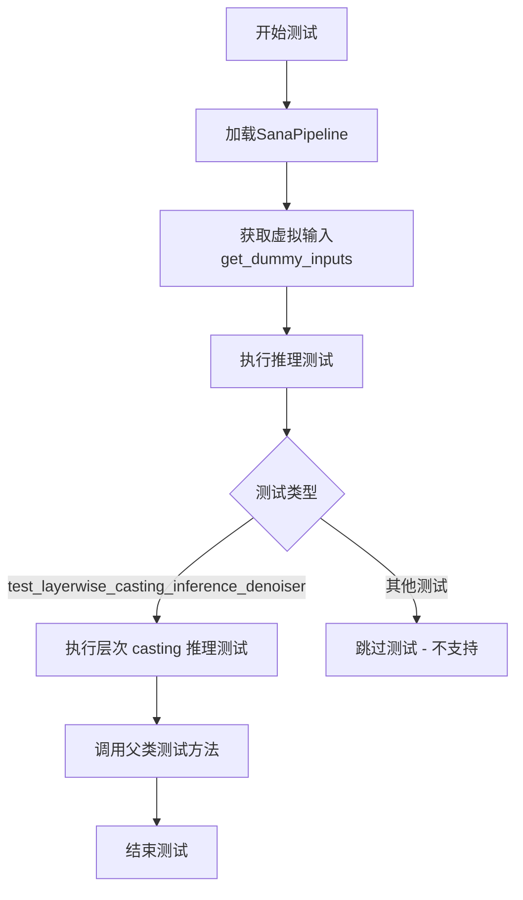
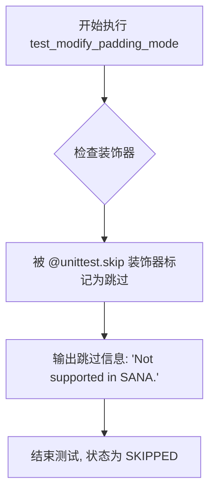
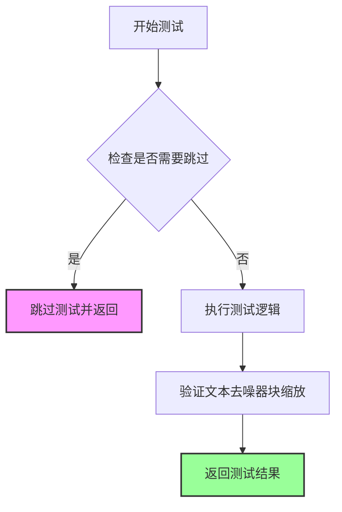
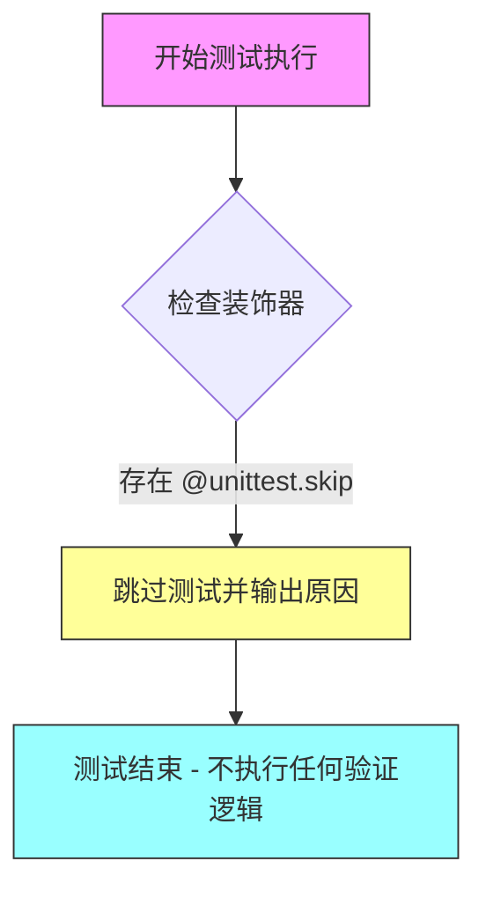
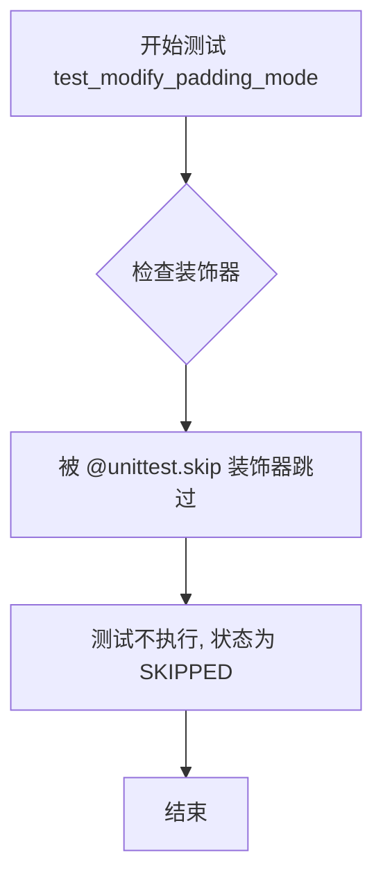
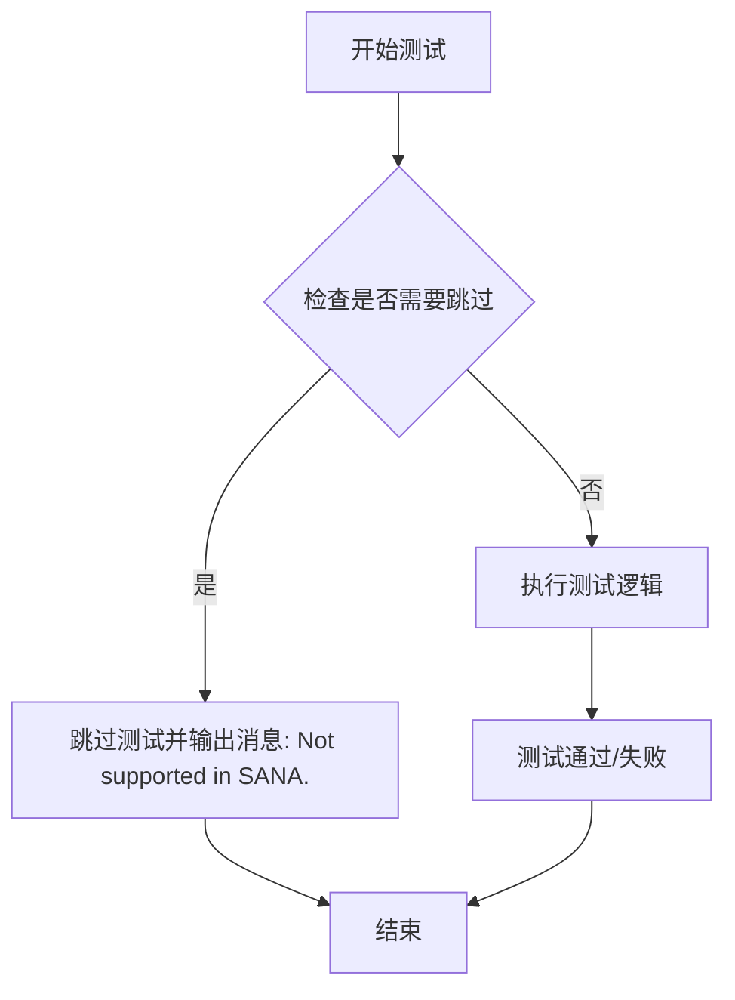
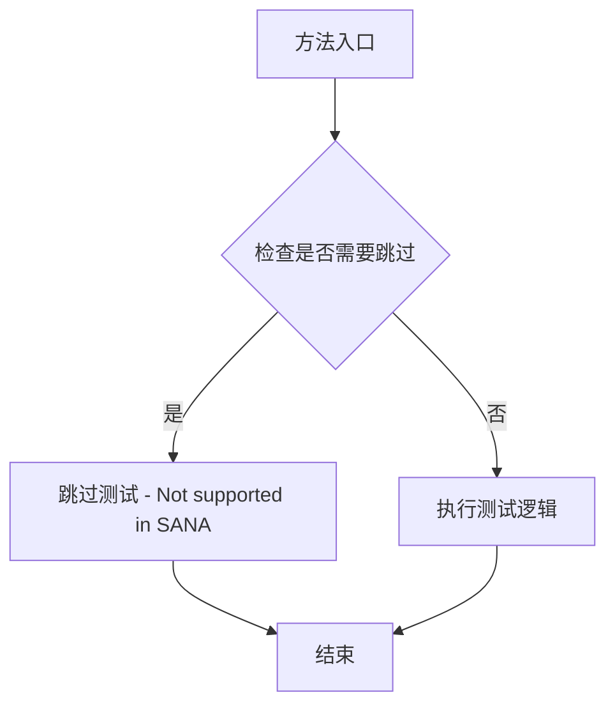

```mermaid
flowchart TD
    A[开始测试: test_layerwise_casting_inference_denoiser] --> B{当前环境是否为<br>GitHub Actions?}
    B -->|是| C[跳过测试 - 装饰器生效]
    B -->|否| D[调用父类方法: super&#46;test_layerwise_casting_inference_denoiser]
    D --> E[执行父类定义的层次推理测试逻辑]
    E --> F[返回测试结果]
    C --> F
```

# `diffusers\tests\lora\test_lora_layers_sana.py` 详细设计文档

这是一个用于测试SANA模型LoRA功能的单元测试文件，继承自unittest框架和PeftLoraLoaderMixinTests测试混合类，验证SanaPipeline在加载LoRA权重后的推理功能是否正常。

## 整体流程



## 类结构

```
SanaLoRATests (测试类)
└── 继承自 unittest.TestCase, PeftLoraLoaderMixinTests
```

## 全局变量及字段


### `IS_GITHUB_ACTIONS`
    
GitHub Actions环境标识，用于判断当前是否在GitHub Actions环境中运行

类型：`bool`
    


### `require_peft_backend`
    
PEFT后端需求装饰器，用于检查PEFT后端是否可用

类型：`function/decorator`
    


### `floats_tensor`
    
浮点张量生成工具函数，用于创建指定形状的随机浮点张量

类型：`function`
    


### `SanaLoRATests.pipeline_class`
    
管道类，定义SANA图像生成管道

类型：`type(SanaPipeline)`
    


### `SanaLoRATests.scheduler_cls`
    
调度器类，用于控制扩散模型的采样调度

类型：`type(FlowMatchEulerDiscreteScheduler)`
    


### `SanaLoRATests.scheduler_kwargs`
    
调度器配置参数，包含调度器的各种配置选项

类型：`dict`
    


### `SanaLoRATests.transformer_kwargs`
    
Transformer模型配置，包含Transformer模型的参数

类型：`dict`
    


### `SanaLoRATests.transformer_cls`
    
Transformer模型类，SANA的核心变换器模型

类型：`type(SanaTransformer2DModel)`
    


### `SanaLoRATests.vae_kwargs`
    
VAE模型配置，包含变分自编码器的参数

类型：`dict`
    


### `SanaLoRATests.vae_cls`
    
VAE模型类，用于编解码图像

类型：`type(AutoencoderDC)`
    


### `SanaLoRATests.tokenizer_cls`
    
分词器类，用于将文本转换为token

类型：`type(GemmaTokenizer)`
    


### `SanaLoRATests.tokenizer_id`
    
分词器模型ID，指定分词器的预训练模型

类型：`str`
    


### `SanaLoRATests.text_encoder_cls`
    
文本编码器类，用于将文本编码为向量

类型：`type(Gemma2Model)`
    


### `SanaLoRATests.text_encoder_id`
    
文本编码器模型ID，指定文本编码器的预训练模型

类型：`str`
    


### `SanaLoRATests.supports_text_encoder_loras`
    
是否支持文本编码器LoRA，表明是否启用文本编码器的LoRA适配

类型：`bool`
    


### `SanaLoRATests.output_shape`
    
输出形状，定义生成图像的维度 (1, 32, 32, 3)

类型：`property`
    
    

## 全局函数及方法


### `SanaLoRATests.get_dummy_inputs`

该方法用于生成虚拟输入数据（噪声、输入ID和管道参数），为 Sana 模型的 LoRA 测试提供必要的测试数据，包括随机噪声张量、随机输入ID序列以及包含推理参数的字典。

参数：

- `with_generator`：`bool`，是否在返回的管道参数字典中包含 PyTorch 生成器对象，默认为 `True`

返回值：`tuple[torch.Tensor, torch.Tensor, dict]`，返回一个三元组，包含：
- `noise`：形状为 `(1, 4, 32, 32)` 的随机噪声张量
- `input_ids`：形状为 `(1, 16)` 的随机输入 ID 张量
- `pipeline_inputs`：包含管道推理参数的字典

#### 流程图

```mermaid
flowchart TD
    A[开始 get_dummy_inputs] --> B[设置默认参数值]
    B --> C[batch_size=1, sequence_length=16, num_channels=4, sizes=(32,32)]
    C --> D[创建 PyTorch 手动生成器]
    D --> E[生成随机噪声张量]
    E --> F[生成随机输入ID张量]
    F --> G[构建基础管道参数字典]
    G --> H{with_generator?}
    H -->|True| I[添加 generator 到参数字典]
    H -->|False| J[不添加 generator]
    I --> K[返回三元组 noise, input_ids, pipeline_inputs]
    J --> K
```

#### 带注释源码

```python
def get_dummy_inputs(self, with_generator=True):
    """
    生成虚拟输入数据用于 Sana LoRA 测试。
    
    参数:
        with_generator: bool, 是否在返回的管道参数中包含生成器
                      默认为 True
    
    返回:
        tuple: (noise, input_ids, pipeline_inputs)
            - noise: 随机噪声张量, 形状 (batch_size, num_channels, height, width)
            - input_ids: 文本输入ID张量, 形状 (batch_size, sequence_length)
            - pipeline_inputs: 包含推理参数的字典
    """
    # 设置批处理大小、序列长度、通道数和图像尺寸
    batch_size = 1
    sequence_length = 16
    num_channels = 4
    sizes = (32, 32)

    # 创建 PyTorch 手动种子生成器,确保测试可复现
    generator = torch.manual_seed(0)
    
    # 使用 floats_tensor 生成随机浮点数噪声张量
    # 形状: (1, 4, 32, 32) 对应 (batch, channels, height, width)
    noise = floats_tensor((batch_size, num_channels) + sizes)
    
    # 生成随机整数作为文本输入ID
    # 范围: [1, sequence_length), 形状: (batch_size, sequence_length)
    input_ids = torch.randint(1, sequence_length, size=(batch_size, sequence_length), generator=generator)

    # 构建管道输入参数字典
    pipeline_inputs = {
        "prompt": "",                    # 文本提示词
        "negative_prompt": "",           # 负面提示词
        "num_inference_steps": 4,        # 推理步数
        "guidance_scale": 4.5,           # 引导比例
        "height": 32,                   # 输出图像高度
        "width": 32,                     # 输出图像宽度
        "max_sequence_length": sequence_length,  # 最大序列长度
        "output_type": "np",             # 输出类型为 numpy
        "complex_human_instruction": None,  # 复杂人类指令
    }
    
    # 根据 with_generator 参数决定是否添加生成器
    if with_generator:
        pipeline_inputs.update({"generator": generator})

    # 返回噪声、输入ID和管道参数的元组
    return noise, input_ids, pipeline_inputs
```


### `SanaLoRATests.test_modify_padding_mode`

该测试方法用于验证填充模式（padding mode）的修改功能，但由于SANA管道不支持此特性，测试被跳过。

参数：

- 无（该方法不接受任何显式参数，仅使用隐式 `self` 参数）

返回值：`None`，该方法被 `@unittest.skip` 装饰器跳过，不执行任何操作。

#### 流程图



#### 带注释源码

```python
@unittest.skip("Not supported in SANA.")
def test_modify_padding_mode(self):
    """
    填充模式测试 (跳过)
    
    该测试方法原本用于验证修改填充模式的功能,
    但由于 SANA 管道不支持此特性,因此使用 @unittest.skip 装饰器跳过测试。
    
    参数:
        self: SanaLoRATests 实例的隐式参数
    
    返回值:
        None: 测试被跳过,不返回任何值
    """
    pass  # 方法体为空,测试被跳过
```


### `SanaLoRATests.test_simple_inference_with_text_denoiser_block_scale`

该测试方法用于验证文本去噪器块缩放功能，在SANA管道中执行简单的推理测试。然而，由于SANA架构不支持该功能，该测试已被跳过（装饰器标记为"Not supported in SANA."），方法体仅包含`pass`语句，不执行任何实际测试逻辑。

参数：无（继承自unittest.TestCase，无需显式参数）

返回值：`None`，该方法被跳过，不返回任何值

#### 流程图



#### 带注释源码

```python
@unittest.skip("Not supported in SANA.")
def test_simple_inference_with_text_denoiser_block_scale(self):
    """
    测试文本去噪器块缩放功能
    
    该测试方法原本用于验证SANA管道中的文本去噪器块缩放推理功能。
    由于SANA架构不支持此特性，测试被跳过。
    
    参数:
        self: SanaLoRATests实例引用
    
    返回值:
        None: 测试被跳过，无返回值
    """
    pass  # 占位符，由于功能不支持而跳过测试，不执行任何操作
```


### `SanaLoRATests.test_simple_inference_with_text_denoiser_block_scale_for_all_dict_options`

该测试方法用于验证文本去噪器块缩放在所有字典选项下的推理功能，但由于 SANA 架构不支持此功能，该测试被跳过。

参数：

- `self`：`SanaLoRATests`，测试类实例本身，用于访问继承的测试方法和其他类成员

返回值：`None`，该方法不返回任何值，仅作为测试占位符

#### 流程图



#### 带注释源码

```python
@unittest.skip("Not supported in SANA.")
def test_simple_inference_with_text_denoiser_block_scale_for_all_dict_options(self):
    """
    测试文本去噪器块缩放在所有字典选项下的推理功能。
    
    该测试方法旨在验证 SanaTransformer2DModel 中文本去噪器模块的
    block_scale 参数在不同字典配置选项下的推理行为。由于 SANA 架构
    不支持此功能，测试被跳过。
    
    参数:
        self: SanaLoRATests - 测试类实例
        
    返回值:
        None - 测试被跳过，不执行任何逻辑
        
    备注:
        - 使用 @unittest.skip 装饰器标记为跳过
        - 跳过原因: "Not supported in SANA."
        - 该测试继承自 PeftLoraLoaderMixinTests 基类
        - Sana 架构不支持 text_encoder_loras (supports_text_encoder_loras = False)
    """
    pass
```


### `SanaLoRATests.test_layerwise_casting_inference_denoiser`

这是一个层次推理测试方法，用于测试 SanaTransformer2DModel 去噪器（Denoiser）的层次类型转换推理能力。该方法通过调用父类的同名测试方法来验证 LoRA 权重在去噪器各层的类型转换和推理是否正确工作。

参数：

- `self`：`SanaLoRATests`（隐式参数），测试类实例本身

返回值：`任意类型`，返回父类测试方法的执行结果（通常为 `None` 或 `unittest.TestResult`）

#### 流程图



#### 带注释源码

```python
@unittest.skipIf(IS_GITHUB_ACTIONS, reason="Skipping test inside GitHub Actions environment")
def test_layerwise_casting_inference_denoiser(self):
    """
    层次推理测试方法 - 测试 SanaTransformer2DModel 去噪器的层次类型转换推理
    
    该测试方法继承自 PeftLoraLoaderMixinTests 基类，用于验证：
    1. LoRA 权重在 SanaTransformer2DModel 去噪器各层的正确加载
    2. 层次间的数据类型转换是否正确
    3. 在推理过程中各层的输出是否符合预期
    
    Returns:
        返回父类测试方法的执行结果
    """
    return super().test_layerwise_casting_inference_denoiser()
```


### `SanaLoRATests.get_dummy_inputs`

该方法是一个测试辅助函数，用于生成虚拟（dummy）的测试输入数据，包括噪声张量、文本输入ID张量以及SANA管道所需的参数字典，支持可选的随机生成器以确保测试可复现性。

参数：

- `with_generator`：`bool`，默认为`True`，指示是否在返回的管道参数字典中包含PyTorch随机生成器对象，以便于测试结果的可复现性

返回值：`tuple[torch.Tensor, torch.Tensor, dict]`，返回包含三个元素的元组——noise（噪声张量，形状为(1, 4, 32, 32)）、input_ids（文本输入ID张量，形状为(1, 16)）、pipeline_inputs（包含管道推理参数的字典）

#### 流程图

```mermaid
flowchart TD
    A[开始 get_dummy_inputs] --> B[设置批大小=1, 序列长度=16, 通道数=4, 尺寸=32x32]
    B --> C[创建PyTorch手动随机种子生成器]
    C --> D[使用floats_tensor生成噪声张量: shape=(1, 4, 32, 32)]
    D --> E[使用torch.randint生成input_ids: shape=(1, 16), 范围1-16]
    E --> F[构建pipeline_inputs基础字典]
    F --> G{with_generator == True?}
    G -->|Yes| H[向pipeline_inputs添加generator]
    G -->|No| I[不添加generator]
    H --> J[返回 (noise, input_ids, pipeline_inputs)]
    I --> J
```

#### 带注释源码

```python
def get_dummy_inputs(self, with_generator=True):
    """
    生成虚拟测试输入数据，用于测试SANA LoRA管道
    
    参数:
        with_generator (bool): 是否包含随机生成器，默认为True
    
    返回:
        tuple: (noise, input_ids, pipeline_inputs) 三元素元组
    """
    # 定义批处理大小为1
    batch_size = 1
    # 定义文本序列长度为16
    sequence_length = 16
    # 定义通道数为4（对应潜在空间的通道数）
    num_channels = 4
    # 定义空间尺寸为32x32
    sizes = (32, 32)

    # 创建PyTorch手动随机种子生成器，确保测试可复现
    generator = torch.manual_seed(0)
    # 生成随机噪声张量，形状为 (batch_size, num_channels, height, width)
    noise = floats_tensor((batch_size, num_channels) + sizes)
    # 生成随机文本输入ID，形状为 (batch_size, sequence_length)
    # 范围为1到sequence_length（不含sequence_length）
    input_ids = torch.randint(1, sequence_length, size=(batch_size, sequence_length), generator=generator)

    # 构建SANA管道的基础参数字典
    pipeline_inputs = {
        "prompt": "",                    # 文本提示（空字符串）
        "negative_prompt": "",           # 负向提示（空字符串）
        "num_inference_steps": 4,        # 推理步数为4
        "guidance_scale": 4.5,           # 引导比例为4.5
        "height": 32,                   # 输出高度
        "width": 32,                     # 输出宽度
        "max_sequence_length": sequence_length,  # 最大序列长度
        "output_type": "np",             # 输出类型为numpy数组
        "complex_human_instruction": None,  # 复杂人类指令（无）
    }
    
    # 如果需要包含生成器，则将其添加到管道参数字典中
    if with_generator:
        pipeline_inputs.update({"generator": generator})

    # 返回噪声、输入ID和管道参数字典的元组
    return noise, input_ids, pipeline_inputs
```


### `SanaLoRATests.test_modify_padding_mode`

该方法是一个测试函数，用于测试修改填充模式（padding mode）的功能。由于 SANA 不支持此功能，该测试已被跳过。

参数：

- `self`：`SanaLoRATests`，表示该方法是类实例方法，通过 self 参数访问类属性和方法

返回值：`None`，该方法体只有 `pass` 语句，不返回任何值

#### 流程图



#### 带注释源码

```python
@unittest.skip("Not supported in SANA.")
def test_modify_padding_mode(self):
    """
    测试修改填充模式的功能。
    
    该测试用于验证能否修改模型的填充模式（padding mode），
    但由于 SANA 模型不支持此功能，因此该测试被跳过。
    
    参数:
        self: SanaLoRATests类的实例方法
        
    返回值:
        None: 该方法不返回任何值，仅包含pass语句
    """
    pass  # 占位符，表示该测试方法体为空，因为测试已被跳过
```


### `SanaLoRATests.test_simple_inference_with_text_denoiser_block_scale`

该测试方法用于测试 SANA 模型的文本去噪器块比例推理功能，但已被标记为跳过（Skip），原因是 SANA 不支持该功能。

参数：

- `self`：SanaLoRATests 实例，表示测试类本身

返回值：`None`，无返回值（测试方法被跳过）

#### 流程图



#### 带注释源码

```python
@unittest.skip("Not supported in SANA.")  # 跳过测试装饰器，标记该测试在 SANA 中不支持
def test_simple_inference_with_text_denoiser_block_scale(self):
    """
    测试简单推理与文本去噪器块比例功能
    
    注意：此测试已被跳过，因为 SANA 模型不支持此功能。
    该测试方法原本用于验证文本去噪器块比例的推理能力，
    但在 SANA 实现中未提供相关支持。
    """
    pass  # 方法体为空，直接返回 None
```

#### 补充说明

- **跳过原因**：该测试方法在 SANA 管道实现中不被支持，因此使用 `@unittest.skip` 装饰器跳过执行
- **测试状态**：跳过（Skipped）
- **相关配置**：同类的其他方法如 `test_modify_padding_mode` 和 `test_simple_inference_with_text_denoiser_block_scale_for_all_dict_options` 也被同样的方式跳过
- **设计意图**：此测试方法可能是在继承 `PeftLoraLoaderMixinTests` 时从父类继承的，但 SANA 实现不支持其中的某些功能


### `SanaLoRATests.test_simple_inference_with_text_denoiser_block_scale_for_all_dict_options`

该方法是 `SanaLoRATests` 测试类中的一个测试用例，用于测试文本去噪器块缩放功能的所有字典选项，但由于 SANA 不支持该功能，当前已被跳过（skip）。

参数：无

返回值：`None`，无返回值（方法体为空）

#### 流程图



#### 带注释源码

```python
@unittest.skip("Not supported in SANA.")
def test_simple_inference_with_text_denoiser_block_scale_for_all_dict_options(self):
    """
    测试文本去噪器块缩放功能的所有字典选项推理。
    
    该测试用例旨在验证 SanaTransformer2DModel 在不同文本去噪器块缩放配置下的推理能力。
    由于 SANA 架构不支持该功能，此测试被跳过。
    """
    pass  # 空方法体，因功能不支持而跳过
```

#### 附加信息

| 项目 | 描述 |
|------|------|
| **装饰器** | `@unittest.skip("Not supported in SANA.")` |
| **跳过原因** | SANA 架构不支持文本去噪器块缩放功能 |
| **测试状态** | 已跳过（Skipped） |
| **相关配置** | 继承自父类的 `transformer_kwargs`、`scheduler_kwargs` 等配置 |


### `SanaLoRATests.test_layerwise_casting_inference_denoiser`

该测试方法用于验证 Sana 模型的层次 casting 推理去噪器功能，但在 GitHub Actions 环境中会被跳过。方法内部直接调用父类的同名测试方法来执行实际的测试逻辑。

参数：

- `self`：无显式参数（Python 实例方法的隐式参数），`SanaLoRATests` 类的实例对象

返回值：`any`，返回父类 `PeftLoraLoaderMixinTests` 的 `test_layerwise_casting_inference_denoiser()` 方法的执行结果

#### 流程图

```mermaid
flowchart TD
    A[开始 test_layerwise_casting_inference_denoiser] --> B{是否在 GitHub Actions 环境中?}
    B -->|是| C[跳过测试]
    B -->|否| D[调用 super().test_layerwise_casting_inference_denoiser]
    D --> E[返回父类测试结果]
    C --> F[结束]
    E --> F
```

#### 带注释源码

```python
@unittest.skipIf(IS_GITHUB_ACTIONS, reason="Skipping test inside GitHub Actions environment")
def test_layerwise_casting_inference_denoiser(self):
    """
    测试层次 casting 推理去噪器功能。
    
    该测试方法用于验证 Sana 模型在层次推理过程中的类型转换（casting）
    是否正确工作。在 GitHub Actions 环境中会被跳过。
    """
    # 调用父类 PeftLoraLoaderMixinTests 的同名测试方法
    # 执行实际的 LoRA 层wise casting 推理测试逻辑
    return super().test_layerwise_casting_inference_denoiser()
```

## 关键组件


### SanaLoRATests

Sana模型的LoRA加载功能测试类，继承自unittest.TestCase和PeftLoraLoaderMixinTests，用于验证SanaPipeline中LoRA权重能否正确加载和推理。

### SanaPipeline

Sana生成的管道类，作为测试的目标pipeline，用于执行图像生成流程。

### FlowMatchEulerDiscreteScheduler

流匹配欧拉离散调度器，负责控制扩散模型的推理步骤调度，配置shift参数为7.0。

### SanaTransformer2DModel

Sana的2D Transformer模型，核心生成模型，配置了1层、2个注意力头、注意力头维度为4等参数。

### AutoencoderDC

自编码器DC模型，用于将图像编码到潜在空间和解码，支持EfficientViTBlock等块类型。

### GemmaTokenizer & Gemma2Model

用于文本处理的分词器和文本编码器模型，从huggingface测试仓库加载。

### get_dummy_inputs方法

生成测试用的虚拟输入数据，包括噪声张量、输入ID和管道参数，返回(noise, input_ids, pipeline_inputs)元组。

### transformer_kwargs

Transformer模型的关键配置字典，包含patch_size=1、in_channels=4、out_channels=4、num_layers=1、num_attention_heads=2等核心参数。

### vae_kwargs

VAE模型的关键配置字典，包含in_channels=3、latent_channels=4、encoder_block_types、decoder_block_types等编码器和解码器配置。

### require_peft_backend

装饰器要求PEFT后端支持，用于标记该测试需要PEFT框架才能运行，体现量化策略相关功能依赖。

### supports_text_encoder_loras

布尔标志，指示该pipeline是否支持文本编码器的LoRA权重，此处设为False。

### test_layerwise_casting_inference_denoiser

逐层类型转换推理测试方法，用于验证模型在不同数据类型下的推理正确性。

### output_shape属性

返回期望的输出形状(1, 32, 32, 3)，用于验证生成结果的维度。


## 问题及建议


### 已知问题

- **硬编码的配置值**：transformer_kwargs 和 vae_kwargs 中存在大量硬编码的魔法数字（如 `patch_size: 1`、`num_layers: 1`、`scaling_factor: 0.41407` 等），缺乏配置管理机制，导致维护困难
- **魔法数字散布**：get_dummy_inputs 方法中包含多个未命名的常量（`sequence_length = 16`、`num_channels = 4`、`num_inference_steps = 4`、`guidance_scale = 4.5` 等），影响代码可读性
- **缺失文档字符串**：类和方法均无文档说明（docstrings），尤其是配置参数的具体含义和使用场景未做解释
- **不规范的系统路径操作**：使用 `sys.path.append(".")` 修改 Python 路径，这不是标准的导入方式
- **导入顺序问题**：使用 `# noqa: E402` 注释规避 PEP 8 导入顺序规范，表明存在潜在的结构问题
- **测试覆盖不足**：多个测试方法（test_modify_padding_mode、test_simple_inference_with_text_denoiser_block_scale 等）被无条件跳过，仅留下 pass 语句，无说明文档
- **缺失类型注解**：参数和返回值均无类型提示（type hints），降低代码可维护性和 IDE 支持
- **测试隔离性问题**：使用全局随机种子 `torch.manual_seed(0)` 可能导致测试之间存在依赖关系
- **未使用的类属性**：tokenizer_cls、tokenizer_id、text_encoder_cls、text_encoder_id 等类属性定义后未被实际使用
- **导入未使用的模块**：导入了 `unittest` 但仅使用了部分功能（skip、skipIf）

### 优化建议

- 将所有魔法数字提取为类常量或配置文件，使用有意义的命名（如 `DEFAULT_NUM_INFERENCE_STEPS = 4`）
- 为类和方法添加详细的文档字符串，说明参数用途、返回值含义和测试目的
- 重构导入结构，将测试工具的导入移至文件顶部，避免使用 sys.path 修改和 noqa 注释
- 对于跳过的测试，提供具体的跳过原因和后续计划（如 "等待 SANA 模型支持后实现"）
- 添加类型注解以提升代码质量和开发体验
- 考虑使用 pytest fixture 或 setUp 方法管理测试初始化，提高测试隔离性
- 移除未使用的类属性或实现相应的测试逻辑
- 使用配置类或 dataclass 替代字典式的配置定义，提升类型安全性和代码结构

## 其它


### 设计目标与约束

本测试类旨在验证SANA模型在PEFT后端上的LoRA适配器加载功能是否正常工作。设计约束包括：仅支持PEFT后端环境运行，不支持文本编码器LoRA（supports_text_encoder_loras = False），部分测试因SANA架构限制而被跳过。

### 错误处理与异常设计

测试使用@unittest.skip装饰器跳过不支持的测试用例（test_modify_padding_mode、test_simple_inference_with_text_denoiser_block_scale等）。@require_peft_backend装饰器确保测试仅在PEFT后端可用时运行。@skipIf用于在GitHub Actions环境中跳过特定测试（test_layerwise_casting_inference_denoiser）。

### 数据流与状态机

测试数据流：get_dummy_inputs方法生成测试所需的噪声张量、输入ID和管道参数。输入数据经过pipeline处理，输出形状为(1, 32, 32, 3)的图像。数据流不涉及复杂的状态机，主要为单向处理流程。

### 外部依赖与接口契约

主要外部依赖包括：transformers库（Gemma2Model、GemmaTokenizer）、diffusers库（SanaPipeline、FlowMatchEulerDiscreteScheduler、SanaTransformer2DModel、AutoencoderDC）、torch库以及PEFT后端。接口契约定义在PeftLoraLoaderMixinTests基类中，包括pipeline_class、scheduler_cls、transformer_cls、vae_cls等配置属性。

### 性能与资源考虑

测试使用较小的模型配置（num_layers=1, num_attention_heads=2, sample_size=32）以降低资源消耗。batch_size=1和num_inference_steps=4用于快速执行测试。

### 安全性与权限

代码遵循Apache License 2.0开源协议。测试使用虚拟模型（"hf-internal-testing/dummy-gemma"和"hf-internal-testing/dummy-gemma-for-diffusers"）而非真实模型，确保测试环境安全。

### 版本兼容性

需要Python环境、torch、transformers、diffusers、PEFT等库的特定版本兼容性。具体版本要求需参考项目requirements文件或setup.py配置。

### 测试策略

采用单元测试策略，继承PeftLoraLoaderMixinTests以复用通用的LoRA加载测试用例。通过覆盖特定场景（test_layerwise_casting_inference_denoiser）来验证SANA模型的特殊行为。跳过不支持的功能测试以保持测试套件的可运行性。

    