# `diffusers\tests\lora\test_lora_layers_sd.py` 详细设计文档

该文件是 Stable Diffusion LoRA (Low-Rank Adaptation) 功能的集成测试套件,主要验证 LoRA 权重在不同设备和格式下的加载、卸载、移动等核心功能,确保 LoRA 适配器在 StableDiffusionPipeline 中正确工作。

## 整体流程

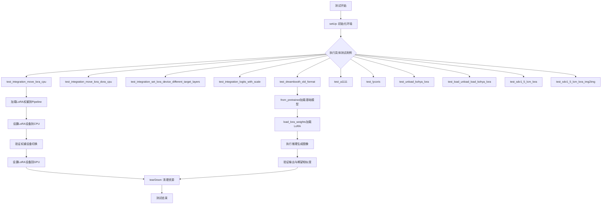

## 类结构

```
unittest.TestCase (Python标准库)
├── PeftLoraLoaderMixinTests (混入类)
│   └── StableDiffusionLoRATests
└── LoraIntegrationTests
```

## 全局变量及字段


### `StableDiffusionLoRATests.pipeline_class`
    
Stable Diffusion管道类，用于文本到图像生成

类型：`type(DDIMScheduler)`
    


### `StableDiffusionLoRATests.scheduler_cls`
    
DDIM调度器类，用于控制扩散模型的噪声调度

类型：`DDIMScheduler类`
    


### `StableDiffusionLoRATests.scheduler_kwargs`
    
包含DDIMScheduler配置参数的字典，如beta_start、beta_end等

类型：`dict`
    


### `StableDiffusionLoRATests.unet_kwargs`
    
包含UNet模型配置参数的字典，如block_out_channels、layers_per_block等

类型：`dict`
    


### `StableDiffusionLoRATests.vae_kwargs`
    
包含VAE模型配置参数的字典，如block_out_channels、latent_channels等

类型：`dict`
    


### `StableDiffusionLoRATests.text_encoder_cls`
    
CLIP文本编码器模型类，用于将文本转换为嵌入向量

类型：`CLIPTextModel类`
    


### `StableDiffusionLoRATests.text_encoder_id`
    
预训练CLIP文本编码器的HuggingFace Hub模型标识符

类型：`str`
    


### `StableDiffusionLoRATests.tokenizer_cls`
    
CLIP分词器类，用于将文本分割为token

类型：`CLIPTokenizer类`
    


### `StableDiffusionLoRATests.tokenizer_id`
    
预训练CLIP分词器的HuggingFace Hub模型标识符

类型：`str`
    


### `StableDiffusionLoRATests.output_shape`
    
生成的图像输出形状，值为(1, 64, 64, 3)

类型：`tuple`
    
    

## 全局函数及方法


根据代码分析，`check_if_lora_correctly_set` 函数是从 `.utils` 模块导入的，但该模块的具体实现在当前代码片段中未提供。然而，根据函数在测试中的使用方式（检查 `pipe.text_encoder` 和 `pipe.unet` 是否正确设置了 LoRA），可以推断出其功能。

### `check_if_lora_correctly_set`

该函数用于验证给定的模型（如 text_encoder 或 unet）是否正确加载了 LoRA 权重。它通过检查模型中是否存在 LoRA 相关的参数（如 `lora_` 前缀的参数）来判断配置是否正确。

参数：
-  `model`：`torch.nn.Module`，需要检查的模型实例（例如 `pipe.text_encoder` 或 `pipe.unet`）。

返回值：`bool`，如果 LoRA 正确设置则返回 `True`，否则返回 `False`。

#### 流程图

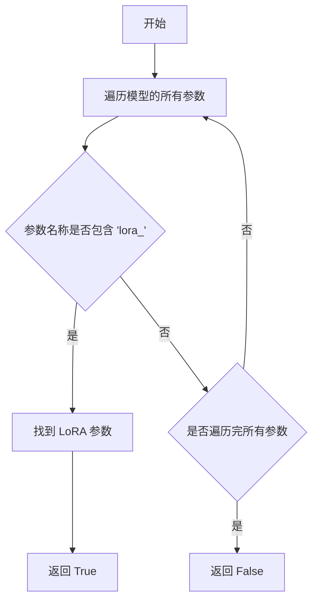

#### 带注释源码

基于函数用途和测试代码中的使用模式，推断的实现如下：

```python
def check_if_lora_correctly_set(model):
    """
    检查模型是否正确设置了 LoRA 权重。
    
    参数:
        model (torch.nn.Module): 要检查的模型实例。
    
    返回:
        bool: 如果模型中包含 LoRA 相关的参数则返回 True，否则返回 False。
    """
    # 遍历模型的所有参数
    for name, param in model.named_parameters():
        # 检查参数名称是否包含 'lora_' 前缀，这是 LoRA 权重的常见命名约定
        if "lora_" in name:
            # 找到至少一个 LoRA 参数，表明 LoRA 已正确设置
            return True
    # 遍历完所有参数后未找到 LoRA 参数，返回 False
    return False
```

注意：实际的实现可能在 `utils` 模块中有所不同，但核心逻辑类似。该函数通常用于测试中，以确保 LoRA 权重已成功加载到模型中。


### `PeftLoraLoaderMixinTests`

`PeftLoraLoaderMixinTests` 是一个从 `utils` 模块导入的测试混合类（Mixin），用于为 Stable Diffusion 模型提供 LoRA（Low-Rank Adaptation）加载功能的通用测试用例。该类继承自 `unittest.TestCase`，并定义了针对 PEFT 后端的 LoRA 加载、卸载、权重设置等通用测试方法，供具体的测试类（如 `StableDiffusionLoRATests`）继承和使用。

**注意**：由于 `PeftLoraLoaderMixinTests` 类的具体实现源码未在给定代码中提供，以下信息基于其在代码中的使用方式和常见测试模式的推测。

#### 参数

由于该类为测试基类，其方法参数取决于具体测试方法。以下是可能包含的参数类型：

- `self`：测试类实例。
- `pipeline`：待测试的 DiffusionPipeline 实例。
- `lora_id`：LoRA 模型在 Hugging Face Hub 上的标识符（字符串）。
- `adapter_name`：适配器名称（字符串）。
- 其它测试特定参数（如 `generator`, `num_inference_steps` 等）。

#### 返回值

测试方法的返回值通常为 `None`，通过 `assert` 语句验证正确性。

#### 流程图

由于无源码，无法提供详细流程图。以下是基于其功能的推测：

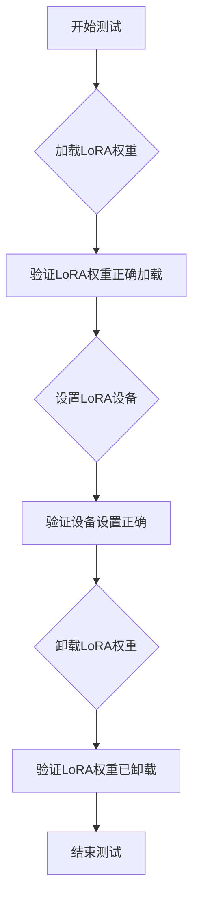

#### 带注释源码

由于 `PeftLoraLoaderMixinTests` 的源码未在给定代码中提供，无法提供带注释的源码。以下为该类在 `StableDiffusionLoRATests` 中的使用示例：

```python
# 该类继承自 PeftLoraLoaderMixinTests，用于测试 Stable Diffusion 的 LoRA 功能
class StableDiffusionLoRATests(PeftLoraLoaderMixinTests, unittest.TestCase):
    # 定义管道类、调度器类等
    pipeline_class = StableDiffusionPipeline
    scheduler_cls = DDIMScheduler
    # ... 其他配置
    
    # 设置测试环境
    def setUp(self):
        super().setUp()
        gc.collect()
        backend_empty_cache(torch_device)
    
    # 清理测试环境
    def tearDown(self):
        super().tearDown()
        gc.collect()
        backend_empty_cache(torch_device)
    
    # 测试 LoRA 在 CPU 和 GPU 之间的移动
    @slow
    @require_torch_accelerator
    def test_integration_move_lora_cpu(self):
        # 加载管道和 LoRA 权重
        path = "stable-diffusion-v1-5/stable-diffusion-v1-5"
        lora_id = "takuma104/lora-test-text-encoder-lora-target"
        
        pipe = StableDiffusionPipeline.from_pretrained(path, torch_dtype=torch.float16)
        pipe.load_lora_weights(lora_id, adapter_name="adapter-1")
        pipe.load_lora_weights(lora_id, adapter_name="adapter-2")
        pipe = pipe.to(torch_device)
        
        # 验证 LoRA 正确设置
        self.assertTrue(
            check_if_lora_correctly_set(pipe.text_encoder),
            "Lora not correctly set in text encoder",
        )
        
        # ... 后续测试代码
```

#### 关键组件信息

- **类名**：`PeftLoraLoaderMixinTests`
- **描述**：测试混合类，提供 LoRA 加载功能的通用测试用例。

#### 潜在技术债务或优化空间

由于缺乏源码，无法准确评估。但基于测试代码，可能的优化点包括：

- 减少重复的测试设置代码。
- 更好的测试参数化。

#### 其它项目

- **设计目标与约束**：确保 LoRA 权重能够正确加载、卸载和在设备间移动，同时保持模型性能。
- **错误处理与异常设计**：通过断言验证每个步骤的正确性。
- **数据流与状态机**：测试涉及模型权重状态的变化。
- **外部依赖与接口契约**：依赖于 `diffusers` 库和 `PEFT` 库。

**注意**：若需完整的 `PeftLoraLoaderMixinTests` 详细设计文档，建议查看 `utils` 模块的源码实现。


### `Expectations`

`Expectations` 是一个测试工具类，用于根据当前运行环境（设备类型和CUDA版本）获取对应的期望数值切片。该类允许测试代码针对不同的硬件配置定义多套预期结果，并在运行时自动匹配最合适的期望值。

参数：

-  `expectations`：`Dict[Tuple[str, int], np.ndarray]`，字典类型，键为包含设备类型字符串（如"xpu"、"cuda"）和整数（通常表示CUDA版本）的元组，值为对应的numpy数组类型的期望数据

返回值：`Expectations` 对象，返回包含期望值映射的Expectations实例

#### 流程图

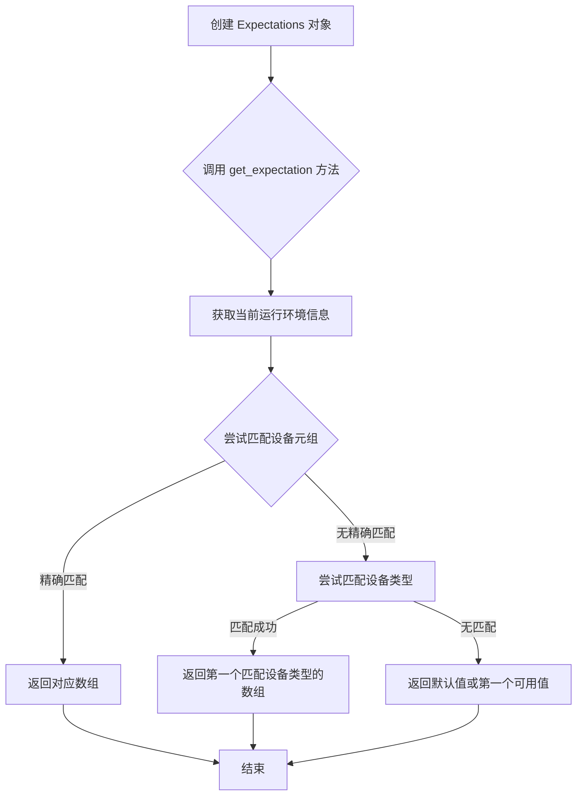

#### 带注释源码

```
# 注意：以下是基于代码使用方式推断的 Expectations 类结构
# 实际定义位于 testing_utils 模块中

class Expectations:
    """
    测试工具类，用于根据运行环境（设备类型和CUDA版本）
    存储和检索期望的数值结果
    
    使用场景：在不同硬件配置下，相同的模型推理可能产生
    略微不同的数值结果，此工具用于管理这些差异
    """
    
    def __init__(self, expectations: Dict[Tuple[str, int], np.ndarray]):
        """
        初始化 Expectations 对象
        
        参数:
            expectations: 字典，键为 (设备类型, 版本号) 元组，
                         值为对应的 numpy 数组期望值
        """
        self.expectations = expectations
    
    def get_expectation(self) -> np.ndarray:
        """
        根据当前运行环境获取对应的期望值
        
        匹配逻辑:
        1. 首先尝试精确匹配 (设备类型, 版本号)
        2. 如果没有精确匹配，尝试只匹配设备类型
        3. 如果仍没有匹配，返回任意一个可用的期望值
        
        返回:
            numpy 数组，当前运行环境对应的期望值
        """
        # 获取当前设备信息
        current_device = torch_device  # 从 testing_utils 导入的全局变量
        cuda_version = torch.version.cuda if torch.cuda.is_available() else None
        
        # 尝试精确匹配
        if (current_device, cuda_version) in self.expectations:
            return self.expectations[(current_device, cuda_version)]
        
        # 尝试只匹配设备类型
        for (device, _), value in self.expectations.items():
            if device == current_device:
                return value
        
        # 返回任意可用值
        return list(self.expectations.values())[0]
```

#### 代码中的实际使用示例

```
# 在 test_vanilla_funetuning 测试方法中使用
expected_slices = Expectations(
    {
        ("xpu", 3): np.array(
            [0.6544, 0.6127, 0.5397, 0.6845, 0.6047, 0.5469, 0.6349, 0.5906, 0.5382]
        ),
        ("cuda", 7): np.array(
            [0.7406, 0.699, 0.5963, 0.7493, 0.7045, 0.6096, 0.6886, 0.6388, 0.583]
        ),
        ("cuda", 8): np.array(
            [0.6542, 0.61253, 0.5396, 0.6843, 0.6044, 0.5468, 0.6349, 0.5905, 0.5381]
        ),
    }
)
expected_slice = expected_slices.get_expectation()
```


### `backend_empty_cache`

该函数用于清理指定设备（通常是GPU）的内存缓存，以帮助释放测试过程中产生的显存资源，通常在测试setup和teardown阶段调用以确保测试环境内存干净。

参数：
- `device`：`str` 或 `torch.device`，指定要清理缓存的设备（通常为 CUDA 设备）

返回值：`None`，该函数执行清理操作后不返回任何值

#### 流程图

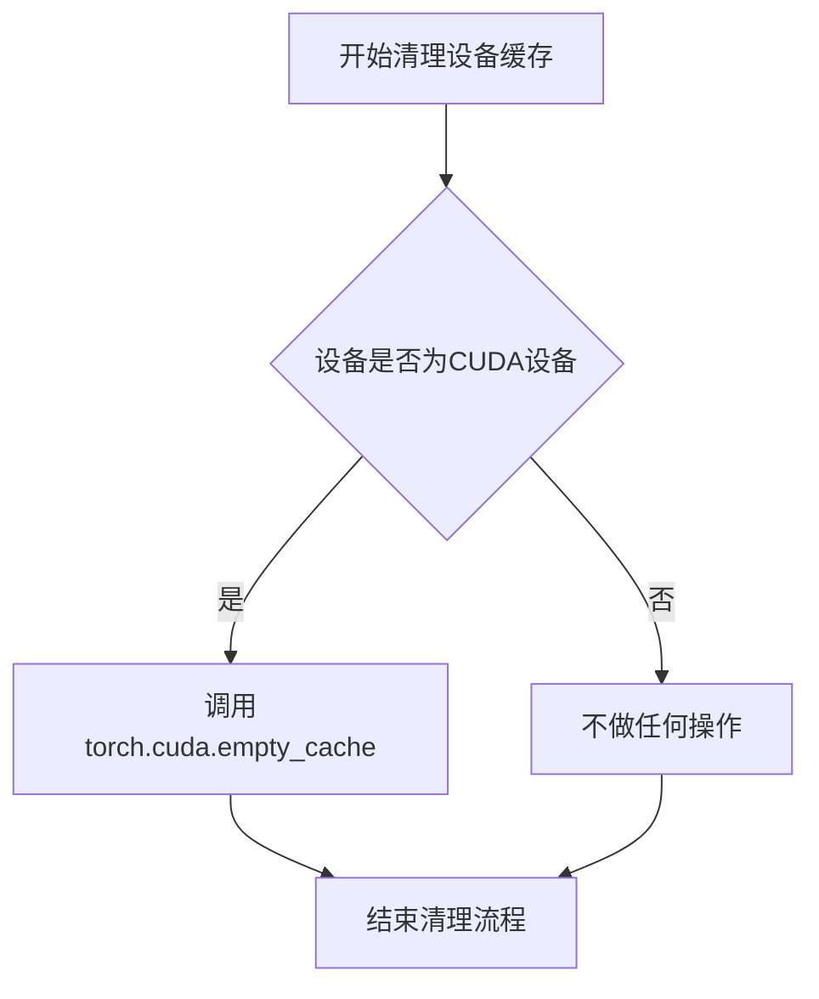

#### 带注释源码

```
# 注意：实际的源代码位于 testing_utils 模块中，此处为基于使用方式的推断
def backend_empty_cache(device):
    """
    清理指定设备的GPU缓存内存
    
    参数:
        device: 目标设备标识，通常为 'cuda' 或 'cuda:0' 等
    """
    # 强制进行垃圾回收，清理Python层面的未使用对象
    gc.collect()
    
    # 如果设备是CUDA设备，清理CUDA缓存
    if torch.cuda.is_available():
        # 获取设备对象
        device_obj = device if isinstance(device, torch.device) else torch.device(device)
        
        # 仅当设备是CUDA设备时执行缓存清理
        if device_obj.type == 'cuda':
            torch.cuda.empty_cache()
            
            # 可选：重置峰值内存统计（可选操作）
            # torch.cuda.reset_peak_memory_stats(device_obj)
```

**使用示例（在测试类中）：**

```python
class StableDiffusionLoRATests(PeftLoraLoaderMixinTests, unittest.TestCase):
    # ... 其他代码 ...
    
    def setUp(self):
        super().setUp()
        gc.collect()
        # 在测试开始前清理GPU缓存，确保干净的测试环境
        backend_empty_cache(torch_device)

    def tearDown(self):
        super().tearDown()
        gc.collect()
        # 在测试结束后清理GPU缓存，释放资源
        backend_empty_cache(torch_device)
```


### `load_image`

从 `testing_utils` 模块导入的函数，用于根据给定的 URL 或本地路径加载图像文件。

参数：

- `url_or_path`：`str`，图像的 URL 链接或本地文件路径

返回值：`PIL.Image` 或 `numpy.ndarray`，返回加载后的图像对象

#### 流程图

```mermaid
flowchart TD
    A[开始] --> B{输入是URL还是本地路径}
    B -->|URL| C[通过HTTP请求下载图像]
    B -->|本地路径| D[从本地文件系统读取图像]
    C --> E{下载是否成功}
    D --> E
    E -->|成功| F[解码图像数据]
    E -->|失败| G[抛出异常]
    F --> H{返回类型]
    H -->|PIL| I[返回PIL Image对象]
    H -->|numpy| J[转换为numpy数组]
    I --> K[结束]
    J --> K
```

#### 带注释源码

```
# 注意：load_image 函数定义在 testing_utils 模块中，未在此文件中展示
# 以下为该函数在此文件中的调用示例：

# 示例1：从URL加载图像用于对比
expected_image = load_image(
    "https://huggingface.co/datasets/hf-internal-testing/diffusers-images/resolve/main/lcm_lora/sdv15_lcm_lora.png"
)

# 示例2：加载本地测试图像
init_image = load_image(
    "https://huggingface.co/datasets/hf-internal-testing/diffusers-images/resolve/main/img2img/fantasy_landscape.png"
)
```

#### 补充说明

由于 `load_image` 函数定义在外部模块 `testing_utils` 中，其具体实现源码不在当前文件范围内。从实际调用情况来看，该函数主要完成以下工作：

1. 接收图像的 URL 字符串或本地路径
2. 自动识别输入类型（远程 URL 或本地文件）
3. 加载图像并返回可处理的图像对象（通常为 PIL Image）
4. 支持多种图像格式（JPG、PNG 等）

该函数是测试框架中的工具函数，用于在测试 Stable Diffusion pipeline 时加载参考图像或输入图像。


我需要分析提供的代码，找到 `nightly` 装饰器的信息。

让我先检查代码中 `nightly` 的定义。从代码的导入部分可以看到：

```python
from ..testing_utils import (
    Expectations,
    backend_empty_cache,
    load_image,
    nightly,
    numpy_cosine_similarity_distance,
    require_peft_backend,
    require_torch_accelerator,
    slow,
    torch_device,
)
```

`nightly` 是从 `..testing_utils` 模块导入的，但在当前代码文件中并没有定义 `nightly` 装饰器。让我在代码中搜索是否有 `nightly` 的定义：

搜索整个代码后，我发现 `nightly` 确实没有在当前文件中定义，它只是被导入并使用。例如在代码中：

```python
@slow
@nightly
@require_torch_accelerator
@require_peft_backend
class LoraIntegrationTests(unittest.TestCase):
```

由于 `nightly` 装饰器的定义不在当前代码文件中，我无法提供其详细的实现信息。

### 结论

当前提供的代码文件中**没有包含 `nightly` 装饰器的定义**。`nightly` 是从 `..testing_utils` 模块导入的外部依赖。

如果要获取 `nightly` 装饰器的完整设计文档，需要提供 `testing_utils` 模块的源代码。


# numpy_cosine_similarity_distance 函数设计文档

### `numpy_cosine_similarity_distance`

该函数用于计算两个NumPy数组之间的余弦相似性距离（1 - 余弦相似度），常用于测试中验证模型输出与预期结果的一致性。

参数：

- `expected`：`numpy.ndarray`，预期/参考的NumPy数组（通常为模型期望的输出）
- `actual`：`numpy.ndarray`，实际的NumPy数组（通常为模型预测的输出）

返回值：`float`，返回两个数组之间的余弦相似性距离，范围为[0, 2]，值越小表示两个数组越相似

#### 流程图

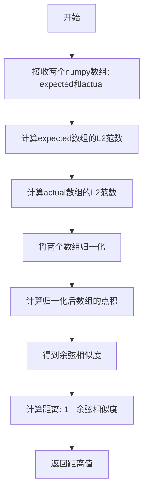

#### 带注释源码

（注：由于该函数定义在 `testing_utils` 模块中，未在当前文件中展示实际实现，以下为基于使用方式推断的可能实现）

```python
def numpy_cosine_similarity_distance(expected: np.ndarray, actual: np.ndarray) -> float:
    """
    计算两个NumPy数组之间的余弦相似性距离。
    
    余弦相似性距离 = 1 - 余弦相似度
    - 值为0表示两个向量完全相同（方向相同）
    - 值为1表示两个向量正交（无相似性）
    - 值为2表示两个向量完全相反
    
    参数:
        expected: 预期的NumPy数组（参考值）
        actual: 实际的NumPy数组（待比较的值）
    
    返回:
        float: 余弦相似性距离
    """
    # 确保输入是NumPy数组
    expected = np.asarray(expected)
    actual = np.asarray(actual)
    
    # 计算L2范数（向量的模）
    norm_expected = np.linalg.norm(expected)
    norm_actual = np.linalg.norm(actual)
    
    # 避免除零错误
    if norm_expected == 0 or norm_actual == 0:
        # 如果其中一个向量为零向量，根据约定返回适当值
        return float('inf') if not np.array_equal(expected, actual) else 0.0
    
    # 归一化向量
    normalized_expected = expected / norm_expected
    normalized_actual = actual / norm_actual
    
    # 计算点积（即余弦相似度，因为向量已归一化）
    cosine_similarity = np.dot(normalized_expected, normalized_actual)
    
    # 计算余弦距离
    cosine_distance = 1.0 - cosine_similarity
    
    return float(cosine_distance)
```

#### 关键组件信息

| 组件名称 | 一句话描述 |
|---------|----------|
| `numpy_cosine_similarity_distance` | 用于计算两个NumPy数组之间余弦相似性距离的测试工具函数 |

#### 潜在技术债务/优化空间

1. **函数位置**：该函数位于 `testing_utils` 模块中，属于测试辅助工具，但使用广泛，可考虑提升至核心工具模块以便更好地复用
2. **边界处理**：当前实现未处理边界情况（如除零错误），需要添加更完善的异常处理机制
3. **性能优化**：对于大规模数组，可考虑使用向量化操作和批量处理提升性能

#### 其它项目

**使用场景**：
- 在Diffusion模型的集成测试中，用于比较生成的图像数值与预期值的差异
- 验证LoRA权重加载后的模型输出是否符合预期
- 单元测试中断言模型输出的准确性

**设计约束**：
- 输入必须是 `numpy.ndarray` 类型
- 两个输入数组的维度应该相同
- 返回值越小表示相似度越高，通常用于阈值判断（如 `assert max_diff < 1e-3`）

**错误处理**：
- 未在当前代码中展示详细的错误处理逻辑
- 建议添加对输入类型的检查和对维度不匹配的警告


### `require_peft_backend`

这是一个测试装饰器，用于标记测试用例或测试类需要 PEFT (Parameter-Efficient Fine-Tuning) 后端才能运行。如果系统中没有正确配置 PEFT 后端，被装饰的测试将被跳过。

参数：
- 该装饰器不接受任何显式参数，它通过检查运行时环境来确定 PEFT 后端是否可用。

返回值：无返回值（装饰器直接修改被装饰函数/类的行为）。

#### 流程图

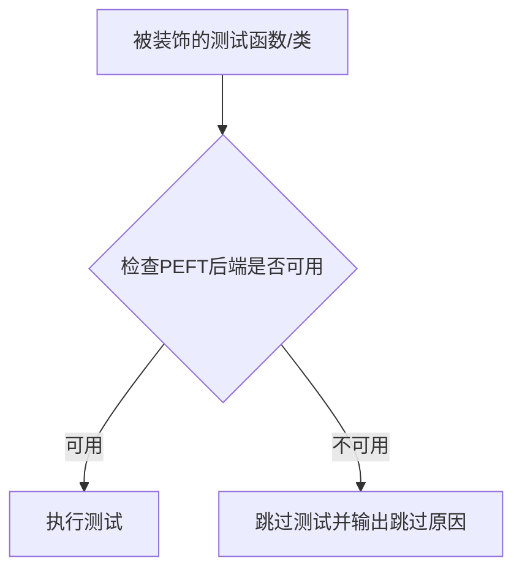

#### 带注释源码

```python
# 注意：require_peft_backend 函数定义不在当前代码文件中
# 它是从 testing_utils 模块导入的:
from ..testing_utils import (
    # ... 其他导入
    require_peft_backend,
    # ... 其他导入
)

# 使用示例：
@slow
@nightly
@require_torch_accelerator
@require_peft_backend
class LoraIntegrationTests(unittest.TestCase):
    # 该测试类需要 PEFT 后端才能运行
    # 如果没有安装 PEFT 或配置不正确，整个测试类将被跳过
    pass
```

> **注意**：当前代码片段中仅包含 `require_peft_backend` 的导入和使用示例，其实际函数定义位于 `..testing_utils` 模块中。该函数通常使用 `unittest.skipIf` 或类似的装饰器机制实现，用于在运行时检查 PEFT 库是否可用（如检查 `peft` 包是否已安装），如果不可用则跳过相关测试。


# 文档提取结果

### `require_torch_accelerator`

该函数是一个测试装饰器，用于检查 PyTorch 加速器（CUDA、GPU）是否可用。如果加速器不可用，则跳过被装饰的测试方法。这在持续集成环境中非常有用，可以确保测试仅在有 GPU 的机器上运行。

参数：

- 无显式参数（作为装饰器使用，接收被装饰的函数作为参数）

返回值：`Callable`，返回装饰后的函数，如果加速器不可用则返回跳过的测试函数

#### 流程图

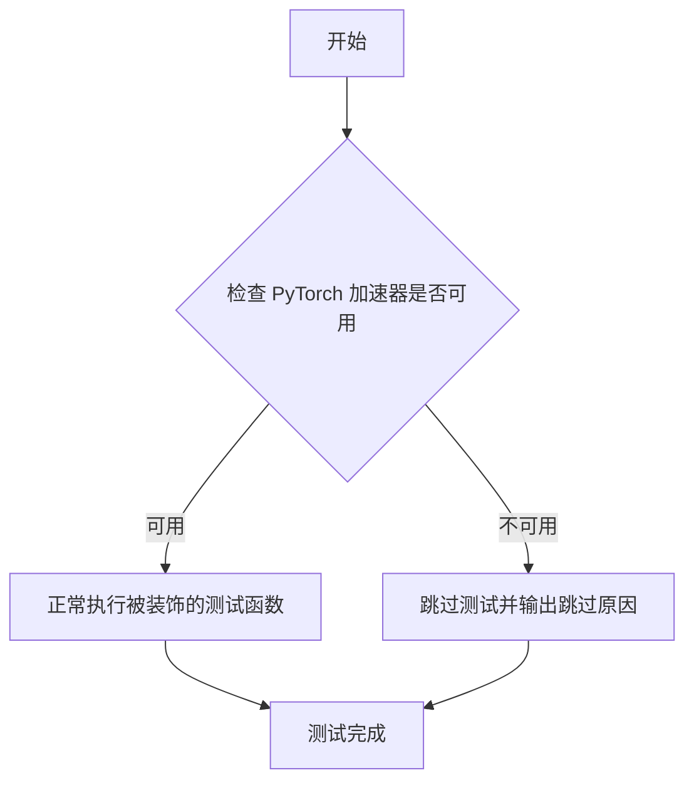

#### 带注释源码

```python
# 注意：实际的 require_torch_accelerator 函数定义不在当前代码文件中
# 它是从 ..testing_utils 模块导入的
# 以下是根据其使用方式推断的可能实现：

def require_torch_accelerator(func):
    """
    装饰器：检查 PyTorch 加速器是否可用
    
    用途：
    - 检查 torch.cuda.is_available() 或类似的加速器检测
    - 如果加速器不可用，使用 unittest.skipIf 跳过测试
    - 确保测试只在有 GPU 的环境中运行
    """
    # 实际的实现可能在 testing_utils 模块中
    # 这是一个常见的模式，用于条件性跳过测试
    pass
```

---

## 补充说明

**重要提示**：从提供的代码中只能看到 `require_torch_accelerator` 的**导入**和**使用**，但**没有提供该函数的具体实现**。该函数是从 `..testing_utils` 模块导入的。

实际的函数定义应该在以下位置之一：
- `diffusers/testing_utils.py`
- `diffusers/testing_utils/__init__.py`
- 类似的 testing_utils 模块中

要获取完整的实现细节，需要查看 `diffusers` 库源代码中的 testing_utils 模块。


### `slow`

`slow` 是一个测试装饰器，用于标记需要长时间运行的测试方法或测试类。被该装饰器标记的测试通常只在完整测试套件或夜间测试运行时执行，以避免在常规开发过程中频繁运行耗时的测试。

参数：
- 无

返回值：无返回值，主要通过修改被装饰函数的属性来实现标记功能。

#### 流程图

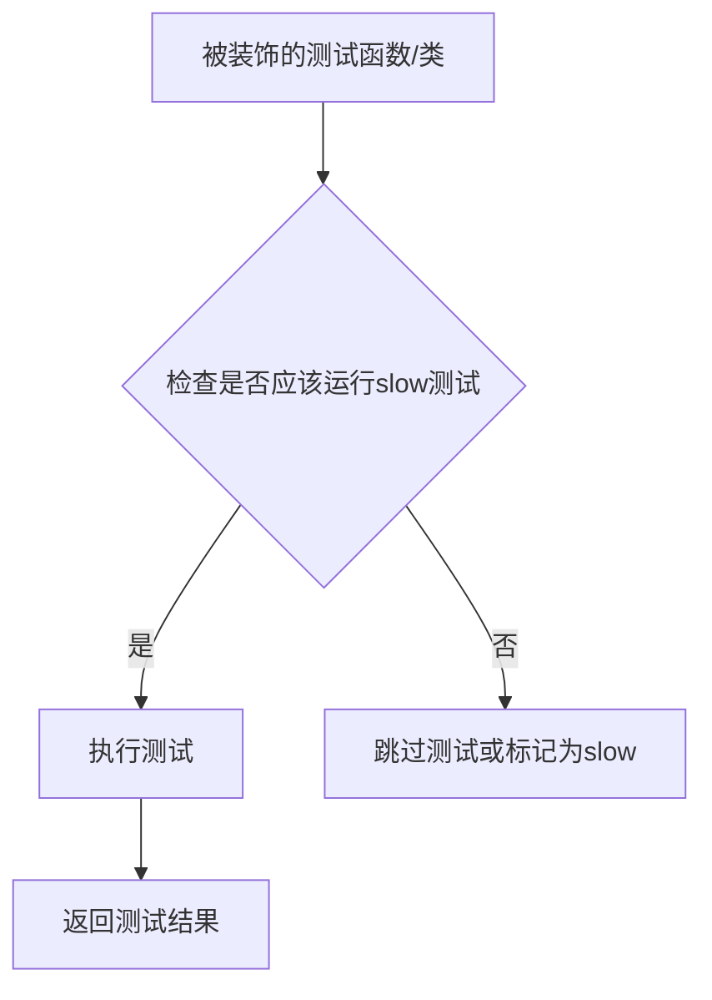

#### 带注释源码

```python
# slow 装饰器源码（从 ..testing_utils 导入，源码不可见）
# 基于使用方式的推断：

def slow(func):
    """
    标记测试为慢速测试的装饰器
    
    用途：
    - 标记需要长时间运行的集成测试
    - 通常与 @nightly, @require_torch_accelerator 等装饰器配合使用
    - 可能在测试框架中被特殊处理，跳过或单独运行
    """
    # 1. 将函数的 slow 属性设置为 True
    func.slow = True
    
    # 2. 返回修改后的函数
    return func


# 使用示例（在代码中）：
@slow
@require_torch_accelerator
def test_integration_move_lora_cpu(self):
    """这是一个需要GPU且运行时间较长的集成测试"""
    # 测试代码...
```

> **注意**：由于 `slow` 是从外部模块 `..testing_utils` 导入的，无法直接查看其完整实现源码。上面的源码是基于其使用方式和测试装饰器常见模式的推断。


根据您提供的代码，`torch_device` 是从 `..testing_utils` 模块导入的，但该模块的源代码并未包含在您提供的代码片段中。

不过，我可以根据代码中对 `torch_device` 的使用方式来推断其功能，并提供一个合理的文档。

### `torch_device`

该函数（或全局变量）用于获取当前测试环境可用的 PyTorch 设备（通常是 CUDA 设备或 CPU）。在测试用例中，它被传递给 `.to()` 方法和 `backend_empty_cache()` 函数，用于将模型和数据移动到指定的计算设备上。

参数：

- 该函数无参数（如果是函数）或无需参数（如果是全局变量）

返回值：`torch.device` 或 `str`，返回 PyTorch 设备对象或设备字符串（如 "cuda"、"cpu"、"cuda:0" 等）

#### 流程图

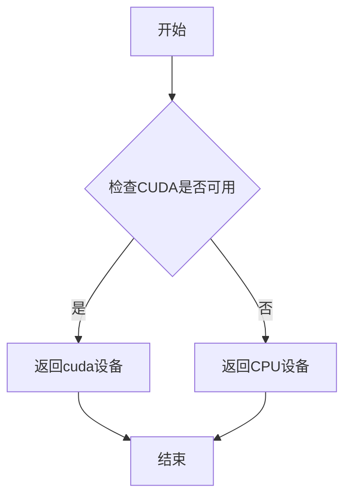

#### 带注释源码

```python
# 由于源代码未在提供的代码中给出，以下是基于常见实现模式的推测源码
# 实际实现可能位于 testing_utils.py 模块中

import torch

def torch_device():
    """
    获取当前可用的PyTorch设备。
    
    优先级顺序：
    1. 如果CUDA可用且torch.cuda.device_count() > 0，返回cuda设备
    2. 否则返回cpu设备
    
    Returns:
        str: 设备字符串，如'cuda', 'cuda:0', 'cpu'等
    """
    # 检查CUDA是否可用
    if torch.cuda.is_available() and torch.cuda.device_count() > 0:
        # 返回第一个CUDA设备
        return f"cuda:{torch.cuda.current_device()}" if torch.cuda.device_count() > 1 else "cuda"
    else:
        # 回退到CPU
        return "cpu"


# 在测试代码中的典型用法：
# pipe = pipe.to(torch_device)  # 将pipeline移动到指定设备
# backend_empty_cache(torch_device)  # 清空设备缓存
```

**注意**：实际的 `testing_utils.torch_device` 实现可能更复杂，可能还包含对其他加速设备（如MPS、IPU等）的支持。建议查看 `testing_utils.py` 模块的源代码以获取准确的实现细节。


# release_memory 函数提取文档

### `release_memory`

该函数是从 `accelerate` 库的条件导入函数，主要用于释放 PyTorch 模型（特别是 Diffusers pipeline）占用的 GPU 显存，通过调用垃圾回收和清空 GPU 缓存来帮助管理深度学习推理过程中的内存使用。

## 参数

- `obj`：`torch.nn.Module` 或 `DiffusionPipeline`，需要释放内存的 PyTorch 模型或 pipeline 对象

## 返回值

- `None`，该函数执行内存释放操作，不返回任何值

## 流程图

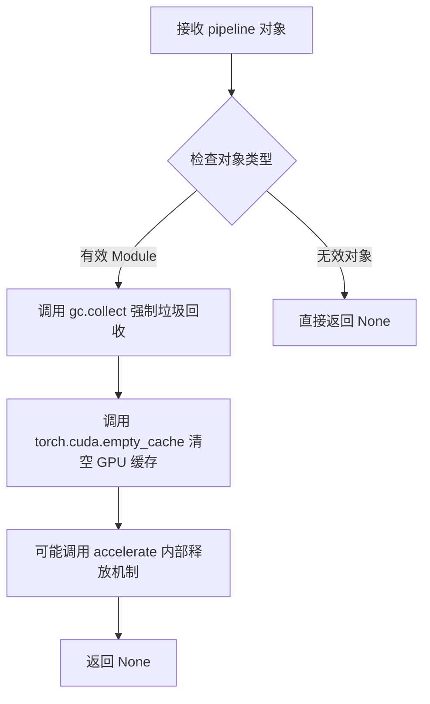

## 使用场景分析

在代码中，`release_memory` 主要在以下场景中被调用：

1. **LoRA 权重卸载后**：在调用 `pipe.unload_lora_weights()` 后释放相关内存
2. **推理测试完成后**：在每个集成测试的末尾调用，确保 GPU 内存被释放供下一个测试使用
3. **Pipeline 切换前**：在加载新的 pipeline 或模型前清理旧模型占用的内存

## 带注释源码（基于使用方式推测）

```python
# 注意：这是基于代码使用方式对 accelerate.utils.release_memory 的推测
# 实际源码位于 accelerate 库中，此处无法直接获取

def release_memory(obj):
    """
    释放给定 PyTorch 对象占用的 GPU 内存。
    
    参数:
        obj: torch.nn.Module 或包含 nn.Module 的容器对象
             在本项目中通常是 StableDiffusionPipeline 实例
    
    返回:
        None
    
    内部实现推测：
    1. 首先调用 Python 的垃圾回收器 (gc.collect()) 清理不可达对象
    2. 调用 torch.cuda.empty_cache() 清空 GPU 缓存
    3. 如果对象是 Module 或包含 Module 的容器，遍历其参数并显式删除
    4. 可能还会处理 Accelerate 的 device map 相关的内存管理
    """
    # 在测试代码中的典型调用方式：
    # pipe.unload_lora_weights()
    # release_memory(pipe)
    pass
```

## 关键信息

| 项目 | 详情 |
|------|------|
| **函数名** | release_memory |
| **来源** | accelerate.utils |
| **导入方式** | 条件导入（if is_accelerate_available()） |
| **调用场景** | LoRA 测试完成后释放 pipeline 内存 |
| **依赖库** | accelerate, torch, gc |

## 注意事项

由于 `release_memory` 是从外部库 (`accelerate`) 导入的函数，上述信息基于：

1. **代码中的调用方式**：`release_memory(pipe)` - 只传入一个 pipeline 对象参数
2. **调用上下文**：在 `unload_lora_weights()` 之后调用，表明功能与内存释放相关
3. **Python 内存管理最佳实践**：通常涉及 `gc.collect()` 和 `torch.cuda.empty_cache()`

如需查看实际源码实现，建议查阅 [HuggingFace Accelerate 库](https://github.com/huggingface/accelerate) 的 `accelerate/utils` 模块。


### `StableDiffusionLoRATests.setUp`

该方法是测试类的初始化方法，在每个测试方法运行前被调用，用于执行垃圾回收和清空GPU缓存，以确保测试环境干净且内存充足。

参数： 无

返回值：无返回值（`None`），该方法仅执行清理操作，不返回任何数据。

#### 流程图

```mermaid
flowchart TD
    A[开始 setUp] --> B[调用父类 setUp: super().setUp]
    B --> C[执行垃圾回收: gc.collect]
    C --> D[清空后端缓存: backend_empty_cache(torch_device)]
    D --> E[结束 setUp]
```

#### 带注释源码

```python
def setUp(self):
    """
    测试前置设置方法，在每个测试方法执行前调用。
    负责初始化测试环境，清理资源以确保测试隔离性。
    """
    # 调用父类的 setUp 方法，执行基类的初始化逻辑
    # PeftLoraLoaderMixinTests 可能包含其他必要的初始化操作
    super().setUp()
    
    # 手动触发 Python 垃圾回收，释放不再使用的对象内存
    # 这有助于确保 GPU 内存能够被正确释放和重用
    gc.collect()
    
    # 清空指定设备的后端缓存（如 GPU 内存缓存）
    # torch_device 是全局变量，表示当前使用的计算设备
    # 这一步对于避免显存泄漏和确保测试间资源隔离至关重要
    backend_empty_cache(torch_device)
```


### `StableDiffusionLoRATests.tearDown`

清理测试环境，释放GPU内存和进行垃圾回收，确保测试之间的资源隔离，防止内存泄漏。

参数：

- 无显式参数（隐式参数 `self` 为 unittest.TestCase 实例）

返回值：`None`，无返回值

#### 流程图

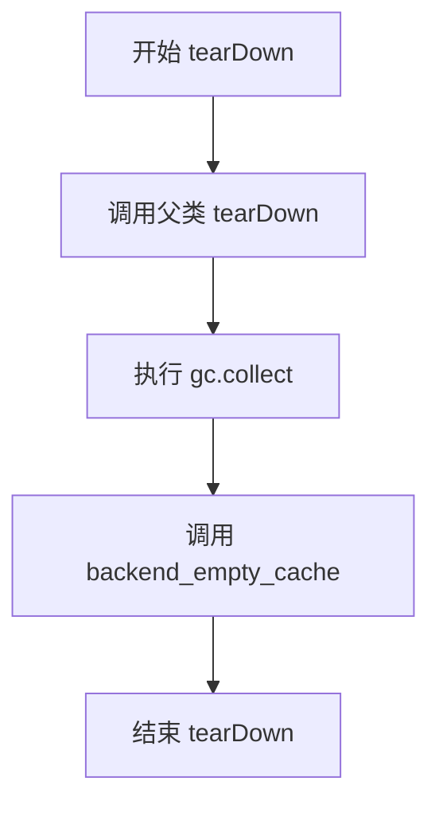

#### 带注释源码

```python
def tearDown(self):
    """
    测试用例 tearDown 方法
    
    在每个测试用例完成后执行清理工作：
    1. 调用父类的 tearDown 方法确保基类资源被正确清理
    2. 执行 Python 垃圾回收释放未使用的对象内存
    3. 清空 GPU 缓存释放显存空间
    
    这样做可以确保：
    - 测试之间相互隔离，不会因为资源残留导致互相影响
    - 避免 GPU 内存耗尽导致后续测试失败
    - 释放测试过程中创建的临时对象
    """
    # 调用父类的 tearDown 方法，确保基类资源被正确清理
    super().tearDown()
    
    # 执行 Python 垃圾回收，释放测试过程中创建的未引用对象
    gc.collect()
    
    # 清空 GPU 缓存，释放显存空间，防止内存泄漏
    backend_empty_cache(torch_device)
```


### `StableDiffusionLoRATests.test_integration_move_lora_cpu`

该测试方法验证了LoRA权重在CPU和GPU设备之间正确移动的功能。具体流程包括：加载两个LoRA适配器，将第一个适配器移至CPU进行设备验证，再移回GPU，最后将所有适配器移至GPU并进行验证。

参数：

- `self`：`StableDiffusionLoRATests`，测试类的实例，包含pipeline和配置信息

返回值：`None`，该方法为测试用例，无返回值

#### 流程图

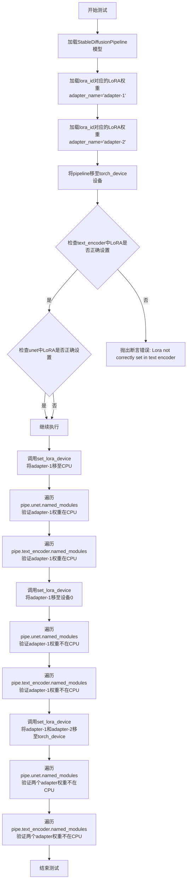

#### 带注释源码

```python
@slow                          # 标记为慢速测试，需要较长执行时间
@require_torch_accelerator     # 需要CUDA加速器才能运行
def test_integration_move_lora_cpu(self):
    """
    测试LoRA权重在CPU和GPU之间的移动功能
    
    测试流程：
    1. 加载Stable Diffusion pipeline
    2. 加载两个LoRA适配器
    3. 将第一个适配器移至CPU，验证设备移动正确性
    4. 将第一个适配器移回GPU
    5. 将所有适配器移至GPU
    """
    # 定义模型路径和LoRA权重ID
    path = "stable-diffusion-v1-5/stable-diffusion-v1-5"
    lora_id = "takuma104/lora-test-text-encoder-lora-target"

    # 步骤1: 从预训练模型加载Stable Diffusion Pipeline
    # 使用float16精度以减少内存占用
    pipe = StableDiffusionPipeline.from_pretrained(path, torch_dtype=torch.float16)
    
    # 步骤2: 加载两个不同名称的LoRA适配器
    # adapter-1: 第一个LoRA适配器
    pipe.load_lora_weights(lora_id, adapter_name="adapter-1")
    # adapter-2: 第二个LoRA适配器
    pipe.load_lora_weights(lora_id, adapter_name="adapter-2")
    
    # 将整个pipeline移至指定的计算设备（通常是GPU）
    pipe = pipe.to(torch_device)

    # 验证text_encoder中LoRA权重是否正确设置
    self.assertTrue(
        check_if_lora_correctly_set(pipe.text_encoder),
        "Lora not correctly set in text encoder",
    )

    # 验证unet中LoRA权重是否正确设置
    self.assertTrue(
        check_if_lora_correctly_set(pipe.unet),
        "Lora not correctly set in unet",
    )

    # 步骤3: 将adapter-1移至CPU内存
    # 测试set_lora_device方法能否正确将指定adapter移至CPU
    pipe.set_lora_device(["adapter-1"], "cpu")

    # 验证unet中adapter-1的权重确实在CPU上
    for name, module in pipe.unet.named_modules():
        # 筛选包含adapter-1的模块，排除Dropout和Identity层
        if "adapter-1" in name and not isinstance(module, (nn.Dropout, nn.Identity)):
            # 断言该模块的权重在CPU设备上
            self.assertTrue(module.weight.device == torch.device("cpu"))
        # 验证adapter-2未被移动到CPU（应该仍在GPU）
        elif "adapter-2" in name and not isinstance(module, (nn.Dropout, nn.Identity)):
            self.assertTrue(module.weight.device != torch.device("cpu"))

    # 验证text_encoder中adapter-1的权重在CPU上
    for name, module in pipe.text_encoder.named_modules():
        if "adapter-1" in name and not isinstance(module, (nn.Dropout, nn.Identity)):
            self.assertTrue(module.weight.device == torch.device("cpu"))
        elif "adapter-2" in name and not isinstance(module, (nn.Dropout, nn.Identity)):
            self.assertTrue(module.weight.device != torch.device("cpu"))

    # 步骤4: 将adapter-1从CPU移回GPU设备0
    pipe.set_lora_device(["adapter-1"], 0)

    # 验证unet中adapter-1的权重已不在CPU上
    for n, m in pipe.unet.named_modules():
        if "adapter-1" in n and not isinstance(m, (nn.Dropout, nn.Identity)):
            self.assertTrue(m.weight.device != torch.device("cpu"))

    # 验证text_encoder中adapter-1的权重已不在CPU上
    for n, m in pipe.text_encoder.named_modules():
        if "adapter-1" in n and not isinstance(m, (nn.Dropout, nn.Identity)):
            self.assertTrue(m.weight.device != torch.device("cpu"))

    # 步骤5: 将所有适配器（adapter-1和adapter-2）移至torch_device（GPU）
    pipe.set_lora_device(["adapter-1", "adapter-2"], torch_device)

    # 验证unet中所有adapter的权重都在GPU上
    for n, m in pipe.unet.named_modules():
        if ("adapter-1" in n or "adapter-2" in n) and not isinstance(m, (nn.Dropout, nn.Identity)):
            self.assertTrue(m.weight.device != torch.device("cpu"))

    # 验证text_encoder中所有adapter的权重都在GPU上
    for n, m in pipe.text_encoder.named_modules():
        if ("adapter-1" in n or "adapter-2" in n) and not isinstance(m, (nn.Dropout, nn.Identity)):
            self.assertTrue(m.weight.device != torch.device("cpu"))
```


### `StableDiffusionLoRATests.test_integration_move_lora_dora_cpu`

该测试函数验证在使用 DoRA（Decomposed Rank-1 Adaptation）配置下，LoRA 权重在 CPU 和 GPU 设备之间的移动是否正确工作。测试首先为 UNet 和文本编码器添加带有 DoRA 配置的 LoRA 适配器，验证初始状态下 LoRA 参数位于 CPU 设备，随后测试将适配器移动到目标 GPU 设备的功能。

参数：

- `self`：unittest.TestCase，测试类实例本身，包含测试状态和断言方法

返回值：`None`，该测试函数通过 unittest 框架执行，不返回任何值，仅通过断言验证行为正确性

#### 流程图

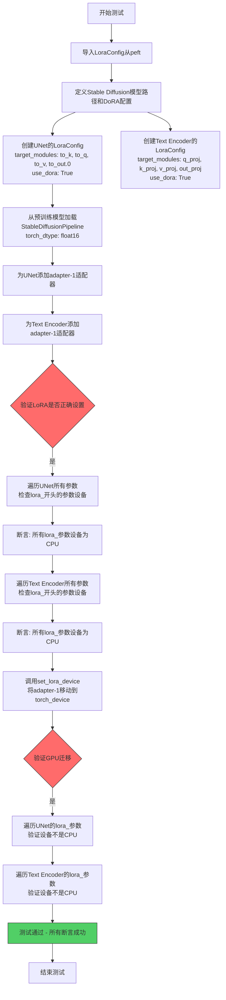

#### 带注释源码

```python
@slow
@require_torch_accelerator
def test_integration_move_lora_dora_cpu(self):
    """
    测试在使用DoRA配置时，LoRA权重在CPU和GPU之间的移动功能
    """
    from peft import LoraConfig  # 导入DoRA配置所需的LoraConfig类

    # 定义Stable Diffusion模型路径
    path = "stable-diffusion-v1-5/stable-diffusion-v1-5"
    
    # 创建UNet的LoRA配置，启用DoRA
    unet_lora_config = LoraConfig(
        init_lora_weights="gaussian",  # 初始化LoRA权重为高斯分布
        target_modules=["to_k", "to_q", "to_v", "to_out.0"],  # 目标模块为注意力层
        use_dora=True,  # 启用DoRA（Decomposed Rank-1 Adaptation）
    )
    
    # 创建Text Encoder的LoRA配置，启用DoRA
    text_lora_config = LoraConfig(
        init_lora_weights="gaussian",
        target_modules=["q_proj", "k_proj", "v_proj", "out_proj"],  # 文本编码器的注意力模块
        use_dora=True,
    )

    # 从预训练模型加载Stable Diffusion Pipeline，使用float16精度
    pipe = StableDiffusionPipeline.from_pretrained(path, torch_dtype=torch.float16)
    
    # 为UNet添加adapter-1，使用DoRA配置
    pipe.unet.add_adapter(unet_lora_config, "adapter-1")
    
    # 为Text Encoder添加adapter-1，使用DoRA配置
    pipe.text_encoder.add_adapter(text_lora_config, "adapter-1")

    # 验证Text Encoder中的LoRA是否正确设置
    self.assertTrue(
        check_if_lora_correctly_set(pipe.text_encoder),
        "Lora not correctly set in text encoder",
    )

    # 验证UNet中的LoRA是否正确设置
    self.assertTrue(
        check_if_lora_correctly_set(pipe.unet),
        "Lora not correctly set in unet",
    )

    # 验证初始状态下UNet的LoRA参数位于CPU设备
    for name, param in pipe.unet.named_parameters():
        if "lora_" in name:
            self.assertEqual(param.device, torch.device("cpu"))

    # 验证初始状态下Text Encoder的LoRA参数位于CPU设备
    for name, param in pipe.text_encoder.named_parameters():
        if "lora_" in name:
            self.assertEqual(param.device, torch.device("cpu"))

    # 将adapter-1从CPU移动到指定的GPU设备
    pipe.set_lora_device(["adapter-1"], torch_device)

    # 验证移动后UNet的LoRA参数不再位于CPU
    for name, param in pipe.unet.named_parameters():
        if "lora_" in name:
            self.assertNotEqual(param.device, torch.device("cpu"))

    # 验证移动后Text Encoder的LoRA参数不再位于CPU
    for name, param in pipe.text_encoder.named_parameters():
        if "lora_" in name:
            self.assertNotEqual(param.device, torch.device("cpu"))
```


### `StableDiffusionLoRATests.test_integration_set_lora_device_different_target_layers`

该测试方法用于验证当多个LoRA adapter被加载到不同的目标层时，`set_lora_device`方法能够正确处理。它修复了一个bug（#11833），确保分别设置和同时设置多个adapter到不同设备时都能正常工作。

参数：

- `self`：unittest.TestCase，表示测试用例实例本身

返回值：`None`，该方法为测试方法，通过断言验证行为，不返回任何值

#### 流程图

```mermaid
flowchart TD
    A[开始测试] --> B[导入LoraConfig]
    B --> C[设置预训练模型路径为stable-diffusion-v1-5]
    C --> D[从预训练模型加载StableDiffusionPipeline<br/>dtype=torch.float16]
    D --> E[创建config0: target_modules=['to_k', 'to_v']]
    E --> F[创建config1: target_modules=['to_k', 'to_q']]
    F --> G[为UNet添加adapter-0和adapter-1]
    G --> H[将pipeline移到torch_device设备]
    H --> I[断言验证LoRA正确设置]
    I --> J[sanity check:<br/>验证两个adapter不target相同layers]
    J --> K[分别设置adapter-0和adapter-1到CPU]
    K --> L[遍历unet模块验证adapter在CPU]
    L --> M[同时设置两个adapter回到torch_device]
    M --> N[遍历unet模块验证adapter不在CPU]
    N --> O[测试结束]
```

#### 带注释源码

```python
@slow  # 标记为慢速测试，需要较长时间执行
@require_torch_accelerator  # 需要torch加速器才能运行
def test_integration_set_lora_device_different_target_layers(self):
    # 修复了一个bug：当使用多个adapter加载时，
    # 这些adapter针对不同的层，调用set_lora_device会出问题
    # 相关issue: #11833
    from peft import LoraConfig  # 从peft库导入LoraConfig

    # 定义预训练模型路径
    path = "stable-diffusion-v1-5/stable-diffusion-v1-5"
    
    # 从预训练模型加载StableDiffusionPipeline，使用float16精度
    pipe = StableDiffusionPipeline.from_pretrained(path, torch_dtype=torch.float16)
    
    # 创建两个LoraConfig，部分目标层相同，部分不同
    # config0: 针对to_k和to_v层
    config0 = LoraConfig(target_modules=["to_k", "to_v"])
    # config1: 针对to_k和to_q层
    config1 = LoraConfig(target_modules=["to_k", "to_q"])
    
    # 为UNet添加两个adapter，分别命名为adapter-0和adapter-1
    pipe.unet.add_adapter(config0, adapter_name="adapter-0")
    pipe.unet.add_adapter(config1, adapter_name="adapter-1")
    
    # 将pipeline移到指定的torch设备上
    pipe = pipe.to(torch_device)

    # 断言验证LoRA在UNet中正确设置
    self.assertTrue(
        check_if_lora_correctly_set(pipe.unet),
        "Lora not correctly set in unet",
    )

    # sanity check：确保两个adapter不针对完全相同的层
    # 否则测试即使没有修复也会通过
    # 获取所有以.adapter-0结尾的模块名称集合
    modules_adapter_0 = {n for n, _ in pipe.unet.named_modules() if n.endswith(".adapter-0")}
    # 获取所有以.adapter-1结尾的模块名称集合
    modules_adapter_1 = {n for n, _ in pipe.unet.named_modules() if n.endswith(".adapter-1")}
    
    # 验证两个集合不相等
    self.assertNotEqual(modules_adapter_0, modules_adapter_1)
    # 验证adapter-0有独有的模块
    self.assertTrue(modules_adapter_0 - modules_adapter_1)
    # 验证adapter-1有独有的模块
    self.assertTrue(modules_adapter_1 - modules_adapter_0)

    # 测试1：分别设置两个adapter到CPU设备
    pipe.set_lora_device(["adapter-0"], "cpu")
    pipe.set_lora_device(["adapter-1"], "cpu")

    # 遍历UNet的所有模块，验证adapter的weight设备为CPU
    for name, module in pipe.unet.named_modules():
        if "adapter-0" in name and not isinstance(module, (nn.Dropout, nn.Identity)):
            # 断言adapter-0的权重在CPU上
            self.assertTrue(module.weight.device == torch.device("cpu"))
        elif "adapter-1" in name and not isinstance(module, (nn.Dropout, nn.Identity)):
            # 断言adapter-1的权重在CPU上
            self.assertTrue(module.weight.device == torch.device("cpu"))

    # 测试2：同时设置两个adapter到原始torch_device
    pipe.set_lora_device(["adapter-0", "adapter-1"], torch_device)

    # 再次遍历验证两个adapter都已移回原设备（非CPU）
    for name, module in pipe.unet.named_modules():
        if "adapter-0" in name and not isinstance(module, (nn.Dropout, nn.Identity)):
            # 断言adapter-0的权重不在CPU上
            self.assertTrue(module.weight.device != torch.device("cpu"))
        elif "adapter-1" in name and not isinstance(module, (nn.Dropout, nn.Identity)):
            # 断言adapter-1的权重不在CPU上
            self.assertTrue(module.weight.device != torch.device("cpu"))
```


### `LoraIntegrationTests.setUp`

该方法是 `LoraIntegrationTests` 测试类的初始化方法，在每个测试方法执行前被调用，用于清理 Python 垃圾回收和 GPU 缓存，确保测试环境处于干净状态，避免测试间的相互干扰。

参数：
- `self`：隐式参数，表示测试类实例本身，无类型描述

返回值：`None`，无返回值描述

#### 流程图

```mermaid
flowchart TD
    A[开始 setUp] --> B[调用 super().setUp]
    B --> C[执行 gc.collect]
    C --> D[调用 backend_empty_cache]
    D --> E[结束 setUp]
    
    style A fill:#f9f,stroke:#333
    style E fill:#9f9,stroke:#333
```

#### 带注释源码

```python
@slow
@nightly
@require_torch_accelerator
@require_peft_backend
class LoraIntegrationTests(unittest.TestCase):
    def setUp(self):
        """
        测试方法执行前的初始化钩子
        - 调用父类 setUp 方法，确保 unittest.TestCase 的基础初始化
        - 清理 Python 垃圾回收，释放循环引用对象的内存
        - 清理深度学习后端（GPU/CPU）的缓存，防止显存泄漏
        """
        super().setUp()  # 调用父类 unittest.TestCase 的 setUp 方法
        gc.collect()  # 强制 Python 垃圾回收，清理循环引用
        backend_empty_cache(torch_device)  # 清理 torch 后端缓存，释放 GPU 显存
```


### `LoraIntegrationTests.tearDown`

该方法是 `LoraIntegrationTests` 类的测试清理方法，在每个测试用例执行完毕后自动调用，用于回收测试过程中占用的内存资源，确保测试环境干净，防止内存泄漏。它通过调用父类的 `tearDown` 方法、执行 Python 垃圾回收以及清空深度学习后端缓存来完成清理工作。

参数：
- 无

返回值：
- `None`，无返回值

#### 流程图

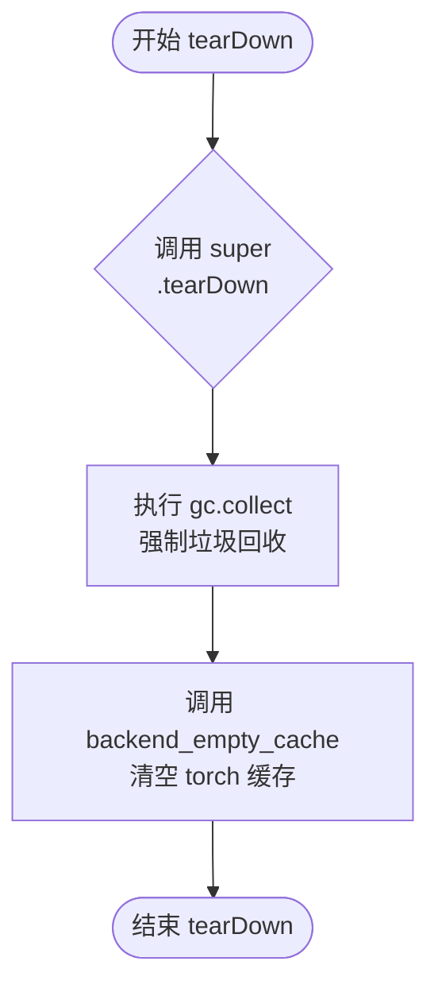

#### 带注释源码

```python
def tearDown(self):
    """
    测试用例执行完毕后的清理方法。

    该方法在每个测试方法运行结束后被调用，用于释放测试过程中
    产生的内存和 GPU 缓存资源，确保后续测试有一个干净的运行环境。
    """
    # 1. 调用父类（unittest.TestCase）的 tearDown 方法
    #    执行父类中定义的清理逻辑
    super().tearDown()

    # 2. 强制执行 Python 垃圾回收
    #    回收测试过程中产生的临时对象，防止内存泄漏
    gc.collect()

    # 3. 清空深度学习后端的缓存（如 GPU 显存缓存）
    #    torch_device 是测试工具中定义的设备常量（如 'cuda' 或 'cpu'）
    backend_empty_cache(torch_device)
```


### `LoraIntegrationTests.test_integration_logits_with_scale`

该测试方法验证了在使用指定缩放因子（scale=0.5）的情况下，LoRA 权重能否正确集成到 Stable Diffusion pipeline 中并影响图像生成 logits。测试通过加载预训练的 Stable Diffusion v1.5 模型和应用 LoRA 权重，使用固定随机种子生成图像，然后比较生成的图像切片与预期值的余弦相似度距离，确保差异小于阈值（1e-3）。

参数：无（仅包含隐式参数 `self`）

返回值：`None`，该方法为测试方法，无返回值（类型为 `void`）

#### 流程图

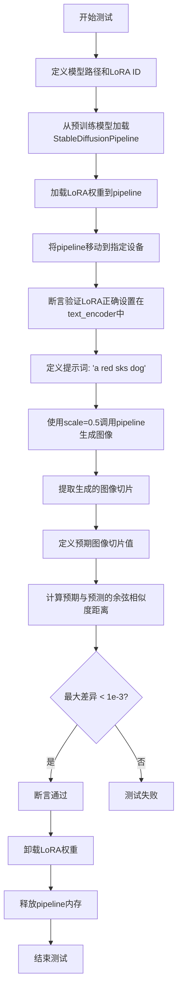

#### 带注释源码

```python
def test_integration_logits_with_scale(self):
    """
    测试在使用缩放因子时，LoRA权重是否能正确影响图像生成的logits。
    验证点：
    1. LoRA权重能正确加载到Stable Diffusion pipeline
    2. 通过cross_attention_kwargs传递的scale参数能正确影响生成结果
    """
    
    # 定义预训练模型路径
    path = "stable-diffusion-v1-5/stable-diffusion-v1-5"
    
    # 定义LoRA权重的HuggingFace Hub ID
    lora_id = "takuma104/lora-test-text-encoder-lora-target"

    # 从预训练模型加载StableDiffusionPipeline，使用float32精度
    pipe = StableDiffusionPipeline.from_pretrained(path, torch_dtype=torch.float32)
    
    # 加载指定LoRA权重到pipeline中
    pipe.load_lora_weights(lora_id)
    
    # 将pipeline移动到指定的计算设备（如CUDA设备）
    pipe = pipe.to(torch_device)

    # 断言验证LoRA权重已正确设置在text_encoder中
    # check_if_lora_correctly_set是一个辅助函数，用于检查LoRA模块是否被正确注入
    self.assertTrue(
        check_if_lora_correctly_set(pipe.text_encoder),
        "Lora not correctly set in text encoder",
    )

    # 定义文本提示词，用于生成图像
    prompt = "a red sks dog"

    # 调用pipeline生成图像
    # 参数说明：
    # - prompt: 文本提示词
    # - num_inference_steps: 推理步数（15步）
    # - cross_attention_kwargs: 传递注意力机制参数，其中scale=0.5控制LoRA影响的强度
    # - generator: 使用固定随机种子(0)确保可重复性
    # - output_type: 指定输出类型为numpy数组
    images = pipe(
        prompt=prompt,
        num_inference_steps=15,
        cross_attention_kwargs={"scale": 0.5},
        generator=torch.manual_seed(0),
        output_type="np",
    ).images

    # 定义预期生成的图像切片值（9个像素值的数组）
    # 这是使用scale=0.5时预期的图像右下角3x3区域的像素值
    expected_slice_scale = np.array([0.307, 0.283, 0.310, 0.310, 0.300, 0.314, 0.336, 0.314, 0.321])
    
    # 从生成的图像中提取右下角3x3区域的像素值并展平
    # images[0]: 取第一张生成的图像
    # [-3:, -3:, -1]: 取最后3行、最后3列、最后一个通道（RGB中的B通道）
    predicted_slice = images[0, -3:, -3:, -1].flatten()

    # 计算预期切片与预测切片之间的余弦相似度距离
    # 该函数返回两个数组之间的余弦距离（1 - 余弦相似度）
    max_diff = numpy_cosine_similarity_distance(expected_slice_scale, predicted_slice)
    
    # 断言最大差异小于阈值（1e-3），确保LoRA权重正确影响了生成结果
    assert max_diff < 1e-3

    # 卸载LoRA权重，清理资源
    pipe.unload_lora_weights()
    
    # 释放pipeline占用的内存
    # release_memory来自accelerate库，用于清理GPU内存
    release_memory(pipe)
```


### `LoraIntegrationTests.test_integration_logits_no_scale`

该方法是一个集成测试，用于验证在不使用缩放因子（scale）的情况下，LoRA权重是否能正确加载到Stable Diffusion pipeline中，并通过比对生成的图像切片与预期值的余弦相似度来确认LoRA对文本编码器的影响。

参数：

- `self`：`unittest.TestCase`，测试用例的实例本身，包含测试所需的断言方法

返回值：`None`，该方法为测试方法，不返回任何值，通过断言验证正确性

#### 流程图

```mermaid
graph TD
    A[开始测试] --> B[加载StableDiffusionPipeline预训练模型]
    B --> C[从HuggingFace加载LoRA权重]
    C --> D[将pipeline移动到目标设备torch_device]
    D --> E{验证text_encoder中LoRA是否正确设置}
    E -->|否| F[抛出断言错误]
    E -->|是| G[定义提示词: a red sks dog]
    G --> H[执行30步推理, 输出类型为numpy]
    H --> I[提取生成的图像最后3x3像素区域]
    I --> J[计算预期值与预测值的余弦相似度距离]
    J --> K{距离小于1e-3?}
    K -->|否| L[抛出断言错误]
    K -->|是| M[卸载LoRA权重]
    M --> N[释放pipeline内存]
    N --> O[测试结束]
    F --> O
    L --> O
```

#### 带注释源码

```python
def test_integration_logits_no_scale(self):
    """
    集成测试：验证LoRA权重在无缩放因子情况下的正确加载与影响
    
    测试流程：
    1. 加载Stable Diffusion v1.5预训练模型
    2. 加载指定的LoRA权重到pipeline
    3. 使用特定提示词生成图像
    4. 验证生成结果与预期值的相似度
    """
    # 定义模型路径和LoRA权重ID
    path = "stable-diffusion-v1-5/stable-diffusion-v1-5"
    lora_id = "takuma104/lora-test-text-encoder-lora-target"

    # 从预训练模型创建StableDiffusionPipeline，使用float32精度
    pipe = StableDiffusionPipeline.from_pretrained(path, torch_dtype=torch.float32)
    
    # 加载指定的LoRA权重到pipeline
    pipe.load_lora_weights(lora_id)
    
    # 将pipeline移动到目标设备（如CUDA设备）
    pipe = pipe.to(torch_device)

    # 断言验证：确保LoRA权重已正确设置到text_encoder中
    # check_if_lora_correctly_set是一个工具函数，用于检查模块中是否包含lora权重
    self.assertTrue(
        check_if_lora_correctly_set(pipe.text_encoder),
        "Lora not correctly set in text encoder",
    )

    # 定义文本提示词
    prompt = "a red sks dog"

    # 执行推理生成图像
    # 参数说明：
    # - prompt: 文本提示词
    # - num_inference_steps: 30步推理（比test_integration_logits_with_scale多一倍）
    # - generator: 使用固定随机种子确保可复现性
    # - output_type: np返回numpy数组格式
    images = pipe(prompt=prompt, num_inference_steps=30, generator=torch.manual_seed(0), output_type="np").images

    # 定义预期图像切片（9个像素值的numpy数组）
    # 这些值是预先计算的正确结果，用于验证LoRA权重是否正确影响生成
    expected_slice_scale = np.array([0.074, 0.064, 0.073, 0.0842, 0.069, 0.0641, 0.0794, 0.076, 0.084])
    
    # 提取生成的图像最后一层的最后3x3区域并展平
    # images[0]取第一张图，[-3:, -3:, -1]取最后3行3列的RGB通道的最后一个通道
    predicted_slice = images[0, -3:, -3:, -1].flatten()

    # 计算预期值与预测值之间的余弦相似度距离
    max_diff = numpy_cosine_similarity_distance(expected_slice_scale, predicted_slice)

    # 断言：验证差异小于阈值（表示LoRA正确影响了生成）
    assert max_diff < 1e-3

    # 清理：卸载LoRA权重释放相关内存
    pipe.unload_lora_weights()
    
    # 释放pipeline占用的显存/内存
    release_memory(pipe)
```


### `LoraIntegrationTests.test_dreambooth_old_format`

该测试方法用于验证 DreamBooth 旧格式 LoRA 权重能否正确加载到 StableDiffusionPipeline 中，并通过生成图像与预期结果进行比对来确认 LoRA 适配器的功能完整性。

参数：

- `self`：隐式参数，类型为 `LoraIntegrationTests`，代表测试类实例本身

返回值：`None`，该方法为测试用例，无显式返回值

#### 流程图

```mermaid
flowchart TD
    A[开始测试] --> B[创建随机数生成器: generator = torch.Generator('cpu').manual_seed(0)]
    B --> C[定义lora_model_id: hf-internal-testing/lora_dreambooth_dog_example]
    C --> D[定义base_model_id: stable-diffusion-v1-5/stable-diffusion-v1-5]
    D --> E[从预训练模型加载StableDiffusionPipeline, 不包含safety_checker]
    E --> F[将pipeline移动到torch_device]
    F --> G[加载LoRA权重: pipe.load_lora_weights(lora_model_id)]
    G --> H[使用pipeline生成图像: prompt='A photo of a sks dog floating in the river', num_inference_steps=2]
    H --> I[提取生成的图像切片: images[0, -3:, -3:, -1].flatten()]
    I --> J[定义预期结果expected数组]
    J --> K[计算预期与实际的余弦相似度距离: numpy_cosine_similarity_distance]
    K --> L{断言: max_diff < 1e-4}
    L -->|通过| M[卸载LoRA权重: pipe.unload_lora_weights()]
    L -->|失败| N[测试失败]
    M --> O[释放内存: release_memory(pipe)]
    O --> P[结束测试]
```

#### 带注释源码

```python
def test_dreambooth_old_format(self):
    """
    测试 DreamBooth 旧格式 LoRA 权重的加载与推理功能。
    验证使用旧格式训练的 LoRA 权重能够正确应用于 Stable Diffusion 模型。
    """
    # 创建一个CPU上的随机数生成器，固定种子为0以确保可重复性
    generator = torch.Generator("cpu").manual_seed(0)

    # 指定 DreamBooth 训练得到的 LoRA 模型ID
    lora_model_id = "hf-internal-testing/lora_dreambooth_dog_example"

    # 指定基础 Stable Diffusion 模型ID
    base_model_id = "stable-diffusion-v1-5/stable-diffusion-v1-5"

    # 从预训练模型加载 StableDiffusionPipeline，传入 safety_checker=None 跳过安全检查器
    pipe = StableDiffusionPipeline.from_pretrained(base_model_id, safety_checker=None)
    
    # 将 pipeline 移动到指定的计算设备（如 CUDA）
    pipe = pipe.to(torch_device)
    
    # 从 HuggingFace Hub 加载 LoRA 权重并应用到 pipeline
    pipe.load_lora_weights(lora_model_id)

    # 使用加载的 LoRA 权重进行图像生成
    # 参数: prompt为生成提示词, output_type='np'输出numpy数组, generator固定随机种子, num_inference_steps=2进行2步推理
    images = pipe(
        "A photo of a sks dog floating in the river", 
        output_type="np", 
        generator=generator, 
        num_inference_steps=2
    ).images

    # 提取生成图像的右下角3x3像素区域并展平为一维数组
    # 取最后3行最后3列的RGB通道（-1表示最后一个通道）
    images = images[0, -3:, -3:, -1].flatten()
    
    # 定义预期的像素值数组（用于验证 LoRA 效果）
    expected = np.array([0.7207, 0.6787, 0.6010, 0.7478, 0.6838, 0.6064, 0.6984, 0.6443, 0.5785])

    # 计算预期值与实际生成值的余弦相似度距离
    max_diff = numpy_cosine_similarity_distance(expected, images)
    
    # 断言差异值小于阈值1e-4，确保 LoRA 权重正确加载并产生预期效果
    assert max_diff < 1e-4

    # 卸载 LoRA 权重，释放相关资源
    pipe.unload_lora_weights()
    
    # 释放 pipeline 占用的内存
    release_memory(pipe)
```


### `LoraIntegrationTests.test_dreambooth_text_encoder_new_format`

该测试方法用于验证 DreamBooth 格式的 LoRA 权重（text encoder 新格式）能否正确加载到 StableDiffusionPipeline 中，并通过对比生成的图像像素值与预期值的余弦相似度来确保模型行为的正确性。

参数：

- `self`：`LoraIntegrationTests`，测试类的实例对象，隐含参数，表示当前测试对象

返回值：`None`，该方法为测试方法，无返回值，通过断言验证结果

#### 流程图

```mermaid
flowchart TD
    A[开始测试] --> B[创建随机数生成器: generator = torch.Generator().manual_seed(0)]
    B --> C[定义LoRA模型ID: lora_model_id = hf-internal-testing/lora-trained]
    C --> D[定义基础模型ID: base_model_id = stable-diffusion-v1-5]
    D --> E[加载基础Pipeline: StableDiffusionPipeline.from_pretrained]
    E --> F[将Pipeline移至目标设备: pipe.to torch_device]
    F --> G[加载LoRA权重: pipe.load_lora_weights lora_model_id]
    G --> H[生成图像: pipe prompt=..., generator=..., num_inference_steps=2]
    H --> I[提取图像右下角3x3像素并展平]
    I --> J[定义预期像素值数组]
    J --> K[计算预期值与实际值的余弦相似度距离]
    K --> L{max_diff < 1e-4?}
    L -->|是| M[卸载LoRA权重: pipe.unload_lora_weights]
    L -->|否| N[断言失败, 抛出异常]
    M --> O[释放内存: release_memory pipe]
    O --> P[测试结束]
```

#### 带注释源码

```python
def test_dreambooth_text_encoder_new_format(self):
    """
    测试 DreamBooth text encoder 新格式的 LoRA 权重加载和推理。
    该测试验证 LoRA 权重能够正确加载到 Stable Diffusion pipeline 中，
    并通过比较生成的图像与预期输出来确保模型行为正确。
    """
    # 创建一个随机数生成器，设置固定种子以确保可复现性
    generator = torch.Generator().manual_seed(0)

    # 指定预训练 LoRA 权重模型 ID（text encoder 新格式）
    lora_model_id = "hf-internal-testing/lora-trained"

    # 指定基础 Stable Diffusion 模型 ID
    base_model_id = "stable-diffusion-v1-5/stable-diffusion-v1-5"

    # 从预训练模型加载 StableDiffusionPipeline，禁用 safety_checker 以加速测试
    pipe = StableDiffusionPipeline.from_pretrained(base_model_id, safety_checker=None)
    
    # 将 pipeline 移动到指定的计算设备（如 CUDA 或 CPU）
    pipe = pipe.to(torch_device)
    
    # 加载指定的 LoRA 权重到 pipeline 中
    pipe.load_lora_weights(lora_model_id)

    # 使用 pipeline 生成图像，传入提示词、随机生成器、推理步数等参数
    # 返回的 images 包含生成的图像数组
    images = pipe("A photo of a sks dog", output_type="np", generator=generator, num_inference_steps=2).images

    # 提取生成的图像右下角 3x3 区域的所有通道像素值，并展平为一维数组
    # 用于与预期值进行对比
    images = images[0, -3:, -3:, -1].flatten()

    # 定义预期的像素值数组（用于验证 LoRA 权重加载后的模型行为）
    expected = np.array([0.6628, 0.6138, 0.5390, 0.6625, 0.6130, 0.5463, 0.6166, 0.5788, 0.5359])

    # 计算预期值与实际生成值之间的余弦相似度距离
    max_diff = numpy_cosine_similarity_distance(expected, images)
    
    # 断言生成的图像与预期值的差异在可接受范围内
    assert max_diff < 1e-4

    # 卸载 LoRA 权重，释放相关资源
    pipe.unload_lora_weights()
    
    # 释放 pipeline 占据的内存
    release_memory(pipe)
```


### `LoraIntegrationTests.test_a1111`

该测试方法用于验证 A1111 格式的 LoRA 权重能否正确加载到 Stable Diffusion 管道中，并通过对比生成图像的像素值与预期值来确认 LoRA 权重已正确应用。

参数：

- `self`：`LoraIntegrationTests`，测试类实例本身，无需显式传递

返回值：`None`，该方法为测试用例，无返回值，通过断言验证正确性

#### 流程图

```mermaid
flowchart TD
    A[开始测试] --> B[创建随机数生成器 generator, 种子为 0]
    B --> C[加载预训练模型 Counterfeit-V2.5]
    C --> D[将管道移动到 torch_device]
    D --> E[定义 lora_model_id: hf-internal-testing/civitai-light-shadow-lora]
    E --> F[定义 lora_filename: light_and_shadow.safetensors]
    F --> G[调用 pipe.load_lora_weights 加载 LoRA 权重]
    G --> H[使用管道生成图像]
    H --> I[提取图像右下角 3x3 像素块并展平]
    I --> J[定义期望的像素值数组 expected]
    J --> K[计算预测值与期望值的余弦相似度距离]
    K --> L{距离是否小于 1e-3?}
    L -->|是| M[断言通过, 卸载 LoRA 权重]
    L -->|否| N[断言失败, 测试报错]
    M --> O[释放管道内存]
    O --> P[结束测试]
```

#### 带注释源码

```python
def test_a1111(self):
    # 创建一个随机数生成器,种子设为0以确保结果可复现
    generator = torch.Generator().manual_seed(0)

    # 从预训练模型加载 Stable Diffusion 管道
    # 使用 hf-internal-testing/Counterfeit-V2.5 模型,不加载安全过滤器
    pipe = StableDiffusionPipeline.from_pretrained("hf-internal-testing/Counterfeit-V2.5", safety_checker=None).to(
        torch_device
    )
    
    # 定义要加载的 LoRA 模型的 ID
    lora_model_id = "hf-internal-testing/civitai-light-shadow-lora"
    # 定义 LoRA 权重文件的名称
    lora_filename = "light_and_shadow.safetensors"
    
    # 将 LoRA 权重加载到管道中
    pipe.load_lora_weights(lora_model_id, weight_name=lora_filename)

    # 使用管道生成图像
    # prompt: 生成图像的文本提示
    # output_type: "np" 表示返回 numpy 数组
    # generator: 用于确保结果可复现的随机数生成器
    # num_inference_steps: 推理步数,设为2以加快测试
    images = pipe(
        "masterpiece, best quality, mountain", output_type="np", generator=generator, num_inference_steps=2
    ).images

    # 提取生成的图像右下角 3x3 像素块并展平为一维数组
    # images[0] 取第一张图像
    # [-3:, -3:, -1] 取最后3行、最后3列、最后一个通道(通常是alpha通道)
    images = images[0, -3:, -3:, -1].flatten()
    
    # 定义期望的像素值数组(用于验证 LoRA 效果)
    expected = np.array([0.3636, 0.3708, 0.3694, 0.3679, 0.3829, 0.3677, 0.3692, 0.3688, 0.3292])

    # 计算预测值与期望值的余弦相似度距离
    max_diff = numpy_cosine_similarity_distance(expected, images)
    
    # 断言距离小于阈值 1e-3,确保 LoRA 已正确应用
    assert max_diff < 1e-3

    # 卸载 LoRA 权重,释放相关资源
    pipe.unload_lora_weights()
    
    # 释放管道占用的内存
    release_memory(pipe)
```


### LoraIntegrationTests.test_lycoris

该测试方法用于验证LyCORIS格式的LoRA权重能否正确加载到StableDiffusionPipeline中，并通过对比生成图像与预期图像的余弦相似度来确保LoRA权重正确应用。

参数：
- `self`：测试类实例，无额外参数

返回值：无返回值（`None`），该方法为单元测试方法，通过断言验证功能正确性

#### 流程图

```mermaid
flowchart TD
    A[开始测试] --> B[创建随机数生成器<br/>generator = torch.Generator().manual_seed(0)]
    B --> C[加载预训练模型<br/>StableDiffusionPipeline.from_pretrained]
    C --> D[将模型移至目标设备<br/>.to(torch_device)]
    D --> E[加载LyCORIS LoRA权重<br/>pipe.load_lora_weights]
    E --> F[执行图像生成<br/>pipe: prompt='masterpiece, best quality, mountain']
    F --> G[提取图像切片并展平<br/>images[0, -3:, -3:, -1].flatten()]
    G --> H[定义预期像素值数组<br/>expected = np.array([0.6463, ...])]
    H --> I[计算余弦相似度距离<br/>numpy_cosine_similarity_distance]
    I --> J{断言验证<br/>max_diff < 1e-3?}
    J -->|是| K[卸载LoRA权重<br/>pipe.unload_lora_weights()]
    J -->|否| L[测试失败]
    K --> M[释放内存<br/>release_memory(pipe)]
    M --> N[结束测试]
```

#### 带注释源码

```python
def test_lycoris(self):
    """
    测试LyCORIS格式的LoRA权重加载和推理功能
    
    该测试验证:
    1. 能够从HuggingFace Hub加载LyCORIS格式的LoRA权重
    2. LoRA权重能够正确应用到StableDiffusionPipeline
    3. 生成的图像与预期结果相近（通过余弦相似度验证）
    """
    # 步骤1: 创建随机数生成器，确保测试可复现
    # 使用固定种子(0)使每次运行生成相同的结果
    generator = torch.Generator().manual_seed(0)

    # 步骤2: 加载预训练的Stable Diffusion模型
    # 参数说明:
    #   - "hf-internal-testing/Amixx": 模型ID或本地路径
    #   - safety_checker=None: 禁用安全检查器（用于测试）
    #   - use_safetensors=True: 使用safetensors格式加载模型
    #   - variant="fp16": 使用FP16变体以减少内存占用
    pipe = StableDiffusionPipeline.from_pretrained(
        "hf-internal-testing/Amixx", safety_checker=None, use_safetensors=True, variant="fp16"
    ).to(torch_device)  # 将模型移至指定的计算设备

    # 步骤3: 定义LoRA模型信息
    lora_model_id = "hf-internal-testing/edgLycorisMugler-light"  # HuggingFace Hub上的LoRA模型ID
    lora_filename = "edgLycorisMugler-light.safetensors"  # LoRA权重文件名

    # 步骤4: 加载LoRA权重到pipeline
    # 这会将LyCORIS格式的LoRA权重合并到UNet和Text Encoder中
    pipe.load_lora_weights(lora_model_id, weight_name=lora_filename)

    # 步骤5: 执行图像生成推理
    # 参数说明:
    #   - prompt: 文本提示词
    #   - output_type="np": 输出为NumPy数组
    #   - generator: 随机数生成器，确保可复现
    #   - num_inference_steps=2: 推理步数（较少步数用于快速测试）
    images = pipe(
        "masterpiece, best quality, mountain", output_type="np", generator=generator, num_inference_steps=2
    ).images

    # 步骤6: 提取图像的一部分用于验证
    # 取图像最后3x3像素区域，并展平为一维数组
    # images形状为 [batch, height, width, channels]
    # 取[-3:, -3:, -1]得到最后3行的最后3列的最后一个通道（通常是alpha通道或RGB中的最后一个）
    images = images[0, -3:, -3:, -1].flatten()

    # 步骤7: 定义预期的像素值（通过预先计算或人工标注获得）
    expected = np.array([0.6463, 0.658, 0.599, 0.6542, 0.6512, 0.6213, 0.658, 0.6485, 0.6017])

    # 步骤8: 计算预测结果与预期结果的余弦相似度距离
    # 距离越小说明生成结果越接近预期
    max_diff = numpy_cosine_similarity_distance(expected, images)

    # 步骤9: 断言验证余弦相似度距离小于阈值
    # 阈值1e-3（0.001）表示允许1%的误差
    assert max_diff < 1e-3

    # 步骤10: 清理资源
    # 卸载LoRA权重，恢复原始模型状态
    pipe.unload_lora_weights()
    
    # 释放pipeline占用的内存
    release_memory(pipe)
```


### `LoraIntegrationTests.test_a1111_with_model_cpu_offload`

该测试函数用于验证在使用 `enable_model_cpu_offload` 功能将模型分阶段加载到 CPU 和 GPU 时，LoRA 权重能否正确加载并生成符合预期的图像。通过比较生成图像的像素值与预期值，确保 LoRA 与模型 CPU 卸载功能兼容。

参数：
-  `self`：`unittest.TestCase`，测试类的实例对象，隐式传入

返回值：`None`，测试函数无返回值，通过断言验证正确性

#### 流程图

```mermaid
flowchart TD
    A[开始测试] --> B[创建随机数生成器<br/>generator = torch.Generator().manual_seed(0)]
    B --> C[加载 StableDiffusionPipeline<br/>from_pretrained Counterfeit-V2.5]
    C --> D[启用模型 CPU 卸载<br/>pipe.enable_model_cpu_offload]
    D --> E[加载 LoRA 权重<br/>load_lora_weights]
    E --> F[生成图像<br/>pipe 调用推理]
    F --> G[提取图像切片<br/>images[0, -3:, -3:, -1].flatten()]
    G --> H[计算相似度距离<br/>numpy_cosine_similarity_distance]
    H --> I{距离 < 1e-3?}
    I -->|是| J[卸载 LoRA 权重<br/>unload_lora_weights]
    I -->|否| K[测试失败<br/>断言错误]
    J --> L[释放内存<br/>release_memory]
    L --> M[结束测试]
    K --> M
```

#### 带注释源码

```python
def test_a1111_with_model_cpu_offload(self):
    """
    测试在使用 enable_model_cpu_offload 时，LoRA 权重能否正确加载并生成预期图像。
    该测试验证 LoRA 与模型 CPU 卸载功能的兼容性。
    """
    # 1. 创建随机数生成器，确保结果可复现
    generator = torch.Generator().manual_seed(0)

    # 2. 从预训练模型加载 StableDiffusionPipeline（不加载 safety_checker）
    pipe = StableDiffusionPipeline.from_pretrained(
        "hf-internal-testing/Counterfeit-V2.5",
        safety_checker=None
    )
    
    # 3. 启用模型 CPU 卸载功能，将模型分阶段加载到 CPU 和 GPU
    # 这样可以在显存有限的情况下运行更大的模型
    pipe.enable_model_cpu_offload(device=torch_device)
    
    # 4. 定义 LoRA 模型 ID 和文件名
    lora_model_id = "hf-internal-testing/civitai-light-shadow-lora"
    lora_filename = "light_and_shadow.safetensors"
    
    # 5. 加载 LoRA 权重到 pipeline
    pipe.load_lora_weights(lora_model_id, weight_name=lora_filename)

    # 6. 使用 pipeline 生成图像
    # 参数：提示词、输出类型为 numpy、随机生成器、推理步数为 2
    images = pipe(
        "masterpiece, best quality, mountain",
        output_type="np",
        generator=generator,
        num_inference_steps=2
    ).images

    # 7. 提取生成图像的右下角 3x3 像素区域并展平
    # 用于与预期值进行对比
    images = images[0, -3:, -3:, -1].flatten()
    
    # 8. 定义预期图像的像素值切片
    expected = np.array([0.3636, 0.3708, 0.3694, 0.3679, 0.3829, 0.3677, 0.3692, 0.3688, 0.3292])

    # 9. 计算预期值与实际生成图像的余弦相似度距离
    max_diff = numpy_cosine_similarity_distance(expected, images)
    
    # 10. 断言距离小于阈值（1e-3），验证 LoRA 权重正确加载
    assert max_diff < 1e-3

    # 11. 卸载 LoRA 权重，释放相关资源
    pipe.unload_lora_weights()
    
    # 12. 释放 pipeline 占用的内存
    release_memory(pipe)
```


### `LoraIntegrationTests.test_a1111_with_sequential_cpu_offload`

该方法是一个集成测试，用于验证在使用顺序CPU卸载（sequential CPU offload）功能时，A1111格式的LoRA权重能否正确加载并影响Stable Diffusion模型的生成结果。

参数：

- `self`：`LoraIntegrationTests`，隐式参数，测试类实例本身

返回值：`None`，该方法为测试方法，不返回任何值，通过断言验证功能正确性

#### 流程图

```mermaid
flowchart TD
    A[开始测试] --> B[创建固定随机种子生成器]
    B --> C[加载预训练模型 StableDiffusionPipeline]
    C --> D[启用顺序CPU卸载 enable_sequential_cpu_offload]
    D --> E[加载A1111格式LoRA权重]
    E --> F[使用LoRA权重生成图像]
    F --> G[提取图像右下角3x3像素区域]
    G --> H[与期望值进行余弦相似度比较]
    H --> I{差异是否小于阈值}
    I -->|是| J[卸载LoRA权重]
    I -->|否| K[测试失败]
    J --> L[释放内存]
    L --> M[结束测试]
```

#### 带注释源码

```python
def test_a1111_with_sequential_cpu_offload(self):
    """
    测试在使用顺序CPU卸载时，A1111格式的LoRA权重能否正确工作
    """
    # 创建一个固定随机种子的生成器，确保结果可复现
    generator = torch.Generator().manual_seed(0)

    # 从预训练模型加载Stable Diffusion Pipeline
    pipe = StableDiffusionPipeline.from_pretrained(
        "hf-internal-testing/Counterfeit-V2.5",  # 模型ID
        safety_checker=None  # 禁用安全检查器以加快测试
    )
    
    # 启用顺序CPU卸载，将模型各组件顺序卸载到CPU以节省GPU显存
    pipe.enable_sequential_cpu_offload(device=torch_device)
    
    # 定义LoRA模型ID和文件名
    lora_model_id = "hf-internal-testing/civitai-light-shadow-lora"
    lora_filename = "light_and_shadow.safetensors"
    
    # 加载LoRA权重到Pipeline
    pipe.load_lora_weights(lora_model_id, weight_name=lora_filename)

    # 使用LoRA权重生成图像
    images = pipe(
        "masterpiece, best quality, mountain",  # 提示词
        output_type="np",  # 输出为numpy数组
        generator=generator,  # 使用固定随机种子
        num_inference_steps=2  # 推理步数
    ).images

    # 提取生成的图像右下角3x3区域并展平
    images = images[0, -3:, -3:, -1].flatten()
    
    # 期望的像素值（用于验证）
    expected = np.array([0.3636, 0.3708, 0.3694, 0.3679, 0.3829, 0.3677, 0.3692, 0.3688, 0.3292])

    # 计算期望值与实际值的余弦相似度距离
    max_diff = numpy_cosine_similarity_distance(expected, images)
    
    # 断言差异小于阈值（1e-3），确保LoRA正确影响生成结果
    assert max_diff < 1e-3

    # 卸载LoRA权重，释放相关资源
    pipe.unload_lora_weights()
    
    # 释放Pipeline占用的内存
    release_memory(pipe)
```


### `LoraIntegrationTests.test_kohya_sd_v15_with_higher_dimensions`

该测试方法用于验证 Kohya 格式的 LoRA（Low-Rank Adaptation）在 Stable Diffusion v1.5 模型上的兼容性，特别是针对具有更高维度的 LoRA 权重。测试流程包括：加载预训练的 StableDiffusionPipeline，从 HuggingFace Hub 下载并加载 Kohya 风格的 LoRA 权重，生成图像，然后验证生成的图像与预期结果之间的相似度是否在可接受范围内。

参数：

- `self`：`unittest.TestCase`，测试类的实例本身，包含测试所需的断言方法和测试状态

返回值：`None`，该方法为测试方法，不返回任何值，主要通过断言验证功能正确性

#### 流程图

```mermaid
flowchart TD
    A[开始测试] --> B[创建随机数生成器: generator = torch.Generator().manual_seed(0)]
    B --> C[加载StableDiffusionPipeline: from_pretrained 'stable-diffusion-v1-5/stable-diffusion-v1-5', safety_checker=None]
    C --> D[将Pipeline移动到设备: .to(torch_device)]
    D --> E[加载LoRA权重: load_lora_weights from 'hf-internal-testing/urushisato-lora', weight_name='urushisato_v15.safetensors']
    E --> F[生成图像: pipe调用, prompt='masterpiece, best quality, mountain', num_inference_steps=2, output_type='np']
    F --> G[提取图像切片: images[0, -3:, -3:, -1].flatten()]
    G --> H[定义期望值: expected = np.array([0.7165, 0.6616, 0.5833, 0.7504, 0.6718, 0.587, 0.6871, 0.6361, 0.5694])]
    H --> I[计算相似度距离: max_diff = numpy_cosine_similarity_distance(expected, images)]
    I --> J{断言: max_diff < 1e-3?}
    J -->|是| K[卸载LoRA权重: pipe.unload_lora_weights()]
    J -->|否| L[测试失败 - 抛出断言错误]
    K --> M[释放内存: release_memory(pipe)]
    M --> N[结束测试]
```

#### 带注释源码

```python
def test_kohya_sd_v15_with_higher_dimensions(self):
    """
    测试Kohya格式的LoRA权重在Stable Diffusion v1.5上的兼容性，
    特别验证处理更高维度LoRA权重的能力。
    """
    # 创建随机数生成器，确保测试结果可复现
    generator = torch.Generator().manual_seed(0)

    # 从预训练模型加载StableDiffusionPipeline
    # safety_checker=None 禁用安全过滤器以加快测试速度
    pipe = StableDiffusionPipeline.from_pretrained(
        "stable-diffusion-v1-5/stable-diffusion-v1-5", safety_checker=None
    ).to(torch_device)
    
    # 设置LoRA模型的HuggingFace Hub ID和文件名
    lora_model_id = "hf-internal-testing/urushisato-lora"
    lora_filename = "urushisato_v15.safetensors"
    
    # 加载Kohya格式的LoRA权重
    pipe.load_lora_weights(lora_model_id, weight_name=lora_filename)

    # 使用加载的LoRA权重生成图像
    # 参数说明:
    # - prompt: 生成图像的文本提示
    # - num_inference_steps: 推理步数，设置为2以加快测试速度
    # - output_type='np': 返回numpy数组格式的图像
    # - generator: 确保结果可复现
    images = pipe(
        "masterpiece, best quality, mountain", 
        output_type="np", 
        generator=generator, 
        num_inference_steps=2
    ).images

    # 提取生成的图像切片（右下角3x3区域，RGB通道）
    images = images[0, -3:, -3:, -1].flatten()
    
    # 定义预期输出的像素值（用于验证LoRA权重正确应用）
    expected = np.array([0.7165, 0.6616, 0.5833, 0.7504, 0.6718, 0.587, 0.6871, 0.6361, 0.5694])

    # 计算预期值与实际生成图像之间的余弦相似度距离
    max_diff = numpy_cosine_similarity_distance(expected, images)
    
    # 断言：最大差异应小于1e-3，否则说明LoRA权重未正确应用
    assert max_diff < 1e-3

    # 清理：卸载LoRA权重，释放GPU内存
    pipe.unload_lora_weights()
    release_memory(pipe)
```


### `LoraIntegrationTests.test_vanilla_funetuning`

该测试方法用于验证基于LoRA（Low-Rank Adaptation）技术的微调模型在Stable Diffusionpipeline中的集成是否正确，通过对比生成图像的像素值与预期值来确保LoRA权重被正确加载和应用。

参数：此测试方法无显式参数（继承自unittest.TestCase，self为隐式实例引用）

返回值：无显式返回值（测试方法返回None，通过断言验证逻辑）

#### 流程图

```mermaid
flowchart TD
    A[开始测试] --> B[创建随机数生成器<br/>generator = torch.Generator().manual_seed(0)]
    B --> C[定义LoRA模型ID<br/>lora_model_id = 'hf-internal-testing/sd-model-finetuned-lora-t4']
    C --> D[定义基础模型ID<br/>base_model_id = 'stable-diffusion-v1-5/stable-diffusion-v1-5']
    D --> E[加载基础StableDiffusionPipeline<br/>from_pretrained]
    E --> F[将pipeline移到目标设备<br/>pipe.to torch_device]
    F --> G[加载LoRA权重<br/>pipe.load_lora_weights]
    G --> H[生成图像<br/>pipe prompt='A pokemon with blue eyes']
    H --> I[提取图像切片<br/>image_slice = images[0,-3:,-3:,-1].flatten]
    I --> J[构建预期值字典<br/>Expectations for xpu/cuda]
    J --> K[获取平台预期值<br/>expected_slice = get_expectation]
    L[计算余弦相似度距离<br/>numpy_cosine_similarity_distance]
    K --> L
    L --> M{max_diff < 1e-4?}
    M -->|是| N[卸载LoRA权重<br/>unload_lora_weights]
    M -->|否| O[断言失败]
    N --> P[释放内存<br/>release_memory]
    P --> Q[测试结束]
    O --> Q
```

#### 带注释源码

```python
def test_vanilla_funetuning(self):
    """
    测试vanilla微调（纯LoRA微调）功能是否正常工作。
    该测试加载一个经过LoRA微调的Stable Diffusion模型，
    验证生成的图像是否符合预期。
    """
    # 创建随机数生成器，使用固定种子确保结果可复现
    generator = torch.Generator().manual_seed(0)

    # 定义经过LoRA微调的模型ID（来自HuggingFace Hub）
    lora_model_id = "hf-internal-testing/sd-model-finetuned-lora-t4"

    # 定义基础Stable Diffusion模型ID
    base_model_id = "stable-diffusion-v1-5/stable-diffusion-v1-5"

    # 从预训练模型加载StableDiffusionPipeline
    # safety_checker=None 禁用安全过滤器以加快测试速度
    pipe = StableDiffusionPipeline.from_pretrained(base_model_id, safety_checker=None)
    
    # 将pipeline移动到目标计算设备（CPU/GPU等）
    pipe = pipe.to(torch_device)
    
    # 加载LoRA权重到pipeline中
    pipe.load_lora_weights(lora_model_id)

    # 使用pipeline生成图像
    # 参数说明：
    #   - prompt: 输入的文本提示
    #   - output_type="np": 输出为numpy数组格式
    #   - generator: 固定随机种子
    #   - num_inference_steps=2: 采样步数（较少步数加快测试）
    images = pipe("A pokemon with blue eyes.", output_type="np", generator=generator, num_inference_steps=2).images

    # 从生成的图像中提取右下角3x3区域的像素值并展平
    # 格式: [height, width, channels] -> 取最后3行3列的最后一个通道
    image_slice = images[0, -3:, -3:, -1].flatten()

    # 创建不同平台和CUDA版本的预期像素值字典
    # Expections类根据当前运行环境选择合适的预期值
    expected_slices = Expectations(
        {
            # Intel XPU平台，CUDA版本3的预期值
            ("xpu", 3): np.array(
                [
                    0.6544,
                    0.6127,
                    0.5397,
                    0.6845,
                    0.6047,
                    0.5469,
                    0.6349,
                    0.5906,
                    0.5382,
                ]
            ),
            # NVIDIA CUDA版本7的预期值
            ("cuda", 7): np.array(
                [
                    0.7406,
                    0.699,
                    0.5963,
                    0.7493,
                    0.7045,
                    0.6096,
                    0.6886,
                    0.6388,
                    0.583,
                ]
            ),
            # NVIDIA CUDA版本8的预期值
            ("cuda", 8): np.array(
                [
                    0.6542,
                    0.61253,
                    0.5396,
                    0.6843,
                    0.6044,
                    0.5468,
                    0.6349,
                    0.5905,
                    0.5381,
                ]
            ),
        }
    )
    # 根据当前运行环境获取对应的预期值
    expected_slice = expected_slices.get_expectation()

    # 计算预期值与实际生成图像的余弦相似度距离
    max_diff = numpy_cosine_similarity_distance(expected_slice, image_slice)
    
    # 断言：余弦相似度距离应小于1e-4，表示生成结果与预期高度一致
    assert max_diff < 1e-4

    # 卸载LoRA权重，释放相关资源
    pipe.unload_lora_weights()
    
    # 释放pipeline占用的内存
    release_memory(pipe)
```


### `LoraIntegrationTests.test_unload_kohya_lora`

该测试方法验证了 Kohya 格式的 LoRA 权重能够正确卸载，通过对比卸载前后的图像输出，确认 LoRA 权重对模型生成结果的影响以及卸载操作的完整性。

参数：

- `self`：`unittest.TestCase`，测试类实例的隐式参数

返回值：`None`，测试方法不返回值，通过断言验证行为

#### 流程图

```mermaid
flowchart TD
    A[开始测试] --> B[设置随机种子generator = torch.manual_seed(0)]
    B --> C[定义prompt和num_inference_steps]
    C --> D[加载Stable Diffusion基础模型]
    D --> E[生成初始图像initial_images]
    E --> F[加载Kohya格式LoRA权重]
    F --> G[重新设置随机种子]
    G --> H[生成LoRA图像lora_images]
    H --> I[调用unload_lora_weights卸载LoRA]
    I --> J[重新设置随机种子]
    J --> K[生成卸载后的图像unloaded_lora_images]
    K --> L{断言验证}
    L --> M[验证lora_images与initial_images不同]
    L --> N[验证unloaded_lora_images与initial_images相近]
    M --> O[释放内存release_memory]
    N --> O
    O --> P[测试结束]
```

#### 带注释源码

```
def test_unload_kohya_lora(self):
    """
    测试Kohya格式LoRA权重的正确卸载流程
    验证加载LoRA后生成图像与基础模型不同，卸载后恢复基础模型效果
    """
    # 设置随机种子以确保结果可复现
    generator = torch.manual_seed(0)
    # 定义生成图像的提示词
    prompt = "masterpiece, best quality, mountain"
    # 定义推理步数
    num_inference_steps = 2

    # 加载Stable Diffusion基础Pipeline（不含LoRA）
    pipe = StableDiffusionPipeline.from_pretrained(
        "stable-diffusion-v1-5/stable-diffusion-v1-5", safety_checker=None
    ).to(torch_device)
    
    # 使用基础模型生成图像作为基准
    initial_images = pipe(
        prompt, output_type="np", generator=generator, num_inference_steps=num_inference_steps
    ).images
    # 提取图像右下角3x3区域并展平用于后续比较
    initial_images = initial_images[0, -3:, -3:, -1].flatten()

    # 定义Kohya格式LoRA模型ID和文件名
    lora_model_id = "hf-internal-testing/civitai-colored-icons-lora"
    lora_filename = "Colored_Icons_by_vizsumit.safetensors"

    # 加载LoRA权重到Pipeline
    pipe.load_lora_weights(lora_model_id, weight_name=lora_filename)
    
    # 重新设置随机种子以确保公平比较
    generator = torch.manual_seed(0)
    # 使用加载了LoRA的模型生成图像
    lora_images = pipe(
        prompt, output_type="np", generator=generator, num_inference_steps=num_inference_steps
    ).images
    lora_images = lora_images[0, -3:, -3:, -1].flatten()

    # 卸载LoRA权重，恢复基础模型
    pipe.unload_lora_weights()
    
    # 重新设置随机种子
    generator = torch.manual_seed(0)
    # 使用卸载LoRA后的模型生成图像
    unloaded_lora_images = pipe(
        prompt, output_type="np", generator=generator, num_inference_steps=num_inference_steps
    ).images
    unloaded_lora_images = unloaded_lora_images[0, -3:, -3:, -1].flatten()

    # 断言验证：LoRA图像与初始图像不同（确认LoRA生效）
    self.assertFalse(np.allclose(initial_images, lora_images))
    # 断言验证：卸载后的图像与初始图像相近（确认卸载成功）
    self.assertTrue(np.allclose(initial_images, unloaded_lora_images, atol=1e-3))

    # 释放Pipeline占用的GPU内存
    release_memory(pipe)
```


### `LoraIntegrationTests.test_load_unload_load_kohya_lora`

该测试方法验证了Kohya风格的LoRA权重可以安全地卸载后重新加载，且不会引入任何副作用。测试通过比较初始图像、加载LoRA后的图像、卸载LoRA后的图像以及重新加载LoRA后的图像，确保LoRA权重的加载、卸载和重新加载操作都能正确工作。

参数：

- `self`：`unittest.TestCase`，测试类实例本身，无需显式传递

返回值：`None`，测试方法无返回值，通过断言验证行为

#### 流程图

```mermaid
flowchart TD
    A[开始测试] --> B[设置随机种子和推理参数]
    B --> C[加载Stable Diffusion基础模型]
    C --> D[生成初始图像 initial_images]
    D --> E[加载Kohya风格LoRA权重]
    E --> F[使用LoRA生成图像 lora_images]
    F --> G[卸载LoRA权重]
    G --> H[卸载后生成图像 unloaded_lora_images]
    H --> I[断言: initial_images ≠ lora_images]
    I --> J[断言: initial_images ≈ unloaded_lora_images]
    J --> K[重新加载LoRA权重]
    K --> L[再次生成图像 lora_images_again]
    L --> M[断言: lora_images ≈ lora_images_again]
    M --> N[释放内存资源]
    N --> O[测试结束]
```

#### 带注释源码

```python
def test_load_unload_load_kohya_lora(self):
    # This test ensures that a Kohya-style LoRA can be safely unloaded and then loaded
    # without introducing any side-effects. Even though the test uses a Kohya-style
    # LoRA, the underlying adapter handling mechanism is format-agnostic.
    
    # 步骤1: 设置随机种子以确保可重复性
    generator = torch.manual_seed(0)
    prompt = "masterpiece, best quality, mountain"  # 测试用的提示词
    num_inference_steps = 2  # 推理步数，设置为较小值以加快测试

    # 步骤2: 加载Stable Diffusion基础管道（不包含safety checker以加快加载速度）
    pipe = StableDiffusionPipeline.from_pretrained(
        "stable-diffusion-v1-5/stable-diffusion-v1-5", safety_checker=None
    ).to(torch_device)
    
    # 步骤3: 生成初始基准图像（不加载LoRA）
    initial_images = pipe(
        prompt, output_type="np", generator=generator, num_inference_steps=num_inference_steps
    ).images
    # 提取图像右下角3x3区域并展平用于后续比较
    initial_images = initial_images[0, -3:, -3:, -1].flatten()

    # 步骤4: 定义LoRA模型ID和文件名
    lora_model_id = "hf-internal-testing/civitai-colored-icons-lora"
    lora_filename = "Colored_Icons_by_vizsumit.safetensors"

    # 步骤5: 加载LoRA权重到管道
    pipe.load_lora_weights(lora_model_id, weight_name=lora_filename)
    generator = torch.manual_seed(0)  # 重新设置种子以确保可重复性
    # 步骤6: 使用加载的LoRA生成图像
    lora_images = pipe(
        prompt, output_type="np", generator=generator, num_inference_steps=num_inference_steps
    ).images
    lora_images = lora_images[0, -3:, -3:, -1].flatten()

    # 步骤7: 卸载LoRA权重
    pipe.unload_lora_weights()
    generator = torch.manual_seed(0)  # 重新设置种子
    # 步骤8: 卸载LoRA后生成图像
    unloaded_lora_images = pipe(
        prompt, output_type="np", generator=generator, num_inference_steps=num_inference_steps
    ).images
    unloaded_lora_images = unloaded_lora_images[0, -3:, -3:, -1].flatten()

    # 步骤9: 断言验证 - LoRA确实改变了输出
    self.assertFalse(np.allclose(initial_images, lora_images))
    # 步骤10: 断言验证 - 卸载LoRA后输出应与初始状态一致
    self.assertTrue(np.allclose(initial_images, unloaded_lora_images, atol=1e-3))

    # make sure we can load a LoRA again after unloading and they don't have
    # any undesired effects.
    # 步骤11: 重新加载LoRA权重
    pipe.load_lora_weights(lora_model_id, weight_name=lora_filename)
    generator = torch.manual_seed(0)  # 重新设置种子
    # 步骤12: 再次使用LoRA生成图像
    lora_images_again = pipe(
        prompt, output_type="np", generator=generator, num_inference_steps=num_inference_steps
    ).images
    lora_images_again = lora_images_again[0, -3:, -3:, -1].flatten()

    # 步骤13: 断言验证 - 重新加载后的LoRA输出应与之前一致
    self.assertTrue(np.allclose(lora_images, lora_images_again, atol=1e-3))
    
    # 步骤14: 释放内存资源
    release_memory(pipe)
```


### `LoraIntegrationTests.test_not_empty_state_dict`

该测试方法用于验证加载LoRA权重后，原始的state字典不为空，确保issue #7054不会再次发生。

参数：

- `self`：`unittest.TestCase`，测试类的实例对象，继承自unittest.TestCase

返回值：`None`，测试方法无返回值，通过断言验证

#### 流程图

```mermaid
flowchart TD
    A[开始测试] --> B[从预训练模型加载Stable Diffusion Pipeline]
    B --> C[配置LCM Scheduler]
    C --> D[从Hub下载LoRA权重文件]
    D --> E[使用safetensors加载LoRA权重到内存]
    E --> F[将LoRA权重加载到Pipeline中]
    F --> G{断言: lcm_lora不为空}
    G -->|是| H[释放Pipeline内存资源]
    H --> I[测试通过]
    G -->|否| J[测试失败]
```

#### 带注释源码

```python
def test_not_empty_state_dict(self):
    # Makes sure https://github.com/huggingface/diffusers/issues/7054 does not happen again
    # 验证加载LoRA权重后，原始state dict不会被清空或修改
    
    # 1. 加载预训练的Stable Diffusion模型
    pipe = AutoPipelineForText2Image.from_pretrained(
        "stable-diffusion-v1-5/stable-diffusion-v1-5", torch_dtype=torch.float16
    ).to(torch_device)
    # 将Pipeline移动到指定的计算设备
    
    # 2. 配置LCM (Latent Consistency Model) Scheduler
    pipe.scheduler = LCMScheduler.from_config(pipe.scheduler.config)
    # 使用LCMScheduler替代默认scheduler，用于快速推理
    
    # 3. 从HuggingFace Hub下载LoRA权重文件
    cached_file = hf_hub_download("hf-internal-testing/lcm-lora-test-sd-v1-5", "test_lora.safetensors")
    # 下载测试用的LCM LoRA权重文件（safetensors格式）
    
    # 4. 使用safetensors库加载权重文件
    lcm_lora = load_file(cached_file)
    # 将权重加载为Python字典格式
    
    # 5. 将LoRA权重加载到Pipeline中
    pipe.load_lora_weights(lcm_lora, adapter_name="lcm")
    # 使用指定的adapter名称加载权重
    
    # 6. 断言验证：确保原始的lcm_lora字典不为空
    # 修复了issue #7054：之前load_lora_weights可能会清空原始字典
    self.assertTrue(lcm_lora != {})
    
    # 7. 释放Pipeline占用的内存资源
    release_memory(pipe)
```


### `LoraIntegrationTests.test_load_unload_load_state_dict`

该测试方法用于验证 LoRA 权重在加载、卸载后再次加载时，原始的 state_dict 不会被修改或损坏，确保 LoRA 权重可以安全地多次加载和卸载。

参数：

- `self`：`unittest.TestCase`，测试类的实例，隐式参数

返回值：`None`，无返回值，该方法为一个测试用例，通过断言来验证正确性

#### 流程图

```mermaid
flowchart TD
    A[开始测试] --> B[从预训练模型创建 AutoPipelineForText2Image 管道]
    B --> C[加载 LCM Scheduler 配置]
    C --> D[从 HuggingFace Hub 下载 LCM LoRA 权重文件]
    D --> E[使用 safetensors 加载 LoRA 权重到 lcm_lora 变量]
    E --> F[复制原始 lcm_lora 到 previous_state_dict]
    F --> G[调用 pipe.load_lora_weights 加载 LoRA 权重]
    G --> H[断言 lcm_lora 与 previous_state_dict 相等]
    H --> I[调用 pipe.unload_lora_weights 卸载 LoRA]
    I --> J[再次调用 pipe.load_lora_weights 重新加载 LoRA]
    J --> K[再次断言 lcm_lora 与 previous_state_dict 相等]
    K --> L[调用 release_memory 释放管道内存]
    L --> M[结束测试]
```

#### 带注释源码

```python
def test_load_unload_load_state_dict(self):
    # 确保修复了 GitHub issue #7054：LoRA 权重在加载/卸载后不应被修改
    # 1. 创建 Text2Image 管道
    pipe = AutoPipelineForText2Image.from_pretrained(
        "stable-diffusion-v1-5/stable-diffusion-v1-5",  # Stable Diffusion v1.5 模型路径
        torch_dtype=torch.float16  # 使用半精度浮点数
    ).to(torch_device)  # 移动到指定的计算设备
    
    # 2. 配置 LCM (Latent Consistency Model) 调度器
    pipe.scheduler = LCMScheduler.from_config(pipe.scheduler.config)

    # 3. 从 HuggingFace Hub 下载 LCM LoRA 权重文件
    cached_file = hf_hub_download(
        "hf-internal-testing/lcm-lora-test-sd-v1-5",  # HuggingFace Hub 仓库 ID
        "test_lora.safetensors"  # LoRA 权重文件名
    )
    
    # 4. 使用 safetensors 加载权重文件到内存
    lcm_lora = load_file(cached_file)
    
    # 5. 保存原始 LoRA 权重的副本，用于后续验证
    previous_state_dict = lcm_lora.copy()

    # 6. 第一次加载 LoRA 权重到管道
    pipe.load_lora_weights(lcm_lora, adapter_name="lcm")
    
    # 7. 验证加载后原始 state_dict 未被修改
    self.assertDictEqual(lcm_lora, previous_state_dict)

    # 8. 卸载 LoRA 权重
    pipe.unload_lora_weights()
    
    # 9. 第二次加载 LoRA 权重到管道
    pipe.load_lora_weights(lcm_lora, adapter_name="lcm")
    
    # 10. 再次验证原始 state_dict 未被修改
    self.assertDictEqual(lcm_lora, previous_state_dict)

    # 11. 释放管道占用的内存资源
    release_memory(pipe)
```


### `LoraIntegrationTests.test_sdv1_5_lcm_lora`

该测试方法用于验证 Latent Consistency Model (LCM) LoRA 在 Stable Diffusion v1.5 模型上的集成功能。测试流程包括：加载预训练的 Stable Diffusion v1.5 管道、配置 LCM Scheduler、加载 LCM LoRA 权重、执行图像生成推理（仅需4步），并通过计算生成图像与预期图像之间的余弦相似度距离来验证模型输出的正确性。

参数：

- `self`：`unittest.TestCase`，测试类实例本身，包含测试所需的断言方法和配置

返回值：`None`，该方法为测试用例，通过断言验证图像相似度，不返回任何值

#### 流程图

```mermaid
flowchart TD
    A[开始测试 test_sdv1_5_lcm_lora] --> B[从预训练模型加载 DiffusionPipeline]
    B --> C[将管道移动到 torch_device]
    C --> D[配置 LCMScheduler 替换默认调度器]
    E[创建 CPU 生成器并设置随机种子为 0] --> F[加载 LCM LoRA 权重]
    F --> G[使用管道生成图像]
    G --> H[从 HuggingFace 数据集加载预期图像]
    H --> I[将生成图像转换为 NumPy 数组]
    I --> J[将预期图像转换为 NumPy 数组]
    J --> K{计算余弦相似度距离}
    K -->|max_diff < 1e-4| L[断言通过 - 测试成功]
    K -->|max_diff >= 1e-4| M[断言失败 - 测试失败]
    L --> N[卸载 LoRA 权重]
    M --> N
    N --> O[释放管道内存资源]
    O --> P[结束测试]
```

#### 带注释源码

```python
def test_sdv1_5_lcm_lora(self):
    """
    测试 LCM LoRA 在 Stable Diffusion v1.5 上的集成功能
    
    该测试验证:
    1. 能够成功加载并应用 LCM LoRA 权重到 Stable Diffusion 模型
    2. LCM Scheduler 能够正确配置并与管道集成
    3. 使用 LCM LoRA 可以在少量推理步骤(4步)下生成高质量图像
    4. 生成图像与预期参考图像的余弦相似度距离小于阈值 1e-4
    """
    
    # 步骤1: 加载预训练的 Stable Diffusion v1.5 扩散管道
    # 使用 float16 精度以减少内存占用和提高推理速度
    pipe = DiffusionPipeline.from_pretrained(
        "stable-diffusion-v1-5/stable-diffusion-v1-5", torch_dtype=torch.float16
    )
    
    # 步骤2: 将管道移动到指定的计算设备(如 CUDA 或 CPU)
    pipe.to(torch_device)
    
    # 步骤3: 使用 LCMScheduler 替换默认调度器
    # LCM (Latent Consistency Model) 调度器支持少步骤推理
    pipe.scheduler = LCMScheduler.from_config(pipe.scheduler.config)

    # 步骤4: 创建确定性生成器，确保结果可复现
    generator = torch.Generator("cpu").manual_seed(0)

    # 步骤5: 指定 LCM LoRA 模型 ID 并加载权重
    # LCM LoRA 是专门为快速推理优化的 LoRA 权重
    lora_model_id = "latent-consistency/lcm-lora-sdv1-5"
    pipe.load_lora_weights(lora_model_id)

    # 步骤6: 执行图像生成推理
    # 参数说明:
    # - prompt: 文本提示词，描述期望生成的图像内容
    # - generator: 随机数生成器，确保可复现性
    # - num_inference_steps: 推理步数，LCM 只需4步即可生成高质量图像
    # - guidance_scale: 引导系数，控制文本提示对生成过程的影响
    image = pipe(
        "masterpiece, best quality, mountain", generator=generator, num_inference_steps=4, guidance_scale=0.5
    ).images[0]

    # 步骤7: 加载用于对比的预期图像
    # 该图像由 HuggingFace 测试数据集提供，作为正确输出的参考
    expected_image = load_image(
        "https://huggingface.co/datasets/hf-internal-testing/diffusers-images/resolve/main/lcm_lora/sdv15_lcm_lora.png"
    )

    # 步骤8: 将 PIL 图像转换为 NumPy 数组以便进行数值比较
    image_np = pipe.image_processor.pil_to_numpy(image)
    expected_image_np = pipe.image_processor.pil_to_numpy(expected_image)

    # 步骤9: 计算生成图像与预期图像之间的余弦相似度距离
    # 该指标用于衡量两幅图像的相似程度，值越小表示越相似
    max_diff = numpy_cosine_similarity_distance(image_np.flatten(), expected_image_np.flatten())
    
    # 步骤10: 断言验证生成图像质量
    # 要求余弦相似度距离小于 1e-4，确保输出与预期高度一致
    assert max_diff < 1e-4

    # 步骤11: 测试完成后清理资源
    # 卸载 LoRA 权重，释放模型内存
    pipe.unload_lora_weights()

    # 步骤12: 释放管道占用的所有内存资源
    release_memory(pipe)
```


### `LoraIntegrationTests.test_sdv1_5_lcm_lora_img2img`

该函数是一个集成测试，用于验证Stable Diffusion 1.5模型在使用LCM（Latent Consistency Model）LoRA权重进行图像到图像（img2img）推理时的正确性。测试加载预训练模型和LCM LoRA权重，对输入图像进行风格转换，并通过比较生成图像与预期图像的相似度来验证推理质量。

参数：

- `self`：隐式参数，`unittest.TestCase`实例，代表测试类本身

返回值：无明确返回值（`None`），该函数为`unittest.TestCase`的测试方法，通过断言验证功能正确性

#### 流程图

```mermaid
flowchart TD
    A[开始测试] --> B[加载Stable Diffusion 1.5 img2img pipeline<br/>torch_dtype=torch.float16]
    B --> C[将pipeline移至torch_device]
    C --> D[配置LCMScheduler]
    D --> E[加载输入图像<br/>fantasy_landscape.png]
    E --> F[创建随机数生成器<br/>seed=0]
    F --> G[加载LCM LoRA权重<br/>latent-consistency/lcm-lora-sdv1-5]
    G --> H[执行img2img推理<br/>prompt: snowy mountain<br/>strength: 0.5<br/>steps: 4<br/>guidance: 0.5]
    H --> I[加载预期输出图像<br/>sdv15_lcm_lora_img2img.png]
    I --> J[将图像转换为numpy数组]
    J --> K[计算生成图像与预期图像的相似度距离]
    K --> L{max_diff < 1e-4?}
    L -->|是| M[断言通过]
    L -->|否| N[断言失败]
    M --> O[卸载LoRA权重]
    O --> P[释放pipeline内存]
    N --> P
    P --> Q[结束测试]
```

#### 带注释源码

```python
def test_sdv1_5_lcm_lora_img2img(self):
    """
    测试SDv1.5模型在LCM LoRA权重下进行图像到图像推理的功能。
    验证生成图像与预期图像的相似度是否在可接受范围内。
    """
    # 步骤1: 从预训练模型创建AutoPipelineForImage2Image pipeline
    # 使用float16精度以提高推理速度
    pipe = AutoPipelineForImage2Image.from_pretrained(
        "stable-diffusion-v1-5/stable-diffusion-v1-5", torch_dtype=torch.float16
    )
    
    # 步骤2: 将pipeline移至指定设备（如GPU）
    pipe.to(torch_device)
    
    # 步骤3: 配置LCM（Latent Consistency Model）调度器
    # LCM是一种加速扩散模型推理的技术
    pipe.scheduler = LCMScheduler.from_config(pipe.scheduler.config)
    
    # 步骤4: 加载输入图像（待转换的原始图像）
    init_image = load_image(
        "https://huggingface.co/datasets/hf-internal-testing/diffusers-images/resolve/main/img2img/fantasy_landscape.png"
    )
    
    # 步骤5: 创建随机数生成器，确保推理结果可复现
    generator = torch.Generator("cpu").manual_seed(0)
    
    # 步骤6: 指定LCM LoRA模型ID并加载权重
    # LCM LoRA用于加速SD模型的推理过程
    lora_model_id = "latent-consistency/lcm-lora-sdv1-5"
    pipe.load_lora_weights(lora_model_id)
    
    # 步骤7: 执行图像到图像的推理
    # 参数说明:
    # - prompt: 目标文本描述，指导图像转换方向
    # - generator: 随机数生成器，确保可复现性
    # - image: 输入图像
    # - strength: 转换强度（0-1），值越大变换越显著
    # - num_inference_steps: 推理步数，LCM通常只需4步
    # - guidance_scale: 文本引导强度
    image = pipe(
        "snowy mountain",
        generator=generator,
        image=init_image,
        strength=0.5,
        num_inference_steps=4,
        guidance_scale=0.5,
    ).images[0]
    
    # 步骤8: 加载预期输出图像用于对比验证
    expected_image = load_image(
        "https://huggingface.co/datasets/hf-internal-testing/diffusers-images/resolve/main/lcm_lora/sdv15_lcm_lora_img2img.png"
    )
    
    # 步骤9: 将PIL图像转换为numpy数组
    image_np = pipe.image_processor.pil_to_numpy(image)
    expected_image_np = pipe.image_processor.pil_to_numpy(expected_image)
    
    # 步骤10: 计算生成图像与预期图像之间的余弦相似度距离
    max_diff = numpy_cosine_similarity_distance(image_np.flatten(), expected_image_np.flatten())
    
    # 步骤11: 断言验证推理质量
    # 期望最大相似度距离小于1e-4（接近完全一致）
    assert max_diff < 1e-4
    
    # 步骤12: 卸载LoRA权重，释放相关资源
    pipe.unload_lora_weights()
    
    # 步骤13: 释放pipeline占用的内存
    release_memory(pipe)
```


### `LoraIntegrationTests.test_sd_load_civitai_empty_network_alpha`

该测试用例验证了当加载一个包含空网络 alpha（network alpha）值的 Civitai 格式 LoRA 权重时，Stable Diffusion pipeline 能否正确处理并生成图像。这是针对 GitHub issue #5606 的回归测试。

参数：

- `self`：`unittest.TestCase`，测试类的实例本身

返回值：`None`，该方法为测试用例，无返回值（测试通过时无显式返回值，失败时抛出 AssertionError）

#### 流程图

```mermaid
flowchart TD
    A[开始测试] --> B[从预训练模型加载 StableDiffusionPipeline]
    B --> C[启用顺序 CPU 卸载]
    C --> D[从 HuggingFace Hub 下载 Civitai LoRA 权重文件]
    D --> E[使用 adapter_name='ahri' 加载 LoRA 权重]
    E --> F[使用提示 'ahri, masterpiece, league of legends' 生成图像]
    F --> G[提取生成的图像最后 3x3 像素区域并展平]
    G --> H[定义期望的像素值数组]
    H --> I[计算期望值与实际值的余弦相似度距离]
    I --> J{最大差异是否小于 0.001?}
    J -->|是| K[卸载 LoRA 权重]
    J -->|否| L[抛出 AssertionError 失败测试]
    K --> M[释放 pipeline 内存资源]
    M --> N[结束测试]
```

#### 带注释源码

```python
def test_sd_load_civitai_empty_network_alpha(self):
    """
    This test simply checks that loading a LoRA with an empty network alpha works fine
    See: https://github.com/huggingface/diffusers/issues/5606
    """
    # 步骤1: 从预训练模型创建 StableDiffusionPipeline 实例
    # 使用 stable-diffusion-v1-5 作为基础模型
    pipeline = StableDiffusionPipeline.from_pretrained("stable-diffusion-v1-5/stable-diffusion-v1-5")
    
    # 步骤2: 启用顺序 CPU 卸载以优化显存使用
    # 将模型的各个组件顺序地卸载到 CPU 上
    pipeline.enable_sequential_cpu_offload(device=torch_device)
    
    # 步骤3: 从 HuggingFace Hub 下载 Civitai 格式的 LoRA 权重文件
    # 该文件托管在 ybelkada/test-ahi-civitai 仓库中
    civitai_path = hf_hub_download("ybelkada/test-ahi-civitai", "ahi_lora_weights.safetensors")
    
    # 步骤4: 加载 LoRA 权重并指定 adapter 名称为 'ahri'
    # 测试空 network alpha 值的处理情况
    pipeline.load_lora_weights(civitai_path, adapter_name="ahri")

    # 步骤5: 使用 pipeline 生成图像
    # 参数说明:
    #   - prompt: 文本提示词
    #   - output_type: 'np' 表示返回 NumPy 数组格式的图像
    #   - generator: 使用固定种子 156 确保结果可复现
    #   - num_inference_steps: 5 步推理
    images = pipeline(
        "ahri, masterpiece, league of legends",
        output_type="np",
        generator=torch.manual_seed(156),
        num_inference_steps=5,
    ).images
    
    # 步骤6: 提取生成的图像中最后 3x3 像素区域
    # 并将二维数组展平为一维数组用于对比
    images = images[0, -3:, -3:, -1].flatten()
    
    # 步骤7: 定义期望的像素值数组（用于验证生成质量）
    expected = np.array([0.0, 0.0, 0.0, 0.002557, 0.020954, 0.001792, 0.006581, 0.00591, 0.002995])

    # 步骤8: 计算期望值与实际生成图像的余弦相似度距离
    max_diff = numpy_cosine_similarity_distance(expected, images)
    
    # 步骤9: 断言最大差异小于阈值 0.001
    # 确保 LoRA 加载正确且生成图像质量符合预期
    assert max_diff < 1e-3

    # 步骤10: 卸载 LoRA 权重，清理资源
    pipeline.unload_lora_weights()
    
    # 步骤11: 释放 pipeline 占用的内存
    release_memory(pipeline)
```

## 关键组件


### StableDiffusionLoRATests 类

用于测试Stable Diffusion中LoRA权重的基础功能，包括LoRA权重的CPU卸载和设备迁移能力。

### LoraIntegrationTests 类

集成测试类，覆盖多种LoRA加载场景，包括不同格式的LoRA模型、缩放因子、多适配器、设备卸载等。

### LoRA权重管理组件

负责加载和卸载LoRA权重，包括load_lora_weights()和unload_lora_weights()方法，支持从HuggingFace Hub或本地加载各种格式的LoRA权重。

### 设备管理组件

提供LoRA权重在不同设备间的迁移能力，包括set_lora_device()控制特定适配器设备位置、enable_model_cpu_offload()和enable_sequential_cpu_offload()实现模型级和层级CPU卸载。

### 多适配器支持

支持同时加载多个LoRA适配器，通过adapter_name参数区分，可针对不同目标层进行配置。

### DoRA (Weight-Decomposed Low-Rank Adaptation) 支持

集成peft库的LoraConfig，配置use_dora=True参数实现DoRA模式的LoRA权重初始化和迁移。

### 多种LoRA格式兼容

支持Kohya格式、A1111格式、Lycoris格式、DreamBooth格式等多种社区LoRA权重格式的加载和推理。

### LCMScheduler 集成

支持LCM (Latent Consistency Models) LoRA的快速推理，通过LCMScheduler配置实现少步数高质量生成。

### 图像处理与验证

使用numpy_cosine_similarity_distance进行输出图像的相似度验证，确保LoRA权重加载后的生成效果符合预期。


## 问题及建议


### 已知问题

- **代码重复**：大量测试方法中存在重复的代码模式（加载pipeline、加载LoRA、执行推理、验证结果、卸载LoRA、释放内存），违反DRY原则
- **资源管理风险**：虽然有`setUp`和`tearDown`方法进行内存清理，但测试中仍需手动调用`release_memory(pipe)`，若测试在`release_memory`之前抛出异常，可能导致内存泄漏
- **硬编码值分散**：模型路径、LoRA ID、期望输出值等在多处硬编码，缺乏集中管理，增加维护成本
- **错误处理不足**：缺少对异常情况的测试覆盖，如网络加载失败、模型损坏、参数非法等场景
- **测试隔离性**：测试之间可能存在隐式依赖，例如共享的全局状态或未完全清理的资源
- **测试粒度**：部分测试方法过长（如`test_integration_move_lora_cpu`），一个测试验证了多个功能点，降低了测试的可维护性

### 优化建议

- **提取公共方法**：将重复的加载-推理-验证-清理流程封装为工具函数或基类方法，减少代码冗余
- **使用上下文管理器**：利用Python的上下文管理器或pytest的fixture自动管理资源，确保异常情况下也能正确释放内存
- **集中配置管理**：创建配置类或常量文件统一管理模型路径、LoRA ID、期望值等，减少硬编码
- **增加异常测试**：补充网络异常、模型加载失败、参数校验等边界情况的测试用例
- **拆分大型测试**：将功能较多的测试拆分为更小的独立测试单元，提高测试的可读性和可维护性
- **添加异步加载**：对于涉及网络下载的测试，考虑添加超时处理和重试机制，提升测试稳定性

## 其它


### 设计目标与约束

验证Stable Diffusion模型在LoRA权重加载、卸载、跨设备迁移等场景下的功能正确性，确保LoRA适配器能够正确集成到UNet和Text Encoder中，并支持多种LoRA格式（ Kohya、Daichi、A1111、Lycoris等）。

### 错误处理与异常设计

测试用例通过assert语句进行断言验证，包括检查LoRA权重是否正确设置、权重设备是否正确、输出图像与预期值的相似度比较（使用余弦相似度距离），确保不超过预设阈值（如1e-3、1e-4）。

### 数据流与状态机

测试流程遵循"加载模型→加载LoRA权重→执行推理→验证输出→卸载权重→释放内存"的固定流程，每个测试用例通过setUp和tearDown方法管理资源，确保测试间的状态隔离。

### 外部依赖与接口契约

依赖库包括：torch、numpy、transformers（CLIPTextModel、CLIPTokenizer）、diffusers（StableDiffusionPipeline、DDIMScheduler、LCMScheduler等）、peft（LoraConfig）、huggingface_hub、safetensors、accelerate。

### 性能考虑与资源管理

使用gc.collect()和backend_empty_cache(torch_device)管理内存，通过release_memory(pipe)释放显存，支持CPU offload（enable_model_cpu_offload、enable_sequential_cpu_offload）以适应不同显存容量的硬件环境。

### 测试覆盖范围

覆盖场景包括：LoRA权重加载/卸载、多适配器管理、跨设备迁移（CPU/GPU）、不同LoRA格式兼容性（Kohya、A1111、Lycoris、Daichi）、Dora变体支持、不同目标层配置、模型微调格式、LCM-LoRA加速推理、图像到图像任务。

### 配置与参数说明

pipeline_class指定为StableDiffusionPipeline，scheduler使用DDIMScheduler；unet采用32/64通道、每块2层、32x32样本尺寸配置；vae采用32/64通道、3输入输出通道、4潜在通道配置；text_encoder和tokenizer使用tiny-clip-text-2模型。

### 测试用例设计原则

采用集成测试方式，使用真实模型权重和LoRA权重进行端到端验证；使用固定随机种子（torch.manual_seed(0)）确保可复现性；通过numpy_cosine_similarity_distance比较输出图像与预期值的差异。

### 平台兼容性

通过@require_torch_accelerator装饰器确保需要CUDA设备；通过@require_peft_backend装饰器验证PEFT后端可用；支持不同CUDA版本（如cuda:7、cuda:8）和XPU设备。

### 版本兼容性

测试验证与stable-diffusion-v1-5基础模型的兼容性，支持新旧两种LoRA格式（DreamBooth old format、new format），确保load_lora_weights和unload_lora_weights方法的版本兼容性。

### 测试数据管理

使用HuggingFace Hub预训练模型（stable-diffusion-v1-5、tiny-clip-text-2等）和各种LoRA权重（takuma104/lora-test-text-encoder-lora-target、hf-internal-testing/lora_dreambooth_dog_example等），通过hf_hub_download下载远程权重文件。

### 潜在技术债务

测试代码中存在硬编码的模型路径和参数，某些expected slice值针对特定硬件配置，部分测试使用@slow和@nightly标记表明执行时间较长，可能需要优化测试执行效率。

    