# `diffusers\tests\lora\test_lora_layers_sd3.py` 详细设计文档

这是一个用于测试 Stable Diffusion 3 模型 LoRA（Low-Rank Adaptation）权重加载功能的测试文件，包含单元测试和集成测试，验证 diffusers 和 peft 格式的 LoRA 权重能否正确加载、融合和卸载。

## 整体流程

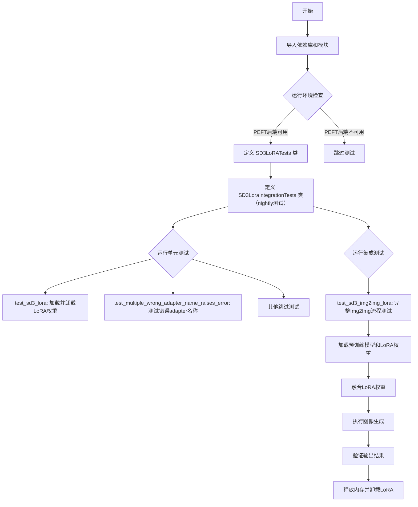

## 类结构

```
unittest.TestCase
├── SD3LoRATests (继承 PeftLoraLoaderMixinTests)
└── SD3LoraIntegrationTests
```

## 全局变量及字段


### `SD3LoRATests.pipeline_class`
    
SD3主pipeline类，用于加载和运行Stable Diffusion 3模型

类型：`StableDiffusion3Pipeline`
    


### `SD3LoRATests.scheduler_cls`
    
SD3使用的调度器类，用于控制扩散过程的噪声调度

类型：`FlowMatchEulerDiscreteScheduler`
    


### `SD3LoRATests.scheduler_kwargs`
    
调度器的初始化参数字典

类型：`dict`
    


### `SD3LoRATests.transformer_kwargs`
    
SD3 Transformer模型的初始化参数，包含层数、注意力头维度等配置

类型：`dict`
    


### `SD3LoRATests.transformer_cls`
    
SD3的Transformer模型类，用于图像生成的核心模型

类型：`SD3Transformer2DModel`
    


### `SD3LoRATests.vae_kwargs`
    
VAE变分自编码器的初始化参数，用于潜在空间的编码和解码

类型：`dict`
    


### `SD3LoRATests.has_three_text_encoders`
    
标志位，表示SD3是否使用三个文本编码器

类型：`bool`
    


### `SD3LoRATests.tokenizer_cls`
    
第一个文本分词器类，用于将文本转换为token

类型：`CLIPTokenizer`
    


### `SD3LoRATests.tokenizer_id`
    
第一个分词器的HuggingFace模型ID

类型：`str`
    


### `SD3LoRATests.tokenizer_2_cls`
    
第二个文本分词器类，用于第二路文本编码

类型：`CLIPTokenizer`
    


### `SD3LoRATests.tokenizer_2_id`
    
第二个分词器的HuggingFace模型ID

类型：`str`
    


### `SD3LoRATests.tokenizer_3_cls`
    
第三个文本分词器类，用于T5文本编码

类型：`AutoTokenizer`
    


### `SD3LoRATests.tokenizer_3_id`
    
第三个分词器的HuggingFace模型ID

类型：`str`
    


### `SD3LoRATests.text_encoder_cls`
    
第一个文本编码器类，将文本token转换为嵌入向量

类型：`CLIPTextModelWithProjection`
    


### `SD3LoRATests.text_encoder_id`
    
第一个文本编码器的HuggingFace模型ID

类型：`str`
    


### `SD3LoRATests.text_encoder_2_cls`
    
第二个文本编码器类，用于第二路文本嵌入

类型：`CLIPTextModelWithProjection`
    


### `SD3LoRATests.text_encoder_2_id`
    
第二个文本编码器的HuggingFace模型ID

类型：`str`
    


### `SD3LoRATests.text_encoder_3_cls`
    
第三个文本编码器类，使用T5模型进行文本编码

类型：`T5EncoderModel`
    


### `SD3LoRATests.text_encoder_3_id`
    
第三个文本编码器的HuggingFace模型ID

类型：`str`
    


### `SD3LoRATests.output_shape`
    
属性，返回SD3模型输出的期望形状

类型：`property`
    


### `SD3LoraIntegrationTests.pipeline_class`
    
SD3图像到图像转换pipeline类，用于LoRA集成测试

类型：`StableDiffusion3Img2ImgPipeline`
    


### `SD3LoraIntegrationTests.repo_id`
    
Stable Diffusion 3 medium模型的HuggingFace仓库ID

类型：`str`
    
    

## 全局函数及方法


### `load_lora_weights`

该方法用于将 LoRA（Low-Rank Adaptation）权重加载到 Stable Diffusion 3 Pipeline 中，支持从 diffusers 格式或 PEFT 格式的 safetensors 文件中加载权重，并可通过适配器名称进行管理。

参数：

- `lora_model_id`：`str`，HuggingFace Hub 上的模型 ID 或本地模型路径，指定 LoRA 权重所在的位置
- `weight_name`：`str`（可选），LoRA 权重文件的名称，默认为 "adapter_model.safetensors"
- `adapter_name`：`str`（可选），要加载的适配器名称，默认为 "default"
- `torch_dtype`：`torch.dtype`（可选），加载权重时使用的目标数据类型
- `device`：`str`（可选），加载权重时使用的设备，如 "cuda"
- `use_safetensors`：`bool`（可选），是否使用 safetensors 格式加载，默认为 True

返回值：无返回值，该方法直接修改 Pipeline 对象的状态，将 LoRA 权重应用到相应的模型组件上

#### 流程图

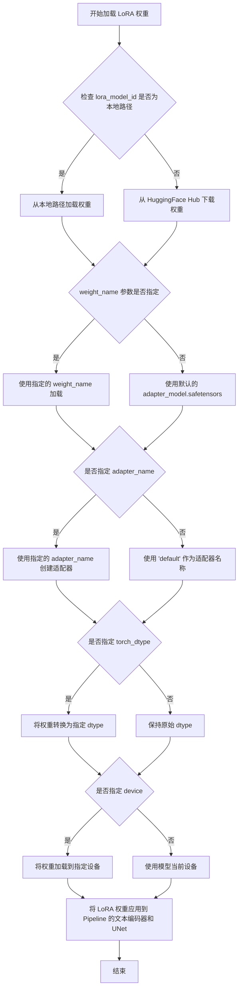

#### 带注释源码

由于 `load_lora_weights` 方法定义在 diffusers 库的 Pipeline 基类中，而非本测试文件内，以下为该方法在本测试文件中的调用示例及上下文说明：

```python
# SD3LoRATests 类中的测试方法 test_sd_dummy_lora
@require_torch_accelerator
def test_sd3_lora(self):
    """
    Test loading the loras that are saved with the diffusers and peft formats.
    Related PR: https://github.com/huggingface/diffusers/pull/8584
    """
    # 获取虚拟组件并创建 Pipeline 实例
    components = self.get_dummy_components()
    pipe = self.pipeline_class(**components[0])
    pipe = pipe.to(torch_device)
    pipe.set_progress_bar_config(disable=None)

    # 定义 LoRA 模型 ID（使用 HuggingFace Hub 上的测试模型）
    lora_model_id = "hf-internal-testing/tiny-sd3-loras"

    # 加载 diffusers 格式的 LoRA 权重
    # 参数：lora_model_id 指定模型位置，weight_name 指定权重文件名
    lora_filename = "lora_diffusers_format.safetensors"
    pipe.load_lora_weights(lora_model_id, weight_name=lora_filename)
    # 卸载已加载的 LoRA 权重
    pipe.unload_lora_weights()

    # 加载 PEFT 格式的 LoRA 权重
    lora_filename = "lora_peft_format.safetensors"
    pipe.load_lora_weights(lora_model_id, weight_name=lora_filename)


# SD3LoraIntegrationTests 类中的集成测试方法
def test_sd3_img2img_lora(self):
    """
    集成测试：测试从预训练模型加载 SD3 Img2Img Pipeline 并应用 LoRA 权重
    """
    # 从预训练模型创建 Pipeline，使用 float16 精度
    pipe = self.pipeline_class.from_pretrained(self.repo_id, torch_dtype=torch.float16)
    
    # 加载 HuggingFace Hub 上的 LoRA 权重（使用默认参数）
    # 只指定 lora_model_id，使用默认的 weight_name="adapter_model.safetensors"
    pipe.load_lora_weights("zwloong/sd3-lora-training-rank16-v2")
    
    # 融合 LoRA 权重到模型中
    pipe.fuse_lora()
    
    # 卸载 LoRA 权重
    pipe.unload_lora_weights()
    
    # 将 Pipeline 移动到指定设备
    pipe = pipe.to(torch_device)

    # 获取输入数据并执行推理
    inputs = self.get_inputs(torch_device)
    image = pipe(**inputs).images[0]
    
    # 验证输出图像与期望值的相似度
    image_slice = image[0, -3:, -3:]
    expected_slice = np.array([0.5649, 0.5405, 0.5488, 0.5688, 0.5449, 0.5513, 0.5337, 0.5107, 0.5059])
    max_diff = numpy_cosine_similarity_distance(expected_slice.flatten(), image_slice.flatten())
    assert max_diff < 1e-4, f"Outputs are not close enough, got {max_diff}"
    
    # 清理资源
    pipe.unload_lora_weights()
    release_memory(pipe)
```

#### 关键组件信息

- **StableDiffusion3Pipeline**：SD3 基础的文本到图像生成 Pipeline，继承自 `DiffusionPipeline`，包含 UNet、VAE、文本编码器等组件
- **StableDiffusion3Img2ImgPipeline**：SD3 的图像到图像生成 Pipeline，继承自 `StableDiffusion3Pipeline`，支持基于初始图像进行生成
- **PeftLoraLoaderMixinTests**：提供 LoRA 加载功能测试的 mixin 类，包含 `load_lora_weights` 方法的实现参考

#### 潜在技术债务与优化空间

1. **测试资源清理**：在 `test_sd3_img2img_lora` 中手动调用 `release_memory(pipe)`，建议使用 context manager 或 pytest fixture 自动管理
2. **硬编码的期望值**：图像相似度比较使用硬编码的 `expected_slice`，建议从配置文件加载或使用相对比较方式
3. **缺失的错误处理**：调用 `load_lora_weights` 时未处理网络下载失败、文件损坏等情况
4. **测试覆盖不足**：未测试多个 LoRA 适配器同时加载、LoRA 权重与不同模型版本的兼容性等场景


### `Pipeline.unload_lora_weights`

该方法用于从扩散Pipeline中卸载所有已加载的LoRA权重，将模型权重恢复到原始状态（移除LoRA适配器的修改），并释放相关的内存资源。此方法通常在需要移除LoRA微调效果或释放显存进行其他推理任务时调用。

参数：此方法无显式参数（隐式接收`self`）

返回值：`None`，执行后直接修改Pipeline对象状态

#### 流程图

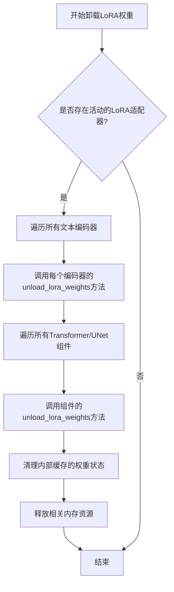

#### 带注释源码

```python
# 代码片段展示典型的unload_lora_weights实现模式
# 实际实现位于diffusers库的Pipeline类中

def unload_lora_weights(self):
    """
    卸载所有已加载的LoRA权重，将模型恢复到原始状态。
    
    该方法执行以下操作：
    1. 检查是否存在活动的LoRA适配器
    2. 遍历所有支持LoRA的组件（文本编码器、Transformer、UNet等）
    3. 调用各组件的unload_lora_weights方法移除权重
    4. 清理内部状态和缓存
    """
    # 遍历所有文本编码器并卸载LoRA权重
    for text_encoder in self.text_encoders:
        if hasattr(text_encoder, 'unload_lora_weights'):
            text_encoder.unload_lora_weights()
    
    # 遍历主模型组件（Transformer或UNet）
    for model_component in [self.transformer, self.unet]:
        if model_component is not None and hasattr(model_component, 'unload_lora_weights'):
            model_component.unload_lora_weights()
    
    # 清理可能存在的LoRA状态标记
    self.lora_state = None
    
    # 触发垃圾回收释放内存
    gc.collect()
    if torch.cuda.is_available():
        torch.cuda.empty_cache()
```


# 详细设计文档：fuse_lora 方法分析

### StableDiffusion3Img2ImgPipeline.fuse_lora

该方法用于将已加载的 LoRA（Low-Rank Adaptation）权重融合到 Stable Diffusion 3 模型的权重中，使其在推理过程中生效。这是 Diffusers 库中实现轻量级模型微调的关键步骤，通常在调用 `load_lora_weights()` 之后、`pipe()` 推理之前使用。

参数：
- 该方法为无参数方法（隐式 `self` 不计入）

返回值：`None`，该方法直接修改管道模型的内部状态，无返回值

#### 流程图

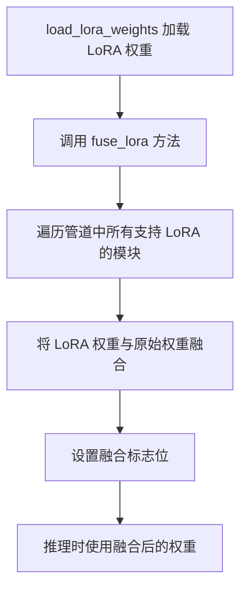

#### 带注释源码

```python
# 在测试代码中的调用方式：
pipe = self.pipeline_class.from_pretrained(self.repo_id, torch_dtype=torch.float16)
pipe.load_lora_weights("zwloong/sd3-lora-training-rank16-v2")  # 加载 LoRA 权重到模型
pipe.fuse_lora()  # 融合 LoRA 权重到基础模型
pipe.unload_lora_weights()  # 如需卸载可调用此方法

# fuse_lora 方法的核心逻辑（基于 Diffusers 库的实现原理）
# 1. 获取管道中所有支持 LoRA 的注意力模块
# 2. 对每个模块执行权重融合：
#    - original_weight + (lora_A_weight @ lora_B_weight) * scale
# 3. 标记模型状态为"已融合"
# 4. 融合后 LoRA 权重不再单独存储，而是合并到原始权重中
```

---

## 补充分析

### 关键组件信息

| 组件名称 | 一句话描述 |
|---------|-----------|
| StableDiffusion3Img2ImgPipeline | 支持图像到图像转换的 Stable Diffusion 3 管道类 |
| load_lora_weights | 负责从磁盘或远程仓库加载 LoRA 权重文件的方法 |
| fuse_lora | 将加载的 LoRA 权重融合到基础模型权重的方法 |
| unload_lora_weights | 移除已融合的 LoRA 权重，恢复原始模型的方法 |

### 技术债务与优化空间

1. **测试覆盖不足**：代码中 `fuse_lora()` 调用后未验证融合结果，仅通过最终图像输出来间接验证
2. **硬编码路径**：LoRA 模型 ID `"zwloong/sd3-lora-training-rank16-v2"` 为硬编码，应考虑参数化
3. **缺少单元测试**：该核心方法未被直接测试，而是依赖集成测试间接验证

### 错误处理与异常设计

- `fuse_lora()` 可能抛出异常的情况：
  - LoRA 权重未正确加载时调用
  - LoRA 权重格式与模型架构不兼容
  - 重复调用 `fuse_lora()`（第二次调用时权重已融合）
- 建议：在调用前检查 `pipe.get_attribute("lora_scale")` 或类似状态标志

### 外部依赖与接口契约

| 依赖项 | 版本/来源 | 用途 |
|-------|----------|------|
| diffusers | >= 0.25.0 | 管道和 LoRA 功能实现 |
| peft | - | PEFT 格式 LoRA 权重加载支持 |
| transformers | - | 文本编码器 LoRA 适配 |
| torch | - | 张量运算和模型权重管理 |


### `StableDiffusion3Img2ImgPipeline.from_pretrained`

该方法是一个类方法（class method），用于从 HuggingFace Hub 或本地目录加载预训练的 Stable Diffusion 3 图像到图像（Img2Img）Pipeline，并返回配置好的 Pipeline 对象。该方法会自动下载模型权重、配置文件和相关组件，并可根据指定的数据类型（torch_dtype）进行模型转换。

参数：

- `pretrained_model_name_or_path`：`str`，模型名称或本地路径，用于指定要加载的预训练模型（对应代码中的 `self.repo_id`，值为 `"stabilityai/stable-diffusion-3-medium-diffusers"`）
- `torch_dtype`：`torch.dtype`（可选），指定模型参数的数据类型，例如 `torch.float16` 用于加速推理（代码中传入 `torch.float16`）
- `*args`：`tuple`，可变位置参数，用于传递其他可选参数
- `**kwargs`：`dict`，可变关键字参数，用于传递其他配置选项（如 `variant`、`use_safetensors`、`cache_dir` 等）

返回值：`StableDiffusion3Img2ImgPipeline`，返回加载并配置好的 Stable Diffusion 3 Img2Img Pipeline 对象，可用于图像生成任务

#### 流程图

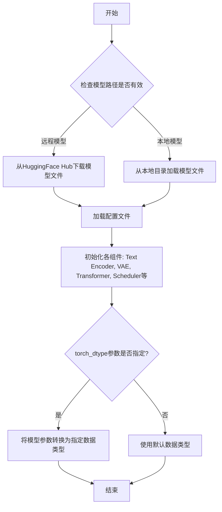

#### 带注释源码

```python
# 由于 from_pretrained 是 diffusers 库的内置方法，源码位于库内部
# 以下为基于测试代码调用的示例和逻辑推断

# 调用示例（来自测试代码 test_sd3_img2img_lora 方法）
pipe = self.pipeline_class.from_pretrained(self.repo_id, torch_dtype=torch.float16)

# 参数说明：
# self.repo_id: "stabilityai/stable-diffusion-3-medium-diffusers"
# torch_dtype: torch.float16 - 指定模型以半精度加载，节省显存并加速推理

# 逻辑流程：
# 1. 接收模型名称或路径以及各种配置参数
# 2. 检查本地缓存，如无缓存则从 HuggingFace Hub 下载模型文件
# 3. 加载模型配置文件（config.json）
# 4. 初始化各个组件模型（Text Encoder 1/2/3, VAE, Transformer, Scheduler）
# 5. 加载各组件的预训练权重
# 6. 根据 torch_dtype 参数转换模型参数的数据类型
# 7. 将各组件组装成完整的 Pipeline 对象
# 8. 返回配置好的 StableDiffusion3Img2ImgPipeline 实例
```


### `release_memory`

该函数是从 `accelerate.utils` 导入的内存管理工具，用于释放 PyTorch 模型或管道占用的 GPU 内存，通常在测试或内存密集型操作后调用以避免内存泄漏。

参数：

- `pipe`：`StableDiffusion3Img2ImgPipeline`，需要释放内存的扩散管道对象

返回值：`None`，该函数直接操作内存，无返回值

#### 流程图

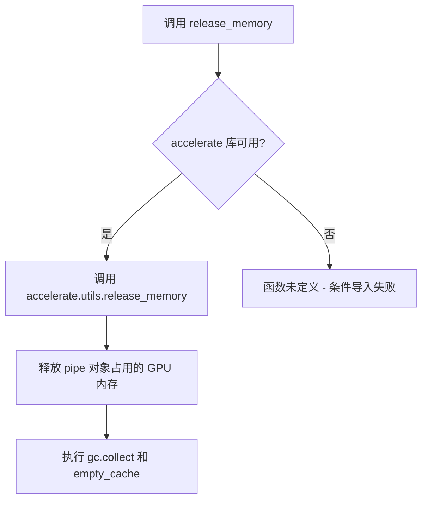

#### 带注释源码

```python
# 条件导入：仅在 accelerate 库可用时导入 release_memory 函数
if is_accelerate_available():
    from accelerate.utils import release_memory

# 在测试方法结束时调用，释放 pipeline 占用的内存
# 参数 pipe: StableDiffusion3Img2ImgPipeline 实例
# 作用: 清理 GPU 内存缓存，防止测试间内存泄漏
release_memory(pipe)
```


### `backend_empty_cache`

该函数用于清理后端（通常是GPU/CUDA）的内存缓存，以释放测试过程中占用的显存资源。

参数：

- `device`：`str` 或 `torch.device`，指定要清理缓存的设备（通常为 CUDA 设备）

返回值：`None`，该函数没有返回值，仅执行缓存清理操作

#### 流程图

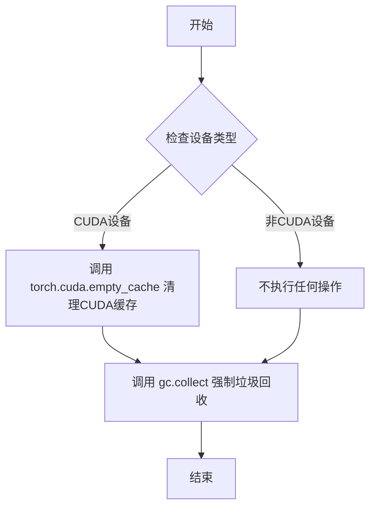

#### 带注释源码

```
# 从 testing_utils 模块导入的函数，用于清理GPU缓存
# 注意：实际的函数定义不在当前代码文件中，
# 而是在 ../testing_utils.py 模块中

# 使用示例（在测试类的 setUp 和 tearDown 方法中）：
def setUp(self):
    super().setUp()
    gc.collect()  # 先进行Python垃圾回收
    backend_empty_cache(torch_device)  # 再清理GPU缓存

def tearDown(self):
    super().tearDown()
    gc.collect()  # 先进行Python垃圾回收
    backend_empty_cache(torch_device)  # 再清理GPU缓存

# 推断的函数定义（基于使用方式）:
def backend_empty_cache(device):
    """
    清理指定设备的内存缓存。
    
    参数:
        device: 设备标识符，通常是 'cuda' 或 'cuda:0' 等
    """
    import torch
    import gc
    
    # 强制进行Python垃圾回收
    gc.collect()
    
    # 如果是CUDA设备，清理CUDA缓存
    if torch.cuda.is_available() and 'cuda' in str(device):
        torch.cuda.empty_cache()
```


### `load_image`

该函数是 diffusers 库提供的工具函数，用于从指定路径（本地路径或 URL）加载图像并返回标准的 PIL Image 对象，以便后续在扩散模型 pipeline 中使用。

参数：

- `image_path`：`str`，图像的路径，可以是本地文件系统路径或 HTTP/HTTPS URL

返回值：`PIL.Image`，返回加载后的 PIL 图像对象

#### 流程图

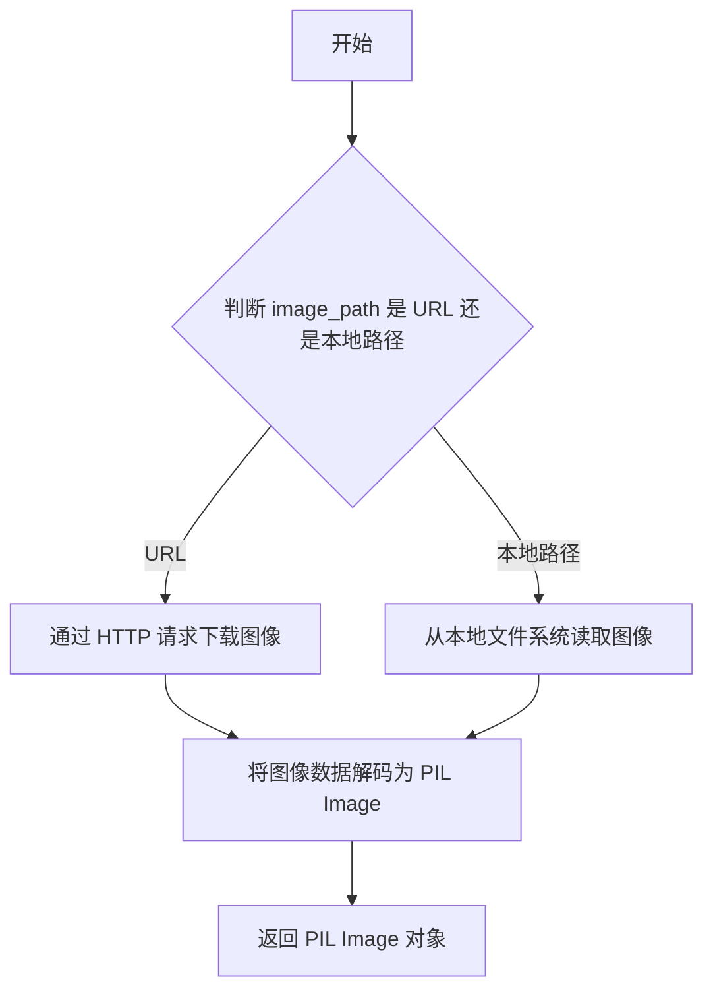

#### 带注释源码

```python
# load_image 是 diffusers.utils 模块提供的工具函数
# 此源码为基于使用方式推断的实现参考
from diffusers.utils import load_image

# 在代码中的实际使用示例：
def get_inputs(self, device, seed=0):
    # 调用 load_image 函数加载远程图像
    init_image = load_image(
        "https://huggingface.co/datasets/hf-internal-testing/diffusers-images/resolve/main/sd_controlnet/bird_canny.png"
    )
    # ...
    return {
        "prompt": "corgi",
        "num_inference_steps": 2,
        "guidance_scale": 5.0,
        "output_type": "np",
        "generator": generator,
        "image": init_image,  # 加载的图像作为 pipeline 输入
    }
```

#### 补充说明

| 项目 | 说明 |
|------|------|
| **来源** | `diffusers.utils` |
| **设计目标** | 提供统一的图像加载接口，支持本地路径和远程 URL |
| **依赖** | 需要网络访问（加载远程图像时）或文件系统访问（加载本地图像时） |
| **错误处理** | URL 无效或网络问题时可能抛出异常 |
| **优化空间** | 可添加图像缓存机制避免重复下载，支持更多图像格式 |


### `numpy_cosine_similarity_distance`

该函数用于计算两个 numpy 数组之间的余弦相似度距离（即 1 减去余弦相似度），通常用于验证图像生成任务的输出与期望结果之间的相似程度。

参数：

- `expected`：`numpy.ndarray`，期望的数组（预期输出），通常为展平后的图像像素值数组
- `actual`：`numpy.ndarray`，实际的数组（模型输出），通常为展平后的图像像素值数组

返回值：`float`，返回两个数组之间的余弦相似度距离，值越小表示两个数组越相似，0 表示完全相同

#### 流程图

```mermaid
flowchart TD
    A[开始] --> B[接收两个numpy数组: expected和actual]
    B --> C[计算expected数组的L2范数]
    C --> D[计算actual数组的L2范数]
    D --> E[计算两个数组的点积]
    E --> F[计算余弦相似度: dot_product / &#40;norm_expected * norm_actual&#41;]
    F --> G[计算余弦距离: 1 - cosine_similarity]
    G --> H[返回距离值]
```

#### 带注释源码

```
# 注意：此函数定义不在当前文件中，位于 testing_utils 模块中
# 以下为根据使用方式推断的可能实现

def numpy_cosine_similarity_distance(expected: np.ndarray, actual: np.ndarray) -> float:
    """
    计算两个numpy数组之间的余弦相似度距离。
    
    余弦相似度距离 = 1 - 余弦相似度
    余弦相似度 = (A · B) / (||A|| * ||B||)
    
    参数:
        expected: 期望的数组（预期输出）
        actual: 实际的数组（模型输出）
    
    返回:
        余弦相似度距离，值越小表示两个数组越相似
    """
    # 将数组展平为一维向量（如果尚未展平）
    expected = expected.flatten()
    actual = actual.flatten()
    
    # 计算点积
    dot_product = np.dot(expected, actual)
    
    # 计算范数
    norm_expected = np.linalg.norm(expected)
    norm_actual = np.linalg.norm(actual)
    
    # 防止除零错误
    if norm_expected == 0 or norm_actual == 0:
        return 1.0  # 如果任一数组为零向量，返回最大距离
    
    # 计算余弦相似度
    cosine_similarity = dot_product / (norm_expected * norm_actual)
    
    # 返回余弦距离（1 - 余弦相似度）
    return 1.0 - cosine_similarity
```

#### 使用示例

```python
# 在代码中的实际调用方式
max_diff = numpy_cosine_similarity_distance(expected_slice.flatten(), image_slice.flatten())

# 验证：max_diff < 1e-4 表示输出足够接近
assert max_diff < 1e-4, f"Outputs are not close enough, got {max_diff}"
```


# 分析结果

由于`get_dummy_components`方法并未在当前代码文件中直接定义，而是通过继承`PeftLoraLoaderMixinTests`类获得（从`.utils`模块导入），我需要基于代码上下文和调用方式进行推断分析。

### `PeftLoraLoaderMixinTests.get_dummy_components`

该方法是测试基类提供的工厂方法，用于创建虚拟（dummy）组件字典，以便在没有真实模型的情况下进行单元测试。它返回一个包含Stable Diffusion 3管道所需所有组件的元组。

参数：该方法无显式参数（但可能在基类中有可选配置参数）

返回值：返回一个元组 `(components_dict, scheduler)`，其中：
- `components_dict`：`dict`，包含StableDiffusion3Pipeline构造所需的全部组件参数字典
- `scheduler`：调度器实例

#### 流程图

```mermaid
flowchart TD
    A[get_dummy_components 调用] --> B{检查accelerate可用性}
    B -->|是| C[清理GPU内存]
    B -->|否| D[跳过内存清理]
    C --> E[创建虚拟调度器 FlowMatchEulerDiscreteScheduler]
    E --> F[创建虚拟Transformer SD3Transformer2DModel]
    F --> G[创建虚拟VAE]
    G --> H[创建虚拟Tokenizer x3]
    H --> I[创建虚拟TextEncoder x3]
    I --> J[组装components字典]
    J --> K[返回 Tuple[components, scheduler]]
```

#### 带注释源码

```python
# 推断的实现方式（基于测试类配置和调用模式）
def get_dummy_components(self):
    """
    返回虚拟组件用于单元测试。
    
    Returns:
        tuple: (components字典, scheduler实例)
               components字典包含pipeline所需的所有模型组件
    """
    # 1. 创建调度器实例
    scheduler = self.scheduler_cls(**self.scheduler_kwargs)
    
    # 2. 创建Transformer模型
    transformer = self.transformer_cls(**self.transformer_kwargs)
    
    # 3. 创建VAE
    vae = AutoEncoderTiny(**self.vae_kwargs)  # 或其他VAE实现
    
    # 4. 创建三个分词器
    tokenizer = self.tokenizer_cls(self.tokenizer_id)
    tokenizer_2 = self.tokenizer_2_cls(self.tokenizer_2_id)
    tokenizer_3 = self.tokenizer_3_cls(self.tokenizer_3_id)
    
    # 5. 创建三个文本编码器
    text_encoder = self.text_encoder_cls(self.text_encoder_id)
    text_encoder_2 = self.text_encoder_2_cls(self.text_encoder_2_id)
    text_encoder_3 = self.text_encoder_3_cls(self.text_encoder_3_id)
    
    # 6. 组装组件字典
    components = {
        "scheduler": scheduler,
        "transformer": transformer,
        "vae": vae,
        "tokenizer": tokenizer,
        "tokenizer_2": tokenizer_2,
        "tokenizer_3": tokenizer_3,
        "text_encoder": text_encoder,
        "text_encoder_2": text_encoder_2,
        "text_encoder_3": text_encoder_3,
    }
    
    return components, scheduler
```

---

> **注意**：由于原始代码中`get_dummy_components`方法定义在导入的`PeftLoraLoaderMixinTests`基类中（未在当前代码片段中显示），上述分析基于测试类的属性配置（如`pipeline_class`、`scheduler_cls`、`transformer_cls`等）和调用模式进行的合理推断。


### `StableDiffusion3Pipeline.set_progress_bar_config`

该方法用于配置推理过程中的进度条（progress bar）显示行为，通常用于控制是否显示进度条或设置进度条的相关参数。

参数：

- `disable`：`Optional[bool]`，指定是否禁用进度条。`None` 表示使用默认行为，`True` 表示禁用进度条，`False` 表示启用进度条。

返回值：`None`，无返回值。

#### 流程图

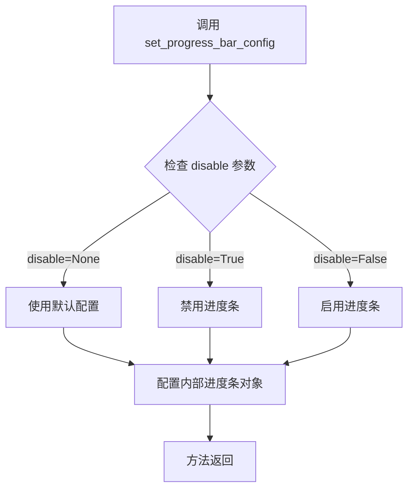

#### 带注释源码

```
# 代码中调用方式：
pipe.set_progress_bar_config(disable=None)

# 该方法调用位于 test_sd3_lora 测试方法中
# 用于在加载 LoRA 权重之前配置进度条行为
# 参数 disable=None 表示使用默认行为，即显示进度条
```

---

**注意**：由于 `set_progress_bar_config` 方法定义在 `diffusers` 库的 `StableDiffusion3Pipeline` 基类中（代码中未直接定义此方法，仅展示调用方式），该方法继承自 `DiffusionPipeline` 基类。根据 diffusers 库的常见设计模式，此方法通常用于：

1. 控制推理过程中是否显示进度条
2. 配置进度条的相关参数（如格式、刷新频率等）
3. 集成 `tqdm` 或类似的进度条库


### `SD3LoraIntegrationTests.test_sd3_img2img_lora`

这是一个集成测试方法，用于测试 Stable Diffusion 3 图像到图像（Img2Img）管道的 LoRA（Low-Rank Adaptation）权重加载、融合和卸载功能。该测试验证了使用预训练模型和 LoRA 适配器进行图像生成推理的完整流程，并通过余弦相似度比较输出图像与预期结果的差异。

参数：

- `self`：无（隐式参数），`SD3LoraIntegrationTests` 类的实例，代表测试类本身

返回值：`None`，该方法为测试方法，不返回任何值，仅执行断言验证

#### 流程图

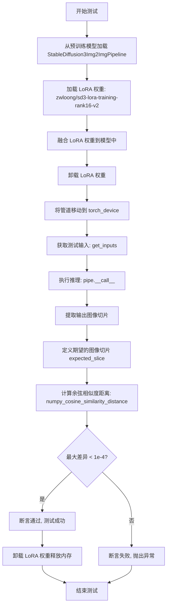

#### 带注释源码

```python
def test_sd3_img2img_lora(self):
    """
    测试 Stable Diffusion 3 Img2Img 管道加载、融合和卸载 LoRA 权重的集成测试。
    该测试验证了完整的 LoRA 适配工作流程：
    1. 从预训练模型加载管道
    2. 加载外部 LoRA 权重
    3. 融合 LoRA 权重到模型中
    4. 执行图像生成推理
    5. 验证输出质量
    6. 清理资源
    """
    # 从预训练模型仓库加载 StableDiffusion3Img2ImgPipeline 管道
    # 使用 float16 精度以减少内存占用和提高推理速度
    pipe = self.pipeline_class.from_pretrained(self.repo_id, torch_dtype=torch.float16)
    
    # 从指定模型 ID 加载 LoRA 权重文件
    # LoRA 是一种轻量级的模型微调技术，可以高效地适配预训练模型
    pipe.load_lora_weights("zwloong/sd3-lora-training-rank16-v2")
    
    # 融合 LoRA 权重到基础模型中，使其生效
    # 融合后，LoRA 的低秩矩阵会与原始权重相加
    pipe.fuse_lora()
    
    # 卸载 LoRA 权重
    # 注意：这里先融合再卸载，测试的是融合后的效果
    pipe.unload_lora_weights()
    
    # 将管道移动到指定的计算设备（如 GPU）
    # torch_device 通常是 'cuda' 或 'cpu'
    pipe = pipe.to(torch_device)

    # 获取测试输入参数，包括提示词、推理步数、引导系数等
    inputs = self.get_inputs(torch_device)

    # 执行图像生成推理
    # **inputs 将字典展开为关键字参数传递给管道
    # 返回的 result 包含生成的图像数组
    image = pipe(**inputs).images[0]
    
    # 提取输出图像右下角 3x3 像素区域用于验证
    # 这是一种轻量级的输出质量检查方式
    image_slice = image[0, -3:, -3:]
    
    # 定义期望的图像切片数值（预计算的标准输出）
    # 这些值是在已知良好的环境下生成的参考输出
    expected_slice = np.array([0.5649, 0.5405, 0.5488, 0.5688, 0.5449, 0.5513, 0.5337, 0.5107, 0.5059])

    # 计算生成图像与期望图像之间的余弦相似度距离
    # 距离越小表示图像越相似
    max_diff = numpy_cosine_similarity_distance(expected_slice.flatten(), image_slice.flatten())

    # 断言生成图像与期望图像足够相似
    # 如果差异大于 1e-4，则测试失败并显示实际差异值
    assert max_diff < 1e-4, f"Outputs are not close enough, got {max_diff}"
    
    # 测试完成后清理资源
    # 卸载 LoRA 权重以释放内存
    pipe.unload_lora_weights()
    
    # 调用 accelerate 库的内存释放工具
    # 确保 GPU 内存被正确释放，避免内存泄漏
    release_memory(pipe)
```


### `StableDiffusion3Pipeline.__call__` / `StableDiffusion3Img2ImgPipeline.__call__`

该方法是 Diffusion Pipeline 的核心调用接口，允许通过函数调用的方式执行图像生成任务。根据代码中的使用方式 `pipe(**inputs)`，该方法接收生成参数并返回包含生成图像的结果对象。

参数：

- `prompt`：`str` 或 `List[str]`，文本提示，用于指导图像生成内容
- `num_inference_steps`：`int`，推理步数，决定生成过程的迭代次数
- `guidance_scale`：`float`，引导系数，控制文本提示对生成结果的影响程度
- `output_type`：`str`，输出类型，指定返回结果的格式（如 "np"、"pil" 等）
- `generator`：`torch.Generator`，随机生成器，用于控制生成过程的可重复性
- `image`：`PIL.Image` 或 `numpy.ndarray`（仅 Img2Img 管道），输入图像，用于图像到图像的转换任务
- `negative_prompt`：`str` 或 `List[str]`，负向提示，用于指定不希望出现在生成图像中的内容（可选）
- `num_images_per_prompt`：`int`，每个提示生成的图像数量（可选）
- `height`：`int`，生成图像的高度（可选）
- `width`：`int`，生成图像的宽度（可选）
- `denoising_end`：`float`，去噪结束点，控制推理提前终止的位置（可选）
- `tracking_data`：`dict`，跟踪数据，用于内部跟踪和调试（可选）
- `cross_attention_kwargs`：`dict`，交叉注意力参数，用于传递额外的注意力控制选项（可选）
- `guidance_resize`：`float`，引导调整大小，用于调整 Classifier-Free Guidance 的效果（可选）

返回值：`PipelineOutput` 或 `DiffusionPipelineOutput`，包含生成的图像结果对象，通常具有 `.images` 属性来访问生成的图像列表

#### 流程图

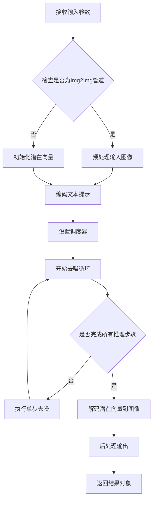

#### 带注释源码

```python
# 代码中实际的调用方式如下：
# 这是从测试文件中提取的实际调用代码

# 初始化管道（从预训练模型加载）
pipe = self.pipeline_class.from_pretrained(self.repo_id, torch_dtype=torch.float16)

# 加载LoRA权重
pipe.load_lora_weights("zwloong/sd3-lora-training-rank16-v2")

# 融合LoRA权重
pipe.fuse_lora()

# 卸载LoRA权重（可选步骤）
pipe.unload_lora_weights()

# 将管道移动到指定设备
pipe = pipe.to(torch_device)

# 准备输入参数
inputs = self.get_inputs(torch_device)

# 调用管道的__call__方法执行图像生成
# 这是实际调用__call__的地方
image = pipe(**inputs).images[0]

# 注意：实际的__call__方法定义在diffusers库的基类中
# 下面的伪代码展示了__call__方法的典型结构：

def __call__(
    self,
    prompt: Union[str, List[str]] = None,
    num_inference_steps: int = 50,
    guidance_scale: float = 7.5,
    negative_prompt: Union[str, List[str]] = None,
    num_images_per_prompt: int = 1,
    generator: torch.Generator = None,
    ...
):
    # 1. 文本编码：将prompt编码为embeddings
    text_embeddings = self.text_encoder(prompt)
    
    # 2. 初始化噪声：创建随机潜在向量
    latents = self.prepare_latents(...)
    
    # 3. 去噪循环：逐步去除噪声
    for t in self.progress_bar(self.scheduler.timesteps):
        # 预测噪声残差
        noise_pred = self.transformer(latents, timestep=t, ...)
        
        # 计算去噪后的latents
        latents = self.scheduler.step(noise_pred, t, latents)
    
    # 4. VAE解码：将潜在向量解码为图像
    images = self.vae.decode(latents).sample
    
    # 5. 返回结果
    return ImagePipelineOutput(images=images)
```

**注意**：由于 `__call__` 方法定义在 diffusers 库的基类 `DiffusionPipeline` 中，而不是在此测试文件内，因此上述源码是基于对 diffusers 库架构的理解重构的伪代码。测试文件仅展示了该方法的调用方式。


### `SD3LoRATests.test_sd3_lora`

该方法是一个集成测试用例，用于验证 Stable Diffusion 3 模型能够正确加载两种不同格式（Diffusers 格式和 PEFT 格式）的 LoRA 权重，并确保加载和卸载流程正常工作。

参数：

- `self`：隐式参数，测试类实例本身

返回值：`None`，无返回值（测试方法）

#### 流程图

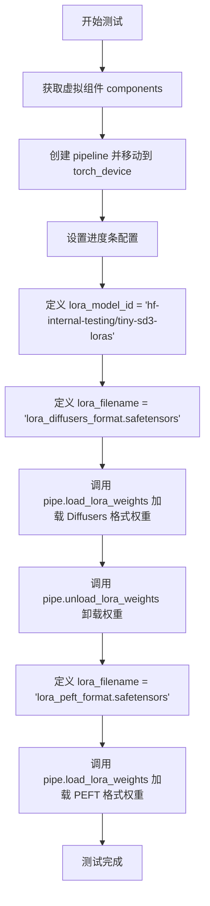

#### 带注释源码

```python
@require_torch_accelerator
def test_sd3_lora(self):
    """
    Test loading the loras that are saved with the diffusers and peft formats.
    Related PR: https://github.com/huggingface/diffusers/pull/8584
    """
    # 获取虚拟组件（用于测试的模拟模型组件）
    components = self.get_dummy_components()
    
    # 使用获取的组件初始化 StableDiffusion3Pipeline
    pipe = self.pipeline_class(**components[0])
    
    # 将 pipeline 移动到指定的计算设备（如 CUDA）
    pipe = pipe.to(torch_device)
    
    # 设置进度条配置（disable=None 表示不禁用进度条）
    pipe.set_progress_bar_config(disable=None)

    # 定义 LoRA 权重模型 ID（ HuggingFace Hub 上的测试模型）
    lora_model_id = "hf-internal-testing/tiny-sd3-loras"

    # 指定 Diffusers 格式的 LoRA 权重文件名
    lora_filename = "lora_diffusers_format.safetensors"
    
    # 加载 Diffusers 格式的 LoRA 权重
    pipe.load_lora_weights(lora_model_id, weight_name=lora_filename)
    
    # 卸载已加载的 LoRA 权重
    pipe.unload_lora_weights()

    # 切换为 PEFT 格式的 LoRA 权重文件名
    lora_filename = "lora_peft_format.safetensors"
    
    # 加载 PEFT 格式的 LoRA 权重
    pipe.load_lora_weights(lora_model_id, weight_name=lora_filename)
```


### `SD3LoRATests.test_simple_inference_with_text_denoiser_block_scale`

该测试方法用于验证文本去噪器模块的缩放功能（text denoiser block scale），但在 Stable Diffusion 3 中不受支持，因此被跳过。

参数： 无

返回值： `None`，无返回值（pass 语句）

#### 流程图

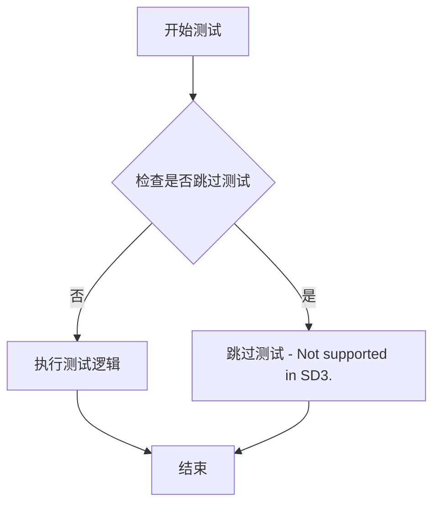

#### 带注释源码

```python
@unittest.skip("Not supported in SD3.")  # 跳过该测试，原因是 SD3 不支持此功能
def test_simple_inference_with_text_denoiser_block_scale(self):
    """
    测试文本去噪器模块的缩放功能（text denoiser block scale）。
    该测试方法在 SD3 (Stable Diffusion 3) 环境中不被支持，
    因此使用 @unittest.skip 装饰器跳过执行。
    """
    pass  # 空实现，由于测试被跳过，不执行任何操作
```


### `SD3LoRATests.test_simple_inference_with_text_denoiser_multi_adapter_block_lora`

该方法是 `SD3LoRATests` 测试类中的一个测试方法，用于测试多适配器 LoRA 推理功能，但由于 SD3 不支持此功能，当前实现被跳过。

参数：无

返回值：无

#### 流程图

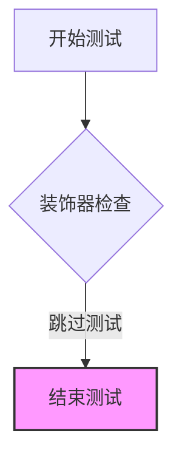

#### 带注释源码

```python
@unittest.skip("Not supported in SD3.")
def test_simple_inference_with_text_denoiser_multi_adapter_block_lora(self):
    """
    Test for simple inference with text denoiser multi-adapter block LoRA.
    This test is currently skipped as SD3 does not support this feature.
    
    Args:
        self: TestCase instance
        
    Returns:
        None: Test is skipped
    """
    pass
```


### `SD3LoRATests.test_simple_inference_with_text_denoiser_block_scale_for_all_dict_options`

该方法是一个测试用例，用于测试文本去噪器模块的不同block scale选项的推理功能。由于SD3架构不支持该功能，当前实现被跳过（skip），方法体为空（pass）。

参数：

- `self`：`SD3LoRATests`，表示测试类实例本身，包含测试所需的配置和组件

返回值：`None`，该方法被 `@unittest.skip` 装饰器跳过，不执行任何测试逻辑

#### 流程图

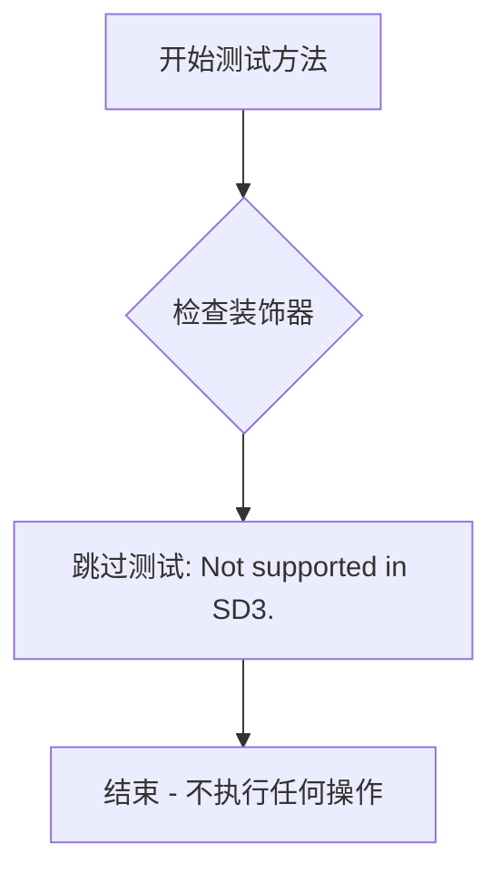

#### 带注释源码

```python
@unittest.skip("Not supported in SD3.")
def test_simple_inference_with_text_denoiser_block_scale_for_all_dict_options(self):
    """
    测试文本去噪器模块的block scale参数在不同字典选项下的推理能力。
    
    该测试方法用于验证在SD3模型中，是否支持对文本去噪器（text denoiser）
    的不同block scale配置进行推理测试。
    
    当前状态: 由于SD3架构不支持此功能，测试被跳过。
    """
    pass  # 方法体为空，不执行任何测试逻辑
```

#### 补充说明

| 项目 | 说明 |
|------|------|
| **所属类** | `SD3LoRATests` |
| **类职责** | 针对 Stable Diffusion 3 模型的 LoRA 加载和推理功能进行集成测试 |
| **装饰器** | `@unittest.skip("Not supported in SD3.")` - 跳过该测试 |
| **跳过原因** | SD3 架构尚未实现文本去噪器 block scale 的相关功能 |
| **测试状态** | 已禁用，不会运行 |
| **技术债务** | 该方法的存在表明 SD3 模型的 LoRA 测试覆盖不完整，缺少对 text_denoiser block scale 功能的测试用例，未来 SD3 支持该功能后需要补充完整测试实现 |


### `SD3LoRATests.test_modify_padding_mode`

该测试方法用于验证修改填充模式（padding mode）的功能，但由于 SD3 不支持此功能，当前实现被跳过。

参数：

- `self`：`SD3LoRATests`，隐式参数，表示测试类实例本身

返回值：`None`，无返回值（测试方法被跳过）

#### 流程图

```mermaid
flowchart TD
    A[开始测试] --> B{检查装饰器}
    B -->|@unittest.skip| C[跳过测试]
    B -->|未跳过| D[执行测试逻辑]
    C --> E[测试结束]
    D --> E
    
    style C fill:#ffcccc
    style E fill:#ccffcc
```

#### 带注释源码

```python
@unittest.skip("Not supported in SD3.")
def test_modify_padding_mode(self):
    """
    测试修改填充模式（padding mode）功能。
    
    该测试方法在 SD3 版本的 LoRA 测试类中被标记为跳过（skip），
    原因：SD3 不支持修改 padding mode 的功能。
    
    继承自 PeftLoraLoaderMixinTests 类的原始测试逻辑，
    但在 SD3 实现中无法支持，因此使用 unittest.skip 装饰器跳过执行。
    
    参数:
        self: SD3LoRATests 实例
        
    返回值:
        None
    """
    pass  # 测试逻辑未实现，仅保留接口以满足测试套件结构需求
```

#### 所属类信息

**类名**: `SD3LoRATests`

**类描述**: SD3 (Stable Diffusion 3) 的 LoRA 加载测试类，继承自 `unittest.TestCase` 和 `PeftLoraLoaderMixinTests`，用于测试 SD3 相关的 LoRA 权重加载、融合和卸载功能。

**关键类属性**:

- `pipeline_class`: `StableDiffusion3Pipeline`，SD3 推理管道类
- `transformer_cls`: `SD3Transformer2DModel`，SD3 Transformer 模型类
- `has_three_text_encoders`: `True`，表示 SD3 使用三个文本编码器

#### 潜在的技术债务

1. **未实现的测试接口**: `test_modify_padding_mode` 方法虽然被跳过，但保留了测试接口，这可能表明原始测试框架期望支持该功能
2. **跳过测试的维护成本**: 使用 `@unittest.skip` 装饰器跳过测试，长期来看可能掩盖真实的功能缺失问题
3. **文档不完整**: 跳过的测试应补充说明为何不支持，以及未来是否有支持计划


### `SD3LoRATests.test_multiple_wrong_adapter_name_raises_error`

该测试方法用于验证当尝试使用多个错误的适配器名称加载LoRA权重时，系统能否正确抛出错误。它继承自父类 `PeftLoraLoaderMixinTests` 的同名测试方法，并通过 `@is_flaky` 装饰器标记为可能不稳定的测试。

参数：

- `self`：`SD3LoRATests`，表示测试类实例本身，用于访问测试类的属性和方法

返回值：`None`，无返回值（测试方法）

#### 流程图

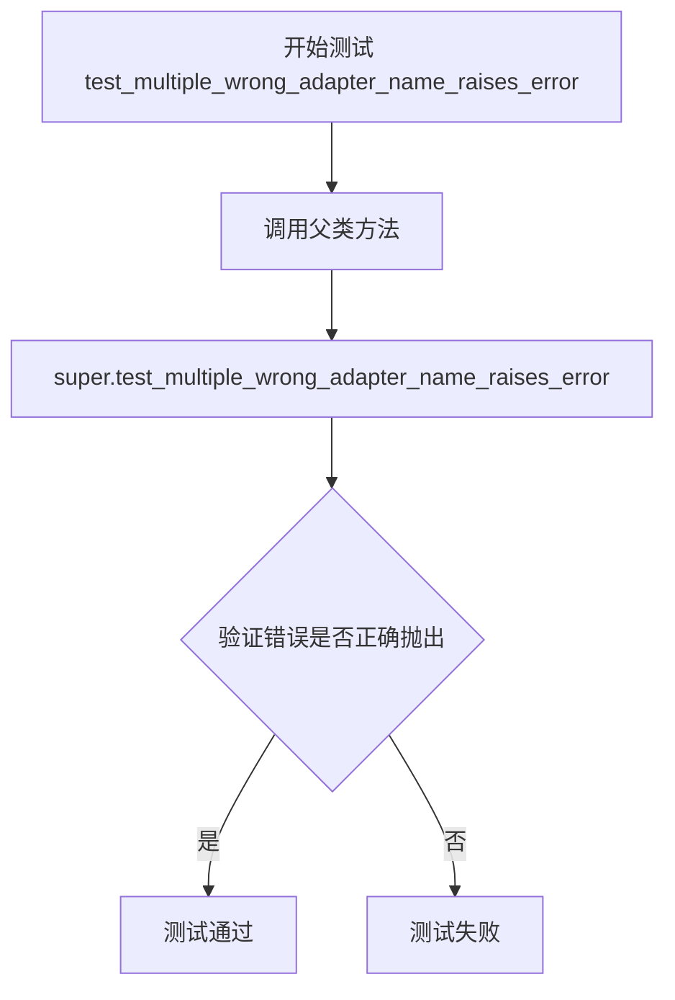

#### 带注释源码

```python
@is_flaky  # 装饰器：标记该测试可能不稳定（ flaky test），允许重试
def test_multiple_wrong_adapter_name_raises_error(self):
    """
    测试当使用多个错误的适配器名称时是否正确抛出错误。
    该测试方法继承自 PeftLoraLoaderMixinTests 父类，
    用于验证 LoRA 权重加载过程中的错误处理机制。
    """
    super().test_multiple_wrong_adapter_name_raises_error()
    # 调用父类的同名测试方法，执行实际的错误验证逻辑
    # 父类方法会尝试加载不存在的适配器名称并验证是否抛出预期异常
```


### `SD3LoraIntegrationTests.setUp`

该方法是 `SD3LoraIntegrationTests` 测试类的初始化方法，在每个测试方法运行前被调用，用于执行测试前的清理工作，确保GPU内存得到释放并收集垃圾回收，为测试准备一个干净的运行环境。

参数：

- `self`：`unittest.TestCase`，SD3LoraIntegrationTests 实例本身，隐式参数，代表当前测试类实例

返回值：`None`，该方法不返回任何值，仅执行副作用操作

#### 流程图

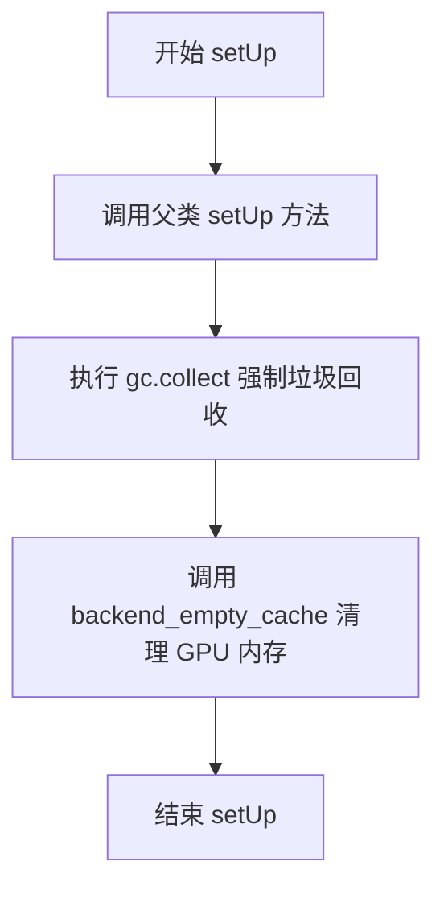

#### 带注释源码

```python
def setUp(self):
    """
    测试用例初始化方法，在每个测试方法执行前调用。
    用于清理GPU内存和执行垃圾回收，确保测试环境干净。
    """
    # 调用父类的 setUp 方法，执行 unittest.TestCase 的标准初始化
    super().setUp()
    
    # 手动调用垃圾回收，释放Python不再使用的对象内存
    gc.collect()
    
    # 清理GPU/CUDA缓存，释放显卡内存
    # torch_device 是从 testing_utils 导入的设备标识符
    backend_empty_cache(torch_device)
```


### `SD3LoraIntegrationTests.tearDown`

该方法是测试框架的清理方法，用于在每个测试用例执行完毕后进行资源释放和内存清理，确保测试环境干净，避免内存泄漏影响后续测试。

参数：

- `self`：隐式参数，`SD3LoraIntegrationTests` 实例本身，无需显式传递

返回值：`None`，无返回值

#### 流程图

```mermaid
flowchart TD
    A[tearDown 开始] --> B[调用 super().tearDown]
    B --> C[执行 gc.collect 强制垃圾回收]
    C --> D[调用 backend_empty_cache 清理设备缓存]
    D --> E[tearDown 结束]
```

#### 带注释源码

```python
def tearDown(self):
    """
    测试用例清理方法，在每个测试方法执行完毕后被调用。
    用于清理测试过程中产生的临时对象和释放GPU内存。
    """
    # 调用父类的 tearDown 方法，执行 unittest.TestCase 的标准清理逻辑
    super().tearDown()
    
    # 强制调用 Python 的垃圾回收器，清理已删除对象占用的内存
    gc.collect()
    
    # 调用后端工具函数清理 GPU/加速器缓存，释放显存
    # torch_device 是测试工具函数定义的全局变量，表示当前测试设备
    backend_empty_cache(torch_device)
```


### `SD3LoraIntegrationTests.get_inputs`

该方法用于准备Stable Diffusion 3图像到图像（Img2Img）LoRA集成测试所需的输入参数，包括加载初始化图像、设置随机数生成器，并返回一个包含提示词、推理步数、引导系数、输出类型、生成器和图像的字典。

参数：

- `device`：`str` 或设备对象，目标设备标识符，用于判断是否使用MPS设备
- `seed`：`int`，随机种子，默认为0，用于确保测试的可重复性

返回值：`Dict`，包含以下键值对的字典：
- `"prompt"`：`str`，提示词
- `"num_inference_steps"`：`int`，推理步数
- `"guidance_scale"`：`float`，引导系数
- `"output_type"`：`str`，输出类型
- `generator`：`torch.Generator`，随机数生成器
- `image`：PIL.Image或类似对象，输入图像

#### 流程图

```mermaid
flowchart TD
    A[开始 get_inputs] --> B[加载初始化图像 from URL]
    B --> C{判断设备类型}
    C -->|MPS设备| D[使用 torch.manual_seed]
    C -->|其他设备| E[创建CPU生成器并设置种子]
    D --> F[构建参数字典]
    E --> F
    F --> G[返回参数字Dict]
    
    style A fill:#f9f,color:#333
    style G fill:#9f9,color:#333
```

#### 带注释源码

```python
def get_inputs(self, device, seed=0):
    # 从URL加载初始化图像，用于图像到图像的转换测试
    init_image = load_image(
        "https://huggingface.co/datasets/hf-internal-testing/diffusers-images/resolve/main/sd_controlnet/bird_canny.png"
    )
    
    # 判断设备是否为MPS (Apple Silicon)
    if str(device).startswith("mps"):
        # MPS设备使用torch.manual_seed直接设置CPU随机状态
        generator = torch.manual_seed(seed)
    else:
        # 其他设备创建CPU上的生成器并设置随机种子
        generator = torch.Generator(device="cpu").manual_seed(seed)

    # 返回包含所有推理所需参数的字典
    return {
        "prompt": "corgi",           # 文本提示词
        "num_inference_steps": 2,    # 推理步数，测试时使用较少步数
        "guidance_scale": 5.0,       # CFG引导系数
        "output_type": "np",         # 输出为numpy数组
        "generator": generator,      # 随机数生成器确保可重复性
        "image": init_image,         # 输入图像
    }
```


### `SD3LoraIntegrationTests.test_sd3_img2img_lora`

该测试函数用于验证Stable Diffusion 3（SD3）模型的LoRA权重加载、融合、卸载以及图像生成功能是否正常工作。它通过对比生成图像与预期图像的余弦相似度来确保LoRA适配器正确应用到模型中。

参数：

- `self`：`SD3LoraIntegrationTests`，隐式参数，测试类实例本身

返回值：`None`，无返回值（测试函数通过断言验证）

#### 流程图

```mermaid
flowchart TD
    A[开始测试] --> B[从预训练模型加载SD3 Img2Img Pipeline<br/>repo_id: stabilityai/stable-diffusion-3-medium-diffusers]
    B --> C[加载LoRA权重<br/>权重来源: zwloong/sd3-lora-training-rank16-v2]
    C --> D[融合LoRA权重到模型]
    D --> E[卸载LoRA权重]
    E --> F[将Pipeline移至目标设备<br/>设备: torch_device]
    F --> G[获取测试输入<br/>包括prompt、推理步数、guidance_scale等]
    G --> H[执行图像生成<br/>pipe(**inputs)]
    H --> I[提取生成的图像切片<br/>取图像右下角3x3区域]
    I --> J[计算与预期切片的最大差异<br/>使用余弦相似度距离]
    J --> K{差异是否小于1e-4?}
    K -->|是| L[卸载LoRA权重并释放内存]
    K -->|否| M[断言失败,抛出异常]
    L --> N[测试通过]
    M --> N
```

#### 带注释源码

```python
def test_sd3_img2img_lora(self):
    """
    测试SD3模型的LoRA图像到图像功能
    验证LoRA权重加载、融合、卸载以及生成结果的正确性
    """
    # 步骤1: 从预训练模型加载StableDiffusion3Img2ImgPipeline
    # 使用float16精度以提高推理效率
    pipe = self.pipeline_class.from_pretrained(self.repo_id, torch_dtype=torch.float16)
    
    # 步骤2: 加载LoRA权重
    # 从HuggingFace Hub加载指定用户/仓库的LoRA权重
    pipe.load_lora_weights("zwloong/sd3-lora-training-rank16-v2")
    
    # 步骤3: 融合LoRA权重
    # 将LoRA权重融合到基础模型中，使其永久生效
    pipe.fuse_lora()
    
    # 步骤4: 卸载LoRA权重
    # 卸载融合后的LoRA权重（此操作会清除融合的权重）
    pipe.unload_lora_weights()
    
    # 步骤5: 将Pipeline移至目标设备
    # 根据torch_device将模型和数据移到相应计算设备
    pipe = pipe.to(torch_device)

    # 步骤6: 获取测试输入
    # 调用get_inputs方法构建推理所需的参数字典
    # 包含: prompt='corgi', num_inference_steps=2, guidance_scale=5.0等
    inputs = self.get_inputs(torch_device)

    # 步骤7: 执行图像生成
    # 使用LoRA权重生成图像
    image = pipe(**inputs).images[0]
    
    # 步骤8: 提取图像切片
    # 取生成图像右下角3x3像素区域用于验证
    image_slice = image[0, -3:, -3:]
    
    # 步骤9: 定义预期结果
    # 预期的图像切片像素值（RGB格式）
    expected_slice = np.array([0.5649, 0.5405, 0.5488, 0.5688, 0.5449, 0.5513, 0.5337, 0.5107, 0.5059])

    # 步骤10: 计算相似度差异
    # 使用余弦相似度距离计算生成图像与预期图像的差异
    max_diff = numpy_cosine_similarity_distance(expected_slice.flatten(), image_slice.flatten())

    # 步骤11: 断言验证
    # 验证差异值是否在可接受范围内（小于1e-4）
    assert max_diff < 1e-4, f"Outputs are not close enough, got {max_diff}"
    
    # 步骤12: 清理资源
    # 卸载LoRA权重并释放内存
    pipe.unload_lora_weights()
    release_memory(pipe)
```

## 关键组件


### 张量索引与惰性加载

该组件负责在集成测试中加载和处理输入图像。通过 `load_image` 函数从远程URL获取初始图像，并在需要时使用生成器（generator）进行确定性随机采样，实现测试数据的惰性加载和缓存管理。

### 反量化支持

该组件通过指定 `torch.float16` 数据类型进行推理，利用半精度浮点数减少内存占用和加速计算。测试中通过 `pipe = self.pipeline_class.from_pretrained(self.repo_id, torch_dtype=torch.float16)` 加载模型，实现了从默认精度到半精度的反量化转换。

### 量化策略

该组件实现了两层量化策略：一是使用 LoRA（Low-Rank Adaptation）进行参数高效微调，通过 `load_lora_weights` 方法加载权重；二是支持两种 LoRA 格式（diffusers 和 peft），通过 `fuse_lora` 方法融合权重，并通过 `unload_lora_weights` 卸载，实现动态的模型量化与权重管理。


## 问题及建议


### 已知问题

- **重复的资源清理代码**：`setUp()` 和 `tearDown()` 中手动调用 `gc.collect()` 和 `backend_empty_cache()`，且在每个测试方法内部也调用 `release_memory(pipe)`，造成代码重复
- **条件导入的潜在运行时错误**：`release_memory` 从 `accelerate.utils` 导入但使用了 `is_accelerate_available()` 检查，如果加速器不可用会导致运行时错误
- **测试断言缺乏描述性消息**：断言失败时无法快速定位问题，如 `assert max_diff < 1e-4` 缺少有意义的错误提示
- **重复调用卸载方法**：`test_sd3_img2img_lora` 方法中 `pipe.unload_lora_weights()` 被调用两次
- **硬编码的配置参数**：transformer_kwargs、vae_kwargs 等包含大量硬编码的测试配置值，缺乏配置管理
- **网络依赖的测试数据**：`get_inputs` 方法每次都从远程 URL 加载图像，导致测试依赖网络且执行速度慢
- **未使用的类属性**：`output_shape` 属性定义但未被任何测试使用
- **跳过测试的占位符实现**：多个测试方法使用 `@unittest.skip` 装饰器但内部是空的 `pass` 语句
- **测试间共享状态风险**：类属性定义的模型和分词器配置可能被测试实例共享

### 优化建议

- **封装资源管理**：创建基类或混入类来统一管理内存清理逻辑，使用上下文管理器或装饰器模式
- **添加显式错误处理**：为 `load_lora_weights`、`fuse_lora`、`unload_lora_weights` 等关键操作添加 try-except 块和日志记录
- **改进断言消息**：所有断言应包含描述性错误消息，如 `assert max_diff < 1e-4, f"LoRA weight similarity mismatch: got {max_diff}"`
- **缓存测试数据**：将远程图像下载到本地缓存，避免重复网络请求
- **移除重复代码**：删除第二个 `unload_lora_weights()` 调用，或重构为 finally 块确保资源清理
- **使用配置对象**：将硬编码参数移至独立的测试配置文件或 fixtures
- **实现真正的跳过逻辑**：对于不支持的功能，应抛出 `SkipTest` 异常而非使用 pass 占位符
- **添加模型验证**：加载 LoRA 权重后验证模型结构是否符合预期
- **统一设备处理**：简化 `get_inputs` 中的设备判断逻辑，使用统一的设备抽象

## 其它


### 设计目标与约束

验证Stable Diffusion 3 (SD3) 模型的LoRA权重加载、融合和卸载功能是否正常工作，确保diffusers格式和peft格式的LoRA权重都能被正确处理。测试必须在配备CUDA支持的GPU环境下运行，需要安装peft库支持。

### 错误处理与异常设计

测试使用unittest框架的assert进行验证，load_lora_weights方法失败时抛出异常，fuse_lora和unload_lora_weights操作失败时同样抛出异常。@is_flaky装饰器用于标记可能不稳定的测试用例，@unittest.skip装饰器用于跳过不支持的功能测试。

### 数据流与状态机

测试流程为：加载pipeline组件 → 创建pipeline实例 → 加载LoRA权重 → 融合LoRA权重(可选) → 执行推理 → 卸载LoRA权重 → 释放内存。状态转换包括：初始状态 → LoRA加载状态 → LoRA融合状态 → 推理完成状态 → 清理状态。

### 外部依赖与接口契约

依赖库包括：torch、numpy、transformers、diffusers、peft、accelerate。关键接口包括：pipeline_class.from_pretrained()用于加载预训练模型，load_lora_weights()用于加载LoRA权重，fuse_lora()用于融合LoRA权重，unload_lora_weights()用于卸载LoRA权重，release_memory()用于释放GPU内存。

### 性能考虑

使用torch.float16半精度进行推理以减少内存占用，测试后调用gc.collect()和backend_empty_cache()释放GPU内存，使用@require_big_accelerator装饰器确保测试在足够显存的GPU上运行。

### 安全性考虑

测试使用hf-internal-testing和zwloong提供的公开测试模型权重，不涉及生产环境敏感数据。模型下载使用HuggingFace Hub安全机制(safetensors格式)。

### 测试策略

单元测试(SD3LoRATests)使用虚拟组件进行功能验证，集成测试(SD3LoraIntegrationTests)使用真实模型进行端到端验证。测试覆盖LoRA加载、融合、卸载全流程，通过numpy_cosine_similarity_distance验证输出图像质量。

### 配置文件和参数

transformer_kwargs包含SD3Transformer2DModel的架构参数(32x32分辨率、4个注意力头、1层等)，vae_kwargs包含VAE模型参数，scheduler_kwargs包含调度器配置。推理参数：num_inference_steps=2, guidance_scale=5.0, output_type=np。

### 版本兼容性

代码指定Python编码为utf-8，依赖Apache License 2.0开源协议。要求torch、diffusers、transformers、accelerate、peft等库的兼容版本，具体版本要求需参考项目requirements.txt或setup.py。

    