# `diffusers\tests\lora\test_lora_layers_sdxl.py` 详细设计文档

这是一个用于测试 Stable Diffusion XL (SDXL) 模型 LoRA (Low-Rank Adaptation) 功能的集成测试文件，包含了 LoRA 权重加载、融合、卸载、多适配器管理等核心功能的测试用例，覆盖了从基础推理到高级使用场景的完整测试流程。

## 整体流程

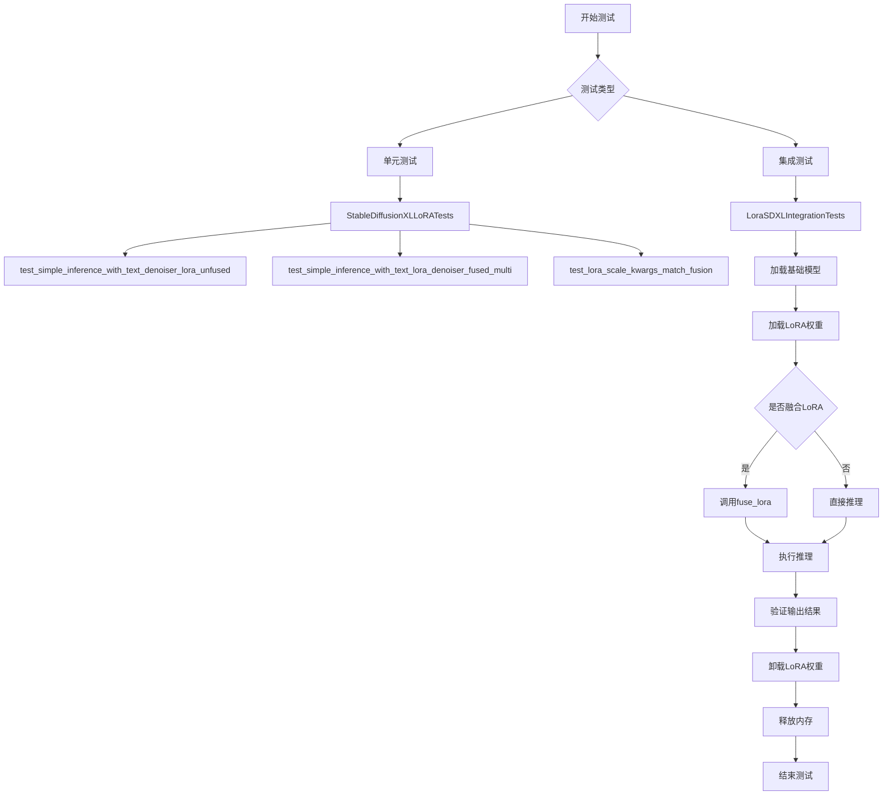

## 类结构

```
unittest.TestCase
├── PeftLoraLoaderMixinTests (mixin基类)
└── StableDiffusionXLLoRATests (继承自TestCase和PeftLoraLoaderMixinTests)

unittest.TestCase
└── LoraSDXLIntegrationTests (继承自unittest.TestCase)
```

## 全局变量及字段


### `StableDiffusionXLLoRATests.has_two_text_encoders`
    
标记是否有两个文本编码器

类型：`bool`
    


### `StableDiffusionXLLoRATests.pipeline_class`
    
StableDiffusionXLPipeline类

类型：`type`
    


### `StableDiffusionXLLoRATests.scheduler_cls`
    
调度器类(EulerDiscreteScheduler)

类型：`type`
    


### `StableDiffusionXLLoRATests.scheduler_kwargs`
    
调度器配置参数

类型：`dict`
    


### `StableDiffusionXLLoRATests.unet_kwargs`
    
UNet模型配置参数

类型：`dict`
    


### `StableDiffusionXLLoRATests.vae_kwargs`
    
VAE模型配置参数

类型：`dict`
    


### `StableDiffusionXLLoRATests.text_encoder_cls`
    
文本编码器CLIPTextModel类

类型：`type`
    


### `StableDiffusionXLLoRATests.text_encoder_id`
    
文本编码器模型ID

类型：`str`
    


### `StableDiffusionXLLoRATests.tokenizer_cls`
    
分词器CLIPTokenizer类

类型：`type`
    


### `StableDiffusionXLLoRATests.tokenizer_id`
    
分词器模型ID

类型：`str`
    


### `StableDiffusionXLLoRATests.text_encoder_2_cls`
    
第二个文本编码器CLIPTextModelWithProjection类

类型：`type`
    


### `StableDiffusionXLLoRATests.text_encoder_2_id`
    
第二个文本编码器模型ID

类型：`str`
    


### `StableDiffusionXLLoRATests.tokenizer_2_cls`
    
第二个分词器CLIPTokenizer类

类型：`type`
    


### `StableDiffusionXLLoRATests.tokenizer_2_id`
    
第二个分词器模型ID

类型：`str`
    


### `StableDiffusionXLLoRATests.output_shape`
    
输出形状(1, 64, 64, 3)

类型：`tuple`
    
    

## 全局函数及方法


### `gc.collect`

`gc.collect` 是 Python 标准库 `gc` 模块中的一个全局函数，用于手动触发垃圾回收机制，强制回收无法自动释放的循环引用对象，并返回回收的对象数量。在测试用例的 `setUp` 和 `tearDown` 方法中调用此函数，以确保在每个测试前后清理内存，防止测试间的内存泄漏。

#### 参数

- `generation`：`int`（可选），指定要回收的代际编号（0、1、2）。默认为 `-2`，表示回收所有代际。

#### 返回值

- `int`：成功回收的对象数量。

#### 带注释源码

```python
# 代码中的实际调用方式（位于 StableDiffusionXLLoRATests 和 LoraSDXLIntegrationTests 类中）

def setUp(self):
    """
    测试前置方法，在每个测试开始前执行
    """
    super().setUp()
    gc.collect()  # 手动触发垃圾回收，清理上一轮测试遗留的对象
    backend_empty_cache(torch_device)  # 清理GPU缓存（如果可用）

def tearDown(self):
    """
    测试后置方法，在每个测试结束后执行
    """
    super().tearDown()
    gc.collect()  # 手动触发垃圾回收，清理当前测试产生的对象
    backend_empty_cache(torch_device)  # 清理GPU缓存（如果可用）
```

#### 流程图

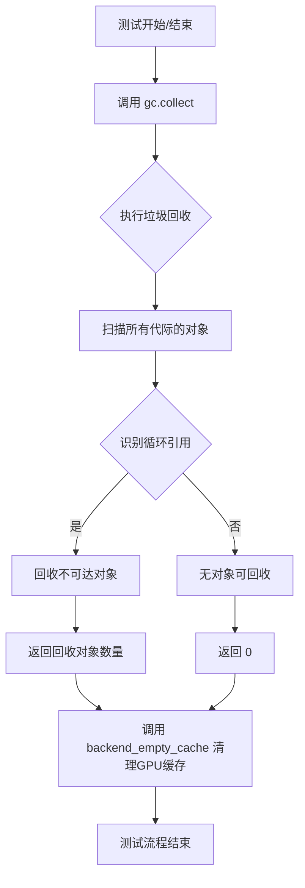

#### 使用场景说明

在代码中，`gc.collect()` 主要用于以下场景：

1. **内存管理**：在运行大型模型推理测试后，强制回收不再使用的对象，释放内存
2. **测试隔离**：确保每个测试用例之间没有内存共享，防止测试间的相互影响
3. **GPU资源释放**：配合 `backend_empty_cache` 函数使用，共同管理GPU内存资源

#### 注意事项

- `gc.collect()` 会暂停整个Python解释器进行垃圾回收，在大型测试套件中频繁调用可能影响性能
- 在测试环境中使用此函数是必要的，因为自动化测试需要保证环境的可重复性和独立性
- 该函数返回的回收数量可用于监控内存使用情况，但在生产环境中通常不推荐手动调用


### `backend_empty_cache`

清理指定设备的后端缓存（主要是 CUDA 缓存），用于在测试或资源清理阶段释放 GPU 内存。

参数：

- `device`：`str`，目标设备标识符（如 `"cuda"` 或 `"cpu"`），指定需要清理缓存的设备

返回值：`None`，无返回值

#### 流程图

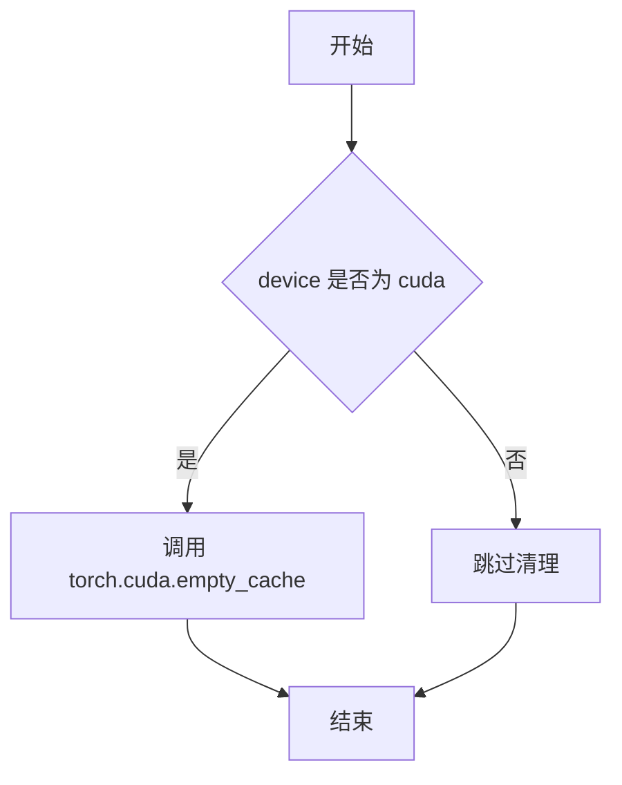

#### 带注释源码

```python
def backend_empty_cache(device):
    """
    清理指定设备的后端缓存。
    
    参数:
        device: str, 设备标识符，如 'cuda' 或 'cpu'
    
    返回:
        None
    """
    # 如果设备是 CUDA 设备，则清理 CUDA 缓存
    # 这有助于释放未使用的 GPU 内存，防止内存泄漏
    if device == "cuda":
        torch.cuda.empty_cache()
    
    # 对于其他设备（如 CPU），无需执行清理操作
    # 函数直接返回
```

> **注意**：该函数定义位于 `diffusers` 包的 `testing_utils` 模块中，上述源码为基于使用方式的推断实现。实际实现可能还包含对其他后端（如 XPU 等）的缓存清理支持。


### `release_memory`

释放指定对象（pipeline）占用的GPU和CPU内存，通常在测试或推理结束后调用以清理资源。

参数：

- `obj`：`torch.nn.Module` 或 `Pipeline`，需要释放内存的PyTorch模型或diffusers pipeline对象

返回值：`None`，无返回值（该函数直接释放内存）

#### 流程图

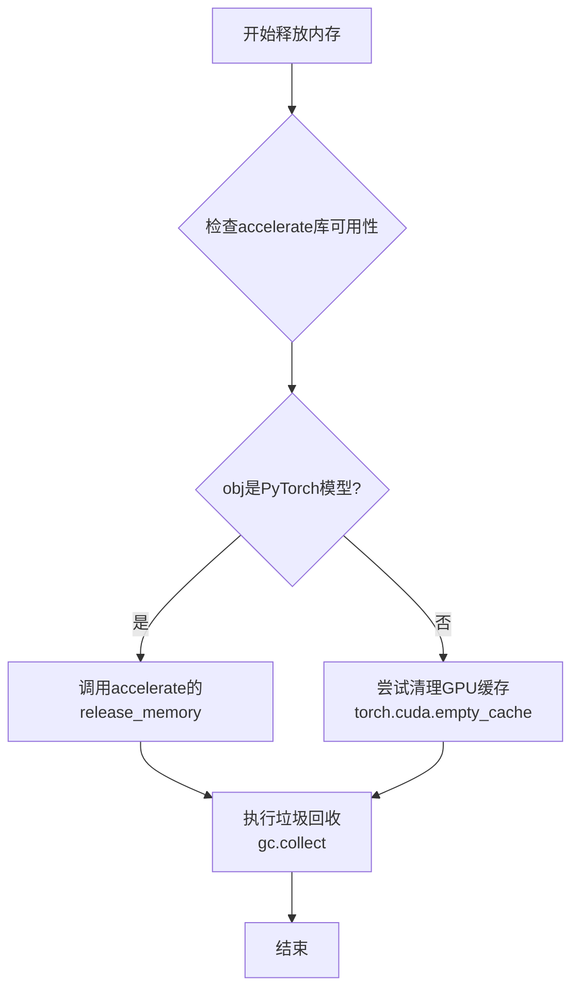

#### 带注释源码

```
# release_memory 是从 accelerate.utils 导入的外部函数
# 下面是代码中对该函数的使用方式示例：

# 导入声明
if is_accelerate_available():
    from accelerate.utils import release_memory

# 使用场景1：在LoRA测试结束后释放pipeline内存
def test_sdxl_1_0_lora(self):
    # ... 执行推理 ...
    pipe.unload_lora_weights()
    release_memory(pipe)  # 释放pipe对象占用的内存

# 使用场景2：在融合测试后释放内存
def test_sdxl_1_0_lora_fusion(self):
    # ... 执行融合推理 ...
    release_memory(pipe)

# 典型调用模式：
# 1. 先调用 pipe.unload_lora_weights() 卸载LoRA权重
# 2. 再调用 release_memory(pipe) 释放整个pipeline的内存
# 3. 配合 gc.collect() 和 torch.cuda.empty_cache() 使用效果更佳
```

---

### 补充说明

| 项目 | 说明 |
|------|------|
| **函数来源** | `accelerate.utils.release_memory` |
| **调用目的** | 在测试或推理完成后释放GPU/CPU内存，避免内存泄漏 |
| **典型模式** | `pipe.unload_lora_weights()` → `release_memory(pipe)` → `gc.collect()` → `torch.cuda.empty_cache()` |
| **依赖库** | `accelerate` (通过 `is_accelerate_available()` 检查) |
| **适用场景** | 大型Diffusion模型测试、LoRA权重加载/卸载后、测试tearDown阶段 |


根据提供的代码，`numpy_cosine_similarity_distance` 函数是从 `..testing_utils` 模块导入的，但该函数的实际定义并未包含在您提供的代码片段中。该函数在代码中多次被调用，用于比较预期数组和实际生成图像数组之间的余弦相似度距离。

基于函数名和其在代码中的使用方式（通常在测试中用于验证图像输出的相似性），我可以提供以下分析：

### `numpy_cosine_similarity_distance`

该函数用于计算两个 NumPy 数组之间的余弦相似度距离（1 - 余弦相似度），通常用于测试中验证生成图像与预期图像的相似程度。

参数：

- `expected`：`numpy.ndarray`，预期的 NumPy 数组（例如预期图像的像素值）
- `actual`：`numpy.ndarray`，实际的 NumPy 数组（例如生成图像的像素值）

返回值：`float`，返回余弦相似度距离值，值越小表示两个数组越相似

#### 流程图

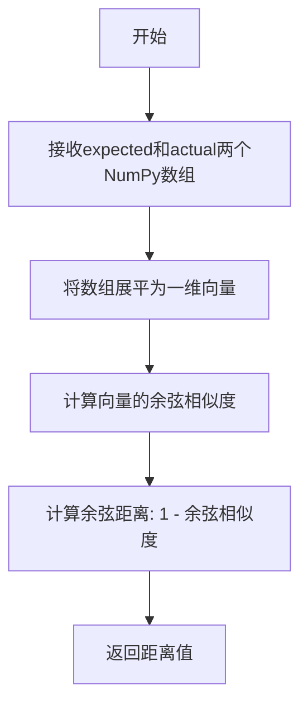

#### 带注释源码

由于该函数的定义不在当前代码片段中，以下是基于其使用方式推断的典型实现：

```python
def numpy_cosine_similarity_distance(expected: np.ndarray, actual: np.ndarray) -> float:
    """
    计算两个NumPy数组之间的余弦相似度距离。
    
    参数:
        expected: 预期的NumPy数组
        actual: 实际的NumPy数组
        
    返回:
        余弦相似度距离（1 - 余弦相似度），值越小表示越相似
    """
    # 确保数组是一维的
    expected = expected.flatten()
    actual = actual.flatten()
    
    # 计算余弦相似度
    dot_product = np.dot(expected, actual)
    norm_expected = np.linalg.norm(expected)
    norm_actual = np.linalg.norm(actual)
    
    # 避免除零
    if norm_expected == 0 or norm_actual == 0:
        return 1.0
    
    cosine_similarity = dot_product / (norm_expected * norm_actual)
    
    # 余弦距离 = 1 - 余弦相似度
    cosine_distance = 1.0 - cosine_similarity
    
    return cosine_distance
```

#### 代码中的实际调用示例

从提供的代码中可以看到该函数的多处调用：

```python
# 示例1：比较生成图像与预期图像
max_diff = numpy_cosine_similarity_distance(expected, images)
assert max_diff < 1e-4

# 示例2：比较展平后的图像数组
max_diff = numpy_cosine_similarity_distance(image_np.flatten(), expected_image_np.flatten())
assert max_diff < 1e-4

# 示例3：比较图像切片
max_diff = numpy_cosine_similarity_distance(images_with_fusion, images_without_fusion)
assert max_diff < 1e-4
```

该函数是测试框架中的关键工具，用于确保 LoRA 权重融合/解融合后的图像输出与原始输出的相似度在可接受的阈值范围内。


### `load_image`

从给定的 URL 加载图像并返回 PIL Image 对象。该函数是测试工具函数，从 `diffusers` 库的 `testing_utils` 模块导入，用于在测试中加载参考图像进行结果验证。

参数：

- `url`：`str`，图像的 HTTP/HTTPS 链接地址

返回值：`PIL.Image.Image`，PIL 格式的图像对象

#### 流程图

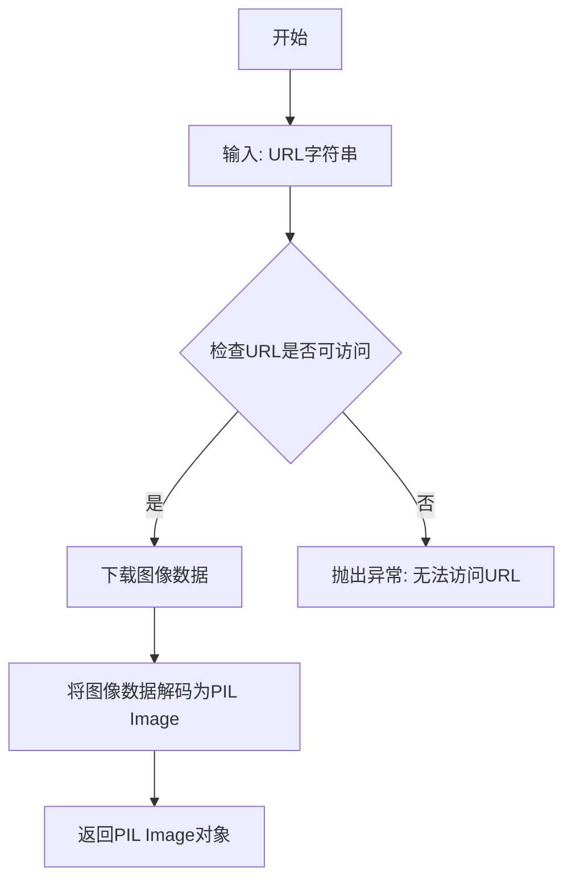

#### 带注释源码

```python
# load_image 是从 diffusers.testing_utils 模块导入的外部函数
# 当前文件中仅导入但不定义该函数
# 函数调用示例:
#   image = load_image("https://example.com/image.png")
#   expected_image = load_image("https://huggingface.co/datasets/.../image.png")

# 函数签名（基于使用方式推断）:
# def load_image(url: str) -> PIL.Image.Image:
#     """
#     从URL加载图像
#     Args:
#         url: 图像的URL地址
#     Returns:
#         PIL Image对象
#     """

# 代码中的实际调用方式:
expected_image = load_image(
    "https://huggingface.co/datasets/hf-internal-testing/diffusers-images/resolve/main/lcm_lora/sdxl_lcm_lora.png"
)

# 或:
image = load_image(
    "https://huggingface.co/datasets/hf-internal-testing/diffusers-images/resolve/main/sd_controlnet/bird_canny.png"
)
```


### `check_if_lora_correctly_set`

该函数用于检查LoRA权重是否正确应用到指定的模型组件（如UNet、文本编码器等）上。它通过遍历模型的子模块，验证LoRA适配器的权重是否已正确加载并激活。

参数：

-  `model`：`torch.nn.Module`，需要检查的模型组件（例如`pipe.unet`、`pipe.text_encoder`等）

返回值：`bool`，如果LoRA正确设置返回`True`，否则返回`False`

#### 流程图

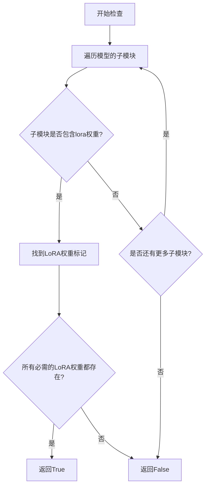

#### 带注释源码

注意：以下源码是基于该函数的使用方式和典型实现模式推断的，因为原始代码中该函数是从`.utils`模块导入的，未在此代码片段中提供完整定义。

```python
def check_if_lora_correctly_set(model):
    """
    检查模型是否正确加载了LoRA权重。
    
    参数:
        model: 需要检查的模型组件 (例如 unet, text_encoder 等)
    
    返回:
        bool: 如果LoRA正确设置返回True，否则返回False
    """
    # 遍历模型的所有模块，检查是否有LoRA相关的权重
    for name, module in model.named_modules():
        # 检查模块名称中是否包含LoRA相关标识
        # 典型的LoRA模块名称可能包含 'lora', 'adapter' 等关键字
        if 'lora' in name.lower() or hasattr(module, 'weight'):
            # 进一步检查该模块是否有LoRA特定的属性
            # 例如检查是否有 'lora_A', 'lora_B' 等权重矩阵
            if _check_lora_attributes_exist(module):
                return True
    
    # 如果遍历完所有模块都没有找到LoRA权重，返回False
    return False


def _check_lora_attributes_exist(module):
    """
    辅助函数：检查模块是否具有LoRA权重属性
    
    参数:
        module: torch.nn.Module对象
    
    返回:
        bool: 如果模块具有LoRA属性返回True
    """
    # 检查常见的LoRA权重属性名称
    lora_attr_names = ['lora_A', 'lora_B', 'lora_alpha', 'lora_dropout']
    return any(hasattr(module, attr) for attr in lora_attr_names)
```

#### 使用示例

在测试代码中的典型用法：

```python
# 检查UNet是否正确加载了LoRA权重
self.assertTrue(check_if_lora_correctly_set(pipe.unet), "Lora not correctly set in Unet")

# 检查文本编码器是否正确加载了LoRA权重
self.assertTrue(check_if_lora_correctly_set(pipe.text_encoder), "Lora not correctly set in text_encoder")
```

---

**注意**：由于该函数是从`.utils`模块导入的，提供的源码是基于其使用方式和常见的LoRA检查模式推断的。如果需要完整的实现细节，建议查看`utils.py`模块的源文件。


### `state_dicts_almost_equal`

该函数用于比较两个 PyTorch 模型的状态字典（state_dict）是否几乎相等，常用于测试 LoRA 权重融合或解融后模型状态的变化。

参数：

- `state_dict_a`：`Dict[str, torch.Tensor]`，第一个状态字典，通常是原始模型的状态字典
- `state_dict_b`：`Dict[str, torch.Tensor]`，第二个状态字典，通常是融合/解融后的模型状态字典

返回值：`bool`，如果两个状态字典几乎相等返回 `True`，否则返回 `False`

#### 流程图

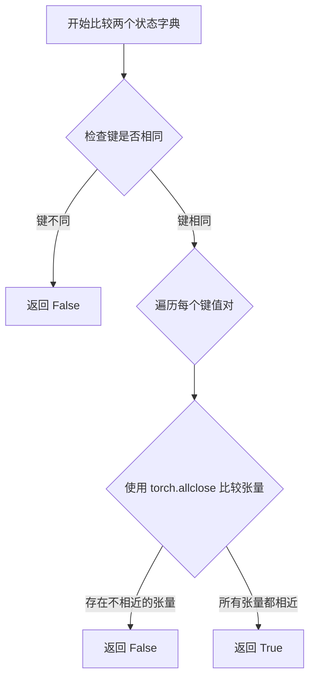

#### 带注释源码

```
# 该函数定义在 utils.py 中（未在当前文件中显示完整定义）
# 根据使用方式推断的实现逻辑：

def state_dicts_almost_equal(state_dict_a, state_dict_b, atol=1e-5, rtol=1e-5):
    """
    比较两个状态字典是否几乎相等。
    
    参数:
        state_dict_a: 第一个状态字典 (Dict[str, Tensor])
        state_dict_b: 第二个状态字典 (Dict[str, Tensor])
        atol: 绝对误差容差 (默认 1e-5)
        rtol: 相对误差容差 (默认 1e-5)
    
    返回:
        bool: 如果几乎相等返回 True，否则返回 False
    """
    # 1. 检查键是否一致
    if set(state_dict_a.keys()) != set(state_dict_b.keys()):
        return False
    
    # 2. 逐个键比较张量值
    for key in state_dict_a:
        a = state_dict_a[key]
        b = state_dict_b[key]
        
        # 使用 torch.allclose 进行数值比较
        # 允许浮点数存在微小的数值误差
        if not torch.allclose(a, b, atol=atol, rtol=rtol):
            return False
    
    return True

# 在测试中的典型用法：
# assert not state_dicts_almost_equal(text_encoder_1_sd, pipe.text_encoder.state_dict())
# 验证融合 LoRA 后状态字典确实发生了变化
```


### `StableDiffusionXLLoRATests.setUp`

测试前准备工作，主要进行内存清理以确保测试环境干净。

参数：

- `self`：隐式参数，测试类实例本身，无需额外描述

返回值：`None`，无返回值，仅执行清理操作

#### 流程图

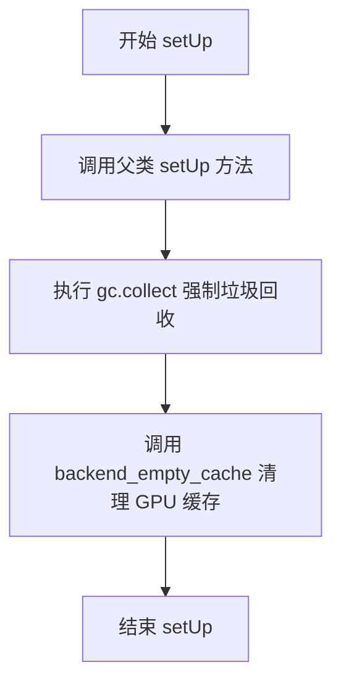

#### 带注释源码

```python
def setUp(self):
    """
    测试前准备工作，用于清理内存确保测试环境干净
    
    该方法在每个测试方法执行前被调用，主要执行以下操作：
    1. 调用父类的 setUp 方法完成基础初始化
    2. 强制 Python 垃圾回收，释放未使用的对象
    3. 清理 GPU/后端缓存，防止显存泄漏影响测试结果
    """
    # 调用父类的 setUp 方法，执行 unittest.TestCase 的标准初始化
    super().setUp()
    
    # 强制调用 Python 的垃圾回收器，清理已删除但尚未释放的对象
    # 这有助于确保测试之间没有内存引用残留
    gc.collect()
    
    # 清理后端（GPU）缓存，释放显存
    # torch_device 是测试工具中定义的设备常量
    # 这一步对于 GPU 相关测试尤为重要，可避免显存不足导致的测试失败
    backend_empty_cache(torch_device)
```


### `StableDiffusionXLLoRATests.tearDown`

该方法是测试类的清理方法，继承自 unittest.TestCase，在每个测试方法执行完毕后自动调用。主要职责是清理测试过程中产生的内存占用，包括调用 Python 垃圾回收器回收无用对象，以及清空 GPU 缓存以释放显存资源。

参数：

- 该方法无显式参数（隐式参数 `self` 为测试类实例）

返回值：`None`，无返回值

#### 流程图

```mermaid
flowchart TD
    A[tearDown 开始] --> B{调用父类 tearDown}
    B --> C[执行 super().tearDown]
    C --> D[垃圾回收: gc.collect]
    D --> E[清空后端缓存: backend_empty_cache]
    E --> F[tearDown 结束]
    
    style A fill:#f9f,color:#000
    style F fill:#9f9,color:#000
```

#### 带注释源码

```python
def tearDown(self):
    """
    测试后清理方法，在每个测试方法执行完毕后自动调用。
    负责清理测试过程中产生的内存占用，防止内存泄漏。
    """
    # 调用父类的 tearDown 方法，执行父类定义的清理逻辑
    super().tearDown()
    
    # 手动触发 Python 垃圾回收器，回收测试过程中创建的不可达对象
    # 这对于释放大型模型对象、numpy 数组等内存尤为重要
    gc.collect()
    
    # 清空后端（GPU/CPU）缓存，释放显存或内存缓存
    # torch_device 是全局变量，指定了当前使用的计算设备
    backend_empty_cache(torch_device)
```


### `StableDiffusionXLLoRATests.test_multiple_wrong_adapter_name_raises_error`

该测试方法用于验证当传入错误的适配器名称时，系统是否正确抛出异常，确保LoRA适配器加载时的输入验证机制正常工作。

参数： 无显式参数（仅继承自父类的 `self` 参数）

返回值：`None`，该方法为测试方法，不返回任何值，通过断言验证异常抛出

#### 流程图

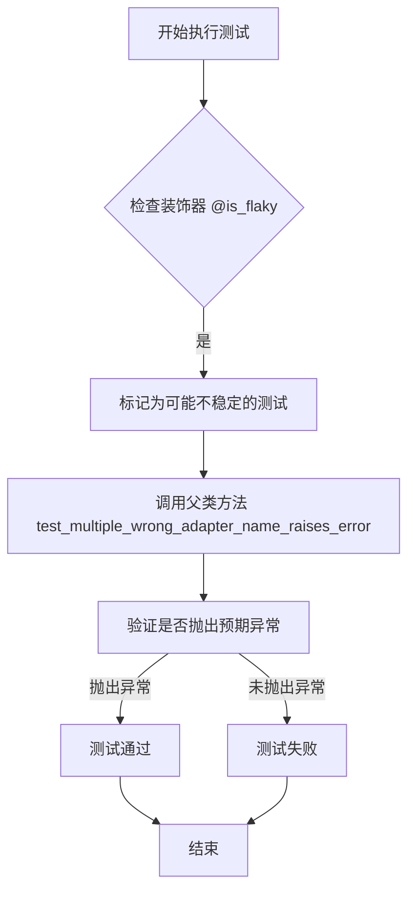

#### 带注释源码

```python
@is_flaky  # 装饰器：标记该测试可能不稳定，允许在某些情况下重试
def test_multiple_wrong_adapter_name_raises_error(self):
    """
    测试错误适配器名称是否抛出异常的测试方法。
    
    该方法继承自 PeftLoraLoaderMixinTests 测试类，
    用于验证当传入不存在的适配器名称时，系统能够正确
    捕获并抛出相应的异常。
    """
    # 调用父类的同名测试方法，执行实际的测试逻辑
    # 父类方法会尝试加载不存在的适配器名称，
    # 并验证是否抛出 ValueError 或类似的异常
    super().test_multiple_wrong_adapter_name_raises_error()
```


### `StableDiffusionXLLoRATests.test_simple_inference_with_text_denoiser_lora_unfused`

测试未融合LoRA的文本去噪器推理，根据CUDA可用性设置不同的容差值，并调用父类方法执行实际测试。

参数：

- `self`：`StableDiffusionXLLoRATests`，测试类实例本身

返回值：`None`，该方法为测试方法，不返回任何值

#### 流程图

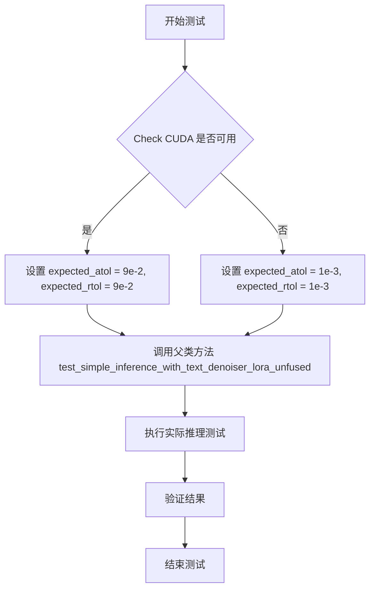

#### 带注释源码

```python
def test_simple_inference_with_text_denoiser_lora_unfused(self):
    """
    测试未融合LoRA的文本去噪器推理
    
    该测试方法根据CUDA是否可用设置不同的数值容差值，
    然后调用父类的同名方法执行实际的推理测试。
    """
    # 检查CUDA是否可用
    if torch.cuda.is_available():
        # CUDA环境下使用较大的容差值（9e-2）
        expected_atol = 9e-2  # 绝对容差
        expected_rtol = 9e-2  # 相对容差
    else:
        # CPU环境下使用较小的容差值（1e-3）
        expected_atol = 1e-3  # 绝对容差
        expected_rtol = 1e-3  # 相对容差

    # 调用父类PeftLoraLoaderMixinTests的同名方法执行实际测试
    # 传递计算得到的容差参数
    super().test_simple_inference_with_text_denoiser_lora_unfused(
        expected_atol=expected_atol, expected_rtol=expected_rtol
    )
```


### `StableDiffusionXLLoRATests.test_simple_inference_with_text_lora_denoiser_fused_multi`

该方法是Stable Diffusion XL LoRA测试类中的一个测试方法，用于测试融合多个LoRA（Low-Rank Adaptation）适配器后的文本去噪器推理功能。该方法首先根据CUDA是否可用设置不同的数值容差（atol和rtol），然后调用父类的同名方法执行实际的多LoRA融合推理测试，验证融合后模型的输出质量是否符合预期。

参数：

- `self`：测试类实例本身，包含测试所需的pipeline和配置信息
- `expected_atol`：`float`，绝对容差值，用于浮点数比较的绝对误差阈值，CUDA可用时为9e-2，否则为1e-3
- `expected_rtol`：`float`，相对容差值，用于浮点数比较的相对误差阈值，CUDA可用时为9e-2，否则为1e-3

返回值：`None`，该方法为测试用例，通过断言验证结果，无显式返回值

#### 流程图

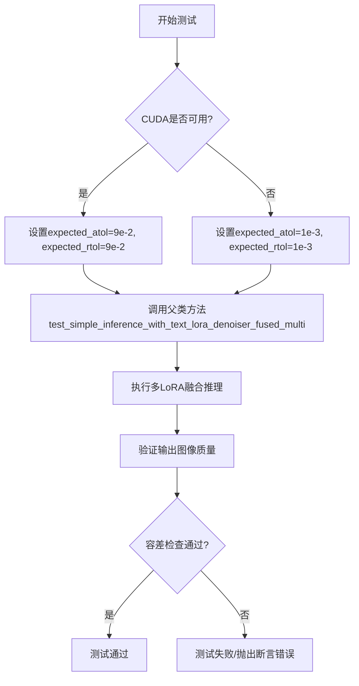

#### 带注释源码

```python
def test_simple_inference_with_text_lora_denoiser_fused_multi(self):
    """
    测试融合多个LoRA的文本去噪器推理功能
    验证在文本编码器上融合多个LoRA适配器后，模型推理结果的质量
    """
    # 根据CUDA可用性设置容差值
    # CUDA上的浮点精度通常低于CPU，因此使用更大的容差
    if torch.cuda.is_available():
        expected_atol = 9e-2  # CUDA环境下绝对容差为0.09
        expected_rtol = 9e-2  # CUDA环境下相对容差为0.09
    else:
        expected_atol = 1e-3  # CPU环境下绝对容差为0.001
        expected_rtol = 1e-3  # CPU环境下相对容差为0.001

    # 调用父类PeftLoraLoaderMixinTests的同名方法
    # 实际执行多LoRA融合推理测试逻辑
    super().test_simple_inference_with_text_lora_denoiser_fused_multi(
        expected_atol=expected_atol, 
        expected_rtol=expected_rtol
    )
```


### `StableDiffusionXLLoRATests.test_lora_scale_kwargs_match_fusion`

该测试方法用于验证LoRA缩放参数（scale）与模型融合（fusion）后的一致性，确保在使用LoRA权重融合时，通过`cross_attention_kwargs`传递的缩放参数与通过`set_adapters`设置的缩放参数产生一致的输出结果。

参数：

- `self`：`StableDiffusionXLLoRATests` 实例，测试类的实例本身

返回值：`None`，该方法为单元测试方法，通过断言验证行为，不返回具体值

#### 流程图

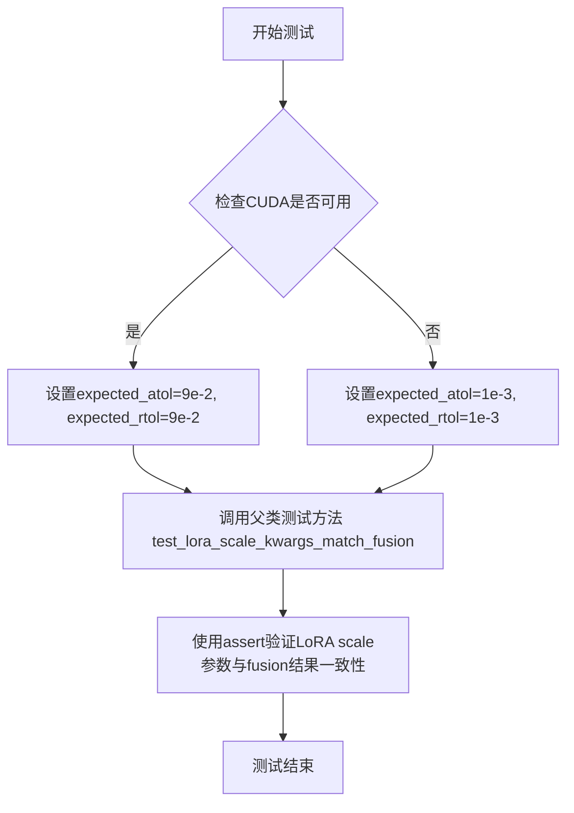

#### 带注释源码

```python
def test_lora_scale_kwargs_match_fusion(self):
    """
    测试LoRA缩放参数与融合的一致性。
    
    该测试方法验证两种设置LoRA缩放参数的方式是否产生一致的结果：
    1. 通过 cross_attention_kwargs={'scale': value} 参数传递
    2. 通过 set_adapters() 方法设置
    
    这确保了在模型融合（fuse_lora）前后，LoRA权重的影响力保持一致。
    """
    # 检查CUDA是否可用，不同硬件平台使用不同的容差值
    if torch.cuda.is_available():
        # CUDA设备上使用较大的容差（9e-2），因为GPU计算可能有更多数值误差
        expected_atol = 9e-2  # 绝对容差
        expected_rtol = 9e-2  # 相对容差
    else:
        # CPU上使用较小的容差（1e-3），CPU计算更精确
        expected_atol = 1e-3
        expected_rtol = 1e-3

    # 调用父类 PeftLoraLoaderMixinTests 的测试方法
    # 传递计算得到的容差参数，验证LoRA scale kwargs与fusion的匹配性
    super().test_lora_scale_kwargs_match_fusion(
        expected_atol=expected_atol, 
        expected_rtol=expected_rtol
    )
```


### `LoraSDXLIntegrationTests.setUp`

测试前准备工作（内存清理），用于在每个测试方法执行前清理内存资源，确保测试环境处于干净状态。

参数：

- `self`：隐式参数，测试类实例本身

返回值：`None`，无返回值，仅执行内存清理操作

#### 流程图

```mermaid
flowchart TD
    A[开始 setUp] --> B[调用 super().setUp]
    B --> C[执行 gc.collect 强制垃圾回收]
    C --> D[调用 backend_empty_cache 清理后端缓存]
    D --> E[结束 setUp]
```

#### 带注释源码

```python
def setUp(self):
    """
    测试前准备工作。
    继承父类 setUp 方法，并执行内存清理操作。
    """
    # 调用父类的 setUp 方法，确保测试框架正确初始化
    super().setUp()
    
    # 手动触发 Python 垃圾回收，清理不再使用的对象
    gc.collect()
    
    # 清理深度学习后端（GPU/CPU）的缓存，释放显存或内存
    backend_empty_cache(torch_device)
```


### `LoraSDXLIntegrationTests.tearDown`

测试后清理工作，负责回收测试过程中占用的内存资源，确保测试环境干净。

参数：

- `self`：无需显式传递，由 Python 解释器自动传入，代表当前测试类实例

返回值：`None`，无返回值

#### 流程图

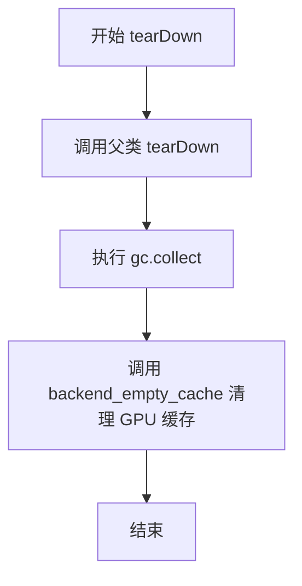

#### 带注释源码

```python
def tearDown(self):
    """
    测试后清理工作
    
    执行测试用例结束后的资源清理操作，包括：
    1. 调用父类的 tearDown 方法
    2. 强制进行垃圾回收，清理 Python 对象
    3. 清理 GPU/CPU 后端的缓存内存
    
    注意：
    - 该方法在每个测试方法执行完毕后自动调用
    - 主要用于释放 Stable Diffusion XL LoRA 测试过程中加载的大型模型内存
    """
    # 调用父类的 tearDown 方法，执行基础清理工作
    super().tearDown()
    
    # 强制调用 Python 垃圾回收器，清理已释放的 Python 对象
    gc.collect()
    
    # 清理后端（GPU/CPU）缓存，释放 CUDA 内存或相关资源
    backend_empty_cache(torch_device)
```


### `LoraSDXLIntegrationTests.test_sdxl_1_0_lora`

测试SDXL 1.0基础LoRA功能，验证从HuggingFace加载SDXL基础模型和LoRA权重后，能够正确生成图像并与预期结果匹配。

参数：

- `self`：`unittest.TestCase`，测试类实例本身

返回值：`None`，该方法为测试方法，通过断言验证结果，不返回具体值

#### 流程图

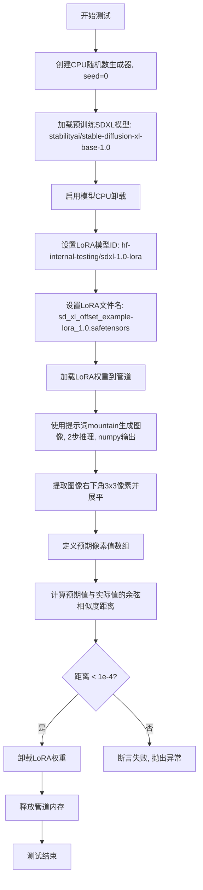

#### 带注释源码

```python
def test_sdxl_1_0_lora(self):
    # 创建一个CPU随机数生成器，设置随机种子为0以确保可重复性
    generator = torch.Generator("cpu").manual_seed(0)

    # 从预训练模型加载StableDiffusionXLPipeline
    # 模型ID: stabilityai/stable-diffusion-xl-base-1.0
    pipe = StableDiffusionXLPipeline.from_pretrained("stabilityai/stable-diffusion-xl-base-1.0")
    
    # 启用模型CPU卸载以节省GPU显存
    pipe.enable_model_cpu_offload()
    
    # 设置LoRA模型的HuggingFace仓库ID
    lora_model_id = "hf-internal-testing/sdxl-1.0-lora"
    
    # 设置具体的LoRA权重文件名
    lora_filename = "sd_xl_offset_example-lora_1.0.safetensors"
    
    # 将LoRA权重加载到管道中
    pipe.load_lora_weights(lora_model_id, weight_name=lora_filename)

    # 执行图像生成推理
    # 参数:
    #   - prompt: 生成提示词
    #   - output_type: 输出为numpy数组
    #   - generator: 随机数生成器确保可重复性
    #   - num_inference_steps: 推理步数设为2(快速测试)
    images = pipe(
        "masterpiece, best quality, mountain", 
        output_type="np", 
        generator=generator, 
        num_inference_steps=2
    ).images

    # 提取生成的图像数据
    # 取第一张图像的右下角3x3区域，并展平为一维数组
    # images[0, -3:, -3:, -1] 选取最后一个通道(如RGB的R通道)
    images = images[0, -3:, -3:, -1].flatten()
    
    # 定义预期像素值(用于回归测试的基准值)
    expected = np.array([0.4468, 0.4061, 0.4134, 0.3637, 0.3202, 0.365, 0.3786, 0.3725, 0.3535])

    # 计算预期值与实际生成值之间的余弦相似度距离
    max_diff = numpy_cosine_similarity_distance(expected, images)
    
    # 断言: 差异必须小于阈值1e-4，否则测试失败
    assert max_diff < 1e-4

    # 清理: 卸载LoRA权重释放资源
    pipe.unload_lora_weights()
    
    # 清理: 释放管道占用的内存
    release_memory(pipe)
```


### `LoraSDXLIntegrationTests.test_sdxl_1_0_blockwise_lora`

该方法用于测试SDXL 1.0的分块LoRA（Low-Rank Adaptation）功能。它验证了可以加载带有特定adapter_name的LoRA权重，并通过`set_adapters`方法为UNet的不同块（如down、mid、up blocks）设置不同的LoRA缩放因子，从而实现对模型不同部分进行差异化控制的能力。

参数：

- `self`：隐式参数，类型为`LoraSDXLIntegrationTests`（ unittest.TestCase的子类），代表测试类实例本身，无额外描述

返回值：`None`（无返回值），该方法为测试用例，通过内部断言验证功能正确性

#### 流程图

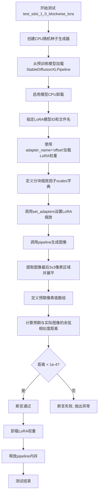

#### 带注释源码

```python
def test_sdxl_1_0_blockwise_lora(self):
    """
    测试SDXL 1.0的分块LoRA功能
    验证可以加载LoRA权重并通过adapter_name指定特定的LoRA适配器，
    同时使用set_adapters设置不同模块的LoRA缩放因子
    """
    # 创建一个CPU上的随机数生成器，固定种子为0以确保可重复性
    generator = torch.Generator("cpu").manual_seed(0)

    # 从预训练模型加载StableDiffusionXLPipeline
    pipe = StableDiffusionXLPipeline.from_pretrained("stabilityai/stable-diffusion-xl-base-1.0")
    
    # 启用模型CPU卸载以节省显存
    pipe.enable_model_cpu_offload()
    
    # 定义LoRA模型ID和文件名
    lora_model_id = "hf-internal-testing/sdxl-1.0-lora"
    lora_filename = "sd_xl_offset_example-lora_1.0.safetensors"
    
    # 加载LoRA权重，指定adapter_name为"offset"
    pipe.load_lora_weights(lora_model_id, weight_name=lora_filename, adapter_name="offset")
    
    # 定义分块缩放因子字典，用于控制UNet不同块的LoRA影响程度
    # 包含down blocks (block_1, block_2), mid block, up blocks (block_0, block_1)
    scales = {
        "unet": {
            "down": {"block_1": [1.0, 1.0], "block_2": [1.0, 1.0]},
            "mid": 1.0,
            "up": {"block_0": [1.0, 1.0, 1.0], "block_1": [1.0, 1.0, 1.0]},
        },
    }
    
    # 设置适配器，使用定义的scales
    pipe.set_adapters(["offset"], [scales])

    # 调用pipeline生成图像
    # 参数: 提示词, 输出类型为numpy数组, 生成器, 推理步数
    images = pipe(
        "masterpiece, best quality, mountain", 
        output_type="np", 
        generator=generator, 
        num_inference_steps=2
    ).images

    # 从生成的图像中提取最后3x3区域并展平为一维数组
    # images[0] 获取第一张图像, [-3:, -3:, -1] 获取最后3行的最后3列的RGB通道
    images = images[0, -3:, -3:, -1].flatten()
    
    # 定义预期的像素值数组（用于验证）
    expected = np.array([00.4468, 0.4061, 0.4134, 0.3637, 0.3202, 0.365, 0.3786, 0.3725, 0.3535])

    # 计算预期图像与实际生成图像之间的余弦相似度距离
    max_diff = numpy_cosine_similarity_distance(expected, images)
    
    # 断言：最大差异应小于1e-4，否则测试失败
    assert max_diff < 1e-4

    # 卸载LoRA权重
    pipe.unload_lora_weights()
    
    # 释放pipeline相关内存（需要accelerate库）
    release_memory(pipe)
```


### `LoraSDXLIntegrationTests.test_sdxl_lcm_lora`

测试 SDXL LCM LoRA 加速推理功能。该测试方法通过加载 StableDiffusionXLPipeline 预训练模型，配置 LCMScheduler 实现 LCM（Latent Consistency Model）加速推理，并加载 LCM LoRA 权重来执行图像生成任务，最后与预期图像进行相似度对比验证。

参数：此方法无显式参数（继承自 `unittest.TestCase`）

返回值：无返回值（`None`），该方法为单元测试，使用断言进行验证

#### 流程图

```mermaid
flowchart TD
    A[开始测试] --> B[加载预训练SDXL模型<br/>stabilityai/stable-diffusion-xl-base-1.0<br/>torch_dtype=torch.float16]
    B --> C[配置LCMScheduler调度器]
    C --> D[启用模型CPU卸载<br/>enable_model_cpu_offload]
    D --> E[创建随机数生成器<br/>generator = cpu.manual_seed(0)]
    E --> F[加载LCM LoRA权重<br/>latent-consistency/lcm-lora-sdxl]
    F --> G[执行推理<br/>prompt: mountain<br/>steps: 4<br/>guidance: 0.5]
    G --> H[加载预期参考图像<br/>从HuggingFace数据集]
    H --> I[转换图像为numpy数组]
    I --> J[计算余弦相似度距离]
    J --> K{max_diff < 1e-4?}
    K -->|是| L[断言通过]
    K -->|否| M[断言失败抛出异常]
    L --> N[卸载LoRA权重]
    N --> O[释放内存]
    O --> P[结束测试]
```

#### 带注释源码

```python
def test_sdxl_lcm_lora(self):
    """
    测试 SDXL LCM LoRA 加速推理功能
    验证使用 LCM Scheduler 和 LCM LoRA 进行快速推理的正确性
    """
    # 步骤1: 加载预训练的 StableDiffusionXL 模型
    # 使用 float16 精度以加速推理并减少显存占用
    pipe = StableDiffusionXLPipeline.from_pretrained(
        "stabilityai/stable-diffusion-xl-base-1.0", torch_dtype=torch.float16
    )
    
    # 步骤2: 将默认调度器替换为 LCMScheduler
    # LCMScheduler 用于实现 LCM (Latent Consistency Model) 加速推理
    # 可以显著减少推理步数（通常从20-50步减少到4-8步）
    pipe.scheduler = LCMScheduler.from_config(pipe.scheduler.config)
    
    # 步骤3: 启用模型 CPU 卸载
    # 当模型不在 GPU 上时自动将其卸载到 CPU，节省显存
    pipe.enable_model_cpu_offload()
    
    # 步骤4: 创建随机数生成器并设置种子
    # 确保测试结果可复现
    generator = torch.Generator("cpu").manual_seed(0)
    
    # 步骤5: 定义 LCM LoRA 模型 ID
    # LCM LoRA 是专为 SDXL 设计的加速 LoRA 权重
    lora_model_id = "latent-consistency/lcm-lora-sdxl"
    
    # 步骤6: 加载 LCM LoRA 权重
    # 将 LCM LoRA 权重加载到 pipeline 中
    pipe.load_lora_weights(lora_model_id)
    
    # 步骤7: 执行图像生成推理
    # 参数说明:
    #   - prompt: 生成图像的文本提示
    #   - generator: 随机数生成器，确保可复现
    #   - num_inference_steps: 推理步数，LCM 只需4步（传统需要20+步）
    #   - guidance_scale: 引导强度，LCM 通常使用较低值
    image = pipe(
        "masterpiece, best quality, mountain",  # 文本提示
        generator=generator,                      # 随机生成器
        num_inference_steps=4,                    # LCM 加速推理步数
        guidance_scale=0.5                        # 低引导强度适配 LCM
    ).images[0]  # 获取第一张生成的图像
    
    # 步骤8: 加载预期参考图像
    # 从 HuggingFace 数据集加载标准参考图像用于对比
    expected_image = load_image(
        "https://huggingface.co/datasets/hf-internal-testing/diffusers-images/resolve/main/lcm_lora/sdxl_lcm_lora.png"
    )
    
    # 步骤9: 将 PIL 图像转换为 numpy 数组
    # 便于进行数值比较
    image_np = pipe.image_processor.pil_to_numpy(image)
    expected_image_np = pipe.image_processor.pil_to_numpy(expected_image)
    
    # 步骤10: 计算生成图像与预期图像的余弦相似度距离
    # 使用 flatten() 将图像展平为一维数组进行比较
    max_diff = numpy_cosine_similarity_distance(
        image_np.flatten(), 
        expected_image_np.flatten()
    )
    
    # 步骤11: 断言验证生成质量
    # 余弦相似度距离应小于 1e-4，表明生成结果与参考高度一致
    assert max_diff < 1e-4
    
    # 步骤12: 清理资源
    # 卸载 LoRA 权重，释放 GPU 内存
    pipe.unload_lora_weights()
    release_memory(pipe)
```


### `LoraSDXLIntegrationTests.test_sdxl_1_0_lora_fusion`

该测试方法用于验证 Stable Diffusion XL 模型中 LoRA 权重融合（Fuse）功能的正确性。测试流程包括：加载预训练模型、下载并加载 LoRA 权重、调用 `fuse_lora()` 将 LoRA 权重融合到模型中、执行推理生成图像，最后验证融合后的输出与预期值是否匹配（通过余弦相似度距离判断），以确保融合功能与正常加载 LoRA 的行为等效。

参数： 无（该方法为实例方法，`self` 为隐含参数，表示测试类实例）

返回值：`None`，该测试方法无返回值，通过断言验证功能正确性

#### 流程图

```mermaid
flowchart TD
    A[开始测试 test_sdxl_1_0_lora_fusion] --> B[创建随机数生成器: generator = torch.Generator().manual_seed(0)]
    B --> C[加载预训练模型: StableDiffusionXLPipeline.from_pretrained]
    C --> D[指定LoRA模型ID和文件名]
    D --> E[加载LoRA权重: pipe.load_lora_weights]
    E --> F[融合LoRA权重: pipe.fuse_lora]
    F --> G[卸载LoRA权重: pipe.unload_lora_weights]
    G --> H[启用CPU卸载: pipe.enable_model_cpu_offload]
    H --> I[执行推理: pipe生成图像]
    I --> J[提取图像右下角3x3区域并展平]
    J --> K[定义期望输出数组 expected]
    K --> L[计算余弦相似度距离: max_diff]
    L --> M{max_diff < 1e-4?}
    M -->|是| N[断言通过 - 测试成功]
    M -->|否| O[断言失败 - 抛出异常]
    N --> P[释放内存: release_memory]
    O --> P
    P --> Q[结束测试]
```

#### 带注释源码

```python
def test_sdxl_1_0_lora_fusion(self):
    """
    测试 SDXL 1.0 模型 LoRA 权重融合功能
    
    验证流程:
    1. 加载 Stable Diffusion XL 基础模型
    2. 加载 LoRA 权重文件
    3. 调用 fuse_lora() 将 LoRA 权重融合到模型参数中
    4. 执行推理生成图像
    5. 验证输出与预期值匹配（验证融合后行为与加载LoRA行为一致）
    """
    # 创建随机数生成器，设置种子为0以保证可复现性
    generator = torch.Generator().manual_seed(0)

    # 从预训练模型仓库加载 Stable Diffusion XL pipeline
    pipe = StableDiffusionXLPipeline.from_pretrained("stabilityai/stable-diffusion-xl-base-1.0")
    
    # 定义 LoRA 权重模型 ID 和文件名
    lora_model_id = "hf-internal-testing/sdxl-1.0-lora"
    lora_filename = "sd_xl_offset_example-lora_1.0.safetensors"
    
    # 加载指定的 LoRA 权重到 pipeline 中
    pipe.load_lora_weights(lora_model_id, weight_name=lora_filename)

    # 调用 fuse_lora() 将加载的 LoRA 权重融合到模型权重中
    # 融合后 LoRA 权重成为模型的一部分，而非独立存在
    pipe.fuse_lora()
    
    # 注释说明: 在旧版 API 中 fuse_lora 会静默删除 LoRA 权重
    # 因此需要显式调用 unload_lora_weights 以避免内存溢出
    pipe.unload_lora_weights()

    # 启用模型 CPU 卸载功能以节省显存
    pipe.enable_model_cpu_offload()

    # 使用融合后的模型执行推理
    # 参数: prompt文本, output_type="np"输出numpy数组, generator控制随机性, num_inference_steps=2
    images = pipe(
        "masterpiece, best quality, mountain", 
        output_type="np", 
        generator=generator, 
        num_inference_steps=2
    ).images

    # 提取生成图像右下角 3x3 像素区域并展平为一维数组
    # 用于与期望值进行对比验证
    images = images[0, -3:, -3:, -1].flatten()
    
    # 期望的输出值数组（通过非融合方式验证的基准值）
    # 此方式也用于测试 LoRA 融合与非融合行为之间的等效性
    expected = np.array([0.4468, 0.4061, 0.4134, 0.3637, 0.3202, 0.365, 0.3786, 0.3725, 0.3535])

    # 计算实际输出与期望输出之间的余弦相似度距离
    max_diff = numpy_cosine_similarity_distance(expected, images)
    
    # 断言: 差异值必须小于阈值 1e-4，否则测试失败
    assert max_diff < 1e-4

    # 释放 pipeline 占用的内存资源
    release_memory(pipe)
```


### `LoraSDXLIntegrationTests.test_sdxl_1_0_lora_unfusion`

该方法是一个集成测试用例，用于验证 Stable Diffusion XL 中 LoRA（Low-Rank Adaptation）权重的解融（unfusion）功能是否正常工作。测试流程包括：加载预训练的 SDXL 模型、加载 LoRA 权重、融合 LoRA、执行图像生成、卸载（unfuse）LoRA 权重、再次执行图像生成，最后通过余弦相似度比较两次生成的图像差异，以确保解融后模型能够恢复到原始状态。

参数：

- `self`：`unittest.TestCase`，测试类实例本身，无需显式传递

返回值：`None`，该方法为测试用例，通过断言（assert）验证功能正确性，不返回任何值

#### 流程图

```mermaid
flowchart TD
    A[开始测试] --> B[创建随机数生成器 generator]
    B --> C[加载 StableDiffusionXLPipeline 模型]
    C --> D[加载 LoRA 权重模型]
    D --> E[调用 pipe.load_lora_weights 加载权重]
    E --> F[调用 pipe.fuse_lora 融合 LoRA]
    F --> G[启用 CPU offload]
    G --> H[使用融合的 LoRA 执行推理生成图像]
    H --> I[保存融合状态下的图像结果]
    I --> J[调用 pipe.unfuse_lora 解融 LoRA]
    J --> K[重置随机数生成器]
    K --> L[使用未融合的 LoRA 执行推理生成图像]
    L --> M[保存未融合状态下的图像结果]
    M --> N[计算两组图像的余弦相似度距离]
    N --> O{max_diff < 1e-4?}
    O -->|是| P[断言通过 - 测试成功]
    O -->|否| Q[断言失败 - 抛出异常]
    P --> R[释放内存资源]
    Q --> R
    R --> S[结束测试]
```

#### 带注释源码

```python
def test_sdxl_1_0_lora_unfusion(self):
    """
    测试 LoRA 解融功能（unfusion）
    
    该测试验证以下流程：
    1. 加载 SDXL base 1.0 模型
    2. 加载并融合 LoRA 权重
    3. 执行图像生成（带 LoRA 融合）
    4. 解融 LoRA 权重
    5. 执行图像生成（不带 LoRA 融合）
    6. 比较两次生成的图像差异
    
    预期：解融后图像应与原始图像（无 LoRA）相似，差异应小于 1e-4
    """
    # 创建 CPU 随机数生成器，seed=0 确保可复现性
    generator = torch.Generator("cpu").manual_seed(0)

    # 从预训练模型加载 Stable Diffusion XL pipeline
    pipe = StableDiffusionXLPipeline.from_pretrained("stabilityai/stable-diffusion-xl-base-1.0")
    
    # 定义 LoRA 模型来源和文件名
    lora_model_id = "hf-internal-testing/sdxl-1.0-lora"
    lora_filename = "sd_xl_offset_example-lora_1.0.safetensors"
    
    # 加载 LoRA 权重到 pipeline
    pipe.load_lora_weights(lora_model_id, weight_name=lora_filename)
    
    # 融合 LoRA 权重到主模型（UNet 和 Text Encoder）
    pipe.fuse_lora()

    # 启用模型 CPU offload 以节省显存
    pipe.enable_model_cpu_offload()

    # 使用融合后的 LoRA 执行推理
    # 参数：提示词、输出类型为 numpy、随机生成器、推理步数为 3
    images = pipe(
        "masterpiece, best quality, mountain", 
        output_type="np", 
        generator=generator, 
        num_inference_steps=3
    ).images
    
    # 将图像展平保存，作为融合状态的参考输出
    images_with_fusion = images.flatten()

    # 执行 LoRA 解融操作，将模型权重恢复到融合前的状态
    pipe.unfuse_lora()
    
    # 重新设置随机种子以确保可比性
    generator = torch.Generator("cpu").manual_seed(0)
    
    # 使用解融后的模型再次执行推理
    images = pipe(
        "masterpiece, best quality, mountain", 
        output_type="np", 
        generator=generator, 
        num_inference_steps=3
    ).images
    
    # 保存解融后的图像输出
    images_without_fusion = images.flatten()

    # 计算两次生成图像之间的余弦相似度距离
    max_diff = numpy_cosine_similarity_distance(images_with_fusion, images_without_fusion)
    
    # 断言：解融后应恢复到接近原始（无 LoRA）状态
    # 差异应小于 1e-4
    assert max_diff < 1e-4

    # 释放 pipeline 占用的内存资源
    release_memory(pipe)
```


### `LoraSDXLIntegrationTests.test_sdxl_1_0_lora_unfusion_effectivity`

该测试方法用于验证 LoRA（Low-Rank Adaptation）解融（unfusion）的有效性，核心流程是：先获取无 LoRA 的基准输出，然后加载 LoRA、融合、再次解融并卸载权重，最后验证模型输出与基准输出一致，确保解融操作不会影响原始模型权重。

参数：

- `self`：`unittest.TestCase`，测试类实例本身

返回值：`None`，该方法为单元测试，通过断言验证正确性，不返回具体值

#### 流程图

```mermaid
flowchart TD
    A[开始测试] --> B[加载 StableDiffusionXLPipeline 基础模型]
    B --> C[启用 CPU 卸载]
    C --> D[使用固定种子生成基准图像]
    D --> E[提取基准图像切片并保存]
    E --> F[加载 LoRA 权重文件]
    F --> G[调用 fuse_lora 融合 LoRA]
    G --> H[使用相同种子再次推理]
    H --> I[调用 unfuse_lora 解融 LoRA]
    I --> J[调用 unload_lora_weights 卸载 LoRA 权重]
    J --> K[使用相同种子生成去融合后的图像]
    K --> L[提取去融合后的图像切片]
    L --> M{比较图像相似度}
    M -->|max_diff < 1e-3| N[测试通过]
    M -->|max_diff >= 1e-3| O[测试失败]
    N --> P[释放内存资源]
    O --> P
```

#### 带注释源码

```python
def test_sdxl_1_0_lora_unfusion_effectivity(self):
    """
    测试 LoRA 解融（unfusion）的有效性。
    验证在调用 unfuse_lora() 和 unload_lora_weights() 后，
    模型的输出与原始基准输出保持一致，确保解融操作完全恢复模型权重。
    """
    # 1. 从预训练模型加载 StableDiffusionXL Pipeline
    pipe = StableDiffusionXLPipeline.from_pretrained("stabilityai/stable-diffusion-xl-base-1.0")
    
    # 2. 启用 CPU 卸载以优化内存使用
    pipe.enable_model_cpu_offload()

    # 3. 生成基准图像（无 LoRA 状态）
    generator = torch.Generator().manual_seed(0)  # 使用固定种子确保可复现性
    images = pipe(
        "masterpiece, best quality, mountain",  # 提示词
        output_type="np",  # 输出为 numpy 数组
        generator=generator,
        num_inference_steps=2  # 推理步数
    ).images
    # 提取图像右下角 3x3 区域并展平，用于后续比较
    original_image_slice = images[0, -3:, -3:, -1].flatten()

    # 4. 加载 LoRA 权重
    lora_model_id = "hf-internal-testing/sdxl-1.0-lora"
    lora_filename = "sd_xl_offset_example-lora_1.0.safetensors"
    pipe.load_lora_weights(lora_model_id, weight_name=lora_filename)
    
    # 5. 融合 LoRA 权重到模型中
    pipe.fuse_lora()

    # 6. 使用相同配置进行推理（验证融合后的效果）
    generator = torch.Generator().manual_seed(0)
    _ = pipe(
        "masterpiece, best quality, mountain",
        output_type="np",
        generator=generator,
        num_inference_steps=2
    ).images  # 结果被忽略，仅触发融合后的推理

    # 7. 解融 LoRA（将 LoRA 权重从模型中分离）
    pipe.unfuse_lora()

    # 8. 卸载 LoRA 权重
    # 注意：在旧版 API 中，unfuse 会导致适配器权重被卸载，
    # 这里显式调用以确保权重被正确卸载
    pipe.unload_lora_weights()

    # 9. 再次生成图像（应该在解融后恢复到基准状态）
    generator = torch.Generator().manual_seed(0)
    images = pipe(
        "masterpiece, best quality, mountain",
        output_type="np",
        generator=generator,
        num_inference_steps=2
    ).images
    images_without_fusion_slice = images[0, -3:, -3:, -1].flatten()

    # 10. 比较基准图像与解融后图像的相似度
    max_diff = numpy_cosine_similarity_distance(images_without_fusion_slice, original_image_slice)
    
    # 断言：相似度差异应小于阈值（1e-3）
    # 如果差异过大，说明解融操作未能正确恢复模型权重
    assert max_diff < 1e-3

    # 11. 释放内存资源
    release_memory(pipe)
```


### `LoraSDXLIntegrationTests.test_sdxl_1_0_lora_fusion_efficiency`

测试LoRA融合效率，对比LoRA权重融合前后的推理耗时，验证融合优化是否有效减少推理时间。

参数：

-  `self`：`unittest.TestCase`，测试类实例本身

返回值：`None`，该方法为测试用例，通过断言验证融合效率，不返回具体值

#### 流程图

```mermaid
flowchart TD
    A[开始测试] --> B[初始化随机数生成器, seed=0]
    B --> C[定义LoRA模型ID和文件名]
    C --> D[加载StableDiffusionXLPipeline模型]
    D --> E[加载LoRA权重, 使用torch.float16]
    E --> F[启用CPU模型卸载]
    F --> G[记录开始时间]
    G --> H[循环3次推理]
    H --> I[调用pipeline生成图像]
    I --> J[记录结束时间]
    J --> K[计算非融合耗时: elapsed_time_non_fusion]
    K --> L[删除pipeline释放内存]
    L --> M[重新加载pipeline]
    M --> N[加载LoRA权重]
    N --> O[调用fuse_lora融合权重]
    O --> P[卸载LoRA权重]
    P --> Q[启用CPU模型卸载]
    Q --> R[重新设置生成器seed=0]
    R --> S[记录融合后开始时间]
    S --> T[循环3次推理]
    T --> U[调用pipeline生成图像]
    U --> V[记录融合后结束时间]
    V --> W[计算融合后耗时: elapsed_time_fusion]
    W --> X{断言: fusion耗时 < non-fusion耗时}
    X -->|通过| Y[测试通过]
    X -->|失败| Z[测试失败]
    Y --> AA[释放内存]
    Z --> AA
```

#### 带注释源码

```python
def test_sdxl_1_0_lora_fusion_efficiency(self):
    """
    测试LoRA融合效率，对比LoRA权重融合前后的推理耗时。
    
    测试流程：
    1. 加载SDXL pipeline并加载LoRA权重（不融合）
    2. 运行3次推理，记录非融合模式耗时
    3. 重新加载pipeline和LoRA权重
    4. 调用fuse_lora()将LoRA权重融合到模型中
    5. 运行3次推理，记录融合模式耗时
    6. 断言：融合模式耗时应该小于非融合模式耗时
    """
    # 初始化随机数生成器，确保结果可复现
    generator = torch.Generator().manual_seed(0)
    
    # 定义LoRA模型路径和文件名
    lora_model_id = "hf-internal-testing/sdxl-1.0-lora"
    lora_filename = "sd_xl_offset_example-lora_1.0.safetensors"

    # ===== 测试非融合模式 =====
    # 从预训练模型加载SDXL pipeline，使用float16精度
    pipe = StableDiffusionXLPipeline.from_pretrained(
        "stabilityai/stable-diffusion-xl-base-1.0", torch_dtype=torch.float16
    )
    
    # 加载LoRA权重到pipeline
    pipe.load_lora_weights(lora_model_id, weight_name=lora_filename, torch_dtype=torch.float16)
    
    # 启用模型CPU卸载，节省GPU显存
    pipe.enable_model_cpu_offload()

    # 记录非融合模式的推理开始时间
    start_time = time.time()
    
    # 运行3次推理（不融合LoRA）
    for _ in range(3):
        pipe(
            "masterpiece, best quality, mountain",  # 提示词
            output_type="np",                        # 输出为numpy数组
            generator=generator,                     # 随机数生成器
            num_inference_steps=2                    # 推理步数
        ).images
    
    # 记录非融合模式的推理结束时间
    end_time = time.time()
    
    # 计算非融合模式的总耗时
    elapsed_time_non_fusion = end_time - start_time

    # 删除pipeline以释放内存
    del pipe

    # ===== 测试融合模式 =====
    # 重新加载pipeline
    pipe = StableDiffusionXLPipeline.from_pretrained(
        "stabilityai/stable-diffusion-xl-base-1.0", torch_dtype=torch.float16
    )
    
    # 加载LoRA权重
    pipe.load_lora_weights(lora_model_id, weight_name=lora_filename, torch_dtype=torch.float16)
    
    # 融合LoRA权重到模型中
    pipe.fuse_lora()

    # 卸载LoRA权重（融合后不再需要单独的LoRA权重文件）
    # 注释：旧版API中fuse_lora会导致LoRA权重被静默删除，需要手动卸载以避免CPU OOM
    pipe.unload_lora_weights()
    
    # 启用CPU卸载
    pipe.enable_model_cpu_offload()

    # 重新设置生成器seed以确保可比性
    generator = torch.Generator().manual_seed(0)
    
    # 记录融合模式的推理开始时间
    start_time = time.time()
    
    # 运行3次推理（融合LoRA）
    for _ in range(3):
        pipe(
            "masterpiece, best quality, mountain",
            output_type="np",
            generator=generator,
            num_inference_steps=2
        ).images
    
    # 记录融合模式的推理结束时间
    end_time = time.time()
    
    # 计算融合模式的总耗时
    elapsed_time_fusion = end_time - start_time

    # 断言：融合后的推理耗时应该小于非融合模式
    # 融合优化应该能减少推理时间
    self.assertTrue(elapsed_time_fusion < elapsed_time_non_fusion)

    # 释放内存
    release_memory(pipe)
```


### `LoraSDXLIntegrationTests.test_sdxl_1_0_last_ben`

该测试方法用于验证LoRA模型（TheLastBen/Papercut_SDXL）在Stable Diffusion XL pipeline中的正确加载与推理功能，通过对比生成的图像特征与预期值的余弦相似度距离来确保模型行为符合预期。

参数：

- `self`：`unittest.TestCase`，测试类实例本身，用于访问测试框架的相关功能

返回值：`None`，该方法为测试用例，无返回值，通过断言验证结果

#### 流程图

```mermaid
flowchart TD
    A[开始测试] --> B[创建随机数生成器: generator = torch.Generator().manual_seed(0)]
    B --> C[加载StableDiffusionXLPipeline预训练模型]
    C --> D[启用CPU卸载: enable_model_cpu_offload]
    D --> E[设置LoRA模型信息: lora_model_id = TheLastBen/Papercut_SDXL, lora_filename = papercut.safetensors]
    E --> F[加载LoRA权重: pipe.load_lora_weights]
    F --> G[执行推理: pipe调用, num_inference_steps=2]
    G --> H[提取图像右下角3x3像素区域并展平]
    H --> I[定义期望值数组: expected = np.array([0.5244, 0.4347, ...])]
    I --> J[计算余弦相似度距离: max_diff = numpy_cosine_similarity_distance]
    J --> K{断言: max_diff < 1e-3?}
    K -->|是| L[卸载LoRA权重: unload_lora_weights]
    K -->|否| M[测试失败-抛出断言错误]
    L --> N[释放内存: release_memory]
    N --> O[结束测试]
    M --> O
```

#### 带注释源码

```python
def test_sdxl_1_0_last_ben(self):
    """
    测试TheLastBen/Papercut_SDXL LoRA模型在Stable Diffusion XL中的加载与推理。
    验证生成的图像与预期值之间的余弦相似度距离是否在可接受范围内。
    """
    # 创建CPU随机数生成器，设置固定种子(0)以确保结果可复现
    generator = torch.Generator().manual_seed(0)

    # 从预训练模型加载Stable Diffusion XL Pipeline
    # 模型来源: stabilityai/stable-diffusion-xl-base-1.0
    pipe = StableDiffusionXLPipeline.from_pretrained("stabilityai/stable-diffusion-xl-base-1.0")
    
    # 启用模型CPU卸载，节省GPU显存
    pipe.enable_model_cpu_offload()
    
    # 定义LoRA模型ID和文件名
    # 使用Papercut风格的SDXL LoRA权重
    lora_model_id = "TheLastBen/Papercut_SDXL"
    lora_filename = "papercut.safetensors"
    
    # 加载LoRA权重到Pipeline
    pipe.load_lora_weights(lora_model_id, weight_name=lora_filename)

    # 执行图像生成推理
    # prompt: "papercut.safetensors" 作为输入提示词
    # output_type="np": 输出numpy数组格式
    # generator: 使用固定种子确保可复现性
    # num_inference_steps=2: 仅进行2步推理以加快测试速度
    images = pipe("papercut.safetensors", output_type="np", generator=generator, num_inference_steps=2).images

    # 提取生成图像的最后3行3列像素区域(通道为最后一个维度)
    # 并展平为一维数组用于相似度比较
    images = images[0, -3:, -3:, -1].flatten()
    
    # 定义预期像素值(来自已知正确结果)
    expected = np.array([0.5244, 0.4347, 0.4312, 0.4246, 0.4398, 0.4409, 0.4884, 0.4938, 0.4094])

    # 计算预期值与实际生成图像的余弦相似度距离
    max_diff = numpy_cosine_similarity_distance(expected, images)
    
    # 断言: 余弦相似度距离必须小于1e-3，否则测试失败
    assert max_diff < 1e-3

    # 清理: 卸载LoRA权重
    pipe.unload_lora_weights()
    
    # 清理: 释放Pipeline占用的内存
    release_memory(pipe)
```


### `LoraSDXLIntegrationTests.test_sdxl_1_0_fuse_unfuse_all`

该测试方法验证了 LoRA 权重在 Stable Diffusion XL Pipeline 中的完整融合（fuse）与解融（unfuse）流程。测试首先保存原始模型状态字典，然后加载 LoRA 权重并验证权重是否正确合并到模型中，接着执行融合操作并卸载原始 LoRA 权重，最后验证融合后的模型状态与原始状态存在差异。

参数：

- `self`：`unittest.TestCase`，表示测试类实例本身

返回值：`None`，该方法为测试用例，不返回任何值

#### 流程图

```mermaid
flowchart TD
    A[开始测试] --> B[加载Stable Diffusion XL Pipeline<br/>torch_dtype=torch.float16]
    C[保存原始状态字典<br/>text_encoder_1, text_encoder_2, unet] --> D[加载LoRA权重<br/>davizca87/sun-flower]
    D --> E[获取融合后状态字典<br/>fused_te_state_dict<br/>fused_te_2_state_dict<br/>unet_state_dict]
    E --> F{检查PEFT版本<br/>>= 0.7.0?}
    F -->|是| G[定义remap_key函数<br/>处理键名映射]
    F -->|否| H[跳过映射]
    G --> I[验证text_encoder_1权重<br/>torch.allclose]
    I --> J[验证text_encoder_2权重<br/>torch.allclose]
    J --> K[验证unet权重<br/>torch.allclose]
    K --> L[执行fuse_lora融合操作]
    L --> M[执行unload_lora_weights卸载]
    M --> N{验证状态改变<br/>state_dicts_almost_equal?}
    N -->|是| O[测试通过]
    N -->|否| P[测试失败]
    O --> Q[释放内存并清理]
    Q --> R[结束测试]
```

#### 带注释源码

```python
def test_sdxl_1_0_fuse_unfuse_all(self):
    """
    测试SDXL LoRA的完整融合和解融流程
    验证LoRA权重加载、融合、卸载的完整生命周期
    """
    # 1. 从预训练模型加载StableDiffusionXLPipeline
    # 使用float16精度以节省内存
    pipe = StableDiffusionXLPipeline.from_pretrained(
        "stabilityai/stable-diffusion-xl-base-1.0", 
        torch_dtype=torch.float16
    )
    
    # 2. 深拷贝原始模型的状态字典
    # 用于后续验证LoRA权重是否正确加载和融合
    text_encoder_1_sd = copy.deepcopy(pipe.text_encoder.state_dict())
    text_encoder_2_sd = copy.deepcopy(pipe.text_encoder_2.state_dict())
    unet_sd = copy.deepcopy(pipe.unet.state_dict())
    
    # 3. 加载LoRA权重
    # 从HuggingFace Hub加载sun-flower LoRA权重
    pipe.load_lora_weights(
        "davizca87/sun-flower", 
        weight_name="snfw3rXL-000004.safetensors", 
        torch_dtype=torch.float16
    )
    
    # 4. 获取加载LoRA后的状态字典
    # 此时LoRA权重已合并到模型中
    fused_te_state_dict = pipe.text_encoder.state_dict()
    fused_te_2_state_dict = pipe.text_encoder_2.state_dict()
    unet_state_dict = pipe.unet.state_dict()
    
    # 5. 检查PEFT库版本
    # PEFT >= 0.7.0改变了状态字典的键名结构
    peft_ge_070 = version.parse(importlib.metadata.version("peft")) >= version.parse("0.7.0")
    
    def remap_key(key, sd):
        """
        重新映射状态字典的键名
        适配PEFT 0.7.0+的键名变化
        例如: linear.weight -> linear.base_layer.weight
        """
        # 如果键已存在或PEFT版本小于0.7.0，直接返回原键
        if (key in sd) or (not peft_ge_070):
            return key
        
        # 处理权重键名的变化
        if key.endswith(".weight"):
            key = key[:-7] + ".base_layer.weight"
        elif key.endswith(".bias"):
            key = key[:-5] + ".base_layer.bias"
        return key
    
    # 6. 验证text_encoder_1的LoRA权重正确加载
    # 比较原始权重与加载LoRA后的权重
    for key, value in text_encoder_1_sd.items():
        key = remap_key(key, fused_te_state_dict)
        self.assertTrue(torch.allclose(fused_te_state_dict[key], value))
    
    # 7. 验证text_encoder_2的LoRA权重正确加载
    for key, value in text_encoder_2_sd.items():
        key = remap_key(key, fused_te_2_state_dict)
        self.assertTrue(torch.allclose(fused_te_2_state_dict[key], value))
    
    # 8. 验证unet的LoRA权重正确加载
    for key, value in unet_state_dict.items():
        self.assertTrue(torch.allclose(unet_state_dict[key], value))
    
    # 9. 执行LoRA融合操作
    # 将LoRA权重合并到模型基础权重中
    pipe.fuse_lora()
    
    # 10. 卸载原始LoRA权重
    # 融合后不再需要单独的LoRA权重文件
    pipe.unload_lora_weights()
    
    # 11. 验证融合后模型状态已改变
    # 融合后的权重应与原始权重不同
    assert not state_dicts_almost_equal(text_encoder_1_sd, pipe.text_encoder.state_dict())
    assert not state_dicts_almost_equal(text_encoder_2_sd, pipe.text_encoder_2.state_dict())
    assert not state_dicts_almost_equal(unet_sd, pipe.unet.state_dict())
    
    # 12. 释放内存并清理
    release_memory(pipe)
    del unet_sd, text_encoder_1_sd, text_encoder_2_sd
```


### `LoraSDXLIntegrationTests.test_sdxl_1_0_lora_with_sequential_cpu_offloading`

该测试方法验证了在启用顺序CPU卸载（sequential CPU offloading）模式下，LoRA权重能否正确加载并影响Stable Diffusion XL模型的生成结果。测试通过比较生成的图像与预期图像的余弦相似度来确认功能正常。

参数：

- `self`：隐式参数，`unittest.TestCase`实例，代表测试类本身

返回值：`None`，该方法为单元测试，无返回值（测试结果通过断言验证）

#### 流程图

```mermaid
flowchart TD
    A[开始测试] --> B[创建随机数生成器<br/>generator = torch.Generator().manual_seed(0)]
    B --> C[加载StableDiffusionXLPipeline<br/>from_pretrained: stabilityai/stable-diffusion-xl-base-1.0]
    C --> D[启用顺序CPU卸载<br/>pipe.enable_sequential_cpu_offload()]
    D --> E[设置LoRA模型参数<br/>lora_model_id: hf-internal-testing/sdxl-1.0-lora<br/>lora_filename: sd_xl_offset_example-lora_1.0.safetensors]
    E --> F[加载LoRA权重<br/>pipe.load_lora_weights]
    F --> G[执行图像生成<br/>pipe: prompt='masterpiece, best quality, mountain'<br/>output_type='np'<br/>num_inference_steps=2]
    G --> H[提取图像切片<br/>images[0, -3:, -3:, -1].flatten()]
    H --> I[定义预期结果<br/>expected = np.array[0.4468, 0.4087, ...]]
    I --> J[计算余弦相似度距离<br/>numpy_cosine_similarity_distance]
    J --> K{max_diff < 1e-3?}
    K -->|是| L[卸载LoRA权重<br/>pipe.unload_lora_weights]
    K -->|否| M[断言失败]
    L --> N[释放内存<br/>release_memory(pipe)]
    N --> O[测试通过]
    M --> O
```

#### 带注释源码

```python
def test_sdxl_1_0_lora_with_sequential_cpu_offloading(self):
    # 创建一个固定种子的随机数生成器，确保测试结果可复现
    generator = torch.Generator().manual_seed(0)

    # 从预训练模型加载Stable Diffusion XL pipeline
    # 使用stabilityai/stable-diffusion-xl-base-1.0模型
    pipe = StableDiffusionXLPipeline.from_pretrained("stabilityai/stable-diffusion-xl-base-1.0")
    
    # 启用顺序CPU卸载，这是一种内存优化技术
    # 将模型的不同部分按顺序卸载到CPU，以节省GPU显存
    pipe.enable_sequential_cpu_offload()
    
    # 定义LoRA模型的ID和文件名
    # LoRA是一种轻量级的模型微调技术
    lora_model_id = "hf-internal-testing/sdxl-1.0-lora"
    lora_filename = "sd_xl_offset_example-lora_1.0.safetensors"

    # 加载LoRA权重到pipeline中
    # LoRA权重会修改UNet和Text Encoder的注意力层
    pipe.load_lora_weights(lora_model_id, weight_name=lora_filename)

    # 执行图像生成推理
    # 参数说明:
    # - prompt: 生成图像的文本提示
    # - output_type="np": 输出numpy数组格式的图像
    # - generator: 随机数生成器，确保可复现性
    # - num_inference_steps=2: 推理步数，步数越少生成越快但质量可能降低
    images = pipe(
        "masterpiece, best quality, mountain", output_type="np", generator=generator, num_inference_steps=2
    ).images

    # 提取生成的图像切片用于验证
    # 取图像右下角3x3区域并展平为一维数组
    # 这是一个常用的图像质量验证方法
    images = images[0, -3:, -3:, -1].flatten()
    
    # 定义预期的图像像素值（来自已知正确的输出）
    # 这些值是经过验证的参考值，用于对比生成结果
    expected = np.array([0.4468, 0.4087, 0.4134, 0.366, 0.3202, 0.3505, 0.3786, 0.387, 0.3535])

    # 计算预期图像与生成图像之间的余弦相似度距离
    # 距离越小说明生成结果越接近预期
    max_diff = numpy_cosine_similarity_distance(expected, images)
    
    # 断言：验证最大差异小于阈值（0.001）
    # 如果差异过大，说明LoRA权重未正确加载或顺序卸载导致问题
    assert max_diff < 1e-3

    # 测试完成后卸载LoRA权重
    # 释放相关资源
    pipe.unload_lora_weights()
    
    # 释放pipeline占用的内存
    # 这是内存管理的重要步骤，防止内存泄漏
    release_memory(pipe)
```


### `LoraSDXLIntegrationTests.test_controlnet_canny_lora`

测试 ControlNet 模型结合 LoRA 权重的集成功能，验证在使用 canny 边缘检测作为条件控制的情况下，LoRA 风格迁移能否正确应用到 Stable Diffusion XL 图像生成过程中。

参数：

- `self`：`unittest.TestCase`，测试类实例本身

返回值：`None`，该测试函数通过断言验证输出，不返回任何值

#### 流程图

```mermaid
flowchart TD
    A[开始测试] --> B[加载 ControlNet 模型<br/>diffusers/controlnet-canny-sdxl-1.0]
    B --> C[加载 StableDiffusionXLControlNetPipeline<br/>stabilityai/stable-diffusion-xl-base-1.0]
    C --> D[加载 LoRA 权重<br/>nerijs/pixel-art-xl]
    D --> E[启用 CPU 顺序卸载<br/>enable_sequential_cpu_offload]
    E --> F[创建随机数生成器<br/>generator.manual_seed0]
    F --> G[加载控制图像<br/>canny边缘检测图像]
    G --> H[执行 pipeline 推理<br/>num_inference_steps=3]
    H --> I[验证输出图像形状<br/>768x512x3]
    I --> J[提取图像切片并验证相似度<br/>numpy_cosine_similarity_distance]
    J --> K[卸载 LoRA 权重并释放内存]
    K --> L[测试结束]
```

#### 带注释源码

```python
def test_controlnet_canny_lora(self):
    """
    测试 ControlNet 结合 LoRA 的功能
    验证流程：
    1. 加载用于 canny 边缘检测的 ControlNet 模型
    2. 加载 Stable Diffusion XL ControlNet Pipeline
    3. 加载 Pixel Art 风格的 LoRA 权重
    4. 使用 canny 边缘图像作为条件控制，生成具有 LoRA 风格的照片
    5. 验证输出图像质量
    """
    # 步骤1: 从预训练模型加载 ControlNet 模型
    # 用于 canny 边缘检测控制
    controlnet = ControlNetModel.from_pretrained("diffusers/controlnet-canny-sdxl-1.0")

    # 步骤2: 加载 StableDiffusionXLControlNetPipeline
    # 结合 base model 和 ControlNet
    pipe = StableDiffusionXLControlNetPipeline.from_pretrained(
        "stabilityai/stable-diffusion-xl-base-1.0", controlnet=controlnet
    )
    
    # 步骤3: 加载 LoRA 权重实现风格迁移
    # 使用 pixel-art-xl 风格将生成图像转换为像素艺术风格
    pipe.load_lora_weights("nerijs/pixel-art-xl", weight_name="pixel-art-xl.safetensors")
    
    # 步骤4: 启用 CPU 顺序卸载以节省显存
    pipe.enable_sequential_cpu_offload()

    # 步骤5: 设置随机种子保证可复现性
    generator = torch.Generator(device="cpu").manual_seed(0)
    prompt = "corgi"  # 文本提示词
    
    # 步骤6: 加载控制图像（canny 边缘检测结果）
    # 该图像将作为 ControlNet 的条件输入
    image = load_image(
        "https://huggingface.co/datasets/hf-internal-testing/diffusers-images/resolve/main/sd_controlnet/bird_canny.png"
    )
    
    # 步骤7: 执行推理生成图像
    # 使用 3 步推理，输出为 numpy 数组格式
    images = pipe(prompt, image=image, generator=generator, output_type="np", num_inference_steps=3).images

    # 步骤8: 验证输出图像形状是否符合预期
    # SDXL 输出通常为 768x512 分辨率，3通道 RGB
    assert images[0].shape == (768, 512, 3)

    # 步骤9: 提取图像右下角 3x3 像素块并展平
    # 用于与预期结果进行相似度比较
    original_image = images[0, -3:, -3:, -1].flatten()
    
    # 预期输出的像素值（RGB 格式的最后一个通道）
    expected_image = np.array([0.4574, 0.4487, 0.4435, 0.5163, 0.4396, 0.4411, 0.518, 0.4465, 0.4333])

    # 步骤10: 计算余弦相似度距离验证生成质量
    max_diff = numpy_cosine_similarity_distance(expected_image, original_image)
    assert max_diff < 1e-4  # 允许的误差阈值

    # 步骤11: 清理资源
    # 卸载 LoRA 权重并释放内存
    pipe.unload_lora_weights()
    release_memory(pipe)
```


### `LoraSDXLIntegrationTests.test_sdxl_t2i_adapter_canny_lora`

该测试方法用于验证Stable Diffusion XL模型结合T2IAdapter（线图适配器）和LoRA权重（玩具面部 LoRA）的图像生成功能。测试流程包括：加载T2IAdapter线图模型、构建带有适配器的StableDiffusionXLAdapterPipeline、加载玩具面部LoRA权重、执行推理生成图像，并验证输出图像的形状和像素值与预期结果的一致性。

参数：

-  `self`：无参数，测试类实例本身

返回值：无返回值，该方法为`unittest.TestCase`的测试方法，通过断言验证功能正确性

#### 流程图

```mermaid
flowchart TD
    A[开始测试] --> B[加载T2IAdapter模型<br/>TencentARC/t2i-adapter-lineart-sdxl-1.0]
    B --> C[创建StableDiffusionXLAdapterPipeline<br/>stabilityai/stable-diffusion-xl-base-1.0]
    C --> D[加载LoRA权重<br/>CiroN2022/toy-face]
    D --> E[启用CPU模型卸载<br/>enable_model_cpu_offload]
    E --> F[创建随机数生成器<br/>seed=0]
    F --> G[加载输入图像<br/>toy_canny.png]
    G --> H[执行图像生成<br/>num_inference_steps=3]
    H --> I{验证图像形状<br/>768x512x3}
    I -->|是| J[提取图像切片并计算相似度]
    J --> K{相似度 < 1e-4}
    K -->|是| L[测试通过]
    K -->|否| M[测试失败]
    I -->|否| M
```

#### 带注释源码

```python
def test_sdxl_t2i_adapter_canny_lora(self):
    """
    测试T2IAdapter结合LoRA的SDXL图像生成功能
    
    测试流程：
    1. 加载T2IAdapter线图模型 (TencentARC/t2i-adapter-lineart-sdxl-1.0)
    2. 构建StableDiffusionXLAdapterPipeline并集成适配器
    3. 加载玩具面部LoRA权重 (CiroN2022/toy-face)
    4. 使用canny边缘检测图像作为控制条件生成图像
    5. 验证生成图像的尺寸和像素值与预期一致
    """
    # 步骤1: 加载T2IAdapter预训练模型，指定float16数据类型并移至CPU
    adapter = T2IAdapter.from_pretrained(
        "TencentARC/t2i-adapter-lineart-sdxl-1.0",  # Tencent出品的线图适配器
        torch_dtype=torch.float16                    # 使用半精度浮点数减少内存占用
    ).to("cpu")                                       # 初始放置在CPU上
    
    # 步骤2: 创建Stable Diffusion XL适配器管道
    # 包含基础SDXL模型和T2IAdapter适配器
    pipe = StableDiffusionXLAdapterPipeline.from_pretrained(
        "stabilityai/stable-diffusion-xl-base-1.0", # Stability AI的SDXL 1.0基础模型
        adapter=adapter,                              # 传入已加载的T2IAdapter
        torch_dtype=torch.float16,                    # 指定推理数据类型为float16
        variant="fp16",                               # 使用FP16变体权重
    )
    
    # 步骤3: 加载LoRA权重用于微调生成风格
    # 玩具面部LoRA会将生成方向引导至玩具脸风格
    pipe.load_lora_weights(
        "CiroN2022/toy-face",                         # HuggingFace上的玩具脸LoRA模型
        weight_name="toy_face_sdxl.safetensors"        # LoRA权重文件名
    )
    
    # 步骤4: 启用模型CPU卸载以节省GPU显存
    # 推理时将模型动态移入/移出GPU内存
    pipe.enable_model_cpu_offload()
    
    # 步骤5: 配置进度条（此处不禁用，保持默认）
    pipe.set_progress_bar_config(disable=None)
    
    # 步骤6: 创建确定性随机数生成器
    # 设置种子确保结果可复现
    generator = torch.Generator(device="cpu").manual_seed(0)
    
    # 步骤7: 定义生成提示词
    prompt = "toy"
    
    # 步骤8: 加载控制图像（canny边缘检测图）
    # 该图像将作为T2IAdapter的控制条件
    image = load_image(
        "https://huggingface.co/datasets/hf-internal-testing/diffusers-images/resolve/main/t2i_adapter/toy_canny.png"
    )
    
    # 步骤9: 执行图像生成推理
    # - prompt: 文本提示
    # - image: T2IAdapter的控制图像条件
    # - generator: 确定性随机数生成器
    # - output_type="np": 输出numpy数组格式
    # - num_inference_steps=3: 采样步数（较少步数用于快速测试）
    images = pipe(
        prompt,                                        # "toy"
        image=image,                                   # canny边缘检测输入图
        generator=generator,                          # 确定性生成器
        output_type="np",                              # 返回numpy数组
        num_inference_steps=3                          # 推理步数
    ).images
    
    # 步骤10: 验证输出图像尺寸
    # 标准的SDXL输出尺寸 768x512，3通道RGB
    assert images[0].shape == (768, 512, 3)
    
    # 步骤11: 提取图像右下角3x3像素区域并展平
    # 用于与预期值进行数值比较
    image_slice = images[0, -3:, -3:, -1].flatten()   # 取最后3行3列，R通道
    
    # 步骤12: 定义预期像素值（预先计算的正确结果）
    expected_slice = np.array([
        0.4284, 0.4337, 0.4319,  # 第一行
        0.4255, 0.4329, 0.4280,  # 第二行
        0.4338, 0.4420, 0.4226   # 第三行
    ])
    
    # 步骤13: 验证生成质量
    # 使用余弦相似度距离衡量差异，需小于阈值1e-4
    assert numpy_cosine_similarity_distance(image_slice, expected_slice) < 1e-4
```


### `LoraSDXLIntegrationTests.test_sequential_fuse_unfuse`

该测试方法用于验证 Stable Diffusion XL Pipeline 能够顺序加载多个不同的 LoRA 权重，并正确执行融合（fuse）和解融合（unfuse）操作，且在切换回第一个 LoRA 时能够生成一致的图像。

参数：
- `self`：`unittest.TestCase`，表示测试类实例本身，无需显式传入

返回值：`None`，该方法为测试用例，执行完成后通过断言验证结果，不返回具体数据

#### 流程图

```mermaid
flowchart TD
    A[开始测试] --> B[加载 StableDiffusionXLPipeline 模型]
    B --> C[第1轮: 加载 TintinIA LoRA 权重]
    C --> D[将 Pipeline 移动到计算设备]
    D --> E[融合 LoRA 权重 fuse_lora]
    E --> F[生成图像并提取特征切片]
    F --> G[解融合 LoRA 权重 unfuse_lora]
    G --> H[第2轮: 加载新 LoRA 并融合/解融合]
    H --> I[第3轮: 加载另一个新 LoRA 并融合/解融合]
    I --> J[第4轮: 重新加载第1个 TintinIA LoRA]
    J --> K[再次融合并生成图像]
    K --> L[提取第2次生成的图像特征切片]
    L --> M{比较两次图像差异}
    M -->|差异小于阈值| N[断言通过 - 测试成功]
    M -->|差异大于等于阈值| O[断言失败 - 测试失败]
    N --> P[卸载 LoRA 权重并释放内存]
    O --> P
    P --> Q[结束测试]
```

#### 带注释源码

```python
@nightly
def test_sequential_fuse_unfuse(self):
    """
    测试顺序融合和解融合多个LoRA权重的功能。
    该测试验证：
    1. 能够顺序加载不同的LoRA权重
    2. fuse_lora和unfuse_lora能够正确工作
    3. 重新加载之前的LoRA后，生成的图像应该与之前一致
    """
    # 从预训练模型加载 StableDiffusionXL Pipeline，使用 float16 精度
    pipe = StableDiffusionXLPipeline.from_pretrained(
        "stabilityai/stable-diffusion-xl-base-1.0", torch_dtype=torch.float16
    )

    # ========== 第1轮: 加载第一个LoRA ==========
    # 加载名为 "Pclanglais/TintinIA" 的LoRA权重，转换为 float16
    pipe.load_lora_weights("Pclanglais/TintinIA", torch_dtype=torch.float16)
    # 将Pipeline移动到指定的计算设备（如GPU）
    pipe.to(torch_device)
    # 执行LoRA融合，将LoRA权重合并到模型中
    pipe.fuse_lora()

    # 创建随机数生成器，确保结果可复现
    generator = torch.Generator().manual_seed(0)
    # 使用Pipeline生成图像
    images = pipe(
        "masterpiece, best quality, mountain",  # 提示词
        output_type="np",  # 输出为numpy数组
        generator=generator,  # 随机数生成器
        num_inference_steps=2  # 推理步数
    ).images
    # 提取图像右下角3x3区域的像素值并展平
    image_slice = images[0, -3:, -3:, -1].flatten()

    # 解融合LoRA权重
    pipe.unfuse_lora()

    # ========== 第2轮: 加载第二个LoRA ==========
    # 加载新的LoRA权重 "ProomptEngineer/pe-balloon-diffusion-style"
    pipe.load_lora_weights("ProomptEngineer/pe-balloon-diffusion-style", torch_dtype=torch.float16)
    # 融合后立即解融合（测试融合/解融合功能）
    pipe.fuse_lora()
    pipe.unfuse_lora()

    # ========== 第3轮: 加载第三个LoRA ==========
    # 加载新的LoRA权重 "ostris/crayon_style_lora_sdxl"
    pipe.load_lora_weights("ostris/crayon_style_lora_sdxl", torch_dtype=torch.float16)
    # 融合后立即解融合
    pipe.fuse_lora()
    pipe.unfuse_lora()

    # ========== 第4轮: 重新加载第1个LoRA ==========
    # 再次加载第1个LoRA权重，验证重新加载后的一致性
    pipe.load_lora_weights("Pclanglais/TintinIA", torch_dtype=torch.float16)
    # 重新融合LoRA
    pipe.fuse_lora()

    # 使用相同的随机种子重新生成图像
    generator = torch.Generator().manual_seed(0)
    images_2 = pipe(
        "masterpiece, best quality, mountain",
        output_type="np",
        generator=generator,
        num_inference_steps=2
    ).images
    # 提取第二次生成的图像特征切片
    image_slice_2 = images_2[0, -3:, -3:, -1].flatten()

    # 计算两次生成图像的余弦相似度距离
    max_diff = numpy_cosine_similarity_distance(image_slice, image_slice_2)
    # 断言：两次生成的图像差异应该小于1e-3
    assert max_diff < 1e-3
    
    # 清理：卸载LoRA权重并释放内存
    pipe.unload_lora_weights()
    release_memory(pipe)
```


### `LoraSDXLIntegrationTests.test_integration_logits_multi_adapter`

测试多适配器推理功能，验证在 Stable Diffusion XL pipeline 中加载多个 LoRA 适配器并进行推理的正确性，包括单个适配器推理、多适配器组合推理以及适配器禁用场景。

参数：
- `self`：无，测试类实例本身

返回值：`None`，该方法是测试用例，不返回任何值

#### 流程图

```mermaid
flowchart TD
    A[开始测试] --> B[加载基础模型 SDXL]
    B --> C[加载第一个LoRA适配器 'toy']
    C --> D[将pipeline移到设备]
    D --> E[验证LoRA是否正确设置]
    E --> F[使用'toy'适配器推理]
    F --> G{验证结果是否匹配预期}
    G -->|是| H[加载第二个LoRA适配器 'pixel']
    G -->|否| Z[测试失败]
    H --> I[切换到'pixel'适配器]
    I --> J[使用'pixel'适配器推理]
    J --> K{验证结果是否匹配预期}
    K -->|是| L[多适配器组合推理]
    K -->|否| Z
    L --> M[设置['pixel', 'toy']适配器, 权重[0.5, 1.0]]
    M --> N[执行多适配器推理]
    N --> O{验证结果是否匹配预期}
    O -->|是| P[禁用LoRA]
    O -->|否| Z
    P --> Q[禁用适配器后推理]
    Q --> R{验证结果是否匹配预期}
    R -->|是| S[测试通过]
    R -->|否| Z
```

#### 带注释源码

```python
@nightly
def test_integration_logits_multi_adapter(self):
    """
    测试多适配器推理功能:
    1. 加载并使用单个LoRA适配器进行推理
    2. 切换到另一个适配器进行推理
    3. 使用多个适配器组合进行推理
    4. 禁用LoRA后进行推理
    
    验证每种场景下生成的图像特征是否符合预期
    """
    # 定义模型路径和LoRA模型ID
    path = "stabilityai/stable-diffusion-xl-base-1.0"  # Stable Diffusion XL基础模型路径
    lora_id = "CiroN2022/toy-face"  # 第一个LoRA适配器模型ID
    
    # 步骤1: 从预训练模型加载StableDiffusionXLPipeline
    # 使用float16精度以节省显存
    pipe = StableDiffusionXLPipeline.from_pretrained(path, torch_dtype=torch.float16)
    
    # 步骤2: 加载LoRA权重，指定适配器名称为"toy"
    pipe.load_lora_weights(lora_id, weight_name="toy_face_sdxl.safetensors", adapter_name="toy")
    
    # 将pipeline移至计算设备(CPU/GPU)
    pipe = pipe.to(torch_device)
    
    # 步骤3: 验证LoRA是否正确设置在UNet中
    # 使用check_if_lora_correctly_set函数检查Lora权重是否正确加载
    self.assertTrue(check_if_lora_correctly_set(pipe.unet), "Lora not correctly set in Unet")
    
    # 定义提示词和LoRA缩放因子
    prompt = "toy_face of a hacker with a hoodie"  # 文本提示词
    lora_scale = 0.9  # LoRA影响权重
    
    # 步骤4: 使用"toy"适配器进行推理
    images = pipe(
        prompt=prompt,
        num_inference_steps=30,  # 推理步数
        generator=torch.manual_seed(0),  # 随机种子，确保可重复性
        cross_attention_kwargs={"scale": lora_scale},  # 传递给cross attention的额外参数
        output_type="np",  # 输出为numpy数组
    ).images
    
    # 验证生成的图像特征是否符合预期
    expected_slice_scale = np.array([0.538, 0.539, 0.540, 0.540, 0.542, 0.539, 0.538, 0.541, 0.539])
    predicted_slice = images[0, -3:, -3:, -1].flatten()  # 取图像右下角3x3区域并展平
    max_diff = numpy_cosine_similarity_distance(expected_slice_scale, predicted_slice)
    assert max_diff < 1e-3  # 验证相似度距离小于阈值
    
    # 步骤5: 加载第二个LoRA适配器"pixel-art"
    pipe.load_lora_weights("nerijs/pixel-art-xl", weight_name="pixel-art-xl.safetensors", adapter_name="pixel")
    
    # 切换当前使用的适配器为"pixel"
    pipe.set_adapters("pixel")
    
    # 更新提示词以匹配新适配器
    prompt = "pixel art, a hacker with a hoodie, simple, flat colors"
    
    # 步骤6: 使用"pixel"适配器进行推理
    images = pipe(
        prompt,
        num_inference_steps=30,
        guidance_scale=7.5,  # Classifier-free guidance强度
        cross_attention_kwargs={"scale": lora_scale},
        generator=torch.manual_seed(0),
        output_type="np",
    ).images
    
    # 验证结果
    predicted_slice = images[0, -3:, -3:, -1].flatten()
    expected_slice_scale = np.array(
        [0.61973065, 0.62018543, 0.62181497, 0.61933696, 0.6208608, 0.620576, 0.6200281, 0.62258327, 0.6259889]
    )
    max_diff = numpy_cosine_similarity_distance(expected_slice_scale, predicted_slice)
    assert max_diff < 1e-3
    
    # 步骤7: 多适配器组合推理
    # 同时启用"pixel"和"toy"适配器，设置权重分别为0.5和1.0
    pipe.set_adapters(["pixel", "toy"], adapter_weights=[0.5, 1.0])
    images = pipe(
        prompt,
        num_inference_steps=30,
        guidance_scale=7.5,
        cross_attention_kwargs={"scale": 1.0},  # 全局LoRA缩放因子
        generator=torch.manual_seed(0),
        output_type="np",
    ).images
    
    # 验证多适配器组合的结果
    predicted_slice = images[0, -3:, -3:, -1].flatten()
    expected_slice_scale = np.array([0.5888, 0.5897, 0.5946, 0.5888, 0.5935, 0.5946, 0.5857, 0.5891, 0.5909])
    max_diff = numpy_cosine_similarity_distance(expected_slice_scale, predicted_slice)
    assert max_diff < 1e-3
    
    # 步骤8: 禁用LoRA后进行推理
    pipe.disable_lora()  # 禁用所有LoRA适配器
    images = pipe(
        prompt,
        num_inference_steps=30,
        guidance_scale=7.5,
        cross_attention_kwargs={"scale": lora_scale},
        generator=torch.manual_seed(0),
        output_type="np",
    ).images
    
    # 验证禁用LoRA后的结果
    predicted_slice = images[0, -3:, -3:, -1].flatten()
    expected_slice_scale = np.array([0.5456, 0.5466, 0.5487, 0.5458, 0.5469, 0.5454, 0.5446, 0.5479, 0.5487])
    max_diff = numpy_cosine_similarity_distance(expected_slice_scale, predicted_slice)
    assert max_diff < 1e-3
```


### `LoraSDXLIntegrationTests.test_integration_logits_for_dora_lora`

该方法是一个集成测试，用于验证DoRA（Decomposed Rank-1 Update）LoRA权重能否正确加载并应用于Stable Diffusion XL模型。测试通过加载预训练的DoRA检查点，执行文本到图像的推理，并验证输出图像的像素值与预期值的一致性，同时检查日志中是否包含DoRA特定的警告信息。

参数：
- `self`：隐含参数，类型为`LoraSDXLIntegrationTests`，表示测试类实例本身

返回值：`None`，该方法为`unittest.TestCase`的测试方法，不返回任何值

#### 流程图

```mermaid
flowchart TD
    A[开始测试] --> B[从预训练模型加载StableDiffusionXLPipeline]
    B --> C[获取diffusers.loaders.lora_pipeline日志记录器]
    C --> D[设置日志级别为30]
    D --> E[使用CaptureLogger上下文管理器捕获日志]
    E --> F[加载DoRA LoRA权重: hf-internal-testing/dora-trained-on-kohya]
    F --> G[启用模型CPU卸载]
    G --> H[执行推理: 输入文本'photo of ohwx dog']
    H --> I[提取生成的图像]
    I --> J{验证日志内容}
    J -->|包含DoRA警告| K[提取预测像素切片]
    J -->|不包含| L[测试失败]
    K --> M[定义预期像素值数组]
    M --> N[计算余弦相似度距离]
    N --> O{距离 < 1e-3?}
    O -->|是| P[测试通过]
    O -->|否| Q[测试失败]
```

#### 带注释源码

```python
@nightly
def test_integration_logits_for_dora_lora(self):
    """
    测试DoRA LoRA的支持
    
    DoRA是一种LoRA的变体，它将权重更新分解为幅度和方向两部分。
    该测试验证:
    1. DoRA权重能够正确加载
    2. 推理能够正常执行
    3. 输出图像与预期值匹配
    4. 系统能正确识别DoRA检查点并发出警告
    """
    # 步骤1: 从预训练模型创建Stable Diffusion XL Pipeline
    # 使用stabilityai/stable-diffusion-xl-base-1.0作为基础模型
    pipeline = StableDiffusionXLPipeline.from_pretrained("stabilityai/stable-diffusion-xl-base-1.0")

    # 步骤2: 获取diffusers的LoRA加载器日志记录器
    # 用于捕获DoRA特定的日志警告信息
    logger = logging.getLogger("diffusers.loaders.lora_pipeline")
    
    # 步骤3: 设置日志级别为30 (WARNING级别)
    # 确保能够捕获DoRA相关的警告信息
    logger.setLevel(30)
    
    # 步骤4: 使用CaptureLogger上下文管理器捕获日志输出
    # CaptureLogger是自定义的日志捕获工具，用于验证日志内容
    with CaptureLogger(logger) as cap_logger:
        # 步骤5: 加载DoRA LoRA权重
        # 从HuggingFace Hub加载预训练的DoRA检查点
        # 权重文件: hf-internal-testing/dora-trained-on-kohya
        pipeline.load_lora_weights("hf-internal-testing/dora-trained-on-kohya")
        
        # 步骤6: 启用模型CPU卸载
        # 将模型卸载到CPU以节省GPU显存
        pipeline.enable_model_cpu_offload()
        
        # 步骤7: 执行推理
        # 使用文本提示"photo of ohwx dog"生成图像
        # num_inference_steps=10: 使用10个推理步骤
        # generator=torch.manual_seed(0): 设置随机种子以确保可重复性
        # output_type="np": 输出为numpy数组格式
        images = pipeline(
            "photo of ohwx dog",
            num_inference_steps=10,
            generator=torch.manual_seed(0),
            output_type="np",
        ).images
    
    # 步骤8: 验证日志输出
    # 检查是否包含DoRA检查点识别的警告信息
    assert "It seems like you are using a DoRA checkpoint" in cap_logger.out

    # 步骤9: 提取预测的像素值
    # 取图像右下角3x3区域的像素并展平
    # images[0]: 取第一张生成的图像
    # [-3:, -3:, -1]: 取最后3行、最后3列，只取RGB的最后一个通道
    predicted_slice = images[0, -3:, -3:, -1].flatten()
    
    # 步骤10: 定义预期的像素值数组
    # 这些值是预先计算的正确输出，用于验证模型正确性
    expected_slice_scale = np.array([0.1817, 0.0697, 0.2346, 0.0900, 0.1261, 0.2279, 0.1767, 0.1991, 0.2886])
    
    # 步骤11: 计算余弦相似度距离
    # 比较预测值与预期值之间的差异
    max_diff = numpy_cosine_similarity_distance(expected_slice_scale, predicted_slice)
    
    # 步骤12: 验证差异在可接受范围内
    # 如果差异大于1e-3，测试失败
    assert max_diff < 1e-3
```

## 关键组件


### StableDiffusionXLLoRATests

测试类，继承自 `PeftLoraLoaderMixinTests` 和 `unittest.TestCase`，用于测试 Stable Diffusion XL 的 LoRA 功能，包含 LoRA 权重加载、融合、解融等基础测试用例。

### LoraSDXLIntegrationTests

集成测试类，用于测试 SDXL 与 LoRA 的完整集成功能，包括 LoRA 加载、融合性能测试、多适配器支持、DoRA 支持、ControlNet 和 T2I Adapter 集成等。

### LoRA 权重管理

负责 LoRA 权重的加载、融合、解融和卸载操作，包含 `load_lora_weights()`、`fuse_lora()`、`unfuse_lora()` 和 `unload_lora_weights()` 方法，支持从 HuggingFace Hub 加载 Safetensors 格式的 LoRA 权重。

### 多适配器支持

支持在同一个管道中同时使用多个 LoRA 适配器，通过 `set_adapters()` 方法动态切换和调整适配器权重，实现 `adapter_weights` 参数控制不同适配器的贡献度。

### DoRA (Directional LoRA) 支持

检测并支持 DoRA 训练方式的 LoRA 权重，包含专门的测试用例 `test_integration_logits_for_dora_lora`，能够识别 DoRA 检查点并在日志中提示 "It seems like you are using a DoRA checkpoint"。

### ControlNet LoRA 集成

在 `StableDiffusionXLControlNetPipeline` 中加载 LoRA 权重，测试 ControlNet 与 LoRA 的联合使用，包含 `test_controlnet_canny_lora` 测试用例。

### T2I Adapter LoRA 集成

在 `StableDiffusionXLAdapterPipeline` 中加载 LoRA 权重，测试 T2I Adapter 与 LoRA 的联合使用，包含 `test_sdxl_t2i_adapter_canny_lora` 测试用例。

### CPU 卸载管理

通过 `enable_model_cpu_offload()` 和 `enable_sequential_cpu_offload()` 方法管理模型在 CPU 和 GPU 之间的内存卸载，包含内存释放函数 `release_memory()` 用于测试后的资源清理。

### 块级 LoRA 缩放

支持对 UNet 的不同块应用不同的 LoRA 缩放系数，通过 `scales` 字典参数控制 `down`、`mid`、`up` 块的 LoRA 权重缩放。

### LCM LoRA 支持

支持 Latent Consistency Model (LCM) 的 LoRA 权重加载和推理，包含 `test_sdxl_lcm_lora` 测试用例，使用 `LCMScheduler` 调度器实现快速推理。

### 状态字典处理与 PEFT 版本兼容

处理 LoRA 权重状态字典的键名映射，确保与不同版本的 PEFT 库兼容，特别是处理 PEFT >= 0.7.0 中 `.weight` 到 `.base_layer.weight` 的键名变化。

## 问题及建议


### 已知问题

- **硬编码的模型路径和文件名**：多处硬编码了模型ID（如 `"stabilityai/stable-diffusion-xl-base-1.0"`）和LoRA文件名（如 `"sd_xl_offset_example-lora_1.0.safetensors"`），应提取为类属性或配置常量以提高可维护性。
- **重复的设置和清理代码**：`setUp` 和 `tearDown` 方法在两个测试类中几乎完全相同，存在代码重复，应抽取到基类或混入类中。
- **魔法数字和阈值不一致**：测试中使用了多种精度阈值（如 `1e-4`、`1e-3`），且 `num_inference_steps` 的值（2、3、30）在不同测试中硬编码，缺乏统一的常量定义。
- **资源释放代码重复**：`release_memory(pipe)` 和 `pipe.unload_lora_weights()` 在每个测试结束时重复调用多次，应封装为辅助方法。
- **硬编码的期望值数组**：多个测试中包含未注释的numpy数组作为期望输出（如 `np.array([0.4468, 0.4061, ...])`），缺乏对这些数值来源和含义的解释。
- **潜在的内存泄漏风险**：`test_sdxl_1_0_lora_fusion_efficiency` 方法中删除pipe后立即创建新实例，未显式调用gc.collect()；`copy.deepcopy` 的对象在使用后未明确清理。
- **测试方法缺乏文档**：所有测试方法均无docstring说明其测试目的、前置条件和预期行为。
- **网络依赖的测试数据**：测试依赖远程URL加载图像（如 `load_image("https://...")`），网络不稳定或远程资源变更会导致测试失败。
- **测试顺序依赖风险**：`test_sequential_fuse_unfuse` 方法在单个测试中执行多轮加载/融合/卸载操作，后续测试可能受前序状态影响。
- **缺少异常处理和资源保护**：测试中未使用 `try/finally` 确保资源释放，若测试抛出异常可能导致内存未正确释放。

### 优化建议

- 将模型路径、LoRA文件名、默认参数等提取为类属性或模块级常量，统一管理。
- 创建一个测试基类或混入类（mixin），将 `setUp`、`tearDown`、辅助方法（如资源释放）集中管理。
- 定义统一的精度阈值常量（如 `EXPECTED_ATOL_CUDA`、`EXPECTED_ATOL_CPU`）和推理步数常量。
- 为期望值数组添加注释，说明其来源（如特定checkpoint的预期输出）或使用配置文件管理。
- 使用 `try/finally` 块或上下文管理器确保 `release_memory` 和 `unload_lora_weights` 一定被执行。
- 为测试方法添加docstring，说明测试的意图、使用的模型和LoRA权重、验证的逻辑。
- 考虑将远程图像缓存到本地或使用固定的测试数据集，避免网络依赖。
- 在涉及状态变更的测试之间显式调用 `gc.collect()` 和 `backend_empty_cache` 以确保隔离。
- 使用 `unittest.mock` 或参数化测试减少重复代码。

## 其它


### 设计目标与约束

本测试文件旨在验证Stable Diffusion XL模型在LoRA（Low-Rank Adaptation）加载、融合、卸载等场景下的功能正确性和性能表现。测试覆盖单LoRA加载、多LoRA适配器、LoRA融合与解融、ControlNet和T2IAdapter结合使用等核心场景。约束条件包括：需要PEFT后端支持、需要CUDA加速设备（部分测试）、需要特定版本的PEFT库（>=0.7.0）等。

### 错误处理与异常设计

测试中通过assert语句进行断言验证，当LoRA权重加载失败、模型融合不一致、推理结果不符合预期时会抛出AssertionError。测试使用了numpy_cosine_similarity_distance计算图像相似度差异，当差异超过阈值（1e-4或1e-3）时判定测试失败。部分测试标记为@is_flaky以处理不稳定的测试场景。@nightly标记的测试仅在夜间测试环境运行，@slow标记的测试为慢速测试。

### 数据流与状态机

测试数据流主要包括：1) 从预训练模型仓库加载StableDiffusionXLPipeline；2) 使用load_lora_weights加载LoRA权重文件；3) 可选调用fuse_lora进行权重融合或unfuse_lora解融；4) 调用pipeline进行图像生成；5) 验证输出图像与预期值的相似度；6) 调用unload_lora_weights卸载权重并释放内存。状态转换路径：初始状态→LoRA加载→（可选）融合→推理→（可选）卸载。

### 外部依赖与接口契约

主要依赖包括：diffusers库（StableDiffusionXLPipeline、StableDiffusionXLControlNetPipeline等）、transformers库（CLIPTextModel、CLIPTextModelWithProjection、CLIPTokenizer）、PEFT库（用于LoRA加载）、accelerate库（用于内存管理）、numpy和torch。外部模型依赖：stabilityai/stable-diffusion-xl-base-1.0、hf-internal-testing/sdxl-1.0-lora、latent-consistency/lcm-lora-sdxl等。接口契约：load_lora_weights接受model_id和weight_name参数，fuse_lora和unfuse_lora无参数，pipeline接受prompt、generator、num_inference_steps等标准参数。

### 性能考量与基准

测试中包含性能对比测试test_sdxl_1_0_lora_fusion_efficiency，用于验证LoRA融合后相比非融合方式的推理速度提升。测试通过time.time()测量3次推理的总耗时，要求融合后的耗时小于非融合耗时。内存管理通过enable_model_cpu_offload()、enable_sequential_cpu_offload()和release_memory()进行优化控制。

### 兼容性考虑

代码对PEFT版本进行了兼容性处理（peft_ge_070检查），针对PEFT 0.7.0版本前后的键名变化（linear.weight vs linear.base_layer.weight）实现了适配逻辑。测试支持CPU和CUDA两种设备环境，针对不同设备设置了不同的容差值（CUDA设备expected_atol=9e-2，CPU设备expected_atol=1e-3）。支持不同精度类型：torch.float16、torch.float32等。

### 测试策略与覆盖率

测试策略采用分层测试：单元测试（StableDiffusionXLLoRATests）验证基础LoRA功能，集成测试（LoraSDXLIntegrationTests）验证完整Pipeline流程。覆盖场景包括：基础LoRA加载与推理、Block-wise LoRA、LCM LoRA、LoRA融合与解融、多适配器切换、DoRA训练模型、ControlNet结合、T2IAdapter结合、顺序CPU卸载、顺序融合与解融循环等。

### 配置管理与环境要求

关键配置参数通过类属性定义：scheduler_kwargs（调度器配置）、unet_kwargs（UNet架构配置）、vae_kwargs（VAE配置）、text_encoder_cls和tokenizer_cls等。环境要求包括：Python环境、CUDA支持（推荐）、PEFT>=0.7.0、transformers、diffusers、accelerate、numpy、torch、packaging等依赖包。测试数据通过HuggingFace Hub远程加载，需要网络连接。

    