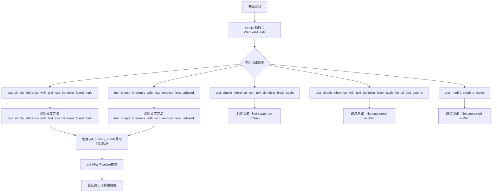
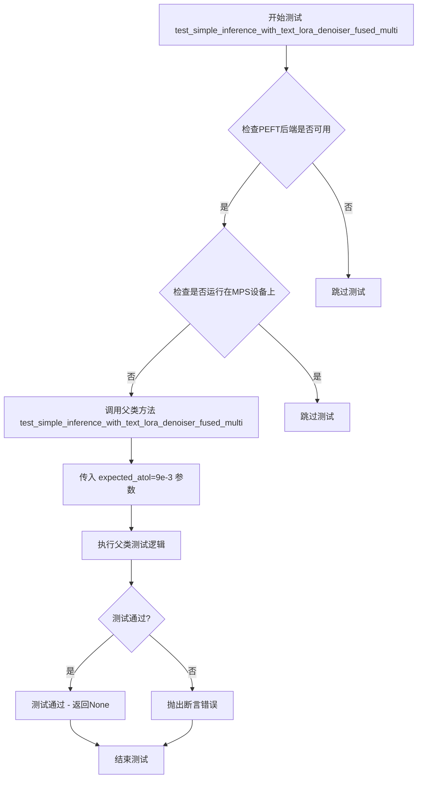
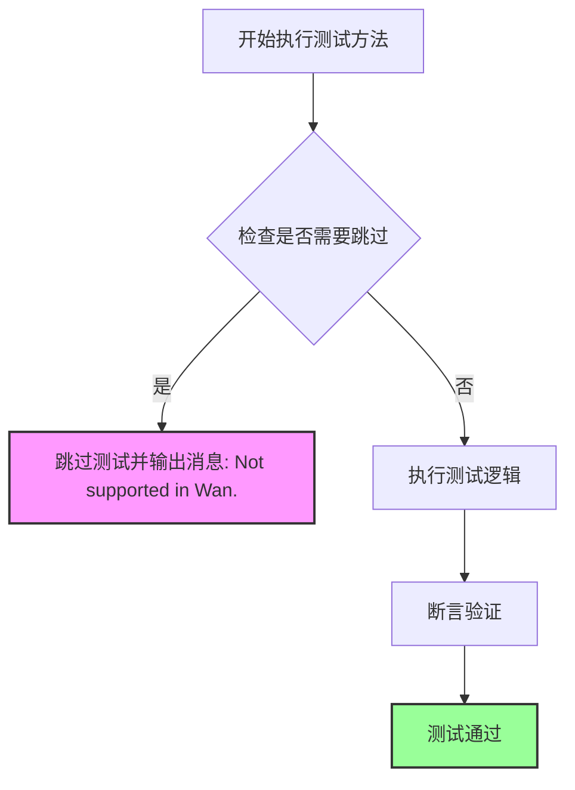
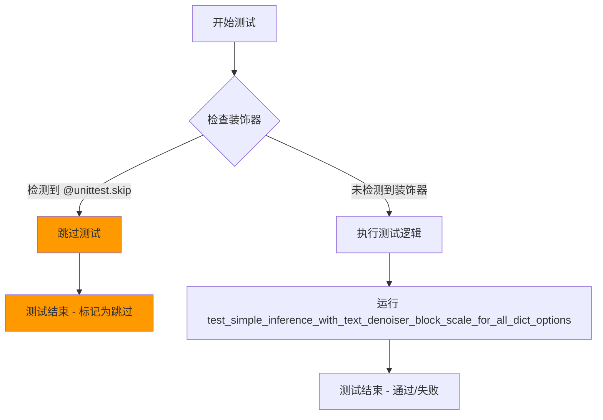
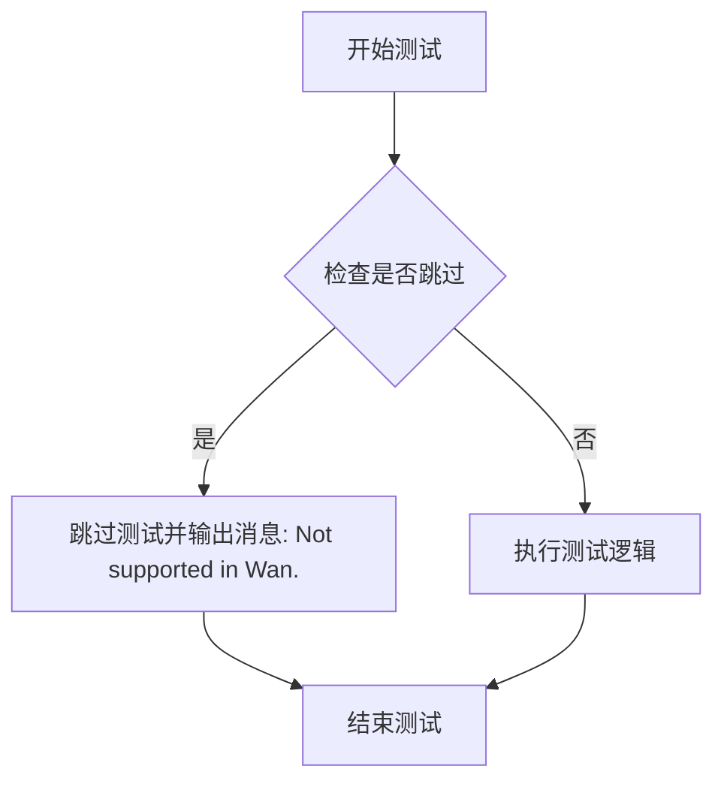

# `diffusers\tests\lora\test_lora_layers_wan.py` 详细设计文档

这是一个用于测试Wan模型LoRA（Low-Rank Adaptation）功能的单元测试文件，继承自PeftLoraLoaderMixinTests，测试了WanPipeline在文本和去噪器上的LoRA适配能力。

## 整体流程



## 类结构

```
WanLoRATests (单元测试类)
├── 继承: unittest.TestCase
├── 继承: PeftLoraLoaderMixinTests
└── 属性配置: pipeline_class, scheduler_cls, transformer_cls, vae_cls等
```

## 全局变量及字段


### `WanLoRATests.pipeline_class`
    
测试的管道类

类型：`type[WanPipeline]`
    


### `WanLoRATests.scheduler_cls`
    
调度器类

类型：`type[FlowMatchEulerDiscreteScheduler]`
    


### `WanLoRATests.scheduler_kwargs`
    
调度器参数

类型：`dict`
    


### `WanLoRATests.transformer_kwargs`
    
Transformer模型参数字典

类型：`dict`
    


### `WanLoRATests.transformer_cls`
    
Transformer模型类

类型：`type[WanTransformer3DModel]`
    


### `WanLoRATests.vae_kwargs`
    
VAE模型参数字典

类型：`dict`
    


### `WanLoRATests.vae_cls`
    
VAE模型类

类型：`type[AutoencoderKLWan]`
    


### `WanLoRATests.has_two_text_encoders`
    
是否有两个文本编码器

类型：`bool`
    


### `WanLoRATests.tokenizer_cls`
    
分词器类

类型：`type[AutoTokenizer]`
    


### `WanLoRATests.tokenizer_id`
    
分词器模型ID

类型：`str`
    


### `WanLoRATests.text_encoder_cls`
    
文本编码器类

类型：`type[T5EncoderModel]`
    


### `WanLoRATests.text_encoder_id`
    
文本编码器模型ID

类型：`str`
    


### `WanLoRATests.text_encoder_target_modules`
    
文本编码器目标模块

类型：`list`
    


### `WanLoRATests.supports_text_encoder_loras`
    
是否支持文本编码器LoRA

类型：`bool`
    


### `WanLoRATests.output_shape`
    
返回输出形状 (1, 9, 32, 32, 3)

类型：`property`
    


### `WanLoRATests.get_dummy_inputs`
    
获取虚拟输入数据用于测试

类型：`method`
    


### `WanLoRATests.test_simple_inference_with_text_lora_denoiser_fused_multi`
    
测试融合的文本LoRA去噪器推理

类型：`method`
    


### `WanLoRATests.test_simple_inference_with_text_denoiser_lora_unfused`
    
测试未融合的文本去噪器LoRA

类型：`method`
    


### `WanLoRATests.test_simple_inference_with_text_denoiser_block_scale`
    
跳过的测试 - 不支持

类型：`method`
    


### `WanLoRATests.test_simple_inference_with_text_denoiser_block_scale_for_all_dict_options`
    
跳过的测试 - 不支持

类型：`method`
    


### `WanLoRATests.test_modify_padding_mode`
    
跳过的测试 - 不支持

类型：`method`
    
    

## 全局函数及方法


### `WanLoRATests.output_shape`

描述：这是一个测试用例属性，用于定义 `WanLoRA` 管道推理后的预期输出张量形状。该形状对应于一个批量大小为 1、包含 9 帧、分辨率为 32x32、通道数为 3 (RGB) 的视频或图像张量，主要用于单元测试中验证模型输出的维度是否符合预期。

参数：

- `self`：`WanLoRATests`，调用此属性的类实例本身。

返回值：`Tuple[int, int, int, int, int]`，返回形状元组 `(1, 9, 32, 32, 3)`。其中各维度分别代表批量大小(Batch)、帧数(Frames)、高度(Height)、宽度(Width)和通道数(Channels)。

#### 流程图

```mermaid
flowchart TD
    A([Start]) --> B{访问 output_shape 属性}
    B --> C[读取类定义]
    C --> D[返回元组 (1, 9, 32, 32, 3)]
    D --> E([End])
```

#### 带注释源码

```python
@property
def output_shape(self):
    """
    定义测试期望的输出形状。

    形状含义: (batch_size, num_frames, height, width, channels)
    - batch_size: 1 (单样本测试)
    - num_frames: 9 (对应 get_dummy_inputs 中的 num_frames=9)
    - height: 32 (对应 get_dummy_inputs 中的 height=32)
    - width: 32 (对应 get_dummy_inputs 中的 width=32)
    - channels: 3 (RGB 通道)
    """
    return (1, 9, 32, 32, 3)
```


### `WanLoRATests.get_dummy_inputs`

该方法是 WanLoRA 测试类的辅助方法，用于生成虚拟（dummy）输入数据，供测试 WanPipeline 推理流程使用。它创建模拟的噪声张量、输入ID以及包含推理参数的字典，支持可选的随机生成器。

参数：

- `with_generator`：`bool`，指示是否在返回的 pipeline_inputs 字典中包含随机生成器

返回值：`tuple[torch.Tensor, torch.Tensor, dict]`，返回三元组 (noise, input_ids, pipeline_inputs)，其中 noise 是潜在空间的噪声张量，input_ids 是文本输入的token ID序列，pipeline_inputs 是包含推理参数（帧数、推理步数、引导scale、图像尺寸等）的字典

#### 流程图

```mermaid
flowchart TD
    A[开始 get_dummy_inputs] --> B[设置批量大小、序列长度等参数]
    B --> C[创建随机生成器 generator = torch.manual_seed]
    C --> D[生成噪声张量 floats_tensor]
    D --> E[生成输入ID张量 torch.randint]
    E --> F[构建 pipeline_inputs 字典]
    F --> G{with_generator?}
    G -->|True| H[向 pipeline_inputs 添加 generator]
    G -->|False| I[跳过添加 generator]
    H --> J[返回 (noise, input_ids, pipeline_inputs)]
    I --> J
```

#### 带注释源码

```python
def get_dummy_inputs(self, with_generator=True):
    """
    获取虚拟输入数据用于测试
    
    参数:
        with_generator: bool, 是否在返回的输入中包含生成器
        
    返回:
        tuple: (noise, input_ids, pipeline_inputs)
            - noise: torch.Tensor, 形状为 (batch_size, num_latent_frames, num_channels, 4, 4)
            - input_ids: torch.Tensor, 形状为 (batch_size, sequence_length)
            - pipeline_inputs: dict, 包含推理参数的字典
    """
    # 定义测试用的基础参数
    batch_size = 1  # 批量大小
    sequence_length = 16  # 文本序列长度
    num_channels = 4  # 潜在空间通道数
    num_frames = 9  # 输入视频帧数
    num_latent_frames = 3  # 潜在帧数 = (num_frames - 1) // temporal_compression_ratio + 1
    sizes = (4, 4)  # 空间维度大小

    # 创建随机生成器，固定种子以确保测试可复现
    generator = torch.manual_seed(0)
    
    # 生成噪声张量，形状: (1, 3, 4, 4, 4)
    noise = floats_tensor((batch_size, num_latent_frames, num_channels) + sizes)
    
    # 生成随机输入ID，范围 [1, sequence_length)，形状: (1, 16)
    input_ids = torch.randint(1, sequence_length, size=(batch_size, sequence_length), generator=generator)

    # 构建 pipeline 所需的输入参数字典
    pipeline_inputs = {
        "prompt": "",  # 提示词（空字符串）
        "num_frames": num_frames,  # 视频帧数
        "num_inference_steps": 1,  # 推理步数
        "guidance_scale": 6.0,  # CFG 引导强度
        "height": 32,  # 输出图像高度
        "width": 32,  # 输出图像宽度
        "max_sequence_length": sequence_length,  # 最大序列长度
        "output_type": "np",  # 输出类型为 numpy 数组
    }
    
    # 如果需要包含生成器，则添加到 pipeline_inputs 中
    if with_generator:
        pipeline_inputs.update({"generator": generator})

    # 返回噪声、输入ID和 pipeline 参数三元组
    return noise, input_ids, pipeline_inputs
```


### `WanLoRATests.test_simple_inference_with_text_lora_denoiser_fused_multi`

这是一个单元测试方法，用于测试融合的文本LoRA去噪器推理功能。该方法调用父类 `PeftLoraLoaderMixinTests` 的同名测试方法，验证多文本编码器与LoRA去噪器融合推理的正确性，并设置绝对误差容限为 9e-3。

参数：

- 该方法无显式参数（通过 `super()` 调用父类方法，传入 `expected_atol=9e-3` 作为预期绝对误差容限）

返回值：`None`，因为这是一个测试方法，不返回任何值

#### 流程图



#### 带注释源码

```python
def test_simple_inference_with_text_lora_denoiser_fused_multi(self):
    """
    测试融合的文本LoRA去噪器推理功能。
    
    该测试方法继承自PeftLoraLoaderMixinTests，用于验证WanPipeline在融合
    文本LoRA去噪器情况下的推理功能是否正常。测试通过比较融合前后的
    推理结果与预期值的绝对误差是否在容限范围内来判断测试是否通过。
    
    参数:
        无显式参数（通过super调用父类方法）
        
    返回值:
        None - 这是一个测试方法，不返回任何值
        
    异常:
        AssertionError - 如果测试失败（绝对误差超过expected_atol）
    """
    # 调用父类PeftLoraLoaderMixinTests的同名测试方法
    # expected_atol=9e-3 设置了绝对误差容限为0.009
    # 这意味着测试允许融合推理结果与预期值之间存在最大0.9%的误差
    super().test_simple_inference_with_text_lora_denoiser_fused_multi(expected_atol=9e-3)
```


### `WanLoRATests.test_simple_inference_with_text_denoiser_lora_unfused`

该方法是一个单元测试，用于测试 WanPipeline 在未融合文本去噪器 LoRA 权重情况下的推理功能是否正常，通过调用父类测试方法并指定绝对容差值来验证输出精度。

参数：

- `self`：隐式参数，`WanLoRATests` 类实例本身，无需显式传递
- `expected_atol`：类型 `float`，通过 `super()` 调用传递，实际值为 `9e-3`（即 0.009），用于验证测试输出与预期值之间的绝对误差容忍度

返回值：`None`，该方法为 `unittest.TestCase` 测试方法，执行测试用例但不返回具体值，测试结果通过断言机制体现

#### 流程图

```mermaid
flowchart TD
    A[Test Method Start] --> B[Call super().test_simple_inference_with_text_denoiser_lora_unfused<br/>with expected_atol=9e-3]
    B --> C[Parent Test Method Executes]
    C --> D1[Initialize dummy inputs<br/>batch_size=1, num_frames=9<br/>height=32, width=32]
    D1 --> D2[Create pipeline with default settings<br/>WanPipeline with WanTransformer3DModel<br/>AutoencoderKLWan]
    D2 --> D3[Load unfused text denoiser LoRA weights<br/>Adapter weights loaded but not fused]
    D3 --> D4[Run pipeline inference<br/>num_inference_steps=1<br/>guidance_scale=6.0]
    D4 --> D5[Extract output latent/tensor]
    D5 --> D6[Verify output shape matches<br/>(1, 9, 32, 32, 3)]
    D6 --> D7[Verify output dtype and values<br/>within atol=9e-3 tolerance]
    D7 --> E{Test Passed?}
    E -->|Yes| F[Return None<br/>Test passes silently]
    E -->|No| G[Raise AssertionError<br/>Test fails]
```

#### 带注释源码

```python
def test_simple_inference_with_text_denoiser_lora_unfused(self):
    """
    Test inference with text denoiser LoRA in unfused state.
    
    This test verifies that the WanPipeline can perform inference correctly
    when text denoiser LoRA adapters are loaded but not fused into the model
    weights. The test delegates to the parent class (PeftLoraLoaderMixinTests)
    which contains the actual test logic.
    
    Args:
        self: WanLoRATests instance containing pipeline configuration
              (pipeline_class, transformer_cls, vae_cls, etc.)
    
    Returns:
        None: Test method, results via assertions
    
    Testing approach:
        - Parent class test method handles:
          1. Creating dummy inputs (noise, input_ids, pipeline_params)
          2. Instantiating WanPipeline with configured components
          3. Loading LoRA adapters in unfused mode
          4. Running inference pipeline
          5. Validating output shape and numerical accuracy
    """
    # Delegate to parent class test implementation
    # The parent class PeftLoraLoaderMixinTests provides the actual test logic
    # This child class only configures the tolerance threshold
    super().test_simple_inference_with_text_denoiser_lora_unfused(expected_atol=9e-3)
    
    # Expected behavior:
    # - Pipeline loads text denoiser LoRA weights as separate adapters
    # - During inference, LoRA weights are applied but NOT fused into model weights
    # - Output should match expected values within absolute tolerance of 9e-3
    # - Output shape expected: (1, 9, 32, 32, 3) - (batch, frames, height, width, channels)
```


### `WanLoRATests.test_simple_inference_with_text_denoiser_block_scale`

该方法是一个被跳过的单元测试，用于测试文本去噪器的块缩放功能（block scale），但由于Wan框架不支持此功能，因此该测试被标记为跳过。

参数：

- `self`：实例方法的标准参数，表示测试类实例本身，无需额外描述

返回值：`None`，该方法没有返回值，仅包含`pass`语句

#### 流程图



#### 带注释源码

```python
@unittest.skip("Not supported in Wan.")
def test_simple_inference_with_text_denoiser_block_scale(self):
    """
    测试文本去噪器的简单推理与块缩放功能。
    
    该测试方法用于验证WanTransformer3DModel在应用LoRA权重后
    是否支持text denoiser block scale功能。由于Wan框架当前
    不支持此功能，因此使用@unittest.skip装饰器跳过该测试。
    
    继承自父类PeftLoraLoaderMixinTests的测试方法，
    但在WanLoRATests中被覆盖并跳过。
    """
    pass  # 方法体为空，测试被跳过
```


### `WanLoRATests.test_simple_inference_with_text_denoiser_block_scale_for_all_dict_options`

该方法是 WanLoRATests 测试类中的一个测试方法，用于测试文本去噪器块缩放功能的所有字典选项。由于 Wan 不支持此功能，该测试被显式跳过（标记为 Not supported in Wan）。

参数：

- `self`：隐式参数，`WanLoRATests` 实例本身，无需额外描述

返回值：无返回值（方法体为 `pass`，表示不执行任何操作）

#### 流程图



#### 带注释源码

```python
@unittest.skip("Not supported in Wan.")
def test_simple_inference_with_text_denoiser_block_scale_for_all_dict_options(self):
    pass
```

**源码解析：**

- `@unittest.skip("Not supported in Wan.")`：这是 Python unittest 框架的跳过装饰器，表示该测试用例被显式跳过，原因是在 Wan 框架中不支持此功能。
- `def test_simple_inference_with_text_denoiser_block_scale_for_all_dict_options(self):`：定义测试方法，方法名表明该测试用于验证文本去噪器块缩放功能在所有字典选项下的推理行为。
- `pass`：空方法体，表示该测试不执行任何实际操作，仅作为占位符存在。


### `WanLoRATests.test_modify_padding_mode`

这是一个被跳过的测试方法，用于测试修改padding模式的功能，但由于Wan不支持该功能，所以该测试被跳过。

参数：无

返回值：无

#### 流程图



#### 带注释源码

```python
@unittest.skip("Not supported in Wan.")  # 装饰器：跳过该测试，原因是不支持Wan的padding mode修改
def test_modify_padding_mode(self):
    """
    测试修改padding模式的功能。
    
    该测试方法用于验证WanLoRA是否能支持修改transformer的padding模式。
    由于Wan模型不支持此功能，因此该测试被跳过。
    """
    pass  # 方法体为空，因为测试被跳过
```

## 关键组件


### WanLoRATests

这是Wan模型的LoRA测试类，继承自unittest.TestCase和PeftLoraLoaderMixinTests，用于测试Wan模型的LoRA（Low-Rank Adaptation）功能是否正常工作。

### WanPipeline

Wan管道类，是该测试的目标管道，用于运行Wan模型的推理流程。

### FlowMatchEulerDiscreteScheduler

流匹配欧拉离散调度器，用于扩散模型的噪声调度。

### WanTransformer3DModel

Wan 3D变换器模型类，是核心的扩散变换器模型，包含3D空间处理能力。

### AutoencoderKLWan

Wan的变分自编码器（VAE）模型，用于潜在空间的编码和解码。

### text_encoder_target_modules

文本编码器的目标模块列表，包含["q", "k", "v", "o"]，指定了LoRA适配的注意力机制部分。

### get_dummy_inputs

获取虚拟测试输入的方法，生成噪声、输入ID和管道参数字典，用于测试推理流程。

### test_simple_inference_with_text_lora_denoiser_fused_multi

测试方法，验证融合多模块LoRA的文本去噪器推理功能，期望精度为9e-3。

### test_simple_inference_with_text_denoiser_lora_unfused

测试方法，验证非融合模式下文本去噪器LoRA的推理功能，期望精度为9e-3。

### floats_tensor

测试工具函数，用于生成指定形状的浮点张量数据。

### transformer_kwargs

变换器模型的关键参数配置，包含patch_size、注意力头数、输入输出通道数等核心架构参数。

### vae_kwargs

VAE模型的参数配置，包含base_dim、z_dim、维度倍数等配置。

### has_two_text_encoders

布尔标志，指示是否支持两个文本编码器。

### supports_text_encoder_loras

布尔标志，指示是否支持文本编码器的LoRA适配。


## 问题及建议


### 已知问题

- **硬编码配置参数**：`transformer_kwargs`、`vae_kwargs` 等配置直接硬编码在类中，缺乏灵活性和可维护性
- **魔法数字缺乏注释**：如 `expected_atol=9e-3`、`num_latent_frames = 3` 等数值没有解释其来源或意义
- **多个测试被跳过**：`test_simple_inference_with_text_denoiser_block_scale`、`test_simple_inference_with_text_denoiser_block_scale_for_all_dict_options` 和 `test_modify_padding_mode` 三个测试被标记为"Not supported in Wan"，表明功能未实现
- **`sys.path.append(".")` 导入方式不规范**：使用 `sys.path.append(".")` 来导入本地模块不是最佳实践，应使用包导入机制
- **缺失资源清理**：测试类没有 `setUp`/`tearDown` 方法进行资源初始化和清理
- **`supports_text_encoder_loras = False`**：文本编码器 LoRA 功能明确不支持，但未说明原因或计划实现时间
- **重复的测试逻辑**：父类方法被调用但进行了微小的参数修改（`expected_atol=9e-3`），可能导致测试维护困难

### 优化建议

- 将配置参数提取到独立的配置文件或 fixture 中，提高可维护性
- 为所有魔法数字添加常量定义或注释说明其用途和来源
- 补充被跳过测试的文档，说明是否计划实现或作为技术债务处理
- 使用绝对导入或配置 `PYTHONPATH` 替代 `sys.path.append(".")`
- 添加适当的 `setUp` 方法进行测试环境初始化，添加 `tearDown` 方法进行资源释放
- 补充 `supports_text_encoder_loras` 相关文档，说明当前限制和未来计划
- 考虑使用 pytest fixture 复用测试数据生成逻辑，减少代码重复

## 其它


### 设计目标与约束

该测试类旨在验证WanPipeline在LoRA（Low-Rank Adaptation）场景下的功能正确性。设计目标包括：确保LoRA权重能够正确加载到WanTransformer3DModel中；验证文本编码器LoRA不被支持（supports_text_loras=False）；测试去噪器LoRA的融合（fused）和未融合（unfused）模式。约束条件：1）必须使用require_peft_backend装饰器，确保PEFT后端可用；2）跳过MPS设备测试（skip_mps）；3）部分功能如text_denoiser_block_scale和padding_mode在Wan模型中不支持，因此跳过相关测试。

### 错误处理与异常设计

测试类通过@unittest.skip装饰器跳过不支持的测试用例，避免因功能不兼容导致的测试失败。在测试方法中，使用super()调用父类方法执行实际测试，并通过expected_atol参数指定允许的绝对误差容限（9e-3），用于处理浮点数计算的精度问题。若PEFT后端不可用，@require_peft_backend装饰器将自动跳过整个测试类。测试过程中的异常主要通过unittest框架的标准断言机制进行捕获和处理。

### 数据流与状态机

测试数据流如下：1）get_dummy_inputs方法生成模拟输入：随机噪声tensor（形状为(1, 3, 4, 4, 4)）、输入ID序列（形状为(1, 16)）、管道参数字典；2）测试方法调用父类的测试逻辑，父类使用这些输入构造WanPipeline；3）管道内部流程：加载VAE（AutoencoderKLWan）、transformer（WanTransformer3DModel）、tokenizer和text_encoder（T5EncoderModel）；4）执行推理后，验证输出形状是否为(1, 9, 32, 32, 3)。状态转换：初始化状态→加载模型状态→推理状态→验证状态。

### 外部依赖与接口契约

主要依赖：1）torch - 张量计算和随机数生成；2）transformers库 - AutoTokenizer和T5EncoderModel；3）diffusers库 - AutoencoderKLWan、FlowMatchEulerDiscreteScheduler、WanPipeline、WanTransformer3DModel；4）内部模块 - ..testing_utils（floats_tensor、require_peft_backend、skip_mps）和.utils（PeftLoraLoaderMixinTests）。接口契约：pipeline_class必须实现LoRA加载接口；scheduler_cls必须与pipeline兼容；transformer_cls和vae_cls必须具有指定的构造函数参数。

### 配置与参数说明

关键配置参数：1）transformer_kwargs包含patch_size=(1,2,2)、num_attention_heads=2、attention_head_dim=12等transformer架构参数；2）vae_kwargs包含base_dim=3、z_dim=16、dim_mult=[1,1,1,1]等VAE参数；3）text_encoder_target_modules=["q","k","v","o"]指定LoRA应用的目标模块；4）has_two_text_encoders=True表示使用双文本编码器架构；5）supports_text_loras=False明确禁用文本编码器LoRA。

### 测试场景与覆盖范围

测试覆盖场景：1）test_simple_inference_with_text_lora_denoiser_fused_multi - 测试去噪器LoRA融合多模块场景；2）test_simple_inference_with_text_denoiser_lora_unfused - 测试去噪器LoRA未融合场景。跳过场景：text_denoiser_block_scale、text_denoiser_block_scale_for_all_dict_options、modify_padding_mode。输出验证：检查输出形状为(1, 9, 32, 32, 3)，对应批次大小1、帧数9、宽高32、通道数3。

### 性能指标与基准

测试使用expected_atol=9e-3作为推理结果精度基准，允许融合与未融合模式之间存在一定的数值差异。测试环境：CPU推理，单步推理（num_inference_steps=1），固定随机种子（torch.manual_seed(0)）确保可复现性。性能基准主要关注LoRA加载和推理的正确性，而非推理速度。

### 版本兼容性与迁移

代码基于Apache License 2.0，使用HuggingFace diffusers库。版本兼容性要求：1）Python 3.8+；2）torch 2.0+；3）transformers 4.30+；4）diffusers 0.20+。随着diffusers库更新，WanPipeline和WanTransformer3DModel的接口可能变化，测试参数（如transformer_kwargs和vae_kwargs）需要相应调整。PEFT库版本需支持LoRA功能。

    