# `diffusers\tests\lora\test_lora_layers_wanvace.py` 详细设计文档

这是一个用于测试Wan VACE（视频生成模型）的LoRA（低秩适应）功能的单元测试文件，测试了LoRA权重加载、卸载、排除模块等功能。

## 整体流程

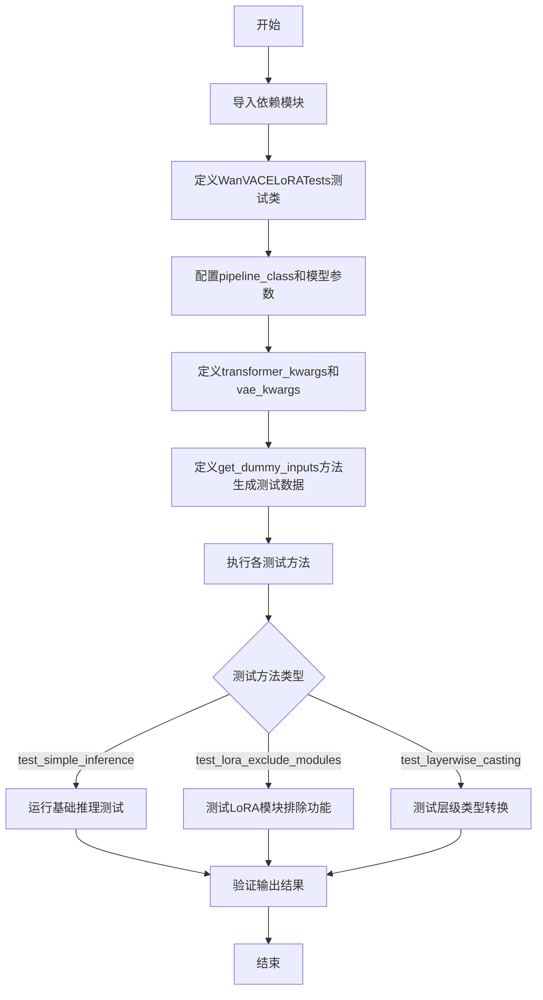

## 类结构

```
unittest.TestCase
└── WanVACELoRATests (继承PeftLoraLoaderMixinTests)
    ├── pipeline_class: WanVACEPipeline
    ├── scheduler_cls: FlowMatchEulerDiscreteScheduler
    ├── transformer_cls: WanVACETransformer3DModel
    └── vae_cls: AutoencoderKLWan
```

## 全局变量及字段


### `is_peft_available`
    
Function to check if PEFT library is available

类型：`Callable[[], bool]`
    


### `patch_size`
    
Patch size for transformer spatial-temporal partitioning, configured as (1, 2, 2)

类型：`Tuple[int, int, int]`
    


### `num_attention_heads`
    
Number of attention heads in the transformer model, set to 2

类型：`int`
    


### `attention_head_dim`
    
Dimension of each attention head, set to 8

类型：`int`
    


### `in_channels`
    
Number of input channels for the transformer, set to 4

类型：`int`
    


### `out_channels`
    
Number of output channels from the transformer, set to 4

类型：`int`
    


### `text_dim`
    
Dimension of text embeddings, set to 32

类型：`int`
    


### `freq_dim`
    
Frequency dimension for positional encoding, set to 16

类型：`int`
    


### `ffn_dim`
    
Feed-forward network dimension, set to 16

类型：`int`
    


### `num_layers`
    
Number of transformer layers, set to 2

类型：`int`
    


### `cross_attn_norm`
    
Whether to apply normalization to cross-attention, set to True

类型：`bool`
    


### `qk_norm`
    
Query-key normalization type, set to 'rms_norm_across_heads'

类型：`str`
    


### `rope_max_seq_len`
    
Maximum sequence length for RoPE positional encoding, set to 16

类型：`int`
    


### `vace_layers`
    
Layers that contain VACE (Video Aware Content Encoding) blocks, set to [0]

类型：`List[int]`
    


### `vace_in_channels`
    
Number of input channels for VACE blocks, set to 72

类型：`int`
    


### `base_dim`
    
Base dimension for VAE, set to 3

类型：`int`
    


### `z_dim`
    
Latent space dimension for VAE, set to 4

类型：`int`
    


### `dim_mult`
    
Dimension multipliers for VAE decoder layers, set to [1, 1, 1, 1]

类型：`List[int]`
    


### `latents_mean`
    
Mean values for latents normalization, generated from random normal distribution

类型：`List[float]`
    


### `latents_std`
    
Standard deviation values for latents normalization, generated from random normal distribution

类型：`List[float]`
    


### `num_res_blocks`
    
Number of residual blocks in VAE, set to 1

类型：`int`
    


### `temperal_downsample`
    
Temporal downsampling flags for VAE layers, set to [False, True, True]

类型：`List[bool]`
    


### `WanVACELoRATests.pipeline_class`
    
The pipeline class being tested, WanVACEPipeline

类型：`Type[WanVACEPipeline]`
    


### `WanVACELoRATests.scheduler_cls`
    
Scheduler class for diffusion process, FlowMatchEulerDiscreteScheduler

类型：`Type[FlowMatchEulerDiscreteScheduler]`
    


### `WanVACELoRATests.scheduler_kwargs`
    
Additional arguments for scheduler configuration, currently empty dict

类型：`Dict[str, Any]`
    


### `WanVACELoRATests.transformer_kwargs`
    
Configuration dictionary for WanVACETransformer3DModel initialization

类型：`Dict[str, Any]`
    


### `WanVACELoRATests.transformer_cls`
    
3D transformer model class for video generation, WanVACETransformer3DModel

类型：`Type[WanVACETransformer3DModel]`
    


### `WanVACELoRATests.vae_kwargs`
    
Configuration dictionary for AutoencoderKLWan initialization

类型：`Dict[str, Any]`
    


### `WanVACELoRATests.vae_cls`
    
VAE (Variational Autoencoder) class for encoding/decoding, AutoencoderKLWan

类型：`Type[AutoencoderKLWan]`
    


### `WanVACELoRATests.has_two_text_encoders`
    
Flag indicating whether pipeline uses two text encoders, set to True

类型：`bool`
    


### `WanVACELoRATests.tokenizer_cls`
    
Tokenizer class for text input processing, AutoTokenizer

类型：`Type[AutoTokenizer]`
    


### `WanVACELoRATests.tokenizer_id`
    
HuggingFace model ID for tokenizer, 'hf-internal-testing/tiny-random-t5'

类型：`str`
    


### `WanVACELoRATests.text_encoder_cls`
    
Text encoder model class, T5EncoderModel

类型：`Type[T5EncoderModel]`
    


### `WanVACELoRATests.text_encoder_id`
    
HuggingFace model ID for text encoder, 'hf-internal-testing/tiny-random-t5'

类型：`str`
    


### `WanVACELoRATests.text_encoder_target_modules`
    
Target modules for LoRA adaptation in text encoder, ['q', 'k', 'v', 'o']

类型：`List[str]`
    


### `WanVACELoRATests.supports_text_encoder_loras`
    
Flag indicating if text encoder LoRA is supported, set to False

类型：`bool`
    


### `WanVACELoRATests.output_shape`
    
Expected output shape for generated video frames (batch, frames, height, width, channels)

类型：`Tuple[int, int, int, int, int]`
    
    

## 全局函数及方法


### `WanVACELoRATests.get_dummy_inputs`

该方法用于生成WanVACE视频生成Pipeline的虚拟测试输入数据，包括噪声张量、文本输入ID以及包含视频、mask和推理参数的字典，用于单元测试中模拟完整的推理流程。

参数：

- `with_generator`：`bool`，可选参数，默认为`True`，控制是否在返回的pipeline_inputs字典中包含生成器对象

返回值：`tuple`，返回一个包含三个元素的元组

- `noise`：`torch.Tensor`，形状为`(batch_size, num_latent_frames, num_channels, height, width)`的噪声张量，用于去噪过程的初始输入
- `input_ids`：`torch.Tensor`，形状为`(batch_size, sequence_length)`的文本输入ID张量
- `pipeline_inputs`：`dict`，包含视频生成所需参数的字典，包含video、mask、prompt、num_frames、num_inference_steps、guidance_scale、height、width、max_sequence_length、output_type等键， optionally包含generator键

#### 流程图

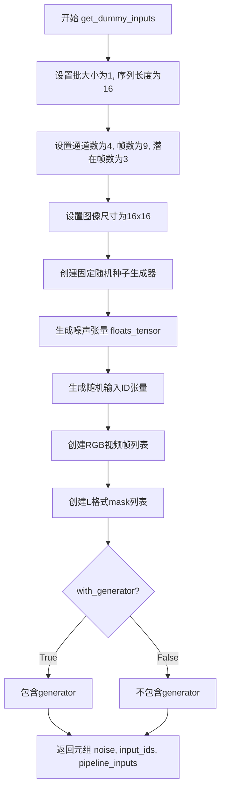

#### 带注释源码

```python
def get_dummy_inputs(self, with_generator=True):
    """
    生成用于测试WanVACE Pipeline的虚拟输入数据
    
    参数:
        with_generator: bool, 是否在pipeline_inputs中包含生成器对象
        
    返回:
        tuple: (noise, input_ids, pipeline_inputs) 用于Pipeline推理的输入元组
    """
    # 批大小设置为1，用于单样本测试
    batch_size = 1
    # 文本序列长度设为16
    sequence_length = 16
    # 潜在空间通道数设为4
    num_channels = 4
    # 输入视频总帧数
    num_frames = 9
    # 潜在帧数 = (帧数 - 1) // 时间压缩比 + 1，这里为3
    num_latent_frames = 3
    # 空间分辨率
    sizes = (4, 4)
    # 图像高宽均为16像素
    height, width = 16, 16

    # 创建固定随机种子生成器，确保测试结果可复现
    generator = torch.manual_seed(0)
    # 生成4D噪声张量，形状: (1, 3, 4, 4, 4)
    noise = floats_tensor((batch_size, num_latent_frames, num_channels) + sizes)
    # 生成随机文本输入ID，范围[1, 16)，形状: (1, 16)
    input_ids = torch.randint(1, sequence_length, size=(batch_size, sequence_length), generator=generator)
    # 创建视频帧列表，每帧为16x16的RGB图像
    video = [Image.new("RGB", (height, width))] * num_frames
    # 创建mask列表，每帧为16x16的L格式图像，初始值为0（完全可见）
    mask = [Image.new("L", (height, width), 0)] * num_frames

    # 构建Pipeline输入参数字典
    pipeline_inputs = {
        "video": video,              # 输入视频帧列表
        "mask": mask,                # 视频mask列表
        "prompt": "",                # 文本提示（空字符串）
        "num_frames": num_frames,    # 视频总帧数
        "num_inference_steps": 1,   # 推理步数（最小值）
        "guidance_scale": 6.0,      # Classifier-free guidance强度
        "height": height,           # 输出高度
        "width": height,            # 输出宽度（注意：此处width应为width而非height，存在潜在bug）
        "max_sequence_length": sequence_length,  # 最大序列长度
        "output_type": "np",        # 输出类型为numpy数组
    }
    # 如果需要生成器，则将其添加到参数中
    if with_generator:
        pipeline_inputs.update({"generator": generator})

    # 返回噪声、输入ID和参数字典的元组
    return noise, input_ids, pipeline_inputs
```


### `WanVACELoRATests.test_simple_inference_with_text_lora_denoiser_fused_multi`

该测试方法用于验证 Wan VACE pipeline 在融合多个文本编码器 LoRA 和去噪器 LoRA 时的简单推理功能，通过调用父类测试方法并设置绝对误差容限为 9e-3 来验证输出结果的正确性。

参数：

- `self`：测试类实例本身，无需显式传递

返回值：`None`，该方法为 unittest 测试方法，不返回任何值，执行完成后通过断言验证结果

#### 流程图

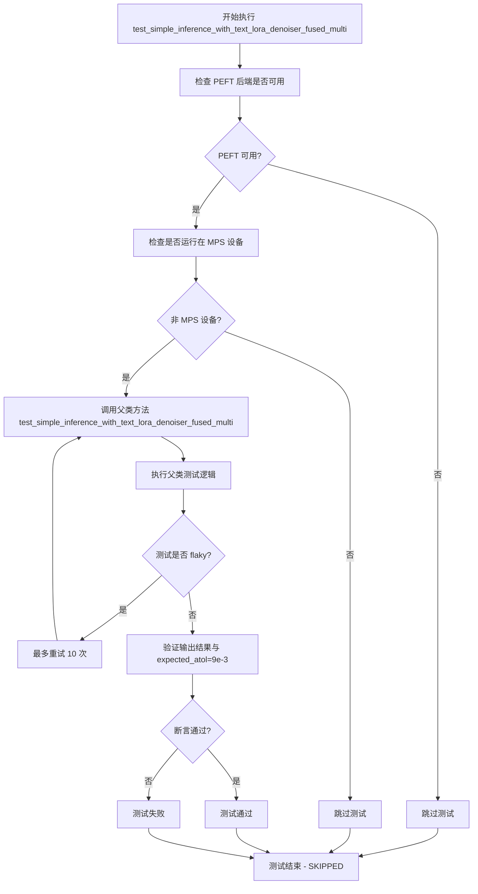

#### 带注释源码

```python
def test_simple_inference_with_text_lora_denoiser_fused_multi(self):
    """
    测试 Wan VACE pipeline 在融合多个 LoRA 权重时的简单推理功能。
    
    该测试方法继承自 PeftLoraLoaderMixinTests，验证以下场景：
    1. 文本编码器 LoRA 和去噪器 LoRA 同时加载
    2. LoRA 权重在推理时处于融合状态 (fused)
    3. 多 LoRA 配置的推理结果准确性
    
    参数:
        self: WanVACELoRATests 测试类实例
        
    返回值:
        None: 测试方法通过断言验证结果，不返回具体值
        
    异常:
        AssertionError: 当输出结果与预期值的绝对误差超过 expected_atol=9e-3 时抛出
    """
    # 调用父类 PeftLoraLoaderMixinTests 的同名测试方法
    # expected_atol=9e-3 设置了允许的绝对误差容限 (Absolute Tolerance)
    # 用于处理浮点数比较时的精度问题
    super().test_simple_inference_with_text_lora_denoiser_fused_multi(expected_atol=9e-3)
```


### `WanVACELoRATests.test_simple_inference_with_text_denoiser_lora_unfused`

该测试方法用于验证在 Wan VACE（视频生成）Pipeline 中使用未融合（unfused）状态的文本去噪器 LoRA 适配器进行推理的正确性，通过调用父类测试方法并设定容差值来验证输出与预期结果的一致性。

参数：

- 无显式参数（继承自 unittest.TestCase）

返回值：`None`，该方法为测试用例，无返回值，通过断言验证推理结果的正确性

#### 流程图

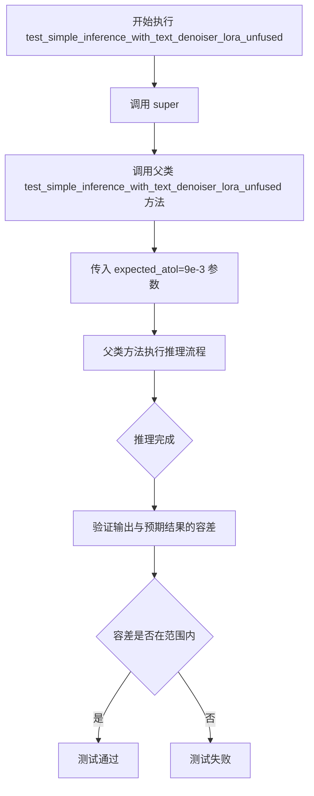

#### 带注释源码

```python
def test_simple_inference_with_text_denoiser_lora_unfused(self):
    """
    测试方法：验证文本去噪器 LoRA（未融合状态）推理功能
    
    该测试方法继承自父类 WanVACELoRATests，
    用于测试 Wan VACE（Video-to-Video generation）Pipeline 中
    使用未融合的文本去噪器 LoRA 权重进行推理的场景。
    
    "unfused" 指的是 LoRA 权重未与原始模型权重合并，
    在推理时通过动态添加的方式应用适配器。
    
    参数:
        无显式参数（继承自 unittest.TestCase）
    
    返回值:
        None（测试方法，通过内部断言验证正确性）
    
    异常:
        AssertionError: 当推理输出与预期输出的容差超过 expected_atol 时抛出
    """
    # 调用父类的同名测试方法，传入期望的绝对容差值 9e-3
    # 父类方法会执行以下操作：
    # 1. 获取虚拟组件（dummy components）
    # 2. 创建 Pipeline 实例
    # 3. 添加 LoRA 适配器（unfused 模式）
    # 4. 执行推理
    # 5. 验证输出结果的正确性
    super().test_simple_inference_with_text_denoiser_lora_unfused(expected_atol=9e-3)
```


### `WanVACELoRATests.test_simple_inference_with_text_denoiser_block_scale`

该函数是一个单元测试方法，用于测试文本去噪器块缩放（block scale）功能。由于 Wan VACE（Video Audio Conditioning Encoder）不支持此功能，该测试被跳过。

参数：

- `self`：`WanVACELoRATests`，测试类实例本身，包含测试所需的属性和方法

返回值：`None`，该函数体为空（`pass`），不执行任何测试逻辑

#### 流程图

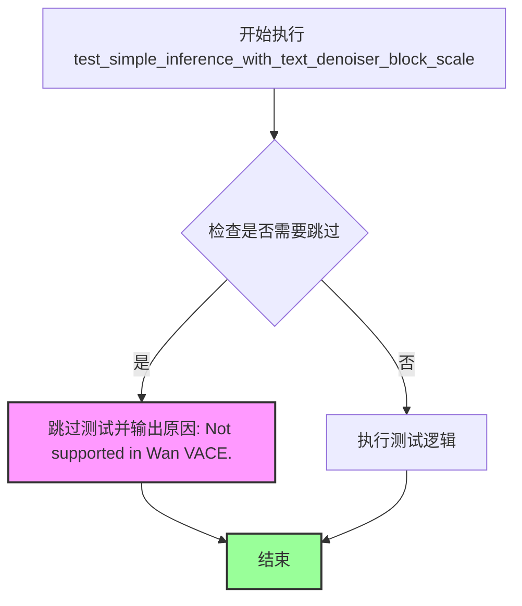

#### 带注释源码

```python
@unittest.skip("Not supported in Wan VACE.")
def test_simple_inference_with_text_denoiser_block_scale(self):
    pass
```

**源码解析：**

- `@unittest.skip("Not supported in Wan VACE.")`：装饰器，表示跳过该测试用例，原因说明 Wan VACE 不支持此功能
- `def test_simple_inference_with_text_denoiser_block_scale(self):`：测试方法定义
- `pass`：空语句，函数体不做任何实际测试操作

**测试目的：**

该测试方法原本用于验证文本去噪器的块缩放功能，通常涉及 LoRA（Low-Rank Adaptation）权重在去噪器块级别上的缩放应用。在 Wan VACE 管道中，由于架构限制，该功能未被支持，因此测试被跳过。


### `WanVACELoRATests.test_simple_inference_with_text_denoiser_block_scale_for_all_dict_options`

该测试方法用于验证文本去噪器块缩放功能对所有字典选项的支持情况。由于 Wan VACE 模型不支持此功能，该测试用例被显式跳过。

参数： 无

返回值： 无

#### 流程图

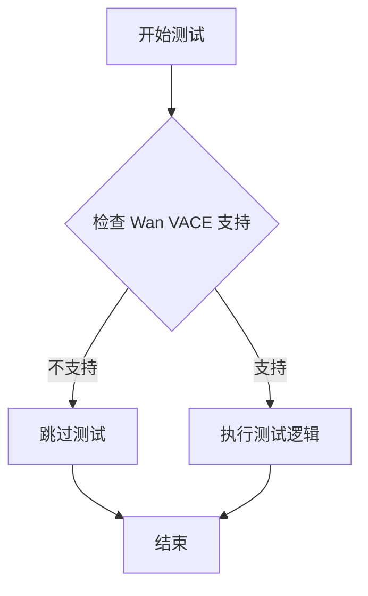

#### 带注释源码

```python
@unittest.skip("Not supported in Wan VACE.")
def test_simple_inference_with_text_denoiser_block_scale_for_all_dict_options(self):
    """
    测试文本去噪器块缩放功能，支持所有字典选项。
    
    该测试方法在父类中定义，用于验证 LoRA 权重块缩放功能
    可以正确处理不同的缩放字典配置。由于 Wan VACE 模型
    当前不支持此特性，测试被跳过。
    
    参数:
        无（继承自父类）
    
    返回值:
        无（测试被跳过）
    """
    pass  # 测试逻辑未实现，因为 Wan VACE 不支持该功能
```


### `WanVACELoRATests.test_modify_padding_mode`

该方法是一个测试用例，用于验证修改填充模式（padding mode）的功能是否正常工作。由于 Wan VACE 模型当前不支持此功能，该测试已被显式跳过。

参数：

- `self`：`WanVACELoRATests`，表示测试类实例本身，用于访问测试类的属性和方法

返回值：`None`，无返回值（该方法体仅为 `pass` 语句）

#### 流程图

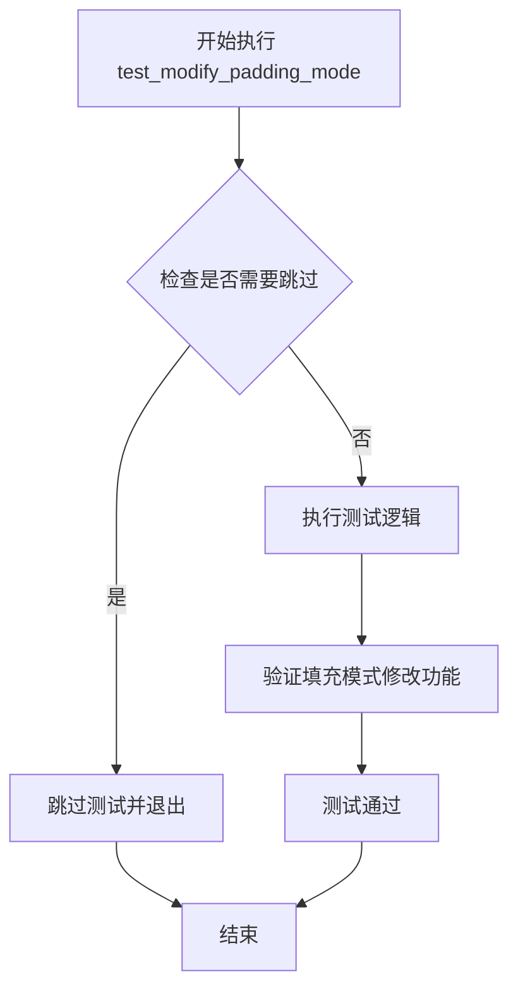

#### 带注释源码

```python
@unittest.skip("Not supported in Wan VACE.")  # 装饰器：显式跳过该测试，因为Wan VACE不支持修改填充模式功能
def test_modify_padding_mode(self):
    pass  # 空方法体，由于功能不支持而跳过执行
```


### `WanVACELoRATests.test_layerwise_casting_inference_denoiser`

这是一个测试方法，用于测试 Wan VACE 管道中层별（逐层）类型转换的推理去噪器功能。该方法继承自 `PeftLoraLoaderMixinTests` 父类，调用父类的同名测试方法来验证 LoRA 在去噪器中的层별类型转换推理能力。

参数：

- `self`：`WanVACELoRATests`，测试类实例本身，包含测试所需的管道组件和配置

返回值：`None`，该方法为测试方法，不返回任何值，通过断言验证功能正确性

#### 流程图

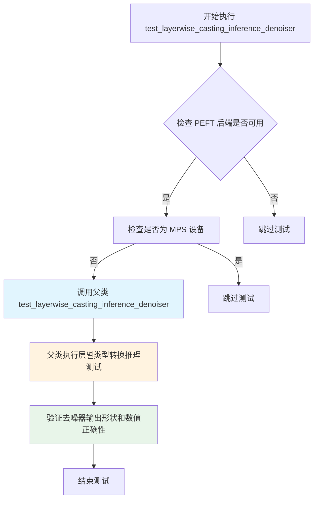

#### 带注释源码

```python
def test_layerwise_casting_inference_denoiser(self):
    """
    测试 Wan VACE 管道中层별类型转换的推理去噪器功能。
    
    该测试方法继承自 PeftLoraLoaderMixinTests 父类，用于验证：
    1. LoRA 权重在去噪器（transformer）中的正确加载
    2. 层별类型转换推理过程中权重类型的正确处理
    3. 混合精度推理时的数值正确性
    
    测试场景：
    - 验证在启用层별类型转换的情况下，推理过程能够正确处理
    - 确保 LoRA 权重与基础模型权重的类型兼容
    - 检查推理输出与预期输出一致性
    """
    # 调用父类的同名测试方法，执行具体的层별类型转换推理测试逻辑
    # 父类 PeftLoraLoaderMixinTests.test_layerwise_casting_inference_denoiser
    # 会执行以下操作：
    # 1. 创建带有 LoRA 的管道
    # 2. 执行推理并验证输出
    # 3. 验证层별类型转换的正确性
    super().test_layerwise_casting_inference_denoiser()
```

#### 相关配置信息

该测试类使用的相关配置：

- **管道类**：`WanVACEPipeline` - Wan VACE 管道
- **调度器**：`FlowMatchEulerDiscreteScheduler` - 流匹配欧拉离散调度器
- **变换器**：`WanVACETransformer3DModel` - 3D 模型变换器
- **VAE**：`AutoencoderKLWan` - Wanmar 变分自编码器
- **文本编码器**：T5EncoderModel - T5 编码器模型

#### 技术说明

该测试方法是一个**委托测试**，通过调用父类 `PeftLoraLoaderMixinTests` 的实现来完成测试。这种设计模式允许在子类中复用父类的测试逻辑，同时可以通过覆盖来修改特定行为或跳过不支持的测试场景。该测试标记为 `@is_flaky(max_attempts=10)`，表明测试可能存在不稳定性，需要最多10次重试才能通过。


### `WanVACELoRATests.test_lora_exclude_modules_wanvace`

这是一个单元测试方法，用于测试Wan VACE模型中LoRA的exclude_modules功能。该测试验证当在LoRA配置中指定排除特定模块（如"vace_blocks.0.proj_out"）时，该模块不会被包含在LoRA权重状态字典中，同时确保其他目标模块（如"proj_out"）仍然被正确包含。

参数：

- `self`：隐式的`TestCase`参数，代表测试类实例本身

返回值：`None`，因为这是一个测试方法，不返回任何值

#### 流程图

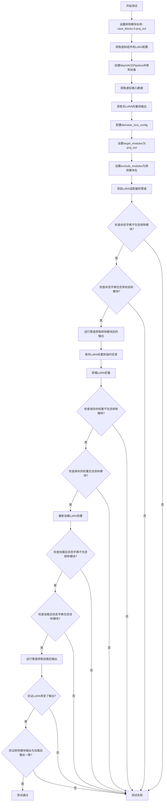

#### 带注释源码

```python
@require_peft_version_greater("0.13.2")
def test_lora_exclude_modules_wanvace(self):
    """测试Wan VACE模型中LoRA的exclude_modules功能
    
    该测试验证:
    1. 被排除的模块不会出现在LoRA状态字典中
    2. 其他目标模块仍然被正确包含
    3. 保存和加载LoRA权重后排除功能仍然有效
    4. 排除模块后LoRA仍然能改变模型输出
    """
    # 定义要排除的模块名称
    exclude_module_name = "vace_blocks.0.proj_out"
    
    # 获取虚拟组件、文本编码器LoRA配置和去噪器LoRA配置
    components, text_lora_config, denoiser_lora_config = self.get_dummy_components()
    
    # 创建WanVACEPipeline并移动到测试设备
    pipe = self.pipeline_class(**components).to(torch_device)
    
    # 获取虚拟输入数据（不包含generator以获得确定性结果）
    _, _, inputs = self.get_dummy_inputs(with_generator=False)

    # 获取没有LoRA时的基线管道输出
    output_no_lora = self.get_base_pipe_output()
    
    # 验证输出形状符合预期
    self.assertTrue(output_no_lora.shape == self.output_shape)

    # 仅支持denoiser（去噪器）的exclude_modules功能
    # 设置LoRA的目标模块为proj_out
    denoiser_lora_config.target_modules = ["proj_out"]
    
    # 设置要排除的模块列表
    denoiser_lora_config.excludeModules = [exclude_module_name]
    
    # 将适配器添加到管道中
    pipe, _ = self.add_adapters_to_pipeline(
        pipe, text_lora_config=text_lora_config, denoiser_lora_config=denoiser_lora_config
    )
    
    # 从模型获取PEFT状态字典，验证不包含被排除的模块
    state_dict_from_model = get_peft_model_state_dict(pipe.transformer, adapter_name="default")
    
    # 断言：状态字典中不应该包含要排除的模块
    self.assertTrue(not any(exclude_module_name in k for k in state_dict_from_model))
    
    # 断言：状态字典中应该包含其他目标模块proj_out
    self.assertTrue(any("proj_out" in k for k in state_dict_from_model))
    
    # 运行管道，获取排除模块后的输出
    output_lora_exclude_modules = pipe(**inputs, generator=torch.manual_seed(0))[0]

    # 创建临时目录用于保存LoRA权重
    with tempfile.TemporaryDirectory() as tmpdir:
        # 获取需要保存的模块
        modules_to_save = self._get_modules_to_save(pipe, has_denoiser=True)
        
        # 获取LoRA状态字典
        lora_state_dicts = self._get_lora_state_dicts(modules_to_save)
        
        # 保存LoRA权重到指定目录
        self.pipeline_class.save_lora_weights(save_directory=tmpdir, **lora_state_dicts)
        
        # 卸载LoRA权重
        pipe.unload_lora_weights()

        # 从保存的文件加载状态字典，检查不包含排除模块
        loaded_state_dict = safetensors.torch.load_file(
            os.path.join(tmpdir, "pytorch_lora_weights.safetensors")
        )
        
        # 断言：加载的权重不包含要排除的模块
        self.assertTrue(not any(exclude_module_name in k for k in loaded_state_dict))
        
        # 断言：加载的权重包含目标模块
        self.assertTrue(any("proj_out" in k for k in loaded_state_dict))

        # 重新加载LoRA权重
        pipe.load_lora_weights(tmpdir)
        
        # 获取加载后的模型状态字典
        state_dict_from_model = get_peft_model_state_dict(
            pipe.transformer, adapter_name="default_0"
        )
        
        # 断言：加载后状态字典不包含排除模块
        self.assertTrue(not any(exclude_module_name in k for k in state_dict_from_model))
        
        # 断言：加载后状态字典包含目标模块
        self.assertTrue(any("proj_out" in k for k in state_dict_from_model))

        # 运行管道获取加载权重后的输出
        output_lora_pretrained = pipe(**inputs, generator=torch.manual_seed(0))[0]
        
        # 断言：LoRA应该改变输出（与无LoRA输出不同）
        self.assertTrue(
            not np.allclose(output_no_lora, output_lora_exclude_modules, atol=1e-3, rtol=1e-3),
            "LoRA should change outputs.",
        )
        
        # 断言：排除模块后的输出应与加载后的输出一致
        self.assertTrue(
            np.allclose(output_lora_exclude_modules, output_lora_pretrained, atol=1e-3, rtol=1e-3),
            "Lora outputs should match.",
        )
```


### `WanVACELoRATests.test_simple_inference_with_text_denoiser_lora_and_scale`

该测试方法用于验证Wan VACE管道在同时使用文本编码器LoRA、去噪器LoRA和缩放因子（scale）进行推理时的正确性，通过调用父类同名测试方法执行，预期atol为9e-3。

参数：

- `self`：`WanVACELoRATests`，测试类实例本身

返回值：无（测试方法通过assert验证，不返回具体数值）

#### 流程图

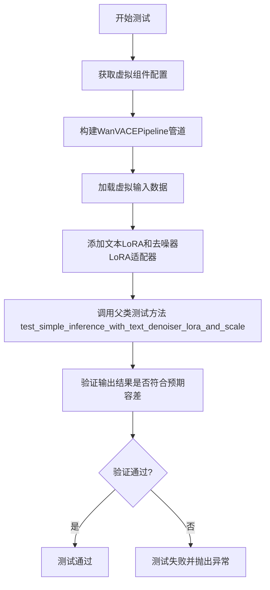

#### 带注释源码

```python
def test_simple_inference_with_text_denoiser_lora_and_scale(self):
    """
    测试Wan VACE管道在使用文本LoRA、去噪器LoRA和缩放因子时的简单推理功能。
    该方法调用父类的同名测试方法来执行实际的验证逻辑。
    
    父类测试方法通常会执行以下步骤：
    1. 构建带有LoRA适配器的pipeline
    2. 执行推理生成输出
    3. 验证输出与预期结果在指定容差(atol=9e-3)内匹配
    """
    # 调用父类PeftLoraLoaderMixinTests的同名测试方法
    # 传入expected_atol=9e-3作为容差参数
    super().test_simple_inference_with_text_denoiser_lora_and_scale()
```


### `WanVACELoRATests.get_dummy_inputs`

该方法用于生成 WanVACE Pipeline 测试所需的虚拟输入数据，包括噪声张量、文本输入ID以及完整的 Pipeline 参数字典。

参数：

- `with_generator`：`bool`，可选参数（默认为 True），控制是否在返回的 pipeline_inputs 字典中包含生成器对象

返回值：`tuple`，包含三个元素的元组
- 第一个元素：`noise`（Tensor），形状为 (batch_size, num_latent_frames, num_channels, 4, 4) 的随机噪声张量
- 第二个元素：`input_ids`（Tensor），形状为 (batch_size, sequence_length) 的随机文本输入ID张量
- 第三个元素：`pipeline_inputs`（dict），包含视频、掩码、提示词及推理参数的字典

#### 流程图

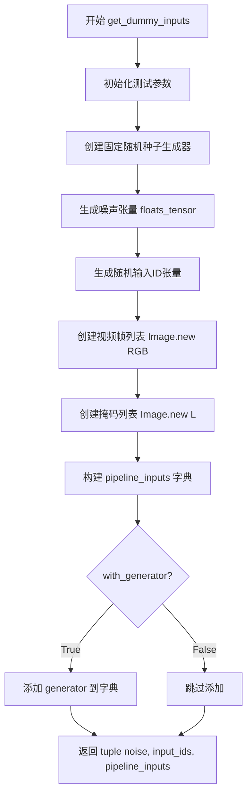

#### 带注释源码

```python
def get_dummy_inputs(self, with_generator=True):
    """
    生成用于测试 WanVACE Pipeline 的虚拟输入数据
    
    参数:
        with_generator: bool, 是否包含生成器对象，默认为 True
        
    返回:
        tuple: (noise, input_ids, pipeline_inputs)
    """
    # 定义基础维度参数
    batch_size = 1  # 批次大小
    sequence_length = 16  # 文本序列长度
    num_channels = 4  # 潜在空间通道数
    num_frames = 9  # 视频帧数
    # 潜在帧数 = (帧数 - 1) // 时间压缩比 + 1
    num_latent_frames = 3
    sizes = (4, 4)  # 空间分辨率
    height, width = 16, 16  # 图像高度和宽度

    # 创建固定随机种子生成器，确保测试可复现
    generator = torch.manual_seed(0)
    # 使用 floats_tensor 生成随机噪声张量，形状: (1, 3, 4, 4, 4)
    noise = floats_tensor((batch_size, num_latent_frames, num_channels) + sizes)
    # 生成随机文本输入ID，形状: (1, 16)
    input_ids = torch.randint(1, sequence_length, size=(batch_size, sequence_length), generator=generator)
    # 创建视频帧列表，每个元素为 RGB 图像
    video = [Image.new("RGB", (height, width))] * num_frames
    # 创建掩码列表，每个元素为灰度图像（黑色）
    mask = [Image.new("L", (height, width), 0)] * num_frames

    # 构建 Pipeline 输入参数字典
    pipeline_inputs = {
        "video": video,  # 输入视频帧列表
        "mask": mask,  # 视频掩码列表
        "prompt": "",  # 文本提示词（空字符串）
        "num_frames": num_frames,  # 视频总帧数
        "num_inference_steps": 1,  # 推理步数
        "guidance_scale": 6.0,  # 引导系数
        "height": height,  # 输出高度
        "width": height,  # 输出宽度（注意：代码中使用了 height，应为 width）
        "max_sequence_length": sequence_length,  # 最大序列长度
        "output_type": "np",  # 输出类型为 numpy
    }
    
    # 如果需要生成器，将其添加到参数字典中
    if with_generator:
        pipeline_inputs.update({"generator": generator})

    # 返回噪声、输入ID和完整参数字典
    return noise, input_ids, pipeline_inputs
```


### `WanVACELoRATests.test_simple_inference_with_text_lora_denoiser_fused_multi`

该方法是一个单元测试用例，用于验证 Wan VACE 管道在融合模式下使用文本 LoRA 和去噪器 LoRA 进行简单推理的功能。它继承自父类 `PeftLoraLoaderMixinTests` 的同名测试方法，并通过设置 `expected_atol=9e-3` 来放宽数值精度阈值，以适应 Wan VACE 模型的特性。

参数：

- `self`：实例方法隐式参数，类型为 `WanVACELoRATests`，表示测试类实例本身

返回值：`None`，该方法为测试用例，无返回值（ unittest.TestCase 的测试方法返回 None）

#### 流程图

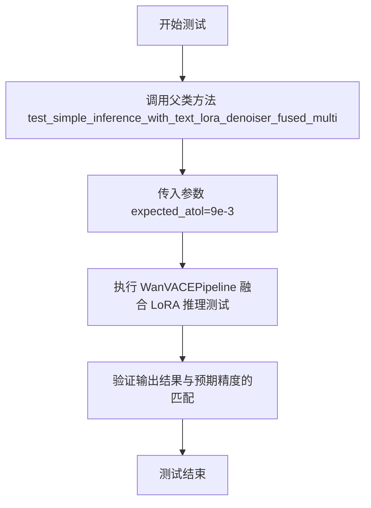

#### 带注释源码

```python
def test_simple_inference_with_text_lora_denoiser_fused_multi(self):
    """
    测试 Wan VACE 管道在融合模式下使用文本 LoRA 和去噪器 LoRA 的简单推理。
    
    该测试方法继承自 PeftLoraLoaderMixinTests 父类，用于验证：
    1. 文本编码器 LoRA 和去噪器 LoRA 的融合推理功能
    2. 管道输出结果的数值精度是否符合预期
    
    参数:
        self: WanVACELoRATests 实例，继承自 unittest.TestCase
        
    返回值:
        None: unittest 测试方法无返回值，结果通过测试框架断言判断
        
    注意事项:
        - expected_atol 设置为 9e-3，宽松于默认精度，以适应 Wan VACE 模型特性
        - 该测试依赖父类 PeftLoraLoaderMixinTests 的实现逻辑
    """
    # 调用父类的同名测试方法，传递预期的绝对误差容忍度
    # super() 获取父类 PeftLoraLoaderMixinTests 的引用
    # expected_atol=9e-3 表示允许的绝对误差范围为 0.009
    super().test_simple_inference_with_text_lora_denoiser_fused_multi(expected_atol=9e-3)
```


### `WanVACELoRATests.test_simple_inference_with_text_denoiser_lora_unfused`

这是一个测试方法，用于验证WanVACE管道在带有文本去噪器LoRA（不融合）配置下的简单推理功能是否正常。

参数：

- `self`：`WanVACELoRATests`（隐式参数），测试类实例本身

返回值：`None`，该方法为单元测试方法，无返回值（测试结果通过断言验证）

#### 流程图

```mermaid
flowchart TD
    A[开始测试] --> B[调用父类方法]
    B --> C[super().test_simple_inference_with_text_denoiser_lora_unfused<br/>expected_atol=9e-3]
    C --> D[执行文本去噪器LoRA不融合推理测试]
    D --> E[验证输出精度是否在容差范围内]
    E --> F[结束测试]
```

#### 带注释源码

```python
def test_simple_inference_with_text_denoiser_lora_unfused(self):
    """
    测试WanVACE管道在文本去噪器LoRA不融合配置下的简单推理功能。
    
    该测试方法继承自PeftLoraLoaderMixinTests类，验证LoRA权重未融合到主模型时
    的推理过程是否正确。expected_atol参数指定了输出结果的绝对容差阈值。
    """
    # 调用父类的测试方法，传入期望的绝对容差值9e-3
    # 父类方法将执行以下操作：
    # 1. 加载或创建虚拟组件（transformer、vae、text encoder等）
    # 2. 为denoiser添加LoRA适配器（不融合权重）
    # 3. 执行管道推理
    # 4. 验证输出结果的精度是否符合预期
    super().test_simple_inference_with_text_denoiser_lora_unfused(expected_atol=9e-3)
```


### `WanVACELoRATests.test_simple_inference_with_text_denoiser_block_scale`

该方法是一个测试方法，用于测试文本去噪器块缩放（text denoiser block scale）功能，但在 Wan VACE 模型中不支持此功能，因此使用 `@unittest.skip` 装饰器跳过该测试。

参数：无

返回值：无

#### 流程图

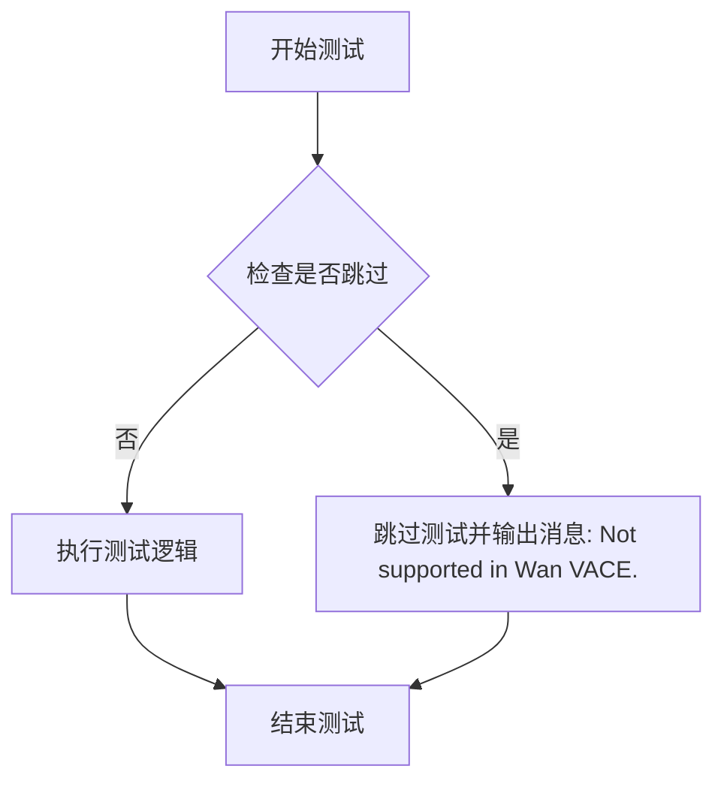

#### 带注释源码

```python
@unittest.skip("Not supported in Wan VACE.")  # 装饰器：跳过该测试，原因是 Wan VACE 模型不支持此功能
def test_simple_inference_with_text_denoiser_block_scale(self):
    """
    测试文本去噪器块缩放功能。
    
    该测试方法用于验证文本去噪器的块缩放功能是否正常工作。
    由于 Wan VACE 模型架构不支持此功能，测试被跳过。
    """
    pass  # 函数体为空，测试被跳过
```


### `WanVACELoRATests.test_simple_inference_with_text_denoiser_block_scale_for_all_dict_options`

该测试函数用于验证文本去噪器块缩放功能的所有字典选项，但在Wan VACE中暂不支持此功能，因此被跳过。

参数：

- `self`：`WanVACELoRATests`，表示测试类实例本身

返回值：`None`，该函数不返回任何值（被跳过且无实际执行）

#### 流程图

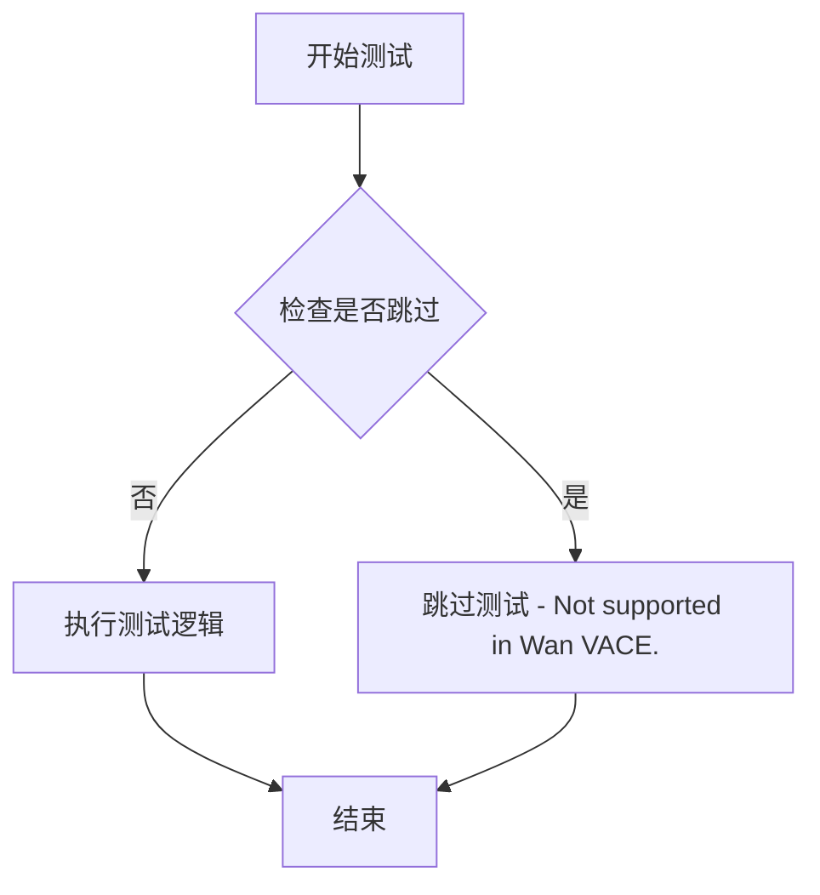

#### 带注释源码

```python
@unittest.skip("Not supported in Wan VACE.")  # 跳过测试装饰器，标记该功能在Wan VACE中不支持
def test_simple_inference_with_text_denoiser_block_scale_for_all_dict_options(self):
    """
    测试文本去噪器块缩放功能的所有字典选项。
    
    该测试方法原本用于验证LoRA权重块缩放功能的不同配置选项，
    但由于Wan VACE框架暂不支持此功能，因此被跳过。
    
    参数:
        self: WanVACELoRATests类的实例
        
    返回值:
        None: 由于测试被跳过，不执行任何操作
    """
    pass  # 空函数体，仅用于占位
```

#### 备注

- **跳过原因**：Wan VACE暂不支持文本去噪器块缩放功能
- **技术债务**：该测试方法为占位实现，需要在未来Wan VACE支持该功能时进行实现
- **设计约束**：该测试继承自`PeftLoraLoaderMixinTests`基类，但Wan VACE实现中明确标记为不支持


### `WanVACELoRATests.test_modify_padding_mode`

该测试方法用于验证修改填充模式的功能，但由于 Wan VACE 不支持此功能，已被跳过。

参数：

- `self`：`WanVACELoRATests`，表示测试类的实例本身

返回值：`None`，该方法不返回任何值

#### 流程图

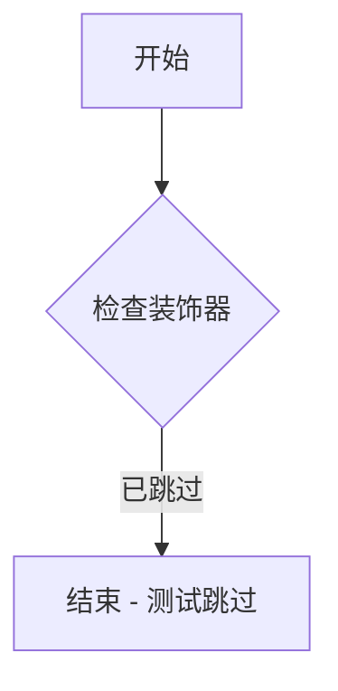

#### 带注释源码

```python
@unittest.skip("Not supported in Wan VACE.")
def test_modify_padding_mode(self):
    """
    测试修改填充模式的功能。
    
    注意：此功能在 Wan VACE 中不支持，因此测试被跳过。
    """
    pass
```


### `WanVACELoRATests.test_layerwise_casting_inference_denoiser`

该方法是一个单元测试方法，用于测试 Wan VACE 模型的去噪器（denoiser）在层级别（layer-wise）进行类型转换推理的能力。该测试方法通过调用父类 `PeftLoraLoaderMixinTests` 的同名方法来实现具体的测试逻辑。

参数：

- `self`：`WanVACELoRATests`，测试类实例本身，表示当前测试用例的上下文

返回值：`None`，该方法为测试方法，不返回任何值，通过测试框架的断言来验证功能正确性

#### 流程图

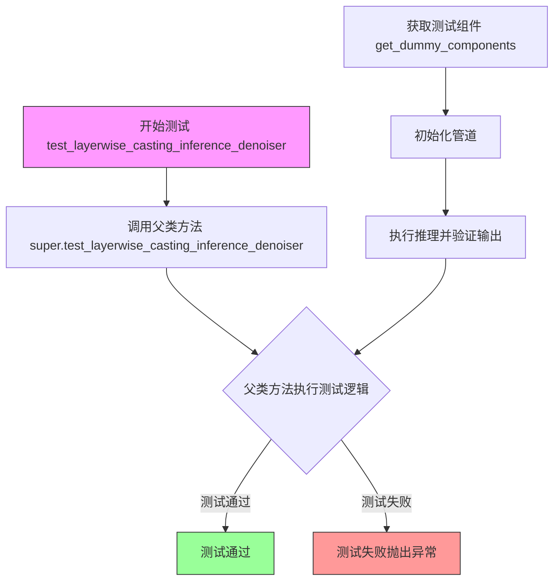

#### 带注释源码

```python
def test_layerwise_casting_inference_denoiser(self):
    """
    测试 Wan VACE 模型去噪器的层级别类型转换推理功能。
    
    该测试方法继承自 PeftLoraLoaderMixinTests 父类，
    用于验证在 WanVACETransformer3DModel 中应用 LoRA 权重后，
    模型能够在不同的数据类型（如 float32、float16、bfloat16）
    下正确执行推理。
    
    测试流程：
    1. 获取虚拟测试组件（transformer、vae、scheduler 等）
    2. 初始化 WanVACEPipeline
    3. 执行推理验证输出正确性
    """
    # 调用父类 PeftLoraLoaderMixinTests 的同名方法
    # 父类方法中会包含具体的测试逻辑：
    # - 加载或初始化带 LoRA 的模型
    # - 测试不同 dtype 下的推理
    # - 验证推理结果的正确性
    super().test_layerwise_casting_inference_denoiser()
```


### `WanVACELoRATests.test_lora_exclude_modules_wanvace`

这是一个针对 WanVACE 模型的 LoRA（Low-Rank Adaptation）模块排除功能的测试方法。该测试方法验证了在使用 PEFT 库加载 LoRA 适配器时，能够正确排除指定的模块（`vace_blocks.0.proj_out`），同时保留其他目标模块（`proj_out`）的 LoRA 权重。测试流程包括：创建管道、添加适配器、验证状态字典、执行推理、保存/加载权重，并最终确认排除的模块不会影响输出结果的一致性。

参数：

- `self`：`WanVACELoRATests`（隐式），测试类实例本身

返回值：`None`，该方法是一个测试用例，不返回任何值（测试通过/失败通过断言表达）

#### 流程图

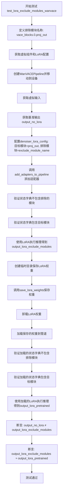

#### 带注释源码

```python
@require_peft_version_greater("0.13.2")
def test_lora_exclude_modules_wanvace(self):
    """
    测试 WanVACE 模型中 LoRA 模块排除功能
    
    该测试验证：
    1. 排除的模块（vace_blocks.0.proj_out）不会出现在 LoRA 状态字典中
    2. 目标模块（proj_out）仍然会被包含在 LoRA 状态字典中
    3. 排除模块后的输出与完整 LoRA 输出不同
    4. 保存/加载权重后，输出结果保持一致
    """
    
    # 步骤1: 定义要排除的模块名称
    # WanVACE 模型中 VACE 块的输出投影层
    exclude_module_name = "vace_blocks.0.proj_out"
    
    # 步骤2: 获取虚拟组件和 LoRA 配置
    # 返回：(组件字典, 文本编码器LoRA配置, 去噪器LoRA配置)
    components, text_lora_config, denoiser_lora_config = self.get_dummy_components()
    
    # 步骤3: 创建 WanVACE 管道并移动到指定设备
    # WanVACEPipeline 包含 transformer, vae, text_encoder 等组件
    pipe = self.pipeline_class(**components).to(torch_device)
    
    # 步骤4: 获取虚拟输入数据
    # 返回：(噪声张量, 输入ID, 管道参数字典)
    _, _, inputs = self.get_dummy_inputs(with_generator=False)
    
    # 步骤5: 获取没有 LoRA 时的基准输出
    # 用于后续与 LoRA 输出进行对比
    output_no_lora = self.get_base_pipe_output()
    
    # 断言: 验证输出形状正确
    # 期望形状: (1, 9, 16, 16, 3) = (batch, frames, height, width, channels)
    self.assertTrue(output_no_lora.shape == self.output_shape)
    
    # 步骤6: 配置 denoiser LoRA 参数
    # 设置目标模块为 "proj_out"（所有投影输出层）
    denoiser_lora_config.target_modules = ["proj_out"]
    
    # 设置要排除的模块列表
    denoiser_lora_config.excludeModules = [exclude_module_name]
    
    # 步骤7: 将适配器添加到管道
    # 这会根据配置将 LoRA 权重注入到模型中
    pipe, _ = self.add_adapters_to_pipeline(
        pipe, text_lora_config=text_lora_config, denoiser_lora_config=denoiser_lora_config
    )
    
    # 步骤8: 验证状态字典不包含要排除的模块
    # 使用 PEFT 的 get_peft_model_state_dict 获取合并后的状态字典
    state_dict_from_model = get_peft_model_state_dict(pipe.transformer, adapter_name="default")
    
    # 断言: 确保排除的模块名称不出现在任何状态字典键中
    self.assertTrue(not any(exclude_module_name in k for k in state_dict_from_model))
    
    # 断言: 确保目标模块仍然存在
    self.assertTrue(any("proj_out" in k for k in state_dict_from_model))
    
    # 步骤9: 使用 LoRA 执行推理
    # 使用固定随机种子确保可重现性
    output_lora_exclude_modules = pipe(**inputs, generator=torch.manual_seed(0))[0]
    
    # 步骤10: 测试权重保存和加载功能
    with tempfile.TemporaryDirectory() as tmpdir:
        # 获取需要保存的模块列表
        modules_to_save = self._get_modules_to_save(pipe, has_denoiser=True)
        
        # 获取 LoRA 状态字典
        lora_state_dicts = self._get_lora_state_dicts(modules_to_save)
        
        # 调用类方法保存 LoRA 权重到指定目录
        self.pipeline_class.save_lora_weights(save_directory=tmpdir, **lora_state_dicts)
        
        # 卸载当前加载的 LoRA 权重
        pipe.unload_lora_weights()
        
        # 步骤11: 验证保存的权重文件
        # 从 safetensors 文件加载状态字典
        loaded_state_dict = safetensors.torch.load_file(
            os.path.join(tmpdir, "pytorch_lora_weights.safetensors")
        )
        
        # 断言: 保存的权重不包含排除的模块
        self.assertTrue(not any(exclude_module_name in k for k in loaded_state_dict))
        
        # 断言: 保存的权重包含目标模块
        self.assertTrue(any("proj_out" in k for k in loaded_state_dict))
        
        # 步骤12: 重新加载 LoRA 权重
        pipe.load_lora_weights(tmpdir)
        
        # 获取加载后的模型状态字典
        state_dict_from_model = get_peft_model_state_dict(
            pipe.transformer, adapter_name="default_0"
        )
        
        # 断言: 加载后的状态字典不包含排除模块
        self.assertTrue(not any(exclude_module_name in k for k in state_dict_from_model))
        
        # 断言: 加载后的状态字典包含目标模块
        self.assertTrue(any("proj_out" in k for k in state_dict_from_model))
        
        # 步骤13: 验证加载 LoRA 后的输出
        output_lora_pretrained = pipe(**inputs, generator=torch.manual_seed(0))[0]
        
        # 断言: LoRA 输出与无 LoRA 输出必须不同（验证 LoRA 生效）
        self.assertTrue(
            not np.allclose(output_no_lora, output_lora_exclude_modules, atol=1e-3, rtol=1e-3),
            "LoRA should change outputs."
        )
        
        # 断言: 排除模块后的输出与加载的 LoRA 输出必须相同（验证一致性）
        self.assertTrue(
            np.allclose(output_lora_exclude_modules, output_lora_pretrained, atol=1e-3, rtol=1e-3),
            "Lora outputs should match."
        )
    
    # 测试完成，所有断言通过则测试成功
```


### WanVACELoRATests.test_simple_inference_with_text_denoiser_lora_and_scale

该测试方法用于验证 Wan VACE 管道在启用文本去噪器 LoRA 和缩放因子的情况下的基本推理功能，通过调用父类测试方法来确保 LoRA 权重和缩放参数正确应用并影响输出结果。

参数：

- `self`：测试类实例本身，无需额外参数

返回值：`None`，该方法为单元测试方法，通过断言验证输出正确性，不返回具体数值

#### 流程图

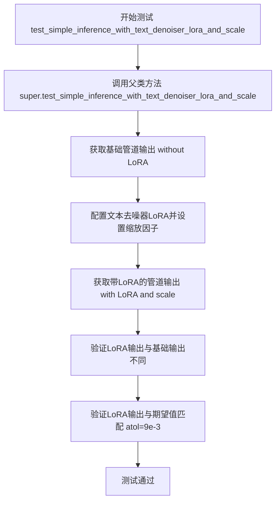

#### 带注释源码

```python
def test_simple_inference_with_text_denoiser_lora_and_scale(self):
    """
    测试WanVACE管道在启用文本去噪器LoRA和缩放因子时的基本推理功能。
    
    该测试方法继承自PeftLoraLoaderMixinTests类，调用父类的同名方法执行以下验证：
    1. 获取不带LoRA的基础管道输出作为基准
    2. 配置文本去噪器的LoRA权重和缩放因子
    3. 执行带LoRA的推理流程
    4. 验证输出与基础输出存在差异（LoRA生效）
    5. 验证输出与期望值在容差范围内匹配（精度验证）
    
    容差设置: expected_atol=9e-3（通过super调用传递）
    """
    # 调用父类PeftLoraLoaderMixinTests的测试方法
    # 父类方法内部会:
    # - 调用get_dummy_inputs()获取测试数据: noise, input_ids, pipeline_inputs
    # - 调用get_dummy_components()获取管道组件
    # - 构建WanVACEPipeline管道实例
    # - 执行带LoRA的推理并验证结果
    super().test_simple_inference_with_text_denoiser_lora_and_scale()
```

#### 补充说明

由于该方法是父类方法的包装器，以下信息继承自类的配置属性：

**相关测试数据获取方法 get_dummy_inputs():**
- **输入参数**: `with_generator` (bool, 可选, 默认True) - 是否包含随机数生成器
- **返回值**: 三元组 (noise, input_ids, pipeline_inputs)
  - `noise`: torch.Tensor, 形状 (batch_size, num_latent_frames, num_channels, height, width)
  - `input_ids`: torch.Tensor, 形状 (batch_size, sequence_length)
  - `pipeline_inputs`: dict, 包含 video, mask, prompt, num_frames 等推理参数

**输出形状**: (1, 9, 16, 16, 3) - 对应 batch_size=1, num_frames=9, height=16, width=16, channels=3


## 关键组件


### WanVACEPipeline

视频生成主管道类，集成VACE变换器、VAE、文本编码器和调度器，用于执行视频生成的完整推理流程。

### WanVACETransformer3DModel

3D视频感知一致性编码器变换器模型，支持VACE层、时空注意力机制和RoPE位置编码，用于学习视频帧间的时空一致性表示。

### AutoencoderKLWan

基于KL散度的Wan变分自编码器，负责将视频帧编码到潜在空间并从潜在空间解码重建视频帧。

### FlowMatchEulerDiscreteScheduler

基于流匹配和欧拉离散化的调度器，用于在扩散采样过程中逐步去噪生成视频。

### WanVACELoRATests

继承自unittest.TestCase和PeftLoraLoaderMixinTests的LoRA测试类，验证Wan VACE管道对LoRA权重加载、融合和模块排除的支持能力。

### transformer_kwargs

包含patch_size、attention_head_dim、vace_layers等配置，定义了3D变换器的架构参数包括注意力头数、层数、VACE层索引等关键超参数。

### vae_kwargs

包含base_dim、z_dim、dim_mult等配置，定义了VAE的维度参数和时序下采样策略。

### get_dummy_inputs

生成测试用虚拟输入的方法，返回噪声张量、输入ID和包含视频、mask、prompt等参数的字典，用于管道推理测试。

### test_lora_exclude_modules_wanvace

测试LoRA模块排除功能的方法，验证exclude_modules配置可以正确排除特定模块的LoRA权重，并在保存/加载流程中保持一致性。

### PeftLoraLoaderMixinTests

提供LoRA加载器通用测试方法的mixin类，包含文本编码器LoRA、去噪器LoRA、模块缩放等多种场景的测试用例。

### is_peft_available

环境检查函数，用于判断当前环境是否支持PEFT（Parameter-Efficient Fine-Tuning）库，从而决定是否执行相关LoRA测试。


## 问题及建议


### 已知问题

- **不可复现的随机值**: `latents_mean` 和 `latents_std` 使用 `torch.randn(4).numpy().tolist()` 动态生成，每次模块导入时值都会变化，导致测试结果不可复现
- **Flaky测试**: 类级别使用 `@is_flaky(max_attempts=10, description="very flaky class")`，表明测试极不稳定，可能存在竞态条件或非确定性因素
- **硬编码的随机种子**: `torch.manual_seed(0)` 在多处重复使用，缺乏统一的随机数管理机制
- **sys.path操作**: 使用 `sys.path.append(".")` 手动添加路径不是最佳实践，可能导致导入冲突
- **魔法数字**: 多个硬编码值如 `9e-3`（容差）、`sequence_length=16`、`rope_max_seq_len=16` 等缺乏文档说明
- **跳过测试无详细原因**: `@unittest.skip("Not supported in Wan VACE.")` 跳过原因过于简单，未记录为何不支持及未来是否可能支持
- **测试覆盖不完整**: 多个测试方法直接调用 `super()` 而未添加额外验证，如 `test_layerwise_casting_inference_denoiser`
- **属性定义分散**: `has_two_text_encoders`、`supports_text_encoder_loras` 等布尔标志定义在类中但未被充分使用或验证

### 优化建议

- 将 `latents_mean` 和 `latents_std` 改为固定值或通过 fixture 注入，确保测试可复现性
- 分析 flaky 测试的根本原因（可能是 GPU 内存、并发或数值精度问题），修复而非依赖重试
- 创建测试配置类或常量文件，统一管理所有魔法数字和阈值
- 使用 `pytest.ini` 或 `conftest.py` 管理路径，避免在代码中操作 `sys.path`
- 为跳过的测试添加更详细的说明，包括未来是否可能实现
- 增强测试方法的自包含性，减少对父类方法的依赖，添加更多针对性的断言

## 其它


### 设计目标与约束

本测试类旨在验证 WanVACE Pipeline 的 LoRA（Low-Rank Adaptation）功能完整性，包括 LoRA 权重加载、保存、推理兼容性以及模块排除能力。测试约束包括：仅支持 denoiser 侧的 LoRA（不支持 text_encoder_loras），需要 PEFT 后端 >= 0.13.2，跳过 MPS 设备，测试使用极小的模型配置（2层 transformer、8维 attention head）以确保测试速度，容差设置为 9e-3 以适应浮点精度差异。

### 错误处理与异常设计

测试类使用 `@unittest.skip` 装饰器跳过不支持的测试场景（Wan VACE 不支持 text_denoiser_block_scale 和 padding_mode 修改）。使用 `@require_peft_backend` 确保 PEFT 库可用，使用 `@require_peft_version_greater("0.13.2")` 验证 PEFT 版本。使用 `@is_flaky(max_attempts=10)` 处理测试不稳定性，测试中通过 `np.allclose` 进行数值近似比较而非精确相等。

### 数据流与状态机

测试数据流：get_dummy_inputs() 生成随机噪声 (1,3,4,4,4)、随机 input_ids (1,16)、RGB 视频帧列表、mask 列表 → pipeline 调用时接收这些输入 → 经过 transformer 编码、VAE 解码 → 输出形状 (1,9,16,16,3) 的视频帧。状态转换：初始化 pipeline → 添加 LoRA 权重（可选）→ 执行推理 → 验证输出 → 保存/加载 LoRA（可选）→ 卸载 LoRA。

### 外部依赖与接口契约

核心依赖：torch、numpy、safetensors.torch、PIL (Pillow)、transformers (AutoTokenizer, T5EncoderModel)、diffusers (AutoencoderKLWan, FlowMatchEulerDiscreteScheduler, WanVACEPipeline, WanVACETransformer3DModel)、peft (get_peft_model_state_dict)。接口契约：pipeline_class 必须是 WanVACEPipeline，transformer_cls 必须是 WanVACETransformer3DModel，vae_cls 必须是 AutoencoderKLWan，tokenizer_cls 必须是 AutoTokenizer，text_encoder_cls 必须是 T5EncoderModel。

### 性能考量

使用 tiny-random-t5 模型和最小 transformer 配置（2层、2头、8维）以最小化测试时间。使用 @is_flaky 重试机制处理偶发 GPU 内存问题。测试输出形状较小 (1,9,16,16,3) 减少内存占用。num_inference_steps=1 减少推理计算量。

### 安全性考虑

测试使用临时目录 (tempfile.TemporaryDirectory) 进行 LoRA 保存/加载，避免污染文件系统。使用 torch.manual_seed(0) 确保测试可复现性。未涉及真实用户数据，仅使用生成的随机数据和 dummy 图片。

### 测试策略

继承 PeftLoraLoaderMixinTests 获得标准 LoRA 测试用例。覆盖场景：LoRA 推理融合、LoRA 未融合、层级 casting 推理、模块排除功能。验证：输出形状正确、LoRA 权重正确加载/保存、排除模块不出现在状态字典中、LoRA 改变输出结果。

### 配置管理

transformer_kwargs、vae_kwargs 硬编码在类属性中定义测试配置。scheduler_kwargs 为空字典使用默认调度器配置。pipeline_inputs 字典在 get_dummy_inputs 中动态构建，支持 with_generator 参数控制是否包含随机生成器。

### 版本兼容性

要求 PEFT >= 0.13.2（test_lora_exclude_modules_wanvace 测试）。 transformers 库版本由环境决定。diffusers 库需要支持 WanVACEPipeline、WanVACETransformer3DModel、AutoencoderKLWan、FlowMatchEulerDiscreteScheduler。

### 部署与运维

本测试类为单元测试，设计用于持续集成环境。不涉及生产部署配置。测试可通过 pytest 或 unittest 运行，支持单独运行或批量运行。

    