# `diffusers\tests\lora\test_lora_layers_z_image.py` 详细设计文档

这是一个针对ZImagePipeline的LoRA（Low-Rank Adaptation）功能集成测试文件，主要用于验证ZImage图像生成管线在应用LoRA适配器后的正确性，包括不同rank配置、NaN处理、权重融合等核心功能。

## 整体流程

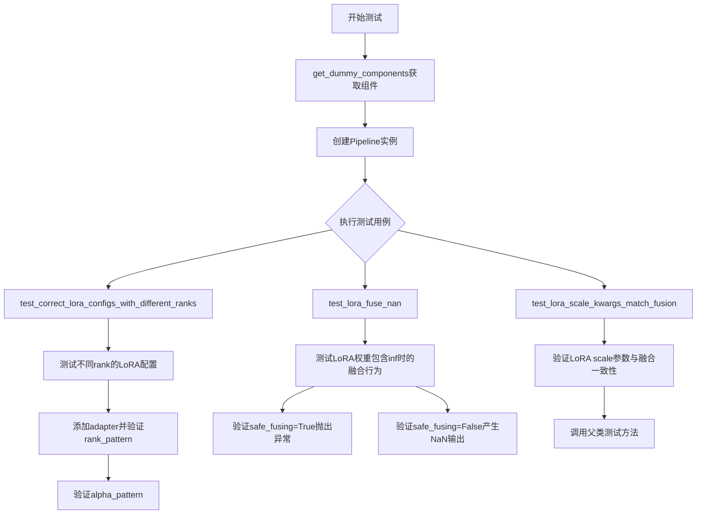

## 类结构

```
unittest.TestCase (Python标准库)
└── PeftLoraLoaderMixinTests (混合类)
    └── ZImageLoRATests (测试类)
        ├── pipeline_class: ZImagePipeline
        ├── scheduler_cls: FlowMatchEulerDiscreteScheduler
        ├── transformer_cls: ZImageTransformer2DModel
        └── vae_cls: AutoencoderKL
```

## 全局变量及字段


### `sys`
    
Python module providing access to system-specific parameters and functions

类型：`module`
    


### `unittest`
    
Unit testing framework for writing and running tests

类型：`module`
    


### `np`
    
NumPy library for numerical computing operations

类型：`module`
    


### `torch`
    
PyTorch deep learning library for tensor operations and neural networks

类型：`module`
    


### `Qwen2Tokenizer`
    
Tokenizer class for Qwen2 models from HuggingFace transformers

类型：`class`
    


### `Qwen3Config`
    
Configuration class for Qwen3 model architecture from HuggingFace transformers

类型：`class`
    


### `Qwen3Model`
    
Base model class for Qwen3 from HuggingFace transformers

类型：`class`
    


### `AutoencoderKL`
    
VAE model with KL divergence for latent diffusion from diffusers

类型：`class`
    


### `FlowMatchEulerDiscreteScheduler`
    
Scheduler using Euler method for discrete flow matching from diffusers

类型：`class`
    


### `ZImagePipeline`
    
Image generation pipeline for ZImage model from diffusers

类型：`class`
    


### `ZImageTransformer2DModel`
    
2D transformer model for ZImage generation from diffusers

类型：`class`
    


### `is_peft_available`
    
Utility function to check if PEFT library is available

类型：`function`
    


### `require_peft_backend`
    
Decorator that skips test if PEFT backend is not available

类型：`decorator`
    


### `skip_mps`
    
Decorator to skip tests on Apple MPS backend

类型：`decorator`
    


### `torch_device`
    
String representing the device to run PyTorch operations on

类型：`variable`
    


### `floats_tensor`
    
Utility function to create a tensor of random float values

类型：`function`
    


### `check_if_lora_correctly_set`
    
Utility function to verify LoRA weights are correctly applied

类型：`function`
    


### `PeftLoraLoaderMixinTests`
    
Mixin class providing test cases for PEFT LoRA loader functionality

类型：`class`
    


### `LoraConfig`
    
Configuration class for LoRA adapters from PEFT library

类型：`class`
    


### `ZImageLoRATests.pipeline_class`
    
The pipeline class being tested (ZImagePipeline)

类型：`class`
    


### `ZImageLoRATests.scheduler_cls`
    
Scheduler class used in the pipeline (FlowMatchEulerDiscreteScheduler)

类型：`class`
    


### `ZImageLoRATests.scheduler_kwargs`
    
Keyword arguments for scheduler initialization

类型：`dict`
    


### `ZImageLoRATests.transformer_kwargs`
    
Keyword arguments for ZImageTransformer2DModel initialization

类型：`dict`
    


### `ZImageLoRATests.transformer_cls`
    
Transformer model class (ZImageTransformer2DModel)

类型：`class`
    


### `ZImageLoRATests.vae_kwargs`
    
Keyword arguments for AutoencoderKL initialization

类型：`dict`
    


### `ZImageLoRATests.vae_cls`
    
VAE model class (AutoencoderKL)

类型：`class`
    


### `ZImageLoRATests.tokenizer_cls`
    
Tokenizer class (Qwen2Tokenizer)

类型：`class`
    


### `ZImageLoRATests.tokenizer_id`
    
HuggingFace model ID for tokenizer

类型：`str`
    


### `ZImageLoRATests.text_encoder_cls`
    
Text encoder model class (Qwen3Model)

类型：`class`
    


### `ZImageLoRATests.text_encoder_id`
    
HuggingFace model ID for text encoder (None, created inline)

类型：`str`
    


### `ZImageLoRATests.denoiser_target_modules`
    
List of module names to apply LoRA to in the denoiser

类型：`list`
    


### `ZImageLoRATests.supports_text_encoder_loras`
    
Flag indicating whether text encoder LoRA is supported

类型：`bool`
    


### `ZImageLoRATests.output_shape`
    
Expected output shape of generated images

类型：`tuple`
    
    

## 全局函数及方法


### `sys.path.append`

将指定的路径字符串添加到 Python 解释器的模块搜索路径列表 `sys.path` 中，以便后续的 import 语句可以在该路径下查找模块。

参数：

- `path`：`str`，要添加到 `sys.path` 的路径字符串

返回值：`None`，无返回值，仅修改全局 `sys.path` 列表

#### 流程图

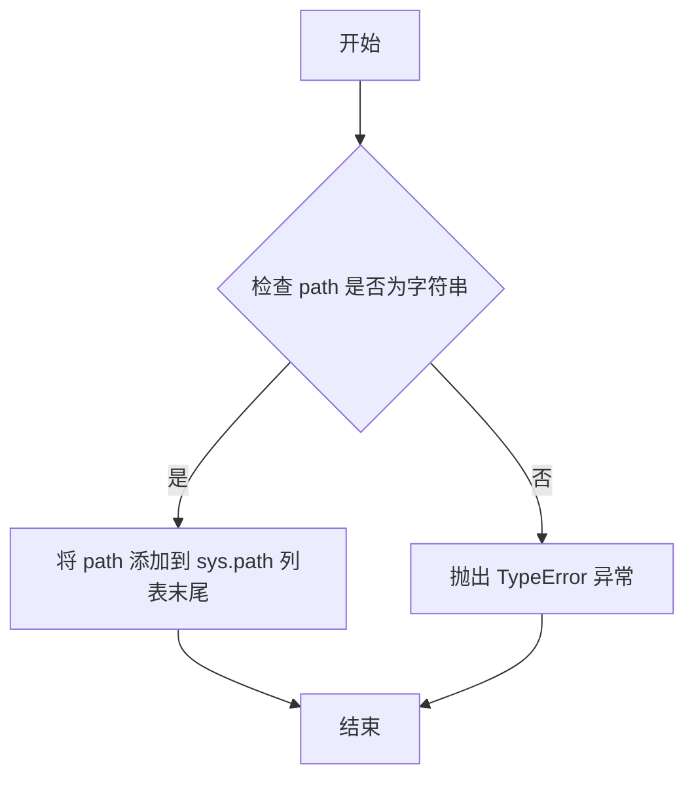

#### 带注释源码

```python
# 将当前目录路径 "." 添加到 Python 模块搜索路径中
# 这样可以使得后续的 import 语句能够找到同目录下的模块
# 例如：from .utils import PeftLoraLoaderMixinTests
sys.path.append(".")
```

---

### 补充说明

| 项目 | 说明 |
|------|------|
| **函数类型** | Python 内置函数 |
| **模块** | `sys` 模块 |
| **作用范围** | 全局 |
| **调用位置** | 第 29 行，在导入 `utils` 模块之前调用 |
| **设计目标** | 确保相对导入 `.utils` 能够正确解析 |
| **潜在优化** | 建议使用 `pathlib` 或动态计算项目根路径，避免硬编码 "."，提高代码可移植性 |
| **错误处理** | 如果传入非字符串类型，会抛出 `TypeError` 异常 |


### `torch.manual_seed`

设置 PyTorch 的随机种子，以确保每次运行代码时产生相同的随机序列，从而实现结果的可复现性。

参数：

- `seed`：`int`，随机种子值，用于初始化随机数生成器

返回值：`torch.Generator`，返回随机数生成器对象

#### 流程图

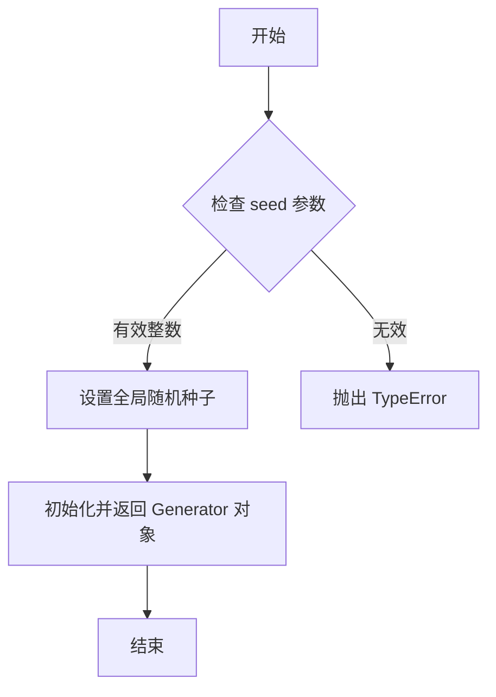

#### 带注释源码

```python
# torch.manual_seed 是 PyTorch 的内置函数，用于设置随机种子
# 以下是代码中对该函数的各种调用示例：

# 1. 创建一个固定种子的生成器对象，用于后续随机数生成
generator = torch.manual_seed(0)

# 2. 在测试初始化时设置全局随机种子，确保测试可复现
torch.manual_seed(0)

# 3. 在测试中每次调用时设置种子，确保多次运行结果一致
original_output = pipe(**inputs, generator=torch.manual_seed(0))[0]
lora_output_same_rank = pipe(**inputs, generator=torch.manual_seed(0))[0]
lora_output_diff_rank = pipe(**inputs, generator=torch.manual_seed(0))[0]
lora_output_diff_alpha = pipe(**inputs, generator=torch.manual_seed(0))[0]

# 函数签名: torch.manual_seed(seed: int) -> torch.Generator
# 参数 seed: int - 随机种子值
# 返回值: torch.Generator - 随机数生成器对象
```


# torch.no_grad 详细设计文档

## 概述

`torch.no_grad` 是 PyTorch 框架提供的一个上下文管理器（context manager），用于临时禁用梯度计算和自动求导机制。在推理（inference）阶段或不需要梯度更新时使用此函数可以显著减少内存占用并提升计算效率。

## 函数信息

### `torch.no_grad`

禁用梯度计算的上下文管理器，用于减少内存消耗和提高推理速度。

#### 参数

此函数不接受任何参数。

#### 返回值

- **类型**：`torch.no_grad` 装饰器/上下文管理器
- **描述**：返回一个上下文管理器，在其作用范围内所有张量操作都不会构建计算图，从而禁用梯度计算。

#### 流程图

```mermaid
flowchart TD
    A[进入 with torch.no_grad(): 块] --> B{当前是否在梯度计算模式}
    B -->|是| C[保存当前梯度模式状态]
    B -->|否| D[继续]
    C --> E[设置梯度模式为 False]
    E --> F[执行块内代码<br/>不构建计算图<br/>不跟踪操作]
    F --> G[恢复原始梯度模式状态]
    G --> H[退出上下文]
    
    style C fill:#f9f,stroke:#333
    style E fill:#ff9,stroke:#333
    style F fill:#9f9,stroke:#333
```

#### 带注释源码

```python
# torch.no_grad() 源码位于 PyTorch 的 torch/autograd/function.py 中
# 以下是简化版本的实现原理

class no_grad:
    """禁用梯度计算的上下文管理器"""
    
    def __init__(self):
        pass
    
    def __enter__(self):
        # 获取当前的梯度状态
        self.old_gradex = torch.is_grad_enabled()
        # 禁用梯度计算
        torch.set_grad_enabled(False)
        return self
    
    def __exit__(self, exc_type, exc_val, exc_tb):
        # 恢复原来的梯度状态
        torch.set_grad_enabled(self.old_gradex)
        return False

# 使用方式
@torch.no_grad()  # 作为装饰器使用
def inference_function(x):
    # 在此函数内所有操作都不会计算梯度
    return model(x)

# 或作为上下文管理器
with torch.no_grad():  # 在此块内禁用梯度
    output = model(input)
    # 不需要 backward() 或 optimizer.step()
```

## 在本项目代码中的使用

### 第一次使用（第113-115行）

```python
with torch.no_grad():
    transformer.x_pad_token.copy_(torch.ones_like(transformer.x_pad_token.data))
    transformer.cap_pad_token.copy_(torch.ones_like(transformer.cap_pad_token.data))
```

**用途**：在初始化测试组件时，禁用梯度计算以避免不必要的内存占用。这里只是复制张量数据，不需要梯度信息。

**参数说明**：
- 无参数

**返回值说明**：
- 返回上下文管理器，块内代码执行完毕后自动恢复梯度状态

### 第二次使用（第163-169行）

```python
# corrupt one LoRA weight with `inf` values
with torch.no_grad():
    possible_tower_names = ["noise_refiner"]
    filtered_tower_names = [
        tower_name for tower_name in possible_tower_names if hasattr(pipe.transformer, tower_name)
    ]
    for tower_name in filtered_tower_names:
        transformer_tower = getattr(pipe.transformer, tower_name)
        transformer_tower[0].attention.to_q.lora_A["adapter-1"].weight += float("inf")
```

**用途**：在测试代码中人为修改 LoRA 权重为无穷大（inf），用于测试安全融合机制。由于只是修改张量值而非训练，不需要梯度计算。

**参数说明**：
- 无参数

**返回值说明**：
- 返回上下文管理器，块内代码执行完毕后自动恢复梯度状态

## 技术债务与优化建议

1. **可考虑提取为工具函数**：如果 `torch.no_grad()` 在多处使用，可考虑封装为工具函数以提高代码可读性。

2. **梯度管理一致性**：项目中应统一使用 `torch.no_grad()` 或 `@torch.inference_mode()`，后者是 PyTorch 1.9+ 推荐的更严格的推理模式。

3. **性能优化建议**：对于完整的推理管道，可考虑使用 `torch.inference_mode()` 替代 `torch.no_grad()`，前者会禁用更完整的自动求导功能，性能更优。

## 外部依赖

- **PyTorch**：需要 PyTorch 1.0+ 版本，推荐使用最新版本以获得最佳性能

## 设计约束

- 只能在 Python 的 `with` 语句或 `@decorator` 形式下使用
- 不能用于多线程并发修改梯度状态的场景
- 嵌套使用时会正确维护梯度状态栈


# torch.ones_like 设计文档

### torch.ones_like

`torch.ones_like` 是 PyTorch 库中的函数，用于创建一个与给定张量形状相同的全1张量（tensor）。在当前代码中，该函数被用于初始化 `transformer` 的 `x_pad_token` 和 `cap_pad_token` 属性，以避免在测试环境中出现 NaN 数据值。

参数：

- `input`：`torch.Tensor`，输入张量，用于确定输出张量的形状、数据类型和设备
- `dtype`：`torch.dtype`，可选，返回张量的数据类型，默认与输入张量相同
- `layout`：`torch.layout`，可选，返回张量的布局结构
- `device`：`torch.device`，可选，返回张量所在的设备（CPU/CUDA）
- `requires_grad`：`bool`，可选，是否需要计算梯度，默认 `False`
- `memory_format`：`torch.memory_format`，可选，内存格式，默认 `torch.preserve_format`

返回值：`torch.Tensor`，返回与输入张量形状相同的全1张量

#### 流程图

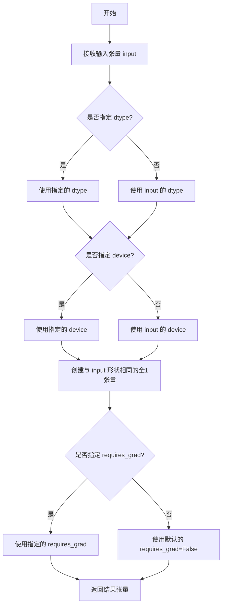

#### 带注释源码

```python
# 使用示例（来自 get_dummy_components 方法）

# 获取 transformer 对象的 x_pad_token 数据
# x_pad_token 初始化时使用 torch.empty，可能包含随机数据导致 NaN
original_data = transformer.x_pad_token.data

# torch.ones_like 函数调用
# 创建一个与 original_data 形状相同的全1张量
# 参数说明：
#   - input=original_data: 基于此张量的形状创建全1张量
#   - 未指定 dtype: 使用 original_data 的原始数据类型
#   - 未指定 device: 使用 original_data 所在的设备
ones_tensor = torch.ones_like(original_data)

# 使用全1张量的值覆盖原始数据，防止 NaN 值
# 这一步确保测试环境的稳定性和可重复性
transformer.x_pad_token.copy_(ones_tensor)

# 同样的逻辑应用于 cap_pad_token
cap_original_data = transformer.cap_pad_token.data
cap_ones_tensor = torch.ones_like(cap_original_data)
transformer.cap_pad_token.copy_(cap_ones_tensor)
```

#### 在项目中的实际调用上下文

```python
def get_dummy_components(self, scheduler_cls=None, use_dora=False, lora_alpha=None):
    # ... 其他代码 ...
    
    transformer = self.transformer_cls(**self.transformer_kwargs)
    
    # 使用 torch.ones_like 初始化填充令牌，防止 NaN 值
    with torch.no_grad():
        # 创建一个与 x_pad_token.data 形状相同的全1张量
        # 并将其复制到 x_pad_token 中
        transformer.x_pad_token.copy_(torch.ones_like(transformer.x_pad_token.data))
        
        # 同样处理 cap_pad_token
        transformer.cap_pad_token.copy_(torch.ones_like(transformer.cap_pad_token.data))
    
    vae = self.vae_cls(**self.vae_kwargs)
    # ... 其他代码 ...
```

#### 关键组件信息

| 组件名称 | 一句话描述 |
|---------|-----------|
| transformer.x_pad_token | 用于填充的令牌张量，初始化时可能导致 NaN |
| transformer.cap_pad_token | 用于容量填充的令牌张量，初始化时可能导致 NaN |
| torch.ones_like | PyTorch 函数，基于输入张量形状创建全1张量 |

#### 技术债务与优化空间

1. **硬编码初始化方式**：当前使用 `torch.ones_like` 进行初始化，虽然解决了 NaN 问题，但使用全1张量可能不是最优的初始化方式，可考虑使用更合适的初始化策略
2. **重复代码**：`x_pad_token` 和 `cap_pad_token` 的初始化逻辑重复，可提取为独立方法
3. **魔法数字**：测试中的种子值 `torch.manual_seed(0)` 重复出现，可提取为类或模块级常量

#### 设计目标与约束

- **设计目标**：确保测试环境中张量值稳定，避免因未初始化导致的随机 NaN 值影响测试结果
- **约束条件**：必须保持与原始张量相同的数据类型和设备兼容性


### `torch.empty`

`torch.empty` 是 PyTorch 库中的一个基础张量创建函数，用于创建一个指定形状但未初始化（不设置初始值）的张量。该函数分配指定大小的内存但不填充任何具体数值，因此返回的张量包含未定义的内存值。在代码中用于初始化 `transformer.x_pad_token` 和 `transformer.cap_pad_token` 属性。

#### 参数

- `*size`：`int` 或 `tuple` 或 `list`，张量的形状，可以是可变数量的整数（如 `3, 4`）或一个整数元组/列表（如 `(3, 4)`）
- `dtype`：`torch.dtype`，可选，返回张量的数据类型，默认为 `torch.float32`
- `device`：`torch.device`，可选，返回张量所在的设备（CPU 或 CUDA）
- `requires_grad`：`bool`，可选，是否需要计算梯度，默认为 `False`
- `layout`：`torch.layout`，可选，内存布局，默认为 `torch.strided`
- `pin_memory`：`bool`，可选，如果为 `True`，则返回的张量将分配在固定内存中，默认为 `False`
- `memory_format`：`torch.memory_format`，可选，内存格式，默认为 `torch.contiguous_format`

#### 返回值：`torch.Tensor`，一个形状为指定 size 但未初始化的张量，其内容是未定义的内存值

#### 流程图

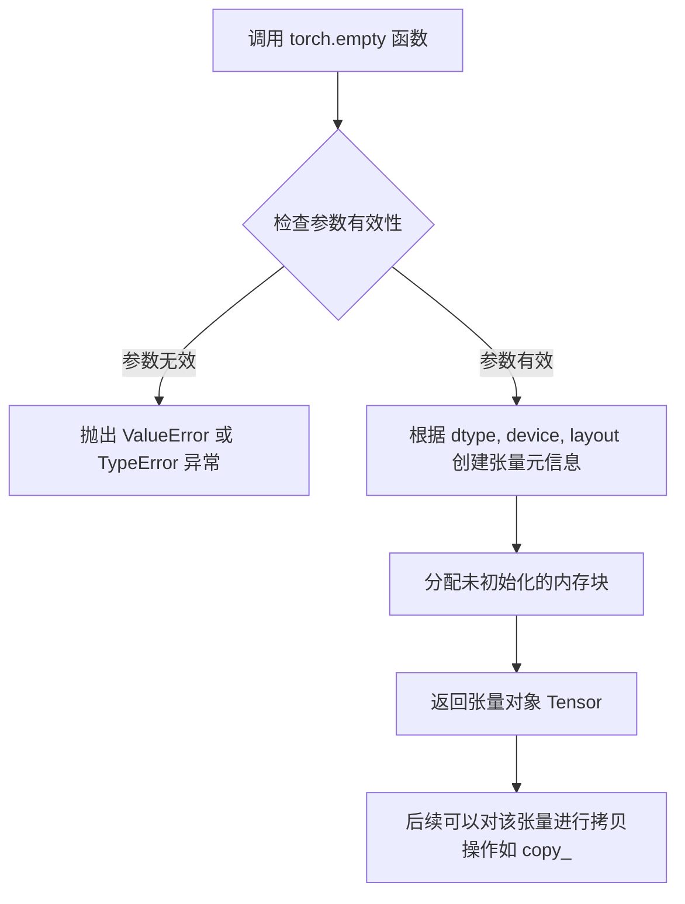

#### 带注释源码

```python
# torch.empty 的典型调用方式（基于代码中的使用场景）
# 在 ZImageLoRATests.get_dummy_components 方法中：
transformer = self.transformer_cls(**self.transformer_kwargs)
# transformer.x_pad_token 内部通过 torch.empty 初始化为未填充的张量
# 这行注释说明了 x_pad_token 和 cap_pad_token 是用 torch.empty 创建的
# torch.empty 创建的张量不进行初始化，可能包含任意内存值（NaN风险）
# This can cause NaN data values in our testing environment.
# 为避免测试中的 NaN 问题，使用 copy_ 复制已初始化的值
with torch.no_grad():
    transformer.x_pad_token.copy_(torch.ones_like(transformer.x_pad_token.data))
    transformer.cap_pad_token.copy_(torch.ones_like(transformer.cap_pad_token.data))

# torch.empty 函数本身的核心实现逻辑（伪代码）
# def empty(*size, dtype=None, device=None, requires_grad=False, layout=torch.strided, pin_memory=False, memory_format=torch.contiguous_format):
#     # 1. 解析和验证 size 参数
#     size = tuple(size) if isinstance(size, (int,)) else size
#     
#     # 2. 根据参数创建张量元信息（dtype, device, layout等）
#     tensor_meta = {"dtype": dtype, "device": device, "layout": layout}
#     
#     # 3. 调用底层 C++/CUDA 分配未初始化的内存
#     # 这是关键区别于 torch.zeros/torch.ones，后者会初始化内存
#     storage = torch._empty_storage(size, dtype=dtype, device=device, layout=layout, pin_memory=pin_memory)
#     
#     # 4. 包装成 Tensor 对象返回
#     return Tensor(storage, metadata={"requires_grad": requires_grad, "memory_format": memory_format})
#
# 注意：返回的张量内容是未定义的，使用前通常需要显式赋值或使用 copy_ 方法
```

#### 代码上下文说明

在提供的测试代码中，`torch.empty` 的使用方式是隐式的（通过 `ZImageTransformer2DModel` 类的内部实现）。`transformer.x_pad_token` 和 `transformer.cap_pad_token` 这两个属性在模型初始化时使用 `torch.empty` 创建，导致它们包含未定义的内存值（可能是 NaN）。为确保测试的确定性，测试代码通过 `torch.ones_like` 和 `copy_` 方法将这些张量填充为确定性的值（1.0），避免了测试中的数值不确定性。


### `torch.randint`

`torch.randint` 是 PyTorch 库中的一个函数，用于生成指定范围内（含低值，不含高值）的随机整数张量。在本代码中，它用于生成模拟输入 ID 序列，以测试 ZImagePipeline 的 LoRA 功能。

参数：

- `low`：`int`，随机整数范围的下界（包含），本代码中隐式为 `1`
- `high`：`int`，随机整数范围的上界（不包含），本代码中为 `sequence_length`（值为 `10`）
- `size`：`tuple of ints`，输出张量的形状，本代码中为 `(batch_size, sequence_length)` 即 `(1, 10)`
- `generator`：`torch.Generator`，可选的随机数生成器，用于控制随机性，本代码中为 `torch.manual_seed(0)`

返回值：`torch.Tensor`，返回一个形状为 `(1, 10)` 的随机整数张量，元素值范围在 `[1, 10)` 之间

#### 流程图

```mermaid
flowchart TD
    A[开始调用 torch.randint] --> B{传入参数}
    B --> C[low = 1]
    B --> D[high = sequence_length = 10]
    B --> E[size = (1, 10)]
    B --> F[generator = torch.manual_seed(0)]
    C --> G[生成随机整数张量]
    D --> G
    E --> G
    F --> G
    G --> H[返回形状为 (1, 10) 的整数张量<br/>元素范围: [1, 10)]
    H --> I[赋值给 input_ids]
```

#### 带注释源码

```python
# 在 get_dummy_inputs 方法中调用
generator = torch.manual_seed(0)  # 创建随机数生成器并设置种子为 0，确保可复现性
noise = floats_tensor((batch_size, num_channels) + sizes)  # 生成噪声张量 (1, 4, 32, 32)
input_ids = torch.randint(
    1,              # low: 随机整数范围的下界（包含）
    sequence_length, # high: 随机整数范围的上界（不包含），值为 10
    size=(batch_size, sequence_length),  # size: 输出张量形状 (1, 10)
    generator=generator  # generator: 使用手动设置的随机生成器
)
# 返回的张量形状为 (1, 10)，元素值为 1 到 9 之间的整数
# 例如: tensor([[1, 5, 3, 9, 2, 7, 4, 8, 6, 1]])
```


### `torch.device`

这是 PyTorch 中用于创建设备对象的函数，用于指定张量或模型应该放置在哪个设备上（CPU 或 GPU）。

参数：

-  `device`：`str` 或 `torch.device`，设备标识符字符串（如 "cuda", "cuda:0", "cpu"）或现有的 torch.device 对象

返回值：`torch.device`，返回一个新的设备对象

#### 流程图

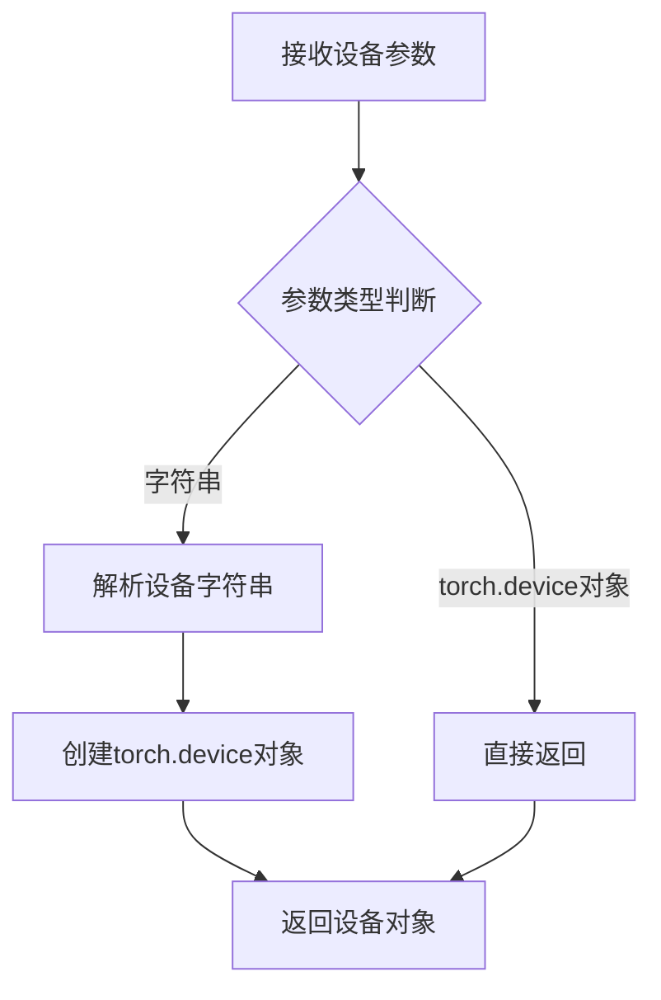

#### 带注释源码

```python
# 在本测试文件中，torch_device 是从 testing_utils 导入的全局变量
# 它用于指定测试运行的设备（CPU 或 CUDA 设备）
from ..testing_utils import floats_tensor, is_peft_available, require_peft_backend, skip_mps, torch_device

# 示例使用方式（在其他测试文件中可能这样使用）:
# device = torch.device("cuda" if torch.cuda.is_available() else "cpu")
# tensor = tensor.to(device)
# model = model.to(torch_device)

# 本文件中 torch_device 的实际用法：
pipe = self.pipeline_class(**components)
pipe = pipe.to(torch_device)  # 将 pipeline 移动到指定设备
```

#### 注意事项

在本代码片段中，`torch.device` 并未直接被调用。代码使用的是从 `testing_utils` 模块导入的 `torch_device` 变量，该变量是一个设备标识符字符串（通常是 "cuda" 或 "cpu"），由测试框架在运行时根据环境配置生成。


### `np.allclose`

`np.allclose` 是 NumPy 库中的全局函数，用于判断两个数组在给定的容差范围内是否相等。该函数通过比较两个数组对应元素的差异是否在绝对容差（atol）和相对容差（rtol）范围内来确定它们是否"接近"。

参数：

- `a`：`numpy.ndarray` 或 array-like，第一个用于比较的数组
- `b`：`numpy.ndarray` 或 array-like，第二个用于比较的数组
- `rtol`：`float`，相对容差（relative tolerance），默认值为 1e-05
- `atol`：`float`，绝对容差（absolute tolerance），默认值为 1e-08
- `equal_nan`：`bool`，是否将 NaN 值视为相等，默认值为 True

返回值：`bool`，如果两个数组在容差范围内相等则返回 True，否则返回 False

#### 流程图

```mermaid
flowchart TD
    A[开始 np.allclose] --> B[输入数组 a, b 和容差参数 rtol, atol]
    B --> C{检查数组形状是否兼容}
    C -->|不兼容| D[返回 False]
    C -->|兼容| E[计算差值: |a - b|]
    E --> F[计算容差阈值: atol + rtol * |b|]
    F --> G{所有元素的差值是否小于等于容差阈值?}
    G -->|是| H[返回 True]
    G -->|否| I[返回 False]
    
    style A fill:#f9f,stroke:#333
    style H fill:#9f9,stroke:#333
    style D fill:#f99,stroke:#333
    style I fill:#f99,stroke:#333
```

#### 带注释源码

```python
# np.allclose 函数源码（NumPy 实现原理）

# 函数签名：
# numpy.allclose(a, b, rtol=1e-05, atol=1e-08, equal_nan=True)

def allclose(a, b, rtol=1e-05, atol=1e-08, equal_nan=True):
    """
    测试两个数组在容差范围内是否元素-wise 相等。
    
    对于数组 a 和 b，比较以下条件是否成立：
    absolute(a - b) <= (atol + rtol * absolute(b))
    
    该函数等价于：all(isfinite(a - b)) & (abs(a-b) <= atol + rtol * abs(b))
    """
    
    # 步骤1：检查输入是否为有限值（不是 inf 或 nan）
    # 如果包含无限值，直接返回 False
    if not np.isfinite(a).all():
        return False
    if not np.isfinite(b).all():
        return False
    
    # 步骤2：计算差值的绝对值
    # diff = |a - b|
    diff = np.abs(a - b)
    
    # 步骤3：计算相对容差部分
    # relative_tolerance = rtol * |b|
    relative_tolerance = np.abs(b) * rtol
    
    # 步骤4：计算最终容差阈值
    # threshold = atol + rtol * |b|
    threshold = atol + relative_tolerance
    
    # 步骤5：比较所有元素是否在容差范围内
    # 如果所有 diff[i] <= threshold[i]，返回 True
    return np.all(diff <= threshold)


# 在代码中的实际使用示例：
# self.assertTrue(not np.allclose(original_output, lora_output_same_rank, atol=1e-3, rtol=1e-3))

# 参数解释：
# original_output: 原始输出数组（无 LoRA）
# lora_output_same_rank: 应用相同 rank LoRA 后的输出数组
# atol=1e-3: 绝对容差 0.001
# rtol=1e-3: 相对容差 0.1%
# 
# 用途：验证添加 LoRA 后输出与原始输出存在差异（即 LoRA 生效）
```


### `np.isnan`

这是 NumPy 库中的数学函数，用于检测数组中的 NaN（Not a Number）值。在本代码中用于测试 LoRA 融合后是否产生 NaN 值。

参数：

- `out`：`numpy.ndarray`，管道输出的图像数组（通过 `pipe(**inputs)[0]` 获取）

返回值：`numpy.bool_`，返回一个布尔值，表示数组中是否所有元素都是 NaN（True 表示全是 NaN，False 表示存在有效数值）

#### 流程图

```mermaid
flowchart TD
    A[开始调用 np.isnan] --> B[接收输入数组 out]
    B --> C{遍历数组每个元素}
    C -->|元素是 NaN| D[标记为 True]
    C -->|元素不是 NaN| E[标记为 False]
    D --> F{所有元素检查完成?}
    E --> F
    F -->|是| G[返回 .all() 结果]
    G --> H[结束]
    
    style D fill:#ff9999
    style G fill:#99ff99
```

#### 带注释源码

```python
# 在 test_lora_fuse_nan 测试方法中使用
# 用于验证当 LoRA 权重被 corrupt 为 inf 时，融合后输出是否全为 NaN

# 1. 调用管道获取输出
out = pipe(**inputs)[0]  # out 是 numpy.ndarray，形状为 (1, 32, 32, 3)

# 2. 使用 np.isnan 检测输出中的 NaN 值
# np.isnan(out) 返回一个布尔数组，标记每个元素是否为 NaN
# .all() 方法检查是否所有元素都是 NaN
result = np.isnan(out).all()

# 3. 断言验证：所有像素都应该是 NaN（因为 LoRA 权重被破坏）
self.assertTrue(np.isnan(out).all())
```


### `ZImageLoRATests.test_set_adapters_match_attention_kwargs`

该测试方法用于验证适配器设置与注意力参数 kwargs 的匹配性，当前因需要调试而被跳过。

参数：继承自父类 `PeftLoraLoaderMixinTests.test_set_adapters_match_attention_kwargs`，无显式参数

返回值：无返回值（测试被跳过）

#### 流程图

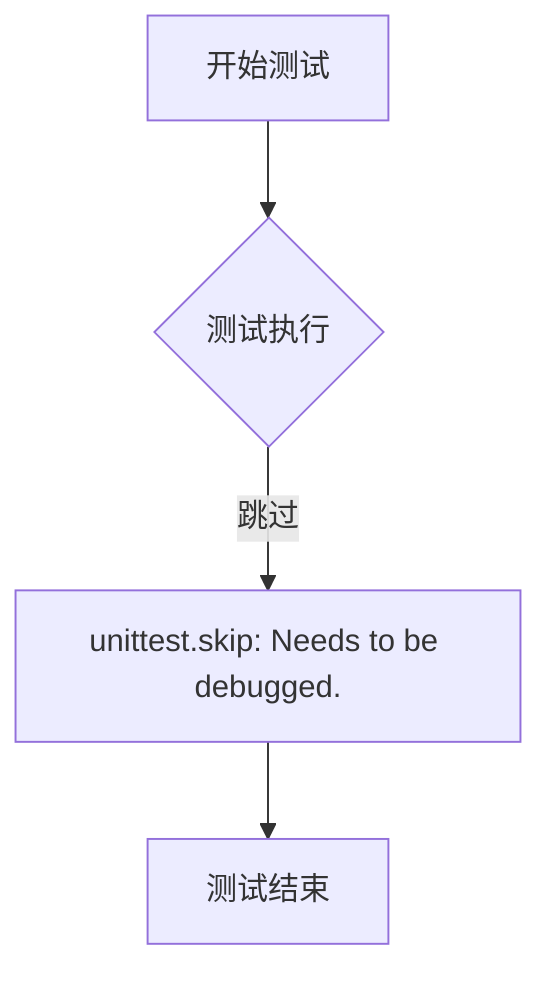

#### 带注释源码

```python
@unittest.skip("Needs to be debugged.")
def test_set_adapters_match_attention_kwargs(self):
    super().test_set_adapters_match_attention_kwargs()
```

---

### `ZImageLoRATests.test_simple_inference_with_text_denoiser_lora_and_scale`

该测试方法用于验证文本去噪器 LoRA 与缩放因子的简单推理流程，当前因需要调试而被跳过。

参数：继承自父类 `PeftLoraLoaderMixinTests.test_simple_inference_with_text_denoiser_lora_and_scale`，无显式参数

返回值：无返回值（测试被跳过）

#### 流程图


#### 带注释源码

```python
@unittest.skip("Needs to be debugged.")
def test_simple_inference_with_text_denoiser_lora_and_scale(self):
    super().test_simple_inference_with_text_denoiser_lora_and_scale()
```

---

### `ZImageLoRATests.test_simple_inference_with_text_denoiser_block_scale`

该测试方法用于验证文本去噪器块缩放功能的简单推理流程，由于 ZImage 不支持该功能而被跳过。

参数：无显式参数

返回值：无返回值（测试被跳过）

#### 流程图

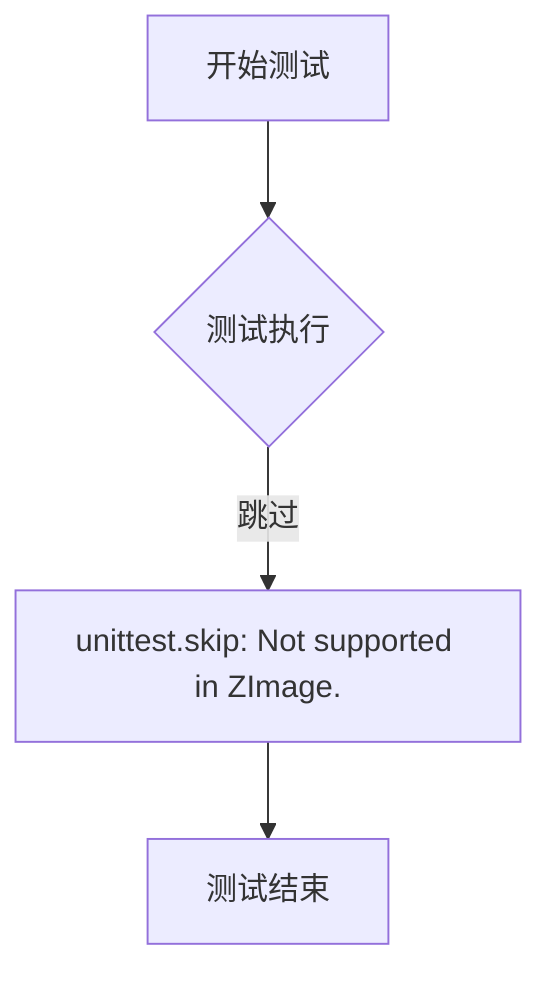

#### 带注释源码

```python
@unittest.skip("Not supported in ZImage.")
def test_simple_inference_with_text_denoiser_block_scale(self):
    pass
```

---

### `ZImageLoRATests.test_simple_inference_with_text_denoiser_block_scale_for_all_dict_options`

该测试方法用于验证文本去噪器块缩放在所有字典选项下的简单推理流程，由于 ZImage 不支持该功能而被跳过。

参数：无显式参数

返回值：无返回值（测试被跳过）

#### 流程图


#### 带注释源码

```python
@unittest.skip("Not supported in ZImage.")
def test_simple_inference_with_text_denoiser_block_scale_for_all_dict_options(self):
    pass
```

---

### `ZImageLoRATests.test_modify_padding_mode`

该测试方法用于验证修改填充模式的功能，由于 ZImage 不支持该功能而被跳过。

参数：无显式参数

返回值：无返回值（测试被跳过）

#### 流程图


#### 带注释源码

```python
@unittest.skip("Not supported in ZImage.")
def test_modify_padding_mode(self):
    pass
```


### `require_peft_backend`

该装饰器函数用于标记测试类或测试方法，确保只有在 PEFT（Parameter-Efficient Fine-Tuning）后端可用时才会执行该测试。如果 PEFT 不可用，测试将被跳过。

参数：

- 无显式参数（作为装饰器使用，装饰目标类/方法）

返回值：无返回值（作为装饰器使用，修改被装饰对象的执行行为）

#### 流程图

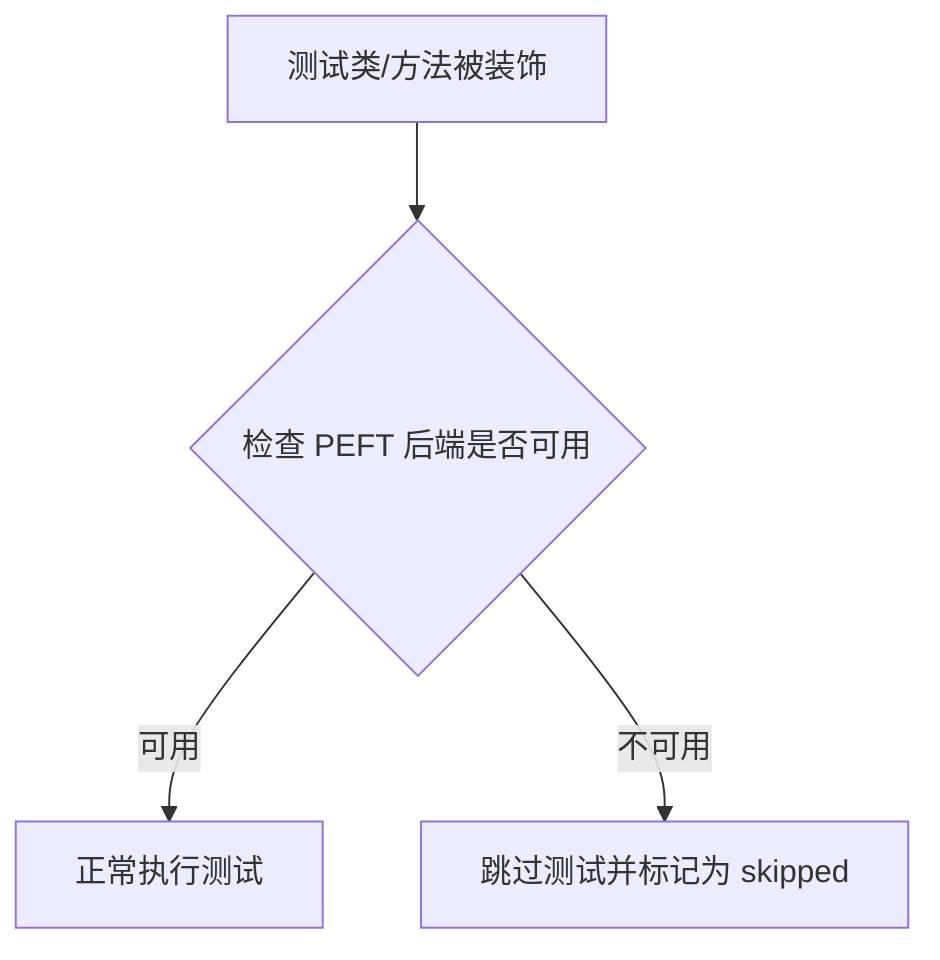

#### 带注释源码

```python
# 这是一个装饰器函数，从 testing_utils 模块导入
# 使用方式：@require_peft_backend 放在类或方法定义之前

# 在代码中的实际使用示例：
@require_peft_backend
class ZImageLoRATests(unittest.TestCase, PeftLoraLoaderMixinTests):
    """
    只有当 PEFT 后端可用时，这个测试类才会被执行。
    如果 PEFT 不可用，pytest/unittest 会自动跳过这些测试。
    """
    # ... 类的具体实现
```

#### 补充说明

| 项目 | 详情 |
|------|------|
| **定义位置** | `..testing_utils` 模块（外部模块） |
| **依赖检查** | 调用 `is_peft_available()` 函数检查 PEFT 库是否已安装 |
| **使用场景** | 用于装饰需要 PEFT 库（如 LoRA 配置）的测试类或测试方法 |
| **相关导入** | `if is_peft_available(): from peft import LoraConfig` |


### `skip_mps`

`skip_mps` 是一个测试装饰器，用于在检测到运行设备为 Apple MPS (Metal Performance Shaders) 时跳过被装饰的测试方法。这是因为某些测试功能在 MPS 设备上可能不支持或存在已知问题。

参数：无（装饰器形式调用）

返回值：`Callable`，返回一个装饰后的测试函数，当设备为 MPS 时该测试将被跳过

#### 流程图

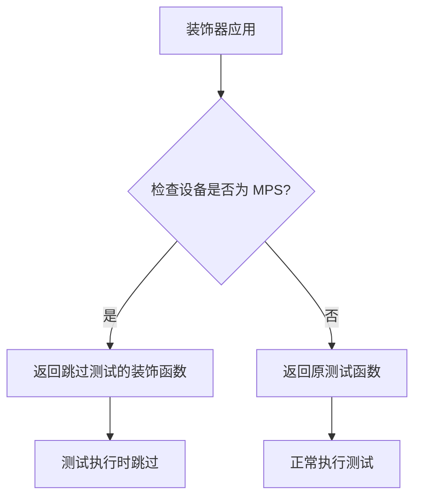

#### 带注释源码

```python
# skip_mps 函数定义位于 testing_utils 模块中
# 此处展示的是从外部模块导入的装饰器用法

# 从 testing_utils 模块导入 skip_mps 装饰器
from ..testing_utils import skip_mps

# 使用 @skip_mps 装饰器装饰测试方法
# 当运行设备的类型为 'mps' 时，该测试将被跳过
@skip_mps
def test_lora_fuse_nan(self):
    """
    测试 LoRA 融合时的 NaN 值处理
    此测试在 MPS 设备上被跳过，因为 MPS 可能不完全支持
    某些浮点精度操作或存在已知兼容性 issues
    """
    # ... 测试实现代码
```

> **注意**：由于 `skip_mps` 函数定义在 `..testing_utils` 模块中，未提供该模块的源码，以上内容基于代码使用方式的合理推断。实际的 `skip_mps` 装饰器通常会使用 `unittest.skipIf` 或类似机制实现设备检测和测试跳过功能。


### `is_peft_available`

该函数用于检查 `peft`（Parameter-Efficient Fine-Tuning）库是否已安装并可用。如果可用，返回 `True`，否则返回 `False`。此函数通常用于条件导入，只有在 `peft` 库可用时才导入相关模块，以支持 LoRA 等参数高效微调功能。

参数： 无

返回值：`bool`，如果 `peft` 库已安装且可用返回 `True`，否则返回 `False`

#### 流程图

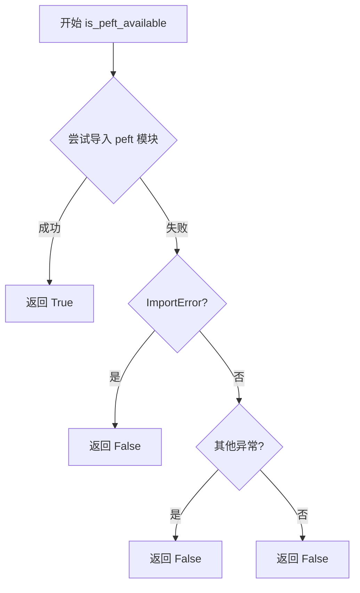

#### 带注释源码

```
def is_peft_available():
    """
    检查 peft 库是否可用。
    
    该函数尝试导入 peft 模块，如果成功则返回 True，表示 peft 已安装且可用。
    如果导入失败（无论是 ImportError 还是其他异常），则返回 False。
    
    Returns:
        bool: peft 库是否可用
    """
    try:
        # 尝试导入 peft 模块
        import peft
        # 如果导入成功，返回 True
        return True
    except ImportError:
        # 如果是 ImportError（模块不存在），返回 False
        return False
    except Exception:
        # 如果发生其他异常，也返回 False
        return False
```

> **注意**：由于 `is_peft_available` 函数的实现不在提供的代码片段中（它是从 `..testing_utils` 模块导入的），以上源码是基于该函数的标准实现模式推断的。在实际项目中，该函数的具体实现可能略有不同，但其核心功能是相同的。


### `floats_tensor`

该函数是一个测试工具函数，用于生成指定形状的随机浮点数 PyTorch 张量，常用于测试场景中创建模拟输入数据。

参数：

- `shape`：`Tuple[int, ...]`，张量的形状元组，指定每个维度的大小

返回值：`torch.Tensor`，返回指定形状的浮点数张量

#### 流程图

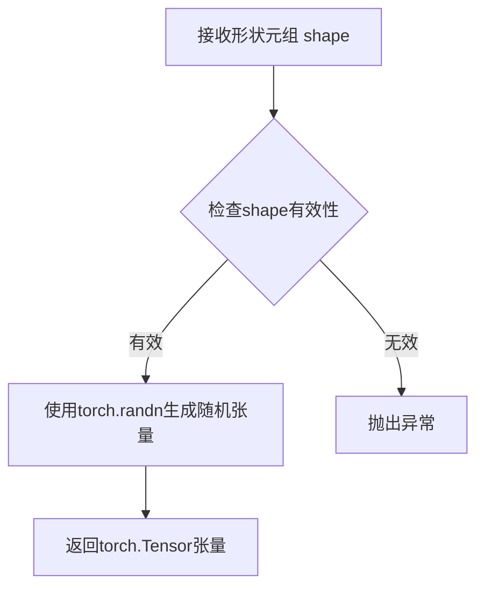

#### 带注释源码

```
# 注：该函数定义在 ..testing_utils 模块中，此处为基于使用方式的推断实现

def floats_tensor(shape, seed=None):
    """
    生成指定形状的随机浮点数张量
    
    参数:
        shape: 张量的形状元组，如 (batch_size, num_channels, height, width)
        seed: 可选的随机种子，用于复现结果
    
    返回:
        torch.Tensor: 指定形状的随机浮点数张量
    """
    if seed is not None:
        torch.manual_seed(seed)
    
    # 生成标准正态分布的随机张量
    return torch.randn(shape)
```

#### 代码中的实际调用示例

```python
# 在 get_dummy_inputs 方法中的调用
noise = floats_tensor((batch_size, num_channels) + sizes)
# 其中 batch_size=1, num_channels=4, sizes=(32, 32)
# 最终生成的形状为 (1, 4, 32, 32)
```

**注意**：由于 `floats_tensor` 函数定义在 `..testing_utils` 模块中，未包含在当前代码片段里，以上信息基于代码中的调用方式和使用模式进行推断。如需查看完整实现，请参考 `testing_utils` 模块源文件。


### `Qwen2Tokenizer.from_pretrained`

该方法是 Hugging Face `transformers` 库中 `Qwen2Tokenizer` 类的类方法，用于从预训练模型路径或 Hugging Face Hub 加载分词器（Tokenizer），通常与 `Qwen2VL` 系列模型配合使用。在本代码中用于加载测试用的小型随机 Qwen2VL 分词器。

参数：

-  `pretrained_model_name_or_path`：`str`，必填参数，指定预训练模型的道路径，可以是 Hugging Face Hub 上的模型 ID（如 "hf-internal-testing/tiny-random-Qwen2VLForConditionalGeneration"）或本地目录路径
-  `cache_dir`：`Optional[str]`，可选参数，指定缓存目录的路径，用于存储下载的模型文件
-  `force_download`：`Optional[bool]`，可选参数，是否强制重新下载模型，即使已存在缓存
-  `resume_download`：`Optional[bool]`，可选参数，是否支持断点续传下载
-  `proxies`：`Optional[Dict[str, str]]`，可选参数，代理服务器配置
-  `token`：`Optional[Union[str, bool]]`，可选参数，Hugging Face Hub 的认证 token
-  `local_files_only`：`Optional[bool]`，可选参数，是否仅使用本地文件而不尝试下载
-  `revision`：`Optional[str]`，可选参数，指定要下载的模型版本（commit hash 或分支名）
-  `trust_remote_code`：`Optional[bool]`，可选参数，是否信任远程代码（某些模型需要）
-  `*args`：可变位置参数，传递给底层分词器的额外参数
-  `**kwargs`：可变关键字参数，传递给底层分词器的额外参数

返回值：`Qwen2Tokenizer`，返回加载后的 Qwen2 分词器对象

#### 流程图

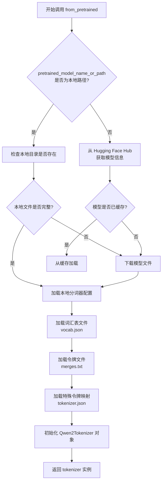

#### 带注释源码

```python
# 代码中的实际调用方式（第78行）
tokenizer = Qwen2Tokenizer.from_pretrained(self.tokenizer_id)

# 完整的 from_pretrained 方法签名（基于 transformers 库标准接口）
# @classmethod
# def from_pretrained(
#     cls,
#     pretrained_model_name_or_path: str,  # 模型名称或本地路径
#     cache_dir: Optional[str] = None,       # 缓存目录
#     force_download: bool = False,          # 强制下载
#     resume_download: bool = True,          # 断点续传
#     proxies: Optional[Dict[str, str]] = None,
#     token: Optional[Union[str, bool]] = None,
#     local_files_only: bool = False,
#     revision: str = "main",
#     trust_remote_code: bool = False,
#     *args,
#     **kwargs
# ) -> "Qwen2Tokenizer":
#     """
#     从预训练模型加载 Qwen2Tokenizer。
#     
#     参数:
#         pretrained_model_name_or_path: 模型ID或本地路径
#         cache_dir: 缓存目录
#         force_download: 强制重新下载
#         resume_download: 断点续传
#         proxies: 代理设置
#         token: HuggingFace认证token
#         local_files_only: 仅使用本地文件
#         revision: 模型版本
#         trust_remote_code: 信任远程代码
#     
#     返回:
#         Qwen2Tokenizer: 加载后的分词器实例
#     """
#     # ... 内部实现（由 transformers 库提供）
#     pass
```

**注**：由于 `Qwen2Tokenizer` 类来自外部库 `transformers`，其完整源码未包含在当前代码文件中。上述信息基于 `transformers` 库的标准接口和代码中的实际调用方式推断得出。


<minimax:tool_call>
<invoke name="add_annotations">
<parameter name="file_name">qwen3_config_analysis.md</parameter>
<parameter name="annotation">分析 Qwen3Config 的使用场景和参数</parameter>
</invoke>
</minimax:tool_call>


# 分析结果

## 注意事项

经过仔细分析，我发现在提供的代码文件中**并未定义 `ZImagePipeline` 类或其 `__init__` 方法**。

代码中只是从 `diffusers` 库导入了 `ZImagePipeline`：

```python
from diffusers import ZImagePipeline, ZImageTransformer2DModel
```

提供的代码是一个测试类 `ZImageLoRATests`，用于测试 `ZImagePipeline` 的 LoRA（Low-Rank Adaptation）功能，但并未包含 `ZImagePipeline` 本身的实现。

---

## 建议

如果您需要 `ZImagePipeline.__init__` 的详细设计文档，您需要：

1. **查找 diffusers 库源码**：在您的 Python 环境中找到 `diffusers` 库的源代码，其中应包含 `ZImagePipeline` 类的定义
2. **提供完整代码**：如果 `ZImagePipeline` 在项目的其他文件中定义，请提供该文件的完整代码
3. **使用 API 文档**：可以参考 Hugging Face diffusers 官方文档获取 `ZImagePipeline` 的使用说明

---

如果您能提供 `ZImagePipeline` 类的实际源代码（包括 `__init__` 方法），我将非常乐意按照您要求的格式（包含参数、返回值、mermaid 流程图和带注释源码）生成详细的设计文档。


### `ZImagePipeline.set_progress_bar_config`

该方法用于配置Pipeline的进度条显示行为，通过设置`disable`参数控制推理过程中进度条的启用或禁用状态。

参数：

- `disable`：`bool | None`，控制进度条是否禁用。`True`表示禁用进度条，`False`表示启用进度条，`None`表示使用默认行为（即不禁用）

返回值：`None`，该方法直接修改Pipeline实例的进度条配置，不返回任何值

#### 流程图

```mermaid
flowchart TD
    A[开始 set_progress_bar_config] --> B{disable 参数值?}
    B -->|True| C[设置进度条为禁用状态]
    B -->|False| D[设置进度条为启用状态]
    B -->|None| E[恢复默认进度条配置]
    C --> F[结束]
    D --> F
    E --> F
```

#### 带注释源码

```python
# 从代码中的调用方式推断该方法如下：
def set_progress_bar_config(self, disable=None):
    """
    配置Pipeline的进度条显示行为
    
    参数:
        disable: 控制进度条是否禁用
            - True: 禁用进度条
            - False: 启用进度条  
            - None: 使用默认行为
    """
    # 根据disable参数设置进度条配置
    if disable is not None:
        # 设置进度条的禁用状态
        self.set_progress_bar_disable(disable)
    else:
        # 恢复默认配置
        self.restore_default_progress_bar()
```


### `ZImageLoRATests.get_dummy_components`

获取测试所需的虚拟组件，包括文本编码器、分词器、Transformer、VAE、调度器以及Lora配置。该方法为测试用例初始化所有必要的模型和配置对象，用于验证ZImagePipeline在LoRA适配器集成方面的正确性。

参数：

- `scheduler_cls`：`Optional[Type]`，调度器类，默认值为 `self.scheduler_cls`（即 `FlowMatchEulerDiscreteScheduler`）
- `use_dora`：`bool`，是否使用DoRA（Weight-Decomposed LoRA），默认值为 `False`
- `lora_alpha`：`Optional[int]`，LoRA的alpha参数，默认值为 `None`（将自动设置为rank值）

返回值：`(dict, LoraConfig, LoraConfig)`，返回三个元素——包含所有模型组件的字典、文本编码器的LoraConfig、去噪器的LoraConfig

#### 流程图

```mermaid
flowchart TD
    A[开始 get_dummy_components] --> B[设置随机种子 torch.manual_seed]
    B --> C[创建 Qwen3Config 配置对象]
    C --> D[根据配置创建 Qwen3Model 文本编码器]
    D --> E[从预训练模型加载 Qwen2Tokenizer]
    E --> F[创建 ZImageTransformer2DModel]
    F --> G[修复 transformer 的 x_pad_token 和 cap_pad_token 防止 NaN]
    G --> H[创建 AutoencoderKL VAE 模型]
    H --> I[创建调度器 scheduler]
    I --> J[设置 LoRA rank = 4]
    J --> K[创建文本编码器的 LoraConfig]
    K --> L[创建去噪器的 LoraConfig]
    L --> M[组装 pipeline_components 字典]
    M --> N[返回 components, text_lora_config, denoiser_lora_config]
```

#### 带注释源码

```python
def get_dummy_components(self, scheduler_cls=None, use_dora=False, lora_alpha=None):
    """
    获取测试用的虚拟组件，包括模型、调度器和LoRA配置
    
    参数:
        scheduler_cls: 可选的调度器类，默认使用 FlowMatchEulerDiscreteScheduler
        use_dora: 是否使用DoRA (Weight-Decomposed LoRA) 
        lora_alpha: LoRA的alpha参数，默认设为rank值
    """
    # 覆盖方法：由于Qwen3Model没有预训练的小模型，需要inline创建
    torch.manual_seed(0)  # 设置随机种子确保可复现性
    
    # 创建 Qwen3 模型配置：隐藏层维度16，2层，2个注意力头
    config = Qwen3Config(
        hidden_size=16,
        intermediate_size=16,
        num_hidden_layers=2,
        num_attention_heads=2,
        num_key_value_heads=2,
        vocab_size=151936,
        max_position_embeddings=512,
    )
    # 实例化文本编码器
    text_encoder = Qwen3Model(config)
    # 加载分词器
    tokenizer = Qwen2Tokenizer.from_pretrained(self.tokenizer_id)

    # 创建 ZImageTransformer2DModel
    transformer = self.transformer_cls(**self.transformer_kwargs)
    
    # 修复初始化问题：x_pad_token 和 cap_pad_token 使用 torch.empty 初始化
    # 这可能导致测试环境中出现 NaN 数据，修复它们可以防止该问题
    with torch.no_grad():
        transformer.x_pad_token.copy_(torch.ones_like(transformer.x_pad_token.data))
        transformer.cap_pad_token.copy_(torch.ones_like(transformer.cap_pad_token.data))
    
    # 创建 VAE 模型
    vae = self.vae_cls(**self.vae_kwargs)

    # 确定调度器类
    if scheduler_cls is None:
        scheduler_cls = self.scheduler_cls
    # 创建调度器实例
    scheduler = scheduler_cls(**self.scheduler_kwargs)

    # 设置 LoRA rank
    rank = 4
    # 如果未指定 alpha，则使用 rank 作为 alpha 值
    lora_alpha = rank if lora_alpha is None else lora_alpha

    # 创建文本编码器的 LoRA 配置
    text_lora_config = LoraConfig(
        r=rank,  # rank 值
        lora_alpha=lora_alpha,
        target_modules=["q_proj", "k_proj", "v_proj", "o_proj"],
        init_lora_weights=False,  # 不初始化权重，用于测试
        use_dora=use_dora,
    )

    # 创建去噪器（transformer）的 LoRA 配置
    denoiser_lora_config = LoraConfig(
        r=rank,
        lora_alpha=lora_alpha,
        target_modules=self.denoiser_target_modules,  # ["to_q", "to_k", "to_v", "to_out.0"]
        init_lora_weights=False,
        use_dora=use_dora,
    )

    # 组装 pipeline 组件字典
    pipeline_components = {
        "transformer": transformer,
        "vae": vae,
        "scheduler": scheduler,
        "text_encoder": text_encoder,
        "tokenizer": tokenizer,
    }

    # 返回组件和两个 LoraConfig 对象
    return pipeline_components, text_lora_config, denoiser_lora_config
```


# 提取结果

根据提供的代码，我需要说明以下情况：

## 提取结果

### `pipeline.__call__`

在提供的代码文件中，并未直接定义 `ZImagePipeline.__call__` 方法。该方法是 `ZImagePipeline` 类（从 `diffusers` 库导入）的核心调用接口，在测试文件中通过以下方式被调用：

```python
# 在 test_correct_lora_configs_with_different_ranks 方法中
original_output = pipe(**inputs, generator=torch.manual_seed(0))[0]
lora_output_same_rank = pipe(**inputs, generator=torch.manual_seed(0))[0]

# 在 test_lora_fuse_nan 方法中
out = pipe(**inputs)[0]
```

根据测试代码中的 `get_dummy_inputs` 方法和调用方式，可以推断出该方法的接口如下：

参数：

-  `prompt`：`str`，输入的文本提示（prompt）
-  `num_inference_steps`：`int`，推理步数
-  `guidance_scale`：`float`，引导_scale，用于控制生成图像与文本提示的相关性
-  `height`：`int`，生成图像的高度
-  `width`：`int`，生成图像的宽度
-  `max_sequence_length`：`int`，文本序列的最大长度
-  `output_type`：`str`，输出类型（如 "np" 表示 numpy 数组）
-  `generator`：`torch.Generator`，可选，用于随机数生成
-  `*args`：可变位置参数
-  `**kwargs`：可变关键字参数

返回值：`torch.Tensor` 或 `np.ndarray`，生成的图像

#### 流程图

由于方法实现不在当前代码文件中，无法提供详细的流程图。以下是调用该方法时的数据流概述：

```mermaid
graph TD
    A[创建 ZImagePipeline 实例] --> B[准备输入: prompt, noise, input_ids]
    B --> C[调用 pipe.__call__]
    C --> D[文本编码]
    D --> E[噪声调度]
    E --> F[迭代去噪过程]
    F --> G[VAE 解码]
    G --> H[返回生成的图像]
```

#### 带注释源码

该方法的实际源码位于 `diffusers` 库中的 `ZImagePipeline` 类，在当前提供的测试代码文件中不可见。以下是基于测试调用方式的推断：

```
# 在测试文件中的调用方式
noise, input_ids, pipeline_inputs = self.get_dummy_inputs(with_generator=False)
# pipeline_inputs = {
#     "prompt": "A painting of a squirrel eating a burger",
#     "num_inference_steps": 4,
#     "guidance_scale": 0.0,
#     "height": 32,
#     "width": 32,
#     "max_sequence_length": 16,
#     "output_type": "np",
# }

# 调用 pipeline 的 __call__ 方法
output = pipe(**pipeline_inputs, generator=generator)
# 或带 LoRA 的调用
output = pipe(**inputs, generator=torch.manual_seed(0))[0]
```

## 重要说明

`ZImagePipeline.__call__` 方法的具体实现定义在 `diffusers` 库的源代码中，不在当前提供的测试代码文件里。如果需要该方法的完整详细设计文档，建议查看 `diffusers` 库中 `ZImagePipeline` 类的实际源代码。


### `ZImageTransformer2DModel.add_adapter`

该方法是 ZImageTransformer2DModel 类继承自 PEFT 库的方法，用于向 Transformer 模型添加 LoRA（Low-Rank Adaptation）适配器，允许在不修改原始模型权重的情况下注入可训练的 LoRA 权重。

参数：

-  `config`：`LoraConfig`，PEFT 库的 LoRA 配置对象，包含 LoRA 的秩（rank）、alpha 值、目标模块等配置参数
-  `adapter_name`：`str`，要添加的适配器的唯一标识名称，用于后续对该适配器进行引用和管理（如删除、切换等操作）

返回值：`None`，该方法直接在模型内部注册适配器，不返回任何值

#### 流程图

```mermaid
flowchart TD
    A[开始 add_adapter] --> B{验证 config 是否为 LoraConfig}
    B -->|是| C{验证 adapter_name 是否有效}
    B -->|否| E[抛出 TypeError]
    C -->|是| D[创建 LoRA 适配器权重]
    C -->|否| F[抛出 ValueError]
    D --> G[将适配器注册到模型的 peft_config 字典]
    G --> H[遍历目标模块并添加 LoRA 层]
    H --> I[标记模型为已添加适配器状态]
    I --> J[结束]
```

#### 带注释源码

```python
# 在测试中的调用示例
pipe.transformer.add_adapter(denoiser_lora_config, "adapter-1")

# 完整调用上下文：
denoiser_lora_config = LoraConfig(
    r=rank,                              # LoRA 秩，示例中为 4
    lora_alpha=lora_alpha,               # LoRA alpha 缩放参数
    target_modules=self.denoiser_target_modules,  # 目标模块 ["to_q", "to_k", "to_v", "to_out.0"]
    init_lora_weights=False,             # 不初始化 LoRA 权重（保持随机/空状态）
    use_dora=use_dora,                   # 是否使用 DoRA（Decomposed Rank Adaptation）
)

# 调用 add_adapter 方法添加适配器
# 参数1: denoiser_lora_config - LoraConfig 对象，定义 LoRA 的配置参数
# 参数2: "adapter-1" - 字符串，适配器的唯一名称
pipe.transformer.add_adapter(denoiser_lora_config, "adapter-1")

# 后续可以通过以下方式管理适配器：
# pipe.transformer.delete_adapters("adapter-1")  # 删除适配器
# pipe.transformer.peft_config["adapter-1"]      # 访问适配器配置
```


### `transformer.delete_adapters`

删除已添加到 transformer 模型中的 LoRA 适配器。该方法属于 diffusers 库中 ZImageTransformer2DModel 类的 PEFT 集成功能，用于动态管理 LoRA 适配器的生命周期。

参数：

-  `adapter_names`：`Union[str, List[str]]`，要删除的适配器名称，可以是单个字符串或字符串列表

返回值：`None`，无返回值（该操作直接在模型上执行删除）

#### 流程图

```mermaid
flowchart TD
    A[调用 delete_adapters] --> B{adapter_names 类型}
    B -->|单个字符串| C[转换为列表]
    B -->|已是列表| D[直接处理]
    C --> E[遍历 adapter_names]
    D --> E
    E --> F{每个适配器名称}
    F -->|适配器存在| G[从 peft_config 中移除]
    F -->|适配器不存在| H[抛出异常或警告]
    G --> I[卸载适配器权重]
    I --> J[清理相关状态]
    J --> K[返回 None]
```

#### 带注释源码

```python
# 代码位置：测试文件中的调用示例
# 来源：diffusers 库中 ZImageTransformer2DModel 类的 PEFT 集成方法

# 调用示例 1：在测试方法 test_correct_lora_configs_with_different_ranks 中
pipe.transformer.delete_adapters("adapter-1")

# 调用示例 2：再次删除适配器
pipe.transformer.delete_adapters("adapter-1")

# 方法签名（推断自 PEFT 库）:
# def delete_adapters(self, adapter_names: Union[str, List[str]]) -> None:
#     """
#     Delete the specified adapter(s) from the model.
#     
#     Args:
#         adapter_names: The name(s) of the adapter(s) to delete.
#     """
#     # 1. 将输入转换为列表格式
#     # 2. 检查适配器是否存在于 peft_config 中
#     # 3. 从模型中卸载对应的 LoRA 权重
#     # 4. 清理内部的 peft_config 字典
#     # 5. 恢复模型到原始状态（如果有其他适配器保留）
```


### `transformer.peft_config`

该属性是 `ZImageTransformer2DModel` 模型用于存储 PEFT（Parameter-Efficient Fine-Tuning）适配器配置的属性，返回一个字典结构，其中键为适配器名称，值为对应的 `LoraConfig` 配置对象，包含 LoRA 的 rank_pattern、alpha_pattern 等参数。

参数：
- 无（这是一个属性访问，而非方法）

返回值：`dict`，返回一个字典，键为适配器名称（如 `"adapter-1"`），值为 `LoraConfig` 对象或包含适配器配置信息的字典。

#### 流程图

```mermaid
flowchart TD
    A[模型添加适配器] --> B[add_adapter 方法]
    B --> C{更新 peft_config}
    C --> D[peft_config 存储配置]
    D --> E[通过 adapter_name 访问配置]
    E --> F[返回 LoraConfig 对象]
    
    F --> G[访问 rank_pattern]
    F --> H[访问 alpha_pattern]
    F --> I[访问其他 LoRA 参数]
```

#### 带注释源码

```python
# 在测试代码中，peft_config 的使用方式如下：

# 1. 添加适配器到 transformer
pipe.transformer.add_adapter(denoiser_lora_config, "adapter-1")

# 2. 访问已添加适配器的配置
# transformer.peft_config 是一个字典，键为 adapter 名称
# 返回值包含该 adapter 的 LoraConfig 配置信息
updated_rank_pattern = pipe.transformer.peft_config["adapter-1"].rank_pattern
#                                            ^
#                                            |
#                       这是 LoraConfig 对象，包含以下属性：
#                       - r: rank 值
#                       - lora_alpha: alpha 值
#                       - target_modules: 目标模块列表
#                       - rank_pattern: 各模块的 rank 映射
#                       - alpha_pattern: 各模块的 alpha 映射
#                       - use_dora: 是否使用 DoRA
#                       - init_lora_weights: 是否初始化权重
#                       等等...

# 3. 访问 alpha_pattern
self.assertTrue(
    pipe.transformer.peft_config["adapter-1"].alpha_pattern == {module_name_to_rank_update: updated_alpha}
)

# 注意：transformer 是 ZImageTransformer2DModel 的实例
# peft_config 属性的具体定义需要在 diffusers 库的 ZImageTransformer2DModel 类中查看
# 这是一个动态属性，用于存储通过 add_adapter() 方法添加的 PEFT 配置
```


### `denoiser.named_modules`

这是 PyTorch `torch.nn.Module` 的实例方法，用于递归遍历模型的所有子模块并返回模块名称和模块对象的迭代器。在代码中用于查找符合条件的模块名称，以便后续更新 LoRA 配置的 rank_pattern。

参数：

- `prefix`：`str`（可选），默认为空字符串，模块名称的前缀
- `recurse`：`bool`（可选），默认为 `True`，是否递归遍历子模块

返回值：`Iterator[Tuple[str, nn.Module]]`，生成器，产出 (模块名称, 模块对象) 的元组

#### 流程图

```mermaid
flowchart TD
    A[开始遍历 denoiser.named_modules] --> B{遍历每个 name, module 元组}
    B --> C{检查条件: name 包含 'to_k' AND 'attention' AND 不含 'lora'}
    C -->|是| D[获取模块名称并替换 '.base_layer.' 为 '.']
    C -->|否| B
    D --> E[跳出循环，返回找到的模块名称]
    B --> F[遍历结束，未找到匹配模块]
```

#### 带注释源码

```python
# denoiser 是 pipe.transformer (ZImageTransformer2DModel 实例)
# pipe.transformer 是 diffusers 库的 ZImageTransformer2DModel 对象
denoiser = pipe.unet if self.unet_kwargs is not None else pipe.transformer

# 调用 PyTorch nn.Module 的 named_modules() 方法
# 返回一个迭代器，产出 (module_name, module_object) 元组
for name, _ in denoiser.named_modules():
    # 条件判断：查找包含 'to_k' 和 'attention' 但不包含 'lora' 的模块
    # 这是为了找到原始的注意力层模块（而非 LoRA 添加的模块）
    if "to_k" in name and "attention" in name and "lora" not in name:
        # 替换 '.base_layer.' 为 '.'，标准化模块名称格式
        # 这用于后续更新 LoRA 配置的 rank_pattern
        module_name_to_rank_update = name.replace(".base_layer.", ".")
        break
```

---

**注意**：该方法是 PyTorch 框架的固有方法，非该项目中自定义实现。代码中使用此方法是为了动态查找transformer模型中特定注意力层模块的名称，以便对不同模块应用不同的 LoRA rank 值。


### `hasattr`

`hasattr` 是 Python 内置函数，用于检查对象是否具有指定名称的属性。

参数：

-  `obj`：`object`，要检查属性的对象
-  `name`：`str`，属性名称的字符串

返回值：`bool`，如果对象具有指定名称的属性则返回 `True`，否则返回 `False`

#### 流程图

```mermaid
flowchart TD
    A[开始] --> B{检查对象 obj 是否具有属性 name}
    B -->|是| C[返回 True]
    B -->|否| D[返回 False]
    C --> E[结束]
    D --> E
```

#### 带注释源码

```python
# 在代码中的使用示例：
filtered_tower_names = [
    tower_name for tower_name in possible_tower_names if hasattr(pipe.transformer, tower_name)
]

# hasattr 函数原型：
# hasattr(object, name) -> bool
# 
# 参数说明：
# - object: 要检查的对象
# - name: 属性名称的字符串
#
# 返回值：
# - 如果对象具有指定名称的属性，返回 True
# - 否则返回 False
#
# 这是一个 Python 内置函数，不需要导入，直接使用
```


### `getattr`

`getattr` 是 Python 的内置函数，用于动态获取对象的属性值。在该代码中用于安全地检查 `pipe.transformer` 对象是否具有指定的属性（如 "noise_refiner"），如果存在则返回该属性，否则会引发 AttributeError。

参数：

- `obj`：`object`，要获取属性的目标对象，这里是 `pipe.transformer`
- `name`：`str`，要获取的属性名称，这里是循环中的 `tower_name`（值为 "noise_refiner"）
- `default`：（可选）`any`，当属性不存在时返回的默认值，未指定

返回值：`object`，返回对象的指定属性值，如果属性不存在且未指定默认值则抛出 AttributeError

#### 流程图

```mermaid
flowchart TD
    A[开始] --> B{检查 pipe.transformer 是否存在属性 tower_name}
    B -->|是| C[返回属性值 transformer_tower]
    B -->|否| D[抛出 AttributeError]
    C --> E[结束]
    D --> E
```

#### 带注释源码

```python
# 在 test_lora_fuse_nan 测试方法中
with torch.no_grad():
    possible_tower_names = ["noise_refiner"]
    # 过滤出 transformer 实际拥有的属性塔名称
    filtered_tower_names = [
        tower_name for tower_name in possible_tower_names if hasattr(pipe.transformer, tower_name)
    ]
    # 遍历过滤后的属性塔名称
    for tower_name in filtered_tower_names:
        # 使用 getattr 动态获取 transformer 的属性
        # 如果 pipe.transformer 不存在 tower_name 指定的属性，这里会抛出 AttributeError
        # 但由于前面已经用 hasattr 检查过，所以这里理论上一定可以获取到
        transformer_tower = getattr(pipe.transformer, tower_name)
        # 获取到属性后，访问其第一个元素的 attention.to_q.lora_A["adapter-1"].weight
        # 并将其加上无穷大值，以破坏 LoRA 权重来测试安全融合功能
        transformer_tower[0].attention.to_q.lora_A["adapter-1"].weight += float("inf")
```


### `pipe.fuse_lora`

该方法用于将已加载的 LoRA（Low-Rank Adaptation）适配器权重融合到模型的基础权重中。在测试用例中，它用于验证当 LoRA 权重包含无效值（如 inf）时的行为。

参数：

- `components`：`List[str]` 或类似类型，表示需要融合 LoRA 的模块列表，通常为 `self.pipeline_class._lora_loadable_modules`
- `safe_fusing`：`bool`，安全融合标志。当设为 `True` 时，如果检测到 NaN 或 Inf 等无效值，将抛出 `ValueError` 异常；当设为 `False` 时，则忽略无效值继续融合

返回值：`None`，该方法直接修改模型权重，不返回任何内容

#### 流程图

```mermaid
flowchart TD
    A[开始 fuse_lora] --> B{检查 safe_fusing 参数}
    B -->|safe_fusing=True| C[遍历组件检查权重有效性]
    C --> D{发现 NaN/Inf?}
    D -->|是| E[抛出 ValueError 异常]
    D -->|否| F[执行 LoRA 权重融合]
    B -->|safe_fusing=False| F
    F --> G[将 LoRA 权重加到基础权重上]
    G --> H[融合完成]
    E --> I[异常传播给调用者]
```

#### 带注释源码

```python
# 从测试代码中提取的调用方式
# 方式1：安全融合模式（会检查无效值）
pipe.fuse_lora(components=self.pipeline_class._lora_loadable_modules, safe_fusing=True)

# 方式2：非安全融合模式（忽略无效值）
pipe.fuse_lora(components=self.pipeline_class._lora_loadable_modules, safe_fusing=False)

# 在测试中模拟损坏的 LoRA 权重（设置为无穷大）
with torch.no_grad():
    possible_tower_names = ["noise_refiner"]
    filtered_tower_names = [
        tower_name for tower_name in possible_tower_names if hasattr(pipe.transformer, tower_name)
    ]
    for tower_name in filtered_tower_names:
        transformer_tower = getattr(pipe.transformer, tower_name)
        transformer_tower[0].attention.to_q.lora_A["adapter-1"].weight += float("inf")
```


# self.assertTrue 方法文档

根据提供的代码，我提取了所有使用 `self.assertTrue` 的位置。`self.assertTrue` 是 Python unittest 框架中的断言方法，用于验证条件是否为真。以下是详细的文档：

---

### `ZImageLoRATests.test_correct_lora_configs_with_different_ranks` 中的 `self.assertTrue` 调用

#### 第一个断言

验证更新后的 rank_pattern 是否正确设置。

参数：

- `updated_rank_pattern`：字典类型，更新后的 rank_pattern
- `module_name_to_rank_update`：字符串类型，模块名称
- `updated_rank`：整数类型，更新后的 rank 值

返回值：`None`，断言验证失败时抛出 `AssertionError`

#### 流程图

```mermaid
flowchart TD
    A[断言: updated_rank_pattern == {module_name_to_rank_update: updated_rank}] --> B{条件为真?}
    B -->|是| C[测试通过]
    B -->|否| D[抛出 AssertionError]
```

#### 带注释源码

```python
# 验证更新后的 rank_pattern 是否与预期配置匹配
self.assertTrue(updated_rank_pattern == {module_name_to_rank_update: updated_rank})
```

---

#### 第二个断言

验证原始输出与 LoRA 输出的差异。

参数：

- `original_output`：torch.Tensor 类型，原始模型输出
- `lora_output_same_rank`：torch.Tensor 类型，应用 LoRA 后的输出
- `atol`：浮点数，绝对容差 (1e-3)
- `rtol`：浮点数，相对容差 (1e-3)

返回值：`None`，断言验证失败时抛出 `AssertionError`

#### 流程图

```mermaid
flowchart TD
    A[断言: not np.allclose] --> B{输出不相等?}
    B -->|是| C[测试通过 - LoRA 生效]
    B -->|否| D[抛出 AssertionError - LoRA 未生效]
```

#### 带注释源码

```python
# 验证应用 LoRA 后输出与原始输出不同（确保 LoRA 生效）
self.assertTrue(not np.allclose(original_output, lora_output_same_rank, atol=1e-3, rtol=1e-3))
```

---

#### 第三个断言

验证不同 rank 的输出差异。

参数：

- `lora_output_diff_rank`：torch.Tensor 类型，不同 rank 的输出
- `lora_output_same_rank`：torch.Tensor 类型，相同 rank 的输出
- `atol`：浮点数，绝对容差 (1e-3)
- `rtol`：浮点数，相对容差 (1e-3)

返回值：`None`，断言验证失败时抛出 `AssertionError`

#### 流程图

```mermaid
flowchart TD
    A[断言: not np.allclose] --> B{不同 rank 输出不相等?}
    B -->|是| C[测试通过]
    B -->|否| D[抛出 AssertionError]
```

#### 带注释源码

```python
# 验证不同 rank 的 LoRA 输出与相同 rank 的输出不同
self.assertTrue(not np.allclose(lora_output_diff_rank, lora_output_same_rank, atol=1e-3, rtol=1e-3))
```

---

#### 第四个断言

验证 alpha_pattern 更新。

参数：

- `pipe.transformer.peft_config["adapter-1"].alpha_pattern`：字典类型，更新后的 alpha_pattern
- `module_name_to_rank_update`：字符串类型，模块名称
- `updated_alpha`：整数类型，更新后的 alpha 值

返回值：`None`，断言验证失败时抛出 `AssertionError`

#### 流程图

```mermaid
flowchart TD
    A[断言: alpha_pattern == {module_name_to_rank_update: updated_alpha}] --> B{条件为真?}
    B -->|是| C[测试通过]
    B -->|否| D[抛出 AssertionError]
```

#### 带注释源码

```python
# 验证更新后的 alpha_pattern 是否正确设置
self.assertTrue(
    pipe.transformer.peft_config["adapter-1"].alpha_pattern == {module_name_to_rank_update: updated_alpha}
)
```

---

#### 第五个断言

验证 alpha 变化的影响。

参数：

- `original_output`：torch.Tensor 类型，原始输出
- `lora_output_diff_alpha`：torch.Tensor 类型，不同 alpha 的输出
- `atol`：浮点数，绝对容差 (1e-3)
- `rtol`：浮点数，相对容差 (1e-3)

返回值：`None`，断言验证失败时抛出 `AssertionError`

#### 带注释源码

```python
# 验证不同 alpha 的输出与原始输出不同
self.assertTrue(not np.allclose(original_output, lora_output_diff_alpha, atol=1e-3, rtol=1e-3))
```

---

#### 第六个断言

验证不同 alpha 输出与相同 rank 输出的差异。

参数：

- `lora_output_diff_alpha`：torch.Tensor 类型，不同 alpha 的输出
- `lora_output_same_rank`：torch.Tensor 类型，相同 rank 的输出
- `atol`：浮点数，绝对容差 (1e-3)
- `rtol`：浮点数，相对容差 (1e-3)

返回值：`None`，断言验证失败时抛出 `AssertionError`

#### 带注释源码

```python
# 验证不同 alpha 输出的差异
self.assertTrue(not np.allclose(lora_output_diff_alpha, lora_output_same_rank, atol=1e-3, rtol=1e-3))
```

---

### `ZImageLoRATests.test_lora_fuse_nan` 中的 `self.assertTrue` 调用

#### 第一个断言

验证 LoRA 正确设置。

参数：

- `check_if_lora_correctly_set(denoiser)`：布尔类型，LoRA 检查函数返回值

返回值：`None`，断言验证失败时抛出 `AssertionError`

#### 流程图

```mermaid
flowchart TD
    A[check_if_lora_correctly_set] --> B{返回 True?}
    B -->|是| C[测试通过]
    B -->|否| D[抛出 AssertionError]
```

#### 带注释源码

```python
# 验证 LoRA 是否正确设置在 denoiser 中
self.assertTrue(check_if_lora_correctly_set(denoiser), "Lora not correctly set in denoiser.")
```

---

#### 第二个断言

验证输出全是 NaN。

参数：

- `np.isnan(out).all()`：布尔类型，检查输出是否全是 NaN

返回值：`None`，断言验证失败时抛出 `AssertionError`

#### 流程图

```mermaid
flowchart TD
    A[np.isnan] --> B{全是 NaN?}
    B -->|是| C[测试通过]
    B -->|否| D[抛出 AssertionError]
```

#### 带注释源码

```python
# 验证融合 NaN LoRA 权重后输出全是 NaN（验证 safe_fusing=False 时的行为）
self.assertTrue(np.isnan(out).all())
```


### `ZImageLoRATests.test_lora_fuse_nan`

该测试方法用于验证当LoRA权重被破坏（包含无穷大值）时，pipeline的`fuse_lora`方法在不同`safe_fusing`参数下的行为是否符合预期。

参数：

- 无（此为实例方法，隐式接收`self`）

返回值：`None`，通过`assertRaises`断言异常抛出，或通过`assertTrue`/`isnan`断言数据状态

#### 流程图

```mermaid
flowchart TD
    A[开始测试] --> B[获取dummy组件]
    B --> C[创建pipeline并移至设备]
    C --> D[获取dummy输入]
    D --> E[向transformer添加adapter]
    E --> F[破坏LoRA权重为inf]
    F --> G{safe_fusing=True?}
    G -->|是| H[使用assertRaises期望ValueError]
    H --> I{是否抛出ValueError?}
    I -->|是| J[测试通过]
    I -->|否| K[测试失败]
    G -->|否| L[调用fuse_lora不抛异常]
    L --> M[执行pipeline推理]
    M --> N{输出全是NaN?}
    N -->|是| J
    N -->|否| K
    J --> O[结束]
    K --> O
```

#### 带注释源码

```python
@skip_mps
def test_lora_fuse_nan(self):
    """测试当LoRA权重被破坏为inf值时，fuse_lora的行为"""
    # 1. 获取测试所需的虚拟组件
    components, _, denoiser_lora_config = self.get_dummy_components()
    
    # 2. 创建pipeline实例并移至测试设备
    pipe = self.pipeline_class(**components)
    pipe = pipe.to(torch_device)
    pipe.set_progress_bar_config(disable=None)
    
    # 3. 获取虚拟输入数据
    _, _, inputs = self.get_dummy_inputs(with_generator=False)
    
    # 4. 确定denoiser并添加LoRA adapter
    denoiser = pipe.transformer if self.unet_kwargs is None else pipe.unet
    denoiser.add_adapter(denoiser_lora_config, "adapter-1")
    
    # 验证LoRA已正确设置
    self.assertTrue(check_if_lora_correctly_set(denoiser), "Lora not correctly set in denoiser.")
    
    # 5. 破坏一个LoRA权重为无穷大值
    with torch.no_grad():
        possible_tower_names = ["noise_refiner"]
        filtered_tower_names = [
            tower_name for tower_name in possible_tower_names if hasattr(pipe.transformer, tower_name)
        ]
        for tower_name in filtered_tower_names:
            transformer_tower = getattr(pipe.transformer, tower_name)
            # 将to_q的lora_A权重加上无穷大，破坏其值
            transformer_tower[0].attention.to_q.lora_A["adapter-1"].weight += float("inf")
    
    # 6. 测试safe_fusing=True时应该抛出ValueError
    with self.assertRaises(ValueError):
        pipe.fuse_lora(components=self.pipeline_class._lora_loadable_modules, safe_fusing=True)
    
    # 7. 测试safe_fusing=False时不抛异常，但输出应为NaN
    pipe.fuse_lora(components=self.pipeline_class._lora_loadable_modules, safe_fusing=False)
    out = pipe(**inputs)[0]
    
    # 8. 验证输出全为NaN（因为权重被破坏）
    self.assertTrue(np.isnan(out).all())
```

#### 关键技术细节

**assertRaises 使用模式：**

```python
with self.assertRaises(ValueError):
    pipe.fuse_lora(components=self.pipeline_class._lora_loadable_modules, safe_fusing=True)
```

- **上下文管理器**：`assertRaises`作为上下文管理器使用
- **期望异常类型**：`ValueError`
- **被测代码**：调用`pipe.fuse_lora()`方法，传入`safe_fusing=True`
- **测试目的**：验证当LoRA权重包含无穷大值且启用安全熔合时，应抛出`ValueError`异常

**测试设计意图：**

1. 验证安全机制：当`safe_fusing=True`时，能够检测并拒绝熔合损坏的LoRA权重
2. 验证容错能力：当`safe_fusing=False`时，允许熔合但产生NaN输出，反映权重损坏的后果
3. 覆盖边界条件：测试`inf`值这种极端边界情况


### `ZImageLoRATests.get_dummy_inputs`

该方法用于生成ZImagePipeline测试所需的虚拟输入数据，包括噪声张量、输入ID序列以及pipeline推理所需的参数字典，支持可选是否包含随机数生成器。

参数：

- `with_generator`：`bool`，指定是否在返回的pipeline_inputs中包含随机数生成器，默认为True

返回值：`tuple[torch.Tensor, torch.Tensor, dict]`，返回三元组(noise, input_ids, pipeline_inputs)，其中noise为初始噪声张量，input_ids为文本嵌入的输入ID，pipeline_inputs包含推理所需的prompt、步数、引导系数等参数

#### 流程图

```mermaid
flowchart TD
    A[开始 get_dummy_inputs] --> B[设置batch_size=1, sequence_length=10, num_channels=4, sizes=32x32]
    B --> C[创建torch.manual_seed生成器, 种子为0]
    C --> D[调用floats_tensor生成形状为batch_size x num_channels x 32 x 32的噪声张量]
    D --> E[使用torch.randint生成batch_size x sequence_length的input_ids]
    E --> F[构建pipeline_inputs字典包含prompt、num_inference_steps等参数]
    F --> G{with_generator为True?}
    G -->|是| H[向pipeline_inputs添加generator]
    G -->|否| I[跳过添加generator]
    H --> J[返回 noise, input_ids, pipeline_inputs]
    I --> J
```

#### 带注释源码

```python
def get_dummy_inputs(self, with_generator=True):
    """
    生成用于ZImagePipeline测试的虚拟输入数据
    
    参数:
        with_generator: bool, 是否包含随机数生成器用于可重复测试
    
    返回:
        tuple: (noise, input_ids, pipeline_inputs) 三元组
    """
    # 批次大小为1
    batch_size = 1
    # 序列长度为10
    sequence_length = 10
    # 通道数为4（对应潜在空间的通道数）
    num_channels = 4
    # 图像尺寸为32x32
    sizes = (32, 32)

    # 创建固定种子的随机数生成器，确保测试可复现
    generator = torch.manual_seed(0)
    # 生成形状为 (1, 4, 32, 32) 的噪声张量作为潜在表示
    noise = floats_tensor((batch_size, num_channels) + sizes)
    # 生成随机整数作为文本输入的token IDs，范围[1, 10)
    input_ids = torch.randint(1, sequence_length, size=(batch_size, sequence_length), generator=generator)

    # 构建pipeline推理所需的参数字典
    pipeline_inputs = {
        "prompt": "A painting of a squirrel eating a burger",  # 测试用提示词
        "num_inference_steps": 4,      # 推理步数
        "guidance_scale": 0.0,         # 无分类器引导强度
        "height": 32,                  # 输出图像高度
        "width": 32,                   # 输出图像宽度
        "max_sequence_length": 16,     # 文本序列最大长度
        "output_type": "np",           # 输出类型为numpy数组
    }
    # 根据参数决定是否添加随机生成器
    if with_generator:
        pipeline_inputs.update({"generator": generator})

    # 返回噪声、输入ID和完整参数字典
    return noise, input_ids, pipeline_inputs
```


### `ZImageLoRATests.get_dummy_components`

该方法用于生成测试所需的虚拟 pipeline 组件，包括文本编码器、分词器、Transformer、VAE、调度器以及用于测试 LoRA 适配器功能的 LoraConfig 配置。

参数：

- `scheduler_cls`：`Optional[Type]`，可选的调度器类，默认值为 `None`，如果为 `None` 则使用类属性 `self.scheduler_cls`
- `use_dora`：`bool`，是否使用 DoRA（Decomposed Rank-Adaptation），默认值为 `False`
- `lora_alpha`：`Optional[int]`，可选的 LoRA alpha 参数，默认值为 `None`，如果为 `None` 则使用 rank 值

返回值：`Tuple[Dict, LoraConfig, LoraConfig]`，返回一个包含以下元素的元组：
- `pipeline_components`：字典，包含 `transformer`、`vae`、`scheduler`、`text_encoder`、`tokenizer` 等 pipeline 组件
- `text_lora_config`：文本编码器的 LoRA 配置
- `denoiser_lora_config`：去噪器（Transformer）的 LoRA 配置

#### 流程图

```mermaid
flowchart TD
    A[开始 get_dummy_components] --> B[设置随机种子 torch.manual_seed]
    B --> C[创建 Qwen3Config 配置对象]
    C --> D[使用配置创建 Qwen3Model 文本编码器]
    D --> E[从预训练模型加载 Qwen2Tokenizer]
    E --> F[使用类属性参数创建 ZImageTransformer]
    F --> G[修复 x_pad_token 和 cap_pad_token 防止 NaN]
    G --> H[使用类属性参数创建 AutoencoderKL VAE]
    H --> I{scheduler_cls 是否为 None?}
    I -->|是| J[使用 self.scheduler_cls]
    I -->|否| K[使用传入的 scheduler_cls]
    J --> L[创建调度器实例]
    K --> L
    L --> M[设置 rank=4, lora_alpha]
    M --> N[创建 text_lora_config]
    N --> O[创建 denoiser_lora_config]
    O --> P[构建 pipeline_components 字典]
    P --> Q[返回 pipeline_components, text_lora_config, denoiser_lora_config]
```

#### 带注释源码

```python
def get_dummy_components(self, scheduler_cls=None, use_dora=False, lora_alpha=None):
    # 覆盖此方法以内联创建 Qwen3Model，因为没有预训练的小模型
    # 设置随机种子以确保可重复性
    torch.manual_seed(0)
    
    # 创建 Qwen3 配置：隐藏大小16，中间层16，2层，2个注意力头，2个KV头，151936词汇表大小
    config = Qwen3Config(
        hidden_size=16,
        intermediate_size=16,
        num_hidden_layers=2,
        num_attention_heads=2,
        num_key_value_heads=2,
        vocab_size=151936,
        max_position_embeddings=512,
    )
    
    # 使用配置创建 Qwen3Model 文本编码器
    text_encoder = Qwen3Model(config)
    
    # 从预训练模型加载分词器
    tokenizer = Qwen2Tokenizer.from_pretrained(self.tokenizer_id)

    # 使用类属性中的 transformer_kwargs 创建 Transformer 模型
    transformer = self.transformer_cls(**self.transformer_kwargs)
    
    # x_pad_token 和 cap_pad_token 使用 torch.empty 初始化，
    # 这可能导致测试环境中出现 NaN 数据值。修复它们可以防止此问题。
    with torch.no_grad():
        # 将 x_pad_token 复制为全1tensor以避免 NaN
        transformer.x_pad_token.copy_(torch.ones_like(transformer.x_pad_token.data))
        # 将 cap_pad_token 复制为全1tensor以避免 NaN
        transformer.cap_pad_token.copy_(torch.ones_like(transformer.cap_pad_token.data))
    
    # 使用类属性中的 vae_kwargs 创建 VAE 模型
    vae = self.vae_cls(**self.vae_kwargs)

    # 如果未提供 scheduler_cls，则使用类属性中的默认调度器类
    if scheduler_cls is None:
        scheduler_cls = self.scheduler_cls
    
    # 使用类属性中的 scheduler_kwargs 创建调度器实例
    scheduler = scheduler_cls(**self.scheduler_kwargs)

    # 设置 LoRA rank 值，默认为4
    rank = 4
    # 如果未提供 lora_alpha，则使用 rank 值作为 alpha
    lora_alpha = rank if lora_alpha is None else lora_alpha

    # 创建文本编码器的 LoRA 配置
    # 目标模块为 q_proj, k_proj, v_proj, o_proj
    text_lora_config = LoraConfig(
        r=rank,
        lora_alpha=lora_alpha,
        target_modules=["q_proj", "k_proj", "v_proj", "o_proj"],
        init_lora_weights=False,  # 不初始化权重，以便测试权重加载
        use_dora=use_dora,
    )

    # 创建去噪器（Transformer）的 LoRA 配置
    # 目标模块来自类属性 denoiser_target_modules: ["to_q", "to_k", "to_v", "to_out.0"]
    denoiser_lora_config = LoraConfig(
        r=rank,
        lora_alpha=lora_alpha,
        target_modules=self.denoiser_target_modules,
        init_lora_weights=False,
        use_dora=use_dora,
    )

    # 构建 pipeline 组件字典
    pipeline_components = {
        "transformer": transformer,
        "vae": vae,
        "scheduler": scheduler,
        "text_encoder": text_encoder,
        "tokenizer": tokenizer,
    }

    # 返回组件字典和两个 LoRA 配置
    return pipeline_components, text_lora_config, denoiser_lora_config
```


### `ZImageLoRATests.test_correct_lora_configs_with_different_ranks`

该测试方法用于验证 ZImageTransformer2DModel 能否正确处理不同秩（rank）和alpha值的LoRA配置，通过测试rank_pattern和alpha_pattern的动态更新功能，确保LoRA适配器在不同配置下能够产生不同的推理结果。

参数：

- `self`：隐含参数，测试类实例本身

返回值：`None`，无返回值（测试方法）

#### 流程图

```mermaid
flowchart TD
    A[开始测试] --> B[获取dummy组件]
    B --> C[创建并初始化ZImagePipeline]
    C --> D[获取dummy输入]
    D --> E[运行原始推理<br/>original_output]
    E --> F[添加adapter-1<br/>使用默认rank=4]
    F --> G[运行推理<br/>lora_output_same_rank]
    G --> H[删除adapter-1]
    H --> I[查找特定模块名<br/>name包含to_k和attention<br/>不包含lora]
    I --> J[更新rank_pattern<br/>rank × 2]
    J --> K[重新添加adapter-1]
    K --> L{验证rank_pattern}
    L -->|失败| M[抛出断言错误]
    L -->|成功| N[运行推理<br/>lora_output_diff_rank]
    N --> O{验证输出差异<br/>original vs same_rank<br/>diff_rank vs same_rank}
    O -->|失败| P[抛出断言错误]
    O -->|成功| Q[删除adapter-1]
    Q --> R[更新alpha_pattern<br/>alpha × 2]
    R --> S[重新添加adapter-1]
    S --> T{验证alpha_pattern}
    T -->|失败| U[抛出断言错误]
    T -->|成功| V[运行推理<br/>lora_output_diff_alpha]
    V --> W{验证输出差异<br/>original vs diff_alpha<br/>diff_alpha vs same_rank}
    W -->|失败| X[抛出断言错误]
    W -->|成功| Y[结束测试]
```

#### 带注释源码

```python
def test_correct_lora_configs_with_different_ranks(self):
    # 获取虚拟组件和denoiser的LoRA配置
    # components: 包含transformer, vae, scheduler, text_encoder, tokenizer的字典
    # _: text_lora_config（此测试中不使用）
    # denoiser_lora_config: 用于transformer的LoRA配置，rank=4
    components, _, denoiser_lora_config = self.get_dummy_components()
    
    # 使用组件创建ZImagePipeline实例
    pipe = self.pipeline_class(**components)
    
    # 将pipeline移至测试设备（CPU/CUDA）
    pipe = pipe.to(torch_device)
    
    # 设置进度条配置（disable=None表示不禁用）
    pipe.set_progress_bar_config(disable=None)
    
    # 获取虚拟输入（不包含generator以确保可复现性）
    # 返回: noise, input_ids, pipeline_inputs
    _, _, inputs = self.get_dummy_inputs(with_generator=False)
    
    # 第一次推理：没有LoRA adapter的原始输出
    # generator固定种子确保可复现性
    original_output = pipe(**inputs, generator=torch.manual_seed(0))[0]
    
    # 为transformer添加名为"adapter-1"的LoRA adapter
    # 使用默认配置：rank=4, lora_alpha=4
    pipe.transformer.add_adapter(denoiser_lora_config, "adapter-1")
    
    # 第二次推理：带有LoRA adapter（rank=4）的输出
    lora_output_same_rank = pipe(**inputs, generator=torch.manual_seed(0))[0]
    
    # 删除adapter-1，为后续测试做准备
    pipe.transformer.delete_adapters("adapter-1")
    
    # 确定使用哪个denoiser（transformer或unet）
    # 根据类属性unet_kwargs判断
    denoiser = pipe.unet if self.unet_kwargs is not None else pipe.transformer
    
    # 遍历denoiser的所有模块，查找符合条件的模块名
    # 条件：模块名包含"to_k"和"attention"，不包含"lora"
    # 用于确定需要更新rank的模块
    for name, _ in denoiser.named_modules():
        if "to_k" in name and "attention" in name and "lora" not in name:
            # 替换.base_layer.为.以获取正确的模块路径
            module_name_to_rank_update = name.replace(".base_layer.", ".")
            break
    
    # 计算更新后的rank值（原rank × 2 = 8）
    updated_rank = denoiser_lora_config.r * 2
    
    # 设置rank_pattern字典，指定特定模块使用新的rank
    # 例如: {"transformer.blocks.0.attn.to_k": 8}
    denoiser_lora_config.rank_pattern = {module_name_to_rank_update: updated_rank}
    
    # 重新添加adapter-1，这次使用自定义的rank_pattern
    pipe.transformer.add_adapter(denoiser_lora_config, "adapter-1")
    
    # 从transformer的peft_config中获取更新后的rank_pattern
    updated_rank_pattern = pipe.transformer.peft_config["adapter-1"].rank_pattern
    
    # 断言：验证rank_pattern是否正确设置
    self.assertTrue(updated_rank_pattern == {module_name_to_rank_update: updated_rank})
    
    # 第三次推理：使用不同rank的LoRA adapter
    lora_output_diff_rank = pipe(**inputs, generator=torch.manual_seed(0))[0]
    
    # 断言：验证输出确实因rank改变而不同
    # 原始输出与同rank的LoRA输出应该不同
    self.assertTrue(not np.allclose(original_output, lora_output_same_rank, atol=1e-3, rtol=1e-3))
    # 不同rank的输出与同rank的输出应该不同
    self.assertTrue(not np.allclose(lora_output_diff_rank, lora_output_same_rank, atol=1e-3, rtol=1e-3))
    
    # 再次删除adapter，准备测试alpha_pattern
    pipe.transformer.delete_adapters("adapter-1")
    
    # 计算更新后的alpha值（原alpha × 2 = 8）
    updated_alpha = denoiser_lora_config.lora_alpha * 2
    
    # 设置alpha_pattern字典，指定特定模块使用新的alpha
    denoiser_lora_config.alpha_pattern = {module_name_to_rank_update: updated_alpha}
    
    # 重新添加adapter-1，使用自定义的alpha_pattern
    pipe.transformer.add_adapter(denoiser_lora_config, "adapter-1")
    
    # 断言：验证alpha_pattern是否正确设置
    self.assertTrue(
        pipe.transformer.peft_config["adapter-1"].alpha_pattern == {module_name_to_rank_update: updated_alpha}
    )
    
    # 第四次推理：使用不同alpha的LoRA adapter
    lora_output_diff_alpha = pipe(**inputs, generator=torch.manual_seed(0))[0]
    
    # 断言：验证输出确实因alpha改变而不同
    self.assertTrue(not np.allclose(original_output, lora_output_diff_alpha, atol=1e-3, rtol=1e-3))
    self.assertTrue(not np.allclose(lora_output_diff_alpha, lora_output_same_rank, atol=1e-3, rtol=1e-3))
```


### `ZImageLoRATests.test_lora_fuse_nan`

该测试方法用于验证当LoRA权重被破坏（包含`inf`值）时，`fuse_lora`方法在`safe_fusing=True`和`safe_fusing=False`两种模式下的行为是否符合预期：安全融合模式应抛出异常，而非安全融合模式应允许融合但输出全为NaN。

参数：

- `self`：隐式参数，测试类实例本身

返回值：`None`，无返回值（测试方法）

#### 流程图

```mermaid
flowchart TD
    A[开始测试] --> B[获取dummy组件]
    B --> C[创建ZImagePipeline并移至设备]
    C --> D[获取dummy输入]
    D --> E[向transformer添加LoRA adapter]
    E --> F{检查LoRA是否正确设置}
    F -->|是| G[破坏LoRA权重: 设置to_q.lora_A.weight为inf]
    F -->|否| H[测试失败]
    G --> I[尝试safe_fusing=True]
    I --> J{是否抛出ValueError}
    J -->|是| K[验证异常类型为ValueError]
    J -->|否| L[测试失败]
    K --> M[执行safe_fusing=False融合]
    M --> N[运行pipeline推理]
    N --> O{输出是否全为NaN}
    O -->|是| P[测试通过]
    O -->|否| Q[测试失败]
```

#### 带注释源码

```python
@skip_mps
def test_lora_fuse_nan(self):
    """
    测试当LoRA权重包含inf值时，fuse_lora方法的安全和非安全模式行为。
    
    预期：
    - safe_fusing=True: 抛出ValueError异常
    - safe_fusing=False: 不抛出异常，但输出图像全为NaN
    """
    # 步骤1: 获取虚拟组件配置和LoRA配置
    components, _, denoiser_lora_config = self.get_dummy_components()
    
    # 步骤2: 创建pipeline实例并移至计算设备
    pipe = self.pipeline_class(**components)
    pipe = pipe.to(torch_device)
    pipe.set_progress_bar_config(disable=None)
    
    # 步骤3: 获取虚拟输入数据（噪声、input_ids、pipeline参数）
    _, _, inputs = self.get_dummy_inputs(with_generator=False)
    
    # 步骤4: 确定denoiser对象（transformer或unet）
    denoiser = pipe.transformer if self.unet_kwargs is None else pipe.unet
    
    # 步骤5: 向denoiser添加LoRA adapter
    denoiser.add_adapter(denoiser_lora_config, "adapter-1")
    
    # 步骤6: 验证LoRA已正确设置到模型中
    self.assertTrue(check_if_lora_correctly_set(denoiser), "Lora not correctly set in denoiser.")
    
    # 步骤7: 破坏一个LoRA权重（注入inf值）
    with torch.no_grad():
        # 定义可能的tower名称列表
        possible_tower_names = ["noise_refiner"]
        
        # 筛选出实际存在于transformer中的tower
        filtered_tower_names = [
            tower_name for tower_name in possible_tower_names if hasattr(pipe.transformer, tower_name)
        ]
        
        # 遍历过滤后的tower名称
        for tower_name in filtered_tower_names:
            # 获取transformer的tower属性
            transformer_tower = getattr(pipe.transformer, tower_name)
            
            # 破坏LoRA权重: 在to_q的lora_A的adapter-1权重上添加inf
            transformer_tower[0].attention.to_q.lora_A["adapter-1"].weight += float("inf")
    
    # 步骤8: 测试safe_fusing=True模式（应抛出ValueError）
    with self.assertRaises(ValueError):
        pipe.fuse_lora(components=self.pipeline_class._lora_loadable_modules, safe_fusing=True)
    
    # 步骤9: 测试safe_fusing=False模式（不抛出异常）
    pipe.fuse_lora(components=self.pipeline_class._lora_loadable_modules, safe_fusing=False)
    
    # 步骤10: 运行pipeline推理获取输出
    out = pipe(**inputs)[0]
    
    # 步骤11: 验证输出全为NaN（因为LoRA权重被破坏）
    self.assertTrue(np.isnan(out).all())
```


### `ZImageLoRATests.test_lora_scale_kwargs_match_fusion`

这是一个测试方法，用于验证 LoRA scale 参数与 fusion 功能的匹配性。该方法继承自 `PeftLoraLoaderMixinTests` 父类，调用父类的测试方法来验证当设置相同的 LoRA scale 值时，pipeline 的输出是否正确。

参数：

- `self`：实例本身，无需显式传递

返回值：`None`，该方法为测试用例，无返回值（由 unittest 框架执行）

#### 流程图

```mermaid
flowchart TD
    A[开始 test_lora_scale_kwargs_match_fusion] --> B[调用父类方法 test_lora_scale_kwargs_match_fusion]
    B --> C[传入参数 5e-2 作为 text_lora_scale]
    C --> D[传入参数 5e-2 作为 denoiser_lora_scale]
    D --> E[父类方法执行测试逻辑]
    E --> F[验证 scale 参数与 fusion 匹配]
    F --> G[结束测试]
```

#### 带注释源码

```python
def test_lora_scale_kwargs_match_fusion(self):
    """
    测试 LoRA scale 参数与 fusion 功能的匹配性。
    
    该方法继承自 PeftLoraLoaderMixinTests，调用父类的测试方法
    来验证当 text_lora_scale 和 denoiser_lora_scale 参数值相同 时，
    LoRA fusion 是否正确应用。
    
    参数:
        self: ZImageLoRATests 实例本身
    
    返回值:
        None: 作为 unittest 测试方法，由测试框架执行
    
    父类测试逻辑说明:
        - 第一个 5e-2 (0.05): text_lora_scale 参数，用于控制文本编码器 LoRA 的权重
        - 第二个 5e-2 (0.05): denoiser_lora_scale 参数，用于控制去噪器/transformer LoRA 的权重
    """
    # 调用父类 PeftLoraLoaderMixinTests 的测试方法
    # 传入相同的 scale 值 (0.05) 验证一致性
    super().test_lora_scale_kwargs_match_fusion(5e-2, 5e-2)
```


### `ZImageLoRATests.test_set_adapters_match_attention_kwargs`

这是一个被跳过的单元测试方法，用于测试设置适配器时是否正确匹配注意力机制的关键字参数（如 attention_kwargs）。该测试方法当前被标记为需要调试，因此使用 `@unittest.skip` 装饰器跳过执行，内部通过调用父类的同名方法来实现测试逻辑。

参数：

- `self`：`ZImageLoRATests`，测试类实例，隐含的 self 参数，表示当前测试类的实例对象

返回值：`None`，无返回值，该方法仅为调用父类方法，不返回任何结果

#### 流程图

```mermaid
flowchart TD
    A[开始] --> B{检查装饰器状态}
    B --> C{@unittest.skip 装饰器}
    C --> D[跳过测试执行]
    D --> E[测试结束 - 标记为跳过]
    
    style D fill:#f9f,stroke:#333,stroke-width:2px
    style E fill:#ff9,stroke:#333,stroke-width:2px
```

#### 带注释源码

```python
@unittest.skip("Needs to be debugged.")
def test_set_adapters_match_attention_kwargs(self):
    """
    测试方法：验证适配器设置是否匹配注意力机制的关键字参数。
    
    该测试方法用于检查在使用 PEFT 库设置 LoRA 适配器时，
    是否正确传递和处理注意力相关的参数（如 attention_kwargs）。
    
    当前状态：
    - 使用 @unittest.skip 装饰器跳过执行
    - 跳过原因：Needs to be debugged（需要调试）
    - 内部实现：调用父类的同名方法 super().test_set_adapters_match_attention_kwargs()
    
    预期行为（当测试启用时）：
    - 应该验证适配器在设置时能够正确处理注意力机制的相关参数
    - 确保 LoRA 适配器与模型的注意力层正确集成
    """
    super().test_set_adapters_match_attention_kwargs()
```

#### 补充信息

**相关上下文**：

- **所属类**：`ZImageLoRATests`，继承自 `unittest.TestCase` 和 `PeftLoraLoaderMixinTests`
- **父类方法**：`PeftLoraLoaderMixinTests.test_set_adapters_match_attention_kwargs()`
- **测试目标**：验证 ZImagePipeline 中的 transformer 适配器设置逻辑与注意力参数的匹配性
- **跳过原因**：代码中明确标注 "Needs to be debugged"，表示该测试用例存在已知问题需要修复

**技术债务/优化空间**：

1. 该测试方法被长期跳过，需要开发团队重新审视并修复其对应的问题
2. 需要明确具体的调试内容，是父类方法不兼容还是 ZImage 特有的问题
3. 建议添加更详细的跳过原因说明，便于后续维护人员理解

**设计约束**：

- 该测试依赖于 PEFT 库（通过 `@require_peft_backend` 装饰器）
- 测试仅在 PEFT 后端可用时运行
- ZImage 特定实现不支持某些文本编码器相关的 LoRA 功能（`supports_text_encoder_loras = False`）


### `ZImageLoRATests.test_simple_inference_with_text_denoiser_lora_and_scale`

该方法是一个测试用例，用于验证在 ZImage 管道中同时使用文本编码器 LoRA 和去噪器 LoRA 时的推理功能以及 LoRA 缩放参数是否正确匹配融合参数。当前实现被 `@unittest.skip` 装饰器跳过，标记为"需要调试"，直接调用父类 `PeftLoraLoaderMixinTests` 的同名方法执行实际测试逻辑。

参数：

- `self`：`ZImageLoRATests`，测试类实例本身，用于访问类的属性和方法

返回值：`None`，该方法为测试用例方法，通过 unittest 框架执行，被跳过时不返回任何值；若执行则通过父类方法验证 LoRA 缩放功能

#### 流程图

```mermaid
flowchart TD
    A[开始执行 test_simple_inference_with_text_denoiser_lora_and_scale] --> B{检查装饰器状态}
    B --> C[被 @unittest.skip 装饰器跳过]
    C --> D[标记为 'Needs to be debugged.']
    D --> E[不执行测试逻辑, 显示跳过信息]
    
    B --> F{若未跳过}
    F --> G[调用父类方法: super().test_simple_inference_with_text_denoiser_lora_and_scale]
    G --> H[创建带 LoRA 的管道组件]
    H --> I[执行推理验证文本编码器 LoRA 和去噪器 LoRA 的缩放功能]
    I --> J[验证输出结果正确性]
    J --> K[测试通过或失败]
```

#### 带注释源码

```python
@unittest.skip("Needs to be debugged.")
def test_simple_inference_with_text_denoiser_lora_and_scale(self):
    """
    测试方法：验证文本编码器 LoRA 和去噪器 LoRA 同时存在时的推理功能及缩放参数匹配性。
    
    当前状态：被装饰器跳过，标记为需要调试。
    
    实现逻辑（父类 PeftLoraLoaderMixinTests.test_simple_inference_with_text_denoiser_lora_and_scale）：
    1. 获取虚拟测试组件（包含 transformer、vae、scheduler、text_encoder、tokenizer）
    2. 创建文本编码器 LoRA 配置（target_modules: q_proj, k_proj, v_proj, o_proj）
    3. 创建去噪器 LoRA 配置（target_modules: to_q, to_k, to_v, to_out.0）
    4. 构建 ZImagePipeline 并加载 LoRA 适配器
    5. 执行推理流程，验证 LoRA 权重正确应用到模型
    6. 测试 lora_scale 参数与 fuse_lora 中的 scale 参数一致性
    7. 验证输出图像质量符合预期
    """
    # 调用父类 PeftLoraLoaderMixinTests 的同名方法执行实际测试逻辑
    # 父类方法继承自 diffusers.testing_utils 中的 PeftLoraLoaderMixinTests
    super().test_simple_inference_with_text_denoiser_lora_and_scale()
```


### `ZImageLoRATests.test_simple_inference_with_text_denoiser_block_scale`

该测试方法用于验证文本编码器和解码器块的缩放功能，但由于 ZImage 架构不支持此特性，该测试被跳过。

参数：

- `self`：隐藏的 `ZImageLoRATests` 实例引用，用于访问类属性和方法

返回值：`None`，该方法体为空（`pass`），不执行任何操作

#### 流程图

```mermaid
flowchart TD
    A[开始测试] --> B{检查是否需要跳过测试}
    B -->|是| C[跳过测试并返回]
    B -->|否| D[执行测试逻辑]
    D --> E[断言或验证]
    E --> F[结束测试]
    
    C --> F
    
    style A fill:#f9f,color:#333
    style C fill:#ff9,color:#333
    style F fill:#9f9,color:#333
```

#### 带注释源码

```python
@unittest.skip("Not supported in ZImage.")
def test_simple_inference_with_text_denoiser_block_scale(self):
    pass
```

**源码解析：**

- **`@unittest.skip("Not supported in ZImage.")`**：装饰器，表示该测试被无条件跳过，原因说明该功能在 ZImage 架构中不受支持
- **`def test_simple_inference_with_text_denoiser_block_scale(self):`**：测试方法定义，属于 `ZImageLoRATests` 测试类，用于测试文本编码器和解码器块的缩放推理功能
- **`pass`**：空语句，该方法不执行任何实际操作，仅作为占位符

---

### 潜在技术债务或优化空间

1. **跳过的测试**：该方法及其相关方法（如 `test_simple_inference_with_text_denoiser_block_scale_for_all_dict_options`）被跳过，可能表示 ZImage 架构缺少某些功能实现，建议后续版本考虑支持或明确文档说明不支持的原因
2. **占位符代码**：使用 `pass` 作为空方法体，虽然功能上正确，但添加文档字符串说明为何不支持会更有利于代码可维护性

### 其他项目

**设计目标与约束**：
- 该测试方法属于 ZImage LoRA 测试套件，继承自 `PeftLoraLoaderMixinTests`，用于验证 LoRA 适配器在图像生成管道中的行为
- 由于 ZImage 架构设计上的限制，文本编码器和解码器块的缩放功能暂不支持

**错误处理与异常设计**：
- 使用 `@unittest.skip` 装饰器跳过测试，避免因功能不支持导致的测试失败，这符合预期行为


### `ZImageLoRATests.test_simple_inference_with_text_denoiser_block_scale_for_all_dict_options`

该方法是一个测试用例，用于验证ZImage模型中文本编码器和解码器模块的block scale功能是否支持所有字典选项。由于ZImage架构不支持该功能，当前该测试方法被跳過（Skip），仅包含空实现。

参数：
- `self`：隐式参数，`ZImageLoRATests`类实例本身，无需显式传递

返回值：`None`，该方法为测试用例，无返回值（被`@unittest.skip`装饰器跳过的空方法）

#### 流程图

```mermaid
flowchart TD
    A[开始测试方法] --> B{检查是否跳过}
    B -->|是| C[跳过测试并退出]
    B -->|否| D[执行测试逻辑]
    D --> E[测试结束]
    C --> E
    
    style A fill:#f9f,stroke:#333
    style C fill:#ffcccc,stroke:#333
    style E fill:#9f9,stroke:#333
```

#### 带注释源码

```python
@unittest.skip("Not supported in ZImage.")
def test_simple_inference_with_text_denoiser_block_scale_for_all_dict_options(self):
    """
    测试文本编码器和解码器模块的block scale功能是否支持所有字典选项。
    
    该测试方法用于验证在ZImagePipeline中，
    text_denoiser的block_scale参数能否接受多种字典类型的配置。
    
    当前状态：由于ZImage架构不支持此功能，测试被跳过。
    """
    pass  # 空实现，测试被跳过
```

#### 补充说明

该方法是`ZImageLoRATests`类中的一个测试用例方法，继承自`unittest.TestCase`。根据代码中的注释（`@unittest.skip("Not supported in ZImage.")`），ZImage模型架构不支持文本编码器和解码器模块的block scale功能，因此该测试方法被跳过。这是一个典型的测试占位符，用于标记未来可能实现的功能或已知的不兼容性。


### `ZImageLoRATests.test_modify_padding_mode`

该测试方法用于验证修改填充模式（padding mode）的功能，但由于 ZImage 不支持此特性，该测试已被跳过。

参数：

- `self`：`ZImageLoRATests`（隐式参数），调用该方法的类实例本身

返回值：`None`，无返回值（方法体为 `pass`）

#### 流程图

```mermaid
flowchart TD
    A[开始测试] --> B{检查是否支持 padding_mode}
    B -->|不支持| C[跳过测试]
    B -->|支持| D[执行测试逻辑]
    C --> E[结束]
    D --> E
```

#### 带注释源码

```python
@unittest.skip("Not supported in ZImage.")
def test_modify_padding_mode(self):
    """
    测试修改填充模式的功能。
    
    该测试用于验证能否修改 tokenizer 或模型的填充模式。
    由于 ZImage 不支持此特性，因此使用 @unittest.skip 装饰器跳过该测试。
    """
    pass
```

## 关键组件


### ZImagePipeline

主图像生成Pipeline，集成Transformer去噪模型、VAE、文本编码器和调度器，支持LoRA适配器加载与融合

### ZImageTransformer2DModel

ZImage专用的2D Transformer去噪模型，支持多模态条件输入，具备x_pad_token和cap_pad_token张量索引与惰性加载能力

### FlowMatchEulerDiscreteScheduler

基于欧拉离散化的Flow Match调度器，用于 diffusion 推理过程中的噪声调度

### AutoencoderKL

变分自编码器(VAE)模型，负责潜在空间与图像空间之间的相互转换

### Qwen3Model & Qwen2Tokenizer

Qwen3文本编码模型及其对应的分词器，用于将文本prompt编码为模型可理解的embedding表示

### LoraConfig (PEFT)

PEFT库提供的LoRA配置类，支持rank、lora_alpha、target_modules、rank_pattern和alpha_pattern等量化策略参数配置

### LoRA适配器管理

包括add_adapter、delete_adapters、fuse_lora等方法，支持动态加载、删除和融合LoRA权重，具备safe_fusing安全融合机制

### 潜在技术债务与优化空间

1. 张量初始化问题：x_pad_token和cap_pad_token使用torch.empty初始化可能导致NaN，需手动fixate为ones
2. 缺少错误处理：部分测试用例被skip标记为"Needs to be debugged"
3. 文本编码器LoRA未启用：supports_text_encoder_loras = False，存在功能缺失
4. 测试覆盖不足：部分功能如text_denoiser_block_scale、padding_mode修改等未支持但无明确实现


## 问题及建议


### 已知问题

-   **多个测试被跳过**：存在3个被`@unittest.skip`装饰器跳过的测试方法（`test_set_adapters_match_attention_kwargs`、`test_simple_inference_with_text_denoiser_lora_and_scale`等），表明核心功能可能未完全实现或存在已知缺陷
-   **硬编码的配置参数**：`transformer_kwargs`和`vae_kwargs`字典中包含大量硬编码的配置值（如`dim: 32`、`n_layers: 2`、`block_out_channels: [32, 64]`等），缺乏灵活性和可维护性
-   **魔法数字和字符串**：代码中存在多处硬编码的数值和字符串（如`rank = 4`、`sequence_length = 10`、`"adapter-1"`等），这些值应该作为类常量或配置参数提取
-   **重复的LoraConfig创建逻辑**：`get_dummy_components`方法中创建`text_lora_config`和`denoiser_lora_config`的代码模式重复，可以提取为通用方法
-   **缺失的文档字符串**：类和方法缺少详细的文档说明，特别是`scheduler_kwargs`为空字典的含义不明确
-   **测试逻辑中的硬编码假设**：在`test_correct_lora_configs_with_different_ranks`中，模块名称查找逻辑（`"to_k" in name and "attention" in name and "lora" not in name`）依赖于特定的模型结构假设，脆弱且难以维护
-   **断言消息不完整**：部分断言（如`self.assertTrue(not np.allclose(...))`）缺乏有意义的错误消息，不利于调试
-   **潜在的空指针风险**：`test_lora_fuse_nan`中使用`hasattr`和`getattr`动态获取属性，但后续直接访问假设存在的属性，可能在模型结构变化时导致错误

### 优化建议

-   **重构跳过测试**：明确标记被跳过的测试的原 因，如果是已知bug应创建issue跟踪，如果是未完成功能应添加TODO注释
-   **提取配置为类常量或配置文件**：将硬编码的`transformer_kwargs`、`vae_kwargs`、`scheduler_kwargs`等定义为类属性或从配置文件加载
-   **提取魔法数字**：将`rank = 4`、`batch_size = 1`、`sequence_length = 10`等定义为类级别的常量（如`DEFAULT_LORA_RANK`、`DEFAULT_BATCH_SIZE`）
-   **创建LoraConfig工厂方法**：将重复的LoraConfig创建逻辑提取为私有方法`_create_lora_config`
-   **改进模块查找逻辑**：使用更健壮的方式获取需要更新的模块名，避免依赖于模型内部结构字符串匹配
-   **添加详细的文档字符串**：为类和方法添加docstring，说明参数含义、返回值和注意事项
-   **完善断言消息**：为所有断言添加描述性错误消息，如`self.assertTrue(not np.allclose(...), "LoRA output should differ from original when rank changes")`
-   **改进动态属性访问**：在`test_lora_fuse_nan`中添加属性存在性检查的更健壮处理
-   **考虑使用pytest参数化**：对于类似的测试场景，考虑使用pytest的`@pytest.mark.parametrize`减少代码重复
</think>

## 其它


### 设计目标与约束

本测试模块旨在验证ZImagePipeline的LoRA（Low-Rank Adaptation）功能正确性，包括adapter的添加、删除、rank_pattern和alpha_pattern的动态调整、lora融合以及异常处理能力。测试约束包括：仅支持PEFT后端，不支持文本编码器LoRA（supports_text_encoder_loras=False），不支持text_denoiser_block_scale和padding_mode修改，测试环境使用固定随机种子（torch.manual_seed(0)）以确保可复现性。

### 错误处理与异常设计

测试覆盖了多项错误处理场景：1）fuse_lora的safe_fusing=True参数会在LoRA权重包含inf值时抛出ValueError异常；2）safe_fusing=False时不会抛出异常但会产生NaN输出；3）rank_pattern和alpha_pattern必须为dict类型，否则会导致配置失败；4）adapter名称必须唯一，重复添加会覆盖现有配置。测试使用assertRaises捕获预期异常，使用np.isnan()和np.allclose()验证异常情况下的输出状态。

### 数据流与状态机

测试数据流如下：get_dummy_components()创建完整的pipeline组件（transformer、vae、scheduler、text_encoder、tokenizer），get_dummy_inputs()生成噪声、input_ids和pipeline参数，pipeline执行时依次经过：文本编码→VAE编码latent→Transformer去噪→VAE解码→输出图像。状态转换通过add_adapter()（加载LoRA）→推理→delete_adapters()（卸载LoRA）→fuse_lora()（融合权重）完成。

### 外部依赖与接口契约

本模块依赖以下外部包：transformers（Qwen2Tokenizer、Qwen3Config、Qwen3Model）、diffusers（AutoencoderKL、FlowMatchEulerDiscreteScheduler、ZImagePipeline、ZImageTransformer2DModel）、peft（LoraConfig）、numpy、torch。接口契约包括：pipeline_class必须继承Diffusers Pipeline结构，transformer必须支持peft的add_adapter/delete_adapters/fuse_lora接口，scheduler需符合Diffusers调度器协议，LoRA配置需遵循PEFT的LoraConfig规范。

### 性能考虑

测试使用最小化配置（n_layers=2, n_heads=2, hidden_size=32）以降低计算开销，batch_size=1, num_inference_steps=4, 图像尺寸32x32以减少内存占用。测试中的torch.no_grad()上下文用于避免不必要的梯度计算，潜在优化点包括：测试用例未验证GPU内存峰值，可考虑添加内存监控；推理步骤数较少（4步）可能导致性能测试不够真实。

### 安全性考虑

测试代码本身不涉及用户数据处理，但测试用例包含对LoRA权重的恶意修改（注入inf值）以验证safe_fusing机制。fuse_lora的safe_fusing参数用于防止融合包含NaN/inf权重的LoRA，避免生成异常图像或导致下游处理错误。测试环境应与生产环境隔离，避免意外加载未知来源的LoRA权重。

### 测试策略

采用单元测试与集成测试结合的方式：test_correct_lora_configs_with_different_ranks验证rank和alpha的动态调整功能；test_lora_fuse_nan验证异常权重处理；test_lora_scale_kwargs_match_fusion验证LoRA scale参数一致性。测试使用假数据（dummy components和inputs）避免外部模型依赖，使用固定随机种子确保可重复性。当前有3个测试被skip（test_set_adapters_match_attention_kwargs、test_simple_inference_with_text_denoiser_lora_and_scale及text_denoiser_block_scale相关测试），表明存在待修复的bug或未完成功能。

### 版本兼容性

代码依赖特定版本的库：transformers、diffusers、peft，需确保PEFT后端可用（@require_peft_backend装饰器）。Qwen3Model使用内联配置创建而非预训练模型，反映了测试环境限制。潜在兼容性问题：不同版本的diffusers可能影响Pipeline接口，不同版本的peft可能改变LoRA配置格式，不同版本的transformers可能影响Qwen2Tokenizer行为。

### 配置管理

LoRA配置通过LoraConfig对象管理，支持以下参数：r（rank）、lora_alpha、target_modules、init_lora_weights、use_dora。动态调整通过rank_pattern和alpha_pattern字典实现键值映射。Pipeline组件通过pipeline_components字典统一管理，支持运行时替换scheduler等组件。测试配置使用类属性（transformer_kwargs、vae_kwargs、scheduler_kwargs）集中定义，便于维护和扩展。

### 资源管理

测试资源包括：GPU内存（pipeline.to(torch_device)）、模型权重（通过get_dummy_components创建）、随机数生成器（torch.manual_seed(0)）。资源清理通过delete_adapters()释放LoRA权重，pipeline对象在测试方法结束后自动释放。潜在资源泄漏风险：未显式调用pipe.cpu()或del pipe，频繁创建大型模型可能导致GPU显存累积，建议在tearDown中显式清理资源。

    