# `diffusers\tests\lora\utils.py` 详细设计文档

这是一个测试套件，用于测试Diffusers库中PEFT LoRA（Low-Rank Adaptation）功能的加载、保存、融合、卸载等操作，支持文本编码器和去噪器（UNet/Transformer）上的LoRA适配器管理，包括单适配器、多适配器、块级别缩放、DoRA、层级别类型转换等高级功能。

## 整体流程

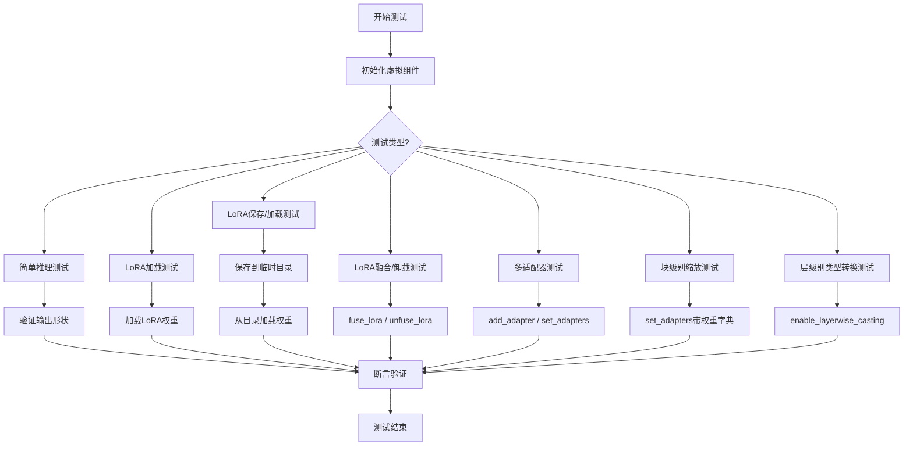

## 类结构

```
PeftLoraLoaderMixinTests (测试mixin类)
├── 类属性 (pipeline_class, scheduler_cls, text_encoder_cls, etc.)
├── get_dummy_components() - 获取虚拟组件
├── get_dummy_inputs() - 获取虚拟输入
├── _compute_baseline_output() - 计算基线输出
├── _get_lora_state_dicts() - 获取LoRA状态字典
├── _get_lora_adapter_metadata() - 获取LoRA适配器元数据
├── _get_modules_to_save() - 获取需保存的模块
├── add_adapters_to_pipeline() - 添加适配器到管道
└── 40+ 测试方法
```

## 全局变量及字段


### `POSSIBLE_ATTENTION_KWARGS_NAMES`
    
Possible parameter names for attention kwargs in pipeline call signatures

类型：`List[str]`
    


### `state_dicts_almost_equal`
    
Compares two state dictionaries and returns True if they are almost equal within tolerance

类型：`function`
    


### `check_if_lora_correctly_set`
    
Checks if LoRA layers are correctly set with PEFT in the model

类型：`function`
    


### `check_module_lora_metadata`
    
Validates LoRA metadata extraction and comparison for a specific module key

类型：`function`
    


### `initialize_dummy_state_dict`
    
Initializes a dummy state dict with random values from meta device tensors

类型：`function`
    


### `determine_attention_kwargs_name`
    
Determines the correct attention kwargs parameter name from pipeline class signature

类型：`function`
    


### `PeftLoraLoaderMixinTests.pipeline_class`
    
The pipeline class being tested for LoRA loading functionality

类型：`type`
    


### `PeftLoraLoaderMixinTests.scheduler_cls`
    
The scheduler class used in the pipeline

类型：`type`
    


### `PeftLoraLoaderMixinTests.scheduler_kwargs`
    
Keyword arguments for scheduler initialization

类型：`dict`
    


### `PeftLoraLoaderMixinTests.has_two_text_encoders`
    
Flag indicating whether the pipeline uses two text encoders

类型：`bool`
    


### `PeftLoraLoaderMixinTests.has_three_text_encoders`
    
Flag indicating whether the pipeline uses three text encoders

类型：`bool`
    


### `PeftLoraLoaderMixinTests.text_encoder_cls`
    
The text encoder class for the primary encoder

类型：`type`
    


### `PeftLoraLoaderMixinTests.text_encoder_id`
    
Model ID or path for the primary text encoder

类型：`str`
    


### `PeftLoraLoaderMixinTests.text_encoder_subfolder`
    
Subfolder path for the primary text encoder model

类型：`str`
    


### `PeftLoraLoaderMixinTests.text_encoder_2_cls`
    
The text encoder class for the secondary encoder

类型：`type`
    


### `PeftLoraLoaderMixinTests.text_encoder_2_id`
    
Model ID or path for the secondary text encoder

类型：`str`
    


### `PeftLoraLoaderMixinTests.text_encoder_2_subfolder`
    
Subfolder path for the secondary text encoder model

类型：`str`
    


### `PeftLoraLoaderMixinTests.text_encoder_3_cls`
    
The text encoder class for the tertiary encoder

类型：`type`
    


### `PeftLoraLoaderMixinTests.text_encoder_3_id`
    
Model ID or path for the tertiary text encoder

类型：`str`
    


### `PeftLoraLoaderMixinTests.text_encoder_3_subfolder`
    
Subfolder path for the tertiary text encoder model

类型：`str`
    


### `PeftLoraLoaderMixinTests.tokenizer_cls`
    
The tokenizer class for the primary tokenizer

类型：`type`
    


### `PeftLoraLoaderMixinTests.tokenizer_id`
    
Model ID or path for the primary tokenizer

类型：`str`
    


### `PeftLoraLoaderMixinTests.tokenizer_subfolder`
    
Subfolder path for the primary tokenizer model

类型：`str`
    


### `PeftLoraLoaderMixinTests.tokenizer_2_cls`
    
The tokenizer class for the secondary tokenizer

类型：`type`
    


### `PeftLoraLoaderMixinTests.tokenizer_2_id`
    
Model ID or path for the secondary tokenizer

类型：`str`
    


### `PeftLoraLoaderMixinTests.tokenizer_2_subfolder`
    
Subfolder path for the secondary tokenizer model

类型：`str`
    


### `PeftLoraLoaderMixinTests.tokenizer_3_cls`
    
The tokenizer class for the tertiary tokenizer

类型：`type`
    


### `PeftLoraLoaderMixinTests.tokenizer_3_id`
    
Model ID or path for the tertiary tokenizer

类型：`str`
    


### `PeftLoraLoaderMixinTests.tokenizer_3_subfolder`
    
Subfolder path for the tertiary tokenizer model

类型：`str`
    


### `PeftLoraLoaderMixinTests.supports_text_encoder_loras`
    
Flag indicating whether the pipeline supports text encoder LoRA

类型：`bool`
    


### `PeftLoraLoaderMixinTests.unet_kwargs`
    
Keyword arguments for UNet model initialization

类型：`dict`
    


### `PeftLoraLoaderMixinTests.transformer_cls`
    
The transformer class for the diffusion model

类型：`type`
    


### `PeftLoraLoaderMixinTests.transformer_kwargs`
    
Keyword arguments for transformer model initialization

类型：`dict`
    


### `PeftLoraLoaderMixinTests.vae_cls`
    
The VAE model class (AutoencoderKL)

类型：`type`
    


### `PeftLoraLoaderMixinTests.vae_kwargs`
    
Keyword arguments for VAE model initialization

类型：`dict`
    


### `PeftLoraLoaderMixinTests.text_encoder_target_modules`
    
Target modules for text encoder LoRA (q_proj, k_proj, v_proj, out_proj)

类型：`List[str]`
    


### `PeftLoraLoaderMixinTests.denoiser_target_modules`
    
Target modules for denoiser (UNet/Transformer) LoRA (to_q, to_k, to_v, to_out.0)

类型：`List[str]`
    


### `PeftLoraLoaderMixinTests.cached_non_lora_output`
    
Cached baseline output without LoRA for comparison testing

类型：`Any`
    


### `PeftLoraLoaderMixinTests.output_shape`
    
Expected output shape for the pipeline inference result

类型：`tuple`
    
    

## 全局函数及方法


### `state_dicts_almost_equal`

该函数用于比较两个 PyTorch 模型的状态字典（state dictionary）是否几乎相等，常用于测试 LoRA 权重加载正确性的场景。通过对两个状态字典按键排序后逐元素比较 tensor 差值的最大绝对值，若小于阈值 1e-3 则认为相等。

参数：

- `sd1`：`dict`，第一个 PyTorch 模型的状态字典（state dictionary）
- `sd2`：`dict`，第二个 PyTorch 模型的状态字典（state dictionary）

返回值：`bool`，如果两个状态字典几乎相等返回 `True`，否则返回 `False`

#### 流程图

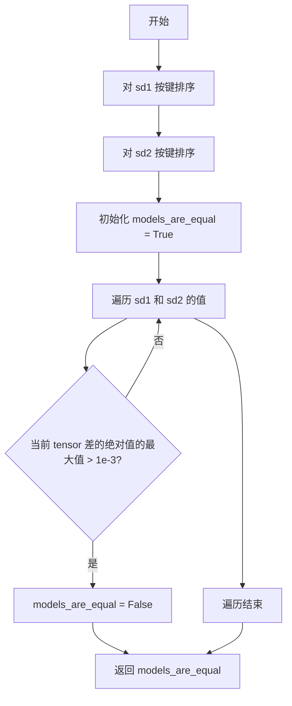

#### 带注释源码

```python
def state_dicts_almost_equal(sd1, sd2):
    """
    比较两个 state dictionary 是否几乎相等
    
    参数:
        sd1: 第一个 state dictionary
        sd2: 第二个 state dictionary
    
    返回:
        bool: 如果两个 state dictionary 几乎相等返回 True，否则返回 False
    """
    # 对两个字典按键进行排序，确保顺序一致以便逐元素比较
    sd1 = dict(sorted(sd1.items()))
    sd2 = dict(sorted(sd2.items()))

    # 初始化相等标志为 True
    models_are_equal = True
    # 使用 zip 同时遍历两个字典的值（tensor）
    for ten1, ten2 in zip(sd1.values(), sd2.values()):
        # 计算两个 tensor 差的绝对值的最大值
        # 如果大于阈值 1e-3，则认为不相等
        if (ten1 - ten2).abs().max() > 1e-3:
            models_are_equal = False

    # 返回比较结果
    return models_are_equal
```


### `check_if_lora_correctly_set`

该函数用于检查给定的模型是否正确配置了LoRA（Low-Rank Adaptation）层。它通过遍历模型的所有模块，检查是否存在PEFT库中的`BaseTunerLayer`类型的模块来判断LoRA是否已正确添加。

参数：

-  `model`：`torch.nn.Module`，需要进行LoRA层检查的模型实例

返回值：`bool`，如果模型中至少包含一个LoRA层（即存在`BaseTunerLayer`类型的模块），则返回`True`；否则返回`False`

#### 流程图

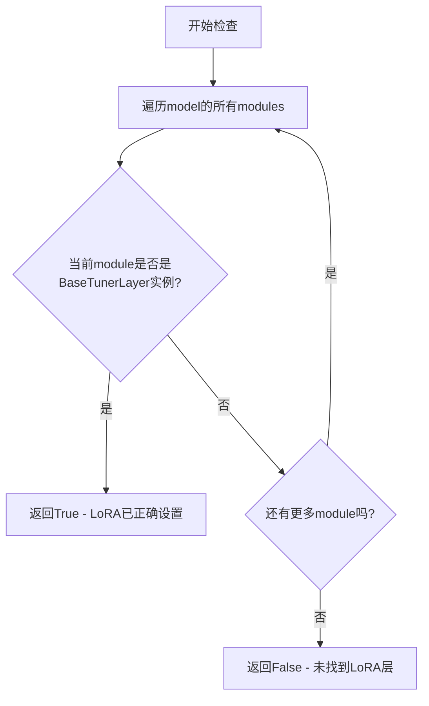

#### 带注释源码

```python
def check_if_lora_correctly_set(model) -> bool:
    """
    Checks if the LoRA layers are correctly set with peft
    """
    # 遍历模型的所有模块
    for module in model.modules():
        # 检查模块是否是PEFT库中的BaseTunerLayer类型
        # BaseTunerLayer是PEFT中所有LoRA层的基类
        if isinstance(module, BaseTunerLayer):
            # 找到至少一个LoRA层，说明LoRA已正确配置
            return True
    # 遍历完所有模块都没有找到LoRA层
    return False
```


### `check_module_lora_metadata`

该函数用于从解析后的元数据中提取指定模块的LoRA元数据，并与保存的LoRA适配器元数据进行比较验证，确保加载的元数据与原始元数据一致。

参数：

- `parsed_metadata`：`dict`，从保存的检查点文件中解析出来的元数据字典
- `lora_metadatas`：`dict`，包含各模块LoRA适配器元数据的字典，键名格式为`{module_key}_lora_adapter_metadata`
- `module_key`：`str`，模块键名，用于过滤和提取对应的元数据（如`"unet"`或`"text_encoder"`）

返回值：`None`，该函数直接调用`check_if_dicts_are_equal`进行字典比较，不返回任何值

#### 流程图

```mermaid
flowchart TD
    A[开始] --> B[构建前缀字符串: f&quot;{module_key}.&quot;]
    B --> C[遍历 parsed_metadata 的所有键值对]
    C --> D{键是否以 module_key. 开头?}
    D -->|是| E[移除前缀得到新键: k.removeprefix(f&quot;{module_key}.&quot;)]
    E --> F[将新键值对加入 extracted 字典]
    D -->|否| G[跳过该键值对]
    F --> C
    C --> H[构建目标键名: f&quot;{module_key}_lora_adapter_metadata&quot;]
    H --> I[从 lora_metadatas 中获取目标字典]
    I --> J[调用 check_if_dicts_are_equal 比较 extracted 和目标字典]
    J --> K[结束]
```

#### 带注释源码

```python
def check_module_lora_metadata(parsed_metadata: dict, lora_metadatas: dict, module_key: str):
    """
    检查模块的LoRA元数据是否正确匹配
    
    参数:
        parsed_metadata: 从保存的检查点文件中解析出来的元数据字典
        lora_metadatas: 包含各模块LoRA适配器元数据的字典
        module_key: 模块键名，用于标识是哪个组件（如text_encoder、unet等）
    """
    # 从parsed_metadata中提取以指定module_key开头的所有键值对
    # 并移除module_key.前缀，得到相对键名
    extracted = {
        k.removeprefix(f"{module_key}."): v 
        for k, v in parsed_metadata.items() 
        if k.startswith(f"{module_key}.")
    }
    
    # 从lora_metadatas中获取对应模块的元数据
    # 键名格式为: {module_key}_lora_adapter_metadata
    # 例如: text_encoder_lora_adapter_metadata 或 unet_lora_adapter_metadata
    # 调用check_if_dicts_are_equal进行字典相等性比较
    check_if_dicts_are_equal(extracted, lora_metadatas[f"{module_key}_lora_adapter_metadata"])
```


### `initialize_dummy_state_dict`

该函数用于初始化一个虚拟的状态字典（dummy state dict），它接收一个所有值都位于"meta"设备上的状态字典，并返回一个新的字典，其中每个键对应的值为随机初始化的张量（使用标准正态分布），形状和数据类型与原字典保持一致。该函数主要用于测试场景，特别是配合`low_cpu_mem_usage`参数加载LoRA权重时。

参数：

- `state_dict`：`dict`，输入的状态字典，必须包含键值对，且所有值（tensor）必须位于"meta"设备上。如果检测到任何非meta设备上的值，将抛出`ValueError`异常。

返回值：`dict`，返回一个新的状态字典，包含随机初始化的`torch.Tensor`，其`shape`和`dtype`与输入的`state_dict`中对应值保持一致，设备为`torch_device`（代码中定义的全局变量，通常为cuda设备）。

#### 流程图

```mermaid
flowchart TD
    A[开始: initialize_dummy_state_dict] --> B{检查所有值是否在meta设备上}
    B -->|是| C[遍历state_dict的每个键值对]
    B -->|否| D[抛出ValueError: state_dict has non-meta values]
    C --> E[对每个值v: 调用torch.randn生成随机张量]
    E --> F[使用v.shape作为形状, torch_device作为设备, v.dtype作为数据类型]
    F --> G[构建新的字典: {k: 随机张量 for k, v in state_dict}]
    G --> H[返回新字典]
    D --> H
```

#### 带注释源码

```python
def initialize_dummy_state_dict(state_dict):
    """
    初始化一个虚拟的状态字典，用于测试目的。
    
    该函数验证输入的state_dict中所有张量都位于meta设备上，
    然后创建一个新的字典，其中每个张量都被随机初始化的张量替换。
    这在测试低内存加载LoRA权重时非常有用。
    
    参数:
        state_dict: 包含模型状态信息的字典，所有值必须位于meta设备
        
    返回:
        一个新的字典，包含随机初始化的张量，形状和类型与原字典一致
    """
    # 检查所有张量是否都在meta设备上
    # 如果存在非meta设备上的值，抛出ValueError
    if not all(v.device.type == "meta" for _, v in state_dict.items()):
        raise ValueError("`state_dict` has non-meta values.")
    
    # 遍历原始state_dict，为每个键值对创建随机初始化的张量
    # 保持原始的shape和dtype，使用torch_device作为目标设备
    return {k: torch.randn(v.shape, device=torch_device, dtype=v.dtype) for k, v in state_dict.items()}
```


### `determine_attention_kwargs_name`

该函数用于确定给定 pipeline 类的 `__call__` 方法中注意力关键字参数的具体名称。由于不同 pipeline 可能使用不同的参数名（如 `cross_attention_kwargs`、`joint_attention_kwargs` 或 `attention_kwargs`），该函数通过检查函数签名来动态识别当前 pipeline 所使用的参数名。

参数：

- `pipeline_class`：`type`，要检查的 pipeline 类，用于获取其 `__call__` 方法的签名

返回值：`str`，返回 pipeline 的 `__call__` 方法所接受的注意力关键字参数名称

#### 流程图

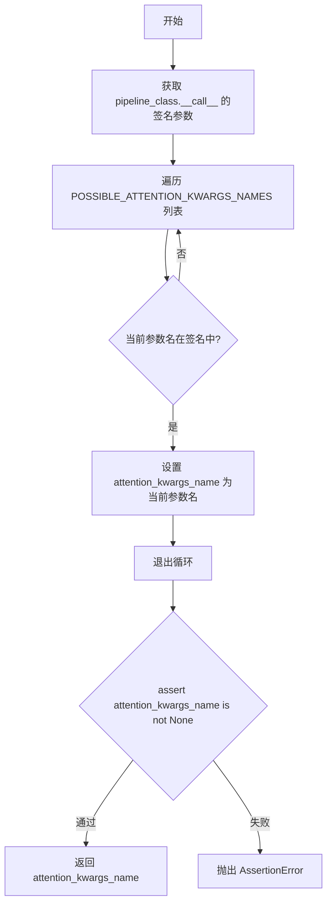

#### 带注释源码

```python
# 全局常量：可能的注意力关键字参数名称列表
POSSIBLE_ATTENTION_KWARGS_NAMES = ["cross_attention_kwargs", "joint_attention_kwargs", "attention_kwargs"]


def determine_attention_kwargs_name(pipeline_class):
    """
    确定 pipeline 类的 __call__ 方法中所使用的注意力关键字参数的具体名称。
    
    不同版本的 pipeline 可能使用不同的参数名，此函数通过检查函数签名来识别。
    
    参数:
        pipeline_class: 要检查的 pipeline 类
        
    返回:
        str: 实际使用的注意力关键字参数名称
    """
    # 使用 inspect 模块获取 pipeline 类的 __call__ 方法的签名
    # 并提取所有参数名称
    call_signature_keys = inspect.signature(pipeline_class.__call__).parameters.keys()

    # TODO(diffusers): Discuss a common naming convention across library for 1.0.0 release
    # 遍历预定义的可能的参数名列表
    for possible_attention_kwargs in POSSIBLE_ATTENTION_KWARGS_NAMES:
        # 检查当前参数名是否存在于 __call__ 方法的签名中
        if possible_attention_kwargs in call_signature_keys:
            # 找到匹配的参数名，退出循环
            attention_kwargs_name = possible_attention_kwargs
            break
    
    # 断言确保找到了匹配的参数名
    # 如果没有找到任何匹配的参数名，将抛出 AssertionError
    assert attention_kwargs_name is not None
    
    # 返回找到的注意力关键字参数名称
    return attention_kwargs_name
```


### `PeftLoraLoaderMixinTests.get_base_pipe_output`

该方法用于获取不使用 LoRA 适配器时的管道基线输出结果，并使用缓存机制避免重复计算。

参数：

- 无显式参数（仅使用 `self`）

返回值：`np.ndarray`，返回管道在无 LoRA 状态下的基线输出结果（numpy 数组格式）

#### 流程图

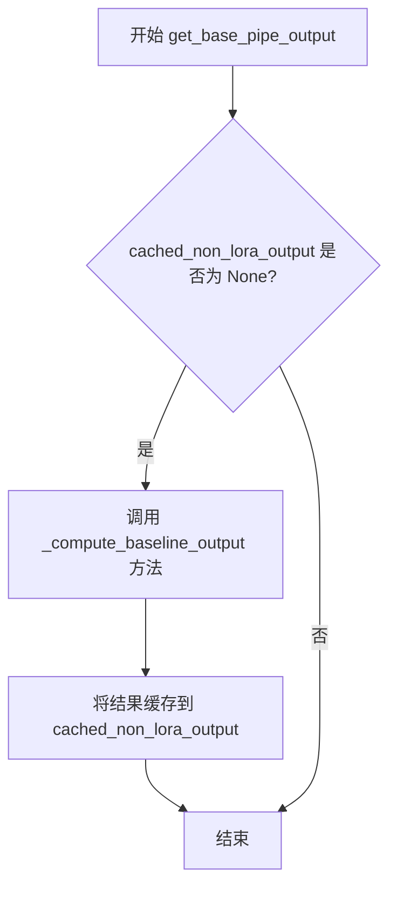

#### 带注释源码

```python
def get_base_pipe_output(self):
    """
    获取管道的基线输出（不使用 LoRA 适配器）。
    
    该方法实现了一个缓存机制：如果 cached_non_lora_output 为 None，
    则调用 _compute_baseline_output 方法计算基线输出并缓存；
    否则直接返回缓存的结果。这避免了在多个测试用例中重复计算基线输出。
    
    Returns:
        np.ndarray: 管道在无 LoRA 状态下的输出结果
    """
    # 检查缓存是否为空
    if self.cached_non_lora_output is None:
        # 缓存为空，计算基线输出
        self.cached_non_lora_output = self._compute_baseline_output()
    
    # 返回缓存的基线输出
    return self.cached_non_lora_output
```


### `PeftLoraLoaderMixinTests.get_dummy_components`

该方法用于创建测试所需的虚拟组件（dummy components），包括 UNet/Transformer、VAE、文本编码器、分词器等，并配置相应的 LoRA 参数（text_lora_config 和 denoiser_lora_config），供测试用例使用。

参数：

- `scheduler_cls`：`Optional[type]`，可选的调度器类，如果为 None 则使用类属性 `self.scheduler_cls`
- `use_dora`：`bool`，是否使用 DoRA（Domain-adaptive Reparameterization），默认为 False
- `lora_alpha`：`Optional[int]`，LoRA 的 alpha 参数，如果为 None 则使用 rank 值，默认为 None

返回值：`Tuple[dict, LoraConfig, LoraConfig]`，返回一个三元组，包含：
- `pipeline_components`：字典，包含 pipeline 的所有组件（scheduler, vae, text_encoder, tokenizer, unet/transformer 等）
- `text_lora_config`：用于文本编码器的 LoRA 配置
- `denoiser_lora_config`：用于去噪器（UNet 或 Transformer）的 LoRA 配置

#### 流程图

```mermaid
flowchart TD
    A[开始] --> B{检查 unet_kwargs 和 transformer_kwargs}
    B -->|冲突| C[抛出 ValueError]
    B -->|不冲突| D{检查 has_two_text_encoders 和 has_three_text_encoders}
    D -->|冲突| E[抛出 ValueError]
    D -->|不冲突| F[获取 scheduler_cls 和设置 rank, lora_alpha]
    F --> G[设置随机种子 torch.manual_seed(0)]
    G --> H{self.unet_kwargs is not None}
    H -->|是| I[创建 UNet2DConditionModel]
    H -->|否| J[创建 Transformer 模型]
    I --> K[创建 Scheduler]
    J --> K
    K --> L[设置随机种子并创建 VAE]
    L --> M[从预训练加载 Text Encoder 和 Tokenizer]
    M --> N{self.text_encoder_2_cls is not None}
    N -->|是| O[加载第二个 Text Encoder 和 Tokenizer]
    N -->|否| P{self.text_encoder_3_cls is not None}
    O --> P
    P -->|是| Q[加载第三个 Text Encoder 和 Tokenizer]
    P -->|否| R[创建 Text LoRA Config]
    Q --> R
    R --> S[创建 Denoiser LoRA Config]
    S --> T[初始化 pipeline_components 字典]
    T --> U{self.unet_kwargs is not None}
    U -->|是| V[添加 unet 到 pipeline_components]
    U -->|否| W[添加 transformer 到 pipeline_components]
    V --> X{self.text_encoder_2_cls is not None}
    W --> X
    X -->|是| Y[添加 tokenizer_2 和 text_encoder_2]
    X -->|否| Z{self.text_encoder_3_cls is not None}
    Y --> Z
    Z -->|是| AA[添加 tokenizer_3 和 text_encoder_3]
    Z -->|否| AB{检查 __init__ 参数}
    AA --> AB
    AB -->|safety_checker in params| AC[添加 safety_checker: None]
    AB -->|feature_extractor in params| AD[添加 feature_extractor: None]
    AB -->|image_encoder in params| AE[添加 image_encoder: None]
    AC --> AF
    AD --> AF
    AE --> AF[返回 pipeline_components, text_lora_config, denoiser_lora_config]
```

#### 带注释源码

```python
def get_dummy_components(self, scheduler_cls=None, use_dora=False, lora_alpha=None):
    # 校验：不能同时指定 unet_kwargs 和 transformer_kwargs
    if self.unet_kwargs and self.transformer_kwargs:
        raise ValueError("Both `unet_kwargs` and `transformer_kwargs` cannot be specified.")
    # 校验：has_two_text_encoders 和 has_three_text_encoders 不能同时为 True
    if self.has_two_text_encoders and self.has_three_text_encoders:
        raise ValueError("Both `has_two_text_encoders` and `has_three_text_encoders` cannot be True.")

    # 确定使用的调度器类，默认为类属性中的调度器
    scheduler_cls = scheduler_cls if scheduler_cls is not None else self.scheduler_cls
    # 设置 LoRA 的 rank 默认为 4
    rank = 4
    # 如果未指定 lora_alpha，则使用 rank 值
    lora_alpha = rank if lora_alpha is None else lora_alpha

    # 设置随机种子以确保可复现性
    torch.manual_seed(0)
    # 根据配置创建 UNet 或 Transformer（两者只能选其一）
    if self.unet_kwargs is not None:
        unet = UNet2DConditionModel(**self.unet_kwargs)
    else:
        transformer = self.transformer_cls(**self.transformer_kwargs)

    # 创建调度器实例
    scheduler = scheduler_cls(**self.scheduler_kwargs)

    # 重新设置随机种子并创建 VAE
    torch.manual_seed(0)
    vae = self.vae_cls(**self.vae_kwargs)

    # 从预训练模型加载文本编码器和分词器
    text_encoder = self.text_encoder_cls.from_pretrained(
        self.text_encoder_id, subfolder=self.text_encoder_subfolder
    )
    tokenizer = self.tokenizer_cls.from_pretrained(self.tokenizer_id, subfolder=self.tokenizer_subfolder)

    # 如果存在第二个文本编码器，则加载
    if self.text_encoder_2_cls is not None:
        text_encoder_2 = self.text_encoder_2_cls.from_pretrained(
            self.text_encoder_2_id, subfolder=self.text_encoder_2_subfolder
        )
        tokenizer_2 = self.tokenizer_2_cls.from_pretrained(
            self.tokenizer_2_id, subfolder=self.tokenizer_2_subfolder
        )

    # 如果存在第三个文本编码器，则加载
    if self.text_encoder_3_cls is not None:
        text_encoder_3 = self.text_encoder_3_cls.from_pretrained(
            self.text_encoder_3_id, subfolder=self.text_encoder_3_subfolder
        )
        tokenizer_3 = self.tokenizer_3_cls.from_pretrained(
            self.tokenizer_3_id, subfolder=self.tokenizer_3_subfolder
        )

    # 创建文本编码器的 LoRA 配置
    text_lora_config = LoraConfig(
        r=rank,                              # LoRA rank
        lora_alpha=lora_alpha,               # LoRA alpha 值
        target_modules=self.text_encoder_target_modules,  # 目标模块
        init_lora_weights=False,             # 不初始化 LoRA 权重
        use_dora=use_dora,                   # 是否使用 DoRA
    )

    # 创建去噪器（UNet/Transformer）的 LoRA 配置
    denoiser_lora_config = LoraConfig(
        r=rank,
        lora_alpha=lora_alpha,
        target_modules=self.denoiser_target_modules,
        init_lora_weights=False,
        use_dora=use_dora,
    )

    # 初始化 pipeline 组件字典
    pipeline_components = {
        "scheduler": scheduler,
        "vae": vae,
        "text_encoder": text_encoder,
        "tokenizer": tokenizer,
    }
    # 添加去噪器（UNet 或 Transformer）
    if self.unet_kwargs is not None:
        pipeline_components.update({"unet": unet})
    elif self.transformer_kwargs is not None:
        pipeline_components.update({"transformer": transformer})

    # 添加可选的文本编码器 2
    if self.text_encoder_2_cls is not None:
        pipeline_components.update({"tokenizer_2": tokenizer_2, "text_encoder_2": text_encoder_2})
    # 添加可选的文本编码器 3
    if self.text_encoder_3_cls is not None:
        pipeline_components.update({"tokenizer_3": tokenizer_3, "text_encoder_3": text_encoder_3})

    # 检查 pipeline 类的 __init__ 参数，添加可选组件
    init_params = inspect.signature(self.pipeline_class.__init__).parameters
    if "safety_checker" in init_params:
        pipeline_components.update({"safety_checker": None})
    if "feature_extractor" in init_params:
        pipeline_components.update({"feature_extractor": None})
    if "image_encoder" in init_params:
        pipeline_components.update({"image_encoder": None})

    # 返回 pipeline 组件和两个 LoRA 配置
    return pipeline_components, text_lora_config, denoiser_lora_config
```


### `PeftLoraLoaderMixinTests.output_shape`

该属性定义了测试类的期望输出形状，用于在测试中验证管道输出是否符合预期的维度。它是一个抽象属性，需要子类实现具体的形状返回值。

参数： 无

返回值：`tuple`（或类似可迭代对象），返回期望的输出张量形状

#### 流程图

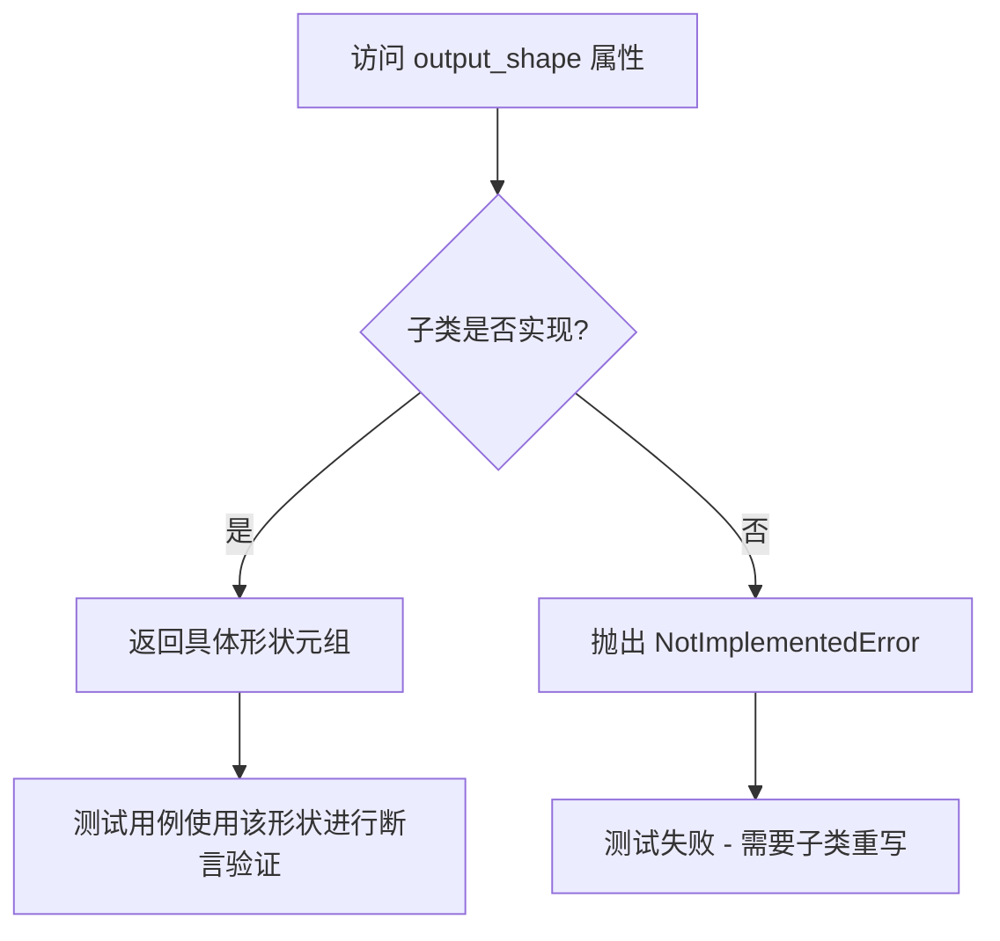

#### 带注释源码

```python
@property
def output_shape(self):
    """
    定义测试类的期望输出形状。
    
    该属性是一个抽象属性，必须在子类中重写以返回具体的输出形状。
    测试方法（如 test_simple_inference）会使用此属性来验证管道输出
    是否具有正确的维度。
    
    Returns:
        tuple: 期望的输出张量形状，例如 (batch_size, channels, height, width)
        
    Raises:
        NotImplementedError: 当子类未重写此属性时抛出
    """
    raise NotImplementedError
```


### `PeftLoraLoaderMixinTests.get_dummy_inputs`

该方法用于生成测试所需的虚拟输入数据，包括噪声张量、输入ID以及pipeline推理所需的参数字典，支持可选地包含随机数生成器。

参数：

-  `self`：`PeftLoraLoaderMixinTests`，类的实例本身
-  `with_generator`：`bool`，是否在返回的 `pipeline_inputs` 字典中包含 `generator` 对象，默认为 `True`

返回值：`Tuple[torch.Tensor, torch.Tensor, Dict]`，返回一个三元组
  - `noise`：`torch.Tensor`，形状为 `(batch_size, num_channels, height, width)` = `(1, 4, 32, 32)` 的随机噪声张量
  - `input_ids`：`torch.Tensor`，形状为 `(batch_size, sequence_length)` = `(1, 10)` 的文本输入ID张量
  - `pipeline_inputs`：`Dict`，包含prompt、推理步数、guidance_scale、output_type等pipeline调用参数的字典

#### 流程图

```mermaid
flowchart TD
    A[开始 get_dummy_inputs] --> B[设置批次大小 batch_size=1]
    B --> C[设置序列长度 sequence_length=10]
    C --> D[设置通道数 num_channels=4]
    D --> E[设置图像尺寸 sizes=(32, 32)]
    E --> F[创建随机数生成器 generator = torch.manual_seed(0)]
    F --> G[生成噪声张量: floats_tensor((1, 4) + (32, 32))]
    G --> H[生成输入ID张量: torch.randint(1, 10, (1, 10))]
    H --> I[构建基础pipeline_inputs字典]
    I --> J{with_generator?}
    J -->|True| K[将generator添加到pipeline_inputs]
    J -->|False| L[跳过添加generator]
    K --> M[返回三元组 noise, input_ids, pipeline_inputs]
    L --> M
```

#### 带注释源码

```python
def get_dummy_inputs(self, with_generator=True):
    """
    生成用于测试的虚拟输入数据
    
    参数:
        with_generator: bool, 是否包含随机生成器。当为True时，pipeline_inputs
                      字典中将包含generator字段，用于确保推理过程的可重复性。
    
    返回:
        tuple: (noise, input_ids, pipeline_inputs)
            - noise: 形状为 (1, 4, 32, 32) 的随机噪声张量
            - input_ids: 形状为 (1, 10) 的文本输入ID张量
            - pipeline_inputs: 包含推理参数的字典
    """
    # 定义批次大小为1
    batch_size = 1
    # 定义文本序列长度为10
    sequence_length = 10
    # 定义噪声通道数为4（对应RGB+Alpha或类似配置）
    num_channels = 4
    # 定义图像空间尺寸为32x32
    sizes = (32, 32)

    # 使用固定种子创建随机数生成器，确保测试可重复性
    generator = torch.manual_seed(0)
    # 生成形状为 (batch_size, num_channels, height, width) 的随机浮点噪声张量
    noise = floats_tensor((batch_size, num_channels) + sizes)
    # 生成形状为 (batch_size, sequence_length) 的随机整数作为文本输入ID
    # 范围为 [1, sequence_length)，即1到9
    input_ids = torch.randint(1, sequence_length, size=(batch_size, sequence_length), generator=generator)

    # 构建pipeline所需的基础参数字典
    pipeline_inputs = {
        "prompt": "A painting of a squirrel eating a burger",  # 测试用提示词
        "num_inference_steps": 5,  # 推理步数
        "guidance_scale": 6.0,  # 引导强度
        "output_type": "np",  # 输出类型为numpy数组
    }
    
    # 根据参数决定是否将生成器添加到pipeline_inputs中
    if with_generator:
        pipeline_inputs.update({"generator": generator})

    # 返回噪声、输入ID和pipeline参数字典组成的三元组
    return noise, input_ids, pipeline_inputs
```


### `PeftLoraLoaderMixinTests._compute_baseline_output`

该方法用于计算不带LoRA适配器的基线管道输出，作为后续与带LoRA的输出进行对比的基准。它通过实例化管道、使用固定随机种子生成输入，并执行推理来获取基线输出。

参数：

- `self`：`PeftLoraLoaderMixinTests`，类实例本身，无需显式传递

返回值：`torch.Tensor`，基线管道输出（通常是图像张量），用于与后续加载LoRA适配器后的输出进行数值比较，以验证LoRA是否正确改变了输出。

#### 流程图

```mermaid
flowchart TD
    A[开始] --> B[获取管道组件: get_dummy_components]
    B --> C[使用组件实例化管道: pipeline_class]
    C --> D[将管道移至计算设备: pipe.to]
    D --> E[设置进度条配置]
    E --> F[获取无generator的虚拟输入: get_dummy_inputs]
    F --> G[使用固定随机种子执行管道推理]
    G --> H[提取输出张量: [0]]
    H --> I[返回基线输出]
```

#### 带注释源码

```python
def _compute_baseline_output(self):
    """
    计算不带LoRA的基线管道输出，用于后续与带LoRA的输出进行对比。
    这确保了测试可以验证LoRA适配器是否正确地改变了模型输出。
    """
    # 获取虚拟管道组件（模型、调度器等）
    components, _, _ = self.get_dummy_components(self.scheduler_cls)
    
    # 使用组件实例化扩散管道
    pipe = self.pipeline_class(**components)
    
    # 将管道移至指定计算设备（如CUDA）
    pipe = pipe.to(torch_device)
    
    # 配置进度条（disable=None表示不禁用进度条）
    pipe.set_progress_bar_config(disable=None)

    # 获取虚拟输入，with_generator=False确保不内置生成器
    # 以便后续显式传入generator参数控制随机性
    _, _, inputs = self.get_dummy_inputs(with_generator=False)
    
    # 执行管道推理，使用固定随机种子(0)确保可复现性
    # [0]表示提取输出张量（而非元组中的其他元素如潜变量）
    return pipe(**inputs, generator=torch.manual_seed(0))[0]
```


### `PeftLoraLoaderMixinTests._get_lora_state_dicts`

该方法用于从已加载 LoRA 适配器的模块（text_encoder、text_encoder_2、unet 或 transformer）中提取 LoRA 状态字典，以便后续保存到磁盘。

参数：

- `modules_to_save`：`Dict[str, Optional[torch.nn.Module]]`，包含需要保存 LoRA 权重的模块字典，键为模块名称（如 "text_encoder"、"text_encoder_2"、"unet"、"transformer"），值为对应的模块实例（如果该模块不存在或未加载 LoRA 则为 None）

返回值：`Dict[str, Dict[str, torch.Tensor]]`，返回以 `{模块名}_lora_layers` 为键、LoRA 状态字典为值的字典，用于后续调用 `save_lora_weights` 方法保存 LoRA 权重

#### 流程图

```mermaid
flowchart TD
    A[开始: _get_lora_state_dicts] --> B[初始化空字典 state_dicts]
    B --> C{遍历 modules_to_save}
    C -->|迭代项: module_name, module| D{module is not None?}
    D -->|Yes| E[调用 get_peft_model_state_dict(module)]
    E --> F[构建键名: {module_name}_lora_layers]
    F --> G[将 LoRA 状态字典存入 state_dicts]
    D -->|No| H[跳过当前模块]
    G --> C
    C -->|遍历完成| I[返回 state_dicts]
```

#### 带注释源码

```python
def _get_lora_state_dicts(self, modules_to_save):
    """
    从指定的模块中提取 LoRA 状态字典，用于保存 LoRA 权重。
    
    参数:
        modules_to_save: 包含需要保存的模块的字典，键为模块名称（如 "text_encoder"），
                        值为对应的模块实例（若为 None 则跳过）
    
    返回:
        字典，键名为 "{模块名}_lora_layers"，值为该模块的 PEFT LoRA 状态字典
    """
    # 初始化用于存储 LoRA 状态字典的结果字典
    state_dicts = {}
    
    # 遍历所有需要保存的模块
    for module_name, module in modules_to_save.items():
        # 仅处理非 None 的模块（即已加载 LoRA 适配器的模块）
        if module is not None:
            # 使用 PEFT 库的 get_peft_model_state_dict 函数获取 LoRA 状态字典
            # 这会提取 LoRA 层的权重（lora_A, lora_B 等）
            state_dicts[f"{module_name}_lora_layers"] = get_peft_model_state_dict(module)
    
    # 返回包含所有模块 LoRA 状态字典的字典
    return state_dicts
```


### `PeftLoraLoaderMixinTests._get_lora_adapter_metadata`

该方法是一个测试辅助函数，用于从已加载 LoRA 适配器的模型组件（如 Text Encoder、UNet 或 Transformer）中提取 PEFT 配置元数据。它遍历传入的模块字典，提取每个模块的 `peft_config["default"]` 配置对象，并将其转换为字典格式。这主要用于在单元测试中保存 LoRA 权重时，一并保存适配器的配置信息（如 rank、alpha、target_modules 等），以便后续验证加载后的元数据是否完整一致。

参数：

-  `self`：隐藏参数，指向类实例本身。
-  `modules_to_save`：`dict`，字典。键为模块名称字符串（如 `"text_encoder"`, `"unet"`），值为实际的模型模块对象。这些对象应该已经通过 PEFT 注入了 LoRA 配置。

返回值：`dict`，字典。返回一个包含模块元数据的字典。字典的键为 `{模块名}_lora_adapter_metadata`，值为对应模块的 PEFT 配置字典。

#### 流程图

```mermaid
flowchart TD
    A([Start]) --> B[Input: modules_to_save]
    B --> C[metadatas = {}]
    C --> D{Iterate over modules_to_save items}
    D --> E{Is module not None?}
    E -- No --> F[Continue to next item]
    E -- Yes --> G[Get config: module.peft_config['default']]
    G --> H[Convert to dict: config.to_dict()]
    H --> I[Format key: {module_name}_lora_adapter_metadata]
    I --> J[Store in metadatas]
    J --> F
    F --> D
    D --> K([Return metadatas])
```

#### 带注释源码

```python
def _get_lora_adapter_metadata(self, modules_to_save):
    """
    从 modules_to_save 中提取各个模块的 LoRA 适配器元数据。
    """
    # 1. 初始化一个空字典，用于存储提取出来的元数据
    metadatas = {}
    
    # 2. 遍历传入的模块字典，通常包含 text_encoder, unet 或 transformer 等
    for module_name, module in modules_to_save.items():
        # 3. 确保模块对象存在（并非为空）
        if module is not None:
            # 4. 访问 PEFT 配置中的 'default' 适配器配置
            # 5. 使用 .to_dict() 方法将配置对象转换为普通的 Python 字典
            # 6. 以特定的格式键名存储：{模块名}_lora_adapter_metadata
            metadatas[f"{module_name}_lora_adapter_metadata"] = module.peft_config["default"].to_dict()
            
    # 7. 返回包含所有模块元数据的字典
    return metadatas
```


### `PeftLoraLoaderMixinTests._get_modules_to_save`

该方法用于从 PEFT LoRA pipeline 中获取需要保存的模块（text_encoder、text_encoder_2、unet 或 transformer）。它根据 `pipeline_class._lora_loadable_modules` 中定义的可用模块以及各模块是否配置了 PEFT adapter 来筛选符合条件的模块。

参数：

- `pipe`：`object`，PEFT LoRA pipeline 实例
- `has_denoiser`：`bool`，是否包含 denoiser（unet/transformer）模块的标志

返回值：`dict`，包含需要保存的模块名称及其对应的 pipeline 组件对象

#### 流程图

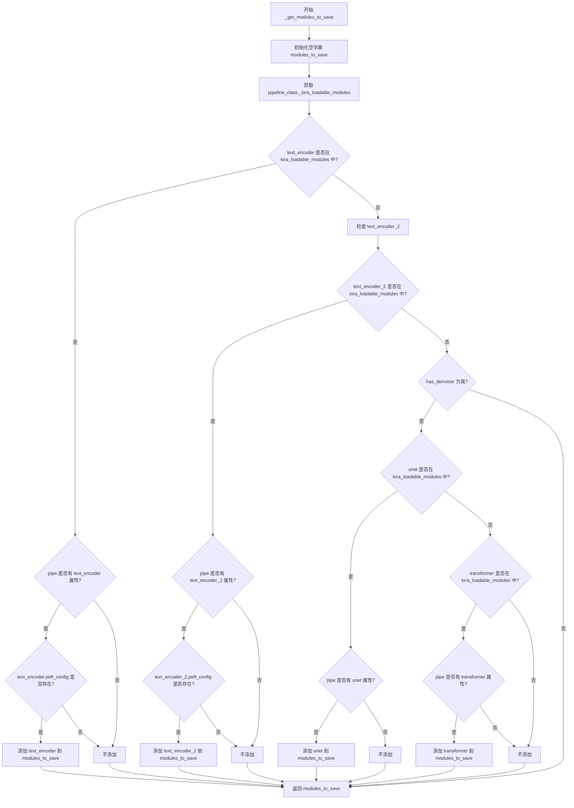

#### 带注释源码

```python
def _get_modules_to_save(self, pipe, has_denoiser=False):
    """
    获取需要保存的 PEFT LoRA 模块。
    
    该方法遍历 pipeline 的各个组件（text_encoder、text_encoder_2、unet/transformer），
    检查它们是否在 _lora_loadable_modules 中且已配置 PEFT adapter，将符合条件的模块返回。
    
    参数:
        pipe: PEFT LoRA pipeline 实例
        has_denoiser: 是否检查 denoiser 模块（unet/transformer）
    
    返回:
        包含需要保存的模块名称及其对应组件的字典
    """
    # 初始化结果字典
    modules_to_save = {}
    
    # 获取该 pipeline 类支持的 LoRA 可用模块列表
    lora_loadable_modules = self.pipeline_class._lora_loadable_modules

    # 检查 text_encoder 是否需要保存
    if (
        "text_encoder" in lora_loadable_modules  # pipeline 支持 text_encoder LoRA
        and hasattr(pipe, "text_encoder")         # pipeline 包含 text_encoder 组件
        and getattr(pipe.text_encoder, "peft_config", None) is not None  # 已配置 PEFT adapter
    ):
        modules_to_save["text_encoder"] = pipe.text_encoder

    # 检查 text_encoder_2 是否需要保存
    if (
        "text_encoder_2" in lora_loadable_modules
        and hasattr(pipe, "text_encoder_2")
        and getattr(pipe.text_encoder_2, "peft_config", None) is not None
    ):
        modules_to_save["text_encoder_2"] = pipe.text_encoder_2

    # 如果需要检查 denoiser 模块
    if has_denoiser:
        # 检查 unet 是否需要保存
        if "unet" in lora_loadable_modules and hasattr(pipe, "unet"):
            modules_to_save["unet"] = pipe.unet

        # 检查 transformer 是否需要保存
        if "transformer" in lora_loadable_modules and hasattr(pipe, "transformer"):
            modules_to_save["transformer"] = pipe.transformer

    return modules_to_save
```


### `PeftLoraLoaderMixinTests.add_adapters_to_pipeline`

该方法用于向扩散管道添加LoRA适配器，支持文本编码器（text_encoder）、第二文本编码器（text_encoder_2）以及去噪器（denoiser，UNet或Transformer）的LoRA配置。

参数：

- `self`：`PeftLoraLoaderMixinTests`，测试类的实例，包含管道类配置信息
- `pipe`：`Pipeline`，需要添加LoRA适配器的扩散管道对象
- `text_lora_config`：`LoraConfig | None`，文本编码器的LoRA配置，若为None则不添加文本编码器适配器
- `denoiser_lora_config`：`LoraConfig | None`，去噪器的LoRA配置，若为None则不添加去噪器适配器
- `adapter_name`：`str`，适配器名称，默认为"default"

返回值：`tuple[Pipeline, Any]`，返回修改后的管道对象和去噪器对象（若未配置则为None）

#### 流程图

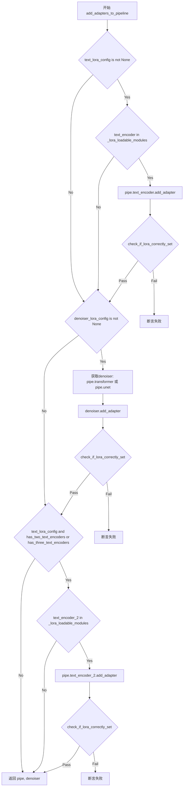

#### 带注释源码

```python
def add_adapters_to_pipeline(self, pipe, text_lora_config=None, denoiser_lora_config=None, adapter_name="default"):
    """
    向管道添加LoRA适配器
    
    参数:
        pipe: 扩散管道对象
        text_lora_config: 文本编码器的LoRA配置
        denoiser_lora_config: 去噪器的LoRA配置
        adapter_name: 适配器名称
    """
    # 如果提供了文本编码器LoRA配置
    if text_lora_config is not None:
        # 检查管道是否支持文本编码器LoRA
        if "text_encoder" in self.pipeline_class._lora_loadable_modules:
            # 向文本编码器添加适配器
            pipe.text_encoder.add_adapter(text_lora_config, adapter_name=adapter_name)
            # 验证LoRA是否正确设置
            self.assertTrue(
                check_if_lora_correctly_set(pipe.text_encoder), "Lora not correctly set in text encoder"
            )

    # 如果提供了去噪器LoRA配置
    if denoiser_lora_config is not None:
        # 根据unet_kwargs判断使用transformer还是unet
        denoiser = pipe.transformer if self.unet_kwargs is None else pipe.unet
        # 向去噪器添加适配器
        denoiser.add_adapter(denoiser_lora_config, adapter_name=adapter_name)
        # 验证LoRA是否正确设置
        self.assertTrue(check_if_lora_correctly_set(denoiser), "Lora not correctly set in denoiser.")
    else:
        denoiser = None

    # 处理第二/第三文本编码器
    # 注意: 这里存在运算符优先级问题 - 应该加括号
    if text_lora_config is not None and self.has_two_text_encoders or self.has_three_text_encoders:
        if "text_encoder_2" in self.pipeline_class._lora_loadable_modules:
            pipe.text_encoder_2.add_adapter(text_lora_config, adapter_name=adapter_name)
            self.assertTrue(
                check_if_lora_correctly_set(pipe.text_encoder_2), "Lora not correctly set in text encoder 2"
            )
    return pipe, denoiser
```


### `PeftLoraLoaderMixinTests.test_simple_inference`

这是一个简单的单元测试方法，用于验证在没有LoRA适配器的情况下，扩散管道能够正常运行并产生预期形状的输出。该测试通过获取基线管道输出并断言其形状与预期输出一致，来确保管道的基础推理功能正常工作。

参数：

- 该方法没有显式参数（除 `self` 外）
  - `self`：测试类实例，包含 `output_shape` 属性和 `get_base_pipe_output()` 方法

返回值：`None`，该方法通过 `assert` 语句进行断言，不返回任何值

#### 流程图

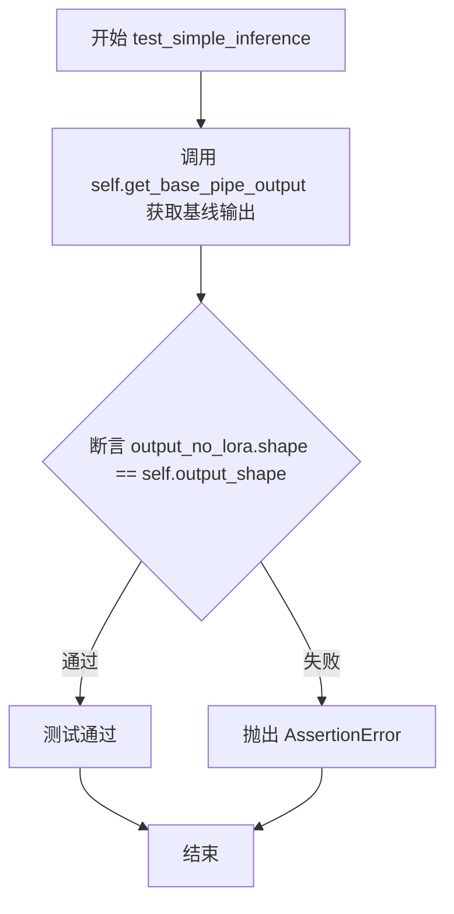

#### 带注释源码

```python
def test_simple_inference(self):
    """
    Tests a simple inference and makes sure it works as expected
    """
    # 获取基线管道输出（不包含LoRA适配器）
    # get_base_pipe_output 方法会创建管道实例并运行推理
    output_no_lora = self.get_base_pipe_output()
    
    # 断言输出的形状与预期的形状匹配
    # output_shape 是子类必须实现的属性，定义期望的输出维度
    assert output_no_lora.shape == self.output_shape
```


### `PeftLoraLoaderMixinTests.test_simple_inference_with_text_lora`

这是一个测试方法，用于验证在文本编码器上附加 LoRA 适配器后，简单推理是否能按预期工作，并确保 LoRA 会改变模型的输出。

参数：

- `self`：`PeftLoraLoaderMixinTests` 类型，测试类的实例本身，包含测试所需的配置和辅助方法

返回值：`None`，该方法为测试方法，通过 `assert` 语句验证结果，不返回任何值

#### 流程图

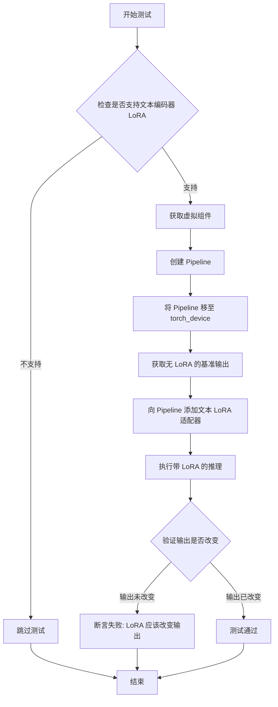

#### 带注释源码

```python
def test_simple_inference_with_text_lora(self):
    """
    Tests a simple inference with lora attached on the text encoder
    and makes sure it works as expected
    """
    # 检查当前 pipeline 类是否支持文本编码器 LoRA
    if not self.supports_text_encoder_loras:
        # 如果不支持则跳过测试
        pytest.skip("Skipping test as text encoder LoRAs are not currently supported.")

    # 获取虚拟组件、文本 LoRA 配置和去噪器 LoRA 配置
    components, text_lora_config, _ = self.get_dummy_components()
    
    # 使用虚拟组件创建扩散 pipeline 实例
    pipe = self.pipeline_class(**components)
    
    # 将 pipeline 移至指定的计算设备 (如 CUDA)
    pipe = pipe.to(torch_device)
    
    # 配置进度条 (disable=None 表示不禁用进度条)
    pipe.set_progress_bar_config(disable=None)
    
    # 获取测试输入，with_generator=False 表示不使用随机生成器
    _, _, inputs = self.get_dummy_inputs(with_generator=False)

    # 获取不带 LoRA 的基准输出，用于后续比较
    output_no_lora = self.get_base_pipe_output()
    
    # 向 pipeline 添加文本编码器 LoRA 适配器
    # denoiser_lora_config=None 表示只添加文本编码器的 LoRA
    pipe, _ = self.add_adapters_to_pipeline(pipe, text_lora_config, denoiser_lora_config=None)

    # 使用固定随机种子执行带 LoRA 的推理，取第一项结果 [0]
    output_lora = pipe(**inputs, generator=torch.manual_seed(0))[0]
    
    # 断言：LoRA 应该改变输出
    # 使用 numpy.allclose 比较输出，允许绝对误差 1e-3 和相对误差 1e-3
    self.assertTrue(
        not np.allclose(output_lora, output_no_lora, atol=1e-3, rtol=1e-3), 
        "Lora should change the output"
    )
```


### `PeftLoraLoaderMixinTests.test_low_cpu_mem_usage_with_injection`

该测试方法验证了在使用 `low_cpu_mem_usage=True` 参数将 LoRA 适配器注入到模型时，能够正确地将 LoRA 参数放置在 meta 设备上以节省 CPU 内存，并在后续加载实际权重后正确移出 meta 设备。

参数：
- `self`：`PeftLoraLoaderMixinTests`，测试类实例本身

返回值：`None`，该方法为测试方法，无返回值，通过断言验证功能正确性

#### 流程图

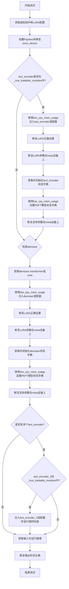

#### 带注释源码

```python
@require_peft_version_greater("0.13.1")  # 需要PEFT版本大于0.13.1
def test_low_cpu_mem_usage_with_injection(self):
    """Tests if we can inject LoRA state dict with low_cpu_mem_usage."""
    # 1. 获取虚拟组件（模型配置）和LoRA配置
    components, text_lora_config, denoiser_lora_config = self.get_dummy_components()
    
    # 2. 创建Pipeline实例并移至指定设备
    pipe = self.pipeline_class(**components)
    pipe = pipe.to(torch_device)
    pipe.set_progress_bar_config(disable=None)

    # 3. 处理text_encoder（如果支持）
    if "text_encoder" in self.pipeline_class._lora_loadable_modules:
        # 使用low_cpu_mem_usage=True注入适配器
        inject_adapter_in_model(text_lora_config, pipe.text_encoder, low_cpu_mem_usage=True)
        
        # 验证LoRA正确设置
        self.assertTrue(check_if_lora_correctly_set(pipe.text_encoder), "Lora not correctly set in text encoder.")
        
        # 验证LoRA参数在meta设备上（节省内存）
        self.assertTrue(
            "meta" in {p.device.type for p in pipe.text_encoder.parameters()},
            "The LoRA params should be on 'meta' device.",
        )

        # 获取PEFT模型状态字典并初始化为虚拟张量
        te_state_dict = initialize_dummy_state_dict(get_peft_model_state_dict(pipe.text_encoder))
        
        # 使用low_cpu_mem_usage=True设置状态字典
        set_peft_model_state_dict(pipe.text_encoder, te_state_dict, low_cpu_mem_usage=True)
        
        # 验证参数已从meta设备移出
        self.assertTrue(
            "meta" not in {p.device.type for p in pipe.text_encoder.parameters()},
            "No param should be on 'meta' device.",
        )

    # 4. 处理denoiser（transformer或unet）
    denoiser = pipe.transformer if self.unet_kwargs is None else pipe.unet
    inject_adapter_in_model(denoiser_lora_config, denoiser, low_cpu_mem_usage=True)
    self.assertTrue(check_if_lora_correctly_set(denoiser), "Lora not correctly set in denoiser.")
    self.assertTrue(
        "meta" in {p.device.type for p in denoiser.parameters()}, "The LoRA params should be on 'meta' device."
    )

    denoiser_state_dict = initialize_dummy_state_dict(get_peft_model_state_dict(denoiser))
    set_peft_model_state_dict(denoiser, denoiser_state_dict, low_cpu_mem_usage=True)
    self.assertTrue(
        "meta" not in {p.device.type for p in denoiser.parameters()}, "No param should be on 'meta' device."
    )

    # 5. 处理第二个text_encoder（如果存在）
    if self.has_two_text_encoders or self.has_three_text_encoders:
        if "text_encoder_2" in self.pipeline_class._lora_loadable_modules:
            inject_adapter_in_model(text_lora_config, pipe.text_encoder_2, low_cpu_mem_usage=True)
            self.assertTrue(
                check_if_lora_correctly_set(pipe.text_encoder_2), "Lora not correctly set in text encoder 2"
            )
            self.assertTrue(
                "meta" in {p.device.type for p in pipe.text_encoder_2.parameters()},
                "The LoRA params should be on 'meta' device.",
            )

            te2_state_dict = initialize_dummy_state_dict(get_peft_model_state_dict(pipe.text_encoder_2))
            set_peft_model_state_dict(pipe.text_encoder_2, te2_state_dict, low_cpu_mem_usage=True)
            self.assertTrue(
                "meta" not in {p.device.type for p in pipe.text_encoder_2.parameters()},
                "No param should be on 'meta' device.",
            )

    # 6. 运行推理验证功能正常
    _, _, inputs = self.get_dummy_inputs()
    output_lora = pipe(**inputs)[0]
    self.assertTrue(output_lora.shape == self.output_shape)
```


### `PeftLoraLoaderMixinTests.test_low_cpu_mem_usage_with_loading`

测试使用 `low_cpu_mem_usage` 参数加载 LoRA 权重字典的功能，验证低内存加载模式与普通加载模式产生相同的结果。

参数：

-  `self`：测试类实例本身（`PeftLoraLoaderMixinTests`），无需显式传递

返回值：`None`，该方法为测试方法，无返回值

#### 流程图

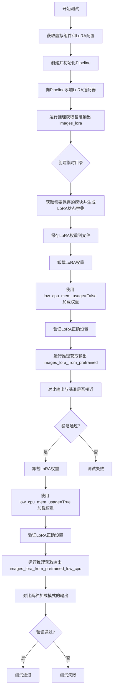

#### 带注释源码

```python
@require_peft_version_greater("0.13.1")
@require_transformers_version_greater("4.45.2")
def test_low_cpu_mem_usage_with_loading(self):
    """Tests if we can load LoRA state dict with low_cpu_mem_usage."""
    # 1. 获取虚拟组件（模型、tokenizer等）和LoRA配置
    components, text_lora_config, denoiser_lora_config = self.get_dummy_components()
    
    # 2. 创建Pipeline实例并移至目标设备
    pipe = self.pipeline_class(**components)
    pipe = pipe.to(torch_device)
    pipe.set_progress_bar_config(disable=None)
    
    # 3. 获取虚拟输入数据（不带generator）
    _, _, inputs = self.get_dummy_inputs(with_generator=False)

    # 4. 向Pipeline添加文本编码器和解码器的LoRA适配器
    pipe, _ = self.add_adapters_to_pipeline(pipe, text_lora_config, denoiser_lora_config)

    # 5. 运行推理，获取带有LoRA的输出作为基准
    images_lora = pipe(**inputs, generator=torch.manual_seed(0))[0]

    # 6. 创建临时目录用于保存LoRA权重
    with tempfile.TemporaryDirectory() as tmpdirname:
        # 7. 获取需要保存的模块（text_encoder, unet/transformer等）
        modules_to_save = self._get_modules_to_save(pipe, has_denoiser=True)
        
        # 8. 获取这些模块的LoRA状态字典
        lora_state_dicts = self._get_lora_state_dicts(modules_to_save)
        
        # 9. 使用Pipeline类的save_lora_weights方法保存权重
        self.pipeline_class.save_lora_weights(
            save_directory=tmpdirname, safe_serialization=False, **lora_state_dicts
        )

        # 10. 验证权重文件已保存
        self.assertTrue(os.path.isfile(os.path.join(tmpdirname, "pytorch_lora_weights.bin")))
        
        # 11. 卸载当前LoRA权重
        pipe.unload_lora_weights()
        
        # 12. 使用 low_cpu_mem_usage=False 加载权重（普通模式）
        pipe.load_lora_weights(os.path.join(tmpdirname, "pytorch_lora_weights.bin"), low_cpu_mem_usage=False)

        # 13. 验证每个模块的LoRA是否正确设置
        for module_name, module in modules_to_save.items():
            self.assertTrue(check_if_lora_correctly_set(module), f"Lora not correctly set in {module_name}")

        # 14. 运行推理获取加载后的输出
        images_lora_from_pretrained = pipe(**inputs, generator=torch.manual_seed(0))[0]
        
        # 15. 验证加载后的输出与基准输出接近
        self.assertTrue(
            np.allclose(images_lora, images_lora_from_pretrained, atol=1e-3, rtol=1e-3),
            "Loading from saved checkpoints should give same results.",
        )

        # 16. 卸载LoRA权重，准备测试低内存加载模式
        pipe.unload_lora_weights()
        
        # 17. 使用 low_cpu_mem_usage=True 加载权重（低内存模式）
        pipe.load_lora_weights(os.path.join(tmpdirname, "pytorch_lora_weights.bin"), low_cpu_mem_usage=True)

        # 18. 再次验证LoRA正确设置
        for module_name, module in modules_to_save.items():
            self.assertTrue(check_if_lora_correctly_set(module), f"Lora not correctly set in {module_name}")

        # 19. 运行推理获取低内存模式加载后的输出
        images_lora_from_pretrained_low_cpu = pipe(**inputs, generator=torch.manual_seed(0))[0]
        
        # 20. 验证低内存模式输出与普通模式输出接近
        self.assertTrue(
            np.allclose(images_lora_from_pretrained_low_cpu, images_lora_from_pretrained, atol=1e-3, rtol=1e-3),
            "Loading from saved checkpoints with `low_cpu_mem_usage` should give same results.",
        )
```


### `PeftLoraLoaderMixinTests.test_simple_inference_with_text_lora_and_scale`

该方法是一个单元测试，用于验证在文本编码器（text encoder）上附加 LoRA 适配器后，使用 `scale` 参数进行推理时能够正确调整 LoRA 的影响权重。测试通过比较不同 scale 值下的输出，确保 scale 参数能够按预期工作。

参数：

- `self`：`PeftLoraLoaderMixinTests`，测试类的实例，包含测试所需的配置和辅助方法

返回值：`None`，该方法为测试方法，无返回值，通过断言验证行为正确性

#### 流程图

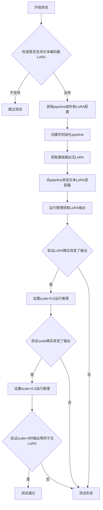

#### 带注释源码

```python
def test_simple_inference_with_text_lora_and_scale(self):
    """
    Tests a simple inference with lora attached on the text encoder + scale argument
    and makes sure it works as expected
    """
    # 如果当前pipeline不支持文本编码器LoRA，则跳过测试
    if not self.supports_text_encoder_loras:
        pytest.skip("Skipping test as text encoder LoRAs are not currently supported.")

    # 确定pipeline的__call__方法中attention kwargs的参数名称
    # (如 cross_attention_kwargs, joint_attention_kwargs, 或 attention_kwargs)
    attention_kwargs_name = determine_attention_kwargs_name(self.pipeline_class)
    
    # 获取dummy组件用于测试，包括pipeline组件、文本LoRA配置、去噪器LoRA配置
    components, text_lora_config, _ = self.get_dummy_components()
    
    # 使用组件实例化pipeline
    pipe = self.pipeline_class(**components)
    
    # 将pipeline移到测试设备(CPU/GPU)
    pipe = pipe.to(torch_device)
    
    # 配置进度条(禁用)
    pipe.set_progress_bar_config(disable=None)
    
    # 获取dummy输入用于推理
    _, _, inputs = self.get_dummy_inputs(with_generator=False)

    # 获取不带LoRA的基础输出(用于对比)
    output_no_lora = self.get_base_pipe_output()

    # 向pipeline添加文本LoRA适配器(仅文本编码器，不包含去噪器)
    pipe, _ = self.add_adapters_to_pipeline(pipe, text_lora_config, denoiser_lora_config=None)

    # 使用LoRA进行推理，获取输出
    output_lora = pipe(**inputs, generator=torch.manual_seed(0))[0]
    
    # 断言：LoRA应该改变输出(与无LoRA输出不同)
    self.assertTrue(
        not np.allclose(output_lora, output_no_lora, atol=1e-3, rtol=1e-3), "Lora should change the output"
    )

    # 使用scale=0.5进行推理(LoRA影响减半)
    attention_kwargs = {attention_kwargs_name: {"scale": 0.5}}
    output_lora_scale = pipe(**inputs, generator=torch.manual_seed(0), **attention_kwargs)[0]

    # 断言：LoRA+scale应该改变输出(与不使用scale的LoRA输出不同)
    self.assertTrue(
        not np.allclose(output_lora, output_lora_scale, atol=1e-3, rtol=1e-3),
        "Lora + scale should change the output",
    )

    # 使用scale=0.0进行推理(完全禁用LoRA影响)
    attention_kwargs = {attention_kwargs_name: {"scale": 0.0}}
    output_lora_0_scale = pipe(**inputs, generator=torch.manual_seed(0), **attention_kwargs)[0]

    # 断言：scale=0时，输出应等同于无LoRA的输出
    self.assertTrue(
        np.allclose(output_no_lora, output_lora_0_scale, atol=1e-3, rtol=1e-3),
        "Lora + 0 scale should lead to same result as no LoRA",
    )
```


### `PeftLoraLoaderMixinTests.test_simple_inference_with_text_lora_fused`

该测试方法验证了当文本编码器的 LoRA 权重被融合（fuse）到基础模型中时，推理功能是否正常工作。测试流程包括：获取无 LoRA 的基准输出 → 为文本编码器添加 LoRA 适配器 → 调用 `fuse_lora()` 融合权重 → 执行推理并验证输出与基准输出不同。

参数：
-  `self`：`PeftLoraLoaderMixinTests`，测试类的实例，包含了测试所需的配置和辅助方法

返回值：`None`，测试方法不返回值，通过断言验证行为

#### 流程图

```mermaid
flowchart TD
    A[开始测试] --> B{检查 supports_text_encoder_loras}
    B -->|不支持| C[跳过测试 pytest.skip]
    B -->|支持| D[获取虚拟组件 components, text_lora_config, _]
    D --> E[创建 pipeline 并移动到 torch_device]
    E --> F[设置进度条禁用]
    F --> G[获取无 generator 的虚拟输入]
    G --> H[获取无 LoRA 的基准输出 output_no_lora]
    H --> I[为 pipeline 添加 text_lora 适配器]
    I --> J[调用 pipe.fuse_lora 融合 LoRA 权重]
    J --> K{检查 text_encoder LoRA 是否正确设置}
    K -->|否| L[断言失败]
    K -->|是| M{检查是否有多个文本编码器}
    M -->|有| N{检查 text_encoder_2 LoRA 设置}
    M -->|无| O[执行带融合 LoRA 的推理]
    N -->|否| O
    N -->|是| P{检查 text_encoder_2 LoRA 正确性}
    P -->|否| L
    P -->|是| O
    O --> Q[获取融合后的输出 output_fused]
    Q --> R{验证 output_fused 与 output_no_lora 不同}
    R -->|相同| S[断言失败: 融合后的输出应该改变]
    R -->|不同| T[测试通过]
```

#### 带注释源码

```python
def test_simple_inference_with_text_lora_fused(self):
    """
    Tests a simple inference with lora attached into text encoder + fuses the lora weights into base model
    and makes sure it works as expected
    """
    # 检查是否支持文本编码器 LoRA，如果不支持则跳过测试
    if not self.supports_text_encoder_loras:
        pytest.skip("Skipping test as text encoder LoRAs are not currently supported.")

    # 获取虚拟组件：包含模型组件和 LoRA 配置
    # components: 包含 scheduler, vae, text_encoder, tokenizer 等
    # text_lora_config: 用于文本编码器的 LoRA 配置 (LoraConfig)
    # _ : denoiser_lora_config (本测试不需要)
    components, text_lora_config, _ = self.get_dummy_components()

    # 使用虚拟组件创建扩散 pipeline
    pipe = self.pipeline_class(**components)

    # 将 pipeline 移动到测试设备 (torch_device)
    pipe = pipe.to(torch_device)

    # 设置进度条为禁用状态
    pipe.set_progress_bar_config(disable=None)

    # 获取虚拟输入 (不使用 generator 以保证确定性)
    # 返回: noise, input_ids, pipeline_inputs (prompt, num_inference_steps 等)
    _, _, inputs = self.get_dummy_inputs(with_generator=False)

    # 获取不带 LoRA 的基准输出，用于后续比较
    # 这个方法会缓存结果，多次调用只计算一次
    output_no_lora = self.get_base_pipe_output()

    # 为 pipeline 添加文本编码器的 LoRA 适配器
    # 返回: pipe (带 LoRA 的 pipeline), denoiser (本测试为 None)
    pipe, _ = self.add_adapters_to_pipeline(pipe, text_lora_config, denoiser_lora_config=None)

    # 融合 LoRA 权重到基础模型
    # 融合后 LoRA 层仍然保留，但权重已合并到基础层中
    pipe.fuse_lora()

    # 验证融合后 LoRA 层仍然正确设置在 text_encoder 中
    # check_if_lora_correctly_set 检查模型中是否存在 BaseTunerLayer
    self.assertTrue(check_if_lora_correctly_set(pipe.text_encoder), "Lora not correctly set in text encoder")

    # 如果有第二个或第三个文本编码器，也需要验证 LoRA 设置
    if self.has_two_text_encoders or self.has_three_text_encoders:
        if "text_encoder_2" in self.pipeline_class._lora_loadable_modules:
            self.assertTrue(
                check_if_lora_correctly_set(pipe.text_encoder_2), "Lora not correctly set in text encoder 2"
            )

    # 使用融合后的 LoRA 执行推理
    # 使用固定的随机种子保证可重复性
    ouput_fused = pipe(**inputs, generator=torch.manual_seed(0))[0]

    # 验证融合后的输出与无 LoRA 的输出不同
    # 如果相同，说明 LoRA 融合没有生效或存在问题
    self.assertFalse(
        np.allclose(ouput_fused, output_no_lora, atol=1e-3, rtol=1e-3), "Fused lora should change the output"
    )
```


### `PeftLoraLoaderMixinTests.test_simple_inference_with_text_lora_unloaded`

该方法用于测试在文本编码器上附加 LoRA 权重后，再卸载 LoRA 权重的基础推理功能是否正常工作。

参数：

- `self`：隐式参数，测试类实例本身

返回值：无返回值（`None`），该方法为单元测试方法，通过断言验证行为

#### 流程图

```mermaid
flowchart TD
    A[开始] --> B[获取虚拟组件和LoRA配置]
    B --> C[使用虚拟组件初始化管道]
    C --> D[将管道移至torch设备]
    D --> E[获取不带LoRA的基线输出]
    E --> F[向管道添加文本编码器LoRA适配器]
    F --> G[卸载LoRA权重]
    G --> H[断言: 文本编码器中LoRA已正确卸载]
    H --> I{是否存在第二或第三个文本编码器?}
    I -->|是| J[断言: 文本编码器2中LoRA已正确卸载]
    I -->|否| K[执行推理获取卸载后的输出]
    J --> K
    K --> L[断言: 卸载后的输出与基线输出相近]
    L --> M[结束]
```

#### 带注释源码

```python
def test_simple_inference_with_text_lora_unloaded(self):
    """
    Tests a simple inference with lora attached to text encoder, then unloads the lora weights
    and makes sure it works as expected
    """
    # 步骤1: 获取虚拟组件（模型组件、调度器、LoRA配置等）
    components, text_lora_config, _ = self.get_dummy_components()
    
    # 步骤2: 使用虚拟组件初始化管道（pipeline）
    pipe = self.pipeline_class(**components)
    
    # 步骤3: 将管道移至指定的torch设备（如cuda或cpu）
    pipe = pipe.to(torch_device)
    
    # 步骤4: 配置进度条（disable=None表示启用进度条）
    pipe.set_progress_bar_config(disable=None)
    
    # 步骤5: 获取虚拟输入（噪声、input_ids、推理参数）
    _, _, inputs = self.get_dummy_inputs(with_generator=False)
    
    # 步骤6: 获取不带LoRA的基线输出（用于后续比较）
    output_no_lora = self.get_base_pipe_output()
    
    # 步骤7: 向管道添加文本编码器的LoRA适配器（denoiser_lora_config为None表示只添加文本编码器的LoRA）
    pipe, _ = self.add_adapters_to_pipeline(pipe, text_lora_config, denoiser_lora_config=None)
    
    # 步骤8: 卸载LoRA权重
    pipe.unload_lora_weights()
    
    # 步骤9: 断言验证文本编码器中的LoRA已正确卸载
    # check_if_lora_correctly_set应返回False，因为LoRA已被卸载
    self.assertFalse(check_if_lora_correctly_set(pipe.text_encoder), "Lora not correctly unloaded in text encoder")
    
    # 步骤10: 如果存在第二或第三个文本编码器，也验证其LoRA已正确卸载
    if self.has_two_text_encoders or self.has_three_text_encoders:
        if "text_encoder_2" in self.pipeline_class._lora_loadable_modules:
            self.assertFalse(
                check_if_lora_correctly_set(pipe.text_encoder_2),
                "Lora not correctly unloaded in text encoder 2",
            )
    
    # 步骤11: 使用相同的随机种子执行推理，获取卸载LoRA后的输出
    ouput_unloaded = pipe(**inputs, generator=torch.manual_seed(0))[0]
    
    # 步骤12: 断言验证卸载后的输出应与基线输出（在未添加LoRA时）相同
    # 允许的绝对和相对误差分别为1e-3
    self.assertTrue(
        np.allclose(ouput_unloaded, output_no_lora, atol=1e-3, rtol=1e-3),
        "Fused lora should change the output",  # 注意：此处的错误消息可能有误，应为"unloaded lora should match no lora output"
    )
```


### `PeftLoraLoaderMixinTests.test_simple_inference_with_text_lora_save_load`

该方法是 `PeftLoraLoaderMixinTests` 测试类中的一个测试用例，用于验证文本编码器 LoRA 的保存和加载功能是否正常工作。测试流程包括：初始化 pipeline 和 LoRA 配置、向 pipeline 添加适配器、执行推理并保存结果、卸载 LoRA 权重、重新加载保存的权重、验证加载后的模块是否正确设置了 LoRA、最后对比推理结果以确保保存和加载后的输出一致。

参数：

- `self`：隐式参数，`PeftLoraLoaderMixinTests` 类型，表示测试类实例本身

返回值：无返回值（`None`），该方法为测试用例，通过断言验证功能正确性

#### 流程图

```mermaid
flowchart TD
    A[开始测试] --> B{检查是否支持文本编码器LoRA}
    B -->|不支持| C[跳过测试]
    B -->|支持| D[获取虚拟组件和LoRA配置]
    D --> E[创建Pipeline并移至设备]
    E --> F[获取虚拟输入]
    F --> G[向Pipeline添加文本LoRA适配器]
    G --> H[执行推理获取LoRA输出]
    H --> I[创建临时目录]
    I --> J[获取需要保存的模块]
    J --> K[获取LoRA状态字典]
    K --> L[保存LoRA权重到文件]
    L --> M[卸载LoRA权重]
    M --> N[从文件加载LoRA权重]
    N --> O{遍历所有模块检查LoRA是否正确设置}
    O -->|设置不正确| P[断言失败]
    O -->|设置正确| Q[使用相同种子执行推理获取加载后的输出]
    Q --> R{对比原始输出和加载后输出}
    R -->|不一致| S[断言失败]
    R -->|一致| T[测试通过]
```

#### 带注释源码

```python
def test_simple_inference_with_text_lora_save_load(self):
    """
    Tests a simple usecase where users could use saving utilities for LoRA.
    """
    # 检查是否支持文本编码器LoRA，如果不支持则跳过测试
    if not self.supports_text_encoder_loras:
        pytest.skip("Skipping test as text encoder LoRAs are not currently supported.")

    # 获取虚拟组件（pipeline组件）和LoRA配置
    components, text_lora_config, _ = self.get_dummy_components()
    
    # 使用组件创建pipeline实例
    pipe = self.pipeline_class(**components)
    
    # 将pipeline移至指定设备（CPU/GPU）
    pipe = pipe.to(torch_device)
    
    # 设置进度条配置（disable=None表示启用进度条）
    pipe.set_progress_bar_config(disable=None)
    
    # 获取虚拟输入（噪声、输入ID、pipeline输入参数）
    _, _, inputs = self.get_dummy_inputs(with_generator=False)

    # 向pipeline添加文本编码器LoRA适配器
    # 返回pipe和denoiser（此处denoiser为None因为只添加文本LoRA）
    pipe, _ = self.add_adapters_to_pipeline(pipe, text_lora_config, denoiser_lora_config=None)

    # 使用LoRA适配器执行推理，获取输出图像
    # 使用固定种子0确保可重复性
    images_lora = pipe(**inputs, generator=torch.manual_seed(0))[0]

    # 创建临时目录用于保存LoRA权重
    with tempfile.TemporaryDirectory() as tmpdirname:
        # 获取需要保存的模块（text_encoder等）
        modules_to_save = self._get_modules_to_save(pipe)
        
        # 获取这些模块的LoRA状态字典
        lora_state_dicts = self._get_lora_state_dicts(modules_to_save)

        # 使用pipeline类的save_lora_weights方法保存权重
        # safe_serialization=False表示使用pickle序列化（不安全的序列化方式）
        self.pipeline_class.save_lora_weights(
            save_directory=tmpdirname, safe_serialization=False, **lora_state_dicts
        )

        # 断言保存的权重文件存在
        self.assertTrue(os.path.isfile(os.path.join(tmpdirname, "pytorch_lora_weights.bin")))
        
        # 卸载LoRA权重
        pipe.unload_lora_weights()
        
        # 从保存的文件加载LoRA权重
        pipe.load_lora_weights(os.path.join(tmpdirname, "pytorch_lora_weights.bin"))

    # 遍历所有需要保存的模块，检查LoRA是否正确设置
    for module_name, module in modules_to_save.items():
        self.assertTrue(check_if_lora_correctly_set(module), f"Lora not correctly set in {module_name}")

    # 使用相同的种子再次执行推理，获取从预训练权重加载后的输出
    images_lora_from_pretrained = pipe(**inputs, generator=torch.manual_seed(0))[0]

    # 断言原始LoRA输出和加载后的LoRA输出几乎相等
    # 使用绝对容差1e-3和相对容差1e-3进行比较
    self.assertTrue(
        np.allclose(images_lora, images_lora_from_pretrained, atol=1e-3, rtol=1e-3),
        "Loading from saved checkpoints should give same results.",
    )
```


### `PeftLoraLoaderMixinTests.test_simple_inference_with_partial_text_lora`

该方法用于测试在文本编码器上附加 LoRA 适配器（具有不同 rank 且部分适配器被移除）时的简单推理是否按预期工作。

参数：

- `self`：`PeftLoraLoaderMixinTests`，测试类实例，包含以下关键属性：
  - `supports_text_encoder_loras`：布尔值，是否支持文本编码器 LoRA
  - `pipeline_class`：管道类
  - `text_encoder_target_modules`：文本编码器目标模块列表
  - `has_two_text_encoders`：是否有两个文本编码器
  - `has_three_text_encoders`：是否有三个文本编码器

返回值：`None`，该方法为测试方法，通过断言验证行为，不返回任何值

#### 流程图

```mermaid
flowchart TD
    A[开始测试] --> B{检查supports_text_encoder_loras}
    B -->|不支持| C[跳过测试]
    B -->|支持| D[获取虚拟组件]
    D --> E[创建LoraConfig<br/>rank_pattern配置不同rank]
    E --> F[创建管道并移至设备]
    F --> G[获取无LoRA的基准输出]
    G --> H[添加文本LoRA适配器到管道]
    H --> I[获取PEFT模型state_dict<br/>排除layers.4]
    I --> J{检查has_two_text_encoders<br/>或has_three_text_encoders}
    J -->|是| K[排除text_encoder_2的layers.4]
    J -->|否| L[执行带LoRA的推理]
    L --> M{验证输出不同}
    M -->|是| N[卸载LoRA权重]
    N --> O[使用partial state_dict加载权重]
    O --> P[执行partial LoRA推理]
    P --> Q{验证输出不同]
    Q -->|是| R[测试通过]
    Q -->|否| S[测试失败]
    M -->|否| S
    K --> L
    C --> T[结束]
    R --> T
    S --> T
```

#### 带注释源码

```python
def test_simple_inference_with_partial_text_lora(self):
    """
    Tests a simple inference with lora attached on the text encoder
    with different ranks and some adapters removed
    and makes sure it works as expected
    """
    # 检查是否支持文本编码器LoRA，不支持则跳过测试
    if not self.supports_text_encoder_loras:
        pytest.skip("Skipping test as text encoder LoRAs are not currently supported.")

    # 获取虚拟组件（包含模型、分词器等）
    components, _, _ = self.get_dummy_components()
    
    # 创建LoraConfig，使用rank_pattern为不同模块设置不同rank
    # 这是为了验证load_lora_into_text_encoder能处理不同模块的不同rank（PR#8324）
    text_lora_config = LoraConfig(
        r=4,
        rank_pattern={self.text_encoder_target_modules[i]: i + 1 for i in range(3)},
        lora_alpha=4,
        target_modules=self.text_encoder_target_modules,
        init_lora_weights=False,
        use_dora=False,
    )
    
    # 创建管道实例
    pipe = self.pipeline_class(**components)
    pipe = pipe.to(torch_device)
    pipe.set_progress_bar_config(disable=None)
    
    # 获取虚拟输入（不使用generator）
    _, _, inputs = self.get_dummy_inputs(with_generator=False)

    # 获取无LoRA时的基准输出
    output_no_lora = self.get_base_pipe_output()

    # 为管道添加文本LoRA适配器
    pipe, _ = self.add_adapters_to_pipeline(pipe, text_lora_config, denoiser_lora_config=None)

    # 构建state_dict，排除text_model.encoder.layers.4的相关参数
    # 验证load_lora_into_text_encoder支持缺失的层（PR#8324）
    state_dict = {}
    if "text_encoder" in self.pipeline_class._lora_loadable_modules:
        state_dict = {
            f"text_encoder.{module_name}": param
            for module_name, param in get_peft_model_state_dict(pipe.text_encoder).items()
            if "text_model.encoder.layers.4" not in module_name
        }

    # 如果有第二个或第三个文本编码器，同样处理
    if self.has_two_text_encoders or self.has_three_text_encoders:
        if "text_encoder_2" in self.pipeline_class._lora_loadable_modules:
            state_dict.update(
                {
                    f"text_encoder_2.{module_name}": param
                    for module_name, param in get_peft_model_state_dict(pipe.text_encoder_2).items()
                    if "text_model.encoder.layers.4" not in module_name
                }
            )

    # 执行带LoRA的推理
    output_lora = pipe(**inputs, generator=torch.manual_seed(0))[0]
    
    # 断言：LoRA应该改变输出
    self.assertTrue(
        not np.allclose(output_lora, output_no_lora, atol=1e-3, rtol=1e-3), "Lora should change the output"
    )

    # 卸载LoRA并使用partial state_dict重新加载
    pipe.unload_lora_weights()
    pipe.load_lora_weights(state_dict)

    # 执行partial LoRA推理
    output_partial_lora = pipe(**inputs, generator=torch.manual_seed(0))[0]
    
    # 断言：移除适配器后输出应该改变
    self.assertTrue(
        not np.allclose(output_partial_lora, output_lora, atol=1e-3, rtol=1e-3),
        "Removing adapters should change the output",
    )
```


### `PeftLoraLoaderMixinTests.test_simple_inference_save_pretrained_with_text_lora`

该测试方法验证了通过 `save_pretrained` 接口保存和加载带有文本编码器 LoRA 的 pipeline 的功能，确保保存的 LoRA 配置在重新加载后能够正确恢复并产生一致的推理结果。

参数：

- `self`：`PeftLoraLoaderMixinTests`，测试类实例，隐含的 `self` 参数

返回值：`None`，该方法为测试方法，无返回值，通过断言验证功能正确性

#### 流程图

```mermaid
flowchart TD
    A[开始] --> B{检查是否支持文本编码器LoRA}
    B -->|不支持| C[跳过测试]
    B -->|支持| D[获取虚拟组件和LoRA配置]
    D --> E[创建Pipeline实例]
    E --> F[将Pipeline移至计算设备]
    F --> G[配置进度条]
    G --> H[获取虚拟输入]
    H --> I[向Pipeline添加文本编码器LoRA适配器]
    I --> J[运行推理获取LoRA输出]
    J --> K[创建临时目录]
    K --> L[调用save_pretrained保存Pipeline]
    L --> M[从保存路径重新加载Pipeline]
    M --> N[将重新加载的Pipeline移至计算设备]
    N --> O{检查text_encoder是否可加载LoRA}
    O -->|是| P[验证text_encoder的LoRA正确设置]
    O -->|否| Q{检查是否有第二或第三个文本编码器}
    P --> Q
    Q -->|有| R[验证text_encoder_2的LoRA正确设置]
    Q -->|无| S[使用重新加载的Pipeline运行推理]
    R --> S
    S --> T[比较原始输出与重新加载后的输出]
    T --> U{输出是否近似相等}
    U -->|是| V[测试通过]
    U -->|否| W[测试失败]
```

#### 带注释源码

```python
def test_simple_inference_save_pretrained_with_text_lora(self):
    """
    Tests a simple usecase where users could use saving utilities for LoRA through save_pretrained
    """
    # 检查测试类是否支持文本编码器LoRA，若不支持则跳过测试
    if not self.supports_text_encoder_loras:
        pytest.skip("Skipping test as text encoder LoRAs are not currently supported.")

    # 获取虚拟组件（包括模型分词器等）和文本编码器的LoRA配置
    components, text_lora_config, _ = self.get_dummy_components()
    
    # 使用获取的组件实例化Pipeline
    pipe = self.pipeline_class(**components)
    
    # 将Pipeline移至指定的计算设备（如CUDA）
    pipe = pipe.to(torch_device)
    
    # 配置进度条显示（disable=None表示启用进度条）
    pipe.set_progress_bar_config(disable=None)
    
    # 获取虚拟输入数据（包含噪声、输入ID和推理参数）
    _, _, inputs = self.get_dummy_inputs(with_generator=False)

    # 向Pipeline添加文本编码器的LoRA适配器（不添加去噪器的LoRA）
    pipe, _ = self.add_adapters_to_pipeline(pipe, text_lora_config, denoiser_lora_config=None)
    
    # 使用LoRA适配器运行推理，获取输出图像
    images_lora = pipe(**inputs, generator=torch.manual_seed(0))[0]

    # 创建临时目录用于保存模型
    with tempfile.TemporaryDirectory() as tmpdirname:
        # 使用save_pretrained保存整个Pipeline（包括LoRA权重和配置）
        pipe.save_pretrained(tmpdirname)

        # 从保存的路径重新加载Pipeline
        pipe_from_pretrained = self.pipeline_class.from_pretrained(tmpdirname)
        
        # 将重新加载的Pipeline移至计算设备
        pipe_from_pretrained.to(torch_device)

    # 如果Pipeline支持加载文本编码器的LoRA
    if "text_encoder" in self.pipeline_class._lora_loadable_modules:
        # 验证重新加载后的text_encoder中LoRA是否正确设置
        self.assertTrue(
            check_if_lora_correctly_set(pipe_from_pretrained.text_encoder),
            "Lora not correctly set in text encoder",
        )

    # 如果Pipeline具有第二或第三个文本编码器
    if self.has_two_text_encoders or self.has_three_text_encoders:
        if "text_encoder_2" in self.pipeline_class._lora_loadable_modules:
            # 验证text_encoder_2中LoRA是否正确设置
            self.assertTrue(
                check_if_lora_correctly_set(pipe_from_pretrained.text_encoder_2),
                "Lora not correctly set in text encoder 2",
            )

    # 使用重新加载的Pipeline运行推理，获取保存后的输出
    images_lora_save_pretrained = pipe_from_pretrained(**inputs, generator=torch.manual_seed(0))[0]

    # 断言：原始LoRA输出与保存后重新加载的输出应该近似相等
    # 使用绝对误差容差1e-3和相对误差容差1e-3进行比较
    self.assertTrue(
        np.allclose(images_lora, images_lora_save_pretrained, atol=1e-3, rtol=1e-3),
        "Loading from saved checkpoints should give same results.",
    )
```


### `PeftLoraLoaderMixinTests.test_simple_inference_with_text_denoiser_lora_save_load`

该方法是 `PeftLoraLoaderMixinTests` 类中的一个测试用例，用于验证用户可以使用保存工具对 Unet（去噪器）和 Text Encoder 的 LoRA 进行保存和加载。测试流程包括：初始化管道组件、添加 LoRA 适配器、执行推理并保存 LoRA 权重、卸载 LoRA、重新加载 LoRA 权重，最后验证加载前后的推理结果是否一致。

参数：

- `self`：`PeftLodoLoaderMixinTests` 类型，当前测试类实例

返回值：`None`（测试方法无返回值，通过断言验证正确性）

#### 流程图

```mermaid
flowchart TD
    A[开始] --> B[获取虚拟组件和LoRA配置]
    B --> C[创建并初始化Pipeline]
    C --> D[将Pipeline移至torch_device]
    D --> E[获取虚拟输入]
    E --> F[向Pipeline添加Text Encoder和Denoiser的LoRA适配器]
    F --> G[执行推理生成images_lora]
    G --> H[创建临时目录]
    H --> I[获取需要保存的模块]
    I --> J[获取LoRA状态字典]
    J --> K[保存LoRA权重到临时目录]
    K --> L[断言权重文件存在]
    L --> M[卸载LoRA权重]
    M --> N[从临时目录加载LoRA权重]
    N --> O{遍历所有模块}
    O -->|模块| P[断言LoRA正确设置]
    O -->|完成| Q[使用相同输入再次推理]
    Q --> R[断言两次推理结果相近]
    R --> S[结束]
```

#### 带注释源码

```python
def test_simple_inference_with_text_denoiser_lora_save_load(self):
    """
    Tests a simple usecase where users could use saving utilities for LoRA for Unet + text encoder
    """
    # 1. 获取虚拟组件，包括模型配置和LoRA配置
    components, text_lora_config, denoiser_lora_config = self.get_dummy_components()
    
    # 2. 使用组件初始化Pipeline
    pipe = self.pipeline_class(**components)
    
    # 3. 将Pipeline移至指定设备（CPU/GPU）
    pipe = pipe.to(torch_device)
    
    # 4. 设置进度条配置（disable=None 表示不禁用进度条）
    pipe.set_progress_bar_config(disable=None)
    
    # 5. 获取虚拟输入（噪声、input_ids、pipeline_inputs）
    _, _, inputs = self.get_dummy_inputs(with_generator=False)
    
    # 6. 向Pipeline添加Text Encoder和Denoiser的LoRA适配器
    pipe, _ = self.add_adapters_to_pipeline(pipe, text_lora_config, denoiser_lora_config)
    
    # 7. 执行推理，生成带LoRA的图像
    images_lora = pipe(**inputs, generator=torch.manual_seed(0))[0]
    
    # 8. 创建临时目录用于保存LoRA权重
    with tempfile.TemporaryDirectory() as tmpdirname:
        # 9. 获取需要保存的模块（text_encoder、denoiser等）
        modules_to_save = self._get_modules_to_save(pipe, has_denoiser=True)
        
        # 10. 获取LoRA状态字典
        lora_state_dicts = self._get_lora_state_dicts(modules_to_save)
        
        # 11. 使用Pipeline类的保存方法保存LoRA权重
        self.pipeline_class.save_lora_weights(
            save_directory=tmpdirname, 
            safe_serialization=False, 
            **lora_state_dicts
        )
        
        # 12. 断言保存的权重文件存在
        self.assertTrue(os.path.isfile(os.path.join(tmpdirname, "pytorch_lora_weights.bin")))
        
        # 13. 卸载当前LoRA权重
        pipe.unload_lora_weights()
        
        # 14. 从保存的路径重新加载LoRA权重
        pipe.load_lora_weights(os.path.join(tmpdirname, "pytorch_lora_weights.bin"))
    
    # 15. 验证所有模块的LoRA是否正确设置
    for module_name, module in modules_to_save.items():
        self.assertTrue(check_if_lora_correctly_set(module), f"Lora not correctly set in {module_name}")
    
    # 16. 使用相同输入再次推理，生成加载LoRA后的图像
    images_lora_from_pretrained = pipe(**inputs, generator=torch.manual_seed(0))[0]
    
    # 17. 断言加载前后的推理结果几乎相等（验证保存/加载的正确性）
    self.assertTrue(
        np.allclose(images_lora, images_lora_from_pretrained, atol=1e-3, rtol=1e-3),
        "Loading from saved checkpoints should give same results.",
    )
```


### PeftLoraLoaderMixinTests.test_simple_inference_with_text_denoiser_lora_and_scale

该函数是一个集成测试方法，用于验证在文本编码器（text encoder）和去噪器（denoiser，通常是UNet或Transformer）上同时应用LoRA适配器，并使用scale参数进行推理时，pipeline能否正确工作。测试涵盖了LoRA权重是否改变输出、scale参数是否能按预期调整LoRA影响，以及在scale为0时输出应与无LoRA时相同。

参数：

- `self`：测试类实例本身，包含pipeline_class、device等测试环境配置

返回值：`None`，该方法为测试方法，无返回值，通过assert语句验证行为正确性

#### 流程图

```mermaid
flowchart TD
    A[开始测试] --> B[获取pipeline的attention_kwargs名称]
    B --> C[获取虚拟组件和LoRA配置]
    C --> D[创建pipeline并移至设备]
    D --> E[获取无LoRA的基准输出]
    E --> F[为pipeline添加text encoder和denoiser的LoRA适配器]
    F --> G[执行带LoRA的推理, 检查输出与基准不同]
    G --> H[使用scale=0.5执行推理, 检查输出与无scale不同]
    H --> I[使用scale=0.0执行推理, 检查输出与基准相同]
    I --> J{是否支持text_encoder LoRA}
    J -->|是| K[验证scaling参数已正确恢复为1.0]
    J -->|否| L[跳过验证]
    K --> M[测试结束]
    L --> M
```

#### 带注释源码

```python
def test_simple_inference_with_text_denoiser_lora_and_scale(self):
    """
    Tests a simple inference with lora attached on the text encoder + Unet + scale argument
    and makes sure it works as expected
    """
    # 1. 确定pipeline的__call__方法中attention_kwargs的参数名称
    # 可能为cross_attention_kwargs, joint_attention_kwargs或attention_kwargs
    attention_kwargs_name = determine_attention_kwargs_name(self.pipeline_class)
    
    # 2. 获取虚拟组件用于测试：包括模型、tokenizer、scheduler等
    # 同时获取text encoder和denoiser的LoRA配置
    components, text_lora_config, denoiser_lora_config = self.get_dummy_components()
    
    # 3. 使用虚拟组件创建pipeline实例
    pipe = self.pipeline_class(**components)
    
    # 4. 将pipeline移至测试设备(CUDA/CPU)
    pipe = pipe.to(torch_device)
    
    # 5. 设置进度条配置为启用状态
    pipe.set_progress_bar_config(disable=None)
    
    # 6. 获取测试输入：噪声张量、input_ids和pipeline参数
    # with_generator=False表示不使用generator，只使用随机种子
    _, _, inputs = self.get_dummy_inputs(with_generator=False)

    # 7. 获取不带LoRA的基准输出，用于后续比较
    output_no_lora = self.get_base_pipe_output()
    
    # 8. 为pipeline同时添加text encoder和denoiser的LoRA适配器
    pipe, _ = self.add_adapters_to_pipeline(pipe, text_lora_config, denoiser_lora_config)

    # 9. 执行带LoRA的推理，使用固定随机种子保证可复现性
    output_lora = pipe(**inputs, generator=torch.manual_seed(0))[0]
    
    # 10. 断言：LoRA应该改变输出，与基准输出不同
    self.assertTrue(
        not np.allclose(output_lora, output_no_lora, atol=1e-3, rtol=1e-3), "Lora should change the output"
    )

    # 11. 使用scale=0.5的attention_kwargs执行推理，测试LoRA权重缩放
    attention_kwargs = {attention_kwargs_name: {"scale": 0.5}}
    output_lora_scale = pipe(**inputs, generator=torch.manual_seed(0), **attention_kwargs)[0]

    # 12. 断言：使用scale后输出应与不使用scale时不同
    self.assertTrue(
        not np.allclose(output_lora, output_lora_scale, atol=1e-3, rtol=1e-3),
        "Lora + scale should change the output",
    )

    # 13. 使用scale=0.0执行推理，此时LoRA不应影响输出
    attention_kwargs = {attention_kwargs_name: {"scale": 0.0}}
    output_lora_0_scale = pipe(**inputs, generator=torch.manual_seed(0), **attention_kwargs)[0]

    # 14. 断言：scale=0时输出应与无LoRA时相同
    self.assertTrue(
        np.allclose(output_no_lora, output_lora_0_scale, atol=1e-3, rtol=1e-3),
        "Lora + 0 scale should lead to same result as no LoRA",
    )

    # 15. 如果pipeline支持text_encoder LoRA，验证scaling参数已正确恢复
    if "text_encoder" in self.pipeline_class._lora_loadable_modules:
        self.assertTrue(
            pipe.text_encoder.text_model.encoder.layers[0].self_attn.q_proj.scaling["default"] == 1.0,
            "The scaling parameter has not been correctly restored!",
        )
```


### `PeftLoraLoaderMixinTests.test_simple_inference_with_text_lora_denoiser_fused`

该测试方法用于验证将LoRA（Low-Rank Adaptation）权重融合到文本编码器和解码器（Denoiser）基础模型后，简单推理能否正常工作，并确保融合后的输出与未融合时不同。

参数：

- `self`：`PeftLoraLoaderMixinTests`，测试类实例本身

返回值：无返回值（`None`），该方法为单元测试方法，通过断言验证行为

#### 流程图

```mermaid
flowchart TD
    A[开始测试] --> B[获取虚拟组件和LoRA配置]
    B --> C[创建Pipeline并移至设备]
    C --> D[获取无LoRA的基准输出]
    D --> E[为Pipeline添加文本编码器和解码器LoRA适配器]
    E --> F[融合LoRA权重到基础模型]
    F --> G{检查文本编码器LoRA是否正确设置}
    G -->|是| H[检查解码器LoRA是否正确设置]
    G -->|否| I[断言失败]
    H --> J{是否存在多个文本编码器}
    J -->|是| K[检查文本编码器2的LoRA设置]
    J -->|否| L[执行融合后的推理]
    K --> L
    L --> M{融合输出与基准输出是否不同}
    M -->|是| N[测试通过]
    M -->|否| O[断言失败]
```

#### 带注释源码

```python
def test_simple_inference_with_text_lora_denoiser_fused(self):
    """
    Tests a simple inference with lora attached into text encoder + fuses the lora weights into base model
    and makes sure it works as expected - with unet
    """
    # 1. 获取虚拟组件（包括text_lora_config和denoiser_lora_config）
    components, text_lora_config, denoiser_lora_config = self.get_dummy_components()
    
    # 2. 使用组件实例化Pipeline
    pipe = self.pipeline_class(**components)
    
    # 3. 将Pipeline移至指定设备（如CUDA）
    pipe = pipe.to(torch_device)
    
    # 4. 设置进度条配置（disable=None表示不禁用）
    pipe.set_progress_bar_config(disable=None)
    
    # 5. 获取测试输入（不包含generator以确保确定性）
    _, _, inputs = self.get_dummy_inputs(with_generator=False)

    # 6. 获取无LoRA时的基准输出
    output_no_lora = self.get_base_pipe_output()

    # 7. 为Pipeline添加文本编码器和解码器LoRA适配器
    pipe, denoiser = self.add_adapters_to_pipeline(pipe, text_lora_config, denoiser_lora_config)

    # 8. 调用fuse_lora将LoRA权重融合到基础模型中
    # components参数指定哪些组件需要融合LoRA
    pipe.fuse_lora(components=self.pipeline_class._lora_loadable_modules)

    # 9. 验证融合后LoRA层仍然存在（检查text_encoder）
    if "text_encoder" in self.pipeline_class._lora_loadable_modules:
        self.assertTrue(
            check_if_lora_correctly_set(pipe.text_encoder), 
            "Lora not correctly set in text encoder"
        )

    # 10. 验证融合后LoRA层仍然存在于denoiser
    self.assertTrue(
        check_if_lora_correctly_set(denoiser), 
        "Lora not correctly set in denoiser"
    )

    # 11. 检查是否有多文本编码器（如SDXL有text_encoder_2）
    if self.has_two_text_encoders or self.has_three_text_encoders:
        if "text_encoder_2" in self.pipeline_class._lora_loadable_modules:
            self.assertTrue(
                check_if_lora_correctly_set(pipe.text_encoder_2), 
                "Lora not correctly set in text encoder 2"
            )

    # 12. 使用融合后的LoRA执行推理
    output_fused = pipe(**inputs, generator=torch.manual_seed(0))[0]
    
    # 13. 断言融合后的输出与无LoRA输出不同（验证LoRA确实改变了输出）
    self.assertFalse(
        np.allclose(output_fused, output_no_lora, atol=1e-3, rtol=1e-3), 
        "Fused lora should change the output"
    )
```


### `PeftLoraLoaderMixinTests.test_simple_inference_with_text_denoiser_lora_unloaded`

该测试方法验证了一个完整的推理流程：首先向文本编码器（text_encoder）和去噪器（unet或transformer）附加LoRA适配器，然后卸载这些LoRA权重，最后确保卸载后的推理输出与未使用LoRA时的输出一致。

参数：

- `self`：隐式参数，类型为 `PeftLoraLoaderMixinTests`，测试类的实例本身

返回值：`None`，该方法为单元测试，无返回值，通过断言验证逻辑正确性

#### 流程图

```mermaid
flowchart TD
    A[开始] --> B[获取虚拟组件和LoRA配置]
    B --> C[初始化Pipeline并移至计算设备]
    C --> D[配置进度条]
    D --> E[获取无LoRA的基准输出]
    E --> F[向Pipeline添加text_encoder和denoiser的LoRA适配器]
    F --> G[卸载LoRA权重]
    G --> H{检查text_encoder的LoRA层是否已移除}
    H -->|是| I{检查denoiser的LoRA层是否已移除}
    H -->|否| J[断言失败: text_encoder的LoRA未正确卸载]
    I -->|是| K{是否存在多个文本编码器}
    I -->|否| L[断言失败: denoiser的LoRA未正确卸载]
    K -->|是| M{检查text_encoder_2的LoRA层是否已移除}
    K -->|否| N[执行带generator的推理]
    M -->|是| N
    M -->|否| O[断言失败: text_encoder_2的LoRA未正确卸载]
    N --> P{输出与基准输出是否接近}
    P -->|是| Q[测试通过]
    P -->|否| R[断言失败: 输出不匹配]
```

#### 带注释源码

```python
def test_simple_inference_with_text_denoiser_lora_unloaded(self):
    """
    测试一个简单的推理流程：首先向text encoder和unet/transformer附加LoRA适配器，
    然后卸载LoRA权重，最后验证卸载后的输出与无LoRA时的输出是否一致
    """
    # 1. 获取虚拟组件、text encoder的LoRA配置、denoiser的LoRA配置
    components, text_lora_config, denoiser_lora_config = self.get_dummy_components()
    
    # 2. 使用虚拟组件初始化Pipeline
    pipe = self.pipeline_class(**components)
    
    # 3. 将Pipeline移至指定的计算设备（如CUDA）
    pipe = pipe.to(torch_device)
    
    # 4. 配置进度条（disable=None表示启用进度条）
    pipe.set_progress_bar_config(disable=None)
    
    # 5. 获取推理输入（不包含generator）
    _, _, inputs = self.get_dummy_inputs(with_generator=False)

    # 6. 获取不使用LoRA时的基准输出
    # 这个方法会缓存结果，后续调用直接返回缓存
    output_no_lora = self.get_base_pipe_output()

    # 7. 向Pipeline添加text encoder和denoiser的LoRA适配器
    # 返回Pipeline实例和denoiser（unet或transformer）
    pipe, denoiser = self.add_adapters_to_pipeline(pipe, text_lora_config, denoiser_lora_config)

    # 8. 卸载所有LoRA权重
    pipe.unload_lora_weights()
    
    # 9. 验证LoRA层已被正确移除
    # check_if_lora_correctly_set检查模型中是否存在LoRA层
    self.assertFalse(
        check_if_lora_correctly_set(pipe.text_encoder), 
        "Lora not correctly unloaded in text encoder"
    )
    self.assertFalse(
        check_if_lora_correctly_set(denoiser), 
        "Lora not correctly unloaded in denoiser"
    )

    # 10. 如果存在第二个或第三个文本编码器，也需要验证其LoRA已卸载
    if self.has_two_text_encoders or self.has_three_text_encoders:
        if "text_encoder_2" in self.pipeline_class._lora_loadable_modules:
            self.assertFalse(
                check_if_lora_correctly_set(pipe.text_encoder_2),
                "Lora not correctly unloaded in text encoder 2",
            )

    # 11. 使用相同样本执行推理（使用固定随机种子确保可复现性）
    output_unloaded = pipe(**inputs, generator=torch.manual_seed(0))[0]
    
    # 12. 验证卸载LoRA后的输出与无LoRA的基准输出是否接近
    # 允许的绝对误差为1e-3，相对误差为1e-3
    self.assertTrue(
        np.allclose(output_unloaded, output_no_lora, atol=1e-3, rtol=1e-3),
        "Fused lora should change the output",
    )
```


### PeftLoraLoaderMixinTests.test_simple_inference_with_text_denoiser_lora_unfused

该方法是一个测试函数，用于测试在文本编码器（text encoder）和去噪器（denoiser/unet）上附加LoRA适配器后，进行融合（fuse）和解融合（unfuse）操作的基本推理流程，验证融合与解融合后的输出应该保持一致。

参数：

- `self`：上下文对象，指代 `PeftLoraLoaderMixinTests` 类的实例
- `expected_atol`：`float`，可选参数，默认值为 `1e-3`，表示绝对误差容忍度，用于数值比较
- `expected_rtol`：`float`，可选参数，默认值为 `1e-3`，表示相对误差容忍度，用于数值比较

返回值：无（该方法为 `void` 类型，使用 `self.assertTrue` 进行断言验证）

#### 流程图

```mermaid
flowchart TD
    A[开始] --> B[获取虚拟组件和LoRA配置]
    B --> C[创建并初始化Pipeline]
    C --> D[向Pipeline添加文本编码器和去噪器LoRA适配器]
    D --> E[融合LoRA权重]
    E --> F[执行推理获取融合后输出]
    F --> G[解融合LoRA权重]
    G --> H[执行推理获取解融合后输出]
    H --> I{验证LoRA层是否保留在文本编码器中}
    I --> J{验证LoRA层是否保留在去噪器中}
    J --> K{如果存在第二文本编码器,验证其LoRA层是否保留}
    K --> L[验证融合与解融合输出是否近似相等]
    L --> M[结束]
    
    style A fill:#f9f,color:#000
    style M fill:#9f9,color:#000
    style L fill:#ff9,color:#000
```

#### 带注释源码

```python
def test_simple_inference_with_text_denoiser_lora_unfused(
    self, expected_atol: float = 1e-3, expected_rtol: float = 1e-3
):
    """
    Tests a simple inference with lora attached to text encoder and unet, then unloads the lora weights
    and makes sure it works as expected
    """
    # 1. 获取虚拟组件（包含模型配置）、文本编码器LoRA配置和去噪器LoRA配置
    components, text_lora_config, denoiser_lora_config = self.get_dummy_components()
    
    # 2. 使用组件初始化Pipeline实例
    pipe = self.pipeline_class(**components)
    
    # 3. 将Pipeline移至计算设备（如CUDA）并设置进度条
    pipe = pipe.to(torch_device)
    pipe.set_progress_bar_config(disable=None)
    
    # 4. 获取虚拟输入（噪声、输入ID和推理参数）
    _, _, inputs = self.get_dummy_inputs(with_generator=False)
    
    # 5. 向Pipeline添加文本编码器和去噪器的LoRA适配器
    pipe, denoiser = self.add_adapters_to_pipeline(pipe, text_lora_config, denoiser_lora_config)
    
    # 6. 融合LoRA权重到基础模型中
    pipe.fuse_lora(components=self.pipeline_class._lora_loadable_modules)
    
    # 7. 断言确认融合的LoRA数量为1
    self.assertTrue(pipe.num_fused_loras == 1, f"{pipe.num_fused_loras=}, {pipe.fused_loras=}")
    
    # 8. 执行推理，获取融合后的输出
    output_fused_lora = pipe(**inputs, generator=torch.manual_seed(0))[0]
    
    # 9. 解融合LoRA权重（将权重从基础模型中分离）
    pipe.unfuse_lora(components=self.pipeline_class._lora_loadable_modules)
    
    # 10. 断言确认解融合后融合的LoRA数量为0
    self.assertTrue(pipe.num_fused_loras == 0, f"{pipe.num_fused_loras=}, {pipe.fused_loras=}")
    
    # 11. 执行推理，获取解融合后的输出
    output_unfused_lora = pipe(**inputs, generator=torch.manual_seed(0))[0]
    
    # 12. 验证解融合后文本编码器的LoRA层仍然保留（未被删除）
    if "text_encoder" in self.pipeline_class._lora_loadable_modules:
        self.assertTrue(check_if_lora_correctly_set(pipe.text_encoder), "Unfuse should still keep LoRA layers")
    
    # 13. 验证解融合后去噪器的LoRA层仍然保留
    self.assertTrue(check_if_lora_correctly_set(denoiser), "Unfuse should still keep LoRA layers")
    
    # 14. 如果存在第二文本编码器，验证其LoRA层也保留
    if self.has_two_text_encoders or self.has_three_text_encoders:
        if "text_encoder_2" in self.pipeline_class._lora_loadable_modules:
            self.assertTrue(
                check_if_lora_correctly_set(pipe.text_encoder_2), "Unfuse should still keep LoRA layers"
            )
    
    # 15. 验证融合和解融合后的输出应该近似相等（数值误差在容忍范围内）
    # 这是核心断言：确认fuse和unfuse操作不会改变模型的输出结果
    self.assertTrue(
        np.allclose(output_fused_lora, output_unfused_lora, atol=expected_atol, rtol=expected_rtol),
        "Fused lora should not change the output",
    )
```


### `PeftLoraLoaderMixinTests.test_simple_inference_with_text_denoiser_multi_adapter`

这是一个单元测试方法，用于测试在文本编码器（text_encoder）和去噪器（denoiser/unet/transformer）上同时附加多个LoRA适配器并进行推理的功能。

参数：
- 无显式参数（继承自 `unittest.TestCase` 的实例方法，`self` 为隐式参数）

返回值：`None`（测试方法无返回值）

#### 流程图

```mermaid
flowchart TD
    A[开始测试] --> B[获取虚拟组件和LoRA配置]
    B --> C[创建Pipeline并移至设备]
    C --> D[获取基准输出: 无LoRA的推理结果]
    D --> E{检查text_encoder是否支持LoRA}
    E -->|是| F[为text_encoder添加adapter-1和adapter-2]
    E -->|否| G
    F --> H[验证LoRA正确设置]
    G --> I[为denoiser添加adapter-1和adapter-2]
    I --> J[验证denoiser的LoRA正确设置]
    J --> K{检查是否有第二个文本编码器}
    K -->|是| L[为text_encoder_2添加adapter-1和adapter-2]
    K -->|否| M
    L --> M[设置adapter-1并推理]
    M --> N[验证输出与无LoRA输出不同]
    N --> O[设置adapter-2并推理]
    O --> P[验证输出与无LoRA输出不同]
    P --> Q[同时设置adapter-1和adapter-2并推理]
    Q --> R[验证adapter-1和adapter-2输出不同]
    R --> S[验证adapter-1和混合适配器输出不同]
    S --> T[验证adapter-2和混合适配器输出不同]
    T --> U[禁用LoRA并推理]
    U --> V[验证禁用后的输出与无LoRA输出相同]
    V --> W[测试通过]
```

#### 带注释源码

```python
def test_simple_inference_with_text_denoiser_multi_adapter(self):
    """
    Tests a simple inference with lora attached to text encoder and unet, attaches
    multiple adapters and set them
    """
    # 步骤1: 获取虚拟组件和LoRA配置
    components, text_lora_config, denoiser_lora_config = self.get_dummy_components()
    
    # 步骤2: 创建Pipeline实例
    pipe = self.pipeline_class(**components)
    pipe = pipe.to(torch_device)
    pipe.set_progress_bar_config(disable=None)
    
    # 步骤3: 获取虚拟输入（无generator以确保确定性）
    _, _, inputs = self.get_dummy_inputs(with_generator=False)

    # 步骤4: 获取基准输出（无LoRA时的输出）
    output_no_lora = self.get_base_pipe_output()

    # 步骤5: 如果支持text_encoder LoRA，则为text_encoder添加两个适配器
    if "text_encoder" in self.pipeline_class._lora_loadable_modules:
        pipe.text_encoder.add_adapter(text_lora_config, "adapter-1")
        pipe.text_encoder.add_adapter(text_lora_config, "adapter-2")
        self.assertTrue(check_if_lora_correctly_set(pipe.text_encoder), "Lora not correctly set in text encoder")

    # 步骤6: 确定denoiser类型（transformer或unet），并添加两个适配器
    denoiser = pipe.transformer if self.unet_kwargs is None else pipe.unet
    denoiser.add_adapter(denoiser_lora_config, "adapter-1")
    denoiser.add_adapter(denoiser_lora_config, "adapter-2")
    self.assertTrue(check_if_lora_correctly_set(denoiser), "Lora not correctly set in denoiser.")

    # 步骤7: 如果有第二个文本编码器，同样添加适配器
    if self.has_two_text_encoders or self.has_three_text_encoders:
        if "text_encoder_2" in self.pipeline_class._lora_loadable_modules:
            pipe.text_encoder_2.add_adapter(text_lora_config, "adapter-1")
            pipe.text_encoder_2.add_adapter(text_lora_config, "adapter-2")
            self.assertTrue(
                check_if_lora_correctly_set(pipe.text_encoder_2), "Lora not correctly set in text encoder 2"
            )

    # 步骤8: 测试单一适配器adapter-1
    pipe.set_adapters("adapter-1")
    output_adapter_1 = pipe(**inputs, generator=torch.manual_seed(0))[0]
    self.assertFalse(
        np.allclose(output_no_lora, output_adapter_1, atol=1e-3, rtol=1e-3),
        "Adapter outputs should be different.",
    )

    # 步骤9: 测试单一适配器adapter-2
    pipe.set_adapters("adapter-2")
    output_adapter_2 = pipe(**inputs, generator=torch.manual_seed(0))[0]
    self.assertFalse(
        np.allclose(output_no_lora, output_adapter_2, atol=1e-3, rtol=1e-3),
        "Adapter outputs should be different.",
    )

    # 步骤10: 测试混合适配器（adapter-1和adapter-2同时启用）
    pipe.set_adapters(["adapter-1", "adapter-2"])
    output_adapter_mixed = pipe(**inputs, generator=torch.manual_seed(0))[0]
    self.assertFalse(
        np.allclose(output_no_lora, output_adapter_mixed, atol=1e-3, rtol=1e-3),
        "Adapter outputs should be different.",
    )

    # 步骤11: 验证各个适配器输出确实不同
    self.assertFalse(
        np.allclose(output_adapter_1, output_adapter_2, atol=1e-3, rtol=1e-3),
        "Adapter 1 and 2 should give different results",
    )

    self.assertFalse(
        np.allclose(output_adapter_1, output_adapter_mixed, atol=1e-3, rtol=1e-3),
        "Adapter 1 and mixed adapters should give different results",
    )

    self.assertFalse(
        np.allclose(output_adapter_2, output_adapter_mixed, atol=1e-3, rtol=1e-3),
        "Adapter 2 and mixed adapters should give different results",
    )

    # 步骤12: 禁用LoRA，验证输出应与无LoRA时相同
    pipe.disable_lora()
    output_disabled = pipe(**inputs, generator=torch.manual_seed(0))[0]

    self.assertTrue(
        np.allclose(output_no_lora, output_disabled, atol=1e-3, rtol=1e-3),
        "output with no lora and output with lora disabled should give same results",
    )
```


### `PeftLoraLoaderMixinTests.test_wrong_adapter_name_raises_error`

该测试方法用于验证当使用不存在的适配器名称调用 `set_adapters` 时，系统能够正确抛出 `ValueError` 异常，并确保错误信息包含预期文本。

参数：

- `self`：`PeftLoraLoaderMixinTests`，测试类的实例，隐含参数

返回值：`None`，测试方法无返回值，通过 `assert` 语句验证行为

#### 流程图

```mermaid
flowchart TD
    A[开始测试] --> B[设置适配器名称为 adapter-1]
    B --> C[获取虚拟组件和LoRA配置]
    C --> D[创建Pipeline并移至设备]
    D --> E[获取虚拟输入]
    E --> F[向Pipeline添加适配器]
    F --> G[使用错误名称'test'调用set_adapters]
    G --> H{是否抛出ValueError?}
    H -->|是| I[验证错误信息包含'not in the list of present adapters']
    H -->|否| J[测试失败]
    I --> K[使用正确名称adapter--name调用set_adapters]
    K --> L[执行Pipeline推理验证功能正常]
    L --> M[结束测试]
```

#### 带注释源码

```python
def test_wrong_adapter_name_raises_error(self):
    """
    测试当使用不存在的适配器名称调用set_adapters时是否会正确抛出ValueError异常
    """
    # 定义一个有效的适配器名称，后续将使用它来添加适配器
    adapter_name = "adapter-1"

    # 获取虚拟组件（模型组件）、文本编码器LoRA配置和去噪器LoRA配置
    components, text_lora_config, denoiser_lora_config = self.get_dummy_components()
    
    # 创建Pipeline实例并将模型组件移至计算设备（如GPU）
    pipe = self.pipeline_class(**components)
    pipe = pipe.to(torch_device)
    # 禁用进度条配置
    pipe.set_progress_bar_config(disable=None)
    
    # 获取虚拟输入数据（噪声、输入ID和推理参数）
    _, _, inputs = self.get_dummy_inputs(with_generator=False)

    # 向Pipeline添加适配器，使用之前定义的adapter_name
    pipe, _ = self.add_adapters_to_pipeline(
        pipe, text_lora_config, denoiser_lora_config, adapter_name=adapter_name
    )

    # 使用assertRaises上下文管理器验证错误抛出
    with self.assertRaises(ValueError) as err_context:
        # 尝试使用不存在的适配器名称'test'调用set_adapters
        # 预期会抛出ValueError异常
        pipe.set_adapters("test")

    # 验证抛出的异常信息中包含预期文本
    self.assertTrue("not in the list of present adapters" in str(err_context.exception))

    # 测试正常功能：使用正确的适配器名称应该能正常工作
    pipe.set_adapters(adapter_name)
    # 执行推理验证Pipeline功能正常
    _ = pipe(**inputs, generator=torch.manual_seed(0))[0]
```


### `PeftLoraLoaderMixinTests.test_multiple_wrong_adapter_name_raises_error`

该测试方法验证当使用包含不存在组件名称的 `adapter_weights` 参数调用 `set_adapters` 时，系统是否正确地通过日志发出警告，同时确保在修正参数后管道仍能正常运行。

参数：

- `self`：`PeftLoraLoaderMixinTests`，测试类实例

返回值：`None`，该方法为测试方法，不返回任何值

#### 流程图

```mermaid
flowchart TD
    A[开始测试] --> B[创建adapter_name为adapter-1]
    B --> C[获取虚拟组件和LoRA配置]
    C --> D[创建pipeline并移至设备]
    D --> E[获取虚拟输入]
    E --> F[为pipeline添加adapter]
    F --> G[定义包含错误组件名的权重字典<br/>foo, bar, tik]
    G --> H[设置日志级别并捕获日志]
    H --> I[调用set_adapters并传入错误权重]
    I --> J{是否产生警告日志?}
    J -->|是| K[验证日志中包含错误组件信息]
    J -->|否| L[测试失败]
    K --> M[使用正确的adapter_name再次调用]
    M --> N[执行pipeline推理验证功能正常]
    N --> O[结束测试]
```

#### 带注释源码

```python
def test_multiple_wrong_adapter_name_raises_error(self):
    """
    测试当使用包含不存在组件名称的 adapter_weights 时，系统是否正确发出警告。
    """
    # 1. 定义要使用的adapter名称
    adapter_name = "adapter-1"
    
    # 2. 获取虚拟组件（用于测试的dummy模型组件）和LoRA配置
    components, text_lora_config, denoiser_lora_config = self.get_dummy_components()
    
    # 3. 使用组件创建pipeline实例
    pipe = self.pipeline_class(**components)
    
    # 4. 将pipeline移至测试设备（如CUDA）
    pipe = pipe.to(torch_device)
    
    # 5. 配置进度条（disable=None表示启用进度条）
    pipe.set_progress_bar_config(disable=None)
    
    # 6. 获取虚拟输入数据（噪声、input_ids、pipeline_inputs）
    # 返回三个值：noise, input_ids, pipeline_inputs
    _, _, inputs = self.get_dummy_inputs(with_generator=False)
    
    # 7. 向pipeline添加adapter（文本编码器adapter和去噪器adapter）
    pipe, _ = self.add_adapters_to_pipeline(
        pipe, text_lora_config, denoiser_lora_config, adapter_name=adapter_name
    )
    
    # 8. 定义包含错误组件名称的权重字典（foo, bar, tik都不在pipeline中）
    scale_with_wrong_components = {"foo": 0.0, "bar": 0.0, "tik": 0.0}
    
    # 9. 获取diffusers的LoRA基础日志记录器
    logger = logging.get_logger("diffusers.loaders.lora_base")
    
    # 10. 设置日志级别为30（即WARNING级别）
    logger.setLevel(30)
    
    # 11. 使用CaptureLogger捕获日志输出
    with CaptureLogger(logger) as cap_logger:
        # 12. 调用set_adapters，传入错误的组件权重
        pipe.set_adapters(adapter_name, adapter_weights=scale_with_wrong_components)
    
    # 13. 对错误组件名称进行排序
    wrong_components = sorted(set(scale_with_wrong_components.keys()))
    
    # 14. 构建期望的警告消息
    msg = f"The following components in `adapter_weights` are not part of the pipeline: {wrong_components}. "
    
    # 15. 断言警告消息包含在捕获的日志中
    self.assertTrue(msg in str(cap_logger.out))
    
    # 16. 测试正确使用时功能是否正常
    # 使用正确的adapter名称重新设置adapters
    pipe.set_adapters(adapter_name)
    
    # 17. 执行推理验证pipeline功能正常
    _ = pipe(**inputs, generator=torch.manual_seed(0))[0]
```


### PeftLoraLoaderMixinTests.test_simple_inference_with_text_denoiser_block_scale

该方法是一个单元测试，用于验证在文本编码器（text encoder）和去噪器（denoiser/unet）上附加LoRA适配器后，能够通过设置不同模块（block）的权重（block lora）来正确影响推理结果，同时验证禁用LoRA后输出应与无LoRA的基准输出相同。

参数：

- `self`：隐式参数，类型为 `PeftLoraLoaderMixinTests`（测试类实例），代表测试类本身

返回值：无返回值（`None`），该方法为单元测试方法，通过断言验证功能正确性

#### 流程图

```mermaid
flowchart TD
    A[开始测试] --> B[获取虚拟组件和LoRA配置]
    B --> C[创建Pipeline并移至设备]
    C --> D[获取无LoRA的基准输出]
    D --> E[为text_encoder添加adapter-1]
    E --> F{检查是否有多个文本编码器}
    F -->|是| G[为text_encoder_2添加adapter-1]
    F -->|否| H[跳过]
    G --> H
    H --> I[为denoiser添加adapter]
    I --> J[设置adapter-1权重 weights_1: text_encoder=2, unet.down=5]
    J --> K[执行推理获取output_weights_1]
    K --> L[设置adapter-1权重 weights_2: unet.up=5]
    L --> M[执行推理获取output_weights_2]
    M --> N{断言output_weights_1 != output_weights_2}
    N -->|通过| O{断言output_no_lora != output_weights_1}
    O -->|通过| P{断言output_no_lora != output_weights_2}
    P -->|通过| Q[禁用LoRA]
    Q --> R[执行推理获取output_disabled]
    R --> S{断言output_no_lora ≈ output_disabled}
    S -->|通过| T[测试通过]
    N -->|失败| U[测试失败-权重1和2应不同]
    O -->|失败| V[测试失败-无LoRA和有权重1应不同]
    P -->|失败| W[测试失败-无LoRA和有权重2应不同]
    S -->|失败| X[测试失败-禁用LoRA应恢复基准输出]
```

#### 带注释源码

```python
def test_simple_inference_with_text_denoiser_block_scale(self):
    """
    Tests a simple inference with lora attached to text encoder and unet, attaches
    one adapter and set different weights for different blocks (i.e. block lora)
    """
    # 1. 获取虚拟组件（模型、调度器、tokenizer等）和LoRA配置
    components, text_lora_config, denoiser_lora_config = self.get_dummy_components()
    
    # 2. 使用虚拟组件初始化Pipeline
    pipe = self.pipeline_class(**components)
    
    # 3. 将Pipeline移至测试设备（如cuda/cpu）
    pipe = pipe.to(torch_device)
    
    # 4. 设置进度条（disable=None表示不禁用）
    pipe.set_progress_bar_config(disable=None)
    
    # 5. 获取推理输入（noise, input_ids, pipeline_inputs），不包含generator
    _, _, inputs = self.get_dummy_inputs(with_generator=False)

    # 6. 获取无LoRA时的基准输出，用于后续对比
    output_no_lora = self.get_base_pipe_output()

    # 7. 为text_encoder添加adapter-1适配器
    pipe.text_encoder.add_adapter(text_lora_config, "adapter-1")
    
    # 8. 验证LoRA已正确设置到text_encoder
    self.assertTrue(check_if_lora_correctly_set(pipe.text_encoder), "Lora not correctly set in text encoder")

    # 9. 获取denoiser（可能是transformer或unet）
    denoiser = pipe.transformer if self.unet_kwargs is None else pipe.unet
    
    # 10. 为denoiser添加适配器
    denoiser.add_adapter(denoiser_lora_config)
    
    # 11. 验证LoRA已正确设置到denoiser
    self.assertTrue(check_if_lora_correctly_set(denoiser), "Lora not correctly set in denoiser.")

    # 12. 如果存在多个文本编码器（text_encoder_2或text_encoder_3）
    if self.has_two_text_encoders or self.has_three_text_encoders:
        if "text_encoder_2" in self.pipeline_class._lora_loadable_modules:
            pipe.text_encoder_2.add_adapter(text_lora_config, "adapter-1")
            self.assertTrue(
                check_if_lora_correctly_set(pipe.text_encoder_2), "Lora not correctly set in text encoder 2"
            )

    # 13. 定义第一组权重：text_encoder权重为2，unet的down block权重为5
    weights_1 = {"text_encoder": 2, "unet": {"down": 5}}
    
    # 14. 设置adapter-1使用第一组权重并执行推理
    pipe.set_adapters("adapter-1", weights_1)
    output_weights_1 = pipe(**inputs, generator=torch.manual_seed(0))[0]

    # 15. 定义第二组权重：仅unet的up block权重为5
    weights_2 = {"unet": {"up": 5}}
    
    # 16. 设置adapter-1使用第二组权重并执行推理
    pipe.set_adapters("adapter-1", weights_2)
    output_weights_2 = pipe(**inputs, generator=torch.manual_seed(0))[0]

    # 17. 断言：两组不同权重应产生不同的输出
    self.assertFalse(
        np.allclose(output_weights_1, output_weights_2, atol=1e-3, rtol=1e-3),
        "LoRA weights 1 and 2 should give different results",
    )
    
    # 18. 断言：无LoRA和有权重1应产生不同的输出
    self.assertFalse(
        np.allclose(output_no_lora, output_weights_1, atol=1e-3, rtol=1e-3),
        "No adapter and LoRA weights 1 should give different results",
    )
    
    # 19. 断言：无LoRA和有权重2应产生不同的输出
    self.assertFalse(
        np.allclose(output_no_lora, output_weights_2, atol=1e-3, rtol=1e-3),
        "No adapter and LoRA weights 2 should give different results",
    )

    # 20. 禁用LoRA
    pipe.disable_lora()
    
    # 21. 执行推理获取禁用LoRA后的输出
    output_disabled = pipe(**inputs, generator=torch.manual_seed(0))[0]

    # 22. 断言：禁用LoRA后的输出应与无LoRA时的基准输出相同
    self.assertTrue(
        np.allclose(output_no_lora, output_disabled, atol=1e-3, rtol=1e-3),
        "output with no lora and output with lora disabled should give same results",
    )
```


### PeftLoraLoaderMixinTests.test_simple_inference_with_text_denoiser_multi_adapter_block_lora

该方法用于测试在文本编码器（text encoder）和去噪器（denoiser/unet/transformer）上同时附加多个LoRA适配器，并为不同模块（block）设置不同权重的推理场景（即block LoRA），验证输出差异性和功能正确性。

参数：
- `self`：隐式参数，类型为 `PeftLoraLoaderMixinTests`（测试类实例），表示调用该方法的测试类本身

返回值：`None`，该方法为单元测试方法，无返回值，通过断言（assert）验证行为

#### 流程图

```mermaid
flowchart TD
    A[开始测试] --> B[获取dummy组件和LoRA配置]
    B --> C[创建Pipeline并移至torch_device]
    C --> D[获取无LoRA的基准输出]
    E{是否支持text_encoder LoRA}
    E -->|是| F[为text_encoder添加adapter-1和adapter-2]
    E -->|否| G[跳过text_encoder配置]
    F --> H[检查LoRA层是否正确设置]
    G --> H
    H --> I{是否有第二个或第三个text_encoder}
    I -->|是| J[为text_encoder_2添加适配器]
    I -->|否| K
    J --> K
    K --> L[为denoiser添加adapter-1和adapter-2]
    L --> M[定义scales_1和scales_2权重字典]
    M --> N[使用scales_1设置adapter-1并推理]
    N --> O[使用scales_2设置adapter-2并推理]
    O --> P[使用混合权重设置并推理]
    P --> Q{验证输出差异}
    Q --> R[adapter_1 vs adapter_2应不同]
    Q --> S[adapter_1 vs mixed应不同]
    Q --> T[adapter_2 vs mixed应不同]
    R --> U[禁用LoRA并推理]
    U --> V[验证禁用后输出与无LoRA输出一致]
    V --> W[验证adapter数量不匹配时抛出错误]
    W --> X[结束测试]
```

#### 带注释源码

```python
def test_simple_inference_with_text_denoiser_multi_adapter_block_lora(self):
    """
    Tests a simple inference with lora attached to text encoder and unet, attaches
    multiple adapters and set different weights for different blocks (i.e. block lora)
    """
    # 1. 获取dummy组件（pipeline组件、text LoRA配置、denoiser LoRA配置）
    components, text_lora_config, denoiser_lora_config = self.get_dummy_components()
    
    # 2. 使用组件创建pipeline实例
    pipe = self.pipeline_class(**components)
    
    # 3. 将pipeline移至指定设备（torch_device）
    pipe = pipe.to(torch_device)
    
    # 4. 设置进度条配置（disable=None表示不禁用进度条）
    pipe.set_progress_bar_config(disable=None)
    
    # 5. 获取dummy输入（noise, input_ids, pipeline_inputs）
    _, _, inputs = self.get_dummy_inputs(with_generator=False)

    # 6. 获取无LoRA时的基准输出，用于后续对比
    output_no_lora = self.get_base_pipe_output()

    # 7. 如果pipeline支持text_encoder LoRA，则为text_encoder添加两个适配器
    if "text_encoder" in self.pipeline_class._lora_loadable_modules:
        pipe.text_encoder.add_adapter(text_lora_config, "adapter-1")
        pipe.text_encoder.add_adapter(text_lora_config, "adapter-2")
        # 验证LoRA层是否正确设置
        self.assertTrue(check_if_lora_correctly_set(pipe.text_encoder), "Lora not correctly set in text encoder")

    # 8. 获取denoiser（transformer或unet）
    denoiser = pipe.transformer if self.unet_kwargs is None else pipe.unet
    
    # 9. 为denoiser添加两个适配器
    denoiser.add_adapter(denoiser_lora_config, "adapter-1")
    denoiser.add_adapter(denoiser_lora_config, "adapter-2")
    self.assertTrue(check_if_lora_correctly_set(denoiser), "Lora not correctly set in denoiser.")

    # 10. 如果有第二个text_encoder，也为其添加适配器
    if self.has_two_text_encoders or self.has_three_text_encoders:
        if "text_encoder_2" in self.pipeline_class._lora_loadable_modules:
            pipe.text_encoder_2.add_adapter(text_lora_config, "adapter-1")
            pipe.text_encoder_2.add_adapter(text_lora_config, "adapter-2")
            self.assertTrue(
                check_if_lora_correctly_set(pipe.text_encoder_2), "Lora not correctly set in text encoder 2"
            )

    # 11. 定义不同模块的权重/缩放配置（block-level LoRA）
    # scales_1: text_encoder权重为2，unet的down块权重为5
    scales_1 = {"text_encoder": 2, "unet": {"down": 5}}
    # scales_2: unet的down块和mid块权重都为5
    scales_2 = {"unet": {"down": 5, "mid": 5}}

    # 12. 使用adapter-1和scales_1进行推理
    pipe.set_adapters("adapter-1", scales_1)
    output_adapter_1 = pipe(**inputs, generator=torch.manual_seed(0))[0]

    # 13. 使用adapter-2和scales_2进行推理
    pipe.set_adapters("adapter-2", scales_2)
    output_adapter_2 = pipe(**inputs, generator=torch.manual_seed(0))[0]

    # 14. 同时使用两个适配器及其对应权重进行推理
    pipe.set_adapters(["adapter-1", "adapter-2"], [scales_1, scales_2])
    output_adapter_mixed = pipe(**inputs, generator=torch.manual_seed(0))[0]

    # 15. 验证不同配置下的输出应该不同
    self.assertFalse(
        np.allclose(output_adapter_1, output_adapter_2, atol=1e-3, rtol=1e-3),
        "Adapter 1 and 2 should give different results",
    )

    self.assertFalse(
        np.allclose(output_adapter_1, output_adapter_mixed, atol=1e-3, rtol=1e-3),
        "Adapter 1 and mixed adapters should give different results",
    )

    self.assertFalse(
        np.allclose(output_adapter_2, output_adapter_mixed, atol=1e-3, rtol=1e-3),
        "Adapter 2 and mixed adapters should give different results",
    )

    # 16. 禁用LoRA并推理，验证与无LoRA输出应一致
    pipe.disable_lora()
    output_disabled = pipe(**inputs, generator=torch.manual_seed(0))[0]

    self.assertTrue(
        np.allclose(output_no_lora, output_disabled, atol=1e-3, rtol=1e-3),
        "output with no lora and output with lora disabled should give same results",
    )

    # 17. 测试错误情况：adapter_names和adapter_weights数量不匹配时应抛出错误
    with self.assertRaises(ValueError):
        pipe.set_adapters(["adapter-1", "adapter-2"], [scales_1])
```


### `PeftLoraLoaderMixinTests.test_simple_inference_with_text_denoiser_block_scale_for_all_dict_options`

该方法是一个单元测试，用于测试 LoRA 块缩放（block scale）的所有可能字典组合是否能正确应用于 `pipe.set_adapters`。它生成了文本编码器和去噪器（U-Net 或 Transformer）的各种 LoRA 权重字典配置，并验证每种组合都不会引发错误。

参数：

- `self`：隐式参数，`PeftLoraLoaderMixinTests` 类型的测试类实例，包含测试所需的配置和辅助方法。

返回值：`None`，该方法为单元测试方法，没有返回值，通过断言验证测试结果。

#### 流程图

```mermaid
flowchart TD
    A[开始测试] --> B[获取管道组件和LoRA配置]
    B --> C[初始化管道并移至设备]
    C --> D[为text_encoder添加adapter]
    D --> E[为denoiser添加adapter]
    E --> F{是否存在text_encoder_2?}
    F -->|是| G[为text_encoder_2添加adapter]
    F -->|否| H[跳过]
    G --> H
    H --> I[调用all_possible_dict_opts生成所有可能的scale字典]
    I --> J{遍历每个scale_dict}
    J -->|每次迭代| K{检查并删除text_encoder_2相关配置}
    K -->|是| L[删除text_encoder_2]
    K -->|否| M[保持原样]
    L --> N[调用pipe.set_adapters应用scale_dict]
    M --> N
    N --> O[验证未抛出异常]
    O --> J
    J -->|完成| P[测试结束]
```

#### 带注释源码

```python
def test_simple_inference_with_text_denoiser_block_scale_for_all_dict_options(self):
    """
    测试任何有效的LoRA块缩放组合都可以用于pipe.set_adapters
    
    该测试验证了LoRA权重块缩放功能的各种配置组合
    """
    
    # === 内部函数：生成up/down块的可能选项 ===
    def updown_options(blocks_with_tf, layers_per_block, value):
        """
        生成LoRA权重字典的up/down部分的可能组合
        
        参数:
            blocks_with_tf: 包含transformer块的索引列表
            layers_per_block: 每个块的层数
            value: 缩放值
        
        示例: 2, {"block_1": 2}, {"block_1": [2,2,2]}, {"block_1": 2, "block_2": [2,2,2]}, ...
        """
        num_val = value                      # 数值类型选项
        list_val = [value] * layers_per_block  # 列表类型选项
        
        # 每个块有三种选项：None、数值、列表
        node_opts = [None, num_val, list_val]
        node_opts_foreach_block = [node_opts] * len(blocks_with_tf)
        
        updown_opts = [num_val]  # 基础选项：统一数值
        # 使用笛卡尔积生成所有可能的组合
        for nodes in product(*node_opts_foreach_block):
            if all(n is None for n in nodes):
                continue  # 跳过全None的组合
            opt = {}
            for b, n in zip(blocks_with_tf, nodes):
                if n is not None:
                    opt["block_" + str(b)] = n
            updown_opts.append(opt)
        return updown_opts

    # === 内部函数：生成所有可能的字典选项 ===
    def all_possible_dict_opts(unet, value):
        """
        生成LoRA权重字典的所有可能组合
        
        参数:
            unet: UNet或Transformer模型
            value: 缩放值（测试中使用1234）
        
        返回:
            opts: 所有可能的权重字典列表
        """
        # 获取有transformer块的down和up blocks
        down_blocks_with_tf = [i for i, d in enumerate(unet.down_blocks) if hasattr(d, "attentions")]
        up_blocks_with_tf = [i for i, u in enumerate(unet.up_blocks) if hasattr(u, "attentions")]
        
        layers_per_block = unet.config.layers_per_block
        
        # 各组件的选项
        text_encoder_opts = [None, value]
        text_encoder_2_opts = [None, value]
        mid_opts = [None, value]
        down_opts = [None] + updown_options(down_blocks_with_tf, layers_per_block, value)
        up_opts = [None] + updown_options(up_blocks_with_tf, layers_per_block + 1, value)
        
        opts = []
        
        # 遍历所有组件选项的笛卡尔积
        for t1, t2, d, m, u in product(text_encoder_opts, text_encoder_2_opts, down_opts, mid_opts, up_opts):
            if all(o is None for o in (t1, t2, d, m, u)):
                continue  # 跳过全None的组合
            
            opt = {}
            if t1 is not None:
                opt["text_encoder"] = t1
            if t2 is not None:
                opt["text_encoder_2"] = t2
            
            # 如果UNet部分全为None，跳过该选项
            if all(o is None for o in (d, m, u)):
                continue
                
            opt["unet"] = {}
            if d is not None:
                opt["unet"]["down"] = d
            if m is not None:
                opt["unet"]["mid"] = m
            if u is not None:
                opt["unet"]["up"] = u
                
            opts.append(opt)
        
        return opts

    # === 测试主体 ===
    # 获取组件、文本编码器LoRA配置和去噪器LoRA配置
    components, text_lora_config, denoiser_lora_config = self.get_dummy_components(self.scheduler_cls)
    
    # 创建管道实例
    pipe = self.pipeline_class(**components)
    pipe = pipe.to(torch_device)
    pipe.set_progress_bar_config(disable=None)
    
    # 获取虚拟输入（不使用generator）
    _, _, inputs = self.get_dummy_inputs(with_generator=False)
    
    # 为文本编码器添加adapter
    pipe.text_encoder.add_adapter(text_lora_config, "adapter-1")
    
    # 获取去噪器（可能是Transformer或UNet）
    denoiser = pipe.transformer if self.unet_kwargs is None else pipe.unet
    denoiser.add_adapter(denoiser_lora_config, "adapter-1")
    
    # 如果有第二个或第三个文本编码器，也添加adapter
    if self.has_two_text_encoders or self.has_three_text_encoders:
        lora_loadable_components = self.pipeline_class._lora_loadable_modules
        if "text_encoder_2" in lora_loadable_components:
            pipe.text_encoder_2.add_adapter(text_lora_config, "adapter-1")
    
    # 遍历所有可能的scale字典组合
    for scale_dict in all_possible_dict_opts(pipe.unet, value=1234):
        # 如果没有两个文本编码器但scale_dict中有text_encoder_2，则删除它
        if not self.has_two_text_encoders and "text_encoder_2" in scale_dict:
            del scale_dict["text_encoder_2"]
        
        # 关键测试行：如果这行不抛出异常，则测试通过
        pipe.set_adapters("adapter-1", scale_dict)
```


### PeftLoraLoaderMixinTests.test_simple_inference_with_text_denoiser_multi_adapter_delete_adapter

该测试方法用于验证在文本编码器和解码器（Unet/Transformer）上附加多个LoRA adapter后，正确删除adapter的功能。测试通过比较删除adapter前后的推理输出来确认删除操作的正确性，确保删除后的输出与预期结果匹配。

参数：
- 无显式参数（继承自unittest.TestCase的测试方法，self为隐式参数）

返回值：`None`（测试方法，使用断言验证行为）

#### 流程图

```mermaid
flowchart TD
    A[开始测试] --> B[获取dummy components和lora configs]
    B --> C[创建pipeline并移动到torch_device]
    C --> D[获取baseline output无lora]
    D --> E{检查text_encoder是否支持lora}
    E -->|是| F[添加adapter-1和adapter-2到text_encoder]
    E -->|否| G
    F --> G[添加adapter-1和adapter-2到denoiser]
    G --> H{检查是否有text_encoder_2}
    H -->|是| I[添加adapter到text_encoder_2]
    H -->|否| J
    I --> J[设置adapter-1并进行推理]
    J --> K[设置adapter-2并进行推理]
    K --> L[设置混合adapter并进行推理]
    L --> M{验证三个输出都不同}
    M -->|是| N[删除adapter-1]
    M -->|否| O[测试失败]
    N --> P[验证删除后输出与adapter-2相同]
    P --> Q[删除adapter-2]
    Q --> R[验证删除后输出与no_lora相同]
    R --> S[重新添加adapter-1和adapter-2]
    S --> T[设置混合adapter]
    T --> U[同时删除两个adapter]
    U --> V[验证输出与no_lora相同]
    V --> W[测试通过]
```

#### 带注释源码

```python
def test_simple_inference_with_text_denoiser_multi_adapter_delete_adapter(self):
    """
    Tests a simple inference with lora attached to text encoder and unet, attaches
    multiple adapters and set/delete them
    """
    # 获取dummy components和lora配置
    components, text_lora_config, denoiser_lora_config = self.get_dummy_components()
    
    # 创建pipeline实例
    pipe = self.pipeline_class(**components)
    
    # 将pipeline移动到测试设备
    pipe = pipe.to(torch_device)
    
    # 禁用进度条
    pipe.set_progress_bar_config(disable=None)
    
    # 获取推理输入
    _, _, inputs = self.get_dummy_inputs(with_generator=False)

    # 获取无lora的baseline输出
    output_no_lora = self.get_base_pipe_output()

    # 如果pipeline支持text_encoder的lora，则添加adapter
    if "text_encoder" in self.pipeline_class._lora_loadable_modules:
        pipe.text_encoder.add_adapter(text_lora_config, "adapter-1")
        pipe.text_encoder.add_adapter(text_lora_config, "adapter-2")
        self.assertTrue(check_if_lora_correctly_set(pipe.text_encoder), "Lora not correctly set in text encoder")

    # 根据unet_kwargs判断使用transformer还是unet作为denoiser
    denoiser = pipe.transformer if self.unet_kwargs is None else pipe.unet
    
    # 为denoiser添加两个adapter
    denoiser.add_adapter(denoiser_lora_config, "adapter-1")
    denoiser.add_adapter(denoiser_lora_config, "adapter-2")
    self.assertTrue(check_if_lora_correctly_set(denoiser), "Lora not correctly set in denoiser.")

    # 如果有第二个text encoder，添加adapter
    if self.has_two_text_encoders or self.has_three_text_encoders:
        lora_loadable_components = self.pipeline_class._lora_loadable_modules
        if "text_encoder_2" in lora_loadable_components:
            pipe.text_encoder_2.add_adapter(text_lora_config, "adapter-1")
            pipe.text_encoder_2.add_adapter(text_lora_config, "adapter-2")
            self.assertTrue(
                check_if_lora_correctly_set(pipe.text_encoder_2), "Lora not correctly set in text encoder 2"
            )

    # 设置使用adapter-1并进行推理
    pipe.set_adapters("adapter-1")
    output_adapter_1 = pipe(**inputs, generator=torch.manual_seed(0))[0]

    # 设置使用adapter-2并进行推理
    pipe.set_adapters("adapter-2")
    output_adapter_2 = pipe(**inputs, generator=torch.manual_seed(0))[0]

    # 设置使用混合adapter并进行推理
    pipe.set_adapters(["adapter-1", "adapter-2"])
    output_adapter_mixed = pipe(**inputs, generator=torch.manual_seed(0))[0]

    # 验证adapter-1和adapter-2输出不同
    self.assertFalse(
        np.allclose(output_adapter_1, output_adapter_2, atol=1e-3, rtol=1e-3),
        "Adapter 1 and 2 should give different results",
    )

    # 验证adapter-1和混合adapter输出不同
    self.assertFalse(
        np.allclose(output_adapter_1, output_adapter_mixed, atol=1e-3, rtol=1e-3),
        "Adapter 1 and mixed adapters should give different results",
    )

    # 验证adapter-2和混合adapter输出不同
    self.assertFalse(
        np.allclose(output_adapter_2, output_adapter_mixed, atol=1e-3, rtol=1e-3),
        "Adapter 2 and mixed adapters should give different results",
    )

    # 删除adapter-1
    pipe.delete_adapters("adapter-1")
    output_deleted_adapter_1 = pipe(**inputs, generator=torch.manual_seed(0))[0]

    # 验证删除adapter-1后的输出与adapter-2相同
    self.assertTrue(
        np.allclose(output_deleted_adapter_1, output_adapter_2, atol=1e-3, rtol=1e-3),
        "Adapter 1 and 2 should give different results",
    )

    # 删除adapter-2
    pipe.delete_adapters("adapter-2")
    output_deleted_adapters = pipe(**inputs, generator=torch.manual_seed(0))[0]

    # 验证删除所有adapter后的输出与无lora输出相同
    self.assertTrue(
        np.allclose(output_no_lora, output_deleted_adapters, atol=1e-3, rtol=1e-3),
        "output with no lora and output with lora disabled should give same results",
    )

    # 重新添加adapter到text_encoder
    if "text_encoder" in self.pipeline_class._lora_loadable_modules:
        pipe.text_encoder.add_adapter(text_lora_config, "adapter-1")
        pipe.text_encoder.add_adapter(text_lora_config, "adapter-2")

    # 重新添加adapter到denoiser
    denoiser = pipe.transformer if self.unet_kwargs is None else pipe.unet
    denoiser.add_adapter(denoiser_lora_config, "adapter-1")
    denoiser.add_adapter(denoiser_lora_config, "adapter-2")
    self.assertTrue(check_if_lora_correctly_set(denoiser), "Lora not correctly set in denoiser.")

    # 设置混合adapter
    pipe.set_adapters(["adapter-1", "adapter-2"])
    
    # 同时删除两个adapter
    pipe.delete_adapters(["adapter-1", "adapter-2"])

    output_deleted_adapters = pipe(**inputs, generator=torch.manual_seed(0))[0]

    # 验证批量删除后的输出与无lora输出相同
    self.assertTrue(
        np.allclose(output_no_lora, output_deleted_adapters, atol=1e-3, rtol=1e-3),
        "output with no lora and output with lora disabled should give same results",
    )
```


### `PeftLoraLoaderMixinTests.test_simple_inference_with_text_denoiser_multi_adapter_weighted`

该方法用于测试在文本编码器和解码器（UNet 或 Transformer）上附加多个 LoRA 适配器，并通过权重参数进行加权推理的功能。验证不同适配器配置（包括单独适配器、混合适配器和加权混合适配器）产生的输出是否各不相同，以及禁用 LoRA 后输出是否与无 LoRA 的基准输出一致。

参数：

- `self`：`PeftLoraLoaderMixinTests`，测试类的实例本身，无需显式传递

返回值：`None`，该方法为测试方法，通过 `assert` 语句进行验证，不返回任何值

#### 流程图

```mermaid
flowchart TD
    A[开始测试] --> B[获取虚拟组件和LoRA配置]
    B --> C[创建Pipeline并移至设备]
    C --> D[获取无LoRA的基准输出]
    D --> E{是否支持文本编码器LoRA?}
    E -->|是| F[为text_encoder添加adapter-1和adapter-2]
    E -->|否| G
    F --> G[为denoiser添加adapter-1和adapter-2]
    G --> H{是否有第二个文本编码器?}
    H -->|是| I[为text_encoder_2添加adapter-1和adapter-2]
    H -->|否| J
    I --> J[设置适配器为adapter-1并推理]
    J --> K[设置适配器为adapter-2并推理]
    K --> L[设置混合适配器并推理]
    L --> M[验证各输出不同]
    M --> N[设置加权混合适配器[0.5, 0.6]并推理]
    N --> O[验证加权输出与普通混合输出不同]
    O --> P[禁用LoRA并推理]
    P --> Q[验证禁用后输出与基准输出相同]
    Q --> R[结束测试]
```

#### 带注释源码

```python
def test_simple_inference_with_text_denoiser_multi_adapter_weighted(self):
    """
    Tests a simple inference with lora attached to text encoder and unet, attaches
    multiple adapters and set them
    """
    # 步骤1: 获取虚拟组件，包括模型配置、LoRA配置等
    components, text_lora_config, denoiser_lora_config = self.get_dummy_components()
    
    # 步骤2: 使用组件创建Pipeline实例
    pipe = self.pipeline_class(**components)
    
    # 步骤3: 将Pipeline移至指定设备（如CUDA）
    pipe = pipe.to(torch_device)
    
    # 步骤4: 配置进度条（此处禁用）
    pipe.set_progress_bar_config(disable=None)
    
    # 步骤5: 获取虚拟输入（不包含generator）
    _, _, inputs = self.get_dummy_inputs(with_generator=False)

    # 步骤6: 获取无LoRA时的基准输出
    output_no_lora = self.get_base_pipe_output()

    # 步骤7: 如果支持文本编码器LoRA，则为文本编码器添加两个适配器
    if "text_encoder" in self.pipeline_class._lora_loadable_modules:
        pipe.text_encoder.add_adapter(text_lora_config, "adapter-1")
        pipe.text_encoder.add_adapter(text_lora_config, "adapter-2")
        # 验证LoRA是否正确设置
        self.assertTrue(check_if_lora_correctly_set(pipe.text_encoder), "Lora not correctly set in text encoder")

    # 步骤8: 确定使用transformer还是unet作为denoiser
    denoiser = pipe.transformer if self.unet_kwargs is None else pipe.unet
    
    # 步骤9: 为denoiser添加两个适配器
    denoiser.add_adapter(denoiser_lora_config, "adapter-1")
    denoiser.add_adapter(denoiser_lora_config, "adapter-2")
    self.assertTrue(check_if_lora_correctly_set(denoiser), "Lora not correctly set in denoiser.")

    # 步骤10: 如果支持第二或第三个文本编码器
    if self.has_two_text_encoders or self.has_three_text_encoders:
        lora_loadable_components = self.pipeline_class._lora_loadable_modules
        if "text_encoder_2" in lora_loadable_components:
            pipe.text_encoder_2.add_adapter(text_lora_config, "adapter-1")
            pipe.text_encoder_2.add_adapter(text_lora_config, "adapter-2")
            self.assertTrue(
                check_if_lora_correctly_set(pipe.text_encoder_2), "Lora not correctly set in text encoder 2"
            )

    # 步骤11: 单独使用adapter-1进行推理
    pipe.set_adapters("adapter-1")
    output_adapter_1 = pipe(**inputs, generator=torch.manual_seed(0))[0]

    # 步骤12: 单独使用adapter-2进行推理
    pipe.set_adapters("adapter-2")
    output_adapter_2 = pipe(**inputs, generator=torch.manual_seed(0))[0]

    # 步骤13: 同时使用两个适配器进行推理
    pipe.set_adapters(["adapter-1", "adapter-2"])
    output_adapter_mixed = pipe(**inputs, generator=torch.manual_seed(0))[0]

    # 步骤14: 验证adapter-1和adapter-2的输出不同
    self.assertFalse(
        np.allclose(output_adapter_1, output_adapter_2, atol=1e-3, rtol=1e-3),
        "Adapter 1 and 2 should give different results",
    )

    # 步骤15: 验证adapter-1和混合适配器的输出不同
    self.assertFalse(
        np.allclose(output_adapter_1, output_adapter_mixed, atol=1e-3, rtol=1e-3),
        "Adapter 1 and mixed adapters should give different results",
    )

    # 步骤16: 验证adapter-2和混合适配器的输出不同
    self.assertFalse(
        np.allclose(output_adapter_2, output_adapter_mixed, atol=1e-3, rtol=1e-3),
        "Adapter 2 and mixed adapters should give different results",
    )

    # 步骤17: 使用加权混合适配器进行推理（adapter-1权重0.5，adapter-2权重0.6）
    pipe.set_adapters(["adapter-1", "adapter-2"], [0.5, 0.6])
    output_adapter_mixed_weighted = pipe(**inputs, generator=torch.manual_seed(0))[0]

    # 步骤18: 验证加权混合输出与普通混合输出不同
    self.assertFalse(
        np.allclose(output_adapter_mixed_weighted, output_adapter_mixed, atol=1e-3, rtol=1e-3),
        "Weighted adapter and mixed adapter should give different results",
    )

    # 步骤19: 禁用LoRA
    pipe.disable_lora()
    output_disabled = pipe(**inputs, generator=torch.manual_seed(0))[0]

    # 步骤20: 验证禁用后的输出与无LoRA基准输出相同
    self.assertTrue(
        np.allclose(output_no_lora, output_disabled, atol=1e-3, rtol=1e-3),
        "output with no lora and output with lora disabled should give same results",
    )
```


### `PeftLoraLoaderMixinTests.test_lora_fuse_nan`

该测试方法用于验证当 LoRA 权重被破坏（注入无穷大值）时，`fuse_lora` 方法在启用和禁用安全融合模式下的行为。测试首先向文本编码器和去噪器（UNet 或 Transformer）添加 LoRA 适配器，然后人为地将某个 LoRA 权重设置为 `inf`，最后验证启用 `safe_fusing=True` 时会抛出异常，而禁用时不会抛出异常但会导致输出全为 NaN。

参数：

- `self`：隐式参数，`PeftLoraLoaderMixinTests` 类的实例，表示测试类本身

返回值：无（`None`），该方法为单元测试，无返回值

#### 流程图

```mermaid
flowchart TD
    A[开始测试] --> B[获取虚拟组件和LoRA配置]
    B --> C[创建并初始化Pipeline]
    C --> D{检查text_encoder是否可加载LoRA}
    D -->|是| E[为text_encoder添加adapter-1]
    D -->|否| F
    E --> G[断言LoRA正确设置]
    G --> F
    F --> H[确定denoiser类型: unet或transformer]
    H --> I[为denoiser添加adapter-1]
    I --> J[断言LoRA正确设置]
    J --> K[人为破坏LoRA权重: 设置为inf]
    K --> L[尝试使用safe_fusing=True融合LoRA]
    L --> M{是否抛出ValueError}
    M -->|是| N[验证安全融合正确检测到异常]
    M -->|否| O[测试失败]
    N --> P[使用safe_fusing=False融合LoRA]
    P --> Q[执行推理]
    Q --> R{输出是否全为NaN}
    R -->|是| S[测试通过]
    R -->|否| O
```

#### 带注释源码

```python
@skip_mps  # 跳过MPS后端测试
@pytest.mark.xfail(
    condition=torch.device(torch_device).type == "cpu" and is_torch_version(">=", "2.5"),
    reason="Test currently fails on CPU and PyTorch 2.5.1 but not on PyTorch 2.4.1.",
    strict=False,
)
def test_lora_fuse_nan(self):
    """
    测试当LoRA权重被破坏（注入inf值）时，fuse_lora在safe_fusing=True/False下的行为。
    - safe_fusing=True应该抛出ValueError
    - safe_fusing=False不抛出异常但输出全为NaN
    """
    # 1. 获取虚拟组件和LoRA配置
    components, text_lora_config, denoiser_lora_config = self.get_dummy_components()
    
    # 2. 创建Pipeline实例并移至目标设备
    pipe = self.pipeline_class(**components)
    pipe = pipe.to(torch_device)
    pipe.set_progress_bar_config(disable=None)
    
    # 3. 获取虚拟输入（不使用generator）
    _, _, inputs = self.get_dummy_inputs(with_generator=False)

    # 4. 如果text_encoder支持LoRA，则为其添加适配器
    if "text_encoder" in self.pipeline_class._lora_loadable_modules:
        pipe.text_encoder.add_adapter(text_lora_config, "adapter-1")
        # 验证LoRA已正确设置
        self.assertTrue(check_if_lora_correctly_set(pipe.text_encoder), "Lora not correctly set in text encoder")

    # 5. 确定denoiser类型（unet或transformer）并添加适配器
    denoiser = pipe.transformer if self.unet_kwargs is None else pipe.unet
    denoiser.add_adapter(denoiser_lora_config, "adapter-1")
    self.assertTrue(check_if_lora_correctly_set(denoiser), "Lora not correctly set in denoiser.")

    # 6. 人为破坏一个LoRA权重：将其设置为无穷大（inf）
    with torch.no_grad():
        if self.unet_kwargs:
            # 对于UNet模型，直接修改对应层的LoRA权重
            pipe.unet.mid_block.attentions[0].transformer_blocks[0].attn1.to_q.lora_A["adapter-1"].weight += float("inf")
        else:
            # 对于Transformer模型，需要动态查找正确的模块
            named_modules = [name for name, _ in pipe.transformer.named_modules()]
            possible_tower_names = [
                "transformer_blocks",
                "blocks",
                "joint_transformer_blocks",
                "single_transformer_blocks",
            ]
            # 查找transformer实际拥有的属性
            filtered_tower_names = [
                tower_name for tower_name in possible_tower_names if hasattr(pipe.transformer, tower_name)
            ]
            if len(filtered_tower_names) == 0:
                reason = f"`pipe.transformer` didn't have any of the following attributes: {possible_tower_names}."
                raise ValueError(reason)
            # 遍历找到的tower，修改第一个可用的LoRA权重
            for tower_name in filtered_tower_names:
                transformer_tower = getattr(pipe.transformer, tower_name)
                has_attn1 = any("attn1" in name for name in named_modules)
                if has_attn1:
                    transformer_tower[0].attn1.to_q.lora_A["adapter-1"].weight += float("inf")
                else:
                    transformer_tower[0].attn.to_q.lora_A["adapter-1"].weight += float("inf")

    # 7. 使用safe_fusing=True进行融合，应该抛出ValueError
    with self.assertRaises(ValueError):
        pipe.fuse_lora(components=self.pipeline_class._lora_loadable_modules, safe_fusing=True)

    # 8. 使用safe_fusing=False进行融合，不抛出异常
    pipe.fuse_lora(components=self.pipeline_class._lora_loadable_modules, safe_fusing=False)
    
    # 9. 执行推理并验证输出全为NaN
    out = pipe(**inputs)[0]
    self.assertTrue(np.isnan(out).all())
```


### PeftLoraLoaderMixinTests.test_get_adapters

该方法是一个单元测试函数，用于验证在Diffusion Pipeline中附加多个LoRA适配器（Adapter）后，`get_active_adapters()` 方法能否正确返回当前活跃的适配器列表。测试涵盖了单适配器和多适配器场景下的激活状态切换。

参数：

- `self`：引用测试类实例本身，无需显式传递

返回值：`None`，该方法为 `void` 类型，仅执行断言验证，不返回任何值

#### 流程图

```mermaid
flowchart TD
    A[开始测试] --> B[获取虚拟组件和LoRA配置]
    B --> C[创建Pipeline并移至设备]
    C --> D[添加adapter-1到text_encoder]
    D --> E[添加adapter-1到denoiser]
    E --> F[调用get_active_adapters获取活跃适配器]
    F --> G{断言: adapter_names == ['adapter-1']?}
    G -->|是| H[添加adapter-2到text_encoder]
    G -->|否| Z[测试失败]
    H --> I[添加adapter-2到denoiser]
    I --> J[调用get_active_adapters]
    J --> K{断言: adapter_names == ['adapter-2']?}
    K -->|是| L[调用set_adapters设置多适配器]
    K -->|否| Z
    L --> M[调用get_active_adapters获取活跃适配器]
    M --> N{断言: adapter_names == ['adapter-1', 'adapter-2']?}
    N -->|是| O[测试通过]
    N -->|否| Z
```

#### 带注释源码

```python
def test_get_adapters(self):
    """
    测试场景：附加多个适配器并检查结果是否符合预期
    验证Pipeline的get_active_adapters方法能够正确追踪活跃的LoRA适配器
    """
    # Step 1: 获取虚拟组件（模型配置）和LoRA配置
    # components: 包含scheduler, vae, text_encoder, tokenizer等模型组件的字典
    # text_lora_config: 用于文本编码器的LoRA配置对象
    # denoiser_lora_config: 用于去噪器（UNet或Transformer）的LoRA配置对象
    components, text_lora_config, denoiser_lora_config = self.get_dummy_components()
    
    # Step 2: 使用组件字典实例化Pipeline并移至计算设备
    # pipeline_class: 具体的Diffusion Pipeline类（如StableDiffusionPipeline）
    pipe = self.pipeline_class(**components)
    pipe = pipe.to(torch_device)
    pipe.set_progress_bar_config(disable=None)
    
    # Step 3: 获取虚拟输入（噪声和文本嵌入），此处不需要generator
    # inputs: 包含prompt, num_inference_steps, guidance_scale等参数的字典
    _, _, inputs = self.get_dummy_inputs(with_generator=False)
    
    # Step 4: 为text_encoder添加名为"adapter-1"的LoRA适配器
    pipe.text_encoder.add_adapter(text_lora_config, "adapter-1")
    
    # Step 5: 根据是否使用UNet或Transformer确定denoiser组件
    # 如果self.unet_kwargs不为None，则使用pipe.unet；否则使用pipe.transformer
    denoiser = pipe.transformer if self.unet_kwargs is None else pipe.unet
    
    # Step 6: 为denoiser添加名为"adapter-1"的LoRA适配器
    denoiser.add_adapter(denoiser_lora_config, "adapter-1")
    
    # Step 7: 获取当前Pipeline中所有活跃的适配器列表
    adapter_names = pipe.get_active_adapters()
    
    # Step 8: 断言验证当前仅活跃"adapter-1"
    self.assertListEqual(adapter_names, ["adapter-1"])
    
    # Step 9: 为text_encoder添加名为"adapter-2"的另一个LoRA适配器
    pipe.text_encoder.add_adapter(text_lora_config, "adapter-2")
    
    # Step 10: 为denoiser添加名为"adapter-2"的另一个LoRA适配器
    denoiser.add_adapter(denoiser_lora_config, "adapter-2")
    
    # Step 11: 再次获取活跃适配器（应自动切换到最新添加的adapter-2）
    adapter_names = pipe.get_active_adapters()
    
    # Step 12: 断言验证当前仅活跃"adapter-2"
    self.assertListEqual(adapter_names, ["adapter-2"])
    
    # Step 13: 显式设置同时激活"adapter-1"和"adapter-2"
    pipe.set_adapters(["adapter-1", "adapter-2"])
    
    # Step 14: 获取活跃适配器并验证两个适配器均处于活跃状态
    self.assertListEqual(pipe.get_active_adapters(), ["adapter-1", "adapter-2"])
```


### `PeftLoraLoaderMixinTests.test_get_list_adapters`

该方法是一个测试函数，用于验证 pipeline 的 `get_list_adapters()` 方法能否正确返回当前已加载的 LoRA 适配器列表。它通过多次添加适配器并检查返回值，涵盖单适配器、多适配器以及动态切换适配器等场景。

参数：
- `self`：`PeftLoraLoaderMixinTests`，测试类实例本身，无需显式传递

返回值：`None`，该方法为测试方法，执行断言验证，不返回具体数值

#### 流程图

```mermaid
flowchart TD
    A[开始测试 test_get_list_adapters] --> B[获取虚拟组件和 LoRA 配置]
    B --> C[创建 pipeline 并移至 torch_device]
    C --> D[禁用进度条]
    D --> E1{步骤1: 添加 adapter-1}
    E1 --> E2[检查 text_encoder 是否在 _lora_loadable_modules]
    E2 -->|是| E3[为 text_encoder 添加 adapter-1]
    E2 -->|否| E4[跳过 text_encoder]
    E3 --> E5[根据 unet_kwargs 判断添加 adapter-1 到 unet 或 transformer]
    E4 --> E5
    E5 --> E6[断言 get_list_adapters 返回值]
    E6 --> F1{步骤2: 添加 adapter-2}
    F1 --> F2[为 text_encoder 添加 adapter-2]
    F2 --> F3[为 denoiser 添加 adapter-2]
    F3 --> F4[断言 get_list_adapters 返回包含 adapter-1, adapter-2]
    F4 --> G1{步骤3: 调用 set_adapters 激活多个适配器}
    G1 --> G2[断言 get_list_adapters 返回值正确]
    G2 --> H1{步骤4: 添加 adapter-3}
    H1 --> H2[为 denoiser 添加 adapter-3]
    H2 --> H3[断言 get_list_adapters 返回包含 3 个适配器]
    H3 --> I[测试结束]
```

#### 带注释源码

```python
def test_get_list_adapters(self):
    """
    Tests a simple usecase where we attach multiple adapters and check if the results
    are the expected results
    """
    # 获取虚拟组件、文本编码器 LoRA 配置、去噪器 LoRA 配置
    components, text_lora_config, denoiser_lora_config = self.get_dummy_components()
    # 使用虚拟组件实例化 pipeline
    pipe = self.pipeline_class(**components)
    # 将 pipeline 移至指定设备（CPU/CUDA）
    pipe = pipe.to(torch_device)
    # 禁用推理时的进度条显示
    pipe.set_progress_bar_config(disable=None)

    # ==================== 步骤 1：添加第一个适配器 ====================
    # 初始化待验证的字典
    dicts_to_be_checked = {}
    # 检查 text_encoder 是否支持 LoRA
    if "text_encoder" in self.pipeline_class._lora_loadable_modules:
        # 为 text_encoder 添加名为 adapter-1 的 LoRA 适配器
        pipe.text_encoder.add_adapter(text_lora_config, "adapter-1")
        # 期望返回 text_encoder 包含 adapter-1
        dicts_to_be_checked = {"text_encoder": ["adapter-1"]}

    # 根据 pipeline 类型（UNet 或 Transformer）添加适配器
    if self.unet_kwargs is not None:
        # 使用 UNet 作为去噪器，添加 adapter-1
        pipe.unet.add_adapter(denoiser_lora_config, "adapter-1")
        dicts_to_be_checked.update({"unet": ["adapter-1"]})
    else:
        # 使用 Transformer 作为去噪器，添加 adapter-1
        pipe.transformer.add_adapter(denoiser_lora_config, "adapter-1")
        dicts_to_be_checked.update({"transformer": ["adapter-1"]})

    # 验证 get_list_adapters() 返回结果是否与预期一致
    self.assertDictEqual(pipe.get_list_adapters(), dicts_to_be_checked)

    # ==================== 步骤 2：添加第二个适配器 ====================
    dicts_to_be_checked = {}
    if "text_encoder" in self.pipeline_class._lora_loadable_modules:
        # 为 text_encoder 再添加 adapter-2，此时 text_encoder 应有两个适配器
        pipe.text_encoder.add_adapter(text_lora_config, "adapter-2")
        dicts_to_be_checked = {"text_encoder": ["adapter-1", "adapter-2"]}

    if self.unet_kwargs is not None:
        # 为 unet 添加 adapter-2
        pipe.unet.add_adapter(denoiser_lora_config, "adapter-2")
        dicts_to_be_checked.update({"unet": ["adapter-1", "adapter-2"]})
    else:
        # 为 transformer 添加 adapter-2
        pipe.transformer.add_adapter(denoiser_lora_config, "adapter-2")
        dicts_to_be_checked.update({"transformer": ["adapter-1", "adapter-2"]})

    # 再次验证 get_list_adapters() 返回结果
    self.assertDictEqual(pipe.get_list_adapters(), dicts_to_be_checked)

    # ==================== 步骤 3：通过 set_adapters 激活适配器 ====================
    # 一次性激活 adapter-1 和 adapter-2
    pipe.set_adapters(["adapter-1", "adapter-2"])

    dicts_to_be_checked = {}
    if "text_encoder" in self.pipeline_class._lora_loadable_modules:
        dicts_to_be_checked = {"text_encoder": ["adapter-1", "adapter-2"]}

    if self.unet_kwargs is not None:
        dicts_to_be_checked.update({"unet": ["adapter-1", "adapter-2"]})
    else:
        dicts_to_be_checked.update({"transformer": ["adapter-1", "adapter-2"]})

    # 验证激活后 get_list_adapters() 返回结果
    self.assertDictEqual(
        pipe.get_list_adapters(),
        dicts_to_be_checked,
    )

    # ==================== 步骤 4：添加第三个适配器 ====================
    dicts_to_be_checked = {}
    if "text_encoder" in self.pipeline_class._lora_loadable_modules:
        dicts_to_be_checked = {"text_encoder": ["adapter-1", "adapter-2"]}

    if self.unet_kwargs is not None:
        # 为 unet 再添加 adapter-3
        pipe.unet.add_adapter(denoiser_lora_config, "adapter-3")
        dicts_to_be_checked.update({"unet": ["adapter-1", "adapter-2", "adapter-3"]})
    else:
        # 为 transformer 再添加 adapter-3
        pipe.transformer.add_adapter(denoiser_lora_config, "adapter-3")
        dicts_to_be_checked.update({"transformer": ["adapter-1", "adapter-2", "adapter-3"]})

    # 最终验证 get_list_adapters() 返回包含 3 个适配器的完整列表
    self.assertDictEqual(pipe.get_list_adapters(), dicts_to_be_checked)
```


### `PeftLoraLoaderMixinTests.test_simple_inference_with_text_lora_denoiser_fused_multi`

该测试方法用于验证在文本编码器（text_encoder）和去噪器（denoiser，即UNet或Transformer）上附加多个LoRA适配器，进行融合（fuse）和解融合（unfuse）操作后，推理结果的一致性和正确性。测试涵盖多适配器场景下的融合推理，验证融合操作不会改变模型输出的数值结果。

**参数：**

- `expected_atol`：`float`，绝对误差容忍度，默认为 `1e-3`，用于数值比较的容差设置。
- `expected_rtol`：`float`，相对误差容忍度，默认为 `1e-3`，用于数值比较的容差设置。

**返回值：** 无返回值（`None`），该方法为测试用例，通过断言（assert）验证行为，不返回任何值。

#### 流程图

```mermaid
flowchart TD
    A[开始测试] --> B[获取虚拟组件和LoRA配置]
    B --> C[创建Pipeline并移至设备]
    C --> D[禁用进度条]
    D --> E[获取虚拟输入数据]
    E --> F[为text_encoder添加adapter-1和adapter-2]
    F --> G[为denoiser添加adapter-1和adapter-2]
    G --> H{是否存在text_encoder_2}
    H -->|是| I[为text_encoder_2添加adapter-1和adapter-2]
    H -->|否| J[设置多适配器模式为adapter-1和adapter-2]
    I --> J
    J --> K[执行推理获取outputs_all_lora]
    K --> L[切换至单适配器模式adapter-1]
    L --> M[执行推理获取outputs_lora_1]
    M --> N[融合adapter-1]
    N --> O[验证num_fused_loras == 1]
    O --> P[执行推理获取outputs_lora_1_fused]
    P --> Q{outputs_lora_1 ≈ outputs_lora_1_fused}
    Q -->|是| R[解融合LoRA]
    Q -->|否| S[测试失败-断言错误]
    R --> T[验证num_fused_loras == 0]
    T --> U[验证LoRA层仍存在]
    U --> V[融合adapter-2和adapter-1]
    V --> W[验证num_fused_loras == 2]
    W --> X[执行推理获取output_all_lora_fused]
    X --> Y{output_all_lora_fused ≈ outputs_all_lora}
    Y -->|是| Z[解融合并验证num_fused_loras == 0]
    Y -->|否| S
    Z --> AA[结束测试]
```

#### 带注释源码

```python
def test_simple_inference_with_text_lora_denoiser_fused_multi(
    self, expected_atol: float = 1e-3, expected_rtol: float = 1e-3
):
    """
    Tests a simple inference with lora attached into text encoder + fuses the lora weights into base model
    and makes sure it works as expected - with unet and multi-adapter case
    """
    # 获取虚拟组件、文本LoRA配置和去噪器LoRA配置
    components, text_lora_config, denoiser_lora_config = self.get_dummy_components()
    # 使用虚拟组件初始化Pipeline
    pipe = self.pipeline_class(**components)
    # 将Pipeline移至指定设备（如CUDA）
    pipe = pipe.to(torch_device)
    # 配置进度条（disable=None表示不禁用）
    pipe.set_progress_bar_config(disable=None)
    # 获取虚拟输入数据（忽略前两个返回值noise和input_ids）
    _, _, inputs = self.get_dummy_inputs(with_generator=False)

    # 如果Pipeline支持文本编码器LoRA
    if "text_encoder" in self.pipeline_class._lora_loadable_modules:
        # 为文本编码器添加adapter-1
        pipe.text_encoder.add_adapter(text_lora_config, "adapter-1")
        # 验证LoRA已正确设置
        self.assertTrue(check_if_lora_correctly_set(pipe.text_encoder), "Lora not correctly set in text encoder")
        # 为文本编码器添加adapter-2
        pipe.text_encoder.add_adapter(text_lora_config, "adapter-2")

    # 根据是否使用UNet确定denoiser（去噪器）对象
    denoiser = pipe.transformer if self.unet_kwargs is None else pipe.unet
    # 为denoiser添加adapter-1
    denoiser.add_adapter(denoiser_lora_config, "adapter-1")
    # 验证LoRA已正确设置
    self.assertTrue(check_if_lora_correctly_set(denoiser), "Lora not correctly set in denoiser.")
    # 为denoiser添加adapter-2
    denoiser.add_adapter(denoiser_lora_config, "adapter-2")

    # 如果存在第二个或第三个文本编码器
    if self.has_two_text_encoders or self.has_three_text_encoders:
        lora_loadable_components = self.pipeline_class._lora_loadable_modules
        if "text_encoder_2" in lora_loadable_components:
            # 为text_encoder_2添加adapter-1
            pipe.text_encoder_2.add_adapter(text_lora_config, "adapter-1")
            # 验证LoRA已正确设置
            self.assertTrue(
                check_if_lora_correctly_set(pipe.text_encoder_2), "Lora not correctly set in text encoder 2"
            )
            # 为text_encoder_2添加adapter-2
            pipe.text_encoder_2.add_adapter(text_lora_config, "adapter-2")

    # 设置多适配器推理模式，同时使用adapter-1和adapter-2
    pipe.set_adapters(["adapter-1", "adapter-2"])
    # 执行推理，获取所有LoRA适配器加权融合的输出
    outputs_all_lora = pipe(**inputs, generator=torch.manual_seed(0))[0]

    # 切换至单适配器模式，仅使用adapter-1
    pipe.set_adapters(["adapter-1"])
    # 执行推理，获取adapter-1的输出
    outputs_lora_1 = pipe(**inputs, generator=torch.manual_seed(0))[0]

    # 融合adapter-1，指定要融合的组件和适配器名称列表
    pipe.fuse_lora(components=self.pipeline_class._lora_loadable_modules, adapter_names=["adapter-1"])
    # 验证融合的LoRA数量为1
    self.assertTrue(pipe.num_fused_loras == 1, f"{pipe.num_fused_loras=}, {pipe.fused_loras=}")

    # 融合应该保留LoRA层，因此输出应保持不变
    outputs_lora_1_fused = pipe(**inputs, generator=torch.manual_seed(0))[0]

    # 断言：融合后的输出应与融合前一致（在容差范围内）
    self.assertTrue(
        np.allclose(outputs_lora_1, outputs_lora_1_fused, atol=expected_atol, rtol=expected_rtol),
        "Fused lora should not change the output",
    )

    # 解融合所有LoRA
    pipe.unfuse_lora(components=self.pipeline_class._lora_loadable_modules)
    # 验证融合的LoRA数量为0
    self.assertTrue(pipe.num_fused_loras == 0, f"{pipe.num_fused_loras=}, {pipe.fused_loras=}")

    # 如果存在文本编码器，验证解融合后LoRA层仍然存在
    if "text_encoder" in self.pipeline_class._lora_loadable_modules:
        self.assertTrue(check_if_lora_correctly_set(pipe.text_encoder), "Unfuse should still keep LoRA layers")

    # 验证denoiser的LoRA层仍然存在
    self.assertTrue(check_if_lora_correctly_set(denoiser), "Unfuse should still keep LoRA layers")

    # 如果存在第二个或第三个文本编码器
    if self.has_two_text_encoders or self.has_three_text_encoders:
        if "text_encoder_2" in self.pipeline_class._lora_loadable_modules:
            # 验证text_encoder_2的LoRA层仍然存在
            self.assertTrue(
                check_if_lora_correctly_set(pipe.text_encoder_2), "Unfuse should still keep LoRA layers"
            )

    # 融合adapter-2和adapter-1（注意顺序不同）
    pipe.fuse_lora(components=self.pipeline_class._lora_loadable_modules, adapter_names=["adapter-2", "adapter-1"])
    # 验证融合的LoRA数量为2
    self.assertTrue(pipe.num_fused_loras == 2, f"{pipe.num_fused_loras=}, {pipe.fused_loras=}")

    # 融合应该保留LoRA层
    output_all_lora_fused = pipe(**inputs, generator=torch.manual_seed(0))[0]
    # 断言：融合后的输出应与原始多适配器输出一致
    self.assertTrue(
        np.allclose(output_all_lora_fused, outputs_all_lora, atol=expected_atol, rtol=expected_rtol),
        "Fused lora should not change the output",
    )
    # 解融合所有LoRA
    pipe.unfuse_lora(components=self.pipeline_class._lora_loadable_modules)
    # 最终验证融合的LoRA数量为0
    self.assertTrue(pipe.num_fused_loras == 0, f"{pipe.num_fused_loras=}, {pipe.fused_loras=}")
```


### `PeftLoraLoaderMixinTests.test_lora_scale_kwargs_match_fusion`

该测试方法验证在使用 LoRA（Low-Rank Adaptation）时，通过 `attention_kwargs` 传递的 `scale` 参数与通过 `fuse_lora` 方法传递的 `lora_scale` 参数能够产生一致的输出结果。测试遍历不同的 `lora_scale` 值（1.0 和 0.8），确保通过两种方式应用缩放的融合和非融合推理结果在数值上接近。

#### 参数

- `expected_atol`：`float`，可选，默认值为 `1e-3`，表示绝对误差容限（absolute tolerance），用于比较浮点数输出时的最大允许绝对误差
- `expected_rtol`：`float`，可选，默认值为 `1e-3`，表示相对误差容限（relative tolerance），用于比较浮点数输出时的最大允许相对误差

#### 流程图

```mermaid
flowchart TD
    A[开始测试] --> B[获取attention_kwargs名称]
    B --> C{遍历lora_scale值: 1.0, 0.8}
    C --> D[获取dummy组件和配置]
    D --> E[创建并初始化pipeline]
    E --> F[获取无LoRA的基线输出]
    F --> G{检查text_encoder是否可加载LoRA}
    G -->|是| H[为text_encoder添加adapter]
    G -->|否| I
    H --> I[检查denoiser是否可加载LoRA]
    I -->|是| J[为denoiser添加adapter]
    I -->|否| K
    J --> K{检查是否有多个text_encoder}
    K -->|是| L[为text_encoder_2添加adapter]
    K -->|否| M
    L --> M[设置adapter为adapter-1]
    M --> N[使用attention_kwargs进行推理]
    N --> O[使用指定lora_scale融合LoRA]
    O --> P{验证输出相等}
    P -->|是| Q[验证LoRA改变了输出]
    P -->|否| R[测试失败]
    Q --> S{所有lora_scale测试完成?}
    S -->|否| C
    S -->|是| T[测试通过]
```

#### 带注释源码

```python
def test_lora_scale_kwargs_match_fusion(self, expected_atol: float = 1e-3, expected_rtol: float = 1e-3):
    """
    测试通过attention_kwargs传递的lora_scale与通过fuse_lora方法传递的lora_scale是否产生一致的结果。
    
    参数:
        expected_atol: 绝对误差容限，默认1e-3
        expected_rtol: 相对误差容限，默认1e-3
    """
    # 获取pipeline中attention_kwargs的参数名称（可能是cross_attention_kwargs、joint_attention_kwargs或attention_kwargs）
    attention_kwargs_name = determine_attention_kwargs_name(self.pipeline_class)

    # 遍历两个不同的lora_scale值进行测试
    for lora_scale in [1.0, 0.8]:
        # 获取用于测试的虚拟组件（模型配置）
        components, text_lora_config, denoiser_lora_config = self.get_dummy_components()
        
        # 创建pipeline实例
        pipe = self.pipeline_class(**components)
        
        # 将pipeline移动到测试设备
        pipe = pipe.to(torch_device)
        
        # 配置进度条（禁用）
        pipe.set_progress_bar_config(disable=None)
        
        # 获取测试输入
        _, _, inputs = self.get_dummy_inputs(with_generator=False)

        # 获取无LoRA时的基线输出
        output_no_lora = self.get_base_pipe_output()

        # 如果pipeline支持text_encoder的LoRA，则添加adapter
        if "text_encoder" in self.pipeline_class._lora_loadable_modules:
            pipe.text_encoder.add_adapter(text_lora_config, "adapter-1")
            # 验证LoRA已正确设置
            self.assertTrue(
                check_if_lora_correctly_set(pipe.text_encoder), "Lora not correctly set in text encoder"
            )

        # 获取denoiser（可能是unet或transformer）
        denoiser = pipe.transformer if self.unet_kwargs is None else pipe.unet
        
        # 为denoiser添加adapter
        denoiser.add_adapter(denoiser_lora_config, "adapter-1")
        # 验证LoRA已正确设置
        self.assertTrue(check_if_lora_correctly_set(denoiser), "Lora not correctly set in denoiser.")

        # 如果有多个text_encoder，为第二个添加adapter
        if self.has_two_text_encoders or self.has_three_text_encoders:
            lora_loadable_components = self.pipeline_class._lora_loadable_modules
            if "text_encoder_2" in lora_loadable_components:
                pipe.text_encoder_2.add_adapter(text_lora_config, "adapter-1")
                self.assertTrue(
                    check_if_lora_correctly_set(pipe.text_encoder_2),
                    "Lora not correctly set in text encoder 2",
                )

        # 设置当前活跃的adapter
        pipe.set_adapters(["adapter-1"])
        
        # 构建attention_kwargs，传入lora_scale
        attention_kwargs = {attention_kwargs_name: {"scale": lora_scale}}
        
        # 使用attention_kwargs进行推理（带有lora_scale）
        outputs_lora_1 = pipe(**inputs, generator=torch.manual_seed(0), **attention_kwargs)[0]

        # 使用fuse_lora方法融合LoRA，并传入相同的lora_scale
        pipe.fuse_lora(
            components=self.pipeline_class._lora_loadable_modules,
            adapter_names=["adapter-1"],
            lora_scale=lora_scale,
        )
        
        # 验证LoRA已成功融合
        self.assertTrue(pipe.num_fused_loras == 1, f"{pipe.num_fused_loras=}, {pipe.fused_loras=}")

        # 使用融合后的LoRA进行推理
        outputs_lora_1_fused = pipe(**inputs, generator=torch.manual_seed(0))[0]

        # 断言：两种方式（attention_kwargs vs fuse_lora）的输出应该几乎相等
        self.assertTrue(
            np.allclose(outputs_lora_1, outputs_lora_1_fused, atol=expected_atol, rtol=expected_rtol),
            "Fused lora should not change the output",
        )
        
        # 断言：LoRA应该改变输出（与无LoRA输出不同）
        self.assertFalse(
            np.allclose(output_no_lora, outputs_lora_1, atol=expected_atol, rtol=expected_rtol),
            "LoRA should change the output",
        )
```


### PeftLoraLoaderMixinTests.test_simple_inference_with_dora

该测试方法验证 DoRA（Decomposed Residual Adapter）LoRA 功能的简单推理流程。它创建带有 DoRA 配置的 LoRA 适配器，并确保使用 DoRA 时模型的输出与不使用时不同。

参数：
- 无显式参数（使用 `self` 实例属性和内部方法调用获取所需数据）

返回值：无返回值（通过 `self.assertTrue` 和 `self.assertFalse` 进行断言验证）

#### 流程图

```mermaid
flowchart TD
    A[开始 test_simple_inference_with_dora] --> B[调用 get_dummy_components use_dora=True 获取组件和配置]
    B --> C[使用 components 创建 pipeline 实例]
    C --> D[将 pipeline 移动到 torch_device]
    D --> E[设置进度条配置 disable=None]
    E --> F[调用 get_dummy_inputs 获取输入数据]
    F --> G[执行无 DoRA 的推理]
    G --> H[断言输出形状符合预期]
    H --> I[调用 add_adapters_to_pipeline 添加 DoRA 适配器]
    I --> J[执行带 DoRA 的推理]
    J --> K{断言: output_dora_lora != output_no_dora_lora}
    K -->|是| L[测试通过]
    K -->|否| M[测试失败 - DoRA 未改变输出]
    L --> N[结束]
    M --> N
```

#### 带注释源码

```python
def test_simple_inference_with_dora(self):
    """
    测试带有 DoRA (Decomposed Residual Adapter) 的简单推理
    验证 DoRA LoRA 确实改变了模型输出
    """
    # 1. 获取虚拟组件和 DoRA 配置
    # use_dora=True 启用 DoRA 模式
    components, text_lora_config, denoiser_lora_config = self.get_dummy_components(use_dora=True)
    
    # 2. 使用获取的组件实例化 pipeline
    pipe = self.pipeline_class(**components)
    
    # 3. 将 pipeline 移动到指定的计算设备
    pipe = pipe.to(torch_device)
    
    # 4. 配置进度条（禁用进度条）
    pipe.set_progress_bar_config(disable=None)
    
    # 5. 获取测试输入数据（with_generator=False 表示不传入 generator）
    _, _, inputs = self.get_dummy_inputs(with_generator=False)
    
    # 6. 执行不带 DoRA 的推理（baseline 输出）
    output_no_dora_lora = pipe(**inputs, generator=torch.manual_seed(0))[0]
    
    # 7. 断言输出形状正确
    self.assertTrue(output_no_dora_lora.shape == self.output_shape)
    
    # 8. 向 pipeline 添加 DoRA 适配器（text encoder + denoiser）
    pipe, _ = self.add_adapters_to_pipeline(pipe, text_lora_config, denoiser_lora_config)
    
    # 9. 执行带 DoRA 的推理
    output_dora_lora = pipe(**inputs, generator=torch.manual_seed(0))[0]
    
    # 10. 断言 DoRA 改变了输出（与无 DoRA 输出不同）
    # 使用 np.allclose 比较，容差为 atol=1e-3, rtol=1e-3
    self.assertFalse(
        np.allclose(output_dora_lora, output_no_dora_lora, atol=1e-3, rtol=1e-3),
        "DoRA lora should change the output",
    )
```


### `PeftLoraLoaderMixinTests.test_missing_keys_warning`

这是一个单元测试方法，用于验证当加载缺失的LoRA权重键时系统是否能正确发出警告。该测试通过保存带有适配器的管道权重，然后故意删除一个关键键（如`lora_A`），最后重新加载权重并捕获日志输出，以确认警告信息被正确记录。

参数：

- `self`：`PeftLoraLoaderMixinTests`类型，当前测试类的实例，包含pipeline配置信息

返回值：无（`None`），该方法为测试用例，不返回任何值

#### 流程图

```mermaid
flowchart TD
    A[开始测试] --> B[获取dummy组件和denoiser_lora_config]
    B --> C[创建pipeline实例并移至torch_device]
    C --> D[设置progress bar为disable]
    D --> E{判断self.unet_kwargs是否为None}
    E -->|是| F[denoiser = pipe.transformer]
    E -->|否| G[denoiser = pipe.unet]
    F --> H[denoiser添加adapter]
    G --> H
    H --> I[断言LoRA正确设置]
    I --> J[创建临时目录]
    J --> K[获取modules_to_save和lora_state_dicts]
    K --> L[保存LoRA权重到临时目录]
    L --> M[卸载LoRA权重]
    M --> N[从临时目录加载state_dict]
    N --> O[从state_dict中查找包含'lora_A'的key]
    O --> P[删除该key以模拟缺失键场景]
    P --> Q[获取logger并设置日志级别为30]
    Q --> R[使用CaptureLogger捕获日志输出]
    R --> S[调用pipe.load_lora_weights加载修改后的state_dict]
    S --> T{检查警告信息是否在日志中}
    T -->|是| U[测试通过]
    T -->|否| V[测试失败]
    U --> W[结束测试]
    V --> W
```

#### 带注释源码

```python
def test_missing_keys_warning(self):
    """
    测试当加载的LoRA权重中缺少某些键时，系统是否会正确发出警告
    """
    # 暂时跳过text encoder检查，因为这由transformers处理
    # 获取测试所需的虚拟组件配置和denoiser的LoRA配置
    components, _, denoiser_lora_config = self.get_dummy_components()
    
    # 根据组件配置创建pipeline实例
    pipe = self.pipeline_class(**components)
    # 将pipeline移至指定的torch设备
    pipe = pipe.to(torch_device)
    # 设置进度条为启用状态
    pipe.set_progress_bar_config(disable=None)

    # 根据配置确定使用transformer还是unet作为denoiser
    denoiser = pipe.transformer if self.unet_kwargs is None else pipe.unet
    # 为denoiser添加LoRA适配器
    denoiser.add_adapter(denoiser_lora_config)
    # 断言验证LoRA是否正确设置到denoiser中
    self.assertTrue(check_if_lora_correctly_set(denoiser), "Lora not correctly set in denoiser.")

    # 创建临时目录用于保存LoRA权重
    with tempfile.TemporaryDirectory() as tmpdirname:
        # 获取需要保存的模块（text_encoder、denoiser等）
        modules_to_save = self._get_modules_to_save(pipe, has_denoiser=True)
        # 获取这些模块的LoRA state dict
        lora_state_dicts = self._get_lora_state_dicts(modules_to_save)
        # 调用pipeline类的静态方法保存LoRA权重到指定目录
        self.pipeline_class.save_lora_weights(
            save_directory=tmpdirname, safe_serialization=False, **lora_state_dicts
        )
        # 卸载当前加载的LoRA权重
        pipe.unload_lora_weights()
        # 验证权重文件是否成功创建
        self.assertTrue(os.path.isfile(os.path.join(tmpdirname, "pytorch_lora_weights.bin")))
        # 从保存的文件中重新加载state dict
        state_dict = torch.load(os.path.join(tmpdirname, "pytorch_lora_weights.bin"), weights_only=True)

    # 动态获取一个包含'lora_A'的键名，因为不同模型可能有不同的键
    # 这样可以适应所有支持PEFT的模型
    missing_key = [k for k in state_dict if "lora_A" in k][0]
    # 删除该键，模拟加载缺失键的场景
    del state_dict[missing_key]

    # 获取diffusers的peft_utils模块的logger
    logger = logging.get_logger("diffusers.utils.peft_utils")
    # 设置日志级别为30（即WARNING级别）
    logger.setLevel(30)
    # 使用CaptureLogger上下文管理器捕获日志输出
    with CaptureLogger(logger) as cap_logger:
        # 尝试加载缺少键的LoRA权重
        pipe.load_lora_weights(state_dict)

    # 由于缺失的键不包含适配器名称"default_0"
    # 需要提取组件前缀（如"unet."或"transformer."）
    # 获取state_dict中任意键的第一个部分作为组件名
    component = list({k.split(".")[0] for k in state_dict})[0]
    # 断言验证警告信息是否正确输出
    # 将"default_0."替换为空字符串，以便进行匹配验证
    self.assertTrue(missing_key.replace(f"{component}.", "") in cap_logger.out.replace("default_0.", ""))
```


### PeftLoraLoaderMixinTests.test_unexpected_keys_warning

这是一个测试方法，用于验证当加载包含意外键（非预期的 LoRA 权重键）的状态字典时，系统是否能正确发出警告。该测试通过添加一个包含 ".diffusers_cat" 后缀的意外键到状态字典中，然后加载该状态字典，并验证日志中是否包含相应的警告信息。

参数：此方法为测试方法，无显式参数（`self` 为类实例引用）

返回值：`None`，该方法为测试方法，使用 `assert` 语句进行验证，不返回任何值

#### 流程图

```mermaid
flowchart TD
    A[开始测试] --> B[获取虚拟组件和去噪器 LoRA 配置]
    B --> C[创建 Pipeline 并移至 torch_device]
    C --> D[为去噪器添加 LoRA 适配器]
    D --> E{验证 LoRA 是否正确设置}
    E -->|是| F[创建临时目录]
    E -->|否| G[断言失败, 测试失败]
    F --> H[获取待保存模块并保存 LoRA 权重]
    H --> I[卸载 LoRA 权重]
    I --> J[加载保存的权重到状态字典]
    J --> K[构造意外键: 选择一个 lora_A 键并添加 .diffusers_cat 后缀]
    K --> L[向状态字典添加意外键及其权重张量]
    L --> M[设置日志级别并捕获日志输出]
    M --> N[调用 load_lora_weights 加载包含意外键的状态字典]
    N --> O{验证日志中是否包含 .diffusers_cat}
    O -->|是| P[测试通过]
    O -->|否| Q[断言失败, 测试失败]
```

#### 带注释源码

```python
def test_unexpected_keys_warning(self):
    # 跳过文本编码器检查，因为这由 transformers 处理
    # 获取测试所需的虚拟组件，去噪器 LoRA 配置（不使用文本编码器 LoRA 配置）
    components, _, denoiser_lora_config = self.get_dummy_components()
    
    # 使用虚拟组件创建 Pipeline 实例
    pipe = self.pipeline_class(**components)
    
    # 将 Pipeline 移至指定的计算设备（如 CUDA）
    pipe = pipe.to(torch_device)
    
    # 配置进度条（disable=None 表示不禁用进度条）
    pipe.set_progress_bar_config(disable=None)

    # 根据是否有 unet_kwargs 确定去噪器是 transformer 还是 unet
    denoiser = pipe.transformer if self.unet_kwargs is None else pipe.unet
    
    # 为去噪器添加 LoRA 适配器
    denoiser.add_adapter(denoiser_lora_config)
    
    # 断言验证 LoRA 层是否正确设置在去噪器中
    self.assertTrue(check_if_lora_correctly_set(denoiser), "Lora not correctly set in denoiser.")

    # 创建临时目录用于保存 LoRA 权重
    with tempfile.TemporaryDirectory() as tmpdirname:
        # 获取需要保存的模块（具有可保存权重的模块）
        modules_to_save = self._get_modules_to_save(pipe, has_denoiser=True)
        
        # 获取这些模块的 LoRA 状态字典
        lora_state_dicts = self._get_lora_state_dicts(modules_to_save)
        
        # 调用 Pipeline 类的类方法保存 LoRA 权重到指定目录
        self.pipeline_class.save_lora_weights(
            save_directory=tmpdirname, safe_serialization=False, **lora_state_dicts
        )
        
        # 卸载 Pipeline 中的 LoRA 权重
        pipe.unload_lora_weights()
        
        # 断言验证权重文件是否已正确保存
        self.assertTrue(os.path.isfile(os.path.join(tmpdirname, "pytorch_lora_weights.bin")))
        
        # 从保存的文件加载状态字典（仅权重，不包含其他对象）
        state_dict = torch.load(os.path.join(tmpdirname, "pytorch_lora_weights.bin"), weights_only=True)

    # 构造一个意外键：从状态字典中选择第一个包含 "lora_A" 的键，并添加 ".diffusers_cat" 后缀
    # 这模拟了加载包含非预期键的情况
    unexpected_key = [k for k in state_dict if "lora_A" in k][0] + ".diffusers_cat"
    
    # 向状态字典中添加这个意外键及其对应的权重张量（值为 1.0）
    state_dict[unexpected_key] = torch.tensor(1.0, device=torch_device)

    # 获取 diffusers.utils.peft_utils 模块的日志记录器
    logger = logging.get_logger("diffusers.utils.peft_utils")
    
    # 设置日志级别为 30（WARNING 级别）
    logger.setLevel(30)
    
    # 使用 CaptureLogger 上下文管理器捕获日志输出
    with CaptureLogger(logger) as cap_logger:
        # 尝试加载包含意外键的 LoRA 权重
        pipe.load_lora_weights(state_dict)

    # 断言验证捕获的日志输出中是否包含 ".diffusers_cat"
    # 这确认了系统正确检测并警告了意外键的存在
    self.assertTrue(".diffusers_cat" in cap_logger.out)
```


### `PeftLoraLoaderMixinTests.test_simple_inference_with_text_denoiser_lora_unfused_torch_compile`

该方法是一个测试函数，用于验证在文本编码器（text_encoder）和去噪器（unet/transformer）上附加LoRA适配器后，使用`torch.compile`进行推理时能否正常工作。该测试目前被跳过（标记为`@unittest.skip`），因为存在需要调查的问题。

参数：

- `self`：`PeftLoraLoaderMixinTests`，测试类的实例，包含测试所需的pipeline配置和辅助方法

返回值：无（`None`），该方法为测试方法，通过断言验证功能正确性，不返回任何值

#### 流程图

```mermaid
flowchart TD
    A[开始测试] --> B[获取dummy components: components, text_lora_config, denoiser_lora_config]
    B --> C[创建pipeline实例并移动到torch_device]
    C --> D[设置progress bar]
    D --> E[获取dummy inputs: noise, input_ids, pipeline_inputs]
    E --> F[向pipeline添加text和denoiser的LoRA适配器]
    F --> G[使用torch.compile编译pipe.unet: mode='reduce-overhead', fullgraph=True]
    G --> H[使用torch.compile编译pipe.text_encoder: mode='reduce-overhead', fullgraph=True]
    H --> I{检查是否有第二个或第三个text_encoder}
    I -->|是| J[使用torch.compile编译pipe.text_encoder_2]
    I -->|否| K[执行推理: pipe(**inputs, generator=torch.manual_seed(0))[0]]
    J --> K
    K --> L[验证推理成功执行]
    L --> M[结束测试]
    
    style A fill:#f9f,stroke:#333
    style M fill:#9f9,stroke:#333
    style K fill:#ff9,stroke:#333
```

#### 带注释源码

```python
@unittest.skip("This is failing for now - need to investigate")
def test_simple_inference_with_text_denoiser_lora_unfused_torch_compile(self):
    """
    Tests a simple inference with lora attached to text encoder and unet, then unloads the lora weights
    and makes sure it works as expected
    """
    # 获取dummy components，包括text_lora_config和denoiser_lora_config配置
    components, text_lora_config, denoiser_lora_config = self.get_dummy_components()
    
    # 使用components创建pipeline实例
    pipe = self.pipeline_class(**components)
    
    # 将pipeline移动到指定的torch设备（如cuda或cpu）
    pipe = pipe.to(torch_device)
    
    # 设置progress bar（禁用或配置）
    pipe.set_progress_bar_config(disable=None)
    
    # 获取dummy输入数据（噪声、input_ids和pipeline参数）
    # with_generator=False表示不传入generator，后续会手动传入
    _, _, inputs = self.get_dummy_inputs(with_generator=False)
    
    # 向pipeline添加text encoder和denoiser的LoRA适配器
    pipe, _ = self.add_adapters_to_pipeline(pipe, text_lora_config, denoiser_lora_config)

    # 使用torch.compile编译unet/transformer以优化推理性能
    # mode="reduce-overhead": 减少Python开销
    # fullgraph=True: 强制整个计算图被编译为一个整体
    pipe.unet = torch.compile(pipe.unet, mode="reduce-overhead", fullgraph=True)
    
    # 同样编译text_encoder
    pipe.text_encoder = torch.compile(pipe.text_encoder, mode="reduce-overhead", fullgraph=True)

    # 如果存在第二个或第三个text_encoder，也进行编译
    if self.has_two_text_encoders or self.has_three_text_encoders:
        pipe.text_encoder_2 = torch.compile(pipe.text_encoder_2, mode="reduce-overhead", fullgraph=True)

    # 执行推理，验证torch.compile后的pipeline能够正常工作
    # 使用固定随机种子确保结果可复现
    _ = pipe(**inputs, generator=torch.manual_seed(0))[0]
```


### `PeftLoraLoaderMixinTests.test_modify_padding_mode`

该测试方法用于验证Diffusion Pipeline在修改Conv2d层的padding_mode为"circular"后能否正常进行推理。它通过内部辅助函数遍历网络中的所有卷积层并修改其padding_mode，然后执行一次前向传播以确保修改不会导致推理失败。

参数：

- `self`：`PeftLoraLoaderMixinTests`，测试类实例本身，包含测试所需的类属性和方法

返回值：`None`，测试方法不返回任何值，仅通过断言验证行为

#### 流程图

```mermaid
flowchart TD
    A[开始测试 test_modify_padding_mode] --> B[定义内部函数 set_pad_mode]
    B --> C[调用 get_dummy_components 获取模型组件]
    C --> D[使用 pipeline_class 创建 Pipeline 实例]
    D --> E[将 Pipeline 移动到 torch_device]
    E --> F[设置进度条配置 disable=None]
    F --> G[定义 padding_mode = circular]
    G --> H[调用 set_pad_mode 设置 VAE 的 padding_mode]
    H --> I[调用 set_pad_mode 设置 UNet 的 padding_mode]
    I --> J[调用 get_dummy_inputs 获取输入数据]
    J --> K[执行 Pipeline 推理]
    K --> L[获取推理结果的第一项]
    L --> M[测试结束 - 无返回值]
```

#### 带注释源码

```python
def test_modify_padding_mode(self):
    """
    测试修改 padding_mode 后 pipeline 是否能正常推理
    """
    
    def set_pad_mode(network, mode="circular"):
        """
        内部辅助函数：遍历网络中的所有卷积层并设置 padding_mode
        
        参数:
            network: 要修改的网络模型
            mode: padding_mode 模式，默认为 "circular"
        """
        # 遍历网络中的所有模块
        for _, module in network.named_modules():
            # 检查是否是 Conv2d 层
            if isinstance(module, torch.nn.Conv2d):
                # 修改该层的 padding_mode
                module.padding_mode = mode

    # 获取用于测试的虚拟模型组件
    # 返回: components (dict), text_lora_config, denoiser_lora_config
    components, _, _ = self.get_dummy_components()
    
    # 使用组件初始化 pipeline
    pipe = self.pipeline_class(**components)
    
    # 将 pipeline 移动到指定的计算设备 (如 CUDA)
    pipe = pipe.to(torch_device)
    
    # 配置进度条 - disable=None 表示启用进度条
    pipe.set_progress_bar_config(disable=None)
    
    # 定义要设置的 padding_mode
    _pad_mode = "circular"
    
    # 为 VAE 设置 circular padding mode
    set_pad_mode(pipe.vae, _pad_mode)
    
    # 为 UNet 设置 circular padding mode
    set_pad_mode(pipe.unet, _pad_mode)

    # 获取测试输入数据
    # 返回: noise, input_ids, pipeline_inputs
    _, _, inputs = self.get_dummy_inputs()
    
    # 执行推理并获取结果
    # pipe(**inputs) 返回 tuple，(images, ...)
    # [0] 取第一个元素，即生成的图像
    _ = pipe(**inputs)[0]
```


### `PeftLoraLoaderMixinTests.test_logs_info_when_no_lora_keys_found`

该测试方法用于验证当传入的 state_dict 中不包含与管道组件（UNet/Transformer 或 Text Encoder）相关的 LoRA 键时，系统能够正确记录 INFO 级别日志，且管道的输出应与未加载 LoRA 时保持一致。

参数：此方法无显式参数（使用 `self` 隐式接收实例属性）。

- `self`：测试类实例，包含 `pipeline_class`、`unet_kwargs`、`transformer_kwargs` 等配置属性。

返回值：无返回值（`None`），该方法为 `unittest.TestCase` 的测试方法，通过 `assertTrue` 断言验证行为。

#### 流程图

```mermaid
flowchart TD
    A[开始测试] --> B[获取虚拟组件并创建管道]
    B --> C[将管道移至 torch_device]
    C --> D[获取基础输出 output_no_lora]
    E[构造无关联的 no_op_state_dict] --> F[设置日志级别为 WARNING]
    F --> G[使用 CaptureLogger 捕获日志]
    G --> H[调用 pipe.load_lora_weights]
    H --> I[执行管道推理获取 out_after_lora_attempt]
    J{验证日志前缀} -->|是| K[验证输出与基础输出一致]
    J -->|否| L[测试失败]
    K --> M[遍历 lora_loadable_modules]
    M --> N{检查是否为 text_encoder}
    N -->|是| O[为每个 text_encoder 调用 load_lora_into_text_encoder]
    O --> P[验证对应的日志输出]
    N -->|否| Q[结束测试]
    P --> Q
```

#### 带注释源码

```python
def test_logs_info_when_no_lora_keys_found(self):
    """
    测试当传入的 state_dict 不包含任何与当前管道组件匹配的 LoRA 键时，
    系统应记录 INFO/WARNING 日志，且管道输出应保持不变。
    """
    # 1. 获取虚拟组件并实例化管道
    # Skip text encoder check for now as that is handled with `transformers`.
    components, _, _ = self.get_dummy_components()
    pipe = self.pipeline_class(**components)
    pipe = pipe.to(torch_device)
    pipe.set_progress_bar_config(disable=None)

    # 2. 获取基础输出（未加载 LoRA 时的参考输出）
    _, _, inputs = self.get_dummy_inputs(with_generator=False)
    output_no_lora = self.get_base_pipe_output()

    # 3. 构造一个与当前管道无关的 state_dict
    no_op_state_dict = {"lora_foo": torch.tensor(2.0), "lora_bar": torch.tensor(3.0)}
    
    # 4. 设置日志记录器并捕获输出
    logger = logging.get_logger("diffusers.loaders.peft")
    logger.setLevel(logging.WARNING)

    with CaptureLogger(logger) as cap_logger:
        pipe.load_lora_weights(no_op_state_dict)
    
    # 5. 执行推理，验证输出未受无关 LoRA 影响
    out_after_lora_attempt = pipe(**inputs, generator=torch.manual_seed(0))[0]

    # 6. 验证日志是否正确提示无 LoRA 键
    denoiser = getattr(pipe, "unet") if self.unet_kwargs is not None else getattr(pipe, "transformer")
    self.assertTrue(cap_logger.out.startswith(f"No LoRA keys associated to {denoiser.__class__.__name__}"))
    
    # 7. 验证输出与基础输出几乎相等（LoRA 未生效）
    self.assertTrue(np.allclose(output_no_lora, out_after_lora_attempt, atol=1e-5, rtol=1e-5))

    # 8. 单独测试 text_encoder 的情况
    for lora_module in self.pipeline_class._lora_loadable_modules:
        if "text_encoder" in lora_module:
            text_encoder = getattr(pipe, lora_module)
            if lora_module == "text_encoder":
                prefix = "text_encoder"
            elif lora_module == "text_encoder_2":
                prefix = "text_encoder_2"

            # 使用独立的 logger 捕获 text_encoder 加载日志
            logger = logging.get_logger("diffusers.loaders.lora_base")
            logger.setLevel(logging.WARNING)

            with CaptureLogger(logger) as cap_logger:
                self.pipeline_class.load_lora_into_text_encoder(
                    no_op_state_dict, network_alphas=None, text_encoder=text_encoder, prefix=prefix
                )

            # 验证日志内容正确
            self.assertTrue(
                cap_logger.out.startswith(f"No LoRA keys associated to {text_encoder.__class__.__name__}")
            )
```


### `PeftLoraLoaderMixinTests.test_set_adapters_match_attention_kwargs`

该测试方法用于验证通过 `set_adapters()` 方法设置的 LoRA 适配器权重与通过 `attention_kwargs` 参数传递的缩放因子能够产生一致的输出结果，确保两种不同的适配器配置方式在推理时产生相同的视觉效果。

参数：

- `self`：`PeftLoraLoaderMixinTests`，测试类的实例，包含管道类和模型配置信息

返回值：`None`，该方法为测试用例，无返回值，通过断言验证结果正确性

#### 流程图

```mermaid
flowchart TD
    A[开始测试] --> B[获取attention_kwargs名称]
    B --> C[获取虚拟组件和LoRA配置]
    C --> D[创建并初始化管道]
    D --> E[获取基准输出无LoRA]
    E --> F[向管道添加适配器]
    F --> G[使用attention_kwargs进行推理]
    G --> H{验证输出是否改变}
    H -->|是| I[使用set_adapters设置相同缩放]
    H -->|否| J[测试失败]
    I --> K[不使用attention_kwargs推理]
    K --> L{验证输出改变且匹配}
    L -->|是| M[保存LoRA权重到临时目录]
    L -->|否| J
    M --> N[重新创建管道并加载权重]
    N --> O[使用attention_kwargs推理]
    O --> P{验证结果一致性}
    P -->|是| Q[测试通过]
    P -->|否| J
    
    style J fill:#ff6b6b
    style Q fill:#51cf66
```

#### 带注释源码

```python
def test_set_adapters_match_attention_kwargs(self):
    """Test to check if outputs after `set_adapters()` and attention kwargs match."""
    # 1. 确定当前管道类使用的attention kwargs参数名称
    # 可能的名称包括: cross_attention_kwargs, joint_attention_kwargs, attention_kwargs
    attention_kwargs_name = determine_attention_kwargs_name(self.pipeline_class)
    
    # 2. 获取虚拟组件配置，包括文本编码器和去噪器的LoRA配置
    components, text_lora_config, denoiser_lora_config = self.get_dummy_components()
    
    # 3. 创建管道实例并移动到指定设备
    pipe = self.pipeline_class(**components)
    pipe = pipe.to(torch_device)
    pipe.set_progress_bar_config(disable=None)
    
    # 4. 获取虚拟输入数据（无generator以确保确定性）
    _, _, inputs = self.get_dummy_inputs(with_generator=False)

    # 5. 获取不包含LoRA的基准输出
    output_no_lora = self.get_base_pipe_output()
    
    # 6. 向管道添加文本编码器和去噪器的LoRA适配器
    pipe, _ = self.add_adapters_to_pipeline(pipe, text_lora_config, denoiser_lora_config)

    # 7. 定义LoRA缩放因子并通过attention_kwargs传递
    lora_scale = 0.5
    attention_kwargs = {attention_kwargs_name: {"scale": lora_scale}}
    
    # 8. 使用attention_kwargs进行推理，获取带缩放的LoRA输出
    output_lora_scale = pipe(**inputs, generator=torch.manual_seed(0), **attention_kwargs)[0]
    
    # 9. 断言：LoRA+缩放应该改变输出（与无LoRA输出不同）
    self.assertFalse(
        np.allclose(output_no_lora, output_lora_scale, atol=1e-3, rtol=1e-3),
        "Lora + scale should change the output",
    )

    # 10. 通过set_adapters方法设置适配器名称和缩放因子
    pipe.set_adapters("default", lora_scale)
    
    # 11. 不使用attention_kwargs进行推理
    output_lora_scale_wo_kwargs = pipe(**inputs, generator=torch.manual_seed(0))[0]
    
    # 12. 断言：输出应该改变且与attention_kwargs方式结果匹配
    self.assertTrue(
        not np.allclose(output_no_lora, output_lora_scale_wo_kwargs, atol=1e-3, rtol=1e-3),
        "Lora + scale should change the output",
    )
    self.assertTrue(
        np.allclose(output_lora_scale, output_lora_scale_wo_kwargs, atol=1e-3, rtol=1e-3),
        "Lora + scale should match the output of `set_adapters()`.",
    )

    # 13. 创建临时目录保存LoRA权重
    with tempfile.TemporaryDirectory() as tmpdirname:
        # 14. 获取需要保存的模块和对应LoRA状态字典
        modules_to_save = self._get_modules_to_save(pipe, has_denoiser=True)
        lora_state_dicts = self._get_lora_state_dicts(modules_to_save)
        
        # 15. 使用安全序列化保存LoRA权重
        self.pipeline_class.save_lora_weights(
            save_directory=tmpdirname, safe_serialization=True, **lora_state_dicts
        )

        # 16. 验证文件已保存
        self.assertTrue(os.path.isfile(os.path.join(tmpdirname, "pytorch_lora_weights.safetensors")))
        
        # 17. 重新创建管道并加载保存的LoRA权重
        pipe = self.pipeline_class(**components)
        pipe = pipe.to(torch_device)
        pipe.set_progress_bar_config(disable=None)
        pipe.load_lora_weights(os.path.join(tmpdirname, "pytorch_lora_weights.safetensors"))

        # 18. 验证所有模块的LoRA正确加载
        for module_name, module in modules_to_save.items():
            self.assertTrue(check_if_lora_correctly_set(module), f"Lora not correctly set in {module_name}")

        # 19. 使用attention_kwargs进行推理
        output_lora_from_pretrained = pipe(**inputs, generator=torch.manual_seed(0), **attention_kwargs)[0]
        
        # 20. 断言：加载后的输出与原始输出一致
        self.assertTrue(
            not np.allclose(output_no_lora, output_lora_from_pretrained, atol=1e-3, rtol=1e-3),
            "Lora + scale should change the output",
        )
        self.assertTrue(
            np.allclose(output_lora_scale, output_lora_from_pretrained, atol=1e-3, rtol=1e-3),
            "Loading from saved checkpoints should give same results as attention_kwargs.",
        )
        self.assertTrue(
            np.allclose(output_lora_scale_wo_kwargs, output_lora_from_pretrained, atol=1e-3, rtol=1e-3),
            "Loading from saved checkpoints should give same results as set_adapters().",
        )
```


### `PeftLoraLoaderMixinTests.test_lora_B_bias`

该测试方法用于验证 LoRA 适配器中 `lora_B` 偏置（bias）的训练和加载功能是否正常工作。测试通过比较原始输出、使用 `lora_bias=False` 的 LoRA 输出和使用 `lora_bias=True` 的 LoRA 输出，来确认偏置参数能够正确影响模型的推理结果。

参数：

-  `self`：测试类实例本身，无需显式传递

返回值：`None`，该方法为单元测试，无返回值，通过断言验证逻辑正确性

#### 流程图

```mermaid
flowchart TD
    A[开始测试] --> B[获取虚拟组件和LoRA配置]
    B --> C[创建Pipeline并移至设备]
    C --> D[记录基础层的偏置值]
    D --> E[获取推理输入]
    E --> F[获取原始输出 without LoRA]
    F --> G[设置 lora_bias=False 并添加适配器]
    G --> H[获取 lora_bias=False 的输出]
    H --> I[删除适配器]
    I --> J[设置 lora_bias=True 并添加适配器]
    J --> K[获取 lora_bias=True 的输出]
    K --> L{断言验证}
    L -->|输出不同| M[测试通过]
    L -->|输出相同| N[测试失败]
```

#### 带注释源码

```python
@require_peft_version_greater("0.13.2")
def test_lora_B_bias(self):
    # 目前，此测试仅与 Flux Control LoRA 相关，
    # 因为目前没有其他 LoRA 检查点训练了 lora_B 的偏置。
    
    # 1. 获取虚拟组件（包含模型、调度器等）和去噪器的LoRA配置
    components, _, denoiser_lora_config = self.get_dummy_components()
    
    # 2. 创建Pipeline实例并移至指定设备（torch_device）
    pipe = self.pipeline_class(**components)
    pipe = pipe.to(torch_device)
    
    # 3. 设置进度条（disable=None 表示不禁用）
    pipe.set_progress_bar_config(disable=None)

    # 4. 记录基础层的偏置值，用于后续检查
    bias_values = {}
    # 根据是否有 unet_kwargs 来确定使用 unet 还是 transformer
    denoiser = pipe.unet if self.unet_kwargs is not None else pipe.transformer
    
    # 遍历去噪器模块，查找目标模块并保存偏置值
    for name, module in denoiser.named_modules():
        if any(k in name for k in self.denoiser_target_modules):
            if module.bias is not None:
                bias_values[name] = module.bias.data.clone()

    # 5. 获取推理所需的虚拟输入（包含噪声、input_ids和pipeline参数）
    _, _, inputs = self.get_dummy_inputs(with_generator=False)

    # 6. 获取不带LoRA的原始输出
    original_output = pipe(**inputs, generator=torch.manual_seed(0))[0]

    # 7. 测试 lora_bias=False 的情况
    denoiser_lora_config.lora_bias = False  # 禁用LoRA偏置
    if self.unet_kwargs is not None:
        pipe.unet.add_adapter(denoiser_lora_config, "adapter-1")
    else:
        pipe.transformer.add_adapter(denoiser_lora_config, "adapter-1")
    
    # 获取禁用偏置后的LoRA输出
    lora_bias_false_output = pipe(**inputs, generator=torch.manual_seed(0))[0]
    
    # 删除适配器以便重新测试
    pipe.delete_adapters("adapter-1")

    # 8. 测试 lora_bias=True 的情况
    denoiser_lora_config.lora_bias = True  # 启用LoRA偏置
    if self.unet_kwargs is not None:
        pipe.unet.add_adapter(denoiser_lora_config, "adapter-1")
    else:
        pipe.transformer.add_adapter(denoiser_lora_config, "adapter-1")
    
    # 获取启用偏置后的LoRA输出
    lora_bias_true_output = pipe(**inputs, generator=torch.manual_seed(0))[0]

    # 9. 断言验证：确保三种输出互不相同
    # 原始输出与禁用偏置的LoRA输出应该不同
    self.assertFalse(np.allclose(original_output, lora_bias_false_output, atol=1e-3, rtol=1e-3))
    
    # 原始输出与启用偏置的LoRA输出应该不同
    self.assertFalse(np.allclose(original_output, lora_bias_true_output, atol=1e-3, rtol=1e-3))
    
    # 启用和禁用偏置的LoRA输出应该不同
    self.assertFalse(np.allclose(lora_bias_false_output, lora_bias_true_output, atol=1e-3, rtol=1e-3))
```


### PeftLoraLoaderMixinTests.test_correct_lora_configs_with_different_ranks

该测试方法用于验证LoRA适配器在使用不同rank和alpha配置时的正确性，确保rank_pattern和alpha_pattern能够正确应用到指定的模块，并产生不同的输出结果。

参数：

- `self`：隐式参数，测试类实例本身

返回值：`None`，该方法为单元测试方法，无返回值（通过断言验证正确性）

#### 流程图

```mermaid
flowchart TD
    A[开始测试] --> B[获取dummy组件和LoRA配置]
    B --> C[创建并初始化pipeline]
    C --> D[获取原始输出无LoRA]
    D --> E[为denoiser添加adapter使用默认rank]
    E --> F[获取添加adapter后的输出]
    F --> G[删除adapter]
    G --> H[查找目标模块名称to_k]
    H --> I[计算更新后的rank为原rank的2倍]
    I --> J[设置rank_pattern更新特定模块的rank]
    J --> K[重新添加adapter验证rank_pattern]
    K --> L[获取不同rank的输出]
    L --> M{验证输出不同}
    M -->|是| N[删除adapter]
    N --> O[计算更新后的alpha为原alpha的2倍]
    O --> P[设置alpha_pattern]
    P --> Q[重新添加adapter验证alpha_pattern]
    Q --> R[获取不同alpha的输出]
    R --> S{验证输出不同}
    S -->|是| T[测试通过]
    M -->|否| U[测试失败]
    S -->|否| U
```

#### 带注释源码

```python
def test_correct_lora_configs_with_different_ranks(self):
    """
    测试验证LoRA配置在不同rank和alpha值时的正确性
    """
    # 1. 获取dummy组件和denoiser的LoRA配置
    components, _, denoiser_lora_config = self.get_dummy_components()
    
    # 2. 创建pipeline并移动到设备
    pipe = self.pipeline_class(**components)
    pipe = pipe.to(torch_device)
    pipe.set_progress_bar_config(disable=None)
    
    # 3. 获取测试输入
    _, _, inputs = self.get_dummy_inputs(with_generator=False)

    # 4. 获取原始输出（无LoRA）
    original_output = pipe(**inputs, generator=torch.manual_seed(0))[0]

    # 5. 为denoiser添加adapter（使用默认rank）
    if self.unet_kwargs is not None:
        pipe.unet.add_adapter(denoiser_lora_config, "adapter-1")
    else:
        pipe.transformer.add_adapter(denoiser_lora_config, "adapter-1")

    # 6. 获取添加LoRA后的输出（相同rank）
    lora_output_same_rank = pipe(**inputs, generator=torch.manual_seed(0))[0]

    # 7. 删除adapter以便重新配置
    if self.unet_kwargs is not None:
        pipe.unet.delete_adapters("adapter-1")
    else:
        pipe.transformer.delete_adapters("adapter-1")

    # 8. 查找目标模块名称（to_k in attn）
    denoiser = pipe.unet if self.unet_kwargs is not None else pipe.transformer
    for name, _ in denoiser.named_modules():
        if "to_k" in name and "attn" in name and "lora" not in name:
            module_name_to_rank_update = name.replace(".base_layer.", ".")
            break

    # 9. 修改rank_pattern：将指定模块的rank翻倍
    updated_rank = denoiser_lora_config.r * 2
    denoiser_lora_config.rank_pattern = {module_name_to_rank_update: updated_rank}

    # 10. 重新添加adapter并验证rank_pattern是否正确应用
    if self.unet_kwargs is not None:
        pipe.unet.add_adapter(denoiser_lora_config, "adapter-1")
        updated_rank_pattern = pipe.unet.peft_config["adapter-1"].rank_pattern
    else:
        pipe.transformer.add_adapter(denoiser_lora_config, "adapter-1")
        updated_rank_pattern = pipe.transformer.peft_config["adapter-1"].rank_pattern

    # 断言验证rank_pattern正确
    self.assertTrue(updated_rank_pattern == {module_name_to_rank_update: updated_rank})

    # 11. 获取使用不同rank的输出
    lora_output_diff_rank = pipe(**inputs, generator=torch.manual_seed(0))[0]
    
    # 12. 验证LoRA确实改变了输出
    self.assertTrue(not np.allclose(original_output, lora_output_same_rank, atol=1e-3, rtol=1e-3))
    # 13. 验证不同rank产生不同输出
    self.assertTrue(not np.allclose(lora_output_diff_rank, lora_output_same_rank, atol=1e-3, rtol=1e-3))

    # 14. 删除adapter准备测试alpha_pattern
    if self.unet_kwargs is not None:
        pipe.unet.delete_adapters("adapter-1")
    else:
        pipe.transformer.delete_adapters("adapter-1")

    # 15. 修改alpha_pattern：将指定模块的alpha翻倍
    updated_alpha = denoiser_lora_config.lora_alpha * 2
    denoiser_lora_config.alpha_pattern = {module_name_to_rank_update: updated_alpha}
    
    # 16. 重新添加adapter并验证alpha_pattern
    if self.unet_kwargs is not None:
        pipe.unet.add_adapter(denoiser_lora_config, "adapter-1")
        self.assertTrue(
            pipe.unet.peft_config["adapter-1"].alpha_pattern == {module_name_to_rank_update: updated_alpha}
        )
    else:
        pipe.transformer.add_adapter(denoiser_lora_config, "adapter-1")
        self.assertTrue(
            pipe.transformer.peft_config["adapter-1"].alpha_pattern == {module_name_to_rank_update: updated_alpha}
        )

    # 17. 获取使用不同alpha的输出
    lora_output_diff_alpha = pipe(**inputs, generator=torch.manual_seed(0))[0]
    
    # 18. 验证LoRA确实改变了输出
    self.assertTrue(not np.allclose(original_output, lora_output_diff_alpha, atol=1e-3, rtol=1e-3))
    # 19. 验证不同alpha产生不同输出
    self.assertTrue(not np.allclose(lora_output_diff_alpha, lora_output_same_rank, atol=1e-3, rtol=1e-3))
```


### `PeftLoraLoaderMixinTests.test_layerwise_casting_inference_denoiser`

该方法用于测试在去噪器（Denoiser，例如 UNet 或 Transformer）上进行分层类型转换（Layerwise Casting）的推理功能。它验证了在使用不同存储精度（如 float8_e4m3fn）和计算精度（如 float32、bfloat16）时，模型推理能够正确执行，并且 LoRA 层和基础层的数据类型符合预期。

参数：
- `self`：隐式参数，`PeftLoraLoaderMixinTests` 类的实例本身，无需显式传递。

返回值：无（`None`），该方法为单元测试方法，通过断言验证行为，不返回任何值。

#### 流程图

```mermaid
flowchart TD
    A[开始测试] --> B[定义辅助函数 check_linear_dtype]
    B --> C[定义辅助函数 initialize_pipeline]
    C --> D[获取虚拟输入 inputs]
    D --> E[初始化 FP32 管道并推理]
    E --> F[初始化 Float8 存储 + FP32 计算管道并推理]
    F --> G[初始化 Float8 存储 + BF16 计算管道并推理]
    G --> H[结束测试]
```

#### 带注释源码

```python
def test_layerwise_casting_inference_denoiser(self):
    # 导入支持分层转换的 PyTorch 层类型
    from diffusers.hooks._common import _GO_LC_SUPPORTED_PYTORCH_LAYERS
    # 导入默认的跳过模块匹配模式
    from diffusers.hooks.layerwise_casting import DEFAULT_SKIP_MODULES_PATTERN

    def check_linear_dtype(module, storage_dtype, compute_dtype):
        """
        辅助函数：检查模块中各子层的权重数据类型是否符合预期。
        对于 LoRA 层或匹配跳过模式的模块，其权重应为 compute_dtype；
        否则应为 storage_dtype。
        """
        # 获取默认跳过模式
        patterns_to_check = DEFAULT_SKIP_MODULES_PATTERN
        # 如果模块自定义了跳过模式，则追加
        if getattr(module, "_skip_layerwise_casting_patterns", None) is not None:
            patterns_to_check += tuple(module._skip_layerwise_casting_patterns)
        
        # 遍历模块中的所有子模块
        for name, submodule in module.named_modules():
            # 只检查支持的 PyTorch 层类型（如 Linear）
            if not isinstance(submodule, _GO_LC_SUPPORTED_PYTORCH_LAYERS):
                continue
            # 默认检查存储精度
            dtype_to_check = storage_dtype
            # 如果是 LoRA 层或匹配跳过模式，则应使用计算精度
            if "lora" in name or any(re.search(pattern, name) for pattern in patterns_to_check):
                dtype_to_check = compute_dtype
            # 检查权重数据类型
            if getattr(submodule, "weight", None) is not None:
                self.assertEqual(submodule.weight.dtype, dtype_to_check)
            # 检查偏置数据类型
            if getattr(submodule, "bias", None) is not None:
                self.assertEqual(submodule.bias.dtype, dtype_to_check)

    def initialize_pipeline(storage_dtype=None, compute_dtype=torch.float32):
        """
        初始化管道的辅助函数。
        根据传入的 storage_dtype 和 compute_dtype 配置分层类型转换。
        """
        # 获取虚拟组件和 LoRA 配置
        components, text_lora_config, denoiser_lora_config = self.get_dummy_components()
        # 创建管道实例
        pipe = self.pipeline_class(**components)
        # 将管道移动到指定设备和计算精度
        pipe = pipe.to(torch_device, dtype=compute_dtype)
        pipe.set_progress_bar_config(disable=None)

        # 为管道添加文本编码器和去噪器的 LoRA 适配器
        pipe, denoiser = self.add_adapters_to_pipeline(pipe, text_lora_config, denoiser_lora_config)

        # 如果指定了存储精度，则启用分层类型转换
        if storage_dtype is not None:
            denoiser.enable_layerwise_casting(storage_dtype=storage_dtype, compute_dtype=compute_dtype)
            # 验证各层数据类型是否正确
            check_linear_dtype(denoiser, storage_dtype, compute_dtype)

        return pipe

    # 获取虚拟输入（噪声、input_ids、pipeline_inputs）
    _, _, inputs = self.get_dummy_inputs(with_generator=False)

    # 1. 测试场景：仅使用 FP32（compute_dtype），不启用分层转换
    pipe_fp32 = initialize_pipeline(storage_dtype=None)
    pipe_fp32(**inputs, generator=torch.manual_seed(0))[0]

    # 2. 测试场景：存储精度为 float8_e4m3fn，计算精度为 float32
    pipe_float8_e4m3_fp32 = initialize_pipeline(storage_dtype=torch.float8_e4m3fn, compute_dtype=torch.float32)
    pipe_float8_e4m3_fp32(**inputs, generator=torch.manual_seed(0))[0]

    # 3. 测试场景：存储精度为 float8_e4m3fn，计算精度为 bfloat16
    pipe_float8_e4m3_bf16 = initialize_pipeline(storage_dtype=torch.float8_e4m3fn, compute_dtype=torch.bfloat16)
    pipe_float8_e4m3_bf16(**inputs, generator=torch.manual_seed(0))[0]
```


### `PeftLoraLoaderMixinTests.test_layerwise_casting_peft_input_autocast_denoiser`

这是一个单元测试方法，用于验证分层类型转换（layerwise casting）在PEFT（Parameter-Efficient Fine-Tuning）层上是否正常工作。该测试确保在使用PEFT适配器时，启用分层类型转换钩子后，前向传播不会失败。

参数：

- `self`：`PeftLoraLoaderMixinTests`，测试类的实例，包含了测试所需的pipeline类和配置信息

返回值：`None`，该方法为测试方法，没有返回值，通过断言来验证结果

#### 流程图

```mermaid
flowchart TD
    A[开始测试] --> B[导入必要的模块和常量]
    B --> C[设置storage_dtype为torch.float8_e4m3fn<br/>compute_dtype为torch.float32]
    C --> D[定义check_module函数<br/>验证模块数据类型正确性]
    D --> E[测试场景1: 使用add_adapter]
    E --> F[创建pipeline和denoiser_lora_config]
    F --> G[添加适配器到denoiser]
    G --> H[获取skip_modules_pattern]
    H --> I[apply_layerwise_casting应用到denoiser]
    I --> J[调用check_module验证模块]
    J --> K[执行前向传播pipe(**inputs)]
    K --> L{前向传播是否成功?}
    L -->|是| M[测试场景2: 使用load_lora_weights]
    L -->|否| N[测试失败]
    M --> O[保存LoRA权重到临时目录]
    O --> P[重新创建pipeline并加载权重]
    P --> Q[apply_layerwise_casting应用到denoiser]
    Q --> R[调用check_module验证模块]
    R --> S[执行前向传播pipe(**inputs)]
    S --> T{前向传播是否成功?}
    T -->|是| U[测试通过]
    T -->|否| V[测试失败]
```

#### 带注释源码

```python
@require_peft_version_greater("0.14.0")
def test_layerwise_casting_peft_input_autocast_denoiser(self):
    r"""
    A test that checks if layerwise casting works correctly with PEFT layers and forward pass does not fail. This
    is different from `test_layerwise_casting_inference_denoiser` as that disables the application of layerwise
    cast hooks on the PEFT layers (relevant logic in `models.modeling_utils.ModelMixin.enable_layerwise_casting`).
    In this test, we enable the layerwise casting on the PEFT layers as well. If run with PEFT version <= 0.14.0,
    this test will fail with the following error:

    ```
    RuntimeError: expected mat1 and mat2 to have the same dtype, but got: c10::Float8_e4m3fn != float
    ```

    See the docstring of [`hooks.layerwise_casting.PeftInputAutocastDisableHook`] for more details.
    """

    # 导入用于验证的支持的PyTorch层类型
    from diffusers.hooks._common import _GO_LC_SUPPORTED_PYTORCH_LAYERS
    # 导入分层类型转换相关的函数和常量
    from diffusers.hooks.layerwise_casting import (
        _PEFT_AUTOCAST_DISABLE_HOOK,
        DEFAULT_SKIP_MODULES_PATTERN,
        apply_layerwise_casting,
    )

    # 设置存储数据类型为float8_e4m3fn（用于减少内存占用）
    storage_dtype = torch.float8_e4m3fn
    # 设置计算数据类型为float32（用于保证计算精度）
    compute_dtype = torch.float32

    def check_module(denoiser):
        # This will also check if the peft layers are in torch.float8_e4m3fn dtype (unlike test_layerwise_casting_inference_denoiser)
        # 遍历denoiser的所有模块，检查数据类型是否符合预期
        for name, module in denoiser.named_modules():
            if not isinstance(module, _GO_LC_SUPPORTED_PYTORCH_LAYERS):
                continue
            # 默认使用存储数据类型
            dtype_to_check = storage_dtype
            # 如果模块名称匹配跳过模式，则使用计算数据类型
            if any(re.search(pattern, name) for pattern in patterns_to_check):
                dtype_to_check = compute_dtype
            # 检查权重的dtype
            if getattr(module, "weight", None) is not None:
                self.assertEqual(module.weight.dtype, dtype_to_check)
            # 检查偏置的dtype
            if getattr(module, "bias", None) is not None:
                self.assertEqual(module.bias.dtype, dtype_to_check)
            # 对于BaseTunerLayer（PEFT层），验证自定义hook是否存在
            if isinstance(module, BaseTunerLayer):
                self.assertTrue(getattr(module, "_diffusers_hook", None) is not None)
                # 验证PEFT输入自动转换禁用hook已正确注册
                self.assertTrue(module._diffusers_hook.get_hook(_PEFT_AUTOCAST_DISABLE_HOOK) is not None)

    # 1. 测试使用add_adapter的前向传播
    # 获取虚拟组件和denoiser的LoRA配置
    components, _, denoiser_lora_config = self.get_dummy_components()
    # 创建pipeline实例
    pipe = self.pipeline_class(**components)
    # 将pipeline移到指定设备并设置为计算数据类型
    pipe = pipe.to(torch_device, dtype=compute_dtype)
    # 设置进度条配置
    pipe.set_progress_bar_config(disable=None)

    # 获取denoiser（可能是transformer或unet）
    denoiser = pipe.transformer if self.unet_kwargs is None else pipe.unet
    # 为denoiser添加适配器
    denoiser.add_adapter(denoiser_lora_config)
    # 验证LoRA是否正确设置
    self.assertTrue(check_if_lora_correctly_set(denoiser), "Lora not correctly set in denoiser.")

    # 获取默认跳过模块模式
    patterns_to_check = DEFAULT_SKIP_MODULES_PATTERN
    # 如果denoiser有自定义跳过模式，则追加
    if getattr(denoiser, "_skip_layerwise_casting_patterns", None) is not None:
        patterns_to_check += tuple(denoiser._skip_layerwise_casting_patterns)

    # 应用分层类型转换到denoiser
    apply_layerwise_casting(
        denoiser, storage_dtype=storage_dtype, compute_dtype=compute_dtype, skip_modules_pattern=patterns_to_check
    )
    # 验证模块配置正确
    check_module(denoiser)

    # 获取虚拟输入
    _, _, inputs = self.get_dummy_inputs(with_generator=False)
    # 执行前向传播
    pipe(**inputs, generator=torch.manual_seed(0))[0]

    # 2. 测试使用load_lora_weights的前向传播
    with tempfile.TemporaryDirectory() as tmpdirname:
        # 获取需要保存的模块
        modules_to_save = self._get_modules_to_save(pipe, has_denoiser=True)
        # 获取LoRA状态字典
        lora_state_dicts = self._get_lora_state_dicts(modules_to_save)
        # 使用safetensors格式保存LoRA权重
        self.pipeline_class.save_lora_weights(
            save_directory=tmpdirname, safe_serialization=True, **lora_state_dicts
        )

        # 验证文件已保存
        self.assertTrue(os.path.isfile(os.path.join(tmpdirname, "pytorch_lora_weights.safetensors")))
        # 重新创建组件
        components, _, _ = self.get_dummy_components()
        # 创建新的pipeline
        pipe = self.pipeline_class(**components)
        # 移到设备并设置dtype
        pipe = pipe.to(torch_device, dtype=compute_dtype)
        pipe.set_progress_bar_config(disable=None)
        # 加载保存的LoRA权重
        pipe.load_lora_weights(os.path.join(tmpdirname, "pytorch_lora_weights.safetensors"))

        # 获取denoiser
        denoiser = pipe.transformer if self.unet_kwargs is None else pipe.unet
        # 应用分层类型转换
        apply_layerwise_casting(
            denoiser,
            storage_dtype=storage_dtype,
            compute_dtype=compute_dtype,
            skip_modules_pattern=patterns_to_check,
        )
        # 验证模块配置
        check_module(denoiser)

        # 获取输入并执行前向传播
        _, _, inputs = self.get_dummy_inputs(with_generator=False)
        pipe(**inputs, generator=torch.manual_seed(0))[0]
```


### `PeftLoraLoaderMixinTests.test_lora_adapter_metadata_is_loaded_correctly`

该方法是一个单元测试，用于验证 **LoRA 适配器的元数据（如 LoRA 配置参数：rank、alpha、目标模块等）是否能够正确地被保存到磁盘，并在重新加载时能够被完整且正确地解析出来**。它通过构建虚拟管道、添加适配器、保存、卸载、再加载的过程，来对比保存前的元数据与加载后解析出的元数据是否一致。

参数：

- `self`：`PeftLoraLoaderMixinTests`，测试类的实例，隐式参数。
- `lora_alpha`：`int`，由 `@parameterized.expand` 参数化生成的 LoRA Alpha 参数（测试值为 4, 8, 16）。用于配置 LoRA 层的缩放因子，并验证该参数在元数据中的保存与加载。

返回值：`None`。该方法不返回任何值，仅通过 `self.assert` 系列断言来验证正确性。

#### 流程图

```mermaid
flowchart TD
    A[开始: 获取虚拟组件和配置] --> B[初始化 Pipeline 实例]
    B --> C[向 Pipeline 添加 LoRA 适配器]
    C --> D{创建临时目录}
    D --> E[获取待保存的模块列表和元数据]
    E --> F[调用 save_lora_weights 保存权重和元数据到磁盘]
    F --> G[卸载 Pipeline 上的 LoRA 权重]
    G --> H[调用 lora_state_dict 加载权重和元数据]
    H --> I[解析加载后的元数据]
    I --> J{验证 Denoiser 元数据是否存在}
    J -->|是| K[调用 check_module_lora_metadata 验证 Denoiser 元数据内容]
    J --> L{是否存在 Text Encoder}
    L -->|是| M[验证 Text Encoder 元数据]
    L --> N{是否存在 Text Encoder 2}
    N -->|是| O[验证 Text Encoder 2 元数据]
    K --> P[结束]
    M --> P
    O --> P
```

#### 带注释源码

```python
@parameterized.expand([4, 8, 16])
def test_lora_adapter_metadata_is_loaded_correctly(self, lora_alpha):
    """
    测试 LoRA 适配器的元数据是否被正确保存和加载。
    参数化测试：lora_alpha 分别为 4, 8, 16。
    """
    # 1. 获取虚拟组件（Pipeline 各模块的 dummy 模型）以及对应的 LoRA 配置
    components, text_lora_config, denoiser_lora_config = self.get_dummy_components(lora_alpha=lora_alpha)
    
    # 2. 使用虚拟组件初始化 Pipeline
    pipe = self.pipeline_class(**components)

    # 3. 向 Pipeline 添加适配器
    pipe, _ = self.add_adapters_to_pipeline(
        pipe, text_lora_config=text_lora_config, denoiser_lora_config=denoiser_lora_config
    )

    # 4. 使用临时目录模拟模型保存过程
    with tempfile.TemporaryDirectory() as tmpdir:
        # 5. 获取需要保存的模块（text_encoder, unet/transformer）
        modules_to_save = self._get_modules_to_save(pipe, has_denoiser=True)
        
        # 6. 获取这些模块的 LoRA 权重字典
        lora_state_dicts = self._get_lora_state_dicts(modules_to_save)
        
        # 7. 获取这些模块的 LoRA 元数据（配置信息）
        lora_metadatas = self._get_lora_adapter_metadata(modules_to_save)
        
        # 8. 保存 LoRA 权重和元数据到指定目录
        self.pipeline_class.save_lora_weights(save_directory=tmpdir, **lora_state_dicts, **lora_metadatas)
        
        # 9. 卸载当前 Pipeline 上的 LoRA 权重
        pipe.unload_lora_weights()

        # 10. 重新加载权重和元数据（模拟从磁盘读取）
        # 返回值可能是 (state_dict, metadata) 或 (state_dict, metadata, others)，这里统一解包
        out = pipe.lora_state_dict(tmpdir, return_lora_metadata=True)
        if len(out) == 3:
            _, _, parsed_metadata = out
        elif len(out) == 2:
            _, parsed_metadata = out

        # 11. 确定 Denoiser (Unet 或 Transformer) 的键名
        denoiser_key = (
            f"{self.pipeline_class.transformer_name}"
            if self.transformer_kwargs is not None
            else f"{self.pipeline_class.unet_name}"
        )
        
        # 12. 断言：Denoiser 的键必须存在于解析出的元数据中
        self.assertTrue(any(k.startswith(f"{denoiser_key}.") for k in parsed_metadata))
        
        # 13. 验证 Denoiser 的具体元数据内容是否正确
        check_module_lora_metadata(
            parsed_metadata=parsed_metadata, lora_metadatas=lora_metadatas, module_key=denoiser_key
        )

        # 14. 如果 Pipeline 支持 Text Encoder LoRA，则验证 Text Encoder 的元数据
        if "text_encoder" in self.pipeline_class._lora_loadable_modules:
            text_encoder_key = self.pipeline_class.text_encoder_name
            self.assertTrue(any(k.startswith(f"{text_encoder_key}.") for k in parsed_metadata))
            check_module_lora_metadata(
                parsed_metadata=parsed_metadata, lora_metadatas=lora_metadatas, module_key=text_encoder_key
            )

        # 15. 如果 Pipeline 支持第二个 Text Encoder，则验证其元数据
        if "text_encoder_2" in self.pipeline_class._lora_loadable_modules:
            text_encoder_2_key = "text_encoder_2"
            self.assertTrue(any(k.startswith(f"{text_encoder_2_key}.") for k in parsed_metadata))
            check_module_lora_metadata(
                parsed_metadata=parsed_metadata, lora_metadatas=lora_metadatas, module_key=text_encoder_2_key
            )
```


### `PeftLoraLoaderMixinTests.test_lora_adapter_metadata_save_load_inference`

该测试方法验证LoRA适配器元数据（metadata）的保存、加载以及加载后推理功能的正确性。测试通过创建一个带有LoRA适配器的pipeline，保存其权重和元数据到临时目录，卸载后重新加载，然后对比加载前后两次推理的输出是否一致，从而确保元数据在保存加载流程中未丢失或损坏。

参数：

- `lora_alpha`：`int`（通过`@parameterized.expand([4, 8, 16])`装饰器参数化传入），表示LoRA的alpha参数，用于控制LoRA层权重缩放

返回值：无（`None`），该方法为测试方法，通过断言验证功能正确性

#### 流程图

```mermaid
flowchart TD
    A[开始测试] --> B[获取dummy components和lora configs]
    B --> C[创建pipeline并移到torch_device]
    C --> D[获取dummy inputs]
    D --> E[添加adapters到pipeline]
    E --> F[运行推理得到output_lora]
    F --> G[创建临时目录tmpdir]
    G --> H[获取modules_to_save]
    H --> I[获取lora_state_dicts和lora_metadatas]
    I --> J[保存lora weights和metadata到tmpdir]
    J --> K[卸载lora weights]
    K --> L[从tmpdir加载lora weights]
    L --> M[运行推理得到output_lora_pretrained]
    M --> N{断言: output_lora ≈ output_lora_pretrained?}
    N -->|是| O[测试通过]
    N -->|否| P[测试失败]
```

#### 带注释源码

```python
@parameterized.expand([4, 8, 16])  # 参数化测试，lora_alpha分别为4, 8, 16
def test_lora_adapter_metadata_save_load_inference(self, lora_alpha):
    """
    测试LoRA适配器元数据的保存、加载和推理功能。
    验证保存的元数据在加载后能够正确恢复，并且推理结果一致。
    """
    # 1. 获取dummy components（包括模型组件）和lora配置
    #    根据lora_alpha参数调整LoraConfig的alpha值
    components, text_lora_config, denoiser_lora_config = self.get_dummy_components(lora_alpha=lora_alpha)
    
    # 2. 创建pipeline并移至指定设备
    pipe = self.pipeline_class(**components).to(torch_device)
    
    # 3. 获取dummy输入（不含generator以确保可复现）
    _, _, inputs = self.get_dummy_inputs(with_generator=False)

    # 4. 为pipeline添加text encoder和denoiser的LoRA适配器
    pipe, _ = self.add_adapters_to_pipeline(
        pipe, text_lora_config=text_lora_config, denoiser_lora_config=denoiser_lora_config
    )
    
    # 5. 首次推理，获取带有LoRA的输出
    output_lora = pipe(**inputs, generator=torch.manual_seed(0))[0]

    # 6. 创建临时目录用于保存LoRA权重和元数据
    with tempfile.TemporaryDirectory() as tmpdir:
        # 7. 获取需要保存的模块（text_encoder, unet/transformer等）
        modules_to_save = self._get_modules_to_save(pipe, has_denoiser=True)
        
        # 8. 获取这些模块的LoRA state dicts
        lora_state_dicts = self._get_lora_state_dicts(modules_to_save)
        
        # 9. 获取LoRA适配器的元数据（包含配置信息如r, lora_alpha等）
        lora_metadatas = self._get_lora_adapter_metadata(modules_to_save)
        
        # 10. 使用pipeline_class的save_lora_weights方法保存权重和元数据
        #     保存目录为tmpdir，包含pytorch_lora_weights.bin和元数据文件
        self.pipeline_class.save_lora_weights(save_directory=tmpdir, **lora_state_dicts, **lora_metadatas)
        
        # 11. 卸载当前LoRA权重
        pipe.unload_lora_weights()
        
        # 12. 从保存的目录加载LoRA权重（包含元数据）
        pipe.load_lora_weights(tmpdir)

        # 13. 加载后再次推理
        output_lora_pretrained = pipe(**inputs, generator=torch.manual_seed(0))[0]

        # 14. 断言：加载前后两次推理的输出应该几乎相等
        #     允许1e-3的绝对误差和相对误差
        self.assertTrue(
            np.allclose(output_lora, output_lora_pretrained, atol=1e-3, rtol=1e-3), 
            "Lora outputs should match."
        )
```


### PeftLoraLoaderMixinTests.test_lora_unload_add_adapter

该方法是一个单元测试，用于验证在管道中卸载 LoRA 权重 (`unload_lora_weights`) 后，再次添加适配器 (`add_adapter`) 的工作流程是否正常。它确保了管道在经历“添加 -> 卸载 -> 再次添加”这一周期后，仍能正确运行且不产生错误。

参数：

-  `self`：`PeftLoraLoaderMixinTests` 类型，表示测试类实例本身。

返回值：`None`，该方法无返回值，主要通过 `assert` 语句和管道调用来验证逻辑。

#### 流程图

```mermaid
graph TD
    A[开始: 获取虚拟组件与LoRA配置] --> B[创建Pipeline实例并移至设备]
    B --> C[首次添加适配器: add_adapters_to_pipeline]
    C --> D[首次推理: pipe执行]
    D --> E[卸载LoRA权重: pipe.unload_lora_weights]
    E --> F[再次添加适配器: add_adapters_to_pipeline]
    F --> G[再次推理: pipe执行]
    G --> H[结束: 验证通过]
```

#### 带注释源码

```python
def test_lora_unload_add_adapter(self):
    """Tests if `unload_lora_weights()` -> `add_adapter()` works."""
    # 1. 初始化虚拟组件（模型、调度器、tokenizer）以及LoRA配置
    components, text_lora_config, denoiser_lora_config = self.get_dummy_components()
    
    # 2. 实例化Pipeline并移动到计算设备（如CUDA）
    pipe = self.pipeline_class(**components).to(torch_device)
    
    # 3. 获取虚拟输入（噪声、input_ids、推理参数）
    _, _, inputs = self.get_dummy_inputs(with_generator=False)

    # 4. 第一次添加适配器：将文本编码器和解码器的LoRA配置添加到Pipeline
    pipe, _ = self.add_adapters_to_pipeline(
        pipe, text_lora_config=text_lora_config, denoiser_lora_config=denoiser_lora_config
    )
    
    # 5. 执行第一次推理，验证添加适配器后管道可运行
    _ = pipe(**inputs, generator=torch.manual_seed(0))[0]

    # 6. 卸载所有LoRA权重
    pipe.unload_lora_weights()
    
    # 7. 再次添加适配器，测试卸载后的重添加能力
    pipe, _ = self.add_adapters_to_pipeline(
        pipe, text_lora_config=text_lora_config, denoiser_lora_config=denoiser_lora_config
    )
    
    # 8. 执行第二次推理，验证重新添加适配器后管道依然可运行
    _ = pipe(**inputs, generator=torch.manual_seed(0))[0]
```


### `PeftLoraLoaderMixinTests.test_inference_load_delete_load_adapters`

该方法是一个测试用例，用于验证 `load_lora_weights()` → `delete_adapters()` → `load_lora_weights()` 的完整工作流程是否正确。

参数：

- `self`：测试类实例，无需显式传递

返回值：`None`，该方法为测试用例，没有返回值，通过断言验证功能正确性

#### 流程图

```mermaid
flowchart TD
    A[开始测试] --> B[获取dummy组件和LoRA配置]
    B --> C[创建pipeline并移至设备]
    C --> D[获取基线输出 output_no_lora]
    D --> E{检查text_encoder是否支持LoRA}
    E -->|是| F[为text_encoder添加adapter]
    E -->|否| G
    F --> G[获取denoiser并添加adapter]
    G --> H{检查是否有第二个text_encoder}
    H -->|是| I[为text_encoder_2添加adapter]
    H -->|否| J
    I --> J[执行推理获取output_adapter_1]
    J --> K[创建临时目录]
    K --> L[保存LoRA权重到临时目录]
    L --> M[删除当前adapter]
    M --> N[执行推理获取output_no_adapter]
    N --> O{验证output_no_adapter与output_no_lora接近}
    O -->|是| P[重新加载LoRA权重]
    P --> Q[执行推理获取output_lora_loaded]
    Q --> R{验证output_adapter_1与output_lora_loaded接近}
    R -->|是| S[测试通过]
    R -->|否| T[测试失败]
    O -->|否| T
```

#### 带注释源码

```python
def test_inference_load_delete_load_adapters(self):
    """
    测试 load_lora_weights() -> delete_adapters() -> load_lora_weights() 的完整流程
    验证LoRA权重能够正确保存、删除和重新加载
    """
    # 1. 获取虚拟组件、文本编码器LoRA配置和去噪器LoRA配置
    components, text_lora_config, denoiser_lora_config = self.get_dummy_components()
    
    # 2. 使用组件初始化pipeline
    pipe = self.pipeline_class(**components)
    
    # 3. 将pipeline移至计算设备
    pipe = pipe.to(torch_device)
    
    # 4. 设置进度条配置（禁用）
    pipe.set_progress_bar_config(disable=None)
    
    # 5. 获取虚拟输入（不包含generator）
    _, _, inputs = self.get_dummy_inputs(with_generator=False)

    # 6. 获取无LoRA的基线输出
    output_no_lora = self.get_base_pipe_output()

    # 7. 如果pipeline支持text_encoder LoRA，则为其添加adapter
    if "text_encoder" in self.pipeline_class._lora_loadable_modules:
        pipe.text_encoder.add_adapter(text_lora_config)
        # 验证LoRA已正确设置
        self.assertTrue(
            check_if_lora_correctly_set(pipe.text_encoder), 
            "Lora not correctly set in text encoder"
        )

    # 8. 获取denoiser（transformer或unet）并添加adapter
    denoiser = pipe.transformer if self.unet_kwargs is None else pipe.unet
    denoiser.add_adapter(denoiser_lora_config)
    self.assertTrue(
        check_if_lora_correctly_set(denoiser), 
        "Lora not correctly set in denoiser."
    )

    # 9. 如果有第二个或第三个text_encoder，也添加adapter
    if self.has_two_text_encoders or self.has_three_text_encoders:
        lora_loadable_components = self.pipeline_class._lora_loadable_modules
        if "text_encoder_2" in lora_loadable_components:
            pipe.text_encoder_2.add_adapter(text_lora_config)
            self.assertTrue(
                check_if_lora_correctly_set(pipe.text_encoder_2), 
                "Lora not correctly set in text encoder 2"
            )

    # 10. 使用adapter执行推理
    output_adapter_1 = pipe(**inputs, generator=torch.manual_seed(0))[0]

    # 11. 创建临时目录用于保存LoRA权重
    with tempfile.TemporaryDirectory() as tmpdirname:
        # 12. 获取需要保存的模块
        modules_to_save = self._get_modules_to_save(pipe, has_denoiser=True)
        
        # 13. 获取LoRA状态字典
        lora_state_dicts = self._get_lora_state_dicts(modules_to_save)
        
        # 14. 保存LoRA权重
        self.pipeline_class.save_lora_weights(
            save_directory=tmpdirname, 
            **lora_state_dicts
        )
        
        # 验证权重文件已保存
        self.assertTrue(
            os.path.isfile(os.path.join(tmpdirname, "pytorch_lora_weights.safetensors"))
        )

        # 15. 删除当前的adapter
        pipe.delete_adapters(pipe.get_active_adapters()[0])
        
        # 16. 执行推理获取无adapter输出
        output_no_adapter = pipe(**inputs, generator=torch.manual_seed(0))[0]
        
        # 17. 验证删除adapter后输出改变
        self.assertFalse(
            np.allclose(output_adapter_1, output_no_adapter, atol=1e-3, rtol=1e-3)
        )
        
        # 18. 验证删除adapter后输出与无LoRA输出接近
        self.assertTrue(
            np.allclose(output_no_lora, output_no_adapter, atol=1e-3, rtol=1e-3)
        )

        # 19. 重新加载LoRA权重
        pipe.load_lora_weights(tmpdirname)
        
        # 20. 执行推理获取加载adapter后的输出
        output_lora_loaded = pipe(**inputs, generator=torch.manual_seed(0))[0]
        
        # 21. 验证重新加载后的输出与原始adapter输出接近
        self.assertTrue(
            np.allclose(output_adapter_1, output_lora_loaded, atol=1e-3, rtol=1e-3)
        )
```


### `PeftLoraLoaderMixinTests._test_group_offloading_inference_denoiser`

该方法是 `PeftLoraLoaderMixinTests` 类的私有测试方法，用于测试在使用 PEFT LoRA 适配器的情况下，group offloading（组卸载）功能在去噪器（UNet 或 Transformer）上的推理流程是否正常工作。测试涵盖了在有 LoRA 和无 LoRA 情况下启用 group offloading，以及重新加载 LoRA 权重后 group offloading 仍然有效。

参数：

-  `offload_type`：`str`，指定 group offloading 的类型（如 "block_level" 或 "leaf_level"），用于控制模型层的分组卸载粒度
-  `use_stream`：`bool`，指定是否使用流式卸载，如果为 True 则启用流式传输模式

返回值：`None`，该方法为测试方法，通过断言验证行为，不返回任何值

#### 流程图

```mermaid
flowchart TD
    A[开始测试] --> B[设置设备: onload_device = torch_device, offload_device = cpu]
    B --> C[获取虚拟组件和LoRA配置]
    C --> D[创建并初始化Pipeline]
    D --> E[获取去噪器 UNet或Transformer]
    E --> F[向去噪器添加LoRA适配器]
    F --> G{检查LoRA是否正确设置}
    G -->|是| H[创建临时目录保存LoRA权重]
    G -->|否| Z1[断言失败]
    H --> I[重新创建Pipeline和去噪器]
    I --> J[加载LoRA权重到Pipeline]
    J --> K[获取虚拟输入]
    K --> L[启用Group Offloading]
    L --> M[将其他组件移到torch_device]
    M --> N{获取Group Offload Hook}
    N -->|成功| O[执行推理 output_1]
    N -->|失败| Z2[断言失败]
    O --> P[卸载LoRA权重]
    P --> Q[执行推理 output_2]
    Q --> R[重新加载LoRA权重]
    R --> S[执行推理 output_3]
    S --> T{验证 output_1 ≈ output_3}
    T -->|是| U[测试通过]
    T -->|否| Z3[断言失败]
```

#### 带注释源码

```python
def _test_group_offloading_inference_denoiser(self, offload_type, use_stream):
    """
    测试使用PEFT LoRA适配器时，group offloading在去噪器上的推理流程
    """
    # 导入获取顶层group offload hook的函数
    from diffusers.hooks.group_offloading import _get_top_level_group_offload_hook

    # 设置卸载目标设备：加载到当前设备，卸载到CPU
    onload_device = torch_device
    offload_device = torch.device("cpu")

    # 获取虚拟组件（pipeline组件、文本编码器LoRA配置、去噪器LoRA配置）
    components, text_lora_config, denoiser_lora_config = self.get_dummy_components()
    # 创建pipeline实例
    pipe = self.pipeline_class(**components)
    # 将pipeline移到测试设备
    pipe = pipe.to(torch_device)
    # 设置进度条配置（disable=None表示不禁用进度条）
    pipe.set_progress_bar_config(disable=None)

    # 根据类属性确定去噪器是UNet还是Transformer
    denoiser = pipe.transformer if self.unet_kwargs is None else pipe.unet
    # 为去噪器添加LoRA适配器
    denoiser.add_adapter(denoiser_lora_config)
    # 断言验证LoRA是否正确设置在去噪器上
    self.assertTrue(check_if_lora_correctly_set(denoiser), "Lora not correctly set in denoiser.")

    # 创建临时目录用于保存LoRA权重
    with tempfile.TemporaryDirectory() as tmpdirname:
        # 获取需要保存的模块（text_encoder, unet/transformer等）
        modules_to_save = self._get_modules_to_save(pipe, has_denoiser=True)
        # 获取LoRA状态字典
        lora_state_dicts = self._get_lora_state_dicts(modules_to_save)
        # 使用safetensors格式保存LoRA权重
        self.pipeline_class.save_lora_weights(
            save_directory=tmpdirname, safe_serialization=True, **lora_state_dicts
        )
        # 验证权重文件已保存
        self.assertTrue(os.path.isfile(os.path.join(tmpdirname, "pytorch_lora_weights.safetensors")))

        # 重新创建pipeline实例（模拟推理工作流程）
        components, _, _ = self.get_dummy_components()
        pipe = self.pipeline_class(**components)
        pipe.set_progress_bar_config(disable=None)
        # 重新获取去噪器引用
        denoiser = pipe.transformer if self.unet_kwargs is None else pipe.unet

        # 加载之前保存的LoRA权重
        pipe.load_lora_weights(os.path.join(tmpdirname, "pytorch_lora_weights.safetensors"))
        # 验证LoRA正确加载
        check_if_lora_correctly_set(denoiser)
        # 获取虚拟输入（噪声、input_ids、pipeline输入）
        _, _, inputs = self.get_dummy_inputs(with_generator=False)

        # 测试group offloading：启用group offload功能
        denoiser.enable_group_offload(
            onload_device=onload_device,
            offload_device=offload_device,
            offload_type=offload_type,
            num_blocks_per_group=1,
            use_stream=use_stream,
        )
        # 将其他模型级组件移到测试设备
        for _, component in pipe.components.items():
            if isinstance(component, torch.nn.Module):
                component.to(torch_device)
        
        # 获取顶层group offload hook并验证其存在
        group_offload_hook_1 = _get_top_level_group_offload_hook(denoiser)
        self.assertTrue(group_offload_hook_1 is not None)
        # 第一次推理（有LoRA + group offloading启用）
        output_1 = pipe(**inputs, generator=torch.manual_seed(0))[0]

        # 测试卸载LoRA后group offloading仍然有效
        pipe.unload_lora_weights()
        group_offload_hook_2 = _get_top_level_group_offload_hook(denoiser)
        self.assertTrue(group_offload_hook_2 is not None)
        # 第二次推理（无LoRA + group offloading启用）
        output_2 = pipe(**inputs, generator=torch.manual_seed(0))[0]  # noqa: F841

        # 重新添加LoRA并验证group offloading是否仍正常工作
        pipe.load_lora_weights(os.path.join(tmpdirname, "pytorch_lora_weights.safetensors"))
        check_if_lora_correctly_set(denoiser)
        group_offload_hook_3 = _get_top_level_group_offload_hook(denoiser)
        self.assertTrue(group_offload_hook_3 is not None)
        # 第三次推理（重新加载LoRA + group offloading启用）
        output_3 = pipe(**inputs, generator=torch.manual_seed(0))[0]

        # 验证第一次和第三次推理结果相近（验证LoRA正确加载且group offloading工作正常）
        self.assertTrue(np.allclose(output_1, output_3, atol=1e-3, rtol=1e-3))
```


### `PeftLoraLoaderMixinTests.test_group_offloading_inference_denoiser`

该测试方法用于验证在去噪器（Denoiser，如UNet或Transformer）上应用分组卸载（Group Offloading）功能时，LoRA权重加载、推理和卸载的正确性。

参数：

-  `offload_type`：`str`，分组卸载的类型，可选值为 `"block_level"`（块级卸载）或 `"leaf_level"`（叶子级卸载）
-  `use_stream`：`bool`，是否使用流式卸载优化

返回值：`None`，该方法为测试方法，通过断言进行验证

#### 流程图

```mermaid
flowchart TD
    A[开始测试 test_group_offloading_inference_denoiser] --> B{检查是否被子类覆盖}
    B -->|是| C[返回, 跳过测试]
    B -->|否| D[调用 _test_group_offloading_inference_denoiser 方法]
    D --> E[创建pipeline和dummy components]
    E --> F[为denoiser添加adapter并验证LoRA正确设置]
    F --> G[保存LoRA权重到临时目录]
    G --> H[重新创建pipeline并加载LoRA权重]
    H --> I[启用denoiser的group offload功能]
    I --> J[执行推理并验证group_offload_hook存在]
    J --> K[卸载LoRA权重, 再次执行推理]
    K --> L[重新加载LoRA权重, 执行推理]
    L --> M[验证推理输出一致性]
    M --> N{输出是否一致}
    N -->|是| O[测试通过]
    N -->|否| P[测试失败]
```

#### 带注释源码

```python
@parameterized.expand([("block_level", True), ("leaf_level", False), ("leaf_level", True)])
@require_torch_accelerator
def test_group_offloading_inference_denoiser(self, offload_type, use_stream):
    """
    测试去噪器上的分组卸载推理功能。
    参数化测试：offload_type (block_level/leaf_level) 和 use_stream (True/False) 的组合
    """
    # 检查当前类是否被子类覆盖了测试方法，避免重复执行
    for cls in inspect.getmro(self.__class__):
        if "test_group_offloading_inference_denoiser" in cls.__dict__ and cls is not PeftLoraLoaderMixinTests:
            # 如果子类覆盖了该方法，则跳过
            return
    # 调用内部实现方法进行实际测试
    self._test_group_offloading_inference_denoiser(offload_type, use_stream)


def _test_group_offloading_inference_denoiser(self, offload_type, use_stream):
    """
    分组卸载推理的实际测试实现。
    
    参数:
        offload_type: str, 卸载类型 ("block_level" 或 "leaf_level")
        use_stream: bool, 是否使用流式传输
    """
    # 导入获取顶层分组卸载hook的函数
    from diffusers.hooks.group_offloading import _get_top_level_group_offload_hook

    # 设置设备和卸载目标设备
    onload_device = torch_device
    offload_device = torch.device("cpu")

    # 1. 创建pipeline和组件
    components, text_lora_config, denoiser_lora_config = self.get_dummy_components()
    pipe = self.pipeline_class(**components)
    pipe = pipe.to(torch_device)
    pipe.set_progress_bar_config(disable=None)

    # 2. 获取denoiser (可能是transformer或unet)并添加adapter
    denoiser = pipe.transformer if self.unet_kwargs is None else pipe.unet
    denoiser.add_adapter(denoiser_lora_config)
    # 验证LoRA正确设置
    self.assertTrue(check_if_lora_correctly_set(denoiser), "Lora not correctly set in denoiser.")

    # 3. 保存LoRA权重到临时目录
    with tempfile.TemporaryDirectory() as tmpdirname:
        modules_to_save = self._get_modules_to_save(pipe, has_denoiser=True)
        lora_state_dicts = self._get_lora_state_dicts(modules_to_save)
        self.pipeline_class.save_lora_weights(
            save_directory=tmpdirname, safe_serialization=True, **lora_state_dicts
        )
        self.assertTrue(os.path.isfile(os.path.join(tmpdirname, "pytorch_lora_weights.safetensors")))

        # 4. 重新创建pipeline (模拟推理工作流)
        components, _, _ = self.get_dummy_components()
        pipe = self.pipeline_class(**components)
        pipe.set_progress_bar_config(disable=None)
        denoiser = pipe.transformer if self.unet_kwargs is None else pipe.unet

        # 5. 加载LoRA权重
        pipe.load_lora_weights(os.path.join(tmpdirname, "pytorch_lora_weights.safetensors"))
        check_if_lora_correctly_set(denoiser)
        _, _, inputs = self.get_dummy_inputs(with_generator=False)

        # 6. 启用group offload
        denoiser.enable_group_offload(
            onload_device=onload_device,
            offload_device=offload_device,
            offload_type=offload_type,
            num_blocks_per_group=1,
            use_stream=use_stream,
        )
        
        # 将其他模型组件移到目标设备
        for _, component in pipe.components.items():
            if isinstance(component, torch.nn.Module):
                component.to(torch_device)
        
        # 7. 验证group offload hook存在并执行推理
        group_offload_hook_1 = _get_top_level_group_offload_hook(denoiser)
        self.assertTrue(group_offload_hook_1 is not None)
        output_1 = pipe(**inputs, generator=torch.manual_seed(0))[0]

        # 8. 卸载LoRA后再次推理
        pipe.unload_lora_weights()
        group_offload_hook_2 = _get_top_level_group_offload_hook(denoiser)
        self.assertTrue(group_offload_hook_2 is not None)
        output_2 = pipe(**inputs, generator=torch.manual_seed(0))[0]  # noqa: F841

        # 9. 重新加载LoRA并验证group offload仍然工作
        pipe.load_lora_weights(os.path.join(tmpdirname, "pytorch_lora_weights.safetensors"))
        check_if_lora_correctly_set(denoiser)
        group_offload_hook_3 = _get_top_level_group_offload_hook(denoiser)
        self.assertTrue(group_offload_hook_3 is not None)
        output_3 = pipe(**inputs, generator=torch.manual_seed(0))[0]

        # 10. 验证推理结果一致性
        self.assertTrue(np.allclose(output_1, output_3, atol=1e-3, rtol=1e-3))
```


### PeftLoraLoaderMixinTests.test_lora_loading_model_cpu_offload

该测试方法验证了在使用 `enable_model_cpu_offload` 后，能够正确加载 LoRA 权重并保持输出结果的一致性。测试流程包括：初始化带 LoRA adapter 的 pipeline，保存 LoRA 权重，重新初始化 pipeline 并启用 CPU offload，加载 LoRA 权重，最后验证输出是否与原始输出接近。

参数：

- `self`：隐式参数，`PeftLoraLoaderMixinTests` 类型的实例，表示测试类本身

返回值：无返回值（`None`），该方法为单元测试方法，通过断言验证行为

#### 流程图

```mermaid
flowchart TD
    A[开始] --> B[获取 dummy components 和 LoRA config]
    B --> C[获取 dummy inputs]
    C --> D[创建 pipeline 并移到 torch_device]
    D --> E[设置 progress bar]
    E --> F[获取 denoiser (transformer 或 unet)]
    F --> G[向 denoiser 添加 LoRA adapter]
    G --> H[断言 LoRA 正确设置]
    H --> I[执行推理获取 output_lora]
    I --> J[创建临时目录]
    J --> K[获取 modules_to_save]
    K --> L[获取 LoRA state dicts]
    L --> M[保存 LoRA weights 到临时目录]
    M --> N[重新初始化 pipeline]
    N --> O[启用 model_cpu_offload]
    O --> P[从临时目录加载 LoRA weights]
    P --> Q[获取 denoiser 并断言 LoRA 正确设置]
    Q --> R[执行推理获取 output_lora_loaded]
    R --> S{output_lora ≈ output_lora_loaded?}
    S -->|是| T[测试通过]
    S -->|否| U[测试失败]
```

#### 带注释源码

```python
@require_torch_accelerator  # 装饰器：仅在有 torch accelerator 时运行
def test_lora_loading_model_cpu_offload(self):
    """
    测试在使用 enable_model_cpu_offload 后加载 LoRA 权重是否正常工作。
    验证 LoRA weights 能在 CPU offload 环境下正确加载并产生与原始输出一致的结果。
    """
    # 1. 获取 dummy components 和 denoiser 的 LoRA config
    components, _, denoiser_lora_config = self.get_dummy_components()
    
    # 2. 获取 dummy inputs（不使用 generator）
    _, _, inputs = self.get_dummy_inputs(with_generator=False)
    
    # 3. 创建 pipeline 实例
    pipe = self.pipeline_class(**components)
    
    # 4. 将 pipeline 移到指定设备（torch_device）
    pipe = pipe.to(torch_device)
    
    # 5. 设置 progress bar（disable=None 表示不禁用）
    pipe.set_progress_bar_config(disable=None)

    # 6. 根据是否有 unet_kwargs 确定 denoiser（transformer 或 unet）
    denoiser = pipe.transformer if self.unet_kwargs is None else pipe.unet
    
    # 7. 向 denoiser 添加 LoRA adapter
    denoiser.add_adapter(denoiser_lora_config)
    
    # 8. 断言验证 LoRA 已正确设置在 denoiser 上
    self.assertTrue(check_if_lora_correctly_set(denoiser), "Lora not correctly set in denoiser.")

    # 9. 使用 LoRA 进行推理，获取基准输出
    output_lora = pipe(**inputs, generator=torch.manual_seed(0))[0]

    # 10. 创建临时目录用于保存 LoRA weights
    with tempfile.TemporaryDirectory() as tmpdirname:
        # 11. 获取需要保存的 modules（包含 LoRA 的模块）
        modules_to_save = self._get_modules_to_save(pipe, has_denoiser=True)
        
        # 12. 获取这些 modules 的 LoRA state dicts
        lora_state_dicts = self._get_lora_state_dicts(modules_to_save)
        
        # 13. 使用 safe_serialization 保存 LoRA weights 到临时目录
        self.pipeline_class.save_lora_weights(
            save_directory=tmpdirname, safe_serialization=True, **lora_state_dicts
        )
        
        # 14. 重新初始化 pipeline 以模拟推理工作流
        components, _, denoiser_lora_config = self.get_dummy_components()
        pipe = self.pipeline_class(**components)
        
        # 15. 启用模型 CPU offload（将模型参数在 CPU 和 GPU 之间按需移动）
        pipe.enable_model_cpu_offload(device=torch_device)
        
        # 16. 从临时目录加载之前保存的 LoRA weights
        pipe.load_lora_weights(tmpdirname)
        
        # 17. 重新获取 denoiser 并验证 LoRA 正确设置
        denoiser = pipe.transformer if self.unet_kwargs is None else pipe.unet
        self.assertTrue(check_if_lora_correctly_set(denoiser), "Lora not correctly set in denoiser.")

    # 18. 使用加载了 LoRA 的 pipeline 进行推理
    output_lora_loaded = pipe(**inputs, generator=torch.manual_seed(0))[0]
    
    # 19. 断言两次推理输出几乎相等（容差为 1e-3）
    self.assertTrue(np.allclose(output_lora, output_lora_loaded, atol=1e-3, rtol=1e-3))
```


### PeftLoraLoaderMixinTests.test_lora_group_offloading_delete_adapters

该方法是一个集成测试用例，用于验证在使用组卸载（Group Offloading）功能时，删除LoRA适配器的功能是否正常工作。它首先创建并配置带有LoRA适配器的管道，保存权重后重新加载管道并启用组卸载，然后删除适配器并验证输出与带有LoRA适配器时的输出确实不同，最后清理钩子以防止状态泄漏。

参数： 无显式参数（继承自 unittest.TestCase 的测试方法）

返回值：无返回值（`None`），作为测试方法通过断言验证逻辑正确性

#### 流程图

```mermaid
flowchart TD
    A[开始测试] --> B[获取dummy组件和LoRA配置]
    B --> C[创建pipeline并加载到设备]
    C --> D[向denoiser添加LoRA适配器]
    D --> E{验证LoRA正确设置}
    E -->|是| F[创建临时目录]
    E -->|否| Z[测试失败]
    F --> G[获取需要保存的模块并保存LoRA权重]
    G --> H[重新创建pipeline和denoiser]
    H --> I[启用Group Offloading]
    I --> J[加载LoRA权重]
    J --> K[执行推理获取输出out_lora]
    K --> L[删除default适配器]
    L --> M[执行推理获取输出out_no_lora]
    M --> N{验证输出不同}
    N -->|是| O[清理Group Offloading钩子]
    N -->|否| Z
    O --> P[结束测试]
```

#### 带注释源码

```python
@require_torch_accelerator
def test_lora_group_offloading_delete_adapters(self):
    """
    测试在使用组卸载（Group Offloading）功能时，删除LoRA适配器的功能是否正常工作。
    验证流程：创建带LoRA的pipeline -> 保存权重 -> 重新加载并启用组卸载 -> 
    删除适配器 -> 验证输出与带适配器时不同 -> 清理钩子
    """
    # Step 1: 获取虚拟组件和去噪器的LoRA配置
    components, _, denoiser_lora_config = self.get_dummy_components()
    # Step 2: 获取虚拟输入（with_generator=False表示不使用生成器）
    _, _, inputs = self.get_dummy_inputs(with_generator=False)
    # Step 3: 使用pipeline_class创建pipeline实例
    pipe = self.pipeline_class(**components)
    # Step 4: 将pipeline移动到测试设备（如cuda）
    pipe = pipe.to(torch_device)
    # Step 5: 配置进度条（disable=None表示启用进度条）
    pipe.set_progress_bar_config(disable=None)

    # Step 6: 根据是否存在unet_kwargs确定denoiser类型（transformer或unet）
    denoiser = pipe.transformer if self.unet_kwargs is None else pipe.unet
    # Step 7: 向denoiser添加LoRA适配器，使用默认配置
    denoiser.add_adapter(denoiser_lora_config)
    # Step 8: 断言验证LoRA层是否正确设置
    self.assertTrue(check_if_lora_correctly_set(denoiser), "Lora not correctly set in denoiser.")

    try:
        # Step 9: 创建临时目录用于保存LoRA权重
        with tempfile.TemporaryDirectory() as tmpdirname:
            # Step 10: 获取需要保存的模块（包含LoRA的模块）
            modules_to_save = self._get_modules_to_save(pipe, has_denoiser=True)
            # Step 11: 获取LoRA状态字典
            lora_state_dicts = self._get_lora_state_dicts(modules_to_save)
            # Step 12: 使用pipeline_class的类方法保存LoRA权重到临时目录
            self.pipeline_class.save_lora_weights(
                save_directory=tmpdirname, safe_serialization=True, **lora_state_dicts
            )

            # Step 13: 重新创建新的pipeline实例（模拟从预训练加载）
            components, _, _ = self.get_dummy_components()
            pipe = self.pipeline_class(**components)
            # Step 14: 重新获取denoiser引用
            denoiser = pipe.transformer if self.unet_kwargs is None else pipe.unet
            # Step 15: 将pipeline移动到测试设备
            pipe.to(torch_device)

            # Step 16: 启用Group Offloading（leaf_level表示更细粒度的卸载）
            apply_group_offloading(
                denoiser,
                onload_device=torch_device,
                offload_device="cpu",
                offload_type="leaf_level",
            )

            # Step 17: 从保存的目录加载LoRA权重，指定适配器名称为"default"
            pipe.load_lora_weights(tmpdirname, adapter_name="default")

            # Step 18: 执行推理，获取带LoRA适配器的输出
            out_lora = pipe(**inputs, generator=torch.manual_seed(0))[0]

            # Step 19: 删除名为"default"的适配器
            pipe.delete_adapters("default")

            # Step 20: 执行推理，获取删除适配器后的输出
            out_no_lora = pipe(**inputs, generator=torch.manual_seed(0))[0]

            # Step 21: 断言验证两个输出确实不同（确保删除适配器后改变了模型行为）
            self.assertFalse(np.allclose(out_lora, out_no_lora, atol=1e-3, rtol=1e-3))
    finally:
        # Step 22: 清理Group Offloading钩子，防止状态泄漏影响其他测试
        if hasattr(denoiser, "_diffusers_hook"):
            denoiser._diffusers_hook.remove_hook(_GROUP_OFFLOADING, recurse=True)
```

## 关键组件


### 张量索引与惰性加载

该组件负责在加载LoRA权重时实现延迟加载和部分权重加载功能，支持仅加载指定的adapter层，同时保持其他层不变。

### 反量化支持

该组件提供LoRA权重的序列化和反序列化功能，支持通过`safe_serialization`参数选择安全序列化（safetensors）或标准pickle序列化（pytorch_lora_weights.bin），确保权重在不同格式间的高效转换。

### 量化策略

该组件实现与PEFT库的深度集成，支持多种量化配置，包括`low_cpu_mem_usage`模式下的元设备加载、FP8存储与BF16计算的分层类型转换（layerwise casting），以及不同精度下的推理优化。

### 多适配器管理

该组件提供完整的adapter生命周期管理，包括`add_adapter`添加、`set_adapters`激活/`disable_lora`禁用、`delete_adapters`删除，以及多adapter同时存在的加权混合推理能力。

### LoRA融合与解融

该组件实现权重融合（`fuse_lora`）与解融（`unfuse_lora`）功能，支持安全融合模式（`safe_fusing=True`）检测NaN问题，同时保持融合后LoRA层仍然存在以支持后续操作。

### 块级别缩放控制

该组件提供细粒度的块级别权重控制，支持对UNet的down/mid/up不同块、text_encoder的不同层分别设置不同的LoRA缩放系数，实现更精细的图像生成控制。

### DoRA支持

该组件集成Directional Rank Adaptation（DoRA）技术，通过`use_dora=True`配置启用，相比标准LoRA提供更优的微调效果。

### Group Offloading

该组件实现模型分块卸载功能，支持block_level和leaf_level两种粒度的GPU内存优化，配合流式处理（use_stream）提升大模型推理效率。

### 元数据管理

该组件管理adapter的配置元数据，包括lora_alpha、rank_pattern、alpha_pattern等参数的保存与恢复，确保权重加载时的完整配置一致性。

### 错误处理与验证

该组件提供完善的错误处理机制，包括缺失key警告、未知key警告、adapter名称验证、权重不匹配检测等功能，确保LoRA操作的健壮性。

## 问题及建议


### 已知问题

-   **跳过的测试未修复**：`test_simple_inference_with_text_denoiser_lora_unfused_torch_compile` 方法被 `@unittest.skip` 装饰器跳过，注释说明 "This is failing for now - need to investigate"，这是一个已知但未解决的技术债务。
-   **xfail 标记的测试**：`test_lora_fuse_nan` 在特定条件下（CPU + PyTorch 2.5+）预期失败但使用 `strict=False`，表明存在已知的兼容性问题但未完全解决。
- **版本依赖检查分散**：多处使用 `@require_peft_version_greater` 和 `@require_transformers_version_greater` 装饰器，版本要求分散在测试方法上，可能导致维护困难。
- **魔法数字和硬编码值**：多处使用硬编码值如 `rank = 4`、`1e-3`、`atol=1e-3, rtol=1e-3`，缺乏统一的常量定义。
- **重复代码模式**：测试方法中存在大量重复的 pipeline 创建、adapter 添加、推理执行模式，可通过重构减少重复。

### 优化建议

-   **重构测试辅助方法**：将 `get_dummy_components`、`add_adapters_to_pipeline`、`get_dummy_inputs` 等公共逻辑提取为更细粒度的可复用方法，减少测试方法中的代码冗余。
-   **统一错误容忍度常量**：定义模块级常量（如 `DEFAULT_ATOL = 1e-3`）替代散落的魔法数字，提高可维护性。
-   **修复跳过的测试**：调查并修复 `test_simple_inference_with_text_denoiser_lora_unfused_torch_compile` 的问题，移除不必要的 skip 装饰器。
-   **集中版本依赖管理**：在类级别定义最小版本依赖要求，或创建配置类集中管理版本约束，避免在多个方法上重复装饰器。
-   **改进 TODO 实现**：`determine_attention_kwargs_name` 函数中有 TODO 注释讨论通用命名约定，应在 1.0.0 发布前确定并实现统一的命名规范。
-   **增加测试隔离性**：检查 `torch.manual_seed(0)` 调用时机，确保测试间_seed设置不影响彼此，或考虑使用 fixture 管理随机状态。

## 其它


### 设计目标与约束

本测试文件旨在验证diffusers库中LoRA（Low-Rank Adaptation）权重加载、融合、卸载及相关功能的正确性。主要设计目标包括：1）确保LoRA适配器能够正确加载到文本编码器、UNet/Transformer等组件；2）验证LoRA权重的保存、加载流程；3）测试多适配器场景下的权重管理和切换；4）验证LoRA与模型卸载、分组卸载等内存优化技术的兼容性；5）确保DoRA（Decomposed Rank Adaptation）等高级特性的正常工作。约束方面，测试依赖PEFT库至少0.13.1版本（部分特性需要更高版本），需要transformers库4.45.2以上版本支持，且部分测试对PyTorch版本和设备类型有特定要求（如CPU+PyTorch 2.5组合存在已知问题）。

### 错误处理与异常设计

测试中的错误处理主要通过以下方式实现：1）使用`assert`语句进行前置条件检查，如验证LoRA层是否正确设置、参数设备类型是否符合预期等；2）使用`pytest.raises`上下文管理器捕获并验证特定异常，如测试错误适配器名称时会检查是否抛出ValueError并包含预期错误信息；3）使用`CaptureLogger`辅助类捕获日志输出，验证警告和错误消息的正确性；4）针对预期失败的情况使用`pytest.mark.xfail`标记，如CPU设备+PyTorch 2.5的组合问题。测试还验证了缺失键和意外键的警告处理机制，确保加载不完整的LoRA权重时能给出明确提示。

### 数据流与状态机

测试数据流主要包括：1）组件初始化流程：通过`get_dummy_components`方法创建虚拟的pipeline组件（VAE、文本编码器、UNet/Transformer、分词器等）；2）LoRA配置创建：分别创建文本编码器LoRA配置和去噪器LoRA配置；3）适配器添加：通过`add_adapters_to_pipeline`方法将LoRA适配器添加到相应组件；4）推理流程：构造包含噪声、输入ID和推理参数的输入，执行pipeline推理；5）权重保存/加载循环：测试完整的权重序列化、反序列化流程。状态转换包括：无LoRA状态 → 添加适配器 → 激活/切换适配器 → 融合/反融合LoRA → 卸载LoRA权重 → 重新加载等完整生命周期。

### 外部依赖与接口契约

本测试文件依赖以下外部组件和接口：1）**PEFT库**：提供LoraConfig配置类、inject_adapter_in_model、get_peft_model_state_dict等函数，用于LoRA适配器的创建和管理，测试通过`is_peft_available()`检查可用性并使用`@require_peft_backend`装饰器确保PEFT后端可用；2）**diffusers核心库**：包括AutoencoderKL、UNet2DConditionModel等模型类，以及pipeline的save_lora_weights、load_lora_weights、fuse_lora、unfuse_lora等方法；3）**transformers库**：提供文本编码器模型，测试对版本有最低要求（4.45.2以上）；4）**测试工具**：包括pytest、parameterized、numpy、torch等标准测试和数值计算库。接口契约方面，测试假设pipeline类具有_lora_loadable_modules属性，且各组件支持add_adapter、delete_adapters、set_adapters等标准方法。

### 性能考虑与优化

测试代码涉及以下性能相关考量：1）**低内存加载**：`test_low_cpu_mem_usage_with_injection`和`test_low_cpu_mem_usage_with_loading`专门测试low_cpu_mem_usage参数的正确性，支持将LoRA参数初始化在meta设备以减少峰值内存；2）**模型卸载与分组卸载**：测试LoRA与enable_model_cpu_offload、enable_group_offload的兼容性，确保在内存受限环境下LoRA功能正常工作；3）**缓存机制**：使用cached_non_lora_output属性缓存无LoRA时的基线输出，避免重复计算；4）**参数化测试**：使用@parameterized.expand装饰器对多个参数组合进行测试，提高测试覆盖效率。

### 安全性考虑

测试代码中的安全相关设计包括：1）**safe_serialization选项**：在保存LoRA权重时提供safe_serialization参数选择，支持安全（safetensors）和不安全（pickle）两种格式；2）**权重完整性验证**：通过state_dicts_almost_equal函数比较权重差异，使用数值容差（1e-3）判断模型是否等价；3）**NaN检测**：test_lora_fuse_nan测试验证融合过程中对NaN/Inf值的处理，可选择是否启用安全融合（safe_fusing=True）；4）**设备安全**：测试中明确指定torch_device，确保在正确的设备上执行运算。

### 兼容性考虑

测试代码考虑了多层次的兼容性：1）**UNet/Transformer兼容**：测试同时支持UNet2DConditionModel和Transformer架构，通过检查unet_kwargs和transformer_kwargs是否存在来决定使用哪个去噪器；2）**多文本编码器支持**：支持单文本编码器、双文本编码器（SDXL）和三文本编码器（SD3）场景，通过has_two_text_encoders和has_three_text_encoders标志控制；3）**PyTorch版本兼容**：使用is_torch_version检查版本，对特定版本组合（如CPU+2.5）使用xfail标记；4）**PEFT版本兼容**：通过@require_peft_version_greater装饰器确保测试在足够版本的PEFT上运行；5）**设备兼容**：通过@require_torch_accelerator装饰器标记需要GPU的测试，使用@skip_mps跳过MPS设备不支持的测试。

### 测试覆盖率分析

测试覆盖了以下关键场景：1）**基本功能**：简单推理、LoRA附加、权重融合/反融合、权重卸载；2）**保存/加载**：通过save_pretrained、save_lora_weights/load_lora_weights完整流程测试权重持久化；3）**多适配器管理**：多个适配器同时激活、权重调整、适配器删除；4）**块级LoRA**：对UNet不同块（down/mid/up）设置不同权重的功能；5）**DoRA支持**：验证Decomposed Rank Adaptation特性；6）**LoRA偏置**：测试lora_B偏置训练场景；7）**元数据处理**：LoRA适配器元数据的保存和加载；8）**内存优化技术**：分组卸载、模型卸载、层级类型转换与LoRA的结合；9）**错误处理**：错误适配器名称、缺失/意外键的警告处理。

    