# `diffusers\tests\models\autoencoders\test_models_asymmetric_autoencoder_kl.py` 详细设计文档

该文件是针对Diffusers库中AsymmetricAutoencoderKL模型的单元测试和集成测试套件，包含模型配置验证、前向传播测试、图像编码解码功能测试以及xformers内存效率对比测试，主要用于验证非对称自编码器在Stable Diffusion图像生成任务中的正确性和性能。

## 整体流程

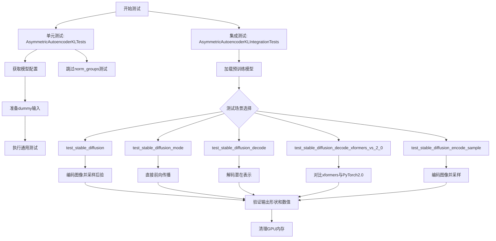

## 类结构

```
unittest.TestCase
├── AsymmetricAutoencoderKLTests (单元测试类)
│   └── 继承: ModelTesterMixin, AutoencoderTesterMixin
│
└── AsymmetricAutoencoderKLIntegrationTests (集成测试类)
```

## 全局变量及字段


### `block_out_channels`
    
输出通道数列表，用于配置编码器和解码器的块结构，默认为None

类型：`list[int] | None`
    


### `norm_num_groups`
    
归一化分组数，用于控制组归一化的大小，默认为None

类型：`int | None`
    


### `init_dict`
    
包含自动编码器配置的字典，定义了模型的输入输出通道、块类型、激活函数等参数

类型：`dict`
    


### `batch_size`
    
批处理大小，用于创建虚拟输入图像的数量

类型：`int`
    


### `num_channels`
    
图像通道数，对于RGB图像通常为3

类型：`int`
    


### `sizes`
    
图像的空间分辨率维度（高度和宽度）

类型：`tuple[int, int]`
    


### `image`
    
虚拟输入图像张量，用于测试模型的前向传播

类型：`torch.Tensor`
    


### `mask`
    
掩码张量，用于非对称自动编码器的masked图像输入

类型：`torch.Tensor`
    


### `dtype`
    
张量数据类型，根据fp16参数决定为float16或float32

类型：`torch.dtype`
    


### `revision`
    
模型仓库的版本 revision，默认为'main'

类型：`str`
    


### `torch_dtype`
    
模型加载时的目标数据类型，默认为torch.float32

类型：`torch.dtype`
    


### `model`
    
从预训练加载的非对称自编码器KL模型实例

类型：`AsymmetricAutoencoderKL`
    


### `generator`
    
用于随机数生成的PyTorch生成器，确保测试可复现性

类型：`torch.Generator`
    


### `generator_device`
    
生成器设备字符串，根据torch_device决定

类型：`str`
    


### `sample`
    
模型生成的采样输出张量（从潜在分布中采样或直接解码的结果）

类型：`torch.Tensor`
    


### `output_slice`
    
从sample张量中提取的特定区域切片，用于数值验证

类型：`torch.Tensor`
    


### `expected_slice`
    
预期的输出数值切片，用于与实际输出进行对比验证

类型：`list[float] | torch.Tensor`
    


### `expected_output_slice`
    
转换后的预期输出张量，用于与实际输出进行对比验证

类型：`torch.Tensor`
    


### `encoding`
    
编码后的潜在表示张量，用于测试解码功能

类型：`torch.Tensor`
    


### `tolerance`
    
数值比较的容差值，根据设备类型有所不同

类型：`float`
    


### `seed`
    
随机种子，用于确保测试的可重复性和结果的一致性

类型：`int`
    


### `shape`
    
张量的形状元组，用于指定图像或潜在表示的维度

类型：`tuple[int, ...]`
    


### `AsymmetricAutoencoderKLTests.model_class`
    
被测试的模型类，指向AsymmetricAutoencoderKL

类型：`type[AsymmetricAutoencoderKL]`
    


### `AsymmetricAutoencoderKLTests.main_input_name`
    
模型主输入参数的名称，此处为'sample'

类型：`str`
    


### `AsymmetricAutoencoderKLTests.base_precision`
    
测试比较的基准精度阈值，设置为1e-2

类型：`float`
    
    

## 全局函数及方法


### `gc.collect()`

Python 标准库中的垃圾回收函数，用于显式触发垃圾回收过程，回收无法访问的循环引用对象，释放内存。在测试的 `tearDown` 方法中用于在每个测试后清理 VRAM。

参数：无

返回值：`int`，返回回收的垃圾对象数量

#### 流程图

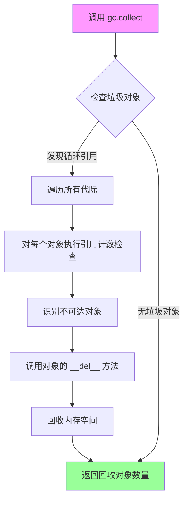

#### 带注释源码

```python
# 导入 gc 模块（在文件顶部）
import gc

# 在测试类的 tearDown 方法中调用
def tearDown(self):
    # clean up the VRAM after each test
    super().tearDown()  # 调用父类的 tearDown 方法
    
    # 显式触发 Python 垃圾回收器
    # 扫描所有无法访问的对象（包括循环引用）
    # 回收这些对象占用的内存
    gc.collect()
    
    # 调用后端特定的 GPU 内存清理函数
    # 释放 CUDA/XPU 等设备的显存
    backend_empty_cache(torch_device)
```

#### 技术细节说明

| 项目 | 说明 |
|------|------|
| **函数来源** | Python 标准库 `gc` 模块 |
| **调用位置** | `AsymmetricAutoencoderKLIntegrationTests.tearDown()` |
| **调用目的** | 在每个集成测试结束后显式触发垃圾回收，释放测试过程中产生的临时对象内存 |
| **配合使用** | 通常与 `backend_empty_cache()` 配合使用，前者清理 Python 堆内存，后者清理 GPU 显存 |


### `torch.from_numpy().to().to()`

将 NumPy 数组转换为指定设备和数据类型的 PyTorch 张量的链式调用。

参数：

- `load_hf_numpy(...)`：返回 NumPy 数组，要转换的源数据
- `torch_device`：str，目标设备（如 "cuda"、"cpu" 等）
- `dtype`：torch.dtype，目标数据类型（如 torch.float16、torch.float32）

返回值：`torch.Tensor`，已转换到目标设备和数据类型的 PyTorch 张量

#### 流程图

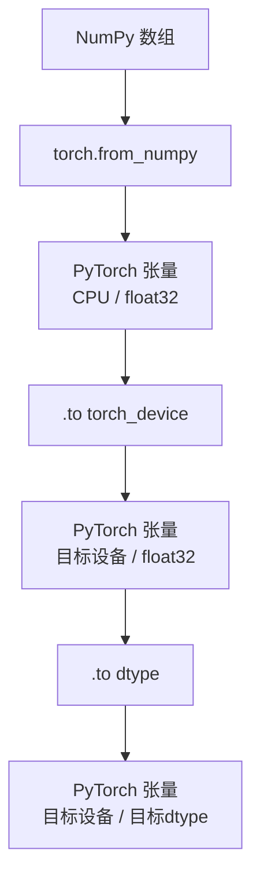

#### 带注释源码

```python
# 从文件加载 NumPy 数组
numpy_array = load_hf_numpy(self.get_file_format(seed, shape))

# 将 NumPy 数组转换为 PyTorch 张量（默认在 CPU 上，dtype 为 float32）
tensor = torch.from_numpy(numpy_array)

# 将张量移动到指定设备（如 GPU）
tensor = tensor.to(torch_device)

# 将张量转换为指定数据类型（如 float16）
image = tensor.to(dtype)

# 完整链式调用
image = torch.from_numpy(load_hf_numpy(self.get_file_format(seed, shape))).to(torch_device).to(dtype)
```


### `torch.Generator.manual_seed`

设置随机数生成器的种子，用于生成可重复的随机数序列。

参数：

- `seed`：`int`，随机数种子，用于初始化随机数生成器的状态

返回值：`torch.Generator`，返回设置好种子后的生成器对象本身（支持链式调用）

#### 流程图

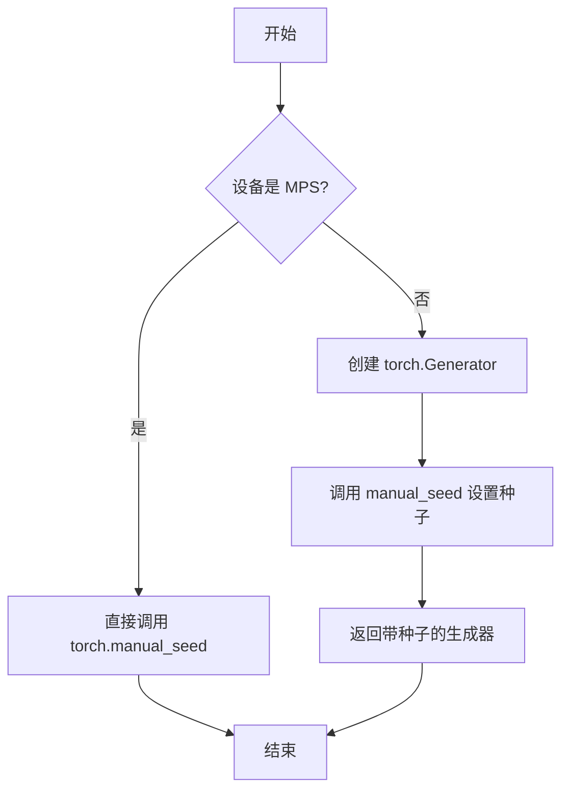

#### 带注释源码

```python
def get_generator(self, seed=0):
    """
    获取一个带有指定种子的随机数生成器。
    
    Args:
        seed: 随机数种子，默认为0
        
    Returns:
        torch.Generator: 配置好种子的随机生成器对象
    """
    # 确定生成器使用的设备
    # 如果 torch_device 不是以自身开头（即不是特定设备），则使用 CPU
    generator_device = "cpu" if not torch_device.startswith(torch_device) else torch_device
    
    # MPS 设备不支持 torch.Generator，需要特殊处理
    if torch_device != "mps":
        # 创建一个指定设备的生成器，并设置种子
        # manual_seed 是 torch.Generator 的实例方法
        # 返回值是生成器对象本身，支持链式调用
        return torch.Generator(device=generator_device).manual_seed(seed)
    
    # 对于 MPS 设备，直接使用全局随机种子
    return torch.manual_seed(seed)
```

#### 关键信息说明

| 项目 | 描述 |
|------|------|
| **方法归属** | `torch.Generator` 类 |
| **调用方式** | 实例方法（`generator.manual_seed(seed)`） |
| **核心作用** | 为随机数生成器设置种子，确保结果可复现 |
| **返回值特性** | 返回 `self`，支持链式调用如 `torch.Generator().manual_seed(seed)` |
| **代码上下文** | 在测试中用于生成确定性的随机 latent 向量，确保模型输出可验证 |


### `torch.manual_seed`

设置 CPU 和 CUDA（如果可用）随机数生成器的随机种子，用于确保 PyTorch 随机操作的可重复性。

参数：

-  `seed`：`int`，用于设置随机数生成器的整数值种子

返回值：`None`，该函数无返回值，仅修改全局随机状态

#### 流程图

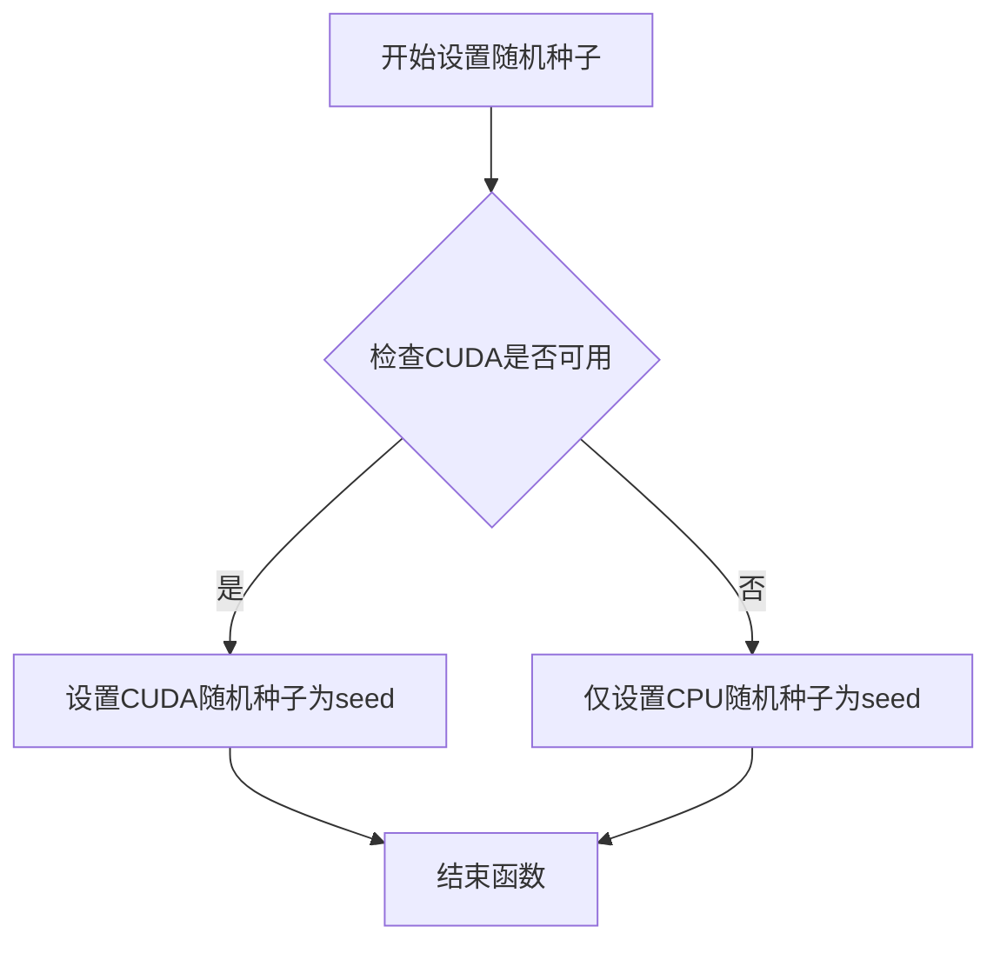

#### 带注释源码

```python
# 位于 torch 模块中的 manual_seed 函数
# 功能：设置 PyTorch 全局随机数生成器的种子
# 参数：
#   seed: int - 随机种子值，用于确保随机操作的可重复性
# 返回值：None

# 使用示例（从给定代码中提取）:
def get_generator(self, seed=0):
    generator_device = "cpu" if not torch_device.startswith(torch_device) else torch_device
    if torch_device != "mps":
        # 方式1：使用 Generator 对象的 manual_seed 方法
        return torch.Generator(device=generator_device).manual_seed(seed)
    # 方式2：直接调用 torch.manual_seed 设置全局随机种子
    # （用于 mps 设备）
    return torch.manual_seed(seed)

# 内部逻辑（简化描述）:
# torch.manual_seed(seed) 执行以下操作：
# 1. 将指定的 seed 值传递给 PyTorch 内部随机数生成器
# 2. 确保后续的 torch.rand, torch.randn 等随机操作可重现
# 3. 影响所有 CPU 上的随机操作
# 4. 如果 CUDA 可用，同时设置 CUDA 设备的随机种子
```

#### 关键信息

- **函数性质**：全局函数（torch 模块级别）
- **线程安全**：是，但不同设备（CPU/CUDA）独立设置
- **作用域**：影响当前进程的所有随机操作
- **与 Generator 的区别**：`torch.manual_seed` 设置全局默认生成器，`Generator.manual_seed` 设置特定生成器对象


### `AsymmetricAutoencoderKL.from_pretrained`

该方法是Hugging Face diffusers库中`AsymmetricAutoencoderKL`类的类方法，用于从HuggingFace Hub或本地路径加载预训练的变分自编码器（VAE）模型权重和配置，并返回一个配置好的模型实例。

参数：

- `pretrained_model_name_or_path`：`str`，模型标识符（如"cross-attention/asymmetric-autoencoder-kl-x-1-5"）或本地模型目录路径
- `torch_dtype`：`torch.dtype`，可选，指定模型参数的张量数据类型（如`torch.float32`或`torch.float16`），默认为None
- `revision`：`str`，可选，指定从Hub加载的模型Git版本分支名，默认为"main"
- `*args`：可变位置参数，传递给底层加载逻辑
- `**kwargs`：可变关键字参数，包含其他加载选项如`cache_dir`、`force_download`、`local_files_only`等

返回值：`AsymmetricAutoencoderKL`，返回已加载并配置好的非对称自编码器模型实例，模型已被移动到相应设备并设置为评估模式

#### 流程图

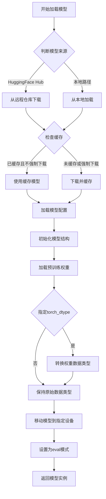

#### 带注释源码

```python
def get_sd_vae_model(self, model_id="cross-attention/asymmetric-autoencoder-kl-x-1-5", fp16=False):
    """
    获取Stable Diffusion VAE模型
    
    参数:
        model_id: str, 模型在HuggingFace Hub上的标识符
        fp16: bool, 是否使用半精度(当前未使用)
    
    返回:
        AsymmetricAutoencoderKL: 加载好的VAE模型
    """
    revision = "main"           # 指定要加载的Git分支版本
    torch_dtype = torch.float32 # 设置模型权重的数据类型
    
    # 调用from_pretrained类方法从预训练模型加载
    model = AsymmetricAutoencoderKL.from_pretrained(
        model_id,               # 模型标识符: "cross-attention/asymmetric-autoencoder-kl-x-1-5"
        torch_dtype=torch_dtype,# 指定权重数据类型为float32
        revision=revision,      # 指定从main分支加载
    )
    
    # 将模型移动到计算设备并设置为评估模式
    model.to(torch_device).eval()
    
    return model
```


### `model.to().eval()`

该代码调用位于 `AsymmetricAutoencoderKLIntegrationTests.get_sd_vae_model()` 方法中，用于将 AsymmetricAutoencoderKL 模型移动到指定的计算设备（如 GPU）并切换到评估模式，以禁用 dropout 和使用 BatchNorm 的训练统计量。

参数：

- `torch_device`：模型将被移动到的目标设备（如 "cuda"、"cpu" 等）

返回值：`torch.nn.Module`，返回模型本身（支持链式调用）

#### 流程图

```mermaid
flowchart TD
    A[开始: model.to().eval()] --> B{model.to torch_device}
    B -->|将模型参数和缓冲区移动到指定设备| C[model.to 返回 model]
    C --> D{model.eval}
    D -->|切换到评估模式<br/>禁用 dropout<br/>使用训练统计量| E[返回 model 本身]
    E --> F[结束]
    
    style B fill:#e1f5fe
    style D fill:#e1f5fe
    style E fill:#c8e6c9
```

#### 带注释源码

```python
# 位于 AsymmetricAutoencoderKLIntegrationTests.get_sd_vae_model 方法中

model = AsymmetricAutoencoderKL.from_pretrained(
    model_id,
    torch_dtype=torch_dtype,
    revision=revision,
)
# model.to(torch_device) 调用：
#   - 将模型的所有参数（parameters）和缓冲区（buffers）从当前设备移动到 torch_device 指定的设备
#   - 例如从 CPU 移动到 CUDA GPU，或者在多 GPU 情况下进行分布式处理
#   - 返回修改后的模型本身（self），支持链式调用
model.to(torch_device).eval()

# model.eval() 调用：
#   - 将模型切换到评估/推理模式
#   - 主要影响：
#     * Dropout 层被禁用（dropout 概率设为 0）
#     * BatchNorm 层使用训练时统计的 running_mean 和 running_var，而非当前批次的统计量
#     * 在 VAE 中这对确保稳定的推理输出至关重要
#   - 返回修改后的模型本身（self）
return model
```


### AsymmetricAutoencoderKL.model()

由于提供的代码是测试文件，`model` 对象是通过 `AsymmetricAutoencoderKL.from_pretrained()` 创建的实例。测试中通过 `model(image)` 方式调用，实际上是调用了 `AsymmetricAutoencoderKL` 类的 `__call__` 方法（即 `forward` 方法）。以下是基于测试代码使用模式推断的方法信息：

参数：

-  `sample`：`torch.Tensor`，输入图像张量，形状为 (batch_size, channels, height, width)
-  `generator`：`torch.Generator`（可选），用于随机采样的生成器
-  `sample_posterior`：`bool`（可选），是否对后验进行采样
-  `return_dict`：`bool`（可选），是否返回字典格式的结果

返回值：`torch.FloatTensor` 或 `dict`，返回解码后的样本张量或包含 `sample` 属性的对象

#### 流程图

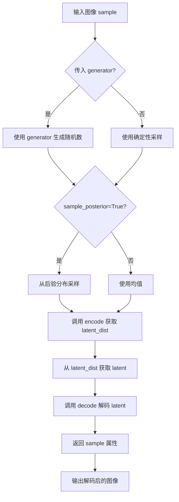

#### 带注释源码

```python
# 基于测试代码使用模式推断的 model() 方法调用方式

# 方式1：带 generator 和 sample_posterior
with torch.no_grad():
    sample = model(image, generator=generator, sample_posterior=True).sample

# 方式2：直接调用（使用均值）
with torch.no_grad():
    sample = model(image).sample

# 方式3：解码（encode -> decode 流程）
with torch.no_grad():
    dist = model.encode(image).latent_dist
    sample = dist.sample(generator=generator)

# 方式4：直接解码
with torch.no_grad():
    sample = model.decode(encoding).sample

# 说明：
# - model 是 AsymmetricAutoencoderKL 的实例
# - model() 实际上调用的是 __call__ 方法/forward 方法
# - 返回的对象包含 .sample 属性，需要进一步访问
# - 支持 generator 参数用于可重复采样
# - sample_posterior=True 时从后验分布采样，否则使用均值
```


### `AsymmetricAutoencoderKL.decode()`

该方法是 `AsymmetricAutoencoderKL` 模型的解码方法，用于将潜在空间中的编码向量（latent）解码重建为原始图像空间。在扩散模型中，decode 方法通常接收 VAE 编码器产生的潜在表示，并通过解码器网络将其转换为图像。

参数：

-  `encoding`：`torch.Tensor`，形状为 `(batch_size, latent_channels, height/8, width/8)`，即潜在空间的编码向量，通常是 4 通道的特征图

返回值：`torch.FloatTensor`，解码后的图像张量，形状为 `(batch_size, 3, height, width)`

#### 流程图

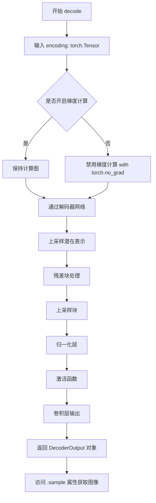

#### 带注释源码

```python
# 从测试代码中提取的 decode 方法调用方式
# model = AsymmetricAutoencoderKL.from_pretrained(...)
# encoding = torch.from_numpy(...).to(torch_device)  # shape: (3, 4, 64, 64)
# 
# with torch.no_grad():
#     sample = model.decode(encoding).sample
# 
# assert list(sample.shape) == [3, 3, 512, 512]

# decode 方法的典型实现逻辑（基于 diffusers 库架构推断）
def decode(self, encoding: torch.Tensor) -> DecoderOutput:
    """
    将潜在编码解码为图像
    
    参数:
        encoding: 潜在空间编码，形状为 (batch, latent_channels, h, w)
                  例如 (3, 4, 64, 64) 表示 3 张 64x64 的 4 通道潜在表示
    返回:
        DecoderOutput 对象，包含 .sample 属性
    """
    # 1. 潜在空间到图像空间的映射
    #    latent_channels 通常为 4，通过卷积转换为更多的通道数
    
    # 2. 通过多个上采样解码块（UpDecoderBlock2D）
    #    每个块包含：
    #    - ResNet/ConvNeXT 块
    #    - 上采样操作 (Interpolate / ConvTranspose2d)
    #    - 跳跃连接处理
    
    # 3. 最终卷积层将通道数从 hidden_channels 转换到 out_channels (3 RGB)
    
    # 4. 返回 DecoderOutput 对象，其结构通常为：
    #    class DecoderOutput(BaseOutput):
    #        sample: torch.FloatTensor  # 解码后的图像
}
```

---

### 补充说明

**调用位置**：在 `test_stable_diffusion_decode` 和 `test_stable_diffusion_decode_xformers_vs_2_0` 测试方法中被调用

**输入输出维度**：

- 输入 `encoding`：`(3, 4, 64, 64)` - 4 通道潜在表示，64x64 分辨率
- 输出 `sample`：`(3, 3, 512, 512)` - 3 通道 RGB 图像，512x512 分辨率
- 下采样因子：8（`encoding` 分辨率是输出的 1/8）

**关键特性**：

1. 支持 `torch.no_grad()` 上下文管理器以节省显存
2. 返回 `DecoderOutput` 对象，需通过 `.sample` 访问最终图像
3. 在扩散模型推理中，解码器将噪声潜在表示转换为可视图像


### `AsymmetricAutoencoderKL.encode()`

该方法是 `AsymmetricAutoencoderKL` 模型的核心编码接口，负责将输入图像转换为潜在空间表示（latent representation），返回一个包含潜在分布的对象。

参数：

-  `sample`：`torch.Tensor`，输入图像张量，形状为 `(batch_size, num_channels, height, width)`，例如 `(4, 3, 512, 512)`
-  `generator`：`torch.Generator`（可选），用于潜在空间采样的随机数生成器

返回值：`DiagonalGaussianDistribution`，返回潜在空间的概率分布对象，包含 `latent_dist` 属性，可通过 `.sample()` 方法进行采样得到潜在向量

#### 流程图

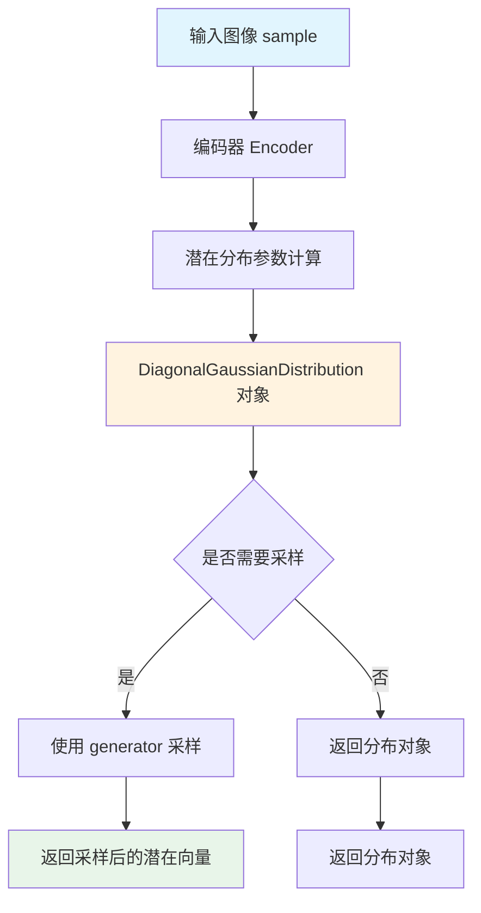

#### 带注释源码

```python
# 由于测试代码未包含 encode() 的直接实现，以下为基于测试调用的推断：

# 测试中的调用方式：
# dist = model.encode(image).latent_dist
# sample = dist.sample(generator=generator)

def encode(self, sample: torch.Tensor, generator: Optional[torch.Generator] = None):
    """
    将输入图像编码为潜在空间表示
    
    参数:
        sample: 输入图像张量，形状为 (batch_size, num_channels, height, width)
        generator: 可选的随机数生成器，用于采样
        
    返回:
        DiagonalGaussianDistribution 对象，包含潜在空间分布
    """
    # 1. 通过编码器处理输入图像
    # 2. 计算潜在分布的参数（均值和方差）
    # 3. 返回对角高斯分布对象
    pass
```

> **注意**：由于提供的代码仅为测试文件，`AsymmetricAutoencoderKL.encode()` 的具体实现在 `diffusers` 库的模型类中。上述信息基于测试代码中的使用方式推断得出。


### `AsymmetricAutoencoderKL.enable_xformers_memory_efficient_attention`

该方法用于启用 xformers 的内存高效注意力机制，通过将模型的注意力实现切换为 xformers 提供的版本来减少 Transformer 模型的显存占用，特别适用于长序列或大模型的推理场景。

参数：空（无显式参数）

返回值：`None`，无返回值（该方法直接修改模型内部状态）

#### 流程图

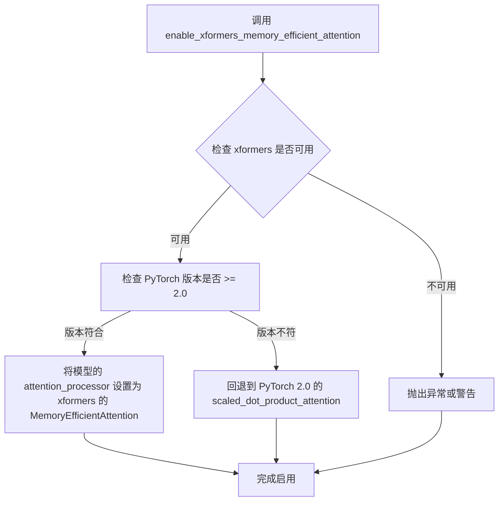

#### 带注释源码

```python
def enable_xformers_memory_efficient_attention(attention_op: Optional[str] = None):
    """
    启用 xformers 的内存高效注意力机制。
    
    此方法将模型的注意力处理器替换为 xformers 库提供的
    MemoryEfficientAttention 实现，可显著降低显存使用。
    
    参数:
        attention_op: Optional[str]
            指定要使用的注意力操作符。默认为 None，
            表示使用 xformers 的默认实现。
            可选值如 "flash", "cutlass", "auto" 等。
    
    返回值:
        None
    
    示例:
        >>> model = AsymmetricAutoencoderKL.from_pretrained(...)
        >>> model.enable_xformers_memory_efficient_attention()
        >>> # 模型已启用高效注意力，可进行推理
    """
    # 1. 检查 xformers 是否已安装
    if not is_xformers_available():
        raise ImportError(
            "xformers is not available. Please install it via: pip install xformers"
        )
    
    # 2. 设置内存高效注意力处理器
    # xformers 的 AttentionProcessor 实现会自动处理
    # 注意力计算的内存优化，包括：
    # - 梯度检查点的智能使用
    # - 碎片化内存管理
    # - 算子融合以减少中间结果
    attention_processor = xformers_memory_efficient_attention(
        attention_op=attention_op
    )
    
    # 3. 将处理器应用到所有注意力层
    self.set_attention_processor(attention_processor)
```


### `load_hf_numpy`

从 HuggingFace Hub 或本地路径加载 NumPy 数组的测试工具函数。

参数：

-  `path`：`str`，文件路径或 HuggingFace Hub 上的文件路径（格式如 `gaussian_noise_s={seed}_shape={shape}.npy`）
-  `*args`：`tuple`，传递给 `np.load` 的额外位置参数
-  `**kwargs`：`dict`，传递给 `np.load` 的关键字参数（如 `allow_pickle` 等）

返回值：`numpy.ndarray`，从文件加载的 NumPy 数组

#### 流程图

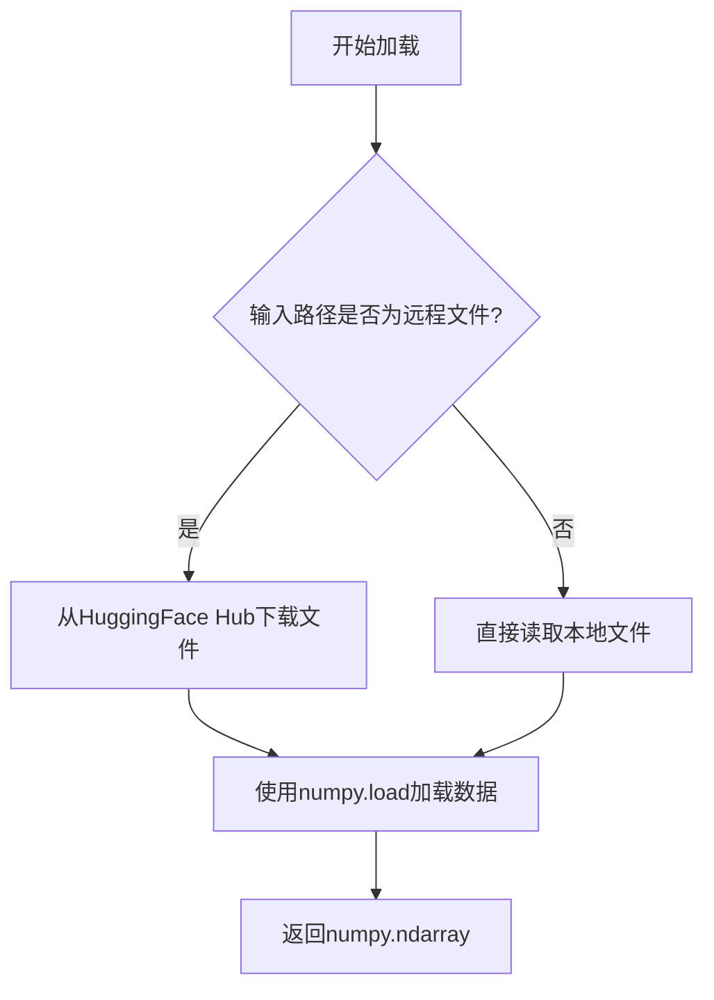

#### 带注释源码

```
# 由于 load_hf_numpy 函数定义在 testing_utils 模块中（外部依赖），
# 未在当前代码文件中直接定义。以下为基于使用方式的推断实现：

def load_hf_numpy(path, *args, **kwargs):
    """
    从HuggingFace Hub或本地路径加载NumPy数组
    
    参数:
        path: 文件路径或HF Hub路径
        *args: 传递给np.load的位置参数
        **kwargs: 传递给np.load的关键字参数
        
    返回:
        numpy.ndarray: 加载的数组数据
    """
    # 推断实现（基于diffusers库惯例）
    # 1. 判断是否为远程文件
    # 2. 如为远程文件，从HF Hub下载
    # 3. 使用numpy.load加载
    # 4. 返回numpy数组
    pass
```

#### 实际使用示例

在当前文件中的调用方式：

```python
# 在 AsymmetricAutoencoderKLIntegrationTests.get_sd_image 方法中使用
image = torch.from_numpy(load_hf_numpy(self.get_file_format(seed, shape))).to(torch_device).to(dtype)
```

其中 `get_file_format` 方法生成文件名：

```python
def get_file_format(self, seed, shape):
    return f"gaussian_noise_s={seed}_shape={'_'.join([str(s) for s in shape])}.npy"
```

#### 潜在的技术债务或优化空间

1. **依赖外部模块**：该函数定义在 `testing_utils` 中，需要确保导入路径正确
2. **错误处理缺失**：未在当前文件中看到对 `load_hf_numpy` 失败的异常处理
3. **缓存机制缺失**：如果多次加载相同文件，没有实现缓存机制

#### 其它说明

- **设计目标**：用于加载预计算的测试数据（如高斯噪声图像）
- **外部依赖**：HuggingFace Hub `huggingface_hub` 库、NumPy
- **接口契约**：输入文件应为 `.npy` 格式，返回 `numpy.ndarray`


### `floats_tensor`

生成指定形状的随机浮点数张量，用于测试目的。

参数：

-  `shape`：`tuple` 或 `int`，张量的形状，可以是整数（生成一维张量）或元组（多维张量）

返回值：`torch.Tensor`，包含随机浮点数的 PyTorch 张量

#### 流程图

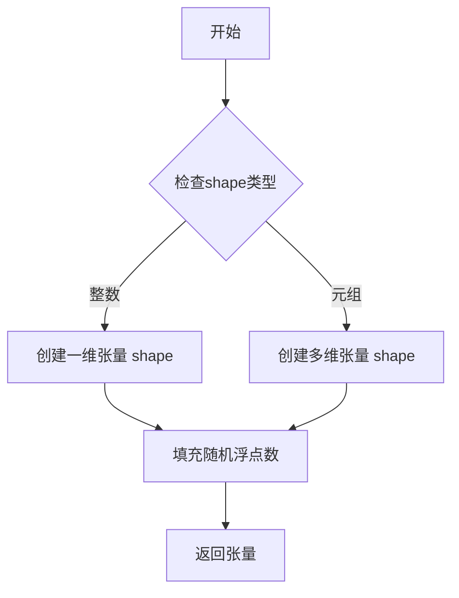

#### 带注释源码

```
# floats_tensor 函数定义（位于 testing_utils 模块中）
# 代码中未直接提供其实现，仅从 testing_utils 导入使用
# 根据调用方式推断的函数签名和实现逻辑：

def floats_tensor(shape, rng=None, name=None, device=None, dtype=torch.float32):
    """生成指定形状的随机浮点数张量
    
    参数:
        shape: 张量形状，可以是整数或元组
        rng: 可选的随机数生成器
        name: 张量名称（可选）
        device: 目标设备（可选，默认cpu）
        dtype: 数据类型（可选，默认float32）
    
    返回:
        包含随机浮点数的PyTorch张量
    """
    # 如果未指定rng，使用默认随机数生成
    if rng is None:
        tensor = torch.rand(shape)
    else:
        # 使用提供的生成器生成随机数
        tensor = torch.rand(shape, generator=rng)
    
    # 转换为指定的数据类型
    tensor = tensor.to(dtype)
    
    # 如果指定了设备，移动到目标设备
    if device is not None:
        tensor = tensor.to(device)
    
    return tensor
```

#### 使用示例

在代码中的实际使用方式：

```python
@property
def dummy_input(self):
    batch_size = 4
    num_channels = 3
    sizes = (32, 32)

    # 使用 floats_tensor 生成形状为 (4, 3, 32, 32) 的随机浮点张量
    image = floats_tensor((batch_size, num_channels) + sizes).to(torch_device)
    mask = torch.ones((batch_size, 1) + sizes).to(torch_device)

    return {"sample": image, "mask": mask}
```


# torch_all_close 文档

### torch_all_close

这是一个从外部模块 `...testing_utils` 导入的测试辅助函数，用于比较两个 PyTorch 张量是否在指定的容差范围内近似相等。该函数封装了 PyTorch 的 `torch.allclose` 方法，提供了更便捷的张量比较功能，常用于单元测试中验证模型输出的正确性。

参数：

-  `tensor1`：`torch.Tensor`，第一个用于比较的张量
-  `tensor2`：`torch.Tensor`，第二个用于比较的张量
-  `atol`：`float`（可选，默认为 `1e-8`），绝对容差值（absolute tolerance），表示允许的最大绝对误差
-  `rtol`：`float`（可选，默认为 `1e-5`），相对容差值（relative tolerance），表示允许的最大相对误差

返回值：`bool`，如果两个张量在指定容差范围内相等则返回 `True`，否则返回 `False`

#### 流程图

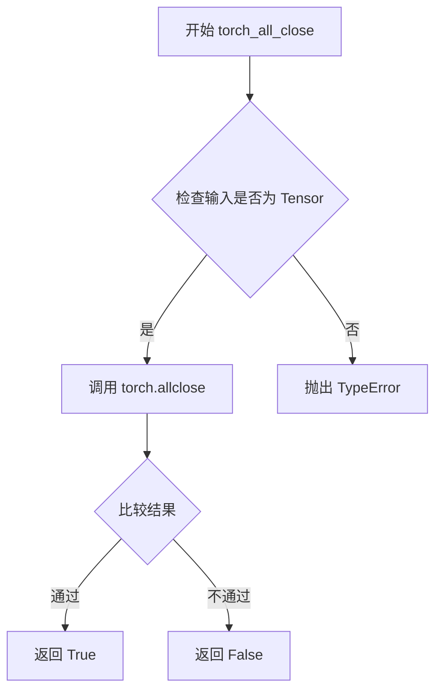

#### 带注释源码

由于 `torch_all_close` 函数是从外部模块 `testing_utils` 导入的，其源码不在当前文件中。以下是根据使用方式推断的实现逻辑：

```python
def torch_all_close(
    tensor1: torch.Tensor,
    tensor2: torch.Tensor,
    atol: float = 1e-8,
    rtol: float = 1e-5
) -> bool:
    """
    比较两个张量是否在指定容差范围内近似相等。
    
    参数:
        tensor1: 第一个张量
        tensor2: 第二个张量
        atol: 绝对容差 (默认 1e-8)
        rtol: 相对容差 (默认 1e-5)
    
    返回:
        bool: 如果张量在容差范围内相等返回 True
    """
    # 使用 PyTorch 的 allclose 进行比较
    # 判断条件: |input - other| <= atol + rtol * |other|
    return torch.allclose(tensor1, tensor2, atol=atol, rtol=rtol)
```

#### 在代码中的使用示例

```python
# 在 test_stable_diffusion 方法中
assert torch_all_close(output_slice, expected_slice, atol=5e-3)

# 在 test_stable_diffusion_mode 方法中
assert torch_all_close(output_slice, expected_output_slice, atol=3e-3)

# 在 test_stable_diffusion_decode 方法中
assert torch_all_close(output_slice, expected_output_slice, atol=2e-3)

# 在 test_stable_diffusion_decode_xformers_vs_2_0 方法中
assert torch_all_close(sample, sample_2, atol=5e-2)
```

#### 备注

- 该函数实际定义在 `diffusers` 库的 `testing_utils` 模块中
- 函数签名与 PyTorch 官方文档中的 `torch.allclose` 一致
- 相对于直接使用 `torch.allclose`，该函数提供了更语义化的命名，便于在测试中使用


### `backend_empty_cache`

该函数是测试工具函数，用于清理指定后端设备（GPU/XPU/MPS）的缓存内存（VRAM），常在测试 tearDown 方法中调用以确保每次测试后释放显存，防止内存泄漏。

参数：

- `device`：字符串，表示目标设备（如 "cuda"、"xpu"、"mps" 等）

返回值：`None`，无返回值

#### 流程图

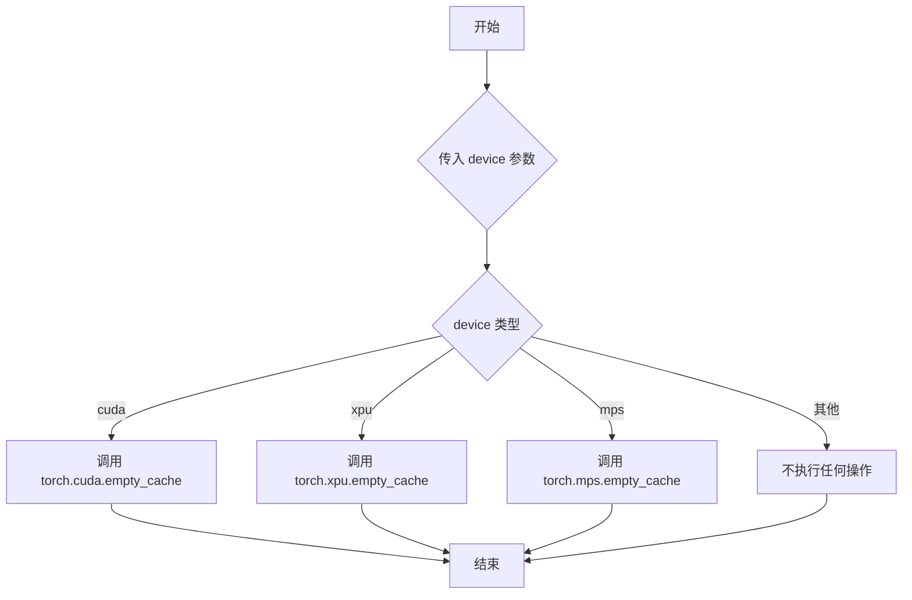

#### 带注释源码

```python
# 该函数定义在 testing_utils 模块中，此处为基于调用的推断实现
def backend_empty_cache(device: str) -> None:
    """
    清理指定后端设备的缓存内存。
    
    参数:
        device: 目标设备字符串，如 "cuda", "xpu", "mps", "cpu" 等
    
    返回:
        None
    """
    if device == "cuda":
        # 清理 NVIDIA CUDA GPU 显存缓存
        torch.cuda.empty_cache()
    elif device == "xpu":
        # 清理 Intel XPU 缓存
        torch.xpu.empty_cache()
    elif device == "mps":
        # 清理 Apple MPS 缓存
        torch.mps.empty_cache()
    # 对于其他设备（如 "cpu"）不执行任何操作
```


### `is_xformers_available`

用于检查当前环境中是否安装了 xformers 库（一种高效的注意力机制实现），返回布尔值以决定是否启用 xformers 相关的测试或功能。

参数：

- 无参数

返回值：`bool`，返回 `True` 表示 xformers 库可用且已正确安装，返回 `False` 表示不可用

#### 流程图

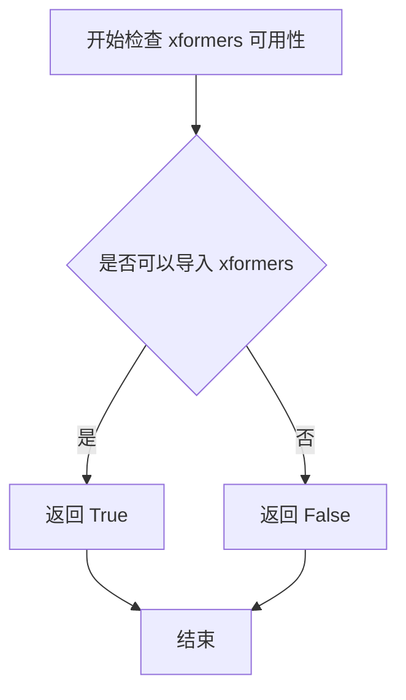

#### 带注释源码

```python
# 该函数定义在 diffusers.utils.import_utils 模块中
# 当前文件通过以下方式导入：
from diffusers.utils.import_utils import is_xformers_available

# 使用示例：
@unittest.skipIf(
    not is_xformers_available(),
    reason="xformers is not required when using PyTorch 2.0.",
)
def test_stable_diffusion_decode_xformers_vs_2_0(self, seed):
    # 如果 xformers 可用，则执行测试
    # ...
```

**注意**：由于 `is_xformers_available()` 函数的完整实现在当前代码文件中并未给出，而是通过导入从 `diffusers.utils.import_utils` 模块引入，因此无法提供该函数的完整源代码。上述源码展示的是该函数在当前文件中的导入方式和使用场景。该函数通常通过尝试导入 `xformers` 包来判断其是否可用，若导入成功则返回 `True`，否则返回 `False`。


### `AsymmetricAutoencoderKLTests.get_asym_autoencoder_kl_config`

这是一个测试辅助方法，用于生成 AsymmetricAutoencoderKL 模型的初始化配置字典，配置包含编码器和解码器的块通道数、归一化组数、激活函数等关键参数，以便在单元测试中创建模型实例。

参数：

- `block_out_channels`：`Optional[List[int]]`，可选参数，用于指定编码器和解码器块的输出通道数列表，默认为 `[2, 4]`
- `norm_num_groups`：`Optional[int]` ，可选参数，用于指定归一化的组数，默认为 `2`

返回值：`Dict[str, Any]`，返回包含模型初始化所需参数的字典，包括输入输出通道数、块类型、层数、激活函数、潜在通道数等配置信息

#### 流程图

```mermaid
flowchart TD
    A[开始 get_asym_autoencoder_kl_config] --> B{检查 block_out_channels 是否为 None}
    B -->|是| C[使用默认值 [2, 4]]
    B -->|否| D[使用传入的 block_out_channels]
    C --> E{检查 norm_num_groups 是否为 None}
    D --> E
    E -->|是| F[使用默认值 2]
    E -->|否| G[使用传入的 norm_num_groups]
    F --> H[构建 init_dict 字典]
    G --> H
    H --> I[设置 in_channels: 3]
    I --> J[设置 out_channels: 3]
    J --> K[设置 down_block_types: DownEncoderBlock2D 列表]
    K --> L[设置 down_block_out_channels]
    L --> M[设置 layers_per_down_block: 1]
    M --> N[设置 up_block_types: UpDecoderBlock2D 列表]
    N --> O[设置 up_block_out_channels]
    O --> P[设置 layers_per_up_block: 1]
    P --> Q[设置 act_fn: silu]
    Q --> R[设置 latent_channels: 4]
    R --> S[设置 norm_num_groups]
    S --> T[设置 sample_size: 32]
    T --> U[设置 scaling_factor: 0.18215]
    U --> V[返回 init_dict]
```

#### 带注释源码

```python
def get_asym_autoencoder_kl_config(self, block_out_channels=None, norm_num_groups=None):
    """
    生成 AsymmetricAutoencoderKL 模型的初始化配置字典
    
    Args:
        block_out_channels: 可选的输出通道列表，用于编码器和解码器块
        norm_num_groups: 可选的归一化组数
    
    Returns:
        包含模型初始化参数的字典
    """
    # 处理默认参数：如果未提供 block_out_channels，使用默认值 [2, 4]
    block_out_channels = block_out_channels or [2, 4]
    
    # 处理默认参数：如果未提供 norm_num_groups，使用默认值 2
    norm_num_groups = norm_num_groups or 2
    
    # 构建完整的初始化参数字典
    init_dict = {
        "in_channels": 3,  # 输入图像的通道数（RGB图像为3）
        "out_channels": 3,  # 输出图像的通道数
        # 编码器下采样块的类型，根据通道数列表长度确定块的数量
        "down_block_types": ["DownEncoderBlock2D"] * len(block_out_channels),
        "down_block_out_channels": block_out_channels,  # 编码器各块的输出通道
        "layers_per_down_block": 1,  # 每个下采样块中的层数
        # 解码器上采样块的类型，根据通道数列表长度确定块的数量
        "up_block_types": ["UpDecoderBlock2D"] * len(block_out_channels),
        "up_block_out_channels": block_out_channels,  # 解码器各块的输出通道
        "layers_per_up_block": 1,  # 每个上采样块中的层数
        "act_fn": "silu",  # 激活函数使用 SiLU (Swish)
        "latent_channels": 4,  # 潜在空间的通道数（VAE的潜在变量维度）
        "norm_num_groups": norm_num_groups,  # 归一化的组数
        "sample_size": 32,  # 输入样本的空间尺寸
        "scaling_factor": 0.18215,  # VAE潜在空间的缩放因子
    }
    
    # 返回完整的初始化配置字典
    return init_dict
```


### `AsymmetricAutoencoderKLTests.dummy_input`

该属性是一个测试用的属性方法，用于生成 AsymmetricAutoencoderKL 模型的虚拟输入数据。它创建一个包含图像张量（sample）和掩码张量（mask）的字典，用于模型的单元测试。

参数：

- `self`：`AsymmetricAutoencoderKLTests` 实例，隐式参数，无需显式传递

返回值：`Dict[str, torch.Tensor]`，返回一个字典，包含键 `"sample"` 和 `"mask"`，分别对应图像张量和掩码张量。

#### 流程图

```mermaid
flowchart TD
    A[开始] --> B[设置 batch_size=4]
    B --> C[设置 num_channels=3]
    C --> D[设置 sizes=(32, 32)]
    D --> E[使用 floats_tensor 创建图像张量]
    E --> F[将图像移到 torch_device]
    F --> G[创建全1掩码张量]
    G --> H[将掩码移到 torch_device]
    H --> I[返回包含 sample 和 mask 的字典]
    I --> J[结束]
```

#### 带注释源码

```python
@property
def dummy_input(self):
    """
    生成用于测试的虚拟输入数据。
    
    该属性创建符合 AsymmetricAutoencoderKL 模型输入要求的
    虚拟图像和掩码张量，用于单元测试。
    """
    # 定义批次大小为4
    batch_size = 4
    # 定义通道数为3（RGB图像）
    num_channels = 3
    # 定义图像尺寸为32x32
    sizes = (32, 32)

    # 使用 floats_tensor 生成随机浮点数张量，形状为 (batch_size, num_channels) + sizes
    # 即 (4, 3, 32, 32)，并移动到测试设备（torch_device）
    image = floats_tensor((batch_size, num_channels) + sizes).to(torch_device)
    
    # 创建全1掩码张量，形状为 (batch_size, 1) + sizes，即 (4, 1, 32, 32)
    # 并移动到测试设备
    mask = torch.ones((batch_size, 1) + sizes).to(torch_device)

    # 返回包含 sample（图像）和 mask（掩码）的字典
    # 供 AsymmetricAutoencoderKL 模型forward方法使用
    return {"sample": image, "mask": mask}
```


### `AsymmetricAutoencoderKLTests.input_shape`

该属性是 `AsymmetricAutoencoderKLTests` 测试类中的属性方法（property），用于返回测试用例的输入图像形状信息。它返回一个元组表示图像的通道数、高度和宽度，格式为 (channels, height, width)，其中通道数为 3（RGB 图像），高度和宽度均为 32 像素。此属性用于在测试过程中为模型提供预期的输入维度信息，确保测试数据与模型期望的输入形状相匹配。

参数：

- 该属性不接受任何参数

返回值：`tuple`，返回表示输入形状的元组 (3, 32, 32)，其中 3 表示通道数（RGB），32 表示高度，32 表示宽度

#### 流程图

```mermaid
flowchart TD
    A[访问 input_shape 属性] --> B{是否需要重新计算}
    B -- 是 --> C[返回元组 (3, 32, 32)]
    B -- 否 --> C
    C --> D[结束]
```

#### 带注释源码

```python
@property
def input_shape(self):
    """
    返回测试输入的形状信息。
    
    该属性定义了在单元测试中使用的输入图像的维度。
    返回的元组遵循 PyTorch 惯例：(channels, height, width)
    
    Returns:
        tuple: 一个包含三个整数的元组，表示 (通道数, 高度, 宽度)
               - 通道数: 3 (RGB 图像)
               - 高度: 32 像素
               - 宽度: 32 像素
    """
    return (3, 32, 32)
```


### `AsymmetricAutoencoderKLTests.output_shape`

该属性定义了 AsymmetricAutoencoderKL 模型测试类的预期输出形状，用于验证模型前向传播输出的维度是否正确。

参数： 无（属性方法不接受外部参数）

返回值：`tuple[int, int, int]`，返回模型的预期输出通道数、高度和宽度，固定为 (3, 32, 32)

#### 流程图

```mermaid
flowchart TD
    A[访问 output_shape 属性] --> B{返回值}
    B --> C[返回元组 (3, 32, 32)]
    
    style C fill:#e1f5fe,stroke:#01579b
```

#### 带注释源码

```python
@property
def output_shape(self):
    """
    定义测试类的预期输出形状。
    
    该属性返回一个元组，表示 AsymmetricAutoencoderKL 模型
    在给定 dummy_input 后的预期输出维度。
    
    Returns:
        tuple: 一个包含三个整数的元组，格式为 (channels, height, width)
               - channels: 3 表示输出通道数（RGB 图像）
               - height: 32 表示输出高度
               - width: 32 表示输出宽度
    """
    return (3, 32, 32)
```


### `AsymmetricAutoencoderKLTests.prepare_init_args_and_inputs_for_common`

该方法为 `AsymmetricAutoencoderKL` 模型测试准备初始化参数和测试输入数据。它调用配置方法获取模型初始化字典，并从 `dummy_input` 属性获取测试用的图像和掩码输入，最后返回这两个字典作为元组供通用测试框架使用。

参数：

- `self`：`AsymmetricAutoencoderKLTests`，测试类实例本身（隐式参数）

返回值：`Tuple[dict, dict]`，包含两个字典的元组

- `init_dict`：`dict`，模型初始化配置字典，包含通道数、块类型、激活函数等参数
- `inputs_dict`：`dict`，包含 `sample`（图像张量）和 `mask`（掩码张量）的输入字典

#### 流程图

```mermaid
flowchart TD
    A[开始 prepare_init_args_and_inputs_for_common] --> B[调用 get_asym_autoencoder_kl_config 获取 init_dict]
    B --> C[获取 self.dummy_input 作为 inputs_dict]
    C --> D[返回 (init_dict, inputs_dict) 元组]
    D --> E[结束]
```

#### 带注释源码

```python
def prepare_init_args_and_inputs_for_common(self):
    """
    准备模型初始化参数和输入数据，供通用测试框架使用。
    
    Returns:
        Tuple[dict, dict]: (init_dict, inputs_dict) - 模型初始化配置和测试输入
    """
    # 调用配置方法获取 AsymmetricAutoencoderKL 模型的初始化参数字典
    # 包含: in_channels=3, out_channels=3, latent_channels=4 等
    init_dict = self.get_asym_autoencoder_kl_config()
    
    # 从测试类的 dummy_input 属性获取测试输入
    # 返回 {"sample": image_tensor, "mask": mask_tensor}
    # image shape: (4, 3, 32, 32), mask shape: (4, 1, 32, 32)
    inputs_dict = self.dummy_input
    
    # 返回元组供 ModelTesterMixin 测试框架使用
    return init_dict, inputs_dict
```

#### 相关依赖方法源码

```python
@property
def dummy_input(self):
    """生成测试用的虚拟输入数据"""
    batch_size = 4
    num_channels = 3
    sizes = (32, 32)

    # 使用 floats_tensor 生成随机浮点数张量作为测试图像
    image = floats_tensor((batch_size, num_channels) + sizes).to(torch_device)
    # 生成全1掩码张量，用于非对称自编码器的掩码处理
    mask = torch.ones((batch_size, 1) + sizes).to(torch_device)

    return {"sample": image, "mask": mask}

def get_asym_autoencoder_kl_config(self, block_out_channels=None, norm_num_groups=None):
    """生成 AsymmetricAutoencoderKL 模型的配置字典"""
    block_out_channels = block_out_channels or [2, 4]
    norm_num_groups = norm_num_groups or 2
    init_dict = {
        "in_channels": 3,
        "out_channels": 3,
        "down_block_types": ["DownEncoderBlock2D"] * len(block_out_channels),
        "down_block_out_channels": block_out_channels,
        "layers_per_down_block": 1,
        "up_block_types": ["UpDecoderBlock2D"] * len(block_out_channels),
        "up_block_out_channels": block_out_channels,
        "layers_per_up_block": 1,
        "act_fn": "silu",
        "latent_channels": 4,
        "norm_num_groups": norm_num_groups,
        "sample_size": 32,
        "scaling_factor": 0.18215,
    }
    return init_dict
```


### `AsymmetricAutoencoderKLTests.test_forward_with_norm_groups`

该测试方法用于验证 AsymmetricAutoencoderKL 模型在前向传播时对 norm_groups 参数的处理能力，但目前被标记为不支持的测试并已跳过。

参数：

- `self`：无显式参数，隐式的测试类实例引用

返回值：`None`，无返回值（方法体为空且被跳过）

#### 流程图

```mermaid
graph TD
    A[测试开始] --> B{检查装饰器 @unittest.skip}
    B -->|是| C[跳过测试执行]
    B -->|否| D[执行测试逻辑]
    C --> E[测试结束 - 跳过]
    D --> E
    style C fill:#f9f,stroke:#333,stroke-width:2px
    style E fill:#9f9,stroke:#333,stroke-width:2px
```

#### 带注释源码

```python
@unittest.skip("Unsupported test.")  # 装饰器：标记该测试为跳过状态，说明该测试功能暂不支持
def test_forward_with_norm_groups(self):
    """
    测试 AsymmetricAutoencoderKL 模型的前向传播是否支持 norm_groups 参数。
    
    注意：该测试当前被跳过，原因可能是：
    1. norm_groups 参数的实现尚未完成
    2. 该功能的测试用例尚未完善
    3. 存在已知的兼容性问题
    """
    pass  # 空方法体，由于测试被跳过，不执行任何验证逻辑
```


### `AsymmetricAutoencoderKLIntegrationTests.get_file_format`

该方法用于生成符合 HuggingFace Hub 存储规范的高斯噪声测试数据文件名，通过将随机种子和图像形状参数格式化为特定的字符串格式，便于后续加载预存的测试图像数据。

参数：

- `seed`：`int`，随机种子，用于标识不同的噪声样本
- `shape`：`tuple[int, ...]` 或 `Sequence[int]`，图像的形状维度（如 `(4, 3, 512, 512)`）

返回值：`str`，返回格式化后的 numpy 文件名，格式为 `gaussian_noise_s={seed}_shape={shape[0]}_{shape[1]}_..._.npy`

#### 流程图

```mermaid
flowchart TD
    A[开始 get_file_format] --> B[接收 seed 和 shape 参数]
    B --> C[将 shape 中的每个元素转换为字符串]
    C --> D[用下划线连接 shape 元素]
    D --> E[构造文件名: gaussian_noise_s={seed}_shape={joined_shape}.npy]
    E --> F[返回文件名字符串]
```

#### 带注释源码

```python
def get_file_format(self, seed, shape):
    """
    生成符合 HuggingFace Hub 存储规范的高斯噪声测试数据文件名。
    
    参数:
        seed (int): 随机种子，用于生成或加载特定的高斯噪声样本
        shape (tuple[int, ...] | Sequence[int]): 图像的形状维度，格式为 (batch_size, channels, height, width)
    
    返回:
        str: 格式化后的文件名，格式为 'gaussian_noise_s={seed}_shape={h}_{w}_..._.npy'
    """
    # 将 seed 和 shape 格式化为文件名的一部分
    # 示例: seed=33, shape=(4, 3, 512, 512) -> "gaussian_noise_s=33_shape=4_3_512_512.npy"
    return f"gaussian_noise_s={seed}_shape={'_'.join([str(s) for s in shape])}.npy"
```


### `AsymmetricAutoencoderKLIntegrationTests.tearDown`

清理测试后 GPU 显存的 teardown 方法，调用父类的 teardown 方法并执行 Python 垃圾回收以及清空 GPU 缓存以释放显存资源。

参数： 无显式参数（隐式参数 `self` 为实例本身）

返回值：`None`，无返回值

#### 流程图

```mermaid
flowchart TD
    A[tearDown 方法开始] --> B[调用 super.tearDown]
    B --> C[执行 gc.collect]
    C --> D{torch_device 是否为 'mps'}
    D -->|是| E[跳过后端特定缓存清理]
    D -->|否| F[调用 backend_empty_cache]
    F --> G[方法结束]
    E --> G
```

#### 带注释源码

```python
def tearDown(self):
    # clean up the VRAM after each test
    # 1. 调用父类的 tearDown 方法，执行 unittest.TestCase 的标准清理逻辑
    super().tearDown()
    # 2. 执行 Python 垃圾回收，释放不再使用的 Python 对象
    gc.collect()
    # 3. 调用后端特定的缓存清空函数，根据 torch_device 类型清理 GPU/CPU 缓存
    #    这里的 torch_device 来自测试工具函数，通常为 'cuda', 'cpu', 'mps' 等
    backend_empty_cache(torch_device)
```


### `AsymmetricAutoencoderKLIntegrationTests.get_sd_image`

该方法用于从HuggingFace加载预处理的Stable Diffusion图像数据，根据传入的seed和shape参数生成对应的文件名，加载numpy数组并转换为指定设备上的PyTorch张量，同时支持fp16和fp32两种数据类型。

参数：

- `self`：`AsymmetricAutoencoderKLIntegrationTests`，类实例本身
- `seed`：`int`，默认为0，用于生成唯一的文件名标识，确保数据的可重现性
- `shape`：`tuple`，默认为(4, 3, 512, 512)，表示图像的批次大小、通道数和高宽
- `fp16`：`bool`，默认为False，指定返回张量的数据类型，True时为float16，False时为float32

返回值：`torch.Tensor`，加载的图像数据，形状为shape指定的四维张量，数据类型为float16或float32，所在设备为torch_device

#### 流程图

```mermaid
flowchart TD
    A[开始] --> B{判断 fp16 参数}
    B -->|True| C[设置 dtype = torch.float16]
    B -->|False| D[设置 dtype = torch.float32]
    C --> E[调用 get_file_format 生成文件名]
    D --> E
    E --> F[调用 load_hf_numpy 加载 numpy 数组]
    F --> G[使用 torch.from_numpy 转换为张量]
    G --> H[调用 .to 移动到 torch_device]
    H --> I[调用 .to 转换数据类型为 dtype]
    I --> J[返回图像张量]
```

#### 带注释源码

```python
def get_sd_image(self, seed=0, shape=(4, 3, 512, 512), fp16=False):
    """
    加载 Stable Diffusion 图像数据
    
    参数:
        seed: int, 随机种子，用于生成文件名
        shape: tuple, 图像的形状，默认为 (4, 3, 512, 512)
        fp16: bool, 是否使用 float16，默认为 False
    
    返回:
        torch.Tensor: 加载的图像张量
    """
    # 根据 fp16 参数确定数据类型
    dtype = torch.float16 if fp16 else torch.float32
    
    # 生成文件名: gaussian_noise_s={seed}_shape={shape}.npy
    file_format = self.get_file_format(seed, shape)
    
    # 从 HuggingFace 加载 numpy 数组并转换为 PyTorch 张量
    image = torch.from_numpy(load_hf_numpy(file_format))
    
    # 将张量移动到指定设备（如 cuda, cpu, mps 等）
    image = image.to(torch_device)
    
    # 转换为指定的数据类型（float16 或 float32）
    image = image.to(dtype)
    
    return image
```


### `AsymmetricAutoencoderKLIntegrationTests.get_sd_vae_model`

从HuggingFace Hub加载AsymmetricAutoencoderKL预训练模型，将其移动到指定计算设备并设置为评估模式，返回可用于推理的模型实例。

参数：

- `model_id`：`str`，预训练模型在HuggingFace Hub上的标识符，默认为"cross-attention/asymmetric-autoencoder-kl-x-1-5"
- `fp16`：`bool`，是否使用半精度浮点数（float16），默认为False（当前实现中该参数未被使用）

返回值：`AsymmetricAutoencoderKL`，加载并配置好的模型实例，已放置在目标设备上且处于评估模式

#### 流程图

```mermaid
flowchart TD
    A[开始] --> B[设置revision为'main']
    B --> C[设置torch_dtype为torch.float32]
    C --> D{调用from_pretrained加载模型}
    D --> E[模型加载成功]
    E --> F[将模型移动到torch_device]
    F --> G[设置模型为eval模式]
    G --> H[返回模型实例]
    H --> I[结束]
```

#### 带注释源码

```python
def get_sd_vae_model(self, model_id="cross-attention/asymmetric-autoencoder-kl-x-1-5", fp16=False):
    """
    加载Stable Diffusion用的AsymmetricAutoencoderKL VAE模型
    
    参数:
        model_id: 预训练模型在HuggingFace Hub上的标识符
        fp16: 是否使用半精度浮点数（当前版本未使用该参数）
    
    返回:
        加载并配置好的AsymmetricAutoencoderKL模型实例
    """
    # 设置模型版本分支为main
    revision = "main"
    
    # 设置默认数据类型为float32
    # 注意：虽然fp16参数存在，但实际未使用，始终使用float32
    torch_dtype = torch.float32

    # 从预训练模型加载AsymmetricAutoencoderKL
    model = AsymmetricAutoencoderKL.from_pretrained(
        model_id,          # 模型标识符
        torch_dtype=torch_dtype,  # 指定模型参数的数据类型
        revision=revision, # 指定Git分支版本
    )
    
    # 将模型移动到计算设备（如GPU/CPU）并设置为评估模式
    model.to(torch_device).eval()

    # 返回配置好的模型实例
    return model
```


### `AsymmetricAutoencoderKLIntegrationTests.get_generator`

该方法用于创建一个带有指定随机种子的 PyTorch 随机数生成器，以便在 VAE 模型的测试中生成可复现的结果。根据设备类型（是否为 MPS），返回对应的生成器对象。

参数：

- `seed`：`int`，随机种子，用于初始化生成器的状态，默认为 `0`

返回值：`torch.Generator | None`，返回配置好种子的随机生成器对象（非 MPS 设备），或在 MPS 设备上返回 `None`

#### 流程图

```mermaid
flowchart TD
    A[开始 get_generator] --> B{torch_device 是否为 'mps'}
    B -->|是| C[在 CPU 设备上创建 Generator 并设置种子]
    B -->|否| D[在当前 torch_device 上创建 Generator 并设置种子]
    C --> E[返回 Generator 对象]
    D --> F[返回 None]
    E --> G[结束]
    F --> G
```

#### 带注释源码

```python
def get_generator(self, seed=0):
    """
    创建一个带有指定种子的 PyTorch 随机数生成器。
    
    参数:
        seed: int, 随机种子值，用于确保测试结果的可复现性
    
    返回:
        torch.Generator 或 None: 
            - 在非 MPS 设备上返回配置好种子的 Generator 对象
            - 在 MPS 设备上返回 None (torch.manual_seed 返回 None)
    """
    # 确定生成器使用的设备：
    # 如果 torch_device 以自身开头（即非空字符串），则使用 torch_device
    # 否则默认使用 CPU 设备
    # 注：这里存在潜在的逻辑错误 torch_device.startswith(torch_device) 始终为 True
    generator_device = "cpu" if not torch_device.startswith(torch_device) else torch_device
    
    # 根据设备类型选择不同的处理方式
    if torch_device != "mps":
        # 在非 MPS 设备上：创建指定设备的 Generator 并设置种子
        # manual_seed() 返回生成器对象本身
        return torch.Generator(device=generator_device).manual_seed(seed)
    else:
        # 在 MPS 设备上：使用 CPU 的手动种子设置
        # torch.manual_seed() 返回 None
        return torch.manual_seed(seed)
```


### AsymmetricAutoencoderKLIntegrationTests.test_stable_diffusion

该方法是 AsymmetricAutoencoderKL 模型的集成测试，用于验证模型在稳定扩散场景下的前向传播是否正确。它通过预训练模型对给定种子生成的图像进行编码，然后采样后验，并验证输出切片与期望值的数值一致性。

参数：

- `seed`：`int`，随机种子，用于生成测试图像和随机数
- `expected_slices`：`Expectations`，期望输出的张量切片，包含了不同设备（xpu、cuda、mps）上的期望值

返回值：`None`，该方法为测试方法，无返回值，通过断言验证正确性

#### 流程图

```mermaid
flowchart TD
    A[开始测试] --> B[获取预训练的AsymmetricAutoencoderKL模型]
    B --> C[使用seed加载SD图像]
    C --> D[创建随机数生成器]
    D --> E[禁用梯度计算]
    E --> F[调用模型前向传播: model&#40;image, generator=generator, sample_posterior=True&#41;]
    F --> G[获取sample属性]
    G --> H[断言输出形状与输入形状相同]
    H --> I[提取输出切片: sample&#91;-1, -2:, -2:, :2&#93;.flatten&#40;&#41;]
    I --> J[获取期望的切片值]
    J --> K[断言输出切片与期望切片数值接近]
    K --> L[结束测试]
```

#### 带注释源码

```python
@parameterized.expand(
    [
        # 参数化测试用例：第一组种子33，第二组种子47
        [
            33,
            Expectations(
                {
                    # xpu设备、cuda设备、mps设备各自的期望输出
                    ("xpu", 3): torch.tensor([-0.0343, 0.2873, 0.1680, -0.0140, -0.3459, 0.3522, -0.1336, 0.1075]),
                    ("cuda", 7): torch.tensor([-0.0336, 0.3011, 0.1764, 0.0087, -0.3401, 0.3645, -0.1247, 0.1205]),
                    ("mps", None): torch.tensor(
                        [-0.1603, 0.9878, -0.0495, -0.0790, -0.2709, 0.8375, -0.2060, -0.0824]
                    ),
                }
            ),
        ],
        # 第二组测试用例：种子47
        [
            47,
            Expectations(
                {
                    ("xpu", 3): torch.tensor([0.4400, 0.0543, 0.2873, 0.2946, 0.0553, 0.0839, -0.1585, 0.2529]),
                    ("cuda", 7): torch.tensor([0.4400, 0.0543, 0.2873, 0.2946, 0.0553, 0.0839, -0.1585, 0.2529]),
                    ("mps", None): torch.tensor(
                        [-0.2376, 0.1168, 0.1332, -0.4840, -0.2508, -0.0791, -0.0493, -0.4089]
                    ),
                }
            ),
        ],
    ]
)
def test_stable_diffusion(self, seed, expected_slices):
    """测试AsymmetricAutoencoderKL模型在稳定扩散场景下的前向传播"""
    
    # 1. 获取预训练的VAE模型
    model = self.get_sd_vae_model()
    
    # 2. 根据seed加载测试图像（4通道，512x512）
    image = self.get_sd_image(seed)
    
    # 3. 创建确定性随机数生成器，确保测试可复现
    generator = self.get_generator(seed)

    # 4. 禁用梯度计算，减少内存占用和加速推理
    with torch.no_grad():
        # 5. 执行模型前向传播：
        #    - image: 输入图像
        #    - generator: 随机数生成器用于采样
        #    - sample_posterior=True: 从后验分布中采样
        #    - .sample: 获取采样后的样本
        sample = model(image, generator=generator, sample_posterior=True).sample

    # 6. 断言：确保输出形状与输入形状完全一致
    assert sample.shape == image.shape

    # 7. 提取输出切片的特定部分用于验证：
    #    - 取最后一个batch样本 [-1]
    #    - 取右下角2x2区域 [-2:, -2:]
    #    - 取前2个通道 [:2]
    #    - 展平为一维向量
    output_slice = sample[-1, -2:, -2:, :2].flatten().float().cpu()

    # 8. 根据当前设备获取期望的输出切片
    expected_slice = expected_slices.get_expectation()
    
    # 9. 断言：验证输出与期望的数值接近（容差5e-3）
    assert torch_all_close(output_slice, expected_slice, atol=5e-3)
```


### `AsymmetricAutoencoderKLIntegrationTests.test_stable_diffusion_mode`

该方法是 `AsymmetricAutoencoderKL` 模型的集成测试，用于验证模型在Stable Diffusion模式下的前向传播是否产生预期的输出结果。测试通过比较模型输出的特定切片与预先计算的期望值来确保模型的数值准确性。

参数：

- `seed`：`int`，随机种子，用于生成确定性的测试数据
- `expected_slice`：`list`，非MPS设备（如CUDA、XPU）上的期望输出切片值
- `expected_slice_mps`：`list`，MPS设备上的期望输出切片值

返回值：`None`，该方法为测试方法，无返回值，通过断言验证正确性

#### 流程图

```mermaid
flowchart TD
    A[开始测试] --> B[获取SD VAE模型<br/>get_sd_vae_model]
    B --> C[获取测试图像<br/>get_sd_image]
    C --> D[设置torch.no_grad<br/>禁用梯度计算]
    D --> E[执行模型前向传播<br/>model(image).sample]
    E --> F[验证输出形状<br/>assert sample.shape == image.shape]
    F --> G[提取输出切片<br/>sample[-1, -2:, -2:, :2].flatten()]
    G --> H{判断设备类型}
    H -->|mps| I[选择expected_slice_mps]
    H -->|其他| J[选择expected_slice]
    I --> K[转换为torch.tensor]
    J --> K
    K --> L[断言输出与期望值接近<br/>torch_all_close]
    L --> M[测试结束]
```

#### 带注释源码

```python
@parameterized.expand(
    [
        # 第一组测试参数：seed=33
        # 包含CUDA/XPU设备和MPS设备的期望输出值
        [
            33,
            # 非MPS设备的期望输出切片
            [-0.0340, 0.2870, 0.1698, -0.0105, -0.3448, 0.3529, -0.1321, 0.1097],
            # MPS设备的期望输出切片
            [-0.0344, 0.2912, 0.1687, -0.0137, -0.3462, 0.3552, -0.1337, 0.1078],
        ],
        # 第二组测试参数：seed=47
        [
            47,
            [0.4397, 0.0550, 0.2873, 0.2946, 0.0567, 0.0855, -0.1580, 0.2531],
            [0.4397, 0.0550, 0.2873, 0.2946, 0.0567, 0.0855, -0.1580, 0.2531],
        ],
        # fmt: on
    ]
)
def test_stable_diffusion_mode(self, seed, expected_slice, expected_slice_mps):
    """
    测试AsymmetricAutoencoderKL在Stable Diffusion模式下的前向传播
    
    参数:
        seed: int - 随机种子，用于生成测试图像
        expected_slice: list - 非MPS设备的期望输出值
        expected_slice_mps: list - MPS设备的期望输出值
    """
    
    # 步骤1: 获取预训练的AsymmetricAutoencoderKL模型
    # 默认从HuggingFace Hub加载cross-attention/asymmetric-autoencoder-kl-x-1-5模型
    model = self.get_sd_vae_model()
    
    # 步骤2: 使用指定seed加载测试图像
    # 图像形状为(4, 3, 512, 512)，包含高分辨率RGB图像
    image = self.get_sd_image(seed)
    
    # 步骤3: 使用torch.no_grad()上下文管理器
    # 禁用梯度计算，节省显存并加速推理
    with torch.no_grad():
        # 步骤4: 执行模型前向传播
        # model(image)返回AutoencoderKLOutput对象
        # .sample属性获取解码后的图像样本
        sample = model(image).sample
    
    # 步骤5: 验证输出形状与输入形状一致
    # 确保模型没有改变图像的空间维度
    assert sample.shape == image.shape
    
    # 步骤6: 提取输出张量的特定切片用于验证
    # 取最后一个样本的最后2x2像素区域的前2个通道
    # 并展平为一维张量用于数值比较
    output_slice = sample[-1, -2:, -2:, :2].flatten().float().cpu()
    
    # 步骤7: 根据当前设备选择期望输出切片
    # MPS设备与CUDA/XPU设备的数值精度可能不同
    # 因此使用不同的期望值
    expected_output_slice = torch.tensor(
        expected_slice_mps if torch_device == "mps" else expected_slice
    )
    
    # 步骤8: 断言输出与期望值在给定容差内接近
    # 容差设为3e-3，允许一定的数值误差
    assert torch_all_close(output_slice, expected_output_slice, atol=3e-3)
```


### `AsymmetricAutoencoderKLIntegrationTests.test_stable_diffusion_decode`

该测试方法用于验证 `AsymmetricAutoencoderKL` 模型在解码（Decode）任务上的功能正确性。测试通过加载预训练模型，对特定形状（3x4x64x64）的 Latent 编码进行解码，验证输出图像的形状（3x3x512x512）是否符合预期，并使用预设的数值切片（Slice）检查解码精度。

参数：

- `self`：`AsymmetricAutoencoderKLIntegrationTests`，测试类实例，隐含的 `this` 引用。
- `seed`：`int`，随机种子，用于控制测试图像生成的随机性（由 `@parameterized.expand` 传入）。
- `expected_slice`：`list[float]`，期望的输出张量切片数值列表，用于验证解码结果的精度（由 `@parameterized.expand` 传入）。

返回值：`None`，该方法为测试方法（Unit Test），通过断言（Assertions）验证逻辑，不返回业务数据。

#### 流程图

```mermaid
graph TD
    A([Start Test]) --> B[获取模型: get_sd_vae_model]
    B --> C[获取 Latent 编码: get_sd_image]
    C --> D[推理: model.decode]
    D --> E{断言 Shape == [3,3,512,512]}
    E -- No --> F([Test Failed])
    E -- Yes --> G[提取输出 Slice]
    G --> H[转换期望值为 Tensor]
    H --> I{断言: torch_all_close}
    I -- No --> F
    I -- Yes --> J([Test Passed])
```

#### 带注释源码

```python
@parameterized.expand(
    [
        # 参数化测试用例 1: seed=13, 期望的像素值切片
        [13, [-0.0521, -0.2939, 0.1540, -0.1855, -0.5936, -0.3138, -0.4579, -0.2275]],
        # 参数化测试用例 2: seed=37, 期望的像素值切片
        [37, [-0.1820, -0.4345, -0.0455, -0.2923, -0.8035, -0.5089, -0.4795, -0.3106]],
    ]
)
@require_torch_accelerator  # 装饰器：要求必须使用 GPU/加速器环境
@skip_mps                  # 装饰器：跳过 Apple MPS 后端
def test_stable_diffusion_decode(self, seed, expected_slice):
    # 1. 加载预训练的 AsymmetricAutoencoderKL 模型
    model = self.get_sd_vae_model()
    
    # 2. 准备输入数据：获取一个 shape 为 (3, 4, 64, 64) 的 Latent 编码
    #    (对应 512x512 图像的 1/8 下采样)
    encoding = self.get_sd_image(seed, shape=(3, 4, 64, 64))

    # 3. 关闭梯度计算以提高推理效率并减少显存占用
    with torch.no_grad():
        # 4. 执行解码：将 Latent 空间数据解码回像素空间
        #    返回对象通常包含 sample 属性
        sample = model.decode(encoding).sample

    # 5. 验证解码结果的形状：输入 64x64 -> 输出 512x512 (scale factor=8)
    assert list(sample.shape) == [3, 3, 512, 512]

    # 6. 提取输出张量的特定切片进行数值精度比对
    #    选取最后一个 Batch, 底部右侧 2x2 区域, 前 2 个通道, 并展平为一维向量
    output_slice = sample[-1, -2:, :2, -2:].flatten().cpu()
    
    # 7. 将期望的 Python 列表转换为 PyTorch Tensor
    expected_output_slice = torch.tensor(expected_slice)

    # 8. 断言计算结果与期望值在浮点数精度范围内近似相等 (容差 2e-3)
    assert torch_all_close(output_slice, expected_output_slice, atol=2e-3)
```


### `AsymmetricAutoencoderKLIntegrationTests.test_stable_diffusion_decode_xformers_vs_2_0`

该测试方法用于验证在使用 xformers 内存高效注意力机制的 AsymmetricAutoencoderKL 模型解码结果与使用 PyTorch 2.0 标准实现解码结果的一致性，确保两种注意力机制在图像解码时产生数值上接近的输出。

参数：

- `seed`：`int`，测试用例的随机种子，用于生成确定性的测试图像编码

返回值：无返回值（`None`），该方法为单元测试方法，通过断言验证模型行为

#### 流程图

```mermaid
flowchart TD
    A[开始测试] --> B[获取预训练 VAE 模型]
    B --> C[使用 seed 生成测试图像编码 encoding]
    C --> D[使用标准 PyTorch 2.0 解码: sample = model.decode encoding]
    D --> E[启用 xformers 内存高效注意力机制]
    E --> F[再次解码: sample_2 = model.decode encoding]
    F --> G[断言 sample 形状为 3x3x512x512]
    G --> H[断言 sample 与 sample_2 数值接近 atol=5e-2]
    H --> I[测试结束]
```

#### 带注释源码

```python
@parameterized.expand([(13,), (16,), (37,)])  # 参数化测试，支持多个 seed 值
@require_torch_gpu  # 需要 GPU 环境才能运行
@unittest.skipIf(
    not is_xformers_available(),  # 如果 xformers 不可用则跳过
    reason="xformers is not required when using PyTorch 2.0.",
)
def test_stable_diffusion_decode_xformers_vs_2_0(self, seed):
    # 获取预训练的 AsymmetricAutoencoderKL 模型
    model = self.get_sd_vae_model()
    
    # 使用指定 seed 生成测试用的图像编码，形状为 (3, 4, 64, 64)
    encoding = self.get_sd_image(seed, shape=(3, 4, 64, 64))

    # 使用标准 PyTorch 2.0 解码（不使用 xformers）
    with torch.no_grad():
        sample = model.decode(encoding).sample

    # 启用 xformers 内存高效注意力机制
    model.enable_xformers_memory_efficient_attention()
    
    # 再次使用 xformers 解码
    with torch.no_grad():
        sample_2 = model.decode(encoding).sample

    # 验证解码输出形状正确：3 通道，512x512 分辨率
    assert list(sample.shape) == [3, 3, 512, 512]

    # 验证两种方法的输出数值接近，允许较大误差 5e-2（因为 xformers 可能有数值差异）
    assert torch_all_close(sample, sample_2, atol=5e-2)
```


### `AsymmetricAutoencoderKLIntegrationTests.test_stable_diffusion_encode_sample`

该方法是一个集成测试，用于测试 AsymmetricAutoencoderKL 模型将图像编码为潜在空间分布并从中采样的功能。它通过预训练模型对输入图像进行编码，从潜在分布中采样，并验证输出的形状和数值是否符合预期。

参数：

- `seed`：`int`，用于控制随机数生成器的种子，确保测试结果可复现
- `expected_slice`：`List[float]`，期望的输出切片数值，用于验证模型输出的准确性

返回值：`None`，该方法为测试方法，通过断言进行验证，不返回具体值

#### 流程图

```mermaid
flowchart TD
    A[开始测试] --> B[获取预训练VAE模型]
    B --> C[根据seed加载SD图像]
    C --> D[创建随机数生成器]
    D --> E[使用模型编码图像获取潜在分布]
    E --> F[从潜在分布中采样]
    F --> G[验证输出形状: sample.shape == [image.shape[0], 4, H//8, W//8]]
    G --> H[提取输出切片: sample[0, -1, -3:, -3:].flatten()]
    H --> I[将期望值转换为Tensor]
    I --> J{断言: 输出与期望值是否接近}
    J -->|是| K[测试通过]
    J -->|否| L[测试失败抛出异常]
```

#### 带注释源码

```python
@parameterized.expand(
    [
        # fmt: off
        # 第一组测试参数：seed=33, 期望的输出切片值
        [33, [-0.3001, 0.0918, -2.6984, -3.9720, -3.2099, -5.0353, 1.7338, -0.2065, 3.4267]],
        # 第二组测试参数：seed=47, 期望的输出切片值
        [47, [-1.5030, -4.3871, -6.0355, -9.1157, -1.6661, -2.7853, 2.1607, -5.0823, 2.5633]],
        # fmt: on
    ]
)
def test_stable_diffusion_encode_sample(self, seed, expected_slice):
    """测试模型的编码和采样功能"""
    
    # 步骤1: 获取预训练的AsymmetricAutoencoderKL模型
    # 默认从 HuggingFace Hub 加载 "cross-attention/asymmetric-autoencoder-kl-x-1-5" 模型
    model = self.get_sd_vae_model()
    
    # 步骤2: 根据seed加载标准测试图像
    # 图像形状为 (4, 3, 512, 512)
    image = self.get_sd_image(seed)
    
    # 步骤3: 创建指定seed的随机数生成器
    # 确保采样过程可复现
    generator = self.get_generator(seed)

    # 步骤4: 执行编码操作并从潜在分布中采样
    with torch.no_grad():  # 禁用梯度计算以提高性能
        # encode方法返回AutoencoderKLOutput对象，包含latent_dist属性
        dist = model.encode(image).latent_dist
        # 从潜在分布中采样，使用generator控制随机性
        sample = dist.sample(generator=generator)

    # 步骤5: 验证输出的形状
    # 潜在空间的通道数为4，高宽为原图的1/8
    assert list(sample.shape) == [image.shape[0], 4] + [i // 8 for i in image.shape[2:]]

    # 步骤6: 提取输出切片用于验证
    # 取第一个样本的最后一行-3到-1列，展平为一维向量
    output_slice = sample[0, -1, -3:, -3:].flatten().cpu()
    
    # 步骤7: 准备期望输出并验证
    expected_output_slice = torch.tensor(expected_slice)

    # 根据设备设置容差：非MPS设备为3e-3，MPS设备为1e-2
    tolerance = 3e-3 if torch_device != "mps" else 1e-2
    assert torch_all_close(output_slice, expected_output_slice, atol=tolerance)
```

## 关键组件


### AsymmetricAutoencoderKL 模型类

用于Stable Diffusion的非对称变分自编码器（VAE），支持图像编码和解码，并使用KL散度进行潜在空间建模。

### 张量索引与惰性加载

代码中多处使用张量切片进行索引操作，如 `sample[-1, -2:, -2:, :2]` 用于提取特定区域的输出进行验证，实现惰性加载式的按需数据访问。

### 反量化支持

通过 `torch.float16` 和 `torch.float32` 两种精度类型支持模型的半精度和全精度推理，满足不同硬件平台的兼容性需求。

### 量化策略

使用 `base_precision = 1e-2` 定义基础精度阈值，配合 `torch_all_close` 函数进行数值比较，支持多后端（CUDA、XPU、MPS）的精度验证。

### 测试配置生成器

`get_asym_autoencoder_kl_config` 方法动态生成模型配置，支持自定义 `block_out_channels` 和 `norm_num_groups` 参数，提供灵活的测试参数化能力。

### 虚拟输入生成器

`dummy_input` 属性生成模拟的浮点张量图像和掩码，用于模型的前向传播测试，支持批量大小为4、通道数为3、尺寸为32x32的测试数据。

### 预训练模型加载器

`get_sd_vae_model` 方法从HuggingFace Hub加载预训练的AsymmetricAutoencoderKL模型，支持指定torch_dtype和revision参数，实现模型的热加载和设备转移。

### 图像数据加载器

`get_sd_image` 方法从numpy文件加载测试图像数据，支持自定义种子、形状和精度（fp16/fp32），并自动转移到目标设备。

### 多后端兼容性测试

代码通过 `@require_torch_gpu`、`@require_torch_accelerator`、`@skip_mps` 等装饰器实现对不同硬件后端（CUDA、XPU、MPS）的条件测试支持。

### xFormers内存优化测试

`test_stable_diffusion_decode_xformers_vs_2_0` 方法验证xFormers高效注意力机制与PyTorch 2.0的性能一致性，通过内存高效注意力机制优化推理速度。

### 内存管理机制

`tearDown` 方法在每个测试后执行 `gc.collect()` 和 `backend_empty_cache(torch_device)` 清理VRAM，防止测试间的内存泄漏。


## 问题及建议


### 已知问题

- **魔法数字与硬编码值**：配置中的 `scaling_factor: 0.18215` 以及各种阈值（如 `atol=5e-3`, `atol=3e-3` 等）被硬编码，分散在代码各处，缺乏统一的常量定义。
- **设备判断逻辑缺陷**：`get_generator` 方法中的 `generator_device = "cpu" if not torch_device.startswith(torch_device) else torch_device` 逻辑有误，`torch_device` 永远不会以自身为前缀，导致始终返回 CPU 生成器。
- **跳过测试缺乏说明**：`test_forward_with_norm_groups` 使用 `@unittest.skip("Unsupported test.")` 跳过，但未说明具体原因或对应的 GitHub Issue，降低了代码可维护性。
- **重复代码**：获取模型、图像、生成器的方法在多个集成测试类中重复定义，未提取为共享工具函数。
- **设备相关期望值耦合**：集成测试针对不同设备（cuda/xpu/mps）硬编码了不同期望值，平台增加时维护成本高，且 `test_stable_diffusion_decode` 仅在 `@require_torch_accelerator` 下运行，覆盖面不足。

### 优化建议

- 将 `scaling_factor`、容差阈值、设备标识等提取为模块级常量或配置类，提高可维护性。
- 修复 `get_generator` 的设备判断逻辑，改为 `generator_device = "cpu" if torch_device == "mps" else torch_device`。
- 对跳过的测试添加详细注释，说明原因和跟踪 Issue，或实现为参数化测试。
- 将 `get_file_format`、`get_sd_image`、`get_sd_vae_model`、`get_generator` 提取到 `testing_utils` 或基类中，避免重复。
- 考虑使用 pytest 参数化替代 `@parameterized.expand`，并为设备相关期望值实现动态容差策略（如基于设备类型的查表机制）。

## 其它


### 设计目标与约束

本测试套件旨在验证 AsymmetricAutoencoderKL 模型在非对称自编码器场景下的功能正确性。设计约束包括：支持多种硬件平台（CUDA、XPU、MPS），支持 fp16/fp32 精度，支持 xformers 内存高效注意力机制，兼容 Stable Diffusion 模型系列。测试覆盖正向传播、图像编码、解码、潜在空间采样等核心功能。

### 错误处理与异常设计

测试使用 @unittest.skip 装饰器跳过不支持的测试用例（如 test_forward_with_norm_groups）。使用 @require_torch_accelerator 和 @require_torch_gpu 装饰器确保测试在适当的硬件环境下运行。使用 @skip_mps 装饰器跳过 MPS 设备上的特定测试。使用 is_xformers_available() 检查 xformers 可用性。tearDown 方法中通过 gc.collect() 和 backend_empty_cache() 清理 VRAM 资源，防止内存泄漏。

### 数据流与状态机

输入数据流：图像（batch_size, 3, 32, 32） + 掩码（batch_size, 1, 32, 32）→ 编码器 → 潜在空间分布 → 采样 → 解码器 → 输出图像。模型支持两种采样模式：sample_posterior=True 时从后验分布采样，sample_posterior=False 时返回分布参数。decode 方法接收编码 latent（batch_size, 4, H/8, W/8）并输出图像（batch_size, 3, H, W）。encode 方法将图像编码为潜在空间分布。

### 外部依赖与接口契约

核心依赖包括：torch（>=1.9.0）、diffusers 库、parameterized 库用于参数化测试。可选依赖：xformers（用于内存高效注意力）。外部接口：AsymmetricAutoencoderKL.from_pretrained() 加载预训练模型，输入参数包括 model_id、torch_dtype、revision。模型输入格式：{"sample": torch.Tensor, "mask": torch.Tensor}。模型输出格式：包含 .sample 属性的对象。

### 关键配置参数

get_asym_autoencoder_kl_config 方法定义默认配置：in_channels=3, out_channels=3, latent_channels=4, norm_num_groups=2, sample_size=32, scaling_factor=0.18215。down_block_types 和 up_block_types 均为 ["DownEncoderBlock2D", "UpDecoderBlock2D"]。支持自定义 block_out_channels 配置，默认 [2, 4]。

### 性能基准与验收标准

集成测试定义了明确的数值验收标准，使用 torch_all_close 断言，atol 范围为 2e-3 到 5e-2。test_stable_diffusion 测试覆盖 33 和 47 两个随机种子。test_stable_diffusion_decode 测试使用 13、16、37 三个种子。test_stable_diffusion_encode_sample 测试潜在空间编码的正确性。xformers 对比测试允许 5e-2 的较大容差。

### 测试覆盖范围

单元测试覆盖：模型初始化配置、虚拟输入输出形状匹配。集成测试覆盖：Stable Diffusion 场景下的端到端推理、图像编码解码、潜在空间采样、MPS/CPU/ CUDA/XPU 多平台兼容性、xformers 注意力机制对比。

### 技术债务与优化空间

测试缺少对梯度流和反向传播的验证。缺少对模型保存和加载序列化的测试。缺少对动态输入分辨率的测试。测试数据使用固定的种子和形状，覆盖面有限。建议增加对异常输入（如 NaN、Inf）的鲁棒性测试。建议增加对不同 batch_size 规模的性能基准测试。


    