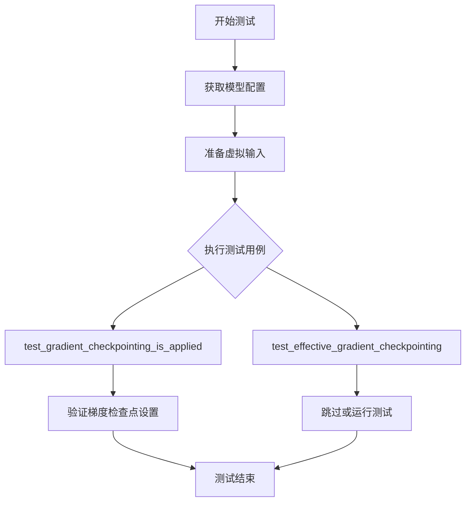
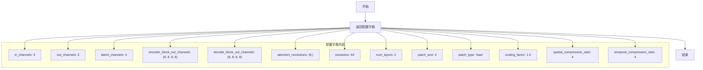
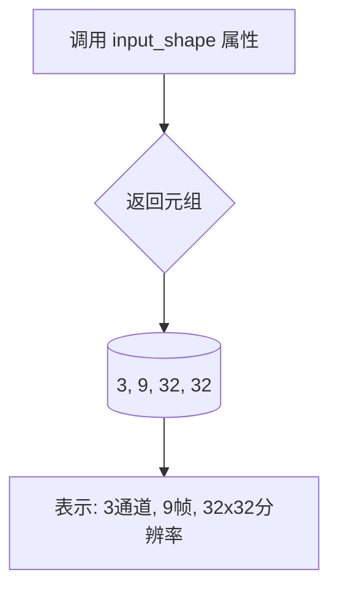
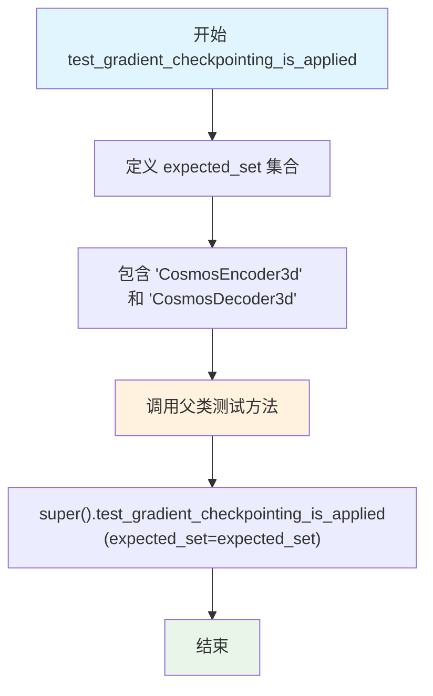
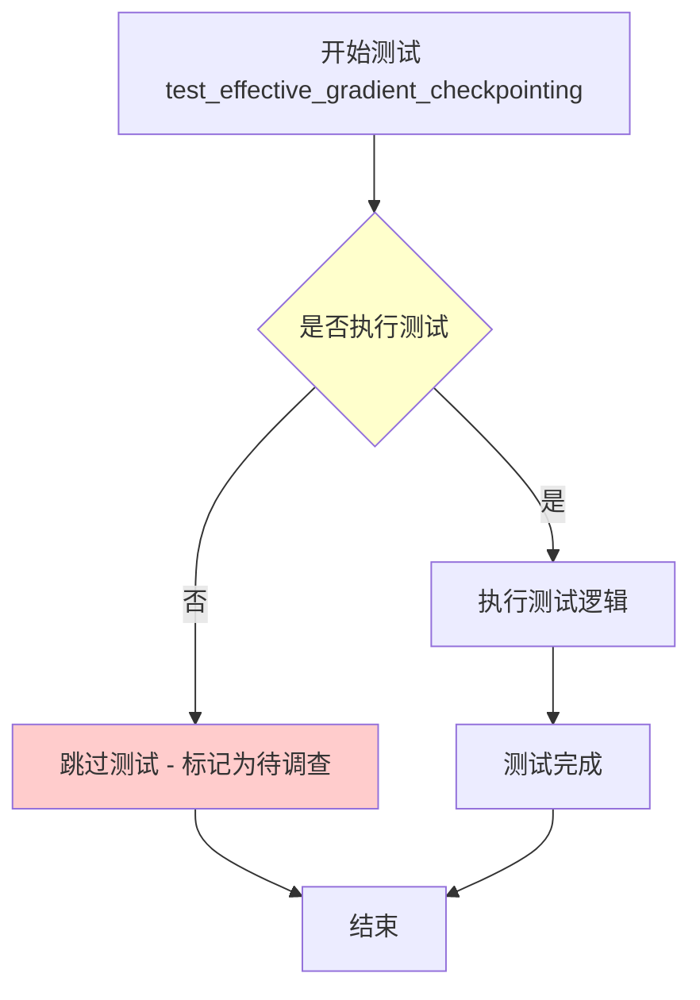
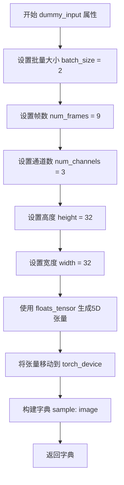
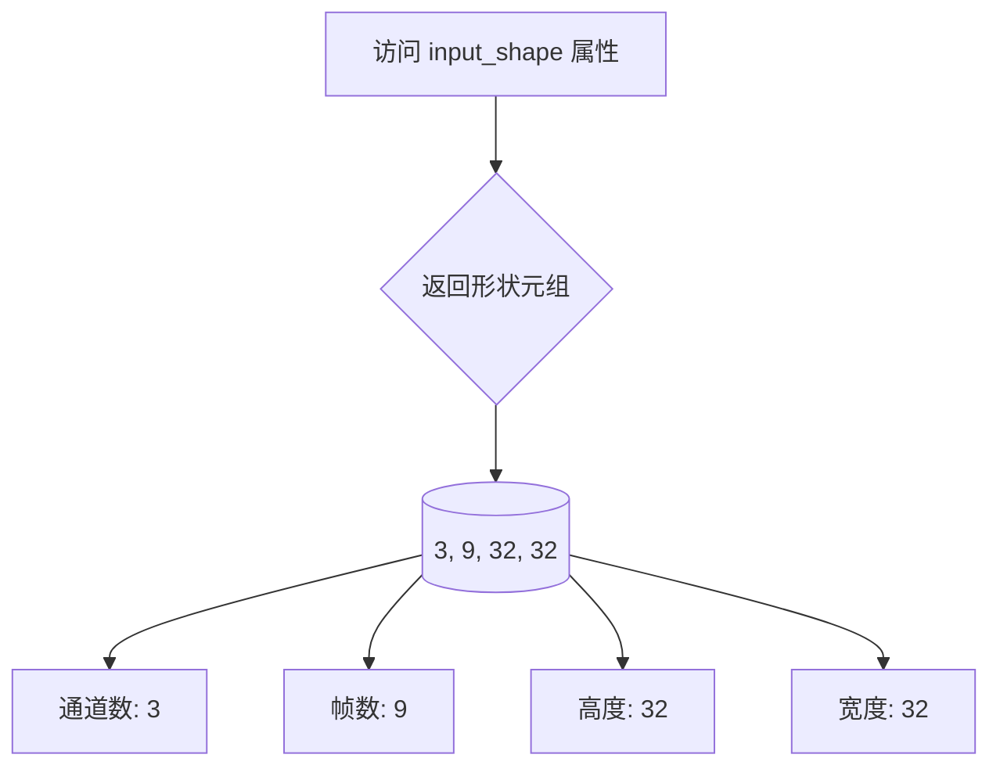
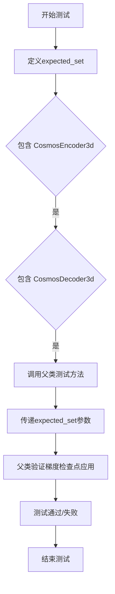
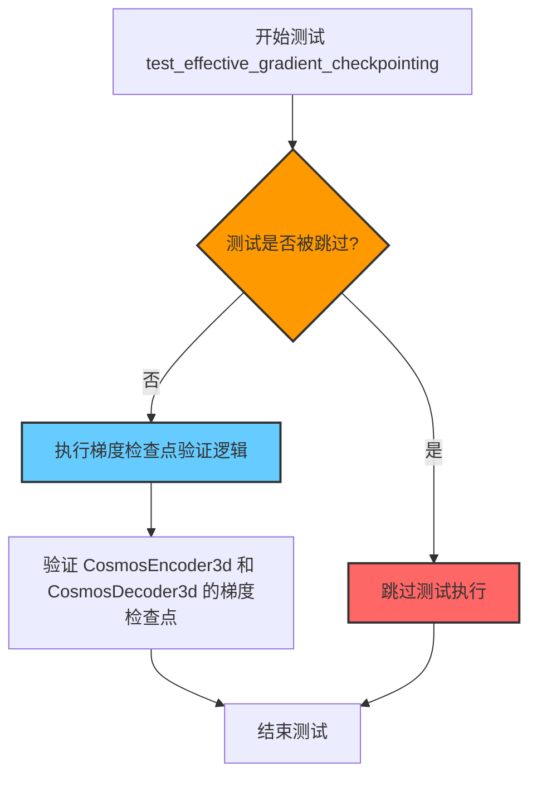

# `diffusers\tests\models\autoencoders\test_models_autoencoder_cosmos.py` 详细设计文档

这是一个单元测试文件，用于测试 Hugging Face diffusers 库中的 AutoencoderKLCosmos 模型的功能正确性，包括模型配置、输入输出形状、梯度检查点等测试用例。

## 整体流程



## 类结构

```
AutoencoderKLCosmosTests (测试类)
├── 继承: unittest.TestCase
├── 继承: ModelTesterMixin
└── 继承: AutoencoderTesterMixin
```

## 全局变量及字段


### `AutoencoderKLCosmosTests.model_class`
    
被测试的模型类

类型：`AutoencoderKLCosmos`
    


### `AutoencoderKLCosmosTests.main_input_name`
    
主输入名称为 'sample'

类型：`str`
    


### `AutoencoderKLCosmosTests.base_precision`
    
基础精度阈值 1e-2

类型：`float`
    
    

## 全局函数及方法


### `AutoencoderKLCosmosTests.get_autoencoder_kl_cosmos_config`

该方法用于获取 AutoencoderKLCosmos 模型的测试配置参数，返回一个包含模型架构相关配置的字典，包括输入/输出通道数、潜在通道数、编码器/解码器块输出通道、注意力分辨率、分辨率、层数、patch 大小、压缩比等关键参数。

参数：

- （无参数）

返回值：`dict`，返回包含 AutoencoderKLCosmos 模型测试配置的字典

#### 流程图



#### 带注释源码

```python
def get_autoencoder_kl_cosmos_config(self):
    """
    获取 AutoencoderKLCosmos 模型的测试配置参数。
    
    该方法返回一个包含模型架构配置的字典，用于初始化和测试
    AutoencoderKLCosmos 模型。配置包括通道数、分辨率、层数等关键参数。
    
    Returns:
        dict: 包含以下键值的配置字典:
            - in_channels: 输入通道数 (3 表示 RGB 图像)
            - out_channels: 输出通道数 (3 表示 RGB 图像)
            - latent_channels: 潜在空间通道数 (4)
            - encoder_block_out_channels: 编码器各块输出通道数元组
            - decode_block_out_channels: 解码器各块输出通道数元组
            - attention_resolutions: 注意力分辨率配置
            - resolution: 输入图像的基础分辨率 (64)
            - num_layers: 模型层数 (2)
            - patch_size: patch 大小 (4)
            - patch_type: patch 类型 ('haar' 小波变换)
            - scaling_factor: 缩放因子 (1.0)
            - spatial_compression_ratio: 空间压缩比 (4)
            - temporal_compression_ratio: 时间压缩比 (4)
    """
    return {
        "in_channels": 3,                      # 输入通道数，3 表示 RGB 图像
        "out_channels": 3,                     # 输出通道数，3 表示 RGB 图像
        "latent_channels": 4,                  # 潜在空间的通道数，用于压缩表示
        "encoder_block_out_channels": (8, 8, 8, 8),  # 编码器各块的输出通道数
        "decode_block_out_channels": (8, 8, 8, 8),   # 解码器各块的输出通道数
        "attention_resolutions": (8,),         # 注意力机制的分辨率配置
        "resolution": 64,                      # 输入图像的基础分辨率
        "num_layers": 2,                       # 模型的层数
        "patch_size": 4,                       # patch 的大小，用于分块处理
        "patch_type": "haar",                  # patch 类型，使用 haar 小波变换
        "scaling_factor": 1.0,                 # 缩放因子
        "spatial_compression_ratio": 4,        # 空间维度压缩比
        "temporal_compression_ratio": 4,       # 时间维度压缩比，用于视频/时序数据
    }
```


### `AutoencoderKLCosmosTests.dummy_input`

该属性方法用于生成AutoencoderKLCosmos模型的虚拟输入数据，创建一个包含5D张量（batch_size, num_channels, num_frames, height, width）的字典，作为测试模型的样本输入。

参数：
- （无参数，为property装饰器方法）

返回值：`dict`，包含键"sample"，值为5D浮点张量，形状为(2, 3, 9, 32, 32)，用于模拟批量为2、通道数为3、帧数为9、尺寸为32x32的视频/图像输入

#### 流程图

```mermaid
flowchart TD
    A[开始 dummy_input] --> B[设置 batch_size = 2]
    B --> C[设置 num_frames = 9]
    C --> D[设置 num_channels = 3]
    D --> E[设置 height = 32]
    E --> F[设置 width = 32]
    F --> G[调用 floats_tensor 生成 5D 张量]
    G --> H[将张量移动到 torch_device]
    H --> I[返回字典 {sample: image}]
    I --> J[结束]
```

#### 带注释源码

```python
@property
def dummy_input(self):
    """
    生成用于测试AutoencoderKLCosmos模型的虚拟输入数据。
    返回一个包含模拟视频/图像数据的字典。
    """
    # 批量大小：每次处理2个样本
    batch_size = 2
    # 帧数：9帧视频序列
    num_frames = 9
    # 通道数：3通道RGB图像
    num_channels = 3
    # 图像高度
    height = 32
    # 图像宽度
    width = 32

    # 使用floats_tensor生成指定形状的浮点张量
    # 形状: (batch_size, num_channels, num_frames, height, width) = (2, 3, 9, 32, 32)
    # 并将张量移动到指定的计算设备(CPU/GPU)
    image = floats_tensor((batch_size, num_channels, num_frames, height, width)).to(torch_device)

    # 返回符合模型输入格式的字典
    # 键名"sample"对应AutoencoderKLCosmos模型的主输入名称
    return {"sample": image}
```


### `AutoencoderKLCosmosTests.input_shape`

该属性用于返回AutoencoderKLCosmos模型的预期输入张量形状，以供测试框架验证模型输入维度是否正确。

参数： 无

返回值：`tuple`，表示输入张量的形状 (通道数, 帧数, 高度, 宽度)，具体为 (3, 9, 32, 32)

#### 流程图



#### 带注释源码

```python
@property
def input_shape(self):
    """
    返回AutoencoderKLCosmos模型测试所需的输入张量形状。
    
    返回值:
        tuple: 输入形状元组，格式为 (channels, frames, height, width)
               - channels (3): RGB图像的通道数
               - frames (9): 视频帧的数量
               - height (32): 输入图像的高度
               - width (32): 输入图像的宽度
    """
    return (3, 9, 32, 32)
```

#### 说明

- 这是一个 `@property` 装饰器修饰的属性方法，属于测试类 `AutoencoderKLCosmosTests`
- 该属性定义了测试时使用的虚拟输入张量的形状维度
- 形状格式遵循 PyTorch 惯例：(N, C, D, H, W) 其中 N=batch, C=channels, D=depth/frames, H=height, W=width
- 此处省略了 batch 维度（batch_size=2 在 `dummy_input` 中定义），只返回单样本的形状
- 与 `output_shape` 属性配合使用，用于验证模型的输入输出维度一致性


### `AutoencoderKLCosmosTests.output_shape`

该属性定义了 AutoencoderKLCosmos 模型在测试过程中的期望输出形状，用于验证模型输出的维度是否与预期一致。

参数：

- （无参数，该方法为属性）

返回值：`tuple`，返回模型输出的期望形状，格式为 `(channels, frames, height, width)`。

#### 流程图

```mermaid
flowchart TD
    A[开始] --> B{访问 output_shape 属性}
    B --> C[返回元组 (3, 9, 32, 32)]
    C --> D[结束]
    
    style A fill:#f9f,stroke:#333
    style D fill:#9f9,stroke:#333
```

#### 带注释源码

```python
@property
def output_shape(self):
    """
    返回模型输出的期望形状。
    
    该属性用于测试中验证 AutoencoderKLCosmos 模型的输出维度是否正确。
    形状格式为 (channels, frames, height, width)，与输入形状保持一致，
    表示 VAE 模型在编解码过程中保持时空维度不变。
    
    Returns:
        tuple: 包含四个整数的元组
            - 3: 通道数（channels）
            - 9: 时间帧数（num_frames）
            - 32: 高度（height）
            - 32: 宽度（width）
    """
    return (3, 9, 32, 32)
```


### `AutoencoderKLCosmosTests.prepare_init_args_and_inputs_for_common`

该方法用于准备AutoencoderKLCosmos模型测试类的初始化参数和输入数据，返回一个包含模型配置字典和测试输入字典的元组，供通用测试场景使用。

参数：

- 无参数（仅包含`self`隐式参数）

返回值：`Tuple[Dict, Dict]`，返回两个字典组成的元组：
- 第一个字典（`init_dict`）：模型初始化配置参数
- 第二个字典（`inputs_dict`）：测试用的虚拟输入数据

#### 流程图

```mermaid
flowchart TD
    A[开始] --> B[调用 get_autoencoder_kl_cosmos_config]
    B --> C[将结果存储到 init_dict]
    C --> D[调用 dummy_input 属性]
    D --> E[将结果存储到 inputs_dict]
    E --> F[返回元组 (init_dict, inputs_dict)]
    F --> G[结束]
```

#### 带注释源码

```python
def prepare_init_args_and_inputs_for_common(self):
    """
    准备AutoencoderKLCosmos模型测试的初始化参数和输入数据。
    
    该方法被ModelTesterMixin中的通用测试方法调用，用于获取
    模型初始化配置和测试输入，以支持各种模型一致性测试。
    
    Returns:
        Tuple[Dict, Dict]: 包含以下两个元素的元组:
            - init_dict: 模型配置字典，包含in_channels、out_channels、
                        latent_channels等参数
            - inputs_dict: 测试输入字典，包含sample键对应的虚拟输入张量
    """
    # 获取AutoencoderKLCosmos模型的配置参数字典
    # 配置包含：输入通道数、输出通道数、潜在空间通道数、
    # 编码器/解码器块输出通道、注意力分辨率、分辨率、层数、patch配置等
    init_dict = self.get_autoencoder_kl_cosmos_config()
    
    # 获取测试用的虚拟输入数据
    # 返回一个包含'sample'键的字典，值为5D张量 (batch_size, channels, frames, height, width)
    inputs_dict = self.dummy_input
    
    # 返回配置字典和输入字典的元组，供测试框架使用
    return init_dict, inputs_dict
```


### `AutoencoderKLCosmosTests.test_gradient_checkpointing_is_applied`

该测试方法用于验证梯度检查点（Gradient Checkpointing）功能是否正确应用于 `CosmosEncoder3d` 和 `CosmosDecoder3d` 这两个核心组件，确保在内存优化模式下梯度计算的正确性。

参数：

- `expected_set`：`set`，期望启用梯度检查点的模型组件名称集合，包含 `"CosmosEncoder3d"` 和 `"CosmosDecoder3d"`

返回值：`None`，无返回值（测试方法）

#### 流程图



#### 带注释源码

```python
def test_gradient_checkpointing_is_applied(self):
    """
    测试梯度检查点是否正确应用于指定的模型组件。
    
    该方法继承自 ModelTesterMixin，用于验证 AutoencoderKLCosmos 模型中
    的 encoder 和 decoder 组件是否正确启用了梯度检查点功能。
    """
    # 定义期望启用梯度检查点的模型组件集合
    # CosmosEncoder3d: 3D 编码器组件
    # CosmosDecoder3d: 3D 解码器组件
    expected_set = {
        "CosmosEncoder3d",
        "CosmosDecoder3d",
    }
    
    # 调用父类的测试方法，验证这些组件的梯度检查点是否正确应用
    # 父类 test_gradient_checkpointing_is_applied 会遍历 expected_set 中的组件，
    # 检查每个组件的前向传播是否使用了梯度检查点
    super().test_gradient_checkpointing_is_applied(expected_set=expected_set)
```


### `AutoencoderKLCosmosTests.test_effective_gradient_checkpointing`

这是一个被跳过的测试函数，用于测试梯度检查点（gradient checkpointing）的有效性，但由于某些未知原因导致测试失败，标记为待调查。

参数：暂无参数

返回值：`None`，该函数体仅包含 `pass` 语句，不返回任何值

#### 流程图



#### 带注释源码

```python
@unittest.skip("Not sure why this test fails. Investigate later.")
def test_effective_gradient_checkpointing(self):
    """
    测试梯度检查点的有效性。
    
    该测试函数被 @unittest.skip 装饰器跳过，原因是不确定为何测试失败，
    需要稍后调查。在实际实现中，该函数应该验证梯度检查点是否被正确应用
    到 CosmosEncoder3d 和 CosmosDecoder3d 模型组件上。
    
    参数:
        self: AutoencoderKLCosmosTests 实例引用
        
    返回值:
        None: 由于函数体仅为 pass 语句，不返回任何值
    """
    pass
```


### `AutoencoderKLCosmosTests.get_autoencoder_kl_cosmos_config`

这是一个测试方法，用于获取 AutoencoderKLCosmos 模型的配置字典，包含了模型的各种参数设置，如输入/输出通道数、潜在通道数、编码器/解码器块输出通道数、注意力分辨率、分辨率、层数、patch 大小等。

参数：

- （无参数）

返回值：`Dict`，返回包含 AutoencoderKLCosmos 模型配置的字典，涵盖模型的通道数、层数、分辨率、patch 配置、压缩比率等关键参数。

#### 流程图

```mermaid
flowchart TD
    A[开始] --> B[定义配置字典]
    B --> C[设置 in_channels: 3]
    C --> D[设置 out_channels: 3]
    D --> E[设置 latent_channels: 4]
    E --> F[设置 encoder_block_out_channels: (8, 8, 8, 8)]
    F --> G[设置 decode_block_out_channels: (8, 8, 8, 8)]
    G --> H[设置 attention_resolutions: (8,)]
    H --> I[设置 resolution: 64]
    I --> J[设置 num_layers: 2]
    J --> K[设置 patch_size: 4]
    K --> L[设置 patch_type: 'haar']
    L --> M[设置 scaling_factor: 1.0]
    M --> N[设置 spatial_compression_ratio: 4]
    N --> O[设置 temporal_compression_ratio: 4]
    O --> P[返回配置字典]
```

#### 带注释源码

```python
def get_autoencoder_kl_cosmos_config(self):
    """
    获取 AutoencoderKLCosmos 模型的配置字典
    
    该方法返回一个包含模型架构参数的字典，用于初始化和测试 AutoencoderKLCosmos 模型。
    配置涵盖了模型的输入输出通道、潜在空间维度、编码器/解码器结构、注意力机制、
    空间/时间压缩比率等关键参数。
    
    返回:
        dict: 包含模型配置的字典，包含以下键值对:
            - in_channels: 输入通道数 (3)
            - out_channels: 输出通道数 (3)
            - latent_channels: 潜在空间通道数 (4)
            - encoder_block_out_channels: 编码器块输出通道数元组
            - decode_block_out_channels: 解码器块输出通道数元组
            - attention_resolutions: 注意力分辨率元组
            - resolution: 输入分辨率 (64)
            - num_layers: 层数 (2)
            - patch_size: patch 大小 (4)
            - patch_type: patch 类型 ('haar')
            - scaling_factor: 缩放因子 (1.0)
            - spatial_compression_ratio: 空间压缩比率 (4)
            - temporal_compression_ratio: 时间压缩比率 (4)
    """
    return {
        "in_channels": 3,                              # 输入图像通道数（RGB 3通道）
        "out_channels": 3,                             # 输出图像通道数
        "latent_channels": 4,                          # 潜在空间的通道数，用于压缩表示
        "encoder_block_out_channels": (8, 8, 8, 8),   # 编码器各块的输出通道数
        "decode_block_out_channels": (8, 8, 8, 8),    # 解码器各块的输出通道数
        "attention_resolutions": (8,),                # 应用注意力机制的分辨率
        "resolution": 64,                              # 输入图像的分辨率
        "num_layers": 2,                              # 模型层数
        "patch_size": 4,                              # 将图像划分为 patch 的大小
        "patch_type": "haar",                          # patch 分割的类型（haar 小波变换）
        "scaling_factor": 1.0,                         # 潜在空间的缩放因子
        "spatial_compression_ratio": 4,               # 空间维度压缩比率
        "temporal_compression_ratio": 4,              # 时间维度压缩比率（适用于视频）
    }
```


### `AutoencoderKLCosmosTests.dummy_input`

该属性用于生成虚拟输入图像张量，作为 AutoencoderKLCosmos 模型的测试输入。它创建一个包含批量大小为 2、9 帧、3 通道、32x32 分辨率的 5D 张量（Batch, Channel, Frames, Height, Width），并以字典形式返回，其中键为 "sample"，值为浮点张量。

参数：无（仅使用 `self` 引用实例属性）

返回值：`Dict[str, torch.Tensor]`，返回包含虚拟输入样本的字典，键为 "sample"，值为 5D 浮点张量，形状为 (2, 3, 9, 32, 32)

#### 流程图



#### 带注释源码

```python
@property
def dummy_input(self):
    """
    生成虚拟输入图像张量，用于测试 AutoencoderKLCosmos 模型。
    
    该属性创建一个模拟的输入样本，模拟视频/多帧图像输入，
    用于模型的forward传播测试和参数初始化验证。
    """
    # 批量大小：一次处理2个样本
    batch_size = 2
    # 帧数：每个样本包含9帧（适用于时序/视频模型）
    num_frames = 9
    # 通道数：RGB图像，3通道
    num_channels = 3
    # 图像高度
    height = 32
    # 图像宽度
    width = 32

    # 使用测试工具函数生成指定形状的浮点张量
    # 形状: (batch_size, num_channels, num_frames, height, width)
    # 即 (2, 3, 9, 32, 32)
    image = floats_tensor((batch_size, num_channels, num_frames, height, width)).to(torch_device)

    # 返回符合 diffusers 模型的输入格式字典
    # 'sample' 是 AutoencoderKLCosmos 的主输入名称
    return {"sample": image}
```


### `AutoencoderKLCosmosTests.input_shape`

这是一个测试类属性，用于定义 AutoencoderKLCosmos 模型在测试中的输入张量形状，返回包含通道数、帧数、高度和宽度的元组 (3, 9, 32, 32)。

参数：无

返回值：`tuple`，返回输入形状元组 (3, 9, 32, 32)，分别代表 (通道数, 帧数, 高度, 宽度)

#### 流程图



#### 带注释源码

```python
@property
def input_shape(self):
    """
    返回测试模型的输入形状。
    
    该属性定义了 AutoencoderKLCosmos 模型在单元测试中期望的输入张量维度。
    形状为 (通道数, 帧数, 高度, 宽度)，与 5D 张量 (batch_size, channels, frames, height, width) 
    的中间维度对应，用于验证模型的维度处理逻辑。
    
    Returns:
        tuple: 输入形状元组 (3, 9, 32, 32)，分别表示：
            - 3: 通道数 (RGB 图像)
            - 9: 帧数 (视频/时间序列帧数)
            - 32: 高度
            - 32: 宽度
    """
    return (3, 9, 32, 32)
```


### `AutoencoderKLCosmosTests.output_shape`

该属性方法用于返回 AutoencoderKL Cosmos 模型的输出形状，固定返回元组 (3, 9, 32, 32)，表示通道数、时间帧数、高度和宽度。

参数：
- （无参数，该属性不需要输入参数）

返回值：`tuple`，返回 (3, 9, 32, 32) 的元组，依次表示输出张量的通道数（3）、时间帧数（9）、高度（32）和宽度（32）。

#### 流程图

```mermaid
flowchart TD
    A[访问 output_shape 属性] --> B{获取返回值}
    B --> C[返回元组 (3, 9, 32, 32)]
    
    style A fill:#f9f,stroke:#333
    style C fill:#9f9,stroke:#333
```

#### 带注释源码

```python
@property
def output_shape(self):
    """
    返回 AutoencoderKL Cosmos 模型的输出形状。
    
    该属性定义了模型输出的张量维度，固定返回 (3, 9, 32, 32)：
    - 3: 通道数 (num_channels)
    - 9: 时间帧数 (num_frames)
    - 32: 高度 (height)
    - 32: 宽度 (width)
    
    Returns:
        tuple: 包含四个整数的元组，表示输出张量的 (通道数, 时间帧数, 高度, 宽度)
    """
    return (3, 9, 32, 32)
```


### `AutoencoderKLCosmosTests.prepare_init_args_and_inputs_for_common`

准备用于通用测试的初始化参数和输入数据，返回包含模型配置字典和测试输入字典的元组，以便于测试框架进行模型初始化和前向传播验证。

参数：
- （无，除 `self` 隐含参数）

返回值：`Tuple[Dict, Dict]`
- `init_dict`：Dict，包含模型的初始化配置参数（如 `in_channels`、`out_channels`、`latent_channels` 等）
- `inputs_dict`：Dict，包含测试输入数据（键为 `"sample"`，值为浮点张量）

#### 流程图

```mermaid
flowchart TD
    A[开始] --> B[调用 get_autoencoder_kl_cosmos_config 获取配置]
    B --> C[获取 dummy_input 属性作为测试输入]
    C --> D[返回配置字典和输入字典的元组]
    D --> E[结束]
    
    subgraph 配置内容
    F[in_channels: 3]
    G[out_channels: 3]
    H[latent_channels: 4]
    I[encoder_block_out_channels: (8,8,8,8)]
    J[decode_block_out_channels: (8,8,8,8)]
    K[其他参数...]
    end
    
    subgraph 输入内容
    L[sample: FloatTensor shape: (2,3,9,32,32)]
    end
    
    B -.-> F
    C -.-> L
```

#### 带注释源码

```python
def prepare_init_args_and_inputs_for_common(self):
    """
    准备通用测试所需的初始化参数和输入数据。
    
    该方法被测试框架调用，用于获取模型初始化配置和测试输入，
    以便进行模型的前向传播、梯度检查等通用测试。
    
    Returns:
        Tuple[Dict, Dict]: 包含两个字典的元组:
            - init_dict: 模型初始化参数字典，包含模型结构配置
            - inputs_dict: 测试输入字典，包含sample键对应的输入张量
    """
    # 调用类方法获取AutoencoderKLCosmos模型的标准配置参数
    # 包含通道数、层数、patch_size等模型架构相关参数
    init_dict = self.get_autoencoder_kl_cosmos_config()
    
    # 获取测试用的虚拟输入数据
    # 通过dummy_input属性返回，包含(batch_size=2, channels=3, frames=9, height=32, width=32)的5D张量
    inputs_dict = self.dummy_input
    
    # 返回配置字典和输入字典，供测试框架使用
    return init_dict, inputs_dict
```


### `AutoencoderKLCosmosTests.test_gradient_checkpointing_is_applied`

该测试方法用于验证梯度检查点（Gradient Checkpointing）是否正确应用于`CosmosEncoder3d`和`CosmosDecoder3d`这两个核心组件。测试通过调用父类的测试方法，并传递预期的组件集合来确认梯度检查点功能已启用。

参数：

- `self`：`AutoencoderKLCosmosTests`类型，测试类的实例本身，包含模型测试所需的配置和状态

返回值：`None`，该方法为测试用例，无返回值

#### 流程图



#### 带注释源码

```python
def test_gradient_checkpointing_is_applied(self):
    """
    测试梯度检查点是否应用于特定的 Cosmos 模型组件。
    
    该测试方法验证在 AutoencoderKLCosmos 模型中，
    梯度检查点功能是否正确配置在编码器和解码器组件上。
    """
    
    # 定义预期应该应用梯度检查点的组件集合
    # 梯度检查点是一种内存优化技术，通过在反向传播时重新计算中间激活值
    # 来减少显存占用，适用于大规模深度学习模型
    expected_set = {
        "CosmosEncoder3d",    # 3D编码器组件，应启用梯度检查点
        "CosmosDecoder3d",    # 3D解码器组件，应启用梯度检查点
    }
    
    # 调用父类(ModelTesterMixin)的测试方法进行实际验证
    # 父类方法会遍历expected_set中的每个组件，
    # 检查其gradient_checkpointing属性是否被正确设置
    super().test_gradient_checkpointing_is_applied(expected_set=expected_set)
```


### `AutoencoderKLCosmosTests.test_effective_gradient_checkpointing`

该测试方法用于验证 AutoencoderKLCosmos 模型的有效梯度检查点功能是否正常工作，但由于某些未知原因被暂时跳过。

参数：

- `self`：`AutoencoderKLCosmosTests`，表示测试类的实例本身

返回值：`None`，无返回值（方法体仅包含 `pass` 语句）

#### 流程图



#### 带注释源码

```python
@unittest.skip("Not sure why this test fails. Investigate later.")
def test_effective_gradient_checkpointing(self):
    """
    测试有效梯度检查点功能。
    
    该方法继承自 ModelTesterMixin，用于验证 AutoencoderKLCosmos 模型
    中的梯度检查点功能是否正确应用。具体来说，它检查 CosmosEncoder3d 
    和 CosmosDecoder3d 这两个组件是否正确使用了梯度检查点技术。
    
    注意：当前该测试被暂时跳过，原因是测试失败但原因不明，需要后续调查。
    """
    pass  # 测试逻辑尚未实现，当前仅用于占位
```

## 关键组件


## 一段话描述

该代码是 `AutoencoderKLCosmos` 模型的单元测试文件，通过继承 `ModelTesterMixin` 和 `AutoencoderTesterMixin` 提供通用模型测试框架，验证 3D 视频/图像自编码器的配置、输入输出形状、前向传播、梯度检查点等核心功能。

## 文件的整体运行流程

1. 导入必要的测试依赖和被测模型 `AutoencoderKLCosmos`
2. 启用完全确定性模式以确保测试可复现
3. 定义测试类 `AutoencoderKLCosmosTests`，继承三个基类
4. 配置模型初始化参数（通道数、层数、注意力分辨率、压缩比等）
5. 提供虚拟输入数据用于测试
6. 执行梯度检查点相关测试用例

## 类的详细信息

### AutoencoderKLCosmosTests

**类字段：**

| 名称 | 类型 | 描述 |
|------|------|------|
| model_class | type | 被测试的模型类 `AutoencoderKLCosmos` |
| main_input_name | str | 主输入名称 "sample" |
| base_precision | float | 基准精度阈值 1e-2 |

**类方法：**

#### get_autoencoder_kl_cosmos_config

```python
def get_autoencoder_kl_cosmos_config(self):
    return {
        "in_channels": 3,
        "out_channels": 3,
        "latent_channels": 4,
        "encoder_block_out_channels": (8, 8, 8, 8),
        "decode_block_out_channels": (8, 8, 8, 8),
        "attention_resolutions": (8,),
        "resolution": 64,
        "num_layers": 2,
        "patch_size": 4,
        "patch_type": "haar",
        "scaling_factor": 1.0,
        "spatial_compression_ratio": 4,
        "temporal_compression_ratio": 4,
    }
```

| 项目 | 详情 |
|------|------|
| 参数名称 | self |
| 参数类型 | AutoencoderKLCosmosTests |
| 参数描述 | 测试类实例自身 |
| 返回值类型 | dict |
| 返回值描述 | 包含模型配置的字典，定义编码器/解码器通道数、注意力分辨率、压缩比等参数 |

#### dummy_input

```python
@property
def dummy_input(self):
    batch_size = 2
    num_frames = 9
    num_channels = 3
    height = 32
    width = 32

    image = floats_tensor((batch_size, num_channels, num_frames, height, width)).to(torch_device)

    return {"sample": image}
```

| 项目 | 详情 |
|------|------|
| 参数名称 | self |
| 参数类型 | AutoencoderKLCosmosTests |
| 参数描述 | 测试类实例自身 |
| 返回值类型 | dict |
| 返回值描述 | 包含 sample 键的字典，值为 5D 张量 (batch, channels, frames, height, width) |

#### input_shape

```python
@property
def input_shape(self):
    return (3, 9, 32, 32)
```

| 项目 | 详情 |
|------|------|
| 参数名称 | self |
| 参数类型 | AutoencoderKLCosmosTests |
| 参数描述 | 测试类实例自身 |
| 返回值类型 | tuple |
| 返回值描述 | 期望输入形状 (channels, frames, height, width)，不包含 batch 维度 |

#### output_shape

```python
@property
def output_shape(self):
    return (3, 9, 32, 32)
```

| 项目 | 详情 |
|------|------|
| 参数名称 | self |
| 参数类型 | AutoencoderKLCosmosTests |
| 参数描述 | 测试类实例自身 |
| 返回值类型 | tuple |
| 返回值描述 | 期望输出形状 (channels, frames, height, width)，与输入形状相同 |

#### prepare_init_args_and_inputs_for_common

```python
def prepare_init_args_and_inputs_for_common(self):
    init_dict = self.get_autoencoder_kl_cosmos_config()
    inputs_dict = self.dummy_input
    return init_dict, inputs_dict
```

| 项目 | 详情 |
|------|------|
| 参数名称 | self |
| 参数类型 | AutoencoderKLCosmosTests |
| 参数描述 | 测试类实例自身 |
| 返回值类型 | tuple(dict, dict) |
| 返回值描述 | 返回模型初始化参数字典和输入字典的元组，供通用测试使用 |

#### test_gradient_checkpointing_is_applied

```python
def test_gradient_checkpointing_is_applied(self):
    expected_set = {
        "CosmosEncoder3d",
        "CosmosDecoder3d",
    }
    super().test_gradient_checkpointing_is_applied(expected_set=expected_set)
```

| 项目 | 详情 |
|------|------|
| 参数名称 | self, expected_set |
| 参数类型 | AutoencoderKLCosmosTests, set |
| 参数描述 | 测试实例和期望支持梯度检查点的模块集合 |
| 返回值类型 | None |
| 返回值描述 | 验证 CosmosEncoder3d 和 CosmosDecoder3d 模块启用了梯度检查点 |

#### test_effective_gradient_checkpointing

```python
@unittest.skip("Not sure why this test fails. Investigate later.")
def test_effective_gradient_checkpointing(self):
    pass
```

| 项目 | 详情 |
|------|------|
| 参数名称 | self |
| 参数类型 | AutoencoderKLCosmosTests |
| 参数描述 | 测试类实例自身 |
| 返回值类型 | None |
| 返回值描述 | 空测试方法，已被跳过，待后续调查 |

### 全局变量和函数

| 名称 | 类型 | 描述 |
|------|------|------|
| enable_full_determinism | function | 启用完全确定性模式的测试工具函数 |
| floats_tensor | function | 生成随机浮点张量的测试工具函数 |
| torch_device | variable | PyTorch 计算设备字符串 |
| ModelTesterMixin | class | 通用模型测试混入类 |
| AutoencoderTesterMixin | class | 自编码器特定测试混入类 |

## 关键组件信息

### AutoencoderKLCosmos

用于视频/图像 3D 编码解码的 Cosmos 自编码器模型，支持空间和时间维度压缩

### CosmosEncoder3d

3D 编码器模块，需要支持梯度检查点功能

### CosmosDecoder3d

3D 解码器模块，需要支持梯度检查点功能

### AutoencoderTesterMixin

自编码器测试混入类，提供标准化测试接口

### ModelTesterMixin

通用模型测试混入类，提供模型完整性验证框架

### patch_type: haar

使用 Haar 小波变换作为分块策略，用于图像/视频压缩

### spatial_compression_ratio: 4

空间维度压缩比，4:1 压缩

### temporal_compression_ratio: 4

时间维度压缩比，4:1 压缩（适用于视频帧）

## 潜在的技术债务或优化空间

1. **被跳过的测试**: `test_effective_gradient_checkpointing` 测试被无条件跳过，标注为"Not sure why this test fails"，表明对梯度检查点有效性的验证存在未解决的测试问题

2. **硬编码配置**: 模型配置参数硬编码在测试方法中，缺乏参数化配置机制，扩展性受限

3. **缺失的精度验证**: 测试未验证输出与目标之间的具体精度指标，仅依赖基线精度 1e-2

4. **测试覆盖不完整**: 缺少对关键功能如量化支持、模型导出、推理性能的测试用例

## 其它项目

### 设计目标与约束

- 验证 AutoencoderKLCosmos 模型在视频/图像编码解码任务上的基本功能
- 确保梯度检查点在编码器和解码器模块中正确应用
- 使用 5D 张量支持视频帧序列处理（batch, channels, frames, height, width）
- 测试精度基准为 1e-2

### 错误处理与异常设计

- 使用 `@unittest.skip` 装饰器跳过不稳定的测试用例
- 测试失败时通过 unittest 框架自动捕获和报告异常

### 数据流与状态机

- 输入数据流：dummy_input → model forward → output
- 配置数据流：get_autoencoder_kl_cosmos_config → ModelTesterMixin 验证逻辑
- 测试状态由 unittest.TestCase 框架管理（setUp、tearDown）

### 外部依赖与接口契约

- 依赖 `diffusers` 库的 `AutoencoderKLCosmos` 模型类
- 依赖 `testing_utils` 模块的测试工具函数
- 依赖 `test_modeling_common.ModelTesterMixin` 的测试接口规范
- 依赖 `testing_utils.AutoencoderTesterMixin` 的自编码器测试规范


## 问题及建议


### 已知问题

-   **未调查的失败测试**：`test_effective_gradient_checkpointing` 方法被跳过并带有 "Not sure why this test fails. Investigate later." 注释，这是一个已知但未解决的技术债务，可能掩盖了梯度检查点功能的实际问题。
-   **测试覆盖不足**：测试类主要依赖 `ModelTesterMixin` 和 `AutoencoderTesterMixin` 的通用测试，缺少对 `AutoencoderKLCosmos` 特定功能（如 `spatial_compression_ratio` 和 `temporal_compression_ratio` 参数）的显式单元测试。
-   **硬编码配置**：`get_autoencoder_kl_cosmos_config` 方法中的配置参数是硬编码的，缺乏参数化，限制了配置变化的灵活性。
-   **宽松的精度阈值**：`base_precision = 1e-2` 相对宽松，可能暗示模型存在数值稳定性问题或需要进一步优化。
-   **外部依赖耦合**：测试依赖于 `...testing_utils` 和 `.testing_utils` 中的特定函数（`enable_full_determinism`, `floats_tensor`, `torch_device`），增加了测试的脆弱性和维护成本。
-   **缺失文档**：测试类及关键方法缺少 docstring，违反了代码可维护性最佳实践。

### 优化建议

-   **调查并修复跳过的测试**：深入调查 `test_effective_gradient_checkpointing` 失败的根本原因，修复后取消跳过，确保梯度检查点功能被正确测试。
-   **增加显式功能测试**：添加针对 `AutoencoderKLCosmos` 特定功能的测试用例，如编码器/解码器的前向传播、潜在空间维度验证、压缩比参数影响等。
-   **配置参数化**：将 `get_autoencoder_kl_cosmos_config` 重构为可接受参数的工厂方法或使用 pytest fixture，提高测试配置的灵活性。
-   **调查精度问题**：分析 `base_precision = 1e-2` 的原因，检查模型实现是否存在数值精度问题，考虑优化模型或调整测试策略。
-   **减少外部依赖**：将依赖的辅助函数内联或创建测试 mock，减少对特定模块的强耦合。
-   **补充文档**：为测试类和方法添加 docstring，说明测试目的、预期行为和关键假设。

## 其它


### 设计目标与约束

本测试文件旨在验证 AutoencoderKLCosmos 模型的正确性，确保模型在给定配置下能够正确执行前向传播、梯度计算等核心功能。测试遵循 HuggingFace diffusers 库的测试规范，继承 ModelTesterMixin 和 AutoencoderTesterMixin 以复用通用模型测试逻辑。设计约束包括：使用指定的配置参数（in_channels=3, out_channels=3, latent_channels=4 等）、支持梯度检查点（gradient checkpointing）验证、测试数据格式为 5D 张量（batch, channel, frames, height, width）。

### 错误处理与异常设计

测试中使用了 `@unittest.skip` 装饰器跳过 `test_effective_gradient_checkpointing` 测试，表明该测试当前存在未解决的问题。测试通过 `enable_full_determinism()` 启用完全确定性以确保测试可复现。配置验证在 `get_autoencoder_kl_cosmos_config` 方法中进行，返回字典形式的配置参数。异常处理主要依赖 unittest 框架的标准断言机制，包括前向传播一致性检查、梯度存在性验证等。

### 数据流与状态机

测试数据流如下：首先通过 `dummy_input` 属性生成 5D 浮点张量（batch_size=2, num_frames=9, num_channels=3, height=32, width=32），经 `floats_tensor` 函数填充随机数值并移至指定设备（torch_device）。输入数据通过 `sample` 键传递至模型，模型输出应与输入 shape 一致（3, 9, 32, 32）。测试状态转换包括：初始化配置 → 准备输入 → 执行前向传播 → 验证输出维度 → 验证梯度计算 → 验证模型一致性。

### 外部依赖与接口契约

主要外部依赖包括：1) `diffusers` 库中的 `AutoencoderKLCosmos` 模型类；2) `testing_utils` 模块中的 `enable_full_determinism`、`floats_tensor`、`torch_device` 工具函数；3) `test_modeling_common.ModelTesterMixin` 通用测试混合类；4) `testing_utils.AutoencoderTesterMixin` VAE 测试混合类。接口契约规定模型类必须实现 `__init__` 接受配置字典、包含 `forward` 方法接受 sample 参数并返回重构结果、编码器和解码器子模块分别命名为 `CosmosEncoder3d` 和 `CosmosDecoder3d`。

### 性能考量

测试使用较小的模型配置（encoder_block_out_channels=(8,8,8,8)）以平衡测试覆盖率和执行速度。梯度检查点测试通过 `expected_set` 验证特定模块是否正确应用了 gradient checkpointing。测试设计为在 CPU 和 GPU 环境下均可运行，通过 `torch_device` 动态选择计算设备。批大小和帧数分别设置为 2 和 9，属于较小规模，适用于持续集成环境。

### 配置参数详细说明

| 参数名 | 类型 | 描述 |
|--------|------|------|
| in_channels | int | 输入图像通道数（RGB=3） |
| out_channels | int | 输出图像通道数 |
| latent_channels | int | 潜在空间通道数 |
| encoder_block_out_channels | tuple | 编码器各层输出通道数 |
| decode_block_out_channels | tuple | 解码器各层输出通道数 |
| attention_resolutions | tuple | 注意力分辨率配置 |
| resolution | int | 输入分辨率 |
| num_layers | int | 网络层数 |
| patch_size | int | 补丁大小 |
| patch_type | str | 补丁类型（haar） |
| scaling_factor | float | 缩放因子 |
| spatial_compression_ratio | int | 空间压缩比 |
| temporal_compression_ratio | int | 时间压缩比 |

### 测试用例设计说明

测试类继承 `ModelTesterMixin` 以获得以下标准测试：模型前向传播一致性测试、权重初始化测试、梯度存在性测试、模型参数数量测试、模型配置序列化测试等。继承 `AutoencoderTesterMixin` 获取 VAE 特定测试，包括重构质量验证、KL 散度计算验证等。自定义测试 `test_gradient_checkpointing_is_applied` 验证编码器和解码器模块的梯度检查点应用情况。`test_effective_gradient_checkpointing` 当前被跳过，待调查失败原因。

### 版本和兼容性信息

代码版权声明为 HuggingFace Inc.，采用 Apache License 2.0。代码适用于 diffusers 库，版本兼容性需参考 diffusers 库的版本发布说明。测试针对 Python 环境和 PyTorch 框架设计，兼容性取决于 `testing_utils` 模块的实现。测试文件位于 `.testing_utils` 目录下，表明其为 HuggingFace diffusers 项目的内部测试模块。

### 已知问题和限制

1. `test_effective_gradient_checkpointing` 测试被标记为跳过，原因是"不确定测试失败原因，待后续调查"（Not sure why this test fails. Investigate later）。2. 测试使用较小的模型配置（通道数为 8），可能无法充分验证实际部署场景下的模型性能。3. 测试数据为合成随机数据，未使用真实图像数据，可能遗漏特定数据格式相关的问题。4. 5D 张量支持（视频/3D 数据）与标准图像 VAE 测试存在差异，部分通用测试可能需要特殊适配。

    