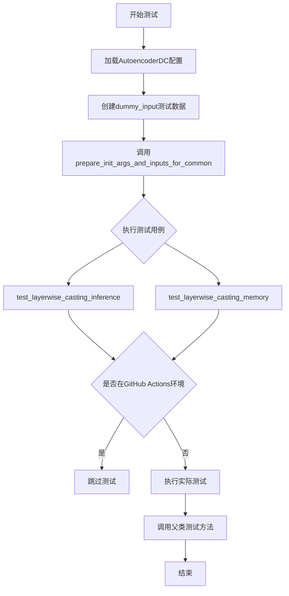
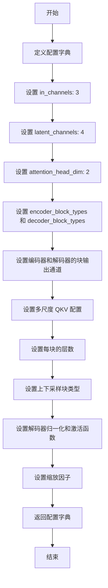
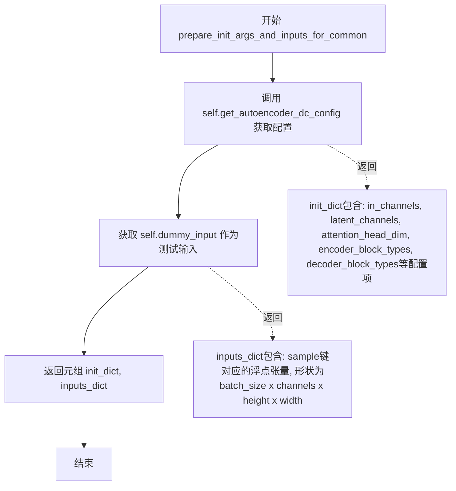
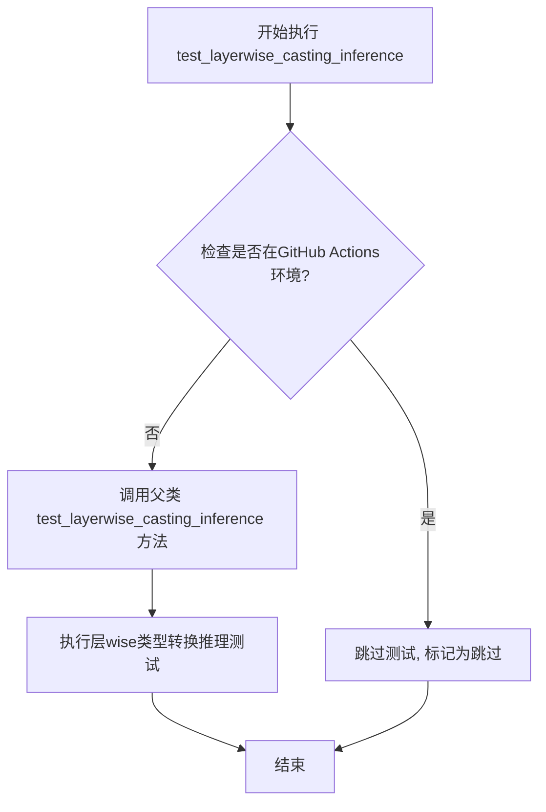
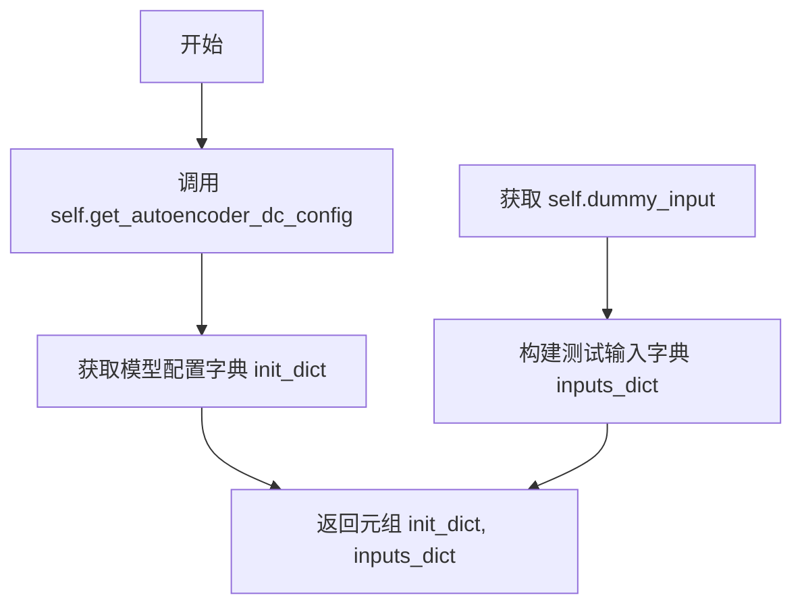

# `diffusers\tests\models\autoencoders\test_models_autoencoder_dc.py` 详细设计文档

这是一个针对Diffusers库中AutoencoderDC模型的单元测试文件，通过集成ModelTesterMixin和AutoencoderTesterMixin提供模型的一致性测试，包括配置初始化、输入输出形状验证、推理和内存测试等功能。

## 整体流程



## 类结构

```
unittest.TestCase
├── AutoencoderDCTests (主测试类)
    ├── ModelTesterMixin (模型测试混合类)
    └── AutoencoderTesterMixin (自编码器测试混合类)
```

## 全局变量及字段


### `IS_GITHUB_ACTIONS`
    
布尔标志,指示当前是否在GitHub Actions CI环境中运行

类型：`bool`
    


### `enable_full_determinism`
    
函数,用于启用PyTorch的完全确定性模式以确保测试可复现性

类型：`function`
    


### `floats_tensor`
    
函数,用于生成指定形状的随机浮点张量,常用于模型测试的虚拟输入数据

类型：`function`
    


### `torch_device`
    
字符串,表示PyTorch计算设备(如'cpu'或'cuda'),指定模型运行的目标设备

类型：`str`
    


### `AutoencoderDCTests.model_class`
    
类变量,指定被测试的模型类为AutoencoderDC(变分自编码器)

类型：`type`
    


### `AutoencoderDCTests.main_input_name`
    
类变量,字符串常量,表示模型主输入参数的名称为'sample'

类型：`str`
    


### `AutoencoderDCTests.base_precision`
    
类变量,浮点数常量,定义测试比较的基础精度阈值为1e-2(0.01)

类型：`float`
    
    

## 全局函数及方法


### `AutoencoderDCTests.get_autoencoder_dc_config`

该方法是一个测试配置方法，用于返回 AutoencoderDC（扩散变分自编码器）模型的测试配置参数字典，包含模型结构、通道数、注意力头维度、块类型等关键配置信息。

参数：

- `self`：`AutoencoderDCTests`，调用此方法的类实例本身，无需显式传递

返回值：`Dict[str, Any]`，返回一个包含 AutoencoderDC 模型配置参数的字典，用于初始化模型进行测试

#### 流程图



#### 带注释源码

```python
def get_autoencoder_dc_config(self):
    """
    获取 AutoencoderDC 模型的测试配置字典
    
    该方法返回一个包含模型架构参数的字典，用于在单元测试中
    初始化 AutoencoderDC 模型进行各种测试场景
    """
    return {
        # 输入图像的通道数（RGB图像为3通道）
        "in_channels": 3,
        
        # 潜在空间的通道数，用于编码器输出的压缩表示
        "latent_channels": 4,
        
        # 注意力机制中每个头的维度
        "attention_head_dim": 2,
        
        # 编码器使用的块类型列表（残差块和高效ViT块）
        "encoder_block_types": (
            "ResBlock",
            "EfficientViTBlock",
        ),
        
        # 解码器使用的块类型列表
        "decoder_block_types": (
            "ResBlock",
            "EfficientViTBlock",
        ),
        
        # 编码器各块的输出通道数
        "encoder_block_out_channels": (8, 8),
        
        # 解码器各块的输出通道数
        "decoder_block_out_channels": (8, 8),
        
        # 编码器各块的多尺度 QKV 配置（空元组和 (5,) 元组）
        "encoder_qkv_multiscales": ((), (5,)),
        
        # 解码器各块的多尺度 QKV 配置
        "decoder_qkv_multiscales": ((), (5,)),
        
        # 编码器每个块包含的层数
        "encoder_layers_per_block": (1, 1),
        
        # 解码器每个块包含的层数（使用列表类型）
        "decoder_layers_per_block": [1, 1],
        
        # 下采样块的类型（卷积下采样）
        "downsample_block_type": "conv",
        
        # 上采样块的类型（插值上采样）
        "upsample_block_type": "interpolate",
        
        # 解码器使用的归一化类型（RMS Norm）
        "decoder_norm_types": "rms_norm",
        
        # 解码器使用的激活函数（SiLU/GELU）
        "decoder_act_fns": "silu",
        
        # 潜在空间的缩放因子
        "scaling_factor": 0.41407,
    }
```


### `AutoencoderDCTests.prepare_init_args_and_inputs_for_common`

该方法用于准备 AutoencoderDC 模型测试的初始化参数和输入数据，返回一个包含模型配置字典和测试输入字典的元组，供通用模型测试Mixin使用。

参数：
- `self`：隐式参数，测试类实例本身

返回值：`Tuple[Dict, Dict]`，返回包含两个字典的元组——第一个是模型初始化配置字典，第二个是测试输入字典（通常包含 `sample` 键对应的图像张量）

#### 流程图



#### 带注释源码

```python
def prepare_init_args_and_inputs_for_common(self):
    """
    准备AutoencoderDC模型测试所需的初始化参数和输入数据。
    该方法被ModelTesterMixin中的通用测试方法调用，用于获取模型配置和测试输入。
    
    Returns:
        Tuple[Dict, Dict]: 包含两个字典的元组
            - init_dict: 模型初始化配置字典，包含模型结构参数
            - inputs_dict: 测试输入字典，包含sample键对应的图像张量
    """
    # 获取AutoencoderDC模型的配置参数字典
    # 包含通道数、注意力头维度、编码器/解码器块类型等配置
    init_dict = self.get_autoencoder_dc_config()
    
    # 获取测试用的虚拟输入数据
    # 返回包含'sample'键的字典，值为浮点张量，形状为(4, 3, 32, 32)
    # 格式: batch_size=4, channels=3, height=32, width=32
    inputs_dict = self.dummy_input
    
    # 返回配置字典和输入字典的元组，供通用测试框架使用
    return init_dict, inputs_dict
```


### `AutoencoderDCTests.test_layerwise_casting_inference`

该方法是一个测试用例的包装方法，用于执行层-wise类型转换的推理测试。它通过unittest的装饰器控制在GitHub Actions环境下的执行，并委托给父类的同名方法完成实际测试逻辑。

参数：

- `self`：无需显式传入，Python类方法隐式接收的实例引用

返回值：`None`，该方法直接调用父类方法，不返回任何值

#### 流程图



#### 带注释源码

```python
@unittest.skipIf(IS_GITHUB_ACTIONS, reason="Skipping test inside GitHub Actions environment")
def test_layerwise_casting_inference(self):
    """
    执行层wise类型转换的推理测试。
    
    该测试方法用于验证模型在不同层之间进行数据类型转换时的推理正确性。
    通过skipIf装饰器，在GitHub Actions CI环境中跳过该测试，
    因为某些环境下可能不支持特定的类型转换测试。
    """
    super().test_layerwise_casting_inference()
    # 调用父类（ModelTesterMixin）的同名方法，执行实际的测试逻辑
    # 父类方法会创建模型实例，执行前向传播，验证层间类型转换的正确性
```

#### 补充说明

该方法是测试类`AutoencoderDCTests`的一部分，继承自`ModelTesterMixin`和`AutoencoderTesterMixin`。它是一个代理方法，实际的测试逻辑由父类`ModelTesterMixin`提供。这种设计模式允许子类通过重写或调用父类方法来复用通用的模型测试逻辑，同时可以在子类层面添加特定的执行控制（如环境检查、跳过条件等）。


### `AutoencoderDCTests.test_layerwise_casting_memory`

这是一个单元测试方法，用于测试AutoencoderDC模型的分层类型转换（layerwise casting）内存行为。该测试方法继承自ModelTesterMixin类，通过调用父类的实现来验证模型在不同数据类型转换时的内存占用情况。该测试在GitHub Actions环境中被跳过。

参数：

- 无显式参数（继承自父类测试框架）

返回值：`None`，该方法为`unittest.TestCase`测试方法，无返回值

#### 流程图

```mermaid
flowchart TD
    A[开始 test_layerwise_casting_memory] --> B{检查是否在GitHub Actions环境}
    B -->|是| C[跳过测试 - unittest.skipIf]
    B -->|否| D[调用父类 super().test_layerwise_casting_memory]
    D --> E[执行分层类型转换内存测试]
    E --> F[结束测试]
    C --> F
```

#### 带注释源码

```python
@unittest.skipIf(IS_GITHUB_ACTIONS, reason="Skipping test inside GitHub Actions environment")
def test_layerwise_casting_memory(self):
    """
    测试AutoencoderDC模型的分层类型转换内存行为
    
    该测试方法用于验证模型在不同层之间进行数据类型转换时的
    内存占用是否符合预期。测试继承自ModelTesterMixin基类，
    通过调用父类方法执行实际的测试逻辑。
    
    在GitHub Actions CI环境中，该测试会被跳过以避免环境相关问题。
    """
    # 调用父类的test_layerwise_casting_memory方法执行实际测试
    # 父类方法来自ModelTesterMixin，定义在test_modeling_common模块中
    super().test_layerwise_casting_memory()
```

#### 补充说明

- **调用链**: 该方法调用`super().test_layerwise_casting_memory()`，实际测试逻辑在`ModelTesterMixin`父类中定义
- **跳过条件**: 当`IS_GITHUB_ACTIONS`为`True`时，测试被跳过
- **测试目的**: 验证AutoencoderDC模型在层间进行dtype转换（如float32到float16）时的内存效率
- **继承关系**: 继承自`ModelTesterMixin`和`AutoencoderTesterMixin`，同时继承自`unittest.TestCase`


### `AutoencoderDCTests.get_autoencoder_dc_config`

该方法是一个测试配置方法，用于获取 AutoencoderDC（深压缩自编码器）模型的测试配置参数，包含了模型的各种架构设置，如通道数、块类型、注意力头维度等，用于测试用例的初始化。

参数：

- 该方法无显式参数（隐式参数 `self` 表示测试类实例）

返回值：`dict`，返回包含 AutoencoderDC 模型完整配置的字典，涵盖编码器/解码器结构、通道维度、归一化类型、激活函数等关键参数。

#### 流程图

```mermaid
flowchart TD
    A[开始] --> B[构建配置字典]
    B --> C[设置基础通道参数]
    C --> C1[in_channels: 3]
    C --> C2[latent_channels: 4]
    C --> C3[attention_head_dim: 2]
    B --> D[设置块类型]
    D --> D1[encoder_block_types: ResBlock, EfficientViTBlock]
    D --> D2[decoder_block_types: ResBlock, EfficientViTBlock]
    B --> E[设置输出通道]
    E --> E1[encoder_block_out_channels: (8, 8)]
    E --> E2[decoder_block_out_channels: (8, 8)]
    B --> F[设置多尺度QKV]
    F --> F1[encoder_qkv_multiscales: ((), (5,))]
    F --> F2[decoder_qkv_multiscales: ((), (5,))]
    B --> G[设置每块层数]
    G --> G1[encoder_layers_per_block: (1, 1)]
    G --> G2[decoder_layers_per_block: [1, 1]]
    B --> H[设置上下采样类型]
    H --> H1[downsample_block_type: conv]
    H --> H2[upsample_block_type: interpolate]
    B --> I[设置解码器激活与归一化]
    I --> I1[decoder_norm_types: rms_norm]
    I --> I2[decoder_act_fns: silu]
    B --> J[设置缩放因子]
    J --> J1[scaling_factor: 0.41407]
    J --> K[返回配置字典]
    K --> L[结束]
```

#### 带注释源码

```python
def get_autoencoder_dc_config(self):
    """
    获取 AutoencoderDC 模型的测试配置参数
    
    Returns:
        dict: 包含模型架构完整配置的字典
    """
    return {
        # 输入/潜在空间通道配置
        "in_channels": 3,              # 输入图像通道数（RGB=3）
        "latent_channels": 4,          # 潜在空间通道数（压缩维度）
        
        # 注意力机制配置
        "attention_head_dim": 2,       # 注意力头的维度
        
        # 编码器块类型定义
        "encoder_block_types": (       # 编码器使用的块类型序列
            "ResBlock",                # 残差块，用于特征提取
            "EfficientViTBlock",      # 高效ViT块，用于注意力计算
        ),
        
        # 解码器块类型定义
        "decoder_block_types": (       # 解码器使用的块类型序列
            "ResBlock",                # 残差块，用于特征重建
            "EfficientViTBlock",      # 高效ViT块，用于注意力计算
        ),
        
        # 编码器各块输出通道数
        "encoder_block_out_channels": (8, 8),   # 每层编码器的输出通道
        
        # 解码器各块输出通道数
        "decoder_block_out_channels": (8, 8),   # 每层解码器的输出通道
        
        # 编码器QKV多尺度配置（空元组和(5,)表示不同层使用不同尺度）
        "encoder_qkv_multiscales": ((), (5,)),
        
        # 解码器QKV多尺度配置
        "decoder_qkv_multiscales": ((), (5,)),
        
        # 编码器每块的层数
        "encoder_layers_per_block": (1, 1),     # 每个编码器块内的层数
        
        # 解码器每块的层数
        "decoder_layers_per_block": [1, 1],     # 每个解码器块内的层数
        
        # 下采样块类型（卷积下采样）
        "downsample_block_type": "conv",
        
        # 上采样块类型（插值上采样）
        "upsample_block_type": "interpolate",
        
        # 解码器归一化类型（RMS Norm）
        "decoder_norm_types": "rms_norm",
        
        # 解码器激活函数（SiLU/Swish）
        "decoder_act_fns": "silu",
        
        # 潜在空间缩放因子
        "scaling_factor": 0.41407,
    }
```


### `AutoencoderDCTests.dummy_input`

该属性用于生成AutoencoderDC模型的虚拟输入数据，创建一个包含批次大小为4、通道数为3、尺寸为32x32的图像张量字典，用于测试目的。

参数：

- `self`：`AutoencoderDCTests`，测试类实例，表示当前测试对象

返回值：`Dict[str, torch.Tensor]`，返回包含虚拟输入样本的字典，其中键为"sample"，值为浮点型张量

#### 流程图

```mermaid
flowchart TD
    A[开始] --> B[设置batch_size = 4]
    B --> C[设置num_channels = 3]
    C --> D[设置sizes = (32, 32)]
    D --> E[调用floats_tensor创建图像张量<br/>形状: (4, 3, 32, 32)]
    E --> F[将张量移动到torch_device设备]
    F --> G[构建返回字典<br/>{'sample': image}]
    G --> H[返回字典]
    H --> I[结束]
```

#### 带注释源码

```python
@property
def dummy_input(self):
    """
    生成用于测试AutoencoderDC模型的虚拟输入数据。
    
    该属性创建一个符合模型输入要求的虚拟样本，
    用于测试模型的推理流程。
    """
    # 定义批次大小
    batch_size = 4
    # 定义输入图像的通道数（RGB图像为3通道）
    num_channels = 3
    # 定义输入图像的空间尺寸（高度和宽度）
    sizes = (32, 32)

    # 使用测试工具函数生成指定形状的浮点张量
    # 实际形状为 (batch_size, num_channels, height, width) = (4, 3, 32, 32)
    image = floats_tensor((batch_size, num_channels) + sizes).to(torch_device)

    # 返回符合模型输入格式的字典
    # 模型期望的输入格式为 {'sample': tensor}
    return {"sample": image}
```


### `AutoencoderDCTests.input_shape`

该属性返回 AutoencoderDC 模型测试的预期输入形状，为一个包含通道数、高度和宽度的元组 (3, 32, 32)，用于定义测试用例的输入维度。

参数：

- （无参数）

返回值：`tuple`，返回 (3, 32, 32) 元组，表示 (通道数, 高度, 宽度) = (3, 32, 32)

#### 流程图

```mermaid
flowchart TD
    A[开始] --> B{访问 input_shape 属性}
    B --> C[返回元组 (3, 32, 32)]
    C --> D[结束]
    
    style B fill:#f9f,stroke:#333
    style C fill:#9f9,stroke:#333
```

#### 带注释源码

```python
@property
def input_shape(self):
    """
    返回测试用例的输入形状。
    
    该属性定义了 AutoencoderDC 模型测试的预期输入维度，
    采用 PyTorch 常用的 (channels, height, width) 格式。
    
    返回:
        tuple: 包含三个整数的元组 (channels, height, width)
               - channels: 3 (RGB 图像)
               - height: 32 像素
               - width: 32 像素
    """
    return (3, 32, 32)
```


### `AutoencoderDCTests.output_shape`

该属性定义了自动编码器DC模型的输出形状，返回一个元组表示输出张量的通道数和高宽信息。

参数：
- 无（这是一个属性 getter，没有参数）

返回值：`tuple`，返回输出形状为 (3, 32, 32)，表示3通道的32x32图像输出

#### 流程图

```mermaid
flowchart TD
    A[访问 output_shape 属性] --> B{触发 property getter}
    B --> C[返回元组 (3, 32, 32)]
    C --> D[表示输出: 3通道, 高度32, 宽度32]
```

#### 带注释源码

```python
@property
def output_shape(self):
    """
    定义自动编码器DC模型的输出形状。
    
    该属性返回模型输出的张量维度，
    用于测试和验证模型的输出是否符合预期。
    
    Returns:
        tuple: 返回形状元组 (channels, height, width)
               - channels: 3 表示输出通道数（RGB图像）
               - height: 32 表示输出高度
               - width: 32 表示输出宽度
    """
    return (3, 32, 32)
```


### `AutoencoderDCTests.prepare_init_args_and_inputs_for_common`

该方法为通用测试准备初始化参数和输入数据，通过调用内部配置获取方法和虚拟输入属性，返回模型初始化字典和测试输入字典，用于测试框架初始化被测模型。

参数：
- 该方法无显式参数（隐式参数 `self` 为类实例引用）

返回值：`Tuple[Dict, Dict]`
- 第一个元素 `init_dict`：字典，包含 AutoencoderDC 模型的配置参数（如 in_channels、latent_channels、encoder/decoder 块类型等）
- 第二个元素 `inputs_dict`：字典，包含测试用的虚拟输入数据（以 `sample` 为键的浮点张量）

#### 流程图



#### 带注释源码

```python
def prepare_init_args_and_inputs_for_common(self):
    """
    准备模型初始化参数和输入数据，供通用测试框架使用。
    该方法遵循 ModelTesterMixin 约定的接口标准。
    """
    # 调用类内配置获取方法，获取 AutoencoderDC 完整配置字典
    # 包含：通道数、注意力头维度、编码器/解码器块类型、上下采样类型等
    init_dict = self.get_autoencoder_dc_config()
    
    # 获取虚拟输入数据，通过 dummy_input 属性构建
    # 返回格式：{'sample': FloatTensor}，shape 为 (batch_size, channels, height, width)
    inputs_dict = self.dummy_input
    
    # 返回元组供测试框架解包使用
    # 第一个元素用于模型 __init__，第二个元素用于前向传播测试
    return init_dict, inputs_dict
```


### `AutoencoderDCTests.test_layerwise_casting_inference`

该方法是一个测试用例，用于验证 AutoencoderDC 模型的分层类型转换推理功能，通过调用父类的同名方法执行具体测试逻辑。

参数：该方法无显式参数（隐式接收 `self` 作为实例引用）

返回值：`None`，无返回值（测试方法）

#### 流程图

```mermaid
flowchart TD
    A[开始 test_layerwise_casting_inference] --> B{检查是否在GitHub Actions环境}
    B -->|否| C[调用父类方法 super().test_layerwise_casting_inference]
    B -->|是| D[跳过测试 - 装饰器生效]
    C --> E[执行父类定义的分层类型转换推理测试]
    E --> F[结束测试]
    D --> F
```

#### 带注释源码

```python
@unittest.skipIf(IS_GITHUB_ACTIONS, reason="Skipping test inside GitHub Actions environment")
def test_layerwise_casting_inference(self):
    """
    测试方法：验证 AutoencoderDC 模型的分层类型转换推理能力
    
    该测试方法用于验证模型在推理过程中进行分层类型转换的正确性。
    方法本身没有实现具体测试逻辑，而是委托给父类 (ModelTesterMixin) 的同名方法执行。
    
    参数:
        self: AutoencoderDCTests 实例引用，自动传递
    
    返回值:
        None: 无返回值，测试方法通过 unittest 框架执行
    """
    # 调用父类的 test_layerwise_casting_inference 方法执行实际测试逻辑
    # 父类方法来自 ModelTesterMixin，定义了分层类型转换推理的测试用例
    super().test_layerwise_casting_inference()
```


### `AutoencoderDCTests.test_layerwise_casting_memory`

该测试方法用于验证 AutoencoderDC 模型在推理过程中的分层类型转换（layerwise casting）内存优化功能，通过调用父类 `ModelTesterMixin` 的对应方法执行标准测试流程，并在 GitHub Actions 环境中被跳过以避免不必要的资源消耗。

参数：

- `self`：`AutoencoderDCTests` 实例，调用该方法的测试类实例本身

返回值：`None`，该方法为测试方法，执行完毕后通过 unittest 框架验证结果，不返回具体值

#### 流程图

```mermaid
flowchart TD
    A[开始执行 test_layerwise_casting_memory] --> B{是否在 GitHub Actions 环境}
    B -->|是| C[跳过测试]
    B -->|否| D[调用父类 super().test_layerwise_casting_memory]
    D --> E[执行分层类型转换内存测试]
    E --> F[验证模型内存优化效果]
    F --> G[测试结束]
    C --> G
```

#### 带注释源码

```python
@unittest.skipIf(IS_GITHUB_ACTIONS, reason="Skipping test inside GitHub Actions environment")
def test_layerwise_casting_memory(self):
    """
    测试分层类型转换的内存优化
    
    该测试方法验证 AutoencoderDC 模型在推理过程中是否正确实现了
    分层类型转换功能，以确保内存使用得到优化。测试会在非 GitHub Actions
    环境下执行，以避免 CI 资源消耗。
    
    Args:
        self: AutoencoderDCTests 实例
        
    Returns:
        None: 测试结果通过 unittest 框架的断言机制验证
    """
    # 调用父类 ModelTesterMixin 的同名方法执行实际的测试逻辑
    # 父类方法会构建模型、执行前向传播、验证内存占用等
    super().test_layerwise_casting_memory()
```

## 关键组件


### AutoencoderDCTests

测试类，继承自 ModelTesterMixin 和 AutoencoderTesterMixin，用于对 AutoencoderDC 模型进行单元测试。

### get_autoencoder_dc_config

模型配置方法，返回包含编码器和解码器块类型、通道数、注意力头维度、多尺度 QKV 等参数的字典，定义了 AutoencoderDC 的架构配置。

### dummy_input

测试输入属性，使用 floats_tensor 生成形状为 (batch_size, num_channels, height, width) = (4, 3, 32, 32) 的随机浮点张量作为测试样本。

### input_shape / output_shape

输入输出形状属性，均为 (3, 32, 32)，表示模型在此测试中保持空间分辨率不变。

### test_layerwise_casting_inference

推理阶段的层级类型转换测试方法，用于验证模型在推理时的类型转换行为，已跳过 GitHub Actions 环境。

### test_layerwise_casting_memory

内存相关的层级类型转换测试方法，用于验证模型的内存优化策略，已跳过 GitHub Actions 环境。

### AutoencoderTesterMixin

测试工具混入类，提供 Autoencoder 模型测试的通用辅助方法。

### ModelTesterMixin

通用模型测试混入类，提供模型参数初始化、输入输出一致性、梯度计算等通用测试逻辑。


## 问题及建议


### 已知问题

-   **数据类型不一致**：`get_autoencoder_dc_config()` 中 `encoder_layers_per_block` 使用元组 `(1, 1)` 而 `decoder_layers_per_block` 使用列表 `[1, 1]`，这种隐式的不一致可能导致模型初始化时的类型处理问题
-   **硬编码配置**：所有配置参数硬编码在测试方法中，缺乏从实际模型类获取默认配置的能力，导致配置与模型实际定义可能不同步
-   **测试覆盖不完整**：仅定义了两个测试方法且均被跳过，缺少对模型核心功能（如前向传播、梯度计算、模型保存加载等）的测试覆盖
-   **魔法数字**：配置中的 `scaling_factor: 0.41407` 是硬编码的数值，没有注释说明其来源或含义
-   **缺失参数验证**：没有对返回的配置字典进行有效性验证（如通道数匹配、block类型有效性等）
-   **测试隔离性**：使用 `enable_full_determinism()` 全局影响测试执行，可能导致测试间相互影响

### 优化建议

-   **统一数据类型**：将 `encoder_layers_per_block` 和 `decoder_layers_per_block` 使用相同的数据类型（建议使用元组以保持一致性）
-   **配置来源优化**：考虑从 `AutoencoderDC` 类或其配置文件读取默认参数，而非手动硬编码
-   **添加配置注释**：为 `scaling_factor` 等魔法数字添加注释说明其数学意义或来源
-   **增加测试覆盖**：添加更多测试方法验证模型的前向传播、梯度计算、配置序列化等核心功能
-   **参数验证**：在 `prepare_init_args_and_inputs_for_common` 中添加配置参数的基本验证逻辑
-   **测试隔离**：考虑使用 pytest fixtures 或 setUp/tearDown 方法管理测试环境，避免全局状态影响

## 其它


### 设计目标与约束

本测试文件旨在对 AutoencoderDC（变分自编码器）模型进行全面的单元测试，验证模型在前向传播、参数初始化、推理一致性等方面的正确性。测试约束包括：必须继承 ModelTesterMixin 和 AutoencoderTesterMixin 以复用通用模型测试逻辑；测试必须在 CPU 和 CUDA 设备上都能运行；测试精度基准为 1e-2；需要跳过 GitHub Actions 环境下的特定测试用例。

### 错误处理与异常设计

测试代码通过 unittest 框架进行错误处理，使用 `@unittest.skipIf` 装饰器跳过特定环境下的测试。当测试失败时，unittest 会自动捕获异常并生成详细的错误报告，包括预期值与实际值的对比。配置参数校验在 `get_autoencoder_dc_config()` 方法中完成，确保传入模型的参数符合模型架构要求。

### 数据流与状态机

测试数据流如下：首先通过 `get_autoencoder_dc_config()` 生成模型配置字典；然后通过 `dummy_input` 属性生成随机浮点张量作为测试输入（batch_size=4, channels=3, height=32, width=32）；最后将配置和输入传递给被测模型执行前向传播。状态机转换路径为：配置初始化 → 输入准备 → 模型实例化 → 前向传播 → 输出验证。

### 外部依赖与接口契约

主要外部依赖包括：diffusers 库中的 AutoencoderDC 模型类、testing_utils 模块中的测试工具函数（IS_GITHUB_ACTIONS, enable_full_determinism, floats_tensor, torch_device）、test_modeling_common 中的 ModelTesterMixin、testing_utils 中的 AutoencoderTesterMixin。接口契约要求：模型类必须实现 sample 作为主输入名称；模型必须支持 config 字典初始化；输入必须是 4D 张量 (B, C, H, W)。

### 配置与参数说明

配置字典包含以下关键参数：in_channels=3（输入图像通道数）、latent_channels=4（潜在空间通道数）、attention_head_dim=2（注意力头维度）、encoder_block_types 和 decoder_block_types 定义编码器/解码器使用的块类型（ResBlock 和 EfficientViTBlock）、encoder_block_out_channels 和 decoder_block_out_channels=（8, 8）定义各块的输出通道数、downsample_block_type="conv" 和 upsample_block_type="interpolate" 定义下采样/上采样方式、scaling_factor=0.41407（潜在空间缩放因子）。

### 性能考量与基准

测试性能基准：base_precision = 1e-2（浮点数比较精度）、输入张量形状 (4, 3, 32, 32)。测试设计考虑了内存效率，使用 floats_tensor 生成测试数据以避免内存浪费。test_layerwise_casting_inference 和 test_layerwise_casting_memory 测试用于验证分层类型转换的推理和内存性能。

### 测试策略与覆盖率

测试策略采用混合继承模式：继承 ModelTesterMixin 获取通用模型测试（参数初始化、梯度计算、模型结构等），继承 AutoencoderTesterMixin 获取变分自编码器特定测试（重建损失、潜在空间分布等），自定义测试方法补充特定场景。测试覆盖率包括：模型配置验证、输入输出形状一致性、前向传播正确性、推理与训练模式一致性、层类型转换。

### 安全性与权限

代码遵循 Apache License 2.0 开源协议。测试代码本身不涉及敏感数据操作，使用随机生成的浮点张量作为测试数据。模型推理不包含用户数据处理，符合隐私保护要求。

### 版本兼容性与依赖管理

代码依赖以下版本约束：Python（需支持 unittest）、PyTorch（需支持 torch_device）、diffusers 库（需包含 AutoencoderDC 类）。测试代码使用 `from ...import` 和 `from ..import` 的相对导入方式，表明这是 diffusers 项目内部测试模块。

### 部署与集成说明

本测试文件作为 diffusers 项目的一部分，通过 pytest 或 unittest 框架执行。集成方式：在项目根目录运行 `pytest tests/models/autoencoder_dc/test_autoencoder_dc.py`。测试结果可用于 CI/CD 流程中的模型质量 gates。

### 已知限制与边界条件

已知限制：GitHub Actions 环境下跳过特定测试（test_layerwise_casting_inference 和 test_layerwise_casting_memory），可能由于环境资源限制；测试仅验证单尺寸输入（32x32），未覆盖多尺寸输入场景；测试配置使用固定随机种子保证可复现性，但这可能掩盖某些随机性相关的边界问题。


    