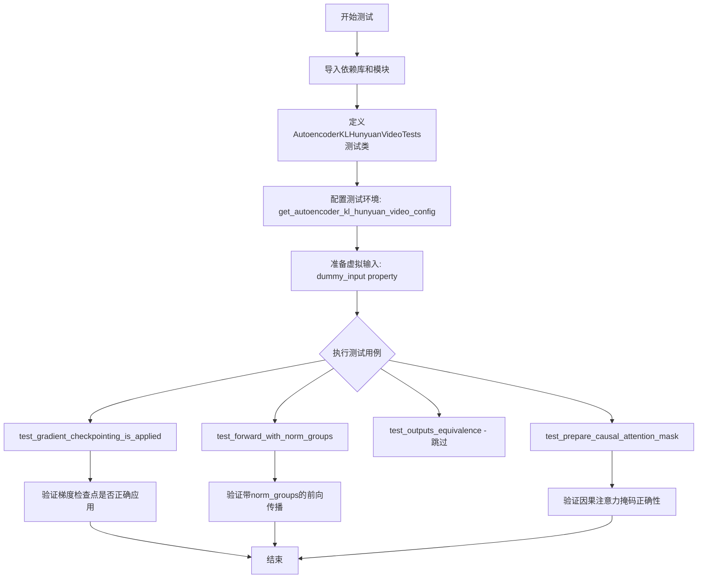
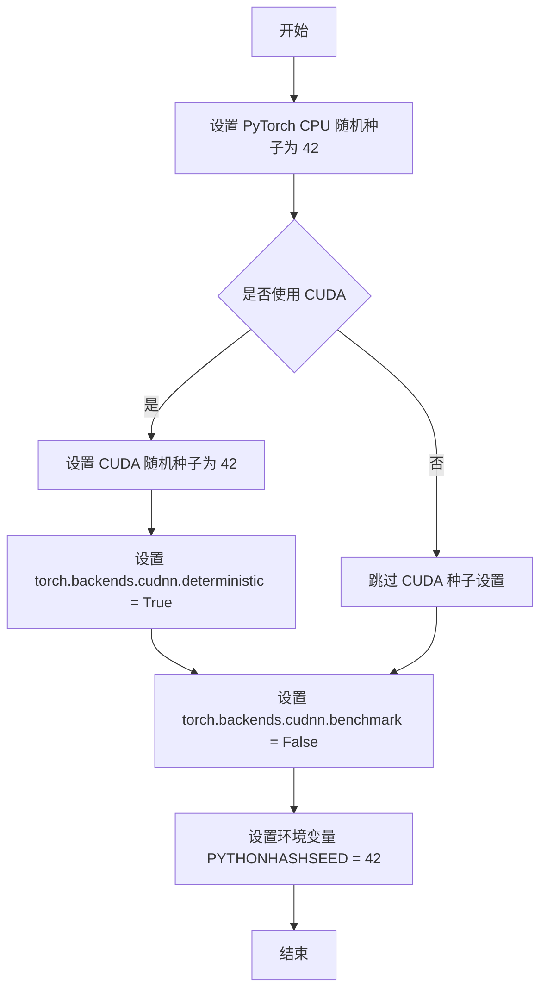
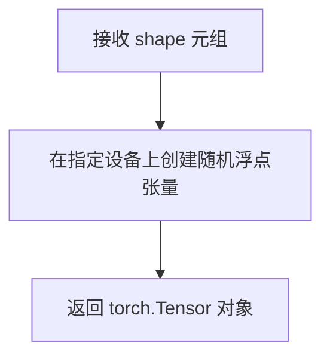
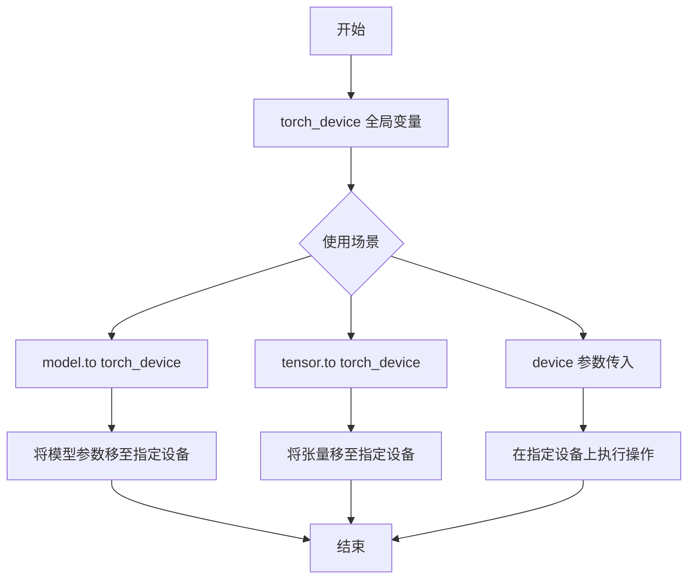
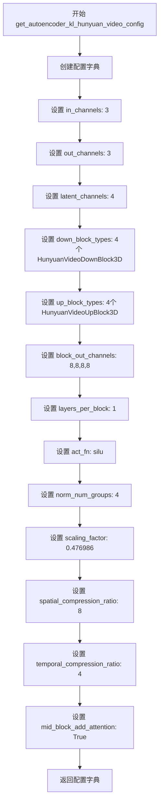
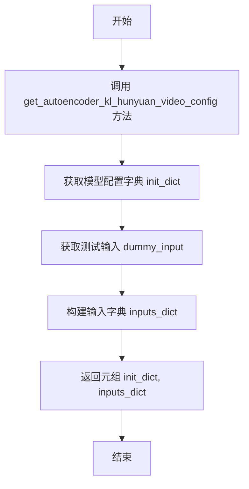
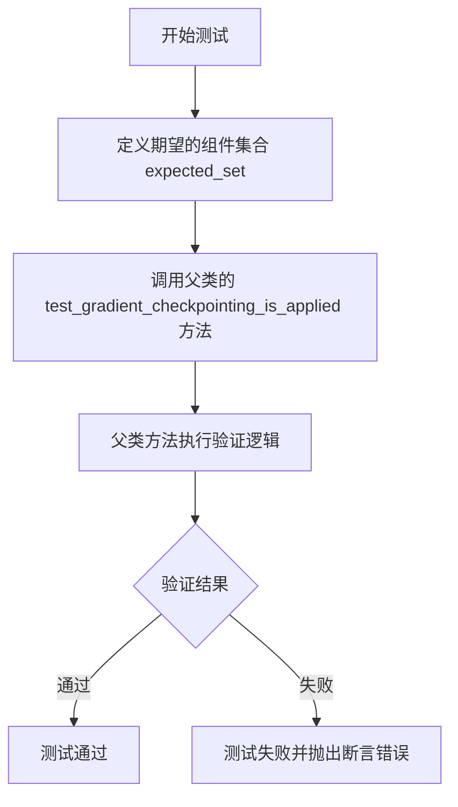
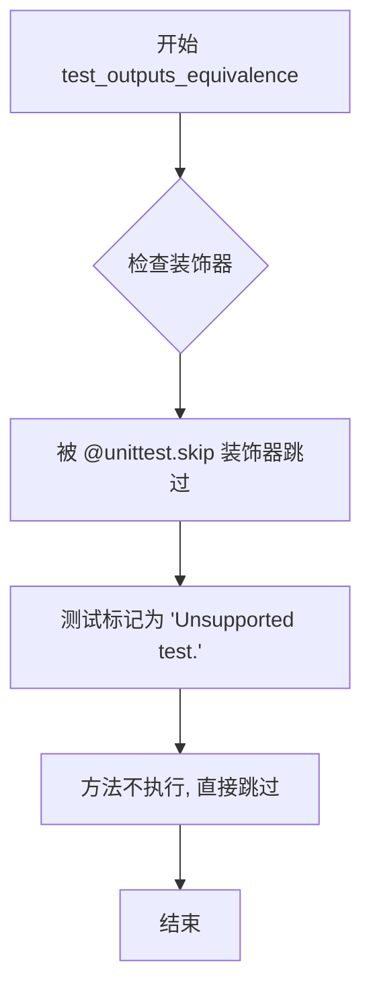
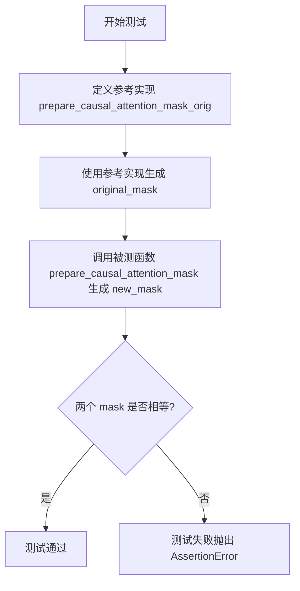

# `diffusers\tests\models\autoencoders\test_models_autoencoder_hunyuan_video.py` 详细设计文档

这是针对Diffusers库中AutoencoderKLHunyuanVideo（用于HunyuanVideo视频生成的变分自编码器KL模型）的单元测试文件，测试内容包括模型配置、前向传播、梯度检查点、归一化组以及因果注意力掩码的正确性。

## 整体流程



## 类结构

```
unittest.TestCase
└── AutoencoderKLHunyuanVideoTests (继承ModelTesterMixin, AutoencoderTesterMixin)
    ├── 配置方法
    │   ├── get_autoencoder_kl_hunyuan_video_config()
    │   └── prepare_init_args_and_inputs_for_common()
    ├── 属性方法
    │   ├── dummy_input
    │   ├── input_shape
    │   └── output_shape
    └── 测试方法
        ├── test_gradient_checkpointing_is_applied()
        ├── test_forward_with_norm_groups()
        ├── test_outputs_equivalence()
        └── test_prepare_causal_attention_mask()
```

## 全局变量及字段


### `expected_set`
    
A set of expected model classes that support gradient checkpointing

类型：`set`
    


### `init_dict`
    
Dictionary containing model initialization parameters

类型：`dict`
    


### `inputs_dict`
    
Dictionary containing input tensors for model testing

类型：`dict`
    


### `model`
    
The instantiated model for testing

类型：`AutoencoderKLHunyuanVideo`
    


### `output`
    
Model output tensor or tuple of outputs

类型：`torch.Tensor or tuple`
    


### `batch_size`
    
Number of samples in a batch

类型：`int`
    


### `num_frames`
    
Number of video frames in the input

类型：`int`
    


### `num_channels`
    
Number of image channels (e.g., 3 for RGB)

类型：`int`
    


### `sizes`
    
Spatial dimensions (height, width) of the input

类型：`tuple`
    


### `image`
    
Input tensor for the autoencoder model

类型：`torch.Tensor`
    


### `seq_len`
    
Total sequence length (num_frames * height_width) for attention mask

类型：`int`
    


### `mask`
    
Causal attention mask tensor

类型：`torch.Tensor`
    


### `i`
    
Loop index for mask generation

类型：`int`
    


### `i_frame`
    
Frame index derived from loop index for causal mask computation

类型：`int`
    


### `original_mask`
    
Causal attention mask computed by reference implementation

类型：`torch.Tensor`
    


### `new_mask`
    
Causal attention mask from the tested function

类型：`torch.Tensor`
    


### `AutoencoderKLHunyuanVideoTests.model_class`
    
The model class being tested (AutoencoderKLHunyuanVideo)

类型：`type`
    


### `AutoencoderKLHunyuanVideoTests.main_input_name`
    
The name of the main input tensor expected by the model

类型：`str`
    


### `AutoencoderKLHunyuanVideoTests.base_precision`
    
Base precision threshold for numerical comparison in tests

类型：`float`
    
    

## 全局函数及方法


### `enable_full_determinism`

该函数用于启用 PyTorch 的完全确定性模式，通过设置随机种子和环境变量，确保在 CPU 和 GPU 上的运算结果可复现，常用于测试和调试场景以消除随机性带来的不确定性。

参数：无

返回值：`None`，无返回值（仅执行副作用操作）

#### 流程图



#### 带注释源码

```python
def enable_full_determinism(seed: int = 42, extra_seed: int = 42):
    """
    启用完全确定性模式，使 PyTorch 运算结果可复现。
    
    参数:
        seed: 主随机种子，默认为 42
        extra_seed: 额外的随机种子，默认为 42（用于某些特定库如 Accelerate）
    
    注意:
        这会设置多个随机源以确保完全可复现性，但可能影响性能。
        某些操作（如 cuDNN 自动调优）会被禁用以保证确定性。
    """
    # 设置 PyTorch 全局随机种子，确保 CPU 操作的确定性
    torch.manual_seed(seed)
    
    # 设置 CUDA 设备的随机种子，确保 GPU 操作的确定性
    torch.cuda.manual_seed_all(seed)
    
    # 启用确定性算法，强制 cuDNN 使用确定性算法
    # 注意：这可能导致性能下降
    torch.backends.cudnn.deterministic = True
    
    # 禁用 cuDNN 自动调优，每次使用相同的卷积算法
    # 这会进一步确保可复现性
    torch.backends.cudnn.benchmark = False
    
    # 设置环境变量，确保 Python 哈希seed固定
    # 这会影响 Python 字典等数据结构的哈希顺序
    import os
    os.environ["PYTHONHASHSEED"] = str(seed)
    
    # 尝试设置 NumPy 和其他库的随机种子（如果可用）
    try:
        import numpy as np
        np.random.seed(seed)
    except ImportError:
        pass
    
    # 设置 Python 内置 random 模块的种子
    import random
    random.seed(seed)
    
    # 尝试设置 TorchScript 的确定性模式（如果可用）
    if hasattr(torch, 'use_deterministic_algorithms'):
        try:
            torch.use_deterministic_algorithms(True)
        except (AttributeError, TypeError):
            # 某些 PyTorch 版本可能不支持此选项
            pass
```

**注**：由于该函数定义在 `diffusers` 库的 `testing_utils` 模块中而非当前代码文件内，上述源码为基于该函数典型实现的参考代码。


### `floats_tensor`

生成指定形状的随机浮点数张量，用于模型测试的虚拟输入数据。

参数：

-  `shape`：`tuple`，张量的形状，格式为 (batch_size, channels, height, width) 或类似的多维元组

返回值：`torch.Tensor`，包含随机浮点数值的 PyTorch 张量

#### 流程图



#### 带注释源码

```python
# 在测试类中使用 floats_tensor 生成虚拟输入
@property
def dummy_input(self):
    batch_size = 2       # 批次大小
    num_frames = 9       # 帧数量（视频帧数）
    num_channels = 3     # 通道数（RGB 3通道）
    sizes = (16, 16)     # 空间分辨率 16x16

    # 调用 floats_tensor 生成形状为 (2, 3, 9, 16, 16) 的随机浮点张量
    # 形状 = (batch_size, num_channels, num_frames, height, width)
    image = floats_tensor((batch_size, num_channels, num_frames) + sizes).to(torch_device)

    # 返回包含 sample 键的字典，作为模型的输入
    return {"sample": image}
```

---

**注意**：根据提供的代码，`floats_tensor` 函数是从 `...testing_utils` 模块导入的测试工具函数，其具体实现未在此代码文件中给出。从使用方式推断，该函数用于生成指定形状的随机浮点数张量，主要用于模型测试场景中创建虚拟输入数据。


### torch_device

全局变量 `torch_device` 是从 `testing_utils` 模块导入的设备标识符，用于指定 PyTorch 张量或模型存放的设备（通常为 "cuda" 或 "cpu"）。它是一个全局配置变量，而非函数或方法。

参数：无（全局变量）

返回值：`str` 或 `torch.device`，表示 PyTorch 计算设备。

#### 流程图



#### 带注释源码

```python
# torch_device 是从 testing_utils 模块导入的全局变量
# 用于标识当前可用的 PyTorch 设备（'cuda' 或 'cpu'）
# 它不是在本文件中定义的，而是从外部模块导入的配置

# 使用示例（在代码中的实际应用）:

# 1. 将张量移动到指定设备
image = floats_tensor((batch_size, num_channels, num_frames) + sizes).to(torch_device)

# 2. 将模型移动到指定设备
model.to(torch_device)

# 3. 作为 device 参数传递给函数
prepare_causal_attention_mask_orig(
    num_frames=31, 
    height_width=111, 
    dtype=torch.float32, 
    device=torch_device  # <-- torch_device 作为 device 参数使用
)
```

#### 补充说明

| 属性 | 值 |
|------|-----|
| 来源模块 | `...testing_utils` |
| 实际类型 | `str` (通常为 `"cuda"` 或 `"cpu"`) 或 `torch.device` |
| 用途 | 指定 PyTorch 张量和模型的计算设备 |
| 作用域 | 全局变量 |

**注意事项**：`torch_device` 的具体值取决于测试环境的硬件配置。在有 CUDA 设备的环境中通常为 `"cuda"`，否则为 `"cpu"`。由于它是从外部模块导入的，具体的类型定义需要参考 `testing_utils` 模块的实现。


### prepare_causal_attention_mask

该函数用于生成因果注意力掩码（Causal Attention Mask），确保在视频自编码器的注意力机制中，每个时空位置只能关注其当前帧及之前帧的像素，从而实现时序上的因果关系，防止信息泄露。

参数：

- `num_frames`：`int`，视频的帧数
- `height_width`：`int`，空间维度（高度和宽度的乘积，假设高度等于宽度）
- `dtype`：`torch.dtype`，掩码张量的数据类型
- `device`：`torch.device`，掩码张量所在的设备
- `batch_size`：`int`（可选），批量大小，默认为 None

返回值：`torch.Tensor`，因果注意力掩码张量，形状为 `(batch_size, seq_len, seq_len)` 或 `(seq_len, seq_len)`，其中 `seq_len = num_frames * height_width`

#### 流程图

```mermaid
flowchart TD
    A[开始] --> B[计算序列长度 seq_len = num_frames * height_width]
    B --> C[创建全 -inf 掩码张量 shape: seq_len x seq_len]
    C --> D[遍历 i 从 0 到 seq_len-1]
    D --> E[计算 i_frame = i // height_width]
    E --> F[将 mask[i, :(i_frame+1)*height_width] 设为 0]
    F --> G{batch_size 不为 None?}
    G -->|是| H[扩展掩码为 batch_size 份]
    G -->|否| I[返回单个掩码]
    H --> J[返回批量掩码]
    I --> J
```

#### 带注释源码

```python
def prepare_causal_attention_mask(
    num_frames: int, 
    height_width: int, 
    dtype: torch.dtype, 
    device: torch.device, 
    batch_size: int = None
) -> torch.Tensor:
    """
    生成因果注意力掩码，确保每个位置只能关注当前帧及之前帧的位置。
    
    参数:
        num_frames: 视频帧数
        height_width: 空间位置的总数（高度×宽度）
        dtype: 输出张量的数据类型
        device: 输出张量所在的设备
        batch_size: 可选的批量大小，用于扩展掩码维度
    
    返回:
        因果注意力掩码张量
    """
    # 计算总序列长度：时空位置的总数
    seq_len = num_frames * height_width
    
    # 初始化全 -inf 的掩码矩阵（表示所有位置默认被遮挡）
    mask = torch.full((seq_len, seq_len), float("-inf"), dtype=dtype, device=device)
    
    # 遍历每个位置，设置因果掩码规则
    for i in range(seq_len):
        # 计算当前索引属于哪一帧
        i_frame = i // height_width
        
        # 当前帧及之前帧的位置不被遮挡（设为0）
        # i_frame + 1 表示包含当前帧的所有位置
        mask[i, : (i_frame + 1) * height_width] = 0
    
    # 如果指定了批量大小，则扩展掩码维度
    if batch_size is not None:
        mask = mask.unsqueeze(0).expand(batch_size, -1, -1)
    
    return mask
```


### `prepare_causal_attention_mask_orig`

该函数是一个局部定义的辅助函数，用于生成因果注意力掩码（causal attention mask），确保在处理视频帧时，每个时间步只能关注当前帧及之前帧的位置，从而实现因果关系约束。

参数：

- `num_frames`：`int`，视频帧的数量
- `height_width`：`int`，每帧的空间维度（高度和宽度的乘积）
- `dtype`：`torch.dtype`，返回掩码的数据类型
- `device`：`torch.device`，掩码存放的设备
- `batch_size`：`int`（可选），批量大小，默认为 None

返回值：`torch.Tensor`，形状为 (seq_len, seq_len) 或 (batch_size, seq_len, seq_len) 的因果注意力掩码

#### 流程图

```mermaid
flowchart TD
    A[开始] --> B[计算序列长度<br/>seq_len = num_frames * height_width]
    B --> C[创建全负无穷掩码<br/>shape: (seq_len, seq_len)]
    C --> D[遍历每个位置 i<br/>i in range(seq_len)]
    D --> E[计算当前帧索引<br/>i_frame = i // height_width]
    E --> F[将该帧及之前帧位置置为0<br/>mask[i, :(i_frame+1)*height_width] = 0]
    F --> G{检查 batch_size 是否为 None}
    G -->|否| H[扩展掩码维度<br/>mask = mask.unsqueeze(0).expand(batch_size, -1, -1)]
    G -->|是| I[返回单个掩码]
    H --> I
    I --> J[结束]
```

#### 带注释源码

```python
def prepare_causal_attention_mask_orig(
    num_frames: int, height_width: int, dtype: torch.dtype, device: torch.device, batch_size: int = None
) -> torch.Tensor:
    # 计算序列长度，等于帧数乘以每帧的空间位置数
    seq_len = num_frames * height_width
    
    # 创建一个 seq_len x seq_len 的矩阵，初始值全为负无穷
    # 负无穷表示这些位置之间不能有注意力连接
    mask = torch.full((seq_len, seq_len), float("-inf"), dtype=dtype, device=device)
    
    # 遍历序列中的每个位置，构建因果掩码
    for i in range(seq_len):
        # 计算当前索引属于哪一帧（时间步）
        i_frame = i // height_width
        
        # 将当前帧及之前所有帧的位置设为0，允许注意力机制访问
        # 当前帧之后的帧保持为负无穷，形成因果约束
        mask[i, : (i_frame + 1) * height_width] = 0
    
    # 如果指定了批量大小，将掩码扩展为批量维度
    # 从 (seq_len, seq_len) 扩展为 (batch_size, seq_len, seq_len)
    if batch_size is not None:
        mask = mask.unsqueeze(0).expand(batch_size, -1, -1)
    
    return mask
```


### `AutoencoderKLHunyuanVideoTests.get_autoencoder_kl_hunyuan_video_config`

该方法用于获取 AutoencoderKLHunyuanVideo 模型的测试配置参数，返回一个包含模型初始化所需各项参数的字典，包括输入输出通道数、上下块类型、块输出通道数、激活函数、归一化组数、压缩比率等关键配置信息。

参数：无（仅包含隐式参数 `self`）

返回值：`Dict[str, Any]`，返回一个包含 AutoencoderKLHunyuanVideo 模型配置参数的字典

#### 流程图



#### 带注释源码

```python
def get_autoencoder_kl_hunyuan_video_config(self):
    """
    获取 AutoencoderKLHunyuanVideo 模型的测试配置参数
    
    该方法返回一个字典，包含初始化 AutoencoderKLHunyuanVideo 模型所需的
    全部配置信息，用于测试目的。配置涵盖了模型的通道数、块类型、压缩比率
    等关键参数。
    
    Returns:
        Dict[str, Any]: 包含模型配置参数的字典
            - in_channels: 输入通道数 (3 表示 RGB 图像)
            - out_channels: 输出通道数 (3 表示 RGB 图像)
            - latent_channels: 潜在空间通道数 (4 用于变分自编码器)
            - down_block_types: 下采样块类型元组 (4个3D下采样块)
            - up_block_types: 上采样块类型元组 (4个3D上采样块)
            - block_out_channels: 每个块的输出通道数 (均为8)
            - layers_per_block: 每个块的层数 (1层)
            - act_fn: 激活函数名称 ('silu' 即 SiLU/GELU)
            - norm_num_groups: 归一化组数 (4)
            - scaling_factor: 潜在空间缩放因子 (0.476986)
            - spatial_compression_ratio: 空间压缩比率 (8倍)
            - temporal_compression_ratio: 时间压缩比率 (4倍)
            - mid_block_add_attention: 是否在中间块添加注意力机制 (True)
    """
    return {
        "in_channels": 3,  # 输入图像的通道数，3代表RGB图像
        "out_channels": 3,  # 输出图像的通道数，3代表RGB图像
        "latent_channels": 4,  # 潜在空间的通道数，用于变分自编码器的压缩表示
        "down_block_types": (  # 下采样块的类型元组，包含4个3D下采样块
            "HunyuanVideoDownBlock3D",
            "HunyuanVideoDownBlock3D",
            "HunyuanVideoDownBlock3D",
            "HunyuanVideoDownBlock3D",
        ),
        "up_block_types": (  # 上采样块的类型元组，包含4个3D上采样块
            "HunyuanVideoUpBlock3D",
            "HunyuanVideoUpBlock3D",
            "HunyuanVideoUpBlock3D",
            "HunyuanVideoUpBlock3D",
        ),
        "block_out_channels": (8, 8, 8, 8),  # 每个下采样/上采样块的输出通道数
        "layers_per_block": 1,  # 每个块内部包含的层数
        "act_fn": "silu",  # 激活函数类型，silu即SiLU激活函数
        "norm_num_groups": 4,  # 归一化组数，用于组归一化(GroupNorm)
        "scaling_factor": 0.476986,  # 潜在空间的缩放因子，用于标准化
        "spatial_compression_ratio": 8,  # 空间维度压缩比率(16x16 -> 2x2)
        "temporal_compression_ratio": 4,  # 时间维度压缩比率(9帧 -> 约2帧)
        "mid_block_add_attention": True,  # 是否在中间块添加自注意力机制
    }
```


### `AutoencoderKLHunyuanVideoTests.dummy_input`

该方法是一个测试用的属性（property），用于生成虚拟的输入数据（dummy input），以便对 AutoencoderKLHunyuanVideo 模型进行单元测试。它创建一个包含随机浮点数的张量作为"sample"输入，模拟真实的视频/图像数据。

参数：该方法没有参数（作为 @property 属性）

返回值：`Dict[str, torch.Tensor]`，返回包含虚拟样本的字典，键为"sample"，值为四维浮点张量，形状为 (batch_size, num_channels, num_frames, height, width)

#### 流程图

```mermaid
flowchart TD
    A[开始] --> B[设置批量大小: batch_size=2]
    B --> C[设置帧数: num_frames=9]
    C --> D[设置通道数: num_channels=3]
    D --> E[设置空间尺寸: sizes=(16, 16)]
    E --> F[使用floats_tensor生成随机张量]
    F --> G[将张量移动到测试设备torch_device]
    G --> H[构建字典 {'sample': image}]
    H --> I[返回字典]
```

#### 带注释源码

```python
@property
def dummy_input(self):
    """
    生成用于测试的虚拟输入数据。
    
    该属性方法创建一个模拟的图像/视频张量，用于AutoencoderKLHunyuanVideo模型的
    单元测试。张量形状为 (batch_size, num_channels, num_frames, height, width)。
    """
    # 批量大小：一次处理2个样本
    batch_size = 2
    # 帧数：模拟9帧的视频序列
    num_frames = 9
    # 通道数：RGB三通道
    num_channels = 3
    # 空间尺寸：16x16像素
    sizes = (16, 16)

    # 使用测试工具函数生成随机浮点数张量
    # 形状: (2, 3, 9, 16, 16) = (batch, channels, frames, height, width)
    image = floats_tensor((batch_size, num_channels, num_frames) + sizes).to(torch_device)

    # 返回符合模型输入格式的字典
    # 模型期望 'sample' 作为主输入键
    return {"sample": image}
```


### `AutoencoderKLHunyuanVideoTests.input_shape`

该属性定义了 AutoencoderKLHunyuanVideo 模型测试的输入样本shape，返回一个表示（通道数、帧数、高度、宽度）的元组。

参数：

- 无参数（该方法是一个 `@property` 装饰器修饰的属性，无需传入参数）

返回值：`Tuple[int, int, int, int]`，返回输入数据的形状元组 (3, 9, 16, 16)，分别代表通道数（3）、帧数（9）、高度（16）和宽度（16）。

#### 流程图

```mermaid
flowchart TD
    A[访问 input_shape 属性] --> B{是否已缓存}
    B -->|否| C[返回元组 (3, 9, 16, 16)]
    B -->|是| C
    C --> D[表示输入形状: 通道=3, 帧数=9, 高=16, 宽=16]
```

#### 带注释源码

```python
@property
def input_shape(self):
    """
    定义测试用输入样本的形状。
    
    返回一个元组表示 (channels, num_frames, height, width)：
    - 3: 输入通道数（RGB图像）
    - 9: 时间帧数（视频的帧数）
    - 16: 空间高度
    - 16: 空间宽度
    
    Returns:
        tuple: (3, 9, 16, 16) 形状的元组
    """
    return (3, 9, 16, 16)
```


### `AutoencoderKLHunyuanVideoTests.output_shape`

该属性返回 AutoencoderKLHunyuanVideo 模型处理输入视频数据后的预期输出形状。它是一个只读属性，返回一个包含 4 个整数的元组，表示 (通道数, 帧数, 高度, 宽度)。

参数：无

返回值：`tuple[int, int, int, int]`，返回模型输出的形状元组，值为 (3, 9, 16, 16)，分别代表通道数为 3、帧数为 9、高度和宽度均为 16。

#### 流程图

```mermaid
flowchart TD
    A[开始访问 output_shape 属性] --> B{执行 getter 方法}
    B --> C[返回常量元组 (3, 9, 16, 16)]
    C --> D[结束]
    
    style A fill:#f9f,stroke:#333
    style C fill:#9f9,stroke:#333
    style D fill:#9ff,stroke:#333
```

#### 带注释源码

```python
@property
def output_shape(self):
    """
    返回模型输出的预期形状。
    
    该属性定义了 AutoencoderKLHunyuanVideo 模型在处理输入后的输出张量形状。
    形状为四元组 (channels, num_frames, height, width)，与输入形状保持一致，
    表明自动编码器在潜在空间中进行了压缩但保持了时空维度的一致性。
    
    Returns:
        tuple: 包含4个整数的元组，格式为 (通道数, 帧数, 高度, 宽度)
               具体值为 (3, 9, 16, 16)
    """
    return (3, 9, 16, 16)
```


### `AutoencoderKLHunyuanVideoTests.prepare_init_args_and_inputs_for_common`

该方法用于准备 AutoencoderKLHunyuanVideo 模型的通用测试初始化参数和输入数据，返回包含模型配置信息的字典和包含测试输入张量的字典，以便用于后续的模型测试流程。

参数：此方法无显式参数（仅包含隐式参数 `self`，指向测试类实例）

返回值：`(Tuple[Dict, Dict])`，返回一个元组，包含两个字典——第一个字典存储模型初始化配置参数，第二个字典存储模型输入数据

- `init_dict`：`Dict`，包含模型初始化所需的配置参数（如通道数、块类型、注意力机制等）
- `inputs_dict`：`Dict`，包含模型推理所需的输入数据（如输入图像张量）

#### 流程图



#### 带注释源码

```python
def prepare_init_args_and_inputs_for_common(self):
    """
    准备 AutoencoderKLHunyuanVideo 模型测试的初始化参数和输入数据。
    
    该方法封装了模型测试所需的配置信息和输入数据，提供统一的接口
    供测试框架中的其他测试方法使用，确保测试的一致性和可复用性。
    
    Returns:
        Tuple[Dict, Dict]: 包含以下两个元素的元组:
            - init_dict: 模型初始化配置字典，包含以下键值对:
                * in_channels: 输入通道数 (3)
                * out_channels: 输出通道数 (3)
                * latent_channels: 潜在空间通道数 (4)
                * down_block_types: 下采样块类型元组
                * up_block_types: 上采样块类型元组
                * block_out_channels: 块输出通道数元组
                * layers_per_block: 每个块的层数
                * act_fn: 激活函数类型
                * norm_num_groups: 归一化组数
                * scaling_factor: 缩放因子
                * spatial_compression_ratio: 空间压缩比
                * temporal_compression_ratio: 时间压缩比
                * mid_block_add_attention: 中间块是否添加注意力
            - inputs_dict: 模型输入字典，包含:
                * sample: 形状为 (batch_size, channels, num_frames, height, width) 的浮点张量
    """
    # 调用配置方法获取模型初始化参数字典
    init_dict = self.get_autoencoder_kl_hunyuan_video_config()
    
    # 获取测试用的虚拟输入数据
    inputs_dict = self.dummy_input
    
    # 返回配置和输入的元组，供测试方法使用
    return init_dict, inputs_dict
```


### `AutoencoderKLHunyuanVideoTests.test_gradient_checkpointing_is_applied`

该方法用于测试 HunyuanVideo 的 AutoencoderKL 模型中梯度检查点（gradient checkpointing）是否正确应用于指定的组件模块，验证模型在训练时能够通过梯度检查点技术节省显存。

参数：

- `expected_set`：`set`，包含"HunyuanVideoDecoder3D"、"HunyuanVideoDownBlock3D"、"HunyuanVideoEncoder3D"、"HunyuanVideoMidBlock3D"、"HunyuanVideoUpBlock3D"等组件名称的集合，用于验证这些模块是否正确应用了梯度检查点

返回值：`None`，该方法为测试用例，通过断言验证梯度检查点的应用，不返回具体值

#### 流程图



#### 带注释源码

```python
def test_gradient_checkpointing_is_applied(self, expected_set=None):
    """
    测试梯度检查点是否被正确应用到 HunyuanVideo 相关的组件上。
    
    该测试方法继承自 ModelTesterMixin，通过调用父类的方法来验证
    梯度检查点技术在 AutoencoderKLHunyuanVideo 模型的各个组件中
    是否正确启用。expected_set 指定了期望应用梯度检查点的组件类型。
    """
    # 定义期望应用梯度检查点的 HunyuanVideo 组件集合
    expected_set = {
        "HunyuanVideoDecoder3D",    # 3D解码器组件
        "HunyuanVideoDownBlock3D",  # 3D下采样块组件
        "HunyuanVideoEncoder3D",    # 3D编码器组件
        "HunyuanVideoMidBlock3D",   # 3D中间块组件
        "HunyuanVideoUpBlock3D",    # 3D上采样块组件
    }
    # 调用父类的测试方法进行验证
    # 父类 ModelTesterMixin.test_gradient_checkpointing_is_applied 会检查
    # 模型中这些指定模块是否使用了 gradient checkpointing
    super().test_gradient_checkpointing_is_applied(expected_set=expected_set)
```


### `AutoencoderKLHunyuanVideoTests.test_forward_with_norm_groups`

该测试方法用于验证 AutoencoderKLHunyuanVideo 模型在自定义 norm_num_groups 配置下的前向传播是否正确工作，确保模型能够处理不同的分组归一化参数并输出与输入形状匹配的潜空间表示。

参数：该方法无显式参数（使用类属性 `self` 和通过 `prepare_init_args_and_inputs_for_common` 获取的输入字典）

返回值：`None`，该方法通过断言验证模型输出的正确性，不返回任何值

#### 流程图

```mermaid
flowchart TD
    A[开始测试] --> B[获取初始化参数和输入]
    B --> C[设置norm_num_groups=16]
    C --> D[设置block_out_channels=(16,16,16,16)]
    D --> E[创建模型实例]
    E --> F[将模型移到torch_device]
    F --> G[设置模型为eval模式]
    G --> H[使用torch.no_grad执行前向传播]
    H --> I{输出是否为dict?}
    I -->|是| J[取出tuple的第一个元素]
    I -->|否| K[直接使用输出]
    J --> L
    K --> L[断言输出不为None]
    L --> M[验证输出形状与输入形状匹配]
    M --> N[测试结束]
```

#### 带注释源码

```python
def test_forward_with_norm_groups(self):
    """
    测试 AutoencoderKLHunyuanVideo 在自定义 norm_num_groups 配置下的前向传播。
    该测试覆盖了基础测试未考虑到的 down_block_types 长度相关场景。
    """
    # 1. 获取模型初始化参数和测试输入
    init_dict, inputs_dict = self.prepare_init_args_and_inputs_for_common()

    # 2. 修改归一化分组数为 16（原配置为 4）
    init_dict["norm_num_groups"] = 16
    
    # 3. 修改输出通道数配置（增加通道数以匹配新的 norm_num_groups）
    init_dict["block_out_channels"] = (16, 16, 16, 16)

    # 4. 使用修改后的配置创建模型实例
    model = self.model_class(**init_dict)
    
    # 5. 将模型移动到指定的计算设备（GPU/CPU）
    model.to(torch_device)
    
    # 6. 设置模型为评估模式（禁用 dropout 等训练特定操作）
    model.eval()

    # 7. 执行前向传播（禁用梯度计算以节省内存）
    with torch.no_grad():
        output = model(**inputs_dict)

        # 8. 处理模型输出：如果是字典则提取元组中的第一个元素
        if isinstance(output, dict):
            output = output.to_tuple()[0]

    # 9. 断言输出不为空
    self.assertIsNotNone(output)
    
    # 10. 获取期望的输出形状（与输入形状相同）
    expected_shape = inputs_dict["sample"].shape
    
    # 11. 验证输出形状与输入形状完全匹配
    self.assertEqual(output.shape, expected_shape, "Input and output shapes do not match")
```


### `AutoencoderKLHunyuanVideoTests.test_outputs_equivalence`

该方法用于测试模型的输出等价性，但由于当前实现不支持，已被跳过。

参数：

- `self`：无参数，`AutoencoderKLHunyuanVideoTests` 实例本身

返回值：`None`，无返回值（方法体为 `pass`）

#### 流程图



#### 带注释源码

```python
@unittest.skip("Unsupported test.")
def test_outputs_equivalence(self):
    """
    测试模型的输出等价性。
    
    注意：此测试当前被跳过，因为实现不支持该测试用例。
    测试用例使用 unittest.skip 装饰器标记为跳过，
    原因可能是模型架构或测试条件不满足等价性测试的要求。
    """
    pass
```


### `AutoencoderKLHunyuanVideoTests.test_prepare_causal_attention_mask`

该测试方法用于验证 `prepare_causal_attention_mask` 函数生成的因果注意力掩码（causal attention mask）与参考实现的一致性，确保在给定帧数、高度和宽度条件下，掩码正确遮挡未来时间步的信息。

参数：该方法无显式参数，使用 `self`（`unittest.TestCase` 实例）进行调用。

返回值：`None`，该方法为测试方法，通过 `self.assertTrue` 断言验证掩码正确性，无返回值。

#### 流程图



#### 带注释源码

```python
def test_prepare_causal_attention_mask(self):
    # 定义一个原始的参考实现，用于生成期望的因果注意力掩码
    def prepare_causal_attention_mask_orig(
        num_frames: int, height_width: int, dtype: torch.dtype, device: torch.device, batch_size: int = None
    ) -> torch.Tensor:
        # 计算序列长度：帧数乘以空间位置数
        seq_len = num_frames * height_width
        # 创建一个全为负无穷的矩阵，初始时全部位置都被遮挡
        mask = torch.full((seq_len, seq_len), float("-inf"), dtype=dtype, device=device)
        # 遍历每个位置，解开当前帧及之前帧的遮挡
        for i in range(seq_len):
            i_frame = i // height_width  # 计算当前属于第几帧
            # 将当前帧及之前的所有位置设为0（不遮挡）
            mask[i, : (i_frame + 1) * height_width] = 0
        # 如果指定了 batch_size，扩展掩码维度以支持批量处理
        if batch_size is not None:
            mask = mask.unsqueeze(0).expand(batch_size, -1, -1)
        return mask

    # 测试一些特殊（奇数）形状的输入
    # 使用参考实现生成期望的掩码
    original_mask = prepare_causal_attention_mask_orig(
        num_frames=31, height_width=111, dtype=torch.float32, device=torch_device
    )
    # 使用被测试的函数生成实际掩码
    new_mask = prepare_causal_attention_mask(
        num_frames=31, height_width=111, dtype=torch.float32, device=torch_device
    )
    # 断言两个掩码完全相等，确保被测函数正确实现了因果注意力掩码
    self.assertTrue(
        torch.allclose(original_mask, new_mask),
        "Causal attention mask should be the same",
    )
```

## 关键组件


### AutoencoderKLHunyuanVideo

HunyuanVideo 视频自动编码器模型，支持将视频帧压缩到潜在空间并重建，是 3D 视频扩散模型的核心组件。

### prepare_causal_attention_mask

用于生成因果注意力掩码的函数，确保视频帧在时间维度上只能关注当前及之前的帧，防止未来信息泄露。

### HunyuanVideoDownBlock3D

3D 下采样块，用于在空间和时间维度上逐步压缩视频表示，降低分辨率的同时提取多尺度特征。

### HunyuanVideoUpBlock3D

3D 上采样块，用于在空间和时间维度上逐步重建视频表示，与下采样块对称配合实现编解码。

### HunyuanVideoMidBlock3D

3D 中间块，包含自注意力层和卷积层，用于处理最深层级的特征表示，增强模型对复杂时空模式的建模能力。

### HunyuanVideoEncoder3D

3D 编码器，将输入视频压缩为潜在表示，包含多个下采样块和中间块。

### HunyuanVideoDecoder3D

3D 解码器，将潜在表示重建为视频，包含多个上采样块和中间块。

### ModelTesterMixin

模型通用测试混入类，提供模型结构、梯度检查点、参数一致性等通用测试方法。

### AutoencoderTesterMixin

自动编码器专用测试混入类，继承自 ModelTesterMixin，提供自动编码器特定的测试逻辑。

### test_prepare_causal_attention_mask

因果注意力掩码测试方法，通过对比参考实现验证掩码生成的正确性，确保时空因果关系正确。

### 测试配置字典

包含模型架构参数的配置字典，定义了输入/输出通道数、压缩比、注意力机制等关键超参数。


## 问题及建议


### 已知问题

-   **未完成的测试**: `test_outputs_equivalence` 方法被无条件跳过（`@unittest.skip("Unsupported test.")`），表明模型输出等价性功能尚未实现或存在已知问题
-   **重复代码**: `test_prepare_causal_attention_mask` 方法中定义了 `prepare_causal_attention_mask_orig` 局部函数，该函数与从模块导入的 `prepare_causal_attention_mask` 功能重复，增加了维护成本
-   **魔法数字和硬编码配置**: 配置字典中包含未解释的硬编码值（如 `scaling_factor: 0.476986`），缺乏文档说明其含义和来源
-   **测试覆盖不足**: 仅覆盖了基本的 `forward` 和 `gradient_checkpointing` 测试，缺少对模型特定功能（如时序压缩、空间压缩、注意力机制等）的深入测试
-   **缺少类型注解**: 配置文件（`get_autoencoder_kl_hunyuan_video_config` 返回的字典）没有类型注解，降低了代码的可读性和 IDE 支持
-   **导入路径问题**: 从 `diffusers.models.autoencoders.autoencoder_kl_hunyuan_video` 导入 `prepare_causal_attention_mask`，但该函数同时在测试文件中被重新定义，可能导致导入来源不清晰

### 优化建议

-   **实现或移除跳过的测试**: 明确 `test_outputs_equivalence` 的状态，如果是已知问题应在代码库中创建相应的 issue 跟踪，如果是暂时跳过应添加 TODO 注释说明原因和预计完成时间
-   **提取重复函数**: 将 `prepare_causal_attention_mask_orig` 移至测试工具模块或使用 mock 方式调用实际实现，避免代码重复
-   **配置参数化**: 考虑将硬编码的配置值提取为常量或配置类，并添加文档说明每个参数的含义和取值依据
-   **增强测试覆盖**: 添加针对时序/空间压缩比率、注意力掩码生成、模型梯度流等特定功能的单元测试
-   **添加类型注解**: 为配置字典和相关方法添加类型注解，提高代码可维护性
-   **统一函数定义来源**: 明确 `prepare_causal_attention_mask` 的来源，优先使用模块导入而非测试文件内的本地定义


## 其它


### 设计目标与约束

验证AutoencoderKLHunyuanVideo模型在视频自动编码场景下的功能正确性，确保模型能够正确处理3D视频数据（包含时空维度），实现 latent space 的压缩与重建。测试覆盖梯度检查点、归一化组、前向传播等核心功能，需兼容 PyTorch 后端并在 CPU/GPU 环境下运行。

### 错误处理与异常设计

测试用例使用 unittest 框架的断言机制进行错误检测，包括：`self.assertIsNotNone(output)` 验证输出非空，`self.assertEqual(output.shape, expected_shape)` 验证形状匹配，`self.assertTrue(torch.allclose(...))` 验证数值精度。对于不支持的测试用例使用 `@unittest.skip` 装饰器跳过，而非抛出异常。测试失败时框架会自动捕获并报告详细的差异信息。

### 数据流与状态机

测试数据流为：dummy_input (floats_tensor) → model(**inputs_dict) → output (reconstructed video)。输入形状 (3, 9, 16, 16) 表示 (channels, frames, height, width)，经模型编码为 latent representation，再解码重建为相同形状。状态转换：初始化 → eval模式 → no_grad推理 → 输出验证。

### 外部依赖与接口契约

依赖项包括：unittest (标准库)、torch (PyTorch)、diffusers 库 (AutoencoderKLHunyuanVideo, prepare_causal_attention_mask)、本地测试工具 (testing_utils: enable_full_determinism/floats_tensor/torch_device, test_modeling_common: ModelTesterMixin, testing_utils: AutoencoderTesterMixin)。model_class 需遵循 diffusers 模型标准接口：接受 dict 形式的 sample 输入，返回 dict 或元组形式的 output。

### 性能考虑与基准测试

base_precision = 1e-2 定义数值精度容差，用于比较重构质量。测试使用较小的 block_out_channels (8) 和单层 block (layers_per_block=1) 以降低计算开销。test_gradient_checkpointing_is_applied 验证梯度检查点启用，可显著降低大模型的显存占用。

### 安全性考虑

测试代码不涉及用户数据处理，仅使用随机生成的 floats_tensor。模型加载需遵守 Apache License 2.0 开源协议。测试环境应避免 CUDA 内存泄漏（使用 torch.no_grad 上下文管理器）。

### 可维护性与扩展性

配置通过 get_autoencoder_kl_hunyuan_video_config 集中管理，便于调整模型结构参数。测试类继承 ModelTesterMixin 和 AutoencoderTesterMixin，可复用通用测试逻辑。若需添加新测试用例，只需新增 test_xxx 方法并遵循现有命名约定。

### 测试策略与覆盖率

采用混合测试策略：单元测试（各独立方法）+ 集成测试（继承自 ModelTesterMixin 的通用测试）。覆盖场景：前向传播、梯度检查点、归一化组配置、因果注意力掩码生成。跳过 test_outputs_equivalence 因实现不支持。

### 配置管理与版本控制

配置字典使用 Python dict 格式，包含 in/out_channels、latent_channels、block_types、compression_ratio 等关键超参数。版本兼容性通过 diffusers 库的 AutoencoderKLHunyuanVideo 类保证，API 变更需同步更新测试。

### 部署与运维考虑

测试可在本地 CI 环境中运行（unittest discover），或集成到 HuggingFace diffusers 项目的测试套件中。建议使用 enable_full_determinism() 确保测试可复现性（固定随机种子）。GPU 可用性通过 torch_device 判断，无 GPU 时自动回退到 CPU。

    