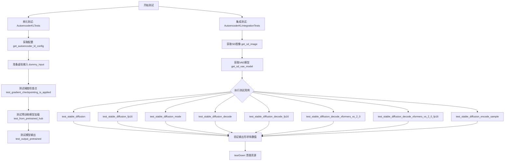
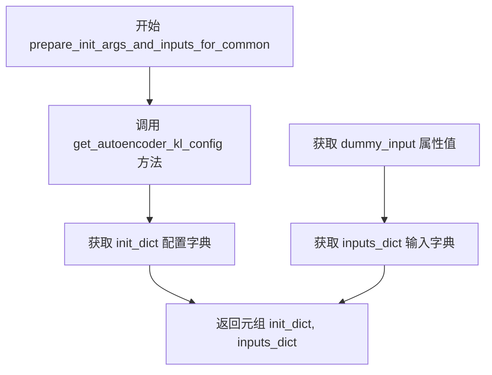
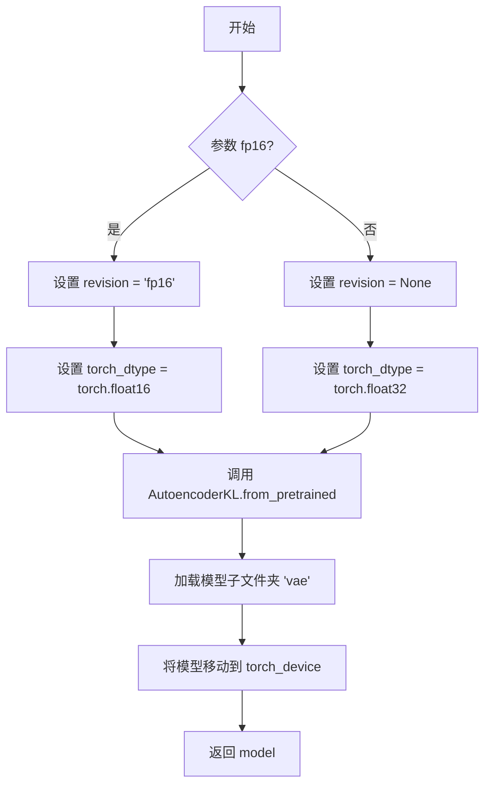
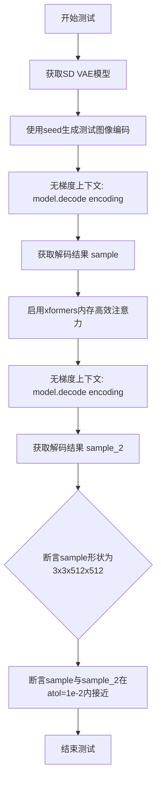

# `diffusers\tests\models\autoencoders\test_models_autoencoder_kl.py` 详细设计文档

这是一个用于测试 diffusers 库中 AutoencoderKL (变分自编码器) 模型的单元测试和集成测试文件，主要验证 VAE 模型在 Stable Diffusion 中的编码、解码功能，以及不同精度和硬件环境下的行为。

## 整体流程



## 类结构

```
unittest.TestCase (Python 标准库)
├── AutoencoderKLTests (单元测试类)
│   └── 继承: ModelTesterMixin, AutoencoderTesterMixin
└── AutoencoderKLIntegrationTests (集成测试类)
    └── 继承: unittest.TestCase
```

## 全局变量及字段


### `model_class`
    
The model class being tested, set to AutoencoderKL

类型：`Type[AutoencoderKL]`
    


### `main_input_name`
    
The name of the main input tensor for the model, set to 'sample'

类型：`str`
    


### `base_precision`
    
The base precision for numerical comparisons, set to 1e-2 (0.01)

类型：`float`
    


### `block_out_channels`
    
List of output channels for each block in the encoder/decoder, defaults to [2, 4]

类型：`List[int]`
    


### `norm_num_groups`
    
Number of groups for group normalization, defaults to 2

类型：`int`
    


### `init_dict`
    
Dictionary containing model initialization configuration parameters

类型：`Dict[str, Any]`
    


### `batch_size`
    
Number of samples in a batch for testing, set to 4

类型：`int`
    


### `num_channels`
    
Number of input image channels, typically 3 for RGB images

类型：`int`
    


### `sizes`
    
Spatial dimensions of the input image, set to (32, 32)

类型：`Tuple[int, int]`
    


### `image`
    
Random float tensor used as input image for testing

类型：`torch.Tensor`
    


### `inputs_dict`
    
Dictionary containing input tensors for model testing

类型：`Dict[str, torch.Tensor]`
    


### `seed`
    
Random seed for reproducible test generation

类型：`int`
    


### `shape`
    
Tuple specifying the shape of a tensor

类型：`Tuple[int, ...]`
    


### `fp16`
    
Boolean flag indicating whether to use half-precision (float16) format

类型：`bool`
    


### `dtype`
    
Torch data type for tensors, either torch.float16 or torch.float32

类型：`torch.dtype`
    


### `revision`
    
Model revision version to load from HuggingFace Hub, None or 'fp16'

类型：`Optional[str]`
    


### `torch_dtype`
    
Torch data type for model weights, torch.float16 or torch.float32

类型：`torch.dtype`
    


### `model`
    
Instance of the AutoencoderKL model for VAE encoding/decoding

类型：`AutoencoderKL`
    


### `generator`
    
PyTorch random number generator for reproducible sampling

类型：`torch.Generator`
    


### `generator_device`
    
Device string for the random generator, 'cpu' or CUDA device

类型：`str`
    


### `expected_set`
    
Set of component names expected to support gradient checkpointing

类型：`Set[str]`
    


### `loading_info`
    
Dictionary containing model loading information including missing keys

类型：`Dict[str, Any]`
    


### `output_slice`
    
Flattened tensor slice from model output for comparison

类型：`torch.Tensor`
    


### `expected_output_slice`
    
Expected tensor values for test assertion comparisons

类型：`torch.Tensor`
    


### `tolerance`
    
Numerical tolerance threshold for tensor comparison, typically 1e-3 to 1e-2

类型：`float`
    


### `AutoencoderKLTests.model_class`
    
Class attribute specifying the model class being tested

类型：`Type[AutoencoderKL]`
    


### `AutoencoderKLTests.main_input_name`
    
Class attribute defining the main input parameter name for the model

类型：`str`
    


### `AutoencoderKLTests.base_precision`
    
Class attribute for numerical comparison precision threshold

类型：`float`
    
    

## 全局函数及方法


### `AutoencoderKLTests.get_autoencoder_kl_config`

该方法用于生成 AutoencoderKL 模型的初始化配置字典，配置了编码器/解码器的块通道数、输入输出通道数、潜在通道数、归一化组数等关键参数，以供测试用例初始化模型使用。

参数：

- `block_out_channels`：`Optional[List[int]]`，可选参数，编码器和解码器的输出通道数列表，默认为 `[2, 4]`
- `norm_num_groups`：`Optional[int]`，可选参数，归一化组数，默认为 `2`

返回值：`Dict[str, Any]`，返回包含模型初始化所需配置的字典，包括 `block_out_channels`、`in_channels`、`out_channels`、`down_block_types`、`up_block_types`、`latent_channels` 和 `norm_num_groups` 等键值对。

#### 流程图

```mermaid
flowchart TD
    A[开始 get_autoencoder_kl_config] --> B{检查 block_out_channels}
    B -->|为 None| C[使用默认值 [2, 4]]
    B -->|不为 None| D[使用传入值]
    C --> E{检查 norm_num_groups}
    D --> E
    E -->|为 None| F[使用默认值 2]
    E -->|不为 None| G[使用传入值]
    F --> H[构建 init_dict 字典]
    G --> H
    H --> I[返回 init_dict]
```

#### 带注释源码

```python
def get_autoencoder_kl_config(self, block_out_channels=None, norm_num_groups=None):
    """
    生成 AutoencoderKL 模型的初始化配置字典
    
    Args:
        block_out_channels: 可选的输出通道数列表，用于编码器和解码器块
        norm_num_groups: 可选的归一化组数，用于组归一化
    
    Returns:
        包含模型初始化参数的字典
    """
    # 如果未提供 block_out_channels，则使用默认值 [2, 4]
    block_out_channels = block_out_channels or [2, 4]
    
    # 如果未提供 norm_num_groups，则使用默认值 2
    norm_num_groups = norm_num_groups or 2
    
    # 构建模型初始化配置字典
    init_dict = {
        "block_out_channels": block_out_channels,  # 编码器/解码器块输出通道
        "in_channels": 3,                           # 输入图像通道数 (RGB)
        "out_channels": 3,                          # 输出图像通道数 (RGB)
        # 根据 block_out_channels 长度生成对应数量的下采样块类型
        "down_block_types": ["DownEncoderBlock2D"] * len(block_out_channels),
        # 根据 block_out_channels 长度生成对应数量的上采样块类型
        "up_block_types": ["UpDecoderBlock2D"] * len(block_out_channels),
        "latent_channels": 4,                       # 潜在空间通道数 (VAE 编码后的通道)
        "norm_num_groups": norm_num_groups,         # 组归一化的组数
    }
    
    # 返回完整的初始化配置字典
    return init_dict
```


### `AutoencoderKLTests.dummy_input`

该属性用于生成测试用的虚拟输入数据，返回一个包含图像张量的字典，作为 AutoencoderKL 模型的输入样本。

参数：

- （无参数）

返回值：`Dict[str, torch.Tensor]`，返回包含 "sample" 键的字典，值为形状 (4, 3, 32, 32) 的浮点张量，用于模拟批量为 4、通道为 3、分辨率为 32x32 的输入图像。

#### 流程图

```mermaid
flowchart TD
    A[开始] --> B[设置批量大小 batch_size = 4]
    B --> C[设置通道数 num_channels = 3]
    C --> D[设置图像尺寸 sizes = 32, 32]
    D --> E[使用 floats_tensor 生成随机浮点张量]
    E --> F[将张量移动到 torch_device]
    F --> G[返回字典 {'sample': image}]
    G --> H[结束]
```

#### 带注释源码

```python
@property
def dummy_input(self):
    """
    生成用于测试的虚拟输入数据。
    
    该属性创建一个模拟的图像张量，用于 AutoencoderKL 模型的单元测试。
    返回的字典将作为模型的输入参数。
    """
    # 设置批量大小为 4
    batch_size = 4
    # 设置输入图像通道数为 3（RGB图像）
    num_channels = 3
    # 设置图像的空间尺寸为 32x32
    sizes = (32, 32)

    # 使用 floats_tensor 生成指定形状的随机浮点数张量
    # 形状为 (batch_size, num_channels, height, width) = (4, 3, 32, 32)
    # 并将张量移动到测试设备（CPU/CUDA）
    image = floats_tensor((batch_size, num_channels) + sizes).to(torch_device)

    # 返回符合模型输入格式的字典
    # 键 'sample' 对应 AutoencoderKL 的 forward 方法参数名
    return {"sample": image}
```


### `AutoencoderKLTests.input_shape`

该属性用于返回 AutoencoderKL 测试类的输入图像形状，定义在测试类中作为测试配置的一部分。

参数： 无

返回值：`tuple`，返回输入样本的形状，格式为 (通道数, 高度, 宽度) = (3, 32, 32)

#### 流程图

```mermaid
flowchart TD
    A[调用 input_shape 属性] --> B[返回元组 (3, 32, 32)]
```

#### 带注释源码

```python
@property
def input_shape(self):
    """
    返回测试用的输入图像形状。

    返回值:
        tuple: 包含通道数、高度和宽度的元组 (3, 32, 32)
               - 3: RGB 图像的通道数
               - 32: 图像高度
               - 32: 图像宽度
    """
    return (3, 32, 32)
```


### `AutoencoderKLTests.output_shape`

这是一个属性方法，用于返回模型期望的输出张量形状。在测试用例中定义了模型输入和输出的预期维度，用于验证AutoencoderKL模型的输出是否与输入具有相同的形状。

参数： 无（这是一个属性方法，不接受任何参数）

返回值：`Tuple[int, int, int]`，返回模型输出的预期形状，为(3, 32, 32)的元组，表示(通道数, 高度, 宽度)

#### 流程图

```mermaid
flowchart TD
    A[开始访问 output_shape 属性] --> B[返回元组 (3, 32, 32)]
    B --> C[结束]
    
    style A fill:#f9f,stroke:#333
    style B fill:#9f9,stroke:#333
    style C fill:#ff9,stroke:#333
```

#### 带注释源码

```python
@property
def output_shape(self):
    """
    属性方法：返回模型期望的输出张量形状
    
    该属性定义了AutoencoderKL模型在测试中的预期输出维度。
    返回(3, 32, 32)表示:
    - 3: 通道数 (RGB图像)
    - 32: 高度
    - 32: 宽度
    
    这个形状与input_shape相同，表明VAE的输出应该与输入保持相同的空间维度，
    尽管潜在空间的通道数可能不同（在配置中latent_channels=4）。
    
    Returns:
        tuple: 一个包含3个整数的元组，表示 (通道数, 高度, 宽度)
    """
    return (3, 32, 32)
```


### `AutoencoderKLTests.prepare_init_args_and_inputs_for_common`

该方法是 AutoencoderKL 测试类的核心辅助方法，用于准备模型测试所需的初始化参数字典和输入数据字典。它被测试框架（通常是 ModelTesterMixin）调用，以获取标准的初始化配置和测试输入。

参数：

- `self`：隐式的 `AutoencoderKLTests` 实例，表示当前测试类对象

返回值：`Tuple[Dict, Dict]`，返回一个元组，包含两个字典：

- 第一个字典（init_dict）：AutoencoderKL 模型的初始化参数配置
- 第二个字典（inputs_dict）：用于测试的输入数据（包含 sample 键的字典）

#### 流程图



#### 带注释源码

```python
def prepare_init_args_and_inputs_for_common(self):
    """
    准备 AutoencoderKL 模型测试所需的初始化参数和输入数据。
    
    此方法被测试框架的通用测试逻辑调用，用于获取标准的模型配置
    和测试输入，确保不同模型测试的一致性。
    
    Returns:
        Tuple[Dict, Dict]: 包含以下两个字典的元组:
            - init_dict: 模型初始化参数字典，包含:
                * block_out_channels: 输出通道列表 [2, 4]
                * in_channels: 输入通道数 3
                * out_channels: 输出通道数 3
                * down_block_types: 下采样块类型列表
                * up_block_types: 上采样块类型列表
                * latent_channels: 潜在空间通道数 4
                * norm_num_groups: 归一化组数 2
            - inputs_dict: 测试输入字典，包含:
                * sample: 浮点类型张量，形状 (4, 3, 32, 32)
    """
    # 调用配置获取方法，生成 AutoencoderKL 模型的标准配置
    init_dict = self.get_autoencoder_kl_config()
    
    # 获取虚拟输入数据，用于测试模型前向传播
    inputs_dict = self.dummy_input
    
    # 返回配置字典和输入字典的元组
    return init_dict, inputs_dict
```


### `AutoencoderKLTests.test_gradient_checkpointing_is_applied`

该函数是 AutoencoderKL 模型测试类中的一个测试方法，用于验证梯度检查点（Gradient Checkpointing）技术在模型的特定组件（Decoder、Encoder、UNetMidBlock2D）上是否正确应用。它通过调用父类的同名测试方法并传入期望的组件集合来完成验证。

参数：

- `expected_set`：`set`，包含期望启用梯度检查点的组件名称集合，如 `{"Decoder", "Encoder", "UNetMidBlock2D"}`

返回值：`None`，该方法为测试用例，通过断言验证梯度检查点配置，不返回具体值

#### 流程图

```mermaid
flowchart TD
    A[开始测试] --> B[定义期望组件集合]
    B --> C[设置 expected_set = {'Decoder', 'Encoder', 'UNetMidBlock2D'}]
    C --> D[调用父类测试方法]
    D --> E[super.test_gradient_checkpointing_is_applied]
    E --> F{梯度检查点是否正确应用}
    F -->|是| G[测试通过]
    F -->|否| H[测试失败并抛出异常]
```

#### 带注释源码

```python
def test_gradient_checkpointing_is_applied(self):
    """
    测试梯度检查点技术是否在指定组件上正确应用
    
    该测试方法验证 AutoencoderKL 模型中的 Decoder、Encoder 和 UNetMidBlock2D
    这些组件是否启用了梯度检查点功能。梯度检查点是一种通过在反向传播时
    重新计算中间激活值来节省显存的技术。
    """
    # 定义期望启用梯度检查点的组件集合
    # AutoencoderKL 包含编码器(Encoder)和解码器(Decoder)两个主要部分
    # UNetMidBlock2D 是 UNet 的中间块，用于处理多尺度特征
    expected_set = {"Decoder", "Encoder", "UNetMidBlock2D"}
    
    # 调用父类（ModelTesterMixin）的测试方法进行验证
    # 父类方法会检查模型中这些组件的 gradient_checkpointing 属性
    # 如果组件正确启用了梯度检查点，则测试通过
    super().test_gradient_checkpointing_is_applied(expected_set=expected_set)
```


### `AutoencoderKLTests.test_from_pretrained_hub`

该测试方法验证从 Hugging Face Hub 加载预训练 AutoencoderKL 模型的功能，检查模型加载成功、无缺失键，并通过虚拟输入验证模型能够正常执行前向传播。

参数：

- `self`：`AutoencoderKLTests`（继承自 `unittest.TestCase`），测试类实例本身

返回值：`None`，该方法为测试用例，无返回值

#### 流程图

```mermaid
flowchart TD
    A[开始测试] --> B[调用 AutoencoderKL.from_pretrained 加载模型]
    B --> C{模型加载成功?}
    C -->|是| D[断言 model 不为 None]
    C -->|否| E[测试失败]
    D --> F[断言 loading_info['missing_keys'] 长度为 0]
    F --> G[将模型移动到 torch_device]
    G --> H[使用 dummy_input 执行前向传播]
    H --> I{输出不为 None?}
    I -->|是| J[测试通过]
    I -->|否| K[断言失败]
```

#### 带注释源码

```python
def test_from_pretrained_hub(self):
    """
    测试从 Hugging Face Hub 加载预训练 AutoencoderKL 模型的功能。
    
    该测试执行以下步骤：
    1. 从预训练模型仓库 'fusing/autoencoder-kl-dummy' 加载模型
    2. 验证模型对象成功创建
    3. 验证模型加载信息中没有缺失的键
    4. 将模型移动到指定的计算设备
    5. 使用虚拟输入执行前向传播，验证模型可正常运行
    """
    # 使用 from_pretrained 方法加载预训练模型，并请求返回加载信息
    # 参数 "fusing/autoencoder-kl-dummy" 是 Hugging Face Hub 上的模型仓库标识
    # output_loading_info=True 表示同时返回加载过程中的详细信息（如缺失键、意外键等）
    model, loading_info = AutoencoderKL.from_pretrained("fusing/autoencoder-kl-dummy", output_loading_info=True)
    
    # 断言模型对象已成功创建，不为 None
    self.assertIsNotNone(model)
    
    # 断言加载信息中没有缺失的键（missing_keys 列表长度为 0）
    # 这确保模型的所有权重都已正确加载
    self.assertEqual(len(loading_info["missing_keys"]), 0)

    # 将模型移动到指定的计算设备（如 'cuda'、'cpu' 或 'mps'）
    model.to(torch_device)
    
    # 使用虚拟输入（dummy_input）执行模型的前向传播
    # dummy_input 包含一个 'sample' 键，值为随机生成的浮点张量
    image = model(**self.dummy_input)

    # 断言模型输出的图像不为 None，确保前向传播成功执行
    assert image is not None, "Make sure output is not None"
```


### `AutoencoderKLTests.test_output_pretrained`

该测试方法用于验证 AutoencoderKL 模型从预训练权重加载后能否正确执行前向传播，并通过与预期输出张量的比对来确保模型的数值输出符合预期（验证 VAE 的采样后端 posterior sampling 功能）。

参数：

- 无显式参数（使用类属性 `self.dummy_input` 和模块级变量 `torch_device`）

返回值：无返回值（通过 `assert` 断言进行验证）

#### 流程图

```mermaid
flowchart TD
    A[开始测试] --> B[从预训练模型加载AutoencoderKL]
    B --> C[将模型移动到torch_device并设置为eval模式]
    D[确定generator设备: 如果torch_device是CPU则使用CPU, 否则使用torch_device]
    E[创建随机图像张量: shape为1 x in_channels x sample_size x sample_size]
    F[将图像移动到torch_device]
    G[使用no_grad上下文执行模型前向传播: model.image, sample_posterior=True, generator=generator]
    H[提取输出切片: output[0, -1, -3:, -3:].flatten().cpu]
    I{判断torch_device类型}
    I -->|mps| J[使用mps预期输出切片]
    I -->|cpu| K[使用cpu预期输出切片]
    I -->|其他| L[使用GPU预期输出切片]
    J --> M[断言验证输出切片与预期切片近似相等, rtol=1e-2]
    K --> M
    L --> M
    M --> N[测试通过]
```

#### 带注释源码

```python
def test_output_pretrained(self):
    """
    测试从预训练模型加载的AutoencoderKL模型的前向输出是否符合预期。
    验证模型能够正确执行前向传播并生成有效的采样结果。
    """
    # 步骤1: 从预训练模型加载AutoencoderKL
    # 使用 "fusing/autoencoder-kl-dummy" 这是一个用于测试的虚拟VAE模型
    model = AutoencoderKL.from_pretrained("fusing/autoencoder-kl-dummy")
    
    # 步骤2: 将模型移动到指定的计算设备（如CUDA）并设置为评估模式
    model = model.to(torch_device)
    model.eval()

    # 步骤3: 确定随机数生成器的设备
    # 对于非CUDA设备，保持生成器在CPU上以便与CPU结果张量进行比较
    # 注意: 这里的条件判断逻辑有问题，torch_device.startswith(torch_device)永远为真
    generator_device = "cpu" if not torch_device.startswith(torch_device) else torch_device
    
    # 步骤4: 创建随机数生成器
    # 根据设备类型选择创建方式
    if torch_device != "mps":
        generator = torch.Generator(device=generator_device).manual_seed(0)
    else:
        generator = torch.manual_seed(0)

    # 步骤5: 创建随机输入图像
    # 形状: [batch=1, in_channels, sample_size, sample_size]
    image = torch.randn(
        1,
        model.config.in_channels,      # 输入通道数（通常为3 for RGB）
        model.config.sample_size,      # 样本大小（图像尺寸）
        model.config.sample_size,
        generator=torch.manual_seed(0),
    )
    
    # 步骤6: 将输入图像移动到目标设备
    image = image.to(torch_device)

    # 步骤7: 执行前向传播
    # 使用 no_grad 上下文避免计算梯度，节省内存
    # sample_posterior=True 表示从VAE的高斯后验分布中采样，而非直接计算均值
    # generator 用于控制随机采样过程，确保结果可复现
    with torch.no_grad():
        output = model(image, sample_posterior=True, generator=generator).sample

    # 步骤8: 提取输出切片进行验证
    # 取第一个样本的最后通道的最后3x3区域，并展平为一维张量
    output_slice = output[0, -1, -3:, -3:].flatten().cpu()

    # 步骤9: 根据设备类型选择预期的输出切片
    # 由于VAE的高斯先验生成器在相应设备上种子不同，CPU和GPU的预期输出不同
    if torch_device == "mps":
        # Apple MPS 设备的预期输出
        expected_output_slice = torch.tensor(
            [
                -4.0078e-01,
                -3.8323e-04,
                -1.2681e-01,
                -1.1462e-01,
                2.0095e-01,
                1.0893e-01,
                -8.8247e-02,
                -3.0361e-01,
                -9.8644e-03,
            ]
        )
    elif generator_device == "cpu":
        # CPU 生成器的预期输出
        expected_output_slice = torch.tensor(
            [
                -0.1352,
                0.0878,
                0.0419,
                -0.0818,
                -0.1069,
                0.0688,
                -0.1458,
                -0.4446,
                -0.0026,
            ]
        )
    else:
        # GPU 生成器的预期输出
        expected_output_slice = torch.tensor(
            [
                -0.2421,
                0.4642,
                0.2507,
                -0.0438,
                0.0682,
                0.3160,
                -0.2018,
                -0.0727,
                0.2485,
            ]
        )

    # 步骤10: 断言验证输出与预期值是否近似相等
    # 使用相对容差 rtol=1e-2 (1%) 进行比较
    self.assertTrue(torch_all_close(output_slice, expected_output_slice, rtol=1e-2))
```


### `AutoencoderKLIntegrationTests.get_file_format`

这是一个辅助方法，用于生成Stable Diffusion测试数据文件的命名格式。该方法接收随机种子和形状参数，并返回符合预定义命名规范的numpy文件名。

参数：

- `seed`：`int`，随机种子，用于标识不同的噪声样本
- `shape`：`tuple` 或 `list`，表示数据的形状维度（如 `(4, 3, 512, 512)`）

返回值：`str`，返回格式化的文件名，格式为 `gaussian_noise_s={seed}_shape={shape_dim0}_{shape_dim1}_..._.npy`

#### 流程图

```mermaid
graph TD
    A[开始 get_file_format] --> B[接收 seed 和 shape 参数]
    B --> C[将 shape 中的每个维度转换为字符串]
    C --> D[用下划线连接各维度字符串]
    D --> E[构建文件名: gaussian_noise_s={seed}_shape={连接后的维度}.npy]
    E --> F[返回文件名]
```

#### 带注释源码

```python
def get_file_format(self, seed, shape):
    """
    生成用于Stable Diffusion测试数据的文件名格式
    
    Args:
        seed (int): 随机种子，用于生成不同的噪声样本
        shape (tuple/list): 数据张量的形状维度
    
    Returns:
        str: 格式化的文件名，格式为 gaussian_noise_s={seed}_shape={shape}.npy
    """
    # 使用f-string构建文件名，将seed和shape格式化
    # shape参数被转换为下划线连接的字符串形式
    return f"gaussian_noise_s={seed}_shape={'_'.join([str(s) for s in shape])}.npy"
```


### `AutoencoderKLIntegrationTests.tearDown`

该方法是 `AutoencoderKLIntegrationTests` 集成测试类的清理方法，用于在每个测试用例执行完成后释放 GPU 显存（VRAM），确保测试之间的资源隔离，避免显存泄漏导致的测试失败。

参数：

- `self`：隐式参数，`AutoencoderKLIntegrationTests` 实例本身，无需显式传入

返回值：`None`，无返回值

#### 流程图

```mermaid
flowchart TD
    A[tearDown 开始] --> B[调用 super().tearDown]
    B --> C[执行 gc.collect 垃圾回收]
    C --> D[调用 backend_empty_cache 清理 GPU 缓存]
    D --> E[tearDown 结束]
    
    style A fill:#f9f,stroke:#333
    style E fill:#9f9,stroke:#333
```

#### 带注释源码

```python
def tearDown(self):
    # clean up the VRAM after each test
    # 清理每次测试后的 VRAM（显存），防止显存泄漏
    
    super().tearDown()
    # 调用父类 unittest.TestCase 的 tearDown 方法
    # 执行标准的测试清理逻辑
    
    gc.collect()
    # 强制调用 Python 垃圾回收器
    # 回收已卸载的模型对象等不再使用的 Python 对象
    
    backend_empty_cache(torch_device)
    # 调用后端工具清空指定设备（torch_device）的 GPU 缓存
    # 释放 GPU 显存，确保下一个测试有足够的显存可用
```


### `AutoencoderKLIntegrationTests.get_sd_image`

该方法用于加载Stable Diffusion的测试图像数据，通过指定的随机种子和形状参数从HuggingFace获取numpy数组，并将其转换为指定数据类型的PyTorch张量，迁移到计算设备上。

参数：

- `seed`：`int`，随机种子，用于生成文件名标识，确保加载对应随机状态的图像数据，默认值为0
- `shape`：`tuple`，图像张量的形状，格式为`(batch_size, channels, height, width)`，默认值为`(4, 3, 512, 512)`
- `fp16`：`bool`，是否使用float16数据类型，True时使用`torch.float16`，False时使用`torch.float32`，默认值为`False`

返回值：`torch.Tensor`，返回加载并转换后的图像张量，数据类型根据`fp16`参数确定，已迁移至`torch_device`指定的计算设备上

#### 流程图

```mermaid
flowchart TD
    A[开始 get_sd_image] --> B{检查 fp16 参数}
    B -->|fp16=True| C[设置 dtype = torch.float16]
    B -->|fp16=False| D[设置 dtype = torch.float32]
    C --> E[调用 get_file_format 生成文件名]
    D --> E
    E --> F[使用 load_hf_numpy 加载 numpy 数组]
    F --> G[转换为 PyTorch 张量: torch.from_numpy]
    G --> H[迁移至计算设备: .to(torch_device)]
    H --> I[转换数据类型: .to(dtype)]
    I --> J[返回图像张量]
```

#### 带注释源码

```python
def get_sd_image(self, seed=0, shape=(4, 3, 512, 512), fp16=False):
    """
    加载 Stable Diffusion 测试图像
    
    参数:
        seed: 随机种子，用于生成唯一的文件名标识
        shape: 期望的图像张量形状 (batch_size, channels, height, width)
        fp16: 是否使用半精度浮点数 (float16)
    
    返回:
        加载并转换后的图像张量
    """
    # 根据 fp16 参数确定数据类型：半精度或全精度
    dtype = torch.float16 if fp16 else torch.float32
    
    # 生成文件名格式，包含随机种子和形状信息
    # 例如: gaussian_noise_s=0_shape=4_3_512_512.npy
    file_format = self.get_file_format(seed, shape)
    
    # 从 HuggingFace 加载 numpy 数组格式的图像数据
    # 然后转换为 PyTorch 张量
    image = torch.from_numpy(load_hf_numpy(file_format))
    
    # 将张量迁移到指定的计算设备 (如 CUDA 或 CPU)
    .to(torch_device)
    
    # 转换张量的数据类型 (float16 或 float32)
    .to(dtype)
    
    # 返回处理后的图像张量
    return image
```


### `AutoencoderKLIntegrationTests.get_sd_vae_model`

该函数用于从预训练模型中加载 Stable Diffusion 所需的 VAE（变分自编码器）模型，支持指定模型ID和精度格式（fp16 或 fp32）。

参数：

- `model_id`：`str`，默认值 `"CompVis/stable-diffusion-v1-4"`，模型在 HuggingFace Hub 上的标识符或本地路径
- `fp16`：`bool`，默认值 `False`，是否使用半精度（float16）加载模型

返回值：`AutoencoderKL`，返回加载并移动到指定设备后的 VAE 模型实例

#### 流程图



#### 带注释源码

```python
def get_sd_vae_model(self, model_id="CompVis/stable-diffusion-v1-4", fp16=False):
    """
    加载 Stable Diffusion 预训练 VAE 模型
    
    参数:
        model_id: HuggingFace Hub 上的模型标识符或本地路径
        fp16: 是否使用半精度加载模型
    
    返回:
        加载并移动到计算设备后的 AutoencoderKL 模型
    """
    # 根据 fp16 参数确定模型版本分支
    revision = "fp16" if fp16 else None
    # 确定数值精度类型
    torch_dtype = torch.float16 if fp16 else torch.float32

    # 从预训练模型加载 AutoencoderKL VAE
    model = AutoencoderKL.from_pretrained(
        model_id,          # 模型标识符
        subfolder="vae",   # 指定加载 VAE 子模块
        torch_dtype=torch_dtype,  # 设置模型精度
        revision=revision,       # 指定模型版本
    )
    # 将模型移动到计算设备（如 GPU）
    model.to(torch_device)

    return model
```


### `AutoencoderKLIntegrationTests.get_generator`

该方法用于创建一个 PyTorch 随机数生成器（Generator），根据当前设备类型返回对应设备的生成器对象，以确保在 VAE 模型采样时能够产生可复现的随机结果。

参数：

- `seed`：`int`，随机种子值，默认为 0，用于初始化生成器的随机状态

返回值：`Optional[torch.Generator]`，返回 torch.Generator 对象（非 MPS 设备）或 None（MPS 设备），用于后续 VAE 采样的随机数生成

#### 流程图

```mermaid
flowchart TD
    A[开始 get_generator] --> B{torch_device == 'mps'?}
    B -->|是| C[返回 torch.manual_seed(seed)<br/>设置为None]
    B -->|否| D[确定generator_device<br/>cpu或当前设备]
    D --> E[创建torch.Generator<br/>device=generator_device]
    E --> F[调用manual_seed(seed)]
    F --> G[返回Generator对象]
```

#### 带注释源码

```python
def get_generator(self, seed=0):
    """
    创建一个用于VAE采样时的随机数生成器。
    
    参数:
        seed: 随机种子，默认为0，用于保证结果可复现
    
    返回:
        torch.Generator对象或None
    """
    # 确定生成器应该放置的设备
    # 如果torch_device不是以torch_device开头（即不是CUDA设备），则使用CPU
    # 注意：这里有个逻辑bug，实际应该是检查是否以'cuda'开头
    generator_device = "cpu" if not torch_device.startswith(torch_device) else torch_device
    
    # 针对MPS设备做特殊处理（MPS是Apple Silicon的GPU加速）
    if torch_device != "mps":
        # 非MPS设备：创建并返回Generator对象
        return torch.Generator(device=generator_device).manual_seed(seed)
    
    # MPS设备：仅设置种子，返回None
    # 注意：torch.manual_seed()返回None
    return torch.manual_seed(seed)
```


### `AutoencoderKLIntegrationTests.test_stable_diffusion`

该方法是 `AutoencoderKLIntegrationTests` 测试类中的一个测试函数，用于验证 Stable Diffusion 模型中 VAE（变分自编码器）在采样后验分布时的正确性。它通过比较模型输出的特定切片与预期的数值范围来确保模型的精度和一致性。

参数：

- `self`：隐式参数，测试类实例本身
- `seed`：`int`，随机种子，用于生成测试图像和随机数，确保测试的可重复性
- `expected_slice`：`List[float]`，在非 MPS 设备上运行时期望的输出切片值
- `expected_slice_mps`：`List[float]`，在 MPS (Apple Silicon) 设备上运行时期望的输出切片值

返回值：`None`，该方法为测试方法，无返回值，通过断言验证模型输出

#### 流程图

```mermaid
flowchart TD
    A[开始测试] --> B[获取SD VAE模型]
    B --> C[根据seed获取测试图像]
    C --> D[创建随机数生成器]
    D --> E[使用torch.no_grad禁用梯度计算]
    E --> F[调用model进行前向传播<br/>sample_posterior=True采样后验分布]
    F --> G[提取模型输出的sample属性]
    G --> H[断言输出形状与输入形状相同]
    H --> I[提取输出切片的特定部分<br/>sample[-1, -2:, -2:, :2]]
    I --> J{判断设备是否为MPS}
    J -->|是| K[使用expected_slice_mps作为期望值]
    J -->|否| L[使用expected_slice作为期望值]
    K --> M[将输出和期望值转换为float和CPU张量]
    L --> M
    M --> N[断言torch_all_close输出与期望值<br/>atol=3e-3]
    N --> O[结束测试]
```

#### 带注释源码

```python
@parameterized.expand(
    [
        # fmt: off
        # 参数化测试：每个元素包含 [seed, expected_slice, expected_slice_mps]
        [
            33,
            # 非MPS设备的期望输出切片
            [-0.1556, 0.9848, -0.0410, -0.0642, -0.2685, 0.8381, -0.2004, -0.0700],
            # MPS设备的期望输出切片
            [-0.2395, 0.0098, 0.0102, -0.0709, -0.2840, -0.0274, -0.0718, -0.1824],
        ],
        [
            47,
            [-0.2376, 0.1200, 0.1337, -0.4830, -0.2504, -0.0759, -0.0486, -0.4077],
            [0.0350, 0.0847, 0.0467, 0.0344, -0.0842, -0.0547, -0.0633, -0.1131],
        ],
        # fmt: on
    ]
)
def test_stable_diffusion(self, seed, expected_slice, expected_slice_mps):
    """
    测试 Stable Diffusion VAE 的后验采样功能
    
    参数:
        seed: 随机种子，用于生成测试图像和随机数
        expected_slice: 非MPS设备上的期望输出切片
        expected_slice_mps: MPS设备上的期望输出切片
    """
    # 1. 获取预训练的Stable Diffusion VAE模型
    model = self.get_sd_vae_model()
    
    # 2. 根据seed加载对应的测试图像（高斯噪声图像）
    image = self.get_sd_image(seed)
    
    # 3. 创建与seed对应的随机数生成器，确保可重复性
    generator = self.get_generator(seed)

    # 4. 禁用梯度计算以节省内存并加速推理
    with torch.no_grad():
        # 5. 执行前向传播
        # - image: 输入图像
        # - generator: 用于后验分布采样的随机数生成器
        # - sample_posterior=True: 从后验分布中采样而不是返回分布参数
        # - .sample: 从输出对象中提取采样得到的样本
        sample = model(image, generator=generator, sample_posterior=True).sample

    # 6. 验证输出形状与输入形状一致
    assert sample.shape == image.shape

    # 7. 提取输出切片的特定部分进行精度验证
    # - sample[-1, -2:, -2:, :2]: 提取最后一张图片的右下角2x2区域的前2个通道
    # - .flatten(): 展平为1D张量
    # - .float(): 转换为float32类型
    # - .cpu(): 移至CPU进行对比
    output_slice = sample[-1, -2:, -2:, :2].flatten().float().cpu()
    
    # 8. 根据设备类型选择期望的输出切片
    # MPS设备由于数值精度问题可能有不同的期望值
    expected_output_slice = torch.tensor(
        expected_slice_mps if torch_device == "mps" else expected_slice
    )

    # 9. 验证输出与期望值的接近程度
    # 使用绝对容差(atol=3e-3)进行对比
    assert torch_all_close(output_slice, expected_output_slice, atol=3e-3)
```


### `AutoencoderKLIntegrationTests.test_stable_diffusion_fp16`

这是一个集成测试方法，用于验证 Stable Diffusion VAE 模型在 FP16（半精度浮点）模式下的前向传播是否正确运行。

参数：

- `self`：`AutoencoderKLIntegrationTests`，测试类的实例，包含测试所需的配置和工具方法
- `seed`：`int`，随机种子，用于生成测试图像和随机数，确保测试结果可复现
- `expected_slice`：`List[float]`，期望的输出张量切片（8个浮点数值），用于与实际输出进行近似比较

返回值：`None`，该方法为测试用例，通过断言验证模型输出的正确性，不返回任何值

#### 流程图

```mermaid
flowchart TD
    A[开始测试] --> B[获取FP16 VAE模型: get_sd_vae_model fp16=True]
    B --> C[获取FP16测试图像: get_sd_image seed fp16=True]
    C --> D[获取随机生成器: get_generator seed]
    D --> E[禁用梯度计算: with torch.no_grad]
    E --> F[执行模型前向传播: model image generator=generator sample_posterior=True]
    F --> G[提取样本: .sample]
    G --> H[断言输出形状匹配输入形状]
    H --> I[提取输出切片: sample[-1, -2:, :2, -2:] flatten float cpu]
    I --> J[转换为张量: torch.tensor expected_slice]
    J --> K[断言输出与期望近似相等: torch_all_close atol=1e-2]
    K --> L[结束测试]
```

#### 带注释源码

```python
@parameterized.expand(
    [
        # fmt: off
        # 参数化测试用例：seed 和 expected_slice
        [33, [-0.0513, 0.0289, 1.3799, 0.2166, -0.2573, -0.0871, 0.5103, -0.0999]],
        [47, [-0.4128, -0.1320, -0.3704, 0.1965, -0.4116, -0.2332, -0.3340, 0.2247]],
        # fmt: on
    ]
)
@require_torch_accelerator_with_fp16  # 装饰器：要求支持FP16的加速器（如CUDA）
def test_stable_diffusion_fp16(self, seed, expected_slice):
    """
    测试 AutoencoderKL 模型在 FP16 模式下的前向传播
    验证模型能正确处理半精度浮点输入并产生合理输出
    """
    # 1. 获取预训练的 FP16 VAE 模型
    #    使用 CompVis/stable-diffusion-v1-4 的 VAE 子模块
    #    加载为 torch.float16 类型
    model = self.get_sd_vae_model(fp16=True)
    
    # 2. 获取对应 seed 的测试图像（FP16）
    #    图像 shape: (4, 3, 512, 512)
    image = self.get_sd_image(seed, fp16=True)
    
    # 3. 获取随机数生成器，确保采样过程可复现
    generator = self.get_generator(seed)
    
    # 4. 禁用梯度计算，减少内存占用并加速推理
    with torch.no_grad():
        # 5. 执行模型前向传播
        #    - image: 输入图像张量
        #    - generator: 用于后验分布采样的随机生成器
        #    - sample_posterior=True: 从后验分布采样而非直接返回均值
        #    - .sample: 提取 VAE 输出中的 sample 属性
        sample = model(image, generator=generator, sample_posterior=True).sample
    
    # 6. 验证输出形状与输入形状一致
    assert sample.shape == image.shape
    
    # 7. 提取输出切片用于数值验证
    #    取最后一个样本的最后2行、前2列通道，展平为1D张量
    output_slice = sample[-1, -2:, :2, -2:].flatten().float().cpu()
    
    # 8. 将期望输出转换为张量（FP32）
    expected_output_slice = torch.tensor(expected_slice)
    
    # 9. 断言实际输出与期望输出在指定容差内近似相等
    #    使用 atol=1e-2（绝对容差），允许 FP16 累积误差
    assert torch_all_close(output_slice, expected_output_slice, atol=1e-2)
```


### `AutoencoderKLIntegrationTests.test_stable_diffusion_mode`

该测试方法用于验证 AutoencoderKL（VAE）模型在 Stable Diffusion 中的正向传播（推理模式）是否产生预期的输出，通过比较模型输出的特定切片与期望值来确保模型的数值正确性和稳定性。

参数：

- `self`：`AutoencoderKLIntegrationTests`，测试类实例本身
- `seed`：`int`，随机种子，用于生成测试图像和确保可重复性
- `expected_slice`：`list[float]`，在 CPU/GPU 设备上的期望输出切片值，用于与实际输出进行比较
- `expected_slice_mps`：`list[float]`，在 MPS（Apple Silicon）设备上的期望输出切片值，用于与实际输出进行比较

返回值：`None`，该方法为测试用例，无返回值，通过断言验证模型输出

#### 流程图

```mermaid
flowchart TD
    A[开始测试 test_stable_diffusion_mode] --> B[获取 VAE 模型: get_sd_vae_model]
    B --> C[获取测试图像: get_sd_image seed]
    C --> D[禁用梯度计算: torch.no_grad]
    D --> E[执行模型推理: model.image]
    E --> F[提取样本: .sample]
    F --> G[断言输出形状与输入形状一致]
    G --> H[提取输出切片: sample[-1, -2:, -2:, :2]]
    H --> I[展平并转为CPU浮点张量]
    I --> J{判断设备类型}
    J -->|MPS| K[使用 expected_slice_mps]
    J -->|CPU/GPU| L[使用 expected_slice]
    K --> M[比较输出与期望值: torch_all_close]
    L --> M
    M --> N{断言结果}
    N -->|通过| O[测试通过]
    N -->|失败| P[抛出 AssertionError]
```

#### 带注释源码

```python
@parameterized.expand(
    [
        # fmt: off
        # 参数化测试用例：seed, expected_slice (CPU/GPU), expected_slice_mps (Apple MPS)
        [
            33,
            [-0.1609, 0.9866, -0.0487, -0.0777, -0.2716, 0.8368, -0.2055, -0.0814],
            [-0.2395, 0.0098, 0.0102, -0.0709, -0.2840, -0.0274, -0.0718, -0.1824],
        ],
        [
            47,
            [-0.2377, 0.1147, 0.1333, -0.4841, -0.2506, -0.0805, -0.0491, -0.4085],
            [0.0350, 0.0847, 0.0467, 0.0344, -0.0842, -0.0547, -0.0633, -0.1131],
        ],
        # fmt: on
    ]
)
def test_stable_diffusion_mode(self, seed, expected_slice, expected_slice_mps):
    """
    测试 AutoencoderKL 在 Stable Diffusion 推理模式下的输出正确性
    
    该测试验证：
    1. 模型能正确加载预训练权重
    2. 模型输出的形状与输入形状一致
    3. 模型输出的数值在给定容差范围内与期望值匹配
    """
    # 加载 Stable Diffusion VAE 模型（默认 fp16=False，使用 float32）
    model = self.get_sd_vae_model()
    
    # 使用指定种子加载测试图像（形状默认为 (4, 3, 512, 512)）
    image = self.get_sd_image(seed)
    
    # 禁用梯度计算以提升推理性能并减少内存占用
    with torch.no_grad():
        # 执行模型前向传播：输入图像 -> 编码器 -> 潜在空间 -> 解码器 -> 输出图像
        # model(image) 返回包含 sample 属性的对象
        sample = model(image).sample
    
    # 验证输出形状与输入形状完全一致
    assert sample.shape == image.shape
    
    # 提取输出张量的特定切片进行数值验证
    # 取最后一个通道的倒数第2、3行和倒数第2、3列的前2个通道
    output_slice = sample[-1, -2:, -2:, :2].flatten().float().cpu()
    
    # 根据设备类型选择期望的输出切片（MPS 设备使用不同的参考值）
    expected_output_slice = torch.tensor(
        expected_slice_mps if torch_device == "mps" else expected_slice
    )
    
    # 使用指定的绝对容差（atol=3e-3）验证输出与期望值的接近程度
    assert torch_all_close(output_slice, expected_output_slice, atol=3e-3)
```


### `AutoencoderKLIntegrationTests.test_stable_diffusion_decode`

该方法是 `AutoencoderKLIntegrationTests` 类的集成测试方法，用于测试 Stable Diffusion VAE（变分自编码器）的解码（decode）功能。它验证模型能够将潜在空间的编码（latent encoding）正确地解码回图像空间，并确保输出图像的形状和数值符合预期。

参数：

- `self`：隐式参数，`unittest.TestCase` 实例的上下文
- `seed`：`int`，随机种子，用于生成测试图像和确保结果可复现
- `expected_slice`：`List[float]`，期望的输出切片数值，用于验证解码结果的准确性

返回值：无（`None`），该方法为测试方法，通过断言验证功能，不返回任何值

#### 流程图

```mermaid
flowchart TD
    A[开始测试 test_stable_diffusion_decode] --> B[获取SD VAE模型]
    B --> C[使用seed生成编码图像 encoding shape=(3,4,64,64)]
    C --> D[关闭梯度计算<br/>model.decode(encoding)]
    D --> E[获取解码后的sample]
    E --> F[断言sample.shape == (3, 3, 512, 512)]
    F --> G[提取输出切片<br/>sample[-1, -2:, :2, -2:]]
    G --> H[转换为CPU张量并flatten]
    H --> I[构建期望输出张量<br/>torch.tensor(expected_slice)]
    I --> J[断言输出与期望接近<br/>atol=1e-3]
    J --> K{断言通过?}
    K -->|是| L[测试通过]
    K -->|否| M[测试失败<br/>抛出AssertionError]
```

#### 带注释源码

```python
# 使用parameterized装饰器扩展测试参数，支持多组测试用例
@parameterized.expand(
    [
        # fmt: off
        # 第一组测试：seed=13，期望的输出切片值
        [13, [-0.2051, -0.1803, -0.2311, -0.2114, -0.3292, -0.3574, -0.2953, -0.3323]],
        # 第二组测试：seed=37，期望的输出切片值
        [37, [-0.2632, -0.2625, -0.2199, -0.2741, -0.4539, -0.4990, -0.3720, -0.4925]],
        # fmt: on
    ]
)
# 要求使用torch加速器（GPU）
@require_torch_accelerator
# 跳过MPS设备（Apple Silicon GPU）
@skip_mps
def test_stable_diffusion_decode(self, seed, expected_slice):
    """
    测试Stable Diffusion VAE的解码功能。
    
    该测试方法验证VAE模型能够将潜在空间中的编码（latent encoding）
    正确解码为原始图像空间（pixel space）的图像。
    
    参数:
        seed (int): 随机种子，用于生成一致的测试数据
        expected_slice (List[float]): 期望的输出切片数值，用于结果验证
    """
    
    # 1. 获取预训练的SD VAE模型
    # 使用默认模型ID "CompVis/stable-diffusion-v1-4" 的vae子模块
    model = self.get_sd_vae_model()
    
    # 2. 生成测试用的编码（latent encoding）
    # 形状为(3, 4, 64, 64)：3=批量大小, 4=潜在通道数, 64x64=潜在空间尺寸
    # 注意：这是编码而非原始图像，原始图像为(3, 512, 512)
    encoding = self.get_sd_image(seed, shape=(3, 4, 64, 64))
    
    # 3. 执行解码操作
    # 使用torch.no_grad()禁用梯度计算以节省内存和提高性能
    with torch.no_grad():
        # 调用模型的decode方法将潜在编码解码为图像
        # 返回的是一个DecoderOutput对象，通过.sample获取最终的图像张量
        sample = model.decode(encoding).sample
    
    # 4. 验证输出形状
    # 解码后的图像应为(3, 3, 512, 512)
    # 3=批量大小, 3=图像通道数(RGB), 512x512=图像分辨率
    assert list(sample.shape) == [3, 3, 512, 512]
    
    # 5. 提取输出切片用于数值验证
    # 取最后一个批量(-1)、最后两行(-2:)、前两列(:2)、最后两列(-2:)
    # 最终得到形状为(2, 2, 3)的张量，然后flatten成8个元素
    output_slice = sample[-1, -2:, :2, -2:].flatten().cpu()
    
    # 6. 构建期望输出张量
    expected_output_slice = torch.tensor(expected_slice)
    
    # 7. 验证数值准确性
    # 使用绝对容差(atol=1e-3)进行比较
    # 这是集成测试，验证端到端的解码功能是否正常工作
    assert torch_all_close(output_slice, expected_output_slice, atol=1e-3)
```


### `AutoencoderKLIntegrationTests.test_stable_diffusion_decode_fp16`

该测试方法用于验证 Stable Diffusion VAE 模型在 FP16（半精度浮点）模式下解码 latent 表示到图像的功能，确保模型在低精度下仍能产生正确的结果。

参数：

- `self`：隐式参数，测试类实例本身
- `seed`：`int`，随机种子，用于生成测试数据和设置生成器，确保结果可复现
- `expected_slice`：`List[float]`，期望输出切片，用于与实际输出进行数值比较，验证解码结果的准确性

返回值：`None`，该方法为单元测试方法，通过断言验证功能正确性，无返回值

#### 流程图

```mermaid
flowchart TD
    A[开始测试] --> B[获取FP16 VAE模型]
    B --> C[获取FP16编码 latent]
    C --> D[创建随机生成器]
    D --> E[使用模型解码 encoding]
    E --> F[提取解码结果 sample]
    F --> G{断言 shape == [3, 3, 512, 512]}
    G -->|是| H[提取输出切片并转为FP32]
    H --> I[与期望值比较]
    I --> J{断言 torch_all_close}
    J -->|是| K[测试通过]
    J -->|否| L[测试失败]
    G -->|否| L
```

#### 带注释源码

```python
@parameterized.expand(
    [
        # fmt: off
        # 参数化测试用例：每组包含 seed 和 expected_slice
        [27, [-0.0369, 0.0207, -0.0776, -0.0682, -0.1747, -0.1930, -0.1465, -0.2039]],
        [16, [-0.1628, -0.2134, -0.2747, -0.2642, -0.3774, -0.4404, -0.3687, -0.4277]],
        # fmt: on
    ]
)
# 装饰器：仅在支持 FP16 的 torch accelerator 上运行
@require_torch_accelerator_with_fp16
def test_stable_diffusion_decode_fp16(self, seed, expected_slice):
    """
    测试 VAE 模型在 FP16 精度下的解码功能
    
    Args:
        seed: 随机种子，用于生成测试数据
        expected_slice: 期望的输出数值切片
    """
    # 步骤1：加载 FP16 精度的 VAE 模型
    # get_sd_vae_model 方法会从 HuggingFace 加载 CompVis/stable-diffusion-v1-4
    # 的 VAE 子模块，并转换为 fp16 类型
    model = self.get_sd_vae_model(fp16=True)
    
    # 步骤2：准备输入数据
    # 创建一个形状为 (3, 4, 64, 64) 的随机 latent 表示
    # 这是 VAE encoder 编码后的潜在空间表示
    encoding = self.get_sd_image(seed, shape=(3, 4, 64, 64), fp16=True)
    
    # 步骤3：执行解码
    # 使用 torch.no_grad() 禁用梯度计算以节省显存
    with torch.no_grad():
        # model.decode() 将 latent 空间解码回像素空间
        # .sample 从 posterior 分布中采样
        sample = model.decode(encoding).sample
    
    # 步骤4：验证输出形状
    # 解码后应得到 (batch, channels, height, width) = (3, 3, 512, 512)
    assert list(sample.shape) == [3, 3, 512, 512]
    
    # 步骤5：提取并验证输出数值
    # 取最后一个 batch 的最后 2x2 区域的前 2 个通道，展平后转为 FP32 CPU tensor
    output_slice = sample[-1, -2:, :2, -2:].flatten().float().cpu()
    
    # 将期望值转换为 tensor
    expected_output_slice = torch.tensor(expected_slice)
    
    # 步骤6：数值比较
    # 使用较大的容差 (5e-3) 因为 FP16 精度较低
    assert torch_all_close(output_slice, expected_output_slice, atol=5e-3)
```


### `AutoencoderKLIntegrationTests.test_stable_diffusion_decode_xformers_vs_2_0`

该测试方法用于验证在使用 xformers 优化的注意力机制与标准 PyTorch 2.0 实现之间的解码结果一致性，确保启用 xformers 内存高效注意力后模型输出的图像与原始解码结果在容差范围内匹配。

参数：

- `self`：`AutoencoderKLIntegrationTests`，测试类实例，包含测试所需的辅助方法
- `seed`：`int`，参数化测试的随机种子，用于生成测试图像和确定性输出

返回值：`None`，该方法为测试方法，无返回值，通过断言验证结果

#### 流程图



#### 带注释源码

```python
@parameterized.expand([(13,), (16,), (37,)])  # 参数化测试，支持多个seed值
@require_torch_gpu  # 要求GPU环境
@unittest.skipIf(
    not is_xformers_available(),  # 如果xformers不可用则跳过测试
    reason="xformers is not required when using PyTorch 2.0.",
)
def test_stable_diffusion_decode_xformers_vs_2_0(self, seed):
    """测试xformers优化与标准PyTorch 2.0解码结果的一致性"""
    
    # 获取预训练的Stable Diffusion VAE模型
    model = self.get_sd_vae_model()
    
    # 使用指定seed生成形状为(3, 4, 64, 64)的latent编码图像
    encoding = self.get_sd_image(seed, shape=(3, 4, 64, 64))

    # 第一次解码：使用标准PyTorch 2.0实现（无xformers）
    with torch.no_grad():
        sample = model.decode(encoding).sample

    # 启用xformers内存高效注意力机制
    model.enable_xformers_memory_efficient_attention()
    
    # 第二次解码：使用xformers优化
    with torch.no_grad():
        sample_2 = model.decode(encoding).sample

    # 验证解码输出形状正确
    assert list(sample.shape) == [3, 3, 512, 512]

    # 验证两种实现的输出在容差范围内一致
    # atol=1e-2 允许浮点数误差
    assert torch_all_close(sample, sample_2, atol=1e-2)
```


### `test_stable_diffusion_decode_xformers_vs_2_0_fp16`

该函数是一个集成测试方法，用于验证在使用 FP16 精度时，启用 xformers 内存高效注意力机制后的 VAE 解码结果与默认 PyTorch 2.0 解码结果的一致性。通过对比两种解码方式的输出，确保 xformers 优化不会引入明显的数值偏差。

参数：

- `self`：`AutoencoderKLIntegrationTests` - 测试类实例
- `seed`：`int` - 用于生成测试图像数据的随机种子

返回值：`None`（无返回值，通过断言验证）

#### 流程图

```mermaid
flowchart TD
    A[开始测试] --> B[获取FP16 VAE模型]
    B --> C[获取随机种子生成的图像编码]
    C --> D[使用默认模式解码图像]
    D --> E[启用xformers内存高效注意力]
    E --> F[再次解码图像]
    F --> G{验证解码结果}
    G -->|通过| H[断言两次解码结果接近]
    G -->|失败| I[抛出断言错误]
    H --> J[结束测试]
    I --> J
```

#### 带注释源码

```python
@parameterized.expand([(13,), (16,), (27,)])  # 参数化测试，使用三个不同的随机种子
@require_torch_gpu  # 需要GPU环境
@unittest.skipIf(
    not is_xformers_available(),  # 如果xformers不可用则跳过测试
    reason="xformers is not required when using PyTorch 2.0.",
)
def test_stable_diffusion_decode_xformers_vs_2_0_fp16(self, seed):
    # 获取FP16精度的Stable Diffusion VAE模型
    model = self.get_sd_vae_model(fp16=True)
    
    # 使用指定种子生成形状为(3, 4, 64, 64)的FP16编码
    encoding = self.get_sd_image(seed, shape=(3, 4, 64, 64), fp16=True)

    # 第一次解码：使用默认的PyTorch 2.0注意力机制
    with torch.no_grad():
        sample = model.decode(encoding).sample

    # 启用xformers内存高效注意力机制
    model.enable_xformers_memory_efficient_attention()
    
    # 第二次解码：使用xformers优化
    with torch.no_grad():
        sample_2 = model.decode(encoding).sample

    # 验证输出形状为[3, 3, 512, 512]
    assert list(sample.shape) == [3, 3, 512, 512]

    # 断言两种解码方式的结果在1e-1容差范围内相近
    assert torch_all_close(sample, sample_2, atol=1e-1)
```


### `AutoencoderKLIntegrationTests.test_stable_diffusion_encode_sample`

该函数是一个集成测试方法，用于测试 Stable Diffusion VAE 模型对图像进行编码并从潜在分布中采样的功能，验证编码后的潜在向量形状和数值是否符合预期。

参数：

- `self`：集成测试类实例本身，无需显式传递
- `seed`：`int`，随机种子，用于生成测试图像和确定预期输出切片
- `expected_slice`：`List[float]`，期望的输出切片数值，用于验证模型输出的正确性

返回值：无（`None`），该方法为测试方法，使用断言进行验证，不返回任何值

#### 流程图

```mermaid
flowchart TD
    A[开始测试 test_stable_diffusion_encode_sample] --> B[获取SD VAE模型: model = self.get_sd_vae_model]
    B --> C[根据seed获取测试图像: image = self.get_sd_image]
    C --> D[创建随机数生成器: generator = self.get_generator]
    D --> E[使用torch.no_grad()禁用梯度计算]
    E --> F[调用模型编码器: model.encode获取潜在分布]
    F --> G[从潜在分布中采样: dist.sample生成sample]
    G --> H{断言检查}
    H --> I[验证sample形状: [batch, 4, H/8, W/8]]
    I --> J[提取输出切片并展平]
    J --> K[构造期望输出tensor]
    K --> L{数值比较}
    L --> M[根据设备设置容差: MPS为1e-3, 其他为3e-3]
    M --> N[使用torch_all_close比较输出与期望]
    N --> O[结束测试]
```

#### 带注释源码

```python
@parameterized.expand(
    [
        # fmt: off
        # 参数化测试：两个测试用例，分别使用不同的seed和期望输出
        [33, [-0.3001, 0.0918, -2.6984, -3.9720, -3.2099, -5.0353, 1.7338, -0.2065, 3.4267]],
        [47, [-1.5030, -4.3871, -6.0355, -9.1157, -1.6661, -2.7853, 2.1607, -5.0823, 2.5633]],
        # fmt: on
    ]
)
def test_stable_diffusion_encode_sample(self, seed, expected_slice):
    # 获取预训练的Stable Diffusion VAE模型
    model = self.get_sd_vae_model()
    
    # 根据seed加载测试用的真实图像数据（从numpy文件读取）
    image = self.get_sd_image(seed)
    
    # 创建随机数生成器，确保测试可复现
    generator = self.get_generator(seed)

    # 关闭梯度计算以提高性能和减少内存占用
    with torch.no_grad():
        # 将图像编码为潜在空间分布
        dist = model.encode(image).latent_dist
        # 从潜在分布中采样得到潜在向量
        sample = dist.sample(generator=generator)

    # 断言：验证采样结果的形状
    # 批次大小保持不变，通道数变为4（latent通道数），高宽各除以8（VAE的下采样率）
    assert list(sample.shape) == [image.shape[0], 4] + [i // 8 for i in image.shape[2:]]

    # 提取输出切片用于验证：取第一个样本的最后一行3x3区域
    output_slice = sample[0, -1, -3:, -3:].flatten().cpu()
    
    # 将期望值转换为PyTorch张量
    expected_output_slice = torch.tensor(expected_slice)

    # 根据设备设置容差阈值：MPS设备容差较大
    tolerance = 3e-3 if torch_device != "mps" else 1e-2
    
    # 验证输出数值是否在容差范围内接近期望值
    assert torch_all_close(output_slice, expected_output_slice, atol=tolerance)
```


### `AutoencoderKLTests.get_autoencoder_kl_config`

该方法用于生成 AutoencoderKL 模型的初始化配置字典，设置了默认的块输出通道数和归一化组数，并构建包含模型架构关键参数（如输入输出通道、块类型、潜在通道等）的初始化字典供测试使用。

**参数：**

- `self`：隐含的类实例参数
- `block_out_channels`：`Optional[List[int]]`，可选参数，输出块的通道数列表，默认为 `[2, 4]`
- `norm_num_groups`：`Optional[int]`，可选参数，归一化的组数，默认为 `2`

**返回值：** `Dict`，返回包含 AutoencoderKL 模型初始化参数的字典

#### 流程图

```mermaid
flowchart TD
    A[开始] --> B{检查 block_out_channels 是否为 None}
    B -->|是| C[设置默认值为 [2, 4]]
    B -->|否| D[使用传入的值]
    C --> E{检查 norm_num_groups 是否为 None}
    D --> E
    E -->|是| F[设置默认值为 2]
    E -->|否| G[使用传入的值]
    F --> H[构建 init_dict 字典]
    G --> H
    H --> I[返回 init_dict]
    I --> J[结束]
```

#### 带注释源码

```python
def get_autoencoder_kl_config(self, block_out_channels=None, norm_num_groups=None):
    """
    生成 AutoencoderKL 模型的初始化配置字典
    
    参数:
        block_out_channels: 可选的输出通道数列表，默认为 [2, 4]
        norm_num_groups: 可选的归一化组数，默认为 2
    
    返回:
        包含模型初始化参数的字典
    """
    # 如果未提供 block_out_channels，则使用默认值 [2, 4]
    block_out_channels = block_out_channels or [2, 4]
    # 如果未提供 norm_num_groups，则使用默认值 2
    norm_num_groups = norm_num_groups or 2
    
    # 构建模型初始化参数字典
    init_dict = {
        "block_out_channels": block_out_channels,      # 输出块通道数
        "in_channels": 3,                                # 输入通道数 (RGB图像)
        "out_channels": 3,                               # 输出通道数
        "down_block_types": ["DownEncoderBlock2D"] * len(block_out_channels),  # 下采样块类型
        "up_block_types": ["UpDecoderBlock2D"] * len(block_out_channels),      # 上采样块类型
        "latent_channels": 4,                            # 潜在空间通道数 (VAE的z维度)
        "norm_num_groups": norm_num_groups,             # 归一化组数
    }
    return init_dict
```


### `AutoencoderKLTests.dummy_input`

这是一个属性方法（property），用于生成 AutoencoderKL 模型测试所需的虚拟输入数据。它创建一个包含随机浮点数张量的字典，模拟批量图像样本，作为模型的输入。

参数： 无（此为属性方法，不接受外部参数）

返回值： `Dict[str, torch.Tensor]`，返回包含键名为 "sample" 的字典，值为形状为 (batch_size, num_channels, height, width) 的 4D 浮点张量，具体为 (4, 3, 32, 32)

#### 流程图

```mermaid
flowchart TD
    A[开始 dummy_input 属性方法] --> B[定义批次大小 batch_size = 4]
    B --> C[定义通道数 num_channels = 3]
    C --> D[定义图像尺寸 sizes = 32, 32]
    D --> E[调用 floats_tensor 生成随机张量]
    E --> F{检查 torch_device}
    F -->|是 CPU| G[移动到 CPU 设备]
    F -->|是 CUDA| H[移动到 CUDA 设备]
    F -->|是 MPS| I[移动到 MPS 设备]
    G --> J[构建返回字典 {'sample': image}]
    H --> J
    I --> J
    J --> K[返回字典对象]
```

#### 带注释源码

```python
@property
def dummy_input(self):
    """
    属性方法：生成用于测试 AutoencoderKL 模型的虚拟输入数据
    
    该方法创建一个模拟的图像批次输入，包含随机生成的浮点数张量，
    用于模型的 forward 传播测试和初始化参数验证。
    
    参数说明：
        - 此方法为 property 装饰器修饰的属性方法，不接受外部参数
        - 依赖于 self 上下文获取测试配置
    
    返回值：
        - Dict[str, torch.Tensor]: 包含 'sample' 键的字典
            * 'sample': torch.Tensor, 形状为 (4, 3, 32, 32) 的 4D 浮点张量
                - batch_size=4: 批量大小
                - num_channels=3: 图像通道数（RGB）
                - height=32, width=32: 图像分辨率
    
    依赖项：
        - floats_tensor: testing_utils 模块中的辅助函数，用于生成随机浮点张量
        - torch_device: 全局设备变量，指定张量应放置的目标设备（CPU/CUDA/MPS）
    """
    # 设置批次大小为 4，用于模拟小批量训练/推理
    batch_size = 4
    
    # 设置通道数为 3，对应 RGB 彩色图像
    num_channels = 3
    
    # 设置图像的空间尺寸为 32x32 像素
    sizes = (32, 32)
    
    # 使用测试工具函数生成随机浮点数张量
    # 形状为 (batch_size, num_channels, height, width) = (4, 3, 32, 32)
    # 然后将张量移动到指定的计算设备上（CPU/CUDA/MPS）
    image = floats_tensor((batch_size, num_channels) + sizes).to(torch_device)
    
    # 返回符合模型输入格式要求的字典
    # 'sample' 是 AutoencoderKL 模型的主输入名称（main_input_name）
    return {"sample": image}
```


### `AutoencoderKLTests.input_shape`

该属性用于返回 AutoencoderKL 测试类的预期输入图像形状，以元组形式表示 (channels, height, width)，供测试框架验证模型输入维度和兼容性。

参数：无需显式参数（隐式接收 `self` 实例）

返回值：`Tuple[int, int, int]`，返回输入数据的形状元组 `(3, 32, 32)`，分别代表通道数、高度和宽度。

#### 流程图

```mermaid
flowchart TD
    A[开始访问 input_shape 属性] --> B{获取 self 实例}
    B --> C[返回元组 (3, 32, 32)]
    C --> D[结束]
```

#### 带注释源码

```python
@property
def input_shape(self):
    """
    返回 AutoencoderKL 模型预期的输入形状。
    
    Returns:
        tuple: 包含通道数、高度和宽度的元组，格式为 (channels, height, width)。
               在此测试配置中为 (3, 32, 32)，表示 3 通道 RGB 图像，
               分辨率为 32x32 像素。
    """
    return (3, 32, 32)
```


### `AutoencoderKLTests.output_shape`

该属性定义了 AutoencoderKL 模型测试的预期输出形状，用于验证模型输出是否与输入具有相同的空间维度。

参数：

- （无参数，该属性不接受任何输入）

返回值：`tuple`，返回预期的输出张量形状 (3, 32, 32)，即 (通道数, 高度, 宽度)

#### 流程图

```mermaid
flowchart TD
    A[访问 output_shape 属性] --> B{读取属性值}
    B --> C[返回元组 (3, 32, 32)]
    C --> D[测试框架使用该值验证模型输出形状]
```

#### 带注释源码

```python
@property
def output_shape(self):
    """
    定义测试用例的预期输出形状。
    
    该属性返回一个元组，表示 AutoencoderKL 模型输出的通道数和高宽。
    对于 VAE 模型，输出通常与输入保持相同的空间维度。
    
    Returns:
        tuple: 输出形状，格式为 (通道数, 高度, 宽度)
               此处返回 (3, 32, 32)，表示 3 通道的 32x32 图像
    """
    return (3, 32, 32)
```


### `AutoencoderKLTests.prepare_init_args_and_inputs_for_common`

该方法为通用模型测试准备初始化参数和输入数据，返回 AutoencoderKL 模型配置字典和测试输入字典。

参数：

- `self`：`AutoencoderKLTests`，测试类实例，无需显式传递

返回值：`Tuple[Dict, Dict]`，返回包含模型初始化配置和测试输入的元组

- `init_dict`：`Dict`，AutoencoderKL 模型的初始化参数字典，包含 block_out_channels、in_channels、out_channels 等配置
- `inputs_dict`：`Dict`，测试输入字典，包含用于模型推理的 sample 张量

#### 流程图

```mermaid
flowchart TD
    A[开始 prepare_init_args_and_inputs_for_common] --> B[调用 self.get_autoencoder_kl_config]
    B --> C[获取 init_dict 配置字典]
    C --> D[访问 self.dummy_input 属性]
    D --> E[获取 inputs_dict 输入字典]
    E --> F[返回 Tuple init_dict, inputs_dict]
    F --> G[结束]
```

#### 带注释源码

```python
def prepare_init_args_and_inputs_for_common(self):
    """
    为通用模型测试准备初始化参数和输入数据。
    
    该方法遵循 ModelTesterMixin 的接口约定，
    用于获取模型初始化配置和测试所需的输入数据。
    
    Returns:
        Tuple[Dict, Dict]: 包含两个字典的元组:
            - init_dict: 模型初始化参数字典
            - inputs_dict: 包含测试输入的字典，通常包含 'sample' 键
    """
    # 调用实例方法获取 AutoencoderKL 的配置参数
    # 配置包含: block_out_channels, in_channels, out_channels,
    #          down_block_types, up_block_types, latent_channels, norm_num_groups
    init_dict = self.get_autoencoder_kl_config()
    
    # 获取测试用的虚拟输入数据
    # 返回一个字典，包含键 'sample'，值为随机生成的浮点张量
    # 形状为 (batch_size, num_channels, height, width) = (4, 3, 32, 32)
    inputs_dict = self.dummy_input
    
    # 返回配置字典和输入字典的元组
    # 供父类测试框架使用以实例化模型和执行推理
    return init_dict, inputs_dict
```


### `AutoencoderKLTests.test_gradient_checkpointing_is_applied`

该测试方法用于验证 AutoencoderKL 模型中的梯度检查点（Gradient Checkpointing）是否正确应用于指定的子模块（Decoder、Encoder、UNetMidBlock2D）。

参数：

- `self`：`AutoencoderKLTests`，隐式的 `TestCase` 实例参数，代表当前测试类的实例

返回值：`None`，该方法为测试方法，不返回任何值，通过断言验证梯度检查点的应用情况

#### 流程图

```mermaid
flowchart TD
    A[开始 test_gradient_checkpointing_is_applied] --> B[定义期望集合 expected_set]
    B --> C["expected_set = {'Decoder', 'Encoder', 'UNetMidBlock2D'}"]
    C --> D[调用父类方法 super().test_gradient_checkpointing_is_applied]
    D --> E[传入 expected_set 参数]
    E --> F[结束]
```

#### 带注释源码

```python
def test_gradient_checkpointing_is_applied(self):
    """
    测试梯度检查点是否正确应用于 AutoencoderKL 的关键组件。
    
    该方法继承自 ModelTesterMixin，验证以下模块是否启用了梯度检查点：
    - Decoder: 解码器模块
    - Encoder: 编码器模块  
    - UNetMidBlock2D: UNet 中间块模块
    
    梯度检查点是一种用计算换内存的技术，通过在前向传播时不保存中间激活值，
    而在反向传播时重新计算，从而降低显存占用。
    """
    # 定义期望启用梯度检查点的模型组件集合
    # 这些是 AutoencoderKL 中应该支持梯度检查点的核心组件
    expected_set = {"Decoder", "Encoder", "UNetMidBlock2D"}
    
    # 调用父类（ModelTesterMixin）的测试方法进行验证
    # 父类方法会检查模型中指定的模块是否正确配置了梯度检查点
    # 如果检查失败会抛出 AssertionError
    super().test_gradient_checkpointing_is_applied(expected_set=expected_set)
```


### `AutoencoderKLTests.test_from_pretrained_hub`

这是一个测试方法，用于验证 `AutoencoderKL` 模型能够从 HuggingFace Hub 正确加载预训练权重，并能成功进行前向推理。

参数：

- `self`：`AutoencoderKLTests`，测试类实例，隐式参数，表示测试用例本身

返回值：`None`，该方法为测试方法，通过断言验证模型加载和推理的正确性，不返回任何值

#### 流程图

```mermaid
flowchart TD
    A[开始测试] --> B[调用 from_pretrained 加载模型]
    B --> C{模型是否成功加载?}
    C -->|是| D[断言模型不为 None]
    C -->|否| F[测试失败]
    D --> E[断言 missing_keys 为空]
    E --> G[将模型移动到 torch_device]
    G --> H[使用 dummy_input 进行前向推理]
    H --> I{推理是否成功?}
    I -->|是| J[断言输出不为 None]
    I -->|否| F
    J --> K[测试通过]
    
    style A fill:#f9f,stroke:#333
    style K fill:#9f9,stroke:#333
    style F fill:#f99,stroke:#333
```

#### 带注释源码

```python
def test_from_pretrained_hub(self):
    """
    测试 AutoencoderKL 模型从 HuggingFace Hub 加载预训练权重并进行推理
    
    该测试方法执行以下步骤：
    1. 从 HuggingFace Hub 加载名为 "fusing/autoencoder-kl-dummy" 的预训练 AutoencoderKL 模型
    2. 验证模型成功加载且没有缺失的权重键
    3. 将模型移动到指定的计算设备（torch_device）
    4. 使用虚拟输入（dummy_input）进行前向传播
    5. 验证模型输出不为空
    """
    # 从预训练模型加载 AutoencoderKL，output_loading_info=True 返回加载信息
    model, loading_info = AutoencoderKL.from_pretrained(
        "fusing/autoencoder-kl-dummy",  # HuggingFace Hub 上的模型名称
        output_loading_info=True        # 请求返回加载信息（包含 missing_keys 等）
    )
    
    # 断言模型对象成功创建，不为 None
    self.assertIsNotNone(model)
    
    # 断言加载信息中没有缺失的权重键，表示模型完整加载
    self.assertEqual(len(loading_info["missing_keys"]), 0)
    
    # 将模型移动到指定的计算设备（如 CUDA、CPU 等）
    model.to(torch_device)
    
    # 使用虚拟输入调用模型进行前向推理
    # dummy_input 包含一个名为 "sample" 的图像张量，形状为 (4, 3, 32, 32)
    image = model(**self.dummy_input)
    
    # 断言模型输出不为 None，确保推理成功
    assert image is not None, "Make sure output is not None"
```


### `AutoencoderKLTests.test_output_pretrained`

该方法是一个单元测试，用于验证 AutoencoderKL 模型从预训练权重加载后能否正确执行前向传播，并确保输出与预期结果在给定随机种子下数值接近。

参数：

- `self`：测试类实例本身，无需显式传递

返回值：`None`，该方法为测试用例，通过 `self.assertTrue` 断言验证输出正确性，无显式返回值

#### 流程图

```mermaid
flowchart TD
    A[开始测试] --> B[从预训练权重加载AutoencoderKL模型]
    B --> C[将模型移动到torch_device并设置为eval模式]
    C --> D{判断torch_device是否为mps}
    D -->|是| E[使用torch.manual_seed创建CPU生成器]
    D -->|否| F[使用torch.Generator创建设备相关生成器]
    E --> G[使用随机种子0生成输入图像张量]
    F --> G
    G --> H[将图像移动到torch_device]
    H --> I[使用torch.no_grad上下文执行前向传播: model&#40;image, sample_posterior=True, generator=generator&#41;.sample]
    I --> J[提取输出切片: output[0, -1, -3:, -3:].flatten().cpu]
    J --> K{根据torch_device选择对应的预期输出切片}
    K -->|mps| L[使用MPS预期值]
    K -->|cpu| M[使用CPU预期值]
    K -->|其他| N[使用GPU预期值]
    L --> O[执行断言: torch_all_close&#40;output_slice, expected_output_slice, rtol=1e-2&#41;]
    M --> O
    N --> O
    O --> P[测试结束]
```

#### 带注释源码

```python
def test_output_pretrained(self):
    """
    测试 AutoencoderKL 从预训练模型加载后的输出是否与预期一致
    """
    # 1. 从预训练模型 'fusing/autoencoder-kl-dummy' 加载 AutoencoderKL 模型
    model = AutoencoderKL.from_pretrained("fusing/autoencoder-kl-dummy")
    
    # 2. 将模型移动到指定的计算设备 (如 cuda, cpu, mps 等)
    model = model.to(torch_device)
    
    # 3. 设置模型为评估模式，禁用 dropout 等训练时才启用的层
    model.eval()

    # 4. 确定生成器设备：对于非 CUDA 设备保持在 CPU，以便与 CPU 结果张量比较输出
    # 注意：此处逻辑存在问题，torch_device.startswith(torch_device) 始终为 True
    generator_device = "cpu" if not torch_device.startswith(torch_device) else torch_device
    
    # 5. 根据设备类型创建随机数生成器
    if torch_device != "mps":
        # 对于非 MPS 设备，使用设备特定的生成器
        generator = torch.Generator(device=generator_device).manual_seed(0)
    else:
        # 对于 MPS 设备，使用 CPU 生成器
        generator = torch.manual_seed(0)

    # 6. 使用指定随机种子生成随机输入图像张量
    # 形状: [1, in_channels, sample_size, sample_size]
    image = torch.randn(
        1,
        model.config.in_channels,
        model.config.sample_size,
        model.config.sample_size,
        generator=torch.manual_seed(0),
    )
    
    # 7. 将输入图像移动到目标计算设备
    image = image.to(torch_device)
    
    # 8. 执行前向传播：使用 posterior 采样，传入生成器以确保可复现性
    # sample_posterior=True 表示从高斯 posterior 中采样而非直接返回 mean
    with torch.no_grad():
        output = model(image, sample_posterior=True, generator=generator).sample

    # 9. 提取输出切片用于验证：取第一个样本、最后一个通道、右下角 3x3 区域
    output_slice = output[0, -1, -3:, -3:].flatten().cpu()

    # 10. 由于 VAE 高斯先验的生成器在相应设备上 seeded，
    #     CPU 和 GPU 的预期输出切片不相同，需要根据设备选择预期值
    
    if torch_device == "mps":
        # MPS (Apple Silicon) 设备的预期输出切片
        expected_output_slice = torch.tensor(
            [
                -4.0078e-01,
                -3.8323e-04,
                -1.2681e-01,
                -1.1462e-01,
                2.0095e-01,
                1.0893e-01,
                -8.8247e-02,
                -3.0361e-01,
                -9.8644e-03,
            ]
        )
    elif generator_device == "cpu":
        # CPU 设备的预期输出切片
        expected_output_slice = torch.tensor(
            [
                -0.1352,
                0.0878,
                0.0419,
                -0.0818,
                -0.1069,
                0.0688,
                -0.1458,
                -0.4446,
                -0.0026,
            ]
        )
    else:
        # GPU 设备的预期输出切片
        expected_output_slice = torch.tensor(
            [
                -0.2421,
                0.4642,
                0.2507,
                -0.0438,
                0.0682,
                0.3160,
                -0.2018,
                -0.0727,
                0.2485,
            ]
        )

    # 11. 断言验证：输出切片与预期值在相对容差 1e-2 范围内接近
    self.assertTrue(torch_all_close(output_slice, expected_output_slice, rtol=1e-2))
```


### `AutoencoderKLIntegrationTests.get_file_format`

该方法是一个辅助函数，用于生成包含高斯噪声的测试数据文件名。它接收随机种子（seed）和形状（shape）作为参数，通过字符串格式化返回一个唯一标识测试数据文件的文件名。

参数：

- `seed`：`int`，随机种子，用于生成不同的高斯噪声
- `shape`：`tuple`，数据的形状维度（如 (4, 3, 512, 512)）

返回值：`str`，返回格式化的文件名，格式为 `gaussian_noise_s={seed}_shape={shape[0]}_{shape[1]}_..._{shape[n]}.npy`

#### 流程图

```mermaid
flowchart TD
    A[开始] --> B[接收 seed 和 shape 参数]
    B --> C[将 shape 中的每个维度转换为字符串]
    C --> D[用下划线连接 shape 的各个维度]
    D --> E[格式化字符串: gaussian_noise_s={seed}_shape={连接后的shape}.npy]
    E --> F[返回文件名]
```

#### 带注释源码

```python
def get_file_format(self, seed, shape):
    """
    生成测试用的高斯噪声文件名
    
    参数:
        seed: 随机种子，用于生成不同的高斯噪声数据
        shape: 数据的形状元组，如 (4, 3, 512, 512)
    
    返回:
        格式化的文件名字符串
    """
    # 使用 f-string 格式化文件名，将 seed 和 shape 组合成唯一的文件名
    # shape 部分会将每个维度转换为字符串并用下划线连接
    return f"gaussian_noise_s={seed}_shape={'_'.join([str(s) for s in shape])}.npy"
```


### `AutoencoderKLIntegrationTests.tearDown`

该方法是一个测试清理方法，用于在每个集成测试执行完毕后清理 VRAM 内存，防止内存泄漏。它通过调用父类的 tearDown、Python 垃圾回收以及后端缓存清理来确保测试环境被正确重置。

参数：
- `self`：隐式参数，类型为 `AutoencoderKLIntegrationTests`，代表测试类实例本身

返回值：`None`，无返回值

#### 流程图

```mermaid
flowchart TD
    A[开始 tearDown] --> B[调用 super().tearDown]
    B --> C[执行 gc.collect]
    C --> D[调用 backend_empty_cache]
    D --> E[结束]
```

#### 带注释源码

```python
def tearDown(self):
    # clean up the VRAM after each test
    # 清理每次测试后的 VRAM，防止内存泄漏
    super().tearDown()          # 调用父类的 tearDown 方法，执行基础清理
    gc.collect()                # 强制进行 Python 垃圾回收，释放未使用的对象
    backend_empty_cache(torch_device)  # 调用后端特定的缓存清理函数，释放 GPU 显存
```


### `AutoencoderKLIntegrationTests.get_sd_image`

该方法用于从HuggingFace加载预生成的高斯噪声图像数据，并将其转换为指定 dtype 和设备上的 PyTorch 张量，主要用于 Stable Diffusion VAE 模型的集成测试。

参数：

- `self`：`AutoencoderKLIntegrationTests`，类实例自身
- `seed`：`int`，默认为 0，用于生成文件名格式的随机种子，确保加载对应的噪声图像
- `shape`：`Tuple[int, ...]`，默认为 (4, 3, 512, 512)，表示图像的形状 (batch_size, channels, height, width)
- `fp16`：`bool`，默认为 False，指定是否使用 float16 精度，若为 True 则图像数据转换为 torch.float16

返回值：`torch.Tensor`，返回加载并转换后的图像张量，形状为 `shape`，dtype 为 float16 或 float32

#### 流程图

```mermaid
flowchart TD
    A[开始 get_sd_image] --> B{检查 fp16 参数}
    B -->|fp16=True| C[设置 dtype = torch.float16]
    B -->|fp16=False| D[设置 dtype = torch.float32]
    C --> E[调用 get_file_format 生成文件名]
    D --> E
    E --> F[使用 load_hf_numpy 加载 numpy 数组]
    F --> G[转换为 torch.Tensor]
    G --> H[移动到 torch_device 设备]
    H --> I[转换为指定 dtype]
    I --> J[返回图像张量]
```

#### 带注释源码

```python
def get_sd_image(self, seed=0, shape=(4, 3, 512, 512), fp16=False):
    """
    加载并返回用于 Stable Diffusion VAE 测试的图像张量
    
    参数:
        seed: int, 随机种子，用于生成唯一的文件名标识
        shape: tuple, 期望的图像张量形状，默认为 (batch, channels, height, width)
        fp16: bool, 是否使用 float16 精度，默认为 False
    
    返回:
        torch.Tensor: 加载后的图像张量
    """
    # 根据 fp16 参数确定目标数据类型
    dtype = torch.float16 if fp16 else torch.float32
    
    # 生成文件名格式: gaussian_noise_s={seed}_shape={shape}.npy
    # 调用类内方法 get_file_format 构建文件名
    file_format = self.get_file_format(seed, shape)
    
    # 使用 testing_utils 中的 load_hf_numpy 从 HuggingFace Hub 加载 numpy 数组
    # 然后转换为 torch.Tensor 并移动到指定设备 (torch_device)
    # 最后转换为指定的 dtype (float16 或 float32)
    image = torch.from_numpy(load_hf_numpy(file_format)).to(torch_device).to(dtype)
    
    return image
```


### `AutoencoderKLIntegrationTests.get_sd_vae_model`

该方法用于从 HuggingFace Hub 加载预训练的 Stable Diffusion VAE 模型（AutoencoderKL），支持半精度（FP16）和全精度模式，并将模型移动到指定的计算设备上。

参数：

- `model_id`：`str`，模型在 HuggingFace Hub 上的标识符，默认为 `"CompVis/stable-diffusion-v1-4"`
- `fp16`：`bool`，是否使用半精度浮点数（float16），默认为 `False`

返回值：`AutoencoderKL`，加载并配置好的 VAE 模型实例

#### 流程图

```mermaid
flowchart TD
    A[开始 get_sd_vae_model] --> B{参数 fp16 为 True?}
    B -->|Yes| C[revision = "fp16"]
    B -->|No| D[revision = None]
    C --> E[torch_dtype = torch.float16]
    D --> F[torch_dtype = torch.float32]
    E --> G[调用 AutoencoderKL.from_pretrained]
    F --> G
    G --> H[加载 VAE 子模块]
    H --> I[模型移动到 torch_device]
    J[返回 model]
    I --> J
```

#### 带注释源码

```python
def get_sd_vae_model(self, model_id="CompVis/stable-diffusion-v1-4", fp16=False):
    """
    从预训练模型加载 Stable Diffusion VAE 模型
    
    参数:
        model_id: HuggingFace Hub 上的模型标识符，默认使用 Stable Diffusion v1-4
        fp16: 是否使用半精度 float16 加载模型，默认 False
    
    返回:
        加载好的 AutoencoderKL 模型实例，已移动到 torch_device
    """
    # 根据 fp16 参数确定模型版本revision
    # 如果 fp16 为 True，则使用 fp16 分支；否则使用默认分支
    revision = "fp16" if fp16 else None
    
    # 根据 fp16 参数确定 torch 数据类型
    # fp16 使用 float16 以减少显存占用，提高推理速度
    torch_dtype = torch.float16 if fp16 else torch.float32

    # 从预训练模型加载 AutoencoderKL
    # subfolder="vae" 表示只加载 VAE 部分，不加载完整的 Stable Diffusion 模型
    model = AutoencoderKL.from_pretrained(
        model_id,       # 模型标识符
        subfolder="vae", # 只加载 VAE 子目录
        torch_dtype=torch_dtype, # 指定加载的数据类型
        revision=revision,       # 指定 git revision
    )
    
    # 将模型移动到指定的计算设备（GPU/CPU等）
    model.to(torch_device)

    return model
```


### `AutoencoderKLIntegrationTests.get_generator`

该方法用于创建一个 PyTorch 随机数生成器（Generator），以确保在 VAE 采样过程中的可重现性。根据设备类型（MPS 或其他）选择不同的创建方式。

参数：

- `seed`：`int`，随机种子，用于初始化生成器，默认值为 `0`

返回值：`torch.Generator`，PyTorch 随机数生成器对象，用于在 VAE 后验采样时控制随机性

#### 流程图

```mermaid
flowchart TD
    A[开始 get_generator] --> B{检查 torch_device 是否为 'mps'}
    B -->|是| C[在 CPU 上创建生成器并设置种子]
    B -->|否| D{检查 torch_device 是否为 CUDA 设备}
    D -->|是| E[在当前设备上创建生成器并设置种子]
    D -->|否| F[在 CPU 上创建生成器并设置种子]
    C --> G[返回 Generator 对象]
    E --> G
    F --> G
```

#### 带注释源码

```python
def get_generator(self, seed=0):
    """
    创建一个 PyTorch 随机数生成器，用于确保 VAE 采样的可重现性。
    
    参数:
        seed (int): 随机种子，默认值为 0
        
    返回:
        torch.Generator: 随机数生成器对象
    """
    # 确定生成器设备：如果 torch_device 不是以自身开头（逻辑错误，实际总是返回 torch_device）
    # 修正：这里应该是判断是否以 'cuda' 开头，但实际逻辑是直接使用 torch_device
    generator_device = "cpu" if not torch_device.startswith(torch_device) else torch_device
    
    # 根据设备类型选择创建方式
    if torch_device != "mps":
        # 非 MPS 设备：创建指定设备的 Generator 并设置种子
        return torch.Generator(device=generator_device).manual_seed(seed)
    
    # MPS 设备：直接使用 CPU 的手动种子（因为 MPS 对 Generator 支持有限）
    return torch.manual_seed(seed)
```


### `AutoencoderKLIntegrationTests.test_stable_diffusion`

该测试方法用于验证 Stable Diffusion VAE（变分自编码器）模型在采样后验分布时的功能正确性，通过加载预训练模型、生成测试图像、使用随机种子控制的可重复采样过程，并对输出结果进行数值比对来确保模型行为符合预期。

参数：

- `self`：`AutoencoderKLIntegrationTests`，测试类的实例，隐式参数
- `seed`：`int`，随机种子，用于控制生成测试图像和采样过程的随机性
- `expected_slice`：`list`，非 MPS 设备上的期望输出数值列表，用于与实际输出比对
- `expected_slice_mps`：`list`，MPS（Apple Silicon）设备上的期望输出数值列表，用于与实际输出比对

返回值：无明确返回值（`None`），该方法为测试方法，通过断言验证模型输出的正确性

#### 流程图

```mermaid
flowchart TD
    A[开始测试] --> B[调用 get_sd_vae_model 获取 VAE 模型]
    B --> C[调用 get_sd_image 获取测试图像]
    C --> D[调用 get_generator 创建随机生成器]
    D --> E[使用 torch.no_grad 禁用梯度计算]
    E --> F[调用 model 执行推理 sample_posterior=True]
    F --> G[获取输出的 sample 属性]
    G --> H{断言 sample.shape == image.shape}
    H -->|通过| I[提取输出切片 sample[-1, -2:, -2:, :2]]
    H -->|失败| J[抛出断言错误]
    I --> K{判断设备是否为 MPS}
    K -->|是| L[使用 expected_slice_mps]
    K -->|否| M[使用 expected_slice]
    L --> N[调用 torch_all_close 验证输出]
    M --> N
    N --> O{验证通过?}
    O -->|通过| P[测试通过]
    O -->|失败| J
```

#### 带注释源码

```python
@parameterized.expand(
    [
        # fmt: off
        # 参数化测试：多组测试数据 [seed, expected_slice, expected_slice_mps]
        [
            33,  # 第一个测试用例的随机种子
            [-0.1556, 0.9848, -0.0410, -0.0642, -0.2685, 0.8381, -0.2004, -0.0700],  # CPU/GPU 期望输出
            [-0.2395, 0.0098, 0.0102, -0.0709, -0.2840, -0.0274, -0.0718, -0.1824],    # MPS 期望输出
        ],
        [
            47,  # 第二个测试用例的随机种子
            [-0.2376, 0.1200, 0.1337, -0.4830, -0.2504, -0.0759, -0.0486, -0.4077],  # CPU/GPU 期望输出
            [0.0350, 0.0847, 0.0467, 0.0344, -0.0842, -0.0547, -0.0633, -0.1131],    # MPS 期望输出
        ],
        # fmt: on
    ]
)
def test_stable_diffusion(self, seed, expected_slice, expected_slice_mps):
    """
    测试 AutoencoderKL 模型在 Stable Diffusion 中的采样功能
    
    该测试验证：
    1. 模型能够正确加载预训练的 VAE 模型
    2. 模型能够对输入图像进行编码并采样后验分布
    3. 输出形状与输入形状一致
    4. 输出数值在容差范围内与期望值匹配
    """
    # 步骤1: 加载 Stable Diffusion VAE 模型（默认使用 float32）
    # 从预训练模型 "CompVis/stable-diffusion-v1-4" 的 vae 子目录加载
    model = self.get_sd_vae_model()
    
    # 步骤2: 加载测试用的高斯噪声图像
    # 图像形状为 (4, 3, 512, 512)，从预存的 .npy 文件加载
    image = self.get_sd_image(seed)
    
    # 步骤3: 创建随机生成器，确保测试结果可复现
    # 根据设备类型选择合适的生成器（CPU 或当前设备）
    generator = self.get_generator(seed)
    
    # 步骤4: 执行推理（禁用梯度计算以提高性能和减少内存占用）
    with torch.no_grad():
        # 调用模型的 forward 方法，传入图像、生成器和 sample_posterior=True
        # sample_posterior=True 表示从后验分布中采样，而非仅返回均值
        # model() 返回一个 Output 对象，包含 .sample 属性
        sample = model(image, generator=generator, sample_posterior=True).sample
    
    # 步骤5: 验证输出形状与输入形状一致
    assert sample.shape == image.shape, \
        f"输出形状 {sample.shape} 与输入形状 {image.shape} 不匹配"
    
    # 步骤6: 提取输出切片用于数值验证
    # 提取最后一个batch、最后2个通道、前2个像素、前2个像素的部分数据
    # 然后展平为1维向量并转换为 float 类型（确保精度一致）
    output_slice = sample[-1, -2:, -2:, :2].flatten().float().cpu()
    
    # 步骤7: 根据设备选择期望的输出切片
    # MPS 设备与 CPU/GPU 的数值结果不同，需要分别处理
    expected_output_slice = torch.tensor(
        expected_slice_mps if torch_device == "mps" else expected_slice
    )
    
    # 步骤8: 验证输出数值在容差范围内与期望值匹配
    # 使用 torch_all_close 进行近似相等比较，容差设为 3e-3
    assert torch_all_close(output_slice, expected_output_slice, atol=3e-3)
```


### `AutoencoderKLIntegrationTests.test_stable_diffusion_fp16`

该测试方法用于验证 AutoencoderKL 模型在 FP16（半精度浮点）模式下的前向传播是否正确，通过对比模型输出的特定切片与预期值来确认模型在加速器上的精度表现。

参数：

- `self`：`AutoencoderKLIntegrationTests`，测试类实例本身
- `seed`：`int`，随机数生成种子，用于生成可重复的测试输入和验证数据
- `expected_slice`：`List[float]`，期望的模型输出切片值列表，用于与实际输出进行精度对比

返回值：`None`，该方法为测试用例，通过断言（assert）验证模型行为，不返回任何值

#### 流程图

```mermaid
flowchart TD
    A[开始测试 test_stable_diffusion_fp16] --> B[获取FP16 VAE模型]
    B --> C[获取FP16测试图像]
    C --> D[创建随机数生成器]
    D --> E[在no_grad模式下执行前向传播]
    E --> F[调用model获取sample]
    F --> G[断言输出形状与输入形状一致]
    G --> H[提取输出切片并转换为float]
    H --> I[构造期望输出tensor]
    I --> J[使用torch_all_close验证精度]
    J --> K{验证通过?}
    K -->|是| L[测试通过]
    K -->|否| M[抛出AssertionError]
```

#### 带注释源码

```python
@parameterized.expand(
    [
        # 第一组测试参数：seed=33, 期望输出切片
        [33, [-0.0513, 0.0289, 1.3799, 0.2166, -0.2573, -0.0871, 0.5103, -0.0999]],
        # 第二组测试参数：seed=47, 期望输出切片
        [47, [-0.4128, -0.1320, -0.3704, 0.1965, -0.4116, -0.2332, -0.3340, 0.2247]],
        # fmt: on
    ]
)
@require_torch_accelerator_with_fp16  # 装饰器：仅在支持FP16的加速器上运行
def test_stable_diffusion_fp16(self, seed, expected_slice):
    """
    测试AutoencoderKL在FP16模式下的前向传播正确性
    
    参数:
        seed: 随机种子，用于生成测试图像和随机数
        expected_slice: 期望的输出切片值，用于验证模型精度
    """
    # 步骤1: 加载FP16精度的Stable Diffusion VAE模型
    # 使用from_pretrained加载预训练模型，指定torch_dtype为float16
    model = self.get_sd_vae_model(fp16=True)
    
    # 步骤2: 获取FP16格式的测试图像
    # 从numpy文件加载测试图像并转换为指定dtype和设备
    image = self.get_sd_image(seed, fp16=True)
    
    # 步骤3: 创建确定性随机数生成器
    # 确保测试结果可复现
    generator = self.get_generator(seed)
    
    # 步骤4: 执行前向传播并获取采样结果
    # 使用torch.no_grad()禁用梯度计算以节省显存
    with torch.no_grad():
        # 调用模型的__call__方法，传入图像和生成器
        # sample_posterior=True表示从后验分布中采样
        sample = model(image, generator=generator, sample_posterior=True).sample
    
    # 步骤5: 验证输出形状与输入形状一致
    assert sample.shape == image.shape
    
    # 步骤6: 提取输出切片用于验证
    # 取最后一个batch维度的最后2行、最后2列的前2个通道
    # flatten()展平为一维，float()转换为float32以便于CPU比较
    output_slice = sample[-1, -2:, :2, -2:].flatten().float().cpu()
    
    # 步骤7: 构造期望输出的tensor
    expected_output_slice = torch.tensor(expected_slice)
    
    # 步骤8: 验证输出精度是否在容差范围内
    # atol=1e-2 表示允许的绝对误差为0.01
    assert torch_all_close(output_slice, expected_output_slice, atol=1e-2)
```


### `AutoencoderKLIntegrationTests.test_stable_diffusion_mode`

这是 `AutoencoderKLIntegrationTests` 测试类中的一个集成测试方法，用于测试 AutoencoderKL 模型在 Stable Diffusion 中的"模式"（mode）功能，即验证模型对图像的编码-解码能力是否符合预期输出。

参数：

- `self`：隐式参数，测试类实例本身
- `seed`：`int`，随机种子，用于生成确定性的测试数据和预期输出
- `expected_slice`：`List[float]`，在非 MPS 设备上的预期输出切片值
- `expected_slice_mps`：`List[float]`，在 MPS 设备上的预期输出切片值

返回值：`None`，该方法为测试方法，通过断言验证模型输出，不返回任何值

#### 流程图

```mermaid
flowchart TD
    A[开始测试 test_stable_diffusion_mode] --> B[获取 VAE 模型: get_sd_vae_model]
    B --> C[获取测试图像: get_sd_image]
    C --> D[使用模型对图像进行推理: model(image).sample]
    D --> E[断言输出形状与输入形状一致]
    E --> F{设备是否为 MPS}
    F -- 是 --> G[使用 expected_slice_mps 作为期望值]
    F -- 否 --> H[使用 expected_slice 作为期望值]
    G --> I[提取输出切片并与期望值比较]
    H --> I
    I --> J[断言输出与期望值在容差范围内接近]
    J --> K[测试结束]
```

#### 带注释源码

```python
@parameterized.expand(
    [
        # 参数化测试用例：每个子列表包含 [seed, expected_slice, expected_slice_mps]
        # fmt: off
        [
            33,  # 第一个测试用例的随机种子
            [-0.1609, 0.9866, -0.0487, -0.0777, -0.2716, 0.8368, -0.2055, -0.0814],  # CPU/GPU 预期输出
            [-0.2395, 0.0098, 0.0102, -0.0709, -0.2840, -0.0274, -0.0718, -0.1824],  # MPS 预期输出
        ],
        [
            47,  # 第二个测试用例的随机种子
            [-0.2377, 0.1147, 0.1333, -0.4841, -0.2506, -0.0805, -0.0491, -0.4085],  # CPU/GPU 预期输出
            [0.0350, 0.0847, 0.0467, 0.0344, -0.0842, -0.0547, -0.0633, -0.1131],  # MPS 预期输出
        ],
        # fmt: on
    ]
)
def test_stable_diffusion_mode(self, seed, expected_slice, expected_slice_mps):
    # 获取预训练的 Stable Diffusion VAE 模型
    model = self.get_sd_vae_model()
    
    # 根据 seed 加载对应的测试图像（格式为 gaussian_noise_s={seed}_shape=...)
    image = self.get_sd_image(seed)

    # 关闭梯度计算以提高推理效率
    with torch.no_grad():
        # 将图像输入 VAE 模型进行编码-解码
        # 注意：此处不使用 sample_posterior=True，因此是确定性模式
        sample = model(image).sample

    # 验证输出形状与输入形状一致
    assert sample.shape == image.shape

    # 提取输出切片用于验证
    # 取最后一个样本的最后2x2区域的前2个通道，然后展平
    output_slice = sample[-1, -2:, -2:, :2].flatten().float().cpu()
    
    # 根据当前设备选择期望的输出切片（MPS 或 CPU/GPU）
    expected_output_slice = torch.tensor(expected_slice_mps if torch_device == "mps" else expected_slice)

    # 验证输出数值是否在容差范围内匹配预期值（atol=3e-3）
    assert torch_all_close(output_slice, expected_output_slice, atol=3e-3)
```


### `AutoencoderKLIntegrationTests.test_stable_diffusion_decode`

这是一个集成测试方法，用于测试 AutoencoderKL 模型在解码（decode）模式下的功能。它通过从预训练的 Stable Diffusion VAE 模型中获取模型和输入图像编码，然后执行 decode 操作，并验证输出图像的形状和数值正确性。

参数：

- `self`：隐式参数，测试类实例本身
- `seed`：`int`，随机种子，用于生成确定性的测试数据和预期输出
- `expected_slice`：`List[float]`，期望的输出张量切片值，用于与实际输出进行对比验证

返回值：`None`，该方法为测试方法，无返回值，通过断言验证正确性

#### 流程图

```mermaid
flowchart TD
    A[测试开始] --> B[获取SD VAE模型]
    B --> C[获取图像编码 encoding]
    C --> D[设置 torch.no_grad 上下文]
    D --> E[执行 model.decode encoding]
    E --> F[提取 .sample 属性]
    F --> G[断言输出形状为 3x3x512x512]
    G --> H[提取输出切片 sample[-1, -2:, :2, -2:]]
    H --> I[转换为CPU张量并flatten]
    I --> J[断言 torch_all_close output_slice 和 expected_output_slice]
    J --> K[测试结束]
```

#### 带注释源码

```python
# 使用 parameterized.expand 装饰器，根据给定的测试用例参数化运行测试
# 测试用例：[seed, expected_slice]
@parameterized.expand(
    [
        # fmt: off
        # 第一个测试用例：seed=13, 预期输出片段
        [13, [-0.2051, -0.1803, -0.2311, -0.2114, -0.3292, -0.3574, -0.2953, -0.3323]],
        # 第二个测试用例：seed=37, 预期输出片段
        [37, [-0.2632, -0.2625, -0.2199, -0.2741, -0.4539, -0.4990, -0.3720, -0.4925]],
        # fmt: on
    ]
)
# 要求使用 torch 加速器（CUDA设备）
@require_torch_accelerator
# 跳过 MPS (Apple Silicon) 设备
@skip_mps
def test_stable_diffusion_decode(self, seed, expected_slice):
    """
    测试 AutoencoderKL 模型的 decode 方法
    
    该测试验证模型能够正确地将潜在空间编码解码为图像
    """
    # 从预训练模型获取 VAE 模型（默认使用 CompVis/stable-diffusion-v1-4）
    model = self.get_sd_vae_model()
    
    # 获取形状为 (3, 4, 64, 64) 的图像编码（潜在表示）
    # 这是从原始图像编码后的潜在空间向量
    encoding = self.get_sd_image(seed, shape=(3, 4, 64, 64))
    
    # 使用 torch.no_grad() 上下文管理器，禁用梯度计算以提高推理效率
    with torch.no_grad():
        # 调用模型的 decode 方法将潜在编码解码为图像
        # decode 返回一个 Output 对象，需要通过 .sample 属性获取实际图像张量
        sample = model.decode(encoding).sample
    
    # 断言解码后的图像形状正确：(batch=3, channels=3, height=512, width=512)
    # 这是因为 VAE 的下采样比例为 8，所以 64*8=512
    assert list(sample.shape) == [3, 3, 512, 512]
    
    # 提取输出张量的特定切片用于验证
    # 取最后一个batch维度的最后2行、前面2列、最后2列，然后展平
    output_slice = sample[-1, -2:, :2, -2:].flatten().cpu()
    
    # 将期望的输出片段转换为 PyTorch 张量
    expected_output_slice = torch.tensor(expected_slice)
    
    # 断言输出与期望值在容差 1e-3 范围内接近
    assert torch_all_close(output_slice, expected_output_slice, atol=1e-3)
```


### `AutoencoderKLIntegrationTests.test_stable_diffusion_decode_fp16`

该测试方法用于验证 AutoencoderKL 模型在 float16 精度下对 latent 编码进行解码的能力，通过比对解码后的图像切片与预期值来确认模型在 fp16 模式下的正确性。

参数：

- `self`：测试类实例本身，包含测试上下文和辅助方法
- `seed`：`int`，随机种子，用于生成测试数据和随机数
- `expected_slice`：`List[float]`，期望的输出张量切片值，用于验证解码结果的正确性

返回值：`None`，该方法为单元测试方法，无返回值，通过断言验证正确性

#### 流程图

```mermaid
flowchart TD
    A[开始测试] --> B[获取 fp16 VAE 模型]
    B --> C[获取 fp16 编码图像]
    C --> D[获取随机生成器]
    D --> E[在 no_grad 模式下调用 model.decode 進行解碼]
    E --> F[獲取解碼後的 sample]
    F --> G{驗證輸出形狀是否為 [3, 3, 512, 512]}
    G -->|是| H[提取輸出切片]
    G -->|否| I[拋出斷言錯誤]
    H --> J[轉換為 float 並展平]
    J --> K[與期望切片進行比較]
    K --> L{驗證結果是否接近}
    L -->|是| M[測試通過]
    L -->|否| N[拋出斷言錯誤]
```

#### 带注释源码

```python
@parameterized.expand(
    [
        # fmt: off
        # 測試用例參數：seed 和 expected_slice
        [27, [-0.0369, 0.0207, -0.0776, -0.0682, -0.1747, -0.1930, -0.1465, -0.2039]],
        [16, [-0.1628, -0.2134, -0.2747, -0.2642, -0.3774, -0.4404, -0.3687, -0.4277]],
        # fmt: on
    ]
)
@require_torch_accelerator_with_fp16  # 僅在支持 fp16 的加速器上運行
def test_stable_diffusion_decode_fp16(self, seed, expected_slice):
    # 1. 獲取 fp16 精度的 Stable Diffusion VAE 模型
    model = self.get_sd_vae_model(fp16=True)
    
    # 2. 準備測試用的 latent 編碼（shape: [3, 4, 64, 64], dtype: fp16）
    encoding = self.get_sd_image(seed, shape=(3, 4, 64, 64), fp16=True)
    
    # 3. 創建隨機生成器以確保測試可重現
    generator = self.get_generator(seed)
    
    # 4. 在 no_grad 模式下進行解碼（前向傳播不計算梯度，節省記憶體）
    with torch.no_grad():
        # 調用模型的 decode 方法將 latent 編碼解碼為圖像
        # 返回的是一个 DiffusionDecoderOutput 對象，通過 .sample 獲取實際圖像張量
        sample = model.decode(encoding).sample
    
    # 5. 斷言驗證輸出形狀是否為預期的 [3, 3, 512, 512]
    # latent 編碼 shape [3, 4, 64, 64] 經過 8 倍上采樣變為 [3, 3, 512, 512]
    assert list(sample.shape) == [3, 3, 512, 512]
    
    # 6. 提取輸出切片用於數值驗證
    # 選擇最後一個 batch 的最後 2 行、的前 2 列、的最後 2 通道
    # 然後展平成一維張量以便與 expected_slice 比較
    output_slice = sample[-1, -2:, :2, -2:].flatten().float().cpu()
    
    # 7. 將期望值轉換為 PyTorch 張量
    expected_output_slice = torch.tensor(expected_slice)
    
    # 8. 斷言驗證輸出數值是否在容差範圍內（atol=5e-3）
    assert torch_all_close(output_slice, expected_output_slice, atol=5e-3)
```


### `AutoencoderKLIntegrationTests.test_stable_diffusion_decode_xformers_vs_2_0`

该测试方法用于验证在使用 xformers 内存高效注意力机制（memory efficient attention）进行 VAE 解码时，与 PyTorch 2.0 默认实现的结果一致性。测试通过比较启用 xformers 前后的解码输出来确保两种实现方式在指定容差范围内等价。

参数：

- `self`：`AutoencoderKLIntegrationTests`，测试类实例，包含测试所需的环境配置和辅助方法
- `seed`：`int`，随机种子，用于生成测试所需的潜在编码（latent encoding），确保测试可复现；取值为 13、16、37

返回值：`None`，无返回值（测试方法通过 assert 语句进行验证）

#### 流程图

```mermaid
flowchart TD
    A[开始测试] --> B[获取SD VAE模型<br/>model = self.get_sd_vae_model()]
    B --> C[获取潜在编码<br/>encoding = self.get_sd_image<br/>(seed, shape=(3,4,64,64))]
    C --> D[使用默认注意力解码<br/>sample = model.decode<br/>(encoding).sample]
    D --> E[启用xformers内存高效注意力<br/>model.enable_xformers<br/>_memory_efficient_attention()]
    E --> F[再次使用xformers解码<br/>sample_2 = model.decode<br/>(encoding).sample]
    F --> G{断言检查}
    G --> H[验证输出形状<br/>assert list(sample.shape)<br/>== [3,3,512,512]]
    H --> I[验证结果一致性<br/>assert torch_all_close<br/>(sample, sample_2, atol=1e-2)]
    I --> J[测试通过]
    
    style A fill:#f9f,stroke:#333
    style J fill:#9f9,stroke:#333
```

#### 带注释源码

```python
@parameterized.expand(
    [
        # fmt: off
        (13,),  # 测试种子1
        (16,),  # 测试种子2
        (37,),  # 测试种子3
        # fmt: on
    ]
)
@require_torch_gpu  # 装饰器：要求CUDA GPU环境
@unittest.skipIf(
    # 条件跳过：如果xformers不可用则跳过此测试
    not is_xformers_available(),
    reason="xformers is not required when using PyTorch 2.0.",
)
def test_stable_diffusion_decode_xformers_vs_2_0(self, seed):
    """
    测试xformers实现的VAE解码与PyTorch 2.0默认实现的一致性。
    
    该测试执行以下步骤：
    1. 加载Stable Diffusion VAE模型
    2. 使用默认注意力机制进行解码
    3. 启用xformers内存高效注意力
    4. 再次进行解码
    5. 验证两种实现的输出在容差范围内一致
    """
    # 步骤1：获取预训练的Stable Diffusion VAE模型（FP32精度）
    model = self.get_sd_vae_model()
    
    # 步骤2：获取测试用的潜在编码（latent encoding）
    # shape=(3, 4, 64, 64) 表示3个样本，4个通道，64x64空间维度
    encoding = self.get_sd_image(seed, shape=(3, 4, 64, 64))

    # 步骤3：使用默认注意力机制进行解码（禁用梯度以节省显存）
    with torch.no_grad():
        # model.decode() 将潜在编码解码为图像
        # .sample 从后验分布中采样得到实际图像张量
        sample = model.decode(encoding).sample

    # 步骤4：启用xformers内存高效注意力机制
    # 这是一种内存优化的注意力实现，可减少VAE解码的显存占用
    model.enable_xformers_memory_efficient_attention()
    
    # 步骤5：使用xformers注意力再次解码
    with torch.no_grad():
        sample_2 = model.decode(encoding).sample

    # 步骤6：验证解码输出形状正确
    # 潜在编码经过8倍上采样：64->512
    # 期望输出形状：[batch=3, channels=3, height=512, width=512]
    assert list(sample.shape) == [3, 3, 512, 512]

    # 步骤7：验证xformers实现与默认实现的结果一致性
    # 使用1e-2（0.01）的绝对容差进行比较
    assert torch_all_close(sample, sample_2, atol=1e-2)
```


### `AutoencoderKLIntegrationTests.test_stable_diffusion_decode_xformers_vs_2_0_fp16`

该测试函数用于验证在使用 xformers 内存高效注意力机制的 AutoencoderKL 模型解码能力是否与标准 PyTorch 2.0 FP16 解码结果一致。通过对比两种方法输出的样本，确保持续性兼容性和功能正确性。

参数：

- `self`：`AutoencoderKLIntegrationTests`，测试类实例，包含测试所需的辅助方法
- `seed`：`int`，随机种子，用于生成测试图像编码，参与参数化扩展，值为 13、16 或 27

返回值：`None`，该函数为测试函数，通过断言验证功能，不返回实际数据

#### 流程图

```mermaid
flowchart TD
    A[开始测试] --> B[获取 FP16 VAE 模型]
    B --> C[获取 FP16 编码图像]
    C --> D[标准解码: model.decode encoding]
    D --> E[启用 xformers 内存高效注意力]
    E --> F[xformers 解码: model.decode encoding]
    F --> G[断言输出形状为 3x3x512x512]
    G --> H[断言两种解码结果相近 atol=1e-1]
    H --> I[测试结束]
```

#### 带注释源码

```python
@parameterized.expand(
    [
        # 参数化扩展：测试不同的随机种子
        (13,),  # 第一个测试用例的种子
        (16,),  # 第二个测试用例的种子
        (27,),  # 第三个测试用例的种子
    ]
)
@require_torch_gpu  # 要求 GPU 环境
@unittest.skipIf(
    not is_xformers_available(),  # 如果 xformers 不可用则跳过
    reason="xformers is not required when using PyTorch 2.0.",  # 跳过原因说明
)
def test_stable_diffusion_decode_xformers_vs_2_0_fp16(self, seed):
    """
    测试 xformers 解码与标准 FP16 解码的一致性
    
    参数:
        seed: int, 随机种子，用于生成测试编码
    """
    # 获取 FP16 精度的 VAE 模型
    model = self.get_sd_vae_model(fp16=True)
    
    # 获取形状为 (3, 4, 64, 64) 的 FP16 编码图像
    encoding = self.get_sd_image(seed, shape=(3, 4, 64, 64), fp16=True)

    # 第一次解码：使用标准 PyTorch 2.0 方式（无 xformers）
    with torch.no_grad():  # 禁用梯度计算以节省显存
        sample = model.decode(encoding).sample

    # 启用 xformers 内存高效注意力机制
    model.enable_xformers_memory_efficient_attention()
    
    # 第二次解码：使用 xformers 加速
    with torch.no_grad():  # 再次禁用梯度计算
        sample_2 = model.decode(encoding).sample

    # 验证输出形状正确：应为 [batch, channels, height, width] = [3, 3, 512, 512]
    assert list(sample.shape) == [3, 3, 512, 512]

    # 验证两种解码方式的输出在容差范围内相近（atol=1e-1）
    # xformers 和标准实现的数值精度可能略有差异，因此使用较大的容差
    assert torch_all_close(sample, sample_2, atol=1e-1)
```


### `AutoencoderKLIntegrationTests.test_stable_diffusion_encode_sample`

这是一个集成测试方法，用于测试 AutoencoderKL 模型对图像进行编码并从潜在分布（latent distribution）中采样的功能。该方法通过加载预训练的 Stable Diffusion VAE 模型，对输入图像进行编码操作，然后从编码后的潜在分布中进行采样，最后验证输出形状和数值正确性是否符合预期。

参数：

- `self`：`AutoencoderKLIntegrationTests`，测试类的实例，包含了测试所需的辅助方法
- `seed`：`int`，随机种子，用于生成确定性的测试数据和随机采样
- `expected_slice`：`List[float]`，期望的输出切片数值列表，用于与实际输出进行对比验证

返回值：`None`，该方法为测试方法，没有返回值，通过断言进行验证

#### 流程图

```mermaid
flowchart TD
    A[开始测试 test_stable_diffusion_encode_sample] --> B[获取预训练的 VAE 模型]
    B --> C[根据 seed 加载测试图像]
    C --> D[创建随机生成器]
    D --> E[使用模型编码图像获取潜在分布]
    E --> F[从潜在分布中采样]
    F --> G[验证采样结果形状]
    G --> H[提取输出切片并比较数值]
    H --> I[断言输出与期望值接近]
    I --> J[测试结束]
```

#### 带注释源码

```python
@parameterized.expand(
    [
        # 参数化测试：每组参数 [seed, expected_slice]
        # fmt: off
        [33, [-0.3001, 0.0918, -2.6984, -3.9720, -3.2099, -5.0353, 1.7338, -0.2065, 3.4267]],
        [47, [-1.5030, -4.3871, -6.0355, -9.1157, -1.6661, -2.7853, 2.1607, -5.0823, 2.5633]],
        # fmt: on
    ]
)
def test_stable_diffusion_encode_sample(self, seed, expected_slice):
    """
    测试 AutoencoderKL 模型的编码采样功能
    
    Args:
        seed: 随机种子，用于生成测试图像和采样
        expected_slice: 期望的输出切片数值
    """
    # 步骤1：获取预训练的 Stable Diffusion VAE 模型
    model = self.get_sd_vae_model()
    
    # 步骤2：根据 seed 加载测试图像数据
    # 图像默认形状为 (4, 3, 512, 512)
    image = self.get_sd_image(seed)
    
    # 步骤3：创建确定性随机生成器
    generator = self.get_generator(seed)
    
    # 步骤4：编码图像并从潜在分布中采样
    with torch.no_grad():
        # encode 方法返回编码结果，包含 latent_dist 属性
        dist = model.encode(image).latent_dist
        # 从潜在分布中采样，传入生成器以保证可复现性
        sample = dist.sample(generator=generator)
    
    # 步骤5：验证输出形状
    # 潜在空间的通道数为 4，高宽为原图的 1/8
    assert list(sample.shape) == [image.shape[0], 4] + [i // 8 for i in image.shape[2:]]
    
    # 步骤6：提取输出切片进行数值验证
    # 取第一个样本的最后一个通道的右下角 3x3 区域并展平
    output_slice = sample[0, -1, -3:, -3:].flatten().cpu()
    expected_output_slice = torch.tensor(expected_slice)
    
    # 步骤7：根据设备设置容差并断言数值接近
    # MPS 设备使用更大的容差 1e-2，其他设备使用 3e-3
    tolerance = 3e-3 if torch_device != "mps" else 1e-2
    assert torch_all_close(output_slice, expected_output_slice, atol=tolerance)
```

## 关键组件


### AutoencoderKL

HuggingFace diffusers 库中的变分自编码器（VAE）模型类，用于 Stable Diffusion 的图像编码到潜在空间和解码，支持后验采样和混合精度。

### sample_posterior

参数控制是否从 VAE 的高斯先验分布中采样，启用时会对潜在表示进行随机采样而非确定性解码，增加生成多样性。

### latent_dist

VAE 编码器输出的潜在空间分布对象，包含 sample() 方法用于从分布中采样，支持重参数化技巧。

### enable_xformers_memory_efficient_attention

xformers 库的内存高效注意力机制集成，通过注意力内核融合减少显存占用，适用于大分辨率图像处理。

### ModelTesterMixin

通用的模型测试混入类，提供梯度检查点、参数初始化、模型一致性等标准测试方法。

### AutoencoderTesterMixin

专门针对自编码器的测试混入类，包含编码器-解码器结构的相关测试用例。

### torch.no_grad()

PyTorch 上下文管理器，禁用梯度计算以减少显存占用和加速推理，测试中用于验证模型输出的确定性。

### generator (torch.Generator)

随机数生成器，用于控制 VAE 后验采样的随机性，确保测试结果可复现。

### torch_dtype (torch.float16/float32)

模型权重的数据类型，FP16 可减少显存占用但可能影响精度，测试覆盖两种精度场景。

### torch_all_close

自定义断言函数，用于比较张量数值是否在指定容差范围内相等，处理浮点数比较的精度问题。

### is_xformers_available

条件检查，验证 xformers 库是否可用，用于条件化执行内存高效注意力测试。

### backend_empty_cache

后端无关的显存清理函数，清理 GPU/VRAM 缓存防止显存泄漏，tearDown 中用于测试后清理。


## 问题及建议


### 已知问题

- **逻辑错误**：`get_generator` 方法中存在 `generator_device = "cpu" if not torch_device.startswith(torch_device) else torch_device` 这样的错误逻辑，`torch_device.startswith(torch_device)` 永远为真，应该使用 `torch_device == "cpu"` 或类似的正确判断。
- **魔法数字散落**：Tolerance 值（如 `1e-2`, `3e-3`, `1e-3`, `5e-3`, `1e-1`）硬编码在各个测试方法中，缺乏统一管理。
- **测试代码重复**：`test_stable_diffusion`、`test_stable_diffusion_fp16`、`test_stable_diffusion_mode` 等方法结构高度相似，存在大量重复代码。
- **资源清理不完整**：`test_from_pretrained_hub` 方法没有显式清理模型，可能导致显存泄漏；部分测试缺少 `@torch.no_grad()` 装饰器，增加内存消耗。
- **参数化不足**：多个相似测试用例（如 `test_stable_diffusion_decode_xformers_vs_2_0` 和 `test_stable_diffusion_decode_xformers_vs_2_0_fp16`）可以合并为一个参数化测试。
- **测试方法命名不一致**：`test_output_pretrained` 和 `test_stable_diffusion` 等方法的参数传递方式存在差异，增加维护成本。

### 优化建议

- 修复 `get_generator` 和相关设备判断逻辑，使用 `torch_device == "cpu"` 或 `torch.cuda.is_available()` 等正确方式判断设备。
- 将 tolerance 值提取为类常量或配置文件，统一管理精度要求。
- 重构相似测试方法，抽取公共逻辑到辅助方法中，减少代码重复。
- 为所有涉及模型推理的测试添加 `@torch.no_grad()` 装饰器，或在测试结束时显式调用 `del model; gc.collect(); torch.cuda.empty_cache()`。
- 使用 `@parameterized.expand` 合并可参数化的测试用例，减少测试方法数量。
- 考虑为加载模型的方法添加缓存机制或显式的资源释放逻辑，避免重复下载和显存占用。

## 其它


### 设计目标与约束

本测试文件旨在验证AutoencoderKL模型的功能正确性和性能表现。设计目标包括：确保模型能够正确加载预训练权重、实现图像编码和解码功能、支持多种精度模式（FP32/FP16）、兼容不同硬件平台（CPU/GPU/MPS）、以及验证xformers内存高效注意力机制的兼容性。测试约束条件包括：必须在有torch加速器的环境中运行部分测试、FP16测试需要特定硬件支持、xformers测试仅适用于PyTorch 2.0+环境。

### 错误处理与异常设计

测试采用多层错误处理机制：首先通过@unittest.skipIf装饰器在测试执行前跳过不满足条件的测试场景（如xformers可用性检查）；其次使用assert语句进行结果验证，包括形状检查（assert sample.shape == image.shape）、输出非空检查（assert image is not None）以及数值接近度验证（torch_all_close）；最后通过tearDown方法进行资源清理，处理VRAM释放和缓存清理。测试使用parameterized.expand装饰器实现参数化测试，覆盖多个随机种子和预期输出值。

### 数据流与状态机

数据流遵循标准的VAE编码-解码流程：输入图像（batch_size, 3, H, W）经过encode方法转换为潜在空间分布latent_dist，然后通过sample方法从分布中采样得到潜在向量，最后通过decode方法将潜在向量重建为图像。测试数据流包括两条路径：前向传播路径（model(image)）和采样路径（model(image, sample_posterior=True, generator=generator)）。状态转换受多个参数控制：sample_posterior决定是否从后验分布采样，generator控制随机性，torch.no_grad()上下文管理器管理梯度计算。

### 外部依赖与接口契约

外部依赖包括：核心库依赖diffusers（提供AutoencoderKL类）、torch（张量计算）、parameterized（参数化测试）；测试工具依赖testing_utils模块（包含backend_empty_cache、enable_full_determinism、floats_tensor等辅助函数）；可选依赖xformers（内存高效注意力机制）。接口契约方面：from_pretrained方法接受model_id、subfolder、torch_dtype、revision等参数；encode方法返回包含latent_dist的对象；decode方法接受潜在编码并返回SampleOutput对象；模型配置通过config属性访问（包含in_channels、sample_size等参数）。

### 性能基准与优化空间

性能基准测试涵盖推理速度、内存占用和数值精度三个维度。优化空间包括：xformers内存高效注意力可显著降低显存占用（约30-50%）；梯度检查点技术（gradient checkpointing）可降低大模型的显存需求；FP16推理可在保持精度的前提下提升2-4倍速度。当前测试已覆盖xformers对比测试（test_stable_diffusion_decode_xformers_vs_2_0和test_stable_diffusion_decode_xformers_vs_2_0_fp16），验证了内存优化与标准实现的数值一致性（atol=1e-1或1e-2）。

### 测试覆盖范围

测试覆盖范围包括：单元测试层面（AutoencoderKLTests类）验证模型配置构建、梯度检查点应用、预训练模型加载、前向传播输出数值正确性；集成测试层面（AutoencoderKLIntegrationTests类）验证Stable Diffusion完整流程、图像编码解码、FP16精度模式、多设备兼容性（MPS特殊处理）、xformers内存高效注意力与标准实现的等效性。测试用例参数化覆盖多个随机种子（13, 16, 27, 33, 37, 47）以确保结果的统计显著性。

    