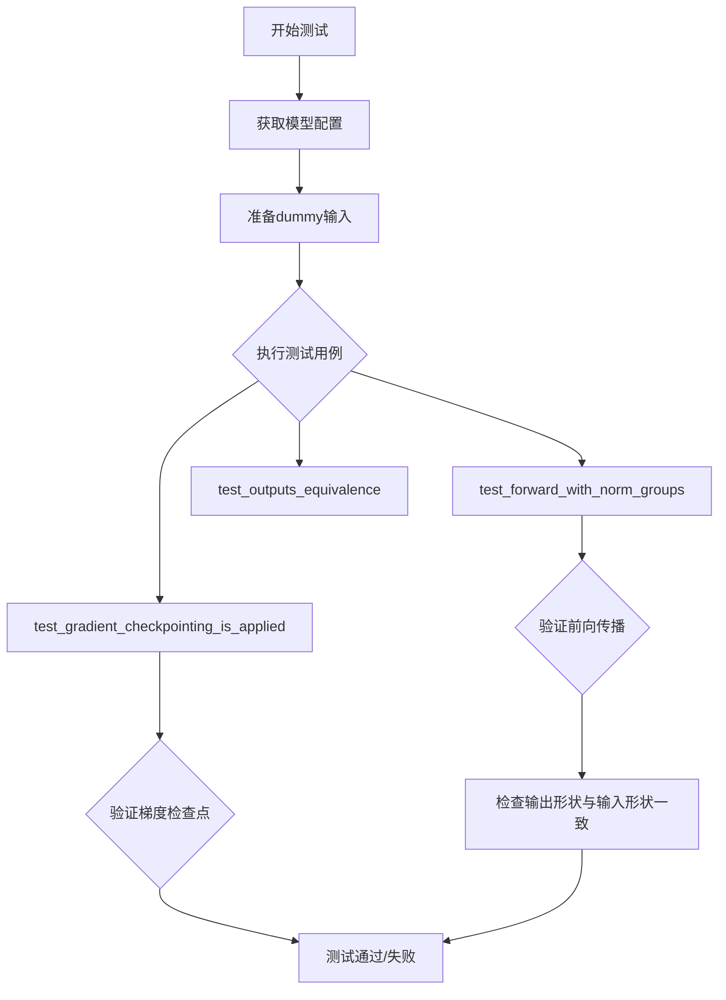
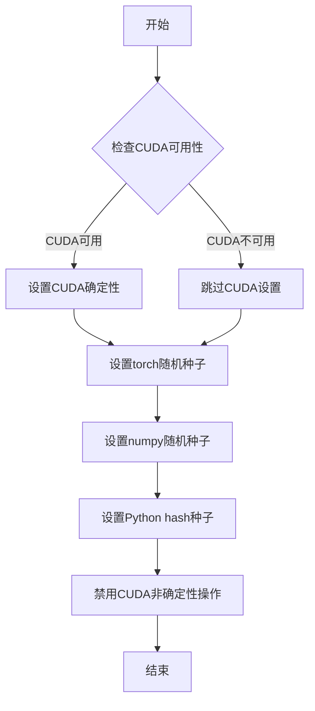
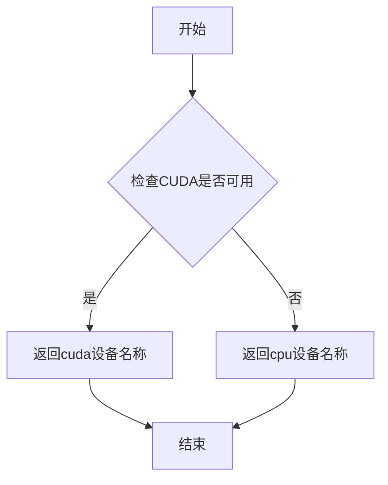
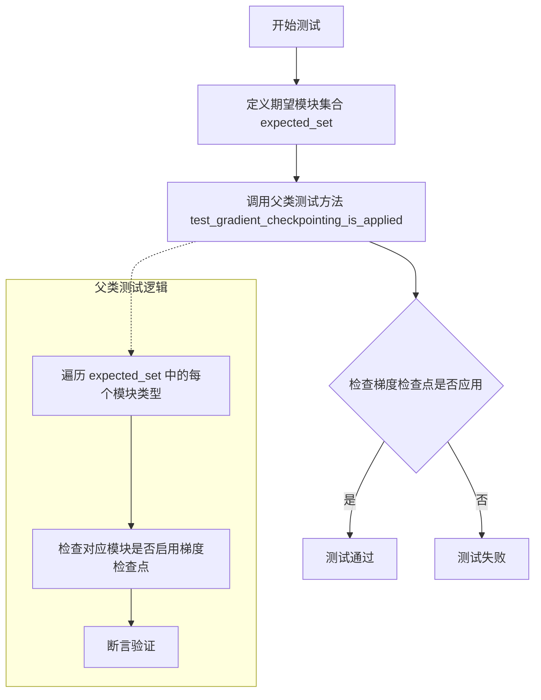
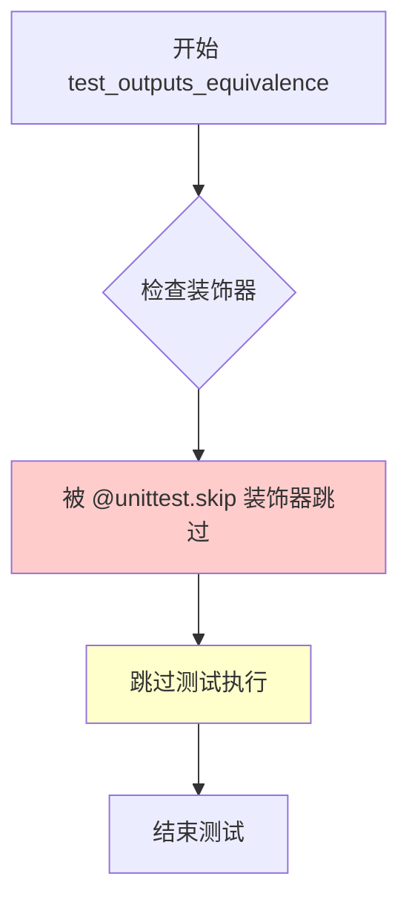

# `diffusers\tests\models\autoencoders\test_models_autoencoder_kl_cogvideox.py` 详细设计文档

该代码是针对diffusers库中AutoencoderKLCogVideoX（视频生成模型的变分自编码器）的单元测试类，提供了模型配置获取、输入输出形状定义、前向传播验证、梯度检查点测试等功能，用于确保CogVideoX模型的VAE组件在不同配置下能正确运行。

## 整体流程



## 类结构

```
unittest.TestCase
├── ModelTesterMixin
├── AutoencoderTesterMixin
└── AutoencoderKLCogVideoXTests (测试类)
```

## 全局变量及字段


### `enable_full_determinism`
    
启用完全确定性测试的全局配置函数

类型：`function`
    


### `AutoencoderKLCogVideoXTests.model_class`
    
被测试的CogVideoX变分自编码器模型类

类型：`AutoencoderKLCogVideoX`
    


### `AutoencoderKLCogVideoXTests.main_input_name`
    
模型主输入名称，用于指定输入张量的键名

类型：`str`
    


### `AutoencoderKLCogVideoXTests.base_precision`
    
基础精度阈值，用于数值比较的容差标准

类型：`float`
    
    

## 全局函数及方法


### `enable_full_determinism`

设置随机种子以确保测试可复现，通过配置PyTorch和其他库的随机性实现完全确定性执行。

参数：
- 该函数无显式参数（通过环境变量或配置生效）

返回值：`None`，无返回值，仅执行副作用

#### 流程图



#### 带注释源码

```
# 注意：以下为基于代码上下文和diffusers库惯例推断的源码
# 实际定义位于 testing_utils 模块中

def enable_full_determinism(seed: int = 42, verbose: bool = True):
    """
    启用完全确定性模式，确保测试可复现
    
    参数:
        seed: int, 随机种子默认值42
        verbose: bool, 是否打印确定性配置信息
    
    返回:
        None
    
    实现逻辑:
        1. 设置torch.manual_seed确保PyTorch张量生成可复现
        2. 设置numpy.random.seed确保NumPy数组生成可复现
        3. 设置PYTHONHASHSEED确保Python内置随机函数可复现
        4. 设置torch.backends.cudnn.deterministic = True
        5. 设置torch.backends.cudnn.benchmark = False
        6. 设置torch.use_deterministic_algorithms(True) if available
    """
    # 导入必要模块
    import os
    import random
    import numpy as np
    
    # 设置环境变量确保Python内置随机函数可复现
    os.environ['PYTHONHASHSEED'] = str(seed)
    
    # 设置Python内置random模块种子
    random.seed(seed)
    
    # 设置NumPy随机种子
    np.random.seed(seed)
    
    # 设置PyTorch随机种子
    torch.manual_seed(seed)
    
    # 如果CUDA可用，也设置CUDA种子
    if torch.cuda.is_available():
        torch.cuda.manual_seed_all(seed)
    
    # 启用CUDA确定性模式（确保相同输入产生相同输出）
    torch.backends.cudnn.deterministic = True
    torch.backends.cudnn.benchmark = False
    
    # 尝试使用PyTorch确定性算法（如果版本支持）
    if hasattr(torch, 'use_deterministic_algorithms'):
        try:
            torch.use_deterministic_algorithms(True)
        except Exception:
            # 某些操作可能不支持确定性实现
            pass
    
    if verbose:
        print(f"Full determinism enabled with seed: {seed}")
```

#### 备注

该函数在测试文件开头被直接调用（无参数），表明使用了默认配置：
```python
enable_full_determinism()  # 行39，无参数调用
```

这意味着：
- 使用默认随机种子（通常为42）
- 默认启用详细输出
- 通过此调用，后续所有随机操作将产生确定可复现的结果，确保自动化测试的一致性


# floats_tensor 函数详细设计文档

### `floats_tensor`

该函数用于生成指定形状的随机浮点数张量（PyTorch Tensor），常用于深度学习测试中模拟输入数据。

## 注意事项

**⚠️ 重要提示**：当前提供的代码片段中并未包含 `floats_tensor` 函数的实际实现源码。该函数是从 `...testing_utils` 模块导入的，上述代码仅展示了该函数的使用方式。

---

## 参数：

-  `shape`：`tuple`，指定生成张量的形状，格式为 (batch_size, channels, frames, height, width) 或类似的维度组合

## 返回值：`torch.Tensor`，返回指定形状的随机浮点数张量

---

## 使用示例分析

从代码中的调用方式推断函数用法：

```python
image = floats_tensor((batch_size, num_channels, num_frames) + sizes).to(torch_device)
```

其中：
- `batch_size = 4`
- `num_channels = 3`
- `num_frames = 8`
- `sizes = (16, 16)`

因此实际调用为：
```python
floats_tensor((4, 3, 8, 16, 16))
```

---

#### 带注释源码

```
# 源码不可用 - 函数定义位于 testing_utils 模块中，未在当前代码段实现
# 以下为基于使用方式的推断：

def floats_tensor(shape: tuple) -> torch.Tensor:
    """
    生成指定形状的随机浮点数张量。
    
    参数:
        shape: 张量的形状元组
        
    返回:
        随机浮点数张量，数值范围通常在 [-1, 1] 或 [0, 1] 之间
    """
    # 推断实现可能类似：
    # return torch.randn(*shape)  # 标准正态分布
    # 或
    # return torch.rand(*shape)  # [0, 1) 均匀分布
```

---

## 补充说明

由于源代码未直接提供，`floats_tensor` 函数的完整实现需要查阅 `testing_utils` 模块的源代码文件。该函数通常用于：

1. **测试数据生成**：为模型测试生成随机输入
2. **单元测试**：确保模型在随机输入下能正常运行
3. **形状验证**：验证模型输出与输入形状匹配

如需获取完整源码，建议查找项目中 `testing_utils.py` 或类似文件中的 `floats_tensor` 函数定义。


### `torch_device`

`torch_device` 是一个从 `testing_utils` 模块导入的全局变量，用于获取测试过程中 PyTorch 计算设备的名称（通常为 "cuda" 或 "cpu"）。

参数： 无（全局变量，不接受参数）

返回值：`str`，返回 PyTorch 设备的字符串标识符（如 "cuda"、"cuda:0" 或 "cpu"）

#### 流程图



#### 带注释源码

```
# 从 testing_utils 模块导入的全局变量
# 该变量在 testing_utils 模块中定义，通常是一个字符串
# 用于指定 PyTorch 操作所使用的设备

# 使用示例（在当前代码中）:
image = floats_tensor((batch_size, num_channels, num_frames) + sizes).to(torch_device)
# 上述代码将创建的浮点张量移动到 torch_device 指定的设备上

# torch_device 的典型定义（在 testing_utils 中）:
# torch_device = "cuda" if torch.cuda.is_available() else "cpu"
```


### `AutoencoderKLCogVideoXTests.get_autoencoder_kl_cogvideox_config`

该方法用于获取 CogVideoX VAE（变分自编码器）模型的测试配置参数，返回一个包含模型架构细节的字典，包括输入输出通道数、上下采样块类型、块输出通道数、潜在通道数、每块层数、归一化组数和时间压缩比等关键配置信息。

参数：

- （无参数）

返回值：`dict`，返回包含 CogVideoX VAE 模型配置的字典，涵盖 in_channels（输入通道数）、out_channels（输出通道数）、down_block_types（下采样块类型）、up_block_types（上采样块类型）、block_out_channels（块输出通道数）、latent_channels（潜在空间通道数）、layers_per_block（每块层数）、norm_num_groups（归一化组数）和 temporal_compression_ratio（时间压缩比）等配置项。

#### 流程图

```mermaid
flowchart TD
    A[开始 get_autoencoder_kl_cogvideox_config] --> B[创建配置字典]
    B --> C{返回配置字典}
    C --> D[配置包含: in_channels=3, out_channels=3]
    D --> E[配置包含: down_block_types=CogVideoXDownBlock3D x4]
    E --> F[配置包含: up_block_types=CogVideoXUpBlock3D x4]
    F --> G[配置包含: block_out_channels=(8,8,8,8)]
    G --> H[配置包含: latent_channels=4, layers_per_block=1]
    H --> I[配置包含: norm_num_groups=2, temporal_compression_ratio=4]
    I --> J[结束 - 返回配置字典]
```

#### 带注释源码

```python
def get_autoencoder_kl_cogvideox_config(self):
    """
    获取 CogVideoX VAE 模型的测试配置参数。
    
    该配置用于初始化 AutoencoderKLCogVideoX 模型进行单元测试，
    包含了模型的关键架构参数和超参数设置。
    
    Returns:
        dict: 包含模型配置的字典，包括：
            - in_channels: 输入图像通道数（3表示RGB）
            - out_channels: 输出图像通道数
            - down_block_types: 3D下采样块类型列表
            - up_block_types: 3D上采样块类型列表
            - block_out_channels: 每个块的输出通道数元组
            - latent_channels: 潜在空间的通道数
            - layers_per_block: 每个块中的层数
            - norm_num_groups: 归一化组数
            - temporal_compression_ratio: 时间维度压缩比
    """
    return {
        "in_channels": 3,  # 输入通道数，3表示RGB图像
        "out_channels": 3,  # 输出通道数，保持与输入一致
        "down_block_types": (  # 3D下采样块类型，包含4个串联的下采样块
            "CogVideoXDownBlock3D",
            "CogVideoXDownBlock3D",
            "CogVideoXDownBlock3D",
            "CogVideoXDownBlock3D",
        ),
        "up_block_types": (  # 3D上采样块类型，包含4个串联的上采样块
            "CogVideoXUpBlock3D",
            "CogVideoXUpBlock3D",
            "CogVideoXUpBlock3D",
            "CogVideoXUpBlock3D",
        ),
        "block_out_channels": (8, 8, 8, 8),  # 每个块的输出通道数，均为8
        "latent_channels": 4,  # 潜在空间通道数，用于VAE的编码/解码
        "layers_per_block": 1,  # 每个块中包含的层数
        "norm_num_groups": 2,  # 归一化组数，用于GroupNorm
        "temporal_compression_ratio": 4,  # 时间维度压缩比，用于视频处理
    }
```


### `AutoencoderKLCogVideoXTests.dummy_input`

该属性用于生成虚拟输入张量，模拟 AutoencoderKLCogVideoX 模型的测试输入数据。它创建包含视频帧的随机浮点张量（batch_size=4, num_frames=8, num_channels=3, 空间分辨率 16x16），并以字典形式返回，其中键为 "sample"，值为生成的图像张量。

参数：

- 无参数（这是一个 `@property` 装饰器方法）

返回值：`dict`，返回包含虚拟输入张量的字典，格式为 `{"sample": torch.Tensor}`，其中张量形状为 `(4, 3, 8, 16, 16)`

#### 流程图

```mermaid
flowchart TD
    A[开始 dummy_input 属性] --> B[设置批次大小 batch_size = 4]
    B --> C[设置帧数 num_frames = 8]
    C --> D[设置通道数 num_channels = 3]
    D --> E[设置空间尺寸 sizes = (16, 16)]
    E --> F[调用 floats_tensor 生成随机浮点张量]
    F --> G[形状计算: (4, 3, 8) + (16, 16) = (4, 3, 8, 16, 16)]
    G --> H[将张量移动到测试设备 torch_device]
    H --> I[构建返回字典 {'sample': image}]
    I --> J[返回字典]
```

#### 带注释源码

```python
@property
def dummy_input(self):
    """
    生成虚拟输入张量，用于 AutoencoderKLCogVideoX 模型的测试。
    
    该属性创建一个模拟视频输入的随机张量，包含以下维度:
    - batch_size: 4 (批次大小)
    - num_frames: 8 (视频帧数)
    - num_channels: 3 (RGB 通道)
    - sizes: (16, 16) (空间分辨率 Height x Width)
    
    Returns:
        dict: 包含 'sample' 键的字典，值为 torch.Tensor 张量
              形状为 (batch_size, num_channels, num_frames, height, width)
              即 (4, 3, 8, 16, 16)
    """
    # 设置批次大小
    batch_size = 4
    # 设置视频帧数
    num_frames = 8
    # 设置图像通道数 (RGB)
    num_channels = 3
    # 设置空间尺寸 (高度, 宽度)
    sizes = (16, 16)

    # 使用测试工具函数生成随机浮点数张量
    # 形状: (batch_size, num_channels, num_frames) + sizes
    # 即: (4, 3, 8, 16, 16)
    image = floats_tensor((batch_size, num_channels, num_frames) + sizes).to(torch_device)

    # 返回符合模型输入格式的字典
    # 模型期望输入格式: {"sample": tensor}
    return {"sample": image}
```


### `AutoencoderKLCogVideoXTests.input_shape`

该属性用于返回 AutoencoderKLCogVideoX 模型测试的输入形状元组，定义了测试用例所期望的输入数据的维度顺序（通道数、时间帧数、高度、宽度）。

参数： 无

返回值：`Tuple[int, int, int, int]`，返回输入形状元组 (3, 8, 16, 16)，分别表示通道数为 3、时间帧数为 8、高度为 16、宽度为 16

#### 流程图

```mermaid
flowchart TD
    A[访问 input_shape 属性] --> B{检查调用方式}
    B -->|作为属性访问| C[返回元组 (3, 8, 16, 16)]
    C --> D[结束]
    
    style A fill:#e1f5fe
    style C fill:#c8e6c9
    style D fill:#ffcdd2
```

#### 带注释源码

```python
@property
def input_shape(self):
    """
    返回测试用例的输入形状元组。
    
    该属性定义了 AutoencoderKLCogVideoX 模型测试所期望的输入维度。
    形状格式为 (channels, frames, height, width)，与视频数据的标准格式一致。
    
    返回:
        Tuple[int, int, int, int]: 包含4个元素的元组
            - 通道数 (channels): 3，对应RGB三通道
            - 时间帧数 (frames): 8，表示8帧连续视频
            - 高度 (height): 16，特征图高度
            - 宽度 (width): 16，特征图宽度
    """
    return (3, 8, 16, 16)
```


### `AutoencoderKLCogVideoXTests.output_shape`

该属性方法返回 AutoencoderKLCogVideoX 模型在测试阶段的预期输出形状元组，用于验证模型输出维度是否与输入维度匹配。

参数：

- （无参数）

返回值：`tuple`，返回表示输出形状的元组 `(3, 8, 16, 16)`，其中 3 为通道数，8 为帧数，16x16 为空间分辨率。

#### 流程图

```mermaid
flowchart TD
    A[访问 output_shape 属性] --> B{返回形状元组}
    B --> C[返回 (3, 8, 16, 16)]
    C --> D[用于测试断言: 验证模型输出形状与输入形状匹配]
```

#### 带注释源码

```python
@property
def output_shape(self):
    """
    返回测试用例的预期输出形状。
    
    该属性定义了在测试过程中，AutoencoderKLCogVideoX 模型
    经过编码和解码后应当输出的张量维度。
    形状为 (通道数, 帧数, 高度, 宽度) = (3, 8, 16, 16)。
    
    Returns:
        tuple: 一个包含4个维度的元组 (C, T, H, W)
               - C=3: 通道数（RGB图像）
               - T=8: 时间帧数（视频帧数）
               - H=16: 高度像素
               - W=16: 宽度像素
    """
    return (3, 8, 16, 16)
```


### `AutoencoderKLCogVideoXTests.prepare_init_args_and_inputs_for_common`

准备AutoencoderKLCogVideoX模型测试所需的初始化参数字典和输入字典，为通用测试提供必要的测试数据。

参数：
- 无显式参数（仅使用 `self` 隐式参数）

返回值：`Tuple[dict, dict]`，返回一个元组，包含初始化参数字典（init_dict）和输入字典（inputs_dict）

#### 流程图

```mermaid
flowchart TD
    A[开始] --> B[调用 get_autoencoder_kl_cogvideox_config]
    B --> C[获取初始化参数字典 init_dict]
    D[获取 dummy_input 属性] --> E[获取输入字典 inputs_dict]
    C --> F[返回元组 (init_dict, inputs_dict)]
    E --> F
```

#### 带注释源码

```python
def prepare_init_args_and_inputs_for_common(self):
    """
    准备AutoencoderKLCogVideoX模型测试所需的初始化参数和输入数据。
    
    此方法为通用测试用例提供必要的初始化配置和输入样本，
    使得测试框架可以统一初始化模型并进行前向传播测试。
    
    Returns:
        Tuple[dict, dict]: 包含以下两个元素的元组:
            - init_dict: 模型初始化参数字典，包含模型架构配置
            - inputs_dict: 模型输入字典，包含测试用的sample张量
    """
    # 获取AutoencoderKLCogVideoX的默认配置参数
    # 包含: in_channels, out_channels, block类型, 输出通道数等
    init_dict = self.get_autoencoder_kl_cogvideox_config()
    
    # 获取测试用的虚拟输入数据
    # 格式: {"sample": torch.Tensor}，维度为 (batch_size, channels, frames, height, width)
    inputs_dict = self.dummy_input
    
    # 返回配置和输入，供测试框架使用
    return init_dict, inputs_dict
```


### `AutoencoderKLCogVideoXTests.test_gradient_checkpointing_is_applied`

测试梯度检查点是否被正确应用到 AutoencoderKLCogVideoX 模型的相关模块中。该测试通过检查模型的前向传播是否包含指定的 CogVideoX 模块（编码器、解码器、上采样块、下采样块和中采样块）的梯度检查点配置。

参数：

- `expected_set`：`Set[str]`，期望应用梯度检查点的模块名称集合，包含 "CogVideoXDownBlock3D"、"CogVideoXDecoder3D"、"CogVideoXEncoder3D"、"CogVideoXUpBlock3D"、"CogVideoXMidBlock3D"

返回值：`None`，无返回值（通过 unittest 断言进行验证）

#### 流程图



#### 带注释源码

```python
def test_gradient_checkpointing_is_applied(self):
    """
    测试梯度检查点是否被正确应用到 AutoencoderKLCogVideoX 模型的特定模块上。
    
    该测试方法验证 CogVideoX 相关的模块（编码器、解码器、上/下采样块、中间块）
    是否正确配置了梯度检查点以节省显存。
    """
    # 定义期望应用梯度检查点的模块类型集合
    expected_set = {
        "CogVideoXDownBlock3D",   # 3D 下采样块
        "CogVideoXDecoder3D",     # 3D 解码器
        "CogVideoXEncoder3D",     # 3D 编码器
        "CogVideoXUpBlock3D",     # 3D 上采样块
        "CogVideoXMidBlock3D",    # 3D 中间块
    }
    
    # 调用父类的测试方法，传入期望的模块集合
    # 父类 test_gradient_checkpointing_is_applied 方法会：
    # 1. 加载模型配置
    # 2. 启用梯度检查点（如果支持）
    # 3. 执行前向传播
    # 4. 验证梯度检查点是否在指定的模块上生效
    super().test_gradient_checkpointing_is_applied(expected_set=expected_set)
```


### `AutoencoderKLCogVideoXTests.test_forward_with_norm_groups`

测试带 `norm_groups` 参数的前向传播功能，验证模型在自定义 `norm_num_groups` 配置下能否正确处理视频数据的编码和解码，并确保输出形状与输入形状一致。

参数：

- `self`：无显式参数，继承自 `unittest.TestCase`

返回值：`None`，该方法为测试方法，通过 `assert` 语句验证模型输出的有效性

#### 流程图

```mermaid
flowchart TD
    A[开始测试] --> B[获取初始化参数和输入字典]
    B --> C[设置 norm_num_groups=16]
    C --> D[设置 block_out_channels=(16, 32, 32, 32)]
    D --> E[使用配置创建 AutoencoderKLCogVideoX 模型实例]
    E --> F[将模型移动到 torch_device]
    F --> G[设置模型为 eval 模式]
    G --> H[使用 torch.no_grad 执行前向传播]
    H --> I{输出是否为 dict 类型?}
    I -->|是| J[提取 tuple 的第一个元素]
    I -->|否| K[直接使用输出]
    J --> L
    K --> L[验证输出不为 None]
    L --> M[验证输出形状与输入形状一致]
    M --> N[测试通过]
```

#### 带注释源码

```python
def test_forward_with_norm_groups(self):
    """
    测试带自定义 norm_num_groups 的前向传播功能。
    验证模型在非默认 norm_num_groups 配置下能够正确运行。
    """
    # 步骤1: 获取基类提供的初始化参数和输入字典
    init_dict, inputs_dict = self.prepare_init_args_and_inputs_for_common()

    # 步骤2: 设置自定义的 norm_num_groups 参数（默认值为2，这里测试16）
    init_dict["norm_num_groups"] = 16
    # 步骤3: 设置自定义的 block_out_channels 配置
    init_dict["block_out_channels"] = (16, 32, 32, 32)

    # 步骤4: 使用修改后的配置创建模型实例
    model = self.model_class(**init_dict)
    # 步骤5: 将模型移动到指定的计算设备（CPU/CUDA）
    model.to(torch_device)
    # 步骤6: 设置模型为评估模式（禁用 dropout 等训练特定操作）
    model.eval()

    # 步骤7: 执行前向传播（禁用梯度计算以节省内存）
    with torch.no_grad():
        # 将输入传递给模型，获取输出
        output = model(**inputs_dict)

        # 步骤8: 处理模型输出（可能返回 dict 或 tensor）
        if isinstance(output, dict):
            # 如果是字典格式，转换为 tuple 并取第一个元素
            output = output.to_tuple()[0]

    # 步骤9: 验证模型输出不为空
    self.assertIsNotNone(output)
    # 步骤10: 验证输出形状与输入形状完全匹配
    expected_shape = inputs_dict["sample"].shape
    self.assertEqual(output.shape, expected_shape, "Input and output shapes do not match")
```


### `AutoencoderKLCogVideoXTests.test_outputs_equivalence`

该测试方法用于验证模型输出的等价性，但由于不支持已被跳过，实际不执行任何验证逻辑。

参数：
- 无参数

返回值：`None`，无返回值（方法体为 `pass`）

#### 流程图



#### 带注释源码

```python
@unittest.skip("Unsupported test.")
def test_outputs_equivalence(self):
    """
    测试输出等价性。
    
    该测试方法旨在验证AutoencoderKLCogVideoX模型的前向传播输出是否与
    基准实现等价，但由于当前实现不支持此测试，已被跳过。
    
    测试被跳过的原因可能是：
    1. 模型实现与基准实现的数值精度存在差异
    2. 缺乏合适的基准模型进行对比
    3. 测试资源需求过高
    """
    pass
```

## 关键组件


### AutoencoderKLCogVideoX 模型类

CogVideoX 的变分自编码器（VAE）模型，用于视频的编码和解码，将视频帧压缩到潜在空间并从潜在表示重建视频。

### 测试配置 (get_autoencoder_kl_cogvideox_config)

定义了模型的关键配置参数，包括输入/输出通道数、下采样/上采样块类型、块输出通道数、潜在通道数、每块层数、归一化组数和时间压缩比。

### 虚拟输入生成 (dummy_input)

使用 floats_tensor 生成随机的浮点张量作为测试输入，包含批次大小为4、8帧、3通道、16x16分辨率的视频输入。

### 梯度检查点测试 (test_gradient_checkpointing_is_applied)

验证 CogVideoX 的各个组件（CogVideoXDownBlock3D、CogVideoXDecoder3D、CogVideoXEncoder3D、CogVideoXUpBlock3D、CogVideoXMidBlock3D）是否正确应用了梯度检查点以节省显存。

### 归一化组前向传播测试 (test_forward_with_norm_groups)

测试当 norm_num_groups 设置为16且块输出通道为(16, 32, 32, 32)时模型的前向传播，验证输入输出形状匹配。

### 测试混入 (ModelTesterMixin, AutoencoderTesterMixin)

提供通用模型测试方法的混入类，包含模型初始化、参数一致性、梯度计算等多种测试功能。

### 跳过测试 (test_outputs_equivalence)

输出等效性测试被标记为跳过，原因是当前不支持该测试场景。


## 问题及建议


### 已知问题

- **跳过的测试**：test_outputs_equivalence 被直接跳过并标记为 "Unsupported test"，表明存在已知的输出等价性问题未解决
- **硬编码配置**：配置参数（in_channels、out_channels、block_out_channels 等）全部硬编码在 get_autoencoder_kl_cogvideox_config 方法中，缺乏灵活性，无法测试不同配置组合
- **测试断言不足**：仅验证输出非空和形状匹配，缺少对数值范围、数值稳定性、梯度存在性等更深入的验证
- **缺乏边界测试**：未覆盖不同 batch_size、不同帧数、不同分辨率的边界情况测试
- **测试隔离性不足**：缺少显式的 tearDown 方法清理 GPU 内存，测试用例之间可能存在资源泄漏风险

### 优化建议

- 使用 pytest 参数化或添加多个测试方法，覆盖不同的配置组合（如不同的 block_out_channels、layers_per_block 等）
- 添加数值稳定性测试：验证输出值是否在合理范围内、检查 NaN/Inf 值、验证梯度计算是否正确
- 添加模型性能基准测试：测量推理时间、内存占用等关键指标
- 实现 tearDown 方法确保 GPU 内存释放，添加 @torch.cuda.empty_cache() 清理
- 考虑添加模型保存/加载测试，验证序列化/反序列化过程的正确性
- 补充更详细的测试文档，说明每个测试的意图和预期行为

## 其它


### 设计目标与约束

本测试文件的设计目标是验证 CogVideoX 系列的 AutoencoderKLCogVideoX 模型在变分自编码器（VAE）功能上的正确性，确保模型能够正确处理视频数据并进行 latent 空间的压缩与重建。主要约束包括：依赖 PyTorch 框架和 diffusers 库；测试必须在 CUDA 可用时使用 torch_device；测试精度基准为 1e-2；需要兼容 ModelTesterMixin 和 AutoencoderTesterMixin 提供的通用测试接口。

### 错误处理与异常设计

测试文件中通过 unittest 框架进行错误捕获与报告。使用 `@unittest.skip` 装饰器跳过不支持的测试用例（如 test_outputs_equivalence）。当模型输出形状与输入形状不匹配时，assert 语句会抛出 AssertionError 并附带详细错误信息。测试过程中使用 `torch.no_grad()` 避免梯度计算导致的内存问题。

### 数据流与状态机

测试数据流从 dummy_input 属性开始，生成形状为 (batch_size, num_channels, num_frames, height, width) = (4, 3, 8, 16, 16) 的随机浮点张量。该输入通过 model(**inputs_dict) 传递给模型，模型执行编码-潜在空间压缩-解码流程，最终输出重建后的张量。测试验证输入输出形状一致性，确保数据在处理过程中维度保持不变（因为 latent_channels=4 但通过配置使其不影响最终输出形状）。

### 外部依赖与接口契约

本测试文件依赖以下外部组件：1) unittest 标准库作为测试框架；2) torch 提供张量操作和设备管理；3) diffusers 库的 AutoencoderKLCogVideoX 作为被测模型类；4) testing_utils 模块提供 enable_full_determinism、floats_tensor、torch_device 等测试工具函数；5) test_modeling_common 和 testing_utils 中的 AutoencoderTesterMixin 提供通用测试方法。接口契约要求被测模型必须实现 forward() 方法并返回张量或包含 to_tuple() 方法的对象。

### 安全考虑

代码中不涉及用户数据处理或敏感信息。所有测试使用程序生成的随机张量。未发现潜在的安全漏洞。代码遵循 Apache License 2.0 开源协议。

### 性能考虑

测试使用较小的模型配置（block_out_channels=(8,8,8,8), latent_channels=4）以加快测试执行速度。使用 torch.no_grad() 上下文管理器禁用梯度计算，减少内存占用和计算时间。测试设计为可在 CPU 和 GPU 上运行，通过 torch_device 动态选择设备。

### 配置管理

模型配置通过 get_autoencoder_kl_cogvideox_config() 方法集中管理，包含以下可配置参数：in_channels/out_channels（通道数）、down_block_types/up_block_types（块类型）、block_out_channels（输出通道数）、latent_channels（潜在空间维度）、layers_per_block（每块层数）、norm_num_groups（归一化组数）、temporal_compression_ratio（时间压缩比）。测试支持修改这些配置以测试不同场景。

### 版本兼容性

代码使用 Python 3 编码（# coding=utf-8），兼容 Python 3.8+。依赖的 diffusers 库版本需要支持 CogVideoX 系列模型。测试框架依赖 unittest，为 Python 标准库无需额外安装。

### 测试覆盖范围

当前测试覆盖：1) 模型初始化配置验证；2) 前向传播正确性（test_forward_with_norm_groups）；3) 梯度检查点功能验证（test_gradient_checkpointing_is_applied）；4) 形状一致性验证。未覆盖：模型输出等价性测试（已跳过）、边界条件测试、长时间序列处理测试、定量精度测试。

### 潜在的技术债务或优化空间

1. test_outputs_equivalence 测试被跳过，应该实现或移除；2. 缺少对 latent 空间中实际压缩效果的验证，仅检查形状一致性；3. 测试配置过于简单（block_out_channels=8），未覆盖实际使用场景；4. 缺少性能基准测试（如推理速度、内存占用）；5. 缺少对模型在不同输入尺寸下的鲁棒性测试；6. 测试用例数量较少，可增加边界条件测试。

    