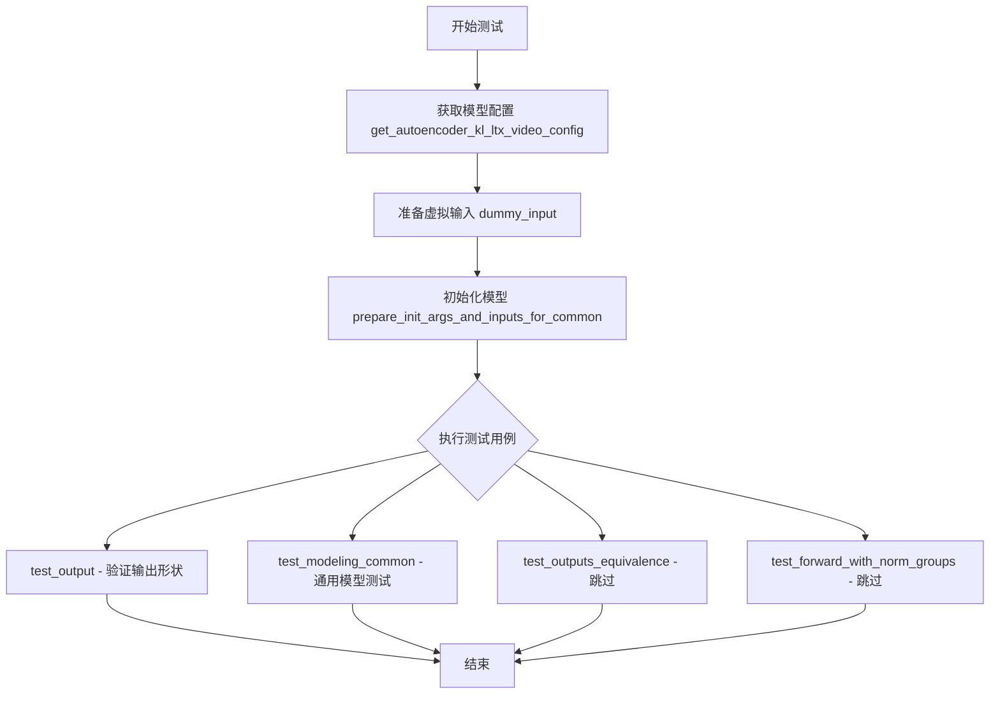
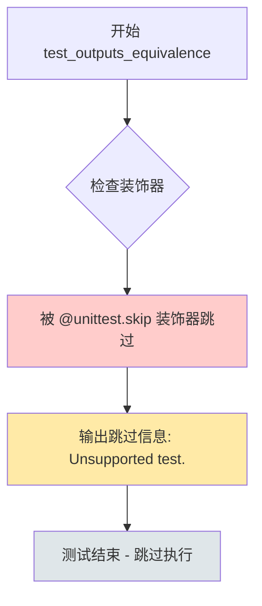
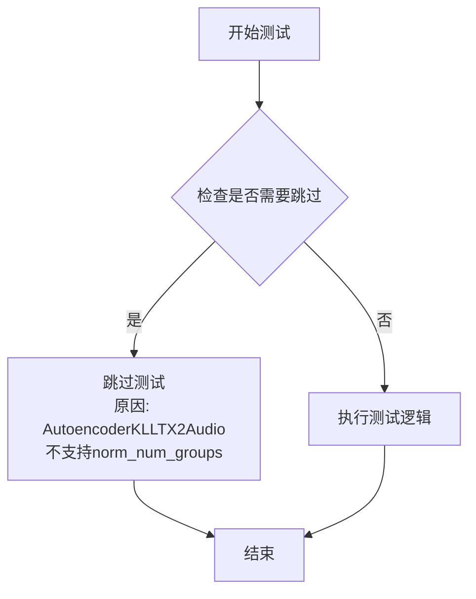

# `diffusers\tests\models\autoencoders\test_models_autoencoder_kl_ltx2_audio.py` 详细设计文档

这是一个用于测试diffusers库中AutoencoderKLLTX2Audio音频变分自编码器模型的单元测试文件，继承自ModelTesterMixin和AutoencoderTesterMixin，提供了模型配置验证、初始化参数检查、前向传播测试等功能。

## 整体流程



## 类结构

```
unittest.TestCase
├── ModelTesterMixin (混入)
└── AutoencoderTesterMixin (混入)
    └── AutoencoderKLLTX2AudioTests
```

## 全局变量及字段


### `AutoencoderKLLTX2AudioTests.model_class`
    
模型类引用，指向被测试的AutoencoderKLLTX2Audio类

类型：`type`
    


### `AutoencoderKLLTX2AudioTests.main_input_name`
    
主输入名称，指定模型的主要输入参数名为sample

类型：`str`
    


### `AutoencoderKLLTX2AudioTests.base_precision`
    
基础精度，用于测试输出与预期结果比较的精度阈值，值为1e-2

类型：`float`
    
    

## 全局函数及方法


### `AutoencoderKLLTX2AudioTests.get_autoencoder_kl_ltx_video_config`

获取 AutoencoderKLLTX2Audio 模型的测试配置参数，用于初始化模型实例和准备测试输入数据。

参数：

- （无参数）

返回值：`Dict`，返回一个包含 AutoencoderKLLTX2Audio 模型配置参数的字典，涵盖模型结构、音频处理和潜在空间等关键配置。

#### 流程图

```mermaid
flowchart TD
    A[开始] --> B[定义配置字典]
    B --> C[设置输入输出通道: in_channels=2, output_channels=2]
    C --> D[设置潜在空间: latent_channels=4, base_channels=16, ch_mult=(1,2,4)]
    D --> E[设置网络结构: resolution=16, num_res_blocks=2, norm_type='pixel']
    E --> F[设置音频处理: sample_rate=16000, mel_hop_length=160, mel_bins=16]
    F --> G[设置因果性: causality_axis='height', is_causal=True, double_z=True]
    G --> H[返回配置字典]
    H --> I[结束]
```

#### 带注释源码

```python
def get_autoencoder_kl_ltx_video_config(self):
    """
    获取 AutoencoderKLLTX2Audio 模型的测试配置参数
    
    Returns:
        dict: 包含模型配置参数的字典，用于初始化模型和测试
    """
    return {
        "in_channels": 2,           # 输入通道数，2 表示立体声
        "output_channels": 2,      # 输出通道数，2 表示立体声
        "latent_channels": 4,       # 潜在空间通道数，用于 VAE 编码/解码
        "base_channels": 16,       # 基础通道数，U-Net 架构的起始通道数
        "ch_mult": (1, 2, 4),      # 通道乘法器，定义每层通道数的缩放比例
        "resolution": 16,          # 输入分辨率
        "attn_resolutions": None,  # 注意力分辨率，None 表示不使用注意力
        "num_res_blocks": 2,       # 每个分辨率层的残差块数量
        "norm_type": "pixel",      # 归一化类型，pixel 表示像素级归一化
        "causality_axis": "height",# 因果性轴，用于时序建模
        "mid_block_add_attention": False,  # 中间块是否添加注意力层
        "sample_rate": 16000,      # 音频采样率 (Hz)
        "mel_hop_length": 160,     # Mel 频谱的跳帧长度
        "mel_bins": 16,            # Mel 频谱的频率_bins数量
        "is_causal": True,         # 是否使用因果卷积
        "double_z": True,          # 是否使用双潜在变量 (VAE 默认行为)
    }
```


### `AutoencoderKLLTX2AudioTests.dummy_input`

这是一个测试用的虚拟输入属性，用于为 AutoencoderKLLTX2Audio 模型生成符合预期输入格式的假数据（dummy data）。该属性返回一个包含 `sample` 键的字典，其中 `sample` 是一个形状为 `(batch_size, num_channels, num_frames, num_mel_bins)` 的浮点张量，模拟音频频谱图输入。

参数：
- （无参数，这是一个 `@property` 装饰的属性）

返回值：`dict`，返回包含 "sample" 键的字典，值为 `torch.Tensor` 类型的频谱图数据，用于模型测试的输入。

#### 流程图

```mermaid
flowchart TD
    A[开始 dummy_input 属性访问] --> B[设置 batch_size = 2]
    B --> C[设置 num_channels = 2]
    C --> D[设置 num_frames = 8]
    D --> E[设置 num_mel_bins = 16]
    E --> F[调用 floats_tensor 创建形状为<br/>(2, 2, 8, 16) 的随机浮点张量]
    F --> G[将张量移动到 torch_device]
    G --> H[创建 input_dict 字典<br/>{'sample': spectrogram}]
    H --> I[返回 input_dict]
```

#### 带注释源码

```python
@property
def dummy_input(self):
    """
    生成用于测试的虚拟输入数据。
    返回一个包含音频频谱图的字典，模拟模型的输入。
    """
    # 批次大小
    batch_size = 2
    # 音频通道数（立体声为2）
    num_channels = 2
    # 时间帧数
    num_frames = 8
    # 梅尔频谱 bins 数量
    num_mel_bins = 16

    # 使用测试工具函数生成指定形状的随机浮点张量
    # 形状: (batch_size, num_channels, num_frames, num_mel_bins) = (2, 2, 8, 16)
    spectrogram = floats_tensor((batch_size, num_channels, num_frames, num_mel_bins)).to(torch_device)

    # 构建输入字典，键名为 'sample'（模型的主输入名称）
    input_dict = {"sample": spectrogram}
    
    # 返回输入字典供测试使用
    return input_dict
```


### `AutoencoderKLLTX2AudioTests.input_shape`

这是一个测试类属性，用于返回音频自编码器模型期望的输入形状元组，定义了测试时使用的输入张量维度。

参数：

- （无参数）

返回值：`tuple`，返回模型期望的输入形状 `(2, 5, 16)`，其中 2 表示批量大小，5 表示通道数，16 表示 MEL 频谱_bins 数。

#### 流程图

```mermaid
flowchart TD
    A[访问 input_shape 属性] --> B{执行属性 getter}
    B --> C[返回元组 (2, 5, 16)]
    C --> D[测试框架使用此形状验证模型输入/输出]
```

#### 带注释源码

```python
@property
def input_shape(self):
    """
    返回测试用的输入形状。
    
    该属性定义了 AutoencoderKLLTX2Audio 模型在测试阶段的期望输入形状。
    返回的元组 (2, 5, 16) 表示：
    - 2: 批量大小 (batch_size)
    - 5: 通道数或帧数 (channels/frames)  
    - 16: MEL 频谱 bins 数量 (mel_bins)
    
    Returns:
        tuple: 输入形状元组 (2, 5, 16)
    """
    return (2, 5, 16)
```


### `AutoencoderKLLTX2AudioTests.output_shape`

`output_shape` 是 `AutoencoderKLLTX2AudioTests` 测试类中的一个属性（property），用于定义模型输出的期望形状。该属性返回一个元组 `(2, 5, 16)`，表示测试用例中预期的输出张量维度。需要注意的是，`test_output` 方法覆盖了这个值，期望的实际输出形状为 `(2, 2, 5, 16)`，这反映了 LTX 2.0 音频 VAE 的输出通道数与输入通道数可能不同（输入为 2 通道，输出也为 2 通道，但形状维度有所变化）。

参数：

- （无参数，这是一个属性访问器）

返回值：`tuple`，返回期望的输出形状元组 `(2, 5, 16)`

#### 流程图

```mermaid
graph TD
    A[访问 output_shape 属性] --> B{执行 property getter}
    B --> C[返回元组 (2, 5, 16)]
    C --> D[测试用例使用此形状进行验证]
    
    style A fill:#f9f,stroke:#333
    style C fill:#9f9,stroke:#333
    style D fill:#ff9,stroke:#333
```

#### 带注释源码

```python
@property
def output_shape(self):
    """
    返回测试用例期望的输出形状。
    
    注意：此属性返回 (2, 5, 16)，但实际的 test_output 方法
    使用了覆盖的期望形状 (2, 2, 5, 16)，以反映音频 VAE 
    的实际输出维度。
    
    返回:
        tuple: 期望的输出形状元组 (batch_size, channels, time_frames)
               在此测试中为 (2, 5, 16)
    """
    return (2, 5, 16)
```


### `AutoencoderKLLTX2AudioTests.prepare_init_args_and_inputs_for_common`

准备 AutoencoderKL LTX 2.0 Audio 测试类的初始化参数字典和输入数据，用于通用模型测试。

参数：

- `self`：`AutoencoderKLLTX2AudioTests`，测试类实例本身

返回值：`Tuple[Dict, Dict]`，包含两个字典的元组

- `init_dict`：`Dict`，模型初始化参数字典，包含以下键值对：
  - `in_channels`: 2 (立体声)
  - `output_channels`: 2
  - `latent_channels`: 4
  - `base_channels`: 16
  - `ch_mult`: (1, 2, 4)
  - `resolution`: 16
  - `attn_resolutions`: None
  - `num_res_blocks`: 2
  - `norm_type`: "pixel"
  - `causality_axis`: "height"
  - `mid_block_add_attention`: False
  - `sample_rate`: 16000
  - `mel_hop_length`: 160
  - `mel_bins`: 16
  - `is_causal`: True
  - `double_z`: True

- `inputs_dict`：`Dict`，模型输入字典，包含键 `sample`，值为形状 (2, 2, 8, 16) 的浮点张量，代表 (batch_size, num_channels, num_frames, num_mel_bins)

#### 流程图

```mermaid
graph TD
    A[开始] --> B[调用 get_autoencoder_kl_ltx_video_config 获取配置]
    B --> C[调用 dummy_input 属性获取输入]
    C --> D[返回 (init_dict, inputs_dict) 元组]
```

#### 带注释源码

```python
def prepare_init_args_and_inputs_for_common(self):
    """
    准备初始化参数和输入数据，用于通用模型测试。
    
    该方法为测试框架提供必要的配置信息和输入数据，
    以支持 ModelTesterMixin 中的各种测试用例。
    """
    # 获取 AutoencoderKL LTX 2.0 Audio 的配置参数字典
    # 包含模型结构、音频处理、潜在空间等配置
    init_dict = self.get_autoencoder_kl_ltx_video_config()
    
    # 获取测试用的虚拟输入数据
    # 形状为 (batch_size=2, num_channels=2, num_frames=8, num_mel_bins=16)
    # 表示批次大小为2的立体声音频频谱图
    inputs_dict = self.dummy_input
    
    # 返回配置字典和输入字典的元组
    return init_dict, inputs_dict
```


### `AutoencoderKLLTX2AudioTests.test_output`

该测试方法验证 AutoencoderKLLTX2Audio 模型的输出形状是否符合预期，重写了基类方法以适应 LTX 2.0 音频 VAE 的输出形状与输入形状不同的特性。

参数：

- `self`：`AutoencoderKLLTX2AudioTests`，测试类实例本身
- `expected_output_shape`：`tuple`，隐式传递给父类方法，期望的输出形状为 `(2, 2, 5, 16)`

返回值：`None`，无返回值，这是 unittest 的测试方法

#### 流程图

```mermaid
flowchart TD
    A[开始 test_output 测试] --> B[调用 super().test_output]
    B --> C[传入期望输出形状 (2, 2, 5, 16)]
    C --> D[执行基类 ModelTesterMixin.test_output]
    D --> E{验证输出形状是否匹配}
    E -->|匹配| F[测试通过]
    E -->|不匹配| G[测试失败并抛出 AssertionError]
    F --> H[结束]
    G --> H
```

#### 带注释源码

```python
def test_output(self):
    """
    测试 AutoencoderKLLTX2Audio 模型的输出形状
    
    该方法重写了基类 test_output，因为 LTX 2.0 音频 VAE 的输出形状
    与输入形状不同（与图像/视频 VAE 不同的特性）
    """
    # 调用父类的 test_output 方法，传入期望的输出形状
    # 期望形状: (batch_size=2, channels=2, frames=5, mel_bins=16)
    super().test_output(expected_output_shape=(2, 2, 5, 16))
```


### `AutoencoderKLLTX2AudioTests.test_outputs_equivalence`

该测试方法用于验证 AutoencoderKLLTX2Audio 模型输出的等效性，确保模型在不同输入下产生一致的输出结果。当前该测试被标记为跳过，原因是"Unsupported test"（不支持的测试）。

参数：

- `self`：`AutoencoderKLLTX2AudioTests`，测试类实例本身，表示调用该方法的类实例

返回值：`None`，无返回值（方法体为 `pass`）

#### 流程图



#### 带注释源码

```python
@unittest.skip("Unsupported test.")
def test_outputs_equivalence(self):
    """
    测试方法：test_outputs_equivalence
    
    该方法用于验证模型输出的等效性（equivalence），即检查模型在相同输入
    下是否产生一致的输出。这是深度学习模型测试中常见的验证方式，确保模型
    的确定性和稳定性。
    
    当前状态：
    - 该测试被 @unittest.skip 装饰器跳过
    - 跳过原因："Unsupported test."（不支持的测试）
    - 方法体仅为 pass，不执行任何实际测试逻辑
    
    参数：
        self: AutoencoderKLLTX2AudioTests - 测试类实例
    
    返回值：
        None - 该方法不返回任何值
    """
    pass  # 空方法体，测试被跳过
```


### `AutoencoderKLLTX2AudioTests.test_forward_with_norm_groups`

该测试方法用于验证 AutoencoderKLLTX2Audio 模型在 norm_groups 参数下的前向传播能力，但由于 AutoencoderKLLTX2Audio 不使用 GroupNorm，因此该测试被跳过。

参数：

- `self`：`AutoencoderKLLTX2AudioTests`，表示测试类实例本身

返回值：`None`，无返回值（测试被跳过）

#### 流程图



#### 带注释源码

```python
@unittest.skip("AutoencoderKLLTX2Audio does not support `norm_num_groups` because it does not use GroupNorm.")
def test_forward_with_norm_groups(self):
    """
    测试方法：test_forward_with_norm_groups
    
    测试目标：
        验证 AutoencoderKLLTX2Audio 模型在使用 norm_groups 参数时的前向传播功能。
    
    跳过原因：
        AutoencoderKLLTX2Audio 实现中未使用 GroupNorm 归一化方式，
        因此不支持 norm_num_groups 参数。该测试被标记为跳过。
    
    参数：
        - self: AutoencoderKLLTX2AudioTests，测试类实例
    
    返回值：
        - None（测试被跳过，无实际执行）
    """
    pass  # 测试逻辑未实现，直接跳过
```

## 关键组件


### AutoencoderKLLTX2Audio

HuggingFace diffusers库中的LTX 2.0音频变分自编码器(VAE)模型类，用于将音频频谱图编码到潜在空间并进行解码，是测试的目标模型。

### ModelTesterMixin

通用的模型测试混入类，提供模型测试的基础方法框架，包括参数初始化、前向传播、梯度计算等通用测试逻辑。

### AutoencoderTesterMixin

自动编码器特定的测试混入类，提供针对VAE模型的专门测试方法，如潜在空间验证、重构质量检查等。

### get_autoencoder_kl_ltx_video_config

配置方法，返回LTX 2.0音频VAE的完整配置字典，包含通道数、分辨率、注意力分辨率、归一化类型、音频采样率、mel频谱图参数等关键超参数。

### dummy_input

属性方法，生成用于测试的虚拟输入数据，构造一个(batch_size=2, channels=2, frames=8, mel_bins=16)的频谱图张量作为模型输入。

### input_shape / output_shape

属性方法，定义测试的输入输出张量形状均为(2, 5, 16)，但实际test_output中覆盖为(2, 2, 5, 16)以适配LTX 2.0音频VAE的输入输出维度差异。

### prepare_init_args_and_inputs_for_common

通用初始化参数准备方法，将配置字典和输入字典返回给测试框架，用于模型的初始化和测试。

### test_output

覆盖的输出测试方法，验证模型输出形状为(2, 2, 5, 16)，确认音频VAE的输出维度与输入维度不同的特性。

### test_outputs_equivalence

被跳过的测试，标记为不支持，原因可能是LTX 2.0音频VAE架构不支持输出等价性验证。

### test_forward_with_norm_groups

被跳过的测试，标记为不支持，因为AutoencoderKLLTX2Audio不使用GroupNorm，所以不支持norm_num_groups参数测试。

### 配置参数集合

包含模型架构参数(in_channels, output_channels, latent_channels, base_channels, ch_mult, num_res_blocks)和音频处理参数(sample_rate, mel_hop_length, mel_bins)以及因果性设置(is_causal, causality_axis, double_z)等核心组件。


## 问题及建议


### 已知问题

- **方法命名与实际功能不匹配**：`get_autoencoder_kl_ltx_video_config` 方法名包含"video"但实际用于测试音频模型（LTX 2.0 audio VAE），容易造成混淆
- **硬编码的测试配置**：所有配置参数（in_channels、latent_channels、base_channels等）都硬编码在方法内部，无法灵活配置不同参数组合进行测试
- **Magic Numbers 缺乏解释**：dummy_input 中的 batch_size=2、num_frames=8、num_mel_bins=16 等数值没有注释说明其来源或意义
- **被跳过的测试缺少详细说明**：`test_outputs_equivalence` 和 `test_forward_with_norm_groups` 仅用简单理由跳过，缺乏技术细节说明
- **input_shape 与 output_shape 属性可能误导**：两个属性都返回 (2, 5, 16)，但实际输出形状在 test_output 中被覆盖为 (2, 2, 5, 16)，容易造成误解
- **缺少测试用例文档**：类和方法均无 docstring，无法快速理解测试意图和预期行为

### 优化建议

- **重构配置方法**：将 `get_autoencoder_kl_ltx_video_config` 重命名为 `get_autoencoder_kl_ltx_audio_config`，并将硬编码配置提取为类属性或可配置的类方法
- **抽取 Magic Numbers**：将 batch_size、num_channels、num_frames、num_mel_bins 等定义为类级别的常量或属性，并添加注释说明
- **完善跳过测试的说明**：在跳过测试的 docstring 中详细说明原因，例如说明为何 `test_outputs_equivalence` 不支持以及何时可以恢复
- **统一形状定义**：在类级别明确定义 input_shape 和 expected_output_shape，避免属性覆盖导致的不一致
- **添加测试文档**：为类、主要方法和配置方法添加清晰的 docstring，说明测试目的、输入输出期望
- **考虑添加参数化测试**：使用 `@pytest.mark.parametrize` 或 unittest 的参数化方式，测试不同的配置组合，提高测试覆盖率

## 其它


### 设计目标与约束

验证AutoencoderKLLTX2Audio模型在音频变分自编码器场景下的正确性，确保模型能够正确处理 stereo 音频输入并输出期望形状的潜在表示。测试覆盖模型初始化、前向传播、输出形状验证等核心功能，并跳过不支持的特性测试（如norm_groups、输出等价性）。

### 错误处理与异常设计

测试使用@unittest.skip装饰器跳过不支持的测试用例。对于配置参数不兼容的情况，通过显式跳过避免误报。基类测试方法通过super().test_output调用验证输出形状，若不匹配会抛出AssertionError。

### 数据流与状态机

测试数据流：获取配置字典(get_autoencoder_kl_ltx_video_config) → 构建虚拟输入(floats_tensor生成随机spectrogram) → 调用模型前向传播 → 验证输出形状。状态转换：初始化态(获取配置) → 输入准备态(构建dummy_input) → 执行态(调用test_output) → 验证态(断言输出形状)。

### 外部依赖与接口契约

依赖diffusers库的AutoencoderKLLTX2Audio类、testing_utils模块的floats_tensor和torch_device、test_modeling_common的ModelTesterMixin、testing_utils的AutoencoderTesterMixin。接口契约：model_class指向具体模型类、main_input_name为"sample"、base_precision为1e-2、prepare_init_args_and_inputs_for_common返回(init_dict, inputs_dict)元组。

### 配置参数说明

in_channels: 2 (stereo音频)，output_channels: 2，latent_channels: 4，base_channels: 16，ch_mult: (1,2,4)，resolution: 16，num_res_blocks: 2，norm_type: "pixel"，sample_rate: 16000，mel_hop_length: 160，mel_bins: 16，is_causal: True，double_z: True。

### 测试覆盖范围

正向流程测试：模型初始化、输入准备、前向传播、输出形状验证。边界情况：batch_size=2、num_frames=8、num_mel_bins=16的组合。不支持特性：norm_groups、输出等价性测试。

### 继承结构说明

继承自ModelTesterMixin和AutoencoderTesterMixin，组合使用多重继承实现通用模型测试接口。ModelTesterMixin提供通用测试方法模板，AutoencoderTesterMixin提供自动编码器特定测试逻辑。

### 潜在改进空间

可增加参数化测试覆盖更多配置组合；可添加性能基准测试验证推理速度；可补充梯度流测试确保反向传播正确性；可增加模型序列化/反序列化测试验证保存加载功能。

    