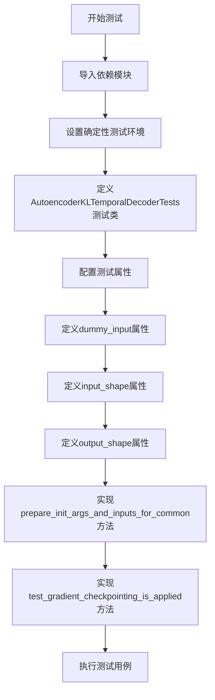
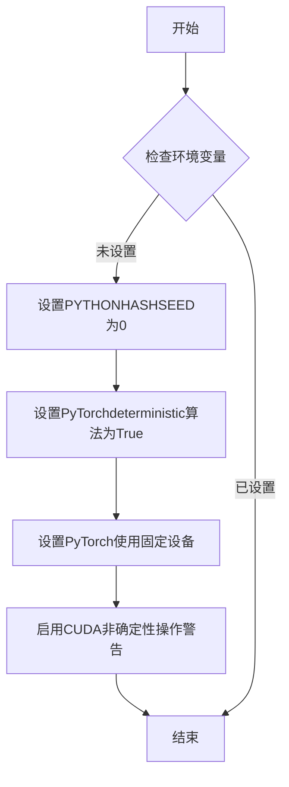
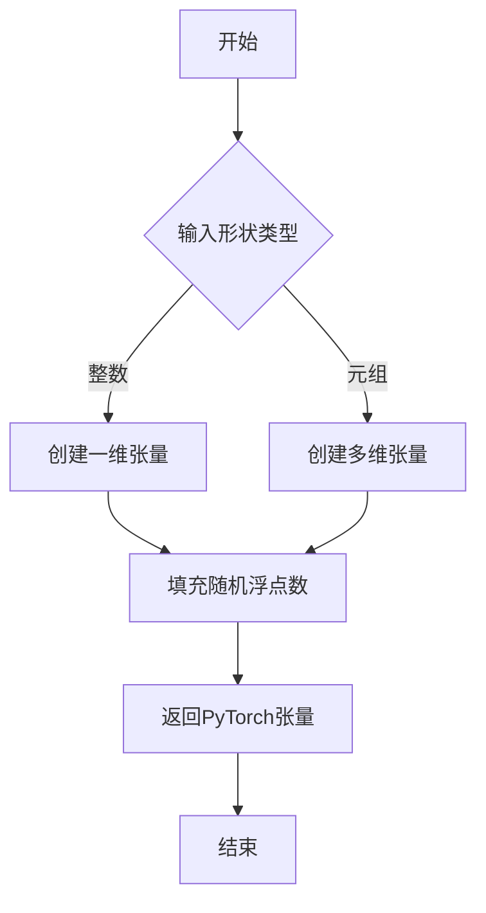
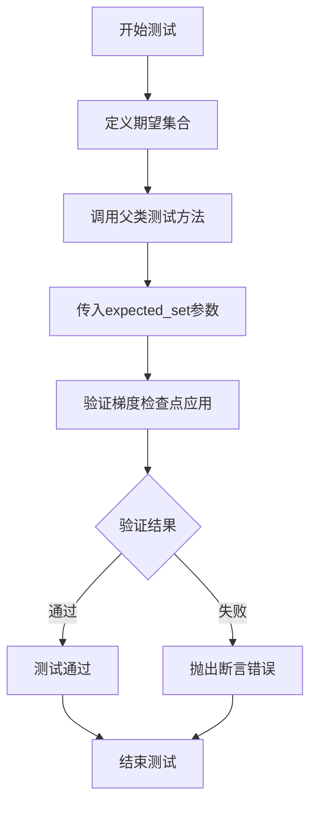

# `diffusers\tests\models\autoencoders\test_models_autoencoder_kl_temporal_decoder.py` 详细设计文档

这是一个用于测试diffusers库中AutoencoderKLTemporalDecoder模型的单元测试文件，通过继承ModelTesterMixin和AutoencoderTesterMixin提供了模型的标准测试用例，包括梯度检查点验证和输入输出形状检查。

## 整体流程



## 类结构

```
unittest.TestCase
├── ModelTesterMixin (混入类)
├── AutoencoderTesterMixin (混入类)
└── AutoencoderKLTemporalDecoderTests (测试类)
```

## 全局变量及字段


### `unittest`
    
Python 标准库单元测试框架

类型：`module`
    


### `AutoencoderKLTemporalDecoder`
    
从 diffusers 导入的模型类，用于视频/图像的 VAE 编码

类型：`class`
    


### `enable_full_determinism`
    
启用完全确定性以确保测试可复现

类型：`function`
    


### `floats_tensor`
    
生成浮点数张量的测试工具函数

类型：`function`
    


### `torch_device`
    
指定测试使用的 PyTorch 设备（CPU/CUDA）

类型：`str`
    


### `ModelTesterMixin`
    
模型测试的通用混入类，提供通用测试方法

类型：`class`
    


### `AutoencoderTesterMixin`
    
自编码器专用的测试混入类

类型：`class`
    


### `AutoencoderKLTemporalDecoderTests.model_class`
    
被测试的模型类，指向 AutoencoderKLTemporalDecoder

类型：`type`
    


### `AutoencoderKLTemporalDecoderTests.main_input_name`
    
主输入参数的名称，此处为 'sample'

类型：`str`
    


### `AutoencoderKLTemporalDecoderTests.base_precision`
    
基础精度阈值，用于数值比较的容差

类型：`float`
    


### `AutoencoderKLTemporalDecoderTests.dummy_input`
    
生成虚拟输入数据，包含图像张量和帧数

类型：`property`
    


### `AutoencoderKLTemporalDecoderTests.input_shape`
    
定义输入形状为 (3, 32, 32)

类型：`property`
    


### `AutoencoderKLTemporalDecoderTests.output_shape`
    
定义输出形状为 (3, 32, 32)

类型：`property`
    
    

## 全局函数及方法


### `enable_full_determinism`

启用完全确定性测试，确保在测试环境中使用固定的随机种子，以实现可重复的测试结果。

参数：此函数不接受任何参数。

返回值：`None`，该函数不返回任何值，主要通过设置全局随机种子和PyTorch后端标志来影响后续的计算过程。

#### 流程图



#### 带注释源码

```python
# 注意：由于源代码未在当前文件中定义，以下为基于常见实现的推断源码
# 实际实现可能位于 testing_utils 模块中

def enable_full_determinism():
    """
    启用完全确定性测试模式。
    
    该函数通过设置多个环境变量和PyTorch配置来确保测试的可重复性：
    - PYTHONHASHSEED: 确保Python哈希随机化一致
    - torch.use_deterministic_algorithms: 强制PyTorch使用确定性算法
    - torch.backends.cudnn.deterministic: 确保CUDA卷积使用确定性算法
    """
    import os
    import torch
    
    # 设置Python哈希种子，确保哈希操作的一致性
    os.environ["PYTHONHASHSEED"] = "0"
    
    # 启用PyTorch确定性算法模式
    torch.use_deterministic_algorithms(True)
    
    # 确保CUDA卷积使用确定性算法（非自动调优模式）
    torch.backends.cudnn.deterministic = True
    
    # 可选：启用CUDA非确定性操作的警告
    # 这有助于识别可能导致不确定性的代码路径
    torch.use_deterministic_algorithms(True, warn_only=True)
```


### `floats_tensor`

生成浮点张量，用于测试目的，创建一个指定形状的随机浮点数 PyTorch 张量。

参数：

- `shape`：`tuple` 或 `int`，张量的形状，可以是一个整数（表示一维张量）或元组（表示多维张量）

返回值：`torch.Tensor`，一个随机浮点数张量

#### 流程图



#### 带注释源码

```python
# 该函数在 testing_utils 模块中定义，此处仅为调用示例
# 从导入的代码片段无法看到 floats_tensor 的完整实现

# 调用示例（来自代码中的实际使用）：
image = floats_tensor((batch_size, num_channels) + sizes).to(torch_device)

# 参数说明：
# (batch_size, num_channels) + sizes = (3, 3, 32, 32)
# 创建一个形状为 (3, 3, 32, 32) 的随机浮点张量
# 并将其移动到 torch_device 上
```


### `torch_device`

`torch_device` 是一个全局变量，用于配置 PyTorch 计算设备（CPU 或 CUDA 设备）。该变量在测试中用于将张量移动到指定的设备上，以确保模型测试在正确的设备上运行。

**类型**：`variable`

**描述**：PyTorch设备配置

**位置**：从 `...testing_utils` 模块导入的全局变量

**使用场景**：在 `dummy_input` 属性中将张量移动到指定的计算设备

```mermaid
flowchart TD
    A[导入 torch_device] --> B[在 dummy_input 中使用]
    B --> C[将 floats_tensor 结果 .to(torch_device)]
    C --> D[返回包含 sample 和 num_frames 的字典]
    
    style A fill:#e1f5fe
    style C fill:#e8f5e8
    style D fill:#fff3e0
```

#### 带注释源码

```python
# 从 testing_utils 模块导入 torch_device 变量
from ...testing_utils import (
    enable_full_determinism,
    floats_tensor,
    torch_device,  # 全局变量：PyTorch设备配置，通常为 'cuda' 或 'cpu'
)
from ..test_modeling_common import ModelTesterMixin
from .testing_utils import AutoencoderTesterMixin

# ...

@property
def dummy_input(self):
    batch_size = 3
    num_channels = 3
    sizes = (32, 32)

    # 使用 torch_device 将生成的随机张量移动到指定设备
    # torch_device 决定了张量存储在 CPU 还是 CUDA 设备上
    image = floats_tensor((batch_size, num_channels) + sizes).to(torch_device)
    num_frames = 3

    return {"sample": image, "num_frames": num_frames}
```

#### 变量详细信息

| 属性 | 值 |
|------|-----|
| **名称** | `torch_device` |
| **类型** | `str` (字符串，通常为 `'cuda'` 或 `'cpu'`) |
| **定义位置** | `diffusers.testing_utils` 模块 |
| **作用域** | 全局变量 |
| **用途** | 指定 PyTorch 张量和模型运行的设备 |
| **使用位置** | `AutoencoderKLTemporalDecoderTests.dummy_input` 属性 |


### `AutoencoderKLTemporalDecoderTests.prepare_init_args_and_inputs_for_common`

准备测试所需的初始化参数和输入数据，用于通用测试场景。该方法构建模型初始化配置字典和测试输入数据，供测试框架验证模型的正确性。

参数：

- 无显式参数（隐式参数 `self`：测试类实例）

返回值：`Tuple[Dict, Dict]`，返回包含模型初始化参数和输入数据的元组
- `init_dict`：字典，模型初始化参数字典，包含编码器块通道数、输入输出通道数、下采样块类型、潜在通道数和每块层数等配置
- `inputs_dict`：字典，模型输入数据字典，包含样本张量和帧数

#### 流程图

```mermaid
flowchart TD
    A[方法开始] --> B[创建 init_dict 字典]
    B --> C[设置 block_out_channels: [32, 64]]
    B --> D[设置 in_channels: 3]
    B --> E[设置 out_channels: 3]
    B --> F[设置 down_block_types: ['DownEncoderBlock2D', 'DownEncoderBlock2D']]
    B --> G[设置 latent_channels: 4]
    B --> H[设置 layers_per_block: 2]
    H --> I[获取 inputs_dict = self.dummy_input]
    I --> J[返回元组 (init_dict, inputs_dict)]
    J --> K[方法结束]
```

#### 带注释源码

```python
def prepare_init_args_and_inputs_for_common(self):
    """
    准备初始化参数和输入数据，用于通用测试场景。
    
    Returns:
        Tuple[Dict, Dict]: 包含初始化参数字典和输入数据字典的元组
    """
    # 定义模型初始化参数字典
    init_dict = {
        "block_out_channels": [32, 64],  # 编码器块输出通道数列表
        "in_channels": 3,                  # 输入图像通道数（RGB）
        "out_channels": 3,                 # 输出图像通道数
        "down_block_types": [              # 下采样块类型列表
            "DownEncoderBlock2D", 
            "DownEncoderBlock2D"
        ],
        "latent_channels": 4,               # 潜在空间通道数（VAE latent维度）
        "layers_per_block": 2,              # 每个编码器块包含的层数
    }
    
    # 从测试类属性获取输入数据（包含样本张量和帧数）
    inputs_dict = self.dummy_input
    
    # 返回初始化参数和输入数据元组
    return init_dict, inputs_dict
```


### `AutoencoderKLTemporalDecoderTests.test_gradient_checkpointing_is_applied`

测试梯度检查点是否正确应用于指定的模块（Encoder、TemporalDecoder、UNetMidBlock2D）。该方法验证在训练过程中，梯度检查点技术是否按预期应用于模型的特定组件，以节省显存。

参数：

- `expected_set`：`set`，期望的包含梯度检查点的模块名称集合，此处为 `{"Encoder", "TemporalDecoder", "UNetMidBlock2D"}`

返回值：`None`，无返回值（测试方法）

#### 流程图



#### 带注释源码

```python
def test_gradient_checkpointing_is_applied(self):
    """
    测试梯度检查点是否应用
    
    该测试方法验证AutoencoderKLTemporalDecoder模型中的
    特定模块是否正确应用了梯度检查点技术。
    梯度检查点是一种通过在反向传播时重新计算中间激活值
    来节省显存的技术。
    """
    # 定义期望应用梯度检查点的模块名称集合
    expected_set = {"Encoder", "TemporalDecoder", "UNetMidBlock2D"}
    
    # 调用父类的测试方法，验证这些模块是否应用了梯度检查点
    # 父类 test_gradient_checkpointing_is_applied 方法会：
    # 1. 启用梯度检查点
    # 2. 执行前向传播
    # 3. 执行反向传播
    # 4. 检查指定模块的 forward 方法是否使用了 checkpoint
    super().test_gradient_checkpointing_is_applied(expected_set=expected_set)
```

#### 关键信息补充

| 项目 | 说明 |
|------|------|
| **所属类** | `AutoencoderKLTemporalDecoderTests` |
| **方法类型** | 单元测试方法 |
| **调用父类** | `ModelTesterMixin.test_gradient_checkpointing_is_applied` |
| **测试目标** | 验证梯度检查点在指定模块上的应用 |
| **依赖模块** | Encoder, TemporalDecoder, UNetMidBlock2D |

## 关键组件


### AutoencoderKLTemporalDecoder 模型类

HuggingFace diffusers 库中的时序解码自动编码器模型，用于视频/图像的潜在空间编码与解码，支持时序信息的处理。

### unittest 测试框架

Python 标准测试框架，提供测试用例组织、断言和执行能力，用于验证模型功能的正确性。

### ModelTesterMixin 混入类

通用模型测试混入，提供模型参数一致性、输出形状验证、梯度计算等标准测试方法。

### AutoencoderTesterMixin 混入类

自动编码器专用测试混入，针对自动编码器架构的特定测试场景。

### 虚拟输入 (dummy_input)

使用 floats_tensor 生成的测试用随机张量，包含 sample (图像) 和 num_frames (帧数) 两个输入，用于模型前向传播测试。

### 梯度检查点测试 (test_gradient_checkpointing_is_applied)

验证模型中 Encoder、TemporalDecoder、UNetMidBlock2D 三个组件是否正确应用了梯度检查点优化技术，以降低显存占用。

### 模型配置参数 (init_dict)

包含 block_out_channels、in_channels、out_channels、down_block_types、latent_channels、layers_per_block 等参数，定义自动编码器的架构拓扑。


## 问题及建议


### 已知问题

-   **测试方法单一**：整个测试类只有一个显式的测试方法 `test_gradient_checkpointing_is_applied`，其他测试逻辑完全依赖父类 Mixin，可能导致测试覆盖不明确，难以快速定位测试行为来源
-   **硬编码配置值**：批量大小、通道数、图像尺寸、帧数等关键参数均为硬编码（如 `batch_size = 3`、`num_frames = 3`、`sizes = (32, 32)`），缺乏参数化测试支持，降低了测试的灵活性和可维护性
-   **缺少文档注释**：测试类及关键方法（`dummy_input`、`prepare_init_args_and_inputs_for_common`）均无文档字符串，增加了新开发者理解测试意图的成本
-   **精度阈值偏低**：`base_precision = 1e-2` 相对较低，可能暗示模型数值稳定性存在潜在问题，需确认是否为预期行为
-   **输入输出形状不匹配风险**：定义 `input_shape` 和 `output_shape` 均为 `(3, 32, 32)`，但根据命名 `AutoencoderKLTemporalDecoder` 通常应包含时序维度，需验证时序信息是否在测试中正确保留

### 优化建议

-   **增加参数化测试**：将关键参数（如 batch_size、num_frames、图像分辨率）提取为类属性或使用 `@parameterized` 装饰器，支持多配置测试
-   **补充文档字符串**：为测试类、属性和方法添加清晰的文档，说明测试目的、预期行为和关键配置参数
-   **拆分混合继承逻辑**：考虑将测试职责局部化，明确哪些测试来自哪个 Mixin，避免对父类行为的过度依赖导致的行为不可预测性
-   **验证时序维度处理**：补充针对 `num_frames` 参数的专项测试，确保时序编码/解码逻辑正确处理帧序列信息
-   **提高精度要求**：在确认模型精度达标的前提下，逐步收紧 `base_precision` 阈值至更高标准（如 `1e-3`），以更快发现精度退化问题

## 其它


### 设计目标与约束

本测试文件旨在验证AutoencoderKLTemporalDecoder模型的功能正确性，包括前向传播、梯度检查点、模型配置等。测试继承自ModelTesterMixin和AutoencoderTesterMixin，需满足base_precision=1e-2的精度要求。测试使用3通道RGB图像，批次大小为3，帧数为3，分辨率为32x32。

### 外部依赖与接口契约

本测试文件依赖以下外部模块：1)diffusers库的AutoencoderKLTemporalDecoder模型类；2)testing_utils模块中的enable_full_determinism(确保可复现性)、floats_tensor(生成随机张量)、torch_device(指定计算设备)函数；3)test_modeling_common模块中的ModelTesterMixin通用模型测试接口；4)testing_utils模块中的AutoencoderTesterMixin自动编码器特定测试接口。

### 测试配置参数

模型初始化参数：block_out_channels=[32,64]定义编码器和解码器的通道数；in_channels=3和out_channels=3表示输入输出图像通道数；down_block_types=["DownEncoderBlock2D","DownEncoderBlock2D"]指定下采样块类型；latent_channels=4定义潜在空间维度；layers_per_block=2指定每 block的层数。

### 输入输出规格

输入规格：batch_size=3，num_channels=3，spatial_size=(32,32)，num_frames=3，输入张量形状为(3,3,32,32)。输出规格：输出张量形状为(3,3,32,32)，与输入保持相同维度。

### 测试用例覆盖范围

测试通过test_gradient_checkpointing_is_applied验证梯度检查点功能是否正确应用于Encoder、TemporalDecoder和UNetMidBlock2D组件。预期集合为{"Encoder","TemporalDecoder","UNetMidBlock2D"}。

### 测试数据生成

dummy_input方法生成测试所需的虚拟输入：使用floats_tensor生成符合正态分布的浮点张量，通过torch_device移至指定计算设备(CPU或GPU)，返回包含sample图像和num_frames的字典。

### 测试继承结构

测试类继承层次：AutoencoderKLTemporalDecoderTests继承unittest.TestCase、ModelTesterMixin和AutoencoderTesterMixin，实现通用模型测试和自动编码器特定测试的组合。

    